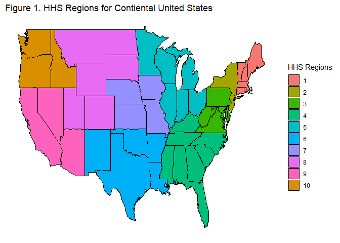

Project 2
================
Yvette Callender
2023-10-09

- [Packages used in this project](#packages-used-in-this-project)
- [Introduction](#introduction)
- [Accessing Data](#accessing-data)
  - [Downloading data](#downloading-data)
  - [Function 1 for HPV Vaccination Coverage: Regional level differences
    between genders with user modification of
    year](#function-1-for-hpv-vaccination-coverage-regional-level-differences-between-genders-with-user-modification-of-year)
  - [Function 2 for HPV Vaccination Coverage: State level differences
    between genders with user modification of
    year](#function-2-for-hpv-vaccination-coverage-state-level-differences-between-genders-with-user-modification-of-year)
  - [Function 3 for Vaccination Coverage for Vaccines other than HPV:
    Regional Level
    Differences](#function-3-for-vaccination-coverage-for-vaccines-other-than-hpv-regional-level-differences)
  - [Function 4 for Vaccination Coverage for Vaccines other than HPV:
    State Level
    Differences](#function-4-for-vaccination-coverage-for-vaccines-other-than-hpv-state-level-differences)
  - [Function 5 for Vaccination Coverage 2018-2022 for Vaccines other
    than HPV or Varicella: State Level
    Differences](#function-5-for-vaccination-coverage-2018-2022-for-vaccines-other-than-hpv-or-varicella-state-level-differences)
  - [Summary of Functions](#summary-of-functions)
- [Exploratory Data Analysis](#exploratory-data-analysis)
  - [Comparing Vaccine Coverage for Tdap and Meningococcal
    Conjugate](#comparing-vaccine-coverage-for-tdap-and-meningococcal-conjugate)
  - [Vaccine Coverage for Meningococcal Conjugate by State
    Requirements](#vaccine-coverage-for-meningococcal-conjugate-by-state-requirements)
  - [Vaccine Coverage for Meningococcal Conjugate in States without
    Mandates](#vaccine-coverage-for-meningococcal-conjugate-in-states-without-mandates)
  - [Vaccine Coverage for Vaccines by
    Region](#vaccine-coverage-for-vaccines-by-region)
  - [Coverage for HPV Vaccines by State and
    Insurance](#coverage-for-hpv-vaccines-by-state-and-insurance)
  - [Summary of Data Analysis](#summary-of-data-analysis)
- [Summary for Project](#summary-for-project)

# Packages used in this project

``` r
library(tidyverse)
library(jsonlite)
library(ggplot2)
```

# Introduction

The API chosen for investigation was data from the Center for Disease
Control relating to [Vaccination Coverage among
Adolescents](https://data.cdc.gov/Teen-Vaccinations/Vaccination-Coverage-among-Adolescents-13-17-Years/ee48-w5t6).
The dataset contains columns for vaccine, dose, geography type
(national, regional, state, and local area), geography name, survey
year, dimension type, dimension, estimated 95%CI, and sample size.
Dimension types include age, race/ethnicity, insurance coverage, poverty
levels, proximity to an urban area, and overall. This suggests areas of
inquiry regarding things like:

- geographical variation in vaccination coverage at regional level or
  state level  
- geographical variation in vaccination coverage differences due to
  race/ethnicity or insurance coverage at the state level  
- variation in vaccination coverage based on the vaccine in question

The vaccines covered by the database include:

- HPV (human papillomavirus)  
- Menigococcal conjugate  
- T or Td (tetanus or tetanus/diptheria)  
- Tdap (tetanus, diptheria, and pertussis) (Replaced Td in 2005)
- Varicella (chicken pox)  
- Hep A (hepatitis A)  
- MMR (measles, mumps, rubella)  
- HepB (hepatitis B)

Parental attitudes may vary a great deal between these vaccines due to
several factors such as perception of the threat being protected against
(chicken pox not as serious as diptheria), whether the threat is
associated with sexual behavior or drug use (HPV or HepB), and whether
the vaccine has received particular attention from the anti-vaccination
activists (MMR). The HPV vaccine may also be perceived as more valuable
to children who are assigned female at birth than those assigned male at
birth.

For HPV, the database uses the `dose` variable as way to track
differential treatment of “male” and “female” children.

In this project, functions were developed to help users query the
dataset about the following:

- HPV Vaccination Coverage: Regional level coverage estimates and
  differences in coverage between genders  
- HPV Vaccination Coverage: State level coverage estimates and
  differences in coverage between genders  
- Vaccination for Vaccines other than HPV: Regional level differences in
  coverage estimates with the option of changing vaccine  
- Vaccination for Vaccines other than HPV: State level differences in
  coverage estimates with the option of changing vaccine  
- Vaccination for Tdap or Meningococcal Conjugate: State level
  differences in coverage estimates with the option of changing
  dimension or vaccine

Geographical information in the database is presented at a state level
and at a regional level. The regions are listed
[here](https://www.hhs.gov/about/agencies/iea/regional-offices/index.html).
They are:

- 1: Connecticut, Maine, Massachusetts, New Hampshire, Rhode Island, and
  Vermont  
- 2: New Jersey, New York, Puerto Rico, and the Virgin Islands  
- 3: Delaware, District of Columbia, Maryland, Pennsylvania, Virginia,
  and West Virginia  
- 4: Alabama, Florida, Georgia, Kentucky, Mississippi, North Carolina,
  South Carolina, and Tennessee
- 5: Illinois, Indiana, Michigan, Minnesota, Ohio, and Wisconsin  
- 6: Arkansas, Louisiana, New Mexico, Oklahoma, and Texas  
- 7: Iowa, Kansas, Missouri, and Nebraska  
- 8: Colorado, Montana, North Dakota, South Dakota, Utah, and Wyoming
- 9: Arizona, California, Hawaii, Nevada, American Samoa, Commonwealth
  of the Northern Mariana Islands, Federated States of Micronesia, Guam,
  Marshall Islands, and Republic of Palau  
- 10:Alaska, Idaho, Oregon, and Washington

These regions are shown visually here.

``` r
#Get mapping data for states
map_data_1 <- map_data("state")

#Add HHS region info for states
map_data_2 <- as_tibble(map_data_1) %>%  
    mutate("HHS_region" =
          (if_else(region %in% c('connecticut', 'maine', 'massachusetts', 
                                'new hampshire', 'rhode island', 'vermont'),"1",
          if_else(region %in% c('new jersey', 'new york', "puerto rico", "u.s. virgin islands"),"2",
          if_else(region %in% c('delaware','district of columbia', 'maryland', 'pennsylvania', 'virginia',
                                'west virginia'),"3",
          if_else(region %in% c('alabama', 'florida','georgia','kentucky', 'mississippi','north carolina',
                                'south carolina','tennessee'),"4",
          if_else(region %in% c('illinois','indiana', 'michigan', 'minnesota', 'ohio', 
                                'wisconsin'),"5",
          if_else(region %in% c('arkansas', 'louisiana', 'oklahoma', 'new mexico','texas'),"6",
          if_else(region %in% c('iowa', 'kansas','missouri', 'nebraska'),"7",
          if_else(region %in% c('colorado', 'montana','north dakota', 'south dakota',  
                                'utah', 'wyoming'),"8",
          if_else(region %in% c('arizona', 'california', 'hawaii', 'nevada', "guam") ,"9",
          if_else(region %in% c('alaska', 'idaho', 'oregon', 
                                'washington') ,"10","error"))))))))))))

#Make plot
ggplot(map_data_2, aes (x = long, y = lat, group = group)) +
    geom_polygon(aes(fill = HHS_region), color = "black") +
#Removes lat and long labels and grid
    theme(axis.text = element_blank(),                  
          axis.ticks = element_blank(),
          axis.title = element_blank(),
          rect = element_blank())+
#Add title
    labs(title = "Figure 1. HHS Regions for Contiental United States") +
#Change legend title
    guides(fill = guide_legend(title = "HHS Regions")) +
#Reorder legend
      scale_fill_discrete(breaks = c('1','2','3','4','5','6','7','8','9','10')) 
```

<!-- -->

# Accessing Data

## Downloading data

The dataset for [Vaccination Coverage among
Adolescents](https://data.cdc.gov/Teen-Vaccinations/Vaccination-Coverage-among-Adolescents-13-17-Years/ee48-w5t6)
was converted from a JSON object to and R object using `fromJSON` which
is in the `jsonlite` package. The dataset currently contains \>25,000
lines (which is greater than the default for from JSON), so the function
call needed an explicit limit.

``` r
vaccine_API <- fromJSON("https://data.cdc.gov/resource/ee48-w5t6.json?$limit=50000") %>% as_tibble

#Verify the number of rows is less than 50000 (that the limit was sufficient to retrieve the complete dataset).

nrow(vaccine_API)
```

    ## [1] 25033

``` r
vaccine_API
```

<div data-pagedtable="false">

<script data-pagedtable-source type="application/json">
{"columns":[{"label":["vaccine"],"name":[1],"type":["chr"],"align":["left"]},{"label":["dose"],"name":[2],"type":["chr"],"align":["left"]},{"label":["geography_type"],"name":[3],"type":["chr"],"align":["left"]},{"label":["geography"],"name":[4],"type":["chr"],"align":["left"]},{"label":["year_season"],"name":[5],"type":["chr"],"align":["left"]},{"label":["dimension_type"],"name":[6],"type":["chr"],"align":["left"]},{"label":["dimension"],"name":[7],"type":["chr"],"align":["left"]},{"label":["coverage_estimate"],"name":[8],"type":["chr"],"align":["left"]},{"label":["_95_ci"],"name":[9],"type":["chr"],"align":["left"]},{"label":["population_sample_size"],"name":[10],"type":["chr"],"align":["left"]}],"data":[{"1":"HPV","2":">=1 Dose, Females","3":"HHS Regions/National","4":"United States","5":"2006","6":"Age","7":"13-17 Years","8":"1.0","9":"0.6 to 1.8","10":"1335"},{"1":"HPV","2":">=1 Dose, Females","3":"HHS Regions/National","4":"United States","5":"2007","6":"Age","7":"13-17 Years","8":"25.1","9":"22.3 to 28.1","10":"1441"},{"1":"HPV","2":">=1 Dose, Females","3":"HHS Regions/National","4":"Region 1","5":"2007","6":"Age","7":"13-17 Years","8":"37.6","9":"25.7 to 51.2","10":"90"},{"1":"HPV","2":">=1 Dose, Females","3":"HHS Regions/National","4":"Region 2","5":"2007","6":"Age","7":"13-17 Years","8":"38.2","9":"28.1 to 49.5","10":"105"},{"1":"HPV","2":">=1 Dose, Females","3":"HHS Regions/National","4":"Region 3","5":"2007","6":"Age","7":"13-17 Years","8":"27.1","9":"19.5 to 36.3","10":"183"},{"1":"HPV","2":">=1 Dose, Females","3":"HHS Regions/National","4":"Region 4","5":"2007","6":"Age","7":"13-17 Years","8":"21.0","9":"15.5 to 27.8","10":"262"},{"1":"HPV","2":">=1 Dose, Females","3":"HHS Regions/National","4":"Region 5","5":"2007","6":"Age","7":"13-17 Years","8":"20.3","9":"15.2 to 26.6","10":"281"},{"1":"HPV","2":">=1 Dose, Females","3":"HHS Regions/National","4":"Region 6","5":"2007","6":"Age","7":"13-17 Years","8":"22.9","9":"15.5 to 32.7","10":"156"},{"1":"HPV","2":">=1 Dose, Females","3":"HHS Regions/National","4":"Region 7","5":"2007","6":"Age","7":"13-17 Years","8":"22.9","9":"14.6 to 34.0","10":"81"},{"1":"HPV","2":">=1 Dose, Females","3":"HHS Regions/National","4":"Region 8","5":"2007","6":"Age","7":"13-17 Years","8":"20.3","9":"11.6 to 33.1","10":"54"},{"1":"HPV","2":">=1 Dose, Females","3":"HHS Regions/National","4":"Region 9","5":"2007","6":"Age","7":"13-17 Years","8":"29.0","9":"20.5 to 39.2","10":"170"},{"1":"HPV","2":">=1 Dose, Females","3":"States/Local Areas","4":"Alabama","5":"2008","6":"Age","7":"13-17 Years","8":"32.8","9":"25.5 to 41.1","10":"185"},{"1":"HPV","2":">=1 Dose, Females","3":"States/Local Areas","4":"Alaska","5":"2008","6":"Age","7":"13-17 Years","8":"38.8","9":"30.6 to 47.8","10":"149"},{"1":"HPV","2":">=1 Dose, Females","3":"States/Local Areas","4":"Arizona","5":"2008","6":"Age","7":"13-17 Years","8":"50.5","9":"40.3 to 60.7","10":"120"},{"1":"HPV","2":">=1 Dose, Females","3":"States/Local Areas","4":"Arkansas","5":"2008","6":"Age","7":"13-17 Years","8":"22.4","9":"16.2 to 30.2","10":"185"},{"1":"HPV","2":">=1 Dose, Females","3":"States/Local Areas","4":"California","5":"2008","6":"Age","7":"13-17 Years","8":"46.6","9":"36.1 to 57.5","10":"150"},{"1":"HPV","2":">=1 Dose, Females","3":"States/Local Areas","4":"Colorado","5":"2008","6":"Age","7":"13-17 Years","8":"33.5","9":"25.6 to 42.6","10":"181"},{"1":"HPV","2":">=1 Dose, Females","3":"States/Local Areas","4":"Connecticut","5":"2008","6":"Age","7":"13-17 Years","8":"45.0","9":"35.6 to 54.8","10":"143"},{"1":"HPV","2":">=1 Dose, Females","3":"States/Local Areas","4":"Delaware","5":"2008","6":"Age","7":"13-17 Years","8":"46.8","9":"37.9 to 56.0","10":"164"},{"1":"HPV","2":">=1 Dose, Females","3":"States/Local Areas","4":"District of Columbia","5":"2008","6":"Age","7":"13-17 Years","8":"38.7","9":"30.0 to 48.3","10":"161"},{"1":"HPV","2":">=1 Dose, Females","3":"States/Local Areas","4":"Florida","5":"2008","6":"Age","7":"13-17 Years","8":"36.7","9":"26.8 to 48.0","10":"149"},{"1":"HPV","2":">=1 Dose, Females","3":"States/Local Areas","4":"Georgia","5":"2008","6":"Age","7":"13-17 Years","8":"18.5","9":"13.0 to 25.6","10":"167"},{"1":"HPV","2":">=1 Dose, Females","3":"States/Local Areas","4":"Hawaii","5":"2008","6":"Age","7":"13-17 Years","8":"40.2","9":"32.3 to 48.6","10":"162"},{"1":"HPV","2":">=1 Dose, Females","3":"States/Local Areas","4":"Idaho","5":"2008","6":"Age","7":"13-17 Years","8":"28.4","9":"20.5 to 38.0","10":"131"},{"1":"HPV","2":">=1 Dose, Females","3":"States/Local Areas","4":"Illinois","5":"2008","6":"Age","7":"13-17 Years","8":"27.0","9":"20.8 to 34.2","10":"373"},{"1":"HPV","2":">=1 Dose, Females","3":"States/Local Areas","4":"IL-City of Chicago","5":"2008","6":"Age","7":"13-17 Years","8":"28.6","9":"20.8 to 37.9","10":"173"},{"1":"HPV","2":">=1 Dose, Females","3":"States/Local Areas","4":"IL-Rest of state","5":"2008","6":"Age","7":"13-17 Years","8":"26.6","9":"19.2 to 35.6","10":"200"},{"1":"HPV","2":">=1 Dose, Females","3":"States/Local Areas","4":"Indiana","5":"2008","6":"Age","7":"13-17 Years","8":"26.1","9":"19.8 to 33.6","10":"173"},{"1":"HPV","2":">=1 Dose, Females","3":"States/Local Areas","4":"Iowa","5":"2008","6":"Age","7":"13-17 Years","8":"41.9","9":"32.6 to 51.9","10":"127"},{"1":"HPV","2":">=1 Dose, Females","3":"States/Local Areas","4":"Kansas","5":"2008","6":"Age","7":"13-17 Years","8":"30.1","9":"21.8 to 40.0","10":"137"},{"1":"HPV","2":">=1 Dose, Females","3":"States/Local Areas","4":"Kentucky","5":"2008","6":"Age","7":"13-17 Years","8":"26.3","9":"18.8 to 35.4","10":"133"},{"1":"HPV","2":">=1 Dose, Females","3":"States/Local Areas","4":"Louisiana","5":"2008","6":"Age","7":"13-17 Years","8":"36.6","9":"28.3 to 45.6","10":"179"},{"1":"HPV","2":">=1 Dose, Females","3":"States/Local Areas","4":"Maine","5":"2008","6":"Age","7":"13-17 Years","8":"40.3","9":"32.2 to 49.0","10":"169"},{"1":"HPV","2":">=1 Dose, Females","3":"States/Local Areas","4":"Maryland","5":"2008","6":"Age","7":"13-17 Years","8":"41.1","9":"32.4 to 50.5","10":"198"},{"1":"HPV","2":">=1 Dose, Females","3":"States/Local Areas","4":"Massachusetts","5":"2008","6":"Age","7":"13-17 Years","8":"53.3","9":"43.8 to 62.6","10":"152"},{"1":"HPV","2":">=1 Dose, Females","3":"States/Local Areas","4":"Michigan","5":"2008","6":"Age","7":"13-17 Years","8":"32.3","9":"23.8 to 42.1","10":"143"},{"1":"HPV","2":">=1 Dose, Females","3":"States/Local Areas","4":"Minnesota","5":"2008","6":"Age","7":"13-17 Years","8":"33.6","9":"26.4 to 41.6","10":"167"},{"1":"HPV","2":">=1 Dose, Females","3":"States/Local Areas","4":"Mississippi","5":"2008","6":"Age","7":"13-17 Years","8":"15.8","9":"10.6 to 23.0","10":"187"},{"1":"HPV","2":">=1 Dose, Females","3":"States/Local Areas","4":"Missouri","5":"2008","6":"Age","7":"13-17 Years","8":"31.6","9":"23.8 to 40.7","10":"158"},{"1":"HPV","2":">=1 Dose, Females","3":"States/Local Areas","4":"Montana","5":"2008","6":"Age","7":"13-17 Years","8":"17.8","9":"12.0 to 25.5","10":"142"},{"1":"HPV","2":">=1 Dose, Females","3":"States/Local Areas","4":"Nebraska","5":"2008","6":"Age","7":"13-17 Years","8":"29.5","9":"23.0 to 37.0","10":"186"},{"1":"HPV","2":">=1 Dose, Females","3":"States/Local Areas","4":"Nevada","5":"2008","6":"Age","7":"13-17 Years","8":"30.0","9":"21.2 to 40.5","10":"117"},{"1":"HPV","2":">=1 Dose, Females","3":"States/Local Areas","4":"New Hampshire","5":"2008","6":"Age","7":"13-17 Years","8":"54.4","9":"44.3 to 64.1","10":"151"},{"1":"HPV","2":">=1 Dose, Females","3":"States/Local Areas","4":"New Jersey","5":"2008","6":"Age","7":"13-17 Years","8":"43.0","9":"34.3 to 52.1","10":"187"},{"1":"HPV","2":">=1 Dose, Females","3":"States/Local Areas","4":"New Mexico","5":"2008","6":"Age","7":"13-17 Years","8":"48.3","9":"38.4 to 58.4","10":"143"},{"1":"HPV","2":">=1 Dose, Females","3":"States/Local Areas","4":"New York","5":"2008","6":"Age","7":"13-17 Years","8":"50.2","9":"43.1 to 57.3","10":"270"},{"1":"HPV","2":">=1 Dose, Females","3":"States/Local Areas","4":"NY-City of New York","5":"2008","6":"Age","7":"13-17 Years","8":"48.3","9":"38.0 to 58.7","10":"135"},{"1":"HPV","2":">=1 Dose, Females","3":"States/Local Areas","4":"NY-Rest of state","5":"2008","6":"Age","7":"13-17 Years","8":"51.5","9":"41.9 to 61.0","10":"135"},{"1":"HPV","2":">=1 Dose, Females","3":"States/Local Areas","4":"North Carolina","5":"2008","6":"Age","7":"13-17 Years","8":"34.4","9":"26.3 to 43.6","10":"157"},{"1":"HPV","2":">=1 Dose, Females","3":"States/Local Areas","4":"North Dakota","5":"2008","6":"Age","7":"13-17 Years","8":"28.7","9":"21.9 to 36.7","10":"177"},{"1":"HPV","2":">=1 Dose, Females","3":"States/Local Areas","4":"Ohio","5":"2008","6":"Age","7":"13-17 Years","8":"29.1","9":"21.6 to 37.9","10":"154"},{"1":"HPV","2":">=1 Dose, Females","3":"States/Local Areas","4":"Oklahoma","5":"2008","6":"Age","7":"13-17 Years","8":"35.5","9":"27.3 to 44.7","10":"141"},{"1":"HPV","2":">=1 Dose, Females","3":"States/Local Areas","4":"Oregon","5":"2008","6":"Age","7":"13-17 Years","8":"34.8","9":"25.6 to 45.3","10":"106"},{"1":"HPV","2":">=1 Dose, Females","3":"States/Local Areas","4":"Pennsylvania","5":"2008","6":"Age","7":"13-17 Years","8":"46.1","9":"38.7 to 53.7","10":"346"},{"1":"HPV","2":">=1 Dose, Females","3":"States/Local Areas","4":"PA-Philadelphia","5":"2008","6":"Age","7":"13-17 Years","8":"51.8","9":"43.3 to 60.3","10":"178"},{"1":"HPV","2":">=1 Dose, Females","3":"States/Local Areas","4":"PA-Rest of state","5":"2008","6":"Age","7":"13-17 Years","8":"45.2","9":"36.8 to 53.9","10":"168"},{"1":"HPV","2":">=1 Dose, Females","3":"HHS Regions/National","4":"United States","5":"2008","6":"Age","7":"13-17 Years","8":"37.2","9":"35.1 to 39.3","10":"8607"},{"1":"HPV","2":">=1 Dose, Females","3":"HHS Regions/National","4":"Region 1","5":"2008","6":"Age","7":"13-17 Years","8":"50.1","9":"45.0 to 55.2","10":"911"},{"1":"HPV","2":">=1 Dose, Females","3":"HHS Regions/National","4":"Region 2","5":"2008","6":"Age","7":"13-17 Years","8":"48.0","9":"42.3 to 53.7","10":"457"},{"1":"HPV","2":">=1 Dose, Females","3":"HHS Regions/National","4":"Region 3","5":"2008","6":"Age","7":"13-17 Years","8":"42.8","9":"38.4 to 47.4","10":"1176"},{"1":"HPV","2":">=1 Dose, Females","3":"HHS Regions/National","4":"Region 4","5":"2008","6":"Age","7":"13-17 Years","8":"28.9","9":"25.3 to 32.8","10":"1333"},{"1":"HPV","2":">=1 Dose, Females","3":"HHS Regions/National","4":"Region 5","5":"2008","6":"Age","7":"13-17 Years","8":"31.2","9":"27.8 to 34.8","10":"1123"},{"1":"HPV","2":">=1 Dose, Females","3":"HHS Regions/National","4":"Region 6","5":"2008","6":"Age","7":"13-17 Years","8":"32.8","9":"26.8 to 39.4","10":"1018"},{"1":"HPV","2":">=1 Dose, Females","3":"HHS Regions/National","4":"Region 7","5":"2008","6":"Age","7":"13-17 Years","8":"33.3","9":"28.6 to 38.3","10":"608"},{"1":"HPV","2":">=1 Dose, Females","3":"HHS Regions/National","4":"Region 8","5":"2008","6":"Age","7":"13-17 Years","8":"28.3","9":"23.9 to 33.1","10":"911"},{"1":"HPV","2":">=1 Dose, Females","3":"HHS Regions/National","4":"Region 9","5":"2008","6":"Age","7":"13-17 Years","8":"46.1","9":"37.6 to 54.9","10":"549"},{"1":"HPV","2":">=1 Dose, Females","3":"States/Local Areas","4":"Rhode Island","5":"2008","6":"Age","7":"13-17 Years","8":"54.7","9":"44.2 to 64.8","10":"152"},{"1":"HPV","2":">=1 Dose, Females","3":"States/Local Areas","4":"South Carolina","5":"2008","6":"Age","7":"13-17 Years","8":"18.7","9":"13.2 to 25.9","10":"183"},{"1":"HPV","2":">=1 Dose, Females","3":"States/Local Areas","4":"South Dakota","5":"2008","6":"Age","7":"13-17 Years","8":"45.9","9":"37.9 to 54.1","10":"178"},{"1":"HPV","2":">=1 Dose, Females","3":"States/Local Areas","4":"Tennessee","5":"2008","6":"Age","7":"13-17 Years","8":"29.6","9":"21.5 to 39.3","10":"172"},{"1":"HPV","2":">=1 Dose, Females","3":"States/Local Areas","4":"Texas","5":"2008","6":"Age","7":"13-17 Years","8":"31.6","9":"23.2 to 41.5","10":"370"},{"1":"HPV","2":">=1 Dose, Females","3":"States/Local Areas","4":"TX-Bexar County","5":"2008","6":"Age","7":"13-17 Years","8":"40.7","9":"30.6 to 51.7","10":"114"},{"1":"HPV","2":">=1 Dose, Females","3":"States/Local Areas","4":"TX-City of Houston","5":"2008","6":"Age","7":"13-17 Years","8":"30.2","9":"20.3 to 42.4","10":"102"},{"1":"HPV","2":">=1 Dose, Females","3":"States/Local Areas","4":"TX-Rest of state","5":"2008","6":"Age","7":"13-17 Years","8":"31.1","9":"21.4 to 42.7","10":"154"},{"1":"HPV","2":">=1 Dose, Females","3":"HHS Regions/National","4":"Region 10","5":"2008","6":"Age","7":"13-17 Years","8":"40.3","9":"34.4 to 46.5","10":"521"},{"1":"HPV","2":">=1 Dose, Females","3":"States/Local Areas","4":"Utah","5":"2008","6":"Age","7":"13-17 Years","8":"17.1","9":"10.3 to 27.2","10":"109"},{"1":"HPV","2":">=1 Dose, Females","3":"States/Local Areas","4":"Vermont","5":"2008","6":"Age","7":"13-17 Years","8":"50.4","9":"40.9 to 59.8","10":"144"},{"1":"HPV","2":">=1 Dose, Females","3":"States/Local Areas","4":"Virginia","5":"2008","6":"Age","7":"13-17 Years","8":"40.6","9":"31.9 to 50.0","10":"151"},{"1":"HPV","2":">=1 Dose, Females","3":"States/Local Areas","4":"Washington","5":"2008","6":"Age","7":"13-17 Years","8":"46.5","9":"37.1 to 56.1","10":"135"},{"1":"HPV","2":">=1 Dose, Females","3":"States/Local Areas","4":"West Virginia","5":"2008","6":"Age","7":"13-17 Years","8":"33.6","9":"25.7 to 42.6","10":"156"},{"1":"HPV","2":">=1 Dose, Females","3":"States/Local Areas","4":"Wisconsin","5":"2008","6":"Age","7":"13-17 Years","8":"47.0","9":"37.0 to 57.1","10":"113"},{"1":"HPV","2":">=1 Dose, Females","3":"States/Local Areas","4":"Wyoming","5":"2008","6":"Age","7":"13-17 Years","8":"36.2","9":"27.7 to 45.7","10":"124"},{"1":"HPV","2":">=1 Dose, Females","3":"States/Local Areas","4":"Alabama","5":"2009","6":"Age","7":"13-17 Years","8":"49.4","9":"40.8 to 58.1","10":"166"},{"1":"HPV","2":">=1 Dose, Females","3":"States/Local Areas","4":"Alaska","5":"2009","6":"Age","7":"13-17 Years","8":"40.8","9":"31.7 to 50.6","10":"136"},{"1":"HPV","2":">=1 Dose, Females","3":"States/Local Areas","4":"Arizona","5":"2009","6":"Age","7":"13-17 Years","8":"52.8","9":"43.6 to 61.7","10":"184"},{"1":"HPV","2":">=1 Dose, Females","3":"States/Local Areas","4":"Arkansas","5":"2009","6":"Age","7":"13-17 Years","8":"34.6","9":"26.6 to 43.5","10":"176"},{"1":"HPV","2":">=1 Dose, Females","3":"States/Local Areas","4":"California","5":"2009","6":"Age","7":"13-17 Years","8":"49.2","9":"39.9 to 58.6","10":"190"},{"1":"HPV","2":">=1 Dose, Females","3":"States/Local Areas","4":"Colorado","5":"2009","6":"Age","7":"13-17 Years","8":"52.7","9":"43.7 to 61.4","10":"198"},{"1":"HPV","2":">=1 Dose, Females","3":"States/Local Areas","4":"Connecticut","5":"2009","6":"Age","7":"13-17 Years","8":"61.2","9":"52.7 to 69.2","10":"191"},{"1":"HPV","2":">=1 Dose, Females","3":"States/Local Areas","4":"Delaware","5":"2009","6":"Age","7":"13-17 Years","8":"51.5","9":"42.4 to 60.5","10":"186"},{"1":"HPV","2":">=1 Dose, Females","3":"States/Local Areas","4":"District of Columbia","5":"2009","6":"Age","7":"13-17 Years","8":"60.0","9":"51.4 to 68.0","10":"198"},{"1":"HPV","2":">=1 Dose, Females","3":"States/Local Areas","4":"Florida","5":"2009","6":"Age","7":"13-17 Years","8":"39.3","9":"31.3 to 48.0","10":"216"},{"1":"HPV","2":">=1 Dose, Females","3":"States/Local Areas","4":"Georgia","5":"2009","6":"Age","7":"13-17 Years","8":"38.6","9":"30.8 to 47.1","10":"182"},{"1":"HPV","2":">=1 Dose, Females","3":"States/Local Areas","4":"Hawaii","5":"2009","6":"Age","7":"13-17 Years","8":"65.0","9":"55.2 to 73.6","10":"115"},{"1":"HPV","2":">=1 Dose, Females","3":"States/Local Areas","4":"Idaho","5":"2009","6":"Age","7":"13-17 Years","8":"30.2","9":"21.0 to 41.4","10":"105"},{"1":"HPV","2":">=1 Dose, Females","3":"States/Local Areas","4":"Illinois","5":"2009","6":"Age","7":"13-17 Years","8":"34.3","9":"28.0 to 41.3","10":"365"},{"1":"HPV","2":">=1 Dose, Females","3":"States/Local Areas","4":"IL-City of Chicago","5":"2009","6":"Age","7":"13-17 Years","8":"36.2","9":"28.8 to 44.2","10":"199"},{"1":"HPV","2":">=1 Dose, Females","3":"States/Local Areas","4":"IL-Rest of state","5":"2009","6":"Age","7":"13-17 Years","8":"33.8","9":"26.2 to 42.4","10":"166"},{"1":"HPV","2":">=1 Dose, Females","3":"States/Local Areas","4":"Indiana","5":"2009","6":"Age","7":"13-17 Years","8":"37.1","9":"30.2 to 44.6","10":"404"},{"1":"HPV","2":">=1 Dose, Females","3":"States/Local Areas","4":"Iowa","5":"2009","6":"Age","7":"13-17 Years","8":"42.4","9":"34.3 to 51.1","10":"174"},{"1":"HPV","2":">=1 Dose, Females","3":"States/Local Areas","4":"Kansas","5":"2009","6":"Age","7":"13-17 Years","8":"44.1","9":"33.9 to 54.9","10":"117"},{"1":"HPV","2":">=1 Dose, Females","3":"States/Local Areas","4":"Kentucky","5":"2009","6":"Age","7":"13-17 Years","8":"31.0","9":"23.8 to 39.2","10":"176"},{"1":"HPV","2":">=1 Dose, Females","3":"States/Local Areas","4":"Louisiana","5":"2009","6":"Age","7":"13-17 Years","8":"48.6","9":"37.6 to 59.7","10":"127"},{"1":"HPV","2":">=1 Dose, Females","3":"States/Local Areas","4":"Maine","5":"2009","6":"Age","7":"13-17 Years","8":"44.4","9":"35.3 to 53.8","10":"140"},{"1":"HPV","2":">=1 Dose, Females","3":"States/Local Areas","4":"Maryland","5":"2009","6":"Age","7":"13-17 Years","8":"39.6","9":"28.7 to 51.6","10":"110"},{"1":"HPV","2":">=1 Dose, Females","3":"States/Local Areas","4":"Massachusetts","5":"2009","6":"Age","7":"13-17 Years","8":"69.0","9":"60.4 to 76.5","10":"181"},{"1":"HPV","2":">=1 Dose, Females","3":"States/Local Areas","4":"Michigan","5":"2009","6":"Age","7":"13-17 Years","8":"39.0","9":"31.5 to 47.1","10":"220"},{"1":"HPV","2":">=1 Dose, Females","3":"States/Local Areas","4":"Minnesota","5":"2009","6":"Age","7":"13-17 Years","8":"44.9","9":"36.5 to 53.5","10":"164"},{"1":"HPV","2":">=1 Dose, Females","3":"States/Local Areas","4":"Mississippi","5":"2009","6":"Age","7":"13-17 Years","8":"22.9","9":"16.5 to 30.9","10":"191"},{"1":"HPV","2":">=1 Dose, Females","3":"States/Local Areas","4":"Missouri","5":"2009","6":"Age","7":"13-17 Years","8":"32.7","9":"25.5 to 40.8","10":"173"},{"1":"HPV","2":">=1 Dose, Females","3":"States/Local Areas","4":"Montana","5":"2009","6":"Age","7":"13-17 Years","8":"35.0","9":"26.8 to 44.2","10":"146"},{"1":"HPV","2":">=1 Dose, Females","3":"States/Local Areas","4":"Nebraska","5":"2009","6":"Age","7":"13-17 Years","8":"49.4","9":"40.2 to 58.6","10":"143"},{"1":"HPV","2":">=1 Dose, Females","3":"States/Local Areas","4":"Nevada","5":"2009","6":"Age","7":"13-17 Years","8":"39.0","9":"30.2 to 48.4","10":"159"},{"1":"HPV","2":">=1 Dose, Females","3":"States/Local Areas","4":"New Hampshire","5":"2009","6":"Age","7":"13-17 Years","8":"60.0","9":"51.3 to 68.2","10":"150"},{"1":"HPV","2":">=1 Dose, Females","3":"States/Local Areas","4":"New Jersey","5":"2009","6":"Age","7":"13-17 Years","8":"42.2","9":"34.4 to 50.4","10":"197"},{"1":"HPV","2":">=1 Dose, Females","3":"States/Local Areas","4":"New Mexico","5":"2009","6":"Age","7":"13-17 Years","8":"53.1","9":"45.0 to 60.9","10":"195"},{"1":"HPV","2":">=1 Dose, Females","3":"States/Local Areas","4":"New York","5":"2009","6":"Age","7":"13-17 Years","8":"48.8","9":"41.4 to 56.3","10":"262"},{"1":"HPV","2":">=1 Dose, Females","3":"States/Local Areas","4":"NY-City of New York","5":"2009","6":"Age","7":"13-17 Years","8":"43.2","9":"32.4 to 54.7","10":"137"},{"1":"HPV","2":">=1 Dose, Females","3":"States/Local Areas","4":"NY-Rest of state","5":"2009","6":"Age","7":"13-17 Years","8":"52.6","9":"42.8 to 62.2","10":"125"},{"1":"HPV","2":">=1 Dose, Females","3":"States/Local Areas","4":"North Carolina","5":"2009","6":"Age","7":"13-17 Years","8":"50.3","9":"40.9 to 59.6","10":"157"},{"1":"HPV","2":">=1 Dose, Females","3":"States/Local Areas","4":"North Dakota","5":"2009","6":"Age","7":"13-17 Years","8":"45.1","9":"36.0 to 54.6","10":"133"},{"1":"HPV","2":">=1 Dose, Females","3":"States/Local Areas","4":"Ohio","5":"2009","6":"Age","7":"13-17 Years","8":"40.6","9":"31.8 to 49.9","10":"176"},{"1":"HPV","2":">=1 Dose, Females","3":"States/Local Areas","4":"Oklahoma","5":"2009","6":"Age","7":"13-17 Years","8":"40.1","9":"31.9 to 48.9","10":"158"},{"1":"HPV","2":">=1 Dose, Females","3":"States/Local Areas","4":"Oregon","5":"2009","6":"Age","7":"13-17 Years","8":"52.9","9":"45.2 to 60.5","10":"200"},{"1":"HPV","2":">=1 Dose, Females","3":"States/Local Areas","4":"Pennsylvania","5":"2009","6":"Age","7":"13-17 Years","8":"53.2","9":"43.8 to 62.4","10":"262"},{"1":"HPV","2":">=1 Dose, Females","3":"States/Local Areas","4":"PA-Philadelphia","5":"2009","6":"Age","7":"13-17 Years","8":"58.2","9":"49.1 to 66.8","10":"148"},{"1":"HPV","2":">=1 Dose, Females","3":"States/Local Areas","4":"PA-Rest of state","5":"2009","6":"Age","7":"13-17 Years","8":"52.4","9":"41.6 to 62.9","10":"114"},{"1":"HPV","2":">=1 Dose, Females","3":"HHS Regions/National","4":"United States","5":"2009","6":"Age","7":"13-17 Years","8":"44.3","9":"42.4 to 46.1","10":"9621"},{"1":"HPV","2":">=1 Dose, Females","3":"HHS Regions/National","4":"Region 1","5":"2009","6":"Age","7":"13-17 Years","8":"63.6","9":"59.0 to 67.8","10":"1022"},{"1":"HPV","2":">=1 Dose, Females","3":"HHS Regions/National","4":"Region 2","5":"2009","6":"Age","7":"13-17 Years","8":"46.8","9":"41.1 to 52.5","10":"459"},{"1":"HPV","2":">=1 Dose, Females","3":"HHS Regions/National","4":"Region 3","5":"2009","6":"Age","7":"13-17 Years","8":"45.3","9":"40.1 to 50.6","10":"1049"},{"1":"HPV","2":">=1 Dose, Females","3":"HHS Regions/National","4":"Region 4","5":"2009","6":"Age","7":"13-17 Years","8":"39.8","9":"36.4 to 43.4","10":"1416"},{"1":"HPV","2":">=1 Dose, Females","3":"HHS Regions/National","4":"Region 5","5":"2009","6":"Age","7":"13-17 Years","8":"39.6","9":"36.2 to 43.1","10":"1507"},{"1":"HPV","2":">=1 Dose, Females","3":"HHS Regions/National","4":"Region 6","5":"2009","6":"Age","7":"13-17 Years","8":"39.7","9":"35.1 to 44.6","10":"1352"},{"1":"HPV","2":">=1 Dose, Females","3":"HHS Regions/National","4":"Region 7","5":"2009","6":"Age","7":"13-17 Years","8":"39.4","9":"34.8 to 44.2","10":"607"},{"1":"HPV","2":">=1 Dose, Females","3":"HHS Regions/National","4":"Region 8","5":"2009","6":"Age","7":"13-17 Years","8":"45.2","9":"40.3 to 50.2","10":"962"},{"1":"HPV","2":">=1 Dose, Females","3":"HHS Regions/National","4":"Region 9","5":"2009","6":"Age","7":"13-17 Years","8":"49.5","9":"42.0 to 57.1","10":"648"},{"1":"HPV","2":">=1 Dose, Females","3":"States/Local Areas","4":"Rhode Island","5":"2009","6":"Age","7":"13-17 Years","8":"68.3","9":"58.9 to 76.4","10":"176"},{"1":"HPV","2":">=1 Dose, Females","3":"States/Local Areas","4":"South Carolina","5":"2009","6":"Age","7":"13-17 Years","8":"28.5","9":"21.0 to 37.4","10":"148"},{"1":"HPV","2":">=1 Dose, Females","3":"States/Local Areas","4":"South Dakota","5":"2009","6":"Age","7":"13-17 Years","8":"62.4","9":"53.2 to 70.8","10":"142"},{"1":"HPV","2":">=1 Dose, Females","3":"States/Local Areas","4":"Tennessee","5":"2009","6":"Age","7":"13-17 Years","8":"43.6","9":"35.4 to 52.1","10":"180"},{"1":"HPV","2":">=1 Dose, Females","3":"States/Local Areas","4":"Texas","5":"2009","6":"Age","7":"13-17 Years","8":"37.6","9":"31.3 to 44.5","10":"696"},{"1":"HPV","2":">=1 Dose, Females","3":"States/Local Areas","4":"TX-Bexar County","5":"2009","6":"Age","7":"13-17 Years","8":"47.7","9":"37.7 to 57.9","10":"145"},{"1":"HPV","2":">=1 Dose, Females","3":"States/Local Areas","4":"TX-City of Houston","5":"2009","6":"Age","7":"13-17 Years","8":"41.7","9":"29.8 to 54.7","10":"112"},{"1":"HPV","2":">=1 Dose, Females","3":"States/Local Areas","4":"TX-Dallas County","5":"2009","6":"Age","7":"13-17 Years","8":"47.0","9":"36.7 to 57.7","10":"131"},{"1":"HPV","2":">=1 Dose, Females","3":"States/Local Areas","4":"TX-El Paso County","5":"2009","6":"Age","7":"13-17 Years","8":"57.8","9":"49.0 to 66.1","10":"153"},{"1":"HPV","2":">=1 Dose, Females","3":"States/Local Areas","4":"TX-Rest of state","5":"2009","6":"Age","7":"13-17 Years","8":"33.9","9":"25.7 to 43.3","10":"155"},{"1":"HPV","2":">=1 Dose, Females","3":"States/Local Areas","4":"U.S. Virgin Islands","5":"2009","6":"Age","7":"13-17 Years","8":"14.9","9":"9.6 to 22.4","10":"175"},{"1":"HPV","2":">=1 Dose, Females","3":"HHS Regions/National","4":"Region 10","5":"2009","6":"Age","7":"13-17 Years","8":"52.9","9":"47.6 to 58.2","10":"599"},{"1":"HPV","2":">=1 Dose, Females","3":"States/Local Areas","4":"Utah","5":"2009","6":"Age","7":"13-17 Years","8":"32.5","9":"24.7 to 41.4","10":"159"},{"1":"HPV","2":">=1 Dose, Females","3":"States/Local Areas","4":"Vermont","5":"2009","6":"Age","7":"13-17 Years","8":"60.7","9":"52.5 to 68.4","10":"184"},{"1":"HPV","2":">=1 Dose, Females","3":"States/Local Areas","4":"Virginia","5":"2009","6":"Age","7":"13-17 Years","8":"36.8","9":"28.6 to 45.8","10":"175"},{"1":"HPV","2":">=1 Dose, Females","3":"States/Local Areas","4":"Washington","5":"2009","6":"Age","7":"13-17 Years","8":"60.0","9":"50.9 to 68.5","10":"158"},{"1":"HPV","2":">=1 Dose, Females","3":"States/Local Areas","4":"West Virginia","5":"2009","6":"Age","7":"13-17 Years","8":"38.5","9":"29.5 to 48.4","10":"118"},{"1":"HPV","2":">=1 Dose, Females","3":"States/Local Areas","4":"Wisconsin","5":"2009","6":"Age","7":"13-17 Years","8":"49.2","9":"40.7 to 57.6","10":"178"},{"1":"HPV","2":">=1 Dose, Females","3":"States/Local Areas","4":"Wyoming","5":"2009","6":"Age","7":"13-17 Years","8":"43.6","9":"35.8 to 51.7","10":"184"},{"1":"HPV","2":">=1 Dose, Females","3":"States/Local Areas","4":"Alabama","5":"2010","6":"Age","7":"13-17 Years","8":"45.8","9":"36.9 to 55.0","10":"143"},{"1":"HPV","2":">=1 Dose, Females","3":"States/Local Areas","4":"Alaska","5":"2010","6":"Age","7":"13-17 Years","8":"40.8","9":"32.0 to 50.3","10":"134"},{"1":"HPV","2":">=1 Dose, Females","3":"States/Local Areas","4":"Arizona","5":"2010","6":"Age","7":"13-17 Years","8":"52.8","9":"43.4 to 62.0","10":"151"},{"1":"HPV","2":">=1 Dose, Females","3":"States/Local Areas","4":"Arkansas","5":"2010","6":"Age","7":"13-17 Years","8":"37.9","9":"28.5 to 48.3","10":"135"},{"1":"HPV","2":">=1 Dose, Females","3":"States/Local Areas","4":"California","5":"2010","6":"Age","7":"13-17 Years","8":"56.1","9":"46.9 to 64.9","10":"163"},{"1":"HPV","2":">=1 Dose, Females","3":"States/Local Areas","4":"Colorado","5":"2010","6":"Age","7":"13-17 Years","8":"52.5","9":"43.5 to 61.4","10":"166"},{"1":"HPV","2":">=1 Dose, Females","3":"States/Local Areas","4":"Connecticut","5":"2010","6":"Age","7":"13-17 Years","8":"57.9","9":"49.4 to 65.9","10":"182"},{"1":"HPV","2":">=1 Dose, Females","3":"States/Local Areas","4":"Delaware","5":"2010","6":"Age","7":"13-17 Years","8":"63.9","9":"54.9 to 72.0","10":"159"},{"1":"HPV","2":">=1 Dose, Females","3":"States/Local Areas","4":"District of Columbia","5":"2010","6":"Age","7":"13-17 Years","8":"57.5","9":"48.6 to 66.0","10":"176"},{"1":"HPV","2":">=1 Dose, Females","3":"States/Local Areas","4":"Florida","5":"2010","6":"Age","7":"13-17 Years","8":"41.1","9":"31.5 to 51.4","10":"147"},{"1":"HPV","2":">=1 Dose, Females","3":"States/Local Areas","4":"Georgia","5":"2010","6":"Age","7":"13-17 Years","8":"43.5","9":"35.8 to 51.5","10":"195"},{"1":"HPV","2":">=1 Dose, Females","3":"States/Local Areas","4":"Hawaii","5":"2010","6":"Age","7":"13-17 Years","8":"62.7","9":"52.8 to 71.6","10":"133"},{"1":"HPV","2":">=1 Dose, Females","3":"States/Local Areas","4":"Idaho","5":"2010","6":"Age","7":"13-17 Years","8":"28.8","9":"21.6 to 37.3","10":"152"},{"1":"HPV","2":">=1 Dose, Females","3":"States/Local Areas","4":"Illinois","5":"2010","6":"Age","7":"13-17 Years","8":"39.7","9":"33.3 to 46.4","10":"362"},{"1":"HPV","2":">=1 Dose, Females","3":"States/Local Areas","4":"IL-City of Chicago","5":"2010","6":"Age","7":"13-17 Years","8":"50.6","9":"41.5 to 59.7","10":"175"},{"1":"HPV","2":">=1 Dose, Females","3":"States/Local Areas","4":"IL-Rest of state","5":"2010","6":"Age","7":"13-17 Years","8":"36.8","9":"29.4 to 44.9","10":"187"},{"1":"HPV","2":">=1 Dose, Females","3":"States/Local Areas","4":"Indiana","5":"2010","6":"Age","7":"13-17 Years","8":"37.0","9":"29.2 to 45.6","10":"168"},{"1":"HPV","2":">=1 Dose, Females","3":"States/Local Areas","4":"Iowa","5":"2010","6":"Age","7":"13-17 Years","8":"48.2","9":"38.9 to 57.7","10":"128"},{"1":"HPV","2":">=1 Dose, Females","3":"States/Local Areas","4":"Kansas","5":"2010","6":"Age","7":"13-17 Years","8":"40.2","9":"32.0 to 48.9","10":"170"},{"1":"HPV","2":">=1 Dose, Females","3":"States/Local Areas","4":"Kentucky","5":"2010","6":"Age","7":"13-17 Years","8":"40.1","9":"31.4 to 49.5","10":"142"},{"1":"HPV","2":">=1 Dose, Females","3":"States/Local Areas","4":"Louisiana","5":"2010","6":"Age","7":"13-17 Years","8":"54.2","9":"44.9 to 63.2","10":"142"},{"1":"HPV","2":">=1 Dose, Females","3":"States/Local Areas","4":"Maine","5":"2010","6":"Age","7":"13-17 Years","8":"54.6","9":"45.0 to 63.8","10":"144"},{"1":"HPV","2":">=1 Dose, Females","3":"States/Local Areas","4":"Maryland","5":"2010","6":"Age","7":"13-17 Years","8":"41.6","9":"32.6 to 51.3","10":"140"},{"1":"HPV","2":">=1 Dose, Females","3":"States/Local Areas","4":"Massachusetts","5":"2010","6":"Age","7":"13-17 Years","8":"65.9","9":"56.5 to 74.1","10":"140"},{"1":"HPV","2":">=1 Dose, Females","3":"States/Local Areas","4":"Michigan","5":"2010","6":"Age","7":"13-17 Years","8":"49.4","9":"39.6 to 59.3","10":"145"},{"1":"HPV","2":">=1 Dose, Females","3":"States/Local Areas","4":"Minnesota","5":"2010","6":"Age","7":"13-17 Years","8":"51.3","9":"42.0 to 60.5","10":"139"},{"1":"HPV","2":">=1 Dose, Females","3":"States/Local Areas","4":"Mississippi","5":"2010","6":"Age","7":"13-17 Years","8":"34.0","9":"26.2 to 42.6","10":"176"},{"1":"HPV","2":">=1 Dose, Females","3":"States/Local Areas","4":"Missouri","5":"2010","6":"Age","7":"13-17 Years","8":"41.4","9":"33.4 to 49.8","10":"170"},{"1":"HPV","2":">=1 Dose, Females","3":"States/Local Areas","4":"Montana","5":"2010","6":"Age","7":"13-17 Years","8":"45.5","9":"36.9 to 54.4","10":"163"},{"1":"HPV","2":">=1 Dose, Females","3":"States/Local Areas","4":"Nebraska","5":"2010","6":"Age","7":"13-17 Years","8":"52.3","9":"42.8 to 61.6","10":"148"},{"1":"HPV","2":">=1 Dose, Females","3":"States/Local Areas","4":"Nevada","5":"2010","6":"Age","7":"13-17 Years","8":"47.4","9":"38.9 to 56.2","10":"165"},{"1":"HPV","2":">=1 Dose, Females","3":"States/Local Areas","4":"New Hampshire","5":"2010","6":"Age","7":"13-17 Years","8":"49.6","9":"41.4 to 57.7","10":"173"},{"1":"HPV","2":">=1 Dose, Females","3":"States/Local Areas","4":"New Jersey","5":"2010","6":"Age","7":"13-17 Years","8":"35.4","9":"27.0 to 44.9","10":"180"},{"1":"HPV","2":">=1 Dose, Females","3":"States/Local Areas","4":"New Mexico","5":"2010","6":"Age","7":"13-17 Years","8":"48.4","9":"40.1 to 56.8","10":"174"},{"1":"HPV","2":">=1 Dose, Females","3":"States/Local Areas","4":"New York","5":"2010","6":"Age","7":"13-17 Years","8":"56.2","9":"49.5 to 62.7","10":"329"},{"1":"HPV","2":">=1 Dose, Females","3":"States/Local Areas","4":"NY-City of New York","5":"2010","6":"Age","7":"13-17 Years","8":"62.7","9":"54.3 to 70.4","10":"182"},{"1":"HPV","2":">=1 Dose, Females","3":"States/Local Areas","4":"NY-Rest of state","5":"2010","6":"Age","7":"13-17 Years","8":"52.0","9":"42.4 to 61.4","10":"147"},{"1":"HPV","2":">=1 Dose, Females","3":"States/Local Areas","4":"North Carolina","5":"2010","6":"Age","7":"13-17 Years","8":"51.9","9":"42.8 to 60.9","10":"156"},{"1":"HPV","2":">=1 Dose, Females","3":"States/Local Areas","4":"North Dakota","5":"2010","6":"Age","7":"13-17 Years","8":"41.7","9":"33.7 to 50.2","10":"159"},{"1":"HPV","2":">=1 Dose, Females","3":"States/Local Areas","4":"Ohio","5":"2010","6":"Age","7":"13-17 Years","8":"44.0","9":"35.3 to 53.0","10":"150"},{"1":"HPV","2":">=1 Dose, Females","3":"States/Local Areas","4":"Oklahoma","5":"2010","6":"Age","7":"13-17 Years","8":"47.4","9":"38.8 to 56.2","10":"163"},{"1":"HPV","2":">=1 Dose, Females","3":"States/Local Areas","4":"Oregon","5":"2010","6":"Age","7":"13-17 Years","8":"54.1","9":"44.4 to 63.4","10":"129"},{"1":"HPV","2":">=1 Dose, Females","3":"States/Local Areas","4":"Pennsylvania","5":"2010","6":"Age","7":"13-17 Years","8":"52.3","9":"44.7 to 59.7","10":"360"},{"1":"HPV","2":">=1 Dose, Females","3":"States/Local Areas","4":"PA-Philadelphia","5":"2010","6":"Age","7":"13-17 Years","8":"60.2","9":"51.8 to 68.0","10":"185"},{"1":"HPV","2":">=1 Dose, Females","3":"States/Local Areas","4":"PA-Rest of state","5":"2010","6":"Age","7":"13-17 Years","8":"51.1","9":"42.5 to 59.6","10":"175"},{"1":"HPV","2":">=1 Dose, Females","3":"HHS Regions/National","4":"United States","5":"2010","6":"Age","7":"13-17 Years","8":"48.7","9":"46.9 to 50.5","10":"9220"},{"1":"HPV","2":">=1 Dose, Females","3":"HHS Regions/National","4":"Region 1","5":"2010","6":"Age","7":"13-17 Years","8":"61.1","9":"56.2 to 65.7","10":"953"},{"1":"HPV","2":">=1 Dose, Females","3":"HHS Regions/National","4":"Region 2","5":"2010","6":"Age","7":"13-17 Years","8":"49.6","9":"44.1 to 55.1","10":"509"},{"1":"HPV","2":">=1 Dose, Females","3":"HHS Regions/National","4":"Region 3","5":"2010","6":"Age","7":"13-17 Years","8":"50.4","9":"45.8 to 55.1","10":"1161"},{"1":"HPV","2":">=1 Dose, Females","3":"HHS Regions/National","4":"Region 4","5":"2010","6":"Age","7":"13-17 Years","8":"42.3","9":"38.5 to 46.1","10":"1272"},{"1":"HPV","2":">=1 Dose, Females","3":"HHS Regions/National","4":"Region 5","5":"2010","6":"Age","7":"13-17 Years","8":"45.0","9":"41.3 to 48.7","10":"1099"},{"1":"HPV","2":">=1 Dose, Females","3":"HHS Regions/National","4":"Region 6","5":"2010","6":"Age","7":"13-17 Years","8":"47.6","9":"42.7 to 52.6","10":"1438"},{"1":"HPV","2":">=1 Dose, Females","3":"HHS Regions/National","4":"Region 7","5":"2010","6":"Age","7":"13-17 Years","8":"44.1","9":"39.4 to 48.8","10":"616"},{"1":"HPV","2":">=1 Dose, Females","3":"HHS Regions/National","4":"Region 8","5":"2010","6":"Age","7":"13-17 Years","8":"48.7","9":"43.9 to 53.6","10":"970"},{"1":"HPV","2":">=1 Dose, Females","3":"HHS Regions/National","4":"Region 9","5":"2010","6":"Age","7":"13-17 Years","8":"55.4","9":"48.0 to 62.5","10":"612"},{"1":"HPV","2":">=1 Dose, Females","3":"States/Local Areas","4":"Rhode Island","5":"2010","6":"Age","7":"13-17 Years","8":"73.0","9":"64.6 to 80.0","10":"159"},{"1":"HPV","2":">=1 Dose, Females","3":"States/Local Areas","4":"South Carolina","5":"2010","6":"Age","7":"13-17 Years","8":"41.5","9":"32.6 to 51.0","10":"164"},{"1":"HPV","2":">=1 Dose, Females","3":"States/Local Areas","4":"South Dakota","5":"2010","6":"Age","7":"13-17 Years","8":"68.8","9":"60.5 to 76.1","10":"162"},{"1":"HPV","2":">=1 Dose, Females","3":"States/Local Areas","4":"Tennessee","5":"2010","6":"Age","7":"13-17 Years","8":"33.1","9":"25.7 to 41.4","10":"149"},{"1":"HPV","2":">=1 Dose, Females","3":"States/Local Areas","4":"Texas","5":"2010","6":"Age","7":"13-17 Years","8":"47.5","9":"40.5 to 54.6","10":"824"},{"1":"HPV","2":">=1 Dose, Females","3":"States/Local Areas","4":"TX-Bexar County","5":"2010","6":"Age","7":"13-17 Years","8":"44.2","9":"36.4 to 52.2","10":"203"},{"1":"HPV","2":">=1 Dose, Females","3":"States/Local Areas","4":"TX-City of Houston","5":"2010","6":"Age","7":"13-17 Years","8":"55.1","9":"46.2 to 63.8","10":"197"},{"1":"HPV","2":">=1 Dose, Females","3":"States/Local Areas","4":"TX-Dallas County","5":"2010","6":"Age","7":"13-17 Years","8":"34.4","9":"24.6 to 45.7","10":"135"},{"1":"HPV","2":">=1 Dose, Females","3":"States/Local Areas","4":"TX-El Paso County","5":"2010","6":"Age","7":"13-17 Years","8":"67.4","9":"58.8 to 74.9","10":"148"},{"1":"HPV","2":">=1 Dose, Females","3":"States/Local Areas","4":"TX-Rest of state","5":"2010","6":"Age","7":"13-17 Years","8":"47.7","9":"38.3 to 57.2","10":"141"},{"1":"HPV","2":">=1 Dose, Females","3":"States/Local Areas","4":"U.S. Virgin Islands","5":"2010","6":"Age","7":"13-17 Years","8":"22.5","9":"14.5 to 33.1","10":"116"},{"1":"HPV","2":">=1 Dose, Females","3":"HHS Regions/National","4":"Region 10","5":"2010","6":"Age","7":"13-17 Years","8":"57.8","9":"52.7 to 62.8","10":"590"},{"1":"HPV","2":">=1 Dose, Females","3":"States/Local Areas","4":"Utah","5":"2010","6":"Age","7":"13-17 Years","8":"39.2","9":"31.0 to 48.0","10":"170"},{"1":"HPV","2":">=1 Dose, Females","3":"States/Local Areas","4":"Vermont","5":"2010","6":"Age","7":"13-17 Years","8":"49.6","9":"40.4 to 58.8","10":"155"},{"1":"HPV","2":">=1 Dose, Females","3":"States/Local Areas","4":"Virginia","5":"2010","6":"Age","7":"13-17 Years","8":"54.0","9":"44.3 to 63.5","10":"162"},{"1":"HPV","2":">=1 Dose, Females","3":"States/Local Areas","4":"Washington","5":"2010","6":"Age","7":"13-17 Years","8":"69.3","9":"61.5 to 76.2","10":"175"},{"1":"HPV","2":">=1 Dose, Females","3":"States/Local Areas","4":"West Virginia","5":"2010","6":"Age","7":"13-17 Years","8":"42.4","9":"34.3 to 51.0","10":"164"},{"1":"HPV","2":">=1 Dose, Females","3":"States/Local Areas","4":"Wisconsin","5":"2010","6":"Age","7":"13-17 Years","8":"54.4","9":"44.5 to 63.9","10":"135"},{"1":"HPV","2":">=1 Dose, Females","3":"States/Local Areas","4":"Wyoming","5":"2010","6":"Age","7":"13-17 Years","8":"53.2","9":"44.1 to 62.0","10":"150"},{"1":"HPV","2":">=1 Dose, Females","3":"States/Local Areas","4":"Alabama","5":"2011","6":"Age","7":"13-17 Years","8":"49.5","9":"40.4 to 58.7","10":"180"},{"1":"HPV","2":">=1 Dose, Females","3":"States/Local Areas","4":"Alaska","5":"2011","6":"Age","7":"13-17 Years","8":"59.5","9":"49.7 to 68.5","10":"159"},{"1":"HPV","2":">=1 Dose, Females","3":"States/Local Areas","4":"Arizona","5":"2011","6":"Age","7":"13-17 Years","8":"55.3","9":"44.9 to 65.2","10":"191"},{"1":"HPV","2":">=1 Dose, Females","3":"States/Local Areas","4":"Arkansas","5":"2011","6":"Age","7":"13-17 Years","8":"36.1","9":"24.9 to 49.0","10":"152"},{"1":"HPV","2":">=1 Dose, Females","3":"States/Local Areas","4":"California","5":"2011","6":"Age","7":"13-17 Years","8":"65.0","9":"57.9 to 71.5","10":"270"},{"1":"HPV","2":">=1 Dose, Females","3":"States/Local Areas","4":"Colorado","5":"2011","6":"Age","7":"13-17 Years","8":"45.9","9":"35.8 to 56.3","10":"220"},{"1":"HPV","2":">=1 Dose, Females","3":"States/Local Areas","4":"Connecticut","5":"2011","6":"Age","7":"13-17 Years","8":"60.5","9":"51.8 to 68.6","10":"223"},{"1":"HPV","2":">=1 Dose, Females","3":"States/Local Areas","4":"Delaware","5":"2011","6":"Age","7":"13-17 Years","8":"60.2","9":"51.3 to 68.5","10":"203"},{"1":"HPV","2":">=1 Dose, Females","3":"States/Local Areas","4":"District of Columbia","5":"2011","6":"Age","7":"13-17 Years","8":"55.0","9":"45.5 to 64.1","10":"210"},{"1":"HPV","2":">=1 Dose, Females","3":"States/Local Areas","4":"Florida","5":"2011","6":"Age","7":"13-17 Years","8":"50.0","9":"41.3 to 58.7","10":"240"},{"1":"HPV","2":">=1 Dose, Females","3":"States/Local Areas","4":"Georgia","5":"2011","6":"Age","7":"13-17 Years","8":"48.4","9":"39.5 to 57.4","10":"215"},{"1":"HPV","2":">=1 Dose, Females","3":"States/Local Areas","4":"Hawaii","5":"2011","6":"Age","7":"13-17 Years","8":"73.1","9":"64.4 to 80.4","10":"154"},{"1":"HPV","2":">=1 Dose, Females","3":"States/Local Areas","4":"Idaho","5":"2011","6":"Age","7":"13-17 Years","8":"45.5","9":"35.3 to 56.1","10":"176"},{"1":"HPV","2":">=1 Dose, Females","3":"States/Local Areas","4":"Illinois","5":"2011","6":"Age","7":"13-17 Years","8":"51.6","9":"44.1 to 59.0","10":"404"},{"1":"HPV","2":">=1 Dose, Females","3":"States/Local Areas","4":"IL-City of Chicago","5":"2011","6":"Age","7":"13-17 Years","8":"47.0","9":"37.8 to 56.5","10":"181"},{"1":"HPV","2":">=1 Dose, Females","3":"States/Local Areas","4":"IL-Rest of state","5":"2011","6":"Age","7":"13-17 Years","8":"52.7","9":"43.7 to 61.5","10":"223"},{"1":"HPV","2":">=1 Dose, Females","3":"States/Local Areas","4":"Indiana","5":"2011","6":"Age","7":"13-17 Years","8":"40.8","9":"32.0 to 50.2","10":"199"},{"1":"HPV","2":">=1 Dose, Females","3":"States/Local Areas","4":"Iowa","5":"2011","6":"Age","7":"13-17 Years","8":"53.5","9":"43.5 to 63.3","10":"169"},{"1":"HPV","2":">=1 Dose, Females","3":"States/Local Areas","4":"Kansas","5":"2011","6":"Age","7":"13-17 Years","8":"37.2","9":"29.0 to 46.3","10":"198"},{"1":"HPV","2":">=1 Dose, Females","3":"States/Local Areas","4":"Kentucky","5":"2011","6":"Age","7":"13-17 Years","8":"46.0","9":"36.5 to 55.8","10":"176"},{"1":"HPV","2":">=1 Dose, Females","3":"States/Local Areas","4":"Louisiana","5":"2011","6":"Age","7":"13-17 Years","8":"63.0","9":"53.9 to 71.4","10":"214"},{"1":"HPV","2":">=1 Dose, Females","3":"States/Local Areas","4":"Maine","5":"2011","6":"Age","7":"13-17 Years","8":"56.1","9":"47.8 to 64.1","10":"211"},{"1":"HPV","2":">=1 Dose, Females","3":"States/Local Areas","4":"Maryland","5":"2011","6":"Age","7":"13-17 Years","8":"45.7","9":"37.6 to 54.0","10":"255"},{"1":"HPV","2":">=1 Dose, Females","3":"States/Local Areas","4":"Massachusetts","5":"2011","6":"Age","7":"13-17 Years","8":"61.1","9":"52.0 to 69.6","10":"178"},{"1":"HPV","2":">=1 Dose, Females","3":"States/Local Areas","4":"Michigan","5":"2011","6":"Age","7":"13-17 Years","8":"55.6","9":"45.6 to 65.1","10":"185"},{"1":"HPV","2":">=1 Dose, Females","3":"States/Local Areas","4":"Minnesota","5":"2011","6":"Age","7":"13-17 Years","8":"55.5","9":"45.5 to 65.1","10":"159"},{"1":"HPV","2":">=1 Dose, Females","3":"States/Local Areas","4":"Mississippi","5":"2011","6":"Age","7":"13-17 Years","8":"31.9","9":"22.6 to 43.0","10":"167"},{"1":"HPV","2":">=1 Dose, Females","3":"States/Local Areas","4":"Missouri","5":"2011","6":"Age","7":"13-17 Years","8":"49.5","9":"40.0 to 59.1","10":"191"},{"1":"HPV","2":">=1 Dose, Females","3":"States/Local Areas","4":"Montana","5":"2011","6":"Age","7":"13-17 Years","8":"52.9","9":"41.0 to 64.4","10":"204"},{"1":"HPV","2":">=1 Dose, Females","3":"States/Local Areas","4":"Nebraska","5":"2011","6":"Age","7":"13-17 Years","8":"59.0","9":"48.8 to 68.4","10":"174"},{"1":"HPV","2":">=1 Dose, Females","3":"States/Local Areas","4":"Nevada","5":"2011","6":"Age","7":"13-17 Years","8":"55.3","9":"44.0 to 66.1","10":"189"},{"1":"HPV","2":">=1 Dose, Females","3":"States/Local Areas","4":"New Hampshire","5":"2011","6":"Age","7":"13-17 Years","8":"65.8","9":"57.7 to 73.0","10":"191"},{"1":"HPV","2":">=1 Dose, Females","3":"States/Local Areas","4":"New Jersey","5":"2011","6":"Age","7":"13-17 Years","8":"55.5","9":"47.3 to 63.4","10":"219"},{"1":"HPV","2":">=1 Dose, Females","3":"States/Local Areas","4":"New Mexico","5":"2011","6":"Age","7":"13-17 Years","8":"58.1","9":"49.3 to 66.4","10":"209"},{"1":"HPV","2":">=1 Dose, Females","3":"States/Local Areas","4":"New York","5":"2011","6":"Age","7":"13-17 Years","8":"46.6","9":"40.8 to 52.5","10":"399"},{"1":"HPV","2":">=1 Dose, Females","3":"States/Local Areas","4":"NY-City of New York","5":"2011","6":"Age","7":"13-17 Years","8":"56.8","9":"48.8 to 64.4","10":"209"},{"1":"HPV","2":">=1 Dose, Females","3":"States/Local Areas","4":"NY-Rest of state","5":"2011","6":"Age","7":"13-17 Years","8":"40.3","9":"32.6 to 48.6","10":"190"},{"1":"HPV","2":">=1 Dose, Females","3":"States/Local Areas","4":"North Carolina","5":"2011","6":"Age","7":"13-17 Years","8":"54.4","9":"44.6 to 63.9","10":"161"},{"1":"HPV","2":">=1 Dose, Females","3":"States/Local Areas","4":"North Dakota","5":"2011","6":"Age","7":"13-17 Years","8":"51.2","9":"38.8 to 63.5","10":"142"},{"1":"HPV","2":">=1 Dose, Females","3":"States/Local Areas","4":"Ohio","5":"2011","6":"Age","7":"13-17 Years","8":"45.5","9":"37.2 to 54.1","10":"181"},{"1":"HPV","2":">=1 Dose, Females","3":"States/Local Areas","4":"Oklahoma","5":"2011","6":"Age","7":"13-17 Years","8":"49.8","9":"40.0 to 59.6","10":"175"},{"1":"HPV","2":">=1 Dose, Females","3":"States/Local Areas","4":"Oregon","5":"2011","6":"Age","7":"13-17 Years","8":"68.6","9":"59.6 to 76.5","10":"176"},{"1":"HPV","2":">=1 Dose, Females","3":"States/Local Areas","4":"Pennsylvania","5":"2011","6":"Age","7":"13-17 Years","8":"51.9","9":"44.0 to 59.8","10":"435"},{"1":"HPV","2":">=1 Dose, Females","3":"States/Local Areas","4":"PA-Philadelphia","5":"2011","6":"Age","7":"13-17 Years","8":"75.9","9":"67.1 to 83.0","10":"188"},{"1":"HPV","2":">=1 Dose, Females","3":"States/Local Areas","4":"PA-Rest of state","5":"2011","6":"Age","7":"13-17 Years","8":"48.8","9":"40.0 to 57.6","10":"247"},{"1":"HPV","2":">=1 Dose, Females","3":"HHS Regions/National","4":"United States","5":"2011","6":"Age","7":"13-17 Years","8":"53.0","9":"51.4 to 54.7","10":"11236"},{"1":"HPV","2":">=1 Dose, Females","3":"HHS Regions/National","4":"Region 1","5":"2011","6":"Age","7":"13-17 Years","8":"62.1","9":"57.3 to 66.7","10":"1211"},{"1":"HPV","2":">=1 Dose, Females","3":"HHS Regions/National","4":"Region 2","5":"2011","6":"Age","7":"13-17 Years","8":"49.5","9":"44.7 to 54.3","10":"618"},{"1":"HPV","2":">=1 Dose, Females","3":"HHS Regions/National","4":"Region 3","5":"2011","6":"Age","7":"13-17 Years","8":"49.5","9":"44.9 to 54.1","10":"1458"},{"1":"HPV","2":">=1 Dose, Females","3":"HHS Regions/National","4":"Region 4","5":"2011","6":"Age","7":"13-17 Years","8":"47.9","9":"44.1 to 51.7","10":"1505"},{"1":"HPV","2":">=1 Dose, Females","3":"HHS Regions/National","4":"Region 5","5":"2011","6":"Age","7":"13-17 Years","8":"51.5","9":"47.8 to 55.3","10":"1338"},{"1":"HPV","2":">=1 Dose, Females","3":"HHS Regions/National","4":"Region 6","5":"2011","6":"Age","7":"13-17 Years","8":"50.1","9":"45.4 to 54.8","10":"1807"},{"1":"HPV","2":">=1 Dose, Females","3":"HHS Regions/National","4":"Region 7","5":"2011","6":"Age","7":"13-17 Years","8":"49.0","9":"43.7 to 54.3","10":"732"},{"1":"HPV","2":">=1 Dose, Females","3":"HHS Regions/National","4":"Region 8","5":"2011","6":"Age","7":"13-17 Years","8":"50.6","9":"44.7 to 56.4","10":"1090"},{"1":"HPV","2":">=1 Dose, Females","3":"HHS Regions/National","4":"Region 9","5":"2011","6":"Age","7":"13-17 Years","8":"63.4","9":"57.6 to 68.8","10":"804"},{"1":"HPV","2":">=1 Dose, Females","3":"States/Local Areas","4":"Rhode Island","5":"2011","6":"Age","7":"13-17 Years","8":"76.1","9":"68.1 to 82.5","10":"203"},{"1":"HPV","2":">=1 Dose, Females","3":"States/Local Areas","4":"South Carolina","5":"2011","6":"Age","7":"13-17 Years","8":"38.7","9":"28.7 to 49.7","10":"161"},{"1":"HPV","2":">=1 Dose, Females","3":"States/Local Areas","4":"South Dakota","5":"2011","6":"Age","7":"13-17 Years","8":"58.1","9":"44.1 to 70.9","10":"179"},{"1":"HPV","2":">=1 Dose, Females","3":"States/Local Areas","4":"Tennessee","5":"2011","6":"Age","7":"13-17 Years","8":"46.0","9":"36.8 to 55.5","10":"205"},{"1":"HPV","2":">=1 Dose, Females","3":"States/Local Areas","4":"Texas","5":"2011","6":"Age","7":"13-17 Years","8":"48.8","9":"42.3 to 55.4","10":"1057"},{"1":"HPV","2":">=1 Dose, Females","3":"States/Local Areas","4":"TX-Bexar County","5":"2011","6":"Age","7":"13-17 Years","8":"51.5","9":"42.7 to 60.2","10":"213"},{"1":"HPV","2":">=1 Dose, Females","3":"States/Local Areas","4":"TX-City of Houston","5":"2011","6":"Age","7":"13-17 Years","8":"49.7","9":"40.7 to 58.6","10":"250"},{"1":"HPV","2":">=1 Dose, Females","3":"States/Local Areas","4":"TX-Dallas County","5":"2011","6":"Age","7":"13-17 Years","8":"41.2","9":"32.2 to 50.8","10":"196"},{"1":"HPV","2":">=1 Dose, Females","3":"States/Local Areas","4":"TX-El Paso County","5":"2011","6":"Age","7":"13-17 Years","8":"75.0","9":"66.2 to 82.1","10":"169"},{"1":"HPV","2":">=1 Dose, Females","3":"States/Local Areas","4":"TX-Rest of state","5":"2011","6":"Age","7":"13-17 Years","8":"48.2","9":"39.4 to 57.0","10":"229"},{"1":"HPV","2":">=1 Dose, Females","3":"States/Local Areas","4":"U.S. Virgin Islands","5":"2011","6":"Age","7":"13-17 Years","8":"26.4","9":"20.3 to 33.5","10":"232"},{"1":"HPV","2":">=1 Dose, Females","3":"HHS Regions/National","4":"Region 10","5":"2011","6":"Age","7":"13-17 Years","8":"63.8","9":"58.2 to 69.1","10":"673"},{"1":"HPV","2":">=1 Dose, Females","3":"States/Local Areas","4":"Utah","5":"2011","6":"Age","7":"13-17 Years","8":"53.3","9":"42.8 to 63.5","10":"170"},{"1":"HPV","2":">=1 Dose, Females","3":"States/Local Areas","4":"Vermont","5":"2011","6":"Age","7":"13-17 Years","8":"63.0","9":"54.6 to 70.6","10":"205"},{"1":"HPV","2":">=1 Dose, Females","3":"States/Local Areas","4":"Virginia","5":"2011","6":"Age","7":"13-17 Years","8":"46.9","9":"37.6 to 56.4","10":"176"},{"1":"HPV","2":">=1 Dose, Females","3":"States/Local Areas","4":"Washington","5":"2011","6":"Age","7":"13-17 Years","8":"66.5","9":"57.1 to 74.7","10":"162"},{"1":"HPV","2":">=1 Dose, Females","3":"States/Local Areas","4":"West Virginia","5":"2011","6":"Age","7":"13-17 Years","8":"50.6","9":"41.4 to 59.6","10":"179"},{"1":"HPV","2":">=1 Dose, Females","3":"States/Local Areas","4":"Wisconsin","5":"2011","6":"Age","7":"13-17 Years","8":"65.7","9":"56.8 to 73.6","10":"210"},{"1":"HPV","2":">=1 Dose, Females","3":"States/Local Areas","4":"Wyoming","5":"2011","6":"Age","7":"13-17 Years","8":"60.9","9":"50.1 to 70.8","10":"175"},{"1":"HPV","2":">=1 Dose, Females","3":"States/Local Areas","4":"Alabama","5":"2012","6":"Age","7":"13-17 Years","8":"46.6","9":"36.5 to 57.0","10":"146"},{"1":"HPV","2":">=1 Dose, Females","3":"States/Local Areas","4":"Alaska","5":"2012","6":"Age","7":"13-17 Years","8":"56.1","9":"46.7 to 65.1","10":"145"},{"1":"HPV","2":">=1 Dose, Females","3":"States/Local Areas","4":"Arizona","5":"2012","6":"Age","7":"13-17 Years","8":"54.3","9":"44.7 to 63.5","10":"178"},{"1":"HPV","2":">=1 Dose, Females","3":"States/Local Areas","4":"Arkansas","5":"2012","6":"Age","7":"13-17 Years","8":"41.2","9":"31.0 to 52.2","10":"156"},{"1":"HPV","2":">=1 Dose, Females","3":"States/Local Areas","4":"California","5":"2012","6":"Age","7":"13-17 Years","8":"65.0","9":"56.4 to 72.8","10":"202"},{"1":"HPV","2":">=1 Dose, Females","3":"States/Local Areas","4":"Colorado","5":"2012","6":"Age","7":"13-17 Years","8":"61.4","9":"50.2 to 71.5","10":"156"},{"1":"HPV","2":">=1 Dose, Females","3":"States/Local Areas","4":"Connecticut","5":"2012","6":"Age","7":"13-17 Years","8":"57.6","9":"47.1 to 67.4","10":"141"},{"1":"HPV","2":">=1 Dose, Females","3":"States/Local Areas","4":"Delaware","5":"2012","6":"Age","7":"13-17 Years","8":"67.2","9":"56.8 to 76.1","10":"157"},{"1":"HPV","2":">=1 Dose, Females","3":"States/Local Areas","4":"District of Columbia","5":"2012","6":"Age","7":"13-17 Years","8":"57.8","9":"47.5 to 67.5","10":"158"},{"1":"HPV","2":">=1 Dose, Females","3":"States/Local Areas","4":"Florida","5":"2012","6":"Age","7":"13-17 Years","8":"39.4","9":"29.8 to 49.8","10":"150"},{"1":"HPV","2":">=1 Dose, Females","3":"States/Local Areas","4":"Georgia","5":"2012","6":"Age","7":"13-17 Years","8":"52.3","9":"41.6 to 62.8","10":"156"},{"1":"HPV","2":">=1 Dose, Females","3":"States/Local Areas","4":"Hawaii","5":"2012","6":"Age","7":"13-17 Years","8":"64.6","9":"54.7 to 73.4","10":"152"},{"1":"HPV","2":">=1 Dose, Females","3":"States/Local Areas","4":"Idaho","5":"2012","6":"Age","7":"13-17 Years","8":"51.3","9":"41.9 to 60.7","10":"173"},{"1":"HPV","2":">=1 Dose, Females","3":"States/Local Areas","4":"Illinois","5":"2012","6":"Age","7":"13-17 Years","8":"41.2","9":"33.1 to 49.8","10":"308"},{"1":"HPV","2":">=1 Dose, Females","3":"States/Local Areas","4":"IL-City of Chicago","5":"2012","6":"Age","7":"13-17 Years","8":"61.4","9":"50.6 to 71.2","10":"143"},{"1":"HPV","2":">=1 Dose, Females","3":"States/Local Areas","4":"IL-Rest of state","5":"2012","6":"Age","7":"13-17 Years","8":"36.2","9":"26.8 to 46.7","10":"165"},{"1":"HPV","2":">=1 Dose, Females","3":"States/Local Areas","4":"Indiana","5":"2012","6":"Age","7":"13-17 Years","8":"48.4","9":"38.7 to 58.2","10":"154"},{"1":"HPV","2":">=1 Dose, Females","3":"States/Local Areas","4":"Iowa","5":"2012","6":"Age","7":"13-17 Years","8":"57.5","9":"47.7 to 66.7","10":"151"},{"1":"HPV","2":">=1 Dose, Females","3":"States/Local Areas","4":"Kansas","5":"2012","6":"Age","7":"13-17 Years","8":"42.7","9":"32.7 to 53.4","10":"157"},{"1":"HPV","2":">=1 Dose, Females","3":"States/Local Areas","4":"Kentucky","5":"2012","6":"Age","7":"13-17 Years","8":"51.2","9":"40.8 to 61.6","10":"154"},{"1":"HPV","2":">=1 Dose, Females","3":"States/Local Areas","4":"Louisiana","5":"2012","6":"Age","7":"13-17 Years","8":"62.1","9":"53.2 to 70.3","10":"186"},{"1":"HPV","2":">=1 Dose, Females","3":"States/Local Areas","4":"Maine","5":"2012","6":"Age","7":"13-17 Years","8":"61.7","9":"52.0 to 70.6","10":"162"},{"1":"HPV","2":">=1 Dose, Females","3":"States/Local Areas","4":"Maryland","5":"2012","6":"Age","7":"13-17 Years","8":"42.7","9":"32.4 to 53.8","10":"148"},{"1":"HPV","2":">=1 Dose, Females","3":"States/Local Areas","4":"Massachusetts","5":"2012","6":"Age","7":"13-17 Years","8":"69.3","9":"60.9 to 76.7","10":"165"},{"1":"HPV","2":">=1 Dose, Females","3":"States/Local Areas","4":"Michigan","5":"2012","6":"Age","7":"13-17 Years","8":"48.1","9":"38.6 to 57.7","10":"171"},{"1":"HPV","2":">=1 Dose, Females","3":"States/Local Areas","4":"Minnesota","5":"2012","6":"Age","7":"13-17 Years","8":"59.4","9":"48.8 to 69.2","10":"164"},{"1":"HPV","2":">=1 Dose, Females","3":"States/Local Areas","4":"Mississippi","5":"2012","6":"Age","7":"13-17 Years","8":"39.7","9":"29.8 to 50.6","10":"160"},{"1":"HPV","2":">=1 Dose, Females","3":"States/Local Areas","4":"Missouri","5":"2012","6":"Age","7":"13-17 Years","8":"51.6","9":"41.1 to 61.8","10":"150"},{"1":"HPV","2":">=1 Dose, Females","3":"States/Local Areas","4":"Montana","5":"2012","6":"Age","7":"13-17 Years","8":"55.1","9":"45.2 to 64.6","10":"150"},{"1":"HPV","2":">=1 Dose, Females","3":"States/Local Areas","4":"Nebraska","5":"2012","6":"Age","7":"13-17 Years","8":"67.5","9":"56.8 to 76.6","10":"146"},{"1":"HPV","2":">=1 Dose, Females","3":"States/Local Areas","4":"Nevada","5":"2012","6":"Age","7":"13-17 Years","8":"62.5","9":"52.7 to 71.5","10":"159"},{"1":"HPV","2":">=1 Dose, Females","3":"States/Local Areas","4":"New Hampshire","5":"2012","6":"Age","7":"13-17 Years","8":"52.2","9":"41.7 to 62.5","10":"121"},{"1":"HPV","2":">=1 Dose, Females","3":"States/Local Areas","4":"New Jersey","5":"2012","6":"Age","7":"13-17 Years","8":"54.6","9":"44.9 to 64.0","10":"145"},{"1":"HPV","2":">=1 Dose, Females","3":"States/Local Areas","4":"New Mexico","5":"2012","6":"Age","7":"13-17 Years","8":"51.1","9":"41.1 to 61.0","10":"159"},{"1":"HPV","2":">=1 Dose, Females","3":"States/Local Areas","4":"New York","5":"2012","6":"Age","7":"13-17 Years","8":"56.0","9":"48.8 to 62.9","10":"303"},{"1":"HPV","2":">=1 Dose, Females","3":"States/Local Areas","4":"NY-City of New York","5":"2012","6":"Age","7":"13-17 Years","8":"53.6","9":"44.7 to 62.2","10":"158"},{"1":"HPV","2":">=1 Dose, Females","3":"States/Local Areas","4":"NY-Rest of state","5":"2012","6":"Age","7":"13-17 Years","8":"57.5","9":"47.2 to 67.2","10":"145"},{"1":"HPV","2":">=1 Dose, Females","3":"States/Local Areas","4":"North Carolina","5":"2012","6":"Age","7":"13-17 Years","8":"53.3","9":"43.6 to 62.8","10":"163"},{"1":"HPV","2":">=1 Dose, Females","3":"States/Local Areas","4":"North Dakota","5":"2012","6":"Age","7":"13-17 Years","8":"60.3","9":"50.2 to 69.5","10":"151"},{"1":"HPV","2":">=1 Dose, Females","3":"States/Local Areas","4":"Ohio","5":"2012","6":"Age","7":"13-17 Years","8":"56.4","9":"45.8 to 66.4","10":"159"},{"1":"HPV","2":">=1 Dose, Females","3":"States/Local Areas","4":"Oklahoma","5":"2012","6":"Age","7":"13-17 Years","8":"55.1","9":"45.5 to 64.3","10":"167"},{"1":"HPV","2":">=1 Dose, Females","3":"States/Local Areas","4":"Oregon","5":"2012","6":"Age","7":"13-17 Years","8":"58.5","9":"49.0 to 67.5","10":"160"},{"1":"HPV","2":">=1 Dose, Females","3":"States/Local Areas","4":"Pennsylvania","5":"2012","6":"Age","7":"13-17 Years","8":"57.4","9":"49.3 to 65.2","10":"337"},{"1":"HPV","2":">=1 Dose, Females","3":"States/Local Areas","4":"PA-Philadelphia","5":"2012","6":"Age","7":"13-17 Years","8":"76.2","9":"67.0 to 83.5","10":"166"},{"1":"HPV","2":">=1 Dose, Females","3":"States/Local Areas","4":"PA-Rest of state","5":"2012","6":"Age","7":"13-17 Years","8":"55.0","9":"45.9 to 63.8","10":"171"},{"1":"HPV","2":">=1 Dose, Females","3":"HHS Regions/National","4":"United States","5":"2012","6":"Age","7":"13-17 Years","8":"53.8","9":"52.0 to 55.7","10":"9058"},{"1":"HPV","2":">=1 Dose, Females","3":"HHS Regions/National","4":"Region 1","5":"2012","6":"Age","7":"13-17 Years","8":"64.2","9":"59.3 to 68.8","10":"900"},{"1":"HPV","2":">=1 Dose, Females","3":"HHS Regions/National","4":"Region 2","5":"2012","6":"Age","7":"13-17 Years","8":"55.5","9":"49.8 to 61.2","10":"448"},{"1":"HPV","2":">=1 Dose, Females","3":"HHS Regions/National","4":"Region 3","5":"2012","6":"Age","7":"13-17 Years","8":"52.2","9":"47.1 to 57.4","10":"1089"},{"1":"HPV","2":">=1 Dose, Females","3":"HHS Regions/National","4":"Region 4","5":"2012","6":"Age","7":"13-17 Years","8":"47.0","9":"42.7 to 51.3","10":"1230"},{"1":"HPV","2":">=1 Dose, Females","3":"HHS Regions/National","4":"Region 5","5":"2012","6":"Age","7":"13-17 Years","8":"49.7","9":"45.4 to 53.9","10":"1089"},{"1":"HPV","2":">=1 Dose, Females","3":"HHS Regions/National","4":"Region 6","5":"2012","6":"Age","7":"13-17 Years","8":"52.1","9":"47.8 to 56.3","10":"1466"},{"1":"HPV","2":">=1 Dose, Females","3":"HHS Regions/National","4":"Region 7","5":"2012","6":"Age","7":"13-17 Years","8":"53.1","9":"47.4 to 58.7","10":"604"},{"1":"HPV","2":">=1 Dose, Females","3":"HHS Regions/National","4":"Region 8","5":"2012","6":"Age","7":"13-17 Years","8":"54.6","9":"48.5 to 60.5","10":"908"},{"1":"HPV","2":">=1 Dose, Females","3":"HHS Regions/National","4":"Region 9","5":"2012","6":"Age","7":"13-17 Years","8":"63.4","9":"56.5 to 69.8","10":"691"},{"1":"HPV","2":">=1 Dose, Females","3":"States/Local Areas","4":"Rhode Island","5":"2012","6":"Age","7":"13-17 Years","8":"73.7","9":"63.3 to 82.0","10":"153"},{"1":"HPV","2":">=1 Dose, Females","3":"States/Local Areas","4":"South Carolina","5":"2012","6":"Age","7":"13-17 Years","8":"41.9","9":"31.8 to 52.7","10":"153"},{"1":"HPV","2":">=1 Dose, Females","3":"States/Local Areas","4":"South Dakota","5":"2012","6":"Age","7":"13-17 Years","8":"51.0","9":"41.0 to 60.9","10":"135"},{"1":"HPV","2":">=1 Dose, Females","3":"States/Local Areas","4":"Tennessee","5":"2012","6":"Age","7":"13-17 Years","8":"54.3","9":"43.3 to 65.0","10":"148"},{"1":"HPV","2":">=1 Dose, Females","3":"States/Local Areas","4":"Texas","5":"2012","6":"Age","7":"13-17 Years","8":"51.2","9":"45.4 to 57.0","10":"798"},{"1":"HPV","2":">=1 Dose, Females","3":"States/Local Areas","4":"TX-Bexar County","5":"2012","6":"Age","7":"13-17 Years","8":"43.0","9":"33.0 to 53.5","10":"176"},{"1":"HPV","2":">=1 Dose, Females","3":"States/Local Areas","4":"TX-City of Houston","5":"2012","6":"Age","7":"13-17 Years","8":"55.8","9":"46.4 to 64.9","10":"189"},{"1":"HPV","2":">=1 Dose, Females","3":"States/Local Areas","4":"TX-Rest of state","5":"2012","6":"Age","7":"13-17 Years","8":"51.5","9":"44.8 to 58.1","10":"433"},{"1":"HPV","2":">=1 Dose, Females","3":"States/Local Areas","4":"U.S. Virgin Islands","5":"2012","6":"Age","7":"13-17 Years","8":"28.7","9":"22.7 to 35.7","10":"262"},{"1":"HPV","2":">=1 Dose, Females","3":"HHS Regions/National","4":"Region 10","5":"2012","6":"Age","7":"13-17 Years","8":"60.5","9":"54.4 to 66.3","10":"633"},{"1":"HPV","2":">=1 Dose, Females","3":"States/Local Areas","4":"Utah","5":"2012","6":"Age","7":"13-17 Years","8":"44.3","9":"34.4 to 54.8","10":"163"},{"1":"HPV","2":">=1 Dose, Females","3":"States/Local Areas","4":"Vermont","5":"2012","6":"Age","7":"13-17 Years","8":"66.4","9":"56.9 to 74.8","10":"158"},{"1":"HPV","2":">=1 Dose, Females","3":"States/Local Areas","4":"Virginia","5":"2012","6":"Age","7":"13-17 Years","8":"50.9","9":"40.1 to 61.6","10":"155"},{"1":"HPV","2":">=1 Dose, Females","3":"States/Local Areas","4":"Washington","5":"2012","6":"Age","7":"13-17 Years","8":"64.5","9":"53.9 to 73.8","10":"155"},{"1":"HPV","2":">=1 Dose, Females","3":"States/Local Areas","4":"West Virginia","5":"2012","6":"Age","7":"13-17 Years","8":"45.2","9":"35.0 to 55.9","10":"134"},{"1":"HPV","2":">=1 Dose, Females","3":"States/Local Areas","4":"Wisconsin","5":"2012","6":"Age","7":"13-17 Years","8":"50.5","9":"39.8 to 61.1","10":"133"},{"1":"HPV","2":">=1 Dose, Females","3":"States/Local Areas","4":"Wyoming","5":"2012","6":"Age","7":"13-17 Years","8":"53.9","9":"43.8 to 63.6","10":"153"},{"1":"HPV","2":">=1 Dose, Females","3":"States/Local Areas","4":"Alabama","5":"2013","6":"Age","7":"13-17 Years","8":"54.7","9":"45.4 to 63.6","10":"152"},{"1":"HPV","2":">=1 Dose, Females","3":"States/Local Areas","4":"Alaska","5":"2013","6":"Age","7":"13-17 Years","8":"52.2","9":"42.9 to 61.4","10":"158"},{"1":"HPV","2":">=1 Dose, Females","3":"States/Local Areas","4":"Arizona","5":"2013","6":"Age","7":"13-17 Years","8":"64.1","9":"55.0 to 72.3","10":"171"},{"1":"HPV","2":">=1 Dose, Females","3":"States/Local Areas","4":"Arkansas","5":"2013","6":"Age","7":"13-17 Years","8":"44.3","9":"35.3 to 53.6","10":"157"},{"1":"HPV","2":">=1 Dose, Females","3":"States/Local Areas","4":"California","5":"2013","6":"Age","7":"13-17 Years","8":"67.6","9":"57.5 to 76.2","10":"148"},{"1":"HPV","2":">=1 Dose, Females","3":"States/Local Areas","4":"Colorado","5":"2013","6":"Age","7":"13-17 Years","8":"58.2","9":"49.4 to 66.4","10":"163"},{"1":"HPV","2":">=1 Dose, Females","3":"States/Local Areas","4":"Connecticut","5":"2013","6":"Age","7":"13-17 Years","8":"56.0","9":"46.6 to 64.9","10":"157"},{"1":"HPV","2":">=1 Dose, Females","3":"States/Local Areas","4":"Delaware","5":"2013","6":"Age","7":"13-17 Years","8":"68.7","9":"60.1 to 76.1","10":"183"},{"1":"HPV","2":">=1 Dose, Females","3":"States/Local Areas","4":"District of Columbia","5":"2013","6":"Age","7":"13-17 Years","8":"55.6","9":"41.0 to 69.3","10":"84"},{"1":"HPV","2":">=1 Dose, Females","3":"States/Local Areas","4":"Florida","5":"2013","6":"Age","7":"13-17 Years","8":"49.7","9":"39.7 to 59.7","10":"157"},{"1":"HPV","2":">=1 Dose, Females","3":"States/Local Areas","4":"Georgia","5":"2013","6":"Age","7":"13-17 Years","8":"53.7","9":"42.9 to 64.1","10":"132"},{"1":"HPV","2":">=1 Dose, Females","3":"States/Local Areas","4":"Guam","5":"2013","6":"Age","7":"13-17 Years","8":"69.1","9":"60.3 to 76.6","10":"164"},{"1":"HPV","2":">=1 Dose, Females","3":"States/Local Areas","4":"Hawaii","5":"2013","6":"Age","7":"13-17 Years","8":"52.7","9":"42.6 to 62.5","10":"141"},{"1":"HPV","2":">=1 Dose, Females","3":"States/Local Areas","4":"Idaho","5":"2013","6":"Age","7":"13-17 Years","8":"55.0","9":"44.3 to 65.2","10":"124"},{"1":"HPV","2":">=1 Dose, Females","3":"States/Local Areas","4":"Illinois","5":"2013","6":"Age","7":"13-17 Years","8":"53.2","9":"45.6 to 60.7","10":"268"},{"1":"HPV","2":">=1 Dose, Females","3":"States/Local Areas","4":"IL-City of Chicago","5":"2013","6":"Age","7":"13-17 Years","8":"61.8","9":"48.5 to 73.5","10":"94"},{"1":"HPV","2":">=1 Dose, Females","3":"States/Local Areas","4":"IL-Rest of state","5":"2013","6":"Age","7":"13-17 Years","8":"51.2","9":"42.3 to 60.0","10":"174"},{"1":"HPV","2":">=1 Dose, Females","3":"States/Local Areas","4":"Indiana","5":"2013","6":"Age","7":"13-17 Years","8":"54.1","9":"45.8 to 62.3","10":"194"},{"1":"HPV","2":">=1 Dose, Females","3":"States/Local Areas","4":"Iowa","5":"2013","6":"Age","7":"13-17 Years","8":"57.0","9":"48.2 to 65.4","10":"183"},{"1":"HPV","2":">=1 Dose, Females","3":"States/Local Areas","4":"Kansas","5":"2013","6":"Age","7":"13-17 Years","8":"39.9","9":"30.6 to 50.1","10":"133"},{"1":"HPV","2":">=1 Dose, Females","3":"States/Local Areas","4":"Kentucky","5":"2013","6":"Age","7":"13-17 Years","8":"47.6","9":"37.9 to 57.4","10":"140"},{"1":"HPV","2":">=1 Dose, Females","3":"States/Local Areas","4":"Louisiana","5":"2013","6":"Age","7":"13-17 Years","8":"59.8","9":"50.4 to 68.6","10":"138"},{"1":"HPV","2":">=1 Dose, Females","3":"States/Local Areas","4":"Maine","5":"2013","6":"Age","7":"13-17 Years","8":"60.2","9":"51.2 to 68.6","10":"162"},{"1":"HPV","2":">=1 Dose, Females","3":"States/Local Areas","4":"Maryland","5":"2013","6":"Age","7":"13-17 Years","8":"50.0","9":"38.7 to 61.2","10":"148"},{"1":"HPV","2":">=1 Dose, Females","3":"States/Local Areas","4":"Massachusetts","5":"2013","6":"Age","7":"13-17 Years","8":"62.3","9":"53.7 to 70.2","10":"183"},{"1":"HPV","2":">=1 Dose, Females","3":"States/Local Areas","4":"Michigan","5":"2013","6":"Age","7":"13-17 Years","8":"66.0","9":"56.4 to 74.4","10":"131"},{"1":"HPV","2":">=1 Dose, Females","3":"States/Local Areas","4":"Minnesota","5":"2013","6":"Age","7":"13-17 Years","8":"59.3","9":"49.8 to 68.1","10":"167"},{"1":"HPV","2":">=1 Dose, Females","3":"States/Local Areas","4":"Mississippi","5":"2013","6":"Age","7":"13-17 Years","8":"53.1","9":"43.6 to 62.3","10":"148"},{"1":"HPV","2":">=1 Dose, Females","3":"States/Local Areas","4":"Missouri","5":"2013","6":"Age","7":"13-17 Years","8":"46.1","9":"35.9 to 56.8","10":"135"},{"1":"HPV","2":">=1 Dose, Females","3":"States/Local Areas","4":"Montana","5":"2013","6":"Age","7":"13-17 Years","8":"45.8","9":"36.5 to 55.4","10":"149"},{"1":"HPV","2":">=1 Dose, Females","3":"States/Local Areas","4":"Nebraska","5":"2013","6":"Age","7":"13-17 Years","8":"65.1","9":"55.5 to 73.7","10":"141"},{"1":"HPV","2":">=1 Dose, Females","3":"States/Local Areas","4":"Nevada","5":"2013","6":"Age","7":"13-17 Years","8":"53.8","9":"44.3 to 62.9","10":"150"},{"1":"HPV","2":">=1 Dose, Females","3":"States/Local Areas","4":"New Hampshire","5":"2013","6":"Age","7":"13-17 Years","8":"68.0","9":"59.2 to 75.6","10":"168"},{"1":"HPV","2":">=1 Dose, Females","3":"States/Local Areas","4":"New Jersey","5":"2013","6":"Age","7":"13-17 Years","8":"45.8","9":"36.4 to 55.5","10":"157"},{"1":"HPV","2":">=1 Dose, Females","3":"States/Local Areas","4":"New Mexico","5":"2013","6":"Age","7":"13-17 Years","8":"67.1","9":"58.0 to 75.1","10":"166"},{"1":"HPV","2":">=1 Dose, Females","3":"States/Local Areas","4":"New York","5":"2013","6":"Age","7":"13-17 Years","8":"61.7","9":"55.3 to 67.7","10":"344"},{"1":"HPV","2":">=1 Dose, Females","3":"States/Local Areas","4":"NY-City of New York","5":"2013","6":"Age","7":"13-17 Years","8":"64.2","9":"54.8 to 72.7","10":"154"},{"1":"HPV","2":">=1 Dose, Females","3":"States/Local Areas","4":"NY-Rest of state","5":"2013","6":"Age","7":"13-17 Years","8":"60.1","9":"51.4 to 68.2","10":"190"},{"1":"HPV","2":">=1 Dose, Females","3":"States/Local Areas","4":"North Carolina","5":"2013","6":"Age","7":"13-17 Years","8":"59.3","9":"49.6 to 68.3","10":"149"},{"1":"HPV","2":">=1 Dose, Females","3":"States/Local Areas","4":"North Dakota","5":"2013","6":"Age","7":"13-17 Years","8":"57.5","9":"48.0 to 66.6","10":"168"},{"1":"HPV","2":">=1 Dose, Females","3":"States/Local Areas","4":"Ohio","5":"2013","6":"Age","7":"13-17 Years","8":"54.8","9":"45.5 to 63.9","10":"156"},{"1":"HPV","2":">=1 Dose, Females","3":"States/Local Areas","4":"Oklahoma","5":"2013","6":"Age","7":"13-17 Years","8":"54.8","9":"46.1 to 63.3","10":"184"},{"1":"HPV","2":">=1 Dose, Females","3":"States/Local Areas","4":"Oregon","5":"2013","6":"Age","7":"13-17 Years","8":"66.3","9":"57.5 to 74.1","10":"164"},{"1":"HPV","2":">=1 Dose, Females","3":"States/Local Areas","4":"Pennsylvania","5":"2013","6":"Age","7":"13-17 Years","8":"59.5","9":"51.3 to 67.3","10":"379"},{"1":"HPV","2":">=1 Dose, Females","3":"States/Local Areas","4":"PA-Philadelphia","5":"2013","6":"Age","7":"13-17 Years","8":"78.4","9":"70.3 to 84.8","10":"159"},{"1":"HPV","2":">=1 Dose, Females","3":"States/Local Areas","4":"PA-Rest of state","5":"2013","6":"Age","7":"13-17 Years","8":"57.0","9":"47.9 to 65.8","10":"220"},{"1":"HPV","2":">=1 Dose, Females","3":"HHS Regions/National","4":"United States","5":"2013","6":"Age","7":"13-17 Years","8":"57.3","9":"55.4 to 59.2","10":"8710"},{"1":"HPV","2":">=1 Dose, Females","3":"HHS Regions/National","4":"Region 1","5":"2013","6":"Age","7":"13-17 Years","8":"61.9","9":"57.2 to 66.4","10":"978"},{"1":"HPV","2":">=1 Dose, Females","3":"HHS Regions/National","4":"Region 2","5":"2013","6":"Age","7":"13-17 Years","8":"56.5","9":"51.1 to 61.7","10":"501"},{"1":"HPV","2":">=1 Dose, Females","3":"HHS Regions/National","4":"Region 3","5":"2013","6":"Age","7":"13-17 Years","8":"55.1","9":"49.6 to 60.5","10":"1101"},{"1":"HPV","2":">=1 Dose, Females","3":"HHS Regions/National","4":"Region 4","5":"2013","6":"Age","7":"13-17 Years","8":"53.0","9":"48.9 to 57.2","10":"1165"},{"1":"HPV","2":">=1 Dose, Females","3":"HHS Regions/National","4":"Region 5","5":"2013","6":"Age","7":"13-17 Years","8":"57.4","9":"53.6 to 61.1","10":"1076"},{"1":"HPV","2":">=1 Dose, Females","3":"HHS Regions/National","4":"Region 6","5":"2013","6":"Age","7":"13-17 Years","8":"56.2","9":"50.9 to 61.4","10":"1159"},{"1":"HPV","2":">=1 Dose, Females","3":"HHS Regions/National","4":"Region 7","5":"2013","6":"Age","7":"13-17 Years","8":"49.7","9":"44.2 to 55.3","10":"592"},{"1":"HPV","2":">=1 Dose, Females","3":"HHS Regions/National","4":"Region 8","5":"2013","6":"Age","7":"13-17 Years","8":"52.6","9":"47.6 to 57.6","10":"919"},{"1":"HPV","2":">=1 Dose, Females","3":"HHS Regions/National","4":"Region 9","5":"2013","6":"Age","7":"13-17 Years","8":"66.0","9":"58.1 to 73.0","10":"610"},{"1":"HPV","2":">=1 Dose, Females","3":"States/Local Areas","4":"Rhode Island","5":"2013","6":"Age","7":"13-17 Years","8":"76.6","9":"67.6 to 83.7","10":"147"},{"1":"HPV","2":">=1 Dose, Females","3":"States/Local Areas","4":"South Carolina","5":"2013","6":"Age","7":"13-17 Years","8":"60.4","9":"50.4 to 69.6","10":"145"},{"1":"HPV","2":">=1 Dose, Females","3":"States/Local Areas","4":"South Dakota","5":"2013","6":"Age","7":"13-17 Years","8":"56.0","9":"46.3 to 65.4","10":"141"},{"1":"HPV","2":">=1 Dose, Females","3":"States/Local Areas","4":"Tennessee","5":"2013","6":"Age","7":"13-17 Years","8":"48.9","9":"39.6 to 58.4","10":"142"},{"1":"HPV","2":">=1 Dose, Females","3":"States/Local Areas","4":"Texas","5":"2013","6":"Age","7":"13-17 Years","8":"56.2","9":"48.7 to 63.4","10":"514"},{"1":"HPV","2":">=1 Dose, Females","3":"States/Local Areas","4":"TX-Bexar County","5":"2013","6":"Age","7":"13-17 Years","8":"54.8","9":"45.6 to 63.6","10":"155"},{"1":"HPV","2":">=1 Dose, Females","3":"States/Local Areas","4":"TX-City of Houston","5":"2013","6":"Age","7":"13-17 Years","8":"62.0","9":"50.9 to 72.1","10":"119"},{"1":"HPV","2":">=1 Dose, Females","3":"States/Local Areas","4":"TX-Rest of state","5":"2013","6":"Age","7":"13-17 Years","8":"55.9","9":"47.2 to 64.2","10":"240"},{"1":"HPV","2":">=1 Dose, Females","3":"States/Local Areas","4":"U.S. Virgin Islands","5":"2013","6":"Age","7":"13-17 Years","8":"33.2","9":"25.3 to 42.2","10":"156"},{"1":"HPV","2":">=1 Dose, Females","3":"HHS Regions/National","4":"Region 10","5":"2013","6":"Age","7":"13-17 Years","8":"61.0","9":"55.1 to 66.7","10":"609"},{"1":"HPV","2":">=1 Dose, Females","3":"States/Local Areas","4":"Utah","5":"2013","6":"Age","7":"13-17 Years","8":"44.3","9":"35.0 to 54.0","10":"151"},{"1":"HPV","2":">=1 Dose, Females","3":"States/Local Areas","4":"Vermont","5":"2013","6":"Age","7":"13-17 Years","8":"60.2","9":"51.0 to 68.8","10":"161"},{"1":"HPV","2":">=1 Dose, Females","3":"States/Local Areas","4":"Virginia","5":"2013","6":"Age","7":"13-17 Years","8":"51.9","9":"39.3 to 64.3","10":"155"},{"1":"HPV","2":">=1 Dose, Females","3":"States/Local Areas","4":"Washington","5":"2013","6":"Age","7":"13-17 Years","8":"60.7","9":"50.6 to 69.9","10":"163"},{"1":"HPV","2":">=1 Dose, Females","3":"States/Local Areas","4":"West Virginia","5":"2013","6":"Age","7":"13-17 Years","8":"49.7","9":"40.5 to 59.0","10":"152"},{"1":"HPV","2":">=1 Dose, Females","3":"States/Local Areas","4":"Wisconsin","5":"2013","6":"Age","7":"13-17 Years","8":"59.4","9":"50.1 to 68.0","10":"160"},{"1":"HPV","2":">=1 Dose, Females","3":"States/Local Areas","4":"Wyoming","5":"2013","6":"Age","7":"13-17 Years","8":"54.3","9":"44.8 to 63.5","10":"147"},{"1":"HPV","2":">=1 Dose, Females","3":"States/Local Areas","4":"Alabama","5":"2014","6":"Age","7":"13-17 Years","8":"54.7","9":"45.3 to 63.7","10":"172"},{"1":"HPV","2":">=1 Dose, Females","3":"States/Local Areas","4":"Alaska","5":"2014","6":"Age","7":"13-17 Years","8":"48.7","9":"40.1 to 57.4","10":"200"},{"1":"HPV","2":">=1 Dose, Females","3":"States/Local Areas","4":"Arizona","5":"2014","6":"Age","7":"13-17 Years","8":"58.2","9":"48.7 to 67.2","10":"194"},{"1":"HPV","2":">=1 Dose, Females","3":"States/Local Areas","4":"Arkansas","5":"2014","6":"Age","7":"13-17 Years","8":"54.6","9":"45.5 to 63.4","10":"183"},{"1":"HPV","2":">=1 Dose, Females","3":"States/Local Areas","4":"California","5":"2014","6":"Age","7":"13-17 Years","8":"69.2","9":"59.1 to 77.8","10":"166"},{"1":"HPV","2":">=1 Dose, Females","3":"States/Local Areas","4":"Colorado","5":"2014","6":"Age","7":"13-17 Years","8":"62.5","9":"53.9 to 70.3","10":"189"},{"1":"HPV","2":">=1 Dose, Females","3":"States/Local Areas","4":"Connecticut","5":"2014","6":"Age","7":"13-17 Years","8":"63.5","9":"54.7 to 71.5","10":"185"},{"1":"HPV","2":">=1 Dose, Females","3":"States/Local Areas","4":"Delaware","5":"2014","6":"Age","7":"13-17 Years","8":"67.6","9":"57.7 to 76.1","10":"180"},{"1":"HPV","2":">=1 Dose, Females","3":"States/Local Areas","4":"District of Columbia","5":"2014","6":"Age","7":"13-17 Years","8":"75.2","9":"64.7 to 83.4","10":"142"},{"1":"HPV","2":">=1 Dose, Females","3":"States/Local Areas","4":"Florida","5":"2014","6":"Age","7":"13-17 Years","8":"57.2","9":"46.7 to 67.2","10":"173"},{"1":"HPV","2":">=1 Dose, Females","3":"States/Local Areas","4":"Georgia","5":"2014","6":"Age","7":"13-17 Years","8":"65.4","9":"55.9 to 73.9","10":"187"},{"1":"HPV","2":">=1 Dose, Females","3":"States/Local Areas","4":"Hawaii","5":"2014","6":"Age","7":"13-17 Years","8":"60.4","9":"51.6 to 68.6","10":"186"},{"1":"HPV","2":">=1 Dose, Females","3":"States/Local Areas","4":"Idaho","5":"2014","6":"Age","7":"13-17 Years","8":"59.4","9":"49.0 to 69.0","10":"156"},{"1":"HPV","2":">=1 Dose, Females","3":"States/Local Areas","4":"Illinois","5":"2014","6":"Age","7":"13-17 Years","8":"64.4","9":"57.7 to 70.6","10":"349"},{"1":"HPV","2":">=1 Dose, Females","3":"States/Local Areas","4":"IL-City of Chicago","5":"2014","6":"Age","7":"13-17 Years","8":"78.1","9":"69.0 to 85.2","10":"141"},{"1":"HPV","2":">=1 Dose, Females","3":"States/Local Areas","4":"IL-Rest of state","5":"2014","6":"Age","7":"13-17 Years","8":"61.2","9":"53.3 to 68.6","10":"208"},{"1":"HPV","2":">=1 Dose, Females","3":"States/Local Areas","4":"Indiana","5":"2014","6":"Age","7":"13-17 Years","8":"61.4","9":"52.6 to 69.5","10":"184"},{"1":"HPV","2":">=1 Dose, Females","3":"States/Local Areas","4":"Iowa","5":"2014","6":"Age","7":"13-17 Years","8":"59.5","9":"49.3 to 68.9","10":"157"},{"1":"HPV","2":">=1 Dose, Females","3":"States/Local Areas","4":"Kansas","5":"2014","6":"Age","7":"13-17 Years","8":"38.3","9":"29.3 to 48.1","10":"158"},{"1":"HPV","2":">=1 Dose, Females","3":"States/Local Areas","4":"Kentucky","5":"2014","6":"Age","7":"13-17 Years","8":"52.1","9":"42.7 to 61.4","10":"174"},{"1":"HPV","2":">=1 Dose, Females","3":"States/Local Areas","4":"Louisiana","5":"2014","6":"Age","7":"13-17 Years","8":"53.2","9":"43.7 to 62.4","10":"168"},{"1":"HPV","2":">=1 Dose, Females","3":"States/Local Areas","4":"Maine","5":"2014","6":"Age","7":"13-17 Years","8":"66.8","9":"58.2 to 74.4","10":"165"},{"1":"HPV","2":">=1 Dose, Females","3":"States/Local Areas","4":"Maryland","5":"2014","6":"Age","7":"13-17 Years","8":"57.9","9":"47.8 to 67.4","10":"192"},{"1":"HPV","2":">=1 Dose, Females","3":"States/Local Areas","4":"Massachusetts","5":"2014","6":"Age","7":"13-17 Years","8":"69.0","9":"60.0 to 76.8","10":"163"},{"1":"HPV","2":">=1 Dose, Females","3":"States/Local Areas","4":"Michigan","5":"2014","6":"Age","7":"13-17 Years","8":"58.0","9":"48.7 to 66.7","10":"172"},{"1":"HPV","2":">=1 Dose, Females","3":"States/Local Areas","4":"Minnesota","5":"2014","6":"Age","7":"13-17 Years","8":"67.0","9":"57.1 to 75.7","10":"134"},{"1":"HPV","2":">=1 Dose, Females","3":"States/Local Areas","4":"Mississippi","5":"2014","6":"Age","7":"13-17 Years","8":"45.8","9":"36.5 to 55.4","10":"160"},{"1":"HPV","2":">=1 Dose, Females","3":"States/Local Areas","4":"Missouri","5":"2014","6":"Age","7":"13-17 Years","8":"47.5","9":"38.5 to 56.7","10":"176"},{"1":"HPV","2":">=1 Dose, Females","3":"States/Local Areas","4":"Montana","5":"2014","6":"Age","7":"13-17 Years","8":"57.2","9":"47.8 to 66.0","10":"197"},{"1":"HPV","2":">=1 Dose, Females","3":"States/Local Areas","4":"Nebraska","5":"2014","6":"Age","7":"13-17 Years","8":"59.6","9":"50.2 to 68.3","10":"154"},{"1":"HPV","2":">=1 Dose, Females","3":"States/Local Areas","4":"Nevada","5":"2014","6":"Age","7":"13-17 Years","8":"54.2","9":"45.6 to 62.6","10":"184"},{"1":"HPV","2":">=1 Dose, Females","3":"States/Local Areas","4":"New Hampshire","5":"2014","6":"Age","7":"13-17 Years","8":"71.0","9":"63.4 to 77.7","10":"181"},{"1":"HPV","2":">=1 Dose, Females","3":"States/Local Areas","4":"New Jersey","5":"2014","6":"Age","7":"13-17 Years","8":"48.0","9":"38.3 to 57.8","10":"145"},{"1":"HPV","2":">=1 Dose, Females","3":"States/Local Areas","4":"New Mexico","5":"2014","6":"Age","7":"13-17 Years","8":"59.0","9":"49.9 to 67.5","10":"202"},{"1":"HPV","2":">=1 Dose, Females","3":"States/Local Areas","4":"New York","5":"2014","6":"Age","7":"13-17 Years","8":"58.8","9":"51.3 to 65.9","10":"283"},{"1":"HPV","2":">=1 Dose, Females","3":"States/Local Areas","4":"NY-City of New York","5":"2014","6":"Age","7":"13-17 Years","8":"58.0","9":"47.6 to 67.8","10":"144"},{"1":"HPV","2":">=1 Dose, Females","3":"States/Local Areas","4":"NY-Rest of state","5":"2014","6":"Age","7":"13-17 Years","8":"59.3","9":"48.9 to 69.0","10":"139"},{"1":"HPV","2":">=1 Dose, Females","3":"States/Local Areas","4":"North Carolina","5":"2014","6":"Age","7":"13-17 Years","8":"71.1","9":"62.4 to 78.4","10":"173"},{"1":"HPV","2":">=1 Dose, Females","3":"States/Local Areas","4":"North Dakota","5":"2014","6":"Age","7":"13-17 Years","8":"60.9","9":"51.2 to 69.8","10":"168"},{"1":"HPV","2":">=1 Dose, Females","3":"States/Local Areas","4":"Ohio","5":"2014","6":"Age","7":"13-17 Years","8":"61.0","9":"52.3 to 69.1","10":"202"},{"1":"HPV","2":">=1 Dose, Females","3":"States/Local Areas","4":"Oklahoma","5":"2014","6":"Age","7":"13-17 Years","8":"65.3","9":"56.3 to 73.3","10":"170"},{"1":"HPV","2":">=1 Dose, Females","3":"States/Local Areas","4":"Oregon","5":"2014","6":"Age","7":"13-17 Years","8":"64.6","9":"55.5 to 72.8","10":"193"},{"1":"HPV","2":">=1 Dose, Females","3":"States/Local Areas","4":"Pennsylvania","5":"2014","6":"Age","7":"13-17 Years","8":"66.8","9":"59.1 to 73.8","10":"380"},{"1":"HPV","2":">=1 Dose, Females","3":"States/Local Areas","4":"PA-Philadelphia","5":"2014","6":"Age","7":"13-17 Years","8":"80.3","9":"71.0 to 87.2","10":"157"},{"1":"HPV","2":">=1 Dose, Females","3":"States/Local Areas","4":"PA-Rest of state","5":"2014","6":"Age","7":"13-17 Years","8":"65.1","9":"56.3 to 72.9","10":"223"},{"1":"HPV","2":">=1 Dose, Females","3":"States/Local Areas","4":"Puerto Rico","5":"2014","6":"Age","7":"13-17 Years","8":"76.1","9":"64.3 to 84.9","10":"107"},{"1":"HPV","2":">=1 Dose, Females","3":"HHS Regions/National","4":"United States","5":"2014","6":"Age","7":"13-17 Years","8":"60.0","9":"58.1 to 61.8","10":"10084"},{"1":"HPV","2":">=1 Dose, Females","3":"HHS Regions/National","4":"Region 1","5":"2014","6":"Age","7":"13-17 Years","8":"67.8","9":"63.1 to 72.2","10":"1070"},{"1":"HPV","2":">=1 Dose, Females","3":"HHS Regions/National","4":"Region 2","5":"2014","6":"Age","7":"13-17 Years","8":"55.3","9":"49.3 to 61.1","10":"428"},{"1":"HPV","2":">=1 Dose, Females","3":"HHS Regions/National","4":"Region 3","5":"2014","6":"Age","7":"13-17 Years","8":"62.5","9":"57.7 to 67.2","10":"1222"},{"1":"HPV","2":">=1 Dose, Females","3":"HHS Regions/National","4":"Region 4","5":"2014","6":"Age","7":"13-17 Years","8":"58.4","9":"54.3 to 62.3","10":"1386"},{"1":"HPV","2":">=1 Dose, Females","3":"HHS Regions/National","4":"Region 5","5":"2014","6":"Age","7":"13-17 Years","8":"61.9","9":"58.3 to 65.4","10":"1206"},{"1":"HPV","2":">=1 Dose, Females","3":"HHS Regions/National","4":"Region 6","5":"2014","6":"Age","7":"13-17 Years","8":"53.0","9":"48.0 to 57.9","10":"1516"},{"1":"HPV","2":">=1 Dose, Females","3":"HHS Regions/National","4":"Region 7","5":"2014","6":"Age","7":"13-17 Years","8":"49.8","9":"44.7 to 54.9","10":"645"},{"1":"HPV","2":">=1 Dose, Females","3":"HHS Regions/National","4":"Region 8","5":"2014","6":"Age","7":"13-17 Years","8":"60.3","9":"55.6 to 64.8","10":"1153"},{"1":"HPV","2":">=1 Dose, Females","3":"HHS Regions/National","4":"Region 9","5":"2014","6":"Age","7":"13-17 Years","8":"66.7","9":"58.8 to 73.7","10":"730"},{"1":"HPV","2":">=1 Dose, Females","3":"States/Local Areas","4":"Rhode Island","5":"2014","6":"Age","7":"13-17 Years","8":"76.0","9":"67.5 to 82.8","10":"194"},{"1":"HPV","2":">=1 Dose, Females","3":"States/Local Areas","4":"South Carolina","5":"2014","6":"Age","7":"13-17 Years","8":"52.1","9":"42.6 to 61.5","10":"193"},{"1":"HPV","2":">=1 Dose, Females","3":"States/Local Areas","4":"South Dakota","5":"2014","6":"Age","7":"13-17 Years","8":"61.0","9":"51.3 to 69.9","10":"177"},{"1":"HPV","2":">=1 Dose, Females","3":"States/Local Areas","4":"Tennessee","5":"2014","6":"Age","7":"13-17 Years","8":"47.8","9":"38.2 to 57.5","10":"154"},{"1":"HPV","2":">=1 Dose, Females","3":"States/Local Areas","4":"Texas","5":"2014","6":"Age","7":"13-17 Years","8":"50.7","9":"43.7 to 57.6","10":"793"},{"1":"HPV","2":">=1 Dose, Females","3":"States/Local Areas","4":"TX-Bexar County","5":"2014","6":"Age","7":"13-17 Years","8":"47.7","9":"38.6 to 57.1","10":"179"},{"1":"HPV","2":">=1 Dose, Females","3":"States/Local Areas","4":"TX-City of Houston","5":"2014","6":"Age","7":"13-17 Years","8":"66.8","9":"57.3 to 75.1","10":"197"},{"1":"HPV","2":">=1 Dose, Females","3":"States/Local Areas","4":"TX-El Paso County","5":"2014","6":"Age","7":"13-17 Years","8":"71.9","9":"61.1 to 80.7","10":"189"},{"1":"HPV","2":">=1 Dose, Females","3":"States/Local Areas","4":"TX-Rest of state","5":"2014","6":"Age","7":"13-17 Years","8":"48.7","9":"40.6 to 56.8","10":"228"},{"1":"HPV","2":">=1 Dose, Females","3":"HHS Regions/National","4":"Region 10","5":"2014","6":"Age","7":"13-17 Years","8":"63.6","9":"58.1 to 68.9","10":"728"},{"1":"HPV","2":">=1 Dose, Females","3":"States/Local Areas","4":"Utah","5":"2014","6":"Age","7":"13-17 Years","8":"59.2","9":"50.7 to 67.1","10":"199"},{"1":"HPV","2":">=1 Dose, Females","3":"States/Local Areas","4":"Vermont","5":"2014","6":"Age","7":"13-17 Years","8":"63.4","9":"54.2 to 71.7","10":"182"},{"1":"HPV","2":">=1 Dose, Females","3":"States/Local Areas","4":"Virginia","5":"2014","6":"Age","7":"13-17 Years","8":"59.2","9":"48.6 to 69.1","10":"166"},{"1":"HPV","2":">=1 Dose, Females","3":"States/Local Areas","4":"Washington","5":"2014","6":"Age","7":"13-17 Years","8":"65.8","9":"56.6 to 74.0","10":"179"},{"1":"HPV","2":">=1 Dose, Females","3":"States/Local Areas","4":"West Virginia","5":"2014","6":"Age","7":"13-17 Years","8":"58.0","9":"48.5 to 67.0","10":"162"},{"1":"HPV","2":">=1 Dose, Females","3":"States/Local Areas","4":"Wisconsin","5":"2014","6":"Age","7":"13-17 Years","8":"61.0","9":"50.8 to 70.2","10":"165"},{"1":"HPV","2":">=1 Dose, Females","3":"States/Local Areas","4":"Wyoming","5":"2014","6":"Age","7":"13-17 Years","8":"50.3","9":"42.2 to 58.3","10":"223"},{"1":"HPV","2":">=1 Dose, Females","3":"States/Local Areas","4":"Alabama","5":"2015","6":"Age","7":"13-17 Years","8":"57.7","9":"48.3 to 66.6","10":"165"},{"1":"HPV","2":">=1 Dose, Females","3":"States/Local Areas","4":"Alaska","5":"2015","6":"Age","7":"13-17 Years","8":"57.0","9":"48.2 to 65.5","10":"165"},{"1":"HPV","2":">=1 Dose, Females","3":"States/Local Areas","4":"Arizona","5":"2015","6":"Age","7":"13-17 Years","8":"68.3","9":"60.6 to 75.2","10":"215"},{"1":"HPV","2":">=1 Dose, Females","3":"States/Local Areas","4":"Arkansas","5":"2015","6":"Age","7":"13-17 Years","8":"63.5","9":"54.7 to 71.4","10":"162"},{"1":"HPV","2":">=1 Dose, Females","3":"States/Local Areas","4":"California","5":"2015","6":"Age","7":"13-17 Years","8":"66.7","9":"56.5 to 75.5","10":"174"},{"1":"HPV","2":">=1 Dose, Females","3":"States/Local Areas","4":"Colorado","5":"2015","6":"Age","7":"13-17 Years","8":"65.3","9":"56.7 to 73.0","10":"180"},{"1":"HPV","2":">=1 Dose, Females","3":"States/Local Areas","4":"Connecticut","5":"2015","6":"Age","7":"13-17 Years","8":"70.9","9":"62.1 to 78.4","10":"155"},{"1":"HPV","2":">=1 Dose, Females","3":"States/Local Areas","4":"Delaware","5":"2015","6":"Age","7":"13-17 Years","8":"67.6","9":"58.7 to 75.4","10":"161"},{"1":"HPV","2":">=1 Dose, Females","3":"States/Local Areas","4":"District of Columbia","5":"2015","6":"Age","7":"13-17 Years","8":"76.5","9":"67.9 to 83.3","10":"199"},{"1":"HPV","2":">=1 Dose, Females","3":"States/Local Areas","4":"Florida","5":"2015","6":"Age","7":"13-17 Years","8":"62.5","9":"52.5 to 71.6","10":"161"},{"1":"HPV","2":">=1 Dose, Females","3":"States/Local Areas","4":"Georgia","5":"2015","6":"Age","7":"13-17 Years","8":"54.4","9":"44.8 to 63.6","10":"172"},{"1":"HPV","2":">=1 Dose, Females","3":"States/Local Areas","4":"Guam","5":"2015","6":"Age","7":"13-17 Years","8":"68.9","9":"60.7 to 76.1","10":"192"},{"1":"HPV","2":">=1 Dose, Females","3":"States/Local Areas","4":"Hawaii","5":"2015","6":"Age","7":"13-17 Years","8":"71.3","9":"62.7 to 78.6","10":"162"},{"1":"HPV","2":">=1 Dose, Females","3":"States/Local Areas","4":"Idaho","5":"2015","6":"Age","7":"13-17 Years","8":"57.3","9":"48.2 to 65.9","10":"177"},{"1":"HPV","2":">=1 Dose, Females","3":"States/Local Areas","4":"Illinois","5":"2015","6":"Age","7":"13-17 Years","8":"62.0","9":"55.9 to 67.7","10":"401"},{"1":"HPV","2":">=1 Dose, Females","3":"States/Local Areas","4":"IL-City of Chicago","5":"2015","6":"Age","7":"13-17 Years","8":"70.8","9":"62.0 to 78.3","10":"147"},{"1":"HPV","2":">=1 Dose, Females","3":"States/Local Areas","4":"IL-Rest of state","5":"2015","6":"Age","7":"13-17 Years","8":"60.0","9":"52.9 to 66.8","10":"254"},{"1":"HPV","2":">=1 Dose, Females","3":"States/Local Areas","4":"Indiana","5":"2015","6":"Age","7":"13-17 Years","8":"53.7","9":"44.7 to 62.5","10":"167"},{"1":"HPV","2":">=1 Dose, Females","3":"States/Local Areas","4":"Iowa","5":"2015","6":"Age","7":"13-17 Years","8":"66.7","9":"58.3 to 74.2","10":"190"},{"1":"HPV","2":">=1 Dose, Females","3":"States/Local Areas","4":"Kansas","5":"2015","6":"Age","7":"13-17 Years","8":"50.9","9":"42.2 to 59.5","10":"176"},{"1":"HPV","2":">=1 Dose, Females","3":"States/Local Areas","4":"Kentucky","5":"2015","6":"Age","7":"13-17 Years","8":"57.4","9":"48.6 to 65.7","10":"162"},{"1":"HPV","2":">=1 Dose, Females","3":"States/Local Areas","4":"Louisiana","5":"2015","6":"Age","7":"13-17 Years","8":"60.3","9":"51.4 to 68.5","10":"163"},{"1":"HPV","2":">=1 Dose, Females","3":"States/Local Areas","4":"Maine","5":"2015","6":"Age","7":"13-17 Years","8":"66.0","9":"57.3 to 73.7","10":"186"},{"1":"HPV","2":">=1 Dose, Females","3":"States/Local Areas","4":"Maryland","5":"2015","6":"Age","7":"13-17 Years","8":"66.0","9":"56.5 to 74.3","10":"203"},{"1":"HPV","2":">=1 Dose, Females","3":"States/Local Areas","4":"Massachusetts","5":"2015","6":"Age","7":"13-17 Years","8":"73.5","9":"64.0 to 81.2","10":"158"},{"1":"HPV","2":">=1 Dose, Females","3":"States/Local Areas","4":"Michigan","5":"2015","6":"Age","7":"13-17 Years","8":"67.6","9":"58.9 to 75.3","10":"168"},{"1":"HPV","2":">=1 Dose, Females","3":"States/Local Areas","4":"Minnesota","5":"2015","6":"Age","7":"13-17 Years","8":"65.5","9":"56.2 to 73.7","10":"179"},{"1":"HPV","2":">=1 Dose, Females","3":"States/Local Areas","4":"Mississippi","5":"2015","6":"Age","7":"13-17 Years","8":"52.4","9":"44.4 to 60.2","10":"205"},{"1":"HPV","2":">=1 Dose, Females","3":"States/Local Areas","4":"Missouri","5":"2015","6":"Age","7":"13-17 Years","8":"59.3","9":"49.0 to 68.8","10":"141"},{"1":"HPV","2":">=1 Dose, Females","3":"States/Local Areas","4":"Montana","5":"2015","6":"Age","7":"13-17 Years","8":"55.0","9":"46.5 to 63.3","10":"192"},{"1":"HPV","2":">=1 Dose, Females","3":"States/Local Areas","4":"Nebraska","5":"2015","6":"Age","7":"13-17 Years","8":"67.3","9":"58.9 to 74.6","10":"184"},{"1":"HPV","2":">=1 Dose, Females","3":"States/Local Areas","4":"Nevada","5":"2015","6":"Age","7":"13-17 Years","8":"72.0","9":"63.6 to 79.1","10":"176"},{"1":"HPV","2":">=1 Dose, Females","3":"States/Local Areas","4":"New Hampshire","5":"2015","6":"Age","7":"13-17 Years","8":"74.2","9":"64.4 to 82.0","10":"137"},{"1":"HPV","2":">=1 Dose, Females","3":"States/Local Areas","4":"New Jersey","5":"2015","6":"Age","7":"13-17 Years","8":"69.0","9":"60.6 to 76.2","10":"178"},{"1":"HPV","2":">=1 Dose, Females","3":"States/Local Areas","4":"New Mexico","5":"2015","6":"Age","7":"13-17 Years","8":"66.7","9":"58.7 to 73.8","10":"214"},{"1":"HPV","2":">=1 Dose, Females","3":"States/Local Areas","4":"New York","5":"2015","6":"Age","7":"13-17 Years","8":"62.3","9":"55.7 to 68.4","10":"298"},{"1":"HPV","2":">=1 Dose, Females","3":"States/Local Areas","4":"NY-City of New York","5":"2015","6":"Age","7":"13-17 Years","8":"65.3","9":"56.2 to 73.4","10":"142"},{"1":"HPV","2":">=1 Dose, Females","3":"States/Local Areas","4":"NY-Rest of state","5":"2015","6":"Age","7":"13-17 Years","8":"60.3","9":"51.3 to 68.7","10":"156"},{"1":"HPV","2":">=1 Dose, Females","3":"States/Local Areas","4":"North Carolina","5":"2015","6":"Age","7":"13-17 Years","8":"65.7","9":"56.8 to 73.6","10":"172"},{"1":"HPV","2":">=1 Dose, Females","3":"States/Local Areas","4":"North Dakota","5":"2015","6":"Age","7":"13-17 Years","8":"70.5","9":"61.8 to 78.0","10":"159"},{"1":"HPV","2":">=1 Dose, Females","3":"States/Local Areas","4":"Ohio","5":"2015","6":"Age","7":"13-17 Years","8":"61.0","9":"50.7 to 70.4","10":"146"},{"1":"HPV","2":">=1 Dose, Females","3":"States/Local Areas","4":"Oklahoma","5":"2015","6":"Age","7":"13-17 Years","8":"58.1","9":"47.9 to 67.7","10":"129"},{"1":"HPV","2":">=1 Dose, Females","3":"States/Local Areas","4":"Oregon","5":"2015","6":"Age","7":"13-17 Years","8":"70.0","9":"61.3 to 77.4","10":"168"},{"1":"HPV","2":">=1 Dose, Females","3":"States/Local Areas","4":"Pennsylvania","5":"2015","6":"Age","7":"13-17 Years","8":"62.2","9":"54.3 to 69.5","10":"397"},{"1":"HPV","2":">=1 Dose, Females","3":"States/Local Areas","4":"PA-Philadelphia","5":"2015","6":"Age","7":"13-17 Years","8":"79.3","9":"71.7 to 85.3","10":"175"},{"1":"HPV","2":">=1 Dose, Females","3":"States/Local Areas","4":"PA-Rest of state","5":"2015","6":"Age","7":"13-17 Years","8":"60.0","9":"51.2 to 68.2","10":"222"},{"1":"HPV","2":">=1 Dose, Females","3":"States/Local Areas","4":"Puerto Rico","5":"2015","6":"Age","7":"13-17 Years","8":"77.4","9":"68.7 to 84.2","10":"158"},{"1":"HPV","2":">=1 Dose, Females","3":"HHS Regions/National","4":"United States","5":"2015","6":"Age","7":"13-17 Years","8":"62.8","9":"61.0 to 64.5","10":"10508"},{"1":"HPV","2":">=1 Dose, Females","3":"HHS Regions/National","4":"Region 1","5":"2015","6":"Age","7":"13-17 Years","8":"73.0","9":"68.1 to 77.4","10":"1026"},{"1":"HPV","2":">=1 Dose, Females","3":"HHS Regions/National","4":"Region 2","5":"2015","6":"Age","7":"13-17 Years","8":"64.5","9":"59.3 to 69.3","10":"476"},{"1":"HPV","2":">=1 Dose, Females","3":"HHS Regions/National","4":"Region 3","5":"2015","6":"Age","7":"13-17 Years","8":"63.0","9":"58.1 to 67.7","10":"1295"},{"1":"HPV","2":">=1 Dose, Females","3":"HHS Regions/National","4":"Region 4","5":"2015","6":"Age","7":"13-17 Years","8":"59.4","9":"55.5 to 63.2","10":"1375"},{"1":"HPV","2":">=1 Dose, Females","3":"HHS Regions/National","4":"Region 5","5":"2015","6":"Age","7":"13-17 Years","8":"62.0","9":"58.3 to 65.4","10":"1232"},{"1":"HPV","2":">=1 Dose, Females","3":"HHS Regions/National","4":"Region 6","5":"2015","6":"Age","7":"13-17 Years","8":"60.5","9":"56.6 to 64.2","10":"1962"},{"1":"HPV","2":">=1 Dose, Females","3":"HHS Regions/National","4":"Region 7","5":"2015","6":"Age","7":"13-17 Years","8":"60.2","9":"55.0 to 65.2","10":"691"},{"1":"HPV","2":">=1 Dose, Females","3":"HHS Regions/National","4":"Region 8","5":"2015","6":"Age","7":"13-17 Years","8":"57.8","9":"52.8 to 62.5","10":"1026"},{"1":"HPV","2":">=1 Dose, Females","3":"HHS Regions/National","4":"Region 9","5":"2015","6":"Age","7":"13-17 Years","8":"67.3","9":"59.4 to 74.4","10":"727"},{"1":"HPV","2":">=1 Dose, Females","3":"States/Local Areas","4":"Rhode Island","5":"2015","6":"Age","7":"13-17 Years","8":"87.9","9":"82.1 to 92.1","10":"201"},{"1":"HPV","2":">=1 Dose, Females","3":"States/Local Areas","4":"South Carolina","5":"2015","6":"Age","7":"13-17 Years","8":"53.7","9":"44.7 to 62.4","10":"172"},{"1":"HPV","2":">=1 Dose, Females","3":"States/Local Areas","4":"South Dakota","5":"2015","6":"Age","7":"13-17 Years","8":"53.2","9":"44.1 to 62.1","10":"162"},{"1":"HPV","2":">=1 Dose, Females","3":"States/Local Areas","4":"Tennessee","5":"2015","6":"Age","7":"13-17 Years","8":"59.7","9":"50.8 to 68.1","10":"166"},{"1":"HPV","2":">=1 Dose, Females","3":"States/Local Areas","4":"Texas","5":"2015","6":"Age","7":"13-17 Years","8":"60.1","9":"54.9 to 65.1","10":"1294"},{"1":"HPV","2":">=1 Dose, Females","3":"States/Local Areas","4":"TX-Bexar County","5":"2015","6":"Age","7":"13-17 Years","8":"56.2","9":"47.6 to 64.4","10":"198"},{"1":"HPV","2":">=1 Dose, Females","3":"States/Local Areas","4":"TX-City of Houston","5":"2015","6":"Age","7":"13-17 Years","8":"66.9","9":"56.1 to 76.1","10":"116"},{"1":"HPV","2":">=1 Dose, Females","3":"States/Local Areas","4":"TX-El Paso County","5":"2015","6":"Age","7":"13-17 Years","8":"75.4","9":"68.3 to 81.4","10":"276"},{"1":"HPV","2":">=1 Dose, Females","3":"States/Local Areas","4":"TX-Rest of state","5":"2015","6":"Age","7":"13-17 Years","8":"58.9","9":"52.4 to 65.1","10":"453"},{"1":"HPV","2":">=1 Dose, Females","3":"States/Local Areas","4":"U.S. Virgin Islands","5":"2015","6":"Age","7":"13-17 Years","8":"40.4","9":"33.0 to 48.3","10":"222"},{"1":"HPV","2":">=1 Dose, Females","3":"HHS Regions/National","4":"Region 10","5":"2015","6":"Age","7":"13-17 Years","8":"65.3","9":"60.2 to 70.1","10":"698"},{"1":"HPV","2":">=1 Dose, Females","3":"States/Local Areas","4":"Utah","5":"2015","6":"Age","7":"13-17 Years","8":"47.8","9":"38.6 to 57.1","10":"171"},{"1":"HPV","2":">=1 Dose, Females","3":"States/Local Areas","4":"Vermont","5":"2015","6":"Age","7":"13-17 Years","8":"68.7","9":"60.1 to 76.2","10":"189"},{"1":"HPV","2":">=1 Dose, Females","3":"States/Local Areas","4":"Virginia","5":"2015","6":"Age","7":"13-17 Years","8":"61.2","9":"49.7 to 71.6","10":"171"},{"1":"HPV","2":">=1 Dose, Females","3":"States/Local Areas","4":"Washington","5":"2015","6":"Age","7":"13-17 Years","8":"65.8","9":"57.3 to 73.4","10":"188"},{"1":"HPV","2":">=1 Dose, Females","3":"States/Local Areas","4":"West Virginia","5":"2015","6":"Age","7":"13-17 Years","8":"62.0","9":"53.1 to 70.2","10":"164"},{"1":"HPV","2":">=1 Dose, Females","3":"States/Local Areas","4":"Wisconsin","5":"2015","6":"Age","7":"13-17 Years","8":"60.5","9":"51.5 to 68.8","10":"171"},{"1":"HPV","2":">=1 Dose, Females","3":"States/Local Areas","4":"Wyoming","5":"2015","6":"Age","7":"13-17 Years","8":"47.7","9":"38.3 to 57.3","10":"162"},{"1":"HPV","2":">=1 Dose, Females","3":"States/Local Areas","4":"Alabama","5":"2016","6":"Age","7":"13-17 Years","8":"54.2","9":"45.1 to 63.1","10":"153"},{"1":"HPV","2":">=1 Dose, Females","3":"States/Local Areas","4":"Alaska","5":"2016","6":"Age","7":"13-17 Years","8":"61.9","9":"53.0 to 70.0","10":"183"},{"1":"HPV","2":">=1 Dose, Females","3":"States/Local Areas","4":"Arizona","5":"2016","6":"Age","7":"13-17 Years","8":"65.4","9":"56.1 to 73.6","10":"154"},{"1":"HPV","2":">=1 Dose, Females","3":"States/Local Areas","4":"Arkansas","5":"2016","6":"Age","7":"13-17 Years","8":"53.3","9":"43.8 to 62.6","10":"149"},{"1":"HPV","2":">=1 Dose, Females","3":"States/Local Areas","4":"California","5":"2016","6":"Age","7":"13-17 Years","8":"78.0","9":"68.5 to 85.3","10":"143"},{"1":"HPV","2":">=1 Dose, Females","3":"States/Local Areas","4":"Colorado","5":"2016","6":"Age","7":"13-17 Years","8":"68.3","9":"57.9 to 77.1","10":"154"},{"1":"HPV","2":">=1 Dose, Females","3":"States/Local Areas","4":"Connecticut","5":"2016","6":"Age","7":"13-17 Years","8":"68.9","9":"60.3 to 76.4","10":"191"},{"1":"HPV","2":">=1 Dose, Females","3":"States/Local Areas","4":"Delaware","5":"2016","6":"Age","7":"13-17 Years","8":"78.3","9":"70.5 to 84.5","10":"180"},{"1":"HPV","2":">=1 Dose, Females","3":"States/Local Areas","4":"District of Columbia","5":"2016","6":"Age","7":"13-17 Years","8":"80.7","9":"72.2 to 87.0","10":"181"},{"1":"HPV","2":">=1 Dose, Females","3":"States/Local Areas","4":"Florida","5":"2016","6":"Age","7":"13-17 Years","8":"58.4","9":"48.6 to 67.6","10":"181"},{"1":"HPV","2":">=1 Dose, Females","3":"States/Local Areas","4":"Georgia","5":"2016","6":"Age","7":"13-17 Years","8":"77.0","9":"68.9 to 83.5","10":"193"},{"1":"HPV","2":">=1 Dose, Females","3":"States/Local Areas","4":"Guam","5":"2016","6":"Age","7":"13-17 Years","8":"76.9","9":"70.0 to 82.5","10":"242"},{"1":"HPV","2":">=1 Dose, Females","3":"States/Local Areas","4":"Hawaii","5":"2016","6":"Age","7":"13-17 Years","8":"71.7","9":"62.3 to 79.5","10":"149"},{"1":"HPV","2":">=1 Dose, Females","3":"States/Local Areas","4":"Idaho","5":"2016","6":"Age","7":"13-17 Years","8":"59.8","9":"50.7 to 68.4","10":"166"},{"1":"HPV","2":">=1 Dose, Females","3":"States/Local Areas","4":"Illinois","5":"2016","6":"Age","7":"13-17 Years","8":"68.5","9":"61.7 to 74.5","10":"293"},{"1":"HPV","2":">=1 Dose, Females","3":"States/Local Areas","4":"IL-City of Chicago","5":"2016","6":"Age","7":"13-17 Years","8":"79.7","9":"66.0 to 88.8","10":"76"},{"1":"HPV","2":">=1 Dose, Females","3":"States/Local Areas","4":"IL-Rest of state","5":"2016","6":"Age","7":"13-17 Years","8":"66.0","9":"58.2 to 73.0","10":"217"},{"1":"HPV","2":">=1 Dose, Females","3":"States/Local Areas","4":"Indiana","5":"2016","6":"Age","7":"13-17 Years","8":"53.9","9":"44.5 to 63.1","10":"157"},{"1":"HPV","2":">=1 Dose, Females","3":"States/Local Areas","4":"Iowa","5":"2016","6":"Age","7":"13-17 Years","8":"64.4","9":"55.9 to 72.2","10":"183"},{"1":"HPV","2":">=1 Dose, Females","3":"States/Local Areas","4":"Kansas","5":"2016","6":"Age","7":"13-17 Years","8":"62.4","9":"53.1 to 70.9","10":"156"},{"1":"HPV","2":">=1 Dose, Females","3":"States/Local Areas","4":"Kentucky","5":"2016","6":"Age","7":"13-17 Years","8":"54.8","9":"45.6 to 63.7","10":"151"},{"1":"HPV","2":">=1 Dose, Females","3":"States/Local Areas","4":"Louisiana","5":"2016","6":"Age","7":"13-17 Years","8":"69.9","9":"61.1 to 77.4","10":"154"},{"1":"HPV","2":">=1 Dose, Females","3":"States/Local Areas","4":"Maine","5":"2016","6":"Age","7":"13-17 Years","8":"73.1","9":"64.4 to 80.3","10":"170"},{"1":"HPV","2":">=1 Dose, Females","3":"States/Local Areas","4":"Maryland","5":"2016","6":"Age","7":"13-17 Years","8":"69.0","9":"59.9 to 76.8","10":"213"},{"1":"HPV","2":">=1 Dose, Females","3":"States/Local Areas","4":"Massachusetts","5":"2016","6":"Age","7":"13-17 Years","8":"77.6","9":"69.7 to 83.9","10":"175"},{"1":"HPV","2":">=1 Dose, Females","3":"States/Local Areas","4":"Michigan","5":"2016","6":"Age","7":"13-17 Years","8":"70.5","9":"60.9 to 78.7","10":"144"},{"1":"HPV","2":">=1 Dose, Females","3":"States/Local Areas","4":"Minnesota","5":"2016","6":"Age","7":"13-17 Years","8":"58.1","9":"49.0 to 66.7","10":"174"},{"1":"HPV","2":">=1 Dose, Females","3":"States/Local Areas","4":"Mississippi","5":"2016","6":"Age","7":"13-17 Years","8":"47.8","9":"38.7 to 57.0","10":"168"},{"1":"HPV","2":">=1 Dose, Females","3":"States/Local Areas","4":"Missouri","5":"2016","6":"Age","7":"13-17 Years","8":"55.0","9":"45.7 to 64.0","10":"174"},{"1":"HPV","2":">=1 Dose, Females","3":"States/Local Areas","4":"Montana","5":"2016","6":"Age","7":"13-17 Years","8":"68.2","9":"59.6 to 75.7","10":"189"},{"1":"HPV","2":">=1 Dose, Females","3":"States/Local Areas","4":"Nebraska","5":"2016","6":"Age","7":"13-17 Years","8":"69.4","9":"59.8 to 77.6","10":"151"},{"1":"HPV","2":">=1 Dose, Females","3":"States/Local Areas","4":"Nevada","5":"2016","6":"Age","7":"13-17 Years","8":"64.6","9":"55.6 to 72.7","10":"169"},{"1":"HPV","2":">=1 Dose, Females","3":"States/Local Areas","4":"New Hampshire","5":"2016","6":"Age","7":"13-17 Years","8":"70.6","9":"61.9 to 78.1","10":"161"},{"1":"HPV","2":">=1 Dose, Females","3":"States/Local Areas","4":"New Jersey","5":"2016","6":"Age","7":"13-17 Years","8":"66.0","9":"57.8 to 73.4","10":"221"},{"1":"HPV","2":">=1 Dose, Females","3":"States/Local Areas","4":"New Mexico","5":"2016","6":"Age","7":"13-17 Years","8":"63.1","9":"54.4 to 71.1","10":"171"},{"1":"HPV","2":">=1 Dose, Females","3":"States/Local Areas","4":"New York","5":"2016","6":"Age","7":"13-17 Years","8":"75.0","9":"69.0 to 80.1","10":"299"},{"1":"HPV","2":">=1 Dose, Females","3":"States/Local Areas","4":"NY-City of New York","5":"2016","6":"Age","7":"13-17 Years","8":"81.9","9":"73.8 to 87.9","10":"136"},{"1":"HPV","2":">=1 Dose, Females","3":"States/Local Areas","4":"NY-Rest of state","5":"2016","6":"Age","7":"13-17 Years","8":"70.5","9":"62.0 to 77.8","10":"163"},{"1":"HPV","2":">=1 Dose, Females","3":"States/Local Areas","4":"North Carolina","5":"2016","6":"Age","7":"13-17 Years","8":"57.9","9":"48.8 to 66.5","10":"192"},{"1":"HPV","2":">=1 Dose, Females","3":"States/Local Areas","4":"North Dakota","5":"2016","6":"Age","7":"13-17 Years","8":"68.3","9":"58.2 to 76.9","10":"130"},{"1":"HPV","2":">=1 Dose, Females","3":"States/Local Areas","4":"Ohio","5":"2016","6":"Age","7":"13-17 Years","8":"57.6","9":"48.1 to 66.5","10":"178"},{"1":"HPV","2":">=1 Dose, Females","3":"States/Local Areas","4":"Oklahoma","5":"2016","6":"Age","7":"13-17 Years","8":"63.8","9":"53.0 to 73.4","10":"127"},{"1":"HPV","2":">=1 Dose, Females","3":"States/Local Areas","4":"Oregon","5":"2016","6":"Age","7":"13-17 Years","8":"62.6","9":"52.7 to 71.6","10":"148"},{"1":"HPV","2":">=1 Dose, Females","3":"States/Local Areas","4":"Pennsylvania","5":"2016","6":"Age","7":"13-17 Years","8":"72.0","9":"65.1 to 78.1","10":"390"},{"1":"HPV","2":">=1 Dose, Females","3":"States/Local Areas","4":"PA-Philadelphia","5":"2016","6":"Age","7":"13-17 Years","8":"88.2","9":"81.2 to 92.8","10":"150"},{"1":"HPV","2":">=1 Dose, Females","3":"States/Local Areas","4":"PA-Rest of state","5":"2016","6":"Age","7":"13-17 Years","8":"69.9","9":"62.1 to 76.7","10":"240"},{"1":"HPV","2":">=1 Dose, Females","3":"States/Local Areas","4":"Puerto Rico","5":"2016","6":"Age","7":"13-17 Years","8":"80.8","9":"72.7 to 86.9","10":"197"},{"1":"HPV","2":">=1 Dose, Females","3":"HHS Regions/National","4":"United States","5":"2016","6":"Age","7":"13-17 Years","8":"65.1","9":"63.3 to 66.8","10":"9661"},{"1":"HPV","2":">=1 Dose, Females","3":"HHS Regions/National","4":"Region 1","5":"2016","6":"Age","7":"13-17 Years","8":"74.9","9":"70.7 to 78.7","10":"1017"},{"1":"HPV","2":">=1 Dose, Females","3":"HHS Regions/National","4":"Region 2","5":"2016","6":"Age","7":"13-17 Years","8":"72.0","9":"67.2 to 76.4","10":"520"},{"1":"HPV","2":">=1 Dose, Females","3":"HHS Regions/National","4":"Region 3","5":"2016","6":"Age","7":"13-17 Years","8":"65.0","9":"60.2 to 69.5","10":"1320"},{"1":"HPV","2":">=1 Dose, Females","3":"HHS Regions/National","4":"Region 4","5":"2016","6":"Age","7":"13-17 Years","8":"59.6","9":"55.7 to 63.3","10":"1319"},{"1":"HPV","2":">=1 Dose, Females","3":"HHS Regions/National","4":"Region 5","5":"2016","6":"Age","7":"13-17 Years","8":"63.4","9":"59.7 to 67.0","10":"1096"},{"1":"HPV","2":">=1 Dose, Females","3":"HHS Regions/National","4":"Region 6","5":"2016","6":"Age","7":"13-17 Years","8":"57.3","9":"53.2 to 61.2","10":"1492"},{"1":"HPV","2":">=1 Dose, Females","3":"HHS Regions/National","4":"Region 7","5":"2016","6":"Age","7":"13-17 Years","8":"60.7","9":"55.7 to 65.5","10":"664"},{"1":"HPV","2":">=1 Dose, Females","3":"HHS Regions/National","4":"Region 8","5":"2016","6":"Age","7":"13-17 Years","8":"64.1","9":"58.6 to 69.3","10":"953"},{"1":"HPV","2":">=1 Dose, Females","3":"HHS Regions/National","4":"Region 9","5":"2016","6":"Age","7":"13-17 Years","8":"75.3","9":"68.0 to 81.4","10":"615"},{"1":"HPV","2":">=1 Dose, Females","3":"States/Local Areas","4":"Rhode Island","5":"2016","6":"Age","7":"13-17 Years","8":"90.1","9":"83.4 to 94.2","10":"149"},{"1":"HPV","2":">=1 Dose, Females","3":"States/Local Areas","4":"South Carolina","5":"2016","6":"Age","7":"13-17 Years","8":"50.5","9":"40.2 to 60.7","10":"145"},{"1":"HPV","2":">=1 Dose, Females","3":"States/Local Areas","4":"South Dakota","5":"2016","6":"Age","7":"13-17 Years","8":"61.7","9":"51.8 to 70.8","10":"158"},{"1":"HPV","2":">=1 Dose, Females","3":"States/Local Areas","4":"Tennessee","5":"2016","6":"Age","7":"13-17 Years","8":"55.3","9":"45.4 to 64.7","10":"136"},{"1":"HPV","2":">=1 Dose, Females","3":"States/Local Areas","4":"Texas","5":"2016","6":"Age","7":"13-17 Years","8":"54.5","9":"49.0 to 59.8","10":"891"},{"1":"HPV","2":">=1 Dose, Females","3":"States/Local Areas","4":"TX-Bexar County","5":"2016","6":"Age","7":"13-17 Years","8":"58.3","9":"48.6 to 67.5","10":"156"},{"1":"HPV","2":">=1 Dose, Females","3":"States/Local Areas","4":"TX-City of Houston","5":"2016","6":"Age","7":"13-17 Years","8":"59.4","9":"45.7 to 71.8","10":"94"},{"1":"HPV","2":">=1 Dose, Females","3":"States/Local Areas","4":"TX-Dallas County","5":"2016","6":"Age","7":"13-17 Years","8":"48.8","9":"37.9 to 59.8","10":"141"},{"1":"HPV","2":">=1 Dose, Females","3":"States/Local Areas","4":"TX-El Paso County","5":"2016","6":"Age","7":"13-17 Years","8":"78.4","9":"68.4 to 85.9","10":"172"},{"1":"HPV","2":">=1 Dose, Females","3":"States/Local Areas","4":"TX-Rest of state","5":"2016","6":"Age","7":"13-17 Years","8":"53.3","9":"46.2 to 60.2","10":"328"},{"1":"HPV","2":">=1 Dose, Females","3":"States/Local Areas","4":"U.S. Virgin Islands","5":"2016","6":"Age","7":"13-17 Years","8":"43.8","9":"35.6 to 52.4","10":"201"},{"1":"HPV","2":">=1 Dose, Females","3":"HHS Regions/National","4":"Region 10","5":"2016","6":"Age","7":"13-17 Years","8":"66.5","9":"61.1 to 71.5","10":"665"},{"1":"HPV","2":">=1 Dose, Females","3":"States/Local Areas","4":"Utah","5":"2016","6":"Age","7":"13-17 Years","8":"58.8","9":"49.2 to 67.8","10":"154"},{"1":"HPV","2":">=1 Dose, Females","3":"States/Local Areas","4":"Vermont","5":"2016","6":"Age","7":"13-17 Years","8":"71.2","9":"62.4 to 78.6","10":"171"},{"1":"HPV","2":">=1 Dose, Females","3":"States/Local Areas","4":"Virginia","5":"2016","6":"Age","7":"13-17 Years","8":"50.7","9":"39.6 to 61.6","10":"209"},{"1":"HPV","2":">=1 Dose, Females","3":"States/Local Areas","4":"Washington","5":"2016","6":"Age","7":"13-17 Years","8":"70.9","9":"62.4 to 78.3","10":"168"},{"1":"HPV","2":">=1 Dose, Females","3":"States/Local Areas","4":"West Virginia","5":"2016","6":"Age","7":"13-17 Years","8":"58.5","9":"48.8 to 67.6","10":"147"},{"1":"HPV","2":">=1 Dose, Females","3":"States/Local Areas","4":"Wisconsin","5":"2016","6":"Age","7":"13-17 Years","8":"68.1","9":"58.6 to 76.2","10":"150"},{"1":"HPV","2":">=1 Dose, Females","3":"States/Local Areas","4":"Wyoming","5":"2016","6":"Age","7":"13-17 Years","8":"50.4","9":"41.5 to 59.3","10":"168"},{"1":"HPV","2":">=1 Dose, Females","3":"States/Local Areas","4":"Alabama","5":"2017","6":"Age","7":"13-17 Years","8":"61.1","9":"52.6 to 69.0","10":"193"},{"1":"HPV","2":">=1 Dose, Females","3":"States/Local Areas","4":"Alaska","5":"2017","6":"Age","7":"13-17 Years","8":"61.1","9":"52.3 to 69.3","10":"175"},{"1":"HPV","2":">=1 Dose, Females","3":"States/Local Areas","4":"Arizona","5":"2017","6":"Age","7":"13-17 Years","8":"68.9","9":"59.1 to 77.2","10":"162"},{"1":"HPV","2":">=1 Dose, Females","3":"States/Local Areas","4":"Arkansas","5":"2017","6":"Age","7":"13-17 Years","8":"66.7","9":"57.4 to 74.8","10":"151"},{"1":"HPV","2":">=1 Dose, Females","3":"States/Local Areas","4":"California","5":"2017","6":"Age","7":"13-17 Years","8":"75.6","9":"65.9 to 83.3","10":"135"},{"1":"HPV","2":">=1 Dose, Females","3":"States/Local Areas","4":"Colorado","5":"2017","6":"Age","7":"13-17 Years","8":"74.4","9":"65.9 to 81.4","10":"169"},{"1":"HPV","2":">=1 Dose, Females","3":"States/Local Areas","4":"Connecticut","5":"2017","6":"Age","7":"13-17 Years","8":"75.4","9":"66.2 to 82.8","10":"143"},{"1":"HPV","2":">=1 Dose, Females","3":"States/Local Areas","4":"Delaware","5":"2017","6":"Age","7":"13-17 Years","8":"76.2","9":"67.0 to 83.4","10":"161"},{"1":"HPV","2":">=1 Dose, Females","3":"States/Local Areas","4":"District of Columbia","5":"2017","6":"Age","7":"13-17 Years","8":"91.8","9":"84.3 to 95.9","10":"165"},{"1":"HPV","2":">=1 Dose, Females","3":"States/Local Areas","4":"Florida","5":"2017","6":"Age","7":"13-17 Years","8":"62.4","9":"52.9 to 71.1","10":"193"},{"1":"HPV","2":">=1 Dose, Females","3":"States/Local Areas","4":"Georgia","5":"2017","6":"Age","7":"13-17 Years","8":"64.5","9":"54.8 to 73.1","10":"170"},{"1":"HPV","2":">=1 Dose, Females","3":"States/Local Areas","4":"Guam","5":"2017","6":"Age","7":"13-17 Years","8":"69.3","9":"60.4 to 77.0","10":"185"},{"1":"HPV","2":">=1 Dose, Females","3":"States/Local Areas","4":"Hawaii","5":"2017","6":"Age","7":"13-17 Years","8":"78.7","9":"70.2 to 85.4","10":"154"},{"1":"HPV","2":">=1 Dose, Females","3":"States/Local Areas","4":"Idaho","5":"2017","6":"Age","7":"13-17 Years","8":"68.4","9":"58.6 to 76.8","10":"162"},{"1":"HPV","2":">=1 Dose, Females","3":"States/Local Areas","4":"Illinois","5":"2017","6":"Age","7":"13-17 Years","8":"62.3","9":"55.4 to 68.8","10":"310"},{"1":"HPV","2":">=1 Dose, Females","3":"States/Local Areas","4":"IL-City of Chicago","5":"2017","6":"Age","7":"13-17 Years","8":"84.9","9":"74.4 to 91.6","10":"95"},{"1":"HPV","2":">=1 Dose, Females","3":"States/Local Areas","4":"IL-Rest of state","5":"2017","6":"Age","7":"13-17 Years","8":"57.4","9":"49.4 to 65.0","10":"215"},{"1":"HPV","2":">=1 Dose, Females","3":"States/Local Areas","4":"Indiana","5":"2017","6":"Age","7":"13-17 Years","8":"68.0","9":"58.4 to 76.3","10":"155"},{"1":"HPV","2":">=1 Dose, Females","3":"States/Local Areas","4":"Iowa","5":"2017","6":"Age","7":"13-17 Years","8":"80.0","9":"71.9 to 86.2","10":"159"},{"1":"HPV","2":">=1 Dose, Females","3":"States/Local Areas","4":"Kansas","5":"2017","6":"Age","7":"13-17 Years","8":"55.2","9":"45.3 to 64.7","10":"150"},{"1":"HPV","2":">=1 Dose, Females","3":"States/Local Areas","4":"Kentucky","5":"2017","6":"Age","7":"13-17 Years","8":"54.9","9":"46.0 to 63.5","10":"169"},{"1":"HPV","2":">=1 Dose, Females","3":"States/Local Areas","4":"Louisiana","5":"2017","6":"Age","7":"13-17 Years","8":"73.8","9":"65.3 to 80.9","10":"156"},{"1":"HPV","2":">=1 Dose, Females","3":"States/Local Areas","4":"Maine","5":"2017","6":"Age","7":"13-17 Years","8":"79.6","9":"71.9 to 85.7","10":"163"},{"1":"HPV","2":">=1 Dose, Females","3":"States/Local Areas","4":"Maryland","5":"2017","6":"Age","7":"13-17 Years","8":"73.2","9":"62.9 to 81.5","10":"221"},{"1":"HPV","2":">=1 Dose, Females","3":"States/Local Areas","4":"Massachusetts","5":"2017","6":"Age","7":"13-17 Years","8":"85.4","9":"78.5 to 90.4","10":"191"},{"1":"HPV","2":">=1 Dose, Females","3":"States/Local Areas","4":"Michigan","5":"2017","6":"Age","7":"13-17 Years","8":"71.0","9":"62.5 to 78.2","10":"167"},{"1":"HPV","2":">=1 Dose, Females","3":"States/Local Areas","4":"Minnesota","5":"2017","6":"Age","7":"13-17 Years","8":"66.0","9":"56.8 to 74.2","10":"174"},{"1":"HPV","2":">=1 Dose, Females","3":"States/Local Areas","4":"Mississippi","5":"2017","6":"Age","7":"13-17 Years","8":"56.0","9":"46.9 to 64.7","10":"159"},{"1":"HPV","2":">=1 Dose, Females","3":"States/Local Areas","4":"Missouri","5":"2017","6":"Age","7":"13-17 Years","8":"62.7","9":"53.8 to 70.8","10":"170"},{"1":"HPV","2":">=1 Dose, Females","3":"States/Local Areas","4":"Montana","5":"2017","6":"Age","7":"13-17 Years","8":"64.5","9":"54.7 to 73.3","10":"150"},{"1":"HPV","2":">=1 Dose, Females","3":"States/Local Areas","4":"Nebraska","5":"2017","6":"Age","7":"13-17 Years","8":"72.0","9":"62.5 to 79.8","10":"145"},{"1":"HPV","2":">=1 Dose, Females","3":"States/Local Areas","4":"Nevada","5":"2017","6":"Age","7":"13-17 Years","8":"70.6","9":"61.6 to 78.3","10":"164"},{"1":"HPV","2":">=1 Dose, Females","3":"States/Local Areas","4":"New Hampshire","5":"2017","6":"Age","7":"13-17 Years","8":"75.2","9":"67.3 to 81.6","10":"173"},{"1":"HPV","2":">=1 Dose, Females","3":"States/Local Areas","4":"New Jersey","5":"2017","6":"Age","7":"13-17 Years","8":"71.6","9":"62.9 to 78.9","10":"169"},{"1":"HPV","2":">=1 Dose, Females","3":"States/Local Areas","4":"New Mexico","5":"2017","6":"Age","7":"13-17 Years","8":"73.6","9":"65.1 to 80.7","10":"160"},{"1":"HPV","2":">=1 Dose, Females","3":"States/Local Areas","4":"New York","5":"2017","6":"Age","7":"13-17 Years","8":"71.2","9":"64.4 to 77.2","10":"292"},{"1":"HPV","2":">=1 Dose, Females","3":"States/Local Areas","4":"NY-City of New York","5":"2017","6":"Age","7":"13-17 Years","8":"82.4","9":"73.8 to 88.6","10":"133"},{"1":"HPV","2":">=1 Dose, Females","3":"States/Local Areas","4":"NY-Rest of state","5":"2017","6":"Age","7":"13-17 Years","8":"64.0","9":"54.6 to 72.5","10":"159"},{"1":"HPV","2":">=1 Dose, Females","3":"States/Local Areas","4":"North Carolina","5":"2017","6":"Age","7":"13-17 Years","8":"66.8","9":"57.1 to 75.3","10":"151"},{"1":"HPV","2":">=1 Dose, Females","3":"States/Local Areas","4":"North Dakota","5":"2017","6":"Age","7":"13-17 Years","8":"74.7","9":"66.9 to 81.2","10":"175"},{"1":"HPV","2":">=1 Dose, Females","3":"States/Local Areas","4":"Ohio","5":"2017","6":"Age","7":"13-17 Years","8":"69.5","9":"61.7 to 76.4","10":"206"},{"1":"HPV","2":">=1 Dose, Females","3":"States/Local Areas","4":"Oklahoma","5":"2017","6":"Age","7":"13-17 Years","8":"56.0","9":"46.7 to 64.9","10":"156"},{"1":"HPV","2":">=1 Dose, Females","3":"States/Local Areas","4":"Oregon","5":"2017","6":"Age","7":"13-17 Years","8":"70.1","9":"61.9 to 77.2","10":"183"},{"1":"HPV","2":">=1 Dose, Females","3":"States/Local Areas","4":"Pennsylvania","5":"2017","6":"Age","7":"13-17 Years","8":"69.2","9":"61.3 to 76.1","10":"393"},{"1":"HPV","2":">=1 Dose, Females","3":"States/Local Areas","4":"PA-Philadelphia","5":"2017","6":"Age","7":"13-17 Years","8":"84.6","9":"77.2 to 89.9","10":"174"},{"1":"HPV","2":">=1 Dose, Females","3":"States/Local Areas","4":"PA-Rest of state","5":"2017","6":"Age","7":"13-17 Years","8":"67.1","9":"58.3 to 74.9","10":"219"},{"1":"HPV","2":">=1 Dose, Females","3":"States/Local Areas","4":"Puerto Rico","5":"2017","6":"Age","7":"13-17 Years","8":"__NA__","9":"NA","10":"NA"},{"1":"HPV","2":">=1 Dose, Females","3":"HHS Regions/National","4":"United States","5":"2017","6":"Age","7":"13-17 Years","8":"68.6","9":"66.9 to 70.2","10":"9845"},{"1":"HPV","2":">=1 Dose, Females","3":"HHS Regions/National","4":"Region 1","5":"2017","6":"Age","7":"13-17 Years","8":"81.6","9":"77.7 to 84.9","10":"989"},{"1":"HPV","2":">=1 Dose, Females","3":"HHS Regions/National","4":"Region 2","5":"2017","6":"Age","7":"13-17 Years","8":"71.4","9":"66.1 to 76.1","10":"461"},{"1":"HPV","2":">=1 Dose, Females","3":"HHS Regions/National","4":"Region 3","5":"2017","6":"Age","7":"13-17 Years","8":"74.2","9":"69.5 to 78.3","10":"1274"},{"1":"HPV","2":">=1 Dose, Females","3":"HHS Regions/National","4":"Region 4","5":"2017","6":"Age","7":"13-17 Years","8":"62.4","9":"58.5 to 66.1","10":"1357"},{"1":"HPV","2":">=1 Dose, Females","3":"HHS Regions/National","4":"Region 5","5":"2017","6":"Age","7":"13-17 Years","8":"67.9","9":"64.5 to 71.1","10":"1159"},{"1":"HPV","2":">=1 Dose, Females","3":"HHS Regions/National","4":"Region 6","5":"2017","6":"Age","7":"13-17 Years","8":"62.5","9":"58.7 to 66.1","10":"1686"},{"1":"HPV","2":">=1 Dose, Females","3":"HHS Regions/National","4":"Region 7","5":"2017","6":"Age","7":"13-17 Years","8":"66.2","9":"61.3 to 70.7","10":"624"},{"1":"HPV","2":">=1 Dose, Females","3":"HHS Regions/National","4":"Region 8","5":"2017","6":"Age","7":"13-17 Years","8":"68.6","9":"63.8 to 73.0","10":"982"},{"1":"HPV","2":">=1 Dose, Females","3":"HHS Regions/National","4":"Region 9","5":"2017","6":"Age","7":"13-17 Years","8":"74.5","9":"66.9 to 80.8","10":"615"},{"1":"HPV","2":">=1 Dose, Females","3":"States/Local Areas","4":"Rhode Island","5":"2017","6":"Age","7":"13-17 Years","8":"88.5","9":"80.5 to 93.5","10":"145"},{"1":"HPV","2":">=1 Dose, Females","3":"States/Local Areas","4":"South Carolina","5":"2017","6":"Age","7":"13-17 Years","8":"59.8","9":"50.0 to 68.9","10":"154"},{"1":"HPV","2":">=1 Dose, Females","3":"States/Local Areas","4":"South Dakota","5":"2017","6":"Age","7":"13-17 Years","8":"67.9","9":"58.4 to 76.1","10":"156"},{"1":"HPV","2":">=1 Dose, Females","3":"States/Local Areas","4":"Tennessee","5":"2017","6":"Age","7":"13-17 Years","8":"62.8","9":"53.4 to 71.3","10":"168"},{"1":"HPV","2":">=1 Dose, Females","3":"States/Local Areas","4":"Texas","5":"2017","6":"Age","7":"13-17 Years","8":"60.4","9":"55.4 to 65.3","10":"1063"},{"1":"HPV","2":">=1 Dose, Females","3":"States/Local Areas","4":"TX-Bexar County","5":"2017","6":"Age","7":"13-17 Years","8":"68.8","9":"59.7 to 76.7","10":"160"},{"1":"HPV","2":">=1 Dose, Females","3":"States/Local Areas","4":"TX-City of Houston","5":"2017","6":"Age","7":"13-17 Years","8":"73.6","9":"59.8 to 83.9","10":"82"},{"1":"HPV","2":">=1 Dose, Females","3":"States/Local Areas","4":"TX-Dallas County","5":"2017","6":"Age","7":"13-17 Years","8":"64.3","9":"53.5 to 73.9","10":"123"},{"1":"HPV","2":">=1 Dose, Females","3":"States/Local Areas","4":"TX-El Paso County","5":"2017","6":"Age","7":"13-17 Years","8":"84.8","9":"76.4 to 90.6","10":"155"},{"1":"HPV","2":">=1 Dose, Females","3":"States/Local Areas","4":"TX-Hidalgo County","5":"2017","6":"Age","7":"13-17 Years","8":"__NA__","9":"NA","10":"NA"},{"1":"HPV","2":">=1 Dose, Females","3":"States/Local Areas","4":"TX-Travis County","5":"2017","6":"Age","7":"13-17 Years","8":"76.8","9":"67.6 to 84.0","10":"149"},{"1":"HPV","2":">=1 Dose, Females","3":"States/Local Areas","4":"TX-Rest of state","5":"2017","6":"Age","7":"13-17 Years","8":"55.9","9":"49.2 to 62.4","10":"394"},{"1":"HPV","2":">=1 Dose, Females","3":"States/Local Areas","4":"U.S. Virgin Islands","5":"2017","6":"Age","7":"13-17 Years","8":"__NA__","9":"NA","10":"NA"},{"1":"HPV","2":">=1 Dose, Females","3":"HHS Regions/National","4":"Region 10","5":"2017","6":"Age","7":"13-17 Years","8":"70.7","9":"65.5 to 75.4","10":"698"},{"1":"HPV","2":">=1 Dose, Females","3":"States/Local Areas","4":"Utah","5":"2017","6":"Age","7":"13-17 Years","8":"63.1","9":"53.9 to 71.5","10":"163"},{"1":"HPV","2":">=1 Dose, Females","3":"States/Local Areas","4":"Vermont","5":"2017","6":"Age","7":"13-17 Years","8":"83.8","9":"76.4 to 89.3","10":"174"},{"1":"HPV","2":">=1 Dose, Females","3":"States/Local Areas","4":"Virginia","5":"2017","6":"Age","7":"13-17 Years","8":"82.5","9":"72.7 to 89.3","10":"181"},{"1":"HPV","2":">=1 Dose, Females","3":"States/Local Areas","4":"Washington","5":"2017","6":"Age","7":"13-17 Years","8":"72.6","9":"63.9 to 79.9","10":"178"},{"1":"HPV","2":">=1 Dose, Females","3":"States/Local Areas","4":"West Virginia","5":"2017","6":"Age","7":"13-17 Years","8":"67.5","9":"58.3 to 75.6","10":"153"},{"1":"HPV","2":">=1 Dose, Females","3":"States/Local Areas","4":"Wisconsin","5":"2017","6":"Age","7":"13-17 Years","8":"73.5","9":"64.3 to 81.0","10":"147"},{"1":"HPV","2":">=1 Dose, Females","3":"States/Local Areas","4":"Wyoming","5":"2017","6":"Age","7":"13-17 Years","8":"50.0","9":"41.1 to 58.8","10":"169"},{"1":"HPV","2":">=1 Dose, Females","3":"States/Local Areas","4":"Alabama","5":"2018","6":"Age","7":"13-17 Years","8":"69.1","9":"59.9 to 77.0","10":"155"},{"1":"HPV","2":">=1 Dose, Females","3":"States/Local Areas","4":"Alaska","5":"2018","6":"Age","7":"13-17 Years","8":"65.7","9":"57.2 to 73.2","10":"193"},{"1":"HPV","2":">=1 Dose, Females","3":"States/Local Areas","4":"Arizona","5":"2018","6":"Age","7":"13-17 Years","8":"65.3","9":"54.9 to 74.5","10":"135"},{"1":"HPV","2":">=1 Dose, Females","3":"States/Local Areas","4":"Arkansas","5":"2018","6":"Age","7":"13-17 Years","8":"65.9","9":"56.5 to 74.2","10":"155"},{"1":"HPV","2":">=1 Dose, Females","3":"States/Local Areas","4":"California","5":"2018","6":"Age","7":"13-17 Years","8":"68.4","9":"58.1 to 77.1","10":"179"},{"1":"HPV","2":">=1 Dose, Females","3":"States/Local Areas","4":"Colorado","5":"2018","6":"Age","7":"13-17 Years","8":"72.3","9":"61.6 to 81.0","10":"131"},{"1":"HPV","2":">=1 Dose, Females","3":"States/Local Areas","4":"Connecticut","5":"2018","6":"Age","7":"13-17 Years","8":"70.1","9":"60.3 to 78.4","10":"139"},{"1":"HPV","2":">=1 Dose, Females","3":"States/Local Areas","4":"Delaware","5":"2018","6":"Age","7":"13-17 Years","8":"77.3","9":"67.6 to 84.7","10":"157"},{"1":"HPV","2":">=1 Dose, Females","3":"States/Local Areas","4":"District of Columbia","5":"2018","6":"Age","7":"13-17 Years","8":"83.1","9":"73.1 to 89.9","10":"134"},{"1":"HPV","2":">=1 Dose, Females","3":"States/Local Areas","4":"Florida","5":"2018","6":"Age","7":"13-17 Years","8":"66.0","9":"56.1 to 74.7","10":"160"},{"1":"HPV","2":">=1 Dose, Females","3":"States/Local Areas","4":"Georgia","5":"2018","6":"Age","7":"13-17 Years","8":"70.7","9":"61.8 to 78.3","10":"167"},{"1":"HPV","2":">=1 Dose, Females","3":"States/Local Areas","4":"Guam","5":"2018","6":"Age","7":"13-17 Years","8":"65.5","9":"56.0 to 73.9","10":"159"},{"1":"HPV","2":">=1 Dose, Females","3":"States/Local Areas","4":"Hawaii","5":"2018","6":"Age","7":"13-17 Years","8":"77.4","9":"69.1 to 84.0","10":"168"},{"1":"HPV","2":">=1 Dose, Females","3":"States/Local Areas","4":"Idaho","5":"2018","6":"Age","7":"13-17 Years","8":"67.7","9":"57.8 to 76.2","10":"136"},{"1":"HPV","2":">=1 Dose, Females","3":"States/Local Areas","4":"Illinois","5":"2018","6":"Age","7":"13-17 Years","8":"73.2","9":"67.2 to 78.5","10":"359"},{"1":"HPV","2":">=1 Dose, Females","3":"States/Local Areas","4":"IL-City of Chicago","5":"2018","6":"Age","7":"13-17 Years","8":"85.4","9":"72.8 to 92.7","10":"98"},{"1":"HPV","2":">=1 Dose, Females","3":"States/Local Areas","4":"IL-Rest of state","5":"2018","6":"Age","7":"13-17 Years","8":"70.6","9":"63.7 to 76.7","10":"261"},{"1":"HPV","2":">=1 Dose, Females","3":"States/Local Areas","4":"Indiana","5":"2018","6":"Age","7":"13-17 Years","8":"66.9","9":"57.1 to 75.4","10":"137"},{"1":"HPV","2":">=1 Dose, Females","3":"States/Local Areas","4":"Iowa","5":"2018","6":"Age","7":"13-17 Years","8":"78.6","9":"70.2 to 85.2","10":"132"},{"1":"HPV","2":">=1 Dose, Females","3":"States/Local Areas","4":"Kansas","5":"2018","6":"Age","7":"13-17 Years","8":"60.5","9":"50.4 to 69.8","10":"138"},{"1":"HPV","2":">=1 Dose, Females","3":"States/Local Areas","4":"Kentucky","5":"2018","6":"Age","7":"13-17 Years","8":"58.6","9":"48.8 to 67.7","10":"130"},{"1":"HPV","2":">=1 Dose, Females","3":"States/Local Areas","4":"Louisiana","5":"2018","6":"Age","7":"13-17 Years","8":"70.4","9":"60.4 to 78.8","10":"124"},{"1":"HPV","2":">=1 Dose, Females","3":"States/Local Areas","4":"Maine","5":"2018","6":"Age","7":"13-17 Years","8":"68.8","9":"59.2 to 77.0","10":"160"},{"1":"HPV","2":">=1 Dose, Females","3":"States/Local Areas","4":"Maryland","5":"2018","6":"Age","7":"13-17 Years","8":"76.4","9":"67.1 to 83.7","10":"185"},{"1":"HPV","2":">=1 Dose, Females","3":"States/Local Areas","4":"Massachusetts","5":"2018","6":"Age","7":"13-17 Years","8":"82.8","9":"72.9 to 89.5","10":"143"},{"1":"HPV","2":">=1 Dose, Females","3":"States/Local Areas","4":"Michigan","5":"2018","6":"Age","7":"13-17 Years","8":"76.4","9":"67.1 to 83.8","10":"137"},{"1":"HPV","2":">=1 Dose, Females","3":"States/Local Areas","4":"Minnesota","5":"2018","6":"Age","7":"13-17 Years","8":"84.9","9":"76.7 to 90.6","10":"131"},{"1":"HPV","2":">=1 Dose, Females","3":"States/Local Areas","4":"Mississippi","5":"2018","6":"Age","7":"13-17 Years","8":"59.2","9":"49.3 to 68.3","10":"136"},{"1":"HPV","2":">=1 Dose, Females","3":"States/Local Areas","4":"Missouri","5":"2018","6":"Age","7":"13-17 Years","8":"67.0","9":"57.6 to 75.3","10":"144"},{"1":"HPV","2":">=1 Dose, Females","3":"States/Local Areas","4":"Montana","5":"2018","6":"Age","7":"13-17 Years","8":"66.5","9":"56.6 to 75.2","10":"146"},{"1":"HPV","2":">=1 Dose, Females","3":"States/Local Areas","4":"Nebraska","5":"2018","6":"Age","7":"13-17 Years","8":"80.6","9":"70.8 to 87.7","10":"134"},{"1":"HPV","2":">=1 Dose, Females","3":"States/Local Areas","4":"Nevada","5":"2018","6":"Age","7":"13-17 Years","8":"66.0","9":"57.1 to 74.0","10":"162"},{"1":"HPV","2":">=1 Dose, Females","3":"States/Local Areas","4":"New Hampshire","5":"2018","6":"Age","7":"13-17 Years","8":"79.7","9":"70.5 to 86.7","10":"151"},{"1":"HPV","2":">=1 Dose, Females","3":"States/Local Areas","4":"New Jersey","5":"2018","6":"Age","7":"13-17 Years","8":"69.7","9":"60.1 to 77.8","10":"177"},{"1":"HPV","2":">=1 Dose, Females","3":"States/Local Areas","4":"New Mexico","5":"2018","6":"Age","7":"13-17 Years","8":"70.7","9":"60.5 to 79.2","10":"139"},{"1":"HPV","2":">=1 Dose, Females","3":"States/Local Areas","4":"New York","5":"2018","6":"Age","7":"13-17 Years","8":"67.3","9":"58.8 to 74.8","10":"236"},{"1":"HPV","2":">=1 Dose, Females","3":"States/Local Areas","4":"NY-City of New York","5":"2018","6":"Age","7":"13-17 Years","8":"70.0","9":"58.0 to 79.8","10":"122"},{"1":"HPV","2":">=1 Dose, Females","3":"States/Local Areas","4":"NY-Rest of state","5":"2018","6":"Age","7":"13-17 Years","8":"65.6","9":"53.7 to 75.7","10":"114"},{"1":"HPV","2":">=1 Dose, Females","3":"States/Local Areas","4":"North Carolina","5":"2018","6":"Age","7":"13-17 Years","8":"72.2","9":"63.2 to 79.7","10":"161"},{"1":"HPV","2":">=1 Dose, Females","3":"States/Local Areas","4":"North Dakota","5":"2018","6":"Age","7":"13-17 Years","8":"82.9","9":"73.6 to 89.4","10":"132"},{"1":"HPV","2":">=1 Dose, Females","3":"States/Local Areas","4":"Ohio","5":"2018","6":"Age","7":"13-17 Years","8":"69.7","9":"60.9 to 77.2","10":"168"},{"1":"HPV","2":">=1 Dose, Females","3":"States/Local Areas","4":"Oklahoma","5":"2018","6":"Age","7":"13-17 Years","8":"66.3","9":"57.1 to 74.4","10":"157"},{"1":"HPV","2":">=1 Dose, Females","3":"States/Local Areas","4":"Oregon","5":"2018","6":"Age","7":"13-17 Years","8":"80.1","9":"72.6 to 86.0","10":"151"},{"1":"HPV","2":">=1 Dose, Females","3":"States/Local Areas","4":"Pennsylvania","5":"2018","6":"Age","7":"13-17 Years","8":"75.9","9":"67.5 to 82.7","10":"314"},{"1":"HPV","2":">=1 Dose, Females","3":"States/Local Areas","4":"PA-Philadelphia","5":"2018","6":"Age","7":"13-17 Years","8":"86.3","9":"76.7 to 92.4","10":"115"},{"1":"HPV","2":">=1 Dose, Females","3":"States/Local Areas","4":"PA-Rest of state","5":"2018","6":"Age","7":"13-17 Years","8":"74.5","9":"65.0 to 82.1","10":"199"},{"1":"HPV","2":">=1 Dose, Females","3":"States/Local Areas","4":"Puerto Rico","5":"2018","6":"Age","7":"13-17 Years","8":"__NA__","9":"NA","10":"NA"},{"1":"HPV","2":">=1 Dose, Females","3":"HHS Regions/National","4":"United States","5":"2018","6":"Age","7":"13-17 Years","8":"69.9","9":"68.1 to 71.6","10":"8928"},{"1":"HPV","2":">=1 Dose, Females","3":"HHS Regions/National","4":"Region 1","5":"2018","6":"Age","7":"13-17 Years","8":"78.3","9":"73.3 to 82.6","10":"895"},{"1":"HPV","2":">=1 Dose, Females","3":"HHS Regions/National","4":"Region 2","5":"2018","6":"Age","7":"13-17 Years","8":"68.1","9":"61.7 to 73.9","10":"413"},{"1":"HPV","2":">=1 Dose, Females","3":"HHS Regions/National","4":"Region 3","5":"2018","6":"Age","7":"13-17 Years","8":"74.3","9":"69.0 to 78.9","10":"1113"},{"1":"HPV","2":">=1 Dose, Females","3":"HHS Regions/National","4":"Region 4","5":"2018","6":"Age","7":"13-17 Years","8":"66.8","9":"62.9 to 70.4","10":"1205"},{"1":"HPV","2":">=1 Dose, Females","3":"HHS Regions/National","4":"Region 5","5":"2018","6":"Age","7":"13-17 Years","8":"73.4","9":"70.0 to 76.5","10":"1088"},{"1":"HPV","2":">=1 Dose, Females","3":"HHS Regions/National","4":"Region 6","5":"2018","6":"Age","7":"13-17 Years","8":"65.7","9":"61.9 to 69.3","10":"1544"},{"1":"HPV","2":">=1 Dose, Females","3":"HHS Regions/National","4":"Region 7","5":"2018","6":"Age","7":"13-17 Years","8":"70.1","9":"65.1 to 74.7","10":"548"},{"1":"HPV","2":">=1 Dose, Females","3":"HHS Regions/National","4":"Region 8","5":"2018","6":"Age","7":"13-17 Years","8":"73.2","9":"67.8 to 78.0","10":"845"},{"1":"HPV","2":">=1 Dose, Females","3":"HHS Regions/National","4":"Region 9","5":"2018","6":"Age","7":"13-17 Years","8":"68.0","9":"60.0 to 75.1","10":"644"},{"1":"HPV","2":">=1 Dose, Females","3":"States/Local Areas","4":"Rhode Island","5":"2018","6":"Age","7":"13-17 Years","8":"87.0","9":"79.8 to 91.9","10":"156"},{"1":"HPV","2":">=1 Dose, Females","3":"States/Local Areas","4":"South Carolina","5":"2018","6":"Age","7":"13-17 Years","8":"66.7","9":"57.1 to 75.0","10":"159"},{"1":"HPV","2":">=1 Dose, Females","3":"States/Local Areas","4":"South Dakota","5":"2018","6":"Age","7":"13-17 Years","8":"66.5","9":"57.7 to 74.3","10":"169"},{"1":"HPV","2":">=1 Dose, Females","3":"States/Local Areas","4":"Tennessee","5":"2018","6":"Age","7":"13-17 Years","8":"60.9","9":"50.6 to 70.3","10":"137"},{"1":"HPV","2":">=1 Dose, Females","3":"States/Local Areas","4":"Texas","5":"2018","6":"Age","7":"13-17 Years","8":"64.6","9":"59.5 to 69.3","10":"969"},{"1":"HPV","2":">=1 Dose, Females","3":"States/Local Areas","4":"TX-Bexar County","5":"2018","6":"Age","7":"13-17 Years","8":"71.1","9":"61.4 to 79.2","10":"151"},{"1":"HPV","2":">=1 Dose, Females","3":"States/Local Areas","4":"TX-City of Houston","5":"2018","6":"Age","7":"13-17 Years","8":"77.1","9":"64.9 to 85.9","10":"85"},{"1":"HPV","2":">=1 Dose, Females","3":"States/Local Areas","4":"TX-Dallas County","5":"2018","6":"Age","7":"13-17 Years","8":"__NA__","9":"NA","10":"NA"},{"1":"HPV","2":">=1 Dose, Females","3":"States/Local Areas","4":"TX-El Paso County","5":"2018","6":"Age","7":"13-17 Years","8":"__NA__","9":"NA","10":"NA"},{"1":"HPV","2":">=1 Dose, Females","3":"States/Local Areas","4":"TX-Hidalgo County","5":"2018","6":"Age","7":"13-17 Years","8":"69.4","9":"57.4 to 79.2","10":"144"},{"1":"HPV","2":">=1 Dose, Females","3":"States/Local Areas","4":"TX-Tarrant County","5":"2018","6":"Age","7":"13-17 Years","8":"63.8","9":"54.6 to 72.2","10":"170"},{"1":"HPV","2":">=1 Dose, Females","3":"States/Local Areas","4":"TX-Travis County","5":"2018","6":"Age","7":"13-17 Years","8":"__NA__","9":"NA","10":"NA"},{"1":"HPV","2":">=1 Dose, Females","3":"States/Local Areas","4":"TX-Rest of state","5":"2018","6":"Age","7":"13-17 Years","8":"62.7","9":"56.2 to 68.8","10":"419"},{"1":"HPV","2":">=1 Dose, Females","3":"States/Local Areas","4":"U.S. Virgin Islands","5":"2018","6":"Age","7":"13-17 Years","8":"__NA__","9":"NA","10":"NA"},{"1":"HPV","2":">=1 Dose, Females","3":"HHS Regions/National","4":"Region 10","5":"2018","6":"Age","7":"13-17 Years","8":"74.7","9":"69.2 to 79.5","10":"633"},{"1":"HPV","2":">=1 Dose, Females","3":"States/Local Areas","4":"Utah","5":"2018","6":"Age","7":"13-17 Years","8":"76.7","9":"68.3 to 83.4","10":"150"},{"1":"HPV","2":">=1 Dose, Females","3":"States/Local Areas","4":"Vermont","5":"2018","6":"Age","7":"13-17 Years","8":"82.9","9":"75.4 to 88.5","10":"146"},{"1":"HPV","2":">=1 Dose, Females","3":"States/Local Areas","4":"Virginia","5":"2018","6":"Age","7":"13-17 Years","8":"70.6","9":"57.4 to 81.1","10":"167"},{"1":"HPV","2":">=1 Dose, Females","3":"States/Local Areas","4":"Washington","5":"2018","6":"Age","7":"13-17 Years","8":"74.6","9":"64.9 to 82.4","10":"153"},{"1":"HPV","2":">=1 Dose, Females","3":"States/Local Areas","4":"West Virginia","5":"2018","6":"Age","7":"13-17 Years","8":"69.3","9":"60.8 to 76.7","10":"156"},{"1":"HPV","2":">=1 Dose, Females","3":"States/Local Areas","4":"Wisconsin","5":"2018","6":"Age","7":"13-17 Years","8":"72.8","9":"64.1 to 80.0","10":"156"},{"1":"HPV","2":">=1 Dose, Females","3":"States/Local Areas","4":"Wyoming","5":"2018","6":"Age","7":"13-17 Years","8":"67.2","9":"56.4 to 76.4","10":"117"},{"1":"HPV","2":">=1 Dose, Females","3":"States/Local Areas","4":"Alabama","5":"2019","6":"Age","7":"13-17 Years","8":"69.6","9":"60.0 to 77.8","10":"143"},{"1":"HPV","2":">=1 Dose, Females","3":"States/Local Areas","4":"Alaska","5":"2019","6":"Age","7":"13-17 Years","8":"69.0","9":"60.8 to 76.1","10":"208"},{"1":"HPV","2":">=1 Dose, Females","3":"States/Local Areas","4":"Arizona","5":"2019","6":"Age","7":"13-17 Years","8":"70.6","9":"61.6 to 78.3","10":"162"},{"1":"HPV","2":">=1 Dose, Females","3":"States/Local Areas","4":"Arkansas","5":"2019","6":"Age","7":"13-17 Years","8":"71.0","9":"61.5 to 78.9","10":"150"},{"1":"HPV","2":">=1 Dose, Females","3":"States/Local Areas","4":"California","5":"2019","6":"Age","7":"13-17 Years","8":"79.7","9":"67.9 to 88.0","10":"126"},{"1":"HPV","2":">=1 Dose, Females","3":"States/Local Areas","4":"Colorado","5":"2019","6":"Age","7":"13-17 Years","8":"85.1","9":"75.2 to 91.5","10":"109"},{"1":"HPV","2":">=1 Dose, Females","3":"States/Local Areas","4":"Connecticut","5":"2019","6":"Age","7":"13-17 Years","8":"69.1","9":"58.1 to 78.2","10":"128"},{"1":"HPV","2":">=1 Dose, Females","3":"States/Local Areas","4":"Delaware","5":"2019","6":"Age","7":"13-17 Years","8":"75.6","9":"66.2 to 83.1","10":"145"},{"1":"HPV","2":">=1 Dose, Females","3":"States/Local Areas","4":"District of Columbia","5":"2019","6":"Age","7":"13-17 Years","8":"84.0","9":"72.0 to 91.4","10":"121"},{"1":"HPV","2":">=1 Dose, Females","3":"States/Local Areas","4":"Florida","5":"2019","6":"Age","7":"13-17 Years","8":"71.5","9":"59.7 to 81.0","10":"158"},{"1":"HPV","2":">=1 Dose, Females","3":"States/Local Areas","4":"Georgia","5":"2019","6":"Age","7":"13-17 Years","8":"68.5","9":"58.4 to 77.1","10":"161"},{"1":"HPV","2":">=1 Dose, Females","3":"States/Local Areas","4":"Guam","5":"2019","6":"Age","7":"13-17 Years","8":"60.5","9":"50.3 to 69.9","10":"139"},{"1":"HPV","2":">=1 Dose, Females","3":"States/Local Areas","4":"Hawaii","5":"2019","6":"Age","7":"13-17 Years","8":"76.3","9":"66.2 to 84.1","10":"147"},{"1":"HPV","2":">=1 Dose, Females","3":"States/Local Areas","4":"Idaho","5":"2019","6":"Age","7":"13-17 Years","8":"67.8","9":"57.4 to 76.6","10":"155"},{"1":"HPV","2":">=1 Dose, Females","3":"States/Local Areas","4":"Illinois","5":"2019","6":"Age","7":"13-17 Years","8":"72.1","9":"64.7 to 78.4","10":"274"},{"1":"HPV","2":">=1 Dose, Females","3":"States/Local Areas","4":"IL-City of Chicago","5":"2019","6":"Age","7":"13-17 Years","8":"80.7","9":"65.1 to 90.3","10":"74"},{"1":"HPV","2":">=1 Dose, Females","3":"States/Local Areas","4":"IL-Rest of state","5":"2019","6":"Age","7":"13-17 Years","8":"70.2","9":"61.8 to 77.5","10":"200"},{"1":"HPV","2":">=1 Dose, Females","3":"States/Local Areas","4":"Indiana","5":"2019","6":"Age","7":"13-17 Years","8":"67.4","9":"56.9 to 76.4","10":"126"},{"1":"HPV","2":">=1 Dose, Females","3":"States/Local Areas","4":"Iowa","5":"2019","6":"Age","7":"13-17 Years","8":"74.2","9":"65.2 to 81.6","10":"154"},{"1":"HPV","2":">=1 Dose, Females","3":"States/Local Areas","4":"Kansas","5":"2019","6":"Age","7":"13-17 Years","8":"61.7","9":"51.9 to 70.6","10":"182"},{"1":"HPV","2":">=1 Dose, Females","3":"States/Local Areas","4":"Kentucky","5":"2019","6":"Age","7":"13-17 Years","8":"79.8","9":"71.0 to 86.4","10":"144"},{"1":"HPV","2":">=1 Dose, Females","3":"States/Local Areas","4":"Louisiana","5":"2019","6":"Age","7":"13-17 Years","8":"76.6","9":"66.0 to 84.6","10":"162"},{"1":"HPV","2":">=1 Dose, Females","3":"States/Local Areas","4":"Maine","5":"2019","6":"Age","7":"13-17 Years","8":"64.9","9":"54.8 to 73.9","10":"154"},{"1":"HPV","2":">=1 Dose, Females","3":"States/Local Areas","4":"Maryland","5":"2019","6":"Age","7":"13-17 Years","8":"78.3","9":"69.3 to 85.2","10":"261"},{"1":"HPV","2":">=1 Dose, Females","3":"States/Local Areas","4":"Massachusetts","5":"2019","6":"Age","7":"13-17 Years","8":"89.8","9":"82.5 to 94.2","10":"146"},{"1":"HPV","2":">=1 Dose, Females","3":"States/Local Areas","4":"Michigan","5":"2019","6":"Age","7":"13-17 Years","8":"72.2","9":"62.4 to 80.2","10":"151"},{"1":"HPV","2":">=1 Dose, Females","3":"States/Local Areas","4":"Minnesota","5":"2019","6":"Age","7":"13-17 Years","8":"75.8","9":"64.4 to 84.4","10":"129"},{"1":"HPV","2":">=1 Dose, Females","3":"States/Local Areas","4":"Mississippi","5":"2019","6":"Age","7":"13-17 Years","8":"56.3","9":"45.3 to 66.6","10":"126"},{"1":"HPV","2":">=1 Dose, Females","3":"States/Local Areas","4":"Missouri","5":"2019","6":"Age","7":"13-17 Years","8":"74.2","9":"64.1 to 82.2","10":"140"},{"1":"HPV","2":">=1 Dose, Females","3":"States/Local Areas","4":"Montana","5":"2019","6":"Age","7":"13-17 Years","8":"70.0","9":"60.4 to 78.0","10":"138"},{"1":"HPV","2":">=1 Dose, Females","3":"States/Local Areas","4":"Nebraska","5":"2019","6":"Age","7":"13-17 Years","8":"74.0","9":"63.2 to 82.5","10":"132"},{"1":"HPV","2":">=1 Dose, Females","3":"States/Local Areas","4":"Nevada","5":"2019","6":"Age","7":"13-17 Years","8":"68.3","9":"58.1 to 77.0","10":"157"},{"1":"HPV","2":">=1 Dose, Females","3":"States/Local Areas","4":"New Hampshire","5":"2019","6":"Age","7":"13-17 Years","8":"80.0","9":"71.6 to 86.3","10":"154"},{"1":"HPV","2":">=1 Dose, Females","3":"States/Local Areas","4":"New Jersey","5":"2019","6":"Age","7":"13-17 Years","8":"71.6","9":"62.3 to 79.3","10":"166"},{"1":"HPV","2":">=1 Dose, Females","3":"States/Local Areas","4":"New Mexico","5":"2019","6":"Age","7":"13-17 Years","8":"64.5","9":"55.4 to 72.7","10":"200"},{"1":"HPV","2":">=1 Dose, Females","3":"States/Local Areas","4":"New York","5":"2019","6":"Age","7":"13-17 Years","8":"73.5","9":"65.3 to 80.4","10":"239"},{"1":"HPV","2":">=1 Dose, Females","3":"States/Local Areas","4":"NY-City of New York","5":"2019","6":"Age","7":"13-17 Years","8":"72.3","9":"61.7 to 80.9","10":"123"},{"1":"HPV","2":">=1 Dose, Females","3":"States/Local Areas","4":"NY-Rest of state","5":"2019","6":"Age","7":"13-17 Years","8":"74.3","9":"62.1 to 83.6","10":"116"},{"1":"HPV","2":">=1 Dose, Females","3":"States/Local Areas","4":"North Carolina","5":"2019","6":"Age","7":"13-17 Years","8":"73.7","9":"63.8 to 81.7","10":"143"},{"1":"HPV","2":">=1 Dose, Females","3":"States/Local Areas","4":"North Dakota","5":"2019","6":"Age","7":"13-17 Years","8":"88.1","9":"82.1 to 92.3","10":"152"},{"1":"HPV","2":">=1 Dose, Females","3":"States/Local Areas","4":"Ohio","5":"2019","6":"Age","7":"13-17 Years","8":"73.7","9":"64.4 to 81.3","10":"137"},{"1":"HPV","2":">=1 Dose, Females","3":"States/Local Areas","4":"Oklahoma","5":"2019","6":"Age","7":"13-17 Years","8":"70.8","9":"62.0 to 78.3","10":"168"},{"1":"HPV","2":">=1 Dose, Females","3":"States/Local Areas","4":"Oregon","5":"2019","6":"Age","7":"13-17 Years","8":"73.8","9":"63.2 to 82.2","10":"134"},{"1":"HPV","2":">=1 Dose, Females","3":"States/Local Areas","4":"Pennsylvania","5":"2019","6":"Age","7":"13-17 Years","8":"78.9","9":"71.7 to 84.7","10":"351"},{"1":"HPV","2":">=1 Dose, Females","3":"States/Local Areas","4":"PA-Philadelphia","5":"2019","6":"Age","7":"13-17 Years","8":"91.2","9":"84.3 to 95.3","10":"108"},{"1":"HPV","2":">=1 Dose, Females","3":"States/Local Areas","4":"PA-Rest of state","5":"2019","6":"Age","7":"13-17 Years","8":"77.3","9":"69.2 to 83.8","10":"243"},{"1":"HPV","2":">=1 Dose, Females","3":"States/Local Areas","4":"Puerto Rico","5":"2019","6":"Age","7":"13-17 Years","8":"71.4","9":"54.8 to 83.8","10":"107"},{"1":"HPV","2":">=1 Dose, Females","3":"HHS Regions/National","4":"United States","5":"2019","6":"Age","7":"13-17 Years","8":"73.2","9":"71.3 to 75.0","10":"8916"},{"1":"HPV","2":">=1 Dose, Females","3":"HHS Regions/National","4":"Region 1","5":"2019","6":"Age","7":"13-17 Years","8":"81.6","9":"77.1 to 85.3","10":"950"},{"1":"HPV","2":">=1 Dose, Females","3":"HHS Regions/National","4":"Region 2","5":"2019","6":"Age","7":"13-17 Years","8":"72.9","9":"66.7 to 78.3","10":"405"},{"1":"HPV","2":">=1 Dose, Females","3":"HHS Regions/National","4":"Region 3","5":"2019","6":"Age","7":"13-17 Years","8":"76.0","9":"71.2 to 80.2","10":"1176"},{"1":"HPV","2":">=1 Dose, Females","3":"HHS Regions/National","4":"Region 4","5":"2019","6":"Age","7":"13-17 Years","8":"71.2","9":"66.9 to 75.1","10":"1152"},{"1":"HPV","2":">=1 Dose, Females","3":"HHS Regions/National","4":"Region 5","5":"2019","6":"Age","7":"13-17 Years","8":"72.9","9":"69.2 to 76.3","10":"972"},{"1":"HPV","2":">=1 Dose, Females","3":"HHS Regions/National","4":"Region 6","5":"2019","6":"Age","7":"13-17 Years","8":"66.5","9":"62.6 to 70.2","10":"1577"},{"1":"HPV","2":">=1 Dose, Females","3":"HHS Regions/National","4":"Region 7","5":"2019","6":"Age","7":"13-17 Years","8":"71.5","9":"66.3 to 76.2","10":"608"},{"1":"HPV","2":">=1 Dose, Females","3":"HHS Regions/National","4":"Region 8","5":"2019","6":"Age","7":"13-17 Years","8":"79.0","9":"73.9 to 83.3","10":"840"},{"1":"HPV","2":">=1 Dose, Females","3":"HHS Regions/National","4":"Region 9","5":"2019","6":"Age","7":"13-17 Years","8":"77.7","9":"68.8 to 84.5","10":"592"},{"1":"HPV","2":">=1 Dose, Females","3":"States/Local Areas","4":"Rhode Island","5":"2019","6":"Age","7":"13-17 Years","8":"93.4","9":"84.9 to 97.3","10":"140"},{"1":"HPV","2":">=1 Dose, Females","3":"States/Local Areas","4":"South Carolina","5":"2019","6":"Age","7":"13-17 Years","8":"75.7","9":"66.6 to 82.9","10":"151"},{"1":"HPV","2":">=1 Dose, Females","3":"States/Local Areas","4":"South Dakota","5":"2019","6":"Age","7":"13-17 Years","8":"71.8","9":"61.9 to 79.9","10":"124"},{"1":"HPV","2":">=1 Dose, Females","3":"States/Local Areas","4":"Tennessee","5":"2019","6":"Age","7":"13-17 Years","8":"69.9","9":"59.5 to 78.6","10":"126"},{"1":"HPV","2":">=1 Dose, Females","3":"States/Local Areas","4":"Texas","5":"2019","6":"Age","7":"13-17 Years","8":"64.2","9":"59.0 to 69.1","10":"897"},{"1":"HPV","2":">=1 Dose, Females","3":"States/Local Areas","4":"TX-Bexar County","5":"2019","6":"Age","7":"13-17 Years","8":"65.7","9":"55.4 to 74.6","10":"138"},{"1":"HPV","2":">=1 Dose, Females","3":"States/Local Areas","4":"TX-City of Houston","5":"2019","6":"Age","7":"13-17 Years","8":"84.2","9":"71.2 to 92.0","10":"87"},{"1":"HPV","2":">=1 Dose, Females","3":"States/Local Areas","4":"TX-Dallas County","5":"2019","6":"Age","7":"13-17 Years","8":"68.5","9":"57.7 to 77.6","10":"128"},{"1":"HPV","2":">=1 Dose, Females","3":"States/Local Areas","4":"TX-El Paso County","5":"2019","6":"Age","7":"13-17 Years","8":"85.4","9":"78.0 to 90.7","10":"142"},{"1":"HPV","2":">=1 Dose, Females","3":"States/Local Areas","4":"TX-Hidalgo County","5":"2019","6":"Age","7":"13-17 Years","8":"__NA__","9":"NA","10":"NA"},{"1":"HPV","2":">=1 Dose, Females","3":"States/Local Areas","4":"TX-Tarrant County","5":"2019","6":"Age","7":"13-17 Years","8":"__NA__","9":"NA","10":"NA"},{"1":"HPV","2":">=1 Dose, Females","3":"States/Local Areas","4":"TX-Travis County","5":"2019","6":"Age","7":"13-17 Years","8":"__NA__","9":"NA","10":"NA"},{"1":"HPV","2":">=1 Dose, Females","3":"States/Local Areas","4":"TX-Rest of state","5":"2019","6":"Age","7":"13-17 Years","8":"60.7","9":"54.0 to 67.1","10":"402"},{"1":"HPV","2":">=1 Dose, Females","3":"States/Local Areas","4":"U.S. Virgin Islands","5":"2019","6":"Age","7":"13-17 Years","8":"52.0","9":"39.8 to 63.9","10":"111"},{"1":"HPV","2":">=1 Dose, Females","3":"HHS Regions/National","4":"Region 10","5":"2019","6":"Age","7":"13-17 Years","8":"73.3","9":"67.4 to 78.5","10":"644"},{"1":"HPV","2":">=1 Dose, Females","3":"States/Local Areas","4":"Utah","5":"2019","6":"Age","7":"13-17 Years","8":"75.0","9":"65.0 to 82.9","10":"166"},{"1":"HPV","2":">=1 Dose, Females","3":"States/Local Areas","4":"Vermont","5":"2019","6":"Age","7":"13-17 Years","8":"85.9","9":"79.7 to 90.4","10":"228"},{"1":"HPV","2":">=1 Dose, Females","3":"States/Local Areas","4":"Virginia","5":"2019","6":"Age","7":"13-17 Years","8":"71.3","9":"59.3 to 80.9","10":"175"},{"1":"HPV","2":">=1 Dose, Females","3":"States/Local Areas","4":"Washington","5":"2019","6":"Age","7":"13-17 Years","8":"75.2","9":"65.3 to 82.9","10":"147"},{"1":"HPV","2":">=1 Dose, Females","3":"States/Local Areas","4":"West Virginia","5":"2019","6":"Age","7":"13-17 Years","8":"67.5","9":"57.3 to 76.3","10":"123"},{"1":"HPV","2":">=1 Dose, Females","3":"States/Local Areas","4":"Wisconsin","5":"2019","6":"Age","7":"13-17 Years","8":"78.2","9":"69.2 to 85.1","10":"155"},{"1":"HPV","2":">=1 Dose, Females","3":"States/Local Areas","4":"Wyoming","5":"2019","6":"Age","7":"13-17 Years","8":"63.2","9":"53.8 to 71.8","10":"151"},{"1":"HPV","2":">=1 Dose, Females","3":"States/Local Areas","4":"Alabama","5":"2020","6":"Age","7":"13-17 Years","8":"70.4","9":"60.8 to 78.6","10":"135"},{"1":"HPV","2":">=1 Dose, Females","3":"States/Local Areas","4":"Alaska","5":"2020","6":"Age","7":"13-17 Years","8":"73.0","9":"63.3 to 81.0","10":"145"},{"1":"HPV","2":">=1 Dose, Females","3":"States/Local Areas","4":"Arizona","5":"2020","6":"Age","7":"13-17 Years","8":"69.9","9":"60.2 to 78.1","10":"160"},{"1":"HPV","2":">=1 Dose, Females","3":"States/Local Areas","4":"Arkansas","5":"2020","6":"Age","7":"13-17 Years","8":"72.8","9":"62.8 to 81.0","10":"162"},{"1":"HPV","2":">=1 Dose, Females","3":"States/Local Areas","4":"California","5":"2020","6":"Age","7":"13-17 Years","8":"83.2","9":"73.8 to 89.8","10":"184"},{"1":"HPV","2":">=1 Dose, Females","3":"States/Local Areas","4":"Colorado","5":"2020","6":"Age","7":"13-17 Years","8":"81.2","9":"73.1 to 87.4","10":"167"},{"1":"HPV","2":">=1 Dose, Females","3":"States/Local Areas","4":"Connecticut","5":"2020","6":"Age","7":"13-17 Years","8":"82.3","9":"73.8 to 88.5","10":"159"},{"1":"HPV","2":">=1 Dose, Females","3":"States/Local Areas","4":"Delaware","5":"2020","6":"Age","7":"13-17 Years","8":"76.6","9":"67.9 to 83.6","10":"162"},{"1":"HPV","2":">=1 Dose, Females","3":"States/Local Areas","4":"District of Columbia","5":"2020","6":"Age","7":"13-17 Years","8":"85.4","9":"76.6 to 91.3","10":"189"},{"1":"HPV","2":">=1 Dose, Females","3":"States/Local Areas","4":"Florida","5":"2020","6":"Age","7":"13-17 Years","8":"68.6","9":"58.0 to 77.5","10":"162"},{"1":"HPV","2":">=1 Dose, Females","3":"States/Local Areas","4":"Georgia","5":"2020","6":"Age","7":"13-17 Years","8":"78.1","9":"68.4 to 85.5","10":"134"},{"1":"HPV","2":">=1 Dose, Females","3":"States/Local Areas","4":"Guam","5":"2020","6":"Age","7":"13-17 Years","8":"76.3","9":"66.9 to 83.7","10":"143"},{"1":"HPV","2":">=1 Dose, Females","3":"States/Local Areas","4":"Hawaii","5":"2020","6":"Age","7":"13-17 Years","8":"83.2","9":"74.6 to 89.3","10":"131"},{"1":"HPV","2":">=1 Dose, Females","3":"States/Local Areas","4":"Idaho","5":"2020","6":"Age","7":"13-17 Years","8":"75.7","9":"67.6 to 82.3","10":"197"},{"1":"HPV","2":">=1 Dose, Females","3":"States/Local Areas","4":"Illinois","5":"2020","6":"Age","7":"13-17 Years","8":"76.9","9":"69.3 to 83.1","10":"332"},{"1":"HPV","2":">=1 Dose, Females","3":"States/Local Areas","4":"IL-City of Chicago","5":"2020","6":"Age","7":"13-17 Years","8":"85.9","9":"76.2 to 92.1","10":"142"},{"1":"HPV","2":">=1 Dose, Females","3":"States/Local Areas","4":"IL-Rest of state","5":"2020","6":"Age","7":"13-17 Years","8":"75.0","9":"66.0 to 82.3","10":"190"},{"1":"HPV","2":">=1 Dose, Females","3":"States/Local Areas","4":"Indiana","5":"2020","6":"Age","7":"13-17 Years","8":"80.8","9":"71.7 to 87.4","10":"141"},{"1":"HPV","2":">=1 Dose, Females","3":"States/Local Areas","4":"Iowa","5":"2020","6":"Age","7":"13-17 Years","8":"80.1","9":"70.6 to 87.1","10":"129"},{"1":"HPV","2":">=1 Dose, Females","3":"States/Local Areas","4":"Kansas","5":"2020","6":"Age","7":"13-17 Years","8":"66.4","9":"56.6 to 74.9","10":"163"},{"1":"HPV","2":">=1 Dose, Females","3":"States/Local Areas","4":"Kentucky","5":"2020","6":"Age","7":"13-17 Years","8":"83.1","9":"74.6 to 89.2","10":"128"},{"1":"HPV","2":">=1 Dose, Females","3":"States/Local Areas","4":"Louisiana","5":"2020","6":"Age","7":"13-17 Years","8":"77.1","9":"68.1 to 84.2","10":"171"},{"1":"HPV","2":">=1 Dose, Females","3":"States/Local Areas","4":"Maine","5":"2020","6":"Age","7":"13-17 Years","8":"72.7","9":"63.9 to 80.0","10":"165"},{"1":"HPV","2":">=1 Dose, Females","3":"States/Local Areas","4":"Maryland","5":"2020","6":"Age","7":"13-17 Years","8":"87.7","9":"83.1 to 91.2","10":"386"},{"1":"HPV","2":">=1 Dose, Females","3":"States/Local Areas","4":"Massachusetts","5":"2020","6":"Age","7":"13-17 Years","8":"85.1","9":"77.9 to 90.3","10":"201"},{"1":"HPV","2":">=1 Dose, Females","3":"States/Local Areas","4":"Michigan","5":"2020","6":"Age","7":"13-17 Years","8":"78.1","9":"69.6 to 84.7","10":"179"},{"1":"HPV","2":">=1 Dose, Females","3":"States/Local Areas","4":"Minnesota","5":"2020","6":"Age","7":"13-17 Years","8":"81.9","9":"72.0 to 88.8","10":"146"},{"1":"HPV","2":">=1 Dose, Females","3":"States/Local Areas","4":"Mississippi","5":"2020","6":"Age","7":"13-17 Years","8":"50.9","9":"41.3 to 60.3","10":"140"},{"1":"HPV","2":">=1 Dose, Females","3":"States/Local Areas","4":"Missouri","5":"2020","6":"Age","7":"13-17 Years","8":"71.0","9":"61.5 to 79.0","10":"175"},{"1":"HPV","2":">=1 Dose, Females","3":"States/Local Areas","4":"Montana","5":"2020","6":"Age","7":"13-17 Years","8":"79.0","9":"69.9 to 86.0","10":"155"},{"1":"HPV","2":">=1 Dose, Females","3":"States/Local Areas","4":"Nebraska","5":"2020","6":"Age","7":"13-17 Years","8":"82.3","9":"74.1 to 88.3","10":"184"},{"1":"HPV","2":">=1 Dose, Females","3":"States/Local Areas","4":"Nevada","5":"2020","6":"Age","7":"13-17 Years","8":"74.6","9":"65.1 to 82.3","10":"186"},{"1":"HPV","2":">=1 Dose, Females","3":"States/Local Areas","4":"New Hampshire","5":"2020","6":"Age","7":"13-17 Years","8":"83.2","9":"76.1 to 88.5","10":"183"},{"1":"HPV","2":">=1 Dose, Females","3":"States/Local Areas","4":"New Jersey","5":"2020","6":"Age","7":"13-17 Years","8":"75.2","9":"66.6 to 82.1","10":"171"},{"1":"HPV","2":">=1 Dose, Females","3":"States/Local Areas","4":"New Mexico","5":"2020","6":"Age","7":"13-17 Years","8":"80.1","9":"72.5 to 85.9","10":"166"},{"1":"HPV","2":">=1 Dose, Females","3":"States/Local Areas","4":"New York","5":"2020","6":"Age","7":"13-17 Years","8":"81.1","9":"74.8 to 86.1","10":"342"},{"1":"HPV","2":">=1 Dose, Females","3":"States/Local Areas","4":"NY-City of New York","5":"2020","6":"Age","7":"13-17 Years","8":"82.3","9":"73.7 to 88.6","10":"180"},{"1":"HPV","2":">=1 Dose, Females","3":"States/Local Areas","4":"NY-Rest of state","5":"2020","6":"Age","7":"13-17 Years","8":"80.4","9":"71.2 to 87.1","10":"162"},{"1":"HPV","2":">=1 Dose, Females","3":"States/Local Areas","4":"North Carolina","5":"2020","6":"Age","7":"13-17 Years","8":"82.3","9":"74.3 to 88.2","10":"158"},{"1":"HPV","2":">=1 Dose, Females","3":"States/Local Areas","4":"North Dakota","5":"2020","6":"Age","7":"13-17 Years","8":"82.8","9":"74.9 to 88.6","10":"198"},{"1":"HPV","2":">=1 Dose, Females","3":"States/Local Areas","4":"Ohio","5":"2020","6":"Age","7":"13-17 Years","8":"73.2","9":"64.3 to 80.6","10":"156"},{"1":"HPV","2":">=1 Dose, Females","3":"States/Local Areas","4":"Oklahoma","5":"2020","6":"Age","7":"13-17 Years","8":"63.2","9":"54.4 to 71.3","10":"165"},{"1":"HPV","2":">=1 Dose, Females","3":"States/Local Areas","4":"Oregon","5":"2020","6":"Age","7":"13-17 Years","8":"80.0","9":"70.8 to 86.9","10":"129"},{"1":"HPV","2":">=1 Dose, Females","3":"States/Local Areas","4":"Pennsylvania","5":"2020","6":"Age","7":"13-17 Years","8":"77.0","9":"69.0 to 83.4","10":"394"},{"1":"HPV","2":">=1 Dose, Females","3":"States/Local Areas","4":"PA-Philadelphia","5":"2020","6":"Age","7":"13-17 Years","8":"86.8","9":"78.5 to 92.2","10":"125"},{"1":"HPV","2":">=1 Dose, Females","3":"States/Local Areas","4":"PA-Rest of state","5":"2020","6":"Age","7":"13-17 Years","8":"75.7","9":"66.8 to 82.9","10":"269"},{"1":"HPV","2":">=1 Dose, Females","3":"States/Local Areas","4":"Puerto Rico","5":"2020","6":"Age","7":"13-17 Years","8":"63.6","9":"46.4 to 78.0","10":"67"},{"1":"HPV","2":">=1 Dose, Females","3":"HHS Regions/National","4":"United States","5":"2020","6":"Age","7":"13-17 Years","8":"77.1","9":"75.4 to 78.7","10":"9576"},{"1":"HPV","2":">=1 Dose, Females","3":"HHS Regions/National","4":"Region 1","5":"2020","6":"Age","7":"13-17 Years","8":"83.9","9":"80.0 to 87.1","10":"1015"},{"1":"HPV","2":">=1 Dose, Females","3":"HHS Regions/National","4":"Region 2","5":"2020","6":"Age","7":"13-17 Years","8":"79.1","9":"74.2 to 83.3","10":"513"},{"1":"HPV","2":">=1 Dose, Females","3":"HHS Regions/National","4":"Region 3","5":"2020","6":"Age","7":"13-17 Years","8":"78.3","9":"74.3 to 81.9","10":"1632"},{"1":"HPV","2":">=1 Dose, Females","3":"HHS Regions/National","4":"Region 4","5":"2020","6":"Age","7":"13-17 Years","8":"72.9","9":"68.9 to 76.5","10":"1171"},{"1":"HPV","2":">=1 Dose, Females","3":"HHS Regions/National","4":"Region 5","5":"2020","6":"Age","7":"13-17 Years","8":"77.9","9":"74.5 to 81.0","10":"1076"},{"1":"HPV","2":">=1 Dose, Females","3":"HHS Regions/National","4":"Region 6","5":"2020","6":"Age","7":"13-17 Years","8":"75.0","9":"70.6 to 79.0","10":"1227"},{"1":"HPV","2":">=1 Dose, Females","3":"HHS Regions/National","4":"Region 7","5":"2020","6":"Age","7":"13-17 Years","8":"73.7","9":"68.7 to 78.1","10":"651"},{"1":"HPV","2":">=1 Dose, Females","3":"HHS Regions/National","4":"Region 8","5":"2020","6":"Age","7":"13-17 Years","8":"77.5","9":"72.9 to 81.5","10":"957"},{"1":"HPV","2":">=1 Dose, Females","3":"HHS Regions/National","4":"Region 9","5":"2020","6":"Age","7":"13-17 Years","8":"80.8","9":"73.7 to 86.3","10":"661"},{"1":"HPV","2":">=1 Dose, Females","3":"States/Local Areas","4":"Rhode Island","5":"2020","6":"Age","7":"13-17 Years","8":"94.9","9":"87.8 to 98.0","10":"112"},{"1":"HPV","2":">=1 Dose, Females","3":"States/Local Areas","4":"South Carolina","5":"2020","6":"Age","7":"13-17 Years","8":"69.3","9":"59.8 to 77.4","10":"144"},{"1":"HPV","2":">=1 Dose, Females","3":"States/Local Areas","4":"South Dakota","5":"2020","6":"Age","7":"13-17 Years","8":"81.9","9":"73.8 to 87.9","10":"146"},{"1":"HPV","2":">=1 Dose, Females","3":"States/Local Areas","4":"Tennessee","5":"2020","6":"Age","7":"13-17 Years","8":"69.4","9":"60.6 to 77.1","10":"170"},{"1":"HPV","2":">=1 Dose, Females","3":"States/Local Areas","4":"Texas","5":"2020","6":"Age","7":"13-17 Years","8":"76.1","9":"69.9 to 81.4","10":"563"},{"1":"HPV","2":">=1 Dose, Females","3":"States/Local Areas","4":"TX-Bexar County","5":"2020","6":"Age","7":"13-17 Years","8":"77.2","9":"68.7 to 83.9","10":"153"},{"1":"HPV","2":">=1 Dose, Females","3":"States/Local Areas","4":"TX-City of Houston","5":"2020","6":"Age","7":"13-17 Years","8":"87.6","9":"77.0 to 93.8","10":"111"},{"1":"HPV","2":">=1 Dose, Females","3":"States/Local Areas","4":"TX-Rest of state","5":"2020","6":"Age","7":"13-17 Years","8":"75.2","9":"68.0 to 81.2","10":"299"},{"1":"HPV","2":">=1 Dose, Females","3":"HHS Regions/National","4":"Region 10","5":"2020","6":"Age","7":"13-17 Years","8":"77.3","9":"71.9 to 82.0","10":"673"},{"1":"HPV","2":">=1 Dose, Females","3":"States/Local Areas","4":"Utah","5":"2020","6":"Age","7":"13-17 Years","8":"71.7","9":"62.0 to 79.8","10":"148"},{"1":"HPV","2":">=1 Dose, Females","3":"States/Local Areas","4":"Vermont","5":"2020","6":"Age","7":"13-17 Years","8":"86.8","9":"79.5 to 91.7","10":"195"},{"1":"HPV","2":">=1 Dose, Females","3":"States/Local Areas","4":"Virginia","5":"2020","6":"Age","7":"13-17 Years","8":"76.2","9":"68.0 to 82.9","10":"353"},{"1":"HPV","2":">=1 Dose, Females","3":"States/Local Areas","4":"Washington","5":"2020","6":"Age","7":"13-17 Years","8":"76.8","9":"67.5 to 84.1","10":"202"},{"1":"HPV","2":">=1 Dose, Females","3":"States/Local Areas","4":"West Virginia","5":"2020","6":"Age","7":"13-17 Years","8":"63.6","9":"54.1 to 72.1","10":"148"},{"1":"HPV","2":">=1 Dose, Females","3":"States/Local Areas","4":"Wisconsin","5":"2020","6":"Age","7":"13-17 Years","8":"81.5","9":"72.4 to 88.1","10":"122"},{"1":"HPV","2":">=1 Dose, Females","3":"States/Local Areas","4":"Wyoming","5":"2020","6":"Age","7":"13-17 Years","8":"65.5","9":"55.4 to 74.4","10":"143"},{"1":"HPV","2":">=1 Dose, Females","3":"States/Local Areas","4":"Alabama","5":"2021","6":"Age","7":"13-17 Years","8":"76.8","9":"67.1 to 84.3","10":"135"},{"1":"HPV","2":">=1 Dose, Females","3":"States/Local Areas","4":"Alaska","5":"2021","6":"Age","7":"13-17 Years","8":"69.8","9":"58.8 to 79.0","10":"121"},{"1":"HPV","2":">=1 Dose, Females","3":"States/Local Areas","4":"Arizona","5":"2021","6":"Age","7":"13-17 Years","8":"83.2","9":"74.7 to 89.2","10":"127"},{"1":"HPV","2":">=1 Dose, Females","3":"States/Local Areas","4":"Arkansas","5":"2021","6":"Age","7":"13-17 Years","8":"76.2","9":"67.7 to 83.0","10":"149"},{"1":"HPV","2":">=1 Dose, Females","3":"States/Local Areas","4":"California","5":"2021","6":"Age","7":"13-17 Years","8":"80.5","9":"68.9 to 88.5","10":"146"},{"1":"HPV","2":">=1 Dose, Females","3":"States/Local Areas","4":"Colorado","5":"2021","6":"Age","7":"13-17 Years","8":"82.1","9":"72.2 to 89.0","10":"135"},{"1":"HPV","2":">=1 Dose, Females","3":"States/Local Areas","4":"Connecticut","5":"2021","6":"Age","7":"13-17 Years","8":"76.3","9":"66.3 to 84.1","10":"159"},{"1":"HPV","2":">=1 Dose, Females","3":"States/Local Areas","4":"Delaware","5":"2021","6":"Age","7":"13-17 Years","8":"82.2","9":"73.3 to 88.6","10":"144"},{"1":"HPV","2":">=1 Dose, Females","3":"States/Local Areas","4":"District of Columbia","5":"2021","6":"Age","7":"13-17 Years","8":"88.4","9":"81.5 to 93.0","10":"197"},{"1":"HPV","2":">=1 Dose, Females","3":"States/Local Areas","4":"Florida","5":"2021","6":"Age","7":"13-17 Years","8":"65.3","9":"52.4 to 76.3","10":"127"},{"1":"HPV","2":">=1 Dose, Females","3":"States/Local Areas","4":"Georgia","5":"2021","6":"Age","7":"13-17 Years","8":"82.5","9":"73.8 to 88.8","10":"118"},{"1":"HPV","2":">=1 Dose, Females","3":"States/Local Areas","4":"Guam","5":"2021","6":"Age","7":"13-17 Years","8":"75.3","9":"64.2 to 83.9","10":"94"},{"1":"HPV","2":">=1 Dose, Females","3":"States/Local Areas","4":"Hawaii","5":"2021","6":"Age","7":"13-17 Years","8":"83.5","9":"75.3 to 89.4","10":"126"},{"1":"HPV","2":">=1 Dose, Females","3":"States/Local Areas","4":"Idaho","5":"2021","6":"Age","7":"13-17 Years","8":"81.8","9":"73.0 to 88.2","10":"153"},{"1":"HPV","2":">=1 Dose, Females","3":"States/Local Areas","4":"Illinois","5":"2021","6":"Age","7":"13-17 Years","8":"76.5","9":"69.4 to 82.4","10":"282"},{"1":"HPV","2":">=1 Dose, Females","3":"States/Local Areas","4":"IL-City of Chicago","5":"2021","6":"Age","7":"13-17 Years","8":"86.8","9":"70.0 to 94.9","10":"72"},{"1":"HPV","2":">=1 Dose, Females","3":"States/Local Areas","4":"IL-Rest of state","5":"2021","6":"Age","7":"13-17 Years","8":"74.2","9":"66.0 to 81.0","10":"210"},{"1":"HPV","2":">=1 Dose, Females","3":"States/Local Areas","4":"Indiana","5":"2021","6":"Age","7":"13-17 Years","8":"75.3","9":"64.9 to 83.4","10":"122"},{"1":"HPV","2":">=1 Dose, Females","3":"States/Local Areas","4":"Iowa","5":"2021","6":"Age","7":"13-17 Years","8":"81.3","9":"67.7 to 90.0","10":"92"},{"1":"HPV","2":">=1 Dose, Females","3":"States/Local Areas","4":"Kansas","5":"2021","6":"Age","7":"13-17 Years","8":"83.2","9":"74.4 to 89.5","10":"140"},{"1":"HPV","2":">=1 Dose, Females","3":"States/Local Areas","4":"Kentucky","5":"2021","6":"Age","7":"13-17 Years","8":"66.8","9":"54.5 to 77.1","10":"111"},{"1":"HPV","2":">=1 Dose, Females","3":"States/Local Areas","4":"Louisiana","5":"2021","6":"Age","7":"13-17 Years","8":"79.6","9":"69.9 to 86.8","10":"129"},{"1":"HPV","2":">=1 Dose, Females","3":"States/Local Areas","4":"Maine","5":"2021","6":"Age","7":"13-17 Years","8":"80.2","9":"70.7 to 87.2","10":"137"},{"1":"HPV","2":">=1 Dose, Females","3":"States/Local Areas","4":"Maryland","5":"2021","6":"Age","7":"13-17 Years","8":"87.9","9":"83.3 to 91.4","10":"389"},{"1":"HPV","2":">=1 Dose, Females","3":"States/Local Areas","4":"Massachusetts","5":"2021","6":"Age","7":"13-17 Years","8":"90.4","9":"79.1 to 95.9","10":"115"},{"1":"HPV","2":">=1 Dose, Females","3":"States/Local Areas","4":"Michigan","5":"2021","6":"Age","7":"13-17 Years","8":"80.8","9":"71.7 to 87.5","10":"179"},{"1":"HPV","2":">=1 Dose, Females","3":"States/Local Areas","4":"Minnesota","5":"2021","6":"Age","7":"13-17 Years","8":"84.8","9":"74.4 to 91.4","10":"135"},{"1":"HPV","2":">=1 Dose, Females","3":"States/Local Areas","4":"Mississippi","5":"2021","6":"Age","7":"13-17 Years","8":"58.3","9":"47.9 to 68.0","10":"146"},{"1":"HPV","2":">=1 Dose, Females","3":"States/Local Areas","4":"Missouri","5":"2021","6":"Age","7":"13-17 Years","8":"78.8","9":"70.4 to 85.3","10":"156"},{"1":"HPV","2":">=1 Dose, Females","3":"States/Local Areas","4":"Montana","5":"2021","6":"Age","7":"13-17 Years","8":"71.3","9":"61.3 to 79.5","10":"135"},{"1":"HPV","2":">=1 Dose, Females","3":"States/Local Areas","4":"Nebraska","5":"2021","6":"Age","7":"13-17 Years","8":"85.9","9":"77.6 to 91.4","10":"147"},{"1":"HPV","2":">=1 Dose, Females","3":"States/Local Areas","4":"Nevada","5":"2021","6":"Age","7":"13-17 Years","8":"75.8","9":"65.9 to 83.5","10":"175"},{"1":"HPV","2":">=1 Dose, Females","3":"States/Local Areas","4":"New Hampshire","5":"2021","6":"Age","7":"13-17 Years","8":"86.9","9":"79.0 to 92.1","10":"133"},{"1":"HPV","2":">=1 Dose, Females","3":"States/Local Areas","4":"New Jersey","5":"2021","6":"Age","7":"13-17 Years","8":"66.3","9":"54.5 to 76.4","10":"122"},{"1":"HPV","2":">=1 Dose, Females","3":"States/Local Areas","4":"New Mexico","5":"2021","6":"Age","7":"13-17 Years","8":"82.0","9":"73.2 to 88.3","10":"168"},{"1":"HPV","2":">=1 Dose, Females","3":"States/Local Areas","4":"New York","5":"2021","6":"Age","7":"13-17 Years","8":"79.9","9":"72.5 to 85.6","10":"278"},{"1":"HPV","2":">=1 Dose, Females","3":"States/Local Areas","4":"NY-City of New York","5":"2021","6":"Age","7":"13-17 Years","8":"85.9","9":"78.1 to 91.3","10":"150"},{"1":"HPV","2":">=1 Dose, Females","3":"States/Local Areas","4":"NY-Rest of state","5":"2021","6":"Age","7":"13-17 Years","8":"75.8","9":"64.8 to 84.3","10":"128"},{"1":"HPV","2":">=1 Dose, Females","3":"States/Local Areas","4":"North Carolina","5":"2021","6":"Age","7":"13-17 Years","8":"87.5","9":"76.4 to 93.8","10":"122"},{"1":"HPV","2":">=1 Dose, Females","3":"States/Local Areas","4":"North Dakota","5":"2021","6":"Age","7":"13-17 Years","8":"80.1","9":"68.0 to 88.3","10":"87"},{"1":"HPV","2":">=1 Dose, Females","3":"States/Local Areas","4":"Ohio","5":"2021","6":"Age","7":"13-17 Years","8":"82.2","9":"70.8 to 89.8","10":"129"},{"1":"HPV","2":">=1 Dose, Females","3":"States/Local Areas","4":"Oklahoma","5":"2021","6":"Age","7":"13-17 Years","8":"75.6","9":"65.6 to 83.5","10":"114"},{"1":"HPV","2":">=1 Dose, Females","3":"States/Local Areas","4":"Oregon","5":"2021","6":"Age","7":"13-17 Years","8":"77.3","9":"67.1 to 85.1","10":"129"},{"1":"HPV","2":">=1 Dose, Females","3":"States/Local Areas","4":"Pennsylvania","5":"2021","6":"Age","7":"13-17 Years","8":"77.4","9":"70.8 to 82.8","10":"434"},{"1":"HPV","2":">=1 Dose, Females","3":"States/Local Areas","4":"PA-Philadelphia","5":"2021","6":"Age","7":"13-17 Years","8":"90.9","9":"84.9 to 94.7","10":"157"},{"1":"HPV","2":">=1 Dose, Females","3":"States/Local Areas","4":"PA-Rest of state","5":"2021","6":"Age","7":"13-17 Years","8":"75.6","9":"68.3 to 81.6","10":"277"},{"1":"HPV","2":">=1 Dose, Females","3":"States/Local Areas","4":"Puerto Rico","5":"2021","6":"Age","7":"13-17 Years","8":"89.4","9":"83.4 to 93.5","10":"175"},{"1":"HPV","2":">=1 Dose, Females","3":"HHS Regions/National","4":"United States","5":"2021","6":"Age","7":"13-17 Years","8":"78.5","9":"76.6 to 80.4","10":"8423"},{"1":"HPV","2":">=1 Dose, Females","3":"HHS Regions/National","4":"Region 1","5":"2021","6":"Age","7":"13-17 Years","8":"85.4","9":"80.4 to 89.3","10":"898"},{"1":"HPV","2":">=1 Dose, Females","3":"HHS Regions/National","4":"Region 2","5":"2021","6":"Age","7":"13-17 Years","8":"75.3","9":"69.1 to 80.6","10":"400"},{"1":"HPV","2":">=1 Dose, Females","3":"HHS Regions/National","4":"Region 3","5":"2021","6":"Age","7":"13-17 Years","8":"82.2","9":"78.6 to 85.4","10":"1546"},{"1":"HPV","2":">=1 Dose, Females","3":"HHS Regions/National","4":"Region 4","5":"2021","6":"Age","7":"13-17 Years","8":"75.1","9":"70.4 to 79.3","10":"1023"},{"1":"HPV","2":">=1 Dose, Females","3":"HHS Regions/National","4":"Region 5","5":"2021","6":"Age","7":"13-17 Years","8":"80.1","9":"76.4 to 83.4","10":"991"},{"1":"HPV","2":">=1 Dose, Females","3":"HHS Regions/National","4":"Region 6","5":"2021","6":"Age","7":"13-17 Years","8":"74.8","9":"69.0 to 79.9","10":"1022"},{"1":"HPV","2":">=1 Dose, Females","3":"HHS Regions/National","4":"Region 7","5":"2021","6":"Age","7":"13-17 Years","8":"81.3","9":"76.5 to 85.3","10":"535"},{"1":"HPV","2":">=1 Dose, Females","3":"HHS Regions/National","4":"Region 8","5":"2021","6":"Age","7":"13-17 Years","8":"81.4","9":"76.6 to 85.4","10":"840"},{"1":"HPV","2":">=1 Dose, Females","3":"HHS Regions/National","4":"Region 9","5":"2021","6":"Age","7":"13-17 Years","8":"80.7","9":"71.9 to 87.2","10":"574"},{"1":"HPV","2":">=1 Dose, Females","3":"States/Local Areas","4":"Rhode Island","5":"2021","6":"Age","7":"13-17 Years","8":"90.9","9":"78.2 to 96.5","10":"138"},{"1":"HPV","2":">=1 Dose, Females","3":"States/Local Areas","4":"South Carolina","5":"2021","6":"Age","7":"13-17 Years","8":"77.8","9":"68.2 to 85.2","10":"123"},{"1":"HPV","2":">=1 Dose, Females","3":"States/Local Areas","4":"South Dakota","5":"2021","6":"Age","7":"13-17 Years","8":"92.0","9":"86.4 to 95.4","10":"202"},{"1":"HPV","2":">=1 Dose, Females","3":"States/Local Areas","4":"Tennessee","5":"2021","6":"Age","7":"13-17 Years","8":"81.6","9":"72.9 to 87.9","10":"141"},{"1":"HPV","2":">=1 Dose, Females","3":"States/Local Areas","4":"Texas","5":"2021","6":"Age","7":"13-17 Years","8":"73.4","9":"65.2 to 80.3","10":"462"},{"1":"HPV","2":">=1 Dose, Females","3":"States/Local Areas","4":"TX-Bexar County","5":"2021","6":"Age","7":"13-17 Years","8":"82.5","9":"74.1 to 88.5","10":"150"},{"1":"HPV","2":">=1 Dose, Females","3":"States/Local Areas","4":"TX-City of Houston","5":"2021","6":"Age","7":"13-17 Years","8":"74.4","9":"59.8 to 85.1","10":"73"},{"1":"HPV","2":">=1 Dose, Females","3":"States/Local Areas","4":"TX-Rest of state","5":"2021","6":"Age","7":"13-17 Years","8":"72.6","9":"63.1 to 80.4","10":"239"},{"1":"HPV","2":">=1 Dose, Females","3":"States/Local Areas","4":"U.S. Virgin Islands","5":"2021","6":"Age","7":"13-17 Years","8":"74.3","9":"61.1 to 84.2","10":"113"},{"1":"HPV","2":">=1 Dose, Females","3":"HHS Regions/National","4":"Region 10","5":"2021","6":"Age","7":"13-17 Years","8":"79.5","9":"74.4 to 83.8","10":"594"},{"1":"HPV","2":">=1 Dose, Females","3":"States/Local Areas","4":"Utah","5":"2021","6":"Age","7":"13-17 Years","8":"82.8","9":"74.7 to 88.8","10":"144"},{"1":"HPV","2":">=1 Dose, Females","3":"States/Local Areas","4":"Vermont","5":"2021","6":"Age","7":"13-17 Years","8":"84.8","9":"77.9 to 89.8","10":"216"},{"1":"HPV","2":">=1 Dose, Females","3":"States/Local Areas","4":"Virginia","5":"2021","6":"Age","7":"13-17 Years","8":"84.8","9":"76.0 to 90.8","10":"259"},{"1":"HPV","2":">=1 Dose, Females","3":"States/Local Areas","4":"Washington","5":"2021","6":"Age","7":"13-17 Years","8":"80.9","9":"72.7 to 87.1","10":"191"},{"1":"HPV","2":">=1 Dose, Females","3":"States/Local Areas","4":"West Virginia","5":"2021","6":"Age","7":"13-17 Years","8":"81.8","9":"73.1 to 88.2","10":"123"},{"1":"HPV","2":">=1 Dose, Females","3":"States/Local Areas","4":"Wisconsin","5":"2021","6":"Age","7":"13-17 Years","8":"83.9","9":"75.5 to 89.8","10":"144"},{"1":"HPV","2":">=1 Dose, Females","3":"States/Local Areas","4":"Wyoming","5":"2021","6":"Age","7":"13-17 Years","8":"68.0","9":"56.9 to 77.3","10":"137"},{"1":"HPV","2":">=1 Dose, Females","3":"States/Local Areas","4":"Alabama","5":"2022","6":"Age","7":"13-17 Years","8":"77.2","9":"68.3 to 84.2","10":"139"},{"1":"HPV","2":">=1 Dose, Females","3":"States/Local Areas","4":"Alaska","5":"2022","6":"Age","7":"13-17 Years","8":"78.3","9":"66.6 to 86.6","10":"99"},{"1":"HPV","2":">=1 Dose, Females","3":"States/Local Areas","4":"Arizona","5":"2022","6":"Age","7":"13-17 Years","8":"74.0","9":"63.6 to 82.3","10":"129"},{"1":"HPV","2":">=1 Dose, Females","3":"States/Local Areas","4":"Arkansas","5":"2022","6":"Age","7":"13-17 Years","8":"78.8","9":"70.3 to 85.3","10":"159"},{"1":"HPV","2":">=1 Dose, Females","3":"States/Local Areas","4":"California","5":"2022","6":"Age","7":"13-17 Years","8":"70.1","9":"59.4 to 79.0","10":"140"},{"1":"HPV","2":">=1 Dose, Females","3":"States/Local Areas","4":"Colorado","5":"2022","6":"Age","7":"13-17 Years","8":"81.1","9":"72.9 to 87.3","10":"160"},{"1":"HPV","2":">=1 Dose, Females","3":"States/Local Areas","4":"Connecticut","5":"2022","6":"Age","7":"13-17 Years","8":"83.3","9":"74.0 to 89.7","10":"125"},{"1":"HPV","2":">=1 Dose, Females","3":"States/Local Areas","4":"Delaware","5":"2022","6":"Age","7":"13-17 Years","8":"82.6","9":"72.8 to 89.3","10":"127"},{"1":"HPV","2":">=1 Dose, Females","3":"States/Local Areas","4":"District of Columbia","5":"2022","6":"Age","7":"13-17 Years","8":"88.0","9":"79.3 to 93.3","10":"113"},{"1":"HPV","2":">=1 Dose, Females","3":"States/Local Areas","4":"Florida","5":"2022","6":"Age","7":"13-17 Years","8":"77.3","9":"67.4 to 85.0","10":"149"},{"1":"HPV","2":">=1 Dose, Females","3":"States/Local Areas","4":"Georgia","5":"2022","6":"Age","7":"13-17 Years","8":"76.8","9":"67.3 to 84.2","10":"159"},{"1":"HPV","2":">=1 Dose, Females","3":"States/Local Areas","4":"Guam","5":"2022","6":"Age","7":"13-17 Years","8":"63.5","9":"50.5 to 74.8","10":"120"},{"1":"HPV","2":">=1 Dose, Females","3":"States/Local Areas","4":"Hawaii","5":"2022","6":"Age","7":"13-17 Years","8":"88.6","9":"80.2 to 93.8","10":"109"},{"1":"HPV","2":">=1 Dose, Females","3":"States/Local Areas","4":"Idaho","5":"2022","6":"Age","7":"13-17 Years","8":"84.9","9":"75.9 to 90.9","10":"121"},{"1":"HPV","2":">=1 Dose, Females","3":"States/Local Areas","4":"Illinois","5":"2022","6":"Age","7":"13-17 Years","8":"81.5","9":"74.4 to 87.0","10":"294"},{"1":"HPV","2":">=1 Dose, Females","3":"States/Local Areas","4":"IL-City of Chicago","5":"2022","6":"Age","7":"13-17 Years","8":"81.2","9":"69.0 to 89.4","10":"119"},{"1":"HPV","2":">=1 Dose, Females","3":"States/Local Areas","4":"IL-Rest of state","5":"2022","6":"Age","7":"13-17 Years","8":"81.6","9":"73.2 to 87.8","10":"175"},{"1":"HPV","2":">=1 Dose, Females","3":"States/Local Areas","4":"Indiana","5":"2022","6":"Age","7":"13-17 Years","8":"77.5","9":"66.9 to 85.4","10":"116"},{"1":"HPV","2":">=1 Dose, Females","3":"States/Local Areas","4":"Iowa","5":"2022","6":"Age","7":"13-17 Years","8":"88.6","9":"78.5 to 94.3","10":"88"},{"1":"HPV","2":">=1 Dose, Females","3":"States/Local Areas","4":"Kansas","5":"2022","6":"Age","7":"13-17 Years","8":"73.5","9":"63.6 to 81.6","10":"137"},{"1":"HPV","2":">=1 Dose, Females","3":"States/Local Areas","4":"Kentucky","5":"2022","6":"Age","7":"13-17 Years","8":"70.6","9":"60.3 to 79.2","10":"139"},{"1":"HPV","2":">=1 Dose, Females","3":"States/Local Areas","4":"Louisiana","5":"2022","6":"Age","7":"13-17 Years","8":"81.6","9":"72.5 to 88.2","10":"169"},{"1":"HPV","2":">=1 Dose, Females","3":"States/Local Areas","4":"Maine","5":"2022","6":"Age","7":"13-17 Years","8":"81.3","9":"71.1 to 88.5","10":"126"},{"1":"HPV","2":">=1 Dose, Females","3":"States/Local Areas","4":"Maryland","5":"2022","6":"Age","7":"13-17 Years","8":"85.5","9":"74.8 to 92.2","10":"161"},{"1":"HPV","2":">=1 Dose, Females","3":"States/Local Areas","4":"Massachusetts","5":"2022","6":"Age","7":"13-17 Years","8":"86.7","9":"76.7 to 92.9","10":"136"},{"1":"HPV","2":">=1 Dose, Females","3":"States/Local Areas","4":"Michigan","5":"2022","6":"Age","7":"13-17 Years","8":"82.5","9":"72.8 to 89.2","10":"127"},{"1":"HPV","2":">=1 Dose, Females","3":"States/Local Areas","4":"Minnesota","5":"2022","6":"Age","7":"13-17 Years","8":"85.8","9":"78.3 to 91.0","10":"152"},{"1":"HPV","2":">=1 Dose, Females","3":"States/Local Areas","4":"Mississippi","5":"2022","6":"Age","7":"13-17 Years","8":"60.6","9":"48.7 to 71.3","10":"116"},{"1":"HPV","2":">=1 Dose, Females","3":"States/Local Areas","4":"Missouri","5":"2022","6":"Age","7":"13-17 Years","8":"80.3","9":"71.8 to 86.7","10":"144"},{"1":"HPV","2":">=1 Dose, Females","3":"States/Local Areas","4":"Montana","5":"2022","6":"Age","7":"13-17 Years","8":"80.0","9":"70.8 to 86.9","10":"142"},{"1":"HPV","2":">=1 Dose, Females","3":"States/Local Areas","4":"Nebraska","5":"2022","6":"Age","7":"13-17 Years","8":"76.2","9":"65.9 to 84.1","10":"134"},{"1":"HPV","2":">=1 Dose, Females","3":"States/Local Areas","4":"Nevada","5":"2022","6":"Age","7":"13-17 Years","8":"78.2","9":"68.0 to 85.8","10":"117"},{"1":"HPV","2":">=1 Dose, Females","3":"States/Local Areas","4":"New Hampshire","5":"2022","6":"Age","7":"13-17 Years","8":"85.8","9":"76.1 to 92.0","10":"109"},{"1":"HPV","2":">=1 Dose, Females","3":"States/Local Areas","4":"New Jersey","5":"2022","6":"Age","7":"13-17 Years","8":"73.4","9":"62.9 to 81.7","10":"133"},{"1":"HPV","2":">=1 Dose, Females","3":"States/Local Areas","4":"New Mexico","5":"2022","6":"Age","7":"13-17 Years","8":"83.3","9":"73.9 to 89.7","10":"148"},{"1":"HPV","2":">=1 Dose, Females","3":"States/Local Areas","4":"New York","5":"2022","6":"Age","7":"13-17 Years","8":"81.6","9":"75.4 to 86.5","10":"263"},{"1":"HPV","2":">=1 Dose, Females","3":"States/Local Areas","4":"NY-City of New York","5":"2022","6":"Age","7":"13-17 Years","8":"82.7","9":"72.7 to 89.5","10":"112"},{"1":"HPV","2":">=1 Dose, Females","3":"States/Local Areas","4":"NY-Rest of state","5":"2022","6":"Age","7":"13-17 Years","8":"80.9","9":"72.4 to 87.2","10":"151"},{"1":"HPV","2":">=1 Dose, Females","3":"States/Local Areas","4":"North Carolina","5":"2022","6":"Age","7":"13-17 Years","8":"70.9","9":"60.9 to 79.3","10":"175"},{"1":"HPV","2":">=1 Dose, Females","3":"States/Local Areas","4":"North Dakota","5":"2022","6":"Age","7":"13-17 Years","8":"81.3","9":"71.0 to 88.5","10":"128"},{"1":"HPV","2":">=1 Dose, Females","3":"States/Local Areas","4":"Ohio","5":"2022","6":"Age","7":"13-17 Years","8":"81.9","9":"70.6 to 89.5","10":"123"},{"1":"HPV","2":">=1 Dose, Females","3":"States/Local Areas","4":"Oklahoma","5":"2022","6":"Age","7":"13-17 Years","8":"70.4","9":"59.2 to 79.6","10":"109"},{"1":"HPV","2":">=1 Dose, Females","3":"States/Local Areas","4":"Oregon","5":"2022","6":"Age","7":"13-17 Years","8":"82.2","9":"72.4 to 89.1","10":"116"},{"1":"HPV","2":">=1 Dose, Females","3":"States/Local Areas","4":"Pennsylvania","5":"2022","6":"Age","7":"13-17 Years","8":"76.1","9":"68.8 to 82.1","10":"339"},{"1":"HPV","2":">=1 Dose, Females","3":"States/Local Areas","4":"PA-Philadelphia","5":"2022","6":"Age","7":"13-17 Years","8":"90.3","9":"79.6 to 95.7","10":"116"},{"1":"HPV","2":">=1 Dose, Females","3":"States/Local Areas","4":"PA-Rest of state","5":"2022","6":"Age","7":"13-17 Years","8":"74.2","9":"66.1 to 80.9","10":"223"},{"1":"HPV","2":">=1 Dose, Females","3":"States/Local Areas","4":"Puerto Rico","5":"2022","6":"Age","7":"13-17 Years","8":"86.4","9":"80.7 to 90.7","10":"323"},{"1":"HPV","2":">=1 Dose, Females","3":"HHS Regions/National","4":"United States","5":"2022","6":"Age","7":"13-17 Years","8":"77.8","9":"75.8 to 79.6","10":"7623"},{"1":"HPV","2":">=1 Dose, Females","3":"HHS Regions/National","4":"Region 1","5":"2022","6":"Age","7":"13-17 Years","8":"85.9","9":"81.0 to 89.6","10":"778"},{"1":"HPV","2":">=1 Dose, Females","3":"HHS Regions/National","4":"Region 2","5":"2022","6":"Age","7":"13-17 Years","8":"78.8","9":"73.5 to 83.3","10":"396"},{"1":"HPV","2":">=1 Dose, Females","3":"HHS Regions/National","4":"Region 3","5":"2022","6":"Age","7":"13-17 Years","8":"79.4","9":"75.4 to 82.9","10":"1131"},{"1":"HPV","2":">=1 Dose, Females","3":"HHS Regions/National","4":"Region 4","5":"2022","6":"Age","7":"13-17 Years","8":"74.5","9":"70.6 to 78.1","10":"1118"},{"1":"HPV","2":">=1 Dose, Females","3":"HHS Regions/National","4":"Region 5","5":"2022","6":"Age","7":"13-17 Years","8":"81.3","9":"77.6 to 84.5","10":"949"},{"1":"HPV","2":">=1 Dose, Females","3":"HHS Regions/National","4":"Region 6","5":"2022","6":"Age","7":"13-17 Years","8":"77.9","9":"71.4 to 83.2","10":"952"},{"1":"HPV","2":">=1 Dose, Females","3":"HHS Regions/National","4":"Region 7","5":"2022","6":"Age","7":"13-17 Years","8":"80.1","9":"75.5 to 84.0","10":"503"},{"1":"HPV","2":">=1 Dose, Females","3":"HHS Regions/National","4":"Region 8","5":"2022","6":"Age","7":"13-17 Years","8":"78.0","9":"73.2 to 82.2","10":"834"},{"1":"HPV","2":">=1 Dose, Females","3":"HHS Regions/National","4":"Region 9","5":"2022","6":"Age","7":"13-17 Years","8":"71.6","9":"63.3 to 78.8","10":"495"},{"1":"HPV","2":">=1 Dose, Females","3":"States/Local Areas","4":"Rhode Island","5":"2022","6":"Age","7":"13-17 Years","8":"93.3","9":"87.7 to 96.5","10":"139"},{"1":"HPV","2":">=1 Dose, Females","3":"States/Local Areas","4":"South Carolina","5":"2022","6":"Age","7":"13-17 Years","8":"75.5","9":"64.3 to 84.0","10":"135"},{"1":"HPV","2":">=1 Dose, Females","3":"States/Local Areas","4":"South Dakota","5":"2022","6":"Age","7":"13-17 Years","8":"74.9","9":"63.6 to 83.6","10":"129"},{"1":"HPV","2":">=1 Dose, Females","3":"States/Local Areas","4":"Tennessee","5":"2022","6":"Age","7":"13-17 Years","8":"74.4","9":"63.3 to 83.0","10":"106"},{"1":"HPV","2":">=1 Dose, Females","3":"States/Local Areas","4":"Texas","5":"2022","6":"Age","7":"13-17 Years","8":"77.8","9":"68.6 to 84.9","10":"367"},{"1":"HPV","2":">=1 Dose, Females","3":"States/Local Areas","4":"TX-Bexar County","5":"2022","6":"Age","7":"13-17 Years","8":"85.9","9":"76.6 to 91.9","10":"121"},{"1":"HPV","2":">=1 Dose, Females","3":"States/Local Areas","4":"TX-City of Houston","5":"2022","6":"Age","7":"13-17 Years","8":"82.2","9":"69.5 to 90.4","10":"90"},{"1":"HPV","2":">=1 Dose, Females","3":"States/Local Areas","4":"TX-Rest of state","5":"2022","6":"Age","7":"13-17 Years","8":"76.8","9":"66.2 to 84.9","10":"156"},{"1":"HPV","2":">=1 Dose, Females","3":"HHS Regions/National","4":"Region 10","5":"2022","6":"Age","7":"13-17 Years","8":"85.6","9":"80.8 to 89.3","10":"467"},{"1":"HPV","2":">=1 Dose, Females","3":"States/Local Areas","4":"Utah","5":"2022","6":"Age","7":"13-17 Years","8":"75.2","9":"64.3 to 83.6","10":"141"},{"1":"HPV","2":">=1 Dose, Females","3":"States/Local Areas","4":"Vermont","5":"2022","6":"Age","7":"13-17 Years","8":"89.4","9":"80.9 to 94.4","10":"143"},{"1":"HPV","2":">=1 Dose, Females","3":"States/Local Areas","4":"Virginia","5":"2022","6":"Age","7":"13-17 Years","8":"80.4","9":"73.8 to 85.7","10":"281"},{"1":"HPV","2":">=1 Dose, Females","3":"States/Local Areas","4":"Washington","5":"2022","6":"Age","7":"13-17 Years","8":"88.3","9":"80.4 to 93.3","10":"131"},{"1":"HPV","2":">=1 Dose, Females","3":"States/Local Areas","4":"West Virginia","5":"2022","6":"Age","7":"13-17 Years","8":"71.9","9":"61.5 to 80.4","10":"110"},{"1":"HPV","2":">=1 Dose, Females","3":"States/Local Areas","4":"Wisconsin","5":"2022","6":"Age","7":"13-17 Years","8":"77.9","9":"67.6 to 85.6","10":"137"},{"1":"HPV","2":">=1 Dose, Females","3":"States/Local Areas","4":"Wyoming","5":"2022","6":"Age","7":"13-17 Years","8":"66.9","9":"55.8 to 76.5","10":"134"},{"1":"HPV","2":">=1 Dose, Males","3":"HHS Regions/National","4":"United States","5":"2009","6":"Age","7":"13-17 Years","8":"__NA__","9":"NA","10":"NA"},{"1":"HPV","2":">=1 Dose, Males","3":"HHS Regions/National","4":"United States","5":"2010","6":"Age","7":"13-17 Years","8":"1.4","9":"1.1 to 1.8","10":"10037"},{"1":"HPV","2":">=1 Dose, Males","3":"HHS Regions/National","4":"Region 5","5":"2010","6":"Age","7":"13-17 Years","8":"1.1","9":"0.6 to 1.9","10":"1149"},{"1":"HPV","2":">=1 Dose, Males","3":"HHS Regions/National","4":"Region 6","5":"2010","6":"Age","7":"13-17 Years","8":"3.4","9":"1.9 to 6.0","10":"1563"},{"1":"HPV","2":">=1 Dose, Males","3":"States/Local Areas","4":"Arizona","5":"2011","6":"Age","7":"13-17 Years","8":"8.4","9":"5.0 to 14.0","10":"225"},{"1":"HPV","2":">=1 Dose, Males","3":"States/Local Areas","4":"California","5":"2011","6":"Age","7":"13-17 Years","8":"13.0","9":"8.7 to 19.1","10":"313"},{"1":"HPV","2":">=1 Dose, Males","3":"States/Local Areas","4":"Colorado","5":"2011","6":"Age","7":"13-17 Years","8":"13.6","9":"7.8 to 22.7","10":"211"},{"1":"HPV","2":">=1 Dose, Males","3":"States/Local Areas","4":"Connecticut","5":"2011","6":"Age","7":"13-17 Years","8":"17.3","9":"11.9 to 24.5","10":"230"},{"1":"HPV","2":">=1 Dose, Males","3":"States/Local Areas","4":"Delaware","5":"2011","6":"Age","7":"13-17 Years","8":"11.6","9":"7.4 to 17.9","10":"239"},{"1":"HPV","2":">=1 Dose, Males","3":"States/Local Areas","4":"Georgia","5":"2011","6":"Age","7":"13-17 Years","8":"7.3","9":"4.3 to 12.1","10":"210"},{"1":"HPV","2":">=1 Dose, Males","3":"States/Local Areas","4":"Hawaii","5":"2011","6":"Age","7":"13-17 Years","8":"11.7","9":"7.3 to 18.3","10":"185"},{"1":"HPV","2":">=1 Dose, Males","3":"States/Local Areas","4":"Illinois","5":"2011","6":"Age","7":"13-17 Years","8":"6.2","9":"3.8 to 9.9","10":"444"},{"1":"HPV","2":">=1 Dose, Males","3":"States/Local Areas","4":"Louisiana","5":"2011","6":"Age","7":"13-17 Years","8":"15.8","9":"10.4 to 23.3","10":"259"},{"1":"HPV","2":">=1 Dose, Males","3":"States/Local Areas","4":"Maryland","5":"2011","6":"Age","7":"13-17 Years","8":"14.0","9":"8.8 to 21.4","10":"261"},{"1":"HPV","2":">=1 Dose, Males","3":"States/Local Areas","4":"Nebraska","5":"2011","6":"Age","7":"13-17 Years","8":"14.2","9":"7.8 to 24.3","10":"194"},{"1":"HPV","2":">=1 Dose, Males","3":"States/Local Areas","4":"New Mexico","5":"2011","6":"Age","7":"13-17 Years","8":"11.3","9":"7.2 to 17.1","10":"222"},{"1":"HPV","2":">=1 Dose, Males","3":"States/Local Areas","4":"New York","5":"2011","6":"Age","7":"13-17 Years","8":"6.4","9":"4.1 to 9.7","10":"441"},{"1":"HPV","2":">=1 Dose, Males","3":"States/Local Areas","4":"NY-City of New York","5":"2011","6":"Age","7":"13-17 Years","8":"10.1","9":"6.6 to 15.1","10":"226"},{"1":"HPV","2":">=1 Dose, Males","3":"States/Local Areas","4":"Oklahoma","5":"2011","6":"Age","7":"13-17 Years","8":"8.9","9":"5.1 to 15.1","10":"185"},{"1":"HPV","2":">=1 Dose, Males","3":"States/Local Areas","4":"Pennsylvania","5":"2011","6":"Age","7":"13-17 Years","8":"8.5","9":"5.5 to 12.9","10":"445"},{"1":"HPV","2":">=1 Dose, Males","3":"States/Local Areas","4":"PA-Philadelphia","5":"2011","6":"Age","7":"13-17 Years","8":"19.0","9":"13.2 to 26.6","10":"199"},{"1":"HPV","2":">=1 Dose, Males","3":"States/Local Areas","4":"PA-Rest of state","5":"2011","6":"Age","7":"13-17 Years","8":"7.2","9":"4.1 to 12.3","10":"246"},{"1":"HPV","2":">=1 Dose, Males","3":"HHS Regions/National","4":"United States","5":"2011","6":"Age","7":"13-17 Years","8":"8.3","9":"7.4 to 9.3","10":"12328"},{"1":"HPV","2":">=1 Dose, Males","3":"HHS Regions/National","4":"Region 1","5":"2011","6":"Age","7":"13-17 Years","8":"9.2","9":"7.0 to 12.1","10":"1256"},{"1":"HPV","2":">=1 Dose, Males","3":"HHS Regions/National","4":"Region 2","5":"2011","6":"Age","7":"13-17 Years","8":"6.0","9":"4.2 to 8.5","10":"654"},{"1":"HPV","2":">=1 Dose, Males","3":"HHS Regions/National","4":"Region 3","5":"2011","6":"Age","7":"13-17 Years","8":"9.2","9":"7.1 to 11.8","10":"1615"},{"1":"HPV","2":">=1 Dose, Males","3":"HHS Regions/National","4":"Region 4","5":"2011","6":"Age","7":"13-17 Years","8":"6.7","9":"5.1 to 8.7","10":"1666"},{"1":"HPV","2":">=1 Dose, Males","3":"HHS Regions/National","4":"Region 5","5":"2011","6":"Age","7":"13-17 Years","8":"5.8","9":"4.2 to 8.0","10":"1462"},{"1":"HPV","2":">=1 Dose, Males","3":"HHS Regions/National","4":"Region 6","5":"2011","6":"Age","7":"13-17 Years","8":"10.4","9":"8.2 to 13.1","10":"2031"},{"1":"HPV","2":">=1 Dose, Males","3":"HHS Regions/National","4":"Region 7","5":"2011","6":"Age","7":"13-17 Years","8":"6.2","9":"4.3 to 8.9","10":"796"},{"1":"HPV","2":">=1 Dose, Males","3":"HHS Regions/National","4":"Region 8","5":"2011","6":"Age","7":"13-17 Years","8":"8.9","9":"5.9 to 13.2","10":"1152"},{"1":"HPV","2":">=1 Dose, Males","3":"HHS Regions/National","4":"Region 9","5":"2011","6":"Age","7":"13-17 Years","8":"12.0","9":"8.5 to 16.8","10":"946"},{"1":"HPV","2":">=1 Dose, Males","3":"States/Local Areas","4":"Rhode Island","5":"2011","6":"Age","7":"13-17 Years","8":"24.6","9":"18.5 to 31.9","10":"246"},{"1":"HPV","2":">=1 Dose, Males","3":"States/Local Areas","4":"Texas","5":"2011","6":"Age","7":"13-17 Years","8":"10.4","9":"7.5 to 14.2","10":"1167"},{"1":"HPV","2":">=1 Dose, Males","3":"States/Local Areas","4":"TX-Bexar County","5":"2011","6":"Age","7":"13-17 Years","8":"12.1","9":"7.4 to 19.3","10":"235"},{"1":"HPV","2":">=1 Dose, Males","3":"States/Local Areas","4":"TX-City of Houston","5":"2011","6":"Age","7":"13-17 Years","8":"14.5","9":"9.4 to 21.6","10":"240"},{"1":"HPV","2":">=1 Dose, Males","3":"States/Local Areas","4":"TX-Dallas County","5":"2011","6":"Age","7":"13-17 Years","8":"12.9","9":"8.1 to 20.0","10":"245"},{"1":"HPV","2":">=1 Dose, Males","3":"States/Local Areas","4":"TX-El Paso County","5":"2011","6":"Age","7":"13-17 Years","8":"27.6","9":"20.2 to 36.5","10":"186"},{"1":"HPV","2":">=1 Dose, Males","3":"States/Local Areas","4":"TX-Rest of state","5":"2011","6":"Age","7":"13-17 Years","8":"8.7","9":"5.2 to 14.2","10":"261"},{"1":"HPV","2":">=1 Dose, Males","3":"HHS Regions/National","4":"Region 10","5":"2011","6":"Age","7":"13-17 Years","8":"8.0","9":"5.4 to 11.5","10":"750"},{"1":"HPV","2":">=1 Dose, Males","3":"States/Local Areas","4":"Washington","5":"2011","6":"Age","7":"13-17 Years","8":"8.9","9":"5.1 to 15.2","10":"184"},{"1":"HPV","2":">=1 Dose, Males","3":"States/Local Areas","4":"West Virginia","5":"2011","6":"Age","7":"13-17 Years","8":"6.9","9":"4.2 to 11.2","10":"224"},{"1":"HPV","2":">=1 Dose, Males","3":"States/Local Areas","4":"Alabama","5":"2012","6":"Age","7":"13-17 Years","8":"17.8","9":"10.3 to 29.1","10":"171"},{"1":"HPV","2":">=1 Dose, Males","3":"States/Local Areas","4":"Alaska","5":"2012","6":"Age","7":"13-17 Years","8":"14.1","9":"9.4 to 20.7","10":"195"},{"1":"HPV","2":">=1 Dose, Males","3":"States/Local Areas","4":"Arizona","5":"2012","6":"Age","7":"13-17 Years","8":"19.7","9":"13.6 to 27.7","10":"182"},{"1":"HPV","2":">=1 Dose, Males","3":"States/Local Areas","4":"Arkansas","5":"2012","6":"Age","7":"13-17 Years","8":"12.7","9":"7.5 to 20.9","10":"166"},{"1":"HPV","2":">=1 Dose, Males","3":"States/Local Areas","4":"California","5":"2012","6":"Age","7":"13-17 Years","8":"29.4","9":"22.5 to 37.3","10":"228"},{"1":"HPV","2":">=1 Dose, Males","3":"States/Local Areas","4":"Colorado","5":"2012","6":"Age","7":"13-17 Years","8":"31.3","9":"20.2 to 45.0","10":"155"},{"1":"HPV","2":">=1 Dose, Males","3":"States/Local Areas","4":"Connecticut","5":"2012","6":"Age","7":"13-17 Years","8":"20.3","9":"14.4 to 27.8","10":"182"},{"1":"HPV","2":">=1 Dose, Males","3":"States/Local Areas","4":"Delaware","5":"2012","6":"Age","7":"13-17 Years","8":"26.2","9":"19.4 to 34.4","10":"184"},{"1":"HPV","2":">=1 Dose, Males","3":"States/Local Areas","4":"District of Columbia","5":"2012","6":"Age","7":"13-17 Years","8":"33.8","9":"24.9 to 44.1","10":"184"},{"1":"HPV","2":">=1 Dose, Males","3":"States/Local Areas","4":"Florida","5":"2012","6":"Age","7":"13-17 Years","8":"21.4","9":"13.5 to 32.1","10":"175"},{"1":"HPV","2":">=1 Dose, Males","3":"States/Local Areas","4":"Georgia","5":"2012","6":"Age","7":"13-17 Years","8":"19.5","9":"12.3 to 29.4","10":"172"},{"1":"HPV","2":">=1 Dose, Males","3":"States/Local Areas","4":"Hawaii","5":"2012","6":"Age","7":"13-17 Years","8":"43.1","9":"33.8 to 52.9","10":"190"},{"1":"HPV","2":">=1 Dose, Males","3":"States/Local Areas","4":"Idaho","5":"2012","6":"Age","7":"13-17 Years","8":"16.2","9":"10.0 to 25.2","10":"184"},{"1":"HPV","2":">=1 Dose, Males","3":"States/Local Areas","4":"Illinois","5":"2012","6":"Age","7":"13-17 Years","8":"24.3","9":"17.3 to 32.8","10":"324"},{"1":"HPV","2":">=1 Dose, Males","3":"States/Local Areas","4":"IL-City of Chicago","5":"2012","6":"Age","7":"13-17 Years","8":"40.2","9":"30.3 to 50.9","10":"144"},{"1":"HPV","2":">=1 Dose, Males","3":"States/Local Areas","4":"IL-Rest of state","5":"2012","6":"Age","7":"13-17 Years","8":"20.5","9":"12.6 to 31.4","10":"180"},{"1":"HPV","2":">=1 Dose, Males","3":"States/Local Areas","4":"Indiana","5":"2012","6":"Age","7":"13-17 Years","8":"17.2","9":"10.9 to 25.9","10":"187"},{"1":"HPV","2":">=1 Dose, Males","3":"States/Local Areas","4":"Iowa","5":"2012","6":"Age","7":"13-17 Years","8":"19.4","9":"12.7 to 28.4","10":"174"},{"1":"HPV","2":">=1 Dose, Males","3":"States/Local Areas","4":"Kansas","5":"2012","6":"Age","7":"13-17 Years","8":"13.5","9":"8.0 to 22.0","10":"183"},{"1":"HPV","2":">=1 Dose, Males","3":"States/Local Areas","4":"Louisiana","5":"2012","6":"Age","7":"13-17 Years","8":"20.6","9":"13.6 to 29.9","10":"184"},{"1":"HPV","2":">=1 Dose, Males","3":"States/Local Areas","4":"Maine","5":"2012","6":"Age","7":"13-17 Years","8":"25.3","9":"18.3 to 34.0","10":"157"},{"1":"HPV","2":">=1 Dose, Males","3":"States/Local Areas","4":"Maryland","5":"2012","6":"Age","7":"13-17 Years","8":"20.2","9":"13.7 to 28.7","10":"177"},{"1":"HPV","2":">=1 Dose, Males","3":"States/Local Areas","4":"Massachusetts","5":"2012","6":"Age","7":"13-17 Years","8":"25.5","9":"18.4 to 34.1","10":"182"},{"1":"HPV","2":">=1 Dose, Males","3":"States/Local Areas","4":"Michigan","5":"2012","6":"Age","7":"13-17 Years","8":"13.1","9":"7.6 to 21.6","10":"197"},{"1":"HPV","2":">=1 Dose, Males","3":"States/Local Areas","4":"Minnesota","5":"2012","6":"Age","7":"13-17 Years","8":"15.2","9":"9.1 to 24.5","10":"158"},{"1":"HPV","2":">=1 Dose, Males","3":"States/Local Areas","4":"Mississippi","5":"2012","6":"Age","7":"13-17 Years","8":"20.9","9":"13.2 to 31.6","10":"161"},{"1":"HPV","2":">=1 Dose, Males","3":"States/Local Areas","4":"Missouri","5":"2012","6":"Age","7":"13-17 Years","8":"21.7","9":"13.4 to 33.2","10":"142"},{"1":"HPV","2":">=1 Dose, Males","3":"States/Local Areas","4":"Montana","5":"2012","6":"Age","7":"13-17 Years","8":"16.8","9":"10.9 to 25.0","10":"175"},{"1":"HPV","2":">=1 Dose, Males","3":"States/Local Areas","4":"Nebraska","5":"2012","6":"Age","7":"13-17 Years","8":"19.6","9":"13.6 to 27.3","10":"182"},{"1":"HPV","2":">=1 Dose, Males","3":"States/Local Areas","4":"Nevada","5":"2012","6":"Age","7":"13-17 Years","8":"11.6","9":"7.1 to 18.3","10":"170"},{"1":"HPV","2":">=1 Dose, Males","3":"States/Local Areas","4":"New Hampshire","5":"2012","6":"Age","7":"13-17 Years","8":"20.5","9":"14.2 to 28.7","10":"157"},{"1":"HPV","2":">=1 Dose, Males","3":"States/Local Areas","4":"New Jersey","5":"2012","6":"Age","7":"13-17 Years","8":"19.8","9":"13.1 to 28.9","10":"185"},{"1":"HPV","2":">=1 Dose, Males","3":"States/Local Areas","4":"New Mexico","5":"2012","6":"Age","7":"13-17 Years","8":"20.2","9":"13.3 to 29.6","10":"172"},{"1":"HPV","2":">=1 Dose, Males","3":"States/Local Areas","4":"New York","5":"2012","6":"Age","7":"13-17 Years","8":"17.9","9":"13.4 to 23.6","10":"324"},{"1":"HPV","2":">=1 Dose, Males","3":"States/Local Areas","4":"NY-City of New York","5":"2012","6":"Age","7":"13-17 Years","8":"27.3","9":"18.9 to 37.7","10":"154"},{"1":"HPV","2":">=1 Dose, Males","3":"States/Local Areas","4":"NY-Rest of state","5":"2012","6":"Age","7":"13-17 Years","8":"12.1","9":"7.6 to 18.7","10":"170"},{"1":"HPV","2":">=1 Dose, Males","3":"States/Local Areas","4":"North Carolina","5":"2012","6":"Age","7":"13-17 Years","8":"18.8","9":"12.7 to 26.8","10":"184"},{"1":"HPV","2":">=1 Dose, Males","3":"States/Local Areas","4":"North Dakota","5":"2012","6":"Age","7":"13-17 Years","8":"18.6","9":"12.3 to 27.2","10":"173"},{"1":"HPV","2":">=1 Dose, Males","3":"States/Local Areas","4":"Ohio","5":"2012","6":"Age","7":"13-17 Years","8":"15.2","9":"9.7 to 23.2","10":"168"},{"1":"HPV","2":">=1 Dose, Males","3":"States/Local Areas","4":"Oklahoma","5":"2012","6":"Age","7":"13-17 Years","8":"24.4","9":"17.6 to 32.8","10":"155"},{"1":"HPV","2":">=1 Dose, Males","3":"States/Local Areas","4":"Oregon","5":"2012","6":"Age","7":"13-17 Years","8":"14.5","9":"9.5 to 21.4","10":"221"},{"1":"HPV","2":">=1 Dose, Males","3":"States/Local Areas","4":"Pennsylvania","5":"2012","6":"Age","7":"13-17 Years","8":"21.9","9":"16.5 to 28.4","10":"404"},{"1":"HPV","2":">=1 Dose, Males","3":"States/Local Areas","4":"PA-Philadelphia","5":"2012","6":"Age","7":"13-17 Years","8":"46.7","9":"37.1 to 56.6","10":"182"},{"1":"HPV","2":">=1 Dose, Males","3":"States/Local Areas","4":"PA-Rest of state","5":"2012","6":"Age","7":"13-17 Years","8":"18.8","9":"13.1 to 26.2","10":"222"},{"1":"HPV","2":">=1 Dose, Males","3":"HHS Regions/National","4":"United States","5":"2012","6":"Age","7":"13-17 Years","8":"20.8","9":"19.4 to 22.4","10":"10141"},{"1":"HPV","2":">=1 Dose, Males","3":"HHS Regions/National","4":"Region 1","5":"2012","6":"Age","7":"13-17 Years","8":"25.7","9":"21.8 to 30.1","10":"1016"},{"1":"HPV","2":">=1 Dose, Males","3":"HHS Regions/National","4":"Region 2","5":"2012","6":"Age","7":"13-17 Years","8":"18.6","9":"14.6 to 23.3","10":"509"},{"1":"HPV","2":">=1 Dose, Males","3":"HHS Regions/National","4":"Region 3","5":"2012","6":"Age","7":"13-17 Years","8":"18.9","9":"15.8 to 22.6","10":"1276"},{"1":"HPV","2":">=1 Dose, Males","3":"HHS Regions/National","4":"Region 4","5":"2012","6":"Age","7":"13-17 Years","8":"19.2","9":"15.9 to 23.1","10":"1382"},{"1":"HPV","2":">=1 Dose, Males","3":"HHS Regions/National","4":"Region 5","5":"2012","6":"Age","7":"13-17 Years","8":"17.7","9":"14.8 to 21.1","10":"1208"},{"1":"HPV","2":">=1 Dose, Males","3":"HHS Regions/National","4":"Region 6","5":"2012","6":"Age","7":"13-17 Years","8":"22.6","9":"19.2 to 26.5","10":"1473"},{"1":"HPV","2":">=1 Dose, Males","3":"HHS Regions/National","4":"Region 7","5":"2012","6":"Age","7":"13-17 Years","8":"19.1","9":"14.7 to 24.6","10":"681"},{"1":"HPV","2":">=1 Dose, Males","3":"HHS Regions/National","4":"Region 8","5":"2012","6":"Age","7":"13-17 Years","8":"21.3","9":"15.6 to 28.3","10":"1028"},{"1":"HPV","2":">=1 Dose, Males","3":"HHS Regions/National","4":"Region 9","5":"2012","6":"Age","7":"13-17 Years","8":"27.4","9":"21.9 to 33.8","10":"770"},{"1":"HPV","2":">=1 Dose, Males","3":"States/Local Areas","4":"Rhode Island","5":"2012","6":"Age","7":"13-17 Years","8":"55.2","9":"45.9 to 64.1","10":"174"},{"1":"HPV","2":">=1 Dose, Males","3":"States/Local Areas","4":"South Carolina","5":"2012","6":"Age","7":"13-17 Years","8":"18.1","9":"10.9 to 28.7","10":"157"},{"1":"HPV","2":">=1 Dose, Males","3":"States/Local Areas","4":"South Dakota","5":"2012","6":"Age","7":"13-17 Years","8":"19.8","9":"12.8 to 29.3","10":"163"},{"1":"HPV","2":">=1 Dose, Males","3":"States/Local Areas","4":"Tennessee","5":"2012","6":"Age","7":"13-17 Years","8":"20.3","9":"12.9 to 30.5","10":"183"},{"1":"HPV","2":">=1 Dose, Males","3":"States/Local Areas","4":"Texas","5":"2012","6":"Age","7":"13-17 Years","8":"24.0","9":"19.3 to 29.4","10":"796"},{"1":"HPV","2":">=1 Dose, Males","3":"States/Local Areas","4":"TX-Bexar County","5":"2012","6":"Age","7":"13-17 Years","8":"16.6","9":"9.8 to 26.6","10":"170"},{"1":"HPV","2":">=1 Dose, Males","3":"States/Local Areas","4":"TX-City of Houston","5":"2012","6":"Age","7":"13-17 Years","8":"38.0","9":"28.5 to 48.5","10":"204"},{"1":"HPV","2":">=1 Dose, Males","3":"States/Local Areas","4":"TX-Rest of state","5":"2012","6":"Age","7":"13-17 Years","8":"23.3","9":"18.1 to 29.6","10":"422"},{"1":"HPV","2":">=1 Dose, Males","3":"States/Local Areas","4":"U.S. Virgin Islands","5":"2012","6":"Age","7":"13-17 Years","8":"10.5","9":"6.7 to 15.9","10":"285"},{"1":"HPV","2":">=1 Dose, Males","3":"HHS Regions/National","4":"Region 10","5":"2012","6":"Age","7":"13-17 Years","8":"14.9","9":"11.5 to 19.1","10":"798"},{"1":"HPV","2":">=1 Dose, Males","3":"States/Local Areas","4":"Vermont","5":"2012","6":"Age","7":"13-17 Years","8":"25.7","9":"18.3 to 34.7","10":"164"},{"1":"HPV","2":">=1 Dose, Males","3":"States/Local Areas","4":"Virginia","5":"2012","6":"Age","7":"13-17 Years","8":"12.1","9":"7.4 to 19.1","10":"179"},{"1":"HPV","2":">=1 Dose, Males","3":"States/Local Areas","4":"Washington","5":"2012","6":"Age","7":"13-17 Years","8":"14.9","9":"9.7 to 22.2","10":"198"},{"1":"HPV","2":">=1 Dose, Males","3":"States/Local Areas","4":"West Virginia","5":"2012","6":"Age","7":"13-17 Years","8":"18.3","9":"11.2 to 28.3","10":"148"},{"1":"HPV","2":">=1 Dose, Males","3":"States/Local Areas","4":"Wisconsin","5":"2012","6":"Age","7":"13-17 Years","8":"19.3","9":"12.5 to 28.5","10":"174"},{"1":"HPV","2":">=1 Dose, Males","3":"States/Local Areas","4":"Wyoming","5":"2012","6":"Age","7":"13-17 Years","8":"11.2","9":"7.2 to 17.1","10":"180"},{"1":"HPV","2":">=1 Dose, Males","3":"States/Local Areas","4":"Alabama","5":"2013","6":"Age","7":"13-17 Years","8":"18.4","9":"12.5 to 26.4","10":"165"},{"1":"HPV","2":">=1 Dose, Males","3":"States/Local Areas","4":"Alaska","5":"2013","6":"Age","7":"13-17 Years","8":"27.6","9":"20.4 to 36.2","10":"162"},{"1":"HPV","2":">=1 Dose, Males","3":"States/Local Areas","4":"Arizona","5":"2013","6":"Age","7":"13-17 Years","8":"44.4","9":"35.9 to 53.3","10":"188"},{"1":"HPV","2":">=1 Dose, Males","3":"States/Local Areas","4":"Arkansas","5":"2013","6":"Age","7":"13-17 Years","8":"17.7","9":"11.4 to 26.4","10":"155"},{"1":"HPV","2":">=1 Dose, Males","3":"States/Local Areas","4":"California","5":"2013","6":"Age","7":"13-17 Years","8":"50.9","9":"41.3 to 60.4","10":"161"},{"1":"HPV","2":">=1 Dose, Males","3":"States/Local Areas","4":"Colorado","5":"2013","6":"Age","7":"13-17 Years","8":"33.5","9":"25.5 to 42.5","10":"168"},{"1":"HPV","2":">=1 Dose, Males","3":"States/Local Areas","4":"Connecticut","5":"2013","6":"Age","7":"13-17 Years","8":"52.3","9":"43.1 to 61.3","10":"171"},{"1":"HPV","2":">=1 Dose, Males","3":"States/Local Areas","4":"Delaware","5":"2013","6":"Age","7":"13-17 Years","8":"37.1","9":"29.1 to 45.9","10":"165"},{"1":"HPV","2":">=1 Dose, Males","3":"States/Local Areas","4":"District of Columbia","5":"2013","6":"Age","7":"13-17 Years","8":"67.7","9":"52.6 to 79.8","10":"108"},{"1":"HPV","2":">=1 Dose, Males","3":"States/Local Areas","4":"Florida","5":"2013","6":"Age","7":"13-17 Years","8":"27.8","9":"20.0 to 37.2","10":"166"},{"1":"HPV","2":">=1 Dose, Males","3":"States/Local Areas","4":"Georgia","5":"2013","6":"Age","7":"13-17 Years","8":"40.5","9":"29.7 to 52.3","10":"121"},{"1":"HPV","2":">=1 Dose, Males","3":"States/Local Areas","4":"Guam","5":"2013","6":"Age","7":"13-17 Years","8":"21.8","9":"15.7 to 29.6","10":"199"},{"1":"HPV","2":">=1 Dose, Males","3":"States/Local Areas","4":"Hawaii","5":"2013","6":"Age","7":"13-17 Years","8":"39.7","9":"31.2 to 48.8","10":"174"},{"1":"HPV","2":">=1 Dose, Males","3":"States/Local Areas","4":"Idaho","5":"2013","6":"Age","7":"13-17 Years","8":"34.5","9":"25.1 to 45.2","10":"148"},{"1":"HPV","2":">=1 Dose, Males","3":"States/Local Areas","4":"Illinois","5":"2013","6":"Age","7":"13-17 Years","8":"34.8","9":"27.7 to 42.7","10":"290"},{"1":"HPV","2":">=1 Dose, Males","3":"States/Local Areas","4":"IL-City of Chicago","5":"2013","6":"Age","7":"13-17 Years","8":"50.0","9":"38.5 to 61.5","10":"115"},{"1":"HPV","2":">=1 Dose, Males","3":"States/Local Areas","4":"IL-Rest of state","5":"2013","6":"Age","7":"13-17 Years","8":"31.4","9":"23.3 to 40.8","10":"175"},{"1":"HPV","2":">=1 Dose, Males","3":"States/Local Areas","4":"Indiana","5":"2013","6":"Age","7":"13-17 Years","8":"18.2","9":"12.8 to 25.3","10":"187"},{"1":"HPV","2":">=1 Dose, Males","3":"States/Local Areas","4":"Iowa","5":"2013","6":"Age","7":"13-17 Years","8":"30.3","9":"22.9 to 38.8","10":"200"},{"1":"HPV","2":">=1 Dose, Males","3":"States/Local Areas","4":"Kansas","5":"2013","6":"Age","7":"13-17 Years","8":"25.1","9":"17.5 to 34.6","10":"154"},{"1":"HPV","2":">=1 Dose, Males","3":"States/Local Areas","4":"Kentucky","5":"2013","6":"Age","7":"13-17 Years","8":"19.0","9":"12.6 to 27.5","10":"151"},{"1":"HPV","2":">=1 Dose, Males","3":"States/Local Areas","4":"Louisiana","5":"2013","6":"Age","7":"13-17 Years","8":"27.0","9":"19.7 to 35.8","10":"160"},{"1":"HPV","2":">=1 Dose, Males","3":"States/Local Areas","4":"Maine","5":"2013","6":"Age","7":"13-17 Years","8":"42.2","9":"33.9 to 50.9","10":"181"},{"1":"HPV","2":">=1 Dose, Males","3":"States/Local Areas","4":"Maryland","5":"2013","6":"Age","7":"13-17 Years","8":"34.2","9":"24.9 to 45.0","10":"172"},{"1":"HPV","2":">=1 Dose, Males","3":"States/Local Areas","4":"Massachusetts","5":"2013","6":"Age","7":"13-17 Years","8":"52.8","9":"44.6 to 60.9","10":"210"},{"1":"HPV","2":">=1 Dose, Males","3":"States/Local Areas","4":"Michigan","5":"2013","6":"Age","7":"13-17 Years","8":"30.0","9":"22.6 to 38.6","10":"176"},{"1":"HPV","2":">=1 Dose, Males","3":"States/Local Areas","4":"Minnesota","5":"2013","6":"Age","7":"13-17 Years","8":"22.0","9":"16.0 to 29.4","10":"202"},{"1":"HPV","2":">=1 Dose, Males","3":"States/Local Areas","4":"Mississippi","5":"2013","6":"Age","7":"13-17 Years","8":"13.6","9":"8.2 to 21.6","10":"136"},{"1":"HPV","2":">=1 Dose, Males","3":"States/Local Areas","4":"Missouri","5":"2013","6":"Age","7":"13-17 Years","8":"20.5","9":"13.8 to 29.2","10":"145"},{"1":"HPV","2":">=1 Dose, Males","3":"States/Local Areas","4":"Montana","5":"2013","6":"Age","7":"13-17 Years","8":"23.8","9":"16.6 to 32.8","10":"171"},{"1":"HPV","2":">=1 Dose, Males","3":"States/Local Areas","4":"Nebraska","5":"2013","6":"Age","7":"13-17 Years","8":"38.2","9":"29.9 to 47.2","10":"160"},{"1":"HPV","2":">=1 Dose, Males","3":"States/Local Areas","4":"Nevada","5":"2013","6":"Age","7":"13-17 Years","8":"31.9","9":"24.0 to 40.9","10":"185"},{"1":"HPV","2":">=1 Dose, Males","3":"States/Local Areas","4":"New Hampshire","5":"2013","6":"Age","7":"13-17 Years","8":"41.4","9":"33.4 to 50.0","10":"177"},{"1":"HPV","2":">=1 Dose, Males","3":"States/Local Areas","4":"New Jersey","5":"2013","6":"Age","7":"13-17 Years","8":"32.4","9":"24.2 to 41.9","10":"165"},{"1":"HPV","2":">=1 Dose, Males","3":"States/Local Areas","4":"New Mexico","5":"2013","6":"Age","7":"13-17 Years","8":"31.4","9":"24.4 to 39.4","10":"191"},{"1":"HPV","2":">=1 Dose, Males","3":"States/Local Areas","4":"New York","5":"2013","6":"Age","7":"13-17 Years","8":"38.6","9":"32.7 to 44.9","10":"366"},{"1":"HPV","2":">=1 Dose, Males","3":"States/Local Areas","4":"NY-City of New York","5":"2013","6":"Age","7":"13-17 Years","8":"46.2","9":"36.9 to 55.9","10":"146"},{"1":"HPV","2":">=1 Dose, Males","3":"States/Local Areas","4":"NY-Rest of state","5":"2013","6":"Age","7":"13-17 Years","8":"33.8","9":"26.4 to 42.0","10":"220"},{"1":"HPV","2":">=1 Dose, Males","3":"States/Local Areas","4":"North Carolina","5":"2013","6":"Age","7":"13-17 Years","8":"33.2","9":"25.1 to 42.5","10":"157"},{"1":"HPV","2":">=1 Dose, Males","3":"States/Local Areas","4":"North Dakota","5":"2013","6":"Age","7":"13-17 Years","8":"36.1","9":"27.5 to 45.6","10":"176"},{"1":"HPV","2":">=1 Dose, Males","3":"States/Local Areas","4":"Ohio","5":"2013","6":"Age","7":"13-17 Years","8":"26.5","9":"19.1 to 35.5","10":"163"},{"1":"HPV","2":">=1 Dose, Males","3":"States/Local Areas","4":"Oklahoma","5":"2013","6":"Age","7":"13-17 Years","8":"45.2","9":"37.9 to 52.7","10":"242"},{"1":"HPV","2":">=1 Dose, Males","3":"States/Local Areas","4":"Oregon","5":"2013","6":"Age","7":"13-17 Years","8":"35.8","9":"28.2 to 44.3","10":"200"},{"1":"HPV","2":">=1 Dose, Males","3":"States/Local Areas","4":"Pennsylvania","5":"2013","6":"Age","7":"13-17 Years","8":"44.1","9":"36.5 to 52.0","10":"372"},{"1":"HPV","2":">=1 Dose, Males","3":"States/Local Areas","4":"PA-Philadelphia","5":"2013","6":"Age","7":"13-17 Years","8":"55.8","9":"46.0 to 65.2","10":"148"},{"1":"HPV","2":">=1 Dose, Males","3":"States/Local Areas","4":"PA-Rest of state","5":"2013","6":"Age","7":"13-17 Years","8":"42.7","9":"34.3 to 51.5","10":"224"},{"1":"HPV","2":">=1 Dose, Males","3":"HHS Regions/National","4":"United States","5":"2013","6":"Age","7":"13-17 Years","8":"34.6","9":"32.7 to 36.5","10":"9554"},{"1":"HPV","2":">=1 Dose, Males","3":"HHS Regions/National","4":"Region 1","5":"2013","6":"Age","7":"13-17 Years","8":"51.4","9":"46.8 to 55.9","10":"1072"},{"1":"HPV","2":">=1 Dose, Males","3":"HHS Regions/National","4":"Region 2","5":"2013","6":"Age","7":"13-17 Years","8":"36.6","9":"31.7 to 41.8","10":"531"},{"1":"HPV","2":">=1 Dose, Males","3":"HHS Regions/National","4":"Region 3","5":"2013","6":"Age","7":"13-17 Years","8":"36.5","9":"31.7 to 41.6","10":"1140"},{"1":"HPV","2":">=1 Dose, Males","3":"HHS Regions/National","4":"Region 4","5":"2013","6":"Age","7":"13-17 Years","8":"28.4","9":"24.8 to 32.4","10":"1209"},{"1":"HPV","2":">=1 Dose, Males","3":"HHS Regions/National","4":"Region 5","5":"2013","6":"Age","7":"13-17 Years","8":"28.3","9":"25.0 to 31.7","10":"1188"},{"1":"HPV","2":">=1 Dose, Males","3":"HHS Regions/National","4":"Region 6","5":"2013","6":"Age","7":"13-17 Years","8":"33.1","9":"28.7 to 37.8","10":"1346"},{"1":"HPV","2":">=1 Dose, Males","3":"HHS Regions/National","4":"Region 7","5":"2013","6":"Age","7":"13-17 Years","8":"26.0","9":"21.8 to 30.6","10":"659"},{"1":"HPV","2":">=1 Dose, Males","3":"HHS Regions/National","4":"Region 8","5":"2013","6":"Age","7":"13-17 Years","8":"24.3","9":"20.2 to 29.0","10":"994"},{"1":"HPV","2":">=1 Dose, Males","3":"HHS Regions/National","4":"Region 9","5":"2013","6":"Age","7":"13-17 Years","8":"48.7","9":"41.0 to 56.4","10":"708"},{"1":"HPV","2":">=1 Dose, Males","3":"States/Local Areas","4":"Rhode Island","5":"2013","6":"Age","7":"13-17 Years","8":"69.3","9":"60.2 to 77.1","10":"168"},{"1":"HPV","2":">=1 Dose, Males","3":"States/Local Areas","4":"South Carolina","5":"2013","6":"Age","7":"13-17 Years","8":"22.2","9":"14.5 to 32.5","10":"151"},{"1":"HPV","2":">=1 Dose, Males","3":"States/Local Areas","4":"South Dakota","5":"2013","6":"Age","7":"13-17 Years","8":"22.1","9":"15.8 to 30.0","10":"151"},{"1":"HPV","2":">=1 Dose, Males","3":"States/Local Areas","4":"Tennessee","5":"2013","6":"Age","7":"13-17 Years","8":"28.9","9":"21.4 to 37.7","10":"162"},{"1":"HPV","2":">=1 Dose, Males","3":"States/Local Areas","4":"Texas","5":"2013","6":"Age","7":"13-17 Years","8":"34.1","9":"28.0 to 40.8","10":"598"},{"1":"HPV","2":">=1 Dose, Males","3":"States/Local Areas","4":"TX-Bexar County","5":"2013","6":"Age","7":"13-17 Years","8":"32.4","9":"24.4 to 41.7","10":"162"},{"1":"HPV","2":">=1 Dose, Males","3":"States/Local Areas","4":"TX-City of Houston","5":"2013","6":"Age","7":"13-17 Years","8":"40.3","9":"31.0 to 50.4","10":"159"},{"1":"HPV","2":">=1 Dose, Males","3":"States/Local Areas","4":"TX-Rest of state","5":"2013","6":"Age","7":"13-17 Years","8":"33.7","9":"26.8 to 41.5","10":"277"},{"1":"HPV","2":">=1 Dose, Males","3":"States/Local Areas","4":"U.S. Virgin Islands","5":"2013","6":"Age","7":"13-17 Years","8":"17.2","9":"11.5 to 24.9","10":"176"},{"1":"HPV","2":">=1 Dose, Males","3":"HHS Regions/National","4":"Region 10","5":"2013","6":"Age","7":"13-17 Years","8":"32.0","9":"27.2 to 37.2","10":"707"},{"1":"HPV","2":">=1 Dose, Males","3":"States/Local Areas","4":"Utah","5":"2013","6":"Age","7":"13-17 Years","8":"11.0","9":"6.4 to 18.3","10":"150"},{"1":"HPV","2":">=1 Dose, Males","3":"States/Local Areas","4":"Vermont","5":"2013","6":"Age","7":"13-17 Years","8":"41.3","9":"32.8 to 50.3","10":"165"},{"1":"HPV","2":">=1 Dose, Males","3":"States/Local Areas","4":"Virginia","5":"2013","6":"Age","7":"13-17 Years","8":"26.4","9":"17.2 to 38.2","10":"147"},{"1":"HPV","2":">=1 Dose, Males","3":"States/Local Areas","4":"Washington","5":"2013","6":"Age","7":"13-17 Years","8":"29.8","9":"22.4 to 38.4","10":"197"},{"1":"HPV","2":">=1 Dose, Males","3":"States/Local Areas","4":"West Virginia","5":"2013","6":"Age","7":"13-17 Years","8":"29.4","9":"21.7 to 38.5","10":"176"},{"1":"HPV","2":">=1 Dose, Males","3":"States/Local Areas","4":"Wisconsin","5":"2013","6":"Age","7":"13-17 Years","8":"31.7","9":"23.8 to 40.8","10":"170"},{"1":"HPV","2":">=1 Dose, Males","3":"States/Local Areas","4":"Wyoming","5":"2013","6":"Age","7":"13-17 Years","8":"16.6","9":"11.4 to 23.6","10":"178"},{"1":"HPV","2":">=1 Dose, Males","3":"States/Local Areas","4":"Alabama","5":"2014","6":"Age","7":"13-17 Years","8":"27.6","9":"21.0 to 35.4","10":"206"},{"1":"HPV","2":">=1 Dose, Males","3":"States/Local Areas","4":"Alaska","5":"2014","6":"Age","7":"13-17 Years","8":"37.9","9":"29.7 to 46.8","10":"177"},{"1":"HPV","2":">=1 Dose, Males","3":"States/Local Areas","4":"Arizona","5":"2014","6":"Age","7":"13-17 Years","8":"40.6","9":"32.7 to 49.1","10":"227"},{"1":"HPV","2":">=1 Dose, Males","3":"States/Local Areas","4":"Arkansas","5":"2014","6":"Age","7":"13-17 Years","8":"35.1","9":"26.8 to 44.4","10":"185"},{"1":"HPV","2":">=1 Dose, Males","3":"States/Local Areas","4":"California","5":"2014","6":"Age","7":"13-17 Years","8":"52.1","9":"42.8 to 61.3","10":"190"},{"1":"HPV","2":">=1 Dose, Males","3":"States/Local Areas","4":"Colorado","5":"2014","6":"Age","7":"13-17 Years","8":"40.7","9":"32.8 to 49.1","10":"205"},{"1":"HPV","2":">=1 Dose, Males","3":"States/Local Areas","4":"Connecticut","5":"2014","6":"Age","7":"13-17 Years","8":"50.3","9":"41.3 to 59.2","10":"201"},{"1":"HPV","2":">=1 Dose, Males","3":"States/Local Areas","4":"Delaware","5":"2014","6":"Age","7":"13-17 Years","8":"54.6","9":"45.0 to 63.9","10":"194"},{"1":"HPV","2":">=1 Dose, Males","3":"States/Local Areas","4":"District of Columbia","5":"2014","6":"Age","7":"13-17 Years","8":"68.1","9":"58.0 to 76.8","10":"143"},{"1":"HPV","2":">=1 Dose, Males","3":"States/Local Areas","4":"Florida","5":"2014","6":"Age","7":"13-17 Years","8":"41.0","9":"31.4 to 51.3","10":"190"},{"1":"HPV","2":">=1 Dose, Males","3":"States/Local Areas","4":"Georgia","5":"2014","6":"Age","7":"13-17 Years","8":"41.2","9":"32.5 to 50.4","10":"186"},{"1":"HPV","2":">=1 Dose, Males","3":"States/Local Areas","4":"Hawaii","5":"2014","6":"Age","7":"13-17 Years","8":"56.5","9":"47.7 to 64.8","10":"177"},{"1":"HPV","2":">=1 Dose, Males","3":"States/Local Areas","4":"Idaho","5":"2014","6":"Age","7":"13-17 Years","8":"32.0","9":"24.0 to 41.2","10":"185"},{"1":"HPV","2":">=1 Dose, Males","3":"States/Local Areas","4":"Illinois","5":"2014","6":"Age","7":"13-17 Years","8":"44.7","9":"38.2 to 51.3","10":"360"},{"1":"HPV","2":">=1 Dose, Males","3":"States/Local Areas","4":"IL-City of Chicago","5":"2014","6":"Age","7":"13-17 Years","8":"64.9","9":"54.4 to 74.2","10":"133"},{"1":"HPV","2":">=1 Dose, Males","3":"States/Local Areas","4":"IL-Rest of state","5":"2014","6":"Age","7":"13-17 Years","8":"40.0","9":"32.7 to 47.8","10":"227"},{"1":"HPV","2":">=1 Dose, Males","3":"States/Local Areas","4":"Indiana","5":"2014","6":"Age","7":"13-17 Years","8":"23.2","9":"17.0 to 30.8","10":"186"},{"1":"HPV","2":">=1 Dose, Males","3":"States/Local Areas","4":"Iowa","5":"2014","6":"Age","7":"13-17 Years","8":"30.2","9":"22.2 to 39.7","10":"171"},{"1":"HPV","2":">=1 Dose, Males","3":"States/Local Areas","4":"Kansas","5":"2014","6":"Age","7":"13-17 Years","8":"32.8","9":"24.9 to 41.9","10":"194"},{"1":"HPV","2":">=1 Dose, Males","3":"States/Local Areas","4":"Kentucky","5":"2014","6":"Age","7":"13-17 Years","8":"23.7","9":"16.6 to 32.7","10":"161"},{"1":"HPV","2":">=1 Dose, Males","3":"States/Local Areas","4":"Louisiana","5":"2014","6":"Age","7":"13-17 Years","8":"44.7","9":"35.8 to 54.0","10":"167"},{"1":"HPV","2":">=1 Dose, Males","3":"States/Local Areas","4":"Maine","5":"2014","6":"Age","7":"13-17 Years","8":"53.1","9":"44.1 to 61.9","10":"176"},{"1":"HPV","2":">=1 Dose, Males","3":"States/Local Areas","4":"Maryland","5":"2014","6":"Age","7":"13-17 Years","8":"46.9","9":"37.4 to 56.5","10":"217"},{"1":"HPV","2":">=1 Dose, Males","3":"States/Local Areas","4":"Massachusetts","5":"2014","6":"Age","7":"13-17 Years","8":"54.3","9":"45.7 to 62.6","10":"195"},{"1":"HPV","2":">=1 Dose, Males","3":"States/Local Areas","4":"Michigan","5":"2014","6":"Age","7":"13-17 Years","8":"39.8","9":"30.8 to 49.6","10":"158"},{"1":"HPV","2":">=1 Dose, Males","3":"States/Local Areas","4":"Minnesota","5":"2014","6":"Age","7":"13-17 Years","8":"43.9","9":"34.4 to 53.9","10":"152"},{"1":"HPV","2":">=1 Dose, Males","3":"States/Local Areas","4":"Mississippi","5":"2014","6":"Age","7":"13-17 Years","8":"26.5","9":"19.3 to 35.3","10":"196"},{"1":"HPV","2":">=1 Dose, Males","3":"States/Local Areas","4":"Missouri","5":"2014","6":"Age","7":"13-17 Years","8":"27.9","9":"20.3 to 37.1","10":"185"},{"1":"HPV","2":">=1 Dose, Males","3":"States/Local Areas","4":"Montana","5":"2014","6":"Age","7":"13-17 Years","8":"33.3","9":"24.9 to 43.1","10":"170"},{"1":"HPV","2":">=1 Dose, Males","3":"States/Local Areas","4":"Nebraska","5":"2014","6":"Age","7":"13-17 Years","8":"39.5","9":"30.8 to 48.9","10":"167"},{"1":"HPV","2":">=1 Dose, Males","3":"States/Local Areas","4":"Nevada","5":"2014","6":"Age","7":"13-17 Years","8":"43.4","9":"34.7 to 52.5","10":"167"},{"1":"HPV","2":">=1 Dose, Males","3":"States/Local Areas","4":"New Hampshire","5":"2014","6":"Age","7":"13-17 Years","8":"56.1","9":"48.2 to 63.7","10":"221"},{"1":"HPV","2":">=1 Dose, Males","3":"States/Local Areas","4":"New Jersey","5":"2014","6":"Age","7":"13-17 Years","8":"35.5","9":"26.7 to 45.3","10":"183"},{"1":"HPV","2":">=1 Dose, Males","3":"States/Local Areas","4":"New Mexico","5":"2014","6":"Age","7":"13-17 Years","8":"42.8","9":"33.9 to 52.2","10":"176"},{"1":"HPV","2":">=1 Dose, Males","3":"States/Local Areas","4":"New York","5":"2014","6":"Age","7":"13-17 Years","8":"49.8","9":"43.0 to 56.6","10":"311"},{"1":"HPV","2":">=1 Dose, Males","3":"States/Local Areas","4":"NY-City of New York","5":"2014","6":"Age","7":"13-17 Years","8":"56.6","9":"46.6 to 66.0","10":"144"},{"1":"HPV","2":">=1 Dose, Males","3":"States/Local Areas","4":"NY-Rest of state","5":"2014","6":"Age","7":"13-17 Years","8":"45.5","9":"36.6 to 54.7","10":"167"},{"1":"HPV","2":">=1 Dose, Males","3":"States/Local Areas","4":"North Carolina","5":"2014","6":"Age","7":"13-17 Years","8":"45.2","9":"36.6 to 54.1","10":"199"},{"1":"HPV","2":">=1 Dose, Males","3":"States/Local Areas","4":"North Dakota","5":"2014","6":"Age","7":"13-17 Years","8":"37.6","9":"29.1 to 46.9","10":"159"},{"1":"HPV","2":">=1 Dose, Males","3":"States/Local Areas","4":"Ohio","5":"2014","6":"Age","7":"13-17 Years","8":"36.8","9":"29.1 to 45.2","10":"228"},{"1":"HPV","2":">=1 Dose, Males","3":"States/Local Areas","4":"Oklahoma","5":"2014","6":"Age","7":"13-17 Years","8":"43.2","9":"34.6 to 52.2","10":"186"},{"1":"HPV","2":">=1 Dose, Males","3":"States/Local Areas","4":"Oregon","5":"2014","6":"Age","7":"13-17 Years","8":"36.9","9":"29.0 to 45.6","10":"206"},{"1":"HPV","2":">=1 Dose, Males","3":"States/Local Areas","4":"Pennsylvania","5":"2014","6":"Age","7":"13-17 Years","8":"47.4","9":"39.6 to 55.3","10":"405"},{"1":"HPV","2":">=1 Dose, Males","3":"States/Local Areas","4":"PA-Philadelphia","5":"2014","6":"Age","7":"13-17 Years","8":"62.8","9":"53.3 to 71.4","10":"186"},{"1":"HPV","2":">=1 Dose, Males","3":"States/Local Areas","4":"PA-Rest of state","5":"2014","6":"Age","7":"13-17 Years","8":"45.4","9":"36.8 to 54.3","10":"219"},{"1":"HPV","2":">=1 Dose, Males","3":"States/Local Areas","4":"Puerto Rico","5":"2014","6":"Age","7":"13-17 Years","8":"54.3","9":"41.8 to 66.3","10":"123"},{"1":"HPV","2":">=1 Dose, Males","3":"HHS Regions/National","4":"United States","5":"2014","6":"Age","7":"13-17 Years","8":"41.7","9":"39.9 to 43.6","10":"10743"},{"1":"HPV","2":">=1 Dose, Males","3":"HHS Regions/National","4":"Region 1","5":"2014","6":"Age","7":"13-17 Years","8":"54.1","9":"49.4 to 58.8","10":"1198"},{"1":"HPV","2":">=1 Dose, Males","3":"HHS Regions/National","4":"Region 2","5":"2014","6":"Age","7":"13-17 Years","8":"45.1","9":"39.6 to 50.7","10":"494"},{"1":"HPV","2":">=1 Dose, Males","3":"HHS Regions/National","4":"Region 3","5":"2014","6":"Age","7":"13-17 Years","8":"44.4","9":"39.6 to 49.4","10":"1331"},{"1":"HPV","2":">=1 Dose, Males","3":"HHS Regions/National","4":"Region 4","5":"2014","6":"Age","7":"13-17 Years","8":"36.7","9":"32.9 to 40.7","10":"1510"},{"1":"HPV","2":">=1 Dose, Males","3":"HHS Regions/National","4":"Region 5","5":"2014","6":"Age","7":"13-17 Years","8":"39.6","9":"36.2 to 43.2","10":"1259"},{"1":"HPV","2":">=1 Dose, Males","3":"HHS Regions/National","4":"Region 6","5":"2014","6":"Age","7":"13-17 Years","8":"38.2","9":"33.7 to 43.0","10":"1573"},{"1":"HPV","2":">=1 Dose, Males","3":"HHS Regions/National","4":"Region 7","5":"2014","6":"Age","7":"13-17 Years","8":"31.0","9":"26.6 to 35.9","10":"717"},{"1":"HPV","2":">=1 Dose, Males","3":"HHS Regions/National","4":"Region 8","5":"2014","6":"Age","7":"13-17 Years","8":"35.2","9":"30.9 to 39.9","10":"1137"},{"1":"HPV","2":">=1 Dose, Males","3":"HHS Regions/National","4":"Region 9","5":"2014","6":"Age","7":"13-17 Years","8":"50.2","9":"42.8 to 57.5","10":"761"},{"1":"HPV","2":">=1 Dose, Males","3":"States/Local Areas","4":"Rhode Island","5":"2014","6":"Age","7":"13-17 Years","8":"69.0","9":"61.1 to 75.9","10":"220"},{"1":"HPV","2":">=1 Dose, Males","3":"States/Local Areas","4":"South Carolina","5":"2014","6":"Age","7":"13-17 Years","8":"29.4","9":"21.6 to 38.5","10":"187"},{"1":"HPV","2":">=1 Dose, Males","3":"States/Local Areas","4":"South Dakota","5":"2014","6":"Age","7":"13-17 Years","8":"34.4","9":"25.9 to 44.0","10":"181"},{"1":"HPV","2":">=1 Dose, Males","3":"States/Local Areas","4":"Tennessee","5":"2014","6":"Age","7":"13-17 Years","8":"30.5","9":"22.7 to 39.5","10":"185"},{"1":"HPV","2":">=1 Dose, Males","3":"States/Local Areas","4":"Texas","5":"2014","6":"Age","7":"13-17 Years","8":"36.6","9":"30.4 to 43.2","10":"859"},{"1":"HPV","2":">=1 Dose, Males","3":"States/Local Areas","4":"TX-Bexar County","5":"2014","6":"Age","7":"13-17 Years","8":"35.6","9":"27.4 to 44.9","10":"206"},{"1":"HPV","2":">=1 Dose, Males","3":"States/Local Areas","4":"TX-City of Houston","5":"2014","6":"Age","7":"13-17 Years","8":"53.7","9":"43.8 to 63.4","10":"182"},{"1":"HPV","2":">=1 Dose, Males","3":"States/Local Areas","4":"TX-El Paso County","5":"2014","6":"Age","7":"13-17 Years","8":"54.2","9":"43.9 to 64.2","10":"208"},{"1":"HPV","2":">=1 Dose, Males","3":"States/Local Areas","4":"TX-Rest of state","5":"2014","6":"Age","7":"13-17 Years","8":"34.4","9":"27.3 to 42.3","10":"263"},{"1":"HPV","2":">=1 Dose, Males","3":"HHS Regions/National","4":"Region 10","5":"2014","6":"Age","7":"13-17 Years","8":"45.0","9":"39.7 to 50.5","10":"763"},{"1":"HPV","2":">=1 Dose, Males","3":"States/Local Areas","4":"Utah","5":"2014","6":"Age","7":"13-17 Years","8":"28.6","9":"21.3 to 37.2","10":"199"},{"1":"HPV","2":">=1 Dose, Males","3":"States/Local Areas","4":"Vermont","5":"2014","6":"Age","7":"13-17 Years","8":"50.5","9":"41.3 to 59.7","10":"185"},{"1":"HPV","2":">=1 Dose, Males","3":"States/Local Areas","4":"Virginia","5":"2014","6":"Age","7":"13-17 Years","8":"36.3","9":"26.6 to 47.3","10":"184"},{"1":"HPV","2":">=1 Dose, Males","3":"States/Local Areas","4":"Washington","5":"2014","6":"Age","7":"13-17 Years","8":"53.8","9":"44.9 to 62.4","10":"195"},{"1":"HPV","2":">=1 Dose, Males","3":"States/Local Areas","4":"West Virginia","5":"2014","6":"Age","7":"13-17 Years","8":"42.7","9":"34.1 to 51.7","10":"188"},{"1":"HPV","2":">=1 Dose, Males","3":"States/Local Areas","4":"Wisconsin","5":"2014","6":"Age","7":"13-17 Years","8":"49.3","9":"40.0 to 58.6","10":"175"},{"1":"HPV","2":">=1 Dose, Males","3":"States/Local Areas","4":"Wyoming","5":"2014","6":"Age","7":"13-17 Years","8":"29.3","9":"22.5 to 37.2","10":"223"},{"1":"HPV","2":">=1 Dose, Males","3":"States/Local Areas","4":"Alabama","5":"2015","6":"Age","7":"13-17 Years","8":"39.4","9":"31.2 to 48.3","10":"196"},{"1":"HPV","2":">=1 Dose, Males","3":"States/Local Areas","4":"Alaska","5":"2015","6":"Age","7":"13-17 Years","8":"41.6","9":"33.4 to 50.3","10":"185"},{"1":"HPV","2":">=1 Dose, Males","3":"States/Local Areas","4":"Arizona","5":"2015","6":"Age","7":"13-17 Years","8":"51.3","9":"43.1 to 59.4","10":"229"},{"1":"HPV","2":">=1 Dose, Males","3":"States/Local Areas","4":"Arkansas","5":"2015","6":"Age","7":"13-17 Years","8":"44.2","9":"36.3 to 52.4","10":"200"},{"1":"HPV","2":">=1 Dose, Males","3":"States/Local Areas","4":"California","5":"2015","6":"Age","7":"13-17 Years","8":"58.5","9":"48.5 to 67.9","10":"176"},{"1":"HPV","2":">=1 Dose, Males","3":"States/Local Areas","4":"Colorado","5":"2015","6":"Age","7":"13-17 Years","8":"63.2","9":"54.5 to 71.1","10":"174"},{"1":"HPV","2":">=1 Dose, Males","3":"States/Local Areas","4":"Connecticut","5":"2015","6":"Age","7":"13-17 Years","8":"65.3","9":"57.1 to 72.7","10":"203"},{"1":"HPV","2":">=1 Dose, Males","3":"States/Local Areas","4":"Delaware","5":"2015","6":"Age","7":"13-17 Years","8":"62.9","9":"55.0 to 70.2","10":"199"},{"1":"HPV","2":">=1 Dose, Males","3":"States/Local Areas","4":"District of Columbia","5":"2015","6":"Age","7":"13-17 Years","8":"73.0","9":"64.5 to 80.0","10":"219"},{"1":"HPV","2":">=1 Dose, Males","3":"States/Local Areas","4":"Florida","5":"2015","6":"Age","7":"13-17 Years","8":"45.3","9":"35.7 to 55.2","10":"160"},{"1":"HPV","2":">=1 Dose, Males","3":"States/Local Areas","4":"Georgia","5":"2015","6":"Age","7":"13-17 Years","8":"51.0","9":"42.5 to 59.4","10":"202"},{"1":"HPV","2":">=1 Dose, Males","3":"States/Local Areas","4":"Guam","5":"2015","6":"Age","7":"13-17 Years","8":"52.2","9":"44.4 to 59.9","10":"227"},{"1":"HPV","2":">=1 Dose, Males","3":"States/Local Areas","4":"Hawaii","5":"2015","6":"Age","7":"13-17 Years","8":"62.5","9":"54.2 to 70.2","10":"178"},{"1":"HPV","2":">=1 Dose, Males","3":"States/Local Areas","4":"Idaho","5":"2015","6":"Age","7":"13-17 Years","8":"44.2","9":"35.5 to 53.2","10":"179"},{"1":"HPV","2":">=1 Dose, Males","3":"States/Local Areas","4":"Illinois","5":"2015","6":"Age","7":"13-17 Years","8":"44.3","9":"38.1 to 50.7","10":"378"},{"1":"HPV","2":">=1 Dose, Males","3":"States/Local Areas","4":"IL-City of Chicago","5":"2015","6":"Age","7":"13-17 Years","8":"68.1","9":"58.5 to 76.3","10":"136"},{"1":"HPV","2":">=1 Dose, Males","3":"States/Local Areas","4":"IL-Rest of state","5":"2015","6":"Age","7":"13-17 Years","8":"39.1","9":"32.0 to 46.7","10":"242"},{"1":"HPV","2":">=1 Dose, Males","3":"States/Local Areas","4":"Indiana","5":"2015","6":"Age","7":"13-17 Years","8":"43.2","9":"34.6 to 52.4","10":"161"},{"1":"HPV","2":">=1 Dose, Males","3":"States/Local Areas","4":"Iowa","5":"2015","6":"Age","7":"13-17 Years","8":"48.0","9":"39.5 to 56.7","10":"193"},{"1":"HPV","2":">=1 Dose, Males","3":"States/Local Areas","4":"Kansas","5":"2015","6":"Age","7":"13-17 Years","8":"36.0","9":"28.3 to 44.4","10":"199"},{"1":"HPV","2":">=1 Dose, Males","3":"States/Local Areas","4":"Kentucky","5":"2015","6":"Age","7":"13-17 Years","8":"34.8","9":"27.0 to 43.4","10":"168"},{"1":"HPV","2":">=1 Dose, Males","3":"States/Local Areas","4":"Louisiana","5":"2015","6":"Age","7":"13-17 Years","8":"49.5","9":"41.7 to 57.4","10":"219"},{"1":"HPV","2":">=1 Dose, Males","3":"States/Local Areas","4":"Maine","5":"2015","6":"Age","7":"13-17 Years","8":"65.8","9":"57.5 to 73.2","10":"188"},{"1":"HPV","2":">=1 Dose, Males","3":"States/Local Areas","4":"Maryland","5":"2015","6":"Age","7":"13-17 Years","8":"55.0","9":"45.5 to 64.1","10":"200"},{"1":"HPV","2":">=1 Dose, Males","3":"States/Local Areas","4":"Massachusetts","5":"2015","6":"Age","7":"13-17 Years","8":"63.0","9":"53.8 to 71.3","10":"180"},{"1":"HPV","2":">=1 Dose, Males","3":"States/Local Areas","4":"Michigan","5":"2015","6":"Age","7":"13-17 Years","8":"52.3","9":"43.9 to 60.4","10":"205"},{"1":"HPV","2":">=1 Dose, Males","3":"States/Local Areas","4":"Minnesota","5":"2015","6":"Age","7":"13-17 Years","8":"57.1","9":"48.3 to 65.4","10":"187"},{"1":"HPV","2":">=1 Dose, Males","3":"States/Local Areas","4":"Mississippi","5":"2015","6":"Age","7":"13-17 Years","8":"38.9","9":"30.4 to 48.0","10":"159"},{"1":"HPV","2":">=1 Dose, Males","3":"States/Local Areas","4":"Missouri","5":"2015","6":"Age","7":"13-17 Years","8":"44.7","9":"35.2 to 54.5","10":"159"},{"1":"HPV","2":">=1 Dose, Males","3":"States/Local Areas","4":"Montana","5":"2015","6":"Age","7":"13-17 Years","8":"46.0","9":"38.2 to 54.1","10":"214"},{"1":"HPV","2":">=1 Dose, Males","3":"States/Local Areas","4":"Nebraska","5":"2015","6":"Age","7":"13-17 Years","8":"54.3","9":"46.4 to 62.0","10":"209"},{"1":"HPV","2":">=1 Dose, Males","3":"States/Local Areas","4":"Nevada","5":"2015","6":"Age","7":"13-17 Years","8":"44.5","9":"36.0 to 53.4","10":"196"},{"1":"HPV","2":">=1 Dose, Males","3":"States/Local Areas","4":"New Hampshire","5":"2015","6":"Age","7":"13-17 Years","8":"69.8","9":"61.4 to 77.1","10":"158"},{"1":"HPV","2":">=1 Dose, Males","3":"States/Local Areas","4":"New Jersey","5":"2015","6":"Age","7":"13-17 Years","8":"50.9","9":"42.1 to 59.6","10":"186"},{"1":"HPV","2":">=1 Dose, Males","3":"States/Local Areas","4":"New Mexico","5":"2015","6":"Age","7":"13-17 Years","8":"54.3","9":"45.7 to 62.5","10":"182"},{"1":"HPV","2":">=1 Dose, Males","3":"States/Local Areas","4":"New York","5":"2015","6":"Age","7":"13-17 Years","8":"60.3","9":"54.1 to 66.2","10":"367"},{"1":"HPV","2":">=1 Dose, Males","3":"States/Local Areas","4":"NY-City of New York","5":"2015","6":"Age","7":"13-17 Years","8":"72.3","9":"64.3 to 79.1","10":"171"},{"1":"HPV","2":">=1 Dose, Males","3":"States/Local Areas","4":"NY-Rest of state","5":"2015","6":"Age","7":"13-17 Years","8":"52.6","9":"44.1 to 60.9","10":"196"},{"1":"HPV","2":">=1 Dose, Males","3":"States/Local Areas","4":"North Carolina","5":"2015","6":"Age","7":"13-17 Years","8":"48.0","9":"39.5 to 56.7","10":"186"},{"1":"HPV","2":">=1 Dose, Males","3":"States/Local Areas","4":"North Dakota","5":"2015","6":"Age","7":"13-17 Years","8":"62.3","9":"53.1 to 70.7","10":"164"},{"1":"HPV","2":">=1 Dose, Males","3":"States/Local Areas","4":"Ohio","5":"2015","6":"Age","7":"13-17 Years","8":"43.7","9":"35.0 to 52.8","10":"186"},{"1":"HPV","2":">=1 Dose, Males","3":"States/Local Areas","4":"Oklahoma","5":"2015","6":"Age","7":"13-17 Years","8":"52.9","9":"44.0 to 61.6","10":"162"},{"1":"HPV","2":">=1 Dose, Males","3":"States/Local Areas","4":"Oregon","5":"2015","6":"Age","7":"13-17 Years","8":"58.6","9":"49.9 to 66.7","10":"185"},{"1":"HPV","2":">=1 Dose, Males","3":"States/Local Areas","4":"Pennsylvania","5":"2015","6":"Age","7":"13-17 Years","8":"55.9","9":"48.7 to 62.9","10":"435"},{"1":"HPV","2":">=1 Dose, Males","3":"States/Local Areas","4":"PA-Philadelphia","5":"2015","6":"Age","7":"13-17 Years","8":"79.5","9":"71.5 to 85.7","10":"165"},{"1":"HPV","2":">=1 Dose, Males","3":"States/Local Areas","4":"PA-Rest of state","5":"2015","6":"Age","7":"13-17 Years","8":"52.8","9":"44.8 to 60.6","10":"270"},{"1":"HPV","2":">=1 Dose, Males","3":"States/Local Areas","4":"Puerto Rico","5":"2015","6":"Age","7":"13-17 Years","8":"68.1","9":"59.0 to 76.0","10":"181"},{"1":"HPV","2":">=1 Dose, Males","3":"HHS Regions/National","4":"United States","5":"2015","6":"Age","7":"13-17 Years","8":"49.8","9":"48.0 to 51.6","10":"11367"},{"1":"HPV","2":">=1 Dose, Males","3":"HHS Regions/National","4":"Region 1","5":"2015","6":"Age","7":"13-17 Years","8":"65.8","9":"61.0 to 70.2","10":"1162"},{"1":"HPV","2":">=1 Dose, Males","3":"HHS Regions/National","4":"Region 2","5":"2015","6":"Age","7":"13-17 Years","8":"57.2","9":"52.1 to 62.2","10":"553"},{"1":"HPV","2":">=1 Dose, Males","3":"HHS Regions/National","4":"Region 3","5":"2015","6":"Age","7":"13-17 Years","8":"51.1","9":"46.4 to 55.8","10":"1447"},{"1":"HPV","2":">=1 Dose, Males","3":"HHS Regions/National","4":"Region 4","5":"2015","6":"Age","7":"13-17 Years","8":"43.7","9":"39.9 to 47.5","10":"1418"},{"1":"HPV","2":">=1 Dose, Males","3":"HHS Regions/National","4":"Region 5","5":"2015","6":"Age","7":"13-17 Years","8":"47.1","9":"43.7 to 50.6","10":"1311"},{"1":"HPV","2":">=1 Dose, Males","3":"HHS Regions/National","4":"Region 6","5":"2015","6":"Age","7":"13-17 Years","8":"44.1","9":"40.6 to 47.7","10":"2086"},{"1":"HPV","2":">=1 Dose, Males","3":"HHS Regions/National","4":"Region 7","5":"2015","6":"Age","7":"13-17 Years","8":"44.8","9":"39.9 to 49.9","10":"760"},{"1":"HPV","2":">=1 Dose, Males","3":"HHS Regions/National","4":"Region 8","5":"2015","6":"Age","7":"13-17 Years","8":"52.0","9":"47.2 to 56.8","10":"1094"},{"1":"HPV","2":">=1 Dose, Males","3":"HHS Regions/National","4":"Region 9","5":"2015","6":"Age","7":"13-17 Years","8":"56.8","9":"49.0 to 64.3","10":"779"},{"1":"HPV","2":">=1 Dose, Males","3":"States/Local Areas","4":"Rhode Island","5":"2015","6":"Age","7":"13-17 Years","8":"80.6","9":"74.1 to 85.8","10":"218"},{"1":"HPV","2":">=1 Dose, Males","3":"States/Local Areas","4":"South Carolina","5":"2015","6":"Age","7":"13-17 Years","8":"35.1","9":"27.4 to 43.8","10":"188"},{"1":"HPV","2":">=1 Dose, Males","3":"States/Local Areas","4":"South Dakota","5":"2015","6":"Age","7":"13-17 Years","8":"39.2","9":"31.1 to 47.9","10":"187"},{"1":"HPV","2":">=1 Dose, Males","3":"States/Local Areas","4":"Tennessee","5":"2015","6":"Age","7":"13-17 Years","8":"38.2","9":"29.7 to 47.4","10":"159"},{"1":"HPV","2":">=1 Dose, Males","3":"States/Local Areas","4":"Texas","5":"2015","6":"Age","7":"13-17 Years","8":"41.4","9":"36.7 to 46.2","10":"1323"},{"1":"HPV","2":">=1 Dose, Males","3":"States/Local Areas","4":"TX-Bexar County","5":"2015","6":"Age","7":"13-17 Years","8":"40.3","9":"31.7 to 49.5","10":"170"},{"1":"HPV","2":">=1 Dose, Males","3":"States/Local Areas","4":"TX-City of Houston","5":"2015","6":"Age","7":"13-17 Years","8":"58.6","9":"48.8 to 67.8","10":"143"},{"1":"HPV","2":">=1 Dose, Males","3":"States/Local Areas","4":"TX-El Paso County","5":"2015","6":"Age","7":"13-17 Years","8":"60.7","9":"53.3 to 67.7","10":"282"},{"1":"HPV","2":">=1 Dose, Males","3":"States/Local Areas","4":"TX-Rest of state","5":"2015","6":"Age","7":"13-17 Years","8":"38.7","9":"33.1 to 44.6","10":"493"},{"1":"HPV","2":">=1 Dose, Males","3":"States/Local Areas","4":"U.S. Virgin Islands","5":"2015","6":"Age","7":"13-17 Years","8":"35.5","9":"28.8 to 42.8","10":"236"},{"1":"HPV","2":">=1 Dose, Males","3":"HHS Regions/National","4":"Region 10","5":"2015","6":"Age","7":"13-17 Years","8":"49.5","9":"44.5 to 54.5","10":"757"},{"1":"HPV","2":">=1 Dose, Males","3":"States/Local Areas","4":"Utah","5":"2015","6":"Age","7":"13-17 Years","8":"40.9","9":"32.4 to 49.9","10":"186"},{"1":"HPV","2":">=1 Dose, Males","3":"States/Local Areas","4":"Vermont","5":"2015","6":"Age","7":"13-17 Years","8":"66.1","9":"58.1 to 73.3","10":"215"},{"1":"HPV","2":">=1 Dose, Males","3":"States/Local Areas","4":"Virginia","5":"2015","6":"Age","7":"13-17 Years","8":"40.1","9":"30.1 to 51.0","10":"214"},{"1":"HPV","2":">=1 Dose, Males","3":"States/Local Areas","4":"Washington","5":"2015","6":"Age","7":"13-17 Years","8":"46.8","9":"38.9 to 54.8","10":"208"},{"1":"HPV","2":">=1 Dose, Males","3":"States/Local Areas","4":"West Virginia","5":"2015","6":"Age","7":"13-17 Years","8":"45.3","9":"37.1 to 53.8","10":"180"},{"1":"HPV","2":">=1 Dose, Males","3":"States/Local Areas","4":"Wisconsin","5":"2015","6":"Age","7":"13-17 Years","8":"46.4","9":"38.4 to 54.5","10":"194"},{"1":"HPV","2":">=1 Dose, Males","3":"States/Local Areas","4":"Wyoming","5":"2015","6":"Age","7":"13-17 Years","8":"37.1","9":"28.8 to 46.2","10":"169"},{"1":"HPV","2":">=1 Dose, Males","3":"States/Local Areas","4":"Alabama","5":"2016","6":"Age","7":"13-17 Years","8":"49.2","9":"40.5 to 58.1","10":"180"},{"1":"HPV","2":">=1 Dose, Males","3":"States/Local Areas","4":"Alaska","5":"2016","6":"Age","7":"13-17 Years","8":"60.3","9":"51.7 to 68.4","10":"209"},{"1":"HPV","2":">=1 Dose, Males","3":"States/Local Areas","4":"Arizona","5":"2016","6":"Age","7":"13-17 Years","8":"60.9","9":"51.6 to 69.5","10":"175"},{"1":"HPV","2":">=1 Dose, Males","3":"States/Local Areas","4":"Arkansas","5":"2016","6":"Age","7":"13-17 Years","8":"55.4","9":"47.3 to 63.3","10":"203"},{"1":"HPV","2":">=1 Dose, Males","3":"States/Local Areas","4":"California","5":"2016","6":"Age","7":"13-17 Years","8":"67.3","9":"58.4 to 75.2","10":"184"},{"1":"HPV","2":">=1 Dose, Males","3":"States/Local Areas","4":"Colorado","5":"2016","6":"Age","7":"13-17 Years","8":"58.8","9":"49.2 to 67.8","10":"168"},{"1":"HPV","2":">=1 Dose, Males","3":"States/Local Areas","4":"Connecticut","5":"2016","6":"Age","7":"13-17 Years","8":"55.8","9":"46.6 to 64.6","10":"166"},{"1":"HPV","2":">=1 Dose, Males","3":"States/Local Areas","4":"Delaware","5":"2016","6":"Age","7":"13-17 Years","8":"63.3","9":"54.7 to 71.1","10":"195"},{"1":"HPV","2":">=1 Dose, Males","3":"States/Local Areas","4":"District of Columbia","5":"2016","6":"Age","7":"13-17 Years","8":"77.7","9":"69.5 to 84.3","10":"196"},{"1":"HPV","2":">=1 Dose, Males","3":"States/Local Areas","4":"Florida","5":"2016","6":"Age","7":"13-17 Years","8":"53.5","9":"44.4 to 62.5","10":"195"},{"1":"HPV","2":">=1 Dose, Males","3":"States/Local Areas","4":"Georgia","5":"2016","6":"Age","7":"13-17 Years","8":"58.0","9":"48.5 to 67.0","10":"174"},{"1":"HPV","2":">=1 Dose, Males","3":"States/Local Areas","4":"Guam","5":"2016","6":"Age","7":"13-17 Years","8":"58.5","9":"51.4 to 65.3","10":"293"},{"1":"HPV","2":">=1 Dose, Males","3":"States/Local Areas","4":"Hawaii","5":"2016","6":"Age","7":"13-17 Years","8":"58.3","9":"49.2 to 66.8","10":"168"},{"1":"HPV","2":">=1 Dose, Males","3":"States/Local Areas","4":"Idaho","5":"2016","6":"Age","7":"13-17 Years","8":"54.7","9":"46.0 to 63.1","10":"192"},{"1":"HPV","2":">=1 Dose, Males","3":"States/Local Areas","4":"Illinois","5":"2016","6":"Age","7":"13-17 Years","8":"58.7","9":"51.8 to 65.3","10":"312"},{"1":"HPV","2":">=1 Dose, Males","3":"States/Local Areas","4":"IL-City of Chicago","5":"2016","6":"Age","7":"13-17 Years","8":"66.8","9":"52.0 to 79.0","10":"81"},{"1":"HPV","2":">=1 Dose, Males","3":"States/Local Areas","4":"IL-Rest of state","5":"2016","6":"Age","7":"13-17 Years","8":"56.9","9":"49.2 to 64.4","10":"231"},{"1":"HPV","2":">=1 Dose, Males","3":"States/Local Areas","4":"Indiana","5":"2016","6":"Age","7":"13-17 Years","8":"36.9","9":"29.0 to 45.5","10":"193"},{"1":"HPV","2":">=1 Dose, Males","3":"States/Local Areas","4":"Iowa","5":"2016","6":"Age","7":"13-17 Years","8":"57.2","9":"48.9 to 65.1","10":"199"},{"1":"HPV","2":">=1 Dose, Males","3":"States/Local Areas","4":"Kansas","5":"2016","6":"Age","7":"13-17 Years","8":"41.7","9":"32.9 to 51.0","10":"166"},{"1":"HPV","2":">=1 Dose, Males","3":"States/Local Areas","4":"Kentucky","5":"2016","6":"Age","7":"13-17 Years","8":"41.6","9":"33.2 to 50.5","10":"182"},{"1":"HPV","2":">=1 Dose, Males","3":"States/Local Areas","4":"Louisiana","5":"2016","6":"Age","7":"13-17 Years","8":"51.5","9":"43.1 to 59.9","10":"182"},{"1":"HPV","2":">=1 Dose, Males","3":"States/Local Areas","4":"Maine","5":"2016","6":"Age","7":"13-17 Years","8":"67.1","9":"58.4 to 74.8","10":"177"},{"1":"HPV","2":">=1 Dose, Males","3":"States/Local Areas","4":"Maryland","5":"2016","6":"Age","7":"13-17 Years","8":"60.2","9":"51.0 to 68.7","10":"238"},{"1":"HPV","2":">=1 Dose, Males","3":"States/Local Areas","4":"Massachusetts","5":"2016","6":"Age","7":"13-17 Years","8":"65.5","9":"57.1 to 72.9","10":"199"},{"1":"HPV","2":">=1 Dose, Males","3":"States/Local Areas","4":"Michigan","5":"2016","6":"Age","7":"13-17 Years","8":"52.5","9":"42.6 to 62.2","10":"139"},{"1":"HPV","2":">=1 Dose, Males","3":"States/Local Areas","4":"Minnesota","5":"2016","6":"Age","7":"13-17 Years","8":"60.1","9":"51.6 to 68.0","10":"201"},{"1":"HPV","2":">=1 Dose, Males","3":"States/Local Areas","4":"Mississippi","5":"2016","6":"Age","7":"13-17 Years","8":"43.6","9":"35.1 to 52.4","10":"209"},{"1":"HPV","2":">=1 Dose, Males","3":"States/Local Areas","4":"Missouri","5":"2016","6":"Age","7":"13-17 Years","8":"48.3","9":"39.1 to 57.5","10":"186"},{"1":"HPV","2":">=1 Dose, Males","3":"States/Local Areas","4":"Montana","5":"2016","6":"Age","7":"13-17 Years","8":"43.0","9":"34.5 to 51.9","10":"186"},{"1":"HPV","2":">=1 Dose, Males","3":"States/Local Areas","4":"Nebraska","5":"2016","6":"Age","7":"13-17 Years","8":"58.3","9":"49.3 to 66.8","10":"179"},{"1":"HPV","2":">=1 Dose, Males","3":"States/Local Areas","4":"Nevada","5":"2016","6":"Age","7":"13-17 Years","8":"65.1","9":"55.9 to 73.3","10":"161"},{"1":"HPV","2":">=1 Dose, Males","3":"States/Local Areas","4":"New Hampshire","5":"2016","6":"Age","7":"13-17 Years","8":"69.3","9":"60.1 to 77.1","10":"152"},{"1":"HPV","2":">=1 Dose, Males","3":"States/Local Areas","4":"New Jersey","5":"2016","6":"Age","7":"13-17 Years","8":"51.2","9":"42.7 to 59.7","10":"201"},{"1":"HPV","2":">=1 Dose, Males","3":"States/Local Areas","4":"New Mexico","5":"2016","6":"Age","7":"13-17 Years","8":"57.9","9":"49.3 to 66.1","10":"203"},{"1":"HPV","2":">=1 Dose, Males","3":"States/Local Areas","4":"New York","5":"2016","6":"Age","7":"13-17 Years","8":"68.2","9":"62.1 to 73.8","10":"356"},{"1":"HPV","2":">=1 Dose, Males","3":"States/Local Areas","4":"NY-City of New York","5":"2016","6":"Age","7":"13-17 Years","8":"71.9","9":"62.9 to 79.5","10":"155"},{"1":"HPV","2":">=1 Dose, Males","3":"States/Local Areas","4":"NY-Rest of state","5":"2016","6":"Age","7":"13-17 Years","8":"65.9","9":"57.6 to 73.3","10":"201"},{"1":"HPV","2":">=1 Dose, Males","3":"States/Local Areas","4":"North Carolina","5":"2016","6":"Age","7":"13-17 Years","8":"57.1","9":"47.8 to 66.0","10":"174"},{"1":"HPV","2":">=1 Dose, Males","3":"States/Local Areas","4":"North Dakota","5":"2016","6":"Age","7":"13-17 Years","8":"66.9","9":"57.9 to 74.7","10":"163"},{"1":"HPV","2":">=1 Dose, Males","3":"States/Local Areas","4":"Ohio","5":"2016","6":"Age","7":"13-17 Years","8":"55.0","9":"45.2 to 64.3","10":"160"},{"1":"HPV","2":">=1 Dose, Males","3":"States/Local Areas","4":"Oklahoma","5":"2016","6":"Age","7":"13-17 Years","8":"50.3","9":"40.3 to 60.2","10":"154"},{"1":"HPV","2":">=1 Dose, Males","3":"States/Local Areas","4":"Oregon","5":"2016","6":"Age","7":"13-17 Years","8":"60.9","9":"52.1 to 69.0","10":"170"},{"1":"HPV","2":">=1 Dose, Males","3":"States/Local Areas","4":"Pennsylvania","5":"2016","6":"Age","7":"13-17 Years","8":"57.2","9":"49.9 to 64.1","10":"485"},{"1":"HPV","2":">=1 Dose, Males","3":"States/Local Areas","4":"PA-Philadelphia","5":"2016","6":"Age","7":"13-17 Years","8":"73.7","9":"65.7 to 80.3","10":"199"},{"1":"HPV","2":">=1 Dose, Males","3":"States/Local Areas","4":"PA-Rest of state","5":"2016","6":"Age","7":"13-17 Years","8":"54.9","9":"46.8 to 62.8","10":"286"},{"1":"HPV","2":">=1 Dose, Males","3":"States/Local Areas","4":"Puerto Rico","5":"2016","6":"Age","7":"13-17 Years","8":"71.1","9":"62.9 to 78.1","10":"208"},{"1":"HPV","2":">=1 Dose, Males","3":"HHS Regions/National","4":"United States","5":"2016","6":"Age","7":"13-17 Years","8":"56.0","9":"54.3 to 57.7","10":"10814"},{"1":"HPV","2":">=1 Dose, Males","3":"HHS Regions/National","4":"Region 1","5":"2016","6":"Age","7":"13-17 Years","8":"65.1","9":"60.5 to 69.5","10":"1080"},{"1":"HPV","2":">=1 Dose, Males","3":"HHS Regions/National","4":"Region 2","5":"2016","6":"Age","7":"13-17 Years","8":"62.7","9":"57.6 to 67.4","10":"557"},{"1":"HPV","2":">=1 Dose, Males","3":"HHS Regions/National","4":"Region 3","5":"2016","6":"Age","7":"13-17 Years","8":"57.6","9":"53.0 to 62.0","10":"1522"},{"1":"HPV","2":">=1 Dose, Males","3":"HHS Regions/National","4":"Region 4","5":"2016","6":"Age","7":"13-17 Years","8":"52.3","9":"48.5 to 56.0","10":"1438"},{"1":"HPV","2":">=1 Dose, Males","3":"HHS Regions/National","4":"Region 5","5":"2016","6":"Age","7":"13-17 Years","8":"53.7","9":"49.9 to 57.4","10":"1188"},{"1":"HPV","2":">=1 Dose, Males","3":"HHS Regions/National","4":"Region 6","5":"2016","6":"Age","7":"13-17 Years","8":"47.0","9":"43.3 to 50.8","10":"1778"},{"1":"HPV","2":">=1 Dose, Males","3":"HHS Regions/National","4":"Region 7","5":"2016","6":"Age","7":"13-17 Years","8":"50.2","9":"45.3 to 55.1","10":"730"},{"1":"HPV","2":">=1 Dose, Males","3":"HHS Regions/National","4":"Region 8","5":"2016","6":"Age","7":"13-17 Years","8":"50.9","9":"45.7 to 56.1","10":"1069"},{"1":"HPV","2":">=1 Dose, Males","3":"HHS Regions/National","4":"Region 9","5":"2016","6":"Age","7":"13-17 Years","8":"66.1","9":"59.1 to 72.5","10":"688"},{"1":"HPV","2":">=1 Dose, Males","3":"States/Local Areas","4":"Rhode Island","5":"2016","6":"Age","7":"13-17 Years","8":"87.8","9":"81.7 to 92.1","10":"177"},{"1":"HPV","2":">=1 Dose, Males","3":"States/Local Areas","4":"South Carolina","5":"2016","6":"Age","7":"13-17 Years","8":"38.2","9":"29.7 to 47.5","10":"169"},{"1":"HPV","2":">=1 Dose, Males","3":"States/Local Areas","4":"South Dakota","5":"2016","6":"Age","7":"13-17 Years","8":"50.4","9":"41.5 to 59.3","10":"184"},{"1":"HPV","2":">=1 Dose, Males","3":"States/Local Areas","4":"Tennessee","5":"2016","6":"Age","7":"13-17 Years","8":"55.3","9":"46.1 to 64.3","10":"155"},{"1":"HPV","2":">=1 Dose, Males","3":"States/Local Areas","4":"Texas","5":"2016","6":"Age","7":"13-17 Years","8":"44.3","9":"39.4 to 49.4","10":"1036"},{"1":"HPV","2":">=1 Dose, Males","3":"States/Local Areas","4":"TX-Bexar County","5":"2016","6":"Age","7":"13-17 Years","8":"48.5","9":"39.7 to 57.4","10":"178"},{"1":"HPV","2":">=1 Dose, Males","3":"States/Local Areas","4":"TX-City of Houston","5":"2016","6":"Age","7":"13-17 Years","8":"65.9","9":"54.2 to 75.9","10":"131"},{"1":"HPV","2":">=1 Dose, Males","3":"States/Local Areas","4":"TX-Dallas County","5":"2016","6":"Age","7":"13-17 Years","8":"42.7","9":"33.4 to 52.5","10":"153"},{"1":"HPV","2":">=1 Dose, Males","3":"States/Local Areas","4":"TX-El Paso County","5":"2016","6":"Age","7":"13-17 Years","8":"81.1","9":"73.0 to 87.2","10":"173"},{"1":"HPV","2":">=1 Dose, Males","3":"States/Local Areas","4":"TX-Rest of state","5":"2016","6":"Age","7":"13-17 Years","8":"40.6","9":"34.2 to 47.2","10":"401"},{"1":"HPV","2":">=1 Dose, Males","3":"States/Local Areas","4":"U.S. Virgin Islands","5":"2016","6":"Age","7":"13-17 Years","8":"40.1","9":"32.5 to 48.1","10":"227"},{"1":"HPV","2":">=1 Dose, Males","3":"HHS Regions/National","4":"Region 10","5":"2016","6":"Age","7":"13-17 Years","8":"58.9","9":"53.5 to 64.1","10":"764"},{"1":"HPV","2":">=1 Dose, Males","3":"States/Local Areas","4":"Utah","5":"2016","6":"Age","7":"13-17 Years","8":"40.9","9":"32.4 to 50.1","10":"163"},{"1":"HPV","2":">=1 Dose, Males","3":"States/Local Areas","4":"Vermont","5":"2016","6":"Age","7":"13-17 Years","8":"69.5","9":"61.8 to 76.3","10":"209"},{"1":"HPV","2":">=1 Dose, Males","3":"States/Local Areas","4":"Virginia","5":"2016","6":"Age","7":"13-17 Years","8":"56.4","9":"46.2 to 66.0","10":"242"},{"1":"HPV","2":">=1 Dose, Males","3":"States/Local Areas","4":"Washington","5":"2016","6":"Age","7":"13-17 Years","8":"58.9","9":"49.9 to 67.3","10":"193"},{"1":"HPV","2":">=1 Dose, Males","3":"States/Local Areas","4":"West Virginia","5":"2016","6":"Age","7":"13-17 Years","8":"50.0","9":"40.9 to 59.2","10":"166"},{"1":"HPV","2":">=1 Dose, Males","3":"States/Local Areas","4":"Wisconsin","5":"2016","6":"Age","7":"13-17 Years","8":"56.0","9":"47.3 to 64.4","10":"183"},{"1":"HPV","2":">=1 Dose, Males","3":"States/Local Areas","4":"Wyoming","5":"2016","6":"Age","7":"13-17 Years","8":"36.9","9":"29.2 to 45.3","10":"205"},{"1":"HPV","2":">=1 Dose, Males","3":"States/Local Areas","4":"Alabama","5":"2017","6":"Age","7":"13-17 Years","8":"55.1","9":"46.4 to 63.5","10":"174"},{"1":"HPV","2":">=1 Dose, Males","3":"States/Local Areas","4":"Alaska","5":"2017","6":"Age","7":"13-17 Years","8":"67.6","9":"59.4 to 74.9","10":"174"},{"1":"HPV","2":">=1 Dose, Males","3":"States/Local Areas","4":"Arizona","5":"2017","6":"Age","7":"13-17 Years","8":"61.4","9":"52.1 to 69.9","10":"173"},{"1":"HPV","2":">=1 Dose, Males","3":"States/Local Areas","4":"Arkansas","5":"2017","6":"Age","7":"13-17 Years","8":"55.7","9":"47.2 to 64.0","10":"206"},{"1":"HPV","2":">=1 Dose, Males","3":"States/Local Areas","4":"California","5":"2017","6":"Age","7":"13-17 Years","8":"68.2","9":"59.3 to 76.0","10":"171"},{"1":"HPV","2":">=1 Dose, Males","3":"States/Local Areas","4":"Colorado","5":"2017","6":"Age","7":"13-17 Years","8":"69.8","9":"61.4 to 77.1","10":"185"},{"1":"HPV","2":">=1 Dose, Males","3":"States/Local Areas","4":"Connecticut","5":"2017","6":"Age","7":"13-17 Years","8":"67.3","9":"58.3 to 75.2","10":"187"},{"1":"HPV","2":">=1 Dose, Males","3":"States/Local Areas","4":"Delaware","5":"2017","6":"Age","7":"13-17 Years","8":"74.5","9":"66.1 to 81.5","10":"189"},{"1":"HPV","2":">=1 Dose, Males","3":"States/Local Areas","4":"District of Columbia","5":"2017","6":"Age","7":"13-17 Years","8":"92.1","9":"86.4 to 95.5","10":"153"},{"1":"HPV","2":">=1 Dose, Males","3":"States/Local Areas","4":"Florida","5":"2017","6":"Age","7":"13-17 Years","8":"57.2","9":"47.8 to 66.1","10":"222"},{"1":"HPV","2":">=1 Dose, Males","3":"States/Local Areas","4":"Georgia","5":"2017","6":"Age","7":"13-17 Years","8":"64.2","9":"54.4 to 72.9","10":"173"},{"1":"HPV","2":">=1 Dose, Males","3":"States/Local Areas","4":"Guam","5":"2017","6":"Age","7":"13-17 Years","8":"65.7","9":"57.3 to 73.2","10":"197"},{"1":"HPV","2":">=1 Dose, Males","3":"States/Local Areas","4":"Hawaii","5":"2017","6":"Age","7":"13-17 Years","8":"60.6","9":"51.5 to 69.0","10":"160"},{"1":"HPV","2":">=1 Dose, Males","3":"States/Local Areas","4":"Idaho","5":"2017","6":"Age","7":"13-17 Years","8":"56.7","9":"47.6 to 65.3","10":"191"},{"1":"HPV","2":">=1 Dose, Males","3":"States/Local Areas","4":"Illinois","5":"2017","6":"Age","7":"13-17 Years","8":"69.6","9":"63.6 to 75.0","10":"373"},{"1":"HPV","2":">=1 Dose, Males","3":"States/Local Areas","4":"IL-City of Chicago","5":"2017","6":"Age","7":"13-17 Years","8":"78.8","9":"66.1 to 87.6","10":"109"},{"1":"HPV","2":">=1 Dose, Males","3":"States/Local Areas","4":"IL-Rest of state","5":"2017","6":"Age","7":"13-17 Years","8":"67.7","9":"60.9 to 73.9","10":"264"},{"1":"HPV","2":">=1 Dose, Males","3":"States/Local Areas","4":"Indiana","5":"2017","6":"Age","7":"13-17 Years","8":"51.0","9":"42.3 to 59.6","10":"179"},{"1":"HPV","2":">=1 Dose, Males","3":"States/Local Areas","4":"Iowa","5":"2017","6":"Age","7":"13-17 Years","8":"63.2","9":"55.0 to 70.7","10":"184"},{"1":"HPV","2":">=1 Dose, Males","3":"States/Local Areas","4":"Kansas","5":"2017","6":"Age","7":"13-17 Years","8":"49.8","9":"41.3 to 58.2","10":"188"},{"1":"HPV","2":">=1 Dose, Males","3":"States/Local Areas","4":"Kentucky","5":"2017","6":"Age","7":"13-17 Years","8":"44.4","9":"36.3 to 52.8","10":"203"},{"1":"HPV","2":">=1 Dose, Males","3":"States/Local Areas","4":"Louisiana","5":"2017","6":"Age","7":"13-17 Years","8":"64.6","9":"56.4 to 72.0","10":"185"},{"1":"HPV","2":">=1 Dose, Males","3":"States/Local Areas","4":"Maine","5":"2017","6":"Age","7":"13-17 Years","8":"72.2","9":"63.9 to 79.2","10":"184"},{"1":"HPV","2":">=1 Dose, Males","3":"States/Local Areas","4":"Maryland","5":"2017","6":"Age","7":"13-17 Years","8":"65.4","9":"55.1 to 74.5","10":"249"},{"1":"HPV","2":">=1 Dose, Males","3":"States/Local Areas","4":"Massachusetts","5":"2017","6":"Age","7":"13-17 Years","8":"78.5","9":"71.0 to 84.4","10":"221"},{"1":"HPV","2":">=1 Dose, Males","3":"States/Local Areas","4":"Michigan","5":"2017","6":"Age","7":"13-17 Years","8":"63.8","9":"54.6 to 72.2","10":"161"},{"1":"HPV","2":">=1 Dose, Males","3":"States/Local Areas","4":"Minnesota","5":"2017","6":"Age","7":"13-17 Years","8":"70.1","9":"61.6 to 77.4","10":"182"},{"1":"HPV","2":">=1 Dose, Males","3":"States/Local Areas","4":"Mississippi","5":"2017","6":"Age","7":"13-17 Years","8":"43.6","9":"35.3 to 52.2","10":"188"},{"1":"HPV","2":">=1 Dose, Males","3":"States/Local Areas","4":"Missouri","5":"2017","6":"Age","7":"13-17 Years","8":"53.1","9":"43.8 to 62.1","10":"165"},{"1":"HPV","2":">=1 Dose, Males","3":"States/Local Areas","4":"Montana","5":"2017","6":"Age","7":"13-17 Years","8":"66.4","9":"57.5 to 74.2","10":"176"},{"1":"HPV","2":">=1 Dose, Males","3":"States/Local Areas","4":"Nebraska","5":"2017","6":"Age","7":"13-17 Years","8":"70.0","9":"61.6 to 77.3","10":"179"},{"1":"HPV","2":">=1 Dose, Males","3":"States/Local Areas","4":"Nevada","5":"2017","6":"Age","7":"13-17 Years","8":"59.3","9":"50.0 to 68.0","10":"180"},{"1":"HPV","2":">=1 Dose, Males","3":"States/Local Areas","4":"New Hampshire","5":"2017","6":"Age","7":"13-17 Years","8":"73.3","9":"64.7 to 80.4","10":"160"},{"1":"HPV","2":">=1 Dose, Males","3":"States/Local Areas","4":"New Jersey","5":"2017","6":"Age","7":"13-17 Years","8":"60.3","9":"51.8 to 68.1","10":"197"},{"1":"HPV","2":">=1 Dose, Males","3":"States/Local Areas","4":"New Mexico","5":"2017","6":"Age","7":"13-17 Years","8":"60.3","9":"51.9 to 68.1","10":"202"},{"1":"HPV","2":">=1 Dose, Males","3":"States/Local Areas","4":"New York","5":"2017","6":"Age","7":"13-17 Years","8":"66.0","9":"59.8 to 71.7","10":"359"},{"1":"HPV","2":">=1 Dose, Males","3":"States/Local Areas","4":"NY-City of New York","5":"2017","6":"Age","7":"13-17 Years","8":"64.5","9":"55.0 to 73.0","10":"148"},{"1":"HPV","2":">=1 Dose, Males","3":"States/Local Areas","4":"NY-Rest of state","5":"2017","6":"Age","7":"13-17 Years","8":"66.9","9":"58.6 to 74.2","10":"211"},{"1":"HPV","2":">=1 Dose, Males","3":"States/Local Areas","4":"North Carolina","5":"2017","6":"Age","7":"13-17 Years","8":"66.8","9":"58.2 to 74.4","10":"185"},{"1":"HPV","2":">=1 Dose, Males","3":"States/Local Areas","4":"North Dakota","5":"2017","6":"Age","7":"13-17 Years","8":"70.4","9":"62.4 to 77.3","10":"204"},{"1":"HPV","2":">=1 Dose, Males","3":"States/Local Areas","4":"Ohio","5":"2017","6":"Age","7":"13-17 Years","8":"58.8","9":"50.8 to 66.5","10":"202"},{"1":"HPV","2":">=1 Dose, Males","3":"States/Local Areas","4":"Oklahoma","5":"2017","6":"Age","7":"13-17 Years","8":"60.9","9":"52.0 to 69.1","10":"182"},{"1":"HPV","2":">=1 Dose, Males","3":"States/Local Areas","4":"Oregon","5":"2017","6":"Age","7":"13-17 Years","8":"72.3","9":"63.8 to 79.3","10":"176"},{"1":"HPV","2":">=1 Dose, Males","3":"States/Local Areas","4":"Pennsylvania","5":"2017","6":"Age","7":"13-17 Years","8":"65.6","9":"58.5 to 72.0","10":"458"},{"1":"HPV","2":">=1 Dose, Males","3":"States/Local Areas","4":"PA-Philadelphia","5":"2017","6":"Age","7":"13-17 Years","8":"85.2","9":"78.2 to 90.2","10":"188"},{"1":"HPV","2":">=1 Dose, Males","3":"States/Local Areas","4":"PA-Rest of state","5":"2017","6":"Age","7":"13-17 Years","8":"63.0","9":"55.1 to 70.2","10":"270"},{"1":"HPV","2":">=1 Dose, Males","3":"States/Local Areas","4":"Puerto Rico","5":"2017","6":"Age","7":"13-17 Years","8":"__NA__","9":"NA","10":"NA"},{"1":"HPV","2":">=1 Dose, Males","3":"HHS Regions/National","4":"United States","5":"2017","6":"Age","7":"13-17 Years","8":"62.6","9":"60.9 to 64.2","10":"11104"},{"1":"HPV","2":">=1 Dose, Males","3":"HHS Regions/National","4":"Region 1","5":"2017","6":"Age","7":"13-17 Years","8":"75.1","9":"70.9 to 78.8","10":"1118"},{"1":"HPV","2":">=1 Dose, Males","3":"HHS Regions/National","4":"Region 2","5":"2017","6":"Age","7":"13-17 Years","8":"64.1","9":"59.1 to 68.8","10":"556"},{"1":"HPV","2":">=1 Dose, Males","3":"HHS Regions/National","4":"Region 3","5":"2017","6":"Age","7":"13-17 Years","8":"66.5","9":"61.9 to 70.8","10":"1471"},{"1":"HPV","2":">=1 Dose, Males","3":"HHS Regions/National","4":"Region 4","5":"2017","6":"Age","7":"13-17 Years","8":"57.6","9":"53.8 to 61.3","10":"1489"},{"1":"HPV","2":">=1 Dose, Males","3":"HHS Regions/National","4":"Region 5","5":"2017","6":"Age","7":"13-17 Years","8":"63.3","9":"59.9 to 66.5","10":"1274"},{"1":"HPV","2":">=1 Dose, Males","3":"HHS Regions/National","4":"Region 6","5":"2017","6":"Age","7":"13-17 Years","8":"57.0","9":"53.4 to 60.5","10":"1968"},{"1":"HPV","2":">=1 Dose, Males","3":"HHS Regions/National","4":"Region 7","5":"2017","6":"Age","7":"13-17 Years","8":"57.0","9":"52.1 to 61.7","10":"716"},{"1":"HPV","2":">=1 Dose, Males","3":"HHS Regions/National","4":"Region 8","5":"2017","6":"Age","7":"13-17 Years","8":"62.9","9":"58.3 to 67.3","10":"1126"},{"1":"HPV","2":">=1 Dose, Males","3":"HHS Regions/National","4":"Region 9","5":"2017","6":"Age","7":"13-17 Years","8":"66.6","9":"59.6 to 72.9","10":"684"},{"1":"HPV","2":">=1 Dose, Males","3":"States/Local Areas","4":"Rhode Island","5":"2017","6":"Age","7":"13-17 Years","8":"88.7","9":"80.5 to 93.7","10":"174"},{"1":"HPV","2":">=1 Dose, Males","3":"States/Local Areas","4":"South Carolina","5":"2017","6":"Age","7":"13-17 Years","8":"59.3","9":"49.9 to 68.1","10":"174"},{"1":"HPV","2":">=1 Dose, Males","3":"States/Local Areas","4":"South Dakota","5":"2017","6":"Age","7":"13-17 Years","8":"58.8","9":"49.8 to 67.2","10":"177"},{"1":"HPV","2":">=1 Dose, Males","3":"States/Local Areas","4":"Tennessee","5":"2017","6":"Age","7":"13-17 Years","8":"49.6","9":"40.2 to 59.2","10":"170"},{"1":"HPV","2":">=1 Dose, Males","3":"States/Local Areas","4":"Texas","5":"2017","6":"Age","7":"13-17 Years","8":"55.2","9":"50.5 to 59.9","10":"1193"},{"1":"HPV","2":">=1 Dose, Males","3":"States/Local Areas","4":"TX-Bexar County","5":"2017","6":"Age","7":"13-17 Years","8":"57.1","9":"48.2 to 65.5","10":"176"},{"1":"HPV","2":">=1 Dose, Males","3":"States/Local Areas","4":"TX-City of Houston","5":"2017","6":"Age","7":"13-17 Years","8":"72.4","9":"59.9 to 82.1","10":"105"},{"1":"HPV","2":">=1 Dose, Males","3":"States/Local Areas","4":"TX-Dallas County","5":"2017","6":"Age","7":"13-17 Years","8":"45.2","9":"35.1 to 55.7","10":"140"},{"1":"HPV","2":">=1 Dose, Males","3":"States/Local Areas","4":"TX-El Paso County","5":"2017","6":"Age","7":"13-17 Years","8":"80.9","9":"72.8 to 87.0","10":"165"},{"1":"HPV","2":">=1 Dose, Males","3":"States/Local Areas","4":"TX-Hidalgo County","5":"2017","6":"Age","7":"13-17 Years","8":"__NA__","9":"NA","10":"NA"},{"1":"HPV","2":">=1 Dose, Males","3":"States/Local Areas","4":"TX-Travis County","5":"2017","6":"Age","7":"13-17 Years","8":"62.6","9":"53.5 to 70.9","10":"155"},{"1":"HPV","2":">=1 Dose, Males","3":"States/Local Areas","4":"TX-Rest of state","5":"2017","6":"Age","7":"13-17 Years","8":"53.2","9":"46.9 to 59.4","10":"452"},{"1":"HPV","2":">=1 Dose, Males","3":"States/Local Areas","4":"U.S. Virgin Islands","5":"2017","6":"Age","7":"13-17 Years","8":"__NA__","9":"NA","10":"NA"},{"1":"HPV","2":">=1 Dose, Males","3":"HHS Regions/National","4":"Region 10","5":"2017","6":"Age","7":"13-17 Years","8":"69.2","9":"64.0 to 73.9","10":"702"},{"1":"HPV","2":">=1 Dose, Males","3":"States/Local Areas","4":"Utah","5":"2017","6":"Age","7":"13-17 Years","8":"54.7","9":"46.2 to 62.9","10":"193"},{"1":"HPV","2":">=1 Dose, Males","3":"States/Local Areas","4":"Vermont","5":"2017","6":"Age","7":"13-17 Years","8":"73.9","9":"65.6 to 80.7","10":"192"},{"1":"HPV","2":">=1 Dose, Males","3":"States/Local Areas","4":"Virginia","5":"2017","6":"Age","7":"13-17 Years","8":"69.0","9":"58.3 to 78.0","10":"232"},{"1":"HPV","2":">=1 Dose, Males","3":"States/Local Areas","4":"Washington","5":"2017","6":"Age","7":"13-17 Years","8":"71.2","9":"62.4 to 78.6","10":"161"},{"1":"HPV","2":">=1 Dose, Males","3":"States/Local Areas","4":"West Virginia","5":"2017","6":"Age","7":"13-17 Years","8":"54.7","9":"46.0 to 63.0","10":"190"},{"1":"HPV","2":">=1 Dose, Males","3":"States/Local Areas","4":"Wisconsin","5":"2017","6":"Age","7":"13-17 Years","8":"65.1","9":"56.4 to 73.0","10":"177"},{"1":"HPV","2":">=1 Dose, Males","3":"States/Local Areas","4":"Wyoming","5":"2017","6":"Age","7":"13-17 Years","8":"44.1","9":"35.8 to 52.8","10":"191"},{"1":"HPV","2":">=1 Dose, Males","3":"States/Local Areas","4":"Alabama","5":"2018","6":"Age","7":"13-17 Years","8":"60.4","9":"50.9 to 69.1","10":"172"},{"1":"HPV","2":">=1 Dose, Males","3":"States/Local Areas","4":"Alaska","5":"2018","6":"Age","7":"13-17 Years","8":"67.1","9":"59.2 to 74.1","10":"199"},{"1":"HPV","2":">=1 Dose, Males","3":"States/Local Areas","4":"Arizona","5":"2018","6":"Age","7":"13-17 Years","8":"69.1","9":"60.1 to 76.8","10":"153"},{"1":"HPV","2":">=1 Dose, Males","3":"States/Local Areas","4":"Arkansas","5":"2018","6":"Age","7":"13-17 Years","8":"56.0","9":"46.4 to 65.1","10":"153"},{"1":"HPV","2":">=1 Dose, Males","3":"States/Local Areas","4":"California","5":"2018","6":"Age","7":"13-17 Years","8":"78.4","9":"69.2 to 85.5","10":"177"},{"1":"HPV","2":">=1 Dose, Males","3":"States/Local Areas","4":"Colorado","5":"2018","6":"Age","7":"13-17 Years","8":"81.9","9":"73.0 to 88.3","10":"147"},{"1":"HPV","2":">=1 Dose, Males","3":"States/Local Areas","4":"Connecticut","5":"2018","6":"Age","7":"13-17 Years","8":"70.8","9":"61.0 to 79.0","10":"154"},{"1":"HPV","2":">=1 Dose, Males","3":"States/Local Areas","4":"Delaware","5":"2018","6":"Age","7":"13-17 Years","8":"70.7","9":"60.7 to 79.0","10":"149"},{"1":"HPV","2":">=1 Dose, Males","3":"States/Local Areas","4":"District of Columbia","5":"2018","6":"Age","7":"13-17 Years","8":"88.9","9":"79.5 to 94.3","10":"149"},{"1":"HPV","2":">=1 Dose, Males","3":"States/Local Areas","4":"Florida","5":"2018","6":"Age","7":"13-17 Years","8":"62.3","9":"52.8 to 71.0","10":"177"},{"1":"HPV","2":">=1 Dose, Males","3":"States/Local Areas","4":"Georgia","5":"2018","6":"Age","7":"13-17 Years","8":"65.6","9":"56.5 to 73.7","10":"178"},{"1":"HPV","2":">=1 Dose, Males","3":"States/Local Areas","4":"Guam","5":"2018","6":"Age","7":"13-17 Years","8":"66.1","9":"56.2 to 74.8","10":"150"},{"1":"HPV","2":">=1 Dose, Males","3":"States/Local Areas","4":"Hawaii","5":"2018","6":"Age","7":"13-17 Years","8":"76.1","9":"67.2 to 83.1","10":"159"},{"1":"HPV","2":">=1 Dose, Males","3":"States/Local Areas","4":"Idaho","5":"2018","6":"Age","7":"13-17 Years","8":"59.8","9":"50.1 to 68.8","10":"155"},{"1":"HPV","2":">=1 Dose, Males","3":"States/Local Areas","4":"Illinois","5":"2018","6":"Age","7":"13-17 Years","8":"65.8","9":"59.6 to 71.5","10":"362"},{"1":"HPV","2":">=1 Dose, Males","3":"States/Local Areas","4":"IL-City of Chicago","5":"2018","6":"Age","7":"13-17 Years","8":"82.9","9":"68.8 to 91.4","10":"94"},{"1":"HPV","2":">=1 Dose, Males","3":"States/Local Areas","4":"IL-Rest of state","5":"2018","6":"Age","7":"13-17 Years","8":"62.3","9":"55.2 to 68.8","10":"268"},{"1":"HPV","2":">=1 Dose, Males","3":"States/Local Areas","4":"Indiana","5":"2018","6":"Age","7":"13-17 Years","8":"63.3","9":"54.7 to 71.1","10":"159"},{"1":"HPV","2":">=1 Dose, Males","3":"States/Local Areas","4":"Iowa","5":"2018","6":"Age","7":"13-17 Years","8":"68.4","9":"58.7 to 76.7","10":"148"},{"1":"HPV","2":">=1 Dose, Males","3":"States/Local Areas","4":"Kansas","5":"2018","6":"Age","7":"13-17 Years","8":"64.0","9":"54.9 to 72.2","10":"159"},{"1":"HPV","2":">=1 Dose, Males","3":"States/Local Areas","4":"Kentucky","5":"2018","6":"Age","7":"13-17 Years","8":"55.2","9":"45.6 to 64.4","10":"140"},{"1":"HPV","2":">=1 Dose, Males","3":"States/Local Areas","4":"Louisiana","5":"2018","6":"Age","7":"13-17 Years","8":"64.0","9":"54.4 to 72.7","10":"160"},{"1":"HPV","2":">=1 Dose, Males","3":"States/Local Areas","4":"Maine","5":"2018","6":"Age","7":"13-17 Years","8":"61.4","9":"51.6 to 70.4","10":"157"},{"1":"HPV","2":">=1 Dose, Males","3":"States/Local Areas","4":"Maryland","5":"2018","6":"Age","7":"13-17 Years","8":"73.1","9":"63.7 to 80.8","10":"208"},{"1":"HPV","2":">=1 Dose, Males","3":"States/Local Areas","4":"Massachusetts","5":"2018","6":"Age","7":"13-17 Years","8":"87.6","9":"79.3 to 92.9","10":"185"},{"1":"HPV","2":">=1 Dose, Males","3":"States/Local Areas","4":"Michigan","5":"2018","6":"Age","7":"13-17 Years","8":"68.6","9":"59.5 to 76.6","10":"176"},{"1":"HPV","2":">=1 Dose, Males","3":"States/Local Areas","4":"Minnesota","5":"2018","6":"Age","7":"13-17 Years","8":"68.8","9":"58.5 to 77.6","10":"154"},{"1":"HPV","2":">=1 Dose, Males","3":"States/Local Areas","4":"Mississippi","5":"2018","6":"Age","7":"13-17 Years","8":"44.7","9":"35.5 to 54.2","10":"149"},{"1":"HPV","2":">=1 Dose, Males","3":"States/Local Areas","4":"Missouri","5":"2018","6":"Age","7":"13-17 Years","8":"56.4","9":"47.1 to 65.3","10":"175"},{"1":"HPV","2":">=1 Dose, Males","3":"States/Local Areas","4":"Montana","5":"2018","6":"Age","7":"13-17 Years","8":"66.2","9":"56.7 to 74.5","10":"144"},{"1":"HPV","2":">=1 Dose, Males","3":"States/Local Areas","4":"Nebraska","5":"2018","6":"Age","7":"13-17 Years","8":"70.9","9":"61.1 to 79.0","10":"161"},{"1":"HPV","2":">=1 Dose, Males","3":"States/Local Areas","4":"Nevada","5":"2018","6":"Age","7":"13-17 Years","8":"66.0","9":"57.3 to 73.7","10":"172"},{"1":"HPV","2":">=1 Dose, Males","3":"States/Local Areas","4":"New Hampshire","5":"2018","6":"Age","7":"13-17 Years","8":"75.1","9":"65.2 to 82.9","10":"152"},{"1":"HPV","2":">=1 Dose, Males","3":"States/Local Areas","4":"New Jersey","5":"2018","6":"Age","7":"13-17 Years","8":"61.3","9":"51.6 to 70.2","10":"174"},{"1":"HPV","2":">=1 Dose, Males","3":"States/Local Areas","4":"New Mexico","5":"2018","6":"Age","7":"13-17 Years","8":"72.8","9":"64.4 to 79.8","10":"156"},{"1":"HPV","2":">=1 Dose, Males","3":"States/Local Areas","4":"New York","5":"2018","6":"Age","7":"13-17 Years","8":"67.2","9":"59.9 to 73.7","10":"299"},{"1":"HPV","2":">=1 Dose, Males","3":"States/Local Areas","4":"NY-City of New York","5":"2018","6":"Age","7":"13-17 Years","8":"74.1","9":"64.5 to 81.8","10":"139"},{"1":"HPV","2":">=1 Dose, Males","3":"States/Local Areas","4":"NY-Rest of state","5":"2018","6":"Age","7":"13-17 Years","8":"62.8","9":"52.7 to 71.9","10":"160"},{"1":"HPV","2":">=1 Dose, Males","3":"States/Local Areas","4":"North Carolina","5":"2018","6":"Age","7":"13-17 Years","8":"65.2","9":"55.7 to 73.7","10":"180"},{"1":"HPV","2":">=1 Dose, Males","3":"States/Local Areas","4":"North Dakota","5":"2018","6":"Age","7":"13-17 Years","8":"70.7","9":"60.9 to 78.9","10":"155"},{"1":"HPV","2":">=1 Dose, Males","3":"States/Local Areas","4":"Ohio","5":"2018","6":"Age","7":"13-17 Years","8":"66.9","9":"57.9 to 74.9","10":"161"},{"1":"HPV","2":">=1 Dose, Males","3":"States/Local Areas","4":"Oklahoma","5":"2018","6":"Age","7":"13-17 Years","8":"52.3","9":"44.0 to 60.4","10":"203"},{"1":"HPV","2":">=1 Dose, Males","3":"States/Local Areas","4":"Oregon","5":"2018","6":"Age","7":"13-17 Years","8":"70.7","9":"60.4 to 79.2","10":"146"},{"1":"HPV","2":">=1 Dose, Males","3":"States/Local Areas","4":"Pennsylvania","5":"2018","6":"Age","7":"13-17 Years","8":"68.3","9":"58.7 to 76.6","10":"335"},{"1":"HPV","2":">=1 Dose, Males","3":"States/Local Areas","4":"PA-Philadelphia","5":"2018","6":"Age","7":"13-17 Years","8":"93.1","9":"86.8 to 96.5","10":"122"},{"1":"HPV","2":">=1 Dose, Males","3":"States/Local Areas","4":"PA-Rest of state","5":"2018","6":"Age","7":"13-17 Years","8":"65.1","9":"54.4 to 74.5","10":"213"},{"1":"HPV","2":">=1 Dose, Males","3":"States/Local Areas","4":"Puerto Rico","5":"2018","6":"Age","7":"13-17 Years","8":"__NA__","9":"NA","10":"NA"},{"1":"HPV","2":">=1 Dose, Males","3":"HHS Regions/National","4":"United States","5":"2018","6":"Age","7":"13-17 Years","8":"66.3","9":"64.6 to 68.0","10":"9772"},{"1":"HPV","2":">=1 Dose, Males","3":"HHS Regions/National","4":"Region 1","5":"2018","6":"Age","7":"13-17 Years","8":"79.6","9":"75.2 to 83.4","10":"1007"},{"1":"HPV","2":">=1 Dose, Males","3":"HHS Regions/National","4":"Region 2","5":"2018","6":"Age","7":"13-17 Years","8":"65.2","9":"59.5 to 70.6","10":"473"},{"1":"HPV","2":">=1 Dose, Males","3":"HHS Regions/National","4":"Region 3","5":"2018","6":"Age","7":"13-17 Years","8":"67.6","9":"61.9 to 72.8","10":"1182"},{"1":"HPV","2":">=1 Dose, Males","3":"HHS Regions/National","4":"Region 4","5":"2018","6":"Age","7":"13-17 Years","8":"61.9","9":"58.1 to 65.6","10":"1302"},{"1":"HPV","2":">=1 Dose, Males","3":"HHS Regions/National","4":"Region 5","5":"2018","6":"Age","7":"13-17 Years","8":"66.7","9":"63.3 to 70.0","10":"1188"},{"1":"HPV","2":">=1 Dose, Males","3":"HHS Regions/National","4":"Region 6","5":"2018","6":"Age","7":"13-17 Years","8":"56.9","9":"53.1 to 60.6","10":"1782"},{"1":"HPV","2":">=1 Dose, Males","3":"HHS Regions/National","4":"Region 7","5":"2018","6":"Age","7":"13-17 Years","8":"62.7","9":"57.7 to 67.5","10":"643"},{"1":"HPV","2":">=1 Dose, Males","3":"HHS Regions/National","4":"Region 8","5":"2018","6":"Age","7":"13-17 Years","8":"69.7","9":"64.8 to 74.2","10":"901"},{"1":"HPV","2":">=1 Dose, Males","3":"HHS Regions/National","4":"Region 9","5":"2018","6":"Age","7":"13-17 Years","8":"76.3","9":"69.2 to 82.2","10":"661"},{"1":"HPV","2":">=1 Dose, Males","3":"States/Local Areas","4":"Rhode Island","5":"2018","6":"Age","7":"13-17 Years","8":"91.5","9":"84.1 to 95.6","10":"181"},{"1":"HPV","2":">=1 Dose, Males","3":"States/Local Areas","4":"South Carolina","5":"2018","6":"Age","7":"13-17 Years","8":"60.7","9":"51.3 to 69.4","10":"159"},{"1":"HPV","2":">=1 Dose, Males","3":"States/Local Areas","4":"South Dakota","5":"2018","6":"Age","7":"13-17 Years","8":"70.8","9":"62.4 to 78.0","10":"171"},{"1":"HPV","2":">=1 Dose, Males","3":"States/Local Areas","4":"Tennessee","5":"2018","6":"Age","7":"13-17 Years","8":"63.7","9":"54.2 to 72.2","10":"147"},{"1":"HPV","2":">=1 Dose, Males","3":"States/Local Areas","4":"Texas","5":"2018","6":"Age","7":"13-17 Years","8":"55.5","9":"50.5 to 60.3","10":"1110"},{"1":"HPV","2":">=1 Dose, Males","3":"States/Local Areas","4":"TX-Bexar County","5":"2018","6":"Age","7":"13-17 Years","8":"59.7","9":"49.7 to 69.0","10":"147"},{"1":"HPV","2":">=1 Dose, Males","3":"States/Local Areas","4":"TX-City of Houston","5":"2018","6":"Age","7":"13-17 Years","8":"63.6","9":"51.5 to 74.3","10":"101"},{"1":"HPV","2":">=1 Dose, Males","3":"States/Local Areas","4":"TX-Dallas County","5":"2018","6":"Age","7":"13-17 Years","8":"__NA__","9":"NA","10":"NA"},{"1":"HPV","2":">=1 Dose, Males","3":"States/Local Areas","4":"TX-El Paso County","5":"2018","6":"Age","7":"13-17 Years","8":"__NA__","9":"NA","10":"NA"},{"1":"HPV","2":">=1 Dose, Males","3":"States/Local Areas","4":"TX-Hidalgo County","5":"2018","6":"Age","7":"13-17 Years","8":"63.5","9":"53.1 to 72.7","10":"170"},{"1":"HPV","2":">=1 Dose, Males","3":"States/Local Areas","4":"TX-Tarrant County","5":"2018","6":"Age","7":"13-17 Years","8":"61.7","9":"52.8 to 69.9","10":"194"},{"1":"HPV","2":">=1 Dose, Males","3":"States/Local Areas","4":"TX-Travis County","5":"2018","6":"Age","7":"13-17 Years","8":"__NA__","9":"NA","10":"NA"},{"1":"HPV","2":">=1 Dose, Males","3":"States/Local Areas","4":"TX-Rest of state","5":"2018","6":"Age","7":"13-17 Years","8":"53.3","9":"47.0 to 59.6","10":"498"},{"1":"HPV","2":">=1 Dose, Males","3":"States/Local Areas","4":"U.S. Virgin Islands","5":"2018","6":"Age","7":"13-17 Years","8":"__NA__","9":"NA","10":"NA"},{"1":"HPV","2":">=1 Dose, Males","3":"HHS Regions/National","4":"Region 10","5":"2018","6":"Age","7":"13-17 Years","8":"67.6","9":"61.3 to 73.3","10":"633"},{"1":"HPV","2":">=1 Dose, Males","3":"States/Local Areas","4":"Utah","5":"2018","6":"Age","7":"13-17 Years","8":"57.2","9":"47.8 to 66.2","10":"160"},{"1":"HPV","2":">=1 Dose, Males","3":"States/Local Areas","4":"Vermont","5":"2018","6":"Age","7":"13-17 Years","8":"73.9","9":"66.0 to 80.5","10":"178"},{"1":"HPV","2":">=1 Dose, Males","3":"States/Local Areas","4":"Virginia","5":"2018","6":"Age","7":"13-17 Years","8":"64.0","9":"50.7 to 75.4","10":"160"},{"1":"HPV","2":">=1 Dose, Males","3":"States/Local Areas","4":"Washington","5":"2018","6":"Age","7":"13-17 Years","8":"68.2","9":"57.3 to 77.4","10":"133"},{"1":"HPV","2":">=1 Dose, Males","3":"States/Local Areas","4":"West Virginia","5":"2018","6":"Age","7":"13-17 Years","8":"53.7","9":"45.2 to 61.9","10":"181"},{"1":"HPV","2":">=1 Dose, Males","3":"States/Local Areas","4":"Wisconsin","5":"2018","6":"Age","7":"13-17 Years","8":"67.1","9":"58.8 to 74.4","10":"176"},{"1":"HPV","2":">=1 Dose, Males","3":"States/Local Areas","4":"Wyoming","5":"2018","6":"Age","7":"13-17 Years","8":"40.7","9":"31.1 to 51.0","10":"124"},{"1":"HPV","2":">=1 Dose, Males","3":"States/Local Areas","4":"Alabama","5":"2019","6":"Age","7":"13-17 Years","8":"61.6","9":"51.5 to 70.9","10":"153"},{"1":"HPV","2":">=1 Dose, Males","3":"States/Local Areas","4":"Alaska","5":"2019","6":"Age","7":"13-17 Years","8":"68.1","9":"60.3 to 75.0","10":"218"},{"1":"HPV","2":">=1 Dose, Males","3":"States/Local Areas","4":"Arizona","5":"2019","6":"Age","7":"13-17 Years","8":"73.0","9":"63.2 to 81.0","10":"146"},{"1":"HPV","2":">=1 Dose, Males","3":"States/Local Areas","4":"Arkansas","5":"2019","6":"Age","7":"13-17 Years","8":"64.9","9":"56.0 to 72.9","10":"179"},{"1":"HPV","2":">=1 Dose, Males","3":"States/Local Areas","4":"California","5":"2019","6":"Age","7":"13-17 Years","8":"77.8","9":"65.6 to 86.5","10":"148"},{"1":"HPV","2":">=1 Dose, Males","3":"States/Local Areas","4":"Colorado","5":"2019","6":"Age","7":"13-17 Years","8":"75.6","9":"64.9 to 83.8","10":"153"},{"1":"HPV","2":">=1 Dose, Males","3":"States/Local Areas","4":"Connecticut","5":"2019","6":"Age","7":"13-17 Years","8":"72.0","9":"62.5 to 79.9","10":"166"},{"1":"HPV","2":">=1 Dose, Males","3":"States/Local Areas","4":"Delaware","5":"2019","6":"Age","7":"13-17 Years","8":"75.2","9":"66.8 to 82.1","10":"163"},{"1":"HPV","2":">=1 Dose, Males","3":"States/Local Areas","4":"District of Columbia","5":"2019","6":"Age","7":"13-17 Years","8":"89.6","9":"81.1 to 94.6","10":"161"},{"1":"HPV","2":">=1 Dose, Males","3":"States/Local Areas","4":"Florida","5":"2019","6":"Age","7":"13-17 Years","8":"64.4","9":"52.3 to 74.9","10":"171"},{"1":"HPV","2":">=1 Dose, Males","3":"States/Local Areas","4":"Georgia","5":"2019","6":"Age","7":"13-17 Years","8":"63.4","9":"53.5 to 72.3","10":"154"},{"1":"HPV","2":">=1 Dose, Males","3":"States/Local Areas","4":"Guam","5":"2019","6":"Age","7":"13-17 Years","8":"65.8","9":"55.8 to 74.6","10":"139"},{"1":"HPV","2":">=1 Dose, Males","3":"States/Local Areas","4":"Hawaii","5":"2019","6":"Age","7":"13-17 Years","8":"82.4","9":"74.2 to 88.4","10":"157"},{"1":"HPV","2":">=1 Dose, Males","3":"States/Local Areas","4":"Idaho","5":"2019","6":"Age","7":"13-17 Years","8":"60.5","9":"50.3 to 69.8","10":"177"},{"1":"HPV","2":">=1 Dose, Males","3":"States/Local Areas","4":"Illinois","5":"2019","6":"Age","7":"13-17 Years","8":"71.3","9":"64.7 to 77.1","10":"328"},{"1":"HPV","2":">=1 Dose, Males","3":"States/Local Areas","4":"IL-City of Chicago","5":"2019","6":"Age","7":"13-17 Years","8":"81.5","9":"68.5 to 89.9","10":"86"},{"1":"HPV","2":">=1 Dose, Males","3":"States/Local Areas","4":"IL-Rest of state","5":"2019","6":"Age","7":"13-17 Years","8":"69.2","9":"61.6 to 75.9","10":"242"},{"1":"HPV","2":">=1 Dose, Males","3":"States/Local Areas","4":"Indiana","5":"2019","6":"Age","7":"13-17 Years","8":"65.2","9":"56.1 to 73.3","10":"163"},{"1":"HPV","2":">=1 Dose, Males","3":"States/Local Areas","4":"Iowa","5":"2019","6":"Age","7":"13-17 Years","8":"76.0","9":"67.4 to 82.8","10":"148"},{"1":"HPV","2":">=1 Dose, Males","3":"States/Local Areas","4":"Kansas","5":"2019","6":"Age","7":"13-17 Years","8":"70.0","9":"61.4 to 77.3","10":"199"},{"1":"HPV","2":">=1 Dose, Males","3":"States/Local Areas","4":"Kentucky","5":"2019","6":"Age","7":"13-17 Years","8":"69.3","9":"60.1 to 77.2","10":"148"},{"1":"HPV","2":">=1 Dose, Males","3":"States/Local Areas","4":"Louisiana","5":"2019","6":"Age","7":"13-17 Years","8":"71.4","9":"61.3 to 79.8","10":"174"},{"1":"HPV","2":">=1 Dose, Males","3":"States/Local Areas","4":"Maine","5":"2019","6":"Age","7":"13-17 Years","8":"65.2","9":"55.7 to 73.7","10":"162"},{"1":"HPV","2":">=1 Dose, Males","3":"States/Local Areas","4":"Maryland","5":"2019","6":"Age","7":"13-17 Years","8":"79.4","9":"70.9 to 86.0","10":"263"},{"1":"HPV","2":">=1 Dose, Males","3":"States/Local Areas","4":"Massachusetts","5":"2019","6":"Age","7":"13-17 Years","8":"86.0","9":"77.0 to 91.9","10":"154"},{"1":"HPV","2":">=1 Dose, Males","3":"States/Local Areas","4":"Michigan","5":"2019","6":"Age","7":"13-17 Years","8":"75.2","9":"66.5 to 82.2","10":"146"},{"1":"HPV","2":">=1 Dose, Males","3":"States/Local Areas","4":"Minnesota","5":"2019","6":"Age","7":"13-17 Years","8":"71.9","9":"60.6 to 81.1","10":"147"},{"1":"HPV","2":">=1 Dose, Males","3":"States/Local Areas","4":"Mississippi","5":"2019","6":"Age","7":"13-17 Years","8":"43.1","9":"33.2 to 53.5","10":"144"},{"1":"HPV","2":">=1 Dose, Males","3":"States/Local Areas","4":"Missouri","5":"2019","6":"Age","7":"13-17 Years","8":"64.1","9":"53.8 to 73.3","10":"148"},{"1":"HPV","2":">=1 Dose, Males","3":"States/Local Areas","4":"Montana","5":"2019","6":"Age","7":"13-17 Years","8":"57.6","9":"48.0 to 66.7","10":"159"},{"1":"HPV","2":">=1 Dose, Males","3":"States/Local Areas","4":"Nebraska","5":"2019","6":"Age","7":"13-17 Years","8":"73.9","9":"63.5 to 82.2","10":"153"},{"1":"HPV","2":">=1 Dose, Males","3":"States/Local Areas","4":"Nevada","5":"2019","6":"Age","7":"13-17 Years","8":"69.4","9":"59.4 to 77.9","10":"156"},{"1":"HPV","2":">=1 Dose, Males","3":"States/Local Areas","4":"New Hampshire","5":"2019","6":"Age","7":"13-17 Years","8":"70.4","9":"60.2 to 79.0","10":"179"},{"1":"HPV","2":">=1 Dose, Males","3":"States/Local Areas","4":"New Jersey","5":"2019","6":"Age","7":"13-17 Years","8":"62.8","9":"52.7 to 71.8","10":"165"},{"1":"HPV","2":">=1 Dose, Males","3":"States/Local Areas","4":"New Mexico","5":"2019","6":"Age","7":"13-17 Years","8":"81.7","9":"74.7 to 87.2","10":"205"},{"1":"HPV","2":">=1 Dose, Males","3":"States/Local Areas","4":"New York","5":"2019","6":"Age","7":"13-17 Years","8":"68.2","9":"60.1 to 75.4","10":"259"},{"1":"HPV","2":">=1 Dose, Males","3":"States/Local Areas","4":"NY-City of New York","5":"2019","6":"Age","7":"13-17 Years","8":"74.2","9":"63.0 to 82.9","10":"134"},{"1":"HPV","2":">=1 Dose, Males","3":"States/Local Areas","4":"NY-Rest of state","5":"2019","6":"Age","7":"13-17 Years","8":"64.5","9":"53.1 to 74.5","10":"125"},{"1":"HPV","2":">=1 Dose, Males","3":"States/Local Areas","4":"North Carolina","5":"2019","6":"Age","7":"13-17 Years","8":"68.9","9":"59.0 to 77.4","10":"162"},{"1":"HPV","2":">=1 Dose, Males","3":"States/Local Areas","4":"North Dakota","5":"2019","6":"Age","7":"13-17 Years","8":"89.5","9":"82.6 to 93.8","10":"167"},{"1":"HPV","2":">=1 Dose, Males","3":"States/Local Areas","4":"Ohio","5":"2019","6":"Age","7":"13-17 Years","8":"66.0","9":"56.7 to 74.1","10":"165"},{"1":"HPV","2":">=1 Dose, Males","3":"States/Local Areas","4":"Oklahoma","5":"2019","6":"Age","7":"13-17 Years","8":"60.7","9":"52.2 to 68.6","10":"201"},{"1":"HPV","2":">=1 Dose, Males","3":"States/Local Areas","4":"Oregon","5":"2019","6":"Age","7":"13-17 Years","8":"75.3","9":"65.3 to 83.2","10":"136"},{"1":"HPV","2":">=1 Dose, Males","3":"States/Local Areas","4":"Pennsylvania","5":"2019","6":"Age","7":"13-17 Years","8":"75.2","9":"68.0 to 81.3","10":"383"},{"1":"HPV","2":">=1 Dose, Males","3":"States/Local Areas","4":"PA-Philadelphia","5":"2019","6":"Age","7":"13-17 Years","8":"88.7","9":"78.6 to 94.4","10":"134"},{"1":"HPV","2":">=1 Dose, Males","3":"States/Local Areas","4":"PA-Rest of state","5":"2019","6":"Age","7":"13-17 Years","8":"73.4","9":"65.3 to 80.2","10":"249"},{"1":"HPV","2":">=1 Dose, Males","3":"States/Local Areas","4":"Puerto Rico","5":"2019","6":"Age","7":"13-17 Years","8":"79.8","9":"65.1 to 89.3","10":"109"},{"1":"HPV","2":">=1 Dose, Males","3":"HHS Regions/National","4":"United States","5":"2019","6":"Age","7":"13-17 Years","8":"69.8","9":"67.9 to 71.7","10":"9872"},{"1":"HPV","2":">=1 Dose, Males","3":"HHS Regions/National","4":"Region 1","5":"2019","6":"Age","7":"13-17 Years","8":"79.3","9":"74.6 to 83.2","10":"1084"},{"1":"HPV","2":">=1 Dose, Males","3":"HHS Regions/National","4":"Region 2","5":"2019","6":"Age","7":"13-17 Years","8":"66.4","9":"60.1 to 72.2","10":"424"},{"1":"HPV","2":">=1 Dose, Males","3":"HHS Regions/National","4":"Region 3","5":"2019","6":"Age","7":"13-17 Years","8":"76.6","9":"72.2 to 80.4","10":"1344"},{"1":"HPV","2":">=1 Dose, Males","3":"HHS Regions/National","4":"Region 4","5":"2019","6":"Age","7":"13-17 Years","8":"63.3","9":"58.8 to 67.5","10":"1235"},{"1":"HPV","2":">=1 Dose, Males","3":"HHS Regions/National","4":"Region 5","5":"2019","6":"Age","7":"13-17 Years","8":"69.6","9":"66.1 to 72.9","10":"1125"},{"1":"HPV","2":">=1 Dose, Males","3":"HHS Regions/National","4":"Region 6","5":"2019","6":"Age","7":"13-17 Years","8":"66.6","9":"63.0 to 70.1","10":"1712"},{"1":"HPV","2":">=1 Dose, Males","3":"HHS Regions/National","4":"Region 7","5":"2019","6":"Age","7":"13-17 Years","8":"69.4","9":"64.2 to 74.1","10":"648"},{"1":"HPV","2":">=1 Dose, Males","3":"HHS Regions/National","4":"Region 8","5":"2019","6":"Age","7":"13-17 Years","8":"70.0","9":"64.4 to 75.1","10":"1005"},{"1":"HPV","2":">=1 Dose, Males","3":"HHS Regions/National","4":"Region 9","5":"2019","6":"Age","7":"13-17 Years","8":"76.7","9":"67.5 to 83.9","10":"607"},{"1":"HPV","2":">=1 Dose, Males","3":"States/Local Areas","4":"Rhode Island","5":"2019","6":"Age","7":"13-17 Years","8":"90.5","9":"84.5 to 94.4","10":"179"},{"1":"HPV","2":">=1 Dose, Males","3":"States/Local Areas","4":"South Carolina","5":"2019","6":"Age","7":"13-17 Years","8":"68.0","9":"58.7 to 76.0","10":"168"},{"1":"HPV","2":">=1 Dose, Males","3":"States/Local Areas","4":"South Dakota","5":"2019","6":"Age","7":"13-17 Years","8":"75.3","9":"67.0 to 82.1","10":"189"},{"1":"HPV","2":">=1 Dose, Males","3":"States/Local Areas","4":"Tennessee","5":"2019","6":"Age","7":"13-17 Years","8":"54.3","9":"44.0 to 64.2","10":"135"},{"1":"HPV","2":">=1 Dose, Males","3":"States/Local Areas","4":"Texas","5":"2019","6":"Age","7":"13-17 Years","8":"65.9","9":"61.0 to 70.4","10":"953"},{"1":"HPV","2":">=1 Dose, Males","3":"States/Local Areas","4":"TX-Bexar County","5":"2019","6":"Age","7":"13-17 Years","8":"68.8","9":"59.4 to 76.9","10":"155"},{"1":"HPV","2":">=1 Dose, Males","3":"States/Local Areas","4":"TX-City of Houston","5":"2019","6":"Age","7":"13-17 Years","8":"75.8","9":"62.5 to 85.5","10":"87"},{"1":"HPV","2":">=1 Dose, Males","3":"States/Local Areas","4":"TX-Dallas County","5":"2019","6":"Age","7":"13-17 Years","8":"67.6","9":"57.9 to 76.1","10":"143"},{"1":"HPV","2":">=1 Dose, Males","3":"States/Local Areas","4":"TX-El Paso County","5":"2019","6":"Age","7":"13-17 Years","8":"82.3","9":"73.9 to 88.5","10":"138"},{"1":"HPV","2":">=1 Dose, Males","3":"States/Local Areas","4":"TX-Hidalgo County","5":"2019","6":"Age","7":"13-17 Years","8":"__NA__","9":"NA","10":"NA"},{"1":"HPV","2":">=1 Dose, Males","3":"States/Local Areas","4":"TX-Tarrant County","5":"2019","6":"Age","7":"13-17 Years","8":"__NA__","9":"NA","10":"NA"},{"1":"HPV","2":">=1 Dose, Males","3":"States/Local Areas","4":"TX-Travis County","5":"2019","6":"Age","7":"13-17 Years","8":"__NA__","9":"NA","10":"NA"},{"1":"HPV","2":">=1 Dose, Males","3":"States/Local Areas","4":"TX-Rest of state","5":"2019","6":"Age","7":"13-17 Years","8":"63.7","9":"57.3 to 69.6","10":"430"},{"1":"HPV","2":">=1 Dose, Males","3":"States/Local Areas","4":"U.S. Virgin Islands","5":"2019","6":"Age","7":"13-17 Years","8":"45.9","9":"34.0 to 58.4","10":"107"},{"1":"HPV","2":">=1 Dose, Males","3":"HHS Regions/National","4":"Region 10","5":"2019","6":"Age","7":"13-17 Years","8":"69.5","9":"63.3 to 75.1","10":"688"},{"1":"HPV","2":">=1 Dose, Males","3":"States/Local Areas","4":"Utah","5":"2019","6":"Age","7":"13-17 Years","8":"63.0","9":"52.5 to 72.3","10":"159"},{"1":"HPV","2":">=1 Dose, Males","3":"States/Local Areas","4":"Vermont","5":"2019","6":"Age","7":"13-17 Years","8":"78.3","9":"71.1 to 84.1","10":"244"},{"1":"HPV","2":">=1 Dose, Males","3":"States/Local Areas","4":"Virginia","5":"2019","6":"Age","7":"13-17 Years","8":"78.9","9":"68.4 to 86.6","10":"188"},{"1":"HPV","2":">=1 Dose, Males","3":"States/Local Areas","4":"Washington","5":"2019","6":"Age","7":"13-17 Years","8":"69.1","9":"58.4 to 78.0","10":"157"},{"1":"HPV","2":">=1 Dose, Males","3":"States/Local Areas","4":"West Virginia","5":"2019","6":"Age","7":"13-17 Years","8":"62.0","9":"53.5 to 69.9","10":"186"},{"1":"HPV","2":">=1 Dose, Males","3":"States/Local Areas","4":"Wisconsin","5":"2019","6":"Age","7":"13-17 Years","8":"66.4","9":"57.7 to 74.2","10":"176"},{"1":"HPV","2":">=1 Dose, Males","3":"States/Local Areas","4":"Wyoming","5":"2019","6":"Age","7":"13-17 Years","8":"55.2","9":"46.3 to 63.8","10":"178"},{"1":"HPV","2":">=1 Dose, Males","3":"States/Local Areas","4":"Alabama","5":"2020","6":"Age","7":"13-17 Years","8":"64.3","9":"55.1 to 72.5","10":"163"},{"1":"HPV","2":">=1 Dose, Males","3":"States/Local Areas","4":"Alaska","5":"2020","6":"Age","7":"13-17 Years","8":"70.7","9":"60.6 to 79.1","10":"157"},{"1":"HPV","2":">=1 Dose, Males","3":"States/Local Areas","4":"Arizona","5":"2020","6":"Age","7":"13-17 Years","8":"71.4","9":"63.1 to 78.6","10":"180"},{"1":"HPV","2":">=1 Dose, Males","3":"States/Local Areas","4":"Arkansas","5":"2020","6":"Age","7":"13-17 Years","8":"69.1","9":"59.8 to 77.1","10":"160"},{"1":"HPV","2":">=1 Dose, Males","3":"States/Local Areas","4":"California","5":"2020","6":"Age","7":"13-17 Years","8":"73.3","9":"64.2 to 80.8","10":"219"},{"1":"HPV","2":">=1 Dose, Males","3":"States/Local Areas","4":"Colorado","5":"2020","6":"Age","7":"13-17 Years","8":"81.9","9":"74.0 to 87.7","10":"187"},{"1":"HPV","2":">=1 Dose, Males","3":"States/Local Areas","4":"Connecticut","5":"2020","6":"Age","7":"13-17 Years","8":"82.0","9":"74.3 to 87.8","10":"172"},{"1":"HPV","2":">=1 Dose, Males","3":"States/Local Areas","4":"Delaware","5":"2020","6":"Age","7":"13-17 Years","8":"79.4","9":"70.6 to 86.0","10":"198"},{"1":"HPV","2":">=1 Dose, Males","3":"States/Local Areas","4":"District of Columbia","5":"2020","6":"Age","7":"13-17 Years","8":"89.4","9":"81.0 to 94.4","10":"215"},{"1":"HPV","2":">=1 Dose, Males","3":"States/Local Areas","4":"Florida","5":"2020","6":"Age","7":"13-17 Years","8":"68.1","9":"58.4 to 76.4","10":"193"},{"1":"HPV","2":">=1 Dose, Males","3":"States/Local Areas","4":"Georgia","5":"2020","6":"Age","7":"13-17 Years","8":"68.1","9":"58.2 to 76.7","10":"166"},{"1":"HPV","2":">=1 Dose, Males","3":"States/Local Areas","4":"Guam","5":"2020","6":"Age","7":"13-17 Years","8":"61.0","9":"51.3 to 69.8","10":"157"},{"1":"HPV","2":">=1 Dose, Males","3":"States/Local Areas","4":"Hawaii","5":"2020","6":"Age","7":"13-17 Years","8":"86.4","9":"78.6 to 91.7","10":"159"},{"1":"HPV","2":">=1 Dose, Males","3":"States/Local Areas","4":"Idaho","5":"2020","6":"Age","7":"13-17 Years","8":"69.4","9":"60.2 to 77.3","10":"179"},{"1":"HPV","2":">=1 Dose, Males","3":"States/Local Areas","4":"Illinois","5":"2020","6":"Age","7":"13-17 Years","8":"75.0","9":"68.4 to 80.5","10":"367"},{"1":"HPV","2":">=1 Dose, Males","3":"States/Local Areas","4":"IL-City of Chicago","5":"2020","6":"Age","7":"13-17 Years","8":"86.7","9":"76.9 to 92.8","10":"129"},{"1":"HPV","2":">=1 Dose, Males","3":"States/Local Areas","4":"IL-Rest of state","5":"2020","6":"Age","7":"13-17 Years","8":"72.5","9":"64.8 to 79.1","10":"238"},{"1":"HPV","2":">=1 Dose, Males","3":"States/Local Areas","4":"Indiana","5":"2020","6":"Age","7":"13-17 Years","8":"66.7","9":"57.5 to 74.8","10":"161"},{"1":"HPV","2":">=1 Dose, Males","3":"States/Local Areas","4":"Iowa","5":"2020","6":"Age","7":"13-17 Years","8":"68.5","9":"59.4 to 76.4","10":"151"},{"1":"HPV","2":">=1 Dose, Males","3":"States/Local Areas","4":"Kansas","5":"2020","6":"Age","7":"13-17 Years","8":"60.4","9":"51.9 to 68.4","10":"201"},{"1":"HPV","2":">=1 Dose, Males","3":"States/Local Areas","4":"Kentucky","5":"2020","6":"Age","7":"13-17 Years","8":"68.5","9":"58.3 to 77.2","10":"127"},{"1":"HPV","2":">=1 Dose, Males","3":"States/Local Areas","4":"Louisiana","5":"2020","6":"Age","7":"13-17 Years","8":"73.5","9":"64.7 to 80.8","10":"185"},{"1":"HPV","2":">=1 Dose, Males","3":"States/Local Areas","4":"Maine","5":"2020","6":"Age","7":"13-17 Years","8":"75.9","9":"68.6 to 82.0","10":"207"},{"1":"HPV","2":">=1 Dose, Males","3":"States/Local Areas","4":"Maryland","5":"2020","6":"Age","7":"13-17 Years","8":"78.8","9":"72.3 to 84.0","10":"429"},{"1":"HPV","2":">=1 Dose, Males","3":"States/Local Areas","4":"Massachusetts","5":"2020","6":"Age","7":"13-17 Years","8":"89.7","9":"84.0 to 93.5","10":"193"},{"1":"HPV","2":">=1 Dose, Males","3":"States/Local Areas","4":"Michigan","5":"2020","6":"Age","7":"13-17 Years","8":"75.9","9":"68.1 to 82.2","10":"219"},{"1":"HPV","2":">=1 Dose, Males","3":"States/Local Areas","4":"Minnesota","5":"2020","6":"Age","7":"13-17 Years","8":"80.1","9":"72.2 to 86.3","10":"184"},{"1":"HPV","2":">=1 Dose, Males","3":"States/Local Areas","4":"Mississippi","5":"2020","6":"Age","7":"13-17 Years","8":"59.2","9":"49.1 to 68.6","10":"142"},{"1":"HPV","2":">=1 Dose, Males","3":"States/Local Areas","4":"Missouri","5":"2020","6":"Age","7":"13-17 Years","8":"68.8","9":"60.0 to 76.4","10":"222"},{"1":"HPV","2":">=1 Dose, Males","3":"States/Local Areas","4":"Montana","5":"2020","6":"Age","7":"13-17 Years","8":"68.6","9":"58.8 to 77.0","10":"152"},{"1":"HPV","2":">=1 Dose, Males","3":"States/Local Areas","4":"Nebraska","5":"2020","6":"Age","7":"13-17 Years","8":"82.9","9":"76.0 to 88.1","10":"221"},{"1":"HPV","2":">=1 Dose, Males","3":"States/Local Areas","4":"Nevada","5":"2020","6":"Age","7":"13-17 Years","8":"65.7","9":"56.0 to 74.3","10":"183"},{"1":"HPV","2":">=1 Dose, Males","3":"States/Local Areas","4":"New Hampshire","5":"2020","6":"Age","7":"13-17 Years","8":"81.8","9":"74.3 to 87.5","10":"198"},{"1":"HPV","2":">=1 Dose, Males","3":"States/Local Areas","4":"New Jersey","5":"2020","6":"Age","7":"13-17 Years","8":"71.2","9":"62.4 to 78.6","10":"208"},{"1":"HPV","2":">=1 Dose, Males","3":"States/Local Areas","4":"New Mexico","5":"2020","6":"Age","7":"13-17 Years","8":"74.7","9":"66.5 to 81.5","10":"186"},{"1":"HPV","2":">=1 Dose, Males","3":"States/Local Areas","4":"New York","5":"2020","6":"Age","7":"13-17 Years","8":"77.2","9":"71.2 to 82.2","10":"387"},{"1":"HPV","2":">=1 Dose, Males","3":"States/Local Areas","4":"NY-City of New York","5":"2020","6":"Age","7":"13-17 Years","8":"79.8","9":"70.4 to 86.7","10":"201"},{"1":"HPV","2":">=1 Dose, Males","3":"States/Local Areas","4":"NY-Rest of state","5":"2020","6":"Age","7":"13-17 Years","8":"75.5","9":"67.5 to 82.1","10":"186"},{"1":"HPV","2":">=1 Dose, Males","3":"States/Local Areas","4":"North Carolina","5":"2020","6":"Age","7":"13-17 Years","8":"78.4","9":"68.6 to 85.8","10":"169"},{"1":"HPV","2":">=1 Dose, Males","3":"States/Local Areas","4":"North Dakota","5":"2020","6":"Age","7":"13-17 Years","8":"76.9","9":"68.4 to 83.7","10":"203"},{"1":"HPV","2":">=1 Dose, Males","3":"States/Local Areas","4":"Ohio","5":"2020","6":"Age","7":"13-17 Years","8":"77.7","9":"69.1 to 84.4","10":"182"},{"1":"HPV","2":">=1 Dose, Males","3":"States/Local Areas","4":"Oklahoma","5":"2020","6":"Age","7":"13-17 Years","8":"67.6","9":"58.8 to 75.4","10":"173"},{"1":"HPV","2":">=1 Dose, Males","3":"States/Local Areas","4":"Oregon","5":"2020","6":"Age","7":"13-17 Years","8":"77.1","9":"69.3 to 83.4","10":"179"},{"1":"HPV","2":">=1 Dose, Males","3":"States/Local Areas","4":"Pennsylvania","5":"2020","6":"Age","7":"13-17 Years","8":"79.8","9":"71.9 to 85.9","10":"371"},{"1":"HPV","2":">=1 Dose, Males","3":"States/Local Areas","4":"PA-Philadelphia","5":"2020","6":"Age","7":"13-17 Years","8":"82.9","9":"72.6 to 89.9","10":"138"},{"1":"HPV","2":">=1 Dose, Males","3":"States/Local Areas","4":"PA-Rest of state","5":"2020","6":"Age","7":"13-17 Years","8":"79.4","9":"70.4 to 86.1","10":"233"},{"1":"HPV","2":">=1 Dose, Males","3":"States/Local Areas","4":"Puerto Rico","5":"2020","6":"Age","7":"13-17 Years","8":"76.0","9":"61.6 to 86.2","10":"102"},{"1":"HPV","2":">=1 Dose, Males","3":"HHS Regions/National","4":"United States","5":"2020","6":"Age","7":"13-17 Years","8":"73.1","9":"71.5 to 74.8","10":"10587"},{"1":"HPV","2":">=1 Dose, Males","3":"HHS Regions/National","4":"Region 1","5":"2020","6":"Age","7":"13-17 Years","8":"85.8","9":"82.6 to 88.5","10":"1132"},{"1":"HPV","2":">=1 Dose, Males","3":"HHS Regions/National","4":"Region 2","5":"2020","6":"Age","7":"13-17 Years","8":"75.2","9":"70.3 to 79.5","10":"595"},{"1":"HPV","2":">=1 Dose, Males","3":"HHS Regions/National","4":"Region 3","5":"2020","6":"Age","7":"13-17 Years","8":"76.0","9":"71.8 to 79.7","10":"1699"},{"1":"HPV","2":">=1 Dose, Males","3":"HHS Regions/National","4":"Region 4","5":"2020","6":"Age","7":"13-17 Years","8":"69.9","9":"66.0 to 73.5","10":"1295"},{"1":"HPV","2":">=1 Dose, Males","3":"HHS Regions/National","4":"Region 5","5":"2020","6":"Age","7":"13-17 Years","8":"75.1","9":"71.9 to 78.1","10":"1268"},{"1":"HPV","2":">=1 Dose, Males","3":"HHS Regions/National","4":"Region 6","5":"2020","6":"Age","7":"13-17 Years","8":"70.0","9":"65.1 to 74.5","10":"1282"},{"1":"HPV","2":">=1 Dose, Males","3":"HHS Regions/National","4":"Region 7","5":"2020","6":"Age","7":"13-17 Years","8":"69.0","9":"64.4 to 73.2","10":"795"},{"1":"HPV","2":">=1 Dose, Males","3":"HHS Regions/National","4":"Region 8","5":"2020","6":"Age","7":"13-17 Years","8":"74.9","9":"70.2 to 79.1","10":"1050"},{"1":"HPV","2":">=1 Dose, Males","3":"HHS Regions/National","4":"Region 9","5":"2020","6":"Age","7":"13-17 Years","8":"72.9","9":"65.9 to 79.0","10":"741"},{"1":"HPV","2":">=1 Dose, Males","3":"States/Local Areas","4":"Rhode Island","5":"2020","6":"Age","7":"13-17 Years","8":"91.2","9":"84.0 to 95.3","10":"159"},{"1":"HPV","2":">=1 Dose, Males","3":"States/Local Areas","4":"South Carolina","5":"2020","6":"Age","7":"13-17 Years","8":"70.9","9":"61.8 to 78.6","10":"167"},{"1":"HPV","2":">=1 Dose, Males","3":"States/Local Areas","4":"South Dakota","5":"2020","6":"Age","7":"13-17 Years","8":"87.0","9":"81.1 to 91.3","10":"171"},{"1":"HPV","2":">=1 Dose, Males","3":"States/Local Areas","4":"Tennessee","5":"2020","6":"Age","7":"13-17 Years","8":"73.9","9":"65.4 to 80.8","10":"168"},{"1":"HPV","2":">=1 Dose, Males","3":"States/Local Areas","4":"Texas","5":"2020","6":"Age","7":"13-17 Years","8":"69.6","9":"62.7 to 75.7","10":"578"},{"1":"HPV","2":">=1 Dose, Males","3":"States/Local Areas","4":"TX-Bexar County","5":"2020","6":"Age","7":"13-17 Years","8":"74.2","9":"65.1 to 81.6","10":"161"},{"1":"HPV","2":">=1 Dose, Males","3":"States/Local Areas","4":"TX-City of Houston","5":"2020","6":"Age","7":"13-17 Years","8":"67.0","9":"55.0 to 77.1","10":"110"},{"1":"HPV","2":">=1 Dose, Males","3":"States/Local Areas","4":"TX-Rest of state","5":"2020","6":"Age","7":"13-17 Years","8":"69.5","9":"61.6 to 76.3","10":"307"},{"1":"HPV","2":">=1 Dose, Males","3":"HHS Regions/National","4":"Region 10","5":"2020","6":"Age","7":"13-17 Years","8":"73.2","9":"67.8 to 78.0","10":"730"},{"1":"HPV","2":">=1 Dose, Males","3":"States/Local Areas","4":"Utah","5":"2020","6":"Age","7":"13-17 Years","8":"65.6","9":"55.4 to 74.6","10":"156"},{"1":"HPV","2":">=1 Dose, Males","3":"States/Local Areas","4":"Vermont","5":"2020","6":"Age","7":"13-17 Years","8":"87.2","9":"80.6 to 91.8","10":"203"},{"1":"HPV","2":">=1 Dose, Males","3":"States/Local Areas","4":"Virginia","5":"2020","6":"Age","7":"13-17 Years","8":"71.3","9":"62.3 to 78.9","10":"324"},{"1":"HPV","2":">=1 Dose, Males","3":"States/Local Areas","4":"Washington","5":"2020","6":"Age","7":"13-17 Years","8":"72.4","9":"62.9 to 80.2","10":"215"},{"1":"HPV","2":">=1 Dose, Males","3":"States/Local Areas","4":"West Virginia","5":"2020","6":"Age","7":"13-17 Years","8":"56.1","9":"47.1 to 64.8","10":"162"},{"1":"HPV","2":">=1 Dose, Males","3":"States/Local Areas","4":"Wisconsin","5":"2020","6":"Age","7":"13-17 Years","8":"74.3","9":"65.3 to 81.7","10":"155"},{"1":"HPV","2":">=1 Dose, Males","3":"States/Local Areas","4":"Wyoming","5":"2020","6":"Age","7":"13-17 Years","8":"63.6","9":"54.4 to 71.9","10":"181"},{"1":"HPV","2":">=1 Dose, Males","3":"States/Local Areas","4":"Alabama","5":"2021","6":"Age","7":"13-17 Years","8":"80.2","9":"72.1 to 86.4","10":"169"},{"1":"HPV","2":">=1 Dose, Males","3":"States/Local Areas","4":"Alaska","5":"2021","6":"Age","7":"13-17 Years","8":"70.7","9":"60.6 to 79.1","10":"147"},{"1":"HPV","2":">=1 Dose, Males","3":"States/Local Areas","4":"Arizona","5":"2021","6":"Age","7":"13-17 Years","8":"79.5","9":"71.3 to 85.8","10":"169"},{"1":"HPV","2":">=1 Dose, Males","3":"States/Local Areas","4":"Arkansas","5":"2021","6":"Age","7":"13-17 Years","8":"70.4","9":"61.6 to 78.0","10":"165"},{"1":"HPV","2":">=1 Dose, Males","3":"States/Local Areas","4":"California","5":"2021","6":"Age","7":"13-17 Years","8":"82.8","9":"70.7 to 90.6","10":"140"},{"1":"HPV","2":">=1 Dose, Males","3":"States/Local Areas","4":"Colorado","5":"2021","6":"Age","7":"13-17 Years","8":"78.0","9":"69.1 to 85.0","10":"163"},{"1":"HPV","2":">=1 Dose, Males","3":"States/Local Areas","4":"Connecticut","5":"2021","6":"Age","7":"13-17 Years","8":"79.3","9":"71.6 to 85.4","10":"181"},{"1":"HPV","2":">=1 Dose, Males","3":"States/Local Areas","4":"Delaware","5":"2021","6":"Age","7":"13-17 Years","8":"84.7","9":"76.6 to 90.4","10":"166"},{"1":"HPV","2":">=1 Dose, Males","3":"States/Local Areas","4":"District of Columbia","5":"2021","6":"Age","7":"13-17 Years","8":"90.9","9":"84.3 to 94.9","10":"212"},{"1":"HPV","2":">=1 Dose, Males","3":"States/Local Areas","4":"Florida","5":"2021","6":"Age","7":"13-17 Years","8":"70.0","9":"59.5 to 78.7","10":"185"},{"1":"HPV","2":">=1 Dose, Males","3":"States/Local Areas","4":"Georgia","5":"2021","6":"Age","7":"13-17 Years","8":"74.9","9":"63.7 to 83.6","10":"142"},{"1":"HPV","2":">=1 Dose, Males","3":"States/Local Areas","4":"Guam","5":"2021","6":"Age","7":"13-17 Years","8":"65.4","9":"54.4 to 75.0","10":"131"},{"1":"HPV","2":">=1 Dose, Males","3":"States/Local Areas","4":"Hawaii","5":"2021","6":"Age","7":"13-17 Years","8":"84.0","9":"74.6 to 90.4","10":"132"},{"1":"HPV","2":">=1 Dose, Males","3":"States/Local Areas","4":"Idaho","5":"2021","6":"Age","7":"13-17 Years","8":"76.0","9":"67.6 to 82.8","10":"181"},{"1":"HPV","2":">=1 Dose, Males","3":"States/Local Areas","4":"Illinois","5":"2021","6":"Age","7":"13-17 Years","8":"76.6","9":"70.0 to 82.2","10":"296"},{"1":"HPV","2":">=1 Dose, Males","3":"States/Local Areas","4":"IL-City of Chicago","5":"2021","6":"Age","7":"13-17 Years","8":"79.2","9":"62.0 to 89.9","10":"72"},{"1":"HPV","2":">=1 Dose, Males","3":"States/Local Areas","4":"IL-Rest of state","5":"2021","6":"Age","7":"13-17 Years","8":"76.0","9":"68.6 to 82.2","10":"224"},{"1":"HPV","2":">=1 Dose, Males","3":"States/Local Areas","4":"Indiana","5":"2021","6":"Age","7":"13-17 Years","8":"69.0","9":"59.4 to 77.2","10":"146"},{"1":"HPV","2":">=1 Dose, Males","3":"States/Local Areas","4":"Iowa","5":"2021","6":"Age","7":"13-17 Years","8":"77.2","9":"65.6 to 85.7","10":"107"},{"1":"HPV","2":">=1 Dose, Males","3":"States/Local Areas","4":"Kansas","5":"2021","6":"Age","7":"13-17 Years","8":"70.2","9":"59.7 to 78.9","10":"160"},{"1":"HPV","2":">=1 Dose, Males","3":"States/Local Areas","4":"Kentucky","5":"2021","6":"Age","7":"13-17 Years","8":"73.7","9":"63.3 to 81.9","10":"129"},{"1":"HPV","2":">=1 Dose, Males","3":"States/Local Areas","4":"Louisiana","5":"2021","6":"Age","7":"13-17 Years","8":"82.6","9":"74.7 to 88.4","10":"174"},{"1":"HPV","2":">=1 Dose, Males","3":"States/Local Areas","4":"Maine","5":"2021","6":"Age","7":"13-17 Years","8":"74.9","9":"65.7 to 82.3","10":"156"},{"1":"HPV","2":">=1 Dose, Males","3":"States/Local Areas","4":"Maryland","5":"2021","6":"Age","7":"13-17 Years","8":"83.1","9":"77.9 to 87.4","10":"468"},{"1":"HPV","2":">=1 Dose, Males","3":"States/Local Areas","4":"Massachusetts","5":"2021","6":"Age","7":"13-17 Years","8":"88.2","9":"80.0 to 93.4","10":"151"},{"1":"HPV","2":">=1 Dose, Males","3":"States/Local Areas","4":"Michigan","5":"2021","6":"Age","7":"13-17 Years","8":"77.2","9":"67.6 to 84.6","10":"179"},{"1":"HPV","2":">=1 Dose, Males","3":"States/Local Areas","4":"Minnesota","5":"2021","6":"Age","7":"13-17 Years","8":"75.1","9":"65.7 to 82.6","10":"161"},{"1":"HPV","2":">=1 Dose, Males","3":"States/Local Areas","4":"Mississippi","5":"2021","6":"Age","7":"13-17 Years","8":"54.3","9":"44.6 to 63.7","10":"157"},{"1":"HPV","2":">=1 Dose, Males","3":"States/Local Areas","4":"Missouri","5":"2021","6":"Age","7":"13-17 Years","8":"73.8","9":"64.4 to 81.4","10":"184"},{"1":"HPV","2":">=1 Dose, Males","3":"States/Local Areas","4":"Montana","5":"2021","6":"Age","7":"13-17 Years","8":"79.1","9":"70.9 to 85.4","10":"155"},{"1":"HPV","2":">=1 Dose, Males","3":"States/Local Areas","4":"Nebraska","5":"2021","6":"Age","7":"13-17 Years","8":"79.7","9":"70.8 to 86.3","10":"168"},{"1":"HPV","2":">=1 Dose, Males","3":"States/Local Areas","4":"Nevada","5":"2021","6":"Age","7":"13-17 Years","8":"76.4","9":"66.6 to 84.0","10":"158"},{"1":"HPV","2":">=1 Dose, Males","3":"States/Local Areas","4":"New Hampshire","5":"2021","6":"Age","7":"13-17 Years","8":"82.4","9":"73.5 to 88.7","10":"149"},{"1":"HPV","2":">=1 Dose, Males","3":"States/Local Areas","4":"New Jersey","5":"2021","6":"Age","7":"13-17 Years","8":"64.5","9":"54.3 to 73.6","10":"170"},{"1":"HPV","2":">=1 Dose, Males","3":"States/Local Areas","4":"New Mexico","5":"2021","6":"Age","7":"13-17 Years","8":"79.9","9":"72.3 to 85.9","10":"169"},{"1":"HPV","2":">=1 Dose, Males","3":"States/Local Areas","4":"New York","5":"2021","6":"Age","7":"13-17 Years","8":"72.2","9":"64.8 to 78.6","10":"303"},{"1":"HPV","2":">=1 Dose, Males","3":"States/Local Areas","4":"NY-City of New York","5":"2021","6":"Age","7":"13-17 Years","8":"74.4","9":"63.7 to 82.7","10":"147"},{"1":"HPV","2":">=1 Dose, Males","3":"States/Local Areas","4":"NY-Rest of state","5":"2021","6":"Age","7":"13-17 Years","8":"70.7","9":"60.3 to 79.4","10":"156"},{"1":"HPV","2":">=1 Dose, Males","3":"States/Local Areas","4":"North Carolina","5":"2021","6":"Age","7":"13-17 Years","8":"82.6","9":"73.1 to 89.3","10":"144"},{"1":"HPV","2":">=1 Dose, Males","3":"States/Local Areas","4":"North Dakota","5":"2021","6":"Age","7":"13-17 Years","8":"87.5","9":"77.7 to 93.3","10":"104"},{"1":"HPV","2":">=1 Dose, Males","3":"States/Local Areas","4":"Ohio","5":"2021","6":"Age","7":"13-17 Years","8":"63.0","9":"50.2 to 74.3","10":"125"},{"1":"HPV","2":">=1 Dose, Males","3":"States/Local Areas","4":"Oklahoma","5":"2021","6":"Age","7":"13-17 Years","8":"69.3","9":"59.2 to 77.9","10":"126"},{"1":"HPV","2":">=1 Dose, Males","3":"States/Local Areas","4":"Oregon","5":"2021","6":"Age","7":"13-17 Years","8":"87.0","9":"80.6 to 91.6","10":"165"},{"1":"HPV","2":">=1 Dose, Males","3":"States/Local Areas","4":"Pennsylvania","5":"2021","6":"Age","7":"13-17 Years","8":"78.0","9":"72.0 to 83.0","10":"495"},{"1":"HPV","2":">=1 Dose, Males","3":"States/Local Areas","4":"PA-Philadelphia","5":"2021","6":"Age","7":"13-17 Years","8":"83.6","9":"74.6 to 89.8","10":"173"},{"1":"HPV","2":">=1 Dose, Males","3":"States/Local Areas","4":"PA-Rest of state","5":"2021","6":"Age","7":"13-17 Years","8":"77.3","9":"70.6 to 82.8","10":"322"},{"1":"HPV","2":">=1 Dose, Males","3":"States/Local Areas","4":"Puerto Rico","5":"2021","6":"Age","7":"13-17 Years","8":"82.9","9":"75.3 to 88.5","10":"175"},{"1":"HPV","2":">=1 Dose, Males","3":"HHS Regions/National","4":"United States","5":"2021","6":"Age","7":"13-17 Years","8":"75.4","9":"73.5 to 77.2","10":"9579"},{"1":"HPV","2":">=1 Dose, Males","3":"HHS Regions/National","4":"Region 1","5":"2021","6":"Age","7":"13-17 Years","8":"84.1","9":"80.0 to 87.5","10":"1025"},{"1":"HPV","2":">=1 Dose, Males","3":"HHS Regions/National","4":"Region 2","5":"2021","6":"Age","7":"13-17 Years","8":"69.6","9":"63.7 to 74.9","10":"473"},{"1":"HPV","2":">=1 Dose, Males","3":"HHS Regions/National","4":"Region 3","5":"2021","6":"Age","7":"13-17 Years","8":"76.2","9":"72.3 to 79.7","10":"1792"},{"1":"HPV","2":">=1 Dose, Males","3":"HHS Regions/National","4":"Region 4","5":"2021","6":"Age","7":"13-17 Years","8":"74.3","9":"70.2 to 77.9","10":"1240"},{"1":"HPV","2":">=1 Dose, Males","3":"HHS Regions/National","4":"Region 5","5":"2021","6":"Age","7":"13-17 Years","8":"73.0","9":"68.9 to 76.8","10":"1069"},{"1":"HPV","2":">=1 Dose, Males","3":"HHS Regions/National","4":"Region 6","5":"2021","6":"Age","7":"13-17 Years","8":"71.1","9":"66.0 to 75.8","10":"1162"},{"1":"HPV","2":">=1 Dose, Males","3":"HHS Regions/National","4":"Region 7","5":"2021","6":"Age","7":"13-17 Years","8":"74.6","9":"69.4 to 79.2","10":"619"},{"1":"HPV","2":">=1 Dose, Males","3":"HHS Regions/National","4":"Region 8","5":"2021","6":"Age","7":"13-17 Years","8":"78.6","9":"74.0 to 82.6","10":"949"},{"1":"HPV","2":">=1 Dose, Males","3":"HHS Regions/National","4":"Region 9","5":"2021","6":"Age","7":"13-17 Years","8":"81.9","9":"73.0 to 88.4","10":"599"},{"1":"HPV","2":">=1 Dose, Males","3":"States/Local Areas","4":"Rhode Island","5":"2021","6":"Age","7":"13-17 Years","8":"89.2","9":"80.4 to 94.4","10":"116"},{"1":"HPV","2":">=1 Dose, Males","3":"States/Local Areas","4":"South Carolina","5":"2021","6":"Age","7":"13-17 Years","8":"85.6","9":"78.4 to 90.7","10":"140"},{"1":"HPV","2":">=1 Dose, Males","3":"States/Local Areas","4":"South Dakota","5":"2021","6":"Age","7":"13-17 Years","8":"83.0","9":"75.4 to 88.6","10":"243"},{"1":"HPV","2":">=1 Dose, Males","3":"States/Local Areas","4":"Tennessee","5":"2021","6":"Age","7":"13-17 Years","8":"69.3","9":"59.8 to 77.4","10":"174"},{"1":"HPV","2":">=1 Dose, Males","3":"States/Local Areas","4":"Texas","5":"2021","6":"Age","7":"13-17 Years","8":"69.2","9":"62.0 to 75.5","10":"528"},{"1":"HPV","2":">=1 Dose, Males","3":"States/Local Areas","4":"TX-Bexar County","5":"2021","6":"Age","7":"13-17 Years","8":"72.1","9":"62.0 to 80.3","10":"146"},{"1":"HPV","2":">=1 Dose, Males","3":"States/Local Areas","4":"TX-City of Houston","5":"2021","6":"Age","7":"13-17 Years","8":"85.5","9":"74.3 to 92.3","10":"94"},{"1":"HPV","2":">=1 Dose, Males","3":"States/Local Areas","4":"TX-Rest of state","5":"2021","6":"Age","7":"13-17 Years","8":"67.8","9":"59.6 to 75.0","10":"288"},{"1":"HPV","2":">=1 Dose, Males","3":"States/Local Areas","4":"U.S. Virgin Islands","5":"2021","6":"Age","7":"13-17 Years","8":"69.4","9":"57.4 to 79.3","10":"132"},{"1":"HPV","2":">=1 Dose, Males","3":"HHS Regions/National","4":"Region 10","5":"2021","6":"Age","7":"13-17 Years","8":"79.4","9":"74.0 to 83.9","10":"651"},{"1":"HPV","2":">=1 Dose, Males","3":"States/Local Areas","4":"Utah","5":"2021","6":"Age","7":"13-17 Years","8":"79.1","9":"70.4 to 85.8","10":"160"},{"1":"HPV","2":">=1 Dose, Males","3":"States/Local Areas","4":"Vermont","5":"2021","6":"Age","7":"13-17 Years","8":"82.2","9":"75.9 to 87.1","10":"272"},{"1":"HPV","2":">=1 Dose, Males","3":"States/Local Areas","4":"Virginia","5":"2021","6":"Age","7":"13-17 Years","8":"70.1","9":"60.0 to 78.6","10":"307"},{"1":"HPV","2":">=1 Dose, Males","3":"States/Local Areas","4":"Washington","5":"2021","6":"Age","7":"13-17 Years","8":"77.2","9":"67.4 to 84.7","10":"158"},{"1":"HPV","2":">=1 Dose, Males","3":"States/Local Areas","4":"West Virginia","5":"2021","6":"Age","7":"13-17 Years","8":"59.8","9":"50.0 to 68.9","10":"144"},{"1":"HPV","2":">=1 Dose, Males","3":"States/Local Areas","4":"Wisconsin","5":"2021","6":"Age","7":"13-17 Years","8":"80.9","9":"73.0 to 87.0","10":"162"},{"1":"HPV","2":">=1 Dose, Males","3":"States/Local Areas","4":"Wyoming","5":"2021","6":"Age","7":"13-17 Years","8":"61.7","9":"50.5 to 71.9","10":"124"},{"1":"HPV","2":">=1 Dose, Males","3":"States/Local Areas","4":"Alabama","5":"2022","6":"Age","7":"13-17 Years","8":"76.4","9":"67.0 to 83.7","10":"130"},{"1":"HPV","2":">=1 Dose, Males","3":"States/Local Areas","4":"Alaska","5":"2022","6":"Age","7":"13-17 Years","8":"74.2","9":"64.5 to 81.9","10":"141"},{"1":"HPV","2":">=1 Dose, Males","3":"States/Local Areas","4":"Arizona","5":"2022","6":"Age","7":"13-17 Years","8":"78.8","9":"70.3 to 85.3","10":"144"},{"1":"HPV","2":">=1 Dose, Males","3":"States/Local Areas","4":"Arkansas","5":"2022","6":"Age","7":"13-17 Years","8":"70.8","9":"62.2 to 78.2","10":"173"},{"1":"HPV","2":">=1 Dose, Males","3":"States/Local Areas","4":"California","5":"2022","6":"Age","7":"13-17 Years","8":"74.1","9":"64.9 to 81.5","10":"181"},{"1":"HPV","2":">=1 Dose, Males","3":"States/Local Areas","4":"Colorado","5":"2022","6":"Age","7":"13-17 Years","8":"78.3","9":"70.8 to 84.3","10":"182"},{"1":"HPV","2":">=1 Dose, Males","3":"States/Local Areas","4":"Connecticut","5":"2022","6":"Age","7":"13-17 Years","8":"76.8","9":"66.2 to 84.9","10":"133"},{"1":"HPV","2":">=1 Dose, Males","3":"States/Local Areas","4":"Delaware","5":"2022","6":"Age","7":"13-17 Years","8":"85.8","9":"76.5 to 91.8","10":"123"},{"1":"HPV","2":">=1 Dose, Males","3":"States/Local Areas","4":"District of Columbia","5":"2022","6":"Age","7":"13-17 Years","8":"85.1","9":"74.4 to 91.8","10":"124"},{"1":"HPV","2":">=1 Dose, Males","3":"States/Local Areas","4":"Florida","5":"2022","6":"Age","7":"13-17 Years","8":"73.9","9":"63.4 to 82.2","10":"158"},{"1":"HPV","2":">=1 Dose, Males","3":"States/Local Areas","4":"Georgia","5":"2022","6":"Age","7":"13-17 Years","8":"65.1","9":"55.2 to 73.8","10":"174"},{"1":"HPV","2":">=1 Dose, Males","3":"States/Local Areas","4":"Guam","5":"2022","6":"Age","7":"13-17 Years","8":"75.1","9":"64.7 to 83.3","10":"120"},{"1":"HPV","2":">=1 Dose, Males","3":"States/Local Areas","4":"Hawaii","5":"2022","6":"Age","7":"13-17 Years","8":"84.2","9":"74.8 to 90.5","10":"128"},{"1":"HPV","2":">=1 Dose, Males","3":"States/Local Areas","4":"Idaho","5":"2022","6":"Age","7":"13-17 Years","8":"77.0","9":"67.3 to 84.4","10":"130"},{"1":"HPV","2":">=1 Dose, Males","3":"States/Local Areas","4":"Illinois","5":"2022","6":"Age","7":"13-17 Years","8":"79.1","9":"72.0 to 84.8","10":"336"},{"1":"HPV","2":">=1 Dose, Males","3":"States/Local Areas","4":"IL-City of Chicago","5":"2022","6":"Age","7":"13-17 Years","8":"84.7","9":"74.4 to 91.3","10":"137"},{"1":"HPV","2":">=1 Dose, Males","3":"States/Local Areas","4":"IL-Rest of state","5":"2022","6":"Age","7":"13-17 Years","8":"77.9","9":"69.4 to 84.6","10":"199"},{"1":"HPV","2":">=1 Dose, Males","3":"States/Local Areas","4":"Indiana","5":"2022","6":"Age","7":"13-17 Years","8":"73.6","9":"63.5 to 81.7","10":"142"},{"1":"HPV","2":">=1 Dose, Males","3":"States/Local Areas","4":"Iowa","5":"2022","6":"Age","7":"13-17 Years","8":"87.2","9":"77.9 to 92.9","10":"119"},{"1":"HPV","2":">=1 Dose, Males","3":"States/Local Areas","4":"Kansas","5":"2022","6":"Age","7":"13-17 Years","8":"73.4","9":"64.5 to 80.7","10":"173"},{"1":"HPV","2":">=1 Dose, Males","3":"States/Local Areas","4":"Kentucky","5":"2022","6":"Age","7":"13-17 Years","8":"62.3","9":"52.1 to 71.6","10":"137"},{"1":"HPV","2":">=1 Dose, Males","3":"States/Local Areas","4":"Louisiana","5":"2022","6":"Age","7":"13-17 Years","8":"78.2","9":"69.4 to 84.9","10":"161"},{"1":"HPV","2":">=1 Dose, Males","3":"States/Local Areas","4":"Maine","5":"2022","6":"Age","7":"13-17 Years","8":"74.6","9":"65.7 to 81.8","10":"142"},{"1":"HPV","2":">=1 Dose, Males","3":"States/Local Areas","4":"Maryland","5":"2022","6":"Age","7":"13-17 Years","8":"82.5","9":"72.2 to 89.5","10":"185"},{"1":"HPV","2":">=1 Dose, Males","3":"States/Local Areas","4":"Massachusetts","5":"2022","6":"Age","7":"13-17 Years","8":"84.5","9":"75.4 to 90.7","10":"132"},{"1":"HPV","2":">=1 Dose, Males","3":"States/Local Areas","4":"Michigan","5":"2022","6":"Age","7":"13-17 Years","8":"70.5","9":"59.5 to 79.6","10":"130"},{"1":"HPV","2":">=1 Dose, Males","3":"States/Local Areas","4":"Minnesota","5":"2022","6":"Age","7":"13-17 Years","8":"88.0","9":"81.7 to 92.3","10":"179"},{"1":"HPV","2":">=1 Dose, Males","3":"States/Local Areas","4":"Mississippi","5":"2022","6":"Age","7":"13-17 Years","8":"61.4","9":"50.1 to 71.6","10":"116"},{"1":"HPV","2":">=1 Dose, Males","3":"States/Local Areas","4":"Missouri","5":"2022","6":"Age","7":"13-17 Years","8":"68.0","9":"57.5 to 76.9","10":"140"},{"1":"HPV","2":">=1 Dose, Males","3":"States/Local Areas","4":"Montana","5":"2022","6":"Age","7":"13-17 Years","8":"83.4","9":"75.6 to 89.0","10":"155"},{"1":"HPV","2":">=1 Dose, Males","3":"States/Local Areas","4":"Nebraska","5":"2022","6":"Age","7":"13-17 Years","8":"85.7","9":"76.2 to 91.8","10":"113"},{"1":"HPV","2":">=1 Dose, Males","3":"States/Local Areas","4":"Nevada","5":"2022","6":"Age","7":"13-17 Years","8":"72.0","9":"62.6 to 79.7","10":"142"},{"1":"HPV","2":">=1 Dose, Males","3":"States/Local Areas","4":"New Hampshire","5":"2022","6":"Age","7":"13-17 Years","8":"85.7","9":"76.8 to 91.5","10":"116"},{"1":"HPV","2":">=1 Dose, Males","3":"States/Local Areas","4":"New Jersey","5":"2022","6":"Age","7":"13-17 Years","8":"77.5","9":"68.0 to 84.8","10":"156"},{"1":"HPV","2":">=1 Dose, Males","3":"States/Local Areas","4":"New Mexico","5":"2022","6":"Age","7":"13-17 Years","8":"75.7","9":"65.6 to 83.6","10":"128"},{"1":"HPV","2":">=1 Dose, Males","3":"States/Local Areas","4":"New York","5":"2022","6":"Age","7":"13-17 Years","8":"82.0","9":"75.7 to 86.9","10":"273"},{"1":"HPV","2":">=1 Dose, Males","3":"States/Local Areas","4":"NY-City of New York","5":"2022","6":"Age","7":"13-17 Years","8":"85.9","9":"76.5 to 92.0","10":"110"},{"1":"HPV","2":">=1 Dose, Males","3":"States/Local Areas","4":"NY-Rest of state","5":"2022","6":"Age","7":"13-17 Years","8":"79.3","9":"70.6 to 86.0","10":"163"},{"1":"HPV","2":">=1 Dose, Males","3":"States/Local Areas","4":"North Carolina","5":"2022","6":"Age","7":"13-17 Years","8":"75.3","9":"65.9 to 82.7","10":"186"},{"1":"HPV","2":">=1 Dose, Males","3":"States/Local Areas","4":"North Dakota","5":"2022","6":"Age","7":"13-17 Years","8":"84.5","9":"74.9 to 90.9","10":"152"},{"1":"HPV","2":">=1 Dose, Males","3":"States/Local Areas","4":"Ohio","5":"2022","6":"Age","7":"13-17 Years","8":"71.9","9":"60.7 to 80.9","10":"146"},{"1":"HPV","2":">=1 Dose, Males","3":"States/Local Areas","4":"Oklahoma","5":"2022","6":"Age","7":"13-17 Years","8":"67.9","9":"57.6 to 76.7","10":"140"},{"1":"HPV","2":">=1 Dose, Males","3":"States/Local Areas","4":"Oregon","5":"2022","6":"Age","7":"13-17 Years","8":"79.4","9":"70.5 to 86.1","10":"147"},{"1":"HPV","2":">=1 Dose, Males","3":"States/Local Areas","4":"Pennsylvania","5":"2022","6":"Age","7":"13-17 Years","8":"76.7","9":"69.9 to 82.3","10":"413"},{"1":"HPV","2":">=1 Dose, Males","3":"States/Local Areas","4":"PA-Philadelphia","5":"2022","6":"Age","7":"13-17 Years","8":"91.8","9":"83.7 to 96.0","10":"151"},{"1":"HPV","2":">=1 Dose, Males","3":"States/Local Areas","4":"PA-Rest of state","5":"2022","6":"Age","7":"13-17 Years","8":"74.7","9":"67.1 to 81.0","10":"262"},{"1":"HPV","2":">=1 Dose, Males","3":"States/Local Areas","4":"Puerto Rico","5":"2022","6":"Age","7":"13-17 Years","8":"90.2","9":"85.9 to 93.3","10":"348"},{"1":"HPV","2":">=1 Dose, Males","3":"HHS Regions/National","4":"United States","5":"2022","6":"Age","7":"13-17 Years","8":"74.4","9":"72.5 to 76.1","10":"8420"},{"1":"HPV","2":">=1 Dose, Males","3":"HHS Regions/National","4":"Region 1","5":"2022","6":"Age","7":"13-17 Years","8":"82.7","9":"77.9 to 86.6","10":"817"},{"1":"HPV","2":">=1 Dose, Males","3":"HHS Regions/National","4":"Region 2","5":"2022","6":"Age","7":"13-17 Years","8":"80.4","9":"75.4 to 84.7","10":"429"},{"1":"HPV","2":">=1 Dose, Males","3":"HHS Regions/National","4":"Region 3","5":"2022","6":"Age","7":"13-17 Years","8":"77.2","9":"73.3 to 80.7","10":"1293"},{"1":"HPV","2":">=1 Dose, Males","3":"HHS Regions/National","4":"Region 4","5":"2022","6":"Age","7":"13-17 Years","8":"70.6","9":"66.6 to 74.4","10":"1173"},{"1":"HPV","2":">=1 Dose, Males","3":"HHS Regions/National","4":"Region 5","5":"2022","6":"Age","7":"13-17 Years","8":"76.6","9":"72.7 to 80.1","10":"1070"},{"1":"HPV","2":">=1 Dose, Males","3":"HHS Regions/National","4":"Region 6","5":"2022","6":"Age","7":"13-17 Years","8":"66.1","9":"59.8 to 71.8","10":"1029"},{"1":"HPV","2":">=1 Dose, Males","3":"HHS Regions/National","4":"Region 7","5":"2022","6":"Age","7":"13-17 Years","8":"76.0","9":"70.6 to 80.6","10":"545"},{"1":"HPV","2":">=1 Dose, Males","3":"HHS Regions/National","4":"Region 8","5":"2022","6":"Age","7":"13-17 Years","8":"76.4","9":"71.7 to 80.5","10":"902"},{"1":"HPV","2":">=1 Dose, Males","3":"HHS Regions/National","4":"Region 9","5":"2022","6":"Age","7":"13-17 Years","8":"74.9","9":"67.7 to 80.9","10":"595"},{"1":"HPV","2":">=1 Dose, Males","3":"States/Local Areas","4":"Rhode Island","5":"2022","6":"Age","7":"13-17 Years","8":"95.8","9":"88.8 to 98.5","10":"146"},{"1":"HPV","2":">=1 Dose, Males","3":"States/Local Areas","4":"South Carolina","5":"2022","6":"Age","7":"13-17 Years","8":"64.5","9":"53.9 to 73.9","10":"134"},{"1":"HPV","2":">=1 Dose, Males","3":"States/Local Areas","4":"South Dakota","5":"2022","6":"Age","7":"13-17 Years","8":"82.8","9":"74.3 to 89.0","10":"123"},{"1":"HPV","2":">=1 Dose, Males","3":"States/Local Areas","4":"Tennessee","5":"2022","6":"Age","7":"13-17 Years","8":"73.9","9":"63.5 to 82.1","10":"138"},{"1":"HPV","2":">=1 Dose, Males","3":"States/Local Areas","4":"Texas","5":"2022","6":"Age","7":"13-17 Years","8":"63.0","9":"54.3 to 70.9","10":"427"},{"1":"HPV","2":">=1 Dose, Males","3":"States/Local Areas","4":"TX-Bexar County","5":"2022","6":"Age","7":"13-17 Years","8":"66.0","9":"54.1 to 76.2","10":"132"},{"1":"HPV","2":">=1 Dose, Males","3":"States/Local Areas","4":"TX-City of Houston","5":"2022","6":"Age","7":"13-17 Years","8":"79.8","9":"66.0 to 88.9","10":"67"},{"1":"HPV","2":">=1 Dose, Males","3":"States/Local Areas","4":"TX-Rest of state","5":"2022","6":"Age","7":"13-17 Years","8":"61.6","9":"51.7 to 70.6","10":"228"},{"1":"HPV","2":">=1 Dose, Males","3":"HHS Regions/National","4":"Region 10","5":"2022","6":"Age","7":"13-17 Years","8":"80.5","9":"75.4 to 84.7","10":"567"},{"1":"HPV","2":">=1 Dose, Males","3":"States/Local Areas","4":"Utah","5":"2022","6":"Age","7":"13-17 Years","8":"71.0","9":"60.3 to 79.7","10":"130"},{"1":"HPV","2":">=1 Dose, Males","3":"States/Local Areas","4":"Vermont","5":"2022","6":"Age","7":"13-17 Years","8":"86.6","9":"78.9 to 91.8","10":"148"},{"1":"HPV","2":">=1 Dose, Males","3":"States/Local Areas","4":"Virginia","5":"2022","6":"Age","7":"13-17 Years","8":"74.7","9":"67.4 to 80.8","10":"314"},{"1":"HPV","2":">=1 Dose, Males","3":"States/Local Areas","4":"Washington","5":"2022","6":"Age","7":"13-17 Years","8":"82.7","9":"74.1 to 88.9","10":"149"},{"1":"HPV","2":">=1 Dose, Males","3":"States/Local Areas","4":"West Virginia","5":"2022","6":"Age","7":"13-17 Years","8":"68.0","9":"57.9 to 76.7","10":"134"},{"1":"HPV","2":">=1 Dose, Males","3":"States/Local Areas","4":"Wisconsin","5":"2022","6":"Age","7":"13-17 Years","8":"82.9","9":"73.6 to 89.4","10":"137"},{"1":"HPV","2":">=1 Dose, Males","3":"States/Local Areas","4":"Wyoming","5":"2022","6":"Age","7":"13-17 Years","8":"64.1","9":"53.9 to 73.2","10":"160"},{"1":"Meningococcal Conjugate","2":">=1 Dose","3":"HHS Regions/National","4":"United States","5":"2006","6":"Age","7":"13-15 Years","8":"12.6","9":"10.8 to 14.7","10":"1768"},{"1":"Meningococcal Conjugate","2":">=1 Dose","3":"HHS Regions/National","4":"Region 2","5":"2006","6":"Age","7":"13-15 Years","8":"16.7","9":"10.5 to 25.5","10":"141"},{"1":"Meningococcal Conjugate","2":">=1 Dose","3":"HHS Regions/National","4":"Region 3","5":"2006","6":"Age","7":"13-15 Years","8":"15.8","9":"11.3 to 21.7","10":"209"},{"1":"Meningococcal Conjugate","2":">=1 Dose","3":"HHS Regions/National","4":"Region 4","5":"2006","6":"Age","7":"13-15 Years","8":"7.4","9":"5.0 to 10.9","10":"400"},{"1":"Meningococcal Conjugate","2":">=1 Dose","3":"HHS Regions/National","4":"Region 5","5":"2006","6":"Age","7":"13-15 Years","8":"13.3","9":"9.2 to 18.9","10":"272"},{"1":"Meningococcal Conjugate","2":">=1 Dose","3":"HHS Regions/National","4":"Region 6","5":"2006","6":"Age","7":"13-15 Years","8":"10.5","9":"5.9 to 18.0","10":"166"},{"1":"Meningococcal Conjugate","2":">=1 Dose","3":"HHS Regions/National","4":"Region 7","5":"2006","6":"Age","7":"13-15 Years","8":"23.2","9":"13.5 to 36.8","10":"91"},{"1":"Meningococcal Conjugate","2":">=1 Dose","3":"HHS Regions/National","4":"Region 9","5":"2006","6":"Age","7":"13-15 Years","8":"14.2","9":"9.4 to 20.8","10":"212"},{"1":"Meningococcal Conjugate","2":">=1 Dose","3":"HHS Regions/National","4":"United States","5":"2007","6":"Age","7":"13-15 Years","8":"32.7","9":"29.9 to 35.7","10":"1787"},{"1":"Meningococcal Conjugate","2":">=1 Dose","3":"HHS Regions/National","4":"Region 1","5":"2007","6":"Age","7":"13-15 Years","8":"35.8","9":"25.9 to 47.0","10":"113"},{"1":"Meningococcal Conjugate","2":">=1 Dose","3":"HHS Regions/National","4":"Region 2","5":"2007","6":"Age","7":"13-15 Years","8":"43.9","9":"33.8 to 54.4","10":"135"},{"1":"Meningococcal Conjugate","2":">=1 Dose","3":"HHS Regions/National","4":"Region 3","5":"2007","6":"Age","7":"13-15 Years","8":"42.5","9":"33.8 to 51.7","10":"221"},{"1":"Meningococcal Conjugate","2":">=1 Dose","3":"HHS Regions/National","4":"Region 4","5":"2007","6":"Age","7":"13-15 Years","8":"29.2","9":"22.8 to 36.5","10":"291"},{"1":"Meningococcal Conjugate","2":">=1 Dose","3":"HHS Regions/National","4":"Region 5","5":"2007","6":"Age","7":"13-15 Years","8":"32.6","9":"26.9 to 38.9","10":"377"},{"1":"Meningococcal Conjugate","2":">=1 Dose","3":"HHS Regions/National","4":"Region 6","5":"2007","6":"Age","7":"13-15 Years","8":"27.5","9":"20.3 to 36.0","10":"191"},{"1":"Meningococcal Conjugate","2":">=1 Dose","3":"HHS Regions/National","4":"Region 7","5":"2007","6":"Age","7":"13-15 Years","8":"30.8","9":"20.9 to 42.9","10":"95"},{"1":"Meningococcal Conjugate","2":">=1 Dose","3":"HHS Regions/National","4":"Region 8","5":"2007","6":"Age","7":"13-15 Years","8":"26.2","9":"16.2 to 39.4","10":"72"},{"1":"Meningococcal Conjugate","2":">=1 Dose","3":"HHS Regions/National","4":"Region 9","5":"2007","6":"Age","7":"13-15 Years","8":"31.3","9":"23.5 to 40.2","10":"216"},{"1":"Meningococcal Conjugate","2":">=1 Dose","3":"HHS Regions/National","4":"Region 10","5":"2007","6":"Age","7":"13-15 Years","8":"27.0","9":"17.0 to 40.0","10":"76"},{"1":"Meningococcal Conjugate","2":">=1 Dose","3":"States/Local Areas","4":"Alabama","5":"2008","6":"Age","7":"13-15 Years","8":"36.9","9":"29.9 to 44.5","10":"252"},{"1":"Meningococcal Conjugate","2":">=1 Dose","3":"States/Local Areas","4":"Alaska","5":"2008","6":"Age","7":"13-15 Years","8":"31.6","9":"24.8 to 39.3","10":"191"},{"1":"Meningococcal Conjugate","2":">=1 Dose","3":"States/Local Areas","4":"Arizona","5":"2008","6":"Age","7":"13-15 Years","8":"54.2","9":"45.0 to 63.1","10":"159"},{"1":"Meningococcal Conjugate","2":">=1 Dose","3":"States/Local Areas","4":"Arkansas","5":"2008","6":"Age","7":"13-15 Years","8":"20.3","9":"14.9 to 27.1","10":"240"},{"1":"Meningococcal Conjugate","2":">=1 Dose","3":"States/Local Areas","4":"California","5":"2008","6":"Age","7":"13-15 Years","8":"50.4","9":"40.8 to 60.0","10":"190"},{"1":"Meningococcal Conjugate","2":">=1 Dose","3":"States/Local Areas","4":"Colorado","5":"2008","6":"Age","7":"13-15 Years","8":"37.1","9":"28.9 to 46.2","10":"209"},{"1":"Meningococcal Conjugate","2":">=1 Dose","3":"States/Local Areas","4":"Connecticut","5":"2008","6":"Age","7":"13-15 Years","8":"46.4","9":"37.7 to 55.4","10":"173"},{"1":"Meningococcal Conjugate","2":">=1 Dose","3":"States/Local Areas","4":"Delaware","5":"2008","6":"Age","7":"13-15 Years","8":"59.5","9":"51.2 to 67.2","10":"194"},{"1":"Meningococcal Conjugate","2":">=1 Dose","3":"States/Local Areas","4":"District of Columbia","5":"2008","6":"Age","7":"13-15 Years","8":"59.5","9":"51.0 to 67.4","10":"191"},{"1":"Meningococcal Conjugate","2":">=1 Dose","3":"States/Local Areas","4":"Florida","5":"2008","6":"Age","7":"13-15 Years","8":"37.9","9":"29.0 to 47.7","10":"177"},{"1":"Meningococcal Conjugate","2":">=1 Dose","3":"States/Local Areas","4":"Georgia","5":"2008","6":"Age","7":"13-15 Years","8":"44.2","9":"36.2 to 52.5","10":"209"},{"1":"Meningococcal Conjugate","2":">=1 Dose","3":"States/Local Areas","4":"Hawaii","5":"2008","6":"Age","7":"13-15 Years","8":"41.2","9":"33.8 to 49.0","10":"195"},{"1":"Meningococcal Conjugate","2":">=1 Dose","3":"States/Local Areas","4":"Idaho","5":"2008","6":"Age","7":"13-15 Years","8":"33.3","9":"25.2 to 42.5","10":"152"},{"1":"Meningococcal Conjugate","2":">=1 Dose","3":"States/Local Areas","4":"Illinois","5":"2008","6":"Age","7":"13-15 Years","8":"41.6","9":"34.7 to 48.9","10":"474"},{"1":"Meningococcal Conjugate","2":">=1 Dose","3":"States/Local Areas","4":"IL-City of Chicago","5":"2008","6":"Age","7":"13-15 Years","8":"45.9","9":"37.9 to 54.0","10":"221"},{"1":"Meningococcal Conjugate","2":">=1 Dose","3":"States/Local Areas","4":"IL-Rest of state","5":"2008","6":"Age","7":"13-15 Years","8":"40.4","9":"31.9 to 49.5","10":"253"},{"1":"Meningococcal Conjugate","2":">=1 Dose","3":"States/Local Areas","4":"Indiana","5":"2008","6":"Age","7":"13-15 Years","8":"34.7","9":"28.2 to 42.0","10":"213"},{"1":"Meningococcal Conjugate","2":">=1 Dose","3":"States/Local Areas","4":"Iowa","5":"2008","6":"Age","7":"13-15 Years","8":"32.1","9":"24.8 to 40.5","10":"168"},{"1":"Meningococcal Conjugate","2":">=1 Dose","3":"States/Local Areas","4":"Kansas","5":"2008","6":"Age","7":"13-15 Years","8":"23.2","9":"17.0 to 30.9","10":"162"},{"1":"Meningococcal Conjugate","2":">=1 Dose","3":"States/Local Areas","4":"Kentucky","5":"2008","6":"Age","7":"13-15 Years","8":"35.5","9":"27.7 to 44.2","10":"162"},{"1":"Meningococcal Conjugate","2":">=1 Dose","3":"States/Local Areas","4":"Louisiana","5":"2008","6":"Age","7":"13-15 Years","8":"52.7","9":"44.6 to 60.7","10":"221"},{"1":"Meningococcal Conjugate","2":">=1 Dose","3":"States/Local Areas","4":"Maine","5":"2008","6":"Age","7":"13-15 Years","8":"39.7","9":"32.0 to 47.9","10":"189"},{"1":"Meningococcal Conjugate","2":">=1 Dose","3":"States/Local Areas","4":"Maryland","5":"2008","6":"Age","7":"13-15 Years","8":"56.1","9":"48.1 to 63.8","10":"253"},{"1":"Meningococcal Conjugate","2":">=1 Dose","3":"States/Local Areas","4":"Massachusetts","5":"2008","6":"Age","7":"13-15 Years","8":"61.2","9":"53.1 to 68.6","10":"209"},{"1":"Meningococcal Conjugate","2":">=1 Dose","3":"States/Local Areas","4":"Michigan","5":"2008","6":"Age","7":"13-15 Years","8":"39.1","9":"31.1 to 47.8","10":"169"},{"1":"Meningococcal Conjugate","2":">=1 Dose","3":"States/Local Areas","4":"Minnesota","5":"2008","6":"Age","7":"13-15 Years","8":"42.0","9":"34.4 to 49.9","10":"203"},{"1":"Meningococcal Conjugate","2":">=1 Dose","3":"States/Local Areas","4":"Mississippi","5":"2008","6":"Age","7":"13-15 Years","8":"15.5","9":"10.7 to 22.1","10":"244"},{"1":"Meningococcal Conjugate","2":">=1 Dose","3":"States/Local Areas","4":"Missouri","5":"2008","6":"Age","7":"13-15 Years","8":"34.8","9":"27.6 to 42.7","10":"226"},{"1":"Meningococcal Conjugate","2":">=1 Dose","3":"States/Local Areas","4":"Montana","5":"2008","6":"Age","7":"13-15 Years","8":"21.2","9":"14.4 to 30.1","10":"168"},{"1":"Meningococcal Conjugate","2":">=1 Dose","3":"States/Local Areas","4":"Nebraska","5":"2008","6":"Age","7":"13-15 Years","8":"44.5","9":"37.5 to 51.8","10":"227"},{"1":"Meningococcal Conjugate","2":">=1 Dose","3":"States/Local Areas","4":"Nevada","5":"2008","6":"Age","7":"13-15 Years","8":"27.5","9":"19.9 to 36.7","10":"148"},{"1":"Meningococcal Conjugate","2":">=1 Dose","3":"States/Local Areas","4":"New Hampshire","5":"2008","6":"Age","7":"13-15 Years","8":"49.7","9":"40.0 to 59.4","10":"172"},{"1":"Meningococcal Conjugate","2":">=1 Dose","3":"States/Local Areas","4":"New Jersey","5":"2008","6":"Age","7":"13-15 Years","8":"64.3","9":"56.4 to 71.6","10":"229"},{"1":"Meningococcal Conjugate","2":">=1 Dose","3":"States/Local Areas","4":"New Mexico","5":"2008","6":"Age","7":"13-15 Years","8":"44.7","9":"36.5 to 53.2","10":"192"},{"1":"Meningococcal Conjugate","2":">=1 Dose","3":"States/Local Areas","4":"New York","5":"2008","6":"Age","7":"13-15 Years","8":"55.3","9":"49.1 to 61.4","10":"367"},{"1":"Meningococcal Conjugate","2":">=1 Dose","3":"States/Local Areas","4":"NY-City of New York","5":"2008","6":"Age","7":"13-15 Years","8":"54.3","9":"45.0 to 63.4","10":"180"},{"1":"Meningococcal Conjugate","2":">=1 Dose","3":"States/Local Areas","4":"NY-Rest of state","5":"2008","6":"Age","7":"13-15 Years","8":"56.1","9":"47.7 to 64.1","10":"187"},{"1":"Meningococcal Conjugate","2":">=1 Dose","3":"States/Local Areas","4":"North Carolina","5":"2008","6":"Age","7":"13-15 Years","8":"36.0","9":"28.7 to 44.0","10":"204"},{"1":"Meningococcal Conjugate","2":">=1 Dose","3":"States/Local Areas","4":"North Dakota","5":"2008","6":"Age","7":"13-15 Years","8":"50.8","9":"43.3 to 58.2","10":"209"},{"1":"Meningococcal Conjugate","2":">=1 Dose","3":"States/Local Areas","4":"Ohio","5":"2008","6":"Age","7":"13-15 Years","8":"42.7","9":"34.8 to 51.1","10":"190"},{"1":"Meningococcal Conjugate","2":">=1 Dose","3":"States/Local Areas","4":"Oklahoma","5":"2008","6":"Age","7":"13-15 Years","8":"29.6","9":"22.8 to 37.4","10":"179"},{"1":"Meningococcal Conjugate","2":">=1 Dose","3":"States/Local Areas","4":"Oregon","5":"2008","6":"Age","7":"13-15 Years","8":"30.7","9":"23.2 to 39.5","10":"144"},{"1":"Meningococcal Conjugate","2":">=1 Dose","3":"States/Local Areas","4":"Pennsylvania","5":"2008","6":"Age","7":"13-15 Years","8":"59.1","9":"52.0 to 65.8","10":"406"},{"1":"Meningococcal Conjugate","2":">=1 Dose","3":"States/Local Areas","4":"PA-Philadelphia","5":"2008","6":"Age","7":"13-15 Years","8":"67.3","9":"59.2 to 74.6","10":"205"},{"1":"Meningococcal Conjugate","2":">=1 Dose","3":"States/Local Areas","4":"PA-Rest of state","5":"2008","6":"Age","7":"13-15 Years","8":"57.8","9":"49.7 to 65.5","10":"201"},{"1":"Meningococcal Conjugate","2":">=1 Dose","3":"HHS Regions/National","4":"United States","5":"2008","6":"Age","7":"13-15 Years","8":"43.9","9":"42.0 to 45.7","10":"10762"},{"1":"Meningococcal Conjugate","2":">=1 Dose","3":"HHS Regions/National","4":"Region 1","5":"2008","6":"Age","7":"13-15 Years","8":"52.6","9":"48.0 to 57.1","10":"1094"},{"1":"Meningococcal Conjugate","2":">=1 Dose","3":"HHS Regions/National","4":"Region 2","5":"2008","6":"Age","7":"13-15 Years","8":"58.1","9":"53.2 to 62.9","10":"596"},{"1":"Meningococcal Conjugate","2":">=1 Dose","3":"HHS Regions/National","4":"Region 3","5":"2008","6":"Age","7":"13-15 Years","8":"55.0","9":"50.8 to 59.1","10":"1401"},{"1":"Meningococcal Conjugate","2":">=1 Dose","3":"HHS Regions/National","4":"Region 4","5":"2008","6":"Age","7":"13-15 Years","8":"36.8","9":"33.3 to 40.5","10":"1695"},{"1":"Meningococcal Conjugate","2":">=1 Dose","3":"HHS Regions/National","4":"Region 5","5":"2008","6":"Age","7":"13-15 Years","8":"41.7","9":"38.4 to 45.1","10":"1396"},{"1":"Meningococcal Conjugate","2":">=1 Dose","3":"HHS Regions/National","4":"Region 6","5":"2008","6":"Age","7":"13-15 Years","8":"38.7","9":"32.7 to 45.0","10":"1345"},{"1":"Meningococcal Conjugate","2":">=1 Dose","3":"HHS Regions/National","4":"Region 7","5":"2008","6":"Age","7":"13-15 Years","8":"33.2","9":"29.2 to 37.6","10":"783"},{"1":"Meningococcal Conjugate","2":">=1 Dose","3":"HHS Regions/National","4":"Region 8","5":"2008","6":"Age","7":"13-15 Years","8":"33.2","9":"28.7 to 38.1","10":"1098"},{"1":"Meningococcal Conjugate","2":">=1 Dose","3":"HHS Regions/National","4":"Region 9","5":"2008","6":"Age","7":"13-15 Years","8":"49.4","9":"41.9 to 57.0","10":"692"},{"1":"Meningococcal Conjugate","2":">=1 Dose","3":"States/Local Areas","4":"Rhode Island","5":"2008","6":"Age","7":"13-15 Years","8":"62.0","9":"52.6 to 70.7","10":"172"},{"1":"Meningococcal Conjugate","2":">=1 Dose","3":"States/Local Areas","4":"South Carolina","5":"2008","6":"Age","7":"13-15 Years","8":"27.0","9":"20.7 to 34.5","10":"237"},{"1":"Meningococcal Conjugate","2":">=1 Dose","3":"States/Local Areas","4":"South Dakota","5":"2008","6":"Age","7":"13-15 Years","8":"9.6","9":"6.0 to 15.0","10":"199"},{"1":"Meningococcal Conjugate","2":">=1 Dose","3":"States/Local Areas","4":"Tennessee","5":"2008","6":"Age","7":"13-15 Years","8":"41.9","9":"34.0 to 50.2","10":"210"},{"1":"Meningococcal Conjugate","2":">=1 Dose","3":"States/Local Areas","4":"Texas","5":"2008","6":"Age","7":"13-15 Years","8":"38.9","9":"30.4 to 48.1","10":"513"},{"1":"Meningococcal Conjugate","2":">=1 Dose","3":"States/Local Areas","4":"TX-Bexar County","5":"2008","6":"Age","7":"13-15 Years","8":"42.9","9":"34.3 to 51.9","10":"173"},{"1":"Meningococcal Conjugate","2":">=1 Dose","3":"States/Local Areas","4":"TX-City of Houston","5":"2008","6":"Age","7":"13-15 Years","8":"50.5","9":"38.8 to 62.2","10":"136"},{"1":"Meningococcal Conjugate","2":">=1 Dose","3":"States/Local Areas","4":"TX-Rest of state","5":"2008","6":"Age","7":"13-15 Years","8":"37.6","9":"27.9 to 48.3","10":"204"},{"1":"Meningococcal Conjugate","2":">=1 Dose","3":"HHS Regions/National","4":"Region 10","5":"2008","6":"Age","7":"13-15 Years","8":"35.1","9":"30.2 to 40.2","10":"662"},{"1":"Meningococcal Conjugate","2":">=1 Dose","3":"States/Local Areas","4":"Utah","5":"2008","6":"Age","7":"13-15 Years","8":"32.9","9":"25.1 to 41.9","10":"144"},{"1":"Meningococcal Conjugate","2":">=1 Dose","3":"States/Local Areas","4":"Vermont","5":"2008","6":"Age","7":"13-15 Years","8":"19.8","9":"14.0 to 27.3","10":"179"},{"1":"Meningococcal Conjugate","2":">=1 Dose","3":"States/Local Areas","4":"Virginia","5":"2008","6":"Age","7":"13-15 Years","8":"52.0","9":"43.1 to 60.7","10":"175"},{"1":"Meningococcal Conjugate","2":">=1 Dose","3":"States/Local Areas","4":"Washington","5":"2008","6":"Age","7":"13-15 Years","8":"38.4","9":"30.6 to 46.8","10":"175"},{"1":"Meningococcal Conjugate","2":">=1 Dose","3":"States/Local Areas","4":"West Virginia","5":"2008","6":"Age","7":"13-15 Years","8":"30.1","9":"23.0 to 38.4","10":"182"},{"1":"Meningococcal Conjugate","2":">=1 Dose","3":"States/Local Areas","4":"Wisconsin","5":"2008","6":"Age","7":"13-15 Years","8":"52.9","9":"44.0 to 61.7","10":"147"},{"1":"Meningococcal Conjugate","2":">=1 Dose","3":"States/Local Areas","4":"Wyoming","5":"2008","6":"Age","7":"13-15 Years","8":"34.8","9":"27.4 to 43.0","10":"169"},{"1":"Meningococcal Conjugate","2":">=1 Dose","3":"States/Local Areas","4":"Alabama","5":"2009","6":"Age","7":"13-15 Years","8":"42.1","9":"34.2 to 50.5","10":"192"},{"1":"Meningococcal Conjugate","2":">=1 Dose","3":"States/Local Areas","4":"Alaska","5":"2009","6":"Age","7":"13-15 Years","8":"34.6","9":"27.4 to 42.5","10":"179"},{"1":"Meningococcal Conjugate","2":">=1 Dose","3":"States/Local Areas","4":"Arizona","5":"2009","6":"Age","7":"13-15 Years","8":"70.7","9":"62.2 to 77.9","10":"210"},{"1":"Meningococcal Conjugate","2":">=1 Dose","3":"States/Local Areas","4":"Arkansas","5":"2009","6":"Age","7":"13-15 Years","8":"21.2","9":"15.6 to 28.2","10":"228"},{"1":"Meningococcal Conjugate","2":">=1 Dose","3":"States/Local Areas","4":"California","5":"2009","6":"Age","7":"13-15 Years","8":"61.9","9":"54.0 to 69.2","10":"238"},{"1":"Meningococcal Conjugate","2":">=1 Dose","3":"States/Local Areas","4":"Colorado","5":"2009","6":"Age","7":"13-15 Years","8":"50.8","9":"42.8 to 58.7","10":"250"},{"1":"Meningococcal Conjugate","2":">=1 Dose","3":"States/Local Areas","4":"Connecticut","5":"2009","6":"Age","7":"13-15 Years","8":"67.6","9":"59.2 to 75.0","10":"214"},{"1":"Meningococcal Conjugate","2":">=1 Dose","3":"States/Local Areas","4":"Delaware","5":"2009","6":"Age","7":"13-15 Years","8":"65.0","9":"56.6 to 72.5","10":"215"},{"1":"Meningococcal Conjugate","2":">=1 Dose","3":"States/Local Areas","4":"District of Columbia","5":"2009","6":"Age","7":"13-15 Years","8":"80.8","9":"74.1 to 86.1","10":"260"},{"1":"Meningococcal Conjugate","2":">=1 Dose","3":"States/Local Areas","4":"Florida","5":"2009","6":"Age","7":"13-15 Years","8":"54.2","9":"46.6 to 61.6","10":"267"},{"1":"Meningococcal Conjugate","2":">=1 Dose","3":"States/Local Areas","4":"Georgia","5":"2009","6":"Age","7":"13-15 Years","8":"54.9","9":"47.3 to 62.3","10":"244"},{"1":"Meningococcal Conjugate","2":">=1 Dose","3":"States/Local Areas","4":"Hawaii","5":"2009","6":"Age","7":"13-15 Years","8":"51.6","9":"43.0 to 60.1","10":"156"},{"1":"Meningococcal Conjugate","2":">=1 Dose","3":"States/Local Areas","4":"Idaho","5":"2009","6":"Age","7":"13-15 Years","8":"40.9","9":"31.8 to 50.7","10":"142"},{"1":"Meningococcal Conjugate","2":">=1 Dose","3":"States/Local Areas","4":"Illinois","5":"2009","6":"Age","7":"13-15 Years","8":"55.8","9":"49.6 to 61.8","10":"462"},{"1":"Meningococcal Conjugate","2":">=1 Dose","3":"States/Local Areas","4":"IL-City of Chicago","5":"2009","6":"Age","7":"13-15 Years","8":"60.0","9":"51.9 to 67.6","10":"239"},{"1":"Meningococcal Conjugate","2":">=1 Dose","3":"States/Local Areas","4":"IL-Rest of state","5":"2009","6":"Age","7":"13-15 Years","8":"54.7","9":"47.2 to 62.0","10":"223"},{"1":"Meningococcal Conjugate","2":">=1 Dose","3":"States/Local Areas","4":"Indiana","5":"2009","6":"Age","7":"13-15 Years","8":"39.0","9":"32.5 to 46.1","10":"504"},{"1":"Meningococcal Conjugate","2":">=1 Dose","3":"States/Local Areas","4":"Iowa","5":"2009","6":"Age","7":"13-15 Years","8":"48.2","9":"40.2 to 56.3","10":"192"},{"1":"Meningococcal Conjugate","2":">=1 Dose","3":"States/Local Areas","4":"Kansas","5":"2009","6":"Age","7":"13-15 Years","8":"38.0","9":"29.9 to 46.8","10":"159"},{"1":"Meningococcal Conjugate","2":">=1 Dose","3":"States/Local Areas","4":"Kentucky","5":"2009","6":"Age","7":"13-15 Years","8":"36.0","9":"29.7 to 42.7","10":"250"},{"1":"Meningococcal Conjugate","2":">=1 Dose","3":"States/Local Areas","4":"Louisiana","5":"2009","6":"Age","7":"13-15 Years","8":"69.1","9":"60.0 to 76.9","10":"190"},{"1":"Meningococcal Conjugate","2":">=1 Dose","3":"States/Local Areas","4":"Maine","5":"2009","6":"Age","7":"13-15 Years","8":"48.7","9":"40.1 to 57.3","10":"175"},{"1":"Meningococcal Conjugate","2":">=1 Dose","3":"States/Local Areas","4":"Maryland","5":"2009","6":"Age","7":"13-15 Years","8":"61.0","9":"50.0 to 71.0","10":"144"},{"1":"Meningococcal Conjugate","2":">=1 Dose","3":"States/Local Areas","4":"Massachusetts","5":"2009","6":"Age","7":"13-15 Years","8":"72.0","9":"64.6 to 78.4","10":"241"},{"1":"Meningococcal Conjugate","2":">=1 Dose","3":"States/Local Areas","4":"Michigan","5":"2009","6":"Age","7":"13-15 Years","8":"55.6","9":"48.6 to 62.3","10":"292"},{"1":"Meningococcal Conjugate","2":">=1 Dose","3":"States/Local Areas","4":"Minnesota","5":"2009","6":"Age","7":"13-15 Years","8":"48.4","9":"40.7 to 56.2","10":"204"},{"1":"Meningococcal Conjugate","2":">=1 Dose","3":"States/Local Areas","4":"Mississippi","5":"2009","6":"Age","7":"13-15 Years","8":"20.3","9":"15.4 to 26.3","10":"281"},{"1":"Meningococcal Conjugate","2":">=1 Dose","3":"States/Local Areas","4":"Missouri","5":"2009","6":"Age","7":"13-15 Years","8":"45.4","9":"37.7 to 53.3","10":"214"},{"1":"Meningococcal Conjugate","2":">=1 Dose","3":"States/Local Areas","4":"Montana","5":"2009","6":"Age","7":"13-15 Years","8":"28.0","9":"21.2 to 35.8","10":"176"},{"1":"Meningococcal Conjugate","2":">=1 Dose","3":"States/Local Areas","4":"Nebraska","5":"2009","6":"Age","7":"13-15 Years","8":"64.4","9":"55.9 to 72.2","10":"162"},{"1":"Meningococcal Conjugate","2":">=1 Dose","3":"States/Local Areas","4":"Nevada","5":"2009","6":"Age","7":"13-15 Years","8":"39.8","9":"32.3 to 47.7","10":"218"},{"1":"Meningococcal Conjugate","2":">=1 Dose","3":"States/Local Areas","4":"New Hampshire","5":"2009","6":"Age","7":"13-15 Years","8":"66.3","9":"58.1 to 73.7","10":"182"},{"1":"Meningococcal Conjugate","2":">=1 Dose","3":"States/Local Areas","4":"New Jersey","5":"2009","6":"Age","7":"13-15 Years","8":"75.2","9":"67.7 to 81.5","10":"238"},{"1":"Meningococcal Conjugate","2":">=1 Dose","3":"States/Local Areas","4":"New Mexico","5":"2009","6":"Age","7":"13-15 Years","8":"52.3","9":"45.1 to 59.4","10":"252"},{"1":"Meningococcal Conjugate","2":">=1 Dose","3":"States/Local Areas","4":"New York","5":"2009","6":"Age","7":"13-15 Years","8":"63.4","9":"56.7 to 69.7","10":"335"},{"1":"Meningococcal Conjugate","2":">=1 Dose","3":"States/Local Areas","4":"NY-City of New York","5":"2009","6":"Age","7":"13-15 Years","8":"61.0","9":"51.4 to 69.7","10":"188"},{"1":"Meningococcal Conjugate","2":">=1 Dose","3":"States/Local Areas","4":"NY-Rest of state","5":"2009","6":"Age","7":"13-15 Years","8":"65.5","9":"56.0 to 74.0","10":"147"},{"1":"Meningococcal Conjugate","2":">=1 Dose","3":"States/Local Areas","4":"North Carolina","5":"2009","6":"Age","7":"13-15 Years","8":"42.9","9":"34.9 to 51.3","10":"200"},{"1":"Meningococcal Conjugate","2":">=1 Dose","3":"States/Local Areas","4":"North Dakota","5":"2009","6":"Age","7":"13-15 Years","8":"73.9","9":"65.5 to 80.9","10":"154"},{"1":"Meningococcal Conjugate","2":">=1 Dose","3":"States/Local Areas","4":"Ohio","5":"2009","6":"Age","7":"13-15 Years","8":"55.9","9":"47.7 to 63.7","10":"207"},{"1":"Meningococcal Conjugate","2":">=1 Dose","3":"States/Local Areas","4":"Oklahoma","5":"2009","6":"Age","7":"13-15 Years","8":"35.7","9":"28.7 to 43.3","10":"209"},{"1":"Meningococcal Conjugate","2":">=1 Dose","3":"States/Local Areas","4":"Oregon","5":"2009","6":"Age","7":"13-15 Years","8":"45.0","9":"38.2 to 52.1","10":"246"},{"1":"Meningococcal Conjugate","2":">=1 Dose","3":"States/Local Areas","4":"Pennsylvania","5":"2009","6":"Age","7":"13-15 Years","8":"68.2","9":"60.0 to 75.3","10":"373"},{"1":"Meningococcal Conjugate","2":">=1 Dose","3":"States/Local Areas","4":"PA-Philadelphia","5":"2009","6":"Age","7":"13-15 Years","8":"76.1","9":"69.2 to 81.8","10":"216"},{"1":"Meningococcal Conjugate","2":">=1 Dose","3":"States/Local Areas","4":"PA-Rest of state","5":"2009","6":"Age","7":"13-15 Years","8":"66.8","9":"57.3 to 75.1","10":"157"},{"1":"Meningococcal Conjugate","2":">=1 Dose","3":"HHS Regions/National","4":"United States","5":"2009","6":"Age","7":"13-15 Years","8":"54.8","9":"53.2 to 56.4","10":"12280"},{"1":"Meningococcal Conjugate","2":">=1 Dose","3":"HHS Regions/National","4":"Region 1","5":"2009","6":"Age","7":"13-15 Years","8":"67.2","9":"63.2 to 71.0","10":"1314"},{"1":"Meningococcal Conjugate","2":">=1 Dose","3":"HHS Regions/National","4":"Region 2","5":"2009","6":"Age","7":"13-15 Years","8":"67.0","9":"61.8 to 71.8","10":"573"},{"1":"Meningococcal Conjugate","2":">=1 Dose","3":"HHS Regions/National","4":"Region 3","5":"2009","6":"Age","7":"13-15 Years","8":"59.9","9":"55.4 to 64.2","10":"1381"},{"1":"Meningococcal Conjugate","2":">=1 Dose","3":"HHS Regions/National","4":"Region 4","5":"2009","6":"Age","7":"13-15 Years","8":"47.1","9":"44.0 to 50.2","10":"1846"},{"1":"Meningococcal Conjugate","2":">=1 Dose","3":"HHS Regions/National","4":"Region 5","5":"2009","6":"Age","7":"13-15 Years","8":"52.8","9":"49.7 to 55.9","10":"1863"},{"1":"Meningococcal Conjugate","2":">=1 Dose","3":"HHS Regions/National","4":"Region 6","5":"2009","6":"Age","7":"13-15 Years","8":"50.6","9":"45.9 to 55.2","10":"1794"},{"1":"Meningococcal Conjugate","2":">=1 Dose","3":"HHS Regions/National","4":"Region 7","5":"2009","6":"Age","7":"13-15 Years","8":"46.9","9":"42.5 to 51.3","10":"727"},{"1":"Meningococcal Conjugate","2":">=1 Dose","3":"HHS Regions/National","4":"Region 8","5":"2009","6":"Age","7":"13-15 Years","8":"46.1","9":"41.8 to 50.5","10":"1184"},{"1":"Meningococcal Conjugate","2":">=1 Dose","3":"HHS Regions/National","4":"Region 9","5":"2009","6":"Age","7":"13-15 Years","8":"61.6","9":"55.3 to 67.6","10":"822"},{"1":"Meningococcal Conjugate","2":">=1 Dose","3":"States/Local Areas","4":"Rhode Island","5":"2009","6":"Age","7":"13-15 Years","8":"73.5","9":"65.9 to 79.8","10":"244"},{"1":"Meningococcal Conjugate","2":">=1 Dose","3":"States/Local Areas","4":"South Carolina","5":"2009","6":"Age","7":"13-15 Years","8":"36.1","9":"28.6 to 44.4","10":"180"},{"1":"Meningococcal Conjugate","2":">=1 Dose","3":"States/Local Areas","4":"South Dakota","5":"2009","6":"Age","7":"13-15 Years","8":"24.2","9":"17.6 to 32.3","10":"159"},{"1":"Meningococcal Conjugate","2":">=1 Dose","3":"States/Local Areas","4":"Tennessee","5":"2009","6":"Age","7":"13-15 Years","8":"54.5","9":"46.4 to 62.4","10":"232"},{"1":"Meningococcal Conjugate","2":">=1 Dose","3":"States/Local Areas","4":"Texas","5":"2009","6":"Age","7":"13-15 Years","8":"52.0","9":"45.3 to 58.6","10":"915"},{"1":"Meningococcal Conjugate","2":">=1 Dose","3":"States/Local Areas","4":"TX-Bexar County","5":"2009","6":"Age","7":"13-15 Years","8":"55.3","9":"46.0 to 64.2","10":"202"},{"1":"Meningococcal Conjugate","2":">=1 Dose","3":"States/Local Areas","4":"TX-City of Houston","5":"2009","6":"Age","7":"13-15 Years","8":"71.0","9":"60.6 to 79.6","10":"141"},{"1":"Meningococcal Conjugate","2":">=1 Dose","3":"States/Local Areas","4":"TX-Dallas County","5":"2009","6":"Age","7":"13-15 Years","8":"49.3","9":"40.2 to 58.4","10":"176"},{"1":"Meningococcal Conjugate","2":">=1 Dose","3":"States/Local Areas","4":"TX-El Paso County","5":"2009","6":"Age","7":"13-15 Years","8":"73.9","9":"66.3 to 80.3","10":"190"},{"1":"Meningococcal Conjugate","2":">=1 Dose","3":"States/Local Areas","4":"TX-Rest of state","5":"2009","6":"Age","7":"13-15 Years","8":"49.4","9":"40.8 to 58.1","10":"206"},{"1":"Meningococcal Conjugate","2":">=1 Dose","3":"States/Local Areas","4":"U.S. Virgin Islands","5":"2009","6":"Age","7":"13-15 Years","8":"22.1","9":"15.9 to 29.8","10":"206"},{"1":"Meningococcal Conjugate","2":">=1 Dose","3":"HHS Regions/National","4":"Region 10","5":"2009","6":"Age","7":"13-15 Years","8":"50.9","9":"46.1 to 55.6","10":"776"},{"1":"Meningococcal Conjugate","2":">=1 Dose","3":"States/Local Areas","4":"Utah","5":"2009","6":"Age","7":"13-15 Years","8":"44.6","9":"36.9 to 52.5","10":"218"},{"1":"Meningococcal Conjugate","2":">=1 Dose","3":"States/Local Areas","4":"Vermont","5":"2009","6":"Age","7":"13-15 Years","8":"43.9","9":"36.9 to 51.1","10":"258"},{"1":"Meningococcal Conjugate","2":">=1 Dose","3":"States/Local Areas","4":"Virginia","5":"2009","6":"Age","7":"13-15 Years","8":"49.8","9":"42.4 to 57.3","10":"235"},{"1":"Meningococcal Conjugate","2":">=1 Dose","3":"States/Local Areas","4":"Washington","5":"2009","6":"Age","7":"13-15 Years","8":"58.0","9":"50.3 to 65.4","10":"209"},{"1":"Meningococcal Conjugate","2":">=1 Dose","3":"States/Local Areas","4":"West Virginia","5":"2009","6":"Age","7":"13-15 Years","8":"36.3","9":"28.5 to 45.0","10":"154"},{"1":"Meningococcal Conjugate","2":">=1 Dose","3":"States/Local Areas","4":"Wisconsin","5":"2009","6":"Age","7":"13-15 Years","8":"54.1","9":"46.0 to 62.0","10":"194"},{"1":"Meningococcal Conjugate","2":">=1 Dose","3":"States/Local Areas","4":"Wyoming","5":"2009","6":"Age","7":"13-15 Years","8":"53.4","9":"46.1 to 60.6","10":"227"},{"1":"Meningococcal Conjugate","2":">=1 Dose","3":"States/Local Areas","4":"Alabama","5":"2010","6":"Age","7":"13-15 Years","8":"45.0","9":"37.2 to 53.1","10":"188"},{"1":"Meningococcal Conjugate","2":">=1 Dose","3":"States/Local Areas","4":"Alaska","5":"2010","6":"Age","7":"13-15 Years","8":"41.4","9":"33.5 to 49.9","10":"176"},{"1":"Meningococcal Conjugate","2":">=1 Dose","3":"States/Local Areas","4":"Arizona","5":"2010","6":"Age","7":"13-15 Years","8":"87.3","9":"81.1 to 91.6","10":"209"},{"1":"Meningococcal Conjugate","2":">=1 Dose","3":"States/Local Areas","4":"Arkansas","5":"2010","6":"Age","7":"13-15 Years","8":"32.0","9":"24.7 to 40.3","10":"196"},{"1":"Meningococcal Conjugate","2":">=1 Dose","3":"States/Local Areas","4":"California","5":"2010","6":"Age","7":"13-15 Years","8":"69.4","9":"61.7 to 76.1","10":"201"},{"1":"Meningococcal Conjugate","2":">=1 Dose","3":"States/Local Areas","4":"Colorado","5":"2010","6":"Age","7":"13-15 Years","8":"58.5","9":"50.3 to 66.3","10":"204"},{"1":"Meningococcal Conjugate","2":">=1 Dose","3":"States/Local Areas","4":"Connecticut","5":"2010","6":"Age","7":"13-15 Years","8":"68.9","9":"61.2 to 75.7","10":"242"},{"1":"Meningococcal Conjugate","2":">=1 Dose","3":"States/Local Areas","4":"Delaware","5":"2010","6":"Age","7":"13-15 Years","8":"74.6","9":"66.6 to 81.2","10":"199"},{"1":"Meningococcal Conjugate","2":">=1 Dose","3":"States/Local Areas","4":"District of Columbia","5":"2010","6":"Age","7":"13-15 Years","8":"90.8","9":"84.8 to 94.6","10":"231"},{"1":"Meningococcal Conjugate","2":">=1 Dose","3":"States/Local Areas","4":"Florida","5":"2010","6":"Age","7":"13-15 Years","8":"60.0","9":"51.4 to 67.9","10":"199"},{"1":"Meningococcal Conjugate","2":">=1 Dose","3":"States/Local Areas","4":"Georgia","5":"2010","6":"Age","7":"13-15 Years","8":"70.6","9":"63.5 to 76.8","10":"236"},{"1":"Meningococcal Conjugate","2":">=1 Dose","3":"States/Local Areas","4":"Hawaii","5":"2010","6":"Age","7":"13-15 Years","8":"64.2","9":"56.6 to 71.1","10":"207"},{"1":"Meningococcal Conjugate","2":">=1 Dose","3":"States/Local Areas","4":"Idaho","5":"2010","6":"Age","7":"13-15 Years","8":"42.9","9":"35.5 to 50.6","10":"204"},{"1":"Meningococcal Conjugate","2":">=1 Dose","3":"States/Local Areas","4":"Illinois","5":"2010","6":"Age","7":"13-15 Years","8":"52.6","9":"46.2 to 58.8","10":"454"},{"1":"Meningococcal Conjugate","2":">=1 Dose","3":"States/Local Areas","4":"IL-City of Chicago","5":"2010","6":"Age","7":"13-15 Years","8":"66.9","9":"59.0 to 73.9","10":"226"},{"1":"Meningococcal Conjugate","2":">=1 Dose","3":"States/Local Areas","4":"IL-Rest of state","5":"2010","6":"Age","7":"13-15 Years","8":"49.1","9":"41.6 to 56.7","10":"228"},{"1":"Meningococcal Conjugate","2":">=1 Dose","3":"States/Local Areas","4":"Indiana","5":"2010","6":"Age","7":"13-15 Years","8":"72.7","9":"64.3 to 79.8","10":"188"},{"1":"Meningococcal Conjugate","2":">=1 Dose","3":"States/Local Areas","4":"Iowa","5":"2010","6":"Age","7":"13-15 Years","8":"52.9","9":"44.6 to 61.1","10":"169"},{"1":"Meningococcal Conjugate","2":">=1 Dose","3":"States/Local Areas","4":"Kansas","5":"2010","6":"Age","7":"13-15 Years","8":"54.0","9":"46.7 to 61.1","10":"226"},{"1":"Meningococcal Conjugate","2":">=1 Dose","3":"States/Local Areas","4":"Kentucky","5":"2010","6":"Age","7":"13-15 Years","8":"48.4","9":"40.8 to 56.0","10":"205"},{"1":"Meningococcal Conjugate","2":">=1 Dose","3":"States/Local Areas","4":"Louisiana","5":"2010","6":"Age","7":"13-15 Years","8":"80.2","9":"73.3 to 85.6","10":"206"},{"1":"Meningococcal Conjugate","2":">=1 Dose","3":"States/Local Areas","4":"Maine","5":"2010","6":"Age","7":"13-15 Years","8":"60.1","9":"52.1 to 67.6","10":"200"},{"1":"Meningococcal Conjugate","2":">=1 Dose","3":"States/Local Areas","4":"Maryland","5":"2010","6":"Age","7":"13-15 Years","8":"70.9","9":"62.1 to 78.4","10":"192"},{"1":"Meningococcal Conjugate","2":">=1 Dose","3":"States/Local Areas","4":"Massachusetts","5":"2010","6":"Age","7":"13-15 Years","8":"83.8","9":"75.8 to 89.5","10":"193"},{"1":"Meningococcal Conjugate","2":">=1 Dose","3":"States/Local Areas","4":"Michigan","5":"2010","6":"Age","7":"13-15 Years","8":"73.8","9":"65.8 to 80.5","10":"193"},{"1":"Meningococcal Conjugate","2":">=1 Dose","3":"States/Local Areas","4":"Minnesota","5":"2010","6":"Age","7":"13-15 Years","8":"54.9","9":"46.5 to 63.0","10":"180"},{"1":"Meningococcal Conjugate","2":">=1 Dose","3":"States/Local Areas","4":"Mississippi","5":"2010","6":"Age","7":"13-15 Years","8":"27.6","9":"21.3 to 34.9","10":"227"},{"1":"Meningococcal Conjugate","2":">=1 Dose","3":"States/Local Areas","4":"Missouri","5":"2010","6":"Age","7":"13-15 Years","8":"49.6","9":"42.1 to 57.2","10":"205"},{"1":"Meningococcal Conjugate","2":">=1 Dose","3":"States/Local Areas","4":"Montana","5":"2010","6":"Age","7":"13-15 Years","8":"39.4","9":"32.1 to 47.1","10":"195"},{"1":"Meningococcal Conjugate","2":">=1 Dose","3":"States/Local Areas","4":"Nebraska","5":"2010","6":"Age","7":"13-15 Years","8":"76.4","9":"68.7 to 82.6","10":"175"},{"1":"Meningococcal Conjugate","2":">=1 Dose","3":"States/Local Areas","4":"Nevada","5":"2010","6":"Age","7":"13-15 Years","8":"58.8","9":"50.8 to 66.3","10":"204"},{"1":"Meningococcal Conjugate","2":">=1 Dose","3":"States/Local Areas","4":"New Hampshire","5":"2010","6":"Age","7":"13-15 Years","8":"69.8","9":"61.9 to 76.8","10":"187"},{"1":"Meningococcal Conjugate","2":">=1 Dose","3":"States/Local Areas","4":"New Jersey","5":"2010","6":"Age","7":"13-15 Years","8":"84.0","9":"76.5 to 89.5","10":"244"},{"1":"Meningococcal Conjugate","2":">=1 Dose","3":"States/Local Areas","4":"New Mexico","5":"2010","6":"Age","7":"13-15 Years","8":"53.7","9":"45.6 to 61.7","10":"201"},{"1":"Meningococcal Conjugate","2":">=1 Dose","3":"States/Local Areas","4":"New York","5":"2010","6":"Age","7":"13-15 Years","8":"69.4","9":"63.1 to 75.0","10":"424"},{"1":"Meningococcal Conjugate","2":">=1 Dose","3":"States/Local Areas","4":"NY-City of New York","5":"2010","6":"Age","7":"13-15 Years","8":"73.6","9":"65.9 to 80.1","10":"233"},{"1":"Meningococcal Conjugate","2":">=1 Dose","3":"States/Local Areas","4":"NY-Rest of state","5":"2010","6":"Age","7":"13-15 Years","8":"66.7","9":"57.6 to 74.6","10":"191"},{"1":"Meningococcal Conjugate","2":">=1 Dose","3":"States/Local Areas","4":"North Carolina","5":"2010","6":"Age","7":"13-15 Years","8":"57.0","9":"49.5 to 64.1","10":"235"},{"1":"Meningococcal Conjugate","2":">=1 Dose","3":"States/Local Areas","4":"North Dakota","5":"2010","6":"Age","7":"13-15 Years","8":"85.2","9":"77.9 to 90.4","10":"154"},{"1":"Meningococcal Conjugate","2":">=1 Dose","3":"States/Local Areas","4":"Ohio","5":"2010","6":"Age","7":"13-15 Years","8":"59.9","9":"51.8 to 67.5","10":"180"},{"1":"Meningococcal Conjugate","2":">=1 Dose","3":"States/Local Areas","4":"Oklahoma","5":"2010","6":"Age","7":"13-15 Years","8":"46.1","9":"37.8 to 54.5","10":"168"},{"1":"Meningococcal Conjugate","2":">=1 Dose","3":"States/Local Areas","4":"Oregon","5":"2010","6":"Age","7":"13-15 Years","8":"54.8","9":"46.3 to 63.0","10":"180"},{"1":"Meningococcal Conjugate","2":">=1 Dose","3":"States/Local Areas","4":"Pennsylvania","5":"2010","6":"Age","7":"13-15 Years","8":"82.5","9":"77.5 to 86.6","10":"471"},{"1":"Meningococcal Conjugate","2":">=1 Dose","3":"States/Local Areas","4":"PA-Philadelphia","5":"2010","6":"Age","7":"13-15 Years","8":"83.9","9":"77.6 to 88.7","10":"231"},{"1":"Meningococcal Conjugate","2":">=1 Dose","3":"States/Local Areas","4":"PA-Rest of state","5":"2010","6":"Age","7":"13-15 Years","8":"82.3","9":"76.6 to 86.9","10":"240"},{"1":"Meningococcal Conjugate","2":">=1 Dose","3":"HHS Regions/National","4":"United States","5":"2010","6":"Age","7":"13-15 Years","8":"64.8","9":"63.2 to 66.2","10":"11774"},{"1":"Meningococcal Conjugate","2":">=1 Dose","3":"HHS Regions/National","4":"Region 1","5":"2010","6":"Age","7":"13-15 Years","8":"75.4","9":"71.5 to 79.0","10":"1213"},{"1":"Meningococcal Conjugate","2":">=1 Dose","3":"HHS Regions/National","4":"Region 2","5":"2010","6":"Age","7":"13-15 Years","8":"74.1","9":"69.3 to 78.5","10":"668"},{"1":"Meningococcal Conjugate","2":">=1 Dose","3":"HHS Regions/National","4":"Region 3","5":"2010","6":"Age","7":"13-15 Years","8":"69.9","9":"66.3 to 73.3","10":"1486"},{"1":"Meningococcal Conjugate","2":">=1 Dose","3":"HHS Regions/National","4":"Region 4","5":"2010","6":"Age","7":"13-15 Years","8":"55.9","9":"52.7 to 59.1","10":"1680"},{"1":"Meningococcal Conjugate","2":">=1 Dose","3":"HHS Regions/National","4":"Region 5","5":"2010","6":"Age","7":"13-15 Years","8":"62.5","9":"59.2 to 65.7","10":"1361"},{"1":"Meningococcal Conjugate","2":">=1 Dose","3":"HHS Regions/National","4":"Region 6","5":"2010","6":"Age","7":"13-15 Years","8":"67.3","9":"63.2 to 71.1","10":"1869"},{"1":"Meningococcal Conjugate","2":">=1 Dose","3":"HHS Regions/National","4":"Region 7","5":"2010","6":"Age","7":"13-15 Years","8":"54.7","9":"50.5 to 58.8","10":"775"},{"1":"Meningococcal Conjugate","2":">=1 Dose","3":"HHS Regions/National","4":"Region 8","5":"2010","6":"Age","7":"13-15 Years","8":"55.1","9":"50.6 to 59.5","10":"1126"},{"1":"Meningococcal Conjugate","2":">=1 Dose","3":"HHS Regions/National","4":"Region 9","5":"2010","6":"Age","7":"13-15 Years","8":"70.9","9":"64.8 to 76.4","10":"821"},{"1":"Meningococcal Conjugate","2":">=1 Dose","3":"States/Local Areas","4":"Rhode Island","5":"2010","6":"Age","7":"13-15 Years","8":"82.5","9":"75.3 to 87.9","10":"198"},{"1":"Meningococcal Conjugate","2":">=1 Dose","3":"States/Local Areas","4":"South Carolina","5":"2010","6":"Age","7":"13-15 Years","8":"50.4","9":"42.1 to 58.6","10":"197"},{"1":"Meningococcal Conjugate","2":">=1 Dose","3":"States/Local Areas","4":"South Dakota","5":"2010","6":"Age","7":"13-15 Years","8":"32.8","9":"25.5 to 41.0","10":"198"},{"1":"Meningococcal Conjugate","2":">=1 Dose","3":"States/Local Areas","4":"Tennessee","5":"2010","6":"Age","7":"13-15 Years","8":"53.3","9":"45.2 to 61.2","10":"193"},{"1":"Meningococcal Conjugate","2":">=1 Dose","3":"States/Local Areas","4":"Texas","5":"2010","6":"Age","7":"13-15 Years","8":"72.3","9":"66.7 to 77.3","10":"1098"},{"1":"Meningococcal Conjugate","2":">=1 Dose","3":"States/Local Areas","4":"TX-Bexar County","5":"2010","6":"Age","7":"13-15 Years","8":"75.3","9":"68.3 to 81.1","10":"244"},{"1":"Meningococcal Conjugate","2":">=1 Dose","3":"States/Local Areas","4":"TX-City of Houston","5":"2010","6":"Age","7":"13-15 Years","8":"78.9","9":"71.8 to 84.6","10":"256"},{"1":"Meningococcal Conjugate","2":">=1 Dose","3":"States/Local Areas","4":"TX-Dallas County","5":"2010","6":"Age","7":"13-15 Years","8":"76.1","9":"67.1 to 83.3","10":"206"},{"1":"Meningococcal Conjugate","2":">=1 Dose","3":"States/Local Areas","4":"TX-El Paso County","5":"2010","6":"Age","7":"13-15 Years","8":"87.0","9":"81.2 to 91.2","10":"194"},{"1":"Meningococcal Conjugate","2":">=1 Dose","3":"States/Local Areas","4":"TX-Rest of state","5":"2010","6":"Age","7":"13-15 Years","8":"70.2","9":"62.6 to 76.9","10":"198"},{"1":"Meningococcal Conjugate","2":">=1 Dose","3":"States/Local Areas","4":"U.S. Virgin Islands","5":"2010","6":"Age","7":"13-15 Years","8":"31.7","9":"23.4 to 41.4","10":"143"},{"1":"Meningococcal Conjugate","2":">=1 Dose","3":"HHS Regions/National","4":"Region 10","5":"2010","6":"Age","7":"13-15 Years","8":"57.8","9":"53.2 to 62.3","10":"775"},{"1":"Meningococcal Conjugate","2":">=1 Dose","3":"States/Local Areas","4":"Utah","5":"2010","6":"Age","7":"13-15 Years","8":"54.9","9":"46.6 to 62.9","10":"201"},{"1":"Meningococcal Conjugate","2":">=1 Dose","3":"States/Local Areas","4":"Vermont","5":"2010","6":"Age","7":"13-15 Years","8":"55.7","9":"47.3 to 63.9","10":"193"},{"1":"Meningococcal Conjugate","2":">=1 Dose","3":"States/Local Areas","4":"Virginia","5":"2010","6":"Age","7":"13-15 Years","8":"51.3","9":"42.7 to 59.8","10":"195"},{"1":"Meningococcal Conjugate","2":">=1 Dose","3":"States/Local Areas","4":"Washington","5":"2010","6":"Age","7":"13-15 Years","8":"65.4","9":"57.8 to 72.2","10":"215"},{"1":"Meningococcal Conjugate","2":">=1 Dose","3":"States/Local Areas","4":"West Virginia","5":"2010","6":"Age","7":"13-15 Years","8":"46.5","9":"39.0 to 54.2","10":"198"},{"1":"Meningococcal Conjugate","2":">=1 Dose","3":"States/Local Areas","4":"Wisconsin","5":"2010","6":"Age","7":"13-15 Years","8":"66.5","9":"57.7 to 74.4","10":"166"},{"1":"Meningococcal Conjugate","2":">=1 Dose","3":"States/Local Areas","4":"Wyoming","5":"2010","6":"Age","7":"13-15 Years","8":"55.3","9":"46.8 to 63.4","10":"174"},{"1":"Meningococcal Conjugate","2":">=1 Dose","3":"States/Local Areas","4":"Alabama","5":"2011","6":"Age","7":"13-15 Years","8":"65.6","9":"57.6 to 72.9","10":"237"},{"1":"Meningococcal Conjugate","2":">=1 Dose","3":"States/Local Areas","4":"Alaska","5":"2011","6":"Age","7":"13-15 Years","8":"45.0","9":"36.1 to 54.2","10":"200"},{"1":"Meningococcal Conjugate","2":">=1 Dose","3":"States/Local Areas","4":"Arizona","5":"2011","6":"Age","7":"13-15 Years","8":"83.6","9":"74.7 to 89.8","10":"269"},{"1":"Meningococcal Conjugate","2":">=1 Dose","3":"States/Local Areas","4":"Arkansas","5":"2011","6":"Age","7":"13-15 Years","8":"30.0","9":"21.8 to 39.6","10":"214"},{"1":"Meningococcal Conjugate","2":">=1 Dose","3":"States/Local Areas","4":"California","5":"2011","6":"Age","7":"13-15 Years","8":"76.1","9":"70.0 to 81.4","10":"356"},{"1":"Meningococcal Conjugate","2":">=1 Dose","3":"States/Local Areas","4":"Colorado","5":"2011","6":"Age","7":"13-15 Years","8":"64.1","9":"54.2 to 72.9","10":"254"},{"1":"Meningococcal Conjugate","2":">=1 Dose","3":"States/Local Areas","4":"Connecticut","5":"2011","6":"Age","7":"13-15 Years","8":"79.3","9":"71.8 to 85.2","10":"277"},{"1":"Meningococcal Conjugate","2":">=1 Dose","3":"States/Local Areas","4":"Delaware","5":"2011","6":"Age","7":"13-15 Years","8":"77.0","9":"70.0 to 82.8","10":"267"},{"1":"Meningococcal Conjugate","2":">=1 Dose","3":"States/Local Areas","4":"District of Columbia","5":"2011","6":"Age","7":"13-15 Years","8":"90.3","9":"84.6 to 94.0","10":"239"},{"1":"Meningococcal Conjugate","2":">=1 Dose","3":"States/Local Areas","4":"Florida","5":"2011","6":"Age","7":"13-15 Years","8":"64.3","9":"56.4 to 71.5","10":"287"},{"1":"Meningococcal Conjugate","2":">=1 Dose","3":"States/Local Areas","4":"Georgia","5":"2011","6":"Age","7":"13-15 Years","8":"64.4","9":"56.0 to 72.0","10":"244"},{"1":"Meningococcal Conjugate","2":">=1 Dose","3":"States/Local Areas","4":"Hawaii","5":"2011","6":"Age","7":"13-15 Years","8":"67.6","9":"59.7 to 74.6","10":"210"},{"1":"Meningococcal Conjugate","2":">=1 Dose","3":"States/Local Areas","4":"Idaho","5":"2011","6":"Age","7":"13-15 Years","8":"49.8","9":"41.1 to 58.5","10":"250"},{"1":"Meningococcal Conjugate","2":">=1 Dose","3":"States/Local Areas","4":"Illinois","5":"2011","6":"Age","7":"13-15 Years","8":"65.2","9":"58.7 to 71.1","10":"524"},{"1":"Meningococcal Conjugate","2":">=1 Dose","3":"States/Local Areas","4":"IL-City of Chicago","5":"2011","6":"Age","7":"13-15 Years","8":"70.5","9":"62.4 to 77.4","10":"250"},{"1":"Meningococcal Conjugate","2":">=1 Dose","3":"States/Local Areas","4":"IL-Rest of state","5":"2011","6":"Age","7":"13-15 Years","8":"63.9","9":"56.2 to 71.0","10":"274"},{"1":"Meningococcal Conjugate","2":">=1 Dose","3":"States/Local Areas","4":"Indiana","5":"2011","6":"Age","7":"13-15 Years","8":"94.5","9":"89.3 to 97.2","10":"254"},{"1":"Meningococcal Conjugate","2":">=1 Dose","3":"States/Local Areas","4":"Iowa","5":"2011","6":"Age","7":"13-15 Years","8":"64.1","9":"55.5 to 71.9","10":"215"},{"1":"Meningococcal Conjugate","2":">=1 Dose","3":"States/Local Areas","4":"Kansas","5":"2011","6":"Age","7":"13-15 Years","8":"48.1","9":"39.1 to 57.1","10":"226"},{"1":"Meningococcal Conjugate","2":">=1 Dose","3":"States/Local Areas","4":"Kentucky","5":"2011","6":"Age","7":"13-15 Years","8":"60.4","9":"51.9 to 68.3","10":"245"},{"1":"Meningococcal Conjugate","2":">=1 Dose","3":"States/Local Areas","4":"Louisiana","5":"2011","6":"Age","7":"13-15 Years","8":"92.3","9":"86.9 to 95.6","10":"296"},{"1":"Meningococcal Conjugate","2":">=1 Dose","3":"States/Local Areas","4":"Maine","5":"2011","6":"Age","7":"13-15 Years","8":"65.0","9":"57.1 to 72.2","10":"250"},{"1":"Meningococcal Conjugate","2":">=1 Dose","3":"States/Local Areas","4":"Maryland","5":"2011","6":"Age","7":"13-15 Years","8":"73.1","9":"65.5 to 79.5","10":"307"},{"1":"Meningococcal Conjugate","2":">=1 Dose","3":"States/Local Areas","4":"Massachusetts","5":"2011","6":"Age","7":"13-15 Years","8":"84.6","9":"76.4 to 90.4","10":"214"},{"1":"Meningococcal Conjugate","2":">=1 Dose","3":"States/Local Areas","4":"Michigan","5":"2011","6":"Age","7":"13-15 Years","8":"81.2","9":"73.8 to 86.8","10":"248"},{"1":"Meningococcal Conjugate","2":">=1 Dose","3":"States/Local Areas","4":"Minnesota","5":"2011","6":"Age","7":"13-15 Years","8":"65.4","9":"56.4 to 73.4","10":"204"},{"1":"Meningococcal Conjugate","2":">=1 Dose","3":"States/Local Areas","4":"Mississippi","5":"2011","6":"Age","7":"13-15 Years","8":"34.6","9":"26.5 to 43.8","10":"216"},{"1":"Meningococcal Conjugate","2":">=1 Dose","3":"States/Local Areas","4":"Missouri","5":"2011","6":"Age","7":"13-15 Years","8":"58.1","9":"49.8 to 65.9","10":"249"},{"1":"Meningococcal Conjugate","2":">=1 Dose","3":"States/Local Areas","4":"Montana","5":"2011","6":"Age","7":"13-15 Years","8":"42.6","9":"32.1 to 53.8","10":"220"},{"1":"Meningococcal Conjugate","2":">=1 Dose","3":"States/Local Areas","4":"Nebraska","5":"2011","6":"Age","7":"13-15 Years","8":"78.5","9":"70.9 to 84.5","10":"243"},{"1":"Meningococcal Conjugate","2":">=1 Dose","3":"States/Local Areas","4":"Nevada","5":"2011","6":"Age","7":"13-15 Years","8":"59.3","9":"50.3 to 67.8","10":"268"},{"1":"Meningococcal Conjugate","2":">=1 Dose","3":"States/Local Areas","4":"New Hampshire","5":"2011","6":"Age","7":"13-15 Years","8":"79.1","9":"70.5 to 85.7","10":"215"},{"1":"Meningococcal Conjugate","2":">=1 Dose","3":"States/Local Areas","4":"New Jersey","5":"2011","6":"Age","7":"13-15 Years","8":"87.1","9":"81.0 to 91.4","10":"252"},{"1":"Meningococcal Conjugate","2":">=1 Dose","3":"States/Local Areas","4":"New Mexico","5":"2011","6":"Age","7":"13-15 Years","8":"68.4","9":"60.7 to 75.3","10":"259"},{"1":"Meningococcal Conjugate","2":">=1 Dose","3":"States/Local Areas","4":"New York","5":"2011","6":"Age","7":"13-15 Years","8":"77.0","9":"72.2 to 81.1","10":"515"},{"1":"Meningococcal Conjugate","2":">=1 Dose","3":"States/Local Areas","4":"NY-City of New York","5":"2011","6":"Age","7":"13-15 Years","8":"79.4","9":"72.9 to 84.7","10":"267"},{"1":"Meningococcal Conjugate","2":">=1 Dose","3":"States/Local Areas","4":"NY-Rest of state","5":"2011","6":"Age","7":"13-15 Years","8":"75.4","9":"68.6 to 81.1","10":"248"},{"1":"Meningococcal Conjugate","2":">=1 Dose","3":"States/Local Areas","4":"North Carolina","5":"2011","6":"Age","7":"13-15 Years","8":"69.4","9":"61.4 to 76.4","10":"215"},{"1":"Meningococcal Conjugate","2":">=1 Dose","3":"States/Local Areas","4":"North Dakota","5":"2011","6":"Age","7":"13-15 Years","8":"87.2","9":"75.8 to 93.7","10":"171"},{"1":"Meningococcal Conjugate","2":">=1 Dose","3":"States/Local Areas","4":"Ohio","5":"2011","6":"Age","7":"13-15 Years","8":"65.0","9":"56.9 to 72.3","10":"244"},{"1":"Meningococcal Conjugate","2":">=1 Dose","3":"States/Local Areas","4":"Oklahoma","5":"2011","6":"Age","7":"13-15 Years","8":"58.4","9":"50.4 to 66.0","10":"254"},{"1":"Meningococcal Conjugate","2":">=1 Dose","3":"States/Local Areas","4":"Oregon","5":"2011","6":"Age","7":"13-15 Years","8":"57.6","9":"49.2 to 65.5","10":"215"},{"1":"Meningococcal Conjugate","2":">=1 Dose","3":"States/Local Areas","4":"Pennsylvania","5":"2011","6":"Age","7":"13-15 Years","8":"83.9","9":"77.3 to 88.9","10":"526"},{"1":"Meningococcal Conjugate","2":">=1 Dose","3":"States/Local Areas","4":"PA-Philadelphia","5":"2011","6":"Age","7":"13-15 Years","8":"89.6","9":"83.9 to 93.5","10":"232"},{"1":"Meningococcal Conjugate","2":">=1 Dose","3":"States/Local Areas","4":"PA-Rest of state","5":"2011","6":"Age","7":"13-15 Years","8":"83.2","9":"75.7 to 88.7","10":"294"},{"1":"Meningococcal Conjugate","2":">=1 Dose","3":"HHS Regions/National","4":"United States","5":"2011","6":"Age","7":"13-15 Years","8":"71.5","9":"70.1 to 72.8","10":"14355"},{"1":"Meningococcal Conjugate","2":">=1 Dose","3":"HHS Regions/National","4":"Region 1","5":"2011","6":"Age","7":"13-15 Years","8":"80.7","9":"76.7 to 84.1","10":"1461"},{"1":"Meningococcal Conjugate","2":">=1 Dose","3":"HHS Regions/National","4":"Region 2","5":"2011","6":"Age","7":"13-15 Years","8":"80.2","9":"76.5 to 83.4","10":"767"},{"1":"Meningococcal Conjugate","2":">=1 Dose","3":"HHS Regions/National","4":"Region 3","5":"2011","6":"Age","7":"13-15 Years","8":"73.4","9":"69.6 to 76.9","10":"1850"},{"1":"Meningococcal Conjugate","2":">=1 Dose","3":"HHS Regions/National","4":"Region 4","5":"2011","6":"Age","7":"13-15 Years","8":"62.8","9":"59.5 to 65.9","10":"1934"},{"1":"Meningococcal Conjugate","2":">=1 Dose","3":"HHS Regions/National","4":"Region 5","5":"2011","6":"Age","7":"13-15 Years","8":"72.8","9":"69.7 to 75.7","10":"1703"},{"1":"Meningococcal Conjugate","2":">=1 Dose","3":"HHS Regions/National","4":"Region 6","5":"2011","6":"Age","7":"13-15 Years","8":"75.6","9":"71.7 to 79.1","10":"2399"},{"1":"Meningococcal Conjugate","2":">=1 Dose","3":"HHS Regions/National","4":"Region 7","5":"2011","6":"Age","7":"13-15 Years","8":"60.2","9":"55.6 to 64.7","10":"933"},{"1":"Meningococcal Conjugate","2":">=1 Dose","3":"HHS Regions/National","4":"Region 8","5":"2011","6":"Age","7":"13-15 Years","8":"62.0","9":"56.7 to 67.0","10":"1332"},{"1":"Meningococcal Conjugate","2":">=1 Dose","3":"HHS Regions/National","4":"Region 9","5":"2011","6":"Age","7":"13-15 Years","8":"76.0","9":"71.1 to 80.3","10":"1103"},{"1":"Meningococcal Conjugate","2":">=1 Dose","3":"States/Local Areas","4":"Rhode Island","5":"2011","6":"Age","7":"13-15 Years","8":"90.9","9":"83.2 to 95.3","10":"279"},{"1":"Meningococcal Conjugate","2":">=1 Dose","3":"States/Local Areas","4":"South Carolina","5":"2011","6":"Age","7":"13-15 Years","8":"60.8","9":"52.2 to 68.7","10":"229"},{"1":"Meningococcal Conjugate","2":">=1 Dose","3":"States/Local Areas","4":"South Dakota","5":"2011","6":"Age","7":"13-15 Years","8":"39.6","9":"27.3 to 53.3","10":"209"},{"1":"Meningococcal Conjugate","2":">=1 Dose","3":"States/Local Areas","4":"Tennessee","5":"2011","6":"Age","7":"13-15 Years","8":"62.1","9":"53.5 to 70.1","10":"261"},{"1":"Meningococcal Conjugate","2":">=1 Dose","3":"States/Local Areas","4":"Texas","5":"2011","6":"Age","7":"13-15 Years","8":"81.3","9":"75.4 to 86.1","10":"1376"},{"1":"Meningococcal Conjugate","2":">=1 Dose","3":"States/Local Areas","4":"TX-Bexar County","5":"2011","6":"Age","7":"13-15 Years","8":"86.7","9":"80.8 to 91.0","10":"282"},{"1":"Meningococcal Conjugate","2":">=1 Dose","3":"States/Local Areas","4":"TX-City of Houston","5":"2011","6":"Age","7":"13-15 Years","8":"81.8","9":"74.2 to 87.6","10":"299"},{"1":"Meningococcal Conjugate","2":">=1 Dose","3":"States/Local Areas","4":"TX-Dallas County","5":"2011","6":"Age","7":"13-15 Years","8":"87.6","9":"81.9 to 91.7","10":"276"},{"1":"Meningococcal Conjugate","2":">=1 Dose","3":"States/Local Areas","4":"TX-El Paso County","5":"2011","6":"Age","7":"13-15 Years","8":"85.6","9":"77.8 to 91.0","10":"222"},{"1":"Meningococcal Conjugate","2":">=1 Dose","3":"States/Local Areas","4":"TX-Rest of state","5":"2011","6":"Age","7":"13-15 Years","8":"79.9","9":"71.8 to 86.0","10":"297"},{"1":"Meningococcal Conjugate","2":">=1 Dose","3":"States/Local Areas","4":"U.S. Virgin Islands","5":"2011","6":"Age","7":"13-15 Years","8":"30.8","9":"24.8 to 37.5","10":"290"},{"1":"Meningococcal Conjugate","2":">=1 Dose","3":"HHS Regions/National","4":"Region 10","5":"2011","6":"Age","7":"13-15 Years","8":"62.5","9":"57.4 to 67.4","10":"873"},{"1":"Meningococcal Conjugate","2":">=1 Dose","3":"States/Local Areas","4":"Utah","5":"2011","6":"Age","7":"13-15 Years","8":"63.2","9":"54.1 to 71.5","10":"251"},{"1":"Meningococcal Conjugate","2":">=1 Dose","3":"States/Local Areas","4":"Vermont","5":"2011","6":"Age","7":"13-15 Years","8":"63.7","9":"55.5 to 71.1","10":"226"},{"1":"Meningococcal Conjugate","2":">=1 Dose","3":"States/Local Areas","4":"Virginia","5":"2011","6":"Age","7":"13-15 Years","8":"61.5","9":"53.4 to 69.0","10":"265"},{"1":"Meningococcal Conjugate","2":">=1 Dose","3":"States/Local Areas","4":"Washington","5":"2011","6":"Age","7":"13-15 Years","8":"70.7","9":"61.8 to 78.2","10":"208"},{"1":"Meningococcal Conjugate","2":">=1 Dose","3":"States/Local Areas","4":"West Virginia","5":"2011","6":"Age","7":"13-15 Years","8":"55.0","9":"47.2 to 62.5","10":"246"},{"1":"Meningococcal Conjugate","2":">=1 Dose","3":"States/Local Areas","4":"Wisconsin","5":"2011","6":"Age","7":"13-15 Years","8":"72.4","9":"63.9 to 79.5","10":"229"},{"1":"Meningococcal Conjugate","2":">=1 Dose","3":"States/Local Areas","4":"Wyoming","5":"2011","6":"Age","7":"13-15 Years","8":"69.1","9":"58.7 to 77.8","10":"227"},{"1":"Meningococcal Conjugate","2":">=1 Dose","3":"States/Local Areas","4":"Alabama","5":"2012","6":"Age","7":"13-15 Years","8":"60.1","9":"50.7 to 68.8","10":"184"},{"1":"Meningococcal Conjugate","2":">=1 Dose","3":"States/Local Areas","4":"Alaska","5":"2012","6":"Age","7":"13-15 Years","8":"48.7","9":"40.8 to 56.6","10":"215"},{"1":"Meningococcal Conjugate","2":">=1 Dose","3":"States/Local Areas","4":"Arizona","5":"2012","6":"Age","7":"13-15 Years","8":"86.3","9":"78.9 to 91.4","10":"231"},{"1":"Meningococcal Conjugate","2":">=1 Dose","3":"States/Local Areas","4":"Arkansas","5":"2012","6":"Age","7":"13-15 Years","8":"37.9","9":"29.9 to 46.6","10":"205"},{"1":"Meningococcal Conjugate","2":">=1 Dose","3":"States/Local Areas","4":"California","5":"2012","6":"Age","7":"13-15 Years","8":"74.9","9":"67.6 to 81.1","10":"271"},{"1":"Meningococcal Conjugate","2":">=1 Dose","3":"States/Local Areas","4":"Colorado","5":"2012","6":"Age","7":"13-15 Years","8":"74.9","9":"66.0 to 82.1","10":"186"},{"1":"Meningococcal Conjugate","2":">=1 Dose","3":"States/Local Areas","4":"Connecticut","5":"2012","6":"Age","7":"13-15 Years","8":"88.5","9":"82.7 to 92.6","10":"198"},{"1":"Meningococcal Conjugate","2":">=1 Dose","3":"States/Local Areas","4":"Delaware","5":"2012","6":"Age","7":"13-15 Years","8":"79.1","9":"70.6 to 85.7","10":"222"},{"1":"Meningococcal Conjugate","2":">=1 Dose","3":"States/Local Areas","4":"District of Columbia","5":"2012","6":"Age","7":"13-15 Years","8":"92.2","9":"87.3 to 95.3","10":"216"},{"1":"Meningococcal Conjugate","2":">=1 Dose","3":"States/Local Areas","4":"Florida","5":"2012","6":"Age","7":"13-15 Years","8":"67.1","9":"58.1 to 75.0","10":"205"},{"1":"Meningococcal Conjugate","2":">=1 Dose","3":"States/Local Areas","4":"Georgia","5":"2012","6":"Age","7":"13-15 Years","8":"72.4","9":"62.5 to 80.6","10":"190"},{"1":"Meningococcal Conjugate","2":">=1 Dose","3":"States/Local Areas","4":"Hawaii","5":"2012","6":"Age","7":"13-15 Years","8":"68.3","9":"59.4 to 76.0","10":"201"},{"1":"Meningococcal Conjugate","2":">=1 Dose","3":"States/Local Areas","4":"Idaho","5":"2012","6":"Age","7":"13-15 Years","8":"68.8","9":"60.5 to 76.0","10":"212"},{"1":"Meningococcal Conjugate","2":">=1 Dose","3":"States/Local Areas","4":"Illinois","5":"2012","6":"Age","7":"13-15 Years","8":"67.2","9":"59.2 to 74.3","10":"393"},{"1":"Meningococcal Conjugate","2":">=1 Dose","3":"States/Local Areas","4":"IL-City of Chicago","5":"2012","6":"Age","7":"13-15 Years","8":"77.4","9":"69.0 to 84.0","10":"183"},{"1":"Meningococcal Conjugate","2":">=1 Dose","3":"States/Local Areas","4":"IL-Rest of state","5":"2012","6":"Age","7":"13-15 Years","8":"64.7","9":"55.0 to 73.3","10":"210"},{"1":"Meningococcal Conjugate","2":">=1 Dose","3":"States/Local Areas","4":"Indiana","5":"2012","6":"Age","7":"13-15 Years","8":"93.2","9":"87.2 to 96.4","10":"218"},{"1":"Meningococcal Conjugate","2":">=1 Dose","3":"States/Local Areas","4":"Iowa","5":"2012","6":"Age","7":"13-15 Years","8":"57.6","9":"48.4 to 66.3","10":"183"},{"1":"Meningococcal Conjugate","2":">=1 Dose","3":"States/Local Areas","4":"Kansas","5":"2012","6":"Age","7":"13-15 Years","8":"52.6","9":"43.0 to 62.1","10":"196"},{"1":"Meningococcal Conjugate","2":">=1 Dose","3":"States/Local Areas","4":"Kentucky","5":"2012","6":"Age","7":"13-15 Years","8":"68.2","9":"59.4 to 75.8","10":"209"},{"1":"Meningococcal Conjugate","2":">=1 Dose","3":"States/Local Areas","4":"Louisiana","5":"2012","6":"Age","7":"13-15 Years","8":"93.3","9":"88.2 to 96.3","10":"230"},{"1":"Meningococcal Conjugate","2":">=1 Dose","3":"States/Local Areas","4":"Maine","5":"2012","6":"Age","7":"13-15 Years","8":"74.1","9":"66.3 to 80.6","10":"205"},{"1":"Meningococcal Conjugate","2":">=1 Dose","3":"States/Local Areas","4":"Maryland","5":"2012","6":"Age","7":"13-15 Years","8":"72.5","9":"62.9 to 80.3","10":"196"},{"1":"Meningococcal Conjugate","2":">=1 Dose","3":"States/Local Areas","4":"Massachusetts","5":"2012","6":"Age","7":"13-15 Years","8":"86.9","9":"80.8 to 91.2","10":"210"},{"1":"Meningococcal Conjugate","2":">=1 Dose","3":"States/Local Areas","4":"Michigan","5":"2012","6":"Age","7":"13-15 Years","8":"89.4","9":"83.3 to 93.4","10":"222"},{"1":"Meningococcal Conjugate","2":">=1 Dose","3":"States/Local Areas","4":"Minnesota","5":"2012","6":"Age","7":"13-15 Years","8":"60.6","9":"51.1 to 69.3","10":"206"},{"1":"Meningococcal Conjugate","2":">=1 Dose","3":"States/Local Areas","4":"Mississippi","5":"2012","6":"Age","7":"13-15 Years","8":"42.3","9":"33.0 to 52.1","10":"184"},{"1":"Meningococcal Conjugate","2":">=1 Dose","3":"States/Local Areas","4":"Missouri","5":"2012","6":"Age","7":"13-15 Years","8":"57.5","9":"48.0 to 66.5","10":"188"},{"1":"Meningococcal Conjugate","2":">=1 Dose","3":"States/Local Areas","4":"Montana","5":"2012","6":"Age","7":"13-15 Years","8":"61.6","9":"53.2 to 69.4","10":"205"},{"1":"Meningococcal Conjugate","2":">=1 Dose","3":"States/Local Areas","4":"Nebraska","5":"2012","6":"Age","7":"13-15 Years","8":"74.7","9":"66.2 to 81.6","10":"188"},{"1":"Meningococcal Conjugate","2":">=1 Dose","3":"States/Local Areas","4":"Nevada","5":"2012","6":"Age","7":"13-15 Years","8":"66.5","9":"58.2 to 73.9","10":"207"},{"1":"Meningococcal Conjugate","2":">=1 Dose","3":"States/Local Areas","4":"New Hampshire","5":"2012","6":"Age","7":"13-15 Years","8":"81.6","9":"72.2 to 88.4","10":"145"},{"1":"Meningococcal Conjugate","2":">=1 Dose","3":"States/Local Areas","4":"New Jersey","5":"2012","6":"Age","7":"13-15 Years","8":"93.1","9":"86.6 to 96.6","10":"215"},{"1":"Meningococcal Conjugate","2":">=1 Dose","3":"States/Local Areas","4":"New Mexico","5":"2012","6":"Age","7":"13-15 Years","8":"50.0","9":"41.2 to 58.7","10":"206"},{"1":"Meningococcal Conjugate","2":">=1 Dose","3":"States/Local Areas","4":"New York","5":"2012","6":"Age","7":"13-15 Years","8":"77.3","9":"71.3 to 82.4","10":"387"},{"1":"Meningococcal Conjugate","2":">=1 Dose","3":"States/Local Areas","4":"NY-City of New York","5":"2012","6":"Age","7":"13-15 Years","8":"76.3","9":"68.2 to 82.8","10":"200"},{"1":"Meningococcal Conjugate","2":">=1 Dose","3":"States/Local Areas","4":"NY-Rest of state","5":"2012","6":"Age","7":"13-15 Years","8":"78.0","9":"69.1 to 84.8","10":"187"},{"1":"Meningococcal Conjugate","2":">=1 Dose","3":"States/Local Areas","4":"North Carolina","5":"2012","6":"Age","7":"13-15 Years","8":"62.9","9":"54.2 to 70.9","10":"226"},{"1":"Meningococcal Conjugate","2":">=1 Dose","3":"States/Local Areas","4":"North Dakota","5":"2012","6":"Age","7":"13-15 Years","8":"87.9","9":"80.7 to 92.6","10":"206"},{"1":"Meningococcal Conjugate","2":">=1 Dose","3":"States/Local Areas","4":"Ohio","5":"2012","6":"Age","7":"13-15 Years","8":"61.9","9":"53.0 to 70.0","10":"202"},{"1":"Meningococcal Conjugate","2":">=1 Dose","3":"States/Local Areas","4":"Oklahoma","5":"2012","6":"Age","7":"13-15 Years","8":"68.7","9":"59.7 to 76.5","10":"209"},{"1":"Meningococcal Conjugate","2":">=1 Dose","3":"States/Local Areas","4":"Oregon","5":"2012","6":"Age","7":"13-15 Years","8":"58.0","9":"49.5 to 66.1","10":"229"},{"1":"Meningococcal Conjugate","2":">=1 Dose","3":"States/Local Areas","4":"Pennsylvania","5":"2012","6":"Age","7":"13-15 Years","8":"88.9","9":"83.2 to 92.8","10":"461"},{"1":"Meningococcal Conjugate","2":">=1 Dose","3":"States/Local Areas","4":"PA-Philadelphia","5":"2012","6":"Age","7":"13-15 Years","8":"92.7","9":"85.5 to 96.5","10":"219"},{"1":"Meningococcal Conjugate","2":">=1 Dose","3":"States/Local Areas","4":"PA-Rest of state","5":"2012","6":"Age","7":"13-15 Years","8":"88.5","9":"82.1 to 92.8","10":"242"},{"1":"Meningococcal Conjugate","2":">=1 Dose","3":"HHS Regions/National","4":"United States","5":"2012","6":"Age","7":"13-15 Years","8":"73.8","9":"72.3 to 75.2","10":"11790"},{"1":"Meningococcal Conjugate","2":">=1 Dose","3":"HHS Regions/National","4":"Region 1","5":"2012","6":"Age","7":"13-15 Years","8":"85.8","9":"82.7 to 88.4","10":"1126"},{"1":"Meningococcal Conjugate","2":">=1 Dose","3":"HHS Regions/National","4":"Region 2","5":"2012","6":"Age","7":"13-15 Years","8":"82.6","9":"78.2 to 86.3","10":"602"},{"1":"Meningococcal Conjugate","2":">=1 Dose","3":"HHS Regions/National","4":"Region 3","5":"2012","6":"Age","7":"13-15 Years","8":"77.6","9":"73.5 to 81.2","10":"1473"},{"1":"Meningococcal Conjugate","2":">=1 Dose","3":"HHS Regions/National","4":"Region 4","5":"2012","6":"Age","7":"13-15 Years","8":"65.4","9":"61.8 to 68.9","10":"1593"},{"1":"Meningococcal Conjugate","2":">=1 Dose","3":"HHS Regions/National","4":"Region 5","5":"2012","6":"Age","7":"13-15 Years","8":"73.8","9":"70.4 to 77.0","10":"1419"},{"1":"Meningococcal Conjugate","2":">=1 Dose","3":"HHS Regions/National","4":"Region 6","5":"2012","6":"Age","7":"13-15 Years","8":"80.5","9":"77.3 to 83.3","10":"1849"},{"1":"Meningococcal Conjugate","2":">=1 Dose","3":"HHS Regions/National","4":"Region 7","5":"2012","6":"Age","7":"13-15 Years","8":"58.6","9":"53.4 to 63.7","10":"755"},{"1":"Meningococcal Conjugate","2":">=1 Dose","3":"HHS Regions/National","4":"Region 8","5":"2012","6":"Age","7":"13-15 Years","8":"65.7","9":"60.7 to 70.4","10":"1200"},{"1":"Meningococcal Conjugate","2":">=1 Dose","3":"HHS Regions/National","4":"Region 9","5":"2012","6":"Age","7":"13-15 Years","8":"75.8","9":"70.1 to 80.8","10":"910"},{"1":"Meningococcal Conjugate","2":">=1 Dose","3":"States/Local Areas","4":"Rhode Island","5":"2012","6":"Age","7":"13-15 Years","8":"98.0","9":"94.3 to 99.3","10":"190"},{"1":"Meningococcal Conjugate","2":">=1 Dose","3":"States/Local Areas","4":"South Carolina","5":"2012","6":"Age","7":"13-15 Years","8":"54.6","9":"45.2 to 63.6","10":"197"},{"1":"Meningococcal Conjugate","2":">=1 Dose","3":"States/Local Areas","4":"South Dakota","5":"2012","6":"Age","7":"13-15 Years","8":"37.3","9":"29.7 to 45.5","10":"195"},{"1":"Meningococcal Conjugate","2":">=1 Dose","3":"States/Local Areas","4":"Tennessee","5":"2012","6":"Age","7":"13-15 Years","8":"74.9","9":"66.3 to 82.0","10":"198"},{"1":"Meningococcal Conjugate","2":">=1 Dose","3":"States/Local Areas","4":"Texas","5":"2012","6":"Age","7":"13-15 Years","8":"87.4","9":"82.8 to 90.9","10":"999"},{"1":"Meningococcal Conjugate","2":">=1 Dose","3":"States/Local Areas","4":"TX-Bexar County","5":"2012","6":"Age","7":"13-15 Years","8":"84.4","9":"74.4 to 91.0","10":"221"},{"1":"Meningococcal Conjugate","2":">=1 Dose","3":"States/Local Areas","4":"TX-City of Houston","5":"2012","6":"Age","7":"13-15 Years","8":"88.6","9":"81.6 to 93.1","10":"239"},{"1":"Meningococcal Conjugate","2":">=1 Dose","3":"States/Local Areas","4":"TX-Rest of state","5":"2012","6":"Age","7":"13-15 Years","8":"87.5","9":"82.2 to 91.4","10":"539"},{"1":"Meningococcal Conjugate","2":">=1 Dose","3":"States/Local Areas","4":"U.S. Virgin Islands","5":"2012","6":"Age","7":"13-15 Years","8":"37.2","9":"31.3 to 43.6","10":"333"},{"1":"Meningococcal Conjugate","2":">=1 Dose","3":"HHS Regions/National","4":"Region 10","5":"2012","6":"Age","7":"13-15 Years","8":"65.8","9":"60.3 to 70.8","10":"863"},{"1":"Meningococcal Conjugate","2":">=1 Dose","3":"States/Local Areas","4":"Utah","5":"2012","6":"Age","7":"13-15 Years","8":"57.1","9":"47.8 to 66.0","10":"211"},{"1":"Meningococcal Conjugate","2":">=1 Dose","3":"States/Local Areas","4":"Vermont","5":"2012","6":"Age","7":"13-15 Years","8":"70.1","9":"61.2 to 77.8","10":"178"},{"1":"Meningococcal Conjugate","2":">=1 Dose","3":"States/Local Areas","4":"Virginia","5":"2012","6":"Age","7":"13-15 Years","8":"66.5","9":"56.8 to 75.1","10":"212"},{"1":"Meningococcal Conjugate","2":">=1 Dose","3":"States/Local Areas","4":"Washington","5":"2012","6":"Age","7":"13-15 Years","8":"71.0","9":"61.8 to 78.8","10":"207"},{"1":"Meningococcal Conjugate","2":">=1 Dose","3":"States/Local Areas","4":"West Virginia","5":"2012","6":"Age","7":"13-15 Years","8":"62.9","9":"52.7 to 72.0","10":"166"},{"1":"Meningococcal Conjugate","2":">=1 Dose","3":"States/Local Areas","4":"Wisconsin","5":"2012","6":"Age","7":"13-15 Years","8":"74.0","9":"64.6 to 81.6","10":"178"},{"1":"Meningococcal Conjugate","2":">=1 Dose","3":"States/Local Areas","4":"Wyoming","5":"2012","6":"Age","7":"13-15 Years","8":"58.6","9":"49.7 to 66.9","10":"197"},{"1":"Meningococcal Conjugate","2":">=1 Dose","3":"States/Local Areas","4":"Alabama","5":"2013","6":"Age","7":"13-15 Years","8":"70.7","9":"62.6 to 77.7","10":"187"},{"1":"Meningococcal Conjugate","2":">=1 Dose","3":"States/Local Areas","4":"Alaska","5":"2013","6":"Age","7":"13-15 Years","8":"50.6","9":"42.4 to 58.7","10":"205"},{"1":"Meningococcal Conjugate","2":">=1 Dose","3":"States/Local Areas","4":"Arizona","5":"2013","6":"Age","7":"13-15 Years","8":"90.9","9":"84.8 to 94.7","10":"224"},{"1":"Meningococcal Conjugate","2":">=1 Dose","3":"States/Local Areas","4":"Arkansas","5":"2013","6":"Age","7":"13-15 Years","8":"40.2","9":"31.9 to 49.0","10":"185"},{"1":"Meningococcal Conjugate","2":">=1 Dose","3":"States/Local Areas","4":"California","5":"2013","6":"Age","7":"13-15 Years","8":"82.8","9":"75.4 to 88.3","10":"195"},{"1":"Meningococcal Conjugate","2":">=1 Dose","3":"States/Local Areas","4":"Colorado","5":"2013","6":"Age","7":"13-15 Years","8":"73.4","9":"65.8 to 79.9","10":"211"},{"1":"Meningococcal Conjugate","2":">=1 Dose","3":"States/Local Areas","4":"Connecticut","5":"2013","6":"Age","7":"13-15 Years","8":"91.9","9":"85.5 to 95.6","10":"196"},{"1":"Meningococcal Conjugate","2":">=1 Dose","3":"States/Local Areas","4":"Delaware","5":"2013","6":"Age","7":"13-15 Years","8":"79.4","9":"71.6 to 85.5","10":"206"},{"1":"Meningococcal Conjugate","2":">=1 Dose","3":"States/Local Areas","4":"District of Columbia","5":"2013","6":"Age","7":"13-15 Years","8":"92.0","9":"79.1 to 97.2","10":"129"},{"1":"Meningococcal Conjugate","2":">=1 Dose","3":"States/Local Areas","4":"Florida","5":"2013","6":"Age","7":"13-15 Years","8":"69.4","9":"60.3 to 77.3","10":"195"},{"1":"Meningococcal Conjugate","2":">=1 Dose","3":"States/Local Areas","4":"Georgia","5":"2013","6":"Age","7":"13-15 Years","8":"78.3","9":"68.5 to 85.8","10":"160"},{"1":"Meningococcal Conjugate","2":">=1 Dose","3":"States/Local Areas","4":"Guam","5":"2013","6":"Age","7":"13-15 Years","8":"70.1","9":"62.1 to 77.1","10":"225"},{"1":"Meningococcal Conjugate","2":">=1 Dose","3":"States/Local Areas","4":"Hawaii","5":"2013","6":"Age","7":"13-15 Years","8":"72.6","9":"64.2 to 79.6","10":"204"},{"1":"Meningococcal Conjugate","2":">=1 Dose","3":"States/Local Areas","4":"Idaho","5":"2013","6":"Age","7":"13-15 Years","8":"79.1","9":"70.2 to 85.9","10":"180"},{"1":"Meningococcal Conjugate","2":">=1 Dose","3":"States/Local Areas","4":"Illinois","5":"2013","6":"Age","7":"13-15 Years","8":"80.3","9":"74.3 to 85.1","10":"335"},{"1":"Meningococcal Conjugate","2":">=1 Dose","3":"States/Local Areas","4":"IL-City of Chicago","5":"2013","6":"Age","7":"13-15 Years","8":"79.6","9":"69.4 to 87.0","10":"126"},{"1":"Meningococcal Conjugate","2":">=1 Dose","3":"States/Local Areas","4":"IL-Rest of state","5":"2013","6":"Age","7":"13-15 Years","8":"80.4","9":"73.3 to 86.0","10":"209"},{"1":"Meningococcal Conjugate","2":">=1 Dose","3":"States/Local Areas","4":"Indiana","5":"2013","6":"Age","7":"13-15 Years","8":"93.1","9":"88.0 to 96.1","10":"221"},{"1":"Meningococcal Conjugate","2":">=1 Dose","3":"States/Local Areas","4":"Iowa","5":"2013","6":"Age","7":"13-15 Years","8":"62.2","9":"54.7 to 69.2","10":"257"},{"1":"Meningococcal Conjugate","2":">=1 Dose","3":"States/Local Areas","4":"Kansas","5":"2013","6":"Age","7":"13-15 Years","8":"51.6","9":"43.2 to 60.0","10":"180"},{"1":"Meningococcal Conjugate","2":">=1 Dose","3":"States/Local Areas","4":"Kentucky","5":"2013","6":"Age","7":"13-15 Years","8":"72.0","9":"63.3 to 79.2","10":"175"},{"1":"Meningococcal Conjugate","2":">=1 Dose","3":"States/Local Areas","4":"Louisiana","5":"2013","6":"Age","7":"13-15 Years","8":"87.2","9":"80.0 to 92.0","10":"175"},{"1":"Meningococcal Conjugate","2":">=1 Dose","3":"States/Local Areas","4":"Maine","5":"2013","6":"Age","7":"13-15 Years","8":"67.0","9":"59.1 to 74.1","10":"207"},{"1":"Meningococcal Conjugate","2":">=1 Dose","3":"States/Local Areas","4":"Maryland","5":"2013","6":"Age","7":"13-15 Years","8":"76.8","9":"67.2 to 84.2","10":"196"},{"1":"Meningococcal Conjugate","2":">=1 Dose","3":"States/Local Areas","4":"Massachusetts","5":"2013","6":"Age","7":"13-15 Years","8":"87.7","9":"81.4 to 92.0","10":"242"},{"1":"Meningococcal Conjugate","2":">=1 Dose","3":"States/Local Areas","4":"Michigan","5":"2013","6":"Age","7":"13-15 Years","8":"94.6","9":"90.2 to 97.1","10":"175"},{"1":"Meningococcal Conjugate","2":">=1 Dose","3":"States/Local Areas","4":"Minnesota","5":"2013","6":"Age","7":"13-15 Years","8":"67.2","9":"58.9 to 74.5","10":"230"},{"1":"Meningococcal Conjugate","2":">=1 Dose","3":"States/Local Areas","4":"Mississippi","5":"2013","6":"Age","7":"13-15 Years","8":"49.7","9":"40.9 to 58.6","10":"174"},{"1":"Meningococcal Conjugate","2":">=1 Dose","3":"States/Local Areas","4":"Missouri","5":"2013","6":"Age","7":"13-15 Years","8":"60.1","9":"50.7 to 68.7","10":"174"},{"1":"Meningococcal Conjugate","2":">=1 Dose","3":"States/Local Areas","4":"Montana","5":"2013","6":"Age","7":"13-15 Years","8":"51.9","9":"43.3 to 60.5","10":"187"},{"1":"Meningococcal Conjugate","2":">=1 Dose","3":"States/Local Areas","4":"Nebraska","5":"2013","6":"Age","7":"13-15 Years","8":"79.0","9":"71.8 to 84.8","10":"179"},{"1":"Meningococcal Conjugate","2":">=1 Dose","3":"States/Local Areas","4":"Nevada","5":"2013","6":"Age","7":"13-15 Years","8":"68.4","9":"60.5 to 75.3","10":"222"},{"1":"Meningococcal Conjugate","2":">=1 Dose","3":"States/Local Areas","4":"New Hampshire","5":"2013","6":"Age","7":"13-15 Years","8":"84.0","9":"76.6 to 89.3","10":"194"},{"1":"Meningococcal Conjugate","2":">=1 Dose","3":"States/Local Areas","4":"New Jersey","5":"2013","6":"Age","7":"13-15 Years","8":"91.3","9":"84.1 to 95.4","10":"201"},{"1":"Meningococcal Conjugate","2":">=1 Dose","3":"States/Local Areas","4":"New Mexico","5":"2013","6":"Age","7":"13-15 Years","8":"71.1","9":"63.5 to 77.7","10":"219"},{"1":"Meningococcal Conjugate","2":">=1 Dose","3":"States/Local Areas","4":"New York","5":"2013","6":"Age","7":"13-15 Years","8":"81.9","9":"76.6 to 86.2","10":"399"},{"1":"Meningococcal Conjugate","2":">=1 Dose","3":"States/Local Areas","4":"NY-City of New York","5":"2013","6":"Age","7":"13-15 Years","8":"79.7","9":"71.2 to 86.1","10":"173"},{"1":"Meningococcal Conjugate","2":">=1 Dose","3":"States/Local Areas","4":"NY-Rest of state","5":"2013","6":"Age","7":"13-15 Years","8":"83.2","9":"76.1 to 88.6","10":"226"},{"1":"Meningococcal Conjugate","2":">=1 Dose","3":"States/Local Areas","4":"North Carolina","5":"2013","6":"Age","7":"13-15 Years","8":"73.8","9":"66.4 to 80.1","10":"202"},{"1":"Meningococcal Conjugate","2":">=1 Dose","3":"States/Local Areas","4":"North Dakota","5":"2013","6":"Age","7":"13-15 Years","8":"94.7","9":"91.2 to 96.9","10":"213"},{"1":"Meningococcal Conjugate","2":">=1 Dose","3":"States/Local Areas","4":"Ohio","5":"2013","6":"Age","7":"13-15 Years","8":"67.0","9":"59.0 to 74.1","10":"209"},{"1":"Meningococcal Conjugate","2":">=1 Dose","3":"States/Local Areas","4":"Oklahoma","5":"2013","6":"Age","7":"13-15 Years","8":"68.8","9":"62.0 to 74.9","10":"279"},{"1":"Meningococcal Conjugate","2":">=1 Dose","3":"States/Local Areas","4":"Oregon","5":"2013","6":"Age","7":"13-15 Years","8":"66.0","9":"58.8 to 72.6","10":"236"},{"1":"Meningococcal Conjugate","2":">=1 Dose","3":"States/Local Areas","4":"Pennsylvania","5":"2013","6":"Age","7":"13-15 Years","8":"88.9","9":"82.9 to 93.0","10":"459"},{"1":"Meningococcal Conjugate","2":">=1 Dose","3":"States/Local Areas","4":"PA-Philadelphia","5":"2013","6":"Age","7":"13-15 Years","8":"90.9","9":"84.2 to 95.0","10":"183"},{"1":"Meningococcal Conjugate","2":">=1 Dose","3":"States/Local Areas","4":"PA-Rest of state","5":"2013","6":"Age","7":"13-15 Years","8":"88.7","9":"81.9 to 93.2","10":"276"},{"1":"Meningococcal Conjugate","2":">=1 Dose","3":"HHS Regions/National","4":"United States","5":"2013","6":"Age","7":"13-15 Years","8":"78.1","9":"76.7 to 79.4","10":"11221"},{"1":"Meningococcal Conjugate","2":">=1 Dose","3":"HHS Regions/National","4":"Region 1","5":"2013","6":"Age","7":"13-15 Years","8":"86.6","9":"83.4 to 89.3","10":"1201"},{"1":"Meningococcal Conjugate","2":">=1 Dose","3":"HHS Regions/National","4":"Region 2","5":"2013","6":"Age","7":"13-15 Years","8":"85.0","9":"81.0 to 88.3","10":"600"},{"1":"Meningococcal Conjugate","2":">=1 Dose","3":"HHS Regions/National","4":"Region 3","5":"2013","6":"Age","7":"13-15 Years","8":"77.4","9":"72.8 to 81.4","10":"1381"},{"1":"Meningococcal Conjugate","2":">=1 Dose","3":"HHS Regions/National","4":"Region 4","5":"2013","6":"Age","7":"13-15 Years","8":"70.9","9":"67.4 to 74.2","10":"1462"},{"1":"Meningococcal Conjugate","2":">=1 Dose","3":"HHS Regions/National","4":"Region 5","5":"2013","6":"Age","7":"13-15 Years","8":"80.0","9":"77.2 to 82.5","10":"1382"},{"1":"Meningococcal Conjugate","2":">=1 Dose","3":"HHS Regions/National","4":"Region 6","5":"2013","6":"Age","7":"13-15 Years","8":"84.1","9":"81.1 to 86.7","10":"1554"},{"1":"Meningococcal Conjugate","2":">=1 Dose","3":"HHS Regions/National","4":"Region 7","5":"2013","6":"Age","7":"13-15 Years","8":"61.2","9":"56.3 to 65.9","10":"790"},{"1":"Meningococcal Conjugate","2":">=1 Dose","3":"HHS Regions/National","4":"Region 8","5":"2013","6":"Age","7":"13-15 Years","8":"67.2","9":"62.8 to 71.3","10":"1166"},{"1":"Meningococcal Conjugate","2":">=1 Dose","3":"HHS Regions/National","4":"Region 9","5":"2013","6":"Age","7":"13-15 Years","8":"82.8","9":"77.2 to 87.3","10":"845"},{"1":"Meningococcal Conjugate","2":">=1 Dose","3":"States/Local Areas","4":"Rhode Island","5":"2013","6":"Age","7":"13-15 Years","8":"92.2","9":"86.0 to 95.8","10":"176"},{"1":"Meningococcal Conjugate","2":">=1 Dose","3":"States/Local Areas","4":"South Carolina","5":"2013","6":"Age","7":"13-15 Years","8":"71.9","9":"63.2 to 79.2","10":"187"},{"1":"Meningococcal Conjugate","2":">=1 Dose","3":"States/Local Areas","4":"South Dakota","5":"2013","6":"Age","7":"13-15 Years","8":"49.6","9":"40.9 to 58.2","10":"171"},{"1":"Meningococcal Conjugate","2":">=1 Dose","3":"States/Local Areas","4":"Tennessee","5":"2013","6":"Age","7":"13-15 Years","8":"67.2","9":"58.9 to 74.6","10":"182"},{"1":"Meningococcal Conjugate","2":">=1 Dose","3":"States/Local Areas","4":"Texas","5":"2013","6":"Age","7":"13-15 Years","8":"91.0","9":"86.6 to 94.0","10":"696"},{"1":"Meningococcal Conjugate","2":">=1 Dose","3":"States/Local Areas","4":"TX-Bexar County","5":"2013","6":"Age","7":"13-15 Years","8":"92.5","9":"86.8 to 95.9","10":"194"},{"1":"Meningococcal Conjugate","2":">=1 Dose","3":"States/Local Areas","4":"TX-City of Houston","5":"2013","6":"Age","7":"13-15 Years","8":"90.7","9":"82.0 to 95.4","10":"161"},{"1":"Meningococcal Conjugate","2":">=1 Dose","3":"States/Local Areas","4":"TX-Rest of state","5":"2013","6":"Age","7":"13-15 Years","8":"90.9","9":"85.7 to 94.3","10":"341"},{"1":"Meningococcal Conjugate","2":">=1 Dose","3":"States/Local Areas","4":"U.S. Virgin Islands","5":"2013","6":"Age","7":"13-15 Years","8":"35.6","9":"28.4 to 43.5","10":"202"},{"1":"Meningococcal Conjugate","2":">=1 Dose","3":"HHS Regions/National","4":"Region 10","5":"2013","6":"Age","7":"13-15 Years","8":"74.4","9":"69.8 to 78.5","10":"840"},{"1":"Meningococcal Conjugate","2":">=1 Dose","3":"States/Local Areas","4":"Utah","5":"2013","6":"Age","7":"13-15 Years","8":"63.0","9":"54.2 to 71.0","10":"190"},{"1":"Meningococcal Conjugate","2":">=1 Dose","3":"States/Local Areas","4":"Vermont","5":"2013","6":"Age","7":"13-15 Years","8":"77.0","9":"68.9 to 83.6","10":"186"},{"1":"Meningococcal Conjugate","2":">=1 Dose","3":"States/Local Areas","4":"Virginia","5":"2013","6":"Age","7":"13-15 Years","8":"58.0","9":"46.6 to 68.7","10":"190"},{"1":"Meningococcal Conjugate","2":">=1 Dose","3":"States/Local Areas","4":"Washington","5":"2013","6":"Age","7":"13-15 Years","8":"80.5","9":"72.5 to 86.6","10":"219"},{"1":"Meningococcal Conjugate","2":">=1 Dose","3":"States/Local Areas","4":"West Virginia","5":"2013","6":"Age","7":"13-15 Years","8":"79.5","9":"72.0 to 85.4","10":"201"},{"1":"Meningococcal Conjugate","2":">=1 Dose","3":"States/Local Areas","4":"Wisconsin","5":"2013","6":"Age","7":"13-15 Years","8":"81.2","9":"74.4 to 86.6","10":"212"},{"1":"Meningococcal Conjugate","2":">=1 Dose","3":"States/Local Areas","4":"Wyoming","5":"2013","6":"Age","7":"13-15 Years","8":"57.1","9":"48.8 to 65.0","10":"194"},{"1":"Meningococcal Conjugate","2":">=1 Dose","3":"States/Local Areas","4":"Alabama","5":"2014","6":"Age","7":"13-15 Years","8":"69.8","9":"61.4 to 77.0","10":"207"},{"1":"Meningococcal Conjugate","2":">=1 Dose","3":"States/Local Areas","4":"Alaska","5":"2014","6":"Age","7":"13-15 Years","8":"56.8","9":"48.8 to 64.5","10":"227"},{"1":"Meningococcal Conjugate","2":">=1 Dose","3":"States/Local Areas","4":"Arizona","5":"2014","6":"Age","7":"13-15 Years","8":"86.3","9":"79.2 to 91.2","10":"267"},{"1":"Meningococcal Conjugate","2":">=1 Dose","3":"States/Local Areas","4":"Arkansas","5":"2014","6":"Age","7":"13-15 Years","8":"65.4","9":"57.2 to 72.8","10":"215"},{"1":"Meningococcal Conjugate","2":">=1 Dose","3":"States/Local Areas","4":"California","5":"2014","6":"Age","7":"13-15 Years","8":"78.1","9":"69.7 to 84.6","10":"219"},{"1":"Meningococcal Conjugate","2":">=1 Dose","3":"States/Local Areas","4":"Colorado","5":"2014","6":"Age","7":"13-15 Years","8":"76.7","9":"69.7 to 82.4","10":"233"},{"1":"Meningococcal Conjugate","2":">=1 Dose","3":"States/Local Areas","4":"Connecticut","5":"2014","6":"Age","7":"13-15 Years","8":"97.3","9":"94.2 to 98.8","10":"238"},{"1":"Meningococcal Conjugate","2":">=1 Dose","3":"States/Local Areas","4":"Delaware","5":"2014","6":"Age","7":"13-15 Years","8":"86.5","9":"79.0 to 91.6","10":"231"},{"1":"Meningococcal Conjugate","2":">=1 Dose","3":"States/Local Areas","4":"District of Columbia","5":"2014","6":"Age","7":"13-15 Years","8":"92.3","9":"86.9 to 95.6","10":"179"},{"1":"Meningococcal Conjugate","2":">=1 Dose","3":"States/Local Areas","4":"Florida","5":"2014","6":"Age","7":"13-15 Years","8":"72.9","9":"64.1 to 80.3","10":"222"},{"1":"Meningococcal Conjugate","2":">=1 Dose","3":"States/Local Areas","4":"Georgia","5":"2014","6":"Age","7":"13-15 Years","8":"80.4","9":"72.5 to 86.5","10":"232"},{"1":"Meningococcal Conjugate","2":">=1 Dose","3":"States/Local Areas","4":"Hawaii","5":"2014","6":"Age","7":"13-15 Years","8":"77.3","9":"70.2 to 83.1","10":"237"},{"1":"Meningococcal Conjugate","2":">=1 Dose","3":"States/Local Areas","4":"Idaho","5":"2014","6":"Age","7":"13-15 Years","8":"82.8","9":"74.8 to 88.6","10":"230"},{"1":"Meningococcal Conjugate","2":">=1 Dose","3":"States/Local Areas","4":"Illinois","5":"2014","6":"Age","7":"13-15 Years","8":"76.9","9":"71.1 to 81.8","10":"464"},{"1":"Meningococcal Conjugate","2":">=1 Dose","3":"States/Local Areas","4":"IL-City of Chicago","5":"2014","6":"Age","7":"13-15 Years","8":"83.9","9":"75.3 to 89.9","10":"175"},{"1":"Meningococcal Conjugate","2":">=1 Dose","3":"States/Local Areas","4":"IL-Rest of state","5":"2014","6":"Age","7":"13-15 Years","8":"75.4","9":"68.5 to 81.1","10":"289"},{"1":"Meningococcal Conjugate","2":">=1 Dose","3":"States/Local Areas","4":"Indiana","5":"2014","6":"Age","7":"13-15 Years","8":"90.5","9":"84.2 to 94.4","10":"233"},{"1":"Meningococcal Conjugate","2":">=1 Dose","3":"States/Local Areas","4":"Iowa","5":"2014","6":"Age","7":"13-15 Years","8":"70.4","9":"61.1 to 78.3","10":"178"},{"1":"Meningococcal Conjugate","2":">=1 Dose","3":"States/Local Areas","4":"Kansas","5":"2014","6":"Age","7":"13-15 Years","8":"65.2","9":"56.4 to 73.0","10":"221"},{"1":"Meningococcal Conjugate","2":">=1 Dose","3":"States/Local Areas","4":"Kentucky","5":"2014","6":"Age","7":"13-15 Years","8":"86.0","9":"80.0 to 90.4","10":"232"},{"1":"Meningococcal Conjugate","2":">=1 Dose","3":"States/Local Areas","4":"Louisiana","5":"2014","6":"Age","7":"13-15 Years","8":"91.8","9":"86.4 to 95.2","10":"196"},{"1":"Meningococcal Conjugate","2":">=1 Dose","3":"States/Local Areas","4":"Maine","5":"2014","6":"Age","7":"13-15 Years","8":"71.5","9":"63.4 to 78.5","10":"201"},{"1":"Meningococcal Conjugate","2":">=1 Dose","3":"States/Local Areas","4":"Maryland","5":"2014","6":"Age","7":"13-15 Years","8":"87.6","9":"80.4 to 92.4","10":"245"},{"1":"Meningococcal Conjugate","2":">=1 Dose","3":"States/Local Areas","4":"Massachusetts","5":"2014","6":"Age","7":"13-15 Years","8":"93.8","9":"89.6 to 96.4","10":"222"},{"1":"Meningococcal Conjugate","2":">=1 Dose","3":"States/Local Areas","4":"Michigan","5":"2014","6":"Age","7":"13-15 Years","8":"88.6","9":"80.9 to 93.4","10":"195"},{"1":"Meningococcal Conjugate","2":">=1 Dose","3":"States/Local Areas","4":"Minnesota","5":"2014","6":"Age","7":"13-15 Years","8":"74.4","9":"66.2 to 81.2","10":"169"},{"1":"Meningococcal Conjugate","2":">=1 Dose","3":"States/Local Areas","4":"Mississippi","5":"2014","6":"Age","7":"13-15 Years","8":"46.8","9":"38.7 to 55.0","10":"230"},{"1":"Meningococcal Conjugate","2":">=1 Dose","3":"States/Local Areas","4":"Missouri","5":"2014","6":"Age","7":"13-15 Years","8":"63.2","9":"54.9 to 70.9","10":"230"},{"1":"Meningococcal Conjugate","2":">=1 Dose","3":"States/Local Areas","4":"Montana","5":"2014","6":"Age","7":"13-15 Years","8":"57.6","9":"49.2 to 65.7","10":"225"},{"1":"Meningococcal Conjugate","2":">=1 Dose","3":"States/Local Areas","4":"Nebraska","5":"2014","6":"Age","7":"13-15 Years","8":"73.5","9":"65.5 to 80.3","10":"186"},{"1":"Meningococcal Conjugate","2":">=1 Dose","3":"States/Local Areas","4":"Nevada","5":"2014","6":"Age","7":"13-15 Years","8":"65.5","9":"57.8 to 72.5","10":"226"},{"1":"Meningococcal Conjugate","2":">=1 Dose","3":"States/Local Areas","4":"New Hampshire","5":"2014","6":"Age","7":"13-15 Years","8":"89.1","9":"83.9 to 92.8","10":"245"},{"1":"Meningococcal Conjugate","2":">=1 Dose","3":"States/Local Areas","4":"New Jersey","5":"2014","6":"Age","7":"13-15 Years","8":"95.4","9":"90.1 to 97.9","10":"211"},{"1":"Meningococcal Conjugate","2":">=1 Dose","3":"States/Local Areas","4":"New Mexico","5":"2014","6":"Age","7":"13-15 Years","8":"75.4","9":"67.6 to 81.9","10":"232"},{"1":"Meningococcal Conjugate","2":">=1 Dose","3":"States/Local Areas","4":"New York","5":"2014","6":"Age","7":"13-15 Years","8":"78.9","9":"72.8 to 84.0","10":"340"},{"1":"Meningococcal Conjugate","2":">=1 Dose","3":"States/Local Areas","4":"NY-City of New York","5":"2014","6":"Age","7":"13-15 Years","8":"86.1","9":"78.2 to 91.4","10":"164"},{"1":"Meningococcal Conjugate","2":">=1 Dose","3":"States/Local Areas","4":"NY-Rest of state","5":"2014","6":"Age","7":"13-15 Years","8":"75.0","9":"66.4 to 82.0","10":"176"},{"1":"Meningococcal Conjugate","2":">=1 Dose","3":"States/Local Areas","4":"North Carolina","5":"2014","6":"Age","7":"13-15 Years","8":"74.3","9":"66.6 to 80.8","10":"241"},{"1":"Meningococcal Conjugate","2":">=1 Dose","3":"States/Local Areas","4":"North Dakota","5":"2014","6":"Age","7":"13-15 Years","8":"88.8","9":"82.6 to 93.1","10":"195"},{"1":"Meningococcal Conjugate","2":">=1 Dose","3":"States/Local Areas","4":"Ohio","5":"2014","6":"Age","7":"13-15 Years","8":"72.4","9":"64.6 to 79.0","10":"265"},{"1":"Meningococcal Conjugate","2":">=1 Dose","3":"States/Local Areas","4":"Oklahoma","5":"2014","6":"Age","7":"13-15 Years","8":"74.2","9":"66.6 to 80.5","10":"220"},{"1":"Meningococcal Conjugate","2":">=1 Dose","3":"States/Local Areas","4":"Oregon","5":"2014","6":"Age","7":"13-15 Years","8":"69.0","9":"61.1 to 76.0","10":"259"},{"1":"Meningococcal Conjugate","2":">=1 Dose","3":"States/Local Areas","4":"Pennsylvania","5":"2014","6":"Age","7":"13-15 Years","8":"96.6","9":"93.8 to 98.2","10":"455"},{"1":"Meningococcal Conjugate","2":">=1 Dose","3":"States/Local Areas","4":"PA-Philadelphia","5":"2014","6":"Age","7":"13-15 Years","8":"91.6","9":"84.2 to 95.7","10":"190"},{"1":"Meningococcal Conjugate","2":">=1 Dose","3":"States/Local Areas","4":"PA-Rest of state","5":"2014","6":"Age","7":"13-15 Years","8":"97.3","9":"93.9 to 98.8","10":"265"},{"1":"Meningococcal Conjugate","2":">=1 Dose","3":"States/Local Areas","4":"Puerto Rico","5":"2014","6":"Age","7":"13-15 Years","8":"84.1","9":"73.5 to 91.0","10":"132"},{"1":"Meningococcal Conjugate","2":">=1 Dose","3":"HHS Regions/National","4":"United States","5":"2014","6":"Age","7":"13-15 Years","8":"79.4","9":"78.0 to 80.7","10":"12764"},{"1":"Meningococcal Conjugate","2":">=1 Dose","3":"HHS Regions/National","4":"Region 1","5":"2014","6":"Age","7":"13-15 Years","8":"91.8","9":"89.7 to 93.5","10":"1357"},{"1":"Meningococcal Conjugate","2":">=1 Dose","3":"HHS Regions/National","4":"Region 2","5":"2014","6":"Age","7":"13-15 Years","8":"84.5","9":"80.1 to 88.0","10":"551"},{"1":"Meningococcal Conjugate","2":">=1 Dose","3":"HHS Regions/National","4":"Region 3","5":"2014","6":"Age","7":"13-15 Years","8":"84.7","9":"81.1 to 87.6","10":"1552"},{"1":"Meningococcal Conjugate","2":">=1 Dose","3":"HHS Regions/National","4":"Region 4","5":"2014","6":"Age","7":"13-15 Years","8":"73.5","9":"70.3 to 76.5","10":"1807"},{"1":"Meningococcal Conjugate","2":">=1 Dose","3":"HHS Regions/National","4":"Region 5","5":"2014","6":"Age","7":"13-15 Years","8":"79.3","9":"76.4 to 81.9","10":"1542"},{"1":"Meningococcal Conjugate","2":">=1 Dose","3":"HHS Regions/National","4":"Region 6","5":"2014","6":"Age","7":"13-15 Years","8":"86.4","9":"83.5 to 88.8","10":"1862"},{"1":"Meningococcal Conjugate","2":">=1 Dose","3":"HHS Regions/National","4":"Region 7","5":"2014","6":"Age","7":"13-15 Years","8":"66.4","9":"61.7 to 70.8","10":"815"},{"1":"Meningococcal Conjugate","2":">=1 Dose","3":"HHS Regions/National","4":"Region 8","5":"2014","6":"Age","7":"13-15 Years","8":"69.7","9":"65.7 to 73.5","10":"1399"},{"1":"Meningococcal Conjugate","2":">=1 Dose","3":"HHS Regions/National","4":"Region 9","5":"2014","6":"Age","7":"13-15 Years","8":"78.4","9":"72.0 to 83.7","10":"949"},{"1":"Meningococcal Conjugate","2":">=1 Dose","3":"States/Local Areas","4":"Rhode Island","5":"2014","6":"Age","7":"13-15 Years","8":"94.5","9":"88.0 to 97.6","10":"235"},{"1":"Meningococcal Conjugate","2":">=1 Dose","3":"States/Local Areas","4":"South Carolina","5":"2014","6":"Age","7":"13-15 Years","8":"67.3","9":"58.9 to 74.6","10":"236"},{"1":"Meningococcal Conjugate","2":">=1 Dose","3":"States/Local Areas","4":"South Dakota","5":"2014","6":"Age","7":"13-15 Years","8":"58.3","9":"49.6 to 66.4","10":"223"},{"1":"Meningococcal Conjugate","2":">=1 Dose","3":"States/Local Areas","4":"Tennessee","5":"2014","6":"Age","7":"13-15 Years","8":"73.1","9":"64.8 to 80.1","10":"207"},{"1":"Meningococcal Conjugate","2":">=1 Dose","3":"States/Local Areas","4":"Texas","5":"2014","6":"Age","7":"13-15 Years","8":"90.2","9":"86.0 to 93.2","10":"999"},{"1":"Meningococcal Conjugate","2":">=1 Dose","3":"States/Local Areas","4":"TX-Bexar County","5":"2014","6":"Age","7":"13-15 Years","8":"84.6","9":"76.8 to 90.1","10":"225"},{"1":"Meningococcal Conjugate","2":">=1 Dose","3":"States/Local Areas","4":"TX-City of Houston","5":"2014","6":"Age","7":"13-15 Years","8":"87.3","9":"79.8 to 92.3","10":"233"},{"1":"Meningococcal Conjugate","2":">=1 Dose","3":"States/Local Areas","4":"TX-El Paso County","5":"2014","6":"Age","7":"13-15 Years","8":"95.5","9":"92.1 to 97.5","10":"240"},{"1":"Meningococcal Conjugate","2":">=1 Dose","3":"States/Local Areas","4":"TX-Rest of state","5":"2014","6":"Age","7":"13-15 Years","8":"90.5","9":"85.5 to 93.9","10":"301"},{"1":"Meningococcal Conjugate","2":">=1 Dose","3":"HHS Regions/National","4":"Region 10","5":"2014","6":"Age","7":"13-15 Years","8":"76.8","9":"72.4 to 80.6","10":"930"},{"1":"Meningococcal Conjugate","2":">=1 Dose","3":"States/Local Areas","4":"Utah","5":"2014","6":"Age","7":"13-15 Years","8":"65.6","9":"57.5 to 72.9","10":"241"},{"1":"Meningococcal Conjugate","2":">=1 Dose","3":"States/Local Areas","4":"Vermont","5":"2014","6":"Age","7":"13-15 Years","8":"80.5","9":"73.3 to 86.1","10":"216"},{"1":"Meningococcal Conjugate","2":">=1 Dose","3":"States/Local Areas","4":"Virginia","5":"2014","6":"Age","7":"13-15 Years","8":"66.7","9":"57.1 to 75.0","10":"218"},{"1":"Meningococcal Conjugate","2":">=1 Dose","3":"States/Local Areas","4":"Washington","5":"2014","6":"Age","7":"13-15 Years","8":"81.4","9":"74.0 to 87.0","10":"214"},{"1":"Meningococcal Conjugate","2":">=1 Dose","3":"States/Local Areas","4":"West Virginia","5":"2014","6":"Age","7":"13-15 Years","8":"79.6","9":"71.8 to 85.6","10":"224"},{"1":"Meningococcal Conjugate","2":">=1 Dose","3":"States/Local Areas","4":"Wisconsin","5":"2014","6":"Age","7":"13-15 Years","8":"74.6","9":"65.9 to 81.6","10":"216"},{"1":"Meningococcal Conjugate","2":">=1 Dose","3":"States/Local Areas","4":"Wyoming","5":"2014","6":"Age","7":"13-15 Years","8":"47.8","9":"40.8 to 54.8","10":"282"},{"1":"Meningococcal Conjugate","2":">=1 Dose","3":"States/Local Areas","4":"Alabama","5":"2015","6":"Age","7":"13-15 Years","8":"67.1","9":"58.9 to 74.4","10":"221"},{"1":"Meningococcal Conjugate","2":">=1 Dose","3":"States/Local Areas","4":"Alaska","5":"2015","6":"Age","7":"13-15 Years","8":"55.4","9":"47.6 to 63.0","10":"221"},{"1":"Meningococcal Conjugate","2":">=1 Dose","3":"States/Local Areas","4":"Arizona","5":"2015","6":"Age","7":"13-15 Years","8":"87.7","9":"82.4 to 91.6","10":"272"},{"1":"Meningococcal Conjugate","2":">=1 Dose","3":"States/Local Areas","4":"Arkansas","5":"2015","6":"Age","7":"13-15 Years","8":"83.0","9":"76.6 to 88.0","10":"217"},{"1":"Meningococcal Conjugate","2":">=1 Dose","3":"States/Local Areas","4":"California","5":"2015","6":"Age","7":"13-15 Years","8":"78.0","9":"69.6 to 84.5","10":"215"},{"1":"Meningococcal Conjugate","2":">=1 Dose","3":"States/Local Areas","4":"Colorado","5":"2015","6":"Age","7":"13-15 Years","8":"81.2","9":"74.3 to 86.6","10":"216"},{"1":"Meningococcal Conjugate","2":">=1 Dose","3":"States/Local Areas","4":"Connecticut","5":"2015","6":"Age","7":"13-15 Years","8":"94.5","9":"89.5 to 97.2","10":"205"},{"1":"Meningococcal Conjugate","2":">=1 Dose","3":"States/Local Areas","4":"Delaware","5":"2015","6":"Age","7":"13-15 Years","8":"84.3","9":"77.4 to 89.4","10":"228"},{"1":"Meningococcal Conjugate","2":">=1 Dose","3":"States/Local Areas","4":"District of Columbia","5":"2015","6":"Age","7":"13-15 Years","8":"91.0","9":"85.7 to 94.4","10":"255"},{"1":"Meningococcal Conjugate","2":">=1 Dose","3":"States/Local Areas","4":"Florida","5":"2015","6":"Age","7":"13-15 Years","8":"64.9","9":"55.9 to 72.9","10":"201"},{"1":"Meningococcal Conjugate","2":">=1 Dose","3":"States/Local Areas","4":"Georgia","5":"2015","6":"Age","7":"13-15 Years","8":"89.9","9":"83.2 to 94.1","10":"240"},{"1":"Meningococcal Conjugate","2":">=1 Dose","3":"States/Local Areas","4":"Guam","5":"2015","6":"Age","7":"13-15 Years","8":"74.2","9":"67.2 to 80.2","10":"242"},{"1":"Meningococcal Conjugate","2":">=1 Dose","3":"States/Local Areas","4":"Hawaii","5":"2015","6":"Age","7":"13-15 Years","8":"77.9","9":"70.8 to 83.7","10":"207"},{"1":"Meningococcal Conjugate","2":">=1 Dose","3":"States/Local Areas","4":"Idaho","5":"2015","6":"Age","7":"13-15 Years","8":"84.9","9":"77.7 to 90.1","10":"217"},{"1":"Meningococcal Conjugate","2":">=1 Dose","3":"States/Local Areas","4":"Illinois","5":"2015","6":"Age","7":"13-15 Years","8":"77.3","9":"72.1 to 81.8","10":"501"},{"1":"Meningococcal Conjugate","2":">=1 Dose","3":"States/Local Areas","4":"IL-City of Chicago","5":"2015","6":"Age","7":"13-15 Years","8":"81.0","9":"73.6 to 86.7","10":"185"},{"1":"Meningococcal Conjugate","2":">=1 Dose","3":"States/Local Areas","4":"IL-Rest of state","5":"2015","6":"Age","7":"13-15 Years","8":"76.4","9":"70.2 to 81.7","10":"316"},{"1":"Meningococcal Conjugate","2":">=1 Dose","3":"States/Local Areas","4":"Indiana","5":"2015","6":"Age","7":"13-15 Years","8":"89.5","9":"83.2 to 93.7","10":"191"},{"1":"Meningococcal Conjugate","2":">=1 Dose","3":"States/Local Areas","4":"Iowa","5":"2015","6":"Age","7":"13-15 Years","8":"76.0","9":"69.0 to 81.9","10":"252"},{"1":"Meningococcal Conjugate","2":">=1 Dose","3":"States/Local Areas","4":"Kansas","5":"2015","6":"Age","7":"13-15 Years","8":"64.9","9":"57.0 to 72.0","10":"227"},{"1":"Meningococcal Conjugate","2":">=1 Dose","3":"States/Local Areas","4":"Kentucky","5":"2015","6":"Age","7":"13-15 Years","8":"83.9","9":"76.8 to 89.0","10":"198"},{"1":"Meningococcal Conjugate","2":">=1 Dose","3":"States/Local Areas","4":"Louisiana","5":"2015","6":"Age","7":"13-15 Years","8":"88.7","9":"82.1 to 93.0","10":"237"},{"1":"Meningococcal Conjugate","2":">=1 Dose","3":"States/Local Areas","4":"Maine","5":"2015","6":"Age","7":"13-15 Years","8":"76.1","9":"68.6 to 82.3","10":"224"},{"1":"Meningococcal Conjugate","2":">=1 Dose","3":"States/Local Areas","4":"Maryland","5":"2015","6":"Age","7":"13-15 Years","8":"88.7","9":"82.3 to 93.0","10":"257"},{"1":"Meningococcal Conjugate","2":">=1 Dose","3":"States/Local Areas","4":"Massachusetts","5":"2015","6":"Age","7":"13-15 Years","8":"92.1","9":"85.3 to 95.9","10":"203"},{"1":"Meningococcal Conjugate","2":">=1 Dose","3":"States/Local Areas","4":"Michigan","5":"2015","6":"Age","7":"13-15 Years","8":"94.3","9":"89.3 to 97.0","10":"245"},{"1":"Meningococcal Conjugate","2":">=1 Dose","3":"States/Local Areas","4":"Minnesota","5":"2015","6":"Age","7":"13-15 Years","8":"83.7","9":"76.7 to 88.9","10":"236"},{"1":"Meningococcal Conjugate","2":">=1 Dose","3":"States/Local Areas","4":"Mississippi","5":"2015","6":"Age","7":"13-15 Years","8":"57.5","9":"49.9 to 64.7","10":"234"},{"1":"Meningococcal Conjugate","2":">=1 Dose","3":"States/Local Areas","4":"Missouri","5":"2015","6":"Age","7":"13-15 Years","8":"68.2","9":"59.6 to 75.7","10":"199"},{"1":"Meningococcal Conjugate","2":">=1 Dose","3":"States/Local Areas","4":"Montana","5":"2015","6":"Age","7":"13-15 Years","8":"67.4","9":"60.1 to 74.0","10":"243"},{"1":"Meningococcal Conjugate","2":">=1 Dose","3":"States/Local Areas","4":"Nebraska","5":"2015","6":"Age","7":"13-15 Years","8":"76.8","9":"70.0 to 82.5","10":"247"},{"1":"Meningococcal Conjugate","2":">=1 Dose","3":"States/Local Areas","4":"Nevada","5":"2015","6":"Age","7":"13-15 Years","8":"80.2","9":"73.2 to 85.7","10":"243"},{"1":"Meningococcal Conjugate","2":">=1 Dose","3":"States/Local Areas","4":"New Hampshire","5":"2015","6":"Age","7":"13-15 Years","8":"85.8","9":"78.6 to 90.8","10":"171"},{"1":"Meningococcal Conjugate","2":">=1 Dose","3":"States/Local Areas","4":"New Jersey","5":"2015","6":"Age","7":"13-15 Years","8":"96.2","9":"92.7 to 98.1","10":"211"},{"1":"Meningococcal Conjugate","2":">=1 Dose","3":"States/Local Areas","4":"New Mexico","5":"2015","6":"Age","7":"13-15 Years","8":"70.5","9":"63.2 to 76.9","10":"247"},{"1":"Meningococcal Conjugate","2":">=1 Dose","3":"States/Local Areas","4":"New York","5":"2015","6":"Age","7":"13-15 Years","8":"85.4","9":"80.8 to 89.0","10":"390"},{"1":"Meningococcal Conjugate","2":">=1 Dose","3":"States/Local Areas","4":"NY-City of New York","5":"2015","6":"Age","7":"13-15 Years","8":"83.0","9":"75.5 to 88.6","10":"181"},{"1":"Meningococcal Conjugate","2":">=1 Dose","3":"States/Local Areas","4":"NY-Rest of state","5":"2015","6":"Age","7":"13-15 Years","8":"86.8","9":"80.7 to 91.2","10":"209"},{"1":"Meningococcal Conjugate","2":">=1 Dose","3":"States/Local Areas","4":"North Carolina","5":"2015","6":"Age","7":"13-15 Years","8":"76.8","9":"69.5 to 82.9","10":"231"},{"1":"Meningococcal Conjugate","2":">=1 Dose","3":"States/Local Areas","4":"North Dakota","5":"2015","6":"Age","7":"13-15 Years","8":"92.1","9":"84.6 to 96.2","10":"186"},{"1":"Meningococcal Conjugate","2":">=1 Dose","3":"States/Local Areas","4":"Ohio","5":"2015","6":"Age","7":"13-15 Years","8":"75.3","9":"66.4 to 82.5","10":"200"},{"1":"Meningococcal Conjugate","2":">=1 Dose","3":"States/Local Areas","4":"Oklahoma","5":"2015","6":"Age","7":"13-15 Years","8":"68.1","9":"59.3 to 75.8","10":"177"},{"1":"Meningococcal Conjugate","2":">=1 Dose","3":"States/Local Areas","4":"Oregon","5":"2015","6":"Age","7":"13-15 Years","8":"76.4","9":"68.9 to 82.5","10":"210"},{"1":"Meningococcal Conjugate","2":">=1 Dose","3":"States/Local Areas","4":"Pennsylvania","5":"2015","6":"Age","7":"13-15 Years","8":"94.5","9":"91.5 to 96.4","10":"492"},{"1":"Meningococcal Conjugate","2":">=1 Dose","3":"States/Local Areas","4":"PA-Philadelphia","5":"2015","6":"Age","7":"13-15 Years","8":"89.3","9":"82.9 to 93.5","10":"200"},{"1":"Meningococcal Conjugate","2":">=1 Dose","3":"States/Local Areas","4":"PA-Rest of state","5":"2015","6":"Age","7":"13-15 Years","8":"95.1","9":"91.8 to 97.1","10":"292"},{"1":"Meningococcal Conjugate","2":">=1 Dose","3":"States/Local Areas","4":"Puerto Rico","5":"2015","6":"Age","7":"13-15 Years","8":"88.6","9":"81.8 to 93.0","10":"207"},{"1":"Meningococcal Conjugate","2":">=1 Dose","3":"HHS Regions/National","4":"United States","5":"2015","6":"Age","7":"13-15 Years","8":"80.8","9":"79.4 to 82.1","10":"13488"},{"1":"Meningococcal Conjugate","2":">=1 Dose","3":"HHS Regions/National","4":"Region 1","5":"2015","6":"Age","7":"13-15 Years","8":"90.8","9":"87.8 to 93.1","10":"1303"},{"1":"Meningococcal Conjugate","2":">=1 Dose","3":"HHS Regions/National","4":"Region 2","5":"2015","6":"Age","7":"13-15 Years","8":"89.0","9":"85.8 to 91.6","10":"601"},{"1":"Meningococcal Conjugate","2":">=1 Dose","3":"HHS Regions/National","4":"Region 3","5":"2015","6":"Age","7":"13-15 Years","8":"84.2","9":"80.5 to 87.3","10":"1683"},{"1":"Meningococcal Conjugate","2":">=1 Dose","3":"HHS Regions/National","4":"Region 4","5":"2015","6":"Age","7":"13-15 Years","8":"74.3","9":"71.1 to 77.3","10":"1746"},{"1":"Meningococcal Conjugate","2":">=1 Dose","3":"HHS Regions/National","4":"Region 5","5":"2015","6":"Age","7":"13-15 Years","8":"82.7","9":"80.0 to 85.1","10":"1605"},{"1":"Meningococcal Conjugate","2":">=1 Dose","3":"HHS Regions/National","4":"Region 6","5":"2015","6":"Age","7":"13-15 Years","8":"86.5","9":"84.2 to 88.4","10":"2530"},{"1":"Meningococcal Conjugate","2":">=1 Dose","3":"HHS Regions/National","4":"Region 7","5":"2015","6":"Age","7":"13-15 Years","8":"70.4","9":"66.0 to 74.4","10":"925"},{"1":"Meningococcal Conjugate","2":">=1 Dose","3":"HHS Regions/National","4":"Region 8","5":"2015","6":"Age","7":"13-15 Years","8":"73.2","9":"69.2 to 76.8","10":"1273"},{"1":"Meningococcal Conjugate","2":">=1 Dose","3":"HHS Regions/National","4":"Region 9","5":"2015","6":"Age","7":"13-15 Years","8":"79.3","9":"72.7 to 84.7","10":"937"},{"1":"Meningococcal Conjugate","2":">=1 Dose","3":"States/Local Areas","4":"Rhode Island","5":"2015","6":"Age","7":"13-15 Years","8":"97.6","9":"94.9 to 98.9","10":"254"},{"1":"Meningococcal Conjugate","2":">=1 Dose","3":"States/Local Areas","4":"South Carolina","5":"2015","6":"Age","7":"13-15 Years","8":"72.8","9":"65.4 to 79.2","10":"223"},{"1":"Meningococcal Conjugate","2":">=1 Dose","3":"States/Local Areas","4":"South Dakota","5":"2015","6":"Age","7":"13-15 Years","8":"54.7","9":"46.8 to 62.3","10":"221"},{"1":"Meningococcal Conjugate","2":">=1 Dose","3":"States/Local Areas","4":"Tennessee","5":"2015","6":"Age","7":"13-15 Years","8":"77.3","9":"69.6 to 83.4","10":"198"},{"1":"Meningococcal Conjugate","2":">=1 Dose","3":"States/Local Areas","4":"Texas","5":"2015","6":"Age","7":"13-15 Years","8":"90.0","9":"87.1 to 92.2","10":"1652"},{"1":"Meningococcal Conjugate","2":">=1 Dose","3":"States/Local Areas","4":"TX-Bexar County","5":"2015","6":"Age","7":"13-15 Years","8":"88.0","9":"82.1 to 92.2","10":"245"},{"1":"Meningococcal Conjugate","2":">=1 Dose","3":"States/Local Areas","4":"TX-City of Houston","5":"2015","6":"Age","7":"13-15 Years","8":"85.4","9":"77.8 to 90.8","10":"168"},{"1":"Meningococcal Conjugate","2":">=1 Dose","3":"States/Local Areas","4":"TX-El Paso County","5":"2015","6":"Age","7":"13-15 Years","8":"89.1","9":"83.7 to 92.8","10":"330"},{"1":"Meningococcal Conjugate","2":">=1 Dose","3":"States/Local Areas","4":"TX-Rest of state","5":"2015","6":"Age","7":"13-15 Years","8":"90.6","9":"87.0 to 93.2","10":"599"},{"1":"Meningococcal Conjugate","2":">=1 Dose","3":"States/Local Areas","4":"U.S. Virgin Islands","5":"2015","6":"Age","7":"13-15 Years","8":"54.9","9":"48.3 to 61.5","10":"305"},{"1":"Meningococcal Conjugate","2":">=1 Dose","3":"HHS Regions/National","4":"Region 10","5":"2015","6":"Age","7":"13-15 Years","8":"75.4","9":"71.1 to 79.3","10":"885"},{"1":"Meningococcal Conjugate","2":">=1 Dose","3":"States/Local Areas","4":"Utah","5":"2015","6":"Age","7":"13-15 Years","8":"66.7","9":"58.3 to 74.1","10":"212"},{"1":"Meningococcal Conjugate","2":">=1 Dose","3":"States/Local Areas","4":"Vermont","5":"2015","6":"Age","7":"13-15 Years","8":"83.6","9":"77.1 to 88.5","10":"246"},{"1":"Meningococcal Conjugate","2":">=1 Dose","3":"States/Local Areas","4":"Virginia","5":"2015","6":"Age","7":"13-15 Years","8":"65.2","9":"54.7 to 74.3","10":"241"},{"1":"Meningococcal Conjugate","2":">=1 Dose","3":"States/Local Areas","4":"Washington","5":"2015","6":"Age","7":"13-15 Years","8":"74.5","9":"67.3 to 80.6","10":"237"},{"1":"Meningococcal Conjugate","2":">=1 Dose","3":"States/Local Areas","4":"West Virginia","5":"2015","6":"Age","7":"13-15 Years","8":"85.8","9":"79.5 to 90.5","10":"210"},{"1":"Meningococcal Conjugate","2":">=1 Dose","3":"States/Local Areas","4":"Wisconsin","5":"2015","6":"Age","7":"13-15 Years","8":"80.0","9":"73.2 to 85.3","10":"232"},{"1":"Meningococcal Conjugate","2":">=1 Dose","3":"States/Local Areas","4":"Wyoming","5":"2015","6":"Age","7":"13-15 Years","8":"57.3","9":"48.9 to 65.4","10":"195"},{"1":"Meningococcal Conjugate","2":">=1 Dose","3":"States/Local Areas","4":"Alabama","5":"2016","6":"Age","7":"13-15 Years","8":"74.3","9":"66.4 to 80.8","10":"192"},{"1":"Meningococcal Conjugate","2":">=1 Dose","3":"States/Local Areas","4":"Alaska","5":"2016","6":"Age","7":"13-15 Years","8":"63.5","9":"55.5 to 70.8","10":"231"},{"1":"Meningococcal Conjugate","2":">=1 Dose","3":"States/Local Areas","4":"Arizona","5":"2016","6":"Age","7":"13-15 Years","8":"86.5","9":"79.1 to 91.6","10":"206"},{"1":"Meningococcal Conjugate","2":">=1 Dose","3":"States/Local Areas","4":"Arkansas","5":"2016","6":"Age","7":"13-15 Years","8":"89.0","9":"83.5 to 92.8","10":"210"},{"1":"Meningococcal Conjugate","2":">=1 Dose","3":"States/Local Areas","4":"California","5":"2016","6":"Age","7":"13-15 Years","8":"78.1","9":"69.7 to 84.8","10":"203"},{"1":"Meningococcal Conjugate","2":">=1 Dose","3":"States/Local Areas","4":"Colorado","5":"2016","6":"Age","7":"13-15 Years","8":"72.8","9":"64.2 to 80.0","10":"199"},{"1":"Meningococcal Conjugate","2":">=1 Dose","3":"States/Local Areas","4":"Connecticut","5":"2016","6":"Age","7":"13-15 Years","8":"94.0","9":"88.0 to 97.1","10":"192"},{"1":"Meningococcal Conjugate","2":">=1 Dose","3":"States/Local Areas","4":"Delaware","5":"2016","6":"Age","7":"13-15 Years","8":"88.5","9":"82.1 to 92.8","10":"220"},{"1":"Meningococcal Conjugate","2":">=1 Dose","3":"States/Local Areas","4":"District of Columbia","5":"2016","6":"Age","7":"13-15 Years","8":"85.1","9":"77.4 to 90.5","10":"242"},{"1":"Meningococcal Conjugate","2":">=1 Dose","3":"States/Local Areas","4":"Florida","5":"2016","6":"Age","7":"13-15 Years","8":"72.4","9":"63.7 to 79.8","10":"224"},{"1":"Meningococcal Conjugate","2":">=1 Dose","3":"States/Local Areas","4":"Georgia","5":"2016","6":"Age","7":"13-15 Years","8":"93.1","9":"88.0 to 96.1","10":"263"},{"1":"Meningococcal Conjugate","2":">=1 Dose","3":"States/Local Areas","4":"Guam","5":"2016","6":"Age","7":"13-15 Years","8":"76.2","9":"70.3 to 81.2","10":"323"},{"1":"Meningococcal Conjugate","2":">=1 Dose","3":"States/Local Areas","4":"Hawaii","5":"2016","6":"Age","7":"13-15 Years","8":"74.8","9":"66.8 to 81.4","10":"190"},{"1":"Meningococcal Conjugate","2":">=1 Dose","3":"States/Local Areas","4":"Idaho","5":"2016","6":"Age","7":"13-15 Years","8":"87.1","9":"80.4 to 91.7","10":"230"},{"1":"Meningococcal Conjugate","2":">=1 Dose","3":"States/Local Areas","4":"Illinois","5":"2016","6":"Age","7":"13-15 Years","8":"81.3","9":"75.7 to 85.8","10":"362"},{"1":"Meningococcal Conjugate","2":">=1 Dose","3":"States/Local Areas","4":"IL-City of Chicago","5":"2016","6":"Age","7":"13-15 Years","8":"86.7","9":"77.2 to 92.6","10":"104"},{"1":"Meningococcal Conjugate","2":">=1 Dose","3":"States/Local Areas","4":"IL-Rest of state","5":"2016","6":"Age","7":"13-15 Years","8":"79.9","9":"73.2 to 85.3","10":"258"},{"1":"Meningococcal Conjugate","2":">=1 Dose","3":"States/Local Areas","4":"Indiana","5":"2016","6":"Age","7":"13-15 Years","8":"87.2","9":"80.4 to 91.8","10":"223"},{"1":"Meningococcal Conjugate","2":">=1 Dose","3":"States/Local Areas","4":"Iowa","5":"2016","6":"Age","7":"13-15 Years","8":"74.8","9":"67.7 to 80.7","10":"230"},{"1":"Meningococcal Conjugate","2":">=1 Dose","3":"States/Local Areas","4":"Kansas","5":"2016","6":"Age","7":"13-15 Years","8":"68.2","9":"60.4 to 75.2","10":"215"},{"1":"Meningococcal Conjugate","2":">=1 Dose","3":"States/Local Areas","4":"Kentucky","5":"2016","6":"Age","7":"13-15 Years","8":"88.2","9":"82.2 to 92.4","10":"210"},{"1":"Meningococcal Conjugate","2":">=1 Dose","3":"States/Local Areas","4":"Louisiana","5":"2016","6":"Age","7":"13-15 Years","8":"92.4","9":"87.3 to 95.5","10":"212"},{"1":"Meningococcal Conjugate","2":">=1 Dose","3":"States/Local Areas","4":"Maine","5":"2016","6":"Age","7":"13-15 Years","8":"82.4","9":"75.0 to 88.0","10":"215"},{"1":"Meningococcal Conjugate","2":">=1 Dose","3":"States/Local Areas","4":"Maryland","5":"2016","6":"Age","7":"13-15 Years","8":"89.9","9":"83.5 to 94.0","10":"305"},{"1":"Meningococcal Conjugate","2":">=1 Dose","3":"States/Local Areas","4":"Massachusetts","5":"2016","6":"Age","7":"13-15 Years","8":"90.3","9":"85.1 to 93.9","10":"222"},{"1":"Meningococcal Conjugate","2":">=1 Dose","3":"States/Local Areas","4":"Michigan","5":"2016","6":"Age","7":"13-15 Years","8":"94.2","9":"89.3 to 96.9","10":"162"},{"1":"Meningococcal Conjugate","2":">=1 Dose","3":"States/Local Areas","4":"Minnesota","5":"2016","6":"Age","7":"13-15 Years","8":"89.6","9":"83.3 to 93.7","10":"227"},{"1":"Meningococcal Conjugate","2":">=1 Dose","3":"States/Local Areas","4":"Mississippi","5":"2016","6":"Age","7":"13-15 Years","8":"59.3","9":"51.1 to 67.1","10":"222"},{"1":"Meningococcal Conjugate","2":">=1 Dose","3":"States/Local Areas","4":"Missouri","5":"2016","6":"Age","7":"13-15 Years","8":"65.6","9":"57.2 to 73.1","10":"232"},{"1":"Meningococcal Conjugate","2":">=1 Dose","3":"States/Local Areas","4":"Montana","5":"2016","6":"Age","7":"13-15 Years","8":"66.0","9":"57.8 to 73.5","10":"235"},{"1":"Meningococcal Conjugate","2":">=1 Dose","3":"States/Local Areas","4":"Nebraska","5":"2016","6":"Age","7":"13-15 Years","8":"81.1","9":"73.5 to 86.8","10":"199"},{"1":"Meningococcal Conjugate","2":">=1 Dose","3":"States/Local Areas","4":"Nevada","5":"2016","6":"Age","7":"13-15 Years","8":"80.9","9":"73.7 to 86.4","10":"217"},{"1":"Meningococcal Conjugate","2":">=1 Dose","3":"States/Local Areas","4":"New Hampshire","5":"2016","6":"Age","7":"13-15 Years","8":"85.0","9":"78.2 to 90.0","10":"186"},{"1":"Meningococcal Conjugate","2":">=1 Dose","3":"States/Local Areas","4":"New Jersey","5":"2016","6":"Age","7":"13-15 Years","8":"91.6","9":"86.1 to 95.1","10":"254"},{"1":"Meningococcal Conjugate","2":">=1 Dose","3":"States/Local Areas","4":"New Mexico","5":"2016","6":"Age","7":"13-15 Years","8":"77.6","9":"70.8 to 83.2","10":"237"},{"1":"Meningococcal Conjugate","2":">=1 Dose","3":"States/Local Areas","4":"New York","5":"2016","6":"Age","7":"13-15 Years","8":"88.3","9":"83.8 to 91.7","10":"399"},{"1":"Meningococcal Conjugate","2":">=1 Dose","3":"States/Local Areas","4":"NY-City of New York","5":"2016","6":"Age","7":"13-15 Years","8":"91.4","9":"84.3 to 95.5","10":"173"},{"1":"Meningococcal Conjugate","2":">=1 Dose","3":"States/Local Areas","4":"NY-Rest of state","5":"2016","6":"Age","7":"13-15 Years","8":"86.6","9":"80.3 to 91.1","10":"226"},{"1":"Meningococcal Conjugate","2":">=1 Dose","3":"States/Local Areas","4":"North Carolina","5":"2016","6":"Age","7":"13-15 Years","8":"74.2","9":"66.3 to 80.9","10":"218"},{"1":"Meningococcal Conjugate","2":">=1 Dose","3":"States/Local Areas","4":"North Dakota","5":"2016","6":"Age","7":"13-15 Years","8":"91.1","9":"85.4 to 94.8","10":"180"},{"1":"Meningococcal Conjugate","2":">=1 Dose","3":"States/Local Areas","4":"Ohio","5":"2016","6":"Age","7":"13-15 Years","8":"76.8","9":"68.1 to 83.7","10":"201"},{"1":"Meningococcal Conjugate","2":">=1 Dose","3":"States/Local Areas","4":"Oklahoma","5":"2016","6":"Age","7":"13-15 Years","8":"69.7","9":"60.2 to 77.7","10":"179"},{"1":"Meningococcal Conjugate","2":">=1 Dose","3":"States/Local Areas","4":"Oregon","5":"2016","6":"Age","7":"13-15 Years","8":"71.1","9":"63.3 to 77.8","10":"203"},{"1":"Meningococcal Conjugate","2":">=1 Dose","3":"States/Local Areas","4":"Pennsylvania","5":"2016","6":"Age","7":"13-15 Years","8":"93.0","9":"89.0 to 95.6","10":"515"},{"1":"Meningococcal Conjugate","2":">=1 Dose","3":"States/Local Areas","4":"PA-Philadelphia","5":"2016","6":"Age","7":"13-15 Years","8":"88.3","9":"82.0 to 92.6","10":"203"},{"1":"Meningococcal Conjugate","2":">=1 Dose","3":"States/Local Areas","4":"PA-Rest of state","5":"2016","6":"Age","7":"13-15 Years","8":"93.6","9":"89.0 to 96.3","10":"312"},{"1":"Meningococcal Conjugate","2":">=1 Dose","3":"States/Local Areas","4":"Puerto Rico","5":"2016","6":"Age","7":"13-15 Years","8":"90.6","9":"84.9 to 94.3","10":"230"},{"1":"Meningococcal Conjugate","2":">=1 Dose","3":"HHS Regions/National","4":"United States","5":"2016","6":"Age","7":"13-15 Years","8":"81.8","9":"80.4 to 83.1","10":"12578"},{"1":"Meningococcal Conjugate","2":">=1 Dose","3":"HHS Regions/National","4":"Region 1","5":"2016","6":"Age","7":"13-15 Years","8":"90.1","9":"87.4 to 92.3","10":"1227"},{"1":"Meningococcal Conjugate","2":">=1 Dose","3":"HHS Regions/National","4":"Region 2","5":"2016","6":"Age","7":"13-15 Years","8":"89.4","9":"85.9 to 92.1","10":"653"},{"1":"Meningococcal Conjugate","2":">=1 Dose","3":"HHS Regions/National","4":"Region 3","5":"2016","6":"Age","7":"13-15 Years","8":"85.3","9":"81.7 to 88.3","10":"1768"},{"1":"Meningococcal Conjugate","2":">=1 Dose","3":"HHS Regions/National","4":"Region 4","5":"2016","6":"Age","7":"13-15 Years","8":"78.1","9":"75.0 to 80.8","10":"1670"},{"1":"Meningococcal Conjugate","2":">=1 Dose","3":"HHS Regions/National","4":"Region 5","5":"2016","6":"Age","7":"13-15 Years","8":"84.9","9":"82.2 to 87.3","10":"1374"},{"1":"Meningococcal Conjugate","2":">=1 Dose","3":"HHS Regions/National","4":"Region 6","5":"2016","6":"Age","7":"13-15 Years","8":"85.3","9":"82.8 to 87.6","10":"2031"},{"1":"Meningococcal Conjugate","2":">=1 Dose","3":"HHS Regions/National","4":"Region 7","5":"2016","6":"Age","7":"13-15 Years","8":"70.1","9":"65.7 to 74.2","10":"876"},{"1":"Meningococcal Conjugate","2":">=1 Dose","3":"HHS Regions/National","4":"Region 8","5":"2016","6":"Age","7":"13-15 Years","8":"74.0","9":"69.6 to 77.9","10":"1263"},{"1":"Meningococcal Conjugate","2":">=1 Dose","3":"HHS Regions/National","4":"Region 9","5":"2016","6":"Age","7":"13-15 Years","8":"79.4","9":"72.7 to 84.7","10":"816"},{"1":"Meningococcal Conjugate","2":">=1 Dose","3":"States/Local Areas","4":"Rhode Island","5":"2016","6":"Age","7":"13-15 Years","8":"95.1","9":"89.9 to 97.7","10":"200"},{"1":"Meningococcal Conjugate","2":">=1 Dose","3":"States/Local Areas","4":"South Carolina","5":"2016","6":"Age","7":"13-15 Years","8":"68.2","9":"58.8 to 76.3","10":"175"},{"1":"Meningococcal Conjugate","2":">=1 Dose","3":"States/Local Areas","4":"South Dakota","5":"2016","6":"Age","7":"13-15 Years","8":"63.0","9":"54.2 to 71.0","10":"198"},{"1":"Meningococcal Conjugate","2":">=1 Dose","3":"States/Local Areas","4":"Tennessee","5":"2016","6":"Age","7":"13-15 Years","8":"78.7","9":"70.3 to 85.1","10":"166"},{"1":"Meningococcal Conjugate","2":">=1 Dose","3":"States/Local Areas","4":"Texas","5":"2016","6":"Age","7":"13-15 Years","8":"86.5","9":"83.0 to 89.3","10":"1193"},{"1":"Meningococcal Conjugate","2":">=1 Dose","3":"States/Local Areas","4":"TX-Bexar County","5":"2016","6":"Age","7":"13-15 Years","8":"86.9","9":"80.2 to 91.6","10":"205"},{"1":"Meningococcal Conjugate","2":">=1 Dose","3":"States/Local Areas","4":"TX-City of Houston","5":"2016","6":"Age","7":"13-15 Years","8":"86.7","9":"75.8 to 93.1","10":"136"},{"1":"Meningococcal Conjugate","2":">=1 Dose","3":"States/Local Areas","4":"TX-Dallas County","5":"2016","6":"Age","7":"13-15 Years","8":"87.6","9":"80.5 to 92.4","10":"176"},{"1":"Meningococcal Conjugate","2":">=1 Dose","3":"States/Local Areas","4":"TX-El Paso County","5":"2016","6":"Age","7":"13-15 Years","8":"89.5","9":"82.1 to 94.1","10":"216"},{"1":"Meningococcal Conjugate","2":">=1 Dose","3":"States/Local Areas","4":"TX-Rest of state","5":"2016","6":"Age","7":"13-15 Years","8":"86.1","9":"81.5 to 89.7","10":"460"},{"1":"Meningococcal Conjugate","2":">=1 Dose","3":"States/Local Areas","4":"U.S. Virgin Islands","5":"2016","6":"Age","7":"13-15 Years","8":"55.3","9":"48.0 to 62.4","10":"271"},{"1":"Meningococcal Conjugate","2":">=1 Dose","3":"HHS Regions/National","4":"Region 10","5":"2016","6":"Age","7":"13-15 Years","8":"73.5","9":"68.6 to 77.9","10":"900"},{"1":"Meningococcal Conjugate","2":">=1 Dose","3":"States/Local Areas","4":"Utah","5":"2016","6":"Age","7":"13-15 Years","8":"79.7","9":"72.4 to 85.5","10":"207"},{"1":"Meningococcal Conjugate","2":">=1 Dose","3":"States/Local Areas","4":"Vermont","5":"2016","6":"Age","7":"13-15 Years","8":"84.7","9":"78.1 to 89.5","10":"212"},{"1":"Meningococcal Conjugate","2":">=1 Dose","3":"States/Local Areas","4":"Virginia","5":"2016","6":"Age","7":"13-15 Years","8":"70.0","9":"60.2 to 78.3","10":"289"},{"1":"Meningococcal Conjugate","2":">=1 Dose","3":"States/Local Areas","4":"Washington","5":"2016","6":"Age","7":"13-15 Years","8":"72.1","9":"64.0 to 79.0","10":"236"},{"1":"Meningococcal Conjugate","2":">=1 Dose","3":"States/Local Areas","4":"West Virginia","5":"2016","6":"Age","7":"13-15 Years","8":"88.4","9":"82.1 to 92.7","10":"197"},{"1":"Meningococcal Conjugate","2":">=1 Dose","3":"States/Local Areas","4":"Wisconsin","5":"2016","6":"Age","7":"13-15 Years","8":"87.3","9":"81.7 to 91.3","10":"199"},{"1":"Meningococcal Conjugate","2":">=1 Dose","3":"States/Local Areas","4":"Wyoming","5":"2016","6":"Age","7":"13-15 Years","8":"54.7","9":"47.1 to 62.0","10":"244"},{"1":"Meningococcal Conjugate","2":">=1 Dose","3":"States/Local Areas","4":"Alabama","5":"2017","6":"Age","7":"13-15 Years","8":"78.0","9":"71.1 to 83.6","10":"238"},{"1":"Meningococcal Conjugate","2":">=1 Dose","3":"States/Local Areas","4":"Alaska","5":"2017","6":"Age","7":"13-15 Years","8":"66.5","9":"58.4 to 73.8","10":"204"},{"1":"Meningococcal Conjugate","2":">=1 Dose","3":"States/Local Areas","4":"Arizona","5":"2017","6":"Age","7":"13-15 Years","8":"82.2","9":"74.2 to 88.2","10":"193"},{"1":"Meningococcal Conjugate","2":">=1 Dose","3":"States/Local Areas","4":"Arkansas","5":"2017","6":"Age","7":"13-15 Years","8":"91.0","9":"84.8 to 94.8","10":"191"},{"1":"Meningococcal Conjugate","2":">=1 Dose","3":"States/Local Areas","4":"California","5":"2017","6":"Age","7":"13-15 Years","8":"84.1","9":"76.7 to 89.5","10":"194"},{"1":"Meningococcal Conjugate","2":">=1 Dose","3":"States/Local Areas","4":"Colorado","5":"2017","6":"Age","7":"13-15 Years","8":"81.4","9":"74.7 to 86.6","10":"235"},{"1":"Meningococcal Conjugate","2":">=1 Dose","3":"States/Local Areas","4":"Connecticut","5":"2017","6":"Age","7":"13-15 Years","8":"94.8","9":"89.6 to 97.5","10":"193"},{"1":"Meningococcal Conjugate","2":">=1 Dose","3":"States/Local Areas","4":"Delaware","5":"2017","6":"Age","7":"13-15 Years","8":"88.5","9":"81.5 to 93.1","10":"207"},{"1":"Meningococcal Conjugate","2":">=1 Dose","3":"States/Local Areas","4":"District of Columbia","5":"2017","6":"Age","7":"13-15 Years","8":"88.9","9":"80.9 to 93.8","10":"215"},{"1":"Meningococcal Conjugate","2":">=1 Dose","3":"States/Local Areas","4":"Florida","5":"2017","6":"Age","7":"13-15 Years","8":"78.6","9":"70.7 to 84.8","10":"248"},{"1":"Meningococcal Conjugate","2":">=1 Dose","3":"States/Local Areas","4":"Georgia","5":"2017","6":"Age","7":"13-15 Years","8":"95.7","9":"90.8 to 98.1","10":"224"},{"1":"Meningococcal Conjugate","2":">=1 Dose","3":"States/Local Areas","4":"Guam","5":"2017","6":"Age","7":"13-15 Years","8":"65.1","9":"57.1 to 72.4","10":"231"},{"1":"Meningococcal Conjugate","2":">=1 Dose","3":"States/Local Areas","4":"Hawaii","5":"2017","6":"Age","7":"13-15 Years","8":"83.6","9":"76.2 to 89.1","10":"189"},{"1":"Meningococcal Conjugate","2":">=1 Dose","3":"States/Local Areas","4":"Idaho","5":"2017","6":"Age","7":"13-15 Years","8":"93.7","9":"89.3 to 96.3","10":"214"},{"1":"Meningococcal Conjugate","2":">=1 Dose","3":"States/Local Areas","4":"Illinois","5":"2017","6":"Age","7":"13-15 Years","8":"88.9","9":"84.3 to 92.3","10":"403"},{"1":"Meningococcal Conjugate","2":">=1 Dose","3":"States/Local Areas","4":"IL-City of Chicago","5":"2017","6":"Age","7":"13-15 Years","8":"90.3","9":"79.4 to 95.7","10":"120"},{"1":"Meningococcal Conjugate","2":">=1 Dose","3":"States/Local Areas","4":"IL-Rest of state","5":"2017","6":"Age","7":"13-15 Years","8":"88.7","9":"83.3 to 92.5","10":"283"},{"1":"Meningococcal Conjugate","2":">=1 Dose","3":"States/Local Areas","4":"Indiana","5":"2017","6":"Age","7":"13-15 Years","8":"92.6","9":"87.2 to 95.8","10":"208"},{"1":"Meningococcal Conjugate","2":">=1 Dose","3":"States/Local Areas","4":"Iowa","5":"2017","6":"Age","7":"13-15 Years","8":"84.9","9":"78.5 to 89.6","10":"206"},{"1":"Meningococcal Conjugate","2":">=1 Dose","3":"States/Local Areas","4":"Kansas","5":"2017","6":"Age","7":"13-15 Years","8":"71.7","9":"64.0 to 78.4","10":"229"},{"1":"Meningococcal Conjugate","2":">=1 Dose","3":"States/Local Areas","4":"Kentucky","5":"2017","6":"Age","7":"13-15 Years","8":"82.9","9":"76.2 to 88.0","10":"232"},{"1":"Meningococcal Conjugate","2":">=1 Dose","3":"States/Local Areas","4":"Louisiana","5":"2017","6":"Age","7":"13-15 Years","8":"88.1","9":"82.0 to 92.4","10":"218"},{"1":"Meningococcal Conjugate","2":">=1 Dose","3":"States/Local Areas","4":"Maine","5":"2017","6":"Age","7":"13-15 Years","8":"86.6","9":"80.4 to 91.0","10":"217"},{"1":"Meningococcal Conjugate","2":">=1 Dose","3":"States/Local Areas","4":"Maryland","5":"2017","6":"Age","7":"13-15 Years","8":"93.6","9":"86.9 to 97.0","10":"311"},{"1":"Meningococcal Conjugate","2":">=1 Dose","3":"States/Local Areas","4":"Massachusetts","5":"2017","6":"Age","7":"13-15 Years","8":"94.9","9":"90.4 to 97.4","10":"262"},{"1":"Meningococcal Conjugate","2":">=1 Dose","3":"States/Local Areas","4":"Michigan","5":"2017","6":"Age","7":"13-15 Years","8":"91.1","9":"84.4 to 95.1","10":"183"},{"1":"Meningococcal Conjugate","2":">=1 Dose","3":"States/Local Areas","4":"Minnesota","5":"2017","6":"Age","7":"13-15 Years","8":"89.4","9":"82.9 to 93.7","10":"225"},{"1":"Meningococcal Conjugate","2":">=1 Dose","3":"States/Local Areas","4":"Mississippi","5":"2017","6":"Age","7":"13-15 Years","8":"64.2","9":"56.4 to 71.3","10":"208"},{"1":"Meningococcal Conjugate","2":">=1 Dose","3":"States/Local Areas","4":"Missouri","5":"2017","6":"Age","7":"13-15 Years","8":"73.1","9":"64.9 to 80.0","10":"208"},{"1":"Meningococcal Conjugate","2":">=1 Dose","3":"States/Local Areas","4":"Montana","5":"2017","6":"Age","7":"13-15 Years","8":"69.1","9":"60.6 to 76.4","10":"202"},{"1":"Meningococcal Conjugate","2":">=1 Dose","3":"States/Local Areas","4":"Nebraska","5":"2017","6":"Age","7":"13-15 Years","8":"82.9","9":"75.0 to 88.7","10":"190"},{"1":"Meningococcal Conjugate","2":">=1 Dose","3":"States/Local Areas","4":"Nevada","5":"2017","6":"Age","7":"13-15 Years","8":"78.3","9":"70.6 to 84.5","10":"235"},{"1":"Meningococcal Conjugate","2":">=1 Dose","3":"States/Local Areas","4":"New Hampshire","5":"2017","6":"Age","7":"13-15 Years","8":"84.5","9":"77.4 to 89.7","10":"211"},{"1":"Meningococcal Conjugate","2":">=1 Dose","3":"States/Local Areas","4":"New Jersey","5":"2017","6":"Age","7":"13-15 Years","8":"94.3","9":"88.4 to 97.3","10":"217"},{"1":"Meningococcal Conjugate","2":">=1 Dose","3":"States/Local Areas","4":"New Mexico","5":"2017","6":"Age","7":"13-15 Years","8":"75.6","9":"67.9 to 81.9","10":"220"},{"1":"Meningococcal Conjugate","2":">=1 Dose","3":"States/Local Areas","4":"New York","5":"2017","6":"Age","7":"13-15 Years","8":"87.6","9":"82.9 to 91.1","10":"414"},{"1":"Meningococcal Conjugate","2":">=1 Dose","3":"States/Local Areas","4":"NY-City of New York","5":"2017","6":"Age","7":"13-15 Years","8":"84.7","9":"77.0 to 90.2","10":"190"},{"1":"Meningococcal Conjugate","2":">=1 Dose","3":"States/Local Areas","4":"NY-Rest of state","5":"2017","6":"Age","7":"13-15 Years","8":"89.4","9":"83.1 to 93.6","10":"224"},{"1":"Meningococcal Conjugate","2":">=1 Dose","3":"States/Local Areas","4":"North Carolina","5":"2017","6":"Age","7":"13-15 Years","8":"84.5","9":"77.3 to 89.7","10":"222"},{"1":"Meningococcal Conjugate","2":">=1 Dose","3":"States/Local Areas","4":"North Dakota","5":"2017","6":"Age","7":"13-15 Years","8":"91.6","9":"86.5 to 94.9","10":"232"},{"1":"Meningococcal Conjugate","2":">=1 Dose","3":"States/Local Areas","4":"Ohio","5":"2017","6":"Age","7":"13-15 Years","8":"86.7","9":"81.2 to 90.8","10":"247"},{"1":"Meningococcal Conjugate","2":">=1 Dose","3":"States/Local Areas","4":"Oklahoma","5":"2017","6":"Age","7":"13-15 Years","8":"67.3","9":"59.3 to 74.5","10":"212"},{"1":"Meningococcal Conjugate","2":">=1 Dose","3":"States/Local Areas","4":"Oregon","5":"2017","6":"Age","7":"13-15 Years","8":"79.6","9":"72.8 to 85.1","10":"210"},{"1":"Meningococcal Conjugate","2":">=1 Dose","3":"States/Local Areas","4":"Pennsylvania","5":"2017","6":"Age","7":"13-15 Years","8":"93.8","9":"90.0 to 96.3","10":"520"},{"1":"Meningococcal Conjugate","2":">=1 Dose","3":"States/Local Areas","4":"PA-Philadelphia","5":"2017","6":"Age","7":"13-15 Years","8":"91.2","9":"85.6 to 94.7","10":"223"},{"1":"Meningococcal Conjugate","2":">=1 Dose","3":"States/Local Areas","4":"PA-Rest of state","5":"2017","6":"Age","7":"13-15 Years","8":"94.2","9":"89.7 to 96.8","10":"297"},{"1":"Meningococcal Conjugate","2":">=1 Dose","3":"States/Local Areas","4":"Puerto Rico","5":"2017","6":"Age","7":"13-15 Years","8":"__NA__","9":"NA","10":"NA"},{"1":"Meningococcal Conjugate","2":">=1 Dose","3":"HHS Regions/National","4":"United States","5":"2017","6":"Age","7":"13-15 Years","8":"84.9","9":"83.6 to 86.0","10":"12924"},{"1":"Meningococcal Conjugate","2":">=1 Dose","3":"HHS Regions/National","4":"Region 1","5":"2017","6":"Age","7":"13-15 Years","8":"92.7","9":"90.5 to 94.5","10":"1302"},{"1":"Meningococcal Conjugate","2":">=1 Dose","3":"HHS Regions/National","4":"Region 2","5":"2017","6":"Age","7":"13-15 Years","8":"89.7","9":"86.1 to 92.4","10":"631"},{"1":"Meningococcal Conjugate","2":">=1 Dose","3":"HHS Regions/National","4":"Region 3","5":"2017","6":"Age","7":"13-15 Years","8":"89.3","9":"86.0 to 91.9","10":"1721"},{"1":"Meningococcal Conjugate","2":">=1 Dose","3":"HHS Regions/National","4":"Region 4","5":"2017","6":"Age","7":"13-15 Years","8":"81.6","9":"78.8 to 84.1","10":"1787"},{"1":"Meningococcal Conjugate","2":">=1 Dose","3":"HHS Regions/National","4":"Region 5","5":"2017","6":"Age","7":"13-15 Years","8":"88.5","9":"86.3 to 90.4","10":"1462"},{"1":"Meningococcal Conjugate","2":">=1 Dose","3":"HHS Regions/National","4":"Region 6","5":"2017","6":"Age","7":"13-15 Years","8":"82.5","9":"79.7 to 85.0","10":"2247"},{"1":"Meningococcal Conjugate","2":">=1 Dose","3":"HHS Regions/National","4":"Region 7","5":"2017","6":"Age","7":"13-15 Years","8":"76.8","9":"72.7 to 80.4","10":"833"},{"1":"Meningococcal Conjugate","2":">=1 Dose","3":"HHS Regions/National","4":"Region 8","5":"2017","6":"Age","7":"13-15 Years","8":"81.9","9":"78.4 to 84.8","10":"1310"},{"1":"Meningococcal Conjugate","2":">=1 Dose","3":"HHS Regions/National","4":"Region 9","5":"2017","6":"Age","7":"13-15 Years","8":"83.5","9":"77.7 to 88.0","10":"811"},{"1":"Meningococcal Conjugate","2":">=1 Dose","3":"States/Local Areas","4":"Rhode Island","5":"2017","6":"Age","7":"13-15 Years","8":"94.5","9":"89.4 to 97.2","10":"196"},{"1":"Meningococcal Conjugate","2":">=1 Dose","3":"States/Local Areas","4":"South Carolina","5":"2017","6":"Age","7":"13-15 Years","8":"78.2","9":"70.0 to 84.7","10":"209"},{"1":"Meningococcal Conjugate","2":">=1 Dose","3":"States/Local Areas","4":"South Dakota","5":"2017","6":"Age","7":"13-15 Years","8":"76.9","9":"68.6 to 83.5","10":"190"},{"1":"Meningococcal Conjugate","2":">=1 Dose","3":"States/Local Areas","4":"Tennessee","5":"2017","6":"Age","7":"13-15 Years","8":"71.3","9":"62.3 to 79.0","10":"206"},{"1":"Meningococcal Conjugate","2":">=1 Dose","3":"States/Local Areas","4":"Texas","5":"2017","6":"Age","7":"13-15 Years","8":"83.3","9":"79.5 to 86.5","10":"1406"},{"1":"Meningococcal Conjugate","2":">=1 Dose","3":"States/Local Areas","4":"TX-Bexar County","5":"2017","6":"Age","7":"13-15 Years","8":"83.5","9":"75.8 to 89.1","10":"211"},{"1":"Meningococcal Conjugate","2":">=1 Dose","3":"States/Local Areas","4":"TX-City of Houston","5":"2017","6":"Age","7":"13-15 Years","8":"92.4","9":"85.3 to 96.2","10":"104"},{"1":"Meningococcal Conjugate","2":">=1 Dose","3":"States/Local Areas","4":"TX-Dallas County","5":"2017","6":"Age","7":"13-15 Years","8":"83.5","9":"75.0 to 89.5","10":"169"},{"1":"Meningococcal Conjugate","2":">=1 Dose","3":"States/Local Areas","4":"TX-El Paso County","5":"2017","6":"Age","7":"13-15 Years","8":"90.5","9":"84.3 to 94.4","10":"195"},{"1":"Meningococcal Conjugate","2":">=1 Dose","3":"States/Local Areas","4":"TX-Hidalgo County","5":"2017","6":"Age","7":"13-15 Years","8":"__NA__","9":"NA","10":"NA"},{"1":"Meningococcal Conjugate","2":">=1 Dose","3":"States/Local Areas","4":"TX-Travis County","5":"2017","6":"Age","7":"13-15 Years","8":"87.7","9":"81.4 to 92.0","10":"200"},{"1":"Meningococcal Conjugate","2":">=1 Dose","3":"States/Local Areas","4":"TX-Rest of state","5":"2017","6":"Age","7":"13-15 Years","8":"82.0","9":"76.7 to 86.3","10":"527"},{"1":"Meningococcal Conjugate","2":">=1 Dose","3":"States/Local Areas","4":"U.S. Virgin Islands","5":"2017","6":"Age","7":"13-15 Years","8":"__NA__","9":"NA","10":"NA"},{"1":"Meningococcal Conjugate","2":">=1 Dose","3":"HHS Regions/National","4":"Region 10","5":"2017","6":"Age","7":"13-15 Years","8":"83.8","9":"79.8 to 87.1","10":"820"},{"1":"Meningococcal Conjugate","2":">=1 Dose","3":"States/Local Areas","4":"Utah","5":"2017","6":"Age","7":"13-15 Years","8":"88.3","9":"82.9 to 92.1","10":"229"},{"1":"Meningococcal Conjugate","2":">=1 Dose","3":"States/Local Areas","4":"Vermont","5":"2017","6":"Age","7":"13-15 Years","8":"84.1","9":"77.3 to 89.1","10":"223"},{"1":"Meningococcal Conjugate","2":">=1 Dose","3":"States/Local Areas","4":"Virginia","5":"2017","6":"Age","7":"13-15 Years","8":"79.8","9":"69.9 to 87.0","10":"259"},{"1":"Meningococcal Conjugate","2":">=1 Dose","3":"States/Local Areas","4":"Washington","5":"2017","6":"Age","7":"13-15 Years","8":"85.0","9":"78.0 to 90.1","10":"192"},{"1":"Meningococcal Conjugate","2":">=1 Dose","3":"States/Local Areas","4":"West Virginia","5":"2017","6":"Age","7":"13-15 Years","8":"87.0","9":"80.4 to 91.7","10":"209"},{"1":"Meningococcal Conjugate","2":">=1 Dose","3":"States/Local Areas","4":"Wisconsin","5":"2017","6":"Age","7":"13-15 Years","8":"80.7","9":"73.2 to 86.5","10":"196"},{"1":"Meningococcal Conjugate","2":">=1 Dose","3":"States/Local Areas","4":"Wyoming","5":"2017","6":"Age","7":"13-15 Years","8":"59.1","9":"51.2 to 66.6","10":"222"},{"1":"Meningococcal Conjugate","2":">=1 Dose","3":"States/Local Areas","4":"Alabama","5":"2018","6":"Age","7":"13-15 Years","8":"80.4","9":"73.1 to 86.1","10":"197"},{"1":"Meningococcal Conjugate","2":">=1 Dose","3":"States/Local Areas","4":"Alaska","5":"2018","6":"Age","7":"13-15 Years","8":"68.4","9":"61.2 to 74.8","10":"243"},{"1":"Meningococcal Conjugate","2":">=1 Dose","3":"States/Local Areas","4":"Arizona","5":"2018","6":"Age","7":"13-15 Years","8":"88.8","9":"82.5 to 93.1","10":"187"},{"1":"Meningococcal Conjugate","2":">=1 Dose","3":"States/Local Areas","4":"Arkansas","5":"2018","6":"Age","7":"13-15 Years","8":"91.5","9":"84.9 to 95.4","10":"181"},{"1":"Meningococcal Conjugate","2":">=1 Dose","3":"States/Local Areas","4":"California","5":"2018","6":"Age","7":"13-15 Years","8":"84.2","9":"75.9 to 90.0","10":"226"},{"1":"Meningococcal Conjugate","2":">=1 Dose","3":"States/Local Areas","4":"Colorado","5":"2018","6":"Age","7":"13-15 Years","8":"85.1","9":"76.5 to 91.0","10":"167"},{"1":"Meningococcal Conjugate","2":">=1 Dose","3":"States/Local Areas","4":"Connecticut","5":"2018","6":"Age","7":"13-15 Years","8":"92.3","9":"85.3 to 96.1","10":"184"},{"1":"Meningococcal Conjugate","2":">=1 Dose","3":"States/Local Areas","4":"Delaware","5":"2018","6":"Age","7":"13-15 Years","8":"86.7","9":"79.7 to 91.6","10":"195"},{"1":"Meningococcal Conjugate","2":">=1 Dose","3":"States/Local Areas","4":"District of Columbia","5":"2018","6":"Age","7":"13-15 Years","8":"92.1","9":"84.2 to 96.3","10":"181"},{"1":"Meningococcal Conjugate","2":">=1 Dose","3":"States/Local Areas","4":"Florida","5":"2018","6":"Age","7":"13-15 Years","8":"77.9","9":"70.1 to 84.1","10":"208"},{"1":"Meningococcal Conjugate","2":">=1 Dose","3":"States/Local Areas","4":"Georgia","5":"2018","6":"Age","7":"13-15 Years","8":"93.8","9":"89.2 to 96.5","10":"226"},{"1":"Meningococcal Conjugate","2":">=1 Dose","3":"States/Local Areas","4":"Guam","5":"2018","6":"Age","7":"13-15 Years","8":"63.3","9":"54.5 to 71.2","10":"201"},{"1":"Meningococcal Conjugate","2":">=1 Dose","3":"States/Local Areas","4":"Hawaii","5":"2018","6":"Age","7":"13-15 Years","8":"83.5","9":"76.1 to 88.9","10":"195"},{"1":"Meningococcal Conjugate","2":">=1 Dose","3":"States/Local Areas","4":"Idaho","5":"2018","6":"Age","7":"13-15 Years","8":"90.9","9":"84.7 to 94.7","10":"169"},{"1":"Meningococcal Conjugate","2":">=1 Dose","3":"States/Local Areas","4":"Illinois","5":"2018","6":"Age","7":"13-15 Years","8":"90.3","9":"86.4 to 93.2","10":"452"},{"1":"Meningococcal Conjugate","2":">=1 Dose","3":"States/Local Areas","4":"IL-City of Chicago","5":"2018","6":"Age","7":"13-15 Years","8":"91.4","9":"82.4 to 96.1","10":"118"},{"1":"Meningococcal Conjugate","2":">=1 Dose","3":"States/Local Areas","4":"IL-Rest of state","5":"2018","6":"Age","7":"13-15 Years","8":"90.1","9":"85.6 to 93.3","10":"334"},{"1":"Meningococcal Conjugate","2":">=1 Dose","3":"States/Local Areas","4":"Indiana","5":"2018","6":"Age","7":"13-15 Years","8":"87.4","9":"81.3 to 91.7","10":"191"},{"1":"Meningococcal Conjugate","2":">=1 Dose","3":"States/Local Areas","4":"Iowa","5":"2018","6":"Age","7":"13-15 Years","8":"89.4","9":"81.7 to 94.1","10":"175"},{"1":"Meningococcal Conjugate","2":">=1 Dose","3":"States/Local Areas","4":"Kansas","5":"2018","6":"Age","7":"13-15 Years","8":"73.5","9":"65.3 to 80.4","10":"186"},{"1":"Meningococcal Conjugate","2":">=1 Dose","3":"States/Local Areas","4":"Kentucky","5":"2018","6":"Age","7":"13-15 Years","8":"83.7","9":"75.2 to 89.7","10":"150"},{"1":"Meningococcal Conjugate","2":">=1 Dose","3":"States/Local Areas","4":"Louisiana","5":"2018","6":"Age","7":"13-15 Years","8":"81.7","9":"72.8 to 88.1","10":"153"},{"1":"Meningococcal Conjugate","2":">=1 Dose","3":"States/Local Areas","4":"Maine","5":"2018","6":"Age","7":"13-15 Years","8":"82.0","9":"73.9 to 88.0","10":"179"},{"1":"Meningococcal Conjugate","2":">=1 Dose","3":"States/Local Areas","4":"Maryland","5":"2018","6":"Age","7":"13-15 Years","8":"91.6","9":"84.6 to 95.5","10":"252"},{"1":"Meningococcal Conjugate","2":">=1 Dose","3":"States/Local Areas","4":"Massachusetts","5":"2018","6":"Age","7":"13-15 Years","8":"92.0","9":"84.4 to 96.1","10":"186"},{"1":"Meningococcal Conjugate","2":">=1 Dose","3":"States/Local Areas","4":"Michigan","5":"2018","6":"Age","7":"13-15 Years","8":"95.9","9":"90.4 to 98.3","10":"192"},{"1":"Meningococcal Conjugate","2":">=1 Dose","3":"States/Local Areas","4":"Minnesota","5":"2018","6":"Age","7":"13-15 Years","8":"92.4","9":"85.7 to 96.1","10":"168"},{"1":"Meningococcal Conjugate","2":">=1 Dose","3":"States/Local Areas","4":"Mississippi","5":"2018","6":"Age","7":"13-15 Years","8":"65.9","9":"56.8 to 73.9","10":"165"},{"1":"Meningococcal Conjugate","2":">=1 Dose","3":"States/Local Areas","4":"Missouri","5":"2018","6":"Age","7":"13-15 Years","8":"79.8","9":"71.2 to 86.4","10":"184"},{"1":"Meningococcal Conjugate","2":">=1 Dose","3":"States/Local Areas","4":"Montana","5":"2018","6":"Age","7":"13-15 Years","8":"71.2","9":"62.4 to 78.6","10":"176"},{"1":"Meningococcal Conjugate","2":">=1 Dose","3":"States/Local Areas","4":"Nebraska","5":"2018","6":"Age","7":"13-15 Years","8":"86.2","9":"78.4 to 91.5","10":"181"},{"1":"Meningococcal Conjugate","2":">=1 Dose","3":"States/Local Areas","4":"Nevada","5":"2018","6":"Age","7":"13-15 Years","8":"78.4","9":"71.0 to 84.3","10":"201"},{"1":"Meningococcal Conjugate","2":">=1 Dose","3":"States/Local Areas","4":"New Hampshire","5":"2018","6":"Age","7":"13-15 Years","8":"83.7","9":"76.3 to 89.1","10":"182"},{"1":"Meningococcal Conjugate","2":">=1 Dose","3":"States/Local Areas","4":"New Jersey","5":"2018","6":"Age","7":"13-15 Years","8":"90.4","9":"83.7 to 94.5","10":"203"},{"1":"Meningococcal Conjugate","2":">=1 Dose","3":"States/Local Areas","4":"New Mexico","5":"2018","6":"Age","7":"13-15 Years","8":"75.9","9":"67.3 to 82.9","10":"177"},{"1":"Meningococcal Conjugate","2":">=1 Dose","3":"States/Local Areas","4":"New York","5":"2018","6":"Age","7":"13-15 Years","8":"95.7","9":"92.8 to 97.5","10":"314"},{"1":"Meningococcal Conjugate","2":">=1 Dose","3":"States/Local Areas","4":"NY-City of New York","5":"2018","6":"Age","7":"13-15 Years","8":"93.6","9":"88.6 to 96.5","10":"162"},{"1":"Meningococcal Conjugate","2":">=1 Dose","3":"States/Local Areas","4":"NY-Rest of state","5":"2018","6":"Age","7":"13-15 Years","8":"97.1","9":"92.5 to 98.9","10":"152"},{"1":"Meningococcal Conjugate","2":">=1 Dose","3":"States/Local Areas","4":"North Carolina","5":"2018","6":"Age","7":"13-15 Years","8":"87.4","9":"80.2 to 92.3","10":"224"},{"1":"Meningococcal Conjugate","2":">=1 Dose","3":"States/Local Areas","4":"North Dakota","5":"2018","6":"Age","7":"13-15 Years","8":"92.8","9":"86.2 to 96.4","10":"173"},{"1":"Meningococcal Conjugate","2":">=1 Dose","3":"States/Local Areas","4":"Ohio","5":"2018","6":"Age","7":"13-15 Years","8":"86.4","9":"80.5 to 90.7","10":"200"},{"1":"Meningococcal Conjugate","2":">=1 Dose","3":"States/Local Areas","4":"Oklahoma","5":"2018","6":"Age","7":"13-15 Years","8":"72.8","9":"64.6 to 79.6","10":"199"},{"1":"Meningococcal Conjugate","2":">=1 Dose","3":"States/Local Areas","4":"Oregon","5":"2018","6":"Age","7":"13-15 Years","8":"82.7","9":"74.6 to 88.7","10":"171"},{"1":"Meningococcal Conjugate","2":">=1 Dose","3":"States/Local Areas","4":"Pennsylvania","5":"2018","6":"Age","7":"13-15 Years","8":"94.6","9":"90.6 to 96.9","10":"392"},{"1":"Meningococcal Conjugate","2":">=1 Dose","3":"States/Local Areas","4":"PA-Philadelphia","5":"2018","6":"Age","7":"13-15 Years","8":"94.1","9":"88.0 to 97.2","10":"152"},{"1":"Meningococcal Conjugate","2":">=1 Dose","3":"States/Local Areas","4":"PA-Rest of state","5":"2018","6":"Age","7":"13-15 Years","8":"94.6","9":"90.1 to 97.2","10":"240"},{"1":"Meningococcal Conjugate","2":">=1 Dose","3":"States/Local Areas","4":"Puerto Rico","5":"2018","6":"Age","7":"13-15 Years","8":"__NA__","9":"NA","10":"NA"},{"1":"Meningococcal Conjugate","2":">=1 Dose","3":"HHS Regions/National","4":"United States","5":"2018","6":"Age","7":"13-15 Years","8":"86.2","9":"84.9 to 87.4","10":"11468"},{"1":"Meningococcal Conjugate","2":">=1 Dose","3":"HHS Regions/National","4":"Region 1","5":"2018","6":"Age","7":"13-15 Years","8":"90.7","9":"87.3 to 93.3","10":"1140"},{"1":"Meningococcal Conjugate","2":">=1 Dose","3":"HHS Regions/National","4":"Region 2","5":"2018","6":"Age","7":"13-15 Years","8":"93.9","9":"91.1 to 95.9","10":"517"},{"1":"Meningococcal Conjugate","2":">=1 Dose","3":"HHS Regions/National","4":"Region 3","5":"2018","6":"Age","7":"13-15 Years","8":"89.2","9":"85.7 to 91.9","10":"1439"},{"1":"Meningococcal Conjugate","2":">=1 Dose","3":"HHS Regions/National","4":"Region 4","5":"2018","6":"Age","7":"13-15 Years","8":"82.6","9":"79.8 to 85.0","10":"1562"},{"1":"Meningococcal Conjugate","2":">=1 Dose","3":"HHS Regions/National","4":"Region 5","5":"2018","6":"Age","7":"13-15 Years","8":"90.1","9":"88.1 to 91.8","10":"1417"},{"1":"Meningococcal Conjugate","2":">=1 Dose","3":"HHS Regions/National","4":"Region 6","5":"2018","6":"Age","7":"13-15 Years","8":"84.0","9":"81.4 to 86.3","10":"2025"},{"1":"Meningococcal Conjugate","2":">=1 Dose","3":"HHS Regions/National","4":"Region 7","5":"2018","6":"Age","7":"13-15 Years","8":"81.5","9":"77.2 to 85.1","10":"726"},{"1":"Meningococcal Conjugate","2":">=1 Dose","3":"HHS Regions/National","4":"Region 8","5":"2018","6":"Age","7":"13-15 Years","8":"85.4","9":"81.3 to 88.7","10":"1058"},{"1":"Meningococcal Conjugate","2":">=1 Dose","3":"HHS Regions/National","4":"Region 9","5":"2018","6":"Age","7":"13-15 Years","8":"84.5","9":"78.2 to 89.2","10":"809"},{"1":"Meningococcal Conjugate","2":">=1 Dose","3":"States/Local Areas","4":"Rhode Island","5":"2018","6":"Age","7":"13-15 Years","8":"98.0","9":"95.1 to 99.2","10":"209"},{"1":"Meningococcal Conjugate","2":">=1 Dose","3":"States/Local Areas","4":"South Carolina","5":"2018","6":"Age","7":"13-15 Years","8":"74.6","9":"66.5 to 81.3","10":"204"},{"1":"Meningococcal Conjugate","2":">=1 Dose","3":"States/Local Areas","4":"South Dakota","5":"2018","6":"Age","7":"13-15 Years","8":"87.6","9":"81.8 to 91.8","10":"205"},{"1":"Meningococcal Conjugate","2":">=1 Dose","3":"States/Local Areas","4":"Tennessee","5":"2018","6":"Age","7":"13-15 Years","8":"81.9","9":"74.1 to 87.8","10":"188"},{"1":"Meningococcal Conjugate","2":">=1 Dose","3":"States/Local Areas","4":"Texas","5":"2018","6":"Age","7":"13-15 Years","8":"85.5","9":"82.0 to 88.4","10":"1315"},{"1":"Meningococcal Conjugate","2":">=1 Dose","3":"States/Local Areas","4":"TX-Bexar County","5":"2018","6":"Age","7":"13-15 Years","8":"89.2","9":"83.1 to 93.3","10":"201"},{"1":"Meningococcal Conjugate","2":">=1 Dose","3":"States/Local Areas","4":"TX-City of Houston","5":"2018","6":"Age","7":"13-15 Years","8":"85.3","9":"75.6 to 91.6","10":"114"},{"1":"Meningococcal Conjugate","2":">=1 Dose","3":"States/Local Areas","4":"TX-Dallas County","5":"2018","6":"Age","7":"13-15 Years","8":"__NA__","9":"NA","10":"NA"},{"1":"Meningococcal Conjugate","2":">=1 Dose","3":"States/Local Areas","4":"TX-El Paso County","5":"2018","6":"Age","7":"13-15 Years","8":"__NA__","9":"NA","10":"NA"},{"1":"Meningococcal Conjugate","2":">=1 Dose","3":"States/Local Areas","4":"TX-Hidalgo County","5":"2018","6":"Age","7":"13-15 Years","8":"83.3","9":"73.4 to 89.9","10":"190"},{"1":"Meningococcal Conjugate","2":">=1 Dose","3":"States/Local Areas","4":"TX-Tarrant County","5":"2018","6":"Age","7":"13-15 Years","8":"89.0","9":"82.9 to 93.1","10":"223"},{"1":"Meningococcal Conjugate","2":">=1 Dose","3":"States/Local Areas","4":"TX-Travis County","5":"2018","6":"Age","7":"13-15 Years","8":"__NA__","9":"NA","10":"NA"},{"1":"Meningococcal Conjugate","2":">=1 Dose","3":"States/Local Areas","4":"TX-Rest of state","5":"2018","6":"Age","7":"13-15 Years","8":"84.9","9":"80.3 to 88.5","10":"587"},{"1":"Meningococcal Conjugate","2":">=1 Dose","3":"States/Local Areas","4":"U.S. Virgin Islands","5":"2018","6":"Age","7":"13-15 Years","8":"__NA__","9":"NA","10":"NA"},{"1":"Meningococcal Conjugate","2":">=1 Dose","3":"HHS Regions/National","4":"Region 10","5":"2018","6":"Age","7":"13-15 Years","8":"81.3","9":"76.2 to 85.5","10":"775"},{"1":"Meningococcal Conjugate","2":">=1 Dose","3":"States/Local Areas","4":"Utah","5":"2018","6":"Age","7":"13-15 Years","8":"89.8","9":"83.2 to 94.0","10":"194"},{"1":"Meningococcal Conjugate","2":">=1 Dose","3":"States/Local Areas","4":"Vermont","5":"2018","6":"Age","7":"13-15 Years","8":"88.5","9":"82.8 to 92.4","10":"200"},{"1":"Meningococcal Conjugate","2":">=1 Dose","3":"States/Local Areas","4":"Virginia","5":"2018","6":"Age","7":"13-15 Years","8":"79.7","9":"68.9 to 87.4","10":"210"},{"1":"Meningococcal Conjugate","2":">=1 Dose","3":"States/Local Areas","4":"Washington","5":"2018","6":"Age","7":"13-15 Years","8":"79.6","9":"70.8 to 86.2","10":"192"},{"1":"Meningococcal Conjugate","2":">=1 Dose","3":"States/Local Areas","4":"West Virginia","5":"2018","6":"Age","7":"13-15 Years","8":"88.2","9":"81.4 to 92.7","10":"209"},{"1":"Meningococcal Conjugate","2":">=1 Dose","3":"States/Local Areas","4":"Wisconsin","5":"2018","6":"Age","7":"13-15 Years","8":"88.6","9":"82.9 to 92.6","10":"214"},{"1":"Meningococcal Conjugate","2":">=1 Dose","3":"States/Local Areas","4":"Wyoming","5":"2018","6":"Age","7":"13-15 Years","8":"68.2","9":"58.9 to 76.2","10":"143"},{"1":"Meningococcal Conjugate","2":">=1 Dose","3":"States/Local Areas","4":"Alabama","5":"2019","6":"Age","7":"13-15 Years","8":"85.9","9":"79.3 to 90.6","10":"186"},{"1":"Meningococcal Conjugate","2":">=1 Dose","3":"States/Local Areas","4":"Alaska","5":"2019","6":"Age","7":"13-15 Years","8":"71.0","9":"63.8 to 77.3","10":"262"},{"1":"Meningococcal Conjugate","2":">=1 Dose","3":"States/Local Areas","4":"Arizona","5":"2019","6":"Age","7":"13-15 Years","8":"82.0","9":"73.5 to 88.3","10":"191"},{"1":"Meningococcal Conjugate","2":">=1 Dose","3":"States/Local Areas","4":"Arkansas","5":"2019","6":"Age","7":"13-15 Years","8":"94.5","9":"90.0 to 97.0","10":"210"},{"1":"Meningococcal Conjugate","2":">=1 Dose","3":"States/Local Areas","4":"California","5":"2019","6":"Age","7":"13-15 Years","8":"93.8","9":"88.7 to 96.7","10":"170"},{"1":"Meningococcal Conjugate","2":">=1 Dose","3":"States/Local Areas","4":"Colorado","5":"2019","6":"Age","7":"13-15 Years","8":"87.2","9":"79.8 to 92.2","10":"170"},{"1":"Meningococcal Conjugate","2":">=1 Dose","3":"States/Local Areas","4":"Connecticut","5":"2019","6":"Age","7":"13-15 Years","8":"94.8","9":"87.5 to 97.9","10":"165"},{"1":"Meningococcal Conjugate","2":">=1 Dose","3":"States/Local Areas","4":"Delaware","5":"2019","6":"Age","7":"13-15 Years","8":"85.3","9":"77.4 to 90.7","10":"194"},{"1":"Meningococcal Conjugate","2":">=1 Dose","3":"States/Local Areas","4":"District of Columbia","5":"2019","6":"Age","7":"13-15 Years","8":"84.1","9":"73.9 to 90.9","10":"171"},{"1":"Meningococcal Conjugate","2":">=1 Dose","3":"States/Local Areas","4":"Florida","5":"2019","6":"Age","7":"13-15 Years","8":"84.4","9":"75.7 to 90.5","10":"215"},{"1":"Meningococcal Conjugate","2":">=1 Dose","3":"States/Local Areas","4":"Georgia","5":"2019","6":"Age","7":"13-15 Years","8":"94.8","9":"90.2 to 97.3","10":"210"},{"1":"Meningococcal Conjugate","2":">=1 Dose","3":"States/Local Areas","4":"Guam","5":"2019","6":"Age","7":"13-15 Years","8":"71.5","9":"62.8 to 78.8","10":"179"},{"1":"Meningococcal Conjugate","2":">=1 Dose","3":"States/Local Areas","4":"Hawaii","5":"2019","6":"Age","7":"13-15 Years","8":"80.5","9":"71.8 to 87.0","10":"175"},{"1":"Meningococcal Conjugate","2":">=1 Dose","3":"States/Local Areas","4":"Idaho","5":"2019","6":"Age","7":"13-15 Years","8":"88.7","9":"82.6 to 92.8","10":"217"},{"1":"Meningococcal Conjugate","2":">=1 Dose","3":"States/Local Areas","4":"Illinois","5":"2019","6":"Age","7":"13-15 Years","8":"93.0","9":"89.2 to 95.5","10":"382"},{"1":"Meningococcal Conjugate","2":">=1 Dose","3":"States/Local Areas","4":"IL-City of Chicago","5":"2019","6":"Age","7":"13-15 Years","8":"94.0","9":"85.9 to 97.6","10":"100"},{"1":"Meningococcal Conjugate","2":">=1 Dose","3":"States/Local Areas","4":"IL-Rest of state","5":"2019","6":"Age","7":"13-15 Years","8":"92.8","9":"88.4 to 95.6","10":"282"},{"1":"Meningococcal Conjugate","2":">=1 Dose","3":"States/Local Areas","4":"Indiana","5":"2019","6":"Age","7":"13-15 Years","8":"90.5","9":"83.5 to 94.8","10":"188"},{"1":"Meningococcal Conjugate","2":">=1 Dose","3":"States/Local Areas","4":"Iowa","5":"2019","6":"Age","7":"13-15 Years","8":"92.9","9":"87.6 to 96.0","10":"194"},{"1":"Meningococcal Conjugate","2":">=1 Dose","3":"States/Local Areas","4":"Kansas","5":"2019","6":"Age","7":"13-15 Years","8":"80.0","9":"72.9 to 85.5","10":"238"},{"1":"Meningococcal Conjugate","2":">=1 Dose","3":"States/Local Areas","4":"Kentucky","5":"2019","6":"Age","7":"13-15 Years","8":"89.8","9":"83.1 to 94.0","10":"187"},{"1":"Meningococcal Conjugate","2":">=1 Dose","3":"States/Local Areas","4":"Louisiana","5":"2019","6":"Age","7":"13-15 Years","8":"90.4","9":"84.0 to 94.5","10":"220"},{"1":"Meningococcal Conjugate","2":">=1 Dose","3":"States/Local Areas","4":"Maine","5":"2019","6":"Age","7":"13-15 Years","8":"87.4","9":"80.7 to 92.0","10":"194"},{"1":"Meningococcal Conjugate","2":">=1 Dose","3":"States/Local Areas","4":"Maryland","5":"2019","6":"Age","7":"13-15 Years","8":"93.7","9":"88.6 to 96.6","10":"335"},{"1":"Meningococcal Conjugate","2":">=1 Dose","3":"States/Local Areas","4":"Massachusetts","5":"2019","6":"Age","7":"13-15 Years","8":"94.9","9":"89.0 to 97.7","10":"177"},{"1":"Meningococcal Conjugate","2":">=1 Dose","3":"States/Local Areas","4":"Michigan","5":"2019","6":"Age","7":"13-15 Years","8":"95.7","9":"90.0 to 98.2","10":"178"},{"1":"Meningococcal Conjugate","2":">=1 Dose","3":"States/Local Areas","4":"Minnesota","5":"2019","6":"Age","7":"13-15 Years","8":"85.9","9":"76.5 to 92.0","10":"165"},{"1":"Meningococcal Conjugate","2":">=1 Dose","3":"States/Local Areas","4":"Mississippi","5":"2019","6":"Age","7":"13-15 Years","8":"55.3","9":"45.3 to 64.8","10":"160"},{"1":"Meningococcal Conjugate","2":">=1 Dose","3":"States/Local Areas","4":"Missouri","5":"2019","6":"Age","7":"13-15 Years","8":"82.6","9":"74.9 to 88.2","10":"186"},{"1":"Meningococcal Conjugate","2":">=1 Dose","3":"States/Local Areas","4":"Montana","5":"2019","6":"Age","7":"13-15 Years","8":"71.8","9":"63.2 to 79.1","10":"179"},{"1":"Meningococcal Conjugate","2":">=1 Dose","3":"States/Local Areas","4":"Nebraska","5":"2019","6":"Age","7":"13-15 Years","8":"87.7","9":"78.6 to 93.3","10":"181"},{"1":"Meningococcal Conjugate","2":">=1 Dose","3":"States/Local Areas","4":"Nevada","5":"2019","6":"Age","7":"13-15 Years","8":"87.1","9":"79.5 to 92.1","10":"205"},{"1":"Meningococcal Conjugate","2":">=1 Dose","3":"States/Local Areas","4":"New Hampshire","5":"2019","6":"Age","7":"13-15 Years","8":"85.7","9":"77.9 to 91.1","10":"196"},{"1":"Meningococcal Conjugate","2":">=1 Dose","3":"States/Local Areas","4":"New Jersey","5":"2019","6":"Age","7":"13-15 Years","8":"91.7","9":"85.1 to 95.6","10":"219"},{"1":"Meningococcal Conjugate","2":">=1 Dose","3":"States/Local Areas","4":"New Mexico","5":"2019","6":"Age","7":"13-15 Years","8":"84.0","9":"77.5 to 88.9","10":"257"},{"1":"Meningococcal Conjugate","2":">=1 Dose","3":"States/Local Areas","4":"New York","5":"2019","6":"Age","7":"13-15 Years","8":"95.9","9":"92.8 to 97.7","10":"317"},{"1":"Meningococcal Conjugate","2":">=1 Dose","3":"States/Local Areas","4":"NY-City of New York","5":"2019","6":"Age","7":"13-15 Years","8":"96.4","9":"92.8 to 98.2","10":"163"},{"1":"Meningococcal Conjugate","2":">=1 Dose","3":"States/Local Areas","4":"NY-Rest of state","5":"2019","6":"Age","7":"13-15 Years","8":"95.6","9":"90.2 to 98.1","10":"154"},{"1":"Meningococcal Conjugate","2":">=1 Dose","3":"States/Local Areas","4":"North Carolina","5":"2019","6":"Age","7":"13-15 Years","8":"93.9","9":"87.2 to 97.2","10":"185"},{"1":"Meningococcal Conjugate","2":">=1 Dose","3":"States/Local Areas","4":"North Dakota","5":"2019","6":"Age","7":"13-15 Years","8":"95.6","9":"91.9 to 97.7","10":"192"},{"1":"Meningococcal Conjugate","2":">=1 Dose","3":"States/Local Areas","4":"Ohio","5":"2019","6":"Age","7":"13-15 Years","8":"91.7","9":"85.9 to 95.2","10":"166"},{"1":"Meningococcal Conjugate","2":">=1 Dose","3":"States/Local Areas","4":"Oklahoma","5":"2019","6":"Age","7":"13-15 Years","8":"77.5","9":"69.9 to 83.7","10":"214"},{"1":"Meningococcal Conjugate","2":">=1 Dose","3":"States/Local Areas","4":"Oregon","5":"2019","6":"Age","7":"13-15 Years","8":"82.0","9":"73.5 to 88.3","10":"177"},{"1":"Meningococcal Conjugate","2":">=1 Dose","3":"States/Local Areas","4":"Pennsylvania","5":"2019","6":"Age","7":"13-15 Years","8":"94.0","9":"89.9 to 96.5","10":"436"},{"1":"Meningococcal Conjugate","2":">=1 Dose","3":"States/Local Areas","4":"PA-Philadelphia","5":"2019","6":"Age","7":"13-15 Years","8":"91.1","9":"83.8 to 95.3","10":"143"},{"1":"Meningococcal Conjugate","2":">=1 Dose","3":"States/Local Areas","4":"PA-Rest of state","5":"2019","6":"Age","7":"13-15 Years","8":"94.4","9":"89.6 to 97.1","10":"293"},{"1":"Meningococcal Conjugate","2":">=1 Dose","3":"States/Local Areas","4":"Puerto Rico","5":"2019","6":"Age","7":"13-15 Years","8":"90.4","9":"75.9 to 96.6","10":"124"},{"1":"Meningococcal Conjugate","2":">=1 Dose","3":"HHS Regions/National","4":"United States","5":"2019","6":"Age","7":"13-15 Years","8":"89.1","9":"88.1 to 90.1","10":"11687"},{"1":"Meningococcal Conjugate","2":">=1 Dose","3":"HHS Regions/National","4":"Region 1","5":"2019","6":"Age","7":"13-15 Years","8":"93.6","9":"90.8 to 95.6","10":"1209"},{"1":"Meningococcal Conjugate","2":">=1 Dose","3":"HHS Regions/National","4":"Region 2","5":"2019","6":"Age","7":"13-15 Years","8":"94.5","9":"91.6 to 96.4","10":"536"},{"1":"Meningococcal Conjugate","2":">=1 Dose","3":"HHS Regions/National","4":"Region 3","5":"2019","6":"Age","7":"13-15 Years","8":"90.5","9":"87.4 to 93.0","10":"1589"},{"1":"Meningococcal Conjugate","2":">=1 Dose","3":"HHS Regions/National","4":"Region 4","5":"2019","6":"Age","7":"13-15 Years","8":"86.9","9":"84.1 to 89.3","10":"1501"},{"1":"Meningococcal Conjugate","2":">=1 Dose","3":"HHS Regions/National","4":"Region 5","5":"2019","6":"Age","7":"13-15 Years","8":"91.8","9":"89.7 to 93.5","10":"1271"},{"1":"Meningococcal Conjugate","2":">=1 Dose","3":"HHS Regions/National","4":"Region 6","5":"2019","6":"Age","7":"13-15 Years","8":"85.5","9":"82.8 to 87.9","10":"2058"},{"1":"Meningococcal Conjugate","2":">=1 Dose","3":"HHS Regions/National","4":"Region 7","5":"2019","6":"Age","7":"13-15 Years","8":"85.1","9":"81.4 to 88.1","10":"799"},{"1":"Meningococcal Conjugate","2":">=1 Dose","3":"HHS Regions/National","4":"Region 8","5":"2019","6":"Age","7":"13-15 Years","8":"86.3","9":"82.5 to 89.4","10":"1129"},{"1":"Meningococcal Conjugate","2":">=1 Dose","3":"HHS Regions/National","4":"Region 9","5":"2019","6":"Age","7":"13-15 Years","8":"91.3","9":"87.5 to 94.1","10":"741"},{"1":"Meningococcal Conjugate","2":">=1 Dose","3":"States/Local Areas","4":"Rhode Island","5":"2019","6":"Age","7":"13-15 Years","8":"98.0","9":"95.4 to 99.2","10":"186"},{"1":"Meningococcal Conjugate","2":">=1 Dose","3":"States/Local Areas","4":"South Carolina","5":"2019","6":"Age","7":"13-15 Years","8":"82.0","9":"74.2 to 87.9","10":"195"},{"1":"Meningococcal Conjugate","2":">=1 Dose","3":"States/Local Areas","4":"South Dakota","5":"2019","6":"Age","7":"13-15 Years","8":"89.7","9":"83.3 to 93.8","10":"200"},{"1":"Meningococcal Conjugate","2":">=1 Dose","3":"States/Local Areas","4":"Tennessee","5":"2019","6":"Age","7":"13-15 Years","8":"85.8","9":"78.0 to 91.2","10":"163"},{"1":"Meningococcal Conjugate","2":">=1 Dose","3":"States/Local Areas","4":"Texas","5":"2019","6":"Age","7":"13-15 Years","8":"85.1","9":"81.3 to 88.2","10":"1157"},{"1":"Meningococcal Conjugate","2":">=1 Dose","3":"States/Local Areas","4":"TX-Bexar County","5":"2019","6":"Age","7":"13-15 Years","8":"86.8","9":"79.4 to 91.8","10":"181"},{"1":"Meningococcal Conjugate","2":">=1 Dose","3":"States/Local Areas","4":"TX-City of Houston","5":"2019","6":"Age","7":"13-15 Years","8":"93.5","9":"83.3 to 97.6","10":"120"},{"1":"Meningococcal Conjugate","2":">=1 Dose","3":"States/Local Areas","4":"TX-Dallas County","5":"2019","6":"Age","7":"13-15 Years","8":"88.7","9":"81.9 to 93.2","10":"178"},{"1":"Meningococcal Conjugate","2":">=1 Dose","3":"States/Local Areas","4":"TX-El Paso County","5":"2019","6":"Age","7":"13-15 Years","8":"93.3","9":"87.6 to 96.5","10":"178"},{"1":"Meningococcal Conjugate","2":">=1 Dose","3":"States/Local Areas","4":"TX-Hidalgo County","5":"2019","6":"Age","7":"13-15 Years","8":"__NA__","9":"NA","10":"NA"},{"1":"Meningococcal Conjugate","2":">=1 Dose","3":"States/Local Areas","4":"TX-Tarrant County","5":"2019","6":"Age","7":"13-15 Years","8":"__NA__","9":"NA","10":"NA"},{"1":"Meningococcal Conjugate","2":">=1 Dose","3":"States/Local Areas","4":"TX-Travis County","5":"2019","6":"Age","7":"13-15 Years","8":"__NA__","9":"NA","10":"NA"},{"1":"Meningococcal Conjugate","2":">=1 Dose","3":"States/Local Areas","4":"TX-Rest of state","5":"2019","6":"Age","7":"13-15 Years","8":"83.2","9":"78.1 to 87.3","10":"500"},{"1":"Meningococcal Conjugate","2":">=1 Dose","3":"States/Local Areas","4":"U.S. Virgin Islands","5":"2019","6":"Age","7":"13-15 Years","8":"74.4","9":"63.5 to 82.9","10":"124"},{"1":"Meningococcal Conjugate","2":">=1 Dose","3":"HHS Regions/National","4":"Region 10","5":"2019","6":"Age","7":"13-15 Years","8":"83.5","9":"78.9 to 87.3","10":"854"},{"1":"Meningococcal Conjugate","2":">=1 Dose","3":"States/Local Areas","4":"Utah","5":"2019","6":"Age","7":"13-15 Years","8":"87.2","9":"79.4 to 92.3","10":"209"},{"1":"Meningococcal Conjugate","2":">=1 Dose","3":"States/Local Areas","4":"Vermont","5":"2019","6":"Age","7":"13-15 Years","8":"92.5","9":"87.9 to 95.4","10":"291"},{"1":"Meningococcal Conjugate","2":">=1 Dose","3":"States/Local Areas","4":"Virginia","5":"2019","6":"Age","7":"13-15 Years","8":"85.0","9":"75.8 to 91.1","10":"247"},{"1":"Meningococcal Conjugate","2":">=1 Dose","3":"States/Local Areas","4":"Washington","5":"2019","6":"Age","7":"13-15 Years","8":"84.1","9":"76.1 to 89.8","10":"198"},{"1":"Meningococcal Conjugate","2":">=1 Dose","3":"States/Local Areas","4":"West Virginia","5":"2019","6":"Age","7":"13-15 Years","8":"89.8","9":"82.7 to 94.2","10":"206"},{"1":"Meningococcal Conjugate","2":">=1 Dose","3":"States/Local Areas","4":"Wisconsin","5":"2019","6":"Age","7":"13-15 Years","8":"90.3","9":"83.8 to 94.3","10":"192"},{"1":"Meningococcal Conjugate","2":">=1 Dose","3":"States/Local Areas","4":"Wyoming","5":"2019","6":"Age","7":"13-15 Years","8":"78.5","9":"70.5 to 84.7","10":"179"},{"1":"Meningococcal Conjugate","2":">=1 Dose","3":"States/Local Areas","4":"Alabama","5":"2020","6":"Age","7":"13-15 Years","8":"83.0","9":"75.8 to 88.4","10":"184"},{"1":"Meningococcal Conjugate","2":">=1 Dose","3":"States/Local Areas","4":"Alaska","5":"2020","6":"Age","7":"13-15 Years","8":"76.9","9":"68.1 to 83.9","10":"181"},{"1":"Meningococcal Conjugate","2":">=1 Dose","3":"States/Local Areas","4":"Arizona","5":"2020","6":"Age","7":"13-15 Years","8":"87.2","9":"80.9 to 91.7","10":"203"},{"1":"Meningococcal Conjugate","2":">=1 Dose","3":"States/Local Areas","4":"Arkansas","5":"2020","6":"Age","7":"13-15 Years","8":"94.0","9":"87.5 to 97.2","10":"191"},{"1":"Meningococcal Conjugate","2":">=1 Dose","3":"States/Local Areas","4":"California","5":"2020","6":"Age","7":"13-15 Years","8":"84.7","9":"76.7 to 90.3","10":"272"},{"1":"Meningococcal Conjugate","2":">=1 Dose","3":"States/Local Areas","4":"Colorado","5":"2020","6":"Age","7":"13-15 Years","8":"86.1","9":"78.4 to 91.3","10":"206"},{"1":"Meningococcal Conjugate","2":">=1 Dose","3":"States/Local Areas","4":"Connecticut","5":"2020","6":"Age","7":"13-15 Years","8":"94.7","9":"90.0 to 97.3","10":"200"},{"1":"Meningococcal Conjugate","2":">=1 Dose","3":"States/Local Areas","4":"Delaware","5":"2020","6":"Age","7":"13-15 Years","8":"87.9","9":"80.9 to 92.6","10":"222"},{"1":"Meningococcal Conjugate","2":">=1 Dose","3":"States/Local Areas","4":"District of Columbia","5":"2020","6":"Age","7":"13-15 Years","8":"92.2","9":"86.1 to 95.8","10":"245"},{"1":"Meningococcal Conjugate","2":">=1 Dose","3":"States/Local Areas","4":"Florida","5":"2020","6":"Age","7":"13-15 Years","8":"76.4","9":"67.1 to 83.7","10":"225"},{"1":"Meningococcal Conjugate","2":">=1 Dose","3":"States/Local Areas","4":"Georgia","5":"2020","6":"Age","7":"13-15 Years","8":"96.8","9":"92.9 to 98.6","10":"198"},{"1":"Meningococcal Conjugate","2":">=1 Dose","3":"States/Local Areas","4":"Guam","5":"2020","6":"Age","7":"13-15 Years","8":"73.2","9":"64.6 to 80.3","10":"179"},{"1":"Meningococcal Conjugate","2":">=1 Dose","3":"States/Local Areas","4":"Hawaii","5":"2020","6":"Age","7":"13-15 Years","8":"84.6","9":"77.2 to 89.9","10":"171"},{"1":"Meningococcal Conjugate","2":">=1 Dose","3":"States/Local Areas","4":"Idaho","5":"2020","6":"Age","7":"13-15 Years","8":"88.6","9":"82.3 to 92.9","10":"253"},{"1":"Meningococcal Conjugate","2":">=1 Dose","3":"States/Local Areas","4":"Illinois","5":"2020","6":"Age","7":"13-15 Years","8":"92.0","9":"87.8 to 94.8","10":"420"},{"1":"Meningococcal Conjugate","2":">=1 Dose","3":"States/Local Areas","4":"IL-City of Chicago","5":"2020","6":"Age","7":"13-15 Years","8":"89.7","9":"81.5 to 94.5","10":"171"},{"1":"Meningococcal Conjugate","2":">=1 Dose","3":"States/Local Areas","4":"IL-Rest of state","5":"2020","6":"Age","7":"13-15 Years","8":"92.5","9":"87.5 to 95.6","10":"249"},{"1":"Meningococcal Conjugate","2":">=1 Dose","3":"States/Local Areas","4":"Indiana","5":"2020","6":"Age","7":"13-15 Years","8":"93.5","9":"87.8 to 96.7","10":"179"},{"1":"Meningococcal Conjugate","2":">=1 Dose","3":"States/Local Areas","4":"Iowa","5":"2020","6":"Age","7":"13-15 Years","8":"92.3","9":"86.6 to 95.6","10":"166"},{"1":"Meningococcal Conjugate","2":">=1 Dose","3":"States/Local Areas","4":"Kansas","5":"2020","6":"Age","7":"13-15 Years","8":"80.0","9":"72.5 to 85.9","10":"232"},{"1":"Meningococcal Conjugate","2":">=1 Dose","3":"States/Local Areas","4":"Kentucky","5":"2020","6":"Age","7":"13-15 Years","8":"91.9","9":"85.5 to 95.6","10":"164"},{"1":"Meningococcal Conjugate","2":">=1 Dose","3":"States/Local Areas","4":"Louisiana","5":"2020","6":"Age","7":"13-15 Years","8":"90.2","9":"83.2 to 94.5","10":"223"},{"1":"Meningococcal Conjugate","2":">=1 Dose","3":"States/Local Areas","4":"Maine","5":"2020","6":"Age","7":"13-15 Years","8":"94.6","9":"90.5 to 97.0","10":"225"},{"1":"Meningococcal Conjugate","2":">=1 Dose","3":"States/Local Areas","4":"Maryland","5":"2020","6":"Age","7":"13-15 Years","8":"93.7","9":"90.5 to 95.9","10":"533"},{"1":"Meningococcal Conjugate","2":">=1 Dose","3":"States/Local Areas","4":"Massachusetts","5":"2020","6":"Age","7":"13-15 Years","8":"96.8","9":"93.1 to 98.5","10":"246"},{"1":"Meningococcal Conjugate","2":">=1 Dose","3":"States/Local Areas","4":"Michigan","5":"2020","6":"Age","7":"13-15 Years","8":"96.8","9":"93.3 to 98.5","10":"230"},{"1":"Meningococcal Conjugate","2":">=1 Dose","3":"States/Local Areas","4":"Minnesota","5":"2020","6":"Age","7":"13-15 Years","8":"95.7","9":"90.6 to 98.1","10":"213"},{"1":"Meningococcal Conjugate","2":">=1 Dose","3":"States/Local Areas","4":"Mississippi","5":"2020","6":"Age","7":"13-15 Years","8":"60.9","9":"51.9 to 69.2","10":"177"},{"1":"Meningococcal Conjugate","2":">=1 Dose","3":"States/Local Areas","4":"Missouri","5":"2020","6":"Age","7":"13-15 Years","8":"80.9","9":"73.1 to 86.8","10":"258"},{"1":"Meningococcal Conjugate","2":">=1 Dose","3":"States/Local Areas","4":"Montana","5":"2020","6":"Age","7":"13-15 Years","8":"70.6","9":"61.3 to 78.4","10":"182"},{"1":"Meningococcal Conjugate","2":">=1 Dose","3":"States/Local Areas","4":"Nebraska","5":"2020","6":"Age","7":"13-15 Years","8":"88.2","9":"81.8 to 92.6","10":"238"},{"1":"Meningococcal Conjugate","2":">=1 Dose","3":"States/Local Areas","4":"Nevada","5":"2020","6":"Age","7":"13-15 Years","8":"86.3","9":"78.3 to 91.6","10":"216"},{"1":"Meningococcal Conjugate","2":">=1 Dose","3":"States/Local Areas","4":"New Hampshire","5":"2020","6":"Age","7":"13-15 Years","8":"90.3","9":"85.0 to 93.9","10":"219"},{"1":"Meningococcal Conjugate","2":">=1 Dose","3":"States/Local Areas","4":"New Jersey","5":"2020","6":"Age","7":"13-15 Years","8":"94.6","9":"90.5 to 97.1","10":"248"},{"1":"Meningococcal Conjugate","2":">=1 Dose","3":"States/Local Areas","4":"New Mexico","5":"2020","6":"Age","7":"13-15 Years","8":"83.2","9":"76.0 to 88.5","10":"197"},{"1":"Meningococcal Conjugate","2":">=1 Dose","3":"States/Local Areas","4":"New York","5":"2020","6":"Age","7":"13-15 Years","8":"92.3","9":"88.1 to 95.1","10":"444"},{"1":"Meningococcal Conjugate","2":">=1 Dose","3":"States/Local Areas","4":"NY-City of New York","5":"2020","6":"Age","7":"13-15 Years","8":"91.5","9":"85.2 to 95.3","10":"233"},{"1":"Meningococcal Conjugate","2":">=1 Dose","3":"States/Local Areas","4":"NY-Rest of state","5":"2020","6":"Age","7":"13-15 Years","8":"92.8","9":"86.6 to 96.3","10":"211"},{"1":"Meningococcal Conjugate","2":">=1 Dose","3":"States/Local Areas","4":"North Carolina","5":"2020","6":"Age","7":"13-15 Years","8":"96.3","9":"92.8 to 98.2","10":"206"},{"1":"Meningococcal Conjugate","2":">=1 Dose","3":"States/Local Areas","4":"North Dakota","5":"2020","6":"Age","7":"13-15 Years","8":"90.9","9":"84.9 to 94.7","10":"256"},{"1":"Meningococcal Conjugate","2":">=1 Dose","3":"States/Local Areas","4":"Ohio","5":"2020","6":"Age","7":"13-15 Years","8":"94.1","9":"89.0 to 96.9","10":"205"},{"1":"Meningococcal Conjugate","2":">=1 Dose","3":"States/Local Areas","4":"Oklahoma","5":"2020","6":"Age","7":"13-15 Years","8":"77.1","9":"69.6 to 83.2","10":"215"},{"1":"Meningococcal Conjugate","2":">=1 Dose","3":"States/Local Areas","4":"Oregon","5":"2020","6":"Age","7":"13-15 Years","8":"85.3","9":"78.5 to 90.2","10":"188"},{"1":"Meningococcal Conjugate","2":">=1 Dose","3":"States/Local Areas","4":"Pennsylvania","5":"2020","6":"Age","7":"13-15 Years","8":"93.5","9":"88.5 to 96.4","10":"468"},{"1":"Meningococcal Conjugate","2":">=1 Dose","3":"States/Local Areas","4":"PA-Philadelphia","5":"2020","6":"Age","7":"13-15 Years","8":"92.6","9":"85.2 to 96.4","10":"164"},{"1":"Meningococcal Conjugate","2":">=1 Dose","3":"States/Local Areas","4":"PA-Rest of state","5":"2020","6":"Age","7":"13-15 Years","8":"93.6","9":"87.8 to 96.8","10":"304"},{"1":"Meningococcal Conjugate","2":">=1 Dose","3":"States/Local Areas","4":"Puerto Rico","5":"2020","6":"Age","7":"13-15 Years","8":"79.1","9":"65.2 to 88.4","10":"94"},{"1":"Meningococcal Conjugate","2":">=1 Dose","3":"HHS Regions/National","4":"United States","5":"2020","6":"Age","7":"13-15 Years","8":"88.5","9":"87.3 to 89.7","10":"12447"},{"1":"Meningococcal Conjugate","2":">=1 Dose","3":"HHS Regions/National","4":"Region 1","5":"2020","6":"Age","7":"13-15 Years","8":"95.3","9":"93.4 to 96.6","10":"1297"},{"1":"Meningococcal Conjugate","2":">=1 Dose","3":"HHS Regions/National","4":"Region 2","5":"2020","6":"Age","7":"13-15 Years","8":"93.1","9":"90.1 to 95.2","10":"692"},{"1":"Meningococcal Conjugate","2":">=1 Dose","3":"HHS Regions/National","4":"Region 3","5":"2020","6":"Age","7":"13-15 Years","8":"89.4","9":"86.5 to 91.8","10":"2067"},{"1":"Meningococcal Conjugate","2":">=1 Dose","3":"HHS Regions/National","4":"Region 4","5":"2020","6":"Age","7":"13-15 Years","8":"84.9","9":"81.7 to 87.6","10":"1570"},{"1":"Meningococcal Conjugate","2":">=1 Dose","3":"HHS Regions/National","4":"Region 5","5":"2020","6":"Age","7":"13-15 Years","8":"93.6","9":"91.8 to 95.0","10":"1415"},{"1":"Meningococcal Conjugate","2":">=1 Dose","3":"HHS Regions/National","4":"Region 6","5":"2020","6":"Age","7":"13-15 Years","8":"89.0","9":"86.1 to 91.3","10":"1541"},{"1":"Meningococcal Conjugate","2":">=1 Dose","3":"HHS Regions/National","4":"Region 7","5":"2020","6":"Age","7":"13-15 Years","8":"84.2","9":"80.4 to 87.3","10":"894"},{"1":"Meningococcal Conjugate","2":">=1 Dose","3":"HHS Regions/National","4":"Region 8","5":"2020","6":"Age","7":"13-15 Years","8":"87.6","9":"84.1 to 90.4","10":"1211"},{"1":"Meningococcal Conjugate","2":">=1 Dose","3":"HHS Regions/National","4":"Region 9","5":"2020","6":"Age","7":"13-15 Years","8":"85.2","9":"79.1 to 89.7","10":"862"},{"1":"Meningococcal Conjugate","2":">=1 Dose","3":"States/Local Areas","4":"Rhode Island","5":"2020","6":"Age","7":"13-15 Years","8":"96.0","9":"91.3 to 98.2","10":"160"},{"1":"Meningococcal Conjugate","2":">=1 Dose","3":"States/Local Areas","4":"South Carolina","5":"2020","6":"Age","7":"13-15 Years","8":"80.5","9":"72.7 to 86.5","10":"211"},{"1":"Meningococcal Conjugate","2":">=1 Dose","3":"States/Local Areas","4":"South Dakota","5":"2020","6":"Age","7":"13-15 Years","8":"93.7","9":"88.0 to 96.8","10":"192"},{"1":"Meningococcal Conjugate","2":">=1 Dose","3":"States/Local Areas","4":"Tennessee","5":"2020","6":"Age","7":"13-15 Years","8":"82.6","9":"75.0 to 88.2","10":"205"},{"1":"Meningococcal Conjugate","2":">=1 Dose","3":"States/Local Areas","4":"Texas","5":"2020","6":"Age","7":"13-15 Years","8":"90.2","9":"86.2 to 93.2","10":"715"},{"1":"Meningococcal Conjugate","2":">=1 Dose","3":"States/Local Areas","4":"TX-Bexar County","5":"2020","6":"Age","7":"13-15 Years","8":"89.6","9":"83.3 to 93.7","10":"186"},{"1":"Meningococcal Conjugate","2":">=1 Dose","3":"States/Local Areas","4":"TX-City of Houston","5":"2020","6":"Age","7":"13-15 Years","8":"88.4","9":"79.9 to 93.6","10":"143"},{"1":"Meningococcal Conjugate","2":">=1 Dose","3":"States/Local Areas","4":"TX-Rest of state","5":"2020","6":"Age","7":"13-15 Years","8":"90.4","9":"85.7 to 93.7","10":"386"},{"1":"Meningococcal Conjugate","2":">=1 Dose","3":"HHS Regions/National","4":"Region 10","5":"2020","6":"Age","7":"13-15 Years","8":"86.5","9":"82.5 to 89.6","10":"898"},{"1":"Meningococcal Conjugate","2":">=1 Dose","3":"States/Local Areas","4":"Utah","5":"2020","6":"Age","7":"13-15 Years","8":"93.4","9":"88.6 to 96.2","10":"191"},{"1":"Meningococcal Conjugate","2":">=1 Dose","3":"States/Local Areas","4":"Vermont","5":"2020","6":"Age","7":"13-15 Years","8":"92.4","9":"87.1 to 95.6","10":"247"},{"1":"Meningococcal Conjugate","2":">=1 Dose","3":"States/Local Areas","4":"Virginia","5":"2020","6":"Age","7":"13-15 Years","8":"80.0","9":"72.1 to 86.0","10":"418"},{"1":"Meningococcal Conjugate","2":">=1 Dose","3":"States/Local Areas","4":"Washington","5":"2020","6":"Age","7":"13-15 Years","8":"87.3","9":"80.5 to 92.0","10":"276"},{"1":"Meningococcal Conjugate","2":">=1 Dose","3":"States/Local Areas","4":"West Virginia","5":"2020","6":"Age","7":"13-15 Years","8":"91.0","9":"84.7 to 94.8","10":"181"},{"1":"Meningococcal Conjugate","2":">=1 Dose","3":"States/Local Areas","4":"Wisconsin","5":"2020","6":"Age","7":"13-15 Years","8":"88.9","9":"81.6 to 93.5","10":"168"},{"1":"Meningococcal Conjugate","2":">=1 Dose","3":"States/Local Areas","4":"Wyoming","5":"2020","6":"Age","7":"13-15 Years","8":"74.3","9":"65.2 to 81.7","10":"184"},{"1":"Meningococcal Conjugate","2":">=1 Dose","3":"States/Local Areas","4":"Alabama","5":"2021","6":"Age","7":"13-15 Years","8":"89.9","9":"82.7 to 94.3","10":"188"},{"1":"Meningococcal Conjugate","2":">=1 Dose","3":"States/Local Areas","4":"Alaska","5":"2021","6":"Age","7":"13-15 Years","8":"71.2","9":"62.4 to 78.6","10":"170"},{"1":"Meningococcal Conjugate","2":">=1 Dose","3":"States/Local Areas","4":"Arizona","5":"2021","6":"Age","7":"13-15 Years","8":"88.7","9":"82.0 to 93.1","10":"179"},{"1":"Meningococcal Conjugate","2":">=1 Dose","3":"States/Local Areas","4":"Arkansas","5":"2021","6":"Age","7":"13-15 Years","8":"93.8","9":"88.6 to 96.7","10":"196"},{"1":"Meningococcal Conjugate","2":">=1 Dose","3":"States/Local Areas","4":"California","5":"2021","6":"Age","7":"13-15 Years","8":"88.2","9":"77.7 to 94.1","10":"182"},{"1":"Meningococcal Conjugate","2":">=1 Dose","3":"States/Local Areas","4":"Colorado","5":"2021","6":"Age","7":"13-15 Years","8":"82.0","9":"73.4 to 88.3","10":"196"},{"1":"Meningococcal Conjugate","2":">=1 Dose","3":"States/Local Areas","4":"Connecticut","5":"2021","6":"Age","7":"13-15 Years","8":"94.7","9":"89.4 to 97.4","10":"212"},{"1":"Meningococcal Conjugate","2":">=1 Dose","3":"States/Local Areas","4":"Delaware","5":"2021","6":"Age","7":"13-15 Years","8":"88.1","9":"81.3 to 92.7","10":"194"},{"1":"Meningococcal Conjugate","2":">=1 Dose","3":"States/Local Areas","4":"District of Columbia","5":"2021","6":"Age","7":"13-15 Years","8":"91.1","9":"85.0 to 94.9","10":"261"},{"1":"Meningococcal Conjugate","2":">=1 Dose","3":"States/Local Areas","4":"Florida","5":"2021","6":"Age","7":"13-15 Years","8":"73.8","9":"63.1 to 82.3","10":"201"},{"1":"Meningococcal Conjugate","2":">=1 Dose","3":"States/Local Areas","4":"Georgia","5":"2021","6":"Age","7":"13-15 Years","8":"89.9","9":"81.0 to 94.9","10":"161"},{"1":"Meningococcal Conjugate","2":">=1 Dose","3":"States/Local Areas","4":"Guam","5":"2021","6":"Age","7":"13-15 Years","8":"67.1","9":"56.1 to 76.5","10":"130"},{"1":"Meningococcal Conjugate","2":">=1 Dose","3":"States/Local Areas","4":"Hawaii","5":"2021","6":"Age","7":"13-15 Years","8":"89.2","9":"82.2 to 93.7","10":"145"},{"1":"Meningococcal Conjugate","2":">=1 Dose","3":"States/Local Areas","4":"Idaho","5":"2021","6":"Age","7":"13-15 Years","8":"90.4","9":"83.9 to 94.5","10":"218"},{"1":"Meningococcal Conjugate","2":">=1 Dose","3":"States/Local Areas","4":"Illinois","5":"2021","6":"Age","7":"13-15 Years","8":"95.7","9":"92.5 to 97.6","10":"355"},{"1":"Meningococcal Conjugate","2":">=1 Dose","3":"States/Local Areas","4":"IL-City of Chicago","5":"2021","6":"Age","7":"13-15 Years","8":"93.7","9":"83.0 to 97.8","10":"94"},{"1":"Meningococcal Conjugate","2":">=1 Dose","3":"States/Local Areas","4":"IL-Rest of state","5":"2021","6":"Age","7":"13-15 Years","8":"96.3","9":"92.7 to 98.1","10":"261"},{"1":"Meningococcal Conjugate","2":">=1 Dose","3":"States/Local Areas","4":"Indiana","5":"2021","6":"Age","7":"13-15 Years","8":"88.5","9":"80.6 to 93.4","10":"163"},{"1":"Meningococcal Conjugate","2":">=1 Dose","3":"States/Local Areas","4":"Iowa","5":"2021","6":"Age","7":"13-15 Years","8":"95.3","9":"88.5 to 98.1","10":"127"},{"1":"Meningococcal Conjugate","2":">=1 Dose","3":"States/Local Areas","4":"Kansas","5":"2021","6":"Age","7":"13-15 Years","8":"86.0","9":"77.9 to 91.5","10":"180"},{"1":"Meningococcal Conjugate","2":">=1 Dose","3":"States/Local Areas","4":"Kentucky","5":"2021","6":"Age","7":"13-15 Years","8":"86.6","9":"77.9 to 92.2","10":"144"},{"1":"Meningococcal Conjugate","2":">=1 Dose","3":"States/Local Areas","4":"Louisiana","5":"2021","6":"Age","7":"13-15 Years","8":"92.2","9":"86.0 to 95.8","10":"193"},{"1":"Meningococcal Conjugate","2":">=1 Dose","3":"States/Local Areas","4":"Maine","5":"2021","6":"Age","7":"13-15 Years","8":"89.4","9":"82.8 to 93.7","10":"183"},{"1":"Meningococcal Conjugate","2":">=1 Dose","3":"States/Local Areas","4":"Maryland","5":"2021","6":"Age","7":"13-15 Years","8":"93.0","9":"89.7 to 95.3","10":"572"},{"1":"Meningococcal Conjugate","2":">=1 Dose","3":"States/Local Areas","4":"Massachusetts","5":"2021","6":"Age","7":"13-15 Years","8":"93.6","9":"86.3 to 97.2","10":"163"},{"1":"Meningococcal Conjugate","2":">=1 Dose","3":"States/Local Areas","4":"Michigan","5":"2021","6":"Age","7":"13-15 Years","8":"89.0","9":"80.6 to 94.0","10":"225"},{"1":"Meningococcal Conjugate","2":">=1 Dose","3":"States/Local Areas","4":"Minnesota","5":"2021","6":"Age","7":"13-15 Years","8":"88.0","9":"80.0 to 93.1","10":"182"},{"1":"Meningococcal Conjugate","2":">=1 Dose","3":"States/Local Areas","4":"Mississippi","5":"2021","6":"Age","7":"13-15 Years","8":"60.8","9":"51.9 to 69.1","10":"189"},{"1":"Meningococcal Conjugate","2":">=1 Dose","3":"States/Local Areas","4":"Missouri","5":"2021","6":"Age","7":"13-15 Years","8":"89.8","9":"83.4 to 93.9","10":"212"},{"1":"Meningococcal Conjugate","2":">=1 Dose","3":"States/Local Areas","4":"Montana","5":"2021","6":"Age","7":"13-15 Years","8":"76.3","9":"67.8 to 83.1","10":"176"},{"1":"Meningococcal Conjugate","2":">=1 Dose","3":"States/Local Areas","4":"Nebraska","5":"2021","6":"Age","7":"13-15 Years","8":"89.4","9":"83.1 to 93.6","10":"196"},{"1":"Meningococcal Conjugate","2":">=1 Dose","3":"States/Local Areas","4":"Nevada","5":"2021","6":"Age","7":"13-15 Years","8":"87.6","9":"80.0 to 92.6","10":"221"},{"1":"Meningococcal Conjugate","2":">=1 Dose","3":"States/Local Areas","4":"New Hampshire","5":"2021","6":"Age","7":"13-15 Years","8":"86.4","9":"79.2 to 91.4","10":"178"},{"1":"Meningococcal Conjugate","2":">=1 Dose","3":"States/Local Areas","4":"New Jersey","5":"2021","6":"Age","7":"13-15 Years","8":"93.3","9":"86.0 to 97.0","10":"183"},{"1":"Meningococcal Conjugate","2":">=1 Dose","3":"States/Local Areas","4":"New Mexico","5":"2021","6":"Age","7":"13-15 Years","8":"84.8","9":"77.4 to 90.1","10":"201"},{"1":"Meningococcal Conjugate","2":">=1 Dose","3":"States/Local Areas","4":"New York","5":"2021","6":"Age","7":"13-15 Years","8":"93.2","9":"89.4 to 95.7","10":"344"},{"1":"Meningococcal Conjugate","2":">=1 Dose","3":"States/Local Areas","4":"NY-City of New York","5":"2021","6":"Age","7":"13-15 Years","8":"90.2","9":"84.0 to 94.1","10":"179"},{"1":"Meningococcal Conjugate","2":">=1 Dose","3":"States/Local Areas","4":"NY-Rest of state","5":"2021","6":"Age","7":"13-15 Years","8":"95.2","9":"89.4 to 97.9","10":"165"},{"1":"Meningococcal Conjugate","2":">=1 Dose","3":"States/Local Areas","4":"North Carolina","5":"2021","6":"Age","7":"13-15 Years","8":"95.6","9":"91.7 to 97.7","10":"167"},{"1":"Meningococcal Conjugate","2":">=1 Dose","3":"States/Local Areas","4":"North Dakota","5":"2021","6":"Age","7":"13-15 Years","8":"92.7","9":"85.0 to 96.7","10":"104"},{"1":"Meningococcal Conjugate","2":">=1 Dose","3":"States/Local Areas","4":"Ohio","5":"2021","6":"Age","7":"13-15 Years","8":"87.9","9":"78.5 to 93.6","10":"156"},{"1":"Meningococcal Conjugate","2":">=1 Dose","3":"States/Local Areas","4":"Oklahoma","5":"2021","6":"Age","7":"13-15 Years","8":"78.2","9":"69.7 to 84.8","10":"151"},{"1":"Meningococcal Conjugate","2":">=1 Dose","3":"States/Local Areas","4":"Oregon","5":"2021","6":"Age","7":"13-15 Years","8":"82.9","9":"75.3 to 88.5","10":"192"},{"1":"Meningococcal Conjugate","2":">=1 Dose","3":"States/Local Areas","4":"Pennsylvania","5":"2021","6":"Age","7":"13-15 Years","8":"92.7","9":"88.9 to 95.3","10":"561"},{"1":"Meningococcal Conjugate","2":">=1 Dose","3":"States/Local Areas","4":"PA-Philadelphia","5":"2021","6":"Age","7":"13-15 Years","8":"91.9","9":"84.6 to 95.9","10":"198"},{"1":"Meningococcal Conjugate","2":">=1 Dose","3":"States/Local Areas","4":"PA-Rest of state","5":"2021","6":"Age","7":"13-15 Years","8":"92.8","9":"88.5 to 95.6","10":"363"},{"1":"Meningococcal Conjugate","2":">=1 Dose","3":"States/Local Areas","4":"Puerto Rico","5":"2021","6":"Age","7":"13-15 Years","8":"86.0","9":"79.0 to 91.0","10":"205"},{"1":"Meningococcal Conjugate","2":">=1 Dose","3":"HHS Regions/National","4":"United States","5":"2021","6":"Age","7":"13-15 Years","8":"88.5","9":"87.0 to 89.8","10":"11161"},{"1":"Meningococcal Conjugate","2":">=1 Dose","3":"HHS Regions/National","4":"Region 1","5":"2021","6":"Age","7":"13-15 Years","8":"92.5","9":"89.4 to 94.7","10":"1186"},{"1":"Meningococcal Conjugate","2":">=1 Dose","3":"HHS Regions/National","4":"Region 2","5":"2021","6":"Age","7":"13-15 Years","8":"93.2","9":"90.0 to 95.5","10":"527"},{"1":"Meningococcal Conjugate","2":">=1 Dose","3":"HHS Regions/National","4":"Region 3","5":"2021","6":"Age","7":"13-15 Years","8":"90.3","9":"87.6 to 92.5","10":"2095"},{"1":"Meningococcal Conjugate","2":">=1 Dose","3":"HHS Regions/National","4":"Region 4","5":"2021","6":"Age","7":"13-15 Years","8":"84.0","9":"80.4 to 87.0","10":"1412"},{"1":"Meningococcal Conjugate","2":">=1 Dose","3":"HHS Regions/National","4":"Region 5","5":"2021","6":"Age","7":"13-15 Years","8":"90.3","9":"87.5 to 92.5","10":"1256"},{"1":"Meningococcal Conjugate","2":">=1 Dose","3":"HHS Regions/National","4":"Region 6","5":"2021","6":"Age","7":"13-15 Years","8":"89.0","9":"85.6 to 91.7","10":"1333"},{"1":"Meningococcal Conjugate","2":">=1 Dose","3":"HHS Regions/National","4":"Region 7","5":"2021","6":"Age","7":"13-15 Years","8":"90.1","9":"86.8 to 92.7","10":"715"},{"1":"Meningococcal Conjugate","2":">=1 Dose","3":"HHS Regions/National","4":"Region 8","5":"2021","6":"Age","7":"13-15 Years","8":"86.3","9":"82.2 to 89.6","10":"1112"},{"1":"Meningococcal Conjugate","2":">=1 Dose","3":"HHS Regions/National","4":"Region 9","5":"2021","6":"Age","7":"13-15 Years","8":"88.3","9":"80.6 to 93.1","10":"727"},{"1":"Meningococcal Conjugate","2":">=1 Dose","3":"States/Local Areas","4":"Rhode Island","5":"2021","6":"Age","7":"13-15 Years","8":"92.8","9":"84.8 to 96.8","10":"167"},{"1":"Meningococcal Conjugate","2":">=1 Dose","3":"States/Local Areas","4":"South Carolina","5":"2021","6":"Age","7":"13-15 Years","8":"85.4","9":"77.5 to 90.8","10":"174"},{"1":"Meningococcal Conjugate","2":">=1 Dose","3":"States/Local Areas","4":"South Dakota","5":"2021","6":"Age","7":"13-15 Years","8":"97.1","9":"94.4 to 98.6","10":"276"},{"1":"Meningococcal Conjugate","2":">=1 Dose","3":"States/Local Areas","4":"Tennessee","5":"2021","6":"Age","7":"13-15 Years","8":"87.4","9":"80.6 to 92.1","10":"188"},{"1":"Meningococcal Conjugate","2":">=1 Dose","3":"States/Local Areas","4":"Texas","5":"2021","6":"Age","7":"13-15 Years","8":"89.7","9":"84.9 to 93.1","10":"592"},{"1":"Meningococcal Conjugate","2":">=1 Dose","3":"States/Local Areas","4":"TX-Bexar County","5":"2021","6":"Age","7":"13-15 Years","8":"91.0","9":"84.5 to 95.0","10":"174"},{"1":"Meningococcal Conjugate","2":">=1 Dose","3":"States/Local Areas","4":"TX-City of Houston","5":"2021","6":"Age","7":"13-15 Years","8":"92.4","9":"80.7 to 97.3","10":"93"},{"1":"Meningococcal Conjugate","2":">=1 Dose","3":"States/Local Areas","4":"TX-Rest of state","5":"2021","6":"Age","7":"13-15 Years","8":"89.5","9":"83.9 to 93.2","10":"325"},{"1":"Meningococcal Conjugate","2":">=1 Dose","3":"States/Local Areas","4":"U.S. Virgin Islands","5":"2021","6":"Age","7":"13-15 Years","8":"81.0","9":"70.9 to 88.2","10":"163"},{"1":"Meningococcal Conjugate","2":">=1 Dose","3":"HHS Regions/National","4":"Region 10","5":"2021","6":"Age","7":"13-15 Years","8":"85.7","9":"82.0 to 88.7","10":"798"},{"1":"Meningococcal Conjugate","2":">=1 Dose","3":"States/Local Areas","4":"Utah","5":"2021","6":"Age","7":"13-15 Years","8":"92.7","9":"86.9 to 96.1","10":"191"},{"1":"Meningococcal Conjugate","2":">=1 Dose","3":"States/Local Areas","4":"Vermont","5":"2021","6":"Age","7":"13-15 Years","8":"87.0","9":"81.6 to 91.0","10":"283"},{"1":"Meningococcal Conjugate","2":">=1 Dose","3":"States/Local Areas","4":"Virginia","5":"2021","6":"Age","7":"13-15 Years","8":"85.7","9":"77.6 to 91.2","10":"345"},{"1":"Meningococcal Conjugate","2":">=1 Dose","3":"States/Local Areas","4":"Washington","5":"2021","6":"Age","7":"13-15 Years","8":"87.4","9":"81.3 to 91.7","10":"218"},{"1":"Meningococcal Conjugate","2":">=1 Dose","3":"States/Local Areas","4":"West Virginia","5":"2021","6":"Age","7":"13-15 Years","8":"87.9","9":"81.0 to 92.5","10":"162"},{"1":"Meningococcal Conjugate","2":">=1 Dose","3":"States/Local Areas","4":"Wisconsin","5":"2021","6":"Age","7":"13-15 Years","8":"90.1","9":"83.5 to 94.3","10":"175"},{"1":"Meningococcal Conjugate","2":">=1 Dose","3":"States/Local Areas","4":"Wyoming","5":"2021","6":"Age","7":"13-15 Years","8":"75.4","9":"66.3 to 82.6","10":"169"},{"1":"Meningococcal Conjugate","2":">=1 Dose","3":"States/Local Areas","4":"Alabama","5":"2022","6":"Age","7":"13-15 Years","8":"85.3","9":"77.9 to 90.5","10":"157"},{"1":"Meningococcal Conjugate","2":">=1 Dose","3":"States/Local Areas","4":"Alaska","5":"2022","6":"Age","7":"13-15 Years","8":"75.4","9":"66.0 to 82.9","10":"156"},{"1":"Meningococcal Conjugate","2":">=1 Dose","3":"States/Local Areas","4":"Arizona","5":"2022","6":"Age","7":"13-15 Years","8":"86.8","9":"79.2 to 91.9","10":"159"},{"1":"Meningococcal Conjugate","2":">=1 Dose","3":"States/Local Areas","4":"Arkansas","5":"2022","6":"Age","7":"13-15 Years","8":"94.8","9":"90.3 to 97.3","10":"193"},{"1":"Meningococcal Conjugate","2":">=1 Dose","3":"States/Local Areas","4":"California","5":"2022","6":"Age","7":"13-15 Years","8":"80.5","9":"71.3 to 87.2","10":"188"},{"1":"Meningococcal Conjugate","2":">=1 Dose","3":"States/Local Areas","4":"Colorado","5":"2022","6":"Age","7":"13-15 Years","8":"82.9","9":"76.0 to 88.0","10":"205"},{"1":"Meningococcal Conjugate","2":">=1 Dose","3":"States/Local Areas","4":"Connecticut","5":"2022","6":"Age","7":"13-15 Years","8":"92.5","9":"85.2 to 96.3","10":"167"},{"1":"Meningococcal Conjugate","2":">=1 Dose","3":"States/Local Areas","4":"Delaware","5":"2022","6":"Age","7":"13-15 Years","8":"90.7","9":"82.5 to 95.2","10":"145"},{"1":"Meningococcal Conjugate","2":">=1 Dose","3":"States/Local Areas","4":"District of Columbia","5":"2022","6":"Age","7":"13-15 Years","8":"92.1","9":"85.5 to 95.9","10":"152"},{"1":"Meningococcal Conjugate","2":">=1 Dose","3":"States/Local Areas","4":"Florida","5":"2022","6":"Age","7":"13-15 Years","8":"82.5","9":"73.3 to 89.1","10":"183"},{"1":"Meningococcal Conjugate","2":">=1 Dose","3":"States/Local Areas","4":"Georgia","5":"2022","6":"Age","7":"13-15 Years","8":"94.4","9":"87.8 to 97.5","10":"216"},{"1":"Meningococcal Conjugate","2":">=1 Dose","3":"States/Local Areas","4":"Guam","5":"2022","6":"Age","7":"13-15 Years","8":"65.9","9":"54.9 to 75.5","10":"147"},{"1":"Meningococcal Conjugate","2":">=1 Dose","3":"States/Local Areas","4":"Hawaii","5":"2022","6":"Age","7":"13-15 Years","8":"86.5","9":"78.3 to 91.9","10":"137"},{"1":"Meningococcal Conjugate","2":">=1 Dose","3":"States/Local Areas","4":"Idaho","5":"2022","6":"Age","7":"13-15 Years","8":"88.0","9":"79.0 to 93.5","10":"158"},{"1":"Meningococcal Conjugate","2":">=1 Dose","3":"States/Local Areas","4":"Illinois","5":"2022","6":"Age","7":"13-15 Years","8":"93.6","9":"88.5 to 96.5","10":"383"},{"1":"Meningococcal Conjugate","2":">=1 Dose","3":"States/Local Areas","4":"IL-City of Chicago","5":"2022","6":"Age","7":"13-15 Years","8":"91.5","9":"85.2 to 95.3","10":"161"},{"1":"Meningococcal Conjugate","2":">=1 Dose","3":"States/Local Areas","4":"IL-Rest of state","5":"2022","6":"Age","7":"13-15 Years","8":"94.1","9":"87.4 to 97.4","10":"222"},{"1":"Meningococcal Conjugate","2":">=1 Dose","3":"States/Local Areas","4":"Indiana","5":"2022","6":"Age","7":"13-15 Years","8":"91.8","9":"85.0 to 95.7","10":"167"},{"1":"Meningococcal Conjugate","2":">=1 Dose","3":"States/Local Areas","4":"Iowa","5":"2022","6":"Age","7":"13-15 Years","8":"96.7","9":"90.4 to 98.9","10":"131"},{"1":"Meningococcal Conjugate","2":">=1 Dose","3":"States/Local Areas","4":"Kansas","5":"2022","6":"Age","7":"13-15 Years","8":"88.2","9":"81.0 to 92.9","10":"188"},{"1":"Meningococcal Conjugate","2":">=1 Dose","3":"States/Local Areas","4":"Kentucky","5":"2022","6":"Age","7":"13-15 Years","8":"90.5","9":"81.7 to 95.3","10":"159"},{"1":"Meningococcal Conjugate","2":">=1 Dose","3":"States/Local Areas","4":"Louisiana","5":"2022","6":"Age","7":"13-15 Years","8":"88.5","9":"81.4 to 93.2","10":"210"},{"1":"Meningococcal Conjugate","2":">=1 Dose","3":"States/Local Areas","4":"Maine","5":"2022","6":"Age","7":"13-15 Years","8":"97.0","9":"93.4 to 98.6","10":"163"},{"1":"Meningococcal Conjugate","2":">=1 Dose","3":"States/Local Areas","4":"Maryland","5":"2022","6":"Age","7":"13-15 Years","8":"90.9","9":"82.5 to 95.5","10":"213"},{"1":"Meningococcal Conjugate","2":">=1 Dose","3":"States/Local Areas","4":"Massachusetts","5":"2022","6":"Age","7":"13-15 Years","8":"91.5","9":"83.9 to 95.7","10":"151"},{"1":"Meningococcal Conjugate","2":">=1 Dose","3":"States/Local Areas","4":"Michigan","5":"2022","6":"Age","7":"13-15 Years","8":"92.3","9":"85.1 to 96.2","10":"165"},{"1":"Meningococcal Conjugate","2":">=1 Dose","3":"States/Local Areas","4":"Minnesota","5":"2022","6":"Age","7":"13-15 Years","8":"93.5","9":"87.2 to 96.8","10":"188"},{"1":"Meningococcal Conjugate","2":">=1 Dose","3":"States/Local Areas","4":"Mississippi","5":"2022","6":"Age","7":"13-15 Years","8":"53.6","9":"42.9 to 63.9","10":"147"},{"1":"Meningococcal Conjugate","2":">=1 Dose","3":"States/Local Areas","4":"Missouri","5":"2022","6":"Age","7":"13-15 Years","8":"90.0","9":"83.2 to 94.2","10":"179"},{"1":"Meningococcal Conjugate","2":">=1 Dose","3":"States/Local Areas","4":"Montana","5":"2022","6":"Age","7":"13-15 Years","8":"82.9","9":"75.6 to 88.3","10":"191"},{"1":"Meningococcal Conjugate","2":">=1 Dose","3":"States/Local Areas","4":"Nebraska","5":"2022","6":"Age","7":"13-15 Years","8":"88.8","9":"81.2 to 93.5","10":"156"},{"1":"Meningococcal Conjugate","2":">=1 Dose","3":"States/Local Areas","4":"Nevada","5":"2022","6":"Age","7":"13-15 Years","8":"82.6","9":"73.8 to 88.8","10":"155"},{"1":"Meningococcal Conjugate","2":">=1 Dose","3":"States/Local Areas","4":"New Hampshire","5":"2022","6":"Age","7":"13-15 Years","8":"87.2","9":"78.5 to 92.7","10":"134"},{"1":"Meningococcal Conjugate","2":">=1 Dose","3":"States/Local Areas","4":"New Jersey","5":"2022","6":"Age","7":"13-15 Years","8":"90.4","9":"83.3 to 94.7","10":"158"},{"1":"Meningococcal Conjugate","2":">=1 Dose","3":"States/Local Areas","4":"New Mexico","5":"2022","6":"Age","7":"13-15 Years","8":"84.1","9":"75.9 to 89.8","10":"185"},{"1":"Meningococcal Conjugate","2":">=1 Dose","3":"States/Local Areas","4":"New York","5":"2022","6":"Age","7":"13-15 Years","8":"96.0","9":"93.3 to 97.7","10":"320"},{"1":"Meningococcal Conjugate","2":">=1 Dose","3":"States/Local Areas","4":"NY-City of New York","5":"2022","6":"Age","7":"13-15 Years","8":"95.3","9":"89.9 to 97.8","10":"146"},{"1":"Meningococcal Conjugate","2":">=1 Dose","3":"States/Local Areas","4":"NY-Rest of state","5":"2022","6":"Age","7":"13-15 Years","8":"96.5","9":"93.0 to 98.3","10":"174"},{"1":"Meningococcal Conjugate","2":">=1 Dose","3":"States/Local Areas","4":"North Carolina","5":"2022","6":"Age","7":"13-15 Years","8":"90.9","9":"83.6 to 95.2","10":"229"},{"1":"Meningococcal Conjugate","2":">=1 Dose","3":"States/Local Areas","4":"North Dakota","5":"2022","6":"Age","7":"13-15 Years","8":"95.3","9":"88.9 to 98.1","10":"177"},{"1":"Meningococcal Conjugate","2":">=1 Dose","3":"States/Local Areas","4":"Ohio","5":"2022","6":"Age","7":"13-15 Years","8":"90.8","9":"81.9 to 95.5","10":"163"},{"1":"Meningococcal Conjugate","2":">=1 Dose","3":"States/Local Areas","4":"Oklahoma","5":"2022","6":"Age","7":"13-15 Years","8":"84.5","9":"76.6 to 90.1","10":"153"},{"1":"Meningococcal Conjugate","2":">=1 Dose","3":"States/Local Areas","4":"Oregon","5":"2022","6":"Age","7":"13-15 Years","8":"76.1","9":"67.2 to 83.2","10":"170"},{"1":"Meningococcal Conjugate","2":">=1 Dose","3":"States/Local Areas","4":"Pennsylvania","5":"2022","6":"Age","7":"13-15 Years","8":"94.6","9":"91.0 to 96.8","10":"471"},{"1":"Meningococcal Conjugate","2":">=1 Dose","3":"States/Local Areas","4":"PA-Philadelphia","5":"2022","6":"Age","7":"13-15 Years","8":"91.9","9":"83.6 to 96.2","10":"169"},{"1":"Meningococcal Conjugate","2":">=1 Dose","3":"States/Local Areas","4":"PA-Rest of state","5":"2022","6":"Age","7":"13-15 Years","8":"94.9","9":"90.8 to 97.3","10":"302"},{"1":"Meningococcal Conjugate","2":">=1 Dose","3":"States/Local Areas","4":"Puerto Rico","5":"2022","6":"Age","7":"13-15 Years","8":"87.9","9":"83.1 to 91.5","10":"393"},{"1":"Meningococcal Conjugate","2":">=1 Dose","3":"HHS Regions/National","4":"United States","5":"2022","6":"Age","7":"13-15 Years","8":"87.5","9":"86.1 to 88.9","10":"9816"},{"1":"Meningococcal Conjugate","2":">=1 Dose","3":"HHS Regions/National","4":"Region 1","5":"2022","6":"Age","7":"13-15 Years","8":"92.1","9":"88.6 to 94.6","10":"947"},{"1":"Meningococcal Conjugate","2":">=1 Dose","3":"HHS Regions/National","4":"Region 2","5":"2022","6":"Age","7":"13-15 Years","8":"94.2","9":"91.4 to 96.1","10":"478"},{"1":"Meningococcal Conjugate","2":">=1 Dose","3":"HHS Regions/National","4":"Region 3","5":"2022","6":"Age","7":"13-15 Years","8":"90.0","9":"87.4 to 92.2","10":"1494"},{"1":"Meningococcal Conjugate","2":">=1 Dose","3":"HHS Regions/National","4":"Region 4","5":"2022","6":"Age","7":"13-15 Years","8":"85.4","9":"82.1 to 88.1","10":"1406"},{"1":"Meningococcal Conjugate","2":">=1 Dose","3":"HHS Regions/National","4":"Region 5","5":"2022","6":"Age","7":"13-15 Years","8":"92.2","9":"89.6 to 94.1","10":"1226"},{"1":"Meningococcal Conjugate","2":">=1 Dose","3":"HHS Regions/National","4":"Region 6","5":"2022","6":"Age","7":"13-15 Years","8":"85.2","9":"80.2 to 89.0","10":"1229"},{"1":"Meningococcal Conjugate","2":">=1 Dose","3":"HHS Regions/National","4":"Region 7","5":"2022","6":"Age","7":"13-15 Years","8":"90.9","9":"87.6 to 93.4","10":"654"},{"1":"Meningococcal Conjugate","2":">=1 Dose","3":"HHS Regions/National","4":"Region 8","5":"2022","6":"Age","7":"13-15 Years","8":"87.8","9":"84.5 to 90.5","10":"1085"},{"1":"Meningococcal Conjugate","2":">=1 Dose","3":"HHS Regions/National","4":"Region 9","5":"2022","6":"Age","7":"13-15 Years","8":"81.7","9":"74.8 to 87.1","10":"639"},{"1":"Meningococcal Conjugate","2":">=1 Dose","3":"States/Local Areas","4":"Rhode Island","5":"2022","6":"Age","7":"13-15 Years","8":"97.0","9":"92.8 to 98.8","10":"168"},{"1":"Meningococcal Conjugate","2":">=1 Dose","3":"States/Local Areas","4":"South Carolina","5":"2022","6":"Age","7":"13-15 Years","8":"84.5","9":"75.4 to 90.6","10":"155"},{"1":"Meningococcal Conjugate","2":">=1 Dose","3":"States/Local Areas","4":"South Dakota","5":"2022","6":"Age","7":"13-15 Years","8":"95.3","9":"89.9 to 97.9","10":"158"},{"1":"Meningococcal Conjugate","2":">=1 Dose","3":"States/Local Areas","4":"Tennessee","5":"2022","6":"Age","7":"13-15 Years","8":"81.3","9":"71.9 to 88.1","10":"160"},{"1":"Meningococcal Conjugate","2":">=1 Dose","3":"States/Local Areas","4":"Texas","5":"2022","6":"Age","7":"13-15 Years","8":"84.0","9":"77.0 to 89.2","10":"488"},{"1":"Meningococcal Conjugate","2":">=1 Dose","3":"States/Local Areas","4":"TX-Bexar County","5":"2022","6":"Age","7":"13-15 Years","8":"87.4","9":"77.9 to 93.2","10":"151"},{"1":"Meningococcal Conjugate","2":">=1 Dose","3":"States/Local Areas","4":"TX-City of Houston","5":"2022","6":"Age","7":"13-15 Years","8":"85.5","9":"74.2 to 92.4","10":"98"},{"1":"Meningococcal Conjugate","2":">=1 Dose","3":"States/Local Areas","4":"TX-Rest of state","5":"2022","6":"Age","7":"13-15 Years","8":"83.7","9":"75.7 to 89.5","10":"239"},{"1":"Meningococcal Conjugate","2":">=1 Dose","3":"HHS Regions/National","4":"Region 10","5":"2022","6":"Age","7":"13-15 Years","8":"84.2","9":"80.0 to 87.6","10":"658"},{"1":"Meningococcal Conjugate","2":">=1 Dose","3":"States/Local Areas","4":"Utah","5":"2022","6":"Age","7":"13-15 Years","8":"94.2","9":"87.4 to 97.4","10":"166"},{"1":"Meningococcal Conjugate","2":">=1 Dose","3":"States/Local Areas","4":"Vermont","5":"2022","6":"Age","7":"13-15 Years","8":"89.3","9":"81.5 to 94.1","10":"164"},{"1":"Meningococcal Conjugate","2":">=1 Dose","3":"States/Local Areas","4":"Virginia","5":"2022","6":"Age","7":"13-15 Years","8":"82.5","9":"76.5 to 87.3","10":"365"},{"1":"Meningococcal Conjugate","2":">=1 Dose","3":"States/Local Areas","4":"Washington","5":"2022","6":"Age","7":"13-15 Years","8":"88.5","9":"82.0 to 92.8","10":"174"},{"1":"Meningococcal Conjugate","2":">=1 Dose","3":"States/Local Areas","4":"West Virginia","5":"2022","6":"Age","7":"13-15 Years","8":"91.3","9":"85.0 to 95.2","10":"148"},{"1":"Meningococcal Conjugate","2":">=1 Dose","3":"States/Local Areas","4":"Wisconsin","5":"2022","6":"Age","7":"13-15 Years","8":"90.7","9":"84.7 to 94.5","10":"160"},{"1":"Meningococcal Conjugate","2":">=1 Dose","3":"States/Local Areas","4":"Wyoming","5":"2022","6":"Age","7":"13-15 Years","8":"71.4","9":"61.6 to 79.5","10":"188"},{"1":"Meningococcal Conjugate","2":">=1 Dose","3":"HHS Regions/National","4":"United States","5":"2006","6":"Age","7":"13-17 Years","8":"11.7","9":"10.3 to 13.2","10":"2882"},{"1":"Meningococcal Conjugate","2":">=1 Dose","3":"HHS Regions/National","4":"Region 1","5":"2006","6":"Age","7":"13-17 Years","8":"15.2","9":"9.2 to 23.9","10":"170"},{"1":"Meningococcal Conjugate","2":">=1 Dose","3":"HHS Regions/National","4":"Region 2","5":"2006","6":"Age","7":"13-17 Years","8":"14.2","9":"9.7 to 20.4","10":"227"},{"1":"Meningococcal Conjugate","2":">=1 Dose","3":"HHS Regions/National","4":"Region 3","5":"2006","6":"Age","7":"13-17 Years","8":"15.4","9":"11.7 to 20.0","10":"347"},{"1":"Meningococcal Conjugate","2":">=1 Dose","3":"HHS Regions/National","4":"Region 4","5":"2006","6":"Age","7":"13-17 Years","8":"6.2","9":"4.4 to 8.6","10":"608"},{"1":"Meningococcal Conjugate","2":">=1 Dose","3":"HHS Regions/National","4":"Region 5","5":"2006","6":"Age","7":"13-17 Years","8":"13.7","9":"10.4 to 18.0","10":"458"},{"1":"Meningococcal Conjugate","2":">=1 Dose","3":"HHS Regions/National","4":"Region 6","5":"2006","6":"Age","7":"13-17 Years","8":"8.7","9":"5.5 to 13.6","10":"268"},{"1":"Meningococcal Conjugate","2":">=1 Dose","3":"HHS Regions/National","4":"Region 7","5":"2006","6":"Age","7":"13-17 Years","8":"19.3","9":"12.6 to 28.5","10":"165"},{"1":"Meningococcal Conjugate","2":">=1 Dose","3":"HHS Regions/National","4":"Region 9","5":"2006","6":"Age","7":"13-17 Years","8":"14.3","9":"10.4 to 19.3","10":"362"},{"1":"Meningococcal Conjugate","2":">=1 Dose","3":"HHS Regions/National","4":"United States","5":"2007","6":"Age","7":"13-17 Years","8":"32.4","9":"30.2 to 34.7","10":"2947"},{"1":"Meningococcal Conjugate","2":">=1 Dose","3":"HHS Regions/National","4":"Region 1","5":"2007","6":"Age","7":"13-17 Years","8":"33.7","9":"26.1 to 42.2","10":"190"},{"1":"Meningococcal Conjugate","2":">=1 Dose","3":"HHS Regions/National","4":"Region 2","5":"2007","6":"Age","7":"13-17 Years","8":"47.8","9":"39.9 to 55.8","10":"219"},{"1":"Meningococcal Conjugate","2":">=1 Dose","3":"HHS Regions/National","4":"Region 3","5":"2007","6":"Age","7":"13-17 Years","8":"40.6","9":"34.2 to 47.4","10":"370"},{"1":"Meningococcal Conjugate","2":">=1 Dose","3":"HHS Regions/National","4":"Region 4","5":"2007","6":"Age","7":"13-17 Years","8":"27.0","9":"22.2 to 32.4","10":"501"},{"1":"Meningococcal Conjugate","2":">=1 Dose","3":"HHS Regions/National","4":"Region 5","5":"2007","6":"Age","7":"13-17 Years","8":"32.0","9":"27.4 to 36.8","10":"584"},{"1":"Meningococcal Conjugate","2":">=1 Dose","3":"HHS Regions/National","4":"Region 6","5":"2007","6":"Age","7":"13-17 Years","8":"27.9","9":"22.1 to 34.7","10":"322"},{"1":"Meningococcal Conjugate","2":">=1 Dose","3":"HHS Regions/National","4":"Region 7","5":"2007","6":"Age","7":"13-17 Years","8":"26.9","9":"19.7 to 35.4","10":"165"},{"1":"Meningococcal Conjugate","2":">=1 Dose","3":"HHS Regions/National","4":"Region 8","5":"2007","6":"Age","7":"13-17 Years","8":"24.8","9":"16.3 to 35.8","10":"112"},{"1":"Meningococcal Conjugate","2":">=1 Dose","3":"HHS Regions/National","4":"Region 9","5":"2007","6":"Age","7":"13-17 Years","8":"35.3","9":"28.6 to 42.8","10":"366"},{"1":"Meningococcal Conjugate","2":">=1 Dose","3":"HHS Regions/National","4":"Region 10","5":"2007","6":"Age","7":"13-17 Years","8":"19.0","9":"12.3 to 28.2","10":"118"},{"1":"Meningococcal Conjugate","2":">=1 Dose","3":"States/Local Areas","4":"Alabama","5":"2008","6":"Age","7":"13-17 Years","8":"29.9","9":"24.8 to 35.5","10":"406"},{"1":"Meningococcal Conjugate","2":">=1 Dose","3":"States/Local Areas","4":"Alaska","5":"2008","6":"Age","7":"13-17 Years","8":"30.5","9":"25.1 to 36.5","10":"304"},{"1":"Meningococcal Conjugate","2":">=1 Dose","3":"States/Local Areas","4":"Arizona","5":"2008","6":"Age","7":"13-17 Years","8":"51.5","9":"44.2 to 58.7","10":"250"},{"1":"Meningococcal Conjugate","2":">=1 Dose","3":"States/Local Areas","4":"Arkansas","5":"2008","6":"Age","7":"13-17 Years","8":"14.5","9":"10.8 to 19.1","10":"382"},{"1":"Meningococcal Conjugate","2":">=1 Dose","3":"States/Local Areas","4":"California","5":"2008","6":"Age","7":"13-17 Years","8":"48.0","9":"40.6 to 55.5","10":"316"},{"1":"Meningococcal Conjugate","2":">=1 Dose","3":"States/Local Areas","4":"Colorado","5":"2008","6":"Age","7":"13-17 Years","8":"32.4","9":"26.3 to 39.1","10":"347"},{"1":"Meningococcal Conjugate","2":">=1 Dose","3":"States/Local Areas","4":"Connecticut","5":"2008","6":"Age","7":"13-17 Years","8":"45.2","9":"38.2 to 52.4","10":"292"},{"1":"Meningococcal Conjugate","2":">=1 Dose","3":"States/Local Areas","4":"Delaware","5":"2008","6":"Age","7":"13-17 Years","8":"58.6","9":"52.1 to 64.7","10":"334"},{"1":"Meningococcal Conjugate","2":">=1 Dose","3":"States/Local Areas","4":"District of Columbia","5":"2008","6":"Age","7":"13-17 Years","8":"58.1","9":"51.7 to 64.2","10":"329"},{"1":"Meningococcal Conjugate","2":">=1 Dose","3":"States/Local Areas","4":"Florida","5":"2008","6":"Age","7":"13-17 Years","8":"33.6","9":"26.7 to 41.2","10":"284"},{"1":"Meningococcal Conjugate","2":">=1 Dose","3":"States/Local Areas","4":"Georgia","5":"2008","6":"Age","7":"13-17 Years","8":"41.6","9":"35.2 to 48.3","10":"345"},{"1":"Meningococcal Conjugate","2":">=1 Dose","3":"States/Local Areas","4":"Hawaii","5":"2008","6":"Age","7":"13-17 Years","8":"44.1","9":"38.1 to 50.3","10":"317"},{"1":"Meningococcal Conjugate","2":">=1 Dose","3":"States/Local Areas","4":"Idaho","5":"2008","6":"Age","7":"13-17 Years","8":"29.9","9":"24.1 to 36.5","10":"268"},{"1":"Meningococcal Conjugate","2":">=1 Dose","3":"States/Local Areas","4":"Illinois","5":"2008","6":"Age","7":"13-17 Years","8":"41.9","9":"36.5 to 47.6","10":"783"},{"1":"Meningococcal Conjugate","2":">=1 Dose","3":"States/Local Areas","4":"IL-City of Chicago","5":"2008","6":"Age","7":"13-17 Years","8":"41.1","9":"35.1 to 47.5","10":"343"},{"1":"Meningococcal Conjugate","2":">=1 Dose","3":"States/Local Areas","4":"IL-Rest of state","5":"2008","6":"Age","7":"13-17 Years","8":"42.1","9":"35.5 to 49.1","10":"440"},{"1":"Meningococcal Conjugate","2":">=1 Dose","3":"States/Local Areas","4":"Indiana","5":"2008","6":"Age","7":"13-17 Years","8":"31.8","9":"26.5 to 37.8","10":"345"},{"1":"Meningococcal Conjugate","2":">=1 Dose","3":"States/Local Areas","4":"Iowa","5":"2008","6":"Age","7":"13-17 Years","8":"31.9","9":"26.4 to 38.0","10":"308"},{"1":"Meningococcal Conjugate","2":">=1 Dose","3":"States/Local Areas","4":"Kansas","5":"2008","6":"Age","7":"13-17 Years","8":"25.6","9":"20.0 to 32.3","10":"271"},{"1":"Meningococcal Conjugate","2":">=1 Dose","3":"States/Local Areas","4":"Kentucky","5":"2008","6":"Age","7":"13-17 Years","8":"30.9","9":"25.3 to 37.0","10":"296"},{"1":"Meningococcal Conjugate","2":">=1 Dose","3":"States/Local Areas","4":"Louisiana","5":"2008","6":"Age","7":"13-17 Years","8":"53.6","9":"47.5 to 59.6","10":"379"},{"1":"Meningococcal Conjugate","2":">=1 Dose","3":"States/Local Areas","4":"Maine","5":"2008","6":"Age","7":"13-17 Years","8":"35.6","9":"29.9 to 41.7","10":"333"},{"1":"Meningococcal Conjugate","2":">=1 Dose","3":"States/Local Areas","4":"Maryland","5":"2008","6":"Age","7":"13-17 Years","8":"54.6","9":"48.2 to 60.7","10":"394"},{"1":"Meningococcal Conjugate","2":">=1 Dose","3":"States/Local Areas","4":"Massachusetts","5":"2008","6":"Age","7":"13-17 Years","8":"55.9","9":"49.4 to 62.2","10":"333"},{"1":"Meningococcal Conjugate","2":">=1 Dose","3":"States/Local Areas","4":"Michigan","5":"2008","6":"Age","7":"13-17 Years","8":"39.9","9":"33.9 to 46.2","10":"320"},{"1":"Meningococcal Conjugate","2":">=1 Dose","3":"States/Local Areas","4":"Minnesota","5":"2008","6":"Age","7":"13-17 Years","8":"38.9","9":"33.0 to 45.1","10":"338"},{"1":"Meningococcal Conjugate","2":">=1 Dose","3":"States/Local Areas","4":"Mississippi","5":"2008","6":"Age","7":"13-17 Years","8":"14.8","9":"10.9 to 19.8","10":"404"},{"1":"Meningococcal Conjugate","2":">=1 Dose","3":"States/Local Areas","4":"Missouri","5":"2008","6":"Age","7":"13-17 Years","8":"35.3","9":"29.6 to 41.5","10":"351"},{"1":"Meningococcal Conjugate","2":">=1 Dose","3":"States/Local Areas","4":"Montana","5":"2008","6":"Age","7":"13-17 Years","8":"17.8","9":"13.1 to 23.6","10":"299"},{"1":"Meningococcal Conjugate","2":">=1 Dose","3":"States/Local Areas","4":"Nebraska","5":"2008","6":"Age","7":"13-17 Years","8":"37.2","9":"31.8 to 42.9","10":"365"},{"1":"Meningococcal Conjugate","2":">=1 Dose","3":"States/Local Areas","4":"Nevada","5":"2008","6":"Age","7":"13-17 Years","8":"29.6","9":"23.3 to 36.9","10":"235"},{"1":"Meningococcal Conjugate","2":">=1 Dose","3":"States/Local Areas","4":"New Hampshire","5":"2008","6":"Age","7":"13-17 Years","8":"54.6","9":"47.3 to 61.7","10":"300"},{"1":"Meningococcal Conjugate","2":">=1 Dose","3":"States/Local Areas","4":"New Jersey","5":"2008","6":"Age","7":"13-17 Years","8":"60.6","9":"54.2 to 66.6","10":"390"},{"1":"Meningococcal Conjugate","2":">=1 Dose","3":"States/Local Areas","4":"New Mexico","5":"2008","6":"Age","7":"13-17 Years","8":"39.6","9":"33.3 to 46.3","10":"310"},{"1":"Meningococcal Conjugate","2":">=1 Dose","3":"States/Local Areas","4":"New York","5":"2008","6":"Age","7":"13-17 Years","8":"56.0","9":"51.1 to 60.8","10":"600"},{"1":"Meningococcal Conjugate","2":">=1 Dose","3":"States/Local Areas","4":"NY-City of New York","5":"2008","6":"Age","7":"13-17 Years","8":"53.5","9":"46.4 to 60.5","10":"293"},{"1":"Meningococcal Conjugate","2":">=1 Dose","3":"States/Local Areas","4":"NY-Rest of state","5":"2008","6":"Age","7":"13-17 Years","8":"57.7","9":"51.1 to 64.0","10":"307"},{"1":"Meningococcal Conjugate","2":">=1 Dose","3":"States/Local Areas","4":"North Carolina","5":"2008","6":"Age","7":"13-17 Years","8":"30.7","9":"25.2 to 36.9","10":"326"},{"1":"Meningococcal Conjugate","2":">=1 Dose","3":"States/Local Areas","4":"North Dakota","5":"2008","6":"Age","7":"13-17 Years","8":"47.4","9":"41.7 to 53.1","10":"362"},{"1":"Meningococcal Conjugate","2":">=1 Dose","3":"States/Local Areas","4":"Ohio","5":"2008","6":"Age","7":"13-17 Years","8":"37.7","9":"31.7 to 44.1","10":"311"},{"1":"Meningococcal Conjugate","2":">=1 Dose","3":"States/Local Areas","4":"Oklahoma","5":"2008","6":"Age","7":"13-17 Years","8":"25.1","9":"20.0 to 30.9","10":"292"},{"1":"Meningococcal Conjugate","2":">=1 Dose","3":"States/Local Areas","4":"Oregon","5":"2008","6":"Age","7":"13-17 Years","8":"29.6","9":"23.7 to 36.3","10":"235"},{"1":"Meningococcal Conjugate","2":">=1 Dose","3":"States/Local Areas","4":"Pennsylvania","5":"2008","6":"Age","7":"13-17 Years","8":"59.7","9":"54.2 to 65.1","10":"682"},{"1":"Meningococcal Conjugate","2":">=1 Dose","3":"States/Local Areas","4":"PA-Philadelphia","5":"2008","6":"Age","7":"13-17 Years","8":"66.3","9":"60.1 to 72.1","10":"345"},{"1":"Meningococcal Conjugate","2":">=1 Dose","3":"States/Local Areas","4":"PA-Rest of state","5":"2008","6":"Age","7":"13-17 Years","8":"58.7","9":"52.4 to 64.8","10":"337"},{"1":"Meningococcal Conjugate","2":">=1 Dose","3":"HHS Regions/National","4":"United States","5":"2008","6":"Age","7":"13-17 Years","8":"41.8","9":"40.3 to 43.2","10":"17835"},{"1":"Meningococcal Conjugate","2":">=1 Dose","3":"HHS Regions/National","4":"Region 1","5":"2008","6":"Age","7":"13-17 Years","8":"50.1","9":"46.6 to 53.7","10":"1838"},{"1":"Meningococcal Conjugate","2":">=1 Dose","3":"HHS Regions/National","4":"Region 2","5":"2008","6":"Age","7":"13-17 Years","8":"57.4","9":"53.6 to 61.2","10":"990"},{"1":"Meningococcal Conjugate","2":">=1 Dose","3":"HHS Regions/National","4":"Region 3","5":"2008","6":"Age","7":"13-17 Years","8":"52.7","9":"49.4 to 56.0","10":"2306"},{"1":"Meningococcal Conjugate","2":">=1 Dose","3":"HHS Regions/National","4":"Region 4","5":"2008","6":"Age","7":"13-17 Years","8":"32.7","9":"30.0 to 35.5","10":"2788"},{"1":"Meningococcal Conjugate","2":">=1 Dose","3":"HHS Regions/National","4":"Region 5","5":"2008","6":"Age","7":"13-17 Years","8":"40.1","9":"37.6 to 42.8","10":"2361"},{"1":"Meningococcal Conjugate","2":">=1 Dose","3":"HHS Regions/National","4":"Region 6","5":"2008","6":"Age","7":"13-17 Years","8":"36.6","9":"32.2 to 41.3","10":"2203"},{"1":"Meningococcal Conjugate","2":">=1 Dose","3":"HHS Regions/National","4":"Region 7","5":"2008","6":"Age","7":"13-17 Years","8":"32.8","9":"29.6 to 36.2","10":"1295"},{"1":"Meningococcal Conjugate","2":">=1 Dose","3":"HHS Regions/National","4":"Region 8","5":"2008","6":"Age","7":"13-17 Years","8":"30.3","9":"26.9 to 33.9","10":"1854"},{"1":"Meningococcal Conjugate","2":">=1 Dose","3":"HHS Regions/National","4":"Region 9","5":"2008","6":"Age","7":"13-17 Years","8":"47.4","9":"41.5 to 53.4","10":"1118"},{"1":"Meningococcal Conjugate","2":">=1 Dose","3":"States/Local Areas","4":"Rhode Island","5":"2008","6":"Age","7":"13-17 Years","8":"62.6","9":"55.3 to 69.5","10":"297"},{"1":"Meningococcal Conjugate","2":">=1 Dose","3":"States/Local Areas","4":"South Carolina","5":"2008","6":"Age","7":"13-17 Years","8":"25.1","9":"20.1 to 30.8","10":"367"},{"1":"Meningococcal Conjugate","2":">=1 Dose","3":"States/Local Areas","4":"South Dakota","5":"2008","6":"Age","7":"13-17 Years","8":"14.0","9":"10.3 to 18.9","10":"344"},{"1":"Meningococcal Conjugate","2":">=1 Dose","3":"States/Local Areas","4":"Tennessee","5":"2008","6":"Age","7":"13-17 Years","8":"36.5","9":"30.7 to 42.8","10":"360"},{"1":"Meningococcal Conjugate","2":">=1 Dose","3":"States/Local Areas","4":"Texas","5":"2008","6":"Age","7":"13-17 Years","8":"37.4","9":"30.9 to 44.3","10":"840"},{"1":"Meningococcal Conjugate","2":">=1 Dose","3":"States/Local Areas","4":"TX-Bexar County","5":"2008","6":"Age","7":"13-17 Years","8":"43.2","9":"36.2 to 50.5","10":"269"},{"1":"Meningococcal Conjugate","2":">=1 Dose","3":"States/Local Areas","4":"TX-City of Houston","5":"2008","6":"Age","7":"13-17 Years","8":"51.9","9":"42.9 to 60.7","10":"233"},{"1":"Meningococcal Conjugate","2":">=1 Dose","3":"States/Local Areas","4":"TX-Rest of state","5":"2008","6":"Age","7":"13-17 Years","8":"35.6","9":"28.2 to 43.7","10":"338"},{"1":"Meningococcal Conjugate","2":">=1 Dose","3":"HHS Regions/National","4":"Region 10","5":"2008","6":"Age","7":"13-17 Years","8":"35.1","9":"31.2 to 39.2","10":"1082"},{"1":"Meningococcal Conjugate","2":">=1 Dose","3":"States/Local Areas","4":"Utah","5":"2008","6":"Age","7":"13-17 Years","8":"31.3","9":"24.9 to 38.6","10":"222"},{"1":"Meningococcal Conjugate","2":">=1 Dose","3":"States/Local Areas","4":"Vermont","5":"2008","6":"Age","7":"13-17 Years","8":"20.0","9":"15.2 to 25.8","10":"283"},{"1":"Meningococcal Conjugate","2":">=1 Dose","3":"States/Local Areas","4":"Virginia","5":"2008","6":"Age","7":"13-17 Years","8":"43.8","9":"37.1 to 50.8","10":"272"},{"1":"Meningococcal Conjugate","2":">=1 Dose","3":"States/Local Areas","4":"Washington","5":"2008","6":"Age","7":"13-17 Years","8":"40.0","9":"33.5 to 46.8","10":"275"},{"1":"Meningococcal Conjugate","2":">=1 Dose","3":"States/Local Areas","4":"West Virginia","5":"2008","6":"Age","7":"13-17 Years","8":"30.2","9":"24.6 to 36.4","10":"295"},{"1":"Meningococcal Conjugate","2":">=1 Dose","3":"States/Local Areas","4":"Wisconsin","5":"2008","6":"Age","7":"13-17 Years","8":"52.2","9":"45.5 to 58.9","10":"264"},{"1":"Meningococcal Conjugate","2":">=1 Dose","3":"States/Local Areas","4":"Wyoming","5":"2008","6":"Age","7":"13-17 Years","8":"32.8","9":"27.2 to 39.0","10":"280"},{"1":"Meningococcal Conjugate","2":">=1 Dose","3":"States/Local Areas","4":"Alabama","5":"2009","6":"Age","7":"13-17 Years","8":"43.5","9":"37.5 to 49.8","10":"339"},{"1":"Meningococcal Conjugate","2":">=1 Dose","3":"States/Local Areas","4":"Alaska","5":"2009","6":"Age","7":"13-17 Years","8":"40.2","9":"33.8 to 46.9","10":"274"},{"1":"Meningococcal Conjugate","2":">=1 Dose","3":"States/Local Areas","4":"Arizona","5":"2009","6":"Age","7":"13-17 Years","8":"69.7","9":"63.4 to 75.3","10":"349"},{"1":"Meningococcal Conjugate","2":">=1 Dose","3":"States/Local Areas","4":"Arkansas","5":"2009","6":"Age","7":"13-17 Years","8":"21.9","9":"17.3 to 27.2","10":"363"},{"1":"Meningococcal Conjugate","2":">=1 Dose","3":"States/Local Areas","4":"California","5":"2009","6":"Age","7":"13-17 Years","8":"58.4","9":"52.0 to 64.6","10":"379"},{"1":"Meningococcal Conjugate","2":">=1 Dose","3":"States/Local Areas","4":"Colorado","5":"2009","6":"Age","7":"13-17 Years","8":"53.7","9":"47.5 to 59.9","10":"411"},{"1":"Meningococcal Conjugate","2":">=1 Dose","3":"States/Local Areas","4":"Connecticut","5":"2009","6":"Age","7":"13-17 Years","8":"68.1","9":"61.8 to 73.9","10":"351"},{"1":"Meningococcal Conjugate","2":">=1 Dose","3":"States/Local Areas","4":"Delaware","5":"2009","6":"Age","7":"13-17 Years","8":"58.4","9":"51.8 to 64.7","10":"371"},{"1":"Meningococcal Conjugate","2":">=1 Dose","3":"States/Local Areas","4":"District of Columbia","5":"2009","6":"Age","7":"13-17 Years","8":"78.3","9":"72.6 to 83.1","10":"412"},{"1":"Meningococcal Conjugate","2":">=1 Dose","3":"States/Local Areas","4":"Florida","5":"2009","6":"Age","7":"13-17 Years","8":"52.7","9":"46.6 to 58.7","10":"412"},{"1":"Meningococcal Conjugate","2":">=1 Dose","3":"States/Local Areas","4":"Georgia","5":"2009","6":"Age","7":"13-17 Years","8":"53.3","9":"47.2 to 59.4","10":"383"},{"1":"Meningococcal Conjugate","2":">=1 Dose","3":"States/Local Areas","4":"Hawaii","5":"2009","6":"Age","7":"13-17 Years","8":"51.0","9":"44.2 to 57.7","10":"256"},{"1":"Meningococcal Conjugate","2":">=1 Dose","3":"States/Local Areas","4":"Idaho","5":"2009","6":"Age","7":"13-17 Years","8":"34.2","9":"27.3 to 41.8","10":"227"},{"1":"Meningococcal Conjugate","2":">=1 Dose","3":"States/Local Areas","4":"Illinois","5":"2009","6":"Age","7":"13-17 Years","8":"53.5","9":"48.5 to 58.4","10":"754"},{"1":"Meningococcal Conjugate","2":">=1 Dose","3":"States/Local Areas","4":"IL-City of Chicago","5":"2009","6":"Age","7":"13-17 Years","8":"58.4","9":"52.2 to 64.3","10":"389"},{"1":"Meningococcal Conjugate","2":">=1 Dose","3":"States/Local Areas","4":"IL-Rest of state","5":"2009","6":"Age","7":"13-17 Years","8":"52.2","9":"46.2 to 58.2","10":"365"},{"1":"Meningococcal Conjugate","2":">=1 Dose","3":"States/Local Areas","4":"Indiana","5":"2009","6":"Age","7":"13-17 Years","8":"41.7","9":"36.5 to 47.2","10":"873"},{"1":"Meningococcal Conjugate","2":">=1 Dose","3":"States/Local Areas","4":"Iowa","5":"2009","6":"Age","7":"13-17 Years","8":"46.4","9":"40.4 to 52.6","10":"338"},{"1":"Meningococcal Conjugate","2":">=1 Dose","3":"States/Local Areas","4":"Kansas","5":"2009","6":"Age","7":"13-17 Years","8":"38.3","9":"31.7 to 45.4","10":"252"},{"1":"Meningococcal Conjugate","2":">=1 Dose","3":"States/Local Areas","4":"Kentucky","5":"2009","6":"Age","7":"13-17 Years","8":"36.3","9":"31.2 to 41.7","10":"393"},{"1":"Meningococcal Conjugate","2":">=1 Dose","3":"States/Local Areas","4":"Louisiana","5":"2009","6":"Age","7":"13-17 Years","8":"65.8","9":"58.5 to 72.4","10":"281"},{"1":"Meningococcal Conjugate","2":">=1 Dose","3":"States/Local Areas","4":"Maine","5":"2009","6":"Age","7":"13-17 Years","8":"47.3","9":"40.7 to 54.1","10":"299"},{"1":"Meningococcal Conjugate","2":">=1 Dose","3":"States/Local Areas","4":"Maryland","5":"2009","6":"Age","7":"13-17 Years","8":"59.3","9":"51.1 to 67.0","10":"245"},{"1":"Meningococcal Conjugate","2":">=1 Dose","3":"States/Local Areas","4":"Massachusetts","5":"2009","6":"Age","7":"13-17 Years","8":"74.0","9":"68.6 to 78.8","10":"397"},{"1":"Meningococcal Conjugate","2":">=1 Dose","3":"States/Local Areas","4":"Michigan","5":"2009","6":"Age","7":"13-17 Years","8":"52.6","9":"47.0 to 58.1","10":"446"},{"1":"Meningococcal Conjugate","2":">=1 Dose","3":"States/Local Areas","4":"Minnesota","5":"2009","6":"Age","7":"13-17 Years","8":"43.9","9":"38.1 to 49.9","10":"336"},{"1":"Meningococcal Conjugate","2":">=1 Dose","3":"States/Local Areas","4":"Mississippi","5":"2009","6":"Age","7":"13-17 Years","8":"19.3","9":"15.5 to 23.7","10":"438"},{"1":"Meningococcal Conjugate","2":">=1 Dose","3":"States/Local Areas","4":"Missouri","5":"2009","6":"Age","7":"13-17 Years","8":"45.5","9":"39.6 to 51.4","10":"374"},{"1":"Meningococcal Conjugate","2":">=1 Dose","3":"States/Local Areas","4":"Montana","5":"2009","6":"Age","7":"13-17 Years","8":"26.9","9":"21.7 to 32.9","10":"306"},{"1":"Meningococcal Conjugate","2":">=1 Dose","3":"States/Local Areas","4":"Nebraska","5":"2009","6":"Age","7":"13-17 Years","8":"53.2","9":"46.8 to 59.6","10":"286"},{"1":"Meningococcal Conjugate","2":">=1 Dose","3":"States/Local Areas","4":"Nevada","5":"2009","6":"Age","7":"13-17 Years","8":"39.5","9":"33.4 to 45.9","10":"336"},{"1":"Meningococcal Conjugate","2":">=1 Dose","3":"States/Local Areas","4":"New Hampshire","5":"2009","6":"Age","7":"13-17 Years","8":"67.8","9":"61.6 to 73.5","10":"307"},{"1":"Meningococcal Conjugate","2":">=1 Dose","3":"States/Local Areas","4":"New Jersey","5":"2009","6":"Age","7":"13-17 Years","8":"71.4","9":"65.7 to 76.5","10":"427"},{"1":"Meningococcal Conjugate","2":">=1 Dose","3":"States/Local Areas","4":"New Mexico","5":"2009","6":"Age","7":"13-17 Years","8":"51.2","9":"45.6 to 56.8","10":"406"},{"1":"Meningococcal Conjugate","2":">=1 Dose","3":"States/Local Areas","4":"New York","5":"2009","6":"Age","7":"13-17 Years","8":"62.9","9":"57.7 to 67.8","10":"539"},{"1":"Meningococcal Conjugate","2":">=1 Dose","3":"States/Local Areas","4":"NY-City of New York","5":"2009","6":"Age","7":"13-17 Years","8":"61.0","9":"53.0 to 68.4","10":"269"},{"1":"Meningococcal Conjugate","2":">=1 Dose","3":"States/Local Areas","4":"NY-Rest of state","5":"2009","6":"Age","7":"13-17 Years","8":"64.2","9":"57.4 to 70.4","10":"270"},{"1":"Meningococcal Conjugate","2":">=1 Dose","3":"States/Local Areas","4":"North Carolina","5":"2009","6":"Age","7":"13-17 Years","8":"46.8","9":"40.4 to 53.3","10":"323"},{"1":"Meningococcal Conjugate","2":">=1 Dose","3":"States/Local Areas","4":"North Dakota","5":"2009","6":"Age","7":"13-17 Years","8":"66.0","9":"59.5 to 72.0","10":"272"},{"1":"Meningococcal Conjugate","2":">=1 Dose","3":"States/Local Areas","4":"Ohio","5":"2009","6":"Age","7":"13-17 Years","8":"53.7","9":"47.5 to 59.9","10":"351"},{"1":"Meningococcal Conjugate","2":">=1 Dose","3":"States/Local Areas","4":"Oklahoma","5":"2009","6":"Age","7":"13-17 Years","8":"29.5","9":"24.4 to 35.2","10":"336"},{"1":"Meningococcal Conjugate","2":">=1 Dose","3":"States/Local Areas","4":"Oregon","5":"2009","6":"Age","7":"13-17 Years","8":"41.6","9":"36.1 to 47.2","10":"386"},{"1":"Meningococcal Conjugate","2":">=1 Dose","3":"States/Local Areas","4":"Pennsylvania","5":"2009","6":"Age","7":"13-17 Years","8":"71.9","9":"65.8 to 77.3","10":"579"},{"1":"Meningococcal Conjugate","2":">=1 Dose","3":"States/Local Areas","4":"PA-Philadelphia","5":"2009","6":"Age","7":"13-17 Years","8":"75.3","9":"69.7 to 80.2","10":"324"},{"1":"Meningococcal Conjugate","2":">=1 Dose","3":"States/Local Areas","4":"PA-Rest of state","5":"2009","6":"Age","7":"13-17 Years","8":"71.4","9":"64.3 to 77.5","10":"255"},{"1":"Meningococcal Conjugate","2":">=1 Dose","3":"HHS Regions/National","4":"United States","5":"2009","6":"Age","7":"13-17 Years","8":"53.6","9":"52.4 to 54.9","10":"20066"},{"1":"Meningococcal Conjugate","2":">=1 Dose","3":"HHS Regions/National","4":"Region 1","5":"2009","6":"Age","7":"13-17 Years","8":"68.3","9":"65.3 to 71.2","10":"2189"},{"1":"Meningococcal Conjugate","2":">=1 Dose","3":"HHS Regions/National","4":"Region 2","5":"2009","6":"Age","7":"13-17 Years","8":"65.5","9":"61.6 to 69.3","10":"966"},{"1":"Meningococcal Conjugate","2":">=1 Dose","3":"HHS Regions/National","4":"Region 3","5":"2009","6":"Age","7":"13-17 Years","8":"60.9","9":"57.4 to 64.3","10":"2214"},{"1":"Meningococcal Conjugate","2":">=1 Dose","3":"HHS Regions/National","4":"Region 4","5":"2009","6":"Age","7":"13-17 Years","8":"46.7","9":"44.2 to 49.2","10":"2984"},{"1":"Meningococcal Conjugate","2":">=1 Dose","3":"HHS Regions/National","4":"Region 5","5":"2009","6":"Age","7":"13-17 Years","8":"51.2","9":"48.8 to 53.6","10":"3105"},{"1":"Meningococcal Conjugate","2":">=1 Dose","3":"HHS Regions/National","4":"Region 6","5":"2009","6":"Age","7":"13-17 Years","8":"48.6","9":"45.0 to 52.3","10":"2856"},{"1":"Meningococcal Conjugate","2":">=1 Dose","3":"HHS Regions/National","4":"Region 7","5":"2009","6":"Age","7":"13-17 Years","8":"45.2","9":"41.9 to 48.6","10":"1250"},{"1":"Meningococcal Conjugate","2":">=1 Dose","3":"HHS Regions/National","4":"Region 8","5":"2009","6":"Age","7":"13-17 Years","8":"46.2","9":"42.8 to 49.7","10":"1974"},{"1":"Meningococcal Conjugate","2":">=1 Dose","3":"HHS Regions/National","4":"Region 9","5":"2009","6":"Age","7":"13-17 Years","8":"58.8","9":"53.6 to 63.7","10":"1320"},{"1":"Meningococcal Conjugate","2":">=1 Dose","3":"States/Local Areas","4":"Rhode Island","5":"2009","6":"Age","7":"13-17 Years","8":"75.7","9":"70.2 to 80.5","10":"409"},{"1":"Meningococcal Conjugate","2":">=1 Dose","3":"States/Local Areas","4":"South Carolina","5":"2009","6":"Age","7":"13-17 Years","8":"34.5","9":"28.6 to 40.9","10":"299"},{"1":"Meningococcal Conjugate","2":">=1 Dose","3":"States/Local Areas","4":"South Dakota","5":"2009","6":"Age","7":"13-17 Years","8":"24.9","9":"19.6 to 31.1","10":"271"},{"1":"Meningococcal Conjugate","2":">=1 Dose","3":"States/Local Areas","4":"Tennessee","5":"2009","6":"Age","7":"13-17 Years","8":"52.1","9":"46.1 to 58.1","10":"397"},{"1":"Meningococcal Conjugate","2":">=1 Dose","3":"States/Local Areas","4":"Texas","5":"2009","6":"Age","7":"13-17 Years","8":"51.0","9":"45.7 to 56.2","10":"1470"},{"1":"Meningococcal Conjugate","2":">=1 Dose","3":"States/Local Areas","4":"TX-Bexar County","5":"2009","6":"Age","7":"13-17 Years","8":"54.8","9":"47.5 to 61.9","10":"305"},{"1":"Meningococcal Conjugate","2":">=1 Dose","3":"States/Local Areas","4":"TX-City of Houston","5":"2009","6":"Age","7":"13-17 Years","8":"64.8","9":"56.0 to 72.8","10":"239"},{"1":"Meningococcal Conjugate","2":">=1 Dose","3":"States/Local Areas","4":"TX-Dallas County","5":"2009","6":"Age","7":"13-17 Years","8":"52.5","9":"45.2 to 59.6","10":"296"},{"1":"Meningococcal Conjugate","2":">=1 Dose","3":"States/Local Areas","4":"TX-El Paso County","5":"2009","6":"Age","7":"13-17 Years","8":"67.4","9":"61.5 to 72.9","10":"325"},{"1":"Meningococcal Conjugate","2":">=1 Dose","3":"States/Local Areas","4":"TX-Rest of state","5":"2009","6":"Age","7":"13-17 Years","8":"48.1","9":"41.1 to 55.2","10":"305"},{"1":"Meningococcal Conjugate","2":">=1 Dose","3":"States/Local Areas","4":"U.S. Virgin Islands","5":"2009","6":"Age","7":"13-17 Years","8":"21.1","9":"16.2 to 26.9","10":"333"},{"1":"Meningococcal Conjugate","2":">=1 Dose","3":"HHS Regions/National","4":"Region 10","5":"2009","6":"Age","7":"13-17 Years","8":"47.9","9":"44.1 to 51.7","10":"1208"},{"1":"Meningococcal Conjugate","2":">=1 Dose","3":"States/Local Areas","4":"Utah","5":"2009","6":"Age","7":"13-17 Years","8":"42.1","9":"36.0 to 48.3","10":"339"},{"1":"Meningococcal Conjugate","2":">=1 Dose","3":"States/Local Areas","4":"Vermont","5":"2009","6":"Age","7":"13-17 Years","8":"43.9","9":"38.5 to 49.5","10":"426"},{"1":"Meningococcal Conjugate","2":">=1 Dose","3":"States/Local Areas","4":"Virginia","5":"2009","6":"Age","7":"13-17 Years","8":"48.1","9":"41.9 to 54.4","10":"358"},{"1":"Meningococcal Conjugate","2":">=1 Dose","3":"States/Local Areas","4":"Washington","5":"2009","6":"Age","7":"13-17 Years","8":"55.8","9":"49.4 to 62.0","10":"321"},{"1":"Meningococcal Conjugate","2":">=1 Dose","3":"States/Local Areas","4":"West Virginia","5":"2009","6":"Age","7":"13-17 Years","8":"39.0","9":"32.5 to 45.9","10":"249"},{"1":"Meningococcal Conjugate","2":">=1 Dose","3":"States/Local Areas","4":"Wisconsin","5":"2009","6":"Age","7":"13-17 Years","8":"55.7","9":"49.5 to 61.8","10":"345"},{"1":"Meningococcal Conjugate","2":">=1 Dose","3":"States/Local Areas","4":"Wyoming","5":"2009","6":"Age","7":"13-17 Years","8":"47.8","9":"42.0 to 53.6","10":"375"},{"1":"Meningococcal Conjugate","2":">=1 Dose","3":"States/Local Areas","4":"Alabama","5":"2010","6":"Age","7":"13-17 Years","8":"47.7","9":"41.3 to 54.2","10":"296"},{"1":"Meningococcal Conjugate","2":">=1 Dose","3":"States/Local Areas","4":"Alaska","5":"2010","6":"Age","7":"13-17 Years","8":"40.9","9":"34.7 to 47.4","10":"294"},{"1":"Meningococcal Conjugate","2":">=1 Dose","3":"States/Local Areas","4":"Arizona","5":"2010","6":"Age","7":"13-17 Years","8":"78.9","9":"73.1 to 83.7","10":"331"},{"1":"Meningococcal Conjugate","2":">=1 Dose","3":"States/Local Areas","4":"Arkansas","5":"2010","6":"Age","7":"13-17 Years","8":"30.9","9":"25.0 to 37.4","10":"313"},{"1":"Meningococcal Conjugate","2":">=1 Dose","3":"States/Local Areas","4":"California","5":"2010","6":"Age","7":"13-17 Years","8":"66.7","9":"60.5 to 72.3","10":"330"},{"1":"Meningococcal Conjugate","2":">=1 Dose","3":"States/Local Areas","4":"Colorado","5":"2010","6":"Age","7":"13-17 Years","8":"59.6","9":"53.0 to 65.8","10":"317"},{"1":"Meningococcal Conjugate","2":">=1 Dose","3":"States/Local Areas","4":"Connecticut","5":"2010","6":"Age","7":"13-17 Years","8":"72.0","9":"66.4 to 77.0","10":"408"},{"1":"Meningococcal Conjugate","2":">=1 Dose","3":"States/Local Areas","4":"Delaware","5":"2010","6":"Age","7":"13-17 Years","8":"71.2","9":"65.0 to 76.7","10":"348"},{"1":"Meningococcal Conjugate","2":">=1 Dose","3":"States/Local Areas","4":"District of Columbia","5":"2010","6":"Age","7":"13-17 Years","8":"89.5","9":"85.1 to 92.8","10":"355"},{"1":"Meningococcal Conjugate","2":">=1 Dose","3":"States/Local Areas","4":"Florida","5":"2010","6":"Age","7":"13-17 Years","8":"55.1","9":"48.5 to 61.6","10":"344"},{"1":"Meningococcal Conjugate","2":">=1 Dose","3":"States/Local Areas","4":"Georgia","5":"2010","6":"Age","7":"13-17 Years","8":"63.5","9":"57.5 to 69.0","10":"373"},{"1":"Meningococcal Conjugate","2":">=1 Dose","3":"States/Local Areas","4":"Hawaii","5":"2010","6":"Age","7":"13-17 Years","8":"64.5","9":"58.4 to 70.1","10":"320"},{"1":"Meningococcal Conjugate","2":">=1 Dose","3":"States/Local Areas","4":"Idaho","5":"2010","6":"Age","7":"13-17 Years","8":"40.8","9":"35.0 to 47.0","10":"318"},{"1":"Meningococcal Conjugate","2":">=1 Dose","3":"States/Local Areas","4":"Illinois","5":"2010","6":"Age","7":"13-17 Years","8":"56.6","9":"51.6 to 61.4","10":"739"},{"1":"Meningococcal Conjugate","2":">=1 Dose","3":"States/Local Areas","4":"IL-City of Chicago","5":"2010","6":"Age","7":"13-17 Years","8":"63.8","9":"57.4 to 69.8","10":"366"},{"1":"Meningococcal Conjugate","2":">=1 Dose","3":"States/Local Areas","4":"IL-Rest of state","5":"2010","6":"Age","7":"13-17 Years","8":"54.7","9":"48.8 to 60.5","10":"373"},{"1":"Meningococcal Conjugate","2":">=1 Dose","3":"States/Local Areas","4":"Indiana","5":"2010","6":"Age","7":"13-17 Years","8":"70.6","9":"64.4 to 76.1","10":"316"},{"1":"Meningococcal Conjugate","2":">=1 Dose","3":"States/Local Areas","4":"Iowa","5":"2010","6":"Age","7":"13-17 Years","8":"53.7","9":"47.1 to 60.3","10":"264"},{"1":"Meningococcal Conjugate","2":">=1 Dose","3":"States/Local Areas","4":"Kansas","5":"2010","6":"Age","7":"13-17 Years","8":"50.2","9":"44.5 to 55.9","10":"373"},{"1":"Meningococcal Conjugate","2":">=1 Dose","3":"States/Local Areas","4":"Kentucky","5":"2010","6":"Age","7":"13-17 Years","8":"44.8","9":"38.7 to 51.1","10":"309"},{"1":"Meningococcal Conjugate","2":">=1 Dose","3":"States/Local Areas","4":"Louisiana","5":"2010","6":"Age","7":"13-17 Years","8":"78.6","9":"73.2 to 83.1","10":"347"},{"1":"Meningococcal Conjugate","2":">=1 Dose","3":"States/Local Areas","4":"Maine","5":"2010","6":"Age","7":"13-17 Years","8":"56.4","9":"49.9 to 62.6","10":"312"},{"1":"Meningococcal Conjugate","2":">=1 Dose","3":"States/Local Areas","4":"Maryland","5":"2010","6":"Age","7":"13-17 Years","8":"68.9","9":"62.5 to 74.7","10":"338"},{"1":"Meningococcal Conjugate","2":">=1 Dose","3":"States/Local Areas","4":"Massachusetts","5":"2010","6":"Age","7":"13-17 Years","8":"82.9","9":"77.0 to 87.5","10":"306"},{"1":"Meningococcal Conjugate","2":">=1 Dose","3":"States/Local Areas","4":"Michigan","5":"2010","6":"Age","7":"13-17 Years","8":"70.9","9":"64.5 to 76.5","10":"304"},{"1":"Meningococcal Conjugate","2":">=1 Dose","3":"States/Local Areas","4":"Minnesota","5":"2010","6":"Age","7":"13-17 Years","8":"57.0","9":"50.6 to 63.2","10":"310"},{"1":"Meningococcal Conjugate","2":">=1 Dose","3":"States/Local Areas","4":"Mississippi","5":"2010","6":"Age","7":"13-17 Years","8":"26.0","9":"21.0 to 31.7","10":"354"},{"1":"Meningococcal Conjugate","2":">=1 Dose","3":"States/Local Areas","4":"Missouri","5":"2010","6":"Age","7":"13-17 Years","8":"49.2","9":"43.3 to 55.1","10":"347"},{"1":"Meningococcal Conjugate","2":">=1 Dose","3":"States/Local Areas","4":"Montana","5":"2010","6":"Age","7":"13-17 Years","8":"40.2","9":"34.4 to 46.2","10":"333"},{"1":"Meningococcal Conjugate","2":">=1 Dose","3":"States/Local Areas","4":"Nebraska","5":"2010","6":"Age","7":"13-17 Years","8":"65.7","9":"59.3 to 71.6","10":"307"},{"1":"Meningococcal Conjugate","2":">=1 Dose","3":"States/Local Areas","4":"Nevada","5":"2010","6":"Age","7":"13-17 Years","8":"54.2","9":"48.0 to 60.3","10":"330"},{"1":"Meningococcal Conjugate","2":">=1 Dose","3":"States/Local Areas","4":"New Hampshire","5":"2010","6":"Age","7":"13-17 Years","8":"73.8","9":"68.1 to 78.8","10":"350"},{"1":"Meningococcal Conjugate","2":">=1 Dose","3":"States/Local Areas","4":"New Jersey","5":"2010","6":"Age","7":"13-17 Years","8":"81.7","9":"75.9 to 86.4","10":"399"},{"1":"Meningococcal Conjugate","2":">=1 Dose","3":"States/Local Areas","4":"New Mexico","5":"2010","6":"Age","7":"13-17 Years","8":"52.9","9":"46.6 to 59.0","10":"332"},{"1":"Meningococcal Conjugate","2":">=1 Dose","3":"States/Local Areas","4":"New York","5":"2010","6":"Age","7":"13-17 Years","8":"71.2","9":"66.5 to 75.4","10":"701"},{"1":"Meningococcal Conjugate","2":">=1 Dose","3":"States/Local Areas","4":"NY-City of New York","5":"2010","6":"Age","7":"13-17 Years","8":"75.5","9":"69.7 to 80.5","10":"388"},{"1":"Meningococcal Conjugate","2":">=1 Dose","3":"States/Local Areas","4":"NY-Rest of state","5":"2010","6":"Age","7":"13-17 Years","8":"68.4","9":"61.5 to 74.5","10":"313"},{"1":"Meningococcal Conjugate","2":">=1 Dose","3":"States/Local Areas","4":"North Carolina","5":"2010","6":"Age","7":"13-17 Years","8":"52.4","9":"46.3 to 58.3","10":"366"},{"1":"Meningococcal Conjugate","2":">=1 Dose","3":"States/Local Areas","4":"North Dakota","5":"2010","6":"Age","7":"13-17 Years","8":"76.8","9":"71.2 to 81.5","10":"299"},{"1":"Meningococcal Conjugate","2":">=1 Dose","3":"States/Local Areas","4":"Ohio","5":"2010","6":"Age","7":"13-17 Years","8":"61.6","9":"55.3 to 67.4","10":"302"},{"1":"Meningococcal Conjugate","2":">=1 Dose","3":"States/Local Areas","4":"Oklahoma","5":"2010","6":"Age","7":"13-17 Years","8":"42.6","9":"36.4 to 49.1","10":"300"},{"1":"Meningococcal Conjugate","2":">=1 Dose","3":"States/Local Areas","4":"Oregon","5":"2010","6":"Age","7":"13-17 Years","8":"52.4","9":"45.9 to 58.7","10":"302"},{"1":"Meningococcal Conjugate","2":">=1 Dose","3":"States/Local Areas","4":"Pennsylvania","5":"2010","6":"Age","7":"13-17 Years","8":"79.8","9":"75.0 to 83.9","10":"742"},{"1":"Meningococcal Conjugate","2":">=1 Dose","3":"States/Local Areas","4":"PA-Philadelphia","5":"2010","6":"Age","7":"13-17 Years","8":"84.5","9":"79.6 to 88.4","10":"371"},{"1":"Meningococcal Conjugate","2":">=1 Dose","3":"States/Local Areas","4":"PA-Rest of state","5":"2010","6":"Age","7":"13-17 Years","8":"79.1","9":"73.6 to 83.7","10":"371"},{"1":"Meningococcal Conjugate","2":">=1 Dose","3":"HHS Regions/National","4":"United States","5":"2010","6":"Age","7":"13-17 Years","8":"62.7","9":"61.5 to 63.9","10":"19257"},{"1":"Meningococcal Conjugate","2":">=1 Dose","3":"HHS Regions/National","4":"Region 1","5":"2010","6":"Age","7":"13-17 Years","8":"75.6","9":"72.7 to 78.4","10":"2026"},{"1":"Meningococcal Conjugate","2":">=1 Dose","3":"HHS Regions/National","4":"Region 2","5":"2010","6":"Age","7":"13-17 Years","8":"74.5","9":"70.9 to 77.9","10":"1100"},{"1":"Meningococcal Conjugate","2":">=1 Dose","3":"HHS Regions/National","4":"Region 3","5":"2010","6":"Age","7":"13-17 Years","8":"68.8","9":"65.8 to 71.7","10":"2436"},{"1":"Meningococcal Conjugate","2":">=1 Dose","3":"HHS Regions/National","4":"Region 4","5":"2010","6":"Age","7":"13-17 Years","8":"51.9","9":"49.4 to 54.5","10":"2679"},{"1":"Meningococcal Conjugate","2":">=1 Dose","3":"HHS Regions/National","4":"Region 5","5":"2010","6":"Age","7":"13-17 Years","8":"63.7","9":"61.2 to 66.1","10":"2248"},{"1":"Meningococcal Conjugate","2":">=1 Dose","3":"HHS Regions/National","4":"Region 6","5":"2010","6":"Age","7":"13-17 Years","8":"61.6","9":"58.3 to 64.9","10":"3001"},{"1":"Meningococcal Conjugate","2":">=1 Dose","3":"HHS Regions/National","4":"Region 7","5":"2010","6":"Age","7":"13-17 Years","8":"52.6","9":"49.3 to 55.9","10":"1291"},{"1":"Meningococcal Conjugate","2":">=1 Dose","3":"HHS Regions/National","4":"Region 8","5":"2010","6":"Age","7":"13-17 Years","8":"53.2","9":"49.7 to 56.7","10":"1890"},{"1":"Meningococcal Conjugate","2":">=1 Dose","3":"HHS Regions/National","4":"Region 9","5":"2010","6":"Age","7":"13-17 Years","8":"67.5","9":"62.6 to 72.1","10":"1311"},{"1":"Meningococcal Conjugate","2":">=1 Dose","3":"States/Local Areas","4":"Rhode Island","5":"2010","6":"Age","7":"13-17 Years","8":"83.5","9":"78.2 to 87.6","10":"330"},{"1":"Meningococcal Conjugate","2":">=1 Dose","3":"States/Local Areas","4":"South Carolina","5":"2010","6":"Age","7":"13-17 Years","8":"44.7","9":"38.3 to 51.2","10":"317"},{"1":"Meningococcal Conjugate","2":">=1 Dose","3":"States/Local Areas","4":"South Dakota","5":"2010","6":"Age","7":"13-17 Years","8":"30.9","9":"25.3 to 37.1","10":"321"},{"1":"Meningococcal Conjugate","2":">=1 Dose","3":"States/Local Areas","4":"Tennessee","5":"2010","6":"Age","7":"13-17 Years","8":"50.6","9":"44.4 to 56.8","10":"320"},{"1":"Meningococcal Conjugate","2":">=1 Dose","3":"States/Local Areas","4":"Texas","5":"2010","6":"Age","7":"13-17 Years","8":"65.4","9":"60.5 to 70.0","10":"1709"},{"1":"Meningococcal Conjugate","2":">=1 Dose","3":"States/Local Areas","4":"TX-Bexar County","5":"2010","6":"Age","7":"13-17 Years","8":"72.0","9":"66.3 to 77.1","10":"382"},{"1":"Meningococcal Conjugate","2":">=1 Dose","3":"States/Local Areas","4":"TX-City of Houston","5":"2010","6":"Age","7":"13-17 Years","8":"75.9","9":"69.9 to 81.0","10":"413"},{"1":"Meningococcal Conjugate","2":">=1 Dose","3":"States/Local Areas","4":"TX-Dallas County","5":"2010","6":"Age","7":"13-17 Years","8":"72.9","9":"65.5 to 79.3","10":"304"},{"1":"Meningococcal Conjugate","2":">=1 Dose","3":"States/Local Areas","4":"TX-El Paso County","5":"2010","6":"Age","7":"13-17 Years","8":"80.8","9":"75.8 to 85.0","10":"313"},{"1":"Meningococcal Conjugate","2":">=1 Dose","3":"States/Local Areas","4":"TX-Rest of state","5":"2010","6":"Age","7":"13-17 Years","8":"61.9","9":"55.3 to 68.1","10":"297"},{"1":"Meningococcal Conjugate","2":">=1 Dose","3":"States/Local Areas","4":"U.S. Virgin Islands","5":"2010","6":"Age","7":"13-17 Years","8":"31.9","9":"25.1 to 39.7","10":"231"},{"1":"Meningococcal Conjugate","2":">=1 Dose","3":"HHS Regions/National","4":"Region 10","5":"2010","6":"Age","7":"13-17 Years","8":"58.0","9":"54.5 to 61.5","10":"1275"},{"1":"Meningococcal Conjugate","2":">=1 Dose","3":"States/Local Areas","4":"Utah","5":"2010","6":"Age","7":"13-17 Years","8":"48.8","9":"42.6 to 55.1","10":"325"},{"1":"Meningococcal Conjugate","2":">=1 Dose","3":"States/Local Areas","4":"Vermont","5":"2010","6":"Age","7":"13-17 Years","8":"54.1","9":"47.6 to 60.5","10":"320"},{"1":"Meningococcal Conjugate","2":">=1 Dose","3":"States/Local Areas","4":"Virginia","5":"2010","6":"Age","7":"13-17 Years","8":"54.5","9":"47.6 to 61.2","10":"332"},{"1":"Meningococcal Conjugate","2":">=1 Dose","3":"States/Local Areas","4":"Washington","5":"2010","6":"Age","7":"13-17 Years","8":"67.6","9":"61.9 to 72.8","10":"361"},{"1":"Meningococcal Conjugate","2":">=1 Dose","3":"States/Local Areas","4":"West Virginia","5":"2010","6":"Age","7":"13-17 Years","8":"45.7","9":"39.7 to 51.8","10":"321"},{"1":"Meningococcal Conjugate","2":">=1 Dose","3":"States/Local Areas","4":"Wisconsin","5":"2010","6":"Age","7":"13-17 Years","8":"69.4","9":"62.7 to 75.3","10":"277"},{"1":"Meningococcal Conjugate","2":">=1 Dose","3":"States/Local Areas","4":"Wyoming","5":"2010","6":"Age","7":"13-17 Years","8":"51.5","9":"45.0 to 57.9","10":"295"},{"1":"Meningococcal Conjugate","2":">=1 Dose","3":"States/Local Areas","4":"Alabama","5":"2011","6":"Age","7":"13-17 Years","8":"64.3","9":"58.3 to 69.9","10":"403"},{"1":"Meningococcal Conjugate","2":">=1 Dose","3":"States/Local Areas","4":"Alaska","5":"2011","6":"Age","7":"13-17 Years","8":"46.1","9":"39.1 to 53.3","10":"330"},{"1":"Meningococcal Conjugate","2":">=1 Dose","3":"States/Local Areas","4":"Arizona","5":"2011","6":"Age","7":"13-17 Years","8":"82.9","9":"76.6 to 87.8","10":"416"},{"1":"Meningococcal Conjugate","2":">=1 Dose","3":"States/Local Areas","4":"Arkansas","5":"2011","6":"Age","7":"13-17 Years","8":"27.6","9":"21.2 to 35.1","10":"350"},{"1":"Meningococcal Conjugate","2":">=1 Dose","3":"States/Local Areas","4":"California","5":"2011","6":"Age","7":"13-17 Years","8":"75.4","9":"70.7 to 79.5","10":"583"},{"1":"Meningococcal Conjugate","2":">=1 Dose","3":"States/Local Areas","4":"Colorado","5":"2011","6":"Age","7":"13-17 Years","8":"64.4","9":"57.1 to 71.0","10":"431"},{"1":"Meningococcal Conjugate","2":">=1 Dose","3":"States/Local Areas","4":"Connecticut","5":"2011","6":"Age","7":"13-17 Years","8":"81.1","9":"75.6 to 85.7","10":"453"},{"1":"Meningococcal Conjugate","2":">=1 Dose","3":"States/Local Areas","4":"Delaware","5":"2011","6":"Age","7":"13-17 Years","8":"78.2","9":"73.0 to 82.7","10":"442"},{"1":"Meningococcal Conjugate","2":">=1 Dose","3":"States/Local Areas","4":"District of Columbia","5":"2011","6":"Age","7":"13-17 Years","8":"90.3","9":"86.0 to 93.4","10":"415"},{"1":"Meningococcal Conjugate","2":">=1 Dose","3":"States/Local Areas","4":"Florida","5":"2011","6":"Age","7":"13-17 Years","8":"61.2","9":"55.0 to 67.1","10":"483"},{"1":"Meningococcal Conjugate","2":">=1 Dose","3":"States/Local Areas","4":"Georgia","5":"2011","6":"Age","7":"13-17 Years","8":"67.7","9":"61.6 to 73.2","10":"425"},{"1":"Meningococcal Conjugate","2":">=1 Dose","3":"States/Local Areas","4":"Hawaii","5":"2011","6":"Age","7":"13-17 Years","8":"70.2","9":"64.0 to 75.8","10":"339"},{"1":"Meningococcal Conjugate","2":">=1 Dose","3":"States/Local Areas","4":"Idaho","5":"2011","6":"Age","7":"13-17 Years","8":"50.5","9":"43.3 to 57.6","10":"385"},{"1":"Meningococcal Conjugate","2":">=1 Dose","3":"States/Local Areas","4":"Illinois","5":"2011","6":"Age","7":"13-17 Years","8":"66.5","9":"61.3 to 71.4","10":"848"},{"1":"Meningococcal Conjugate","2":">=1 Dose","3":"States/Local Areas","4":"IL-City of Chicago","5":"2011","6":"Age","7":"13-17 Years","8":"72.2","9":"66.1 to 77.5","10":"407"},{"1":"Meningococcal Conjugate","2":">=1 Dose","3":"States/Local Areas","4":"IL-Rest of state","5":"2011","6":"Age","7":"13-17 Years","8":"65.2","9":"58.8 to 71.0","10":"441"},{"1":"Meningococcal Conjugate","2":">=1 Dose","3":"States/Local Areas","4":"Indiana","5":"2011","6":"Age","7":"13-17 Years","8":"92.1","9":"87.6 to 95.0","10":"430"},{"1":"Meningococcal Conjugate","2":">=1 Dose","3":"States/Local Areas","4":"Iowa","5":"2011","6":"Age","7":"13-17 Years","8":"60.5","9":"53.6 to 67.0","10":"359"},{"1":"Meningococcal Conjugate","2":">=1 Dose","3":"States/Local Areas","4":"Kansas","5":"2011","6":"Age","7":"13-17 Years","8":"47.7","9":"41.1 to 54.3","10":"399"},{"1":"Meningococcal Conjugate","2":">=1 Dose","3":"States/Local Areas","4":"Kentucky","5":"2011","6":"Age","7":"13-17 Years","8":"55.0","9":"48.4 to 61.4","10":"382"},{"1":"Meningococcal Conjugate","2":">=1 Dose","3":"States/Local Areas","4":"Louisiana","5":"2011","6":"Age","7":"13-17 Years","8":"90.0","9":"85.8 to 93.0","10":"473"},{"1":"Meningococcal Conjugate","2":">=1 Dose","3":"States/Local Areas","4":"Maine","5":"2011","6":"Age","7":"13-17 Years","8":"64.9","9":"58.8 to 70.5","10":"411"},{"1":"Meningococcal Conjugate","2":">=1 Dose","3":"States/Local Areas","4":"Maryland","5":"2011","6":"Age","7":"13-17 Years","8":"78.5","9":"73.4 to 82.9","10":"516"},{"1":"Meningococcal Conjugate","2":">=1 Dose","3":"States/Local Areas","4":"Massachusetts","5":"2011","6":"Age","7":"13-17 Years","8":"84.4","9":"78.3 to 89.0","10":"365"},{"1":"Meningococcal Conjugate","2":">=1 Dose","3":"States/Local Areas","4":"Michigan","5":"2011","6":"Age","7":"13-17 Years","8":"77.9","9":"71.5 to 83.3","10":"398"},{"1":"Meningococcal Conjugate","2":">=1 Dose","3":"States/Local Areas","4":"Minnesota","5":"2011","6":"Age","7":"13-17 Years","8":"63.1","9":"55.9 to 69.7","10":"327"},{"1":"Meningococcal Conjugate","2":">=1 Dose","3":"States/Local Areas","4":"Mississippi","5":"2011","6":"Age","7":"13-17 Years","8":"34.2","9":"27.8 to 41.2","10":"345"},{"1":"Meningococcal Conjugate","2":">=1 Dose","3":"States/Local Areas","4":"Missouri","5":"2011","6":"Age","7":"13-17 Years","8":"54.6","9":"48.0 to 61.0","10":"402"},{"1":"Meningococcal Conjugate","2":">=1 Dose","3":"States/Local Areas","4":"Montana","5":"2011","6":"Age","7":"13-17 Years","8":"39.8","9":"31.8 to 48.5","10":"385"},{"1":"Meningococcal Conjugate","2":">=1 Dose","3":"States/Local Areas","4":"Nebraska","5":"2011","6":"Age","7":"13-17 Years","8":"76.0","9":"69.9 to 81.2","10":"368"},{"1":"Meningococcal Conjugate","2":">=1 Dose","3":"States/Local Areas","4":"Nevada","5":"2011","6":"Age","7":"13-17 Years","8":"60.3","9":"52.9 to 67.3","10":"412"},{"1":"Meningococcal Conjugate","2":">=1 Dose","3":"States/Local Areas","4":"New Hampshire","5":"2011","6":"Age","7":"13-17 Years","8":"80.6","9":"74.9 to 85.3","10":"385"},{"1":"Meningococcal Conjugate","2":">=1 Dose","3":"States/Local Areas","4":"New Jersey","5":"2011","6":"Age","7":"13-17 Years","8":"85.9","9":"81.2 to 89.6","10":"432"},{"1":"Meningococcal Conjugate","2":">=1 Dose","3":"States/Local Areas","4":"New Mexico","5":"2011","6":"Age","7":"13-17 Years","8":"64.8","9":"58.5 to 70.5","10":"431"},{"1":"Meningococcal Conjugate","2":">=1 Dose","3":"States/Local Areas","4":"New York","5":"2011","6":"Age","7":"13-17 Years","8":"74.9","9":"70.9 to 78.5","10":"840"},{"1":"Meningococcal Conjugate","2":">=1 Dose","3":"States/Local Areas","4":"NY-City of New York","5":"2011","6":"Age","7":"13-17 Years","8":"79.1","9":"74.0 to 83.3","10":"435"},{"1":"Meningococcal Conjugate","2":">=1 Dose","3":"States/Local Areas","4":"NY-Rest of state","5":"2011","6":"Age","7":"13-17 Years","8":"72.3","9":"66.6 to 77.4","10":"405"},{"1":"Meningococcal Conjugate","2":">=1 Dose","3":"States/Local Areas","4":"North Carolina","5":"2011","6":"Age","7":"13-17 Years","8":"65.9","9":"59.4 to 71.9","10":"347"},{"1":"Meningococcal Conjugate","2":">=1 Dose","3":"States/Local Areas","4":"North Dakota","5":"2011","6":"Age","7":"13-17 Years","8":"84.2","9":"76.0 to 90.0","10":"314"},{"1":"Meningococcal Conjugate","2":">=1 Dose","3":"States/Local Areas","4":"Ohio","5":"2011","6":"Age","7":"13-17 Years","8":"66.0","9":"59.7 to 71.8","10":"381"},{"1":"Meningococcal Conjugate","2":">=1 Dose","3":"States/Local Areas","4":"Oklahoma","5":"2011","6":"Age","7":"13-17 Years","8":"55.3","9":"48.6 to 61.8","10":"360"},{"1":"Meningococcal Conjugate","2":">=1 Dose","3":"States/Local Areas","4":"Oregon","5":"2011","6":"Age","7":"13-17 Years","8":"55.8","9":"49.0 to 62.3","10":"362"},{"1":"Meningococcal Conjugate","2":">=1 Dose","3":"States/Local Areas","4":"Pennsylvania","5":"2011","6":"Age","7":"13-17 Years","8":"83.8","9":"79.2 to 87.6","10":"880"},{"1":"Meningococcal Conjugate","2":">=1 Dose","3":"States/Local Areas","4":"PA-Philadelphia","5":"2011","6":"Age","7":"13-17 Years","8":"88.7","9":"84.2 to 92.0","10":"387"},{"1":"Meningococcal Conjugate","2":">=1 Dose","3":"States/Local Areas","4":"PA-Rest of state","5":"2011","6":"Age","7":"13-17 Years","8":"83.2","9":"78.0 to 87.4","10":"493"},{"1":"Meningococcal Conjugate","2":">=1 Dose","3":"HHS Regions/National","4":"United States","5":"2011","6":"Age","7":"13-17 Years","8":"70.5","9":"69.4 to 71.5","10":"23564"},{"1":"Meningococcal Conjugate","2":">=1 Dose","3":"HHS Regions/National","4":"Region 1","5":"2011","6":"Age","7":"13-17 Years","8":"81.0","9":"78.1 to 83.7","10":"2467"},{"1":"Meningococcal Conjugate","2":">=1 Dose","3":"HHS Regions/National","4":"Region 2","5":"2011","6":"Age","7":"13-17 Years","8":"78.5","9":"75.4 to 81.3","10":"1272"},{"1":"Meningococcal Conjugate","2":">=1 Dose","3":"HHS Regions/National","4":"Region 3","5":"2011","6":"Age","7":"13-17 Years","8":"75.0","9":"72.2 to 77.6","10":"3073"},{"1":"Meningococcal Conjugate","2":">=1 Dose","3":"HHS Regions/National","4":"Region 4","5":"2011","6":"Age","7":"13-17 Years","8":"61.2","9":"58.7 to 63.7","10":"3171"},{"1":"Meningococcal Conjugate","2":">=1 Dose","3":"HHS Regions/National","4":"Region 5","5":"2011","6":"Age","7":"13-17 Years","8":"72.4","9":"69.9 to 74.8","10":"2800"},{"1":"Meningococcal Conjugate","2":">=1 Dose","3":"HHS Regions/National","4":"Region 6","5":"2011","6":"Age","7":"13-17 Years","8":"73.5","9":"70.7 to 76.2","10":"3838"},{"1":"Meningococcal Conjugate","2":">=1 Dose","3":"HHS Regions/National","4":"Region 7","5":"2011","6":"Age","7":"13-17 Years","8":"57.2","9":"53.6 to 60.8","10":"1528"},{"1":"Meningococcal Conjugate","2":">=1 Dose","3":"HHS Regions/National","4":"Region 8","5":"2011","6":"Age","7":"13-17 Years","8":"59.6","9":"55.6 to 63.4","10":"2242"},{"1":"Meningococcal Conjugate","2":">=1 Dose","3":"HHS Regions/National","4":"Region 9","5":"2011","6":"Age","7":"13-17 Years","8":"75.4","9":"71.7 to 78.8","10":"1750"},{"1":"Meningococcal Conjugate","2":">=1 Dose","3":"States/Local Areas","4":"Rhode Island","5":"2011","6":"Age","7":"13-17 Years","8":"88.9","9":"84.0 to 92.4","10":"449"},{"1":"Meningococcal Conjugate","2":">=1 Dose","3":"States/Local Areas","4":"South Carolina","5":"2011","6":"Age","7":"13-17 Years","8":"55.4","9":"48.4 to 62.2","10":"362"},{"1":"Meningococcal Conjugate","2":">=1 Dose","3":"States/Local Areas","4":"South Dakota","5":"2011","6":"Age","7":"13-17 Years","8":"37.4","9":"28.5 to 47.3","10":"355"},{"1":"Meningococcal Conjugate","2":">=1 Dose","3":"States/Local Areas","4":"Tennessee","5":"2011","6":"Age","7":"13-17 Years","8":"63.3","9":"56.7 to 69.5","10":"424"},{"1":"Meningococcal Conjugate","2":">=1 Dose","3":"States/Local Areas","4":"Texas","5":"2011","6":"Age","7":"13-17 Years","8":"79.1","9":"74.9 to 82.7","10":"2224"},{"1":"Meningococcal Conjugate","2":">=1 Dose","3":"States/Local Areas","4":"TX-Bexar County","5":"2011","6":"Age","7":"13-17 Years","8":"82.2","9":"77.3 to 86.2","10":"448"},{"1":"Meningococcal Conjugate","2":">=1 Dose","3":"States/Local Areas","4":"TX-City of Houston","5":"2011","6":"Age","7":"13-17 Years","8":"83.3","9":"77.6 to 87.8","10":"490"},{"1":"Meningococcal Conjugate","2":">=1 Dose","3":"States/Local Areas","4":"TX-Dallas County","5":"2011","6":"Age","7":"13-17 Years","8":"75.7","9":"68.9 to 81.4","10":"441"},{"1":"Meningococcal Conjugate","2":">=1 Dose","3":"States/Local Areas","4":"TX-El Paso County","5":"2011","6":"Age","7":"13-17 Years","8":"84.2","9":"78.4 to 88.6","10":"355"},{"1":"Meningococcal Conjugate","2":">=1 Dose","3":"States/Local Areas","4":"TX-Rest of state","5":"2011","6":"Age","7":"13-17 Years","8":"78.5","9":"72.9 to 83.2","10":"490"},{"1":"Meningococcal Conjugate","2":">=1 Dose","3":"States/Local Areas","4":"U.S. Virgin Islands","5":"2011","6":"Age","7":"13-17 Years","8":"31.5","9":"26.9 to 36.6","10":"485"},{"1":"Meningococcal Conjugate","2":">=1 Dose","3":"HHS Regions/National","4":"Region 10","5":"2011","6":"Age","7":"13-17 Years","8":"61.6","9":"57.6 to 65.4","10":"1423"},{"1":"Meningococcal Conjugate","2":">=1 Dose","3":"States/Local Areas","4":"Utah","5":"2011","6":"Age","7":"13-17 Years","8":"58.5","9":"51.3 to 65.2","10":"393"},{"1":"Meningococcal Conjugate","2":">=1 Dose","3":"States/Local Areas","4":"Vermont","5":"2011","6":"Age","7":"13-17 Years","8":"65.7","9":"59.7 to 71.2","10":"404"},{"1":"Meningococcal Conjugate","2":">=1 Dose","3":"States/Local Areas","4":"Virginia","5":"2011","6":"Age","7":"13-17 Years","8":"61.8","9":"55.6 to 67.7","10":"417"},{"1":"Meningococcal Conjugate","2":">=1 Dose","3":"States/Local Areas","4":"Washington","5":"2011","6":"Age","7":"13-17 Years","8":"69.4","9":"62.7 to 75.4","10":"346"},{"1":"Meningococcal Conjugate","2":">=1 Dose","3":"States/Local Areas","4":"West Virginia","5":"2011","6":"Age","7":"13-17 Years","8":"54.9","9":"48.8 to 60.8","10":"403"},{"1":"Meningococcal Conjugate","2":">=1 Dose","3":"States/Local Areas","4":"Wisconsin","5":"2011","6":"Age","7":"13-17 Years","8":"74.5","9":"68.4 to 79.8","10":"416"},{"1":"Meningococcal Conjugate","2":">=1 Dose","3":"States/Local Areas","4":"Wyoming","5":"2011","6":"Age","7":"13-17 Years","8":"60.8","9":"52.4 to 68.5","10":"364"},{"1":"Meningococcal Conjugate","2":">=1 Dose","3":"States/Local Areas","4":"Alabama","5":"2012","6":"Age","7":"13-17 Years","8":"60.5","9":"53.1 to 67.3","10":"317"},{"1":"Meningococcal Conjugate","2":">=1 Dose","3":"States/Local Areas","4":"Alaska","5":"2012","6":"Age","7":"13-17 Years","8":"52.7","9":"46.5 to 58.9","10":"340"},{"1":"Meningococcal Conjugate","2":">=1 Dose","3":"States/Local Areas","4":"Arizona","5":"2012","6":"Age","7":"13-17 Years","8":"85.5","9":"79.7 to 89.8","10":"360"},{"1":"Meningococcal Conjugate","2":">=1 Dose","3":"States/Local Areas","4":"Arkansas","5":"2012","6":"Age","7":"13-17 Years","8":"37.5","9":"30.9 to 44.7","10":"322"},{"1":"Meningococcal Conjugate","2":">=1 Dose","3":"States/Local Areas","4":"California","5":"2012","6":"Age","7":"13-17 Years","8":"76.0","9":"70.0 to 81.0","10":"430"},{"1":"Meningococcal Conjugate","2":">=1 Dose","3":"States/Local Areas","4":"Colorado","5":"2012","6":"Age","7":"13-17 Years","8":"73.2","9":"66.1 to 79.2","10":"311"},{"1":"Meningococcal Conjugate","2":">=1 Dose","3":"States/Local Areas","4":"Connecticut","5":"2012","6":"Age","7":"13-17 Years","8":"88.8","9":"84.5 to 92.1","10":"323"},{"1":"Meningococcal Conjugate","2":">=1 Dose","3":"States/Local Areas","4":"Delaware","5":"2012","6":"Age","7":"13-17 Years","8":"78.0","9":"71.2 to 83.5","10":"341"},{"1":"Meningococcal Conjugate","2":">=1 Dose","3":"States/Local Areas","4":"District of Columbia","5":"2012","6":"Age","7":"13-17 Years","8":"92.1","9":"88.0 to 94.8","10":"342"},{"1":"Meningococcal Conjugate","2":">=1 Dose","3":"States/Local Areas","4":"Florida","5":"2012","6":"Age","7":"13-17 Years","8":"68.6","9":"61.5 to 75.0","10":"325"},{"1":"Meningococcal Conjugate","2":">=1 Dose","3":"States/Local Areas","4":"Georgia","5":"2012","6":"Age","7":"13-17 Years","8":"73.1","9":"65.8 to 79.3","10":"328"},{"1":"Meningococcal Conjugate","2":">=1 Dose","3":"States/Local Areas","4":"Hawaii","5":"2012","6":"Age","7":"13-17 Years","8":"70.4","9":"63.7 to 76.3","10":"342"},{"1":"Meningococcal Conjugate","2":">=1 Dose","3":"States/Local Areas","4":"Idaho","5":"2012","6":"Age","7":"13-17 Years","8":"63.2","9":"56.8 to 69.3","10":"357"},{"1":"Meningococcal Conjugate","2":">=1 Dose","3":"States/Local Areas","4":"Illinois","5":"2012","6":"Age","7":"13-17 Years","8":"67.7","9":"61.5 to 73.4","10":"632"},{"1":"Meningococcal Conjugate","2":">=1 Dose","3":"States/Local Areas","4":"IL-City of Chicago","5":"2012","6":"Age","7":"13-17 Years","8":"77.0","9":"70.3 to 82.6","10":"287"},{"1":"Meningococcal Conjugate","2":">=1 Dose","3":"States/Local Areas","4":"IL-Rest of state","5":"2012","6":"Age","7":"13-17 Years","8":"65.4","9":"57.9 to 72.3","10":"345"},{"1":"Meningococcal Conjugate","2":">=1 Dose","3":"States/Local Areas","4":"Indiana","5":"2012","6":"Age","7":"13-17 Years","8":"92.0","9":"87.2 to 95.1","10":"341"},{"1":"Meningococcal Conjugate","2":">=1 Dose","3":"States/Local Areas","4":"Iowa","5":"2012","6":"Age","7":"13-17 Years","8":"64.4","9":"57.4 to 70.8","10":"325"},{"1":"Meningococcal Conjugate","2":">=1 Dose","3":"States/Local Areas","4":"Kansas","5":"2012","6":"Age","7":"13-17 Years","8":"55.9","9":"48.6 to 63.1","10":"340"},{"1":"Meningococcal Conjugate","2":">=1 Dose","3":"States/Local Areas","4":"Kentucky","5":"2012","6":"Age","7":"13-17 Years","8":"62.9","9":"55.9 to 69.4","10":"333"},{"1":"Meningococcal Conjugate","2":">=1 Dose","3":"States/Local Areas","4":"Louisiana","5":"2012","6":"Age","7":"13-17 Years","8":"90.8","9":"86.5 to 93.8","10":"370"},{"1":"Meningococcal Conjugate","2":">=1 Dose","3":"States/Local Areas","4":"Maine","5":"2012","6":"Age","7":"13-17 Years","8":"73.7","9":"67.1 to 79.3","10":"319"},{"1":"Meningococcal Conjugate","2":">=1 Dose","3":"States/Local Areas","4":"Maryland","5":"2012","6":"Age","7":"13-17 Years","8":"74.9","9":"67.5 to 81.2","10":"325"},{"1":"Meningococcal Conjugate","2":">=1 Dose","3":"States/Local Areas","4":"Massachusetts","5":"2012","6":"Age","7":"13-17 Years","8":"89.2","9":"84.8 to 92.4","10":"347"},{"1":"Meningococcal Conjugate","2":">=1 Dose","3":"States/Local Areas","4":"Michigan","5":"2012","6":"Age","7":"13-17 Years","8":"87.5","9":"82.6 to 91.1","10":"368"},{"1":"Meningococcal Conjugate","2":">=1 Dose","3":"States/Local Areas","4":"Minnesota","5":"2012","6":"Age","7":"13-17 Years","8":"66.6","9":"59.4 to 73.0","10":"322"},{"1":"Meningococcal Conjugate","2":">=1 Dose","3":"States/Local Areas","4":"Mississippi","5":"2012","6":"Age","7":"13-17 Years","8":"40.7","9":"33.8 to 47.9","10":"321"},{"1":"Meningococcal Conjugate","2":">=1 Dose","3":"States/Local Areas","4":"Missouri","5":"2012","6":"Age","7":"13-17 Years","8":"58.3","9":"50.5 to 65.6","10":"292"},{"1":"Meningococcal Conjugate","2":">=1 Dose","3":"States/Local Areas","4":"Montana","5":"2012","6":"Age","7":"13-17 Years","8":"58.6","9":"51.9 to 65.0","10":"325"},{"1":"Meningococcal Conjugate","2":">=1 Dose","3":"States/Local Areas","4":"Nebraska","5":"2012","6":"Age","7":"13-17 Years","8":"75.5","9":"68.9 to 81.1","10":"328"},{"1":"Meningococcal Conjugate","2":">=1 Dose","3":"States/Local Areas","4":"Nevada","5":"2012","6":"Age","7":"13-17 Years","8":"66.3","9":"59.8 to 72.4","10":"329"},{"1":"Meningococcal Conjugate","2":">=1 Dose","3":"States/Local Areas","4":"New Hampshire","5":"2012","6":"Age","7":"13-17 Years","8":"83.1","9":"76.7 to 88.0","10":"278"},{"1":"Meningococcal Conjugate","2":">=1 Dose","3":"States/Local Areas","4":"New Jersey","5":"2012","6":"Age","7":"13-17 Years","8":"91.6","9":"86.8 to 94.7","10":"330"},{"1":"Meningococcal Conjugate","2":">=1 Dose","3":"States/Local Areas","4":"New Mexico","5":"2012","6":"Age","7":"13-17 Years","8":"54.2","9":"47.2 to 61.1","10":"331"},{"1":"Meningococcal Conjugate","2":">=1 Dose","3":"States/Local Areas","4":"New York","5":"2012","6":"Age","7":"13-17 Years","8":"78.5","9":"74.1 to 82.3","10":"627"},{"1":"Meningococcal Conjugate","2":">=1 Dose","3":"States/Local Areas","4":"NY-City of New York","5":"2012","6":"Age","7":"13-17 Years","8":"75.3","9":"69.0 to 80.6","10":"312"},{"1":"Meningococcal Conjugate","2":">=1 Dose","3":"States/Local Areas","4":"NY-Rest of state","5":"2012","6":"Age","7":"13-17 Years","8":"80.5","9":"74.3 to 85.4","10":"315"},{"1":"Meningococcal Conjugate","2":">=1 Dose","3":"States/Local Areas","4":"North Carolina","5":"2012","6":"Age","7":"13-17 Years","8":"68.2","9":"61.6 to 74.2","10":"347"},{"1":"Meningococcal Conjugate","2":">=1 Dose","3":"States/Local Areas","4":"North Dakota","5":"2012","6":"Age","7":"13-17 Years","8":"88.1","9":"82.3 to 92.2","10":"324"},{"1":"Meningococcal Conjugate","2":">=1 Dose","3":"States/Local Areas","4":"Ohio","5":"2012","6":"Age","7":"13-17 Years","8":"66.4","9":"59.2 to 72.8","10":"327"},{"1":"Meningococcal Conjugate","2":">=1 Dose","3":"States/Local Areas","4":"Oklahoma","5":"2012","6":"Age","7":"13-17 Years","8":"63.8","9":"56.9 to 70.2","10":"322"},{"1":"Meningococcal Conjugate","2":">=1 Dose","3":"States/Local Areas","4":"Oregon","5":"2012","6":"Age","7":"13-17 Years","8":"58.3","9":"51.9 to 64.4","10":"381"},{"1":"Meningococcal Conjugate","2":">=1 Dose","3":"States/Local Areas","4":"Pennsylvania","5":"2012","6":"Age","7":"13-17 Years","8":"89.4","9":"85.3 to 92.5","10":"741"},{"1":"Meningococcal Conjugate","2":">=1 Dose","3":"States/Local Areas","4":"PA-Philadelphia","5":"2012","6":"Age","7":"13-17 Years","8":"92.9","9":"88.2 to 95.8","10":"348"},{"1":"Meningococcal Conjugate","2":">=1 Dose","3":"States/Local Areas","4":"PA-Rest of state","5":"2012","6":"Age","7":"13-17 Years","8":"88.9","9":"84.3 to 92.3","10":"393"},{"1":"Meningococcal Conjugate","2":">=1 Dose","3":"HHS Regions/National","4":"United States","5":"2012","6":"Age","7":"13-17 Years","8":"74.0","9":"72.9 to 75.1","10":"19199"},{"1":"Meningococcal Conjugate","2":">=1 Dose","3":"HHS Regions/National","4":"Region 1","5":"2012","6":"Age","7":"13-17 Years","8":"86.8","9":"84.6 to 88.8","10":"1916"},{"1":"Meningococcal Conjugate","2":">=1 Dose","3":"HHS Regions/National","4":"Region 2","5":"2012","6":"Age","7":"13-17 Years","8":"82.8","9":"79.5 to 85.6","10":"957"},{"1":"Meningococcal Conjugate","2":">=1 Dose","3":"HHS Regions/National","4":"Region 3","5":"2012","6":"Age","7":"13-17 Years","8":"77.2","9":"74.0 to 80.1","10":"2365"},{"1":"Meningococcal Conjugate","2":">=1 Dose","3":"HHS Regions/National","4":"Region 4","5":"2012","6":"Age","7":"13-17 Years","8":"66.2","9":"63.3 to 68.9","10":"2612"},{"1":"Meningococcal Conjugate","2":">=1 Dose","3":"HHS Regions/National","4":"Region 5","5":"2012","6":"Age","7":"13-17 Years","8":"75.0","9":"72.3 to 77.4","10":"2297"},{"1":"Meningococcal Conjugate","2":">=1 Dose","3":"HHS Regions/National","4":"Region 6","5":"2012","6":"Age","7":"13-17 Years","8":"78.4","9":"75.9 to 80.7","10":"2939"},{"1":"Meningococcal Conjugate","2":">=1 Dose","3":"HHS Regions/National","4":"Region 7","5":"2012","6":"Age","7":"13-17 Years","8":"61.4","9":"57.3 to 65.4","10":"1285"},{"1":"Meningococcal Conjugate","2":">=1 Dose","3":"HHS Regions/National","4":"Region 8","5":"2012","6":"Age","7":"13-17 Years","8":"64.7","9":"60.8 to 68.4","10":"1936"},{"1":"Meningococcal Conjugate","2":">=1 Dose","3":"HHS Regions/National","4":"Region 9","5":"2012","6":"Age","7":"13-17 Years","8":"76.6","9":"71.9 to 80.7","10":"1461"},{"1":"Meningococcal Conjugate","2":">=1 Dose","3":"States/Local Areas","4":"Rhode Island","5":"2012","6":"Age","7":"13-17 Years","8":"94.3","9":"90.6 to 96.7","10":"327"},{"1":"Meningococcal Conjugate","2":">=1 Dose","3":"States/Local Areas","4":"South Carolina","5":"2012","6":"Age","7":"13-17 Years","8":"58.5","9":"51.0 to 65.6","10":"310"},{"1":"Meningococcal Conjugate","2":">=1 Dose","3":"States/Local Areas","4":"South Dakota","5":"2012","6":"Age","7":"13-17 Years","8":"40.0","9":"33.4 to 47.0","10":"298"},{"1":"Meningococcal Conjugate","2":">=1 Dose","3":"States/Local Areas","4":"Tennessee","5":"2012","6":"Age","7":"13-17 Years","8":"69.4","9":"62.3 to 75.7","10":"331"},{"1":"Meningococcal Conjugate","2":">=1 Dose","3":"States/Local Areas","4":"Texas","5":"2012","6":"Age","7":"13-17 Years","8":"84.6","9":"81.0 to 87.6","10":"1594"},{"1":"Meningococcal Conjugate","2":">=1 Dose","3":"States/Local Areas","4":"TX-Bexar County","5":"2012","6":"Age","7":"13-17 Years","8":"83.6","9":"76.7 to 88.7","10":"346"},{"1":"Meningococcal Conjugate","2":">=1 Dose","3":"States/Local Areas","4":"TX-City of Houston","5":"2012","6":"Age","7":"13-17 Years","8":"87.6","9":"82.3 to 91.5","10":"393"},{"1":"Meningococcal Conjugate","2":">=1 Dose","3":"States/Local Areas","4":"TX-Rest of state","5":"2012","6":"Age","7":"13-17 Years","8":"84.4","9":"80.2 to 87.8","10":"855"},{"1":"Meningococcal Conjugate","2":">=1 Dose","3":"States/Local Areas","4":"U.S. Virgin Islands","5":"2012","6":"Age","7":"13-17 Years","8":"38.1","9":"33.4 to 43.0","10":"547"},{"1":"Meningococcal Conjugate","2":">=1 Dose","3":"HHS Regions/National","4":"Region 10","5":"2012","6":"Age","7":"13-17 Years","8":"65.3","9":"61.3 to 69.2","10":"1431"},{"1":"Meningococcal Conjugate","2":">=1 Dose","3":"States/Local Areas","4":"Utah","5":"2012","6":"Age","7":"13-17 Years","8":"56.5","9":"49.4 to 63.3","10":"345"},{"1":"Meningococcal Conjugate","2":">=1 Dose","3":"States/Local Areas","4":"Vermont","5":"2012","6":"Age","7":"13-17 Years","8":"72.6","9":"66.2 to 78.3","10":"322"},{"1":"Meningococcal Conjugate","2":">=1 Dose","3":"States/Local Areas","4":"Virginia","5":"2012","6":"Age","7":"13-17 Years","8":"62.1","9":"54.5 to 69.2","10":"334"},{"1":"Meningococcal Conjugate","2":">=1 Dose","3":"States/Local Areas","4":"Washington","5":"2012","6":"Age","7":"13-17 Years","8":"71.2","9":"64.2 to 77.3","10":"353"},{"1":"Meningococcal Conjugate","2":">=1 Dose","3":"States/Local Areas","4":"West Virginia","5":"2012","6":"Age","7":"13-17 Years","8":"64.1","9":"56.4 to 71.1","10":"282"},{"1":"Meningococcal Conjugate","2":">=1 Dose","3":"States/Local Areas","4":"Wisconsin","5":"2012","6":"Age","7":"13-17 Years","8":"74.4","9":"67.7 to 80.1","10":"307"},{"1":"Meningococcal Conjugate","2":">=1 Dose","3":"States/Local Areas","4":"Wyoming","5":"2012","6":"Age","7":"13-17 Years","8":"59.0","9":"52.3 to 65.5","10":"333"},{"1":"Meningococcal Conjugate","2":">=1 Dose","3":"States/Local Areas","4":"Alabama","5":"2013","6":"Age","7":"13-17 Years","8":"69.5","9":"63.2 to 75.2","10":"317"},{"1":"Meningococcal Conjugate","2":">=1 Dose","3":"States/Local Areas","4":"Alaska","5":"2013","6":"Age","7":"13-17 Years","8":"55.2","9":"48.7 to 61.6","10":"320"},{"1":"Meningococcal Conjugate","2":">=1 Dose","3":"States/Local Areas","4":"Arizona","5":"2013","6":"Age","7":"13-17 Years","8":"86.7","9":"81.4 to 90.7","10":"359"},{"1":"Meningococcal Conjugate","2":">=1 Dose","3":"States/Local Areas","4":"Arkansas","5":"2013","6":"Age","7":"13-17 Years","8":"40.4","9":"34.1 to 47.0","10":"312"},{"1":"Meningococcal Conjugate","2":">=1 Dose","3":"States/Local Areas","4":"California","5":"2013","6":"Age","7":"13-17 Years","8":"80.9","9":"74.6 to 85.9","10":"309"},{"1":"Meningococcal Conjugate","2":">=1 Dose","3":"States/Local Areas","4":"Colorado","5":"2013","6":"Age","7":"13-17 Years","8":"73.6","9":"67.6 to 78.8","10":"331"},{"1":"Meningococcal Conjugate","2":">=1 Dose","3":"States/Local Areas","4":"Connecticut","5":"2013","6":"Age","7":"13-17 Years","8":"90.6","9":"85.5 to 94.0","10":"328"},{"1":"Meningococcal Conjugate","2":">=1 Dose","3":"States/Local Areas","4":"Delaware","5":"2013","6":"Age","7":"13-17 Years","8":"81.8","9":"76.2 to 86.3","10":"348"},{"1":"Meningococcal Conjugate","2":">=1 Dose","3":"States/Local Areas","4":"District of Columbia","5":"2013","6":"Age","7":"13-17 Years","8":"91.3","9":"81.2 to 96.3","10":"192"},{"1":"Meningococcal Conjugate","2":">=1 Dose","3":"States/Local Areas","4":"Florida","5":"2013","6":"Age","7":"13-17 Years","8":"72.3","9":"65.5 to 78.2","10":"323"},{"1":"Meningococcal Conjugate","2":">=1 Dose","3":"States/Local Areas","4":"Georgia","5":"2013","6":"Age","7":"13-17 Years","8":"76.9","9":"69.3 to 83.2","10":"253"},{"1":"Meningococcal Conjugate","2":">=1 Dose","3":"States/Local Areas","4":"Guam","5":"2013","6":"Age","7":"13-17 Years","8":"72.4","9":"66.4 to 77.7","10":"363"},{"1":"Meningococcal Conjugate","2":">=1 Dose","3":"States/Local Areas","4":"Hawaii","5":"2013","6":"Age","7":"13-17 Years","8":"75.0","9":"68.5 to 80.5","10":"315"},{"1":"Meningococcal Conjugate","2":">=1 Dose","3":"States/Local Areas","4":"Idaho","5":"2013","6":"Age","7":"13-17 Years","8":"71.6","9":"64.0 to 78.0","10":"272"},{"1":"Meningococcal Conjugate","2":">=1 Dose","3":"States/Local Areas","4":"Illinois","5":"2013","6":"Age","7":"13-17 Years","8":"79.0","9":"74.2 to 83.2","10":"558"},{"1":"Meningococcal Conjugate","2":">=1 Dose","3":"States/Local Areas","4":"IL-City of Chicago","5":"2013","6":"Age","7":"13-17 Years","8":"83.3","9":"76.1 to 88.7","10":"209"},{"1":"Meningococcal Conjugate","2":">=1 Dose","3":"States/Local Areas","4":"IL-Rest of state","5":"2013","6":"Age","7":"13-17 Years","8":"78.0","9":"72.2 to 82.9","10":"349"},{"1":"Meningococcal Conjugate","2":">=1 Dose","3":"States/Local Areas","4":"Indiana","5":"2013","6":"Age","7":"13-17 Years","8":"93.5","9":"90.1 to 95.7","10":"381"},{"1":"Meningococcal Conjugate","2":">=1 Dose","3":"States/Local Areas","4":"Iowa","5":"2013","6":"Age","7":"13-17 Years","8":"63.6","9":"57.6 to 69.3","10":"383"},{"1":"Meningococcal Conjugate","2":">=1 Dose","3":"States/Local Areas","4":"Kansas","5":"2013","6":"Age","7":"13-17 Years","8":"55.9","9":"49.0 to 62.5","10":"287"},{"1":"Meningococcal Conjugate","2":">=1 Dose","3":"States/Local Areas","4":"Kentucky","5":"2013","6":"Age","7":"13-17 Years","8":"71.2","9":"64.5 to 77.0","10":"291"},{"1":"Meningococcal Conjugate","2":">=1 Dose","3":"States/Local Areas","4":"Louisiana","5":"2013","6":"Age","7":"13-17 Years","8":"87.7","9":"82.6 to 91.5","10":"298"},{"1":"Meningococcal Conjugate","2":">=1 Dose","3":"States/Local Areas","4":"Maine","5":"2013","6":"Age","7":"13-17 Years","8":"71.2","9":"65.3 to 76.5","10":"343"},{"1":"Meningococcal Conjugate","2":">=1 Dose","3":"States/Local Areas","4":"Maryland","5":"2013","6":"Age","7":"13-17 Years","8":"78.0","9":"70.6 to 83.9","10":"320"},{"1":"Meningococcal Conjugate","2":">=1 Dose","3":"States/Local Areas","4":"Massachusetts","5":"2013","6":"Age","7":"13-17 Years","8":"89.6","9":"85.4 to 92.8","10":"393"},{"1":"Meningococcal Conjugate","2":">=1 Dose","3":"States/Local Areas","4":"Michigan","5":"2013","6":"Age","7":"13-17 Years","8":"90.7","9":"85.9 to 93.9","10":"307"},{"1":"Meningococcal Conjugate","2":">=1 Dose","3":"States/Local Areas","4":"Minnesota","5":"2013","6":"Age","7":"13-17 Years","8":"66.3","9":"59.9 to 72.2","10":"369"},{"1":"Meningococcal Conjugate","2":">=1 Dose","3":"States/Local Areas","4":"Mississippi","5":"2013","6":"Age","7":"13-17 Years","8":"50.1","9":"43.2 to 56.9","10":"284"},{"1":"Meningococcal Conjugate","2":">=1 Dose","3":"States/Local Areas","4":"Missouri","5":"2013","6":"Age","7":"13-17 Years","8":"60.7","9":"53.4 to 67.5","10":"280"},{"1":"Meningococcal Conjugate","2":">=1 Dose","3":"States/Local Areas","4":"Montana","5":"2013","6":"Age","7":"13-17 Years","8":"51.6","9":"45.0 to 58.2","10":"320"},{"1":"Meningococcal Conjugate","2":">=1 Dose","3":"States/Local Areas","4":"Nebraska","5":"2013","6":"Age","7":"13-17 Years","8":"77.5","9":"71.9 to 82.3","10":"301"},{"1":"Meningococcal Conjugate","2":">=1 Dose","3":"States/Local Areas","4":"Nevada","5":"2013","6":"Age","7":"13-17 Years","8":"64.0","9":"57.7 to 69.9","10":"335"},{"1":"Meningococcal Conjugate","2":">=1 Dose","3":"States/Local Areas","4":"New Hampshire","5":"2013","6":"Age","7":"13-17 Years","8":"85.6","9":"80.6 to 89.4","10":"345"},{"1":"Meningococcal Conjugate","2":">=1 Dose","3":"States/Local Areas","4":"New Jersey","5":"2013","6":"Age","7":"13-17 Years","8":"91.8","9":"86.7 to 95.1","10":"322"},{"1":"Meningococcal Conjugate","2":">=1 Dose","3":"States/Local Areas","4":"New Mexico","5":"2013","6":"Age","7":"13-17 Years","8":"70.9","9":"65.0 to 76.1","10":"357"},{"1":"Meningococcal Conjugate","2":">=1 Dose","3":"States/Local Areas","4":"New York","5":"2013","6":"Age","7":"13-17 Years","8":"83.3","9":"79.7 to 86.4","10":"710"},{"1":"Meningococcal Conjugate","2":">=1 Dose","3":"States/Local Areas","4":"NY-City of New York","5":"2013","6":"Age","7":"13-17 Years","8":"83.0","9":"77.2 to 87.6","10":"300"},{"1":"Meningococcal Conjugate","2":">=1 Dose","3":"States/Local Areas","4":"NY-Rest of state","5":"2013","6":"Age","7":"13-17 Years","8":"83.6","9":"78.7 to 87.5","10":"410"},{"1":"Meningococcal Conjugate","2":">=1 Dose","3":"States/Local Areas","4":"North Carolina","5":"2013","6":"Age","7":"13-17 Years","8":"72.4","9":"66.4 to 77.7","10":"306"},{"1":"Meningococcal Conjugate","2":">=1 Dose","3":"States/Local Areas","4":"North Dakota","5":"2013","6":"Age","7":"13-17 Years","8":"93.7","9":"89.6 to 96.3","10":"344"},{"1":"Meningococcal Conjugate","2":">=1 Dose","3":"States/Local Areas","4":"Ohio","5":"2013","6":"Age","7":"13-17 Years","8":"69.2","9":"62.8 to 74.9","10":"319"},{"1":"Meningococcal Conjugate","2":">=1 Dose","3":"States/Local Areas","4":"Oklahoma","5":"2013","6":"Age","7":"13-17 Years","8":"66.2","9":"60.7 to 71.3","10":"426"},{"1":"Meningococcal Conjugate","2":">=1 Dose","3":"States/Local Areas","4":"Oregon","5":"2013","6":"Age","7":"13-17 Years","8":"65.3","9":"59.3 to 70.8","10":"364"},{"1":"Meningococcal Conjugate","2":">=1 Dose","3":"States/Local Areas","4":"Pennsylvania","5":"2013","6":"Age","7":"13-17 Years","8":"90.4","9":"86.1 to 93.5","10":"751"},{"1":"Meningococcal Conjugate","2":">=1 Dose","3":"States/Local Areas","4":"PA-Philadelphia","5":"2013","6":"Age","7":"13-17 Years","8":"92.1","9":"87.4 to 95.1","10":"307"},{"1":"Meningococcal Conjugate","2":">=1 Dose","3":"States/Local Areas","4":"PA-Rest of state","5":"2013","6":"Age","7":"13-17 Years","8":"90.2","9":"85.4 to 93.6","10":"444"},{"1":"Meningococcal Conjugate","2":">=1 Dose","3":"HHS Regions/National","4":"United States","5":"2013","6":"Age","7":"13-17 Years","8":"77.8","9":"76.7 to 78.9","10":"18264"},{"1":"Meningococcal Conjugate","2":">=1 Dose","3":"HHS Regions/National","4":"Region 1","5":"2013","6":"Age","7":"13-17 Years","8":"87.7","9":"85.4 to 89.6","10":"2050"},{"1":"Meningococcal Conjugate","2":">=1 Dose","3":"HHS Regions/National","4":"Region 2","5":"2013","6":"Age","7":"13-17 Years","8":"86.1","9":"83.3 to 88.5","10":"1032"},{"1":"Meningococcal Conjugate","2":">=1 Dose","3":"HHS Regions/National","4":"Region 3","5":"2013","6":"Age","7":"13-17 Years","8":"79.7","9":"76.3 to 82.7","10":"2241"},{"1":"Meningococcal Conjugate","2":">=1 Dose","3":"HHS Regions/National","4":"Region 4","5":"2013","6":"Age","7":"13-17 Years","8":"70.9","9":"68.2 to 73.5","10":"2374"},{"1":"Meningococcal Conjugate","2":">=1 Dose","3":"HHS Regions/National","4":"Region 5","5":"2013","6":"Age","7":"13-17 Years","8":"79.9","9":"77.7 to 82.0","10":"2264"},{"1":"Meningococcal Conjugate","2":">=1 Dose","3":"HHS Regions/National","4":"Region 6","5":"2013","6":"Age","7":"13-17 Years","8":"81.5","9":"78.8 to 83.9","10":"2505"},{"1":"Meningococcal Conjugate","2":">=1 Dose","3":"HHS Regions/National","4":"Region 7","5":"2013","6":"Age","7":"13-17 Years","8":"62.5","9":"58.8 to 66.2","10":"1251"},{"1":"Meningococcal Conjugate","2":">=1 Dose","3":"HHS Regions/National","4":"Region 8","5":"2013","6":"Age","7":"13-17 Years","8":"67.0","9":"63.6 to 70.2","10":"1913"},{"1":"Meningococcal Conjugate","2":">=1 Dose","3":"HHS Regions/National","4":"Region 9","5":"2013","6":"Age","7":"13-17 Years","8":"80.6","9":"75.7 to 84.7","10":"1318"},{"1":"Meningococcal Conjugate","2":">=1 Dose","3":"States/Local Areas","4":"Rhode Island","5":"2013","6":"Age","7":"13-17 Years","8":"92.0","9":"87.6 to 94.9","10":"315"},{"1":"Meningococcal Conjugate","2":">=1 Dose","3":"States/Local Areas","4":"South Carolina","5":"2013","6":"Age","7":"13-17 Years","8":"68.7","9":"61.7 to 74.9","10":"296"},{"1":"Meningococcal Conjugate","2":">=1 Dose","3":"States/Local Areas","4":"South Dakota","5":"2013","6":"Age","7":"13-17 Years","8":"51.7","9":"44.9 to 58.3","10":"292"},{"1":"Meningococcal Conjugate","2":">=1 Dose","3":"States/Local Areas","4":"Tennessee","5":"2013","6":"Age","7":"13-17 Years","8":"67.8","9":"61.4 to 73.6","10":"304"},{"1":"Meningococcal Conjugate","2":">=1 Dose","3":"States/Local Areas","4":"Texas","5":"2013","6":"Age","7":"13-17 Years","8":"87.6","9":"83.7 to 90.7","10":"1112"},{"1":"Meningococcal Conjugate","2":">=1 Dose","3":"States/Local Areas","4":"TX-Bexar County","5":"2013","6":"Age","7":"13-17 Years","8":"87.2","9":"82.4 to 90.8","10":"317"},{"1":"Meningococcal Conjugate","2":">=1 Dose","3":"States/Local Areas","4":"TX-City of Houston","5":"2013","6":"Age","7":"13-17 Years","8":"91.4","9":"85.5 to 95.0","10":"278"},{"1":"Meningococcal Conjugate","2":">=1 Dose","3":"States/Local Areas","4":"TX-Rest of state","5":"2013","6":"Age","7":"13-17 Years","8":"87.4","9":"82.8 to 90.9","10":"517"},{"1":"Meningococcal Conjugate","2":">=1 Dose","3":"States/Local Areas","4":"U.S. Virgin Islands","5":"2013","6":"Age","7":"13-17 Years","8":"38.4","9":"32.6 to 44.5","10":"332"},{"1":"Meningococcal Conjugate","2":">=1 Dose","3":"HHS Regions/National","4":"Region 10","5":"2013","6":"Age","7":"13-17 Years","8":"72.7","9":"69.0 to 76.1","10":"1316"},{"1":"Meningococcal Conjugate","2":">=1 Dose","3":"States/Local Areas","4":"Utah","5":"2013","6":"Age","7":"13-17 Years","8":"61.0","9":"54.1 to 67.4","10":"301"},{"1":"Meningococcal Conjugate","2":">=1 Dose","3":"States/Local Areas","4":"Vermont","5":"2013","6":"Age","7":"13-17 Years","8":"79.2","9":"73.4 to 84.0","10":"326"},{"1":"Meningococcal Conjugate","2":">=1 Dose","3":"States/Local Areas","4":"Virginia","5":"2013","6":"Age","7":"13-17 Years","8":"64.2","9":"55.4 to 72.2","10":"302"},{"1":"Meningococcal Conjugate","2":">=1 Dose","3":"States/Local Areas","4":"Washington","5":"2013","6":"Age","7":"13-17 Years","8":"79.0","9":"72.8 to 84.1","10":"360"},{"1":"Meningococcal Conjugate","2":">=1 Dose","3":"States/Local Areas","4":"West Virginia","5":"2013","6":"Age","7":"13-17 Years","8":"77.3","9":"71.3 to 82.3","10":"328"},{"1":"Meningococcal Conjugate","2":">=1 Dose","3":"States/Local Areas","4":"Wisconsin","5":"2013","6":"Age","7":"13-17 Years","8":"81.4","9":"76.0 to 85.8","10":"330"},{"1":"Meningococcal Conjugate","2":">=1 Dose","3":"States/Local Areas","4":"Wyoming","5":"2013","6":"Age","7":"13-17 Years","8":"63.1","9":"56.7 to 69.1","10":"325"},{"1":"Meningococcal Conjugate","2":">=1 Dose","3":"States/Local Areas","4":"Alabama","5":"2014","6":"Age","7":"13-17 Years","8":"71.6","9":"65.6 to 76.9","10":"378"},{"1":"Meningococcal Conjugate","2":">=1 Dose","3":"States/Local Areas","4":"Alaska","5":"2014","6":"Age","7":"13-17 Years","8":"56.9","9":"50.7 to 62.9","10":"377"},{"1":"Meningococcal Conjugate","2":">=1 Dose","3":"States/Local Areas","4":"Arizona","5":"2014","6":"Age","7":"13-17 Years","8":"85.9","9":"80.6 to 90.0","10":"421"},{"1":"Meningococcal Conjugate","2":">=1 Dose","3":"States/Local Areas","4":"Arkansas","5":"2014","6":"Age","7":"13-17 Years","8":"64.8","9":"58.5 to 70.6","10":"368"},{"1":"Meningococcal Conjugate","2":">=1 Dose","3":"States/Local Areas","4":"California","5":"2014","6":"Age","7":"13-17 Years","8":"79.3","9":"73.0 to 84.5","10":"356"},{"1":"Meningococcal Conjugate","2":">=1 Dose","3":"States/Local Areas","4":"Colorado","5":"2014","6":"Age","7":"13-17 Years","8":"76.8","9":"71.6 to 81.4","10":"394"},{"1":"Meningococcal Conjugate","2":">=1 Dose","3":"States/Local Areas","4":"Connecticut","5":"2014","6":"Age","7":"13-17 Years","8":"94.9","9":"91.0 to 97.2","10":"386"},{"1":"Meningococcal Conjugate","2":">=1 Dose","3":"States/Local Areas","4":"Delaware","5":"2014","6":"Age","7":"13-17 Years","8":"86.7","9":"81.3 to 90.7","10":"374"},{"1":"Meningococcal Conjugate","2":">=1 Dose","3":"States/Local Areas","4":"District of Columbia","5":"2014","6":"Age","7":"13-17 Years","8":"93.5","9":"90.1 to 95.9","10":"285"},{"1":"Meningococcal Conjugate","2":">=1 Dose","3":"States/Local Areas","4":"Florida","5":"2014","6":"Age","7":"13-17 Years","8":"72.2","9":"65.0 to 78.3","10":"363"},{"1":"Meningococcal Conjugate","2":">=1 Dose","3":"States/Local Areas","4":"Georgia","5":"2014","6":"Age","7":"13-17 Years","8":"74.9","9":"68.4 to 80.5","10":"373"},{"1":"Meningococcal Conjugate","2":">=1 Dose","3":"States/Local Areas","4":"Hawaii","5":"2014","6":"Age","7":"13-17 Years","8":"77.7","9":"72.1 to 82.5","10":"363"},{"1":"Meningococcal Conjugate","2":">=1 Dose","3":"States/Local Areas","4":"Idaho","5":"2014","6":"Age","7":"13-17 Years","8":"78.1","9":"71.7 to 83.4","10":"341"},{"1":"Meningococcal Conjugate","2":">=1 Dose","3":"States/Local Areas","4":"Illinois","5":"2014","6":"Age","7":"13-17 Years","8":"77.1","9":"72.6 to 81.0","10":"709"},{"1":"Meningococcal Conjugate","2":">=1 Dose","3":"States/Local Areas","4":"IL-City of Chicago","5":"2014","6":"Age","7":"13-17 Years","8":"83.4","9":"76.6 to 88.5","10":"274"},{"1":"Meningococcal Conjugate","2":">=1 Dose","3":"States/Local Areas","4":"IL-Rest of state","5":"2014","6":"Age","7":"13-17 Years","8":"75.6","9":"70.3 to 80.3","10":"435"},{"1":"Meningococcal Conjugate","2":">=1 Dose","3":"States/Local Areas","4":"Indiana","5":"2014","6":"Age","7":"13-17 Years","8":"90.0","9":"85.3 to 93.3","10":"370"},{"1":"Meningococcal Conjugate","2":">=1 Dose","3":"States/Local Areas","4":"Iowa","5":"2014","6":"Age","7":"13-17 Years","8":"64.4","9":"57.3 to 71.0","10":"328"},{"1":"Meningococcal Conjugate","2":">=1 Dose","3":"States/Local Areas","4":"Kansas","5":"2014","6":"Age","7":"13-17 Years","8":"65.1","9":"58.4 to 71.3","10":"352"},{"1":"Meningococcal Conjugate","2":">=1 Dose","3":"States/Local Areas","4":"Kentucky","5":"2014","6":"Age","7":"13-17 Years","8":"78.2","9":"71.9 to 83.3","10":"335"},{"1":"Meningococcal Conjugate","2":">=1 Dose","3":"States/Local Areas","4":"Louisiana","5":"2014","6":"Age","7":"13-17 Years","8":"91.8","9":"87.7 to 94.6","10":"335"},{"1":"Meningococcal Conjugate","2":">=1 Dose","3":"States/Local Areas","4":"Maine","5":"2014","6":"Age","7":"13-17 Years","8":"73.6","9":"67.6 to 78.9","10":"341"},{"1":"Meningococcal Conjugate","2":">=1 Dose","3":"States/Local Areas","4":"Maryland","5":"2014","6":"Age","7":"13-17 Years","8":"86.5","9":"80.7 to 90.7","10":"409"},{"1":"Meningococcal Conjugate","2":">=1 Dose","3":"States/Local Areas","4":"Massachusetts","5":"2014","6":"Age","7":"13-17 Years","8":"92.1","9":"88.1 to 94.9","10":"358"},{"1":"Meningococcal Conjugate","2":">=1 Dose","3":"States/Local Areas","4":"Michigan","5":"2014","6":"Age","7":"13-17 Years","8":"90.7","9":"86.0 to 94.0","10":"330"},{"1":"Meningococcal Conjugate","2":">=1 Dose","3":"States/Local Areas","4":"Minnesota","5":"2014","6":"Age","7":"13-17 Years","8":"75.5","9":"69.0 to 81.0","10":"286"},{"1":"Meningococcal Conjugate","2":">=1 Dose","3":"States/Local Areas","4":"Mississippi","5":"2014","6":"Age","7":"13-17 Years","8":"46.0","9":"39.6 to 52.6","10":"356"},{"1":"Meningococcal Conjugate","2":">=1 Dose","3":"States/Local Areas","4":"Missouri","5":"2014","6":"Age","7":"13-17 Years","8":"63.3","9":"56.6 to 69.6","10":"361"},{"1":"Meningococcal Conjugate","2":">=1 Dose","3":"States/Local Areas","4":"Montana","5":"2014","6":"Age","7":"13-17 Years","8":"60.2","9":"53.6 to 66.5","10":"367"},{"1":"Meningococcal Conjugate","2":">=1 Dose","3":"States/Local Areas","4":"Nebraska","5":"2014","6":"Age","7":"13-17 Years","8":"74.1","9":"67.9 to 79.5","10":"321"},{"1":"Meningococcal Conjugate","2":">=1 Dose","3":"States/Local Areas","4":"Nevada","5":"2014","6":"Age","7":"13-17 Years","8":"66.5","9":"60.4 to 72.1","10":"351"},{"1":"Meningococcal Conjugate","2":">=1 Dose","3":"States/Local Areas","4":"New Hampshire","5":"2014","6":"Age","7":"13-17 Years","8":"90.6","9":"86.9 to 93.4","10":"402"},{"1":"Meningococcal Conjugate","2":">=1 Dose","3":"States/Local Areas","4":"New Jersey","5":"2014","6":"Age","7":"13-17 Years","8":"94.9","9":"90.5 to 97.3","10":"328"},{"1":"Meningococcal Conjugate","2":">=1 Dose","3":"States/Local Areas","4":"New Mexico","5":"2014","6":"Age","7":"13-17 Years","8":"75.1","9":"69.2 to 80.3","10":"378"},{"1":"Meningococcal Conjugate","2":">=1 Dose","3":"States/Local Areas","4":"New York","5":"2014","6":"Age","7":"13-17 Years","8":"79.6","9":"75.1 to 83.5","10":"594"},{"1":"Meningococcal Conjugate","2":">=1 Dose","3":"States/Local Areas","4":"NY-City of New York","5":"2014","6":"Age","7":"13-17 Years","8":"86.8","9":"81.1 to 91.0","10":"288"},{"1":"Meningococcal Conjugate","2":">=1 Dose","3":"States/Local Areas","4":"NY-Rest of state","5":"2014","6":"Age","7":"13-17 Years","8":"75.1","9":"68.6 to 80.6","10":"306"},{"1":"Meningococcal Conjugate","2":">=1 Dose","3":"States/Local Areas","4":"North Carolina","5":"2014","6":"Age","7":"13-17 Years","8":"74.1","9":"68.2 to 79.3","10":"372"},{"1":"Meningococcal Conjugate","2":">=1 Dose","3":"States/Local Areas","4":"North Dakota","5":"2014","6":"Age","7":"13-17 Years","8":"91.8","9":"87.8 to 94.6","10":"327"},{"1":"Meningococcal Conjugate","2":">=1 Dose","3":"States/Local Areas","4":"Ohio","5":"2014","6":"Age","7":"13-17 Years","8":"73.7","9":"67.9 to 78.7","10":"430"},{"1":"Meningococcal Conjugate","2":">=1 Dose","3":"States/Local Areas","4":"Oklahoma","5":"2014","6":"Age","7":"13-17 Years","8":"70.8","9":"64.8 to 76.2","10":"356"},{"1":"Meningococcal Conjugate","2":">=1 Dose","3":"States/Local Areas","4":"Oregon","5":"2014","6":"Age","7":"13-17 Years","8":"68.4","9":"62.1 to 74.1","10":"399"},{"1":"Meningococcal Conjugate","2":">=1 Dose","3":"States/Local Areas","4":"Pennsylvania","5":"2014","6":"Age","7":"13-17 Years","8":"95.2","9":"92.9 to 96.8","10":"785"},{"1":"Meningococcal Conjugate","2":">=1 Dose","3":"States/Local Areas","4":"PA-Philadelphia","5":"2014","6":"Age","7":"13-17 Years","8":"92.6","9":"87.9 to 95.5","10":"343"},{"1":"Meningococcal Conjugate","2":">=1 Dose","3":"States/Local Areas","4":"PA-Rest of state","5":"2014","6":"Age","7":"13-17 Years","8":"95.6","9":"92.9 to 97.3","10":"442"},{"1":"Meningococcal Conjugate","2":">=1 Dose","3":"States/Local Areas","4":"Puerto Rico","5":"2014","6":"Age","7":"13-17 Years","8":"83.5","9":"75.6 to 89.2","10":"230"},{"1":"Meningococcal Conjugate","2":">=1 Dose","3":"HHS Regions/National","4":"United States","5":"2014","6":"Age","7":"13-17 Years","8":"79.3","9":"78.2 to 80.3","10":"20827"},{"1":"Meningococcal Conjugate","2":">=1 Dose","3":"HHS Regions/National","4":"Region 1","5":"2014","6":"Age","7":"13-17 Years","8":"90.8","9":"88.8 to 92.5","10":"2268"},{"1":"Meningococcal Conjugate","2":">=1 Dose","3":"HHS Regions/National","4":"Region 2","5":"2014","6":"Age","7":"13-17 Years","8":"84.6","9":"81.3 to 87.4","10":"922"},{"1":"Meningococcal Conjugate","2":">=1 Dose","3":"HHS Regions/National","4":"Region 3","5":"2014","6":"Age","7":"13-17 Years","8":"85.9","9":"83.4 to 88.1","10":"2553"},{"1":"Meningococcal Conjugate","2":">=1 Dose","3":"HHS Regions/National","4":"Region 4","5":"2014","6":"Age","7":"13-17 Years","8":"71.8","9":"69.2 to 74.3","10":"2896"},{"1":"Meningococcal Conjugate","2":">=1 Dose","3":"HHS Regions/National","4":"Region 5","5":"2014","6":"Age","7":"13-17 Years","8":"80.1","9":"78.0 to 82.1","10":"2465"},{"1":"Meningococcal Conjugate","2":">=1 Dose","3":"HHS Regions/National","4":"Region 6","5":"2014","6":"Age","7":"13-17 Years","8":"85.0","9":"82.7 to 87.1","10":"3089"},{"1":"Meningococcal Conjugate","2":">=1 Dose","3":"HHS Regions/National","4":"Region 7","5":"2014","6":"Age","7":"13-17 Years","8":"65.4","9":"61.7 to 68.9","10":"1362"},{"1":"Meningococcal Conjugate","2":">=1 Dose","3":"HHS Regions/National","4":"Region 8","5":"2014","6":"Age","7":"13-17 Years","8":"70.9","9":"67.8 to 73.7","10":"2290"},{"1":"Meningococcal Conjugate","2":">=1 Dose","3":"HHS Regions/National","4":"Region 9","5":"2014","6":"Age","7":"13-17 Years","8":"79.5","9":"74.5 to 83.6","10":"1491"},{"1":"Meningococcal Conjugate","2":">=1 Dose","3":"States/Local Areas","4":"Rhode Island","5":"2014","6":"Age","7":"13-17 Years","8":"94.1","9":"89.9 to 96.6","10":"414"},{"1":"Meningococcal Conjugate","2":">=1 Dose","3":"States/Local Areas","4":"South Carolina","5":"2014","6":"Age","7":"13-17 Years","8":"67.3","9":"60.7 to 73.3","10":"380"},{"1":"Meningococcal Conjugate","2":">=1 Dose","3":"States/Local Areas","4":"South Dakota","5":"2014","6":"Age","7":"13-17 Years","8":"57.0","9":"50.3 to 63.5","10":"358"},{"1":"Meningococcal Conjugate","2":">=1 Dose","3":"States/Local Areas","4":"Tennessee","5":"2014","6":"Age","7":"13-17 Years","8":"74.0","9":"67.7 to 79.4","10":"339"},{"1":"Meningococcal Conjugate","2":">=1 Dose","3":"States/Local Areas","4":"Texas","5":"2014","6":"Age","7":"13-17 Years","8":"88.6","9":"85.2 to 91.3","10":"1652"},{"1":"Meningococcal Conjugate","2":">=1 Dose","3":"States/Local Areas","4":"TX-Bexar County","5":"2014","6":"Age","7":"13-17 Years","8":"84.3","9":"78.7 to 88.7","10":"385"},{"1":"Meningococcal Conjugate","2":">=1 Dose","3":"States/Local Areas","4":"TX-City of Houston","5":"2014","6":"Age","7":"13-17 Years","8":"87.4","9":"81.6 to 91.6","10":"379"},{"1":"Meningococcal Conjugate","2":">=1 Dose","3":"States/Local Areas","4":"TX-El Paso County","5":"2014","6":"Age","7":"13-17 Years","8":"91.7","9":"86.5 to 95.0","10":"397"},{"1":"Meningococcal Conjugate","2":">=1 Dose","3":"States/Local Areas","4":"TX-Rest of state","5":"2014","6":"Age","7":"13-17 Years","8":"88.9","9":"84.8 to 91.9","10":"491"},{"1":"Meningococcal Conjugate","2":">=1 Dose","3":"HHS Regions/National","4":"Region 10","5":"2014","6":"Age","7":"13-17 Years","8":"76.2","9":"72.9 to 79.3","10":"1491"},{"1":"Meningococcal Conjugate","2":">=1 Dose","3":"States/Local Areas","4":"Utah","5":"2014","6":"Age","7":"13-17 Years","8":"66.9","9":"60.8 to 72.5","10":"398"},{"1":"Meningococcal Conjugate","2":">=1 Dose","3":"States/Local Areas","4":"Vermont","5":"2014","6":"Age","7":"13-17 Years","8":"81.3","9":"75.7 to 85.9","10":"367"},{"1":"Meningococcal Conjugate","2":">=1 Dose","3":"States/Local Areas","4":"Virginia","5":"2014","6":"Age","7":"13-17 Years","8":"72.5","9":"65.4 to 78.6","10":"350"},{"1":"Meningococcal Conjugate","2":">=1 Dose","3":"States/Local Areas","4":"Washington","5":"2014","6":"Age","7":"13-17 Years","8":"82.1","9":"76.7 to 86.5","10":"374"},{"1":"Meningococcal Conjugate","2":">=1 Dose","3":"States/Local Areas","4":"West Virginia","5":"2014","6":"Age","7":"13-17 Years","8":"78.9","9":"72.7 to 84.0","10":"350"},{"1":"Meningococcal Conjugate","2":">=1 Dose","3":"States/Local Areas","4":"Wisconsin","5":"2014","6":"Age","7":"13-17 Years","8":"73.8","9":"67.2 to 79.5","10":"340"},{"1":"Meningococcal Conjugate","2":">=1 Dose","3":"States/Local Areas","4":"Wyoming","5":"2014","6":"Age","7":"13-17 Years","8":"55.6","9":"49.9 to 61.2","10":"446"},{"1":"Meningococcal Conjugate","2":">=1 Dose","3":"States/Local Areas","4":"Alabama","5":"2015","6":"Age","7":"13-17 Years","8":"72.1","9":"66.0 to 77.4","10":"361"},{"1":"Meningococcal Conjugate","2":">=1 Dose","3":"States/Local Areas","4":"Alaska","5":"2015","6":"Age","7":"13-17 Years","8":"55.7","9":"49.5 to 61.8","10":"350"},{"1":"Meningococcal Conjugate","2":">=1 Dose","3":"States/Local Areas","4":"Arizona","5":"2015","6":"Age","7":"13-17 Years","8":"87.6","9":"83.3 to 90.9","10":"444"},{"1":"Meningococcal Conjugate","2":">=1 Dose","3":"States/Local Areas","4":"Arkansas","5":"2015","6":"Age","7":"13-17 Years","8":"81.5","9":"76.4 to 85.7","10":"362"},{"1":"Meningococcal Conjugate","2":">=1 Dose","3":"States/Local Areas","4":"California","5":"2015","6":"Age","7":"13-17 Years","8":"77.2","9":"70.8 to 82.5","10":"350"},{"1":"Meningococcal Conjugate","2":">=1 Dose","3":"States/Local Areas","4":"Colorado","5":"2015","6":"Age","7":"13-17 Years","8":"85.6","9":"80.7 to 89.3","10":"354"},{"1":"Meningococcal Conjugate","2":">=1 Dose","3":"States/Local Areas","4":"Connecticut","5":"2015","6":"Age","7":"13-17 Years","8":"93.5","9":"89.5 to 96.0","10":"358"},{"1":"Meningococcal Conjugate","2":">=1 Dose","3":"States/Local Areas","4":"Delaware","5":"2015","6":"Age","7":"13-17 Years","8":"87.5","9":"82.8 to 91.1","10":"360"},{"1":"Meningococcal Conjugate","2":">=1 Dose","3":"States/Local Areas","4":"District of Columbia","5":"2015","6":"Age","7":"13-17 Years","8":"90.9","9":"86.9 to 93.8","10":"418"},{"1":"Meningococcal Conjugate","2":">=1 Dose","3":"States/Local Areas","4":"Florida","5":"2015","6":"Age","7":"13-17 Years","8":"70.4","9":"63.6 to 76.4","10":"321"},{"1":"Meningococcal Conjugate","2":">=1 Dose","3":"States/Local Areas","4":"Georgia","5":"2015","6":"Age","7":"13-17 Years","8":"87.0","9":"81.6 to 90.9","10":"374"},{"1":"Meningococcal Conjugate","2":">=1 Dose","3":"States/Local Areas","4":"Guam","5":"2015","6":"Age","7":"13-17 Years","8":"76.2","9":"71.1 to 80.7","10":"419"},{"1":"Meningococcal Conjugate","2":">=1 Dose","3":"States/Local Areas","4":"Hawaii","5":"2015","6":"Age","7":"13-17 Years","8":"78.7","9":"73.3 to 83.2","10":"340"},{"1":"Meningococcal Conjugate","2":">=1 Dose","3":"States/Local Areas","4":"Idaho","5":"2015","6":"Age","7":"13-17 Years","8":"81.4","9":"75.6 to 86.0","10":"356"},{"1":"Meningococcal Conjugate","2":">=1 Dose","3":"States/Local Areas","4":"Illinois","5":"2015","6":"Age","7":"13-17 Years","8":"79.0","9":"75.0 to 82.5","10":"779"},{"1":"Meningococcal Conjugate","2":">=1 Dose","3":"States/Local Areas","4":"IL-City of Chicago","5":"2015","6":"Age","7":"13-17 Years","8":"82.8","9":"77.1 to 87.3","10":"283"},{"1":"Meningococcal Conjugate","2":">=1 Dose","3":"States/Local Areas","4":"IL-Rest of state","5":"2015","6":"Age","7":"13-17 Years","8":"78.1","9":"73.4 to 82.2","10":"496"},{"1":"Meningococcal Conjugate","2":">=1 Dose","3":"States/Local Areas","4":"Indiana","5":"2015","6":"Age","7":"13-17 Years","8":"92.3","9":"88.2 to 95.1","10":"328"},{"1":"Meningococcal Conjugate","2":">=1 Dose","3":"States/Local Areas","4":"Iowa","5":"2015","6":"Age","7":"13-17 Years","8":"75.0","9":"69.3 to 79.9","10":"383"},{"1":"Meningococcal Conjugate","2":">=1 Dose","3":"States/Local Areas","4":"Kansas","5":"2015","6":"Age","7":"13-17 Years","8":"63.7","9":"57.6 to 69.4","10":"375"},{"1":"Meningococcal Conjugate","2":">=1 Dose","3":"States/Local Areas","4":"Kentucky","5":"2015","6":"Age","7":"13-17 Years","8":"79.0","9":"73.3 to 83.7","10":"330"},{"1":"Meningococcal Conjugate","2":">=1 Dose","3":"States/Local Areas","4":"Louisiana","5":"2015","6":"Age","7":"13-17 Years","8":"90.9","9":"86.6 to 93.9","10":"382"},{"1":"Meningococcal Conjugate","2":">=1 Dose","3":"States/Local Areas","4":"Maine","5":"2015","6":"Age","7":"13-17 Years","8":"77.7","9":"71.9 to 82.5","10":"374"},{"1":"Meningococcal Conjugate","2":">=1 Dose","3":"States/Local Areas","4":"Maryland","5":"2015","6":"Age","7":"13-17 Years","8":"87.3","9":"82.1 to 91.1","10":"403"},{"1":"Meningococcal Conjugate","2":">=1 Dose","3":"States/Local Areas","4":"Massachusetts","5":"2015","6":"Age","7":"13-17 Years","8":"89.5","9":"84.1 to 93.1","10":"338"},{"1":"Meningococcal Conjugate","2":">=1 Dose","3":"States/Local Areas","4":"Michigan","5":"2015","6":"Age","7":"13-17 Years","8":"95.0","9":"91.9 to 97.0","10":"373"},{"1":"Meningococcal Conjugate","2":">=1 Dose","3":"States/Local Areas","4":"Minnesota","5":"2015","6":"Age","7":"13-17 Years","8":"83.6","9":"78.2 to 87.9","10":"366"},{"1":"Meningococcal Conjugate","2":">=1 Dose","3":"States/Local Areas","4":"Mississippi","5":"2015","6":"Age","7":"13-17 Years","8":"55.3","9":"49.3 to 61.2","10":"364"},{"1":"Meningococcal Conjugate","2":">=1 Dose","3":"States/Local Areas","4":"Missouri","5":"2015","6":"Age","7":"13-17 Years","8":"69.7","9":"62.8 to 75.8","10":"300"},{"1":"Meningococcal Conjugate","2":">=1 Dose","3":"States/Local Areas","4":"Montana","5":"2015","6":"Age","7":"13-17 Years","8":"65.8","9":"60.2 to 71.0","10":"406"},{"1":"Meningococcal Conjugate","2":">=1 Dose","3":"States/Local Areas","4":"Nebraska","5":"2015","6":"Age","7":"13-17 Years","8":"78.1","9":"73.0 to 82.5","10":"393"},{"1":"Meningococcal Conjugate","2":">=1 Dose","3":"States/Local Areas","4":"Nevada","5":"2015","6":"Age","7":"13-17 Years","8":"78.0","9":"72.3 to 82.8","10":"372"},{"1":"Meningococcal Conjugate","2":">=1 Dose","3":"States/Local Areas","4":"New Hampshire","5":"2015","6":"Age","7":"13-17 Years","8":"87.7","9":"82.5 to 91.5","10":"295"},{"1":"Meningococcal Conjugate","2":">=1 Dose","3":"States/Local Areas","4":"New Jersey","5":"2015","6":"Age","7":"13-17 Years","8":"95.7","9":"92.6 to 97.5","10":"364"},{"1":"Meningococcal Conjugate","2":">=1 Dose","3":"States/Local Areas","4":"New Mexico","5":"2015","6":"Age","7":"13-17 Years","8":"72.5","9":"67.0 to 77.5","10":"396"},{"1":"Meningococcal Conjugate","2":">=1 Dose","3":"States/Local Areas","4":"New York","5":"2015","6":"Age","7":"13-17 Years","8":"86.2","9":"82.9 to 89.0","10":"665"},{"1":"Meningococcal Conjugate","2":">=1 Dose","3":"States/Local Areas","4":"NY-City of New York","5":"2015","6":"Age","7":"13-17 Years","8":"84.8","9":"79.6 to 88.9","10":"313"},{"1":"Meningococcal Conjugate","2":">=1 Dose","3":"States/Local Areas","4":"NY-Rest of state","5":"2015","6":"Age","7":"13-17 Years","8":"87.1","9":"82.5 to 90.6","10":"352"},{"1":"Meningococcal Conjugate","2":">=1 Dose","3":"States/Local Areas","4":"North Carolina","5":"2015","6":"Age","7":"13-17 Years","8":"78.5","9":"72.9 to 83.2","10":"358"},{"1":"Meningococcal Conjugate","2":">=1 Dose","3":"States/Local Areas","4":"North Dakota","5":"2015","6":"Age","7":"13-17 Years","8":"91.6","9":"86.7 to 94.8","10":"323"},{"1":"Meningococcal Conjugate","2":">=1 Dose","3":"States/Local Areas","4":"Ohio","5":"2015","6":"Age","7":"13-17 Years","8":"76.1","9":"69.6 to 81.6","10":"332"},{"1":"Meningococcal Conjugate","2":">=1 Dose","3":"States/Local Areas","4":"Oklahoma","5":"2015","6":"Age","7":"13-17 Years","8":"68.1","9":"61.4 to 74.2","10":"291"},{"1":"Meningococcal Conjugate","2":">=1 Dose","3":"States/Local Areas","4":"Oregon","5":"2015","6":"Age","7":"13-17 Years","8":"75.2","9":"69.3 to 80.3","10":"353"},{"1":"Meningococcal Conjugate","2":">=1 Dose","3":"States/Local Areas","4":"Pennsylvania","5":"2015","6":"Age","7":"13-17 Years","8":"94.7","9":"92.3 to 96.5","10":"832"},{"1":"Meningococcal Conjugate","2":">=1 Dose","3":"States/Local Areas","4":"PA-Philadelphia","5":"2015","6":"Age","7":"13-17 Years","8":"91.2","9":"87.0 to 94.1","10":"340"},{"1":"Meningococcal Conjugate","2":">=1 Dose","3":"States/Local Areas","4":"PA-Rest of state","5":"2015","6":"Age","7":"13-17 Years","8":"95.2","9":"92.3 to 97.1","10":"492"},{"1":"Meningococcal Conjugate","2":">=1 Dose","3":"States/Local Areas","4":"Puerto Rico","5":"2015","6":"Age","7":"13-17 Years","8":"87.9","9":"82.9 to 91.6","10":"339"},{"1":"Meningococcal Conjugate","2":">=1 Dose","3":"HHS Regions/National","4":"United States","5":"2015","6":"Age","7":"13-17 Years","8":"81.3","9":"80.2 to 82.3","10":"21875"},{"1":"Meningococcal Conjugate","2":">=1 Dose","3":"HHS Regions/National","4":"Region 1","5":"2015","6":"Age","7":"13-17 Years","8":"89.7","9":"87.2 to 91.7","10":"2188"},{"1":"Meningococcal Conjugate","2":">=1 Dose","3":"HHS Regions/National","4":"Region 2","5":"2015","6":"Age","7":"13-17 Years","8":"89.3","9":"86.9 to 91.3","10":"1029"},{"1":"Meningococcal Conjugate","2":">=1 Dose","3":"HHS Regions/National","4":"Region 3","5":"2015","6":"Age","7":"13-17 Years","8":"84.6","9":"81.8 to 87.1","10":"2742"},{"1":"Meningococcal Conjugate","2":">=1 Dose","3":"HHS Regions/National","4":"Region 4","5":"2015","6":"Age","7":"13-17 Years","8":"75.1","9":"72.6 to 77.4","10":"2793"},{"1":"Meningococcal Conjugate","2":">=1 Dose","3":"HHS Regions/National","4":"Region 5","5":"2015","6":"Age","7":"13-17 Years","8":"83.9","9":"81.9 to 85.7","10":"2543"},{"1":"Meningococcal Conjugate","2":">=1 Dose","3":"HHS Regions/National","4":"Region 6","5":"2015","6":"Age","7":"13-17 Years","8":"86.4","9":"84.6 to 88.0","10":"4048"},{"1":"Meningococcal Conjugate","2":">=1 Dose","3":"HHS Regions/National","4":"Region 7","5":"2015","6":"Age","7":"13-17 Years","8":"70.7","9":"67.3 to 74.0","10":"1451"},{"1":"Meningococcal Conjugate","2":">=1 Dose","3":"HHS Regions/National","4":"Region 8","5":"2015","6":"Age","7":"13-17 Years","8":"76.6","9":"73.8 to 79.2","10":"2120"},{"1":"Meningococcal Conjugate","2":">=1 Dose","3":"HHS Regions/National","4":"Region 9","5":"2015","6":"Age","7":"13-17 Years","8":"78.7","9":"73.8 to 83.0","10":"1506"},{"1":"Meningococcal Conjugate","2":">=1 Dose","3":"States/Local Areas","4":"Rhode Island","5":"2015","6":"Age","7":"13-17 Years","8":"97.7","9":"95.6 to 98.8","10":"419"},{"1":"Meningococcal Conjugate","2":">=1 Dose","3":"States/Local Areas","4":"South Carolina","5":"2015","6":"Age","7":"13-17 Years","8":"69.0","9":"62.8 to 74.6","10":"360"},{"1":"Meningococcal Conjugate","2":">=1 Dose","3":"States/Local Areas","4":"South Dakota","5":"2015","6":"Age","7":"13-17 Years","8":"55.5","9":"49.2 to 61.6","10":"349"},{"1":"Meningococcal Conjugate","2":">=1 Dose","3":"States/Local Areas","4":"Tennessee","5":"2015","6":"Age","7":"13-17 Years","8":"76.7","9":"70.6 to 81.8","10":"325"},{"1":"Meningococcal Conjugate","2":">=1 Dose","3":"States/Local Areas","4":"Texas","5":"2015","6":"Age","7":"13-17 Years","8":"89.6","9":"87.1 to 91.5","10":"2617"},{"1":"Meningococcal Conjugate","2":">=1 Dose","3":"States/Local Areas","4":"TX-Bexar County","5":"2015","6":"Age","7":"13-17 Years","8":"88.5","9":"83.5 to 92.1","10":"368"},{"1":"Meningococcal Conjugate","2":">=1 Dose","3":"States/Local Areas","4":"TX-City of Houston","5":"2015","6":"Age","7":"13-17 Years","8":"87.2","9":"81.6 to 91.2","10":"259"},{"1":"Meningococcal Conjugate","2":">=1 Dose","3":"States/Local Areas","4":"TX-El Paso County","5":"2015","6":"Age","7":"13-17 Years","8":"85.5","9":"81.2 to 88.9","10":"558"},{"1":"Meningococcal Conjugate","2":">=1 Dose","3":"States/Local Areas","4":"TX-Rest of state","5":"2015","6":"Age","7":"13-17 Years","8":"90.1","9":"87.0 to 92.4","10":"946"},{"1":"Meningococcal Conjugate","2":">=1 Dose","3":"States/Local Areas","4":"U.S. Virgin Islands","5":"2015","6":"Age","7":"13-17 Years","8":"56.0","9":"50.6 to 61.3","10":"458"},{"1":"Meningococcal Conjugate","2":">=1 Dose","3":"HHS Regions/National","4":"Region 10","5":"2015","6":"Age","7":"13-17 Years","8":"75.1","9":"71.8 to 78.1","10":"1455"},{"1":"Meningococcal Conjugate","2":">=1 Dose","3":"States/Local Areas","4":"Utah","5":"2015","6":"Age","7":"13-17 Years","8":"71.5","9":"65.4 to 76.9","10":"357"},{"1":"Meningococcal Conjugate","2":">=1 Dose","3":"States/Local Areas","4":"Vermont","5":"2015","6":"Age","7":"13-17 Years","8":"84.4","9":"79.6 to 88.2","10":"404"},{"1":"Meningococcal Conjugate","2":">=1 Dose","3":"States/Local Areas","4":"Virginia","5":"2015","6":"Age","7":"13-17 Years","8":"66.8","9":"58.7 to 74.0","10":"385"},{"1":"Meningococcal Conjugate","2":">=1 Dose","3":"States/Local Areas","4":"Washington","5":"2015","6":"Age","7":"13-17 Years","8":"75.4","9":"69.9 to 80.1","10":"396"},{"1":"Meningococcal Conjugate","2":">=1 Dose","3":"States/Local Areas","4":"West Virginia","5":"2015","6":"Age","7":"13-17 Years","8":"86.0","9":"81.1 to 89.7","10":"344"},{"1":"Meningococcal Conjugate","2":">=1 Dose","3":"States/Local Areas","4":"Wisconsin","5":"2015","6":"Age","7":"13-17 Years","8":"81.6","9":"76.5 to 85.8","10":"365"},{"1":"Meningococcal Conjugate","2":">=1 Dose","3":"States/Local Areas","4":"Wyoming","5":"2015","6":"Age","7":"13-17 Years","8":"58.7","9":"52.1 to 64.9","10":"331"},{"1":"Meningococcal Conjugate","2":">=1 Dose","3":"States/Local Areas","4":"Alabama","5":"2016","6":"Age","7":"13-17 Years","8":"72.4","9":"66.4 to 77.7","10":"333"},{"1":"Meningococcal Conjugate","2":">=1 Dose","3":"States/Local Areas","4":"Alaska","5":"2016","6":"Age","7":"13-17 Years","8":"67.0","9":"61.1 to 72.4","10":"392"},{"1":"Meningococcal Conjugate","2":">=1 Dose","3":"States/Local Areas","4":"Arizona","5":"2016","6":"Age","7":"13-17 Years","8":"85.2","9":"79.7 to 89.3","10":"329"},{"1":"Meningococcal Conjugate","2":">=1 Dose","3":"States/Local Areas","4":"Arkansas","5":"2016","6":"Age","7":"13-17 Years","8":"89.1","9":"84.9 to 92.2","10":"352"},{"1":"Meningococcal Conjugate","2":">=1 Dose","3":"States/Local Areas","4":"California","5":"2016","6":"Age","7":"13-17 Years","8":"79.7","9":"73.5 to 84.8","10":"327"},{"1":"Meningococcal Conjugate","2":">=1 Dose","3":"States/Local Areas","4":"Colorado","5":"2016","6":"Age","7":"13-17 Years","8":"77.5","9":"71.3 to 82.7","10":"322"},{"1":"Meningococcal Conjugate","2":">=1 Dose","3":"States/Local Areas","4":"Connecticut","5":"2016","6":"Age","7":"13-17 Years","8":"93.9","9":"89.9 to 96.4","10":"357"},{"1":"Meningococcal Conjugate","2":">=1 Dose","3":"States/Local Areas","4":"Delaware","5":"2016","6":"Age","7":"13-17 Years","8":"87.3","9":"82.4 to 91.0","10":"375"},{"1":"Meningococcal Conjugate","2":">=1 Dose","3":"States/Local Areas","4":"District of Columbia","5":"2016","6":"Age","7":"13-17 Years","8":"86.9","9":"81.3 to 91.0","10":"377"},{"1":"Meningococcal Conjugate","2":">=1 Dose","3":"States/Local Areas","4":"Florida","5":"2016","6":"Age","7":"13-17 Years","8":"76.3","9":"70.2 to 81.5","10":"376"},{"1":"Meningococcal Conjugate","2":">=1 Dose","3":"States/Local Areas","4":"Georgia","5":"2016","6":"Age","7":"13-17 Years","8":"91.4","9":"87.1 to 94.4","10":"367"},{"1":"Meningococcal Conjugate","2":">=1 Dose","3":"States/Local Areas","4":"Guam","5":"2016","6":"Age","7":"13-17 Years","8":"77.1","9":"72.6 to 81.1","10":"535"},{"1":"Meningococcal Conjugate","2":">=1 Dose","3":"States/Local Areas","4":"Hawaii","5":"2016","6":"Age","7":"13-17 Years","8":"75.8","9":"69.7 to 81.1","10":"317"},{"1":"Meningococcal Conjugate","2":">=1 Dose","3":"States/Local Areas","4":"Idaho","5":"2016","6":"Age","7":"13-17 Years","8":"86.5","9":"81.4 to 90.4","10":"358"},{"1":"Meningococcal Conjugate","2":">=1 Dose","3":"States/Local Areas","4":"Illinois","5":"2016","6":"Age","7":"13-17 Years","8":"83.9","9":"79.9 to 87.3","10":"605"},{"1":"Meningococcal Conjugate","2":">=1 Dose","3":"States/Local Areas","4":"IL-City of Chicago","5":"2016","6":"Age","7":"13-17 Years","8":"91.1","9":"84.6 to 95.0","10":"157"},{"1":"Meningococcal Conjugate","2":">=1 Dose","3":"States/Local Areas","4":"IL-Rest of state","5":"2016","6":"Age","7":"13-17 Years","8":"82.3","9":"77.6 to 86.3","10":"448"},{"1":"Meningococcal Conjugate","2":">=1 Dose","3":"States/Local Areas","4":"Indiana","5":"2016","6":"Age","7":"13-17 Years","8":"88.0","9":"82.7 to 91.8","10":"350"},{"1":"Meningococcal Conjugate","2":">=1 Dose","3":"States/Local Areas","4":"Iowa","5":"2016","6":"Age","7":"13-17 Years","8":"74.9","9":"69.4 to 79.7","10":"382"},{"1":"Meningococcal Conjugate","2":">=1 Dose","3":"States/Local Areas","4":"Kansas","5":"2016","6":"Age","7":"13-17 Years","8":"69.7","9":"63.5 to 75.3","10":"322"},{"1":"Meningococcal Conjugate","2":">=1 Dose","3":"States/Local Areas","4":"Kentucky","5":"2016","6":"Age","7":"13-17 Years","8":"85.9","9":"81.2 to 89.6","10":"333"},{"1":"Meningococcal Conjugate","2":">=1 Dose","3":"States/Local Areas","4":"Louisiana","5":"2016","6":"Age","7":"13-17 Years","8":"90.9","9":"86.9 to 93.8","10":"336"},{"1":"Meningococcal Conjugate","2":">=1 Dose","3":"States/Local Areas","4":"Maine","5":"2016","6":"Age","7":"13-17 Years","8":"83.5","9":"78.1 to 87.8","10":"347"},{"1":"Meningococcal Conjugate","2":">=1 Dose","3":"States/Local Areas","4":"Maryland","5":"2016","6":"Age","7":"13-17 Years","8":"84.8","9":"79.0 to 89.3","10":"451"},{"1":"Meningococcal Conjugate","2":">=1 Dose","3":"States/Local Areas","4":"Massachusetts","5":"2016","6":"Age","7":"13-17 Years","8":"90.4","9":"86.2 to 93.5","10":"374"},{"1":"Meningococcal Conjugate","2":">=1 Dose","3":"States/Local Areas","4":"Michigan","5":"2016","6":"Age","7":"13-17 Years","8":"95.0","9":"91.8 to 97.0","10":"283"},{"1":"Meningococcal Conjugate","2":">=1 Dose","3":"States/Local Areas","4":"Minnesota","5":"2016","6":"Age","7":"13-17 Years","8":"85.2","9":"80.1 to 89.1","10":"375"},{"1":"Meningococcal Conjugate","2":">=1 Dose","3":"States/Local Areas","4":"Mississippi","5":"2016","6":"Age","7":"13-17 Years","8":"57.4","9":"51.0 to 63.5","10":"377"},{"1":"Meningococcal Conjugate","2":">=1 Dose","3":"States/Local Areas","4":"Missouri","5":"2016","6":"Age","7":"13-17 Years","8":"66.2","9":"59.6 to 72.2","10":"360"},{"1":"Meningococcal Conjugate","2":">=1 Dose","3":"States/Local Areas","4":"Montana","5":"2016","6":"Age","7":"13-17 Years","8":"67.6","9":"61.3 to 73.3","10":"375"},{"1":"Meningococcal Conjugate","2":">=1 Dose","3":"States/Local Areas","4":"Nebraska","5":"2016","6":"Age","7":"13-17 Years","8":"80.2","9":"74.6 to 84.8","10":"330"},{"1":"Meningococcal Conjugate","2":">=1 Dose","3":"States/Local Areas","4":"Nevada","5":"2016","6":"Age","7":"13-17 Years","8":"78.7","9":"72.8 to 83.7","10":"330"},{"1":"Meningococcal Conjugate","2":">=1 Dose","3":"States/Local Areas","4":"New Hampshire","5":"2016","6":"Age","7":"13-17 Years","8":"88.0","9":"83.1 to 91.6","10":"313"},{"1":"Meningococcal Conjugate","2":">=1 Dose","3":"States/Local Areas","4":"New Jersey","5":"2016","6":"Age","7":"13-17 Years","8":"91.7","9":"87.9 to 94.4","10":"422"},{"1":"Meningococcal Conjugate","2":">=1 Dose","3":"States/Local Areas","4":"New Mexico","5":"2016","6":"Age","7":"13-17 Years","8":"77.8","9":"72.5 to 82.4","10":"374"},{"1":"Meningococcal Conjugate","2":">=1 Dose","3":"States/Local Areas","4":"New York","5":"2016","6":"Age","7":"13-17 Years","8":"89.2","9":"86.0 to 91.8","10":"655"},{"1":"Meningococcal Conjugate","2":">=1 Dose","3":"States/Local Areas","4":"NY-City of New York","5":"2016","6":"Age","7":"13-17 Years","8":"89.6","9":"84.4 to 93.2","10":"291"},{"1":"Meningococcal Conjugate","2":">=1 Dose","3":"States/Local Areas","4":"NY-Rest of state","5":"2016","6":"Age","7":"13-17 Years","8":"89.0","9":"84.5 to 92.3","10":"364"},{"1":"Meningococcal Conjugate","2":">=1 Dose","3":"States/Local Areas","4":"North Carolina","5":"2016","6":"Age","7":"13-17 Years","8":"75.7","9":"69.7 to 80.9","10":"366"},{"1":"Meningococcal Conjugate","2":">=1 Dose","3":"States/Local Areas","4":"North Dakota","5":"2016","6":"Age","7":"13-17 Years","8":"92.0","9":"87.5 to 94.9","10":"293"},{"1":"Meningococcal Conjugate","2":">=1 Dose","3":"States/Local Areas","4":"Ohio","5":"2016","6":"Age","7":"13-17 Years","8":"79.6","9":"73.4 to 84.7","10":"338"},{"1":"Meningococcal Conjugate","2":">=1 Dose","3":"States/Local Areas","4":"Oklahoma","5":"2016","6":"Age","7":"13-17 Years","8":"73.6","9":"66.6 to 79.6","10":"281"},{"1":"Meningococcal Conjugate","2":">=1 Dose","3":"States/Local Areas","4":"Oregon","5":"2016","6":"Age","7":"13-17 Years","8":"70.5","9":"64.2 to 76.2","10":"318"},{"1":"Meningococcal Conjugate","2":">=1 Dose","3":"States/Local Areas","4":"Pennsylvania","5":"2016","6":"Age","7":"13-17 Years","8":"92.7","9":"89.6 to 94.9","10":"875"},{"1":"Meningococcal Conjugate","2":">=1 Dose","3":"States/Local Areas","4":"PA-Philadelphia","5":"2016","6":"Age","7":"13-17 Years","8":"91.2","9":"87.1 to 94.1","10":"349"},{"1":"Meningococcal Conjugate","2":">=1 Dose","3":"States/Local Areas","4":"PA-Rest of state","5":"2016","6":"Age","7":"13-17 Years","8":"92.9","9":"89.3 to 95.3","10":"526"},{"1":"Meningococcal Conjugate","2":">=1 Dose","3":"States/Local Areas","4":"Puerto Rico","5":"2016","6":"Age","7":"13-17 Years","8":"89.2","9":"85.0 to 92.3","10":"405"},{"1":"Meningococcal Conjugate","2":">=1 Dose","3":"HHS Regions/National","4":"United States","5":"2016","6":"Age","7":"13-17 Years","8":"82.2","9":"81.2 to 83.2","10":"20475"},{"1":"Meningococcal Conjugate","2":">=1 Dose","3":"HHS Regions/National","4":"Region 1","5":"2016","6":"Age","7":"13-17 Years","8":"90.8","9":"88.7 to 92.6","10":"2097"},{"1":"Meningococcal Conjugate","2":">=1 Dose","3":"HHS Regions/National","4":"Region 2","5":"2016","6":"Age","7":"13-17 Years","8":"90.0","9":"87.6 to 92.0","10":"1077"},{"1":"Meningococcal Conjugate","2":">=1 Dose","3":"HHS Regions/National","4":"Region 3","5":"2016","6":"Age","7":"13-17 Years","8":"84.7","9":"81.9 to 87.1","10":"2842"},{"1":"Meningococcal Conjugate","2":">=1 Dose","3":"HHS Regions/National","4":"Region 4","5":"2016","6":"Age","7":"13-17 Years","8":"77.7","9":"75.4 to 79.9","10":"2757"},{"1":"Meningococcal Conjugate","2":">=1 Dose","3":"HHS Regions/National","4":"Region 5","5":"2016","6":"Age","7":"13-17 Years","8":"85.9","9":"84.0 to 87.7","10":"2284"},{"1":"Meningococcal Conjugate","2":">=1 Dose","3":"HHS Regions/National","4":"Region 6","5":"2016","6":"Age","7":"13-17 Years","8":"84.9","9":"82.8 to 86.8","10":"3270"},{"1":"Meningococcal Conjugate","2":">=1 Dose","3":"HHS Regions/National","4":"Region 7","5":"2016","6":"Age","7":"13-17 Years","8":"70.8","9":"67.4 to 74.0","10":"1394"},{"1":"Meningococcal Conjugate","2":">=1 Dose","3":"HHS Regions/National","4":"Region 8","5":"2016","6":"Age","7":"13-17 Years","8":"75.4","9":"72.1 to 78.4","10":"2022"},{"1":"Meningococcal Conjugate","2":">=1 Dose","3":"HHS Regions/National","4":"Region 9","5":"2016","6":"Age","7":"13-17 Years","8":"80.3","9":"75.5 to 84.4","10":"1303"},{"1":"Meningococcal Conjugate","2":">=1 Dose","3":"States/Local Areas","4":"Rhode Island","5":"2016","6":"Age","7":"13-17 Years","8":"96.4","9":"93.2 to 98.1","10":"326"},{"1":"Meningococcal Conjugate","2":">=1 Dose","3":"States/Local Areas","4":"South Carolina","5":"2016","6":"Age","7":"13-17 Years","8":"68.9","9":"61.9 to 75.2","10":"314"},{"1":"Meningococcal Conjugate","2":">=1 Dose","3":"States/Local Areas","4":"South Dakota","5":"2016","6":"Age","7":"13-17 Years","8":"65.7","9":"59.1 to 71.7","10":"342"},{"1":"Meningococcal Conjugate","2":">=1 Dose","3":"States/Local Areas","4":"Tennessee","5":"2016","6":"Age","7":"13-17 Years","8":"76.3","9":"70.0 to 81.7","10":"291"},{"1":"Meningococcal Conjugate","2":">=1 Dose","3":"States/Local Areas","4":"Texas","5":"2016","6":"Age","7":"13-17 Years","8":"85.5","9":"82.6 to 88.0","10":"1927"},{"1":"Meningococcal Conjugate","2":">=1 Dose","3":"States/Local Areas","4":"TX-Bexar County","5":"2016","6":"Age","7":"13-17 Years","8":"87.2","9":"81.8 to 91.2","10":"334"},{"1":"Meningococcal Conjugate","2":">=1 Dose","3":"States/Local Areas","4":"TX-City of Houston","5":"2016","6":"Age","7":"13-17 Years","8":"82.9","9":"73.8 to 89.3","10":"225"},{"1":"Meningococcal Conjugate","2":">=1 Dose","3":"States/Local Areas","4":"TX-Dallas County","5":"2016","6":"Age","7":"13-17 Years","8":"87.7","9":"82.0 to 91.8","10":"294"},{"1":"Meningococcal Conjugate","2":">=1 Dose","3":"States/Local Areas","4":"TX-El Paso County","5":"2016","6":"Age","7":"13-17 Years","8":"91.6","9":"86.5 to 94.8","10":"345"},{"1":"Meningococcal Conjugate","2":">=1 Dose","3":"States/Local Areas","4":"TX-Rest of state","5":"2016","6":"Age","7":"13-17 Years","8":"85.0","9":"81.2 to 88.2","10":"729"},{"1":"Meningococcal Conjugate","2":">=1 Dose","3":"States/Local Areas","4":"U.S. Virgin Islands","5":"2016","6":"Age","7":"13-17 Years","8":"61.3","9":"55.5 to 66.7","10":"428"},{"1":"Meningococcal Conjugate","2":">=1 Dose","3":"HHS Regions/National","4":"Region 10","5":"2016","6":"Age","7":"13-17 Years","8":"75.0","9":"71.3 to 78.4","10":"1429"},{"1":"Meningococcal Conjugate","2":">=1 Dose","3":"States/Local Areas","4":"Utah","5":"2016","6":"Age","7":"13-17 Years","8":"76.6","9":"70.5 to 81.7","10":"317"},{"1":"Meningococcal Conjugate","2":">=1 Dose","3":"States/Local Areas","4":"Vermont","5":"2016","6":"Age","7":"13-17 Years","8":"86.4","9":"82.0 to 89.9","10":"380"},{"1":"Meningococcal Conjugate","2":">=1 Dose","3":"States/Local Areas","4":"Virginia","5":"2016","6":"Age","7":"13-17 Years","8":"71.5","9":"63.9 to 78.1","10":"451"},{"1":"Meningococcal Conjugate","2":">=1 Dose","3":"States/Local Areas","4":"Washington","5":"2016","6":"Age","7":"13-17 Years","8":"75.1","9":"68.9 to 80.5","10":"361"},{"1":"Meningococcal Conjugate","2":">=1 Dose","3":"States/Local Areas","4":"West Virginia","5":"2016","6":"Age","7":"13-17 Years","8":"89.0","9":"84.5 to 92.3","10":"313"},{"1":"Meningococcal Conjugate","2":">=1 Dose","3":"States/Local Areas","4":"Wisconsin","5":"2016","6":"Age","7":"13-17 Years","8":"85.6","9":"80.7 to 89.4","10":"333"},{"1":"Meningococcal Conjugate","2":">=1 Dose","3":"States/Local Areas","4":"Wyoming","5":"2016","6":"Age","7":"13-17 Years","8":"54.2","9":"48.1 to 60.1","10":"373"},{"1":"Meningococcal Conjugate","2":">=1 Dose","3":"States/Local Areas","4":"Alabama","5":"2017","6":"Age","7":"13-17 Years","8":"78.3","9":"73.0 to 82.9","10":"367"},{"1":"Meningococcal Conjugate","2":">=1 Dose","3":"States/Local Areas","4":"Alaska","5":"2017","6":"Age","7":"13-17 Years","8":"68.4","9":"62.5 to 73.8","10":"349"},{"1":"Meningococcal Conjugate","2":">=1 Dose","3":"States/Local Areas","4":"Arizona","5":"2017","6":"Age","7":"13-17 Years","8":"83.8","9":"78.3 to 88.1","10":"335"},{"1":"Meningococcal Conjugate","2":">=1 Dose","3":"States/Local Areas","4":"Arkansas","5":"2017","6":"Age","7":"13-17 Years","8":"91.7","9":"87.4 to 94.7","10":"357"},{"1":"Meningococcal Conjugate","2":">=1 Dose","3":"States/Local Areas","4":"California","5":"2017","6":"Age","7":"13-17 Years","8":"82.2","9":"75.9 to 87.1","10":"306"},{"1":"Meningococcal Conjugate","2":">=1 Dose","3":"States/Local Areas","4":"Colorado","5":"2017","6":"Age","7":"13-17 Years","8":"82.4","9":"77.2 to 86.6","10":"354"},{"1":"Meningococcal Conjugate","2":">=1 Dose","3":"States/Local Areas","4":"Connecticut","5":"2017","6":"Age","7":"13-17 Years","8":"94.9","9":"91.4 to 97.0","10":"330"},{"1":"Meningococcal Conjugate","2":">=1 Dose","3":"States/Local Areas","4":"Delaware","5":"2017","6":"Age","7":"13-17 Years","8":"90.5","9":"85.7 to 93.7","10":"350"},{"1":"Meningococcal Conjugate","2":">=1 Dose","3":"States/Local Areas","4":"District of Columbia","5":"2017","6":"Age","7":"13-17 Years","8":"91.3","9":"85.7 to 94.9","10":"318"},{"1":"Meningococcal Conjugate","2":">=1 Dose","3":"States/Local Areas","4":"Florida","5":"2017","6":"Age","7":"13-17 Years","8":"80.2","9":"74.3 to 85.0","10":"415"},{"1":"Meningococcal Conjugate","2":">=1 Dose","3":"States/Local Areas","4":"Georgia","5":"2017","6":"Age","7":"13-17 Years","8":"95.3","9":"91.9 to 97.3","10":"343"},{"1":"Meningococcal Conjugate","2":">=1 Dose","3":"States/Local Areas","4":"Guam","5":"2017","6":"Age","7":"13-17 Years","8":"68.3","9":"62.2 to 73.9","10":"382"},{"1":"Meningococcal Conjugate","2":">=1 Dose","3":"States/Local Areas","4":"Hawaii","5":"2017","6":"Age","7":"13-17 Years","8":"85.9","9":"80.6 to 90.0","10":"314"},{"1":"Meningococcal Conjugate","2":">=1 Dose","3":"States/Local Areas","4":"Idaho","5":"2017","6":"Age","7":"13-17 Years","8":"90.5","9":"85.6 to 93.9","10":"353"},{"1":"Meningococcal Conjugate","2":">=1 Dose","3":"States/Local Areas","4":"Illinois","5":"2017","6":"Age","7":"13-17 Years","8":"89.2","9":"85.9 to 91.8","10":"683"},{"1":"Meningococcal Conjugate","2":">=1 Dose","3":"States/Local Areas","4":"IL-City of Chicago","5":"2017","6":"Age","7":"13-17 Years","8":"90.9","9":"83.4 to 95.2","10":"204"},{"1":"Meningococcal Conjugate","2":">=1 Dose","3":"States/Local Areas","4":"IL-Rest of state","5":"2017","6":"Age","7":"13-17 Years","8":"88.9","9":"85.0 to 91.8","10":"479"},{"1":"Meningococcal Conjugate","2":">=1 Dose","3":"States/Local Areas","4":"Indiana","5":"2017","6":"Age","7":"13-17 Years","8":"93.1","9":"89.0 to 95.8","10":"334"},{"1":"Meningococcal Conjugate","2":">=1 Dose","3":"States/Local Areas","4":"Iowa","5":"2017","6":"Age","7":"13-17 Years","8":"83.6","9":"78.4 to 87.7","10":"343"},{"1":"Meningococcal Conjugate","2":">=1 Dose","3":"States/Local Areas","4":"Kansas","5":"2017","6":"Age","7":"13-17 Years","8":"72.1","9":"65.8 to 77.6","10":"338"},{"1":"Meningococcal Conjugate","2":">=1 Dose","3":"States/Local Areas","4":"Kentucky","5":"2017","6":"Age","7":"13-17 Years","8":"83.3","9":"78.3 to 87.4","10":"372"},{"1":"Meningococcal Conjugate","2":">=1 Dose","3":"States/Local Areas","4":"Louisiana","5":"2017","6":"Age","7":"13-17 Years","8":"89.0","9":"84.3 to 92.5","10":"341"},{"1":"Meningococcal Conjugate","2":">=1 Dose","3":"States/Local Areas","4":"Maine","5":"2017","6":"Age","7":"13-17 Years","8":"83.9","9":"78.8 to 88.0","10":"347"},{"1":"Meningococcal Conjugate","2":">=1 Dose","3":"States/Local Areas","4":"Maryland","5":"2017","6":"Age","7":"13-17 Years","8":"91.8","9":"86.5 to 95.1","10":"470"},{"1":"Meningococcal Conjugate","2":">=1 Dose","3":"States/Local Areas","4":"Massachusetts","5":"2017","6":"Age","7":"13-17 Years","8":"94.0","9":"90.7 to 96.2","10":"412"},{"1":"Meningococcal Conjugate","2":">=1 Dose","3":"States/Local Areas","4":"Michigan","5":"2017","6":"Age","7":"13-17 Years","8":"93.5","9":"89.4 to 96.1","10":"328"},{"1":"Meningococcal Conjugate","2":">=1 Dose","3":"States/Local Areas","4":"Minnesota","5":"2017","6":"Age","7":"13-17 Years","8":"87.5","9":"82.4 to 91.3","10":"356"},{"1":"Meningococcal Conjugate","2":">=1 Dose","3":"States/Local Areas","4":"Mississippi","5":"2017","6":"Age","7":"13-17 Years","8":"63.0","9":"56.9 to 68.7","10":"347"},{"1":"Meningococcal Conjugate","2":">=1 Dose","3":"States/Local Areas","4":"Missouri","5":"2017","6":"Age","7":"13-17 Years","8":"74.3","9":"68.3 to 79.5","10":"335"},{"1":"Meningococcal Conjugate","2":">=1 Dose","3":"States/Local Areas","4":"Montana","5":"2017","6":"Age","7":"13-17 Years","8":"71.2","9":"64.9 to 76.8","10":"326"},{"1":"Meningococcal Conjugate","2":">=1 Dose","3":"States/Local Areas","4":"Nebraska","5":"2017","6":"Age","7":"13-17 Years","8":"84.8","9":"79.4 to 89.0","10":"324"},{"1":"Meningococcal Conjugate","2":">=1 Dose","3":"States/Local Areas","4":"Nevada","5":"2017","6":"Age","7":"13-17 Years","8":"77.3","9":"71.0 to 82.5","10":"344"},{"1":"Meningococcal Conjugate","2":">=1 Dose","3":"States/Local Areas","4":"New Hampshire","5":"2017","6":"Age","7":"13-17 Years","8":"87.9","9":"82.9 to 91.6","10":"333"},{"1":"Meningococcal Conjugate","2":">=1 Dose","3":"States/Local Areas","4":"New Jersey","5":"2017","6":"Age","7":"13-17 Years","8":"93.3","9":"89.4 to 95.9","10":"366"},{"1":"Meningococcal Conjugate","2":">=1 Dose","3":"States/Local Areas","4":"New Mexico","5":"2017","6":"Age","7":"13-17 Years","8":"78.0","9":"72.4 to 82.8","10":"362"},{"1":"Meningococcal Conjugate","2":">=1 Dose","3":"States/Local Areas","4":"New York","5":"2017","6":"Age","7":"13-17 Years","8":"89.3","9":"85.9 to 91.9","10":"651"},{"1":"Meningococcal Conjugate","2":">=1 Dose","3":"States/Local Areas","4":"NY-City of New York","5":"2017","6":"Age","7":"13-17 Years","8":"88.8","9":"83.6 to 92.6","10":"281"},{"1":"Meningococcal Conjugate","2":">=1 Dose","3":"States/Local Areas","4":"NY-Rest of state","5":"2017","6":"Age","7":"13-17 Years","8":"89.5","9":"84.9 to 92.9","10":"370"},{"1":"Meningococcal Conjugate","2":">=1 Dose","3":"States/Local Areas","4":"North Carolina","5":"2017","6":"Age","7":"13-17 Years","8":"84.8","9":"79.4 to 89.0","10":"336"},{"1":"Meningococcal Conjugate","2":">=1 Dose","3":"States/Local Areas","4":"North Dakota","5":"2017","6":"Age","7":"13-17 Years","8":"91.9","9":"88.3 to 94.4","10":"379"},{"1":"Meningococcal Conjugate","2":">=1 Dose","3":"States/Local Areas","4":"Ohio","5":"2017","6":"Age","7":"13-17 Years","8":"87.3","9":"83.4 to 90.4","10":"408"},{"1":"Meningococcal Conjugate","2":">=1 Dose","3":"States/Local Areas","4":"Oklahoma","5":"2017","6":"Age","7":"13-17 Years","8":"71.1","9":"64.9 to 76.6","10":"338"},{"1":"Meningococcal Conjugate","2":">=1 Dose","3":"States/Local Areas","4":"Oregon","5":"2017","6":"Age","7":"13-17 Years","8":"77.0","9":"71.5 to 81.8","10":"359"},{"1":"Meningococcal Conjugate","2":">=1 Dose","3":"States/Local Areas","4":"Pennsylvania","5":"2017","6":"Age","7":"13-17 Years","8":"93.4","9":"90.3 to 95.6","10":"851"},{"1":"Meningococcal Conjugate","2":">=1 Dose","3":"States/Local Areas","4":"PA-Philadelphia","5":"2017","6":"Age","7":"13-17 Years","8":"91.1","9":"86.8 to 94.1","10":"362"},{"1":"Meningococcal Conjugate","2":">=1 Dose","3":"States/Local Areas","4":"PA-Rest of state","5":"2017","6":"Age","7":"13-17 Years","8":"93.7","9":"90.1 to 96.0","10":"489"},{"1":"Meningococcal Conjugate","2":">=1 Dose","3":"States/Local Areas","4":"Puerto Rico","5":"2017","6":"Age","7":"13-17 Years","8":"__NA__","9":"NA","10":"NA"},{"1":"Meningococcal Conjugate","2":">=1 Dose","3":"HHS Regions/National","4":"United States","5":"2017","6":"Age","7":"13-17 Years","8":"85.1","9":"84.2 to 86.1","10":"20949"},{"1":"Meningococcal Conjugate","2":">=1 Dose","3":"HHS Regions/National","4":"Region 1","5":"2017","6":"Age","7":"13-17 Years","8":"92.5","9":"90.8 to 93.9","10":"2107"},{"1":"Meningococcal Conjugate","2":">=1 Dose","3":"HHS Regions/National","4":"Region 2","5":"2017","6":"Age","7":"13-17 Years","8":"90.6","9":"88.1 to 92.6","10":"1017"},{"1":"Meningococcal Conjugate","2":">=1 Dose","3":"HHS Regions/National","4":"Region 3","5":"2017","6":"Age","7":"13-17 Years","8":"88.8","9":"86.3 to 91.0","10":"2745"},{"1":"Meningococcal Conjugate","2":">=1 Dose","3":"HHS Regions/National","4":"Region 4","5":"2017","6":"Age","7":"13-17 Years","8":"82.2","9":"80.0 to 84.1","10":"2846"},{"1":"Meningococcal Conjugate","2":">=1 Dose","3":"HHS Regions/National","4":"Region 5","5":"2017","6":"Age","7":"13-17 Years","8":"89.4","9":"87.8 to 90.7","10":"2433"},{"1":"Meningococcal Conjugate","2":">=1 Dose","3":"HHS Regions/National","4":"Region 6","5":"2017","6":"Age","7":"13-17 Years","8":"84.4","9":"82.4 to 86.2","10":"3654"},{"1":"Meningococcal Conjugate","2":">=1 Dose","3":"HHS Regions/National","4":"Region 7","5":"2017","6":"Age","7":"13-17 Years","8":"77.3","9":"74.2 to 80.2","10":"1340"},{"1":"Meningococcal Conjugate","2":">=1 Dose","3":"HHS Regions/National","4":"Region 8","5":"2017","6":"Age","7":"13-17 Years","8":"81.4","9":"78.7 to 83.8","10":"2108"},{"1":"Meningococcal Conjugate","2":">=1 Dose","3":"HHS Regions/National","4":"Region 9","5":"2017","6":"Age","7":"13-17 Years","8":"82.2","9":"77.4 to 86.2","10":"1299"},{"1":"Meningococcal Conjugate","2":">=1 Dose","3":"States/Local Areas","4":"Rhode Island","5":"2017","6":"Age","7":"13-17 Years","8":"94.1","9":"90.2 to 96.5","10":"319"},{"1":"Meningococcal Conjugate","2":">=1 Dose","3":"States/Local Areas","4":"South Carolina","5":"2017","6":"Age","7":"13-17 Years","8":"78.6","9":"72.4 to 83.7","10":"328"},{"1":"Meningococcal Conjugate","2":">=1 Dose","3":"States/Local Areas","4":"South Dakota","5":"2017","6":"Age","7":"13-17 Years","8":"74.5","9":"68.4 to 79.9","10":"333"},{"1":"Meningococcal Conjugate","2":">=1 Dose","3":"States/Local Areas","4":"Tennessee","5":"2017","6":"Age","7":"13-17 Years","8":"75.0","9":"68.5 to 80.6","10":"338"},{"1":"Meningococcal Conjugate","2":">=1 Dose","3":"States/Local Areas","4":"Texas","5":"2017","6":"Age","7":"13-17 Years","8":"85.1","9":"82.4 to 87.5","10":"2256"},{"1":"Meningococcal Conjugate","2":">=1 Dose","3":"States/Local Areas","4":"TX-Bexar County","5":"2017","6":"Age","7":"13-17 Years","8":"86.0","9":"80.3 to 90.3","10":"336"},{"1":"Meningococcal Conjugate","2":">=1 Dose","3":"States/Local Areas","4":"TX-City of Houston","5":"2017","6":"Age","7":"13-17 Years","8":"91.4","9":"85.1 to 95.2","10":"187"},{"1":"Meningococcal Conjugate","2":">=1 Dose","3":"States/Local Areas","4":"TX-Dallas County","5":"2017","6":"Age","7":"13-17 Years","8":"85.1","9":"78.8 to 89.7","10":"263"},{"1":"Meningococcal Conjugate","2":">=1 Dose","3":"States/Local Areas","4":"TX-El Paso County","5":"2017","6":"Age","7":"13-17 Years","8":"89.5","9":"84.4 to 93.0","10":"320"},{"1":"Meningococcal Conjugate","2":">=1 Dose","3":"States/Local Areas","4":"TX-Hidalgo County","5":"2017","6":"Age","7":"13-17 Years","8":"__NA__","9":"NA","10":"NA"},{"1":"Meningococcal Conjugate","2":">=1 Dose","3":"States/Local Areas","4":"TX-Travis County","5":"2017","6":"Age","7":"13-17 Years","8":"89.1","9":"84.4 to 92.4","10":"304"},{"1":"Meningococcal Conjugate","2":">=1 Dose","3":"States/Local Areas","4":"TX-Rest of state","5":"2017","6":"Age","7":"13-17 Years","8":"84.1","9":"80.4 to 87.2","10":"846"},{"1":"Meningococcal Conjugate","2":">=1 Dose","3":"States/Local Areas","4":"U.S. Virgin Islands","5":"2017","6":"Age","7":"13-17 Years","8":"__NA__","9":"NA","10":"NA"},{"1":"Meningococcal Conjugate","2":">=1 Dose","3":"HHS Regions/National","4":"Region 10","5":"2017","6":"Age","7":"13-17 Years","8":"81.4","9":"78.2 to 84.2","10":"1400"},{"1":"Meningococcal Conjugate","2":">=1 Dose","3":"States/Local Areas","4":"Utah","5":"2017","6":"Age","7":"13-17 Years","8":"85.1","9":"80.3 to 88.9","10":"356"},{"1":"Meningococcal Conjugate","2":">=1 Dose","3":"States/Local Areas","4":"Vermont","5":"2017","6":"Age","7":"13-17 Years","8":"84.2","9":"78.9 to 88.3","10":"366"},{"1":"Meningococcal Conjugate","2":">=1 Dose","3":"States/Local Areas","4":"Virginia","5":"2017","6":"Age","7":"13-17 Years","8":"80.0","9":"72.6 to 85.7","10":"413"},{"1":"Meningococcal Conjugate","2":">=1 Dose","3":"States/Local Areas","4":"Washington","5":"2017","6":"Age","7":"13-17 Years","8":"82.6","9":"77.2 to 87.0","10":"339"},{"1":"Meningococcal Conjugate","2":">=1 Dose","3":"States/Local Areas","4":"West Virginia","5":"2017","6":"Age","7":"13-17 Years","8":"87.9","9":"83.1 to 91.5","10":"343"},{"1":"Meningococcal Conjugate","2":">=1 Dose","3":"States/Local Areas","4":"Wisconsin","5":"2017","6":"Age","7":"13-17 Years","8":"83.8","9":"78.4 to 88.2","10":"324"},{"1":"Meningococcal Conjugate","2":">=1 Dose","3":"States/Local Areas","4":"Wyoming","5":"2017","6":"Age","7":"13-17 Years","8":"60.7","9":"54.5 to 66.6","10":"360"},{"1":"Meningococcal Conjugate","2":">=1 Dose","3":"States/Local Areas","4":"Alabama","5":"2018","6":"Age","7":"13-17 Years","8":"80.0","9":"74.2 to 84.8","10":"327"},{"1":"Meningococcal Conjugate","2":">=1 Dose","3":"States/Local Areas","4":"Alaska","5":"2018","6":"Age","7":"13-17 Years","8":"69.2","9":"63.5 to 74.3","10":"392"},{"1":"Meningococcal Conjugate","2":">=1 Dose","3":"States/Local Areas","4":"Arizona","5":"2018","6":"Age","7":"13-17 Years","8":"89.1","9":"84.1 to 92.7","10":"288"},{"1":"Meningococcal Conjugate","2":">=1 Dose","3":"States/Local Areas","4":"Arkansas","5":"2018","6":"Age","7":"13-17 Years","8":"91.7","9":"86.9 to 94.8","10":"308"},{"1":"Meningococcal Conjugate","2":">=1 Dose","3":"States/Local Areas","4":"California","5":"2018","6":"Age","7":"13-17 Years","8":"85.6","9":"79.7 to 90.0","10":"356"},{"1":"Meningococcal Conjugate","2":">=1 Dose","3":"States/Local Areas","4":"Colorado","5":"2018","6":"Age","7":"13-17 Years","8":"84.9","9":"78.7 to 89.6","10":"278"},{"1":"Meningococcal Conjugate","2":">=1 Dose","3":"States/Local Areas","4":"Connecticut","5":"2018","6":"Age","7":"13-17 Years","8":"92.1","9":"86.6 to 95.5","10":"293"},{"1":"Meningococcal Conjugate","2":">=1 Dose","3":"States/Local Areas","4":"Delaware","5":"2018","6":"Age","7":"13-17 Years","8":"85.9","9":"79.8 to 90.4","10":"306"},{"1":"Meningococcal Conjugate","2":">=1 Dose","3":"States/Local Areas","4":"District of Columbia","5":"2018","6":"Age","7":"13-17 Years","8":"93.8","9":"88.8 to 96.7","10":"283"},{"1":"Meningococcal Conjugate","2":">=1 Dose","3":"States/Local Areas","4":"Florida","5":"2018","6":"Age","7":"13-17 Years","8":"76.3","9":"70.0 to 81.5","10":"337"},{"1":"Meningococcal Conjugate","2":">=1 Dose","3":"States/Local Areas","4":"Georgia","5":"2018","6":"Age","7":"13-17 Years","8":"94.8","9":"91.4 to 97.0","10":"345"},{"1":"Meningococcal Conjugate","2":">=1 Dose","3":"States/Local Areas","4":"Guam","5":"2018","6":"Age","7":"13-17 Years","8":"68.9","9":"62.1 to 75.0","10":"309"},{"1":"Meningococcal Conjugate","2":">=1 Dose","3":"States/Local Areas","4":"Hawaii","5":"2018","6":"Age","7":"13-17 Years","8":"83.6","9":"78.0 to 87.9","10":"327"},{"1":"Meningococcal Conjugate","2":">=1 Dose","3":"States/Local Areas","4":"Idaho","5":"2018","6":"Age","7":"13-17 Years","8":"89.4","9":"84.3 to 93.0","10":"291"},{"1":"Meningococcal Conjugate","2":">=1 Dose","3":"States/Local Areas","4":"Illinois","5":"2018","6":"Age","7":"13-17 Years","8":"91.5","9":"88.8 to 93.6","10":"721"},{"1":"Meningococcal Conjugate","2":">=1 Dose","3":"States/Local Areas","4":"IL-City of Chicago","5":"2018","6":"Age","7":"13-17 Years","8":"93.7","9":"88.2 to 96.7","10":"192"},{"1":"Meningococcal Conjugate","2":">=1 Dose","3":"States/Local Areas","4":"IL-Rest of state","5":"2018","6":"Age","7":"13-17 Years","8":"91.0","9":"87.8 to 93.4","10":"529"},{"1":"Meningococcal Conjugate","2":">=1 Dose","3":"States/Local Areas","4":"Indiana","5":"2018","6":"Age","7":"13-17 Years","8":"89.3","9":"84.8 to 92.6","10":"296"},{"1":"Meningococcal Conjugate","2":">=1 Dose","3":"States/Local Areas","4":"Iowa","5":"2018","6":"Age","7":"13-17 Years","8":"89.2","9":"83.9 to 92.9","10":"280"},{"1":"Meningococcal Conjugate","2":">=1 Dose","3":"States/Local Areas","4":"Kansas","5":"2018","6":"Age","7":"13-17 Years","8":"75.3","9":"69.1 to 80.6","10":"297"},{"1":"Meningococcal Conjugate","2":">=1 Dose","3":"States/Local Areas","4":"Kentucky","5":"2018","6":"Age","7":"13-17 Years","8":"84.4","9":"78.3 to 89.0","10":"270"},{"1":"Meningococcal Conjugate","2":">=1 Dose","3":"States/Local Areas","4":"Louisiana","5":"2018","6":"Age","7":"13-17 Years","8":"84.9","9":"78.8 to 89.5","10":"284"},{"1":"Meningococcal Conjugate","2":">=1 Dose","3":"States/Local Areas","4":"Maine","5":"2018","6":"Age","7":"13-17 Years","8":"83.1","9":"77.2 to 87.7","10":"317"},{"1":"Meningococcal Conjugate","2":">=1 Dose","3":"States/Local Areas","4":"Maryland","5":"2018","6":"Age","7":"13-17 Years","8":"91.8","9":"87.0 to 94.9","10":"393"},{"1":"Meningococcal Conjugate","2":">=1 Dose","3":"States/Local Areas","4":"Massachusetts","5":"2018","6":"Age","7":"13-17 Years","8":"94.7","9":"90.2 to 97.2","10":"328"},{"1":"Meningococcal Conjugate","2":">=1 Dose","3":"States/Local Areas","4":"Michigan","5":"2018","6":"Age","7":"13-17 Years","8":"95.9","9":"92.4 to 97.8","10":"313"},{"1":"Meningococcal Conjugate","2":">=1 Dose","3":"States/Local Areas","4":"Minnesota","5":"2018","6":"Age","7":"13-17 Years","8":"88.9","9":"83.5 to 92.8","10":"285"},{"1":"Meningococcal Conjugate","2":">=1 Dose","3":"States/Local Areas","4":"Mississippi","5":"2018","6":"Age","7":"13-17 Years","8":"64.0","9":"57.2 to 70.3","10":"285"},{"1":"Meningococcal Conjugate","2":">=1 Dose","3":"States/Local Areas","4":"Missouri","5":"2018","6":"Age","7":"13-17 Years","8":"78.3","9":"72.0 to 83.5","10":"319"},{"1":"Meningococcal Conjugate","2":">=1 Dose","3":"States/Local Areas","4":"Montana","5":"2018","6":"Age","7":"13-17 Years","8":"75.6","9":"69.2 to 81.0","10":"290"},{"1":"Meningococcal Conjugate","2":">=1 Dose","3":"States/Local Areas","4":"Nebraska","5":"2018","6":"Age","7":"13-17 Years","8":"84.0","9":"78.0 to 88.6","10":"295"},{"1":"Meningococcal Conjugate","2":">=1 Dose","3":"States/Local Areas","4":"Nevada","5":"2018","6":"Age","7":"13-17 Years","8":"80.6","9":"75.1 to 85.1","10":"334"},{"1":"Meningococcal Conjugate","2":">=1 Dose","3":"States/Local Areas","4":"New Hampshire","5":"2018","6":"Age","7":"13-17 Years","8":"86.2","9":"81.0 to 90.2","10":"303"},{"1":"Meningococcal Conjugate","2":">=1 Dose","3":"States/Local Areas","4":"New Jersey","5":"2018","6":"Age","7":"13-17 Years","8":"91.9","9":"87.6 to 94.9","10":"351"},{"1":"Meningococcal Conjugate","2":">=1 Dose","3":"States/Local Areas","4":"New Mexico","5":"2018","6":"Age","7":"13-17 Years","8":"79.7","9":"73.5 to 84.7","10":"295"},{"1":"Meningococcal Conjugate","2":">=1 Dose","3":"States/Local Areas","4":"New York","5":"2018","6":"Age","7":"13-17 Years","8":"94.9","9":"92.0 to 96.8","10":"535"},{"1":"Meningococcal Conjugate","2":">=1 Dose","3":"States/Local Areas","4":"NY-City of New York","5":"2018","6":"Age","7":"13-17 Years","8":"93.9","9":"89.4 to 96.6","10":"261"},{"1":"Meningococcal Conjugate","2":">=1 Dose","3":"States/Local Areas","4":"NY-Rest of state","5":"2018","6":"Age","7":"13-17 Years","8":"95.5","9":"91.2 to 97.8","10":"274"},{"1":"Meningococcal Conjugate","2":">=1 Dose","3":"States/Local Areas","4":"North Carolina","5":"2018","6":"Age","7":"13-17 Years","8":"86.1","9":"80.8 to 90.1","10":"341"},{"1":"Meningococcal Conjugate","2":">=1 Dose","3":"States/Local Areas","4":"North Dakota","5":"2018","6":"Age","7":"13-17 Years","8":"92.5","9":"87.5 to 95.7","10":"287"},{"1":"Meningococcal Conjugate","2":">=1 Dose","3":"States/Local Areas","4":"Ohio","5":"2018","6":"Age","7":"13-17 Years","8":"85.2","9":"80.4 to 89.0","10":"329"},{"1":"Meningococcal Conjugate","2":">=1 Dose","3":"States/Local Areas","4":"Oklahoma","5":"2018","6":"Age","7":"13-17 Years","8":"72.9","9":"67.0 to 78.1","10":"360"},{"1":"Meningococcal Conjugate","2":">=1 Dose","3":"States/Local Areas","4":"Oregon","5":"2018","6":"Age","7":"13-17 Years","8":"83.0","9":"77.3 to 87.5","10":"297"},{"1":"Meningococcal Conjugate","2":">=1 Dose","3":"States/Local Areas","4":"Pennsylvania","5":"2018","6":"Age","7":"13-17 Years","8":"94.3","9":"91.0 to 96.4","10":"649"},{"1":"Meningococcal Conjugate","2":">=1 Dose","3":"States/Local Areas","4":"PA-Philadelphia","5":"2018","6":"Age","7":"13-17 Years","8":"93.0","9":"87.4 to 96.3","10":"237"},{"1":"Meningococcal Conjugate","2":">=1 Dose","3":"States/Local Areas","4":"PA-Rest of state","5":"2018","6":"Age","7":"13-17 Years","8":"94.5","9":"90.7 to 96.7","10":"412"},{"1":"Meningococcal Conjugate","2":">=1 Dose","3":"States/Local Areas","4":"Puerto Rico","5":"2018","6":"Age","7":"13-17 Years","8":"__NA__","9":"NA","10":"NA"},{"1":"Meningococcal Conjugate","2":">=1 Dose","3":"HHS Regions/National","4":"United States","5":"2018","6":"Age","7":"13-17 Years","8":"86.6","9":"85.6 to 87.5","10":"18700"},{"1":"Meningococcal Conjugate","2":">=1 Dose","3":"HHS Regions/National","4":"Region 1","5":"2018","6":"Age","7":"13-17 Years","8":"92.4","9":"90.1 to 94.2","10":"1902"},{"1":"Meningococcal Conjugate","2":">=1 Dose","3":"HHS Regions/National","4":"Region 2","5":"2018","6":"Age","7":"13-17 Years","8":"93.9","9":"91.7 to 95.6","10":"886"},{"1":"Meningococcal Conjugate","2":">=1 Dose","3":"HHS Regions/National","4":"Region 3","5":"2018","6":"Age","7":"13-17 Years","8":"89.1","9":"86.3 to 91.3","10":"2295"},{"1":"Meningococcal Conjugate","2":">=1 Dose","3":"HHS Regions/National","4":"Region 4","5":"2018","6":"Age","7":"13-17 Years","8":"82.5","9":"80.3 to 84.5","10":"2507"},{"1":"Meningococcal Conjugate","2":">=1 Dose","3":"HHS Regions/National","4":"Region 5","5":"2018","6":"Age","7":"13-17 Years","8":"89.8","9":"88.2 to 91.1","10":"2276"},{"1":"Meningococcal Conjugate","2":">=1 Dose","3":"HHS Regions/National","4":"Region 6","5":"2018","6":"Age","7":"13-17 Years","8":"85.3","9":"83.3 to 87.0","10":"3326"},{"1":"Meningococcal Conjugate","2":">=1 Dose","3":"HHS Regions/National","4":"Region 7","5":"2018","6":"Age","7":"13-17 Years","8":"80.9","9":"77.7 to 83.7","10":"1191"},{"1":"Meningococcal Conjugate","2":">=1 Dose","3":"HHS Regions/National","4":"Region 8","5":"2018","6":"Age","7":"13-17 Years","8":"83.8","9":"80.7 to 86.6","10":"1746"},{"1":"Meningococcal Conjugate","2":">=1 Dose","3":"HHS Regions/National","4":"Region 9","5":"2018","6":"Age","7":"13-17 Years","8":"85.8","9":"81.3 to 89.3","10":"1305"},{"1":"Meningococcal Conjugate","2":">=1 Dose","3":"States/Local Areas","4":"Rhode Island","5":"2018","6":"Age","7":"13-17 Years","8":"98.7","9":"96.9 to 99.4","10":"337"},{"1":"Meningococcal Conjugate","2":">=1 Dose","3":"States/Local Areas","4":"South Carolina","5":"2018","6":"Age","7":"13-17 Years","8":"79.7","9":"74.0 to 84.4","10":"318"},{"1":"Meningococcal Conjugate","2":">=1 Dose","3":"States/Local Areas","4":"South Dakota","5":"2018","6":"Age","7":"13-17 Years","8":"85.3","9":"80.5 to 89.0","10":"340"},{"1":"Meningococcal Conjugate","2":">=1 Dose","3":"States/Local Areas","4":"Tennessee","5":"2018","6":"Age","7":"13-17 Years","8":"85.2","9":"79.7 to 89.4","10":"284"},{"1":"Meningococcal Conjugate","2":">=1 Dose","3":"States/Local Areas","4":"Texas","5":"2018","6":"Age","7":"13-17 Years","8":"86.7","9":"84.1 to 88.9","10":"2079"},{"1":"Meningococcal Conjugate","2":">=1 Dose","3":"States/Local Areas","4":"TX-Bexar County","5":"2018","6":"Age","7":"13-17 Years","8":"89.1","9":"84.4 to 92.6","10":"298"},{"1":"Meningococcal Conjugate","2":">=1 Dose","3":"States/Local Areas","4":"TX-City of Houston","5":"2018","6":"Age","7":"13-17 Years","8":"86.7","9":"80.1 to 91.4","10":"186"},{"1":"Meningococcal Conjugate","2":">=1 Dose","3":"States/Local Areas","4":"TX-Dallas County","5":"2018","6":"Age","7":"13-17 Years","8":"__NA__","9":"NA","10":"NA"},{"1":"Meningococcal Conjugate","2":">=1 Dose","3":"States/Local Areas","4":"TX-El Paso County","5":"2018","6":"Age","7":"13-17 Years","8":"__NA__","9":"NA","10":"NA"},{"1":"Meningococcal Conjugate","2":">=1 Dose","3":"States/Local Areas","4":"TX-Hidalgo County","5":"2018","6":"Age","7":"13-17 Years","8":"88.2","9":"81.6 to 92.6","10":"314"},{"1":"Meningococcal Conjugate","2":">=1 Dose","3":"States/Local Areas","4":"TX-Tarrant County","5":"2018","6":"Age","7":"13-17 Years","8":"87.6","9":"82.6 to 91.3","10":"364"},{"1":"Meningococcal Conjugate","2":">=1 Dose","3":"States/Local Areas","4":"TX-Travis County","5":"2018","6":"Age","7":"13-17 Years","8":"__NA__","9":"NA","10":"NA"},{"1":"Meningococcal Conjugate","2":">=1 Dose","3":"States/Local Areas","4":"TX-Rest of state","5":"2018","6":"Age","7":"13-17 Years","8":"86.3","9":"82.9 to 89.0","10":"917"},{"1":"Meningococcal Conjugate","2":">=1 Dose","3":"States/Local Areas","4":"U.S. Virgin Islands","5":"2018","6":"Age","7":"13-17 Years","8":"__NA__","9":"NA","10":"NA"},{"1":"Meningococcal Conjugate","2":">=1 Dose","3":"HHS Regions/National","4":"Region 10","5":"2018","6":"Age","7":"13-17 Years","8":"83.6","9":"80.0 to 86.6","10":"1266"},{"1":"Meningococcal Conjugate","2":">=1 Dose","3":"States/Local Areas","4":"Utah","5":"2018","6":"Age","7":"13-17 Years","8":"85.2","9":"79.4 to 89.5","10":"310"},{"1":"Meningococcal Conjugate","2":">=1 Dose","3":"States/Local Areas","4":"Vermont","5":"2018","6":"Age","7":"13-17 Years","8":"90.0","9":"85.9 to 93.1","10":"324"},{"1":"Meningococcal Conjugate","2":">=1 Dose","3":"States/Local Areas","4":"Virginia","5":"2018","6":"Age","7":"13-17 Years","8":"79.7","9":"71.4 to 86.0","10":"327"},{"1":"Meningococcal Conjugate","2":">=1 Dose","3":"States/Local Areas","4":"Washington","5":"2018","6":"Age","7":"13-17 Years","8":"83.7","9":"77.5 to 88.5","10":"286"},{"1":"Meningococcal Conjugate","2":">=1 Dose","3":"States/Local Areas","4":"West Virginia","5":"2018","6":"Age","7":"13-17 Years","8":"88.7","9":"84.0 to 92.2","10":"337"},{"1":"Meningococcal Conjugate","2":">=1 Dose","3":"States/Local Areas","4":"Wisconsin","5":"2018","6":"Age","7":"13-17 Years","8":"85.8","9":"80.9 to 89.5","10":"332"},{"1":"Meningococcal Conjugate","2":">=1 Dose","3":"States/Local Areas","4":"Wyoming","5":"2018","6":"Age","7":"13-17 Years","8":"65.1","9":"57.8 to 71.7","10":"241"},{"1":"Meningococcal Conjugate","2":">=1 Dose","3":"States/Local Areas","4":"Alabama","5":"2019","6":"Age","7":"13-17 Years","8":"86.8","9":"81.5 to 90.8","10":"296"},{"1":"Meningococcal Conjugate","2":">=1 Dose","3":"States/Local Areas","4":"Alaska","5":"2019","6":"Age","7":"13-17 Years","8":"74.9","9":"69.5 to 79.5","10":"426"},{"1":"Meningococcal Conjugate","2":">=1 Dose","3":"States/Local Areas","4":"Arizona","5":"2019","6":"Age","7":"13-17 Years","8":"87.2","9":"81.5 to 91.4","10":"308"},{"1":"Meningococcal Conjugate","2":">=1 Dose","3":"States/Local Areas","4":"Arkansas","5":"2019","6":"Age","7":"13-17 Years","8":"95.6","9":"92.5 to 97.4","10":"329"},{"1":"Meningococcal Conjugate","2":">=1 Dose","3":"States/Local Areas","4":"California","5":"2019","6":"Age","7":"13-17 Years","8":"89.4","9":"83.0 to 93.6","10":"274"},{"1":"Meningococcal Conjugate","2":">=1 Dose","3":"States/Local Areas","4":"Colorado","5":"2019","6":"Age","7":"13-17 Years","8":"89.4","9":"84.0 to 93.1","10":"262"},{"1":"Meningococcal Conjugate","2":">=1 Dose","3":"States/Local Areas","4":"Connecticut","5":"2019","6":"Age","7":"13-17 Years","8":"93.7","9":"88.5 to 96.6","10":"294"},{"1":"Meningococcal Conjugate","2":">=1 Dose","3":"States/Local Areas","4":"Delaware","5":"2019","6":"Age","7":"13-17 Years","8":"89.0","9":"83.8 to 92.6","10":"308"},{"1":"Meningococcal Conjugate","2":">=1 Dose","3":"States/Local Areas","4":"District of Columbia","5":"2019","6":"Age","7":"13-17 Years","8":"88.7","9":"81.4 to 93.4","10":"282"},{"1":"Meningococcal Conjugate","2":">=1 Dose","3":"States/Local Areas","4":"Florida","5":"2019","6":"Age","7":"13-17 Years","8":"82.9","9":"75.7 to 88.3","10":"329"},{"1":"Meningococcal Conjugate","2":">=1 Dose","3":"States/Local Areas","4":"Georgia","5":"2019","6":"Age","7":"13-17 Years","8":"95.5","9":"92.2 to 97.5","10":"315"},{"1":"Meningococcal Conjugate","2":">=1 Dose","3":"States/Local Areas","4":"Guam","5":"2019","6":"Age","7":"13-17 Years","8":"73.2","9":"66.5 to 79.0","10":"278"},{"1":"Meningococcal Conjugate","2":">=1 Dose","3":"States/Local Areas","4":"Hawaii","5":"2019","6":"Age","7":"13-17 Years","8":"82.5","9":"76.3 to 87.3","10":"304"},{"1":"Meningococcal Conjugate","2":">=1 Dose","3":"States/Local Areas","4":"Idaho","5":"2019","6":"Age","7":"13-17 Years","8":"91.3","9":"86.9 to 94.3","10":"332"},{"1":"Meningococcal Conjugate","2":">=1 Dose","3":"States/Local Areas","4":"Illinois","5":"2019","6":"Age","7":"13-17 Years","8":"91.0","9":"87.7 to 93.5","10":"602"},{"1":"Meningococcal Conjugate","2":">=1 Dose","3":"States/Local Areas","4":"IL-City of Chicago","5":"2019","6":"Age","7":"13-17 Years","8":"92.9","9":"86.0 to 96.5","10":"160"},{"1":"Meningococcal Conjugate","2":">=1 Dose","3":"States/Local Areas","4":"IL-Rest of state","5":"2019","6":"Age","7":"13-17 Years","8":"90.6","9":"86.7 to 93.5","10":"442"},{"1":"Meningococcal Conjugate","2":">=1 Dose","3":"States/Local Areas","4":"Indiana","5":"2019","6":"Age","7":"13-17 Years","8":"92.8","9":"87.9 to 95.8","10":"289"},{"1":"Meningococcal Conjugate","2":">=1 Dose","3":"States/Local Areas","4":"Iowa","5":"2019","6":"Age","7":"13-17 Years","8":"93.6","9":"89.8 to 96.1","10":"302"},{"1":"Meningococcal Conjugate","2":">=1 Dose","3":"States/Local Areas","4":"Kansas","5":"2019","6":"Age","7":"13-17 Years","8":"80.7","9":"75.1 to 85.3","10":"381"},{"1":"Meningococcal Conjugate","2":">=1 Dose","3":"States/Local Areas","4":"Kentucky","5":"2019","6":"Age","7":"13-17 Years","8":"90.6","9":"85.8 to 93.8","10":"292"},{"1":"Meningococcal Conjugate","2":">=1 Dose","3":"States/Local Areas","4":"Louisiana","5":"2019","6":"Age","7":"13-17 Years","8":"92.0","9":"87.4 to 95.0","10":"336"},{"1":"Meningococcal Conjugate","2":">=1 Dose","3":"States/Local Areas","4":"Maine","5":"2019","6":"Age","7":"13-17 Years","8":"89.1","9":"84.4 to 92.5","10":"316"},{"1":"Meningococcal Conjugate","2":">=1 Dose","3":"States/Local Areas","4":"Maryland","5":"2019","6":"Age","7":"13-17 Years","8":"94.9","9":"91.4 to 97.0","10":"524"},{"1":"Meningococcal Conjugate","2":">=1 Dose","3":"States/Local Areas","4":"Massachusetts","5":"2019","6":"Age","7":"13-17 Years","8":"96.2","9":"92.7 to 98.1","10":"300"},{"1":"Meningococcal Conjugate","2":">=1 Dose","3":"States/Local Areas","4":"Michigan","5":"2019","6":"Age","7":"13-17 Years","8":"95.4","9":"91.9 to 97.4","10":"297"},{"1":"Meningococcal Conjugate","2":">=1 Dose","3":"States/Local Areas","4":"Minnesota","5":"2019","6":"Age","7":"13-17 Years","8":"86.9","9":"79.9 to 91.7","10":"276"},{"1":"Meningococcal Conjugate","2":">=1 Dose","3":"States/Local Areas","4":"Mississippi","5":"2019","6":"Age","7":"13-17 Years","8":"60.3","9":"52.6 to 67.5","10":"270"},{"1":"Meningococcal Conjugate","2":">=1 Dose","3":"States/Local Areas","4":"Missouri","5":"2019","6":"Age","7":"13-17 Years","8":"84.8","9":"78.9 to 89.2","10":"288"},{"1":"Meningococcal Conjugate","2":">=1 Dose","3":"States/Local Areas","4":"Montana","5":"2019","6":"Age","7":"13-17 Years","8":"73.1","9":"66.6 to 78.8","10":"297"},{"1":"Meningococcal Conjugate","2":">=1 Dose","3":"States/Local Areas","4":"Nebraska","5":"2019","6":"Age","7":"13-17 Years","8":"86.3","9":"79.9 to 90.9","10":"285"},{"1":"Meningococcal Conjugate","2":">=1 Dose","3":"States/Local Areas","4":"Nevada","5":"2019","6":"Age","7":"13-17 Years","8":"87.0","9":"81.2 to 91.2","10":"313"},{"1":"Meningococcal Conjugate","2":">=1 Dose","3":"States/Local Areas","4":"New Hampshire","5":"2019","6":"Age","7":"13-17 Years","8":"86.0","9":"80.4 to 90.2","10":"333"},{"1":"Meningococcal Conjugate","2":">=1 Dose","3":"States/Local Areas","4":"New Jersey","5":"2019","6":"Age","7":"13-17 Years","8":"90.6","9":"85.4 to 94.1","10":"331"},{"1":"Meningococcal Conjugate","2":">=1 Dose","3":"States/Local Areas","4":"New Mexico","5":"2019","6":"Age","7":"13-17 Years","8":"83.5","9":"78.2 to 87.6","10":"405"},{"1":"Meningococcal Conjugate","2":">=1 Dose","3":"States/Local Areas","4":"New York","5":"2019","6":"Age","7":"13-17 Years","8":"95.0","9":"92.3 to 96.8","10":"498"},{"1":"Meningococcal Conjugate","2":">=1 Dose","3":"States/Local Areas","4":"NY-City of New York","5":"2019","6":"Age","7":"13-17 Years","8":"95.3","9":"92.2 to 97.1","10":"257"},{"1":"Meningococcal Conjugate","2":">=1 Dose","3":"States/Local Areas","4":"NY-Rest of state","5":"2019","6":"Age","7":"13-17 Years","8":"94.8","9":"90.4 to 97.2","10":"241"},{"1":"Meningococcal Conjugate","2":">=1 Dose","3":"States/Local Areas","4":"North Carolina","5":"2019","6":"Age","7":"13-17 Years","8":"93.2","9":"88.3 to 96.1","10":"305"},{"1":"Meningococcal Conjugate","2":">=1 Dose","3":"States/Local Areas","4":"North Dakota","5":"2019","6":"Age","7":"13-17 Years","8":"95.8","9":"93.1 to 97.5","10":"319"},{"1":"Meningococcal Conjugate","2":">=1 Dose","3":"States/Local Areas","4":"Ohio","5":"2019","6":"Age","7":"13-17 Years","8":"91.9","9":"87.8 to 94.7","10":"302"},{"1":"Meningococcal Conjugate","2":">=1 Dose","3":"States/Local Areas","4":"Oklahoma","5":"2019","6":"Age","7":"13-17 Years","8":"77.3","9":"71.5 to 82.2","10":"369"},{"1":"Meningococcal Conjugate","2":">=1 Dose","3":"States/Local Areas","4":"Oregon","5":"2019","6":"Age","7":"13-17 Years","8":"85.0","9":"79.0 to 89.5","10":"270"},{"1":"Meningococcal Conjugate","2":">=1 Dose","3":"States/Local Areas","4":"Pennsylvania","5":"2019","6":"Age","7":"13-17 Years","8":"94.0","9":"90.5 to 96.2","10":"734"},{"1":"Meningococcal Conjugate","2":">=1 Dose","3":"States/Local Areas","4":"PA-Philadelphia","5":"2019","6":"Age","7":"13-17 Years","8":"93.4","9":"88.7 to 96.3","10":"242"},{"1":"Meningococcal Conjugate","2":">=1 Dose","3":"States/Local Areas","4":"PA-Rest of state","5":"2019","6":"Age","7":"13-17 Years","8":"94.0","9":"90.0 to 96.5","10":"492"},{"1":"Meningococcal Conjugate","2":">=1 Dose","3":"States/Local Areas","4":"Puerto Rico","5":"2019","6":"Age","7":"13-17 Years","8":"93.5","9":"83.7 to 97.6","10":"216"},{"1":"Meningococcal Conjugate","2":">=1 Dose","3":"HHS Regions/National","4":"United States","5":"2019","6":"Age","7":"13-17 Years","8":"88.9","9":"88.0 to 89.8","10":"18788"},{"1":"Meningococcal Conjugate","2":">=1 Dose","3":"HHS Regions/National","4":"Region 1","5":"2019","6":"Age","7":"13-17 Years","8":"94.1","9":"92.2 to 95.5","10":"2034"},{"1":"Meningococcal Conjugate","2":">=1 Dose","3":"HHS Regions/National","4":"Region 2","5":"2019","6":"Age","7":"13-17 Years","8":"93.5","9":"91.1 to 95.3","10":"829"},{"1":"Meningococcal Conjugate","2":">=1 Dose","3":"HHS Regions/National","4":"Region 3","5":"2019","6":"Age","7":"13-17 Years","8":"91.7","9":"89.4 to 93.6","10":"2520"},{"1":"Meningococcal Conjugate","2":">=1 Dose","3":"HHS Regions/National","4":"Region 4","5":"2019","6":"Age","7":"13-17 Years","8":"86.4","9":"84.0 to 88.4","10":"2387"},{"1":"Meningococcal Conjugate","2":">=1 Dose","3":"HHS Regions/National","4":"Region 5","5":"2019","6":"Age","7":"13-17 Years","8":"91.8","9":"90.2 to 93.1","10":"2097"},{"1":"Meningococcal Conjugate","2":">=1 Dose","3":"HHS Regions/National","4":"Region 6","5":"2019","6":"Age","7":"13-17 Years","8":"86.3","9":"84.3 to 88.1","10":"3289"},{"1":"Meningococcal Conjugate","2":">=1 Dose","3":"HHS Regions/National","4":"Region 7","5":"2019","6":"Age","7":"13-17 Years","8":"86.1","9":"83.2 to 88.5","10":"1256"},{"1":"Meningococcal Conjugate","2":">=1 Dose","3":"HHS Regions/National","4":"Region 8","5":"2019","6":"Age","7":"13-17 Years","8":"86.7","9":"83.9 to 89.1","10":"1845"},{"1":"Meningococcal Conjugate","2":">=1 Dose","3":"HHS Regions/National","4":"Region 9","5":"2019","6":"Age","7":"13-17 Years","8":"88.8","9":"84.0 to 92.3","10":"1199"},{"1":"Meningococcal Conjugate","2":">=1 Dose","3":"States/Local Areas","4":"Rhode Island","5":"2019","6":"Age","7":"13-17 Years","8":"98.2","9":"96.5 to 99.1","10":"319"},{"1":"Meningococcal Conjugate","2":">=1 Dose","3":"States/Local Areas","4":"South Carolina","5":"2019","6":"Age","7":"13-17 Years","8":"86.4","9":"81.2 to 90.4","10":"319"},{"1":"Meningococcal Conjugate","2":">=1 Dose","3":"States/Local Areas","4":"South Dakota","5":"2019","6":"Age","7":"13-17 Years","8":"86.2","9":"80.9 to 90.3","10":"313"},{"1":"Meningococcal Conjugate","2":">=1 Dose","3":"States/Local Areas","4":"Tennessee","5":"2019","6":"Age","7":"13-17 Years","8":"79.3","9":"72.8 to 84.6","10":"261"},{"1":"Meningococcal Conjugate","2":">=1 Dose","3":"States/Local Areas","4":"Texas","5":"2019","6":"Age","7":"13-17 Years","8":"85.9","9":"83.2 to 88.3","10":"1850"},{"1":"Meningococcal Conjugate","2":">=1 Dose","3":"States/Local Areas","4":"TX-Bexar County","5":"2019","6":"Age","7":"13-17 Years","8":"87.4","9":"81.5 to 91.5","10":"293"},{"1":"Meningococcal Conjugate","2":">=1 Dose","3":"States/Local Areas","4":"TX-City of Houston","5":"2019","6":"Age","7":"13-17 Years","8":"92.0","9":"84.7 to 96.0","10":"174"},{"1":"Meningococcal Conjugate","2":">=1 Dose","3":"States/Local Areas","4":"TX-Dallas County","5":"2019","6":"Age","7":"13-17 Years","8":"86.6","9":"80.6 to 91.0","10":"271"},{"1":"Meningococcal Conjugate","2":">=1 Dose","3":"States/Local Areas","4":"TX-El Paso County","5":"2019","6":"Age","7":"13-17 Years","8":"93.5","9":"89.5 to 96.1","10":"280"},{"1":"Meningococcal Conjugate","2":">=1 Dose","3":"States/Local Areas","4":"TX-Hidalgo County","5":"2019","6":"Age","7":"13-17 Years","8":"__NA__","9":"NA","10":"NA"},{"1":"Meningococcal Conjugate","2":">=1 Dose","3":"States/Local Areas","4":"TX-Tarrant County","5":"2019","6":"Age","7":"13-17 Years","8":"__NA__","9":"NA","10":"NA"},{"1":"Meningococcal Conjugate","2":">=1 Dose","3":"States/Local Areas","4":"TX-Travis County","5":"2019","6":"Age","7":"13-17 Years","8":"__NA__","9":"NA","10":"NA"},{"1":"Meningococcal Conjugate","2":">=1 Dose","3":"States/Local Areas","4":"TX-Rest of state","5":"2019","6":"Age","7":"13-17 Years","8":"84.8","9":"81.1 to 87.9","10":"832"},{"1":"Meningococcal Conjugate","2":">=1 Dose","3":"States/Local Areas","4":"U.S. Virgin Islands","5":"2019","6":"Age","7":"13-17 Years","8":"75.0","9":"67.1 to 81.5","10":"218"},{"1":"Meningococcal Conjugate","2":">=1 Dose","3":"HHS Regions/National","4":"Region 10","5":"2019","6":"Age","7":"13-17 Years","8":"84.5","9":"81.0 to 87.5","10":"1332"},{"1":"Meningococcal Conjugate","2":">=1 Dose","3":"States/Local Areas","4":"Utah","5":"2019","6":"Age","7":"13-17 Years","8":"86.6","9":"80.8 to 90.9","10":"325"},{"1":"Meningococcal Conjugate","2":">=1 Dose","3":"States/Local Areas","4":"Vermont","5":"2019","6":"Age","7":"13-17 Years","8":"93.6","9":"90.3 to 95.8","10":"472"},{"1":"Meningococcal Conjugate","2":">=1 Dose","3":"States/Local Areas","4":"Virginia","5":"2019","6":"Age","7":"13-17 Years","8":"86.7","9":"80.1 to 91.4","10":"363"},{"1":"Meningococcal Conjugate","2":">=1 Dose","3":"States/Local Areas","4":"Washington","5":"2019","6":"Age","7":"13-17 Years","8":"83.3","9":"77.1 to 88.1","10":"304"},{"1":"Meningococcal Conjugate","2":">=1 Dose","3":"States/Local Areas","4":"West Virginia","5":"2019","6":"Age","7":"13-17 Years","8":"91.0","9":"86.0 to 94.4","10":"309"},{"1":"Meningococcal Conjugate","2":">=1 Dose","3":"States/Local Areas","4":"Wisconsin","5":"2019","6":"Age","7":"13-17 Years","8":"90.6","9":"86.2 to 93.8","10":"331"},{"1":"Meningococcal Conjugate","2":">=1 Dose","3":"States/Local Areas","4":"Wyoming","5":"2019","6":"Age","7":"13-17 Years","8":"73.9","9":"67.9 to 79.2","10":"329"},{"1":"Meningococcal Conjugate","2":">=1 Dose","3":"States/Local Areas","4":"Alabama","5":"2020","6":"Age","7":"13-17 Years","8":"82.7","9":"76.8 to 87.2","10":"298"},{"1":"Meningococcal Conjugate","2":">=1 Dose","3":"States/Local Areas","4":"Alaska","5":"2020","6":"Age","7":"13-17 Years","8":"77.7","9":"71.0 to 83.2","10":"302"},{"1":"Meningococcal Conjugate","2":">=1 Dose","3":"States/Local Areas","4":"Arizona","5":"2020","6":"Age","7":"13-17 Years","8":"87.3","9":"82.2 to 91.1","10":"340"},{"1":"Meningococcal Conjugate","2":">=1 Dose","3":"States/Local Areas","4":"Arkansas","5":"2020","6":"Age","7":"13-17 Years","8":"93.8","9":"89.3 to 96.5","10":"322"},{"1":"Meningococcal Conjugate","2":">=1 Dose","3":"States/Local Areas","4":"California","5":"2020","6":"Age","7":"13-17 Years","8":"85.0","9":"78.9 to 89.5","10":"403"},{"1":"Meningococcal Conjugate","2":">=1 Dose","3":"States/Local Areas","4":"Colorado","5":"2020","6":"Age","7":"13-17 Years","8":"87.3","9":"82.1 to 91.2","10":"354"},{"1":"Meningococcal Conjugate","2":">=1 Dose","3":"States/Local Areas","4":"Connecticut","5":"2020","6":"Age","7":"13-17 Years","8":"94.9","9":"91.5 to 97.0","10":"331"},{"1":"Meningococcal Conjugate","2":">=1 Dose","3":"States/Local Areas","4":"Delaware","5":"2020","6":"Age","7":"13-17 Years","8":"89.8","9":"85.2 to 93.1","10":"360"},{"1":"Meningococcal Conjugate","2":">=1 Dose","3":"States/Local Areas","4":"District of Columbia","5":"2020","6":"Age","7":"13-17 Years","8":"91.8","9":"86.8 to 95.0","10":"404"},{"1":"Meningococcal Conjugate","2":">=1 Dose","3":"States/Local Areas","4":"Florida","5":"2020","6":"Age","7":"13-17 Years","8":"80.0","9":"73.3 to 85.4","10":"355"},{"1":"Meningococcal Conjugate","2":">=1 Dose","3":"States/Local Areas","4":"Georgia","5":"2020","6":"Age","7":"13-17 Years","8":"96.2","9":"92.6 to 98.1","10":"300"},{"1":"Meningococcal Conjugate","2":">=1 Dose","3":"States/Local Areas","4":"Guam","5":"2020","6":"Age","7":"13-17 Years","8":"70.4","9":"63.6 to 76.3","10":"300"},{"1":"Meningococcal Conjugate","2":">=1 Dose","3":"States/Local Areas","4":"Hawaii","5":"2020","6":"Age","7":"13-17 Years","8":"86.0","9":"80.6 to 90.1","10":"290"},{"1":"Meningococcal Conjugate","2":">=1 Dose","3":"States/Local Areas","4":"Idaho","5":"2020","6":"Age","7":"13-17 Years","8":"88.7","9":"83.8 to 92.2","10":"376"},{"1":"Meningococcal Conjugate","2":">=1 Dose","3":"States/Local Areas","4":"Illinois","5":"2020","6":"Age","7":"13-17 Years","8":"92.5","9":"89.5 to 94.6","10":"699"},{"1":"Meningococcal Conjugate","2":">=1 Dose","3":"States/Local Areas","4":"IL-City of Chicago","5":"2020","6":"Age","7":"13-17 Years","8":"89.7","9":"83.4 to 93.8","10":"271"},{"1":"Meningococcal Conjugate","2":">=1 Dose","3":"States/Local Areas","4":"IL-Rest of state","5":"2020","6":"Age","7":"13-17 Years","8":"93.0","9":"89.6 to 95.4","10":"428"},{"1":"Meningococcal Conjugate","2":">=1 Dose","3":"States/Local Areas","4":"Indiana","5":"2020","6":"Age","7":"13-17 Years","8":"94.9","9":"91.4 to 97.0","10":"302"},{"1":"Meningococcal Conjugate","2":">=1 Dose","3":"States/Local Areas","4":"Iowa","5":"2020","6":"Age","7":"13-17 Years","8":"90.7","9":"86.1 to 93.9","10":"280"},{"1":"Meningococcal Conjugate","2":">=1 Dose","3":"States/Local Areas","4":"Kansas","5":"2020","6":"Age","7":"13-17 Years","8":"83.3","9":"77.8 to 87.7","10":"364"},{"1":"Meningococcal Conjugate","2":">=1 Dose","3":"States/Local Areas","4":"Kentucky","5":"2020","6":"Age","7":"13-17 Years","8":"94.2","9":"89.9 to 96.7","10":"255"},{"1":"Meningococcal Conjugate","2":">=1 Dose","3":"States/Local Areas","4":"Louisiana","5":"2020","6":"Age","7":"13-17 Years","8":"90.1","9":"84.9 to 93.7","10":"356"},{"1":"Meningococcal Conjugate","2":">=1 Dose","3":"States/Local Areas","4":"Maine","5":"2020","6":"Age","7":"13-17 Years","8":"93.7","9":"90.2 to 96.0","10":"372"},{"1":"Meningococcal Conjugate","2":">=1 Dose","3":"States/Local Areas","4":"Maryland","5":"2020","6":"Age","7":"13-17 Years","8":"94.0","9":"91.4 to 95.8","10":"815"},{"1":"Meningococcal Conjugate","2":">=1 Dose","3":"States/Local Areas","4":"Massachusetts","5":"2020","6":"Age","7":"13-17 Years","8":"96.4","9":"93.3 to 98.1","10":"394"},{"1":"Meningococcal Conjugate","2":">=1 Dose","3":"States/Local Areas","4":"Michigan","5":"2020","6":"Age","7":"13-17 Years","8":"95.7","9":"92.3 to 97.6","10":"398"},{"1":"Meningococcal Conjugate","2":">=1 Dose","3":"States/Local Areas","4":"Minnesota","5":"2020","6":"Age","7":"13-17 Years","8":"94.3","9":"90.5 to 96.7","10":"330"},{"1":"Meningococcal Conjugate","2":">=1 Dose","3":"States/Local Areas","4":"Mississippi","5":"2020","6":"Age","7":"13-17 Years","8":"63.5","9":"56.4 to 70.0","10":"282"},{"1":"Meningococcal Conjugate","2":">=1 Dose","3":"States/Local Areas","4":"Missouri","5":"2020","6":"Age","7":"13-17 Years","8":"85.3","9":"79.9 to 89.5","10":"397"},{"1":"Meningococcal Conjugate","2":">=1 Dose","3":"States/Local Areas","4":"Montana","5":"2020","6":"Age","7":"13-17 Years","8":"75.8","9":"69.3 to 81.4","10":"307"},{"1":"Meningococcal Conjugate","2":">=1 Dose","3":"States/Local Areas","4":"Nebraska","5":"2020","6":"Age","7":"13-17 Years","8":"87.3","9":"82.5 to 91.0","10":"405"},{"1":"Meningococcal Conjugate","2":">=1 Dose","3":"States/Local Areas","4":"Nevada","5":"2020","6":"Age","7":"13-17 Years","8":"87.2","9":"81.4 to 91.4","10":"369"},{"1":"Meningococcal Conjugate","2":">=1 Dose","3":"States/Local Areas","4":"New Hampshire","5":"2020","6":"Age","7":"13-17 Years","8":"91.1","9":"87.5 to 93.7","10":"381"},{"1":"Meningococcal Conjugate","2":">=1 Dose","3":"States/Local Areas","4":"New Jersey","5":"2020","6":"Age","7":"13-17 Years","8":"96.2","9":"93.5 to 97.8","10":"379"},{"1":"Meningococcal Conjugate","2":">=1 Dose","3":"States/Local Areas","4":"New Mexico","5":"2020","6":"Age","7":"13-17 Years","8":"85.2","9":"80.1 to 89.2","10":"352"},{"1":"Meningococcal Conjugate","2":">=1 Dose","3":"States/Local Areas","4":"New York","5":"2020","6":"Age","7":"13-17 Years","8":"93.7","9":"90.8 to 95.7","10":"729"},{"1":"Meningococcal Conjugate","2":">=1 Dose","3":"States/Local Areas","4":"NY-City of New York","5":"2020","6":"Age","7":"13-17 Years","8":"93.2","9":"88.6 to 96.1","10":"381"},{"1":"Meningococcal Conjugate","2":">=1 Dose","3":"States/Local Areas","4":"NY-Rest of state","5":"2020","6":"Age","7":"13-17 Years","8":"94.0","9":"89.8 to 96.5","10":"348"},{"1":"Meningococcal Conjugate","2":">=1 Dose","3":"States/Local Areas","4":"North Carolina","5":"2020","6":"Age","7":"13-17 Years","8":"94.4","9":"90.1 to 96.8","10":"327"},{"1":"Meningococcal Conjugate","2":">=1 Dose","3":"States/Local Areas","4":"North Dakota","5":"2020","6":"Age","7":"13-17 Years","8":"93.8","9":"89.7 to 96.3","10":"401"},{"1":"Meningococcal Conjugate","2":">=1 Dose","3":"States/Local Areas","4":"Ohio","5":"2020","6":"Age","7":"13-17 Years","8":"93.4","9":"89.7 to 95.9","10":"338"},{"1":"Meningococcal Conjugate","2":">=1 Dose","3":"States/Local Areas","4":"Oklahoma","5":"2020","6":"Age","7":"13-17 Years","8":"80.0","9":"74.2 to 84.7","10":"338"},{"1":"Meningococcal Conjugate","2":">=1 Dose","3":"States/Local Areas","4":"Oregon","5":"2020","6":"Age","7":"13-17 Years","8":"87.5","9":"82.4 to 91.2","10":"308"},{"1":"Meningococcal Conjugate","2":">=1 Dose","3":"States/Local Areas","4":"Pennsylvania","5":"2020","6":"Age","7":"13-17 Years","8":"95.5","9":"92.4 to 97.3","10":"765"},{"1":"Meningococcal Conjugate","2":">=1 Dose","3":"States/Local Areas","4":"PA-Philadelphia","5":"2020","6":"Age","7":"13-17 Years","8":"93.5","9":"88.4 to 96.4","10":"263"},{"1":"Meningococcal Conjugate","2":">=1 Dose","3":"States/Local Areas","4":"PA-Rest of state","5":"2020","6":"Age","7":"13-17 Years","8":"95.7","9":"92.2 to 97.7","10":"502"},{"1":"Meningococcal Conjugate","2":">=1 Dose","3":"States/Local Areas","4":"Puerto Rico","5":"2020","6":"Age","7":"13-17 Years","8":"77.2","9":"66.5 to 85.2","10":"169"},{"1":"Meningococcal Conjugate","2":">=1 Dose","3":"HHS Regions/National","4":"United States","5":"2020","6":"Age","7":"13-17 Years","8":"89.3","9":"88.4 to 90.2","10":"20163"},{"1":"Meningococcal Conjugate","2":">=1 Dose","3":"HHS Regions/National","4":"Region 1","5":"2020","6":"Age","7":"13-17 Years","8":"95.1","9":"93.6 to 96.2","10":"2147"},{"1":"Meningococcal Conjugate","2":">=1 Dose","3":"HHS Regions/National","4":"Region 2","5":"2020","6":"Age","7":"13-17 Years","8":"94.5","9":"92.5 to 96.1","10":"1108"},{"1":"Meningococcal Conjugate","2":">=1 Dose","3":"HHS Regions/National","4":"Region 3","5":"2020","6":"Age","7":"13-17 Years","8":"91.4","9":"89.5 to 93.0","10":"3331"},{"1":"Meningococcal Conjugate","2":">=1 Dose","3":"HHS Regions/National","4":"Region 4","5":"2020","6":"Age","7":"13-17 Years","8":"85.7","9":"83.5 to 87.7","10":"2466"},{"1":"Meningococcal Conjugate","2":">=1 Dose","3":"HHS Regions/National","4":"Region 5","5":"2020","6":"Age","7":"13-17 Years","8":"93.6","9":"92.2 to 94.7","10":"2344"},{"1":"Meningococcal Conjugate","2":">=1 Dose","3":"HHS Regions/National","4":"Region 6","5":"2020","6":"Age","7":"13-17 Years","8":"90.0","9":"87.9 to 91.7","10":"2509"},{"1":"Meningococcal Conjugate","2":">=1 Dose","3":"HHS Regions/National","4":"Region 7","5":"2020","6":"Age","7":"13-17 Years","8":"86.4","9":"83.7 to 88.7","10":"1446"},{"1":"Meningococcal Conjugate","2":">=1 Dose","3":"HHS Regions/National","4":"Region 8","5":"2020","6":"Age","7":"13-17 Years","8":"87.6","9":"85.0 to 89.8","10":"2007"},{"1":"Meningococcal Conjugate","2":">=1 Dose","3":"HHS Regions/National","4":"Region 9","5":"2020","6":"Age","7":"13-17 Years","8":"85.5","9":"80.8 to 89.2","10":"1402"},{"1":"Meningococcal Conjugate","2":">=1 Dose","3":"States/Local Areas","4":"Rhode Island","5":"2020","6":"Age","7":"13-17 Years","8":"96.2","9":"92.2 to 98.2","10":"271"},{"1":"Meningococcal Conjugate","2":">=1 Dose","3":"States/Local Areas","4":"South Carolina","5":"2020","6":"Age","7":"13-17 Years","8":"78.7","9":"72.5 to 83.8","10":"311"},{"1":"Meningococcal Conjugate","2":">=1 Dose","3":"States/Local Areas","4":"South Dakota","5":"2020","6":"Age","7":"13-17 Years","8":"94.2","9":"90.6 to 96.5","10":"317"},{"1":"Meningococcal Conjugate","2":">=1 Dose","3":"States/Local Areas","4":"Tennessee","5":"2020","6":"Age","7":"13-17 Years","8":"83.2","9":"77.7 to 87.5","10":"338"},{"1":"Meningococcal Conjugate","2":">=1 Dose","3":"States/Local Areas","4":"Texas","5":"2020","6":"Age","7":"13-17 Years","8":"91.2","9":"88.3 to 93.4","10":"1141"},{"1":"Meningococcal Conjugate","2":">=1 Dose","3":"States/Local Areas","4":"TX-Bexar County","5":"2020","6":"Age","7":"13-17 Years","8":"90.6","9":"86.3 to 93.7","10":"314"},{"1":"Meningococcal Conjugate","2":">=1 Dose","3":"States/Local Areas","4":"TX-City of Houston","5":"2020","6":"Age","7":"13-17 Years","8":"89.2","9":"82.6 to 93.5","10":"221"},{"1":"Meningococcal Conjugate","2":">=1 Dose","3":"States/Local Areas","4":"TX-Rest of state","5":"2020","6":"Age","7":"13-17 Years","8":"91.4","9":"88.0 to 93.8","10":"606"},{"1":"Meningococcal Conjugate","2":">=1 Dose","3":"HHS Regions/National","4":"Region 10","5":"2020","6":"Age","7":"13-17 Years","8":"87.4","9":"84.4 to 89.9","10":"1403"},{"1":"Meningococcal Conjugate","2":">=1 Dose","3":"States/Local Areas","4":"Utah","5":"2020","6":"Age","7":"13-17 Years","8":"90.3","9":"85.5 to 93.6","10":"304"},{"1":"Meningococcal Conjugate","2":">=1 Dose","3":"States/Local Areas","4":"Vermont","5":"2020","6":"Age","7":"13-17 Years","8":"91.0","9":"86.8 to 94.0","10":"398"},{"1":"Meningococcal Conjugate","2":">=1 Dose","3":"States/Local Areas","4":"Virginia","5":"2020","6":"Age","7":"13-17 Years","8":"84.0","9":"78.7 to 88.1","10":"677"},{"1":"Meningococcal Conjugate","2":">=1 Dose","3":"States/Local Areas","4":"Washington","5":"2020","6":"Age","7":"13-17 Years","8":"88.1","9":"82.7 to 91.9","10":"417"},{"1":"Meningococcal Conjugate","2":">=1 Dose","3":"States/Local Areas","4":"West Virginia","5":"2020","6":"Age","7":"13-17 Years","8":"91.4","9":"86.9 to 94.4","10":"310"},{"1":"Meningococcal Conjugate","2":">=1 Dose","3":"States/Local Areas","4":"Wisconsin","5":"2020","6":"Age","7":"13-17 Years","8":"90.2","9":"85.4 to 93.6","10":"277"},{"1":"Meningococcal Conjugate","2":">=1 Dose","3":"States/Local Areas","4":"Wyoming","5":"2020","6":"Age","7":"13-17 Years","8":"73.3","9":"66.9 to 78.9","10":"324"},{"1":"Meningococcal Conjugate","2":">=1 Dose","3":"States/Local Areas","4":"Alabama","5":"2021","6":"Age","7":"13-17 Years","8":"88.3","9":"82.9 to 92.1","10":"304"},{"1":"Meningococcal Conjugate","2":">=1 Dose","3":"States/Local Areas","4":"Alaska","5":"2021","6":"Age","7":"13-17 Years","8":"75.2","9":"68.5 to 81.0","10":"268"},{"1":"Meningococcal Conjugate","2":">=1 Dose","3":"States/Local Areas","4":"Arizona","5":"2021","6":"Age","7":"13-17 Years","8":"88.8","9":"83.6 to 92.5","10":"296"},{"1":"Meningococcal Conjugate","2":">=1 Dose","3":"States/Local Areas","4":"Arkansas","5":"2021","6":"Age","7":"13-17 Years","8":"96.1","9":"93.0 to 97.9","10":"314"},{"1":"Meningococcal Conjugate","2":">=1 Dose","3":"States/Local Areas","4":"California","5":"2021","6":"Age","7":"13-17 Years","8":"87.0","9":"79.5 to 92.1","10":"286"},{"1":"Meningococcal Conjugate","2":">=1 Dose","3":"States/Local Areas","4":"Colorado","5":"2021","6":"Age","7":"13-17 Years","8":"84.8","9":"78.5 to 89.5","10":"298"},{"1":"Meningococcal Conjugate","2":">=1 Dose","3":"States/Local Areas","4":"Connecticut","5":"2021","6":"Age","7":"13-17 Years","8":"94.9","9":"91.4 to 97.1","10":"340"},{"1":"Meningococcal Conjugate","2":">=1 Dose","3":"States/Local Areas","4":"Delaware","5":"2021","6":"Age","7":"13-17 Years","8":"90.8","9":"86.3 to 93.9","10":"310"},{"1":"Meningococcal Conjugate","2":">=1 Dose","3":"States/Local Areas","4":"District of Columbia","5":"2021","6":"Age","7":"13-17 Years","8":"90.2","9":"85.5 to 93.6","10":"409"},{"1":"Meningococcal Conjugate","2":">=1 Dose","3":"States/Local Areas","4":"Florida","5":"2021","6":"Age","7":"13-17 Years","8":"76.9","9":"69.3 to 83.1","10":"312"},{"1":"Meningococcal Conjugate","2":">=1 Dose","3":"States/Local Areas","4":"Georgia","5":"2021","6":"Age","7":"13-17 Years","8":"92.5","9":"86.8 to 95.9","10":"260"},{"1":"Meningococcal Conjugate","2":">=1 Dose","3":"States/Local Areas","4":"Guam","5":"2021","6":"Age","7":"13-17 Years","8":"71.0","9":"62.9 to 77.9","10":"225"},{"1":"Meningococcal Conjugate","2":">=1 Dose","3":"States/Local Areas","4":"Hawaii","5":"2021","6":"Age","7":"13-17 Years","8":"88.0","9":"82.1 to 92.1","10":"258"},{"1":"Meningococcal Conjugate","2":">=1 Dose","3":"States/Local Areas","4":"Idaho","5":"2021","6":"Age","7":"13-17 Years","8":"89.1","9":"83.7 to 92.9","10":"334"},{"1":"Meningococcal Conjugate","2":">=1 Dose","3":"States/Local Areas","4":"Illinois","5":"2021","6":"Age","7":"13-17 Years","8":"94.7","9":"92.0 to 96.5","10":"578"},{"1":"Meningococcal Conjugate","2":">=1 Dose","3":"States/Local Areas","4":"IL-City of Chicago","5":"2021","6":"Age","7":"13-17 Years","8":"90.0","9":"80.3 to 95.2","10":"144"},{"1":"Meningococcal Conjugate","2":">=1 Dose","3":"States/Local Areas","4":"IL-Rest of state","5":"2021","6":"Age","7":"13-17 Years","8":"95.7","9":"92.9 to 97.4","10":"434"},{"1":"Meningococcal Conjugate","2":">=1 Dose","3":"States/Local Areas","4":"Indiana","5":"2021","6":"Age","7":"13-17 Years","8":"91.3","9":"85.9 to 94.8","10":"268"},{"1":"Meningococcal Conjugate","2":">=1 Dose","3":"States/Local Areas","4":"Iowa","5":"2021","6":"Age","7":"13-17 Years","8":"95.0","9":"88.7 to 97.9","10":"199"},{"1":"Meningococcal Conjugate","2":">=1 Dose","3":"States/Local Areas","4":"Kansas","5":"2021","6":"Age","7":"13-17 Years","8":"86.0","9":"79.8 to 90.5","10":"300"},{"1":"Meningococcal Conjugate","2":">=1 Dose","3":"States/Local Areas","4":"Kentucky","5":"2021","6":"Age","7":"13-17 Years","8":"87.7","9":"81.5 to 92.1","10":"240"},{"1":"Meningococcal Conjugate","2":">=1 Dose","3":"States/Local Areas","4":"Louisiana","5":"2021","6":"Age","7":"13-17 Years","8":"93.7","9":"89.6 to 96.3","10":"303"},{"1":"Meningococcal Conjugate","2":">=1 Dose","3":"States/Local Areas","4":"Maine","5":"2021","6":"Age","7":"13-17 Years","8":"88.2","9":"83.0 to 92.0","10":"293"},{"1":"Meningococcal Conjugate","2":">=1 Dose","3":"States/Local Areas","4":"Maryland","5":"2021","6":"Age","7":"13-17 Years","8":"93.7","9":"91.1 to 95.5","10":"857"},{"1":"Meningococcal Conjugate","2":">=1 Dose","3":"States/Local Areas","4":"Massachusetts","5":"2021","6":"Age","7":"13-17 Years","8":"91.8","9":"85.7 to 95.5","10":"266"},{"1":"Meningococcal Conjugate","2":">=1 Dose","3":"States/Local Areas","4":"Michigan","5":"2021","6":"Age","7":"13-17 Years","8":"89.7","9":"83.6 to 93.7","10":"358"},{"1":"Meningococcal Conjugate","2":">=1 Dose","3":"States/Local Areas","4":"Minnesota","5":"2021","6":"Age","7":"13-17 Years","8":"91.3","9":"86.1 to 94.6","10":"296"},{"1":"Meningococcal Conjugate","2":">=1 Dose","3":"States/Local Areas","4":"Mississippi","5":"2021","6":"Age","7":"13-17 Years","8":"60.2","9":"53.1 to 66.9","10":"303"},{"1":"Meningococcal Conjugate","2":">=1 Dose","3":"States/Local Areas","4":"Missouri","5":"2021","6":"Age","7":"13-17 Years","8":"90.4","9":"85.7 to 93.7","10":"340"},{"1":"Meningococcal Conjugate","2":">=1 Dose","3":"States/Local Areas","4":"Montana","5":"2021","6":"Age","7":"13-17 Years","8":"77.1","9":"70.7 to 82.5","10":"290"},{"1":"Meningococcal Conjugate","2":">=1 Dose","3":"States/Local Areas","4":"Nebraska","5":"2021","6":"Age","7":"13-17 Years","8":"89.7","9":"84.9 to 93.1","10":"315"},{"1":"Meningococcal Conjugate","2":">=1 Dose","3":"States/Local Areas","4":"Nevada","5":"2021","6":"Age","7":"13-17 Years","8":"89.5","9":"84.1 to 93.2","10":"333"},{"1":"Meningococcal Conjugate","2":">=1 Dose","3":"States/Local Areas","4":"New Hampshire","5":"2021","6":"Age","7":"13-17 Years","8":"88.1","9":"82.8 to 91.9","10":"282"},{"1":"Meningococcal Conjugate","2":">=1 Dose","3":"States/Local Areas","4":"New Jersey","5":"2021","6":"Age","7":"13-17 Years","8":"91.8","9":"86.4 to 95.2","10":"292"},{"1":"Meningococcal Conjugate","2":">=1 Dose","3":"States/Local Areas","4":"New Mexico","5":"2021","6":"Age","7":"13-17 Years","8":"84.6","9":"79.4 to 88.7","10":"337"},{"1":"Meningococcal Conjugate","2":">=1 Dose","3":"States/Local Areas","4":"New York","5":"2021","6":"Age","7":"13-17 Years","8":"93.8","9":"90.8 to 95.9","10":"581"},{"1":"Meningococcal Conjugate","2":">=1 Dose","3":"States/Local Areas","4":"NY-City of New York","5":"2021","6":"Age","7":"13-17 Years","8":"91.2","9":"86.2 to 94.5","10":"297"},{"1":"Meningococcal Conjugate","2":">=1 Dose","3":"States/Local Areas","4":"NY-Rest of state","5":"2021","6":"Age","7":"13-17 Years","8":"95.6","9":"91.0 to 97.9","10":"284"},{"1":"Meningococcal Conjugate","2":">=1 Dose","3":"States/Local Areas","4":"North Carolina","5":"2021","6":"Age","7":"13-17 Years","8":"93.3","9":"87.6 to 96.5","10":"266"},{"1":"Meningococcal Conjugate","2":">=1 Dose","3":"States/Local Areas","4":"North Dakota","5":"2021","6":"Age","7":"13-17 Years","8":"95.5","9":"90.9 to 97.8","10":"191"},{"1":"Meningococcal Conjugate","2":">=1 Dose","3":"States/Local Areas","4":"Ohio","5":"2021","6":"Age","7":"13-17 Years","8":"90.3","9":"83.5 to 94.5","10":"254"},{"1":"Meningococcal Conjugate","2":">=1 Dose","3":"States/Local Areas","4":"Oklahoma","5":"2021","6":"Age","7":"13-17 Years","8":"82.7","9":"76.9 to 87.3","10":"240"},{"1":"Meningococcal Conjugate","2":">=1 Dose","3":"States/Local Areas","4":"Oregon","5":"2021","6":"Age","7":"13-17 Years","8":"82.4","9":"76.4 to 87.1","10":"294"},{"1":"Meningococcal Conjugate","2":">=1 Dose","3":"States/Local Areas","4":"Pennsylvania","5":"2021","6":"Age","7":"13-17 Years","8":"92.8","9":"90.0 to 94.9","10":"929"},{"1":"Meningococcal Conjugate","2":">=1 Dose","3":"States/Local Areas","4":"PA-Philadelphia","5":"2021","6":"Age","7":"13-17 Years","8":"92.6","9":"88.0 to 95.6","10":"330"},{"1":"Meningococcal Conjugate","2":">=1 Dose","3":"States/Local Areas","4":"PA-Rest of state","5":"2021","6":"Age","7":"13-17 Years","8":"92.8","9":"89.6 to 95.1","10":"599"},{"1":"Meningococcal Conjugate","2":">=1 Dose","3":"States/Local Areas","4":"Puerto Rico","5":"2021","6":"Age","7":"13-17 Years","8":"88.0","9":"83.2 to 91.5","10":"350"},{"1":"Meningococcal Conjugate","2":">=1 Dose","3":"HHS Regions/National","4":"United States","5":"2021","6":"Age","7":"13-17 Years","8":"89.0","9":"87.9 to 90.0","10":"18002"},{"1":"Meningococcal Conjugate","2":">=1 Dose","3":"HHS Regions/National","4":"Region 1","5":"2021","6":"Age","7":"13-17 Years","8":"91.9","9":"89.2 to 94.0","10":"1923"},{"1":"Meningococcal Conjugate","2":">=1 Dose","3":"HHS Regions/National","4":"Region 2","5":"2021","6":"Age","7":"13-17 Years","8":"93.2","9":"90.6 to 95.1","10":"873"},{"1":"Meningococcal Conjugate","2":">=1 Dose","3":"HHS Regions/National","4":"Region 3","5":"2021","6":"Age","7":"13-17 Years","8":"91.4","9":"89.4 to 93.0","10":"3338"},{"1":"Meningococcal Conjugate","2":">=1 Dose","3":"HHS Regions/National","4":"Region 4","5":"2021","6":"Age","7":"13-17 Years","8":"84.9","9":"82.3 to 87.2","10":"2263"},{"1":"Meningococcal Conjugate","2":">=1 Dose","3":"HHS Regions/National","4":"Region 5","5":"2021","6":"Age","7":"13-17 Years","8":"91.6","9":"89.7 to 93.3","10":"2060"},{"1":"Meningococcal Conjugate","2":">=1 Dose","3":"HHS Regions/National","4":"Region 6","5":"2021","6":"Age","7":"13-17 Years","8":"89.9","9":"87.3 to 92.0","10":"2184"},{"1":"Meningococcal Conjugate","2":">=1 Dose","3":"HHS Regions/National","4":"Region 7","5":"2021","6":"Age","7":"13-17 Years","8":"90.4","9":"87.8 to 92.5","10":"1154"},{"1":"Meningococcal Conjugate","2":">=1 Dose","3":"HHS Regions/National","4":"Region 8","5":"2021","6":"Age","7":"13-17 Years","8":"88.2","9":"85.2 to 90.6","10":"1789"},{"1":"Meningococcal Conjugate","2":">=1 Dose","3":"HHS Regions/National","4":"Region 9","5":"2021","6":"Age","7":"13-17 Years","8":"87.5","9":"81.8 to 91.5","10":"1173"},{"1":"Meningococcal Conjugate","2":">=1 Dose","3":"States/Local Areas","4":"Rhode Island","5":"2021","6":"Age","7":"13-17 Years","8":"92.8","9":"86.3 to 96.3","10":"254"},{"1":"Meningococcal Conjugate","2":">=1 Dose","3":"States/Local Areas","4":"South Carolina","5":"2021","6":"Age","7":"13-17 Years","8":"86.3","9":"80.6 to 90.5","10":"263"},{"1":"Meningococcal Conjugate","2":">=1 Dose","3":"States/Local Areas","4":"South Dakota","5":"2021","6":"Age","7":"13-17 Years","8":"96.6","9":"94.3 to 98.0","10":"445"},{"1":"Meningococcal Conjugate","2":">=1 Dose","3":"States/Local Areas","4":"Tennessee","5":"2021","6":"Age","7":"13-17 Years","8":"88.1","9":"82.9 to 91.9","10":"315"},{"1":"Meningococcal Conjugate","2":">=1 Dose","3":"States/Local Areas","4":"Texas","5":"2021","6":"Age","7":"13-17 Years","8":"90.0","9":"86.3 to 92.7","10":"990"},{"1":"Meningococcal Conjugate","2":">=1 Dose","3":"States/Local Areas","4":"TX-Bexar County","5":"2021","6":"Age","7":"13-17 Years","8":"90.5","9":"85.8 to 93.8","10":"296"},{"1":"Meningococcal Conjugate","2":">=1 Dose","3":"States/Local Areas","4":"TX-City of Houston","5":"2021","6":"Age","7":"13-17 Years","8":"93.1","9":"86.4 to 96.6","10":"167"},{"1":"Meningococcal Conjugate","2":">=1 Dose","3":"States/Local Areas","4":"TX-Rest of state","5":"2021","6":"Age","7":"13-17 Years","8":"89.7","9":"85.4 to 92.8","10":"527"},{"1":"Meningococcal Conjugate","2":">=1 Dose","3":"States/Local Areas","4":"U.S. Virgin Islands","5":"2021","6":"Age","7":"13-17 Years","8":"82.9","9":"75.4 to 88.5","10":"245"},{"1":"Meningococcal Conjugate","2":">=1 Dose","3":"HHS Regions/National","4":"Region 10","5":"2021","6":"Age","7":"13-17 Years","8":"84.6","9":"81.3 to 87.3","10":"1245"},{"1":"Meningococcal Conjugate","2":">=1 Dose","3":"States/Local Areas","4":"Utah","5":"2021","6":"Age","7":"13-17 Years","8":"94.0","9":"90.0 to 96.5","10":"304"},{"1":"Meningococcal Conjugate","2":">=1 Dose","3":"States/Local Areas","4":"Vermont","5":"2021","6":"Age","7":"13-17 Years","8":"88.8","9":"85.1 to 91.6","10":"488"},{"1":"Meningococcal Conjugate","2":">=1 Dose","3":"States/Local Areas","4":"Virginia","5":"2021","6":"Age","7":"13-17 Years","8":"88.0","9":"82.3 to 92.1","10":"566"},{"1":"Meningococcal Conjugate","2":">=1 Dose","3":"States/Local Areas","4":"Washington","5":"2021","6":"Age","7":"13-17 Years","8":"85.4","9":"79.8 to 89.6","10":"349"},{"1":"Meningococcal Conjugate","2":">=1 Dose","3":"States/Local Areas","4":"West Virginia","5":"2021","6":"Age","7":"13-17 Years","8":"90.7","9":"85.6 to 94.1","10":"267"},{"1":"Meningococcal Conjugate","2":">=1 Dose","3":"States/Local Areas","4":"Wisconsin","5":"2021","6":"Age","7":"13-17 Years","8":"91.7","9":"87.3 to 94.6","10":"306"},{"1":"Meningococcal Conjugate","2":">=1 Dose","3":"States/Local Areas","4":"Wyoming","5":"2021","6":"Age","7":"13-17 Years","8":"75.9","9":"68.7 to 81.8","10":"261"},{"1":"Meningococcal Conjugate","2":">=1 Dose","3":"States/Local Areas","4":"Alabama","5":"2022","6":"Age","7":"13-17 Years","8":"84.4","9":"78.9 to 88.6","10":"269"},{"1":"Meningococcal Conjugate","2":">=1 Dose","3":"States/Local Areas","4":"Alaska","5":"2022","6":"Age","7":"13-17 Years","8":"81.3","9":"74.5 to 86.6","10":"240"},{"1":"Meningococcal Conjugate","2":">=1 Dose","3":"States/Local Areas","4":"Arizona","5":"2022","6":"Age","7":"13-17 Years","8":"86.7","9":"80.8 to 91.0","10":"273"},{"1":"Meningococcal Conjugate","2":">=1 Dose","3":"States/Local Areas","4":"Arkansas","5":"2022","6":"Age","7":"13-17 Years","8":"95.4","9":"92.2 to 97.3","10":"332"},{"1":"Meningococcal Conjugate","2":">=1 Dose","3":"States/Local Areas","4":"California","5":"2022","6":"Age","7":"13-17 Years","8":"81.5","9":"75.0 to 86.6","10":"321"},{"1":"Meningococcal Conjugate","2":">=1 Dose","3":"States/Local Areas","4":"Colorado","5":"2022","6":"Age","7":"13-17 Years","8":"83.6","9":"78.7 to 87.6","10":"342"},{"1":"Meningococcal Conjugate","2":">=1 Dose","3":"States/Local Areas","4":"Connecticut","5":"2022","6":"Age","7":"13-17 Years","8":"92.4","9":"86.7 to 95.8","10":"258"},{"1":"Meningococcal Conjugate","2":">=1 Dose","3":"States/Local Areas","4":"Delaware","5":"2022","6":"Age","7":"13-17 Years","8":"89.3","9":"82.7 to 93.5","10":"250"},{"1":"Meningococcal Conjugate","2":">=1 Dose","3":"States/Local Areas","4":"District of Columbia","5":"2022","6":"Age","7":"13-17 Years","8":"92.9","9":"88.4 to 95.7","10":"237"},{"1":"Meningococcal Conjugate","2":">=1 Dose","3":"States/Local Areas","4":"Florida","5":"2022","6":"Age","7":"13-17 Years","8":"86.9","9":"80.8 to 91.3","10":"307"},{"1":"Meningococcal Conjugate","2":">=1 Dose","3":"States/Local Areas","4":"Georgia","5":"2022","6":"Age","7":"13-17 Years","8":"93.0","9":"88.1 to 95.9","10":"333"},{"1":"Meningococcal Conjugate","2":">=1 Dose","3":"States/Local Areas","4":"Guam","5":"2022","6":"Age","7":"13-17 Years","8":"65.2","9":"56.6 to 72.9","10":"240"},{"1":"Meningococcal Conjugate","2":">=1 Dose","3":"States/Local Areas","4":"Hawaii","5":"2022","6":"Age","7":"13-17 Years","8":"88.9","9":"83.4 to 92.7","10":"237"},{"1":"Meningococcal Conjugate","2":">=1 Dose","3":"States/Local Areas","4":"Idaho","5":"2022","6":"Age","7":"13-17 Years","8":"90.5","9":"84.4 to 94.4","10":"251"},{"1":"Meningococcal Conjugate","2":">=1 Dose","3":"States/Local Areas","4":"Illinois","5":"2022","6":"Age","7":"13-17 Years","8":"93.9","9":"90.7 to 96.0","10":"630"},{"1":"Meningococcal Conjugate","2":">=1 Dose","3":"States/Local Areas","4":"IL-City of Chicago","5":"2022","6":"Age","7":"13-17 Years","8":"89.1","9":"82.6 to 93.4","10":"256"},{"1":"Meningococcal Conjugate","2":">=1 Dose","3":"States/Local Areas","4":"IL-Rest of state","5":"2022","6":"Age","7":"13-17 Years","8":"94.9","9":"91.0 to 97.2","10":"374"},{"1":"Meningococcal Conjugate","2":">=1 Dose","3":"States/Local Areas","4":"Indiana","5":"2022","6":"Age","7":"13-17 Years","8":"92.8","9":"88.1 to 95.7","10":"258"},{"1":"Meningococcal Conjugate","2":">=1 Dose","3":"States/Local Areas","4":"Iowa","5":"2022","6":"Age","7":"13-17 Years","8":"97.9","9":"94.0 to 99.3","10":"207"},{"1":"Meningococcal Conjugate","2":">=1 Dose","3":"States/Local Areas","4":"Kansas","5":"2022","6":"Age","7":"13-17 Years","8":"85.9","9":"80.0 to 90.3","10":"310"},{"1":"Meningococcal Conjugate","2":">=1 Dose","3":"States/Local Areas","4":"Kentucky","5":"2022","6":"Age","7":"13-17 Years","8":"90.4","9":"84.5 to 94.2","10":"276"},{"1":"Meningococcal Conjugate","2":">=1 Dose","3":"States/Local Areas","4":"Louisiana","5":"2022","6":"Age","7":"13-17 Years","8":"90.4","9":"85.2 to 93.9","10":"330"},{"1":"Meningococcal Conjugate","2":">=1 Dose","3":"States/Local Areas","4":"Maine","5":"2022","6":"Age","7":"13-17 Years","8":"96.3","9":"93.0 to 98.0","10":"268"},{"1":"Meningococcal Conjugate","2":">=1 Dose","3":"States/Local Areas","4":"Maryland","5":"2022","6":"Age","7":"13-17 Years","8":"92.4","9":"86.4 to 95.9","10":"346"},{"1":"Meningococcal Conjugate","2":">=1 Dose","3":"States/Local Areas","4":"Massachusetts","5":"2022","6":"Age","7":"13-17 Years","8":"93.9","9":"88.7 to 96.8","10":"268"},{"1":"Meningococcal Conjugate","2":">=1 Dose","3":"States/Local Areas","4":"Michigan","5":"2022","6":"Age","7":"13-17 Years","8":"91.2","9":"85.2 to 94.9","10":"257"},{"1":"Meningococcal Conjugate","2":">=1 Dose","3":"States/Local Areas","4":"Minnesota","5":"2022","6":"Age","7":"13-17 Years","8":"94.6","9":"90.8 to 96.9","10":"331"},{"1":"Meningococcal Conjugate","2":">=1 Dose","3":"States/Local Areas","4":"Mississippi","5":"2022","6":"Age","7":"13-17 Years","8":"55.5","9":"47.1 to 63.5","10":"232"},{"1":"Meningococcal Conjugate","2":">=1 Dose","3":"States/Local Areas","4":"Missouri","5":"2022","6":"Age","7":"13-17 Years","8":"90.1","9":"84.6 to 93.7","10":"284"},{"1":"Meningococcal Conjugate","2":">=1 Dose","3":"States/Local Areas","4":"Montana","5":"2022","6":"Age","7":"13-17 Years","8":"81.6","9":"75.6 to 86.4","10":"297"},{"1":"Meningococcal Conjugate","2":">=1 Dose","3":"States/Local Areas","4":"Nebraska","5":"2022","6":"Age","7":"13-17 Years","8":"88.3","9":"82.5 to 92.4","10":"247"},{"1":"Meningococcal Conjugate","2":">=1 Dose","3":"States/Local Areas","4":"Nevada","5":"2022","6":"Age","7":"13-17 Years","8":"85.9","9":"80.0 to 90.3","10":"259"},{"1":"Meningococcal Conjugate","2":">=1 Dose","3":"States/Local Areas","4":"New Hampshire","5":"2022","6":"Age","7":"13-17 Years","8":"90.5","9":"84.7 to 94.2","10":"225"},{"1":"Meningococcal Conjugate","2":">=1 Dose","3":"States/Local Areas","4":"New Jersey","5":"2022","6":"Age","7":"13-17 Years","8":"91.0","9":"86.1 to 94.4","10":"289"},{"1":"Meningococcal Conjugate","2":">=1 Dose","3":"States/Local Areas","4":"New Mexico","5":"2022","6":"Age","7":"13-17 Years","8":"84.4","9":"78.1 to 89.2","10":"276"},{"1":"Meningococcal Conjugate","2":">=1 Dose","3":"States/Local Areas","4":"New York","5":"2022","6":"Age","7":"13-17 Years","8":"96.5","9":"94.2 to 97.9","10":"536"},{"1":"Meningococcal Conjugate","2":">=1 Dose","3":"States/Local Areas","4":"NY-City of New York","5":"2022","6":"Age","7":"13-17 Years","8":"95.7","9":"90.6 to 98.1","10":"222"},{"1":"Meningococcal Conjugate","2":">=1 Dose","3":"States/Local Areas","4":"NY-Rest of state","5":"2022","6":"Age","7":"13-17 Years","8":"97.1","9":"94.4 to 98.5","10":"314"},{"1":"Meningococcal Conjugate","2":">=1 Dose","3":"States/Local Areas","4":"North Carolina","5":"2022","6":"Age","7":"13-17 Years","8":"92.8","9":"87.9 to 95.8","10":"361"},{"1":"Meningococcal Conjugate","2":">=1 Dose","3":"States/Local Areas","4":"North Dakota","5":"2022","6":"Age","7":"13-17 Years","8":"96.0","9":"91.9 to 98.0","10":"280"},{"1":"Meningococcal Conjugate","2":">=1 Dose","3":"States/Local Areas","4":"Ohio","5":"2022","6":"Age","7":"13-17 Years","8":"92.1","9":"86.1 to 95.6","10":"269"},{"1":"Meningococcal Conjugate","2":">=1 Dose","3":"States/Local Areas","4":"Oklahoma","5":"2022","6":"Age","7":"13-17 Years","8":"82.2","9":"75.8 to 87.3","10":"249"},{"1":"Meningococcal Conjugate","2":">=1 Dose","3":"States/Local Areas","4":"Oregon","5":"2022","6":"Age","7":"13-17 Years","8":"80.3","9":"73.8 to 85.4","10":"263"},{"1":"Meningococcal Conjugate","2":">=1 Dose","3":"States/Local Areas","4":"Pennsylvania","5":"2022","6":"Age","7":"13-17 Years","8":"94.5","9":"91.7 to 96.4","10":"752"},{"1":"Meningococcal Conjugate","2":">=1 Dose","3":"States/Local Areas","4":"PA-Philadelphia","5":"2022","6":"Age","7":"13-17 Years","8":"93.1","9":"87.6 to 96.3","10":"267"},{"1":"Meningococcal Conjugate","2":">=1 Dose","3":"States/Local Areas","4":"PA-Rest of state","5":"2022","6":"Age","7":"13-17 Years","8":"94.7","9":"91.5 to 96.7","10":"485"},{"1":"Meningococcal Conjugate","2":">=1 Dose","3":"States/Local Areas","4":"Puerto Rico","5":"2022","6":"Age","7":"13-17 Years","8":"89.8","9":"86.5 to 92.4","10":"671"},{"1":"Meningococcal Conjugate","2":">=1 Dose","3":"HHS Regions/National","4":"United States","5":"2022","6":"Age","7":"13-17 Years","8":"88.6","9":"87.6 to 89.6","10":"16043"},{"1":"Meningococcal Conjugate","2":">=1 Dose","3":"HHS Regions/National","4":"Region 1","5":"2022","6":"Age","7":"13-17 Years","8":"93.5","9":"90.9 to 95.3","10":"1595"},{"1":"Meningococcal Conjugate","2":">=1 Dose","3":"HHS Regions/National","4":"Region 2","5":"2022","6":"Age","7":"13-17 Years","8":"94.7","9":"92.5 to 96.2","10":"825"},{"1":"Meningococcal Conjugate","2":">=1 Dose","3":"HHS Regions/National","4":"Region 3","5":"2022","6":"Age","7":"13-17 Years","8":"91.2","9":"89.3 to 92.8","10":"2424"},{"1":"Meningococcal Conjugate","2":">=1 Dose","3":"HHS Regions/National","4":"Region 4","5":"2022","6":"Age","7":"13-17 Years","8":"86.9","9":"84.7 to 88.8","10":"2291"},{"1":"Meningococcal Conjugate","2":">=1 Dose","3":"HHS Regions/National","4":"Region 5","5":"2022","6":"Age","7":"13-17 Years","8":"92.5","9":"90.7 to 94.0","10":"2019"},{"1":"Meningococcal Conjugate","2":">=1 Dose","3":"HHS Regions/National","4":"Region 6","5":"2022","6":"Age","7":"13-17 Years","8":"87.0","9":"83.6 to 89.8","10":"1981"},{"1":"Meningococcal Conjugate","2":">=1 Dose","3":"HHS Regions/National","4":"Region 7","5":"2022","6":"Age","7":"13-17 Years","8":"90.7","9":"88.0 to 92.8","10":"1048"},{"1":"Meningococcal Conjugate","2":">=1 Dose","3":"HHS Regions/National","4":"Region 8","5":"2022","6":"Age","7":"13-17 Years","8":"86.9","9":"84.3 to 89.2","10":"1736"},{"1":"Meningococcal Conjugate","2":">=1 Dose","3":"HHS Regions/National","4":"Region 9","5":"2022","6":"Age","7":"13-17 Years","8":"82.7","9":"77.7 to 86.8","10":"1090"},{"1":"Meningococcal Conjugate","2":">=1 Dose","3":"States/Local Areas","4":"Rhode Island","5":"2022","6":"Age","7":"13-17 Years","8":"96.2","9":"92.4 to 98.1","10":"285"},{"1":"Meningococcal Conjugate","2":">=1 Dose","3":"States/Local Areas","4":"South Carolina","5":"2022","6":"Age","7":"13-17 Years","8":"85.3","9":"79.0 to 89.9","10":"269"},{"1":"Meningococcal Conjugate","2":">=1 Dose","3":"States/Local Areas","4":"South Dakota","5":"2022","6":"Age","7":"13-17 Years","8":"93.0","9":"88.0 to 96.0","10":"252"},{"1":"Meningococcal Conjugate","2":">=1 Dose","3":"States/Local Areas","4":"Tennessee","5":"2022","6":"Age","7":"13-17 Years","8":"82.9","9":"76.2 to 88.0","10":"244"},{"1":"Meningococcal Conjugate","2":">=1 Dose","3":"States/Local Areas","4":"Texas","5":"2022","6":"Age","7":"13-17 Years","8":"86.5","9":"81.6 to 90.2","10":"794"},{"1":"Meningococcal Conjugate","2":">=1 Dose","3":"States/Local Areas","4":"TX-Bexar County","5":"2022","6":"Age","7":"13-17 Years","8":"91.2","9":"85.4 to 94.9","10":"253"},{"1":"Meningococcal Conjugate","2":">=1 Dose","3":"States/Local Areas","4":"TX-City of Houston","5":"2022","6":"Age","7":"13-17 Years","8":"87.4","9":"79.3 to 92.6","10":"157"},{"1":"Meningococcal Conjugate","2":">=1 Dose","3":"States/Local Areas","4":"TX-Rest of state","5":"2022","6":"Age","7":"13-17 Years","8":"86.0","9":"80.4 to 90.2","10":"384"},{"1":"Meningococcal Conjugate","2":">=1 Dose","3":"HHS Regions/National","4":"Region 10","5":"2022","6":"Age","7":"13-17 Years","8":"87.0","9":"83.9 to 89.6","10":"1034"},{"1":"Meningococcal Conjugate","2":">=1 Dose","3":"States/Local Areas","4":"Utah","5":"2022","6":"Age","7":"13-17 Years","8":"91.5","9":"85.8 to 95.0","10":"271"},{"1":"Meningococcal Conjugate","2":">=1 Dose","3":"States/Local Areas","4":"Vermont","5":"2022","6":"Age","7":"13-17 Years","8":"91.2","9":"86.4 to 94.5","10":"291"},{"1":"Meningococcal Conjugate","2":">=1 Dose","3":"States/Local Areas","4":"Virginia","5":"2022","6":"Age","7":"13-17 Years","8":"85.0","9":"80.7 to 88.6","10":"595"},{"1":"Meningococcal Conjugate","2":">=1 Dose","3":"States/Local Areas","4":"Washington","5":"2022","6":"Age","7":"13-17 Years","8":"90.1","9":"85.1 to 93.6","10":"280"},{"1":"Meningococcal Conjugate","2":">=1 Dose","3":"States/Local Areas","4":"West Virginia","5":"2022","6":"Age","7":"13-17 Years","8":"94.2","9":"90.0 to 96.7","10":"244"},{"1":"Meningococcal Conjugate","2":">=1 Dose","3":"States/Local Areas","4":"Wisconsin","5":"2022","6":"Age","7":"13-17 Years","8":"90.3","9":"85.0 to 93.8","10":"274"},{"1":"Meningococcal Conjugate","2":">=1 Dose","3":"States/Local Areas","4":"Wyoming","5":"2022","6":"Age","7":"13-17 Years","8":"73.2","9":"66.0 to 79.4","10":"294"},{"1":"Meningococcal Conjugate","2":">=1 Dose","3":"States/Local Areas","4":"Alabama","5":"2018-2022","6":"Insurance Coverage","7":"Other","8":"76.7","9":"66.4 to 84.6","10":"138"},{"1":"Meningococcal Conjugate","2":">=1 Dose","3":"States/Local Areas","4":"Alaska","5":"2018-2022","6":"Insurance Coverage","7":"Other","8":"80.8","9":"74.6 to 85.9","10":"316"},{"1":"Meningococcal Conjugate","2":">=1 Dose","3":"States/Local Areas","4":"Arizona","5":"2018-2022","6":"Insurance Coverage","7":"Other","8":"83.5","9":"73.3 to 90.3","10":"119"},{"1":"Meningococcal Conjugate","2":">=1 Dose","3":"States/Local Areas","4":"Arkansas","5":"2018-2022","6":"Insurance Coverage","7":"Other","8":"94.8","9":"89.5 to 97.5","10":"223"},{"1":"Meningococcal Conjugate","2":">=1 Dose","3":"States/Local Areas","4":"California","5":"2018-2022","6":"Insurance Coverage","7":"Other","8":"84.0","9":"64.3 to 93.8","10":"132"},{"1":"Meningococcal Conjugate","2":">=1 Dose","3":"States/Local Areas","4":"Colorado","5":"2018-2022","6":"Insurance Coverage","7":"Other","8":"88.4","9":"81.7 to 92.8","10":"133"},{"1":"Meningococcal Conjugate","2":">=1 Dose","3":"States/Local Areas","4":"Connecticut","5":"2018-2022","6":"Insurance Coverage","7":"Other","8":"91.0","9":"83.2 to 95.4","10":"211"},{"1":"Meningococcal Conjugate","2":">=1 Dose","3":"States/Local Areas","4":"Delaware","5":"2018-2022","6":"Insurance Coverage","7":"Other","8":"89.8","9":"77.7 to 95.7","10":"72"},{"1":"Meningococcal Conjugate","2":">=1 Dose","3":"States/Local Areas","4":"District of Columbia","5":"2018-2022","6":"Insurance Coverage","7":"Other","8":"95.5","9":"80.1 to 99.1","10":"44"},{"1":"Meningococcal Conjugate","2":">=1 Dose","3":"States/Local Areas","4":"Florida","5":"2018-2022","6":"Insurance Coverage","7":"Other","8":"74.7","9":"62.2 to 84.1","10":"147"},{"1":"Meningococcal Conjugate","2":">=1 Dose","3":"States/Local Areas","4":"Georgia","5":"2018-2022","6":"Insurance Coverage","7":"Other","8":"95.3","9":"89.5 to 98.0","10":"158"},{"1":"Meningococcal Conjugate","2":">=1 Dose","3":"States/Local Areas","4":"Hawaii","5":"2018-2022","6":"Insurance Coverage","7":"Other","8":"79.5","9":"70.6 to 86.3","10":"157"},{"1":"Meningococcal Conjugate","2":">=1 Dose","3":"States/Local Areas","4":"Idaho","5":"2018-2022","6":"Insurance Coverage","7":"Other","8":"82.5","9":"68.7 to 91.1","10":"94"},{"1":"Meningococcal Conjugate","2":">=1 Dose","3":"States/Local Areas","4":"Illinois","5":"2018-2022","6":"Insurance Coverage","7":"Other","8":"88.1","9":"78.5 to 93.7","10":"101"},{"1":"Meningococcal Conjugate","2":">=1 Dose","3":"States/Local Areas","4":"IL-Rest of state","5":"2018-2022","6":"Insurance Coverage","7":"Other","8":"88.1","9":"77.4 to 94.1","10":"73"},{"1":"Meningococcal Conjugate","2":">=1 Dose","3":"States/Local Areas","4":"Indiana","5":"2018-2022","6":"Insurance Coverage","7":"Other","8":"85.9","9":"69.1 to 94.4","10":"41"},{"1":"Meningococcal Conjugate","2":">=1 Dose","3":"States/Local Areas","4":"Iowa","5":"2018-2022","6":"Insurance Coverage","7":"Other","8":"95.2","9":"90.1 to 97.8","10":"103"},{"1":"Meningococcal Conjugate","2":">=1 Dose","3":"States/Local Areas","4":"Kansas","5":"2018-2022","6":"Insurance Coverage","7":"Other","8":"84.5","9":"79.1 to 88.7","10":"316"},{"1":"Meningococcal Conjugate","2":">=1 Dose","3":"States/Local Areas","4":"Kentucky","5":"2018-2022","6":"Insurance Coverage","7":"Other","8":"87.3","9":"75.6 to 93.9","10":"78"},{"1":"Meningococcal Conjugate","2":">=1 Dose","3":"States/Local Areas","4":"Louisiana","5":"2018-2022","6":"Insurance Coverage","7":"Other","8":"91.6","9":"81.8 to 96.4","10":"67"},{"1":"Meningococcal Conjugate","2":">=1 Dose","3":"States/Local Areas","4":"Maine","5":"2018-2022","6":"Insurance Coverage","7":"Other","8":"82.8","9":"70.7 to 90.6","10":"83"},{"1":"Meningococcal Conjugate","2":">=1 Dose","3":"States/Local Areas","4":"Maryland","5":"2018-2022","6":"Insurance Coverage","7":"Other","8":"94.1","9":"86.6 to 97.5","10":"180"},{"1":"Meningococcal Conjugate","2":">=1 Dose","3":"States/Local Areas","4":"Massachusetts","5":"2018-2022","6":"Insurance Coverage","7":"Other","8":"96.0","9":"82.6 to 99.2","10":"67"},{"1":"Meningococcal Conjugate","2":">=1 Dose","3":"States/Local Areas","4":"Michigan","5":"2018-2022","6":"Insurance Coverage","7":"Other","8":"93.4","9":"85.1 to 97.2","10":"72"},{"1":"Meningococcal Conjugate","2":">=1 Dose","3":"States/Local Areas","4":"Minnesota","5":"2018-2022","6":"Insurance Coverage","7":"Other","8":"78.8","9":"54.9 to 91.9","10":"49"},{"1":"Meningococcal Conjugate","2":">=1 Dose","3":"States/Local Areas","4":"Mississippi","5":"2018-2022","6":"Insurance Coverage","7":"Other","8":"61.1","9":"48.6 to 72.3","10":"105"},{"1":"Meningococcal Conjugate","2":">=1 Dose","3":"States/Local Areas","4":"Missouri","5":"2018-2022","6":"Insurance Coverage","7":"Other","8":"84.1","9":"72.0 to 91.6","10":"85"},{"1":"Meningococcal Conjugate","2":">=1 Dose","3":"States/Local Areas","4":"Montana","5":"2018-2022","6":"Insurance Coverage","7":"Other","8":"80.6","9":"72.0 to 87.0","10":"150"},{"1":"Meningococcal Conjugate","2":">=1 Dose","3":"States/Local Areas","4":"Nebraska","5":"2018-2022","6":"Insurance Coverage","7":"Other","8":"98.5","9":"95.9 to 99.5","10":"89"},{"1":"Meningococcal Conjugate","2":">=1 Dose","3":"States/Local Areas","4":"Nevada","5":"2018-2022","6":"Insurance Coverage","7":"Other","8":"86.1","9":"76.7 to 92.1","10":"124"},{"1":"Meningococcal Conjugate","2":">=1 Dose","3":"States/Local Areas","4":"New Hampshire","5":"2018-2022","6":"Insurance Coverage","7":"Other","8":"88.3","9":"75.3 to 94.9","10":"72"},{"1":"Meningococcal Conjugate","2":">=1 Dose","3":"States/Local Areas","4":"New Jersey","5":"2018-2022","6":"Insurance Coverage","7":"Other","8":"91.3","9":"78.3 to 96.8","10":"47"},{"1":"Meningococcal Conjugate","2":">=1 Dose","3":"States/Local Areas","4":"New Mexico","5":"2018-2022","6":"Insurance Coverage","7":"Other","8":"87.3","9":"79.0 to 92.7","10":"103"},{"1":"Meningococcal Conjugate","2":">=1 Dose","3":"States/Local Areas","4":"New York","5":"2018-2022","6":"Insurance Coverage","7":"Other","8":"95.7","9":"93.0 to 97.4","10":"365"},{"1":"Meningococcal Conjugate","2":">=1 Dose","3":"States/Local Areas","4":"NY-City of New York","5":"2018-2022","6":"Insurance Coverage","7":"Other","8":"92.9","9":"87.2 to 96.2","10":"176"},{"1":"Meningococcal Conjugate","2":">=1 Dose","3":"States/Local Areas","4":"NY-Rest of state","5":"2018-2022","6":"Insurance Coverage","7":"Other","8":"97.5","9":"94.2 to 98.9","10":"189"},{"1":"Meningococcal Conjugate","2":">=1 Dose","3":"States/Local Areas","4":"North Carolina","5":"2018-2022","6":"Insurance Coverage","7":"Other","8":"89.5","9":"81.8 to 94.2","10":"153"},{"1":"Meningococcal Conjugate","2":">=1 Dose","3":"States/Local Areas","4":"North Dakota","5":"2018-2022","6":"Insurance Coverage","7":"Other","8":"95.9","9":"91.8 to 98.0","10":"148"},{"1":"Meningococcal Conjugate","2":">=1 Dose","3":"States/Local Areas","4":"Ohio","5":"2018-2022","6":"Insurance Coverage","7":"Other","8":"78.6","9":"59.6 to 90.1","10":"65"},{"1":"Meningococcal Conjugate","2":">=1 Dose","3":"States/Local Areas","4":"Oklahoma","5":"2018-2022","6":"Insurance Coverage","7":"Other","8":"78.1","9":"70.8 to 84.1","10":"217"},{"1":"Meningococcal Conjugate","2":">=1 Dose","3":"States/Local Areas","4":"Oregon","5":"2018-2022","6":"Insurance Coverage","7":"Other","8":"80.7","9":"70.4 to 88.0","10":"122"},{"1":"Meningococcal Conjugate","2":">=1 Dose","3":"States/Local Areas","4":"Pennsylvania","5":"2018-2022","6":"Insurance Coverage","7":"Other","8":"90.4","9":"83.3 to 94.6","10":"305"},{"1":"Meningococcal Conjugate","2":">=1 Dose","3":"States/Local Areas","4":"PA-Philadelphia","5":"2018-2022","6":"Insurance Coverage","7":"Other","8":"96.5","9":"92.6 to 98.3","10":"143"},{"1":"Meningococcal Conjugate","2":">=1 Dose","3":"States/Local Areas","4":"PA-Rest of state","5":"2018-2022","6":"Insurance Coverage","7":"Other","8":"89.2","9":"80.7 to 94.2","10":"162"},{"1":"Meningococcal Conjugate","2":">=1 Dose","3":"HHS Regions/National","4":"United States","5":"2018-2022","6":"Insurance Coverage","7":"Other","8":"86.6","9":"84.9 to 88.2","10":"7253"},{"1":"Meningococcal Conjugate","2":">=1 Dose","3":"States/Local Areas","4":"Rhode Island","5":"2018-2022","6":"Insurance Coverage","7":"Other","8":"91.5","9":"76.3 to 97.3","10":"54"},{"1":"Meningococcal Conjugate","2":">=1 Dose","3":"States/Local Areas","4":"South Carolina","5":"2018-2022","6":"Insurance Coverage","7":"Other","8":"83.5","9":"73.1 to 90.4","10":"98"},{"1":"Meningococcal Conjugate","2":">=1 Dose","3":"States/Local Areas","4":"South Dakota","5":"2018-2022","6":"Insurance Coverage","7":"Other","8":"91.8","9":"82.1 to 96.4","10":"135"},{"1":"Meningococcal Conjugate","2":">=1 Dose","3":"States/Local Areas","4":"Tennessee","5":"2018-2022","6":"Insurance Coverage","7":"Other","8":"76.3","9":"65.6 to 84.4","10":"123"},{"1":"Meningococcal Conjugate","2":">=1 Dose","3":"States/Local Areas","4":"Texas","5":"2018-2022","6":"Insurance Coverage","7":"Other","8":"89.3","9":"85.4 to 92.2","10":"705"},{"1":"Meningococcal Conjugate","2":">=1 Dose","3":"States/Local Areas","4":"TX-Bexar County","5":"2018-2022","6":"Insurance Coverage","7":"Other","8":"87.2","9":"79.7 to 92.2","10":"211"},{"1":"Meningococcal Conjugate","2":">=1 Dose","3":"States/Local Areas","4":"TX-City of Houston","5":"2018-2022","6":"Insurance Coverage","7":"Other","8":"85.6","9":"69.5 to 94.0","10":"72"},{"1":"Meningococcal Conjugate","2":">=1 Dose","3":"States/Local Areas","4":"TX-Rest of state","5":"2018-2022","6":"Insurance Coverage","7":"Other","8":"89.9","9":"85.2 to 93.2","10":"422"},{"1":"Meningococcal Conjugate","2":">=1 Dose","3":"States/Local Areas","4":"Utah","5":"2018-2022","6":"Insurance Coverage","7":"Other","8":"91.4","9":"80.9 to 96.4","10":"103"},{"1":"Meningococcal Conjugate","2":">=1 Dose","3":"States/Local Areas","4":"Vermont","5":"2018-2022","6":"Insurance Coverage","7":"Other","8":"95.2","9":"87.9 to 98.2","10":"78"},{"1":"Meningococcal Conjugate","2":">=1 Dose","3":"States/Local Areas","4":"Virginia","5":"2018-2022","6":"Insurance Coverage","7":"Other","8":"79.7","9":"70.7 to 86.5","10":"296"},{"1":"Meningococcal Conjugate","2":">=1 Dose","3":"States/Local Areas","4":"Washington","5":"2018-2022","6":"Insurance Coverage","7":"Other","8":"83.0","9":"73.0 to 89.9","10":"143"},{"1":"Meningococcal Conjugate","2":">=1 Dose","3":"States/Local Areas","4":"West Virginia","5":"2018-2022","6":"Insurance Coverage","7":"Other","8":"96.1","9":"89.3 to 98.6","10":"99"},{"1":"Meningococcal Conjugate","2":">=1 Dose","3":"States/Local Areas","4":"Wisconsin","5":"2018-2022","6":"Insurance Coverage","7":"Other","8":"68.6","9":"51.8 to 81.7","10":"55"},{"1":"Meningococcal Conjugate","2":">=1 Dose","3":"States/Local Areas","4":"Wyoming","5":"2018-2022","6":"Insurance Coverage","7":"Other","8":"76.4","9":"64.6 to 85.2","10":"113"},{"1":"Meningococcal Conjugate","2":">=1 Dose","3":"States/Local Areas","4":"Alabama","5":"2018-2022","6":"Insurance Coverage","7":"Private Insurance Only","8":"84.1","9":"80.9 to 86.9","10":"806"},{"1":"Meningococcal Conjugate","2":">=1 Dose","3":"States/Local Areas","4":"Alaska","5":"2018-2022","6":"Insurance Coverage","7":"Private Insurance Only","8":"73.5","9":"69.5 to 77.1","10":"794"},{"1":"Meningococcal Conjugate","2":">=1 Dose","3":"States/Local Areas","4":"Arizona","5":"2018-2022","6":"Insurance Coverage","7":"Private Insurance Only","8":"87.4","9":"84.1 to 90.1","10":"826"},{"1":"Meningococcal Conjugate","2":">=1 Dose","3":"States/Local Areas","4":"Arkansas","5":"2018-2022","6":"Insurance Coverage","7":"Private Insurance Only","8":"95.1","9":"93.1 to 96.5","10":"752"},{"1":"Meningococcal Conjugate","2":">=1 Dose","3":"States/Local Areas","4":"California","5":"2018-2022","6":"Insurance Coverage","7":"Private Insurance Only","8":"85.7","9":"82.1 to 88.7","10":"951"},{"1":"Meningococcal Conjugate","2":">=1 Dose","3":"States/Local Areas","4":"Colorado","5":"2018-2022","6":"Insurance Coverage","7":"Private Insurance Only","8":"86.8","9":"83.9 to 89.3","10":"950"},{"1":"Meningococcal Conjugate","2":">=1 Dose","3":"States/Local Areas","4":"Connecticut","5":"2018-2022","6":"Insurance Coverage","7":"Private Insurance Only","8":"95.3","9":"93.4 to 96.7","10":"1000"},{"1":"Meningococcal Conjugate","2":">=1 Dose","3":"States/Local Areas","4":"Delaware","5":"2018-2022","6":"Insurance Coverage","7":"Private Insurance Only","8":"91.0","9":"88.3 to 93.2","10":"915"},{"1":"Meningococcal Conjugate","2":">=1 Dose","3":"States/Local Areas","4":"District of Columbia","5":"2018-2022","6":"Insurance Coverage","7":"Private Insurance Only","8":"91.0","9":"87.9 to 93.3","10":"1006"},{"1":"Meningococcal Conjugate","2":">=1 Dose","3":"States/Local Areas","4":"Florida","5":"2018-2022","6":"Insurance Coverage","7":"Private Insurance Only","8":"82.4","9":"78.5 to 85.7","10":"892"},{"1":"Meningococcal Conjugate","2":">=1 Dose","3":"States/Local Areas","4":"Georgia","5":"2018-2022","6":"Insurance Coverage","7":"Private Insurance Only","8":"95.1","9":"92.8 to 96.6","10":"886"},{"1":"Meningococcal Conjugate","2":">=1 Dose","3":"States/Local Areas","4":"Hawaii","5":"2018-2022","6":"Insurance Coverage","7":"Private Insurance Only","8":"89.9","9":"87.3 to 92.0","10":"797"},{"1":"Meningococcal Conjugate","2":">=1 Dose","3":"States/Local Areas","4":"Idaho","5":"2018-2022","6":"Insurance Coverage","7":"Private Insurance Only","8":"89.8","9":"86.9 to 92.1","10":"911"},{"1":"Meningococcal Conjugate","2":">=1 Dose","3":"States/Local Areas","4":"Illinois","5":"2018-2022","6":"Insurance Coverage","7":"Private Insurance Only","8":"94.4","9":"92.9 to 95.6","10":"1944"},{"1":"Meningococcal Conjugate","2":">=1 Dose","3":"States/Local Areas","4":"IL-City of Chicago","5":"2018-2022","6":"Insurance Coverage","7":"Private Insurance Only","8":"95.9","9":"93.2 to 97.6","10":"470"},{"1":"Meningococcal Conjugate","2":">=1 Dose","3":"States/Local Areas","4":"IL-Rest of state","5":"2018-2022","6":"Insurance Coverage","7":"Private Insurance Only","8":"94.1","9":"92.5 to 95.5","10":"1474"},{"1":"Meningococcal Conjugate","2":">=1 Dose","3":"States/Local Areas","4":"Indiana","5":"2018-2022","6":"Insurance Coverage","7":"Private Insurance Only","8":"93.0","9":"90.6 to 94.8","10":"847"},{"1":"Meningococcal Conjugate","2":">=1 Dose","3":"States/Local Areas","4":"Iowa","5":"2018-2022","6":"Insurance Coverage","7":"Private Insurance Only","8":"94.7","9":"92.6 to 96.3","10":"769"},{"1":"Meningococcal Conjugate","2":">=1 Dose","3":"States/Local Areas","4":"Kansas","5":"2018-2022","6":"Insurance Coverage","7":"Private Insurance Only","8":"82.2","9":"78.8 to 85.1","10":"970"},{"1":"Meningococcal Conjugate","2":">=1 Dose","3":"States/Local Areas","4":"Kentucky","5":"2018-2022","6":"Insurance Coverage","7":"Private Insurance Only","8":"91.3","9":"88.4 to 93.6","10":"743"},{"1":"Meningococcal Conjugate","2":">=1 Dose","3":"States/Local Areas","4":"Louisiana","5":"2018-2022","6":"Insurance Coverage","7":"Private Insurance Only","8":"90.6","9":"87.5 to 93.0","10":"756"},{"1":"Meningococcal Conjugate","2":">=1 Dose","3":"States/Local Areas","4":"Maine","5":"2018-2022","6":"Insurance Coverage","7":"Private Insurance Only","8":"91.1","9":"88.6 to 93.1","10":"943"},{"1":"Meningococcal Conjugate","2":">=1 Dose","3":"States/Local Areas","4":"Maryland","5":"2018-2022","6":"Insurance Coverage","7":"Private Insurance Only","8":"93.9","9":"92.0 to 95.4","10":"2139"},{"1":"Meningococcal Conjugate","2":">=1 Dose","3":"States/Local Areas","4":"Massachusetts","5":"2018-2022","6":"Insurance Coverage","7":"Private Insurance Only","8":"94.2","9":"91.9 to 95.9","10":"1143"},{"1":"Meningococcal Conjugate","2":">=1 Dose","3":"States/Local Areas","4":"Michigan","5":"2018-2022","6":"Insurance Coverage","7":"Private Insurance Only","8":"94.4","9":"92.0 to 96.0","10":"1070"},{"1":"Meningococcal Conjugate","2":">=1 Dose","3":"States/Local Areas","4":"Minnesota","5":"2018-2022","6":"Insurance Coverage","7":"Private Insurance Only","8":"92.1","9":"89.7 to 94.0","10":"1092"},{"1":"Meningococcal Conjugate","2":">=1 Dose","3":"States/Local Areas","4":"Mississippi","5":"2018-2022","6":"Insurance Coverage","7":"Private Insurance Only","8":"57.1","9":"52.1 to 61.9","10":"617"},{"1":"Meningococcal Conjugate","2":">=1 Dose","3":"States/Local Areas","4":"Missouri","5":"2018-2022","6":"Insurance Coverage","7":"Private Insurance Only","8":"88.3","9":"85.7 to 90.6","10":"1032"},{"1":"Meningococcal Conjugate","2":">=1 Dose","3":"States/Local Areas","4":"Montana","5":"2018-2022","6":"Insurance Coverage","7":"Private Insurance Only","8":"79.7","9":"76.2 to 82.8","10":"823"},{"1":"Meningococcal Conjugate","2":">=1 Dose","3":"States/Local Areas","4":"Nebraska","5":"2018-2022","6":"Insurance Coverage","7":"Private Insurance Only","8":"86.7","9":"83.7 to 89.2","10":"1027"},{"1":"Meningococcal Conjugate","2":">=1 Dose","3":"States/Local Areas","4":"Nevada","5":"2018-2022","6":"Insurance Coverage","7":"Private Insurance Only","8":"86.4","9":"83.3 to 89.1","10":"889"},{"1":"Meningococcal Conjugate","2":">=1 Dose","3":"States/Local Areas","4":"New Hampshire","5":"2018-2022","6":"Insurance Coverage","7":"Private Insurance Only","8":"90.7","9":"88.6 to 92.5","10":"1058"},{"1":"Meningococcal Conjugate","2":">=1 Dose","3":"States/Local Areas","4":"New Jersey","5":"2018-2022","6":"Insurance Coverage","7":"Private Insurance Only","8":"93.0","9":"90.9 to 94.7","10":"1192"},{"1":"Meningococcal Conjugate","2":">=1 Dose","3":"States/Local Areas","4":"New Mexico","5":"2018-2022","6":"Insurance Coverage","7":"Private Insurance Only","8":"83.4","9":"79.7 to 86.6","10":"721"},{"1":"Meningococcal Conjugate","2":">=1 Dose","3":"States/Local Areas","4":"New York","5":"2018-2022","6":"Insurance Coverage","7":"Private Insurance Only","8":"95.4","9":"94.0 to 96.5","10":"1581"},{"1":"Meningococcal Conjugate","2":">=1 Dose","3":"States/Local Areas","4":"NY-City of New York","5":"2018-2022","6":"Insurance Coverage","7":"Private Insurance Only","8":"95.8","9":"93.6 to 97.2","10":"640"},{"1":"Meningococcal Conjugate","2":">=1 Dose","3":"States/Local Areas","4":"NY-Rest of state","5":"2018-2022","6":"Insurance Coverage","7":"Private Insurance Only","8":"95.3","9":"93.3 to 96.7","10":"941"},{"1":"Meningococcal Conjugate","2":">=1 Dose","3":"States/Local Areas","4":"North Carolina","5":"2018-2022","6":"Insurance Coverage","7":"Private Insurance Only","8":"92.3","9":"89.4 to 94.5","10":"906"},{"1":"Meningococcal Conjugate","2":">=1 Dose","3":"States/Local Areas","4":"North Dakota","5":"2018-2022","6":"Insurance Coverage","7":"Private Insurance Only","8":"95.6","9":"93.7 to 97.0","10":"1015"},{"1":"Meningococcal Conjugate","2":">=1 Dose","3":"States/Local Areas","4":"Ohio","5":"2018-2022","6":"Insurance Coverage","7":"Private Insurance Only","8":"92.5","9":"90.0 to 94.4","10":"951"},{"1":"Meningococcal Conjugate","2":">=1 Dose","3":"States/Local Areas","4":"Oklahoma","5":"2018-2022","6":"Insurance Coverage","7":"Private Insurance Only","8":"72.4","9":"67.9 to 76.4","10":"632"},{"1":"Meningococcal Conjugate","2":">=1 Dose","3":"States/Local Areas","4":"Oregon","5":"2018-2022","6":"Insurance Coverage","7":"Private Insurance Only","8":"84.6","9":"81.4 to 87.3","10":"858"},{"1":"Meningococcal Conjugate","2":">=1 Dose","3":"States/Local Areas","4":"Pennsylvania","5":"2018-2022","6":"Insurance Coverage","7":"Private Insurance Only","8":"95.1","9":"93.6 to 96.3","10":"2218"},{"1":"Meningococcal Conjugate","2":">=1 Dose","3":"States/Local Areas","4":"PA-Philadelphia","5":"2018-2022","6":"Insurance Coverage","7":"Private Insurance Only","8":"93.7","9":"90.2 to 95.9","10":"532"},{"1":"Meningococcal Conjugate","2":">=1 Dose","3":"States/Local Areas","4":"PA-Rest of state","5":"2018-2022","6":"Insurance Coverage","7":"Private Insurance Only","8":"95.2","9":"93.6 to 96.4","10":"1686"},{"1":"Meningococcal Conjugate","2":">=1 Dose","3":"HHS Regions/National","4":"United States","5":"2018-2022","6":"Insurance Coverage","7":"Private Insurance Only","8":"89.5","9":"88.9 to 90.0","10":"54111"},{"1":"Meningococcal Conjugate","2":">=1 Dose","3":"States/Local Areas","4":"Rhode Island","5":"2018-2022","6":"Insurance Coverage","7":"Private Insurance Only","8":"97.7","9":"95.8 to 98.8","10":"867"},{"1":"Meningococcal Conjugate","2":">=1 Dose","3":"States/Local Areas","4":"South Carolina","5":"2018-2022","6":"Insurance Coverage","7":"Private Insurance Only","8":"83.5","9":"80.2 to 86.4","10":"805"},{"1":"Meningococcal Conjugate","2":">=1 Dose","3":"States/Local Areas","4":"South Dakota","5":"2018-2022","6":"Insurance Coverage","7":"Private Insurance Only","8":"91.2","9":"89.2 to 93.0","10":"1100"},{"1":"Meningococcal Conjugate","2":">=1 Dose","3":"States/Local Areas","4":"Tennessee","5":"2018-2022","6":"Insurance Coverage","7":"Private Insurance Only","8":"83.5","9":"80.1 to 86.4","10":"814"},{"1":"Meningococcal Conjugate","2":">=1 Dose","3":"States/Local Areas","4":"Texas","5":"2018-2022","6":"Insurance Coverage","7":"Private Insurance Only","8":"88.6","9":"86.7 to 90.2","10":"3327"},{"1":"Meningococcal Conjugate","2":">=1 Dose","3":"States/Local Areas","4":"TX-Bexar County","5":"2018-2022","6":"Insurance Coverage","7":"Private Insurance Only","8":"89.1","9":"86.0 to 91.6","10":"678"},{"1":"Meningococcal Conjugate","2":">=1 Dose","3":"States/Local Areas","4":"TX-City of Houston","5":"2018-2022","6":"Insurance Coverage","7":"Private Insurance Only","8":"91.5","9":"87.4 to 94.4","10":"397"},{"1":"Meningococcal Conjugate","2":">=1 Dose","3":"States/Local Areas","4":"TX-Rest of state","5":"2018-2022","6":"Insurance Coverage","7":"Private Insurance Only","8":"88.4","9":"86.3 to 90.2","10":"2252"},{"1":"Meningococcal Conjugate","2":">=1 Dose","3":"States/Local Areas","4":"Utah","5":"2018-2022","6":"Insurance Coverage","7":"Private Insurance Only","8":"89.2","9":"86.6 to 91.3","10":"1130"},{"1":"Meningococcal Conjugate","2":">=1 Dose","3":"States/Local Areas","4":"Vermont","5":"2018-2022","6":"Insurance Coverage","7":"Private Insurance Only","8":"91.2","9":"89.0 to 93.1","10":"1194"},{"1":"Meningococcal Conjugate","2":">=1 Dose","3":"States/Local Areas","4":"Virginia","5":"2018-2022","6":"Insurance Coverage","7":"Private Insurance Only","8":"87.0","9":"84.0 to 89.4","10":"1860"},{"1":"Meningococcal Conjugate","2":">=1 Dose","3":"States/Local Areas","4":"Washington","5":"2018-2022","6":"Insurance Coverage","7":"Private Insurance Only","8":"88.3","9":"85.3 to 90.8","10":"930"},{"1":"Meningococcal Conjugate","2":">=1 Dose","3":"States/Local Areas","4":"West Virginia","5":"2018-2022","6":"Insurance Coverage","7":"Private Insurance Only","8":"91.1","9":"88.4 to 93.2","10":"735"},{"1":"Meningococcal Conjugate","2":">=1 Dose","3":"States/Local Areas","4":"Wisconsin","5":"2018-2022","6":"Insurance Coverage","7":"Private Insurance Only","8":"91.2","9":"88.9 to 93.0","10":"986"},{"1":"Meningococcal Conjugate","2":">=1 Dose","3":"States/Local Areas","4":"Wyoming","5":"2018-2022","6":"Insurance Coverage","7":"Private Insurance Only","8":"69.6","9":"65.8 to 73.2","10":"941"},{"1":"Meningococcal Conjugate","2":">=1 Dose","3":"States/Local Areas","4":"Alabama","5":"2018-2022","6":"Insurance Coverage","7":"Any Medicaid","8":"87.2","9":"83.6 to 90.1","10":"521"},{"1":"Meningococcal Conjugate","2":">=1 Dose","3":"States/Local Areas","4":"Alaska","5":"2018-2022","6":"Insurance Coverage","7":"Any Medicaid","8":"76.1","9":"71.2 to 80.3","10":"474"},{"1":"Meningococcal Conjugate","2":">=1 Dose","3":"States/Local Areas","4":"Arizona","5":"2018-2022","6":"Insurance Coverage","7":"Any Medicaid","8":"90.0","9":"86.5 to 92.7","10":"476"},{"1":"Meningococcal Conjugate","2":">=1 Dose","3":"States/Local Areas","4":"Arkansas","5":"2018-2022","6":"Insurance Coverage","7":"Any Medicaid","8":"94.2","9":"91.5 to 96.1","10":"567"},{"1":"Meningococcal Conjugate","2":">=1 Dose","3":"States/Local Areas","4":"California","5":"2018-2022","6":"Insurance Coverage","7":"Any Medicaid","8":"87.0","9":"82.7 to 90.3","10":"528"},{"1":"Meningococcal Conjugate","2":">=1 Dose","3":"States/Local Areas","4":"Colorado","5":"2018-2022","6":"Insurance Coverage","7":"Any Medicaid","8":"84.8","9":"80.0 to 88.6","10":"414"},{"1":"Meningococcal Conjugate","2":">=1 Dose","3":"States/Local Areas","4":"Connecticut","5":"2018-2022","6":"Insurance Coverage","7":"Any Medicaid","8":"91.8","9":"86.7 to 95.1","10":"273"},{"1":"Meningococcal Conjugate","2":">=1 Dose","3":"States/Local Areas","4":"Delaware","5":"2018-2022","6":"Insurance Coverage","7":"Any Medicaid","8":"86.6","9":"82.3 to 89.9","10":"497"},{"1":"Meningococcal Conjugate","2":">=1 Dose","3":"States/Local Areas","4":"District of Columbia","5":"2018-2022","6":"Insurance Coverage","7":"Any Medicaid","8":"92.4","9":"89.2 to 94.7","10":"549"},{"1":"Meningococcal Conjugate","2":">=1 Dose","3":"States/Local Areas","4":"Florida","5":"2018-2022","6":"Insurance Coverage","7":"Any Medicaid","8":"81.2","9":"76.4 to 85.2","10":"503"},{"1":"Meningococcal Conjugate","2":">=1 Dose","3":"States/Local Areas","4":"Georgia","5":"2018-2022","6":"Insurance Coverage","7":"Any Medicaid","8":"94.0","9":"90.5 to 96.3","10":"430"},{"1":"Meningococcal Conjugate","2":">=1 Dose","3":"States/Local Areas","4":"Hawaii","5":"2018-2022","6":"Insurance Coverage","7":"Any Medicaid","8":"82.9","9":"78.2 to 86.8","10":"443"},{"1":"Meningococcal Conjugate","2":">=1 Dose","3":"States/Local Areas","4":"Idaho","5":"2018-2022","6":"Insurance Coverage","7":"Any Medicaid","8":"92.2","9":"88.9 to 94.6","10":"521"},{"1":"Meningococcal Conjugate","2":">=1 Dose","3":"States/Local Areas","4":"Illinois","5":"2018-2022","6":"Insurance Coverage","7":"Any Medicaid","8":"90.8","9":"88.4 to 92.7","10":"1112"},{"1":"Meningococcal Conjugate","2":">=1 Dose","3":"States/Local Areas","4":"IL-City of Chicago","5":"2018-2022","6":"Insurance Coverage","7":"Any Medicaid","8":"87.7","9":"83.1 to 91.2","10":"496"},{"1":"Meningococcal Conjugate","2":">=1 Dose","3":"States/Local Areas","4":"IL-Rest of state","5":"2018-2022","6":"Insurance Coverage","7":"Any Medicaid","8":"91.8","9":"88.9 to 94.0","10":"616"},{"1":"Meningococcal Conjugate","2":">=1 Dose","3":"States/Local Areas","4":"Indiana","5":"2018-2022","6":"Insurance Coverage","7":"Any Medicaid","8":"91.1","9":"87.5 to 93.7","10":"467"},{"1":"Meningococcal Conjugate","2":">=1 Dose","3":"States/Local Areas","4":"Iowa","5":"2018-2022","6":"Insurance Coverage","7":"Any Medicaid","8":"91.0","9":"86.8 to 94.0","10":"373"},{"1":"Meningococcal Conjugate","2":">=1 Dose","3":"States/Local Areas","4":"Kansas","5":"2018-2022","6":"Insurance Coverage","7":"Any Medicaid","8":"85.5","9":"79.7 to 89.9","10":"290"},{"1":"Meningococcal Conjugate","2":">=1 Dose","3":"States/Local Areas","4":"Kentucky","5":"2018-2022","6":"Insurance Coverage","7":"Any Medicaid","8":"88.3","9":"84.4 to 91.4","10":"473"},{"1":"Meningococcal Conjugate","2":">=1 Dose","3":"States/Local Areas","4":"Louisiana","5":"2018-2022","6":"Insurance Coverage","7":"Any Medicaid","8":"89.8","9":"86.6 to 92.2","10":"748"},{"1":"Meningococcal Conjugate","2":">=1 Dose","3":"States/Local Areas","4":"Maine","5":"2018-2022","6":"Insurance Coverage","7":"Any Medicaid","8":"90.8","9":"87.5 to 93.3","10":"496"},{"1":"Meningococcal Conjugate","2":">=1 Dose","3":"States/Local Areas","4":"Maryland","5":"2018-2022","6":"Insurance Coverage","7":"Any Medicaid","8":"92.2","9":"88.5 to 94.8","10":"569"},{"1":"Meningococcal Conjugate","2":">=1 Dose","3":"States/Local Areas","4":"Massachusetts","5":"2018-2022","6":"Insurance Coverage","7":"Any Medicaid","8":"96.1","9":"92.5 to 98.0","10":"332"},{"1":"Meningococcal Conjugate","2":">=1 Dose","3":"States/Local Areas","4":"Michigan","5":"2018-2022","6":"Insurance Coverage","7":"Any Medicaid","8":"92.7","9":"88.6 to 95.3","10":"449"},{"1":"Meningococcal Conjugate","2":">=1 Dose","3":"States/Local Areas","4":"Minnesota","5":"2018-2022","6":"Insurance Coverage","7":"Any Medicaid","8":"92.0","9":"87.5 to 94.9","10":"348"},{"1":"Meningococcal Conjugate","2":">=1 Dose","3":"States/Local Areas","4":"Mississippi","5":"2018-2022","6":"Insurance Coverage","7":"Any Medicaid","8":"63.8","9":"58.9 to 68.4","10":"589"},{"1":"Meningococcal Conjugate","2":">=1 Dose","3":"States/Local Areas","4":"Missouri","5":"2018-2022","6":"Insurance Coverage","7":"Any Medicaid","8":"82.5","9":"77.6 to 86.6","10":"445"},{"1":"Meningococcal Conjugate","2":">=1 Dose","3":"States/Local Areas","4":"Montana","5":"2018-2022","6":"Insurance Coverage","7":"Any Medicaid","8":"73.8","9":"68.8 to 78.2","10":"481"},{"1":"Meningococcal Conjugate","2":">=1 Dose","3":"States/Local Areas","4":"Nebraska","5":"2018-2022","6":"Insurance Coverage","7":"Any Medicaid","8":"84.8","9":"79.6 to 88.9","10":"364"},{"1":"Meningococcal Conjugate","2":">=1 Dose","3":"States/Local Areas","4":"Nevada","5":"2018-2022","6":"Insurance Coverage","7":"Any Medicaid","8":"85.5","9":"81.1 to 89.1","10":"497"},{"1":"Meningococcal Conjugate","2":">=1 Dose","3":"States/Local Areas","4":"New Hampshire","5":"2018-2022","6":"Insurance Coverage","7":"Any Medicaid","8":"83.9","9":"78.6 to 88.0","10":"361"},{"1":"Meningococcal Conjugate","2":">=1 Dose","3":"States/Local Areas","4":"New Jersey","5":"2018-2022","6":"Insurance Coverage","7":"Any Medicaid","8":"90.8","9":"86.2 to 94.0","10":"362"},{"1":"Meningococcal Conjugate","2":">=1 Dose","3":"States/Local Areas","4":"New Mexico","5":"2018-2022","6":"Insurance Coverage","7":"Any Medicaid","8":"83.9","9":"80.5 to 86.8","10":"794"},{"1":"Meningococcal Conjugate","2":">=1 Dose","3":"States/Local Areas","4":"New York","5":"2018-2022","6":"Insurance Coverage","7":"Any Medicaid","8":"93.9","9":"91.7 to 95.6","10":"897"},{"1":"Meningococcal Conjugate","2":">=1 Dose","3":"States/Local Areas","4":"NY-City of New York","5":"2018-2022","6":"Insurance Coverage","7":"Any Medicaid","8":"92.3","9":"89.0 to 94.7","10":"580"},{"1":"Meningococcal Conjugate","2":">=1 Dose","3":"States/Local Areas","4":"NY-Rest of state","5":"2018-2022","6":"Insurance Coverage","7":"Any Medicaid","8":"95.6","9":"92.0 to 97.7","10":"317"},{"1":"Meningococcal Conjugate","2":">=1 Dose","3":"States/Local Areas","4":"North Carolina","5":"2018-2022","6":"Insurance Coverage","7":"Any Medicaid","8":"92.2","9":"88.7 to 94.7","10":"471"},{"1":"Meningococcal Conjugate","2":">=1 Dose","3":"States/Local Areas","4":"North Dakota","5":"2018-2022","6":"Insurance Coverage","7":"Any Medicaid","8":"93.4","9":"88.9 to 96.1","10":"267"},{"1":"Meningococcal Conjugate","2":">=1 Dose","3":"States/Local Areas","4":"Ohio","5":"2018-2022","6":"Insurance Coverage","7":"Any Medicaid","8":"89.3","9":"85.5 to 92.2","10":"451"},{"1":"Meningococcal Conjugate","2":">=1 Dose","3":"States/Local Areas","4":"Oklahoma","5":"2018-2022","6":"Insurance Coverage","7":"Any Medicaid","8":"84.9","9":"81.3 to 87.9","10":"659"},{"1":"Meningococcal Conjugate","2":">=1 Dose","3":"States/Local Areas","4":"Oregon","5":"2018-2022","6":"Insurance Coverage","7":"Any Medicaid","8":"84.0","9":"79.4 to 87.7","10":"430"},{"1":"Meningococcal Conjugate","2":">=1 Dose","3":"States/Local Areas","4":"Pennsylvania","5":"2018-2022","6":"Insurance Coverage","7":"Any Medicaid","8":"94.0","9":"91.7 to 95.7","10":"1213"},{"1":"Meningococcal Conjugate","2":">=1 Dose","3":"States/Local Areas","4":"PA-Philadelphia","5":"2018-2022","6":"Insurance Coverage","7":"Any Medicaid","8":"92.1","9":"88.9 to 94.5","10":"606"},{"1":"Meningococcal Conjugate","2":">=1 Dose","3":"States/Local Areas","4":"PA-Rest of state","5":"2018-2022","6":"Insurance Coverage","7":"Any Medicaid","8":"94.4","9":"91.6 to 96.3","10":"607"},{"1":"Meningococcal Conjugate","2":">=1 Dose","3":"HHS Regions/National","4":"United States","5":"2018-2022","6":"Insurance Coverage","7":"Any Medicaid","8":"88.3","9":"87.5 to 89.0","10":"27403"},{"1":"Meningococcal Conjugate","2":">=1 Dose","3":"States/Local Areas","4":"Rhode Island","5":"2018-2022","6":"Insurance Coverage","7":"Any Medicaid","8":"95.2","9":"92.2 to 97.1","10":"508"},{"1":"Meningococcal Conjugate","2":">=1 Dose","3":"States/Local Areas","4":"South Carolina","5":"2018-2022","6":"Insurance Coverage","7":"Any Medicaid","8":"84.2","9":"80.1 to 87.7","10":"523"},{"1":"Meningococcal Conjugate","2":">=1 Dose","3":"States/Local Areas","4":"South Dakota","5":"2018-2022","6":"Insurance Coverage","7":"Any Medicaid","8":"93.0","9":"89.5 to 95.3","10":"381"},{"1":"Meningococcal Conjugate","2":">=1 Dose","3":"States/Local Areas","4":"Tennessee","5":"2018-2022","6":"Insurance Coverage","7":"Any Medicaid","8":"87.7","9":"83.3 to 91.0","10":"439"},{"1":"Meningococcal Conjugate","2":">=1 Dose","3":"States/Local Areas","4":"Texas","5":"2018-2022","6":"Insurance Coverage","7":"Any Medicaid","8":"88.2","9":"85.2 to 90.7","10":"2274"},{"1":"Meningococcal Conjugate","2":">=1 Dose","3":"States/Local Areas","4":"TX-Bexar County","5":"2018-2022","6":"Insurance Coverage","7":"Any Medicaid","8":"90.9","9":"87.3 to 93.5","10":"487"},{"1":"Meningococcal Conjugate","2":">=1 Dose","3":"States/Local Areas","4":"TX-City of Houston","5":"2018-2022","6":"Insurance Coverage","7":"Any Medicaid","8":"89.9","9":"85.2 to 93.3","10":"343"},{"1":"Meningococcal Conjugate","2":">=1 Dose","3":"States/Local Areas","4":"TX-Rest of state","5":"2018-2022","6":"Insurance Coverage","7":"Any Medicaid","8":"87.8","9":"84.2 to 90.6","10":"1444"},{"1":"Meningococcal Conjugate","2":">=1 Dose","3":"States/Local Areas","4":"Utah","5":"2018-2022","6":"Insurance Coverage","7":"Any Medicaid","8":"90.4","9":"84.7 to 94.1","10":"218"},{"1":"Meningococcal Conjugate","2":">=1 Dose","3":"States/Local Areas","4":"Vermont","5":"2018-2022","6":"Insurance Coverage","7":"Any Medicaid","8":"90.2","9":"87.3 to 92.5","10":"690"},{"1":"Meningococcal Conjugate","2":">=1 Dose","3":"States/Local Areas","4":"Virginia","5":"2018-2022","6":"Insurance Coverage","7":"Any Medicaid","8":"81.8","9":"75.3 to 86.9","10":"319"},{"1":"Meningococcal Conjugate","2":">=1 Dose","3":"States/Local Areas","4":"Washington","5":"2018-2022","6":"Insurance Coverage","7":"Any Medicaid","8":"85.1","9":"80.9 to 88.5","10":"544"},{"1":"Meningococcal Conjugate","2":">=1 Dose","3":"States/Local Areas","4":"West Virginia","5":"2018-2022","6":"Insurance Coverage","7":"Any Medicaid","8":"90.9","9":"87.7 to 93.4","10":"603"},{"1":"Meningococcal Conjugate","2":">=1 Dose","3":"States/Local Areas","4":"Wisconsin","5":"2018-2022","6":"Insurance Coverage","7":"Any Medicaid","8":"90.5","9":"87.0 to 93.2","10":"454"},{"1":"Meningococcal Conjugate","2":">=1 Dose","3":"States/Local Areas","4":"Wyoming","5":"2018-2022","6":"Insurance Coverage","7":"Any Medicaid","8":"79.5","9":"73.7 to 84.3","10":"316"},{"1":"Meningococcal Conjugate","2":">=1 Dose","3":"States/Local Areas","4":"Alaska","5":"2018-2022","6":"Insurance Coverage","7":"Uninsured","8":"67.4","9":"48.2 to 82.1","10":"44"},{"1":"Meningococcal Conjugate","2":">=1 Dose","3":"States/Local Areas","4":"Arizona","5":"2018-2022","6":"Insurance Coverage","7":"Uninsured","8":"83.3","9":"71.6 to 90.8","10":"84"},{"1":"Meningococcal Conjugate","2":">=1 Dose","3":"States/Local Areas","4":"Arkansas","5":"2018-2022","6":"Insurance Coverage","7":"Uninsured","8":"90.9","9":"78.2 to 96.5","10":"63"},{"1":"Meningococcal Conjugate","2":">=1 Dose","3":"States/Local Areas","4":"Colorado","5":"2018-2022","6":"Insurance Coverage","7":"Uninsured","8":"74.5","9":"55.9 to 87.0","10":"37"},{"1":"Meningococcal Conjugate","2":">=1 Dose","3":"States/Local Areas","4":"Connecticut","5":"2018-2022","6":"Insurance Coverage","7":"Uninsured","8":"82.3","9":"59.4 to 93.7","10":"32"},{"1":"Meningococcal Conjugate","2":">=1 Dose","3":"States/Local Areas","4":"Delaware","5":"2018-2022","6":"Insurance Coverage","7":"Uninsured","8":"84.6","9":"71.6 to 92.3","10":"50"},{"1":"Meningococcal Conjugate","2":">=1 Dose","3":"States/Local Areas","4":"Florida","5":"2018-2022","6":"Insurance Coverage","7":"Uninsured","8":"72.9","9":"58.9 to 83.4","10":"98"},{"1":"Meningococcal Conjugate","2":">=1 Dose","3":"States/Local Areas","4":"Georgia","5":"2018-2022","6":"Insurance Coverage","7":"Uninsured","8":"88.3","9":"77.2 to 94.4","10":"79"},{"1":"Meningococcal Conjugate","2":">=1 Dose","3":"States/Local Areas","4":"Idaho","5":"2018-2022","6":"Insurance Coverage","7":"Uninsured","8":"76.9","9":"61.5 to 87.4","10":"58"},{"1":"Meningococcal Conjugate","2":">=1 Dose","3":"States/Local Areas","4":"Illinois","5":"2018-2022","6":"Insurance Coverage","7":"Uninsured","8":"85.5","9":"73.8 to 92.5","10":"73"},{"1":"Meningococcal Conjugate","2":">=1 Dose","3":"States/Local Areas","4":"IL-Rest of state","5":"2018-2022","6":"Insurance Coverage","7":"Uninsured","8":"85.9","9":"71.1 to 93.8","10":"44"},{"1":"Meningococcal Conjugate","2":">=1 Dose","3":"States/Local Areas","4":"Indiana","5":"2018-2022","6":"Insurance Coverage","7":"Uninsured","8":"95.6","9":"86.9 to 98.6","10":"58"},{"1":"Meningococcal Conjugate","2":">=1 Dose","3":"States/Local Areas","4":"Kansas","5":"2018-2022","6":"Insurance Coverage","7":"Uninsured","8":"63.2","9":"48.7 to 75.6","10":"76"},{"1":"Meningococcal Conjugate","2":">=1 Dose","3":"States/Local Areas","4":"Kentucky","5":"2018-2022","6":"Insurance Coverage","7":"Uninsured","8":"76.3","9":"54.2 to 89.8","10":"39"},{"1":"Meningococcal Conjugate","2":">=1 Dose","3":"States/Local Areas","4":"Louisiana","5":"2018-2022","6":"Insurance Coverage","7":"Uninsured","8":"93.8","9":"83.4 to 97.9","10":"38"},{"1":"Meningococcal Conjugate","2":">=1 Dose","3":"States/Local Areas","4":"Maine","5":"2018-2022","6":"Insurance Coverage","7":"Uninsured","8":"71.2","9":"53.5 to 84.2","10":"44"},{"1":"Meningococcal Conjugate","2":">=1 Dose","3":"States/Local Areas","4":"Maryland","5":"2018-2022","6":"Insurance Coverage","7":"Uninsured","8":"89.4","9":"66.6 to 97.3","10":"47"},{"1":"Meningococcal Conjugate","2":">=1 Dose","3":"States/Local Areas","4":"Michigan","5":"2018-2022","6":"Insurance Coverage","7":"Uninsured","8":"85.8","9":"65.4 to 95.1","10":"32"},{"1":"Meningococcal Conjugate","2":">=1 Dose","3":"States/Local Areas","4":"Mississippi","5":"2018-2022","6":"Insurance Coverage","7":"Uninsured","8":"55.4","9":"40.0 to 69.9","10":"61"},{"1":"Meningococcal Conjugate","2":">=1 Dose","3":"States/Local Areas","4":"Missouri","5":"2018-2022","6":"Insurance Coverage","7":"Uninsured","8":"78.0","9":"62.9 to 88.2","10":"66"},{"1":"Meningococcal Conjugate","2":">=1 Dose","3":"States/Local Areas","4":"Nebraska","5":"2018-2022","6":"Insurance Coverage","7":"Uninsured","8":"93.5","9":"83.4 to 97.6","10":"67"},{"1":"Meningococcal Conjugate","2":">=1 Dose","3":"States/Local Areas","4":"Nevada","5":"2018-2022","6":"Insurance Coverage","7":"Uninsured","8":"86.1","9":"75.6 to 92.5","10":"98"},{"1":"Meningococcal Conjugate","2":">=1 Dose","3":"States/Local Areas","4":"New Hampshire","5":"2018-2022","6":"Insurance Coverage","7":"Uninsured","8":"74.5","9":"49.0 to 89.9","10":"33"},{"1":"Meningococcal Conjugate","2":">=1 Dose","3":"States/Local Areas","4":"New Jersey","5":"2018-2022","6":"Insurance Coverage","7":"Uninsured","8":"92.7","9":"82.8 to 97.1","10":"41"},{"1":"Meningococcal Conjugate","2":">=1 Dose","3":"States/Local Areas","4":"New Mexico","5":"2018-2022","6":"Insurance Coverage","7":"Uninsured","8":"68.1","9":"47.7 to 83.4","10":"47"},{"1":"Meningococcal Conjugate","2":">=1 Dose","3":"States/Local Areas","4":"New York","5":"2018-2022","6":"Insurance Coverage","7":"Uninsured","8":"82.9","9":"53.5 to 95.4","10":"36"},{"1":"Meningococcal Conjugate","2":">=1 Dose","3":"States/Local Areas","4":"North Carolina","5":"2018-2022","6":"Insurance Coverage","7":"Uninsured","8":"90.5","9":"77.7 to 96.4","10":"70"},{"1":"Meningococcal Conjugate","2":">=1 Dose","3":"States/Local Areas","4":"North Dakota","5":"2018-2022","6":"Insurance Coverage","7":"Uninsured","8":"82.4","9":"64.1 to 92.4","10":"48"},{"1":"Meningococcal Conjugate","2":">=1 Dose","3":"States/Local Areas","4":"Oklahoma","5":"2018-2022","6":"Insurance Coverage","7":"Uninsured","8":"74.9","9":"58.3 to 86.5","10":"48"},{"1":"Meningococcal Conjugate","2":">=1 Dose","3":"States/Local Areas","4":"Pennsylvania","5":"2018-2022","6":"Insurance Coverage","7":"Uninsured","8":"88.8","9":"71.9 to 96.1","10":"93"},{"1":"Meningococcal Conjugate","2":">=1 Dose","3":"States/Local Areas","4":"PA-Philadelphia","5":"2018-2022","6":"Insurance Coverage","7":"Uninsured","8":"92.7","9":"77.9 to 97.9","10":"58"},{"1":"Meningococcal Conjugate","2":">=1 Dose","3":"States/Local Areas","4":"PA-Rest of state","5":"2018-2022","6":"Insurance Coverage","7":"Uninsured","8":"87.7","9":"65.7 to 96.4","10":"35"},{"1":"Meningococcal Conjugate","2":">=1 Dose","3":"HHS Regions/National","4":"United States","5":"2018-2022","6":"Insurance Coverage","7":"Uninsured","8":"79.9","9":"76.7 to 82.8","10":"2929"},{"1":"Meningococcal Conjugate","2":">=1 Dose","3":"States/Local Areas","4":"Rhode Island","5":"2018-2022","6":"Insurance Coverage","7":"Uninsured","8":"91.7","9":"75.1 to 97.6","10":"37"},{"1":"Meningococcal Conjugate","2":">=1 Dose","3":"States/Local Areas","4":"South Carolina","5":"2018-2022","6":"Insurance Coverage","7":"Uninsured","8":"68.6","9":"53.8 to 80.4","10":"54"},{"1":"Meningococcal Conjugate","2":">=1 Dose","3":"States/Local Areas","4":"South Dakota","5":"2018-2022","6":"Insurance Coverage","7":"Uninsured","8":"75.3","9":"57.8 to 87.2","10":"51"},{"1":"Meningococcal Conjugate","2":">=1 Dose","3":"States/Local Areas","4":"Tennessee","5":"2018-2022","6":"Insurance Coverage","7":"Uninsured","8":"71.5","9":"57.4 to 82.3","10":"66"},{"1":"Meningococcal Conjugate","2":">=1 Dose","3":"States/Local Areas","4":"Texas","5":"2018-2022","6":"Insurance Coverage","7":"Uninsured","8":"83.2","9":"76.4 to 88.3","10":"548"},{"1":"Meningococcal Conjugate","2":">=1 Dose","3":"States/Local Areas","4":"TX-Bexar County","5":"2018-2022","6":"Insurance Coverage","7":"Uninsured","8":"92.5","9":"84.5 to 96.6","10":"78"},{"1":"Meningococcal Conjugate","2":">=1 Dose","3":"States/Local Areas","4":"TX-City of Houston","5":"2018-2022","6":"Insurance Coverage","7":"Uninsured","8":"85.4","9":"76.4 to 91.4","10":"93"},{"1":"Meningococcal Conjugate","2":">=1 Dose","3":"States/Local Areas","4":"TX-Rest of state","5":"2018-2022","6":"Insurance Coverage","7":"Uninsured","8":"82.4","9":"74.7 to 88.2","10":"377"},{"1":"Meningococcal Conjugate","2":">=1 Dose","3":"States/Local Areas","4":"Utah","5":"2018-2022","6":"Insurance Coverage","7":"Uninsured","8":"90.5","9":"77.2 to 96.4","10":"63"},{"1":"Meningococcal Conjugate","2":">=1 Dose","3":"States/Local Areas","4":"Virginia","5":"2018-2022","6":"Insurance Coverage","7":"Uninsured","8":"82.8","9":"65.2 to 92.5","10":"53"},{"1":"Meningococcal Conjugate","2":">=1 Dose","3":"States/Local Areas","4":"West Virginia","5":"2018-2022","6":"Insurance Coverage","7":"Uninsured","8":"85.7","9":"67.9 to 94.5","10":"30"},{"1":"Meningococcal Conjugate","2":">=1 Dose","3":"States/Local Areas","4":"Wyoming","5":"2018-2022","6":"Insurance Coverage","7":"Uninsured","8":"64.1","9":"49.3 to 76.5","10":"79"},{"1":"Meningococcal Conjugate","2":">=1 Dose","3":"States/Local Areas","4":"Alabama","5":"2018-2022","6":"Poverty","7":"Below Poverty Level","8":"86.0","9":"80.4 to 90.2","10":"258"},{"1":"Meningococcal Conjugate","2":">=1 Dose","3":"States/Local Areas","4":"Alaska","5":"2018-2022","6":"Poverty","7":"Below Poverty Level","8":"76.1","9":"66.7 to 83.6","10":"139"},{"1":"Meningococcal Conjugate","2":">=1 Dose","3":"States/Local Areas","4":"Arizona","5":"2018-2022","6":"Poverty","7":"Below Poverty Level","8":"93.5","9":"89.1 to 96.2","10":"230"},{"1":"Meningococcal Conjugate","2":">=1 Dose","3":"States/Local Areas","4":"Arkansas","5":"2018-2022","6":"Poverty","7":"Below Poverty Level","8":"92.9","9":"88.3 to 95.8","10":"312"},{"1":"Meningococcal Conjugate","2":">=1 Dose","3":"States/Local Areas","4":"California","5":"2018-2022","6":"Poverty","7":"Below Poverty Level","8":"88.2","9":"82.3 to 92.4","10":"251"},{"1":"Meningococcal Conjugate","2":">=1 Dose","3":"States/Local Areas","4":"Colorado","5":"2018-2022","6":"Poverty","7":"Below Poverty Level","8":"85.5","9":"77.6 to 90.9","10":"157"},{"1":"Meningococcal Conjugate","2":">=1 Dose","3":"States/Local Areas","4":"Connecticut","5":"2018-2022","6":"Poverty","7":"Below Poverty Level","8":"87.9","9":"79.0 to 93.3","10":"146"},{"1":"Meningococcal Conjugate","2":">=1 Dose","3":"States/Local Areas","4":"Delaware","5":"2018-2022","6":"Poverty","7":"Below Poverty Level","8":"87.6","9":"81.7 to 91.8","10":"239"},{"1":"Meningococcal Conjugate","2":">=1 Dose","3":"States/Local Areas","4":"District of Columbia","5":"2018-2022","6":"Poverty","7":"Below Poverty Level","8":"95.9","9":"91.5 to 98.0","10":"268"},{"1":"Meningococcal Conjugate","2":">=1 Dose","3":"States/Local Areas","4":"Florida","5":"2018-2022","6":"Poverty","7":"Below Poverty Level","8":"79.8","9":"72.4 to 85.5","10":"237"},{"1":"Meningococcal Conjugate","2":">=1 Dose","3":"States/Local Areas","4":"Georgia","5":"2018-2022","6":"Poverty","7":"Below Poverty Level","8":"96.4","9":"92.2 to 98.4","10":"215"},{"1":"Meningococcal Conjugate","2":">=1 Dose","3":"States/Local Areas","4":"Hawaii","5":"2018-2022","6":"Poverty","7":"Below Poverty Level","8":"78.9","9":"69.3 to 86.1","10":"138"},{"1":"Meningococcal Conjugate","2":">=1 Dose","3":"States/Local Areas","4":"Idaho","5":"2018-2022","6":"Poverty","7":"Below Poverty Level","8":"85.8","9":"77.7 to 91.4","10":"173"},{"1":"Meningococcal Conjugate","2":">=1 Dose","3":"States/Local Areas","4":"Illinois","5":"2018-2022","6":"Poverty","7":"Below Poverty Level","8":"90.5","9":"87.3 to 93.0","10":"607"},{"1":"Meningococcal Conjugate","2":">=1 Dose","3":"States/Local Areas","4":"IL-City of Chicago","5":"2018-2022","6":"Poverty","7":"Below Poverty Level","8":"84.1","9":"77.4 to 89.0","10":"313"},{"1":"Meningococcal Conjugate","2":">=1 Dose","3":"States/Local Areas","4":"IL-Rest of state","5":"2018-2022","6":"Poverty","7":"Below Poverty Level","8":"93.1","9":"89.2 to 95.7","10":"294"},{"1":"Meningococcal Conjugate","2":">=1 Dose","3":"States/Local Areas","4":"Indiana","5":"2018-2022","6":"Poverty","7":"Below Poverty Level","8":"88.2","9":"82.6 to 92.2","10":"232"},{"1":"Meningococcal Conjugate","2":">=1 Dose","3":"States/Local Areas","4":"Iowa","5":"2018-2022","6":"Poverty","7":"Below Poverty Level","8":"92.5","9":"85.7 to 96.2","10":"147"},{"1":"Meningococcal Conjugate","2":">=1 Dose","3":"States/Local Areas","4":"Kansas","5":"2018-2022","6":"Poverty","7":"Below Poverty Level","8":"86.8","9":"81.0 to 91.0","10":"229"},{"1":"Meningococcal Conjugate","2":">=1 Dose","3":"States/Local Areas","4":"Kentucky","5":"2018-2022","6":"Poverty","7":"Below Poverty Level","8":"86.5","9":"80.0 to 91.1","10":"209"},{"1":"Meningococcal Conjugate","2":">=1 Dose","3":"States/Local Areas","4":"Louisiana","5":"2018-2022","6":"Poverty","7":"Below Poverty Level","8":"89.1","9":"83.7 to 92.9","10":"315"},{"1":"Meningococcal Conjugate","2":">=1 Dose","3":"States/Local Areas","4":"Maine","5":"2018-2022","6":"Poverty","7":"Below Poverty Level","8":"87.6","9":"80.8 to 92.2","10":"158"},{"1":"Meningococcal Conjugate","2":">=1 Dose","3":"States/Local Areas","4":"Maryland","5":"2018-2022","6":"Poverty","7":"Below Poverty Level","8":"96.2","9":"93.1 to 97.9","10":"243"},{"1":"Meningococcal Conjugate","2":">=1 Dose","3":"States/Local Areas","4":"Massachusetts","5":"2018-2022","6":"Poverty","7":"Below Poverty Level","8":"96.7","9":"91.6 to 98.7","10":"158"},{"1":"Meningococcal Conjugate","2":">=1 Dose","3":"States/Local Areas","4":"Michigan","5":"2018-2022","6":"Poverty","7":"Below Poverty Level","8":"90.6","9":"83.6 to 94.8","10":"204"},{"1":"Meningococcal Conjugate","2":">=1 Dose","3":"States/Local Areas","4":"Minnesota","5":"2018-2022","6":"Poverty","7":"Below Poverty Level","8":"88.8","9":"77.8 to 94.7","10":"96"},{"1":"Meningococcal Conjugate","2":">=1 Dose","3":"States/Local Areas","4":"Mississippi","5":"2018-2022","6":"Poverty","7":"Below Poverty Level","8":"64.1","9":"57.4 to 70.4","10":"297"},{"1":"Meningococcal Conjugate","2":">=1 Dose","3":"States/Local Areas","4":"Missouri","5":"2018-2022","6":"Poverty","7":"Below Poverty Level","8":"85.9","9":"79.1 to 90.7","10":"206"},{"1":"Meningococcal Conjugate","2":">=1 Dose","3":"States/Local Areas","4":"Montana","5":"2018-2022","6":"Poverty","7":"Below Poverty Level","8":"72.2","9":"63.3 to 79.6","10":"165"},{"1":"Meningococcal Conjugate","2":">=1 Dose","3":"States/Local Areas","4":"Nebraska","5":"2018-2022","6":"Poverty","7":"Below Poverty Level","8":"84.0","9":"76.5 to 89.4","10":"202"},{"1":"Meningococcal Conjugate","2":">=1 Dose","3":"States/Local Areas","4":"Nevada","5":"2018-2022","6":"Poverty","7":"Below Poverty Level","8":"83.8","9":"77.1 to 88.8","10":"261"},{"1":"Meningococcal Conjugate","2":">=1 Dose","3":"States/Local Areas","4":"New Hampshire","5":"2018-2022","6":"Poverty","7":"Below Poverty Level","8":"82.5","9":"72.5 to 89.5","10":"105"},{"1":"Meningococcal Conjugate","2":">=1 Dose","3":"States/Local Areas","4":"New Jersey","5":"2018-2022","6":"Poverty","7":"Below Poverty Level","8":"90.3","9":"82.8 to 94.7","10":"167"},{"1":"Meningococcal Conjugate","2":">=1 Dose","3":"States/Local Areas","4":"New Mexico","5":"2018-2022","6":"Poverty","7":"Below Poverty Level","8":"82.8","9":"77.6 to 87.0","10":"411"},{"1":"Meningococcal Conjugate","2":">=1 Dose","3":"States/Local Areas","4":"New York","5":"2018-2022","6":"Poverty","7":"Below Poverty Level","8":"94.3","9":"92.0 to 96.0","10":"533"},{"1":"Meningococcal Conjugate","2":">=1 Dose","3":"States/Local Areas","4":"NY-City of New York","5":"2018-2022","6":"Poverty","7":"Below Poverty Level","8":"92.9","9":"89.5 to 95.2","10":"377"},{"1":"Meningococcal Conjugate","2":">=1 Dose","3":"States/Local Areas","4":"NY-Rest of state","5":"2018-2022","6":"Poverty","7":"Below Poverty Level","8":"96.2","9":"92.6 to 98.1","10":"156"},{"1":"Meningococcal Conjugate","2":">=1 Dose","3":"States/Local Areas","4":"North Carolina","5":"2018-2022","6":"Poverty","7":"Below Poverty Level","8":"91.7","9":"85.9 to 95.3","10":"223"},{"1":"Meningococcal Conjugate","2":">=1 Dose","3":"States/Local Areas","4":"North Dakota","5":"2018-2022","6":"Poverty","7":"Below Poverty Level","8":"94.4","9":"85.8 to 97.9","10":"109"},{"1":"Meningococcal Conjugate","2":">=1 Dose","3":"States/Local Areas","4":"Ohio","5":"2018-2022","6":"Poverty","7":"Below Poverty Level","8":"87.9","9":"81.3 to 92.4","10":"209"},{"1":"Meningococcal Conjugate","2":">=1 Dose","3":"States/Local Areas","4":"Oklahoma","5":"2018-2022","6":"Poverty","7":"Below Poverty Level","8":"84.3","9":"78.6 to 88.7","10":"276"},{"1":"Meningococcal Conjugate","2":">=1 Dose","3":"States/Local Areas","4":"Oregon","5":"2018-2022","6":"Poverty","7":"Below Poverty Level","8":"81.5","9":"73.5 to 87.5","10":"173"},{"1":"Meningococcal Conjugate","2":">=1 Dose","3":"States/Local Areas","4":"Pennsylvania","5":"2018-2022","6":"Poverty","7":"Below Poverty Level","8":"92.7","9":"88.7 to 95.4","10":"580"},{"1":"Meningococcal Conjugate","2":">=1 Dose","3":"States/Local Areas","4":"PA-Philadelphia","5":"2018-2022","6":"Poverty","7":"Below Poverty Level","8":"93.8","9":"90.1 to 96.1","10":"361"},{"1":"Meningococcal Conjugate","2":">=1 Dose","3":"States/Local Areas","4":"PA-Rest of state","5":"2018-2022","6":"Poverty","7":"Below Poverty Level","8":"92.4","9":"87.0 to 95.7","10":"219"},{"1":"Meningococcal Conjugate","2":">=1 Dose","3":"HHS Regions/National","4":"United States","5":"2018-2022","6":"Poverty","7":"Below Poverty Level","8":"88.2","9":"87.1 to 89.3","10":"12976"},{"1":"Meningococcal Conjugate","2":">=1 Dose","3":"States/Local Areas","4":"Rhode Island","5":"2018-2022","6":"Poverty","7":"Below Poverty Level","8":"92.1","9":"86.6 to 95.5","10":"221"},{"1":"Meningococcal Conjugate","2":">=1 Dose","3":"States/Local Areas","4":"South Carolina","5":"2018-2022","6":"Poverty","7":"Below Poverty Level","8":"81.8","9":"74.5 to 87.3","10":"221"},{"1":"Meningococcal Conjugate","2":">=1 Dose","3":"States/Local Areas","4":"South Dakota","5":"2018-2022","6":"Poverty","7":"Below Poverty Level","8":"95.8","9":"91.7 to 97.9","10":"157"},{"1":"Meningococcal Conjugate","2":">=1 Dose","3":"States/Local Areas","4":"Tennessee","5":"2018-2022","6":"Poverty","7":"Below Poverty Level","8":"82.8","9":"76.3 to 87.8","10":"253"},{"1":"Meningococcal Conjugate","2":">=1 Dose","3":"States/Local Areas","4":"Texas","5":"2018-2022","6":"Poverty","7":"Below Poverty Level","8":"89.1","9":"85.5 to 92.0","10":"1639"},{"1":"Meningococcal Conjugate","2":">=1 Dose","3":"States/Local Areas","4":"TX-Bexar County","5":"2018-2022","6":"Poverty","7":"Below Poverty Level","8":"91.8","9":"87.3 to 94.8","10":"322"},{"1":"Meningococcal Conjugate","2":">=1 Dose","3":"States/Local Areas","4":"TX-City of Houston","5":"2018-2022","6":"Poverty","7":"Below Poverty Level","8":"87.3","9":"81.9 to 91.3","10":"285"},{"1":"Meningococcal Conjugate","2":">=1 Dose","3":"States/Local Areas","4":"TX-Rest of state","5":"2018-2022","6":"Poverty","7":"Below Poverty Level","8":"89.1","9":"84.6 to 92.4","10":"1032"},{"1":"Meningococcal Conjugate","2":">=1 Dose","3":"States/Local Areas","4":"Utah","5":"2018-2022","6":"Poverty","7":"Below Poverty Level","8":"87.7","9":"79.1 to 93.1","10":"118"},{"1":"Meningococcal Conjugate","2":">=1 Dose","3":"States/Local Areas","4":"Vermont","5":"2018-2022","6":"Poverty","7":"Below Poverty Level","8":"91.8","9":"85.1 to 95.7","10":"149"},{"1":"Meningococcal Conjugate","2":">=1 Dose","3":"States/Local Areas","4":"Virginia","5":"2018-2022","6":"Poverty","7":"Below Poverty Level","8":"83.5","9":"74.2 to 89.9","10":"136"},{"1":"Meningococcal Conjugate","2":">=1 Dose","3":"States/Local Areas","4":"Washington","5":"2018-2022","6":"Poverty","7":"Below Poverty Level","8":"82.4","9":"74.8 to 88.0","10":"193"},{"1":"Meningococcal Conjugate","2":">=1 Dose","3":"States/Local Areas","4":"West Virginia","5":"2018-2022","6":"Poverty","7":"Below Poverty Level","8":"91.9","9":"87.6 to 94.8","10":"296"},{"1":"Meningococcal Conjugate","2":">=1 Dose","3":"States/Local Areas","4":"Wisconsin","5":"2018-2022","6":"Poverty","7":"Below Poverty Level","8":"91.3","9":"85.3 to 95.0","10":"168"},{"1":"Meningococcal Conjugate","2":">=1 Dose","3":"States/Local Areas","4":"Wyoming","5":"2018-2022","6":"Poverty","7":"Below Poverty Level","8":"71.8","9":"62.2 to 79.8","10":"147"},{"1":"Meningococcal Conjugate","2":">=1 Dose","3":"States/Local Areas","4":"Alabama","5":"2018-2022","6":"Poverty","7":"Living At or Above Poverty Level","8":"83.8","9":"81.1 to 86.2","10":"1182"},{"1":"Meningococcal Conjugate","2":">=1 Dose","3":"States/Local Areas","4":"Alaska","5":"2018-2022","6":"Poverty","7":"Living At or Above Poverty Level","8":"75.6","9":"72.7 to 78.2","10":"1449"},{"1":"Meningococcal Conjugate","2":">=1 Dose","3":"States/Local Areas","4":"Arizona","5":"2018-2022","6":"Poverty","7":"Living At or Above Poverty Level","8":"86.2","9":"83.5 to 88.5","10":"1217"},{"1":"Meningococcal Conjugate","2":">=1 Dose","3":"States/Local Areas","4":"Arkansas","5":"2018-2022","6":"Poverty","7":"Living At or Above Poverty Level","8":"94.9","9":"93.3 to 96.1","10":"1242"},{"1":"Meningococcal Conjugate","2":">=1 Dose","3":"States/Local Areas","4":"California","5":"2018-2022","6":"Poverty","7":"Living At or Above Poverty Level","8":"84.6","9":"81.4 to 87.3","10":"1338"},{"1":"Meningococcal Conjugate","2":">=1 Dose","3":"States/Local Areas","4":"Colorado","5":"2018-2022","6":"Poverty","7":"Living At or Above Poverty Level","8":"85.7","9":"83.2 to 87.9","10":"1331"},{"1":"Meningococcal Conjugate","2":">=1 Dose","3":"States/Local Areas","4":"Connecticut","5":"2018-2022","6":"Poverty","7":"Living At or Above Poverty Level","8":"94.7","9":"92.9 to 96.1","10":"1306"},{"1":"Meningococcal Conjugate","2":">=1 Dose","3":"States/Local Areas","4":"Delaware","5":"2018-2022","6":"Poverty","7":"Living At or Above Poverty Level","8":"89.6","9":"87.2 to 91.7","10":"1248"},{"1":"Meningococcal Conjugate","2":">=1 Dose","3":"States/Local Areas","4":"District of Columbia","5":"2018-2022","6":"Poverty","7":"Living At or Above Poverty Level","8":"90.8","9":"88.3 to 92.8","10":"1290"},{"1":"Meningococcal Conjugate","2":">=1 Dose","3":"States/Local Areas","4":"Florida","5":"2018-2022","6":"Poverty","7":"Living At or Above Poverty Level","8":"81.9","9":"78.8 to 84.7","10":"1339"},{"1":"Meningococcal Conjugate","2":">=1 Dose","3":"States/Local Areas","4":"Georgia","5":"2018-2022","6":"Poverty","7":"Living At or Above Poverty Level","8":"93.8","9":"91.8 to 95.4","10":"1292"},{"1":"Meningococcal Conjugate","2":">=1 Dose","3":"States/Local Areas","4":"Hawaii","5":"2018-2022","6":"Poverty","7":"Living At or Above Poverty Level","8":"86.9","9":"84.5 to 89.0","10":"1240"},{"1":"Meningococcal Conjugate","2":">=1 Dose","3":"States/Local Areas","4":"Idaho","5":"2018-2022","6":"Poverty","7":"Living At or Above Poverty Level","8":"90.4","9":"88.2 to 92.2","10":"1378"},{"1":"Meningococcal Conjugate","2":">=1 Dose","3":"States/Local Areas","4":"Illinois","5":"2018-2022","6":"Poverty","7":"Living At or Above Poverty Level","8":"93.0","9":"91.6 to 94.3","10":"2501"},{"1":"Meningococcal Conjugate","2":">=1 Dose","3":"States/Local Areas","4":"IL-City of Chicago","5":"2018-2022","6":"Poverty","7":"Living At or Above Poverty Level","8":"94.6","9":"91.6 to 96.5","10":"667"},{"1":"Meningococcal Conjugate","2":">=1 Dose","3":"States/Local Areas","4":"IL-Rest of state","5":"2018-2022","6":"Poverty","7":"Living At or Above Poverty Level","8":"92.8","9":"91.2 to 94.1","10":"1834"},{"1":"Meningococcal Conjugate","2":">=1 Dose","3":"States/Local Areas","4":"Indiana","5":"2018-2022","6":"Poverty","7":"Living At or Above Poverty Level","8":"93.3","9":"91.3 to 94.8","10":"1138"},{"1":"Meningococcal Conjugate","2":">=1 Dose","3":"States/Local Areas","4":"Iowa","5":"2018-2022","6":"Poverty","7":"Living At or Above Poverty Level","8":"93.7","9":"91.8 to 95.2","10":"1087"},{"1":"Meningococcal Conjugate","2":">=1 Dose","3":"States/Local Areas","4":"Kansas","5":"2018-2022","6":"Poverty","7":"Living At or Above Poverty Level","8":"81.6","9":"78.8 to 84.1","10":"1380"},{"1":"Meningococcal Conjugate","2":">=1 Dose","3":"States/Local Areas","4":"Kentucky","5":"2018-2022","6":"Poverty","7":"Living At or Above Poverty Level","8":"90.2","9":"87.7 to 92.2","10":"1077"},{"1":"Meningococcal Conjugate","2":">=1 Dose","3":"States/Local Areas","4":"Louisiana","5":"2018-2022","6":"Poverty","7":"Living At or Above Poverty Level","8":"91.4","9":"89.2 to 93.2","10":"1221"},{"1":"Meningococcal Conjugate","2":">=1 Dose","3":"States/Local Areas","4":"Maine","5":"2018-2022","6":"Poverty","7":"Living At or Above Poverty Level","8":"90.1","9":"88.0 to 91.9","10":"1360"},{"1":"Meningococcal Conjugate","2":">=1 Dose","3":"States/Local Areas","4":"Maryland","5":"2018-2022","6":"Poverty","7":"Living At or Above Poverty Level","8":"93.2","9":"91.4 to 94.6","10":"2603"},{"1":"Meningococcal Conjugate","2":">=1 Dose","3":"States/Local Areas","4":"Massachusetts","5":"2018-2022","6":"Poverty","7":"Living At or Above Poverty Level","8":"94.6","9":"92.7 to 96.1","10":"1335"},{"1":"Meningococcal Conjugate","2":">=1 Dose","3":"States/Local Areas","4":"Michigan","5":"2018-2022","6":"Poverty","7":"Living At or Above Poverty Level","8":"94.6","9":"92.8 to 96.0","10":"1363"},{"1":"Meningococcal Conjugate","2":">=1 Dose","3":"States/Local Areas","4":"Minnesota","5":"2018-2022","6":"Poverty","7":"Living At or Above Poverty Level","8":"91.5","9":"89.2 to 93.3","10":"1373"},{"1":"Meningococcal Conjugate","2":">=1 Dose","3":"States/Local Areas","4":"Mississippi","5":"2018-2022","6":"Poverty","7":"Living At or Above Poverty Level","8":"60.2","9":"56.3 to 63.9","10":"1025"},{"1":"Meningococcal Conjugate","2":">=1 Dose","3":"States/Local Areas","4":"Missouri","5":"2018-2022","6":"Poverty","7":"Living At or Above Poverty Level","8":"86.2","9":"83.7 to 88.4","10":"1385"},{"1":"Meningococcal Conjugate","2":">=1 Dose","3":"States/Local Areas","4":"Montana","5":"2018-2022","6":"Poverty","7":"Living At or Above Poverty Level","8":"77.8","9":"74.9 to 80.4","10":"1284"},{"1":"Meningococcal Conjugate","2":">=1 Dose","3":"States/Local Areas","4":"Nebraska","5":"2018-2022","6":"Poverty","7":"Living At or Above Poverty Level","8":"87.7","9":"85.3 to 89.8","10":"1308"},{"1":"Meningococcal Conjugate","2":">=1 Dose","3":"States/Local Areas","4":"Nevada","5":"2018-2022","6":"Poverty","7":"Living At or Above Poverty Level","8":"86.9","9":"84.3 to 89.0","10":"1294"},{"1":"Meningococcal Conjugate","2":">=1 Dose","3":"States/Local Areas","4":"New Hampshire","5":"2018-2022","6":"Poverty","7":"Living At or Above Poverty Level","8":"89.0","9":"86.9 to 90.9","10":"1375"},{"1":"Meningococcal Conjugate","2":">=1 Dose","3":"States/Local Areas","4":"New Jersey","5":"2018-2022","6":"Poverty","7":"Living At or Above Poverty Level","8":"92.9","9":"90.9 to 94.4","10":"1395"},{"1":"Meningococcal Conjugate","2":">=1 Dose","3":"States/Local Areas","4":"New Mexico","5":"2018-2022","6":"Poverty","7":"Living At or Above Poverty Level","8":"84.1","9":"81.3 to 86.4","10":"1199"},{"1":"Meningococcal Conjugate","2":">=1 Dose","3":"States/Local Areas","4":"New York","5":"2018-2022","6":"Poverty","7":"Living At or Above Poverty Level","8":"95.4","9":"94.1 to 96.3","10":"2180"},{"1":"Meningococcal Conjugate","2":">=1 Dose","3":"States/Local Areas","4":"NY-City of New York","5":"2018-2022","6":"Poverty","7":"Living At or Above Poverty Level","8":"94.8","9":"92.7 to 96.3","10":"939"},{"1":"Meningococcal Conjugate","2":">=1 Dose","3":"States/Local Areas","4":"NY-Rest of state","5":"2018-2022","6":"Poverty","7":"Living At or Above Poverty Level","8":"95.7","9":"94.1 to 96.9","10":"1241"},{"1":"Meningococcal Conjugate","2":">=1 Dose","3":"States/Local Areas","4":"North Carolina","5":"2018-2022","6":"Poverty","7":"Living At or Above Poverty Level","8":"91.9","9":"89.7 to 93.7","10":"1329"},{"1":"Meningococcal Conjugate","2":">=1 Dose","3":"States/Local Areas","4":"North Dakota","5":"2018-2022","6":"Poverty","7":"Living At or Above Poverty Level","8":"94.6","9":"92.9 to 95.9","10":"1322"},{"1":"Meningococcal Conjugate","2":">=1 Dose","3":"States/Local Areas","4":"Ohio","5":"2018-2022","6":"Poverty","7":"Living At or Above Poverty Level","8":"90.9","9":"88.6 to 92.7","10":"1244"},{"1":"Meningococcal Conjugate","2":">=1 Dose","3":"States/Local Areas","4":"Oklahoma","5":"2018-2022","6":"Poverty","7":"Living At or Above Poverty Level","8":"77.7","9":"74.8 to 80.4","10":"1240"},{"1":"Meningococcal Conjugate","2":">=1 Dose","3":"States/Local Areas","4":"Oregon","5":"2018-2022","6":"Poverty","7":"Living At or Above Poverty Level","8":"83.8","9":"81.1 to 86.1","10":"1223"},{"1":"Meningococcal Conjugate","2":">=1 Dose","3":"States/Local Areas","4":"Pennsylvania","5":"2018-2022","6":"Poverty","7":"Living At or Above Poverty Level","8":"94.2","9":"92.8 to 95.4","10":"3096"},{"1":"Meningococcal Conjugate","2":">=1 Dose","3":"States/Local Areas","4":"PA-Philadelphia","5":"2018-2022","6":"Poverty","7":"Living At or Above Poverty Level","8":"92.9","9":"90.2 to 94.9","10":"916"},{"1":"Meningococcal Conjugate","2":">=1 Dose","3":"States/Local Areas","4":"PA-Rest of state","5":"2018-2022","6":"Poverty","7":"Living At or Above Poverty Level","8":"94.4","9":"92.8 to 95.6","10":"2180"},{"1":"Meningococcal Conjugate","2":">=1 Dose","3":"HHS Regions/National","4":"United States","5":"2018-2022","6":"Poverty","7":"Living At or Above Poverty Level","8":"88.6","9":"88.1 to 89.0","10":"75678"},{"1":"Meningococcal Conjugate","2":">=1 Dose","3":"States/Local Areas","4":"Rhode Island","5":"2018-2022","6":"Poverty","7":"Living At or Above Poverty Level","8":"97.1","9":"95.4 to 98.2","10":"1187"},{"1":"Meningococcal Conjugate","2":">=1 Dose","3":"States/Local Areas","4":"South Carolina","5":"2018-2022","6":"Poverty","7":"Living At or Above Poverty Level","8":"83.6","9":"81.0 to 85.9","10":"1214"},{"1":"Meningococcal Conjugate","2":">=1 Dose","3":"States/Local Areas","4":"South Dakota","5":"2018-2022","6":"Poverty","7":"Living At or Above Poverty Level","8":"90.4","9":"88.4 to 92.1","10":"1467"},{"1":"Meningococcal Conjugate","2":">=1 Dose","3":"States/Local Areas","4":"Tennessee","5":"2018-2022","6":"Poverty","7":"Living At or Above Poverty Level","8":"83.4","9":"80.6 to 85.9","10":"1143"},{"1":"Meningococcal Conjugate","2":">=1 Dose","3":"States/Local Areas","4":"Texas","5":"2018-2022","6":"Poverty","7":"Living At or Above Poverty Level","8":"87.4","9":"85.6 to 88.9","10":"4915"},{"1":"Meningococcal Conjugate","2":">=1 Dose","3":"States/Local Areas","4":"TX-Bexar County","5":"2018-2022","6":"Poverty","7":"Living At or Above Poverty Level","8":"89.3","9":"86.8 to 91.4","10":"1090"},{"1":"Meningococcal Conjugate","2":">=1 Dose","3":"States/Local Areas","4":"TX-City of Houston","5":"2018-2022","6":"Poverty","7":"Living At or Above Poverty Level","8":"91.5","9":"88.0 to 94.1","10":"562"},{"1":"Meningococcal Conjugate","2":">=1 Dose","3":"States/Local Areas","4":"TX-Rest of state","5":"2018-2022","6":"Poverty","7":"Living At or Above Poverty Level","8":"87.0","9":"85.0 to 88.7","10":"3263"},{"1":"Meningococcal Conjugate","2":">=1 Dose","3":"States/Local Areas","4":"Utah","5":"2018-2022","6":"Poverty","7":"Living At or Above Poverty Level","8":"90.0","9":"87.8 to 91.9","10":"1362"},{"1":"Meningococcal Conjugate","2":">=1 Dose","3":"States/Local Areas","4":"Vermont","5":"2018-2022","6":"Poverty","7":"Living At or Above Poverty Level","8":"91.2","9":"89.5 to 92.6","10":"1780"},{"1":"Meningococcal Conjugate","2":">=1 Dose","3":"States/Local Areas","4":"Virginia","5":"2018-2022","6":"Poverty","7":"Living At or Above Poverty Level","8":"85.7","9":"83.0 to 88.0","10":"2323"},{"1":"Meningococcal Conjugate","2":">=1 Dose","3":"States/Local Areas","4":"Washington","5":"2018-2022","6":"Poverty","7":"Living At or Above Poverty Level","8":"86.9","9":"84.4 to 89.1","10":"1392"},{"1":"Meningococcal Conjugate","2":">=1 Dose","3":"States/Local Areas","4":"West Virginia","5":"2018-2022","6":"Poverty","7":"Living At or Above Poverty Level","8":"91.4","9":"89.2 to 93.1","10":"1129"},{"1":"Meningococcal Conjugate","2":">=1 Dose","3":"States/Local Areas","4":"Wisconsin","5":"2018-2022","6":"Poverty","7":"Living At or Above Poverty Level","8":"89.3","9":"87.2 to 91.2","10":"1306"},{"1":"Meningococcal Conjugate","2":">=1 Dose","3":"States/Local Areas","4":"Wyoming","5":"2018-2022","6":"Poverty","7":"Living At or Above Poverty Level","8":"73.0","9":"69.8 to 75.9","10":"1271"},{"1":"Meningococcal Conjugate","2":">=1 Dose","3":"States/Local Areas","4":"Alabama","5":"2018-2022","6":"Race/Ethnicity","7":"Black, Non-Hispanic","8":"86.8","9":"81.6 to 90.7","10":"273"},{"1":"Meningococcal Conjugate","2":">=1 Dose","3":"States/Local Areas","4":"Alaska","5":"2018-2022","6":"Race/Ethnicity","7":"Black, Non-Hispanic","8":"74.4","9":"53.0 to 88.2","10":"37"},{"1":"Meningococcal Conjugate","2":">=1 Dose","3":"States/Local Areas","4":"Arizona","5":"2018-2022","6":"Race/Ethnicity","7":"Black, Non-Hispanic","8":"86.1","9":"73.8 to 93.1","10":"48"},{"1":"Meningococcal Conjugate","2":">=1 Dose","3":"States/Local Areas","4":"Arkansas","5":"2018-2022","6":"Race/Ethnicity","7":"Black, Non-Hispanic","8":"95.2","9":"89.4 to 97.9","10":"143"},{"1":"Meningococcal Conjugate","2":">=1 Dose","3":"States/Local Areas","4":"California","5":"2018-2022","6":"Race/Ethnicity","7":"Black, Non-Hispanic","8":"95.3","9":"88.2 to 98.2","10":"72"},{"1":"Meningococcal Conjugate","2":">=1 Dose","3":"States/Local Areas","4":"Connecticut","5":"2018-2022","6":"Race/Ethnicity","7":"Black, Non-Hispanic","8":"89.6","9":"80.0 to 94.8","10":"120"},{"1":"Meningococcal Conjugate","2":">=1 Dose","3":"States/Local Areas","4":"Delaware","5":"2018-2022","6":"Race/Ethnicity","7":"Black, Non-Hispanic","8":"89.3","9":"83.8 to 93.1","10":"232"},{"1":"Meningococcal Conjugate","2":">=1 Dose","3":"States/Local Areas","4":"District of Columbia","5":"2018-2022","6":"Race/Ethnicity","7":"Black, Non-Hispanic","8":"91.5","9":"88.3 to 94.0","10":"534"},{"1":"Meningococcal Conjugate","2":">=1 Dose","3":"States/Local Areas","4":"Florida","5":"2018-2022","6":"Race/Ethnicity","7":"Black, Non-Hispanic","8":"82.3","9":"73.9 to 88.4","10":"178"},{"1":"Meningococcal Conjugate","2":">=1 Dose","3":"States/Local Areas","4":"Georgia","5":"2018-2022","6":"Race/Ethnicity","7":"Black, Non-Hispanic","8":"94.8","9":"91.4 to 96.8","10":"376"},{"1":"Meningococcal Conjugate","2":">=1 Dose","3":"States/Local Areas","4":"Illinois","5":"2018-2022","6":"Race/Ethnicity","7":"Black, Non-Hispanic","8":"89.6","9":"85.6 to 92.5","10":"389"},{"1":"Meningococcal Conjugate","2":">=1 Dose","3":"States/Local Areas","4":"IL-City of Chicago","5":"2018-2022","6":"Race/Ethnicity","7":"Black, Non-Hispanic","8":"88.3","9":"82.2 to 92.5","10":"218"},{"1":"Meningococcal Conjugate","2":">=1 Dose","3":"States/Local Areas","4":"IL-Rest of state","5":"2018-2022","6":"Race/Ethnicity","7":"Black, Non-Hispanic","8":"90.4","9":"84.8 to 94.2","10":"171"},{"1":"Meningococcal Conjugate","2":">=1 Dose","3":"States/Local Areas","4":"Indiana","5":"2018-2022","6":"Race/Ethnicity","7":"Black, Non-Hispanic","8":"91.3","9":"82.8 to 95.8","10":"107"},{"1":"Meningococcal Conjugate","2":">=1 Dose","3":"States/Local Areas","4":"Iowa","5":"2018-2022","6":"Race/Ethnicity","7":"Black, Non-Hispanic","8":"86.5","9":"69.5 to 94.7","10":"37"},{"1":"Meningococcal Conjugate","2":">=1 Dose","3":"States/Local Areas","4":"Kansas","5":"2018-2022","6":"Race/Ethnicity","7":"Black, Non-Hispanic","8":"91.0","9":"76.1 to 97.0","10":"48"},{"1":"Meningococcal Conjugate","2":">=1 Dose","3":"States/Local Areas","4":"Kentucky","5":"2018-2022","6":"Race/Ethnicity","7":"Black, Non-Hispanic","8":"92.8","9":"82.0 to 97.3","10":"78"},{"1":"Meningococcal Conjugate","2":">=1 Dose","3":"States/Local Areas","4":"Louisiana","5":"2018-2022","6":"Race/Ethnicity","7":"Black, Non-Hispanic","8":"89.0","9":"84.5 to 92.3","10":"318"},{"1":"Meningococcal Conjugate","2":">=1 Dose","3":"States/Local Areas","4":"Maryland","5":"2018-2022","6":"Race/Ethnicity","7":"Black, Non-Hispanic","8":"93.3","9":"89.9 to 95.6","10":"638"},{"1":"Meningococcal Conjugate","2":">=1 Dose","3":"States/Local Areas","4":"Massachusetts","5":"2018-2022","6":"Race/Ethnicity","7":"Black, Non-Hispanic","8":"96.2","9":"88.1 to 98.8","10":"96"},{"1":"Meningococcal Conjugate","2":">=1 Dose","3":"States/Local Areas","4":"Michigan","5":"2018-2022","6":"Race/Ethnicity","7":"Black, Non-Hispanic","8":"91.5","9":"83.6 to 95.8","10":"139"},{"1":"Meningococcal Conjugate","2":">=1 Dose","3":"States/Local Areas","4":"Minnesota","5":"2018-2022","6":"Race/Ethnicity","7":"Black, Non-Hispanic","8":"92.5","9":"83.9 to 96.7","10":"73"},{"1":"Meningococcal Conjugate","2":">=1 Dose","3":"States/Local Areas","4":"Mississippi","5":"2018-2022","6":"Race/Ethnicity","7":"Black, Non-Hispanic","8":"65.1","9":"59.3 to 70.5","10":"376"},{"1":"Meningococcal Conjugate","2":">=1 Dose","3":"States/Local Areas","4":"Missouri","5":"2018-2022","6":"Race/Ethnicity","7":"Black, Non-Hispanic","8":"87.6","9":"79.7 to 92.7","10":"106"},{"1":"Meningococcal Conjugate","2":">=1 Dose","3":"States/Local Areas","4":"Nebraska","5":"2018-2022","6":"Race/Ethnicity","7":"Black, Non-Hispanic","8":"73.9","9":"58.3 to 85.2","10":"54"},{"1":"Meningococcal Conjugate","2":">=1 Dose","3":"States/Local Areas","4":"Nevada","5":"2018-2022","6":"Race/Ethnicity","7":"Black, Non-Hispanic","8":"84.2","9":"74.8 to 90.5","10":"116"},{"1":"Meningococcal Conjugate","2":">=1 Dose","3":"States/Local Areas","4":"New Jersey","5":"2018-2022","6":"Race/Ethnicity","7":"Black, Non-Hispanic","8":"91.3","9":"84.1 to 95.4","10":"122"},{"1":"Meningococcal Conjugate","2":">=1 Dose","3":"States/Local Areas","4":"New York","5":"2018-2022","6":"Race/Ethnicity","7":"Black, Non-Hispanic","8":"94.3","9":"90.9 to 96.5","10":"322"},{"1":"Meningococcal Conjugate","2":">=1 Dose","3":"States/Local Areas","4":"NY-City of New York","5":"2018-2022","6":"Race/Ethnicity","7":"Black, Non-Hispanic","8":"93.2","9":"88.8 to 96.0","10":"232"},{"1":"Meningococcal Conjugate","2":">=1 Dose","3":"States/Local Areas","4":"NY-Rest of state","5":"2018-2022","6":"Race/Ethnicity","7":"Black, Non-Hispanic","8":"96.1","9":"88.3 to 98.8","10":"90"},{"1":"Meningococcal Conjugate","2":">=1 Dose","3":"States/Local Areas","4":"North Carolina","5":"2018-2022","6":"Race/Ethnicity","7":"Black, Non-Hispanic","8":"92.6","9":"87.5 to 95.8","10":"196"},{"1":"Meningococcal Conjugate","2":">=1 Dose","3":"States/Local Areas","4":"North Dakota","5":"2018-2022","6":"Race/Ethnicity","7":"Black, Non-Hispanic","8":"98.1","9":"87.6 to 99.7","10":"40"},{"1":"Meningococcal Conjugate","2":">=1 Dose","3":"States/Local Areas","4":"Ohio","5":"2018-2022","6":"Race/Ethnicity","7":"Black, Non-Hispanic","8":"94.5","9":"88.7 to 97.4","10":"127"},{"1":"Meningococcal Conjugate","2":">=1 Dose","3":"States/Local Areas","4":"Oklahoma","5":"2018-2022","6":"Race/Ethnicity","7":"Black, Non-Hispanic","8":"80.5","9":"68.1 to 88.9","10":"67"},{"1":"Meningococcal Conjugate","2":">=1 Dose","3":"States/Local Areas","4":"Pennsylvania","5":"2018-2022","6":"Race/Ethnicity","7":"Black, Non-Hispanic","8":"92.1","9":"88.8 to 94.5","10":"667"},{"1":"Meningococcal Conjugate","2":">=1 Dose","3":"States/Local Areas","4":"PA-Philadelphia","5":"2018-2022","6":"Race/Ethnicity","7":"Black, Non-Hispanic","8":"92.2","9":"88.7 to 94.6","10":"490"},{"1":"Meningococcal Conjugate","2":">=1 Dose","3":"States/Local Areas","4":"PA-Rest of state","5":"2018-2022","6":"Race/Ethnicity","7":"Black, Non-Hispanic","8":"92.1","9":"86.3 to 95.5","10":"177"},{"1":"Meningococcal Conjugate","2":">=1 Dose","3":"HHS Regions/National","4":"United States","5":"2018-2022","6":"Race/Ethnicity","7":"Black, Non-Hispanic","8":"89.1","9":"87.9 to 90.1","10":"7808"},{"1":"Meningococcal Conjugate","2":">=1 Dose","3":"States/Local Areas","4":"Rhode Island","5":"2018-2022","6":"Race/Ethnicity","7":"Black, Non-Hispanic","8":"99.1","9":"96.3 to 99.8","10":"82"},{"1":"Meningococcal Conjugate","2":">=1 Dose","3":"States/Local Areas","4":"South Carolina","5":"2018-2022","6":"Race/Ethnicity","7":"Black, Non-Hispanic","8":"83.8","9":"78.0 to 88.2","10":"249"},{"1":"Meningococcal Conjugate","2":">=1 Dose","3":"States/Local Areas","4":"Tennessee","5":"2018-2022","6":"Race/Ethnicity","7":"Black, Non-Hispanic","8":"84.8","9":"77.1 to 90.2","10":"150"},{"1":"Meningococcal Conjugate","2":">=1 Dose","3":"States/Local Areas","4":"Texas","5":"2018-2022","6":"Race/Ethnicity","7":"Black, Non-Hispanic","8":"87.8","9":"82.9 to 91.5","10":"532"},{"1":"Meningococcal Conjugate","2":">=1 Dose","3":"States/Local Areas","4":"TX-Bexar County","5":"2018-2022","6":"Race/Ethnicity","7":"Black, Non-Hispanic","8":"93.7","9":"82.6 to 97.9","10":"67"},{"1":"Meningococcal Conjugate","2":">=1 Dose","3":"States/Local Areas","4":"TX-City of Houston","5":"2018-2022","6":"Race/Ethnicity","7":"Black, Non-Hispanic","8":"89.9","9":"82.0 to 94.5","10":"131"},{"1":"Meningococcal Conjugate","2":">=1 Dose","3":"States/Local Areas","4":"TX-Rest of state","5":"2018-2022","6":"Race/Ethnicity","7":"Black, Non-Hispanic","8":"87.3","9":"81.5 to 91.5","10":"334"},{"1":"Meningococcal Conjugate","2":">=1 Dose","3":"States/Local Areas","4":"Virginia","5":"2018-2022","6":"Race/Ethnicity","7":"Black, Non-Hispanic","8":"82.8","9":"75.2 to 88.4","10":"240"},{"1":"Meningococcal Conjugate","2":">=1 Dose","3":"States/Local Areas","4":"Washington","5":"2018-2022","6":"Race/Ethnicity","7":"Black, Non-Hispanic","8":"82.4","9":"62.5 to 92.9","10":"48"},{"1":"Meningococcal Conjugate","2":">=1 Dose","3":"States/Local Areas","4":"West Virginia","5":"2018-2022","6":"Race/Ethnicity","7":"Black, Non-Hispanic","8":"95.7","9":"86.3 to 98.7","10":"35"},{"1":"Meningococcal Conjugate","2":">=1 Dose","3":"States/Local Areas","4":"Wisconsin","5":"2018-2022","6":"Race/Ethnicity","7":"Black, Non-Hispanic","8":"90.9","9":"80.6 to 96.0","10":"87"},{"1":"Meningococcal Conjugate","2":">=1 Dose","3":"States/Local Areas","4":"Alabama","5":"2018-2022","6":"Race/Ethnicity","7":"Hispanic","8":"83.6","9":"72.8 to 90.7","10":"101"},{"1":"Meningococcal Conjugate","2":">=1 Dose","3":"States/Local Areas","4":"Alaska","5":"2018-2022","6":"Race/Ethnicity","7":"Hispanic","8":"75.2","9":"65.5 to 82.9","10":"134"},{"1":"Meningococcal Conjugate","2":">=1 Dose","3":"States/Local Areas","4":"Arizona","5":"2018-2022","6":"Race/Ethnicity","7":"Hispanic","8":"89.3","9":"85.5 to 92.2","10":"511"},{"1":"Meningococcal Conjugate","2":">=1 Dose","3":"States/Local Areas","4":"Arkansas","5":"2018-2022","6":"Race/Ethnicity","7":"Hispanic","8":"92.1","9":"84.8 to 96.0","10":"163"},{"1":"Meningococcal Conjugate","2":">=1 Dose","3":"States/Local Areas","4":"California","5":"2018-2022","6":"Race/Ethnicity","7":"Hispanic","8":"84.7","9":"80.3 to 88.2","10":"604"},{"1":"Meningococcal Conjugate","2":">=1 Dose","3":"States/Local Areas","4":"Colorado","5":"2018-2022","6":"Race/Ethnicity","7":"Hispanic","8":"88.8","9":"84.4 to 92.0","10":"365"},{"1":"Meningococcal Conjugate","2":">=1 Dose","3":"States/Local Areas","4":"Connecticut","5":"2018-2022","6":"Race/Ethnicity","7":"Hispanic","8":"91.7","9":"86.9 to 94.9","10":"286"},{"1":"Meningococcal Conjugate","2":">=1 Dose","3":"States/Local Areas","4":"Delaware","5":"2018-2022","6":"Race/Ethnicity","7":"Hispanic","8":"86.5","9":"79.9 to 91.2","10":"238"},{"1":"Meningococcal Conjugate","2":">=1 Dose","3":"States/Local Areas","4":"District of Columbia","5":"2018-2022","6":"Race/Ethnicity","7":"Hispanic","8":"95.5","9":"91.2 to 97.8","10":"325"},{"1":"Meningococcal Conjugate","2":">=1 Dose","3":"States/Local Areas","4":"Florida","5":"2018-2022","6":"Race/Ethnicity","7":"Hispanic","8":"84.5","9":"79.5 to 88.5","10":"465"},{"1":"Meningococcal Conjugate","2":">=1 Dose","3":"States/Local Areas","4":"Georgia","5":"2018-2022","6":"Race/Ethnicity","7":"Hispanic","8":"94.6","9":"87.6 to 97.7","10":"218"},{"1":"Meningococcal Conjugate","2":">=1 Dose","3":"States/Local Areas","4":"Hawaii","5":"2018-2022","6":"Race/Ethnicity","7":"Hispanic","8":"88.3","9":"82.6 to 92.3","10":"223"},{"1":"Meningococcal Conjugate","2":">=1 Dose","3":"States/Local Areas","4":"Idaho","5":"2018-2022","6":"Race/Ethnicity","7":"Hispanic","8":"91.7","9":"86.2 to 95.2","10":"207"},{"1":"Meningococcal Conjugate","2":">=1 Dose","3":"States/Local Areas","4":"Illinois","5":"2018-2022","6":"Race/Ethnicity","7":"Hispanic","8":"92.2","9":"89.5 to 94.2","10":"865"},{"1":"Meningococcal Conjugate","2":">=1 Dose","3":"States/Local Areas","4":"IL-City of Chicago","5":"2018-2022","6":"Race/Ethnicity","7":"Hispanic","8":"90.1","9":"85.7 to 93.2","10":"460"},{"1":"Meningococcal Conjugate","2":">=1 Dose","3":"States/Local Areas","4":"IL-Rest of state","5":"2018-2022","6":"Race/Ethnicity","7":"Hispanic","8":"93.1","9":"89.6 to 95.5","10":"405"},{"1":"Meningococcal Conjugate","2":">=1 Dose","3":"States/Local Areas","4":"Indiana","5":"2018-2022","6":"Race/Ethnicity","7":"Hispanic","8":"92.9","9":"87.7 to 96.0","10":"175"},{"1":"Meningococcal Conjugate","2":">=1 Dose","3":"States/Local Areas","4":"Iowa","5":"2018-2022","6":"Race/Ethnicity","7":"Hispanic","8":"94.5","9":"86.7 to 97.8","10":"119"},{"1":"Meningococcal Conjugate","2":">=1 Dose","3":"States/Local Areas","4":"Kansas","5":"2018-2022","6":"Race/Ethnicity","7":"Hispanic","8":"87.1","9":"81.4 to 91.2","10":"258"},{"1":"Meningococcal Conjugate","2":">=1 Dose","3":"States/Local Areas","4":"Kentucky","5":"2018-2022","6":"Race/Ethnicity","7":"Hispanic","8":"88.8","9":"79.5 to 94.1","10":"104"},{"1":"Meningococcal Conjugate","2":">=1 Dose","3":"States/Local Areas","4":"Louisiana","5":"2018-2022","6":"Race/Ethnicity","7":"Hispanic","8":"87.4","9":"78.6 to 92.9","10":"133"},{"1":"Meningococcal Conjugate","2":">=1 Dose","3":"States/Local Areas","4":"Maine","5":"2018-2022","6":"Race/Ethnicity","7":"Hispanic","8":"78.6","9":"62.6 to 88.9","10":"64"},{"1":"Meningococcal Conjugate","2":">=1 Dose","3":"States/Local Areas","4":"Maryland","5":"2018-2022","6":"Race/Ethnicity","7":"Hispanic","8":"89.5","9":"83.0 to 93.7","10":"440"},{"1":"Meningococcal Conjugate","2":">=1 Dose","3":"States/Local Areas","4":"Massachusetts","5":"2018-2022","6":"Race/Ethnicity","7":"Hispanic","8":"96.6","9":"93.0 to 98.3","10":"214"},{"1":"Meningococcal Conjugate","2":">=1 Dose","3":"States/Local Areas","4":"Michigan","5":"2018-2022","6":"Race/Ethnicity","7":"Hispanic","8":"89.6","9":"78.7 to 95.3","10":"119"},{"1":"Meningococcal Conjugate","2":">=1 Dose","3":"States/Local Areas","4":"Minnesota","5":"2018-2022","6":"Race/Ethnicity","7":"Hispanic","8":"86.7","9":"76.2 to 93.0","10":"113"},{"1":"Meningococcal Conjugate","2":">=1 Dose","3":"States/Local Areas","4":"Mississippi","5":"2018-2022","6":"Race/Ethnicity","7":"Hispanic","8":"73.5","9":"59.1 to 84.1","10":"76"},{"1":"Meningococcal Conjugate","2":">=1 Dose","3":"States/Local Areas","4":"Missouri","5":"2018-2022","6":"Race/Ethnicity","7":"Hispanic","8":"82.6","9":"69.3 to 90.9","10":"107"},{"1":"Meningococcal Conjugate","2":">=1 Dose","3":"States/Local Areas","4":"Montana","5":"2018-2022","6":"Race/Ethnicity","7":"Hispanic","8":"80.7","9":"69.3 to 88.5","10":"100"},{"1":"Meningococcal Conjugate","2":">=1 Dose","3":"States/Local Areas","4":"Nebraska","5":"2018-2022","6":"Race/Ethnicity","7":"Hispanic","8":"90.0","9":"84.3 to 93.8","10":"237"},{"1":"Meningococcal Conjugate","2":">=1 Dose","3":"States/Local Areas","4":"Nevada","5":"2018-2022","6":"Race/Ethnicity","7":"Hispanic","8":"86.9","9":"82.8 to 90.1","10":"532"},{"1":"Meningococcal Conjugate","2":">=1 Dose","3":"States/Local Areas","4":"New Hampshire","5":"2018-2022","6":"Race/Ethnicity","7":"Hispanic","8":"84.9","9":"73.6 to 91.9","10":"87"},{"1":"Meningococcal Conjugate","2":">=1 Dose","3":"States/Local Areas","4":"New Jersey","5":"2018-2022","6":"Race/Ethnicity","7":"Hispanic","8":"92.2","9":"87.6 to 95.2","10":"336"},{"1":"Meningococcal Conjugate","2":">=1 Dose","3":"States/Local Areas","4":"New Mexico","5":"2018-2022","6":"Race/Ethnicity","7":"Hispanic","8":"83.6","9":"80.3 to 86.4","10":"921"},{"1":"Meningococcal Conjugate","2":">=1 Dose","3":"States/Local Areas","4":"New York","5":"2018-2022","6":"Race/Ethnicity","7":"Hispanic","8":"95.2","9":"93.5 to 96.5","10":"789"},{"1":"Meningococcal Conjugate","2":">=1 Dose","3":"States/Local Areas","4":"NY-City of New York","5":"2018-2022","6":"Race/Ethnicity","7":"Hispanic","8":"93.6","9":"91.0 to 95.5","10":"552"},{"1":"Meningococcal Conjugate","2":">=1 Dose","3":"States/Local Areas","4":"NY-Rest of state","5":"2018-2022","6":"Race/Ethnicity","7":"Hispanic","8":"97.7","9":"95.5 to 98.9","10":"237"},{"1":"Meningococcal Conjugate","2":">=1 Dose","3":"States/Local Areas","4":"North Carolina","5":"2018-2022","6":"Race/Ethnicity","7":"Hispanic","8":"88.3","9":"80.9 to 93.0","10":"223"},{"1":"Meningococcal Conjugate","2":">=1 Dose","3":"States/Local Areas","4":"North Dakota","5":"2018-2022","6":"Race/Ethnicity","7":"Hispanic","8":"91.7","9":"80.1 to 96.8","10":"67"},{"1":"Meningococcal Conjugate","2":">=1 Dose","3":"States/Local Areas","4":"Ohio","5":"2018-2022","6":"Race/Ethnicity","7":"Hispanic","8":"90.2","9":"80.8 to 95.3","10":"117"},{"1":"Meningococcal Conjugate","2":">=1 Dose","3":"States/Local Areas","4":"Oklahoma","5":"2018-2022","6":"Race/Ethnicity","7":"Hispanic","8":"86.8","9":"80.2 to 91.4","10":"222"},{"1":"Meningococcal Conjugate","2":">=1 Dose","3":"States/Local Areas","4":"Oregon","5":"2018-2022","6":"Race/Ethnicity","7":"Hispanic","8":"86.3","9":"80.9 to 90.4","10":"239"},{"1":"Meningococcal Conjugate","2":">=1 Dose","3":"States/Local Areas","4":"Pennsylvania","5":"2018-2022","6":"Race/Ethnicity","7":"Hispanic","8":"94.1","9":"89.4 to 96.8","10":"534"},{"1":"Meningococcal Conjugate","2":">=1 Dose","3":"States/Local Areas","4":"PA-Philadelphia","5":"2018-2022","6":"Race/Ethnicity","7":"Hispanic","8":"93.8","9":"89.1 to 96.5","10":"290"},{"1":"Meningococcal Conjugate","2":">=1 Dose","3":"States/Local Areas","4":"PA-Rest of state","5":"2018-2022","6":"Race/Ethnicity","7":"Hispanic","8":"94.2","9":"87.8 to 97.3","10":"244"},{"1":"Meningococcal Conjugate","2":">=1 Dose","3":"HHS Regions/National","4":"United States","5":"2018-2022","6":"Race/Ethnicity","7":"Hispanic","8":"88.2","9":"87.0 to 89.4","10":"16518"},{"1":"Meningococcal Conjugate","2":">=1 Dose","3":"States/Local Areas","4":"Rhode Island","5":"2018-2022","6":"Race/Ethnicity","7":"Hispanic","8":"95.6","9":"92.5 to 97.4","10":"335"},{"1":"Meningococcal Conjugate","2":">=1 Dose","3":"States/Local Areas","4":"South Carolina","5":"2018-2022","6":"Race/Ethnicity","7":"Hispanic","8":"88.4","9":"81.2 to 93.1","10":"150"},{"1":"Meningococcal Conjugate","2":">=1 Dose","3":"States/Local Areas","4":"South Dakota","5":"2018-2022","6":"Race/Ethnicity","7":"Hispanic","8":"88.3","9":"78.2 to 94.1","10":"78"},{"1":"Meningococcal Conjugate","2":">=1 Dose","3":"States/Local Areas","4":"Tennessee","5":"2018-2022","6":"Race/Ethnicity","7":"Hispanic","8":"91.4","9":"84.6 to 95.3","10":"148"},{"1":"Meningococcal Conjugate","2":">=1 Dose","3":"States/Local Areas","4":"Texas","5":"2018-2022","6":"Race/Ethnicity","7":"Hispanic","8":"88.7","9":"86.6 to 90.5","10":"3535"},{"1":"Meningococcal Conjugate","2":">=1 Dose","3":"States/Local Areas","4":"TX-Bexar County","5":"2018-2022","6":"Race/Ethnicity","7":"Hispanic","8":"89.4","9":"86.8 to 91.5","10":"907"},{"1":"Meningococcal Conjugate","2":">=1 Dose","3":"States/Local Areas","4":"TX-City of Houston","5":"2018-2022","6":"Race/Ethnicity","7":"Hispanic","8":"87.9","9":"83.9 to 91.1","10":"479"},{"1":"Meningococcal Conjugate","2":">=1 Dose","3":"States/Local Areas","4":"TX-Rest of state","5":"2018-2022","6":"Race/Ethnicity","7":"Hispanic","8":"88.7","9":"86.1 to 90.8","10":"2149"},{"1":"Meningococcal Conjugate","2":">=1 Dose","3":"States/Local Areas","4":"Utah","5":"2018-2022","6":"Race/Ethnicity","7":"Hispanic","8":"92.8","9":"86.9 to 96.2","10":"193"},{"1":"Meningococcal Conjugate","2":">=1 Dose","3":"States/Local Areas","4":"Vermont","5":"2018-2022","6":"Race/Ethnicity","7":"Hispanic","8":"93.3","9":"83.3 to 97.5","10":"63"},{"1":"Meningococcal Conjugate","2":">=1 Dose","3":"States/Local Areas","4":"Virginia","5":"2018-2022","6":"Race/Ethnicity","7":"Hispanic","8":"86.0","9":"78.2 to 91.3","10":"289"},{"1":"Meningococcal Conjugate","2":">=1 Dose","3":"States/Local Areas","4":"Washington","5":"2018-2022","6":"Race/Ethnicity","7":"Hispanic","8":"89.6","9":"84.3 to 93.3","10":"294"},{"1":"Meningococcal Conjugate","2":">=1 Dose","3":"States/Local Areas","4":"West Virginia","5":"2018-2022","6":"Race/Ethnicity","7":"Hispanic","8":"91.6","9":"76.5 to 97.4","10":"60"},{"1":"Meningococcal Conjugate","2":">=1 Dose","3":"States/Local Areas","4":"Wisconsin","5":"2018-2022","6":"Race/Ethnicity","7":"Hispanic","8":"91.5","9":"85.3 to 95.3","10":"165"},{"1":"Meningococcal Conjugate","2":">=1 Dose","3":"States/Local Areas","4":"Wyoming","5":"2018-2022","6":"Race/Ethnicity","7":"Hispanic","8":"72.3","9":"63.1 to 79.9","10":"177"},{"1":"Meningococcal Conjugate","2":">=1 Dose","3":"States/Local Areas","4":"Alabama","5":"2018-2022","6":"Race/Ethnicity","7":"Other or Multiple Races, Non-Hispanic","8":"88.7","9":"79.9 to 93.9","10":"108"},{"1":"Meningococcal Conjugate","2":">=1 Dose","3":"States/Local Areas","4":"Alaska","5":"2018-2022","6":"Race/Ethnicity","7":"Other or Multiple Races, Non-Hispanic","8":"80.6","9":"75.8 to 84.7","10":"477"},{"1":"Meningococcal Conjugate","2":">=1 Dose","3":"States/Local Areas","4":"Arizona","5":"2018-2022","6":"Race/Ethnicity","7":"Other or Multiple Races, Non-Hispanic","8":"90.0","9":"84.1 to 93.8","10":"187"},{"1":"Meningococcal Conjugate","2":">=1 Dose","3":"States/Local Areas","4":"Arkansas","5":"2018-2022","6":"Race/Ethnicity","7":"Other or Multiple Races, Non-Hispanic","8":"95.4","9":"89.8 to 97.9","10":"132"},{"1":"Meningococcal Conjugate","2":">=1 Dose","3":"States/Local Areas","4":"California","5":"2018-2022","6":"Race/Ethnicity","7":"Other or Multiple Races, Non-Hispanic","8":"87.2","9":"81.5 to 91.3","10":"333"},{"1":"Meningococcal Conjugate","2":">=1 Dose","3":"States/Local Areas","4":"Colorado","5":"2018-2022","6":"Race/Ethnicity","7":"Other or Multiple Races, Non-Hispanic","8":"83.1","9":"74.0 to 89.4","10":"145"},{"1":"Meningococcal Conjugate","2":">=1 Dose","3":"States/Local Areas","4":"Connecticut","5":"2018-2022","6":"Race/Ethnicity","7":"Other or Multiple Races, Non-Hispanic","8":"94.5","9":"87.8 to 97.6","10":"155"},{"1":"Meningococcal Conjugate","2":">=1 Dose","3":"States/Local Areas","4":"Delaware","5":"2018-2022","6":"Race/Ethnicity","7":"Other or Multiple Races, Non-Hispanic","8":"86.8","9":"78.9 to 92.0","10":"167"},{"1":"Meningococcal Conjugate","2":">=1 Dose","3":"States/Local Areas","4":"District of Columbia","5":"2018-2022","6":"Race/Ethnicity","7":"Other or Multiple Races, Non-Hispanic","8":"86.4","9":"76.2 to 92.7","10":"133"},{"1":"Meningococcal Conjugate","2":">=1 Dose","3":"States/Local Areas","4":"Florida","5":"2018-2022","6":"Race/Ethnicity","7":"Other or Multiple Races, Non-Hispanic","8":"80.4","9":"70.0 to 87.7","10":"149"},{"1":"Meningococcal Conjugate","2":">=1 Dose","3":"States/Local Areas","4":"Georgia","5":"2018-2022","6":"Race/Ethnicity","7":"Other or Multiple Races, Non-Hispanic","8":"91.7","9":"84.2 to 95.8","10":"159"},{"1":"Meningococcal Conjugate","2":">=1 Dose","3":"States/Local Areas","4":"Hawaii","5":"2018-2022","6":"Race/Ethnicity","7":"Other or Multiple Races, Non-Hispanic","8":"86.7","9":"83.7 to 89.3","10":"902"},{"1":"Meningococcal Conjugate","2":">=1 Dose","3":"States/Local Areas","4":"Idaho","5":"2018-2022","6":"Race/Ethnicity","7":"Other or Multiple Races, Non-Hispanic","8":"89.4","9":"80.1 to 94.7","10":"113"},{"1":"Meningococcal Conjugate","2":">=1 Dose","3":"States/Local Areas","4":"Illinois","5":"2018-2022","6":"Race/Ethnicity","7":"Other or Multiple Races, Non-Hispanic","8":"97.1","9":"94.9 to 98.4","10":"340"},{"1":"Meningococcal Conjugate","2":">=1 Dose","3":"States/Local Areas","4":"IL-City of Chicago","5":"2018-2022","6":"Race/Ethnicity","7":"Other or Multiple Races, Non-Hispanic","8":"98.3","9":"93.4 to 99.6","10":"84"},{"1":"Meningococcal Conjugate","2":">=1 Dose","3":"States/Local Areas","4":"IL-Rest of state","5":"2018-2022","6":"Race/Ethnicity","7":"Other or Multiple Races, Non-Hispanic","8":"97.0","9":"94.6 to 98.4","10":"256"},{"1":"Meningococcal Conjugate","2":">=1 Dose","3":"States/Local Areas","4":"Indiana","5":"2018-2022","6":"Race/Ethnicity","7":"Other or Multiple Races, Non-Hispanic","8":"92.0","9":"84.7 to 96.0","10":"118"},{"1":"Meningococcal Conjugate","2":">=1 Dose","3":"States/Local Areas","4":"Iowa","5":"2018-2022","6":"Race/Ethnicity","7":"Other or Multiple Races, Non-Hispanic","8":"97.8","9":"93.4 to 99.3","10":"88"},{"1":"Meningococcal Conjugate","2":">=1 Dose","3":"States/Local Areas","4":"Kansas","5":"2018-2022","6":"Race/Ethnicity","7":"Other or Multiple Races, Non-Hispanic","8":"81.1","9":"71.9 to 87.8","10":"166"},{"1":"Meningococcal Conjugate","2":">=1 Dose","3":"States/Local Areas","4":"Kentucky","5":"2018-2022","6":"Race/Ethnicity","7":"Other or Multiple Races, Non-Hispanic","8":"89.4","9":"81.7 to 94.1","10":"118"},{"1":"Meningococcal Conjugate","2":">=1 Dose","3":"States/Local Areas","4":"Louisiana","5":"2018-2022","6":"Race/Ethnicity","7":"Other or Multiple Races, Non-Hispanic","8":"91.3","9":"84.0 to 95.4","10":"152"},{"1":"Meningococcal Conjugate","2":">=1 Dose","3":"States/Local Areas","4":"Maine","5":"2018-2022","6":"Race/Ethnicity","7":"Other or Multiple Races, Non-Hispanic","8":"87.4","9":"80.0 to 92.3","10":"117"},{"1":"Meningococcal Conjugate","2":">=1 Dose","3":"States/Local Areas","4":"Maryland","5":"2018-2022","6":"Race/Ethnicity","7":"Other or Multiple Races, Non-Hispanic","8":"94.2","9":"90.4 to 96.6","10":"376"},{"1":"Meningococcal Conjugate","2":">=1 Dose","3":"States/Local Areas","4":"Massachusetts","5":"2018-2022","6":"Race/Ethnicity","7":"Other or Multiple Races, Non-Hispanic","8":"96.6","9":"91.2 to 98.7","10":"183"},{"1":"Meningococcal Conjugate","2":">=1 Dose","3":"States/Local Areas","4":"Michigan","5":"2018-2022","6":"Race/Ethnicity","7":"Other or Multiple Races, Non-Hispanic","8":"89.5","9":"80.9 to 94.4","10":"155"},{"1":"Meningococcal Conjugate","2":">=1 Dose","3":"States/Local Areas","4":"Minnesota","5":"2018-2022","6":"Race/Ethnicity","7":"Other or Multiple Races, Non-Hispanic","8":"93.2","9":"85.6 to 96.9","10":"167"},{"1":"Meningococcal Conjugate","2":">=1 Dose","3":"States/Local Areas","4":"Mississippi","5":"2018-2022","6":"Race/Ethnicity","7":"Other or Multiple Races, Non-Hispanic","8":"72.9","9":"61.4 to 82.0","10":"98"},{"1":"Meningococcal Conjugate","2":">=1 Dose","3":"States/Local Areas","4":"Missouri","5":"2018-2022","6":"Race/Ethnicity","7":"Other or Multiple Races, Non-Hispanic","8":"89.0","9":"80.6 to 94.0","10":"143"},{"1":"Meningococcal Conjugate","2":">=1 Dose","3":"States/Local Areas","4":"Montana","5":"2018-2022","6":"Race/Ethnicity","7":"Other or Multiple Races, Non-Hispanic","8":"82.1","9":"74.8 to 87.7","10":"185"},{"1":"Meningococcal Conjugate","2":">=1 Dose","3":"States/Local Areas","4":"Nebraska","5":"2018-2022","6":"Race/Ethnicity","7":"Other or Multiple Races, Non-Hispanic","8":"89.7","9":"79.9 to 95.0","10":"107"},{"1":"Meningococcal Conjugate","2":">=1 Dose","3":"States/Local Areas","4":"Nevada","5":"2018-2022","6":"Race/Ethnicity","7":"Other or Multiple Races, Non-Hispanic","8":"87.8","9":"81.7 to 92.1","10":"217"},{"1":"Meningococcal Conjugate","2":">=1 Dose","3":"States/Local Areas","4":"New Hampshire","5":"2018-2022","6":"Race/Ethnicity","7":"Other or Multiple Races, Non-Hispanic","8":"91.4","9":"84.6 to 95.4","10":"133"},{"1":"Meningococcal Conjugate","2":">=1 Dose","3":"States/Local Areas","4":"New Jersey","5":"2018-2022","6":"Race/Ethnicity","7":"Other or Multiple Races, Non-Hispanic","8":"94.4","9":"89.4 to 97.1","10":"284"},{"1":"Meningococcal Conjugate","2":">=1 Dose","3":"States/Local Areas","4":"New Mexico","5":"2018-2022","6":"Race/Ethnicity","7":"Other or Multiple Races, Non-Hispanic","8":"87.2","9":"79.8 to 92.1","10":"148"},{"1":"Meningococcal Conjugate","2":">=1 Dose","3":"States/Local Areas","4":"New York","5":"2018-2022","6":"Race/Ethnicity","7":"Other or Multiple Races, Non-Hispanic","8":"94.4","9":"90.3 to 96.8","10":"435"},{"1":"Meningococcal Conjugate","2":">=1 Dose","3":"States/Local Areas","4":"NY-City of New York","5":"2018-2022","6":"Race/Ethnicity","7":"Other or Multiple Races, Non-Hispanic","8":"94.2","9":"86.9 to 97.5","10":"256"},{"1":"Meningococcal Conjugate","2":">=1 Dose","3":"States/Local Areas","4":"NY-Rest of state","5":"2018-2022","6":"Race/Ethnicity","7":"Other or Multiple Races, Non-Hispanic","8":"94.6","9":"88.7 to 97.5","10":"179"},{"1":"Meningococcal Conjugate","2":">=1 Dose","3":"States/Local Areas","4":"North Carolina","5":"2018-2022","6":"Race/Ethnicity","7":"Other or Multiple Races, Non-Hispanic","8":"92.7","9":"86.6 to 96.1","10":"187"},{"1":"Meningococcal Conjugate","2":">=1 Dose","3":"States/Local Areas","4":"North Dakota","5":"2018-2022","6":"Race/Ethnicity","7":"Other or Multiple Races, Non-Hispanic","8":"94.9","9":"89.7 to 97.5","10":"187"},{"1":"Meningococcal Conjugate","2":">=1 Dose","3":"States/Local Areas","4":"Ohio","5":"2018-2022","6":"Race/Ethnicity","7":"Other or Multiple Races, Non-Hispanic","8":"91.5","9":"86.0 to 94.9","10":"138"},{"1":"Meningococcal Conjugate","2":">=1 Dose","3":"States/Local Areas","4":"Oklahoma","5":"2018-2022","6":"Race/Ethnicity","7":"Other or Multiple Races, Non-Hispanic","8":"81.5","9":"76.5 to 85.7","10":"426"},{"1":"Meningococcal Conjugate","2":">=1 Dose","3":"States/Local Areas","4":"Oregon","5":"2018-2022","6":"Race/Ethnicity","7":"Other or Multiple Races, Non-Hispanic","8":"77.0","9":"67.6 to 84.3","10":"182"},{"1":"Meningococcal Conjugate","2":">=1 Dose","3":"States/Local Areas","4":"Pennsylvania","5":"2018-2022","6":"Race/Ethnicity","7":"Other or Multiple Races, Non-Hispanic","8":"88.1","9":"81.3 to 92.7","10":"420"},{"1":"Meningococcal Conjugate","2":">=1 Dose","3":"States/Local Areas","4":"PA-Philadelphia","5":"2018-2022","6":"Race/Ethnicity","7":"Other or Multiple Races, Non-Hispanic","8":"96.4","9":"91.9 to 98.4","10":"165"},{"1":"Meningococcal Conjugate","2":">=1 Dose","3":"States/Local Areas","4":"PA-Rest of state","5":"2018-2022","6":"Race/Ethnicity","7":"Other or Multiple Races, Non-Hispanic","8":"87.1","9":"79.4 to 92.2","10":"255"},{"1":"Meningococcal Conjugate","2":">=1 Dose","3":"HHS Regions/National","4":"United States","5":"2018-2022","6":"Race/Ethnicity","7":"Other or Multiple Races, Non-Hispanic","8":"89.0","9":"87.8 to 90.2","10":"10891"},{"1":"Meningococcal Conjugate","2":">=1 Dose","3":"States/Local Areas","4":"Rhode Island","5":"2018-2022","6":"Race/Ethnicity","7":"Other or Multiple Races, Non-Hispanic","8":"99.2","9":"96.6 to 99.8","10":"131"},{"1":"Meningococcal Conjugate","2":">=1 Dose","3":"States/Local Areas","4":"South Carolina","5":"2018-2022","6":"Race/Ethnicity","7":"Other or Multiple Races, Non-Hispanic","8":"85.1","9":"75.4 to 91.4","10":"94"},{"1":"Meningococcal Conjugate","2":">=1 Dose","3":"States/Local Areas","4":"South Dakota","5":"2018-2022","6":"Race/Ethnicity","7":"Other or Multiple Races, Non-Hispanic","8":"95.4","9":"92.1 to 97.4","10":"262"},{"1":"Meningococcal Conjugate","2":">=1 Dose","3":"States/Local Areas","4":"Tennessee","5":"2018-2022","6":"Race/Ethnicity","7":"Other or Multiple Races, Non-Hispanic","8":"88.6","9":"81.0 to 93.4","10":"123"},{"1":"Meningococcal Conjugate","2":">=1 Dose","3":"States/Local Areas","4":"Texas","5":"2018-2022","6":"Race/Ethnicity","7":"Other or Multiple Races, Non-Hispanic","8":"91.1","9":"87.4 to 93.8","10":"546"},{"1":"Meningococcal Conjugate","2":">=1 Dose","3":"States/Local Areas","4":"TX-Bexar County","5":"2018-2022","6":"Race/Ethnicity","7":"Other or Multiple Races, Non-Hispanic","8":"92.3","9":"83.0 to 96.7","10":"96"},{"1":"Meningococcal Conjugate","2":">=1 Dose","3":"States/Local Areas","4":"TX-City of Houston","5":"2018-2022","6":"Race/Ethnicity","7":"Other or Multiple Races, Non-Hispanic","8":"90.7","9":"80.3 to 95.9","10":"82"},{"1":"Meningococcal Conjugate","2":">=1 Dose","3":"States/Local Areas","4":"TX-Rest of state","5":"2018-2022","6":"Race/Ethnicity","7":"Other or Multiple Races, Non-Hispanic","8":"91.0","9":"86.9 to 94.0","10":"368"},{"1":"Meningococcal Conjugate","2":">=1 Dose","3":"States/Local Areas","4":"Utah","5":"2018-2022","6":"Race/Ethnicity","7":"Other or Multiple Races, Non-Hispanic","8":"92.9","9":"84.3 to 97.0","10":"91"},{"1":"Meningococcal Conjugate","2":">=1 Dose","3":"States/Local Areas","4":"Vermont","5":"2018-2022","6":"Race/Ethnicity","7":"Other or Multiple Races, Non-Hispanic","8":"89.5","9":"82.0 to 94.1","10":"134"},{"1":"Meningococcal Conjugate","2":">=1 Dose","3":"States/Local Areas","4":"Virginia","5":"2018-2022","6":"Race/Ethnicity","7":"Other or Multiple Races, Non-Hispanic","8":"81.0","9":"73.8 to 86.5","10":"445"},{"1":"Meningococcal Conjugate","2":">=1 Dose","3":"States/Local Areas","4":"Washington","5":"2018-2022","6":"Race/Ethnicity","7":"Other or Multiple Races, Non-Hispanic","8":"83.9","9":"77.2 to 88.9","10":"291"},{"1":"Meningococcal Conjugate","2":">=1 Dose","3":"States/Local Areas","4":"West Virginia","5":"2018-2022","6":"Race/Ethnicity","7":"Other or Multiple Races, Non-Hispanic","8":"92.4","9":"84.1 to 96.5","10":"102"},{"1":"Meningococcal Conjugate","2":">=1 Dose","3":"States/Local Areas","4":"Wisconsin","5":"2018-2022","6":"Race/Ethnicity","7":"Other or Multiple Races, Non-Hispanic","8":"93.7","9":"87.2 to 97.0","10":"139"},{"1":"Meningococcal Conjugate","2":">=1 Dose","3":"States/Local Areas","4":"Wyoming","5":"2018-2022","6":"Race/Ethnicity","7":"Other or Multiple Races, Non-Hispanic","8":"80.4","9":"69.8 to 88.0","10":"103"},{"1":"Meningococcal Conjugate","2":">=1 Dose","3":"States/Local Areas","4":"Alabama","5":"2018-2022","6":"Race/Ethnicity","7":"White, Non-Hispanic","8":"82.8","9":"79.9 to 85.4","10":"1012"},{"1":"Meningococcal Conjugate","2":">=1 Dose","3":"States/Local Areas","4":"Alaska","5":"2018-2022","6":"Race/Ethnicity","7":"White, Non-Hispanic","8":"73.0","9":"69.4 to 76.3","10":"980"},{"1":"Meningococcal Conjugate","2":">=1 Dose","3":"States/Local Areas","4":"Arizona","5":"2018-2022","6":"Race/Ethnicity","7":"White, Non-Hispanic","8":"85.9","9":"82.4 to 88.7","10":"759"},{"1":"Meningococcal Conjugate","2":">=1 Dose","3":"States/Local Areas","4":"Arkansas","5":"2018-2022","6":"Race/Ethnicity","7":"White, Non-Hispanic","8":"94.7","9":"93.1 to 95.9","10":"1167"},{"1":"Meningococcal Conjugate","2":">=1 Dose","3":"States/Local Areas","4":"California","5":"2018-2022","6":"Race/Ethnicity","7":"White, Non-Hispanic","8":"84.8","9":"80.0 to 88.5","10":"631"},{"1":"Meningococcal Conjugate","2":">=1 Dose","3":"States/Local Areas","4":"Colorado","5":"2018-2022","6":"Race/Ethnicity","7":"White, Non-Hispanic","8":"85.5","9":"82.5 to 88.0","10":"999"},{"1":"Meningococcal Conjugate","2":">=1 Dose","3":"States/Local Areas","4":"Connecticut","5":"2018-2022","6":"Race/Ethnicity","7":"White, Non-Hispanic","8":"95.0","9":"92.9 to 96.6","10":"955"},{"1":"Meningococcal Conjugate","2":">=1 Dose","3":"States/Local Areas","4":"Delaware","5":"2018-2022","6":"Race/Ethnicity","7":"White, Non-Hispanic","8":"90.0","9":"87.1 to 92.3","10":"897"},{"1":"Meningococcal Conjugate","2":">=1 Dose","3":"States/Local Areas","4":"District of Columbia","5":"2018-2022","6":"Race/Ethnicity","7":"White, Non-Hispanic","8":"89.3","9":"85.6 to 92.1","10":"623"},{"1":"Meningococcal Conjugate","2":">=1 Dose","3":"States/Local Areas","4":"Florida","5":"2018-2022","6":"Race/Ethnicity","7":"White, Non-Hispanic","8":"77.0","9":"72.6 to 80.8","10":"848"},{"1":"Meningococcal Conjugate","2":">=1 Dose","3":"States/Local Areas","4":"Georgia","5":"2018-2022","6":"Race/Ethnicity","7":"White, Non-Hispanic","8":"94.6","9":"92.2 to 96.2","10":"800"},{"1":"Meningococcal Conjugate","2":">=1 Dose","3":"States/Local Areas","4":"Hawaii","5":"2018-2022","6":"Race/Ethnicity","7":"White, Non-Hispanic","8":"80.6","9":"74.6 to 85.5","10":"279"},{"1":"Meningococcal Conjugate","2":">=1 Dose","3":"States/Local Areas","4":"Idaho","5":"2018-2022","6":"Race/Ethnicity","7":"White, Non-Hispanic","8":"89.3","9":"86.8 to 91.4","10":"1245"},{"1":"Meningococcal Conjugate","2":">=1 Dose","3":"States/Local Areas","4":"Illinois","5":"2018-2022","6":"Race/Ethnicity","7":"White, Non-Hispanic","8":"93.0","9":"91.1 to 94.5","10":"1636"},{"1":"Meningococcal Conjugate","2":">=1 Dose","3":"States/Local Areas","4":"IL-City of Chicago","5":"2018-2022","6":"Race/Ethnicity","7":"White, Non-Hispanic","8":"97.1","9":"93.9 to 98.7","10":"261"},{"1":"Meningococcal Conjugate","2":">=1 Dose","3":"States/Local Areas","4":"IL-Rest of state","5":"2018-2022","6":"Race/Ethnicity","7":"White, Non-Hispanic","8":"92.7","9":"90.8 to 94.3","10":"1375"},{"1":"Meningococcal Conjugate","2":">=1 Dose","3":"States/Local Areas","4":"Indiana","5":"2018-2022","6":"Race/Ethnicity","7":"White, Non-Hispanic","8":"92.3","9":"90.0 to 94.1","10":"1013"},{"1":"Meningococcal Conjugate","2":">=1 Dose","3":"States/Local Areas","4":"Iowa","5":"2018-2022","6":"Race/Ethnicity","7":"White, Non-Hispanic","8":"93.2","9":"91.1 to 94.8","10":"1024"},{"1":"Meningococcal Conjugate","2":">=1 Dose","3":"States/Local Areas","4":"Kansas","5":"2018-2022","6":"Race/Ethnicity","7":"White, Non-Hispanic","8":"80.5","9":"77.4 to 83.3","10":"1180"},{"1":"Meningococcal Conjugate","2":">=1 Dose","3":"States/Local Areas","4":"Kentucky","5":"2018-2022","6":"Race/Ethnicity","7":"White, Non-Hispanic","8":"89.2","9":"86.5 to 91.3","10":"1033"},{"1":"Meningococcal Conjugate","2":">=1 Dose","3":"States/Local Areas","4":"Louisiana","5":"2018-2022","6":"Race/Ethnicity","7":"White, Non-Hispanic","8":"91.3","9":"88.8 to 93.3","10":"1006"},{"1":"Meningococcal Conjugate","2":">=1 Dose","3":"States/Local Areas","4":"Maine","5":"2018-2022","6":"Race/Ethnicity","7":"White, Non-Hispanic","8":"90.7","9":"88.7 to 92.4","10":"1356"},{"1":"Meningococcal Conjugate","2":">=1 Dose","3":"States/Local Areas","4":"Maryland","5":"2018-2022","6":"Race/Ethnicity","7":"White, Non-Hispanic","8":"94.4","9":"92.1 to 96.1","10":"1481"},{"1":"Meningococcal Conjugate","2":">=1 Dose","3":"States/Local Areas","4":"Massachusetts","5":"2018-2022","6":"Race/Ethnicity","7":"White, Non-Hispanic","8":"93.5","9":"90.9 to 95.4","10":"1063"},{"1":"Meningococcal Conjugate","2":">=1 Dose","3":"States/Local Areas","4":"Michigan","5":"2018-2022","6":"Race/Ethnicity","7":"White, Non-Hispanic","8":"95.1","9":"93.3 to 96.4","10":"1210"},{"1":"Meningococcal Conjugate","2":">=1 Dose","3":"States/Local Areas","4":"Minnesota","5":"2018-2022","6":"Race/Ethnicity","7":"White, Non-Hispanic","8":"91.4","9":"88.9 to 93.3","10":"1165"},{"1":"Meningococcal Conjugate","2":">=1 Dose","3":"States/Local Areas","4":"Mississippi","5":"2018-2022","6":"Race/Ethnicity","7":"White, Non-Hispanic","8":"53.8","9":"49.6 to 58.0","10":"822"},{"1":"Meningococcal Conjugate","2":">=1 Dose","3":"States/Local Areas","4":"Missouri","5":"2018-2022","6":"Race/Ethnicity","7":"White, Non-Hispanic","8":"85.4","9":"82.8 to 87.8","10":"1272"},{"1":"Meningococcal Conjugate","2":">=1 Dose","3":"States/Local Areas","4":"Montana","5":"2018-2022","6":"Race/Ethnicity","7":"White, Non-Hispanic","8":"75.3","9":"72.1 to 78.2","10":"1181"},{"1":"Meningococcal Conjugate","2":">=1 Dose","3":"States/Local Areas","4":"Nebraska","5":"2018-2022","6":"Race/Ethnicity","7":"White, Non-Hispanic","8":"87.2","9":"84.5 to 89.5","10":"1149"},{"1":"Meningococcal Conjugate","2":">=1 Dose","3":"States/Local Areas","4":"Nevada","5":"2018-2022","6":"Race/Ethnicity","7":"White, Non-Hispanic","8":"85.1","9":"81.5 to 88.2","10":"743"},{"1":"Meningococcal Conjugate","2":">=1 Dose","3":"States/Local Areas","4":"New Hampshire","5":"2018-2022","6":"Race/Ethnicity","7":"White, Non-Hispanic","8":"88.3","9":"86.0 to 90.3","10":"1287"},{"1":"Meningococcal Conjugate","2":">=1 Dose","3":"States/Local Areas","4":"New Jersey","5":"2018-2022","6":"Race/Ethnicity","7":"White, Non-Hispanic","8":"91.9","9":"89.3 to 94.0","10":"900"},{"1":"Meningococcal Conjugate","2":">=1 Dose","3":"States/Local Areas","4":"New Mexico","5":"2018-2022","6":"Race/Ethnicity","7":"White, Non-Hispanic","8":"81.7","9":"77.5 to 85.4","10":"567"},{"1":"Meningococcal Conjugate","2":">=1 Dose","3":"States/Local Areas","4":"New York","5":"2018-2022","6":"Race/Ethnicity","7":"White, Non-Hispanic","8":"94.8","9":"93.1 to 96.2","10":"1333"},{"1":"Meningococcal Conjugate","2":">=1 Dose","3":"States/Local Areas","4":"NY-City of New York","5":"2018-2022","6":"Race/Ethnicity","7":"White, Non-Hispanic","8":"94.7","9":"91.3 to 96.9","10":"378"},{"1":"Meningococcal Conjugate","2":">=1 Dose","3":"States/Local Areas","4":"NY-Rest of state","5":"2018-2022","6":"Race/Ethnicity","7":"White, Non-Hispanic","8":"94.9","9":"92.7 to 96.4","10":"955"},{"1":"Meningococcal Conjugate","2":">=1 Dose","3":"States/Local Areas","4":"North Carolina","5":"2018-2022","6":"Race/Ethnicity","7":"White, Non-Hispanic","8":"92.7","9":"90.2 to 94.6","10":"994"},{"1":"Meningococcal Conjugate","2":">=1 Dose","3":"States/Local Areas","4":"North Dakota","5":"2018-2022","6":"Race/Ethnicity","7":"White, Non-Hispanic","8":"94.8","9":"92.9 to 96.1","10":"1184"},{"1":"Meningococcal Conjugate","2":">=1 Dose","3":"States/Local Areas","4":"Ohio","5":"2018-2022","6":"Race/Ethnicity","7":"White, Non-Hispanic","8":"89.7","9":"87.0 to 91.9","10":"1110"},{"1":"Meningococcal Conjugate","2":">=1 Dose","3":"States/Local Areas","4":"Oklahoma","5":"2018-2022","6":"Race/Ethnicity","7":"White, Non-Hispanic","8":"74.7","9":"71.0 to 78.1","10":"841"},{"1":"Meningococcal Conjugate","2":">=1 Dose","3":"States/Local Areas","4":"Oregon","5":"2018-2022","6":"Race/Ethnicity","7":"White, Non-Hispanic","8":"83.8","9":"80.9 to 86.4","10":"988"},{"1":"Meningococcal Conjugate","2":">=1 Dose","3":"States/Local Areas","4":"Pennsylvania","5":"2018-2022","6":"Race/Ethnicity","7":"White, Non-Hispanic","8":"95.5","9":"94.1 to 96.6","10":"2208"},{"1":"Meningococcal Conjugate","2":">=1 Dose","3":"States/Local Areas","4":"PA-Philadelphia","5":"2018-2022","6":"Race/Ethnicity","7":"White, Non-Hispanic","8":"93.2","9":"89.4 to 95.7","10":"394"},{"1":"Meningococcal Conjugate","2":">=1 Dose","3":"States/Local Areas","4":"PA-Rest of state","5":"2018-2022","6":"Race/Ethnicity","7":"White, Non-Hispanic","8":"95.6","9":"94.2 to 96.7","10":"1814"},{"1":"Meningococcal Conjugate","2":">=1 Dose","3":"HHS Regions/National","4":"United States","5":"2018-2022","6":"Race/Ethnicity","7":"White, Non-Hispanic","8":"88.3","9":"87.8 to 88.8","10":"56479"},{"1":"Meningococcal Conjugate","2":">=1 Dose","3":"States/Local Areas","4":"Rhode Island","5":"2018-2022","6":"Race/Ethnicity","7":"White, Non-Hispanic","8":"96.0","9":"93.5 to 97.5","10":"918"},{"1":"Meningococcal Conjugate","2":">=1 Dose","3":"States/Local Areas","4":"South Carolina","5":"2018-2022","6":"Race/Ethnicity","7":"White, Non-Hispanic","8":"82.0","9":"78.9 to 84.7","10":"987"},{"1":"Meningococcal Conjugate","2":">=1 Dose","3":"States/Local Areas","4":"South Dakota","5":"2018-2022","6":"Race/Ethnicity","7":"White, Non-Hispanic","8":"90.2","9":"88.0 to 92.0","10":"1302"},{"1":"Meningococcal Conjugate","2":">=1 Dose","3":"States/Local Areas","4":"Tennessee","5":"2018-2022","6":"Race/Ethnicity","7":"White, Non-Hispanic","8":"81.8","9":"78.7 to 84.6","10":"1021"},{"1":"Meningococcal Conjugate","2":">=1 Dose","3":"States/Local Areas","4":"Texas","5":"2018-2022","6":"Race/Ethnicity","7":"White, Non-Hispanic","8":"86.3","9":"83.4 to 88.8","10":"2241"},{"1":"Meningococcal Conjugate","2":">=1 Dose","3":"States/Local Areas","4":"TX-Bexar County","5":"2018-2022","6":"Race/Ethnicity","7":"White, Non-Hispanic","8":"89.2","9":"83.9 to 92.9","10":"384"},{"1":"Meningococcal Conjugate","2":">=1 Dose","3":"States/Local Areas","4":"TX-City of Houston","5":"2018-2022","6":"Race/Ethnicity","7":"White, Non-Hispanic","8":"95.6","9":"91.9 to 97.6","10":"213"},{"1":"Meningococcal Conjugate","2":">=1 Dose","3":"States/Local Areas","4":"TX-Rest of state","5":"2018-2022","6":"Race/Ethnicity","7":"White, Non-Hispanic","8":"85.9","9":"82.8 to 88.5","10":"1644"},{"1":"Meningococcal Conjugate","2":">=1 Dose","3":"States/Local Areas","4":"Utah","5":"2018-2022","6":"Race/Ethnicity","7":"White, Non-Hispanic","8":"88.6","9":"86.1 to 90.8","10":"1210"},{"1":"Meningococcal Conjugate","2":">=1 Dose","3":"States/Local Areas","4":"Vermont","5":"2018-2022","6":"Race/Ethnicity","7":"White, Non-Hispanic","8":"90.8","9":"89.0 to 92.4","10":"1750"},{"1":"Meningococcal Conjugate","2":">=1 Dose","3":"States/Local Areas","4":"Virginia","5":"2018-2022","6":"Race/Ethnicity","7":"White, Non-Hispanic","8":"86.1","9":"82.8 to 88.8","10":"1554"},{"1":"Meningococcal Conjugate","2":">=1 Dose","3":"States/Local Areas","4":"Washington","5":"2018-2022","6":"Race/Ethnicity","7":"White, Non-Hispanic","8":"85.8","9":"82.8 to 88.3","10":"1003"},{"1":"Meningococcal Conjugate","2":">=1 Dose","3":"States/Local Areas","4":"West Virginia","5":"2018-2022","6":"Race/Ethnicity","7":"White, Non-Hispanic","8":"91.0","9":"88.9 to 92.7","10":"1270"},{"1":"Meningococcal Conjugate","2":">=1 Dose","3":"States/Local Areas","4":"Wisconsin","5":"2018-2022","6":"Race/Ethnicity","7":"White, Non-Hispanic","8":"88.7","9":"86.3 to 90.7","10":"1129"},{"1":"Meningococcal Conjugate","2":">=1 Dose","3":"States/Local Areas","4":"Wyoming","5":"2018-2022","6":"Race/Ethnicity","7":"White, Non-Hispanic","8":"71.4","9":"68.1 to 74.5","10":"1153"},{"1":"Meningococcal Conjugate","2":">=1 Dose","3":"States/Local Areas","4":"Alabama","5":"2018-2022","6":"Urbanicity","7":"Living In a MSA Principal City","8":"86.9","9":"83.5 to 89.7","10":"628"},{"1":"Meningococcal Conjugate","2":">=1 Dose","3":"States/Local Areas","4":"Alaska","5":"2018-2022","6":"Urbanicity","7":"Living In a MSA Principal City","8":"77.2","9":"73.6 to 80.4","10":"896"},{"1":"Meningococcal Conjugate","2":">=1 Dose","3":"States/Local Areas","4":"Arizona","5":"2018-2022","6":"Urbanicity","7":"Living In a MSA Principal City","8":"87.8","9":"84.8 to 90.3","10":"835"},{"1":"Meningococcal Conjugate","2":">=1 Dose","3":"States/Local Areas","4":"Arkansas","5":"2018-2022","6":"Urbanicity","7":"Living In a MSA Principal City","8":"95.5","9":"93.1 to 97.1","10":"557"},{"1":"Meningococcal Conjugate","2":">=1 Dose","3":"States/Local Areas","4":"California","5":"2018-2022","6":"Urbanicity","7":"Living In a MSA Principal City","8":"85.6","9":"81.7 to 88.7","10":"806"},{"1":"Meningococcal Conjugate","2":">=1 Dose","3":"States/Local Areas","4":"Colorado","5":"2018-2022","6":"Urbanicity","7":"Living In a MSA Principal City","8":"87.4","9":"84.2 to 90.0","10":"778"},{"1":"Meningococcal Conjugate","2":">=1 Dose","3":"States/Local Areas","4":"Connecticut","5":"2018-2022","6":"Urbanicity","7":"Living In a MSA Principal City","8":"90.3","9":"85.4 to 93.7","10":"350"},{"1":"Meningococcal Conjugate","2":">=1 Dose","3":"States/Local Areas","4":"Delaware","5":"2018-2022","6":"Urbanicity","7":"Living In a MSA Principal City","8":"92.4","9":"89.0 to 94.8","10":"506"},{"1":"Meningococcal Conjugate","2":">=1 Dose","3":"States/Local Areas","4":"District of Columbia","5":"2018-2022","6":"Urbanicity","7":"Living In a MSA Principal City","8":"91.5","9":"89.4 to 93.3","10":"1615"},{"1":"Meningococcal Conjugate","2":">=1 Dose","3":"States/Local Areas","4":"Florida","5":"2018-2022","6":"Urbanicity","7":"Living In a MSA Principal City","8":"81.7","9":"77.8 to 85.1","10":"914"},{"1":"Meningococcal Conjugate","2":">=1 Dose","3":"States/Local Areas","4":"Georgia","5":"2018-2022","6":"Urbanicity","7":"Living In a MSA Principal City","8":"96.5","9":"93.4 to 98.2","10":"475"},{"1":"Meningococcal Conjugate","2":">=1 Dose","3":"States/Local Areas","4":"Hawaii","5":"2018-2022","6":"Urbanicity","7":"Living In a MSA Principal City","8":"84.6","9":"80.3 to 88.2","10":"471"},{"1":"Meningococcal Conjugate","2":">=1 Dose","3":"States/Local Areas","4":"Idaho","5":"2018-2022","6":"Urbanicity","7":"Living In a MSA Principal City","8":"90.4","9":"86.6 to 93.1","10":"581"},{"1":"Meningococcal Conjugate","2":">=1 Dose","3":"States/Local Areas","4":"Illinois","5":"2018-2022","6":"Urbanicity","7":"Living In a MSA Principal City","8":"92.2","9":"90.0 to 93.9","10":"1398"},{"1":"Meningococcal Conjugate","2":">=1 Dose","3":"States/Local Areas","4":"IL-City of Chicago","5":"2018-2022","6":"Urbanicity","7":"Living In a MSA Principal City","8":"91.0","9":"88.3 to 93.2","10":"1023"},{"1":"Meningococcal Conjugate","2":">=1 Dose","3":"States/Local Areas","4":"IL-Rest of state","5":"2018-2022","6":"Urbanicity","7":"Living In a MSA Principal City","8":"93.7","9":"89.9 to 96.1","10":"375"},{"1":"Meningococcal Conjugate","2":">=1 Dose","3":"States/Local Areas","4":"Indiana","5":"2018-2022","6":"Urbanicity","7":"Living In a MSA Principal City","8":"90.9","9":"87.6 to 93.4","10":"604"},{"1":"Meningococcal Conjugate","2":">=1 Dose","3":"States/Local Areas","4":"Iowa","5":"2018-2022","6":"Urbanicity","7":"Living In a MSA Principal City","8":"94.2","9":"90.7 to 96.4","10":"393"},{"1":"Meningococcal Conjugate","2":">=1 Dose","3":"States/Local Areas","4":"Kansas","5":"2018-2022","6":"Urbanicity","7":"Living In a MSA Principal City","8":"86.2","9":"82.4 to 89.3","10":"625"},{"1":"Meningococcal Conjugate","2":">=1 Dose","3":"States/Local Areas","4":"Kentucky","5":"2018-2022","6":"Urbanicity","7":"Living In a MSA Principal City","8":"91.7","9":"88.3 to 94.2","10":"502"},{"1":"Meningococcal Conjugate","2":">=1 Dose","3":"States/Local Areas","4":"Louisiana","5":"2018-2022","6":"Urbanicity","7":"Living In a MSA Principal City","8":"91.6","9":"88.6 to 93.9","10":"646"},{"1":"Meningococcal Conjugate","2":">=1 Dose","3":"States/Local Areas","4":"Maine","5":"2018-2022","6":"Urbanicity","7":"Living In a MSA Principal City","8":"88.7","9":"83.7 to 92.2","10":"250"},{"1":"Meningococcal Conjugate","2":">=1 Dose","3":"States/Local Areas","4":"Maryland","5":"2018-2022","6":"Urbanicity","7":"Living In a MSA Principal City","8":"94.3","9":"91.5 to 96.2","10":"884"},{"1":"Meningococcal Conjugate","2":">=1 Dose","3":"States/Local Areas","4":"Massachusetts","5":"2018-2022","6":"Urbanicity","7":"Living In a MSA Principal City","8":"94.5","9":"90.5 to 96.9","10":"268"},{"1":"Meningococcal Conjugate","2":">=1 Dose","3":"States/Local Areas","4":"Michigan","5":"2018-2022","6":"Urbanicity","7":"Living In a MSA Principal City","8":"92.3","9":"87.9 to 95.2","10":"450"},{"1":"Meningococcal Conjugate","2":">=1 Dose","3":"States/Local Areas","4":"Minnesota","5":"2018-2022","6":"Urbanicity","7":"Living In a MSA Principal City","8":"91.6","9":"88.4 to 93.9","10":"659"},{"1":"Meningococcal Conjugate","2":">=1 Dose","3":"States/Local Areas","4":"Mississippi","5":"2018-2022","6":"Urbanicity","7":"Living In a MSA Principal City","8":"69.5","9":"61.6 to 76.4","10":"214"},{"1":"Meningococcal Conjugate","2":">=1 Dose","3":"States/Local Areas","4":"Missouri","5":"2018-2022","6":"Urbanicity","7":"Living In a MSA Principal City","8":"88.6","9":"84.8 to 91.5","10":"619"},{"1":"Meningococcal Conjugate","2":">=1 Dose","3":"States/Local Areas","4":"Montana","5":"2018-2022","6":"Urbanicity","7":"Living In a MSA Principal City","8":"84.1","9":"80.1 to 87.4","10":"511"},{"1":"Meningococcal Conjugate","2":">=1 Dose","3":"States/Local Areas","4":"Nebraska","5":"2018-2022","6":"Urbanicity","7":"Living In a MSA Principal City","8":"88.5","9":"85.3 to 91.1","10":"753"},{"1":"Meningococcal Conjugate","2":">=1 Dose","3":"States/Local Areas","4":"Nevada","5":"2018-2022","6":"Urbanicity","7":"Living In a MSA Principal City","8":"86.7","9":"83.8 to 89.0","10":"1123"},{"1":"Meningococcal Conjugate","2":">=1 Dose","3":"States/Local Areas","4":"New Hampshire","5":"2018-2022","6":"Urbanicity","7":"Living In a MSA Principal City","8":"89.1","9":"82.5 to 93.5","10":"200"},{"1":"Meningococcal Conjugate","2":">=1 Dose","3":"States/Local Areas","4":"New Jersey","5":"2018-2022","6":"Urbanicity","7":"Living In a MSA Principal City","8":"92.3","9":"86.0 to 95.9","10":"176"},{"1":"Meningococcal Conjugate","2":">=1 Dose","3":"States/Local Areas","4":"New Mexico","5":"2018-2022","6":"Urbanicity","7":"Living In a MSA Principal City","8":"82.0","9":"78.5 to 85.0","10":"861"},{"1":"Meningococcal Conjugate","2":">=1 Dose","3":"States/Local Areas","4":"New York","5":"2018-2022","6":"Urbanicity","7":"Living In a MSA Principal City","8":"94.7","9":"93.2 to 95.8","10":"1728"},{"1":"Meningococcal Conjugate","2":">=1 Dose","3":"States/Local Areas","4":"NY-City of New York","5":"2018-2022","6":"Urbanicity","7":"Living In a MSA Principal City","8":"93.9","9":"92.2 to 95.2","10":"1418"},{"1":"Meningococcal Conjugate","2":">=1 Dose","3":"States/Local Areas","4":"NY-Rest of state","5":"2018-2022","6":"Urbanicity","7":"Living In a MSA Principal City","8":"96.9","9":"93.7 to 98.5","10":"310"},{"1":"Meningococcal Conjugate","2":">=1 Dose","3":"States/Local Areas","4":"North Carolina","5":"2018-2022","6":"Urbanicity","7":"Living In a MSA Principal City","8":"91.4","9":"88.1 to 93.9","10":"690"},{"1":"Meningococcal Conjugate","2":">=1 Dose","3":"States/Local Areas","4":"North Dakota","5":"2018-2022","6":"Urbanicity","7":"Living In a MSA Principal City","8":"96.4","9":"94.1 to 97.9","10":"468"},{"1":"Meningococcal Conjugate","2":">=1 Dose","3":"States/Local Areas","4":"Ohio","5":"2018-2022","6":"Urbanicity","7":"Living In a MSA Principal City","8":"89.6","9":"85.9 to 92.4","10":"513"},{"1":"Meningococcal Conjugate","2":">=1 Dose","3":"States/Local Areas","4":"Oklahoma","5":"2018-2022","6":"Urbanicity","7":"Living In a MSA Principal City","8":"81.0","9":"76.1 to 85.1","10":"408"},{"1":"Meningococcal Conjugate","2":">=1 Dose","3":"States/Local Areas","4":"Oregon","5":"2018-2022","6":"Urbanicity","7":"Living In a MSA Principal City","8":"86.4","9":"83.1 to 89.1","10":"794"},{"1":"Meningococcal Conjugate","2":">=1 Dose","3":"States/Local Areas","4":"Pennsylvania","5":"2018-2022","6":"Urbanicity","7":"Living In a MSA Principal City","8":"95.6","9":"93.7 to 96.9","10":"1606"},{"1":"Meningococcal Conjugate","2":">=1 Dose","3":"States/Local Areas","4":"PA-Philadelphia","5":"2018-2022","6":"Urbanicity","7":"Living In a MSA Principal City","8":"93.1","9":"91.2 to 94.7","10":"1339"},{"1":"Meningococcal Conjugate","2":">=1 Dose","3":"States/Local Areas","4":"PA-Rest of state","5":"2018-2022","6":"Urbanicity","7":"Living In a MSA Principal City","8":"97.6","9":"93.4 to 99.1","10":"267"},{"1":"Meningococcal Conjugate","2":">=1 Dose","3":"HHS Regions/National","4":"United States","5":"2018-2022","6":"Urbanicity","7":"Living In a MSA Principal City","8":"88.7","9":"88.0 to 89.4","10":"36713"},{"1":"Meningococcal Conjugate","2":">=1 Dose","3":"States/Local Areas","4":"Rhode Island","5":"2018-2022","6":"Urbanicity","7":"Living In a MSA Principal City","8":"96.8","9":"94.1 to 98.2","10":"416"},{"1":"Meningococcal Conjugate","2":">=1 Dose","3":"States/Local Areas","4":"South Carolina","5":"2018-2022","6":"Urbanicity","7":"Living In a MSA Principal City","8":"85.9","9":"81.7 to 89.3","10":"512"},{"1":"Meningococcal Conjugate","2":">=1 Dose","3":"States/Local Areas","4":"South Dakota","5":"2018-2022","6":"Urbanicity","7":"Living In a MSA Principal City","8":"91.3","9":"87.8 to 93.9","10":"512"},{"1":"Meningococcal Conjugate","2":">=1 Dose","3":"States/Local Areas","4":"Tennessee","5":"2018-2022","6":"Urbanicity","7":"Living In a MSA Principal City","8":"85.6","9":"81.8 to 88.8","10":"612"},{"1":"Meningococcal Conjugate","2":">=1 Dose","3":"States/Local Areas","4":"Texas","5":"2018-2022","6":"Urbanicity","7":"Living In a MSA Principal City","8":"88.6","9":"86.3 to 90.5","10":"4042"},{"1":"Meningococcal Conjugate","2":">=1 Dose","3":"States/Local Areas","4":"TX-Bexar County","5":"2018-2022","6":"Urbanicity","7":"Living In a MSA Principal City","8":"89.7","9":"87.5 to 91.6","10":"1302"},{"1":"Meningococcal Conjugate","2":">=1 Dose","3":"States/Local Areas","4":"TX-City of Houston","5":"2018-2022","6":"Urbanicity","7":"Living In a MSA Principal City","8":"89.7","9":"86.9 to 91.9","10":"905"},{"1":"Meningococcal Conjugate","2":">=1 Dose","3":"States/Local Areas","4":"TX-Rest of state","5":"2018-2022","6":"Urbanicity","7":"Living In a MSA Principal City","8":"88.1","9":"85.0 to 90.7","10":"1835"},{"1":"Meningococcal Conjugate","2":">=1 Dose","3":"States/Local Areas","4":"Utah","5":"2018-2022","6":"Urbanicity","7":"Living In a MSA Principal City","8":"92.6","9":"89.0 to 95.0","10":"467"},{"1":"Meningococcal Conjugate","2":">=1 Dose","3":"States/Local Areas","4":"Vermont","5":"2018-2022","6":"Urbanicity","7":"Living In a MSA Principal City","8":"93.5","9":"89.1 to 96.2","10":"222"},{"1":"Meningococcal Conjugate","2":">=1 Dose","3":"States/Local Areas","4":"Virginia","5":"2018-2022","6":"Urbanicity","7":"Living In a MSA Principal City","8":"85.0","9":"80.0 to 88.9","10":"860"},{"1":"Meningococcal Conjugate","2":">=1 Dose","3":"States/Local Areas","4":"Washington","5":"2018-2022","6":"Urbanicity","7":"Living In a MSA Principal City","8":"88.8","9":"85.8 to 91.2","10":"859"},{"1":"Meningococcal Conjugate","2":">=1 Dose","3":"States/Local Areas","4":"West Virginia","5":"2018-2022","6":"Urbanicity","7":"Living In a MSA Principal City","8":"90.7","9":"86.9 to 93.5","10":"450"},{"1":"Meningococcal Conjugate","2":">=1 Dose","3":"States/Local Areas","4":"Wisconsin","5":"2018-2022","6":"Urbanicity","7":"Living In a MSA Principal City","8":"92.5","9":"89.6 to 94.7","10":"581"},{"1":"Meningococcal Conjugate","2":">=1 Dose","3":"States/Local Areas","4":"Wyoming","5":"2018-2022","6":"Urbanicity","7":"Living In a MSA Principal City","8":"78.5","9":"73.7 to 82.7","10":"425"},{"1":"Meningococcal Conjugate","2":">=1 Dose","3":"States/Local Areas","4":"Alabama","5":"2018-2022","6":"Urbanicity","7":"Living In a MSA Non-Principal City","8":"83.1","9":"79.1 to 86.5","10":"555"},{"1":"Meningococcal Conjugate","2":">=1 Dose","3":"States/Local Areas","4":"Alaska","5":"2018-2022","6":"Urbanicity","7":"Living In a MSA Non-Principal City","8":"65.0","9":"57.6 to 71.7","10":"272"},{"1":"Meningococcal Conjugate","2":">=1 Dose","3":"States/Local Areas","4":"Arizona","5":"2018-2022","6":"Urbanicity","7":"Living In a MSA Non-Principal City","8":"87.8","9":"84.0 to 90.8","10":"582"},{"1":"Meningococcal Conjugate","2":">=1 Dose","3":"States/Local Areas","4":"Arkansas","5":"2018-2022","6":"Urbanicity","7":"Living In a MSA Non-Principal City","8":"92.9","9":"89.4 to 95.3","10":"502"},{"1":"Meningococcal Conjugate","2":">=1 Dose","3":"States/Local Areas","4":"California","5":"2018-2022","6":"Urbanicity","7":"Living In a MSA Non-Principal City","8":"85.9","9":"81.9 to 89.1","10":"801"},{"1":"Meningococcal Conjugate","2":">=1 Dose","3":"States/Local Areas","4":"Colorado","5":"2018-2022","6":"Urbanicity","7":"Living In a MSA Non-Principal City","8":"84.8","9":"80.7 to 88.2","10":"592"},{"1":"Meningococcal Conjugate","2":">=1 Dose","3":"States/Local Areas","4":"Connecticut","5":"2018-2022","6":"Urbanicity","7":"Living In a MSA Non-Principal City","8":"94.6","9":"92.5 to 96.1","10":"1107"},{"1":"Meningococcal Conjugate","2":">=1 Dose","3":"States/Local Areas","4":"Delaware","5":"2018-2022","6":"Urbanicity","7":"Living In a MSA Non-Principal City","8":"87.2","9":"84.2 to 89.6","10":"1028"},{"1":"Meningococcal Conjugate","2":">=1 Dose","3":"States/Local Areas","4":"Florida","5":"2018-2022","6":"Urbanicity","7":"Living In a MSA Non-Principal City","8":"79.5","9":"75.0 to 83.3","10":"694"},{"1":"Meningococcal Conjugate","2":">=1 Dose","3":"States/Local Areas","4":"Georgia","5":"2018-2022","6":"Urbanicity","7":"Living In a MSA Non-Principal City","8":"93.8","9":"91.4 to 95.6","10":"886"},{"1":"Meningococcal Conjugate","2":">=1 Dose","3":"States/Local Areas","4":"Hawaii","5":"2018-2022","6":"Urbanicity","7":"Living In a MSA Non-Principal City","8":"87.5","9":"83.9 to 90.3","10":"649"},{"1":"Meningococcal Conjugate","2":">=1 Dose","3":"States/Local Areas","4":"Idaho","5":"2018-2022","6":"Urbanicity","7":"Living In a MSA Non-Principal City","8":"91.2","9":"87.8 to 93.8","10":"548"},{"1":"Meningococcal Conjugate","2":">=1 Dose","3":"States/Local Areas","4":"Illinois","5":"2018-2022","6":"Urbanicity","7":"Living In a MSA Non-Principal City","8":"93.5","9":"91.9 to 94.8","10":"1608"},{"1":"Meningococcal Conjugate","2":">=1 Dose","3":"States/Local Areas","4":"IL-Rest of state","5":"2018-2022","6":"Urbanicity","7":"Living In a MSA Non-Principal City","8":"93.5","9":"91.9 to 94.8","10":"1608"},{"1":"Meningococcal Conjugate","2":">=1 Dose","3":"States/Local Areas","4":"Indiana","5":"2018-2022","6":"Urbanicity","7":"Living In a MSA Non-Principal City","8":"94.0","9":"91.3 to 95.9","10":"556"},{"1":"Meningococcal Conjugate","2":">=1 Dose","3":"States/Local Areas","4":"Iowa","5":"2018-2022","6":"Urbanicity","7":"Living In a MSA Non-Principal City","8":"94.4","9":"91.0 to 96.6","10":"431"},{"1":"Meningococcal Conjugate","2":">=1 Dose","3":"States/Local Areas","4":"Kansas","5":"2018-2022","6":"Urbanicity","7":"Living In a MSA Non-Principal City","8":"80.9","9":"76.3 to 84.7","10":"529"},{"1":"Meningococcal Conjugate","2":">=1 Dose","3":"States/Local Areas","4":"Kentucky","5":"2018-2022","6":"Urbanicity","7":"Living In a MSA Non-Principal City","8":"90.6","9":"86.2 to 93.8","10":"387"},{"1":"Meningococcal Conjugate","2":">=1 Dose","3":"States/Local Areas","4":"Louisiana","5":"2018-2022","6":"Urbanicity","7":"Living In a MSA Non-Principal City","8":"88.4","9":"84.9 to 91.3","10":"737"},{"1":"Meningococcal Conjugate","2":">=1 Dose","3":"States/Local Areas","4":"Maine","5":"2018-2022","6":"Urbanicity","7":"Living In a MSA Non-Principal City","8":"90.8","9":"88.0 to 93.1","10":"696"},{"1":"Meningococcal Conjugate","2":">=1 Dose","3":"States/Local Areas","4":"Maryland","5":"2018-2022","6":"Urbanicity","7":"Living In a MSA Non-Principal City","8":"92.7","9":"90.6 to 94.4","10":"2006"},{"1":"Meningococcal Conjugate","2":">=1 Dose","3":"States/Local Areas","4":"Massachusetts","5":"2018-2022","6":"Urbanicity","7":"Living In a MSA Non-Principal City","8":"94.7","9":"92.6 to 96.2","10":"1275"},{"1":"Meningococcal Conjugate","2":">=1 Dose","3":"States/Local Areas","4":"Michigan","5":"2018-2022","6":"Urbanicity","7":"Living In a MSA Non-Principal City","8":"94.5","9":"92.1 to 96.1","10":"896"},{"1":"Meningococcal Conjugate","2":">=1 Dose","3":"States/Local Areas","4":"Minnesota","5":"2018-2022","6":"Urbanicity","7":"Living In a MSA Non-Principal City","8":"89.8","9":"85.7 to 92.9","10":"543"},{"1":"Meningococcal Conjugate","2":">=1 Dose","3":"States/Local Areas","4":"Mississippi","5":"2018-2022","6":"Urbanicity","7":"Living In a MSA Non-Principal City","8":"59.9","9":"54.4 to 65.2","10":"496"},{"1":"Meningococcal Conjugate","2":">=1 Dose","3":"States/Local Areas","4":"Missouri","5":"2018-2022","6":"Urbanicity","7":"Living In a MSA Non-Principal City","8":"87.5","9":"84.3 to 90.2","10":"696"},{"1":"Meningococcal Conjugate","2":">=1 Dose","3":"States/Local Areas","4":"Montana","5":"2018-2022","6":"Urbanicity","7":"Living In a MSA Non-Principal City","8":"76.5","9":"63.0 to 86.1","10":"75"},{"1":"Meningococcal Conjugate","2":">=1 Dose","3":"States/Local Areas","4":"Nebraska","5":"2018-2022","6":"Urbanicity","7":"Living In a MSA Non-Principal City","8":"88.5","9":"82.8 to 92.5","10":"316"},{"1":"Meningococcal Conjugate","2":">=1 Dose","3":"States/Local Areas","4":"Nevada","5":"2018-2022","6":"Urbanicity","7":"Living In a MSA Non-Principal City","8":"85.7","9":"80.4 to 89.8","10":"300"},{"1":"Meningococcal Conjugate","2":">=1 Dose","3":"States/Local Areas","4":"New Hampshire","5":"2018-2022","6":"Urbanicity","7":"Living In a MSA Non-Principal City","8":"92.8","9":"90.2 to 94.7","10":"716"},{"1":"Meningococcal Conjugate","2":">=1 Dose","3":"States/Local Areas","4":"New Jersey","5":"2018-2022","6":"Urbanicity","7":"Living In a MSA Non-Principal City","8":"92.3","9":"90.3 to 93.9","10":"1466"},{"1":"Meningococcal Conjugate","2":">=1 Dose","3":"States/Local Areas","4":"New Mexico","5":"2018-2022","6":"Urbanicity","7":"Living In a MSA Non-Principal City","8":"86.1","9":"80.7 to 90.1","10":"323"},{"1":"Meningococcal Conjugate","2":">=1 Dose","3":"States/Local Areas","4":"New York","5":"2018-2022","6":"Urbanicity","7":"Living In a MSA Non-Principal City","8":"96.0","9":"94.2 to 97.2","10":"1005"},{"1":"Meningococcal Conjugate","2":">=1 Dose","3":"States/Local Areas","4":"NY-Rest of state","5":"2018-2022","6":"Urbanicity","7":"Living In a MSA Non-Principal City","8":"96.0","9":"94.2 to 97.2","10":"1005"},{"1":"Meningococcal Conjugate","2":">=1 Dose","3":"States/Local Areas","4":"North Carolina","5":"2018-2022","6":"Urbanicity","7":"Living In a MSA Non-Principal City","8":"92.9","9":"90.0 to 95.0","10":"672"},{"1":"Meningococcal Conjugate","2":">=1 Dose","3":"States/Local Areas","4":"North Dakota","5":"2018-2022","6":"Urbanicity","7":"Living In a MSA Non-Principal City","8":"92.4","9":"86.2 to 95.9","10":"215"},{"1":"Meningococcal Conjugate","2":">=1 Dose","3":"States/Local Areas","4":"Ohio","5":"2018-2022","6":"Urbanicity","7":"Living In a MSA Non-Principal City","8":"93.0","9":"90.4 to 95.0","10":"747"},{"1":"Meningococcal Conjugate","2":">=1 Dose","3":"States/Local Areas","4":"Oklahoma","5":"2018-2022","6":"Urbanicity","7":"Living In a MSA Non-Principal City","8":"78.5","9":"74.3 to 82.2","10":"582"},{"1":"Meningococcal Conjugate","2":">=1 Dose","3":"States/Local Areas","4":"Oregon","5":"2018-2022","6":"Urbanicity","7":"Living In a MSA Non-Principal City","8":"82.0","9":"77.5 to 85.8","10":"450"},{"1":"Meningococcal Conjugate","2":">=1 Dose","3":"States/Local Areas","4":"Pennsylvania","5":"2018-2022","6":"Urbanicity","7":"Living In a MSA Non-Principal City","8":"93.9","9":"92.3 to 95.2","10":"2130"},{"1":"Meningococcal Conjugate","2":">=1 Dose","3":"States/Local Areas","4":"PA-Rest of state","5":"2018-2022","6":"Urbanicity","7":"Living In a MSA Non-Principal City","8":"93.9","9":"92.3 to 95.2","10":"2130"},{"1":"Meningococcal Conjugate","2":">=1 Dose","3":"HHS Regions/National","4":"United States","5":"2018-2022","6":"Urbanicity","7":"Living In a MSA Non-Principal City","8":"89.2","9":"88.5 to 89.8","10":"38031"},{"1":"Meningococcal Conjugate","2":">=1 Dose","3":"States/Local Areas","4":"Rhode Island","5":"2018-2022","6":"Urbanicity","7":"Living In a MSA Non-Principal City","8":"96.3","9":"94.3 to 97.6","10":"1050"},{"1":"Meningococcal Conjugate","2":">=1 Dose","3":"States/Local Areas","4":"South Carolina","5":"2018-2022","6":"Urbanicity","7":"Living In a MSA Non-Principal City","8":"82.6","9":"79.2 to 85.5","10":"805"},{"1":"Meningococcal Conjugate","2":">=1 Dose","3":"States/Local Areas","4":"South Dakota","5":"2018-2022","6":"Urbanicity","7":"Living In a MSA Non-Principal City","8":"92.6","9":"88.4 to 95.4","10":"276"},{"1":"Meningococcal Conjugate","2":">=1 Dose","3":"States/Local Areas","4":"Tennessee","5":"2018-2022","6":"Urbanicity","7":"Living In a MSA Non-Principal City","8":"83.0","9":"78.8 to 86.6","10":"573"},{"1":"Meningococcal Conjugate","2":">=1 Dose","3":"States/Local Areas","4":"Texas","5":"2018-2022","6":"Urbanicity","7":"Living In a MSA Non-Principal City","8":"87.6","9":"85.4 to 89.5","10":"2486"},{"1":"Meningococcal Conjugate","2":">=1 Dose","3":"States/Local Areas","4":"TX-Bexar County","5":"2018-2022","6":"Urbanicity","7":"Living In a MSA Non-Principal City","8":"90.4","9":"82.9 to 94.8","10":"152"},{"1":"Meningococcal Conjugate","2":">=1 Dose","3":"States/Local Areas","4":"TX-Rest of state","5":"2018-2022","6":"Urbanicity","7":"Living In a MSA Non-Principal City","8":"87.5","9":"85.3 to 89.4","10":"2334"},{"1":"Meningococcal Conjugate","2":">=1 Dose","3":"States/Local Areas","4":"Utah","5":"2018-2022","6":"Urbanicity","7":"Living In a MSA Non-Principal City","8":"89.2","9":"86.3 to 91.5","10":"898"},{"1":"Meningococcal Conjugate","2":">=1 Dose","3":"States/Local Areas","4":"Vermont","5":"2018-2022","6":"Urbanicity","7":"Living In a MSA Non-Principal City","8":"90.6","9":"86.8 to 93.4","10":"567"},{"1":"Meningococcal Conjugate","2":">=1 Dose","3":"States/Local Areas","4":"Virginia","5":"2018-2022","6":"Urbanicity","7":"Living In a MSA Non-Principal City","8":"84.9","9":"81.7 to 87.6","10":"1551"},{"1":"Meningococcal Conjugate","2":">=1 Dose","3":"States/Local Areas","4":"Washington","5":"2018-2022","6":"Urbanicity","7":"Living In a MSA Non-Principal City","8":"86.4","9":"82.4 to 89.7","10":"625"},{"1":"Meningococcal Conjugate","2":">=1 Dose","3":"States/Local Areas","4":"West Virginia","5":"2018-2022","6":"Urbanicity","7":"Living In a MSA Non-Principal City","8":"91.9","9":"88.7 to 94.2","10":"489"},{"1":"Meningococcal Conjugate","2":">=1 Dose","3":"States/Local Areas","4":"Wisconsin","5":"2018-2022","6":"Urbanicity","7":"Living In a MSA Non-Principal City","8":"89.4","9":"86.1 to 92.0","10":"608"},{"1":"Meningococcal Conjugate","2":">=1 Dose","3":"States/Local Areas","4":"Wyoming","5":"2018-2022","6":"Urbanicity","7":"Living In a MSA Non-Principal City","8":"80.8","9":"63.4 to 91.1","10":"34"},{"1":"Meningococcal Conjugate","2":">=1 Dose","3":"States/Local Areas","4":"Alabama","5":"2018-2022","6":"Urbanicity","7":"Living In a Non-MSA","8":"81.4","9":"75.3 to 86.2","10":"311"},{"1":"Meningococcal Conjugate","2":">=1 Dose","3":"States/Local Areas","4":"Alaska","5":"2018-2022","6":"Urbanicity","7":"Living In a Non-MSA","8":"79.0","9":"74.1 to 83.1","10":"460"},{"1":"Meningococcal Conjugate","2":">=1 Dose","3":"States/Local Areas","4":"Arizona","5":"2018-2022","6":"Urbanicity","7":"Living In a Non-MSA","8":"88.4","9":"77.9 to 94.3","10":"88"},{"1":"Meningococcal Conjugate","2":">=1 Dose","3":"States/Local Areas","4":"Arkansas","5":"2018-2022","6":"Urbanicity","7":"Living In a Non-MSA","8":"95.0","9":"92.6 to 96.7","10":"546"},{"1":"Meningococcal Conjugate","2":">=1 Dose","3":"States/Local Areas","4":"California","5":"2018-2022","6":"Urbanicity","7":"Living In a Non-MSA","8":"83.4","9":"55.9 to 95.2","10":"33"},{"1":"Meningococcal Conjugate","2":">=1 Dose","3":"States/Local Areas","4":"Colorado","5":"2018-2022","6":"Urbanicity","7":"Living In a Non-MSA","8":"82.3","9":"74.1 to 88.4","10":"164"},{"1":"Meningococcal Conjugate","2":">=1 Dose","3":"States/Local Areas","4":"Connecticut","5":"2018-2022","6":"Urbanicity","7":"Living In a Non-MSA","8":"98.9","9":"92.3 to 99.8","10":"59"},{"1":"Meningococcal Conjugate","2":">=1 Dose","3":"States/Local Areas","4":"Florida","5":"2018-2022","6":"Urbanicity","7":"Living In a Non-MSA","8":"75.0","9":"53.1 to 88.8","10":"32"},{"1":"Meningococcal Conjugate","2":">=1 Dose","3":"States/Local Areas","4":"Georgia","5":"2018-2022","6":"Urbanicity","7":"Living In a Non-MSA","8":"91.7","9":"85.5 to 95.4","10":"192"},{"1":"Meningococcal Conjugate","2":">=1 Dose","3":"States/Local Areas","4":"Hawaii","5":"2018-2022","6":"Urbanicity","7":"Living In a Non-MSA","8":"83.6","9":"78.1 to 88.0","10":"296"},{"1":"Meningococcal Conjugate","2":">=1 Dose","3":"States/Local Areas","4":"Idaho","5":"2018-2022","6":"Urbanicity","7":"Living In a Non-MSA","8":"87.3","9":"82.6 to 90.8","10":"455"},{"1":"Meningococcal Conjugate","2":">=1 Dose","3":"States/Local Areas","4":"Illinois","5":"2018-2022","6":"Urbanicity","7":"Living In a Non-MSA","8":"89.0","9":"83.1 to 93.0","10":"224"},{"1":"Meningococcal Conjugate","2":">=1 Dose","3":"States/Local Areas","4":"IL-Rest of state","5":"2018-2022","6":"Urbanicity","7":"Living In a Non-MSA","8":"89.0","9":"83.1 to 93.0","10":"224"},{"1":"Meningococcal Conjugate","2":">=1 Dose","3":"States/Local Areas","4":"Indiana","5":"2018-2022","6":"Urbanicity","7":"Living In a Non-MSA","8":"91.6","9":"87.3 to 94.6","10":"253"},{"1":"Meningococcal Conjugate","2":">=1 Dose","3":"States/Local Areas","4":"Iowa","5":"2018-2022","6":"Urbanicity","7":"Living In a Non-MSA","8":"91.0","9":"87.6 to 93.6","10":"444"},{"1":"Meningococcal Conjugate","2":">=1 Dose","3":"States/Local Areas","4":"Kansas","5":"2018-2022","6":"Urbanicity","7":"Living In a Non-MSA","8":"77.7","9":"72.5 to 82.3","10":"498"},{"1":"Meningococcal Conjugate","2":">=1 Dose","3":"States/Local Areas","4":"Kentucky","5":"2018-2022","6":"Urbanicity","7":"Living In a Non-MSA","8":"85.1","9":"80.4 to 88.8","10":"444"},{"1":"Meningococcal Conjugate","2":">=1 Dose","3":"States/Local Areas","4":"Louisiana","5":"2018-2022","6":"Urbanicity","7":"Living In a Non-MSA","8":"91.8","9":"86.0 to 95.3","10":"226"},{"1":"Meningococcal Conjugate","2":">=1 Dose","3":"States/Local Areas","4":"Maine","5":"2018-2022","6":"Urbanicity","7":"Living In a Non-MSA","8":"89.8","9":"86.4 to 92.4","10":"620"},{"1":"Meningococcal Conjugate","2":">=1 Dose","3":"States/Local Areas","4":"Maryland","5":"2018-2022","6":"Urbanicity","7":"Living In a Non-MSA","8":"100.0","9":"NA","10":"45"},{"1":"Meningococcal Conjugate","2":">=1 Dose","3":"States/Local Areas","4":"Michigan","5":"2018-2022","6":"Urbanicity","7":"Living In a Non-MSA","8":"92.6","9":"87.6 to 95.7","10":"277"},{"1":"Meningococcal Conjugate","2":">=1 Dose","3":"States/Local Areas","4":"Minnesota","5":"2018-2022","6":"Urbanicity","7":"Living In a Non-MSA","8":"93.4","9":"89.1 to 96.1","10":"316"},{"1":"Meningococcal Conjugate","2":">=1 Dose","3":"States/Local Areas","4":"Mississippi","5":"2018-2022","6":"Urbanicity","7":"Living In a Non-MSA","8":"57.8","9":"53.0 to 62.4","10":"662"},{"1":"Meningococcal Conjugate","2":">=1 Dose","3":"States/Local Areas","4":"Missouri","5":"2018-2022","6":"Urbanicity","7":"Living In a Non-MSA","8":"75.8","9":"68.8 to 81.7","10":"313"},{"1":"Meningococcal Conjugate","2":">=1 Dose","3":"States/Local Areas","4":"Montana","5":"2018-2022","6":"Urbanicity","7":"Living In a Non-MSA","8":"71.5","9":"67.7 to 75.1","10":"895"},{"1":"Meningococcal Conjugate","2":">=1 Dose","3":"States/Local Areas","4":"Nebraska","5":"2018-2022","6":"Urbanicity","7":"Living In a Non-MSA","8":"84.1","9":"79.3 to 87.9","10":"478"},{"1":"Meningococcal Conjugate","2":">=1 Dose","3":"States/Local Areas","4":"Nevada","5":"2018-2022","6":"Urbanicity","7":"Living In a Non-MSA","8":"82.0","9":"72.9 to 88.5","10":"185"},{"1":"Meningococcal Conjugate","2":">=1 Dose","3":"States/Local Areas","4":"New Hampshire","5":"2018-2022","6":"Urbanicity","7":"Living In a Non-MSA","8":"81.5","9":"77.3 to 85.2","10":"608"},{"1":"Meningococcal Conjugate","2":">=1 Dose","3":"States/Local Areas","4":"New Mexico","5":"2018-2022","6":"Urbanicity","7":"Living In a Non-MSA","8":"84.8","9":"80.4 to 88.4","10":"481"},{"1":"Meningococcal Conjugate","2":">=1 Dose","3":"States/Local Areas","4":"New York","5":"2018-2022","6":"Urbanicity","7":"Living In a Non-MSA","8":"87.1","9":"77.7 to 92.9","10":"146"},{"1":"Meningococcal Conjugate","2":">=1 Dose","3":"States/Local Areas","4":"NY-Rest of state","5":"2018-2022","6":"Urbanicity","7":"Living In a Non-MSA","8":"87.1","9":"77.7 to 92.9","10":"146"},{"1":"Meningococcal Conjugate","2":">=1 Dose","3":"States/Local Areas","4":"North Carolina","5":"2018-2022","6":"Urbanicity","7":"Living In a Non-MSA","8":"91.2","9":"85.7 to 94.7","10":"238"},{"1":"Meningococcal Conjugate","2":">=1 Dose","3":"States/Local Areas","4":"North Dakota","5":"2018-2022","6":"Urbanicity","7":"Living In a Non-MSA","8":"94.4","9":"92.0 to 96.1","10":"795"},{"1":"Meningococcal Conjugate","2":">=1 Dose","3":"States/Local Areas","4":"Ohio","5":"2018-2022","6":"Urbanicity","7":"Living In a Non-MSA","8":"85.7","9":"78.6 to 90.7","10":"232"},{"1":"Meningococcal Conjugate","2":">=1 Dose","3":"States/Local Areas","4":"Oklahoma","5":"2018-2022","6":"Urbanicity","7":"Living In a Non-MSA","8":"77.8","9":"73.3 to 81.8","10":"566"},{"1":"Meningococcal Conjugate","2":">=1 Dose","3":"States/Local Areas","4":"Oregon","5":"2018-2022","6":"Urbanicity","7":"Living In a Non-MSA","8":"74.6","9":"65.8 to 81.7","10":"188"},{"1":"Meningococcal Conjugate","2":">=1 Dose","3":"States/Local Areas","4":"Pennsylvania","5":"2018-2022","6":"Urbanicity","7":"Living In a Non-MSA","8":"91.5","9":"81.5 to 96.3","10":"93"},{"1":"Meningococcal Conjugate","2":">=1 Dose","3":"States/Local Areas","4":"PA-Rest of state","5":"2018-2022","6":"Urbanicity","7":"Living In a Non-MSA","8":"91.5","9":"81.5 to 96.3","10":"93"},{"1":"Meningococcal Conjugate","2":">=1 Dose","3":"HHS Regions/National","4":"United States","5":"2018-2022","6":"Urbanicity","7":"Living In a Non-MSA","8":"84.5","9":"83.5 to 85.4","10":"16952"},{"1":"Meningococcal Conjugate","2":">=1 Dose","3":"States/Local Areas","4":"South Carolina","5":"2018-2022","6":"Urbanicity","7":"Living In a Non-MSA","8":"76.9","9":"68.1 to 83.9","10":"163"},{"1":"Meningococcal Conjugate","2":">=1 Dose","3":"States/Local Areas","4":"South Dakota","5":"2018-2022","6":"Urbanicity","7":"Living In a Non-MSA","8":"90.5","9":"87.9 to 92.6","10":"879"},{"1":"Meningococcal Conjugate","2":">=1 Dose","3":"States/Local Areas","4":"Tennessee","5":"2018-2022","6":"Urbanicity","7":"Living In a Non-MSA","8":"80.0","9":"73.7 to 85.0","10":"257"},{"1":"Meningococcal Conjugate","2":">=1 Dose","3":"States/Local Areas","4":"Texas","5":"2018-2022","6":"Urbanicity","7":"Living In a Non-MSA","8":"88.1","9":"82.2 to 92.2","10":"326"},{"1":"Meningococcal Conjugate","2":">=1 Dose","3":"States/Local Areas","4":"TX-Rest of state","5":"2018-2022","6":"Urbanicity","7":"Living In a Non-MSA","8":"88.1","9":"82.2 to 92.2","10":"326"},{"1":"Meningococcal Conjugate","2":">=1 Dose","3":"States/Local Areas","4":"Utah","5":"2018-2022","6":"Urbanicity","7":"Living In a Non-MSA","8":"80.6","9":"70.4 to 87.9","10":"149"},{"1":"Meningococcal Conjugate","2":">=1 Dose","3":"States/Local Areas","4":"Vermont","5":"2018-2022","6":"Urbanicity","7":"Living In a Non-MSA","8":"90.6","9":"88.5 to 92.4","10":"1184"},{"1":"Meningococcal Conjugate","2":">=1 Dose","3":"States/Local Areas","4":"Virginia","5":"2018-2022","6":"Urbanicity","7":"Living In a Non-MSA","8":"82.0","9":"70.8 to 89.6","10":"117"},{"1":"Meningococcal Conjugate","2":">=1 Dose","3":"States/Local Areas","4":"Washington","5":"2018-2022","6":"Urbanicity","7":"Living In a Non-MSA","8":"70.6","9":"60.2 to 79.2","10":"152"},{"1":"Meningococcal Conjugate","2":">=1 Dose","3":"States/Local Areas","4":"West Virginia","5":"2018-2022","6":"Urbanicity","7":"Living In a Non-MSA","8":"91.0","9":"87.5 to 93.6","10":"528"},{"1":"Meningococcal Conjugate","2":">=1 Dose","3":"States/Local Areas","4":"Wisconsin","5":"2018-2022","6":"Urbanicity","7":"Living In a Non-MSA","8":"84.6","9":"79.5 to 88.7","10":"331"},{"1":"Meningococcal Conjugate","2":">=1 Dose","3":"States/Local Areas","4":"Wyoming","5":"2018-2022","6":"Urbanicity","7":"Living In a Non-MSA","8":"68.0","9":"64.2 to 71.7","10":"990"},{"1":"Meningococcal Conjugate","2":">=1 Dose","3":"States/Local Areas","4":"Alabama","5":"2018-2022","6":"Overall","7":"Overall","8":"84.4","9":"82.1 to 86.5","10":"1494"},{"1":"Meningococcal Conjugate","2":">=1 Dose","3":"States/Local Areas","4":"Alaska","5":"2018-2022","6":"Overall","7":"Overall","8":"75.7","9":"73.0 to 78.2","10":"1628"},{"1":"Meningococcal Conjugate","2":">=1 Dose","3":"States/Local Areas","4":"Arizona","5":"2018-2022","6":"Overall","7":"Overall","8":"87.8","9":"85.6 to 89.8","10":"1505"},{"1":"Meningococcal Conjugate","2":">=1 Dose","3":"States/Local Areas","4":"Arkansas","5":"2018-2022","6":"Overall","7":"Overall","8":"94.5","9":"93.0 to 95.7","10":"1605"},{"1":"Meningococcal Conjugate","2":">=1 Dose","3":"States/Local Areas","4":"California","5":"2018-2022","6":"Overall","7":"Overall","8":"85.7","9":"83.0 to 88.0","10":"1640"},{"1":"Meningococcal Conjugate","2":">=1 Dose","3":"States/Local Areas","4":"Colorado","5":"2018-2022","6":"Overall","7":"Overall","8":"86.0","9":"83.7 to 88.0","10":"1534"},{"1":"Meningococcal Conjugate","2":">=1 Dose","3":"States/Local Areas","4":"Connecticut","5":"2018-2022","6":"Overall","7":"Overall","8":"93.6","9":"91.7 to 95.1","10":"1516"},{"1":"Meningococcal Conjugate","2":">=1 Dose","3":"States/Local Areas","4":"Delaware","5":"2018-2022","6":"Overall","7":"Overall","8":"89.0","9":"86.7 to 90.8","10":"1534"},{"1":"Meningococcal Conjugate","2":">=1 Dose","3":"States/Local Areas","4":"District of Columbia","5":"2018-2022","6":"Overall","7":"Overall","8":"91.5","9":"89.4 to 93.3","10":"1615"},{"1":"Meningococcal Conjugate","2":">=1 Dose","3":"States/Local Areas","4":"Florida","5":"2018-2022","6":"Overall","7":"Overall","8":"80.7","9":"77.8 to 83.2","10":"1640"},{"1":"Meningococcal Conjugate","2":">=1 Dose","3":"States/Local Areas","4":"Georgia","5":"2018-2022","6":"Overall","7":"Overall","8":"94.4","9":"92.7 to 95.7","10":"1553"},{"1":"Meningococcal Conjugate","2":">=1 Dose","3":"States/Local Areas","4":"Hawaii","5":"2018-2022","6":"Overall","7":"Overall","8":"85.8","9":"83.4 to 87.9","10":"1416"},{"1":"Meningococcal Conjugate","2":">=1 Dose","3":"States/Local Areas","4":"Idaho","5":"2018-2022","6":"Overall","7":"Overall","8":"89.8","9":"87.7 to 91.6","10":"1584"},{"1":"Meningococcal Conjugate","2":">=1 Dose","3":"States/Local Areas","4":"Illinois","5":"2018-2022","6":"Overall","7":"Overall","8":"92.7","9":"91.5 to 93.8","10":"3230"},{"1":"Meningococcal Conjugate","2":">=1 Dose","3":"States/Local Areas","4":"IL-City of Chicago","5":"2018-2022","6":"Overall","7":"Overall","8":"91.0","9":"88.3 to 93.2","10":"1023"},{"1":"Meningococcal Conjugate","2":">=1 Dose","3":"States/Local Areas","4":"IL-Rest of state","5":"2018-2022","6":"Overall","7":"Overall","8":"93.1","9":"91.7 to 94.2","10":"2207"},{"1":"Meningococcal Conjugate","2":">=1 Dose","3":"States/Local Areas","4":"Indiana","5":"2018-2022","6":"Overall","7":"Overall","8":"92.2","9":"90.4 to 93.7","10":"1413"},{"1":"Meningococcal Conjugate","2":">=1 Dose","3":"States/Local Areas","4":"Iowa","5":"2018-2022","6":"Overall","7":"Overall","8":"93.3","9":"91.5 to 94.8","10":"1268"},{"1":"Meningococcal Conjugate","2":">=1 Dose","3":"States/Local Areas","4":"Kansas","5":"2018-2022","6":"Overall","7":"Overall","8":"82.3","9":"79.8 to 84.5","10":"1652"},{"1":"Meningococcal Conjugate","2":">=1 Dose","3":"States/Local Areas","4":"Kentucky","5":"2018-2022","6":"Overall","7":"Overall","8":"89.5","9":"87.2 to 91.3","10":"1333"},{"1":"Meningococcal Conjugate","2":">=1 Dose","3":"States/Local Areas","4":"Louisiana","5":"2018-2022","6":"Overall","7":"Overall","8":"90.2","9":"88.2 to 92.0","10":"1609"},{"1":"Meningococcal Conjugate","2":">=1 Dose","3":"States/Local Areas","4":"Maine","5":"2018-2022","6":"Overall","7":"Overall","8":"90.1","9":"88.2 to 91.7","10":"1566"},{"1":"Meningococcal Conjugate","2":">=1 Dose","3":"States/Local Areas","4":"Maryland","5":"2018-2022","6":"Overall","7":"Overall","8":"93.3","9":"91.7 to 94.7","10":"2935"},{"1":"Meningococcal Conjugate","2":">=1 Dose","3":"States/Local Areas","4":"Massachusetts","5":"2018-2022","6":"Overall","7":"Overall","8":"94.6","9":"92.8 to 96.0","10":"1556"},{"1":"Meningococcal Conjugate","2":">=1 Dose","3":"States/Local Areas","4":"Michigan","5":"2018-2022","6":"Overall","7":"Overall","8":"93.6","9":"91.7 to 95.0","10":"1623"},{"1":"Meningococcal Conjugate","2":">=1 Dose","3":"States/Local Areas","4":"Minnesota","5":"2018-2022","6":"Overall","7":"Overall","8":"91.3","9":"89.2 to 93.0","10":"1518"},{"1":"Meningococcal Conjugate","2":">=1 Dose","3":"States/Local Areas","4":"Mississippi","5":"2018-2022","6":"Overall","7":"Overall","8":"60.6","9":"57.4 to 63.8","10":"1372"},{"1":"Meningococcal Conjugate","2":">=1 Dose","3":"States/Local Areas","4":"Missouri","5":"2018-2022","6":"Overall","7":"Overall","8":"85.8","9":"83.5 to 87.9","10":"1628"},{"1":"Meningococcal Conjugate","2":">=1 Dose","3":"States/Local Areas","4":"Montana","5":"2018-2022","6":"Overall","7":"Overall","8":"76.7","9":"74.0 to 79.3","10":"1481"},{"1":"Meningococcal Conjugate","2":">=1 Dose","3":"States/Local Areas","4":"Nebraska","5":"2018-2022","6":"Overall","7":"Overall","8":"87.1","9":"84.8 to 89.1","10":"1547"},{"1":"Meningococcal Conjugate","2":">=1 Dose","3":"States/Local Areas","4":"Nevada","5":"2018-2022","6":"Overall","7":"Overall","8":"86.1","9":"83.7 to 88.1","10":"1608"},{"1":"Meningococcal Conjugate","2":">=1 Dose","3":"States/Local Areas","4":"New Hampshire","5":"2018-2022","6":"Overall","7":"Overall","8":"88.4","9":"86.3 to 90.2","10":"1524"},{"1":"Meningococcal Conjugate","2":">=1 Dose","3":"States/Local Areas","4":"New Jersey","5":"2018-2022","6":"Overall","7":"Overall","8":"92.3","9":"90.5 to 93.8","10":"1642"},{"1":"Meningococcal Conjugate","2":">=1 Dose","3":"States/Local Areas","4":"New Mexico","5":"2018-2022","6":"Overall","7":"Overall","8":"83.5","9":"81.1 to 85.6","10":"1665"},{"1":"Meningococcal Conjugate","2":">=1 Dose","3":"States/Local Areas","4":"New York","5":"2018-2022","6":"Overall","7":"Overall","8":"94.8","9":"93.7 to 95.7","10":"2879"},{"1":"Meningococcal Conjugate","2":">=1 Dose","3":"States/Local Areas","4":"NY-City of New York","5":"2018-2022","6":"Overall","7":"Overall","8":"93.9","9":"92.2 to 95.2","10":"1418"},{"1":"Meningococcal Conjugate","2":">=1 Dose","3":"States/Local Areas","4":"NY-Rest of state","5":"2018-2022","6":"Overall","7":"Overall","8":"95.4","9":"93.9 to 96.6","10":"1461"},{"1":"Meningococcal Conjugate","2":">=1 Dose","3":"States/Local Areas","4":"North Carolina","5":"2018-2022","6":"Overall","7":"Overall","8":"92.0","9":"90.0 to 93.6","10":"1600"},{"1":"Meningococcal Conjugate","2":">=1 Dose","3":"States/Local Areas","4":"North Dakota","5":"2018-2022","6":"Overall","7":"Overall","8":"94.8","9":"93.2 to 96.0","10":"1478"},{"1":"Meningococcal Conjugate","2":">=1 Dose","3":"States/Local Areas","4":"Ohio","5":"2018-2022","6":"Overall","7":"Overall","8":"90.6","9":"88.5 to 92.3","10":"1492"},{"1":"Meningococcal Conjugate","2":">=1 Dose","3":"States/Local Areas","4":"Oklahoma","5":"2018-2022","6":"Overall","7":"Overall","8":"79.1","9":"76.6 to 81.4","10":"1556"},{"1":"Meningococcal Conjugate","2":">=1 Dose","3":"States/Local Areas","4":"Oregon","5":"2018-2022","6":"Overall","7":"Overall","8":"83.6","9":"81.1 to 85.8","10":"1432"},{"1":"Meningococcal Conjugate","2":">=1 Dose","3":"States/Local Areas","4":"Pennsylvania","5":"2018-2022","6":"Overall","7":"Overall","8":"94.2","9":"93.0 to 95.2","10":"3829"},{"1":"Meningococcal Conjugate","2":">=1 Dose","3":"States/Local Areas","4":"PA-Philadelphia","5":"2018-2022","6":"Overall","7":"Overall","8":"93.1","9":"91.2 to 94.7","10":"1339"},{"1":"Meningococcal Conjugate","2":">=1 Dose","3":"States/Local Areas","4":"PA-Rest of state","5":"2018-2022","6":"Overall","7":"Overall","8":"94.4","9":"93.0 to 95.5","10":"2490"},{"1":"Meningococcal Conjugate","2":">=1 Dose","3":"HHS Regions/National","4":"United States","5":"2018-2022","6":"Overall","7":"Overall","8":"88.5","9":"88.1 to 88.9","10":"91696"},{"1":"Meningococcal Conjugate","2":">=1 Dose","3":"States/Local Areas","4":"Rhode Island","5":"2018-2022","6":"Overall","7":"Overall","8":"96.4","9":"94.9 to 97.5","10":"1466"},{"1":"Meningococcal Conjugate","2":">=1 Dose","3":"States/Local Areas","4":"South Carolina","5":"2018-2022","6":"Overall","7":"Overall","8":"83.3","9":"80.9 to 85.5","10":"1480"},{"1":"Meningococcal Conjugate","2":">=1 Dose","3":"States/Local Areas","4":"South Dakota","5":"2018-2022","6":"Overall","7":"Overall","8":"91.2","9":"89.4 to 92.6","10":"1667"},{"1":"Meningococcal Conjugate","2":">=1 Dose","3":"States/Local Areas","4":"Tennessee","5":"2018-2022","6":"Overall","7":"Overall","8":"83.7","9":"81.3 to 86.0","10":"1442"},{"1":"Meningococcal Conjugate","2":">=1 Dose","3":"States/Local Areas","4":"Texas","5":"2018-2022","6":"Overall","7":"Overall","8":"88.0","9":"86.6 to 89.4","10":"6854"},{"1":"Meningococcal Conjugate","2":">=1 Dose","3":"States/Local Areas","4":"TX-Bexar County","5":"2018-2022","6":"Overall","7":"Overall","8":"89.8","9":"87.7 to 91.6","10":"1454"},{"1":"Meningococcal Conjugate","2":">=1 Dose","3":"States/Local Areas","4":"TX-City of Houston","5":"2018-2022","6":"Overall","7":"Overall","8":"89.7","9":"86.9 to 91.9","10":"905"},{"1":"Meningococcal Conjugate","2":">=1 Dose","3":"States/Local Areas","4":"TX-Rest of state","5":"2018-2022","6":"Overall","7":"Overall","8":"87.8","9":"86.1 to 89.3","10":"4495"},{"1":"Meningococcal Conjugate","2":">=1 Dose","3":"States/Local Areas","4":"Utah","5":"2018-2022","6":"Overall","7":"Overall","8":"89.6","9":"87.5 to 91.4","10":"1514"},{"1":"Meningococcal Conjugate","2":">=1 Dose","3":"States/Local Areas","4":"Vermont","5":"2018-2022","6":"Overall","7":"Overall","8":"90.9","9":"89.3 to 92.4","10":"1973"},{"1":"Meningococcal Conjugate","2":">=1 Dose","3":"States/Local Areas","4":"Virginia","5":"2018-2022","6":"Overall","7":"Overall","8":"84.7","9":"82.2 to 87.0","10":"2528"},{"1":"Meningococcal Conjugate","2":">=1 Dose","3":"States/Local Areas","4":"Washington","5":"2018-2022","6":"Overall","7":"Overall","8":"86.2","9":"83.8 to 88.2","10":"1636"},{"1":"Meningococcal Conjugate","2":">=1 Dose","3":"States/Local Areas","4":"West Virginia","5":"2018-2022","6":"Overall","7":"Overall","8":"91.2","9":"89.3 to 92.8","10":"1467"},{"1":"Meningococcal Conjugate","2":">=1 Dose","3":"States/Local Areas","4":"Wisconsin","5":"2018-2022","6":"Overall","7":"Overall","8":"89.7","9":"87.8 to 91.4","10":"1520"},{"1":"Meningococcal Conjugate","2":">=1 Dose","3":"States/Local Areas","4":"Wyoming","5":"2018-2022","6":"Overall","7":"Overall","8":"72.4","9":"69.4 to 75.1","10":"1449"},{"1":"Td or Tdap","2":">=1 Dose","3":"HHS Regions/National","4":"United States","5":"2006","6":"Age","7":"13-17 Years","8":"60.1","9":"57.8 to 62.4","10":"2882"},{"1":"Td or Tdap","2":">=1 Dose","3":"HHS Regions/National","4":"Region 1","5":"2006","6":"Age","7":"13-17 Years","8":"76.3","9":"67.9 to 83.0","10":"170"},{"1":"Td or Tdap","2":">=1 Dose","3":"HHS Regions/National","4":"Region 2","5":"2006","6":"Age","7":"13-17 Years","8":"59.8","9":"51.5 to 67.6","10":"227"},{"1":"Td or Tdap","2":">=1 Dose","3":"HHS Regions/National","4":"Region 3","5":"2006","6":"Age","7":"13-17 Years","8":"65.0","9":"58.3 to 71.2","10":"347"},{"1":"Td or Tdap","2":">=1 Dose","3":"HHS Regions/National","4":"Region 4","5":"2006","6":"Age","7":"13-17 Years","8":"58.2","9":"53.3 to 63.0","10":"608"},{"1":"Td or Tdap","2":">=1 Dose","3":"HHS Regions/National","4":"Region 5","5":"2006","6":"Age","7":"13-17 Years","8":"59.4","9":"53.5 to 65.0","10":"458"},{"1":"Td or Tdap","2":">=1 Dose","3":"HHS Regions/National","4":"Region 6","5":"2006","6":"Age","7":"13-17 Years","8":"59.0","9":"51.9 to 65.8","10":"268"},{"1":"Td or Tdap","2":">=1 Dose","3":"HHS Regions/National","4":"Region 7","5":"2006","6":"Age","7":"13-17 Years","8":"64.7","9":"56.4 to 72.2","10":"165"},{"1":"Td or Tdap","2":">=1 Dose","3":"HHS Regions/National","4":"Region 8","5":"2006","6":"Age","7":"13-17 Years","8":"53.0","9":"40.0 to 65.6","10":"118"},{"1":"Td or Tdap","2":">=1 Dose","3":"HHS Regions/National","4":"Region 9","5":"2006","6":"Age","7":"13-17 Years","8":"59.0","9":"52.4 to 65.4","10":"362"},{"1":"Td or Tdap","2":">=1 Dose","3":"HHS Regions/National","4":"Region 10","5":"2006","6":"Age","7":"13-17 Years","8":"52.9","9":"43.4 to 62.1","10":"159"},{"1":"Td or Tdap","2":">=1 Dose","3":"HHS Regions/National","4":"United States","5":"2007","6":"Age","7":"13-17 Years","8":"72.3","9":"70.3 to 74.3","10":"2947"},{"1":"Td or Tdap","2":">=1 Dose","3":"HHS Regions/National","4":"Region 1","5":"2007","6":"Age","7":"13-17 Years","8":"83.7","9":"75.8 to 89.4","10":"190"},{"1":"Td or Tdap","2":">=1 Dose","3":"HHS Regions/National","4":"Region 2","5":"2007","6":"Age","7":"13-17 Years","8":"81.2","9":"73.8 to 86.9","10":"219"},{"1":"Td or Tdap","2":">=1 Dose","3":"HHS Regions/National","4":"Region 3","5":"2007","6":"Age","7":"13-17 Years","8":"75.2","9":"69.8 to 79.9","10":"370"},{"1":"Td or Tdap","2":">=1 Dose","3":"HHS Regions/National","4":"Region 4","5":"2007","6":"Age","7":"13-17 Years","8":"70.2","9":"65.4 to 74.6","10":"501"},{"1":"Td or Tdap","2":">=1 Dose","3":"HHS Regions/National","4":"Region 5","5":"2007","6":"Age","7":"13-17 Years","8":"68.5","9":"63.5 to 73.0","10":"584"},{"1":"Td or Tdap","2":">=1 Dose","3":"HHS Regions/National","4":"Region 6","5":"2007","6":"Age","7":"13-17 Years","8":"74.8","9":"68.7 to 80.1","10":"322"},{"1":"Td or Tdap","2":">=1 Dose","3":"HHS Regions/National","4":"Region 7","5":"2007","6":"Age","7":"13-17 Years","8":"70.7","9":"61.7 to 78.3","10":"165"},{"1":"Td or Tdap","2":">=1 Dose","3":"HHS Regions/National","4":"Region 8","5":"2007","6":"Age","7":"13-17 Years","8":"62.6","9":"49.6 to 74.1","10":"112"},{"1":"Td or Tdap","2":">=1 Dose","3":"HHS Regions/National","4":"Region 9","5":"2007","6":"Age","7":"13-17 Years","8":"71.8","9":"65.1 to 77.7","10":"366"},{"1":"Td or Tdap","2":">=1 Dose","3":"HHS Regions/National","4":"Region 10","5":"2007","6":"Age","7":"13-17 Years","8":"63.1","9":"53.3 to 71.9","10":"118"},{"1":"Td or Tdap","2":">=1 Dose","3":"States/Local Areas","4":"Alabama","5":"2008","6":"Age","7":"13-17 Years","8":"70.1","9":"64.6 to 75.0","10":"406"},{"1":"Td or Tdap","2":">=1 Dose","3":"States/Local Areas","4":"Alaska","5":"2008","6":"Age","7":"13-17 Years","8":"68.3","9":"62.2 to 73.7","10":"304"},{"1":"Td or Tdap","2":">=1 Dose","3":"States/Local Areas","4":"Arizona","5":"2008","6":"Age","7":"13-17 Years","8":"74.0","9":"66.4 to 80.4","10":"250"},{"1":"Td or Tdap","2":">=1 Dose","3":"States/Local Areas","4":"Arkansas","5":"2008","6":"Age","7":"13-17 Years","8":"46.1","9":"40.4 to 52.0","10":"382"},{"1":"Td or Tdap","2":">=1 Dose","3":"States/Local Areas","4":"California","5":"2008","6":"Age","7":"13-17 Years","8":"71.3","9":"64.1 to 77.5","10":"316"},{"1":"Td or Tdap","2":">=1 Dose","3":"States/Local Areas","4":"Colorado","5":"2008","6":"Age","7":"13-17 Years","8":"77.4","9":"70.9 to 82.9","10":"347"},{"1":"Td or Tdap","2":">=1 Dose","3":"States/Local Areas","4":"Connecticut","5":"2008","6":"Age","7":"13-17 Years","8":"79.8","9":"73.2 to 85.0","10":"292"},{"1":"Td or Tdap","2":">=1 Dose","3":"States/Local Areas","4":"Delaware","5":"2008","6":"Age","7":"13-17 Years","8":"78.6","9":"72.9 to 83.3","10":"334"},{"1":"Td or Tdap","2":">=1 Dose","3":"States/Local Areas","4":"District of Columbia","5":"2008","6":"Age","7":"13-17 Years","8":"84.7","9":"79.9 to 88.6","10":"329"},{"1":"Td or Tdap","2":">=1 Dose","3":"States/Local Areas","4":"Florida","5":"2008","6":"Age","7":"13-17 Years","8":"79.4","9":"70.3 to 86.2","10":"284"},{"1":"Td or Tdap","2":">=1 Dose","3":"States/Local Areas","4":"Georgia","5":"2008","6":"Age","7":"13-17 Years","8":"70.9","9":"64.5 to 76.5","10":"345"},{"1":"Td or Tdap","2":">=1 Dose","3":"States/Local Areas","4":"Hawaii","5":"2008","6":"Age","7":"13-17 Years","8":"71.6","9":"65.7 to 76.9","10":"317"},{"1":"Td or Tdap","2":">=1 Dose","3":"States/Local Areas","4":"Idaho","5":"2008","6":"Age","7":"13-17 Years","8":"51.3","9":"44.5 to 58.0","10":"268"},{"1":"Td or Tdap","2":">=1 Dose","3":"States/Local Areas","4":"Illinois","5":"2008","6":"Age","7":"13-17 Years","8":"72.9","9":"67.7 to 77.6","10":"783"},{"1":"Td or Tdap","2":">=1 Dose","3":"States/Local Areas","4":"IL-City of Chicago","5":"2008","6":"Age","7":"13-17 Years","8":"71.8","9":"65.6 to 77.3","10":"343"},{"1":"Td or Tdap","2":">=1 Dose","3":"States/Local Areas","4":"IL-Rest of state","5":"2008","6":"Age","7":"13-17 Years","8":"73.2","9":"66.7 to 78.8","10":"440"},{"1":"Td or Tdap","2":">=1 Dose","3":"States/Local Areas","4":"Indiana","5":"2008","6":"Age","7":"13-17 Years","8":"53.6","9":"47.4 to 59.7","10":"345"},{"1":"Td or Tdap","2":">=1 Dose","3":"States/Local Areas","4":"Iowa","5":"2008","6":"Age","7":"13-17 Years","8":"65.9","9":"59.4 to 71.8","10":"308"},{"1":"Td or Tdap","2":">=1 Dose","3":"States/Local Areas","4":"Kansas","5":"2008","6":"Age","7":"13-17 Years","8":"69.9","9":"63.4 to 75.6","10":"271"},{"1":"Td or Tdap","2":">=1 Dose","3":"States/Local Areas","4":"Kentucky","5":"2008","6":"Age","7":"13-17 Years","8":"82.0","9":"76.2 to 86.6","10":"296"},{"1":"Td or Tdap","2":">=1 Dose","3":"States/Local Areas","4":"Louisiana","5":"2008","6":"Age","7":"13-17 Years","8":"74.9","9":"69.3 to 79.8","10":"379"},{"1":"Td or Tdap","2":">=1 Dose","3":"States/Local Areas","4":"Maine","5":"2008","6":"Age","7":"13-17 Years","8":"75.0","9":"69.1 to 80.1","10":"333"},{"1":"Td or Tdap","2":">=1 Dose","3":"States/Local Areas","4":"Maryland","5":"2008","6":"Age","7":"13-17 Years","8":"79.0","9":"73.0 to 83.9","10":"394"},{"1":"Td or Tdap","2":">=1 Dose","3":"States/Local Areas","4":"Massachusetts","5":"2008","6":"Age","7":"13-17 Years","8":"94.4","9":"90.5 to 96.8","10":"333"},{"1":"Td or Tdap","2":">=1 Dose","3":"States/Local Areas","4":"Michigan","5":"2008","6":"Age","7":"13-17 Years","8":"69.9","9":"63.9 to 75.3","10":"320"},{"1":"Td or Tdap","2":">=1 Dose","3":"States/Local Areas","4":"Minnesota","5":"2008","6":"Age","7":"13-17 Years","8":"88.7","9":"84.2 to 92.0","10":"338"},{"1":"Td or Tdap","2":">=1 Dose","3":"States/Local Areas","4":"Mississippi","5":"2008","6":"Age","7":"13-17 Years","8":"28.7","9":"23.7 to 34.3","10":"404"},{"1":"Td or Tdap","2":">=1 Dose","3":"States/Local Areas","4":"Missouri","5":"2008","6":"Age","7":"13-17 Years","8":"67.9","9":"61.9 to 73.4","10":"351"},{"1":"Td or Tdap","2":">=1 Dose","3":"States/Local Areas","4":"Montana","5":"2008","6":"Age","7":"13-17 Years","8":"69.1","9":"62.6 to 74.8","10":"299"},{"1":"Td or Tdap","2":">=1 Dose","3":"States/Local Areas","4":"Nebraska","5":"2008","6":"Age","7":"13-17 Years","8":"71.5","9":"65.6 to 76.7","10":"365"},{"1":"Td or Tdap","2":">=1 Dose","3":"States/Local Areas","4":"Nevada","5":"2008","6":"Age","7":"13-17 Years","8":"69.0","9":"61.6 to 75.5","10":"235"},{"1":"Td or Tdap","2":">=1 Dose","3":"States/Local Areas","4":"New Hampshire","5":"2008","6":"Age","7":"13-17 Years","8":"84.2","9":"77.1 to 89.4","10":"300"},{"1":"Td or Tdap","2":">=1 Dose","3":"States/Local Areas","4":"New Jersey","5":"2008","6":"Age","7":"13-17 Years","8":"78.1","9":"72.4 to 83.0","10":"390"},{"1":"Td or Tdap","2":">=1 Dose","3":"States/Local Areas","4":"New Mexico","5":"2008","6":"Age","7":"13-17 Years","8":"75.1","9":"68.8 to 80.5","10":"310"},{"1":"Td or Tdap","2":">=1 Dose","3":"States/Local Areas","4":"New York","5":"2008","6":"Age","7":"13-17 Years","8":"85.5","9":"81.9 to 88.5","10":"600"},{"1":"Td or Tdap","2":">=1 Dose","3":"States/Local Areas","4":"NY-City of New York","5":"2008","6":"Age","7":"13-17 Years","8":"85.4","9":"80.0 to 89.5","10":"293"},{"1":"Td or Tdap","2":">=1 Dose","3":"States/Local Areas","4":"NY-Rest of state","5":"2008","6":"Age","7":"13-17 Years","8":"85.6","9":"80.6 to 89.5","10":"307"},{"1":"Td or Tdap","2":">=1 Dose","3":"States/Local Areas","4":"North Carolina","5":"2008","6":"Age","7":"13-17 Years","8":"63.6","9":"56.9 to 69.8","10":"326"},{"1":"Td or Tdap","2":">=1 Dose","3":"States/Local Areas","4":"North Dakota","5":"2008","6":"Age","7":"13-17 Years","8":"75.0","9":"69.4 to 79.9","10":"362"},{"1":"Td or Tdap","2":">=1 Dose","3":"States/Local Areas","4":"Ohio","5":"2008","6":"Age","7":"13-17 Years","8":"57.8","9":"51.2 to 64.1","10":"311"},{"1":"Td or Tdap","2":">=1 Dose","3":"States/Local Areas","4":"Oklahoma","5":"2008","6":"Age","7":"13-17 Years","8":"59.5","9":"53.1 to 65.5","10":"292"},{"1":"Td or Tdap","2":">=1 Dose","3":"States/Local Areas","4":"Oregon","5":"2008","6":"Age","7":"13-17 Years","8":"64.1","9":"56.6 to 71.0","10":"235"},{"1":"Td or Tdap","2":">=1 Dose","3":"States/Local Areas","4":"Pennsylvania","5":"2008","6":"Age","7":"13-17 Years","8":"82.0","9":"77.1 to 86.0","10":"682"},{"1":"Td or Tdap","2":">=1 Dose","3":"States/Local Areas","4":"PA-Philadelphia","5":"2008","6":"Age","7":"13-17 Years","8":"79.7","9":"73.9 to 84.5","10":"345"},{"1":"Td or Tdap","2":">=1 Dose","3":"States/Local Areas","4":"PA-Rest of state","5":"2008","6":"Age","7":"13-17 Years","8":"82.3","9":"76.7 to 86.8","10":"337"},{"1":"Td or Tdap","2":">=1 Dose","3":"HHS Regions/National","4":"United States","5":"2008","6":"Age","7":"13-17 Years","8":"72.2","9":"70.8 to 73.4","10":"17835"},{"1":"Td or Tdap","2":">=1 Dose","3":"HHS Regions/National","4":"Region 1","5":"2008","6":"Age","7":"13-17 Years","8":"87.1","9":"84.7 to 89.2","10":"1838"},{"1":"Td or Tdap","2":">=1 Dose","3":"HHS Regions/National","4":"Region 2","5":"2008","6":"Age","7":"13-17 Years","8":"83.2","9":"80.2 to 85.8","10":"990"},{"1":"Td or Tdap","2":">=1 Dose","3":"HHS Regions/National","4":"Region 3","5":"2008","6":"Age","7":"13-17 Years","8":"76.1","9":"73.2 to 78.8","10":"2306"},{"1":"Td or Tdap","2":">=1 Dose","3":"HHS Regions/National","4":"Region 4","5":"2008","6":"Age","7":"13-17 Years","8":"67.2","9":"64.3 to 69.9","10":"2788"},{"1":"Td or Tdap","2":">=1 Dose","3":"HHS Regions/National","4":"Region 5","5":"2008","6":"Age","7":"13-17 Years","8":"68.4","9":"65.9 to 70.9","10":"2361"},{"1":"Td or Tdap","2":">=1 Dose","3":"HHS Regions/National","4":"Region 6","5":"2008","6":"Age","7":"13-17 Years","8":"74.3","9":"70.3 to 77.9","10":"2203"},{"1":"Td or Tdap","2":">=1 Dose","3":"HHS Regions/National","4":"Region 7","5":"2008","6":"Age","7":"13-17 Years","8":"68.4","9":"65.0 to 71.5","10":"1295"},{"1":"Td or Tdap","2":">=1 Dose","3":"HHS Regions/National","4":"Region 8","5":"2008","6":"Age","7":"13-17 Years","8":"70.0","9":"66.3 to 73.4","10":"1854"},{"1":"Td or Tdap","2":">=1 Dose","3":"HHS Regions/National","4":"Region 9","5":"2008","6":"Age","7":"13-17 Years","8":"71.5","9":"65.8 to 76.6","10":"1118"},{"1":"Td or Tdap","2":">=1 Dose","3":"States/Local Areas","4":"Rhode Island","5":"2008","6":"Age","7":"13-17 Years","8":"91.5","9":"86.5 to 94.8","10":"297"},{"1":"Td or Tdap","2":">=1 Dose","3":"States/Local Areas","4":"South Carolina","5":"2008","6":"Age","7":"13-17 Years","8":"53.7","9":"47.8 to 59.5","10":"367"},{"1":"Td or Tdap","2":">=1 Dose","3":"States/Local Areas","4":"South Dakota","5":"2008","6":"Age","7":"13-17 Years","8":"45.3","9":"39.3 to 51.4","10":"344"},{"1":"Td or Tdap","2":">=1 Dose","3":"States/Local Areas","4":"Tennessee","5":"2008","6":"Age","7":"13-17 Years","8":"50.3","9":"44.0 to 56.6","10":"360"},{"1":"Td or Tdap","2":">=1 Dose","3":"States/Local Areas","4":"Texas","5":"2008","6":"Age","7":"13-17 Years","8":"79.3","9":"73.4 to 84.3","10":"840"},{"1":"Td or Tdap","2":">=1 Dose","3":"States/Local Areas","4":"TX-Bexar County","5":"2008","6":"Age","7":"13-17 Years","8":"77.7","9":"71.0 to 83.2","10":"269"},{"1":"Td or Tdap","2":">=1 Dose","3":"States/Local Areas","4":"TX-City of Houston","5":"2008","6":"Age","7":"13-17 Years","8":"73.0","9":"63.8 to 80.6","10":"233"},{"1":"Td or Tdap","2":">=1 Dose","3":"States/Local Areas","4":"TX-Rest of state","5":"2008","6":"Age","7":"13-17 Years","8":"80.1","9":"73.0 to 85.6","10":"338"},{"1":"Td or Tdap","2":">=1 Dose","3":"HHS Regions/National","4":"Region 10","5":"2008","6":"Age","7":"13-17 Years","8":"62.7","9":"58.5 to 66.8","10":"1082"},{"1":"Td or Tdap","2":">=1 Dose","3":"States/Local Areas","4":"Utah","5":"2008","6":"Age","7":"13-17 Years","8":"62.7","9":"54.9 to 69.9","10":"222"},{"1":"Td or Tdap","2":">=1 Dose","3":"States/Local Areas","4":"Vermont","5":"2008","6":"Age","7":"13-17 Years","8":"79.8","9":"73.7 to 84.8","10":"283"},{"1":"Td or Tdap","2":">=1 Dose","3":"States/Local Areas","4":"Virginia","5":"2008","6":"Age","7":"13-17 Years","8":"70.3","9":"63.6 to 76.3","10":"272"},{"1":"Td or Tdap","2":">=1 Dose","3":"States/Local Areas","4":"Washington","5":"2008","6":"Age","7":"13-17 Years","8":"64.2","9":"57.4 to 70.5","10":"275"},{"1":"Td or Tdap","2":">=1 Dose","3":"States/Local Areas","4":"West Virginia","5":"2008","6":"Age","7":"13-17 Years","8":"44.7","9":"38.3 to 51.2","10":"295"},{"1":"Td or Tdap","2":">=1 Dose","3":"States/Local Areas","4":"Wisconsin","5":"2008","6":"Age","7":"13-17 Years","8":"75.4","9":"69.1 to 80.8","10":"264"},{"1":"Td or Tdap","2":">=1 Dose","3":"States/Local Areas","4":"Wyoming","5":"2008","6":"Age","7":"13-17 Years","8":"79.1","9":"73.1 to 84.1","10":"280"},{"1":"Td or Tdap","2":">=1 Dose","3":"States/Local Areas","4":"Alabama","5":"2009","6":"Age","7":"13-17 Years","8":"71.6","9":"65.5 to 77.0","10":"339"},{"1":"Td or Tdap","2":">=1 Dose","3":"States/Local Areas","4":"Alaska","5":"2009","6":"Age","7":"13-17 Years","8":"70.1","9":"63.6 to 75.8","10":"274"},{"1":"Td or Tdap","2":">=1 Dose","3":"States/Local Areas","4":"Arizona","5":"2009","6":"Age","7":"13-17 Years","8":"83.6","9":"78.3 to 87.8","10":"349"},{"1":"Td or Tdap","2":">=1 Dose","3":"States/Local Areas","4":"Arkansas","5":"2009","6":"Age","7":"13-17 Years","8":"52.7","9":"46.7 to 58.6","10":"363"},{"1":"Td or Tdap","2":">=1 Dose","3":"States/Local Areas","4":"California","5":"2009","6":"Age","7":"13-17 Years","8":"76.7","9":"71.0 to 81.5","10":"379"},{"1":"Td or Tdap","2":">=1 Dose","3":"States/Local Areas","4":"Colorado","5":"2009","6":"Age","7":"13-17 Years","8":"83.6","9":"78.8 to 87.5","10":"411"},{"1":"Td or Tdap","2":">=1 Dose","3":"States/Local Areas","4":"Connecticut","5":"2009","6":"Age","7":"13-17 Years","8":"88.9","9":"84.2 to 92.4","10":"351"},{"1":"Td or Tdap","2":">=1 Dose","3":"States/Local Areas","4":"Delaware","5":"2009","6":"Age","7":"13-17 Years","8":"74.4","9":"67.9 to 80.0","10":"371"},{"1":"Td or Tdap","2":">=1 Dose","3":"States/Local Areas","4":"District of Columbia","5":"2009","6":"Age","7":"13-17 Years","8":"89.3","9":"85.4 to 92.2","10":"412"},{"1":"Td or Tdap","2":">=1 Dose","3":"States/Local Areas","4":"Florida","5":"2009","6":"Age","7":"13-17 Years","8":"86.8","9":"80.9 to 91.1","10":"412"},{"1":"Td or Tdap","2":">=1 Dose","3":"States/Local Areas","4":"Georgia","5":"2009","6":"Age","7":"13-17 Years","8":"73.0","9":"67.1 to 78.2","10":"383"},{"1":"Td or Tdap","2":">=1 Dose","3":"States/Local Areas","4":"Hawaii","5":"2009","6":"Age","7":"13-17 Years","8":"79.1","9":"73.0 to 84.1","10":"256"},{"1":"Td or Tdap","2":">=1 Dose","3":"States/Local Areas","4":"Idaho","5":"2009","6":"Age","7":"13-17 Years","8":"61.4","9":"53.5 to 68.7","10":"227"},{"1":"Td or Tdap","2":">=1 Dose","3":"States/Local Areas","4":"Illinois","5":"2009","6":"Age","7":"13-17 Years","8":"72.1","9":"67.3 to 76.4","10":"754"},{"1":"Td or Tdap","2":">=1 Dose","3":"States/Local Areas","4":"IL-City of Chicago","5":"2009","6":"Age","7":"13-17 Years","8":"71.4","9":"65.2 to 76.8","10":"389"},{"1":"Td or Tdap","2":">=1 Dose","3":"States/Local Areas","4":"IL-Rest of state","5":"2009","6":"Age","7":"13-17 Years","8":"72.2","9":"66.4 to 77.4","10":"365"},{"1":"Td or Tdap","2":">=1 Dose","3":"States/Local Areas","4":"Indiana","5":"2009","6":"Age","7":"13-17 Years","8":"57.9","9":"52.3 to 63.3","10":"873"},{"1":"Td or Tdap","2":">=1 Dose","3":"States/Local Areas","4":"Iowa","5":"2009","6":"Age","7":"13-17 Years","8":"70.5","9":"64.2 to 76.1","10":"338"},{"1":"Td or Tdap","2":">=1 Dose","3":"States/Local Areas","4":"Kansas","5":"2009","6":"Age","7":"13-17 Years","8":"74.5","9":"67.8 to 80.2","10":"252"},{"1":"Td or Tdap","2":">=1 Dose","3":"States/Local Areas","4":"Kentucky","5":"2009","6":"Age","7":"13-17 Years","8":"80.7","9":"75.5 to 85.1","10":"393"},{"1":"Td or Tdap","2":">=1 Dose","3":"States/Local Areas","4":"Louisiana","5":"2009","6":"Age","7":"13-17 Years","8":"70.1","9":"63.0 to 76.4","10":"281"},{"1":"Td or Tdap","2":">=1 Dose","3":"States/Local Areas","4":"Maine","5":"2009","6":"Age","7":"13-17 Years","8":"75.7","9":"69.4 to 81.0","10":"299"},{"1":"Td or Tdap","2":">=1 Dose","3":"States/Local Areas","4":"Maryland","5":"2009","6":"Age","7":"13-17 Years","8":"80.2","9":"72.5 to 86.2","10":"245"},{"1":"Td or Tdap","2":">=1 Dose","3":"States/Local Areas","4":"Massachusetts","5":"2009","6":"Age","7":"13-17 Years","8":"93.7","9":"89.9 to 96.2","10":"397"},{"1":"Td or Tdap","2":">=1 Dose","3":"States/Local Areas","4":"Michigan","5":"2009","6":"Age","7":"13-17 Years","8":"69.3","9":"64.0 to 74.2","10":"446"},{"1":"Td or Tdap","2":">=1 Dose","3":"States/Local Areas","4":"Minnesota","5":"2009","6":"Age","7":"13-17 Years","8":"90.3","9":"85.7 to 93.5","10":"336"},{"1":"Td or Tdap","2":">=1 Dose","3":"States/Local Areas","4":"Mississippi","5":"2009","6":"Age","7":"13-17 Years","8":"29.1","9":"24.5 to 34.1","10":"438"},{"1":"Td or Tdap","2":">=1 Dose","3":"States/Local Areas","4":"Missouri","5":"2009","6":"Age","7":"13-17 Years","8":"74.7","9":"69.3 to 79.4","10":"374"},{"1":"Td or Tdap","2":">=1 Dose","3":"States/Local Areas","4":"Montana","5":"2009","6":"Age","7":"13-17 Years","8":"81.1","9":"75.8 to 85.4","10":"306"},{"1":"Td or Tdap","2":">=1 Dose","3":"States/Local Areas","4":"Nebraska","5":"2009","6":"Age","7":"13-17 Years","8":"78.8","9":"73.1 to 83.5","10":"286"},{"1":"Td or Tdap","2":">=1 Dose","3":"States/Local Areas","4":"Nevada","5":"2009","6":"Age","7":"13-17 Years","8":"75.3","9":"69.0 to 80.7","10":"336"},{"1":"Td or Tdap","2":">=1 Dose","3":"States/Local Areas","4":"New Hampshire","5":"2009","6":"Age","7":"13-17 Years","8":"88.0","9":"82.7 to 91.8","10":"307"},{"1":"Td or Tdap","2":">=1 Dose","3":"States/Local Areas","4":"New Jersey","5":"2009","6":"Age","7":"13-17 Years","8":"81.2","9":"76.2 to 85.4","10":"427"},{"1":"Td or Tdap","2":">=1 Dose","3":"States/Local Areas","4":"New Mexico","5":"2009","6":"Age","7":"13-17 Years","8":"84.4","9":"79.8 to 88.1","10":"406"},{"1":"Td or Tdap","2":">=1 Dose","3":"States/Local Areas","4":"New York","5":"2009","6":"Age","7":"13-17 Years","8":"87.7","9":"84.0 to 90.6","10":"539"},{"1":"Td or Tdap","2":">=1 Dose","3":"States/Local Areas","4":"NY-City of New York","5":"2009","6":"Age","7":"13-17 Years","8":"89.1","9":"84.2 to 92.6","10":"269"},{"1":"Td or Tdap","2":">=1 Dose","3":"States/Local Areas","4":"NY-Rest of state","5":"2009","6":"Age","7":"13-17 Years","8":"86.7","9":"81.3 to 90.8","10":"270"},{"1":"Td or Tdap","2":">=1 Dose","3":"States/Local Areas","4":"North Carolina","5":"2009","6":"Age","7":"13-17 Years","8":"73.8","9":"67.7 to 79.1","10":"323"},{"1":"Td or Tdap","2":">=1 Dose","3":"States/Local Areas","4":"North Dakota","5":"2009","6":"Age","7":"13-17 Years","8":"85.7","9":"80.4 to 89.8","10":"272"},{"1":"Td or Tdap","2":">=1 Dose","3":"States/Local Areas","4":"Ohio","5":"2009","6":"Age","7":"13-17 Years","8":"67.7","9":"61.6 to 73.2","10":"351"},{"1":"Td or Tdap","2":">=1 Dose","3":"States/Local Areas","4":"Oklahoma","5":"2009","6":"Age","7":"13-17 Years","8":"55.5","9":"49.3 to 61.5","10":"336"},{"1":"Td or Tdap","2":">=1 Dose","3":"States/Local Areas","4":"Oregon","5":"2009","6":"Age","7":"13-17 Years","8":"68.8","9":"63.2 to 73.9","10":"386"},{"1":"Td or Tdap","2":">=1 Dose","3":"States/Local Areas","4":"Pennsylvania","5":"2009","6":"Age","7":"13-17 Years","8":"84.7","9":"79.6 to 88.7","10":"579"},{"1":"Td or Tdap","2":">=1 Dose","3":"States/Local Areas","4":"PA-Philadelphia","5":"2009","6":"Age","7":"13-17 Years","8":"82.0","9":"77.0 to 86.0","10":"324"},{"1":"Td or Tdap","2":">=1 Dose","3":"States/Local Areas","4":"PA-Rest of state","5":"2009","6":"Age","7":"13-17 Years","8":"85.1","9":"79.1 to 89.6","10":"255"},{"1":"Td or Tdap","2":">=1 Dose","3":"HHS Regions/National","4":"United States","5":"2009","6":"Age","7":"13-17 Years","8":"76.2","9":"75.1 to 77.2","10":"20066"},{"1":"Td or Tdap","2":">=1 Dose","3":"HHS Regions/National","4":"Region 1","5":"2009","6":"Age","7":"13-17 Years","8":"89.9","9":"87.9 to 91.6","10":"2189"},{"1":"Td or Tdap","2":">=1 Dose","3":"HHS Regions/National","4":"Region 2","5":"2009","6":"Age","7":"13-17 Years","8":"85.7","9":"82.8 to 88.1","10":"966"},{"1":"Td or Tdap","2":">=1 Dose","3":"HHS Regions/National","4":"Region 3","5":"2009","6":"Age","7":"13-17 Years","8":"80.4","9":"77.5 to 83.1","10":"2214"},{"1":"Td or Tdap","2":">=1 Dose","3":"HHS Regions/National","4":"Region 4","5":"2009","6":"Age","7":"13-17 Years","8":"72.6","9":"70.4 to 74.7","10":"2984"},{"1":"Td or Tdap","2":">=1 Dose","3":"HHS Regions/National","4":"Region 5","5":"2009","6":"Age","7":"13-17 Years","8":"72.0","9":"69.8 to 74.2","10":"3105"},{"1":"Td or Tdap","2":">=1 Dose","3":"HHS Regions/National","4":"Region 6","5":"2009","6":"Age","7":"13-17 Years","8":"72.0","9":"68.7 to 75.1","10":"2856"},{"1":"Td or Tdap","2":">=1 Dose","3":"HHS Regions/National","4":"Region 7","5":"2009","6":"Age","7":"13-17 Years","8":"74.3","9":"71.2 to 77.1","10":"1250"},{"1":"Td or Tdap","2":">=1 Dose","3":"HHS Regions/National","4":"Region 8","5":"2009","6":"Age","7":"13-17 Years","8":"78.6","9":"75.8 to 81.1","10":"1974"},{"1":"Td or Tdap","2":">=1 Dose","3":"HHS Regions/National","4":"Region 9","5":"2009","6":"Age","7":"13-17 Years","8":"77.6","9":"73.1 to 81.5","10":"1320"},{"1":"Td or Tdap","2":">=1 Dose","3":"States/Local Areas","4":"Rhode Island","5":"2009","6":"Age","7":"13-17 Years","8":"91.4","9":"87.9 to 94.0","10":"409"},{"1":"Td or Tdap","2":">=1 Dose","3":"States/Local Areas","4":"South Carolina","5":"2009","6":"Age","7":"13-17 Years","8":"52.7","9":"45.8 to 59.5","10":"299"},{"1":"Td or Tdap","2":">=1 Dose","3":"States/Local Areas","4":"South Dakota","5":"2009","6":"Age","7":"13-17 Years","8":"58.0","9":"51.2 to 64.4","10":"271"},{"1":"Td or Tdap","2":">=1 Dose","3":"States/Local Areas","4":"Tennessee","5":"2009","6":"Age","7":"13-17 Years","8":"63.3","9":"57.3 to 68.9","10":"397"},{"1":"Td or Tdap","2":">=1 Dose","3":"States/Local Areas","4":"Texas","5":"2009","6":"Age","7":"13-17 Years","8":"75.8","9":"71.0 to 80.1","10":"1470"},{"1":"Td or Tdap","2":">=1 Dose","3":"States/Local Areas","4":"TX-Bexar County","5":"2009","6":"Age","7":"13-17 Years","8":"79.3","9":"72.7 to 84.7","10":"305"},{"1":"Td or Tdap","2":">=1 Dose","3":"States/Local Areas","4":"TX-City of Houston","5":"2009","6":"Age","7":"13-17 Years","8":"76.0","9":"67.8 to 82.7","10":"239"},{"1":"Td or Tdap","2":">=1 Dose","3":"States/Local Areas","4":"TX-Dallas County","5":"2009","6":"Age","7":"13-17 Years","8":"76.2","9":"68.9 to 82.2","10":"296"},{"1":"Td or Tdap","2":">=1 Dose","3":"States/Local Areas","4":"TX-El Paso County","5":"2009","6":"Age","7":"13-17 Years","8":"84.9","9":"80.2 to 88.6","10":"325"},{"1":"Td or Tdap","2":">=1 Dose","3":"States/Local Areas","4":"TX-Rest of state","5":"2009","6":"Age","7":"13-17 Years","8":"75.0","9":"68.4 to 80.6","10":"305"},{"1":"Td or Tdap","2":">=1 Dose","3":"States/Local Areas","4":"U.S. Virgin Islands","5":"2009","6":"Age","7":"13-17 Years","8":"73.5","9":"67.0 to 79.1","10":"333"},{"1":"Td or Tdap","2":">=1 Dose","3":"HHS Regions/National","4":"Region 10","5":"2009","6":"Age","7":"13-17 Years","8":"71.8","9":"68.1 to 75.1","10":"1208"},{"1":"Td or Tdap","2":">=1 Dose","3":"States/Local Areas","4":"Utah","5":"2009","6":"Age","7":"13-17 Years","8":"73.2","9":"67.1 to 78.6","10":"339"},{"1":"Td or Tdap","2":">=1 Dose","3":"States/Local Areas","4":"Vermont","5":"2009","6":"Age","7":"13-17 Years","8":"87.0","9":"82.7 to 90.3","10":"426"},{"1":"Td or Tdap","2":">=1 Dose","3":"States/Local Areas","4":"Virginia","5":"2009","6":"Age","7":"13-17 Years","8":"79.9","9":"74.3 to 84.6","10":"358"},{"1":"Td or Tdap","2":">=1 Dose","3":"States/Local Areas","4":"Washington","5":"2009","6":"Age","7":"13-17 Years","8":"76.3","9":"70.1 to 81.5","10":"321"},{"1":"Td or Tdap","2":">=1 Dose","3":"States/Local Areas","4":"West Virginia","5":"2009","6":"Age","7":"13-17 Years","8":"52.2","9":"45.1 to 59.2","10":"249"},{"1":"Td or Tdap","2":">=1 Dose","3":"States/Local Areas","4":"Wisconsin","5":"2009","6":"Age","7":"13-17 Years","8":"85.3","9":"80.1 to 89.3","10":"345"},{"1":"Td or Tdap","2":">=1 Dose","3":"States/Local Areas","4":"Wyoming","5":"2009","6":"Age","7":"13-17 Years","8":"82.8","9":"78.0 to 86.7","10":"375"},{"1":"Td or Tdap","2":">=1 Dose","3":"States/Local Areas","4":"Alabama","5":"2010","6":"Age","7":"13-17 Years","8":"79.4","9":"73.8 to 84.1","10":"296"},{"1":"Td or Tdap","2":">=1 Dose","3":"States/Local Areas","4":"Alaska","5":"2010","6":"Age","7":"13-17 Years","8":"76.2","9":"70.4 to 81.1","10":"294"},{"1":"Td or Tdap","2":">=1 Dose","3":"States/Local Areas","4":"Arizona","5":"2010","6":"Age","7":"13-17 Years","8":"88.1","9":"83.4 to 91.6","10":"331"},{"1":"Td or Tdap","2":">=1 Dose","3":"States/Local Areas","4":"Arkansas","5":"2010","6":"Age","7":"13-17 Years","8":"55.0","9":"48.5 to 61.4","10":"313"},{"1":"Td or Tdap","2":">=1 Dose","3":"States/Local Areas","4":"California","5":"2010","6":"Age","7":"13-17 Years","8":"81.2","9":"75.7 to 85.6","10":"330"},{"1":"Td or Tdap","2":">=1 Dose","3":"States/Local Areas","4":"Colorado","5":"2010","6":"Age","7":"13-17 Years","8":"89.6","9":"85.3 to 92.8","10":"317"},{"1":"Td or Tdap","2":">=1 Dose","3":"States/Local Areas","4":"Connecticut","5":"2010","6":"Age","7":"13-17 Years","8":"91.1","9":"86.7 to 94.2","10":"408"},{"1":"Td or Tdap","2":">=1 Dose","3":"States/Local Areas","4":"Delaware","5":"2010","6":"Age","7":"13-17 Years","8":"81.6","9":"76.1 to 86.0","10":"348"},{"1":"Td or Tdap","2":">=1 Dose","3":"States/Local Areas","4":"District of Columbia","5":"2010","6":"Age","7":"13-17 Years","8":"89.7","9":"85.5 to 92.8","10":"355"},{"1":"Td or Tdap","2":">=1 Dose","3":"States/Local Areas","4":"Florida","5":"2010","6":"Age","7":"13-17 Years","8":"89.8","9":"84.8 to 93.3","10":"344"},{"1":"Td or Tdap","2":">=1 Dose","3":"States/Local Areas","4":"Georgia","5":"2010","6":"Age","7":"13-17 Years","8":"78.8","9":"73.7 to 83.2","10":"373"},{"1":"Td or Tdap","2":">=1 Dose","3":"States/Local Areas","4":"Hawaii","5":"2010","6":"Age","7":"13-17 Years","8":"78.6","9":"72.7 to 83.4","10":"320"},{"1":"Td or Tdap","2":">=1 Dose","3":"States/Local Areas","4":"Idaho","5":"2010","6":"Age","7":"13-17 Years","8":"58.0","9":"51.8 to 64.0","10":"318"},{"1":"Td or Tdap","2":">=1 Dose","3":"States/Local Areas","4":"Illinois","5":"2010","6":"Age","7":"13-17 Years","8":"78.4","9":"74.0 to 82.3","10":"739"},{"1":"Td or Tdap","2":">=1 Dose","3":"States/Local Areas","4":"IL-City of Chicago","5":"2010","6":"Age","7":"13-17 Years","8":"76.6","9":"70.5 to 81.8","10":"366"},{"1":"Td or Tdap","2":">=1 Dose","3":"States/Local Areas","4":"IL-Rest of state","5":"2010","6":"Age","7":"13-17 Years","8":"78.9","9":"73.5 to 83.4","10":"373"},{"1":"Td or Tdap","2":">=1 Dose","3":"States/Local Areas","4":"Indiana","5":"2010","6":"Age","7":"13-17 Years","8":"79.8","9":"74.3 to 84.4","10":"316"},{"1":"Td or Tdap","2":">=1 Dose","3":"States/Local Areas","4":"Iowa","5":"2010","6":"Age","7":"13-17 Years","8":"70.8","9":"64.3 to 76.5","10":"264"},{"1":"Td or Tdap","2":">=1 Dose","3":"States/Local Areas","4":"Kansas","5":"2010","6":"Age","7":"13-17 Years","8":"81.9","9":"77.2 to 85.9","10":"373"},{"1":"Td or Tdap","2":">=1 Dose","3":"States/Local Areas","4":"Kentucky","5":"2010","6":"Age","7":"13-17 Years","8":"86.1","9":"81.2 to 89.9","10":"309"},{"1":"Td or Tdap","2":">=1 Dose","3":"States/Local Areas","4":"Louisiana","5":"2010","6":"Age","7":"13-17 Years","8":"84.9","9":"80.2 to 88.7","10":"347"},{"1":"Td or Tdap","2":">=1 Dose","3":"States/Local Areas","4":"Maine","5":"2010","6":"Age","7":"13-17 Years","8":"78.4","9":"72.3 to 83.4","10":"312"},{"1":"Td or Tdap","2":">=1 Dose","3":"States/Local Areas","4":"Maryland","5":"2010","6":"Age","7":"13-17 Years","8":"79.0","9":"73.0 to 84.0","10":"338"},{"1":"Td or Tdap","2":">=1 Dose","3":"States/Local Areas","4":"Massachusetts","5":"2010","6":"Age","7":"13-17 Years","8":"95.8","9":"92.0 to 97.9","10":"306"},{"1":"Td or Tdap","2":">=1 Dose","3":"States/Local Areas","4":"Michigan","5":"2010","6":"Age","7":"13-17 Years","8":"81.6","9":"76.1 to 86.2","10":"304"},{"1":"Td or Tdap","2":">=1 Dose","3":"States/Local Areas","4":"Minnesota","5":"2010","6":"Age","7":"13-17 Years","8":"93.2","9":"89.2 to 95.7","10":"310"},{"1":"Td or Tdap","2":">=1 Dose","3":"States/Local Areas","4":"Mississippi","5":"2010","6":"Age","7":"13-17 Years","8":"34.6","9":"29.1 to 40.6","10":"354"},{"1":"Td or Tdap","2":">=1 Dose","3":"States/Local Areas","4":"Missouri","5":"2010","6":"Age","7":"13-17 Years","8":"76.3","9":"70.5 to 81.2","10":"347"},{"1":"Td or Tdap","2":">=1 Dose","3":"States/Local Areas","4":"Montana","5":"2010","6":"Age","7":"13-17 Years","8":"84.5","9":"79.9 to 88.2","10":"333"},{"1":"Td or Tdap","2":">=1 Dose","3":"States/Local Areas","4":"Nebraska","5":"2010","6":"Age","7":"13-17 Years","8":"82.7","9":"77.1 to 87.1","10":"307"},{"1":"Td or Tdap","2":">=1 Dose","3":"States/Local Areas","4":"Nevada","5":"2010","6":"Age","7":"13-17 Years","8":"80.6","9":"75.4 to 85.0","10":"330"},{"1":"Td or Tdap","2":">=1 Dose","3":"States/Local Areas","4":"New Hampshire","5":"2010","6":"Age","7":"13-17 Years","8":"95.9","9":"93.0 to 97.6","10":"350"},{"1":"Td or Tdap","2":">=1 Dose","3":"States/Local Areas","4":"New Jersey","5":"2010","6":"Age","7":"13-17 Years","8":"85.3","9":"80.1 to 89.4","10":"399"},{"1":"Td or Tdap","2":">=1 Dose","3":"States/Local Areas","4":"New Mexico","5":"2010","6":"Age","7":"13-17 Years","8":"88.8","9":"84.1 to 92.3","10":"332"},{"1":"Td or Tdap","2":">=1 Dose","3":"States/Local Areas","4":"New York","5":"2010","6":"Age","7":"13-17 Years","8":"90.9","9":"87.7 to 93.3","10":"701"},{"1":"Td or Tdap","2":">=1 Dose","3":"States/Local Areas","4":"NY-City of New York","5":"2010","6":"Age","7":"13-17 Years","8":"92.9","9":"89.6 to 95.1","10":"388"},{"1":"Td or Tdap","2":">=1 Dose","3":"States/Local Areas","4":"NY-Rest of state","5":"2010","6":"Age","7":"13-17 Years","8":"89.6","9":"84.6 to 93.1","10":"313"},{"1":"Td or Tdap","2":">=1 Dose","3":"States/Local Areas","4":"North Carolina","5":"2010","6":"Age","7":"13-17 Years","8":"77.8","9":"72.3 to 82.4","10":"366"},{"1":"Td or Tdap","2":">=1 Dose","3":"States/Local Areas","4":"North Dakota","5":"2010","6":"Age","7":"13-17 Years","8":"88.4","9":"83.7 to 91.8","10":"299"},{"1":"Td or Tdap","2":">=1 Dose","3":"States/Local Areas","4":"Ohio","5":"2010","6":"Age","7":"13-17 Years","8":"69.3","9":"63.2 to 74.8","10":"302"},{"1":"Td or Tdap","2":">=1 Dose","3":"States/Local Areas","4":"Oklahoma","5":"2010","6":"Age","7":"13-17 Years","8":"66.4","9":"60.1 to 72.2","10":"300"},{"1":"Td or Tdap","2":">=1 Dose","3":"States/Local Areas","4":"Oregon","5":"2010","6":"Age","7":"13-17 Years","8":"75.9","9":"69.8 to 81.0","10":"302"},{"1":"Td or Tdap","2":">=1 Dose","3":"States/Local Areas","4":"Pennsylvania","5":"2010","6":"Age","7":"13-17 Years","8":"84.7","9":"79.9 to 88.5","10":"742"},{"1":"Td or Tdap","2":">=1 Dose","3":"States/Local Areas","4":"PA-Philadelphia","5":"2010","6":"Age","7":"13-17 Years","8":"86.1","9":"81.4 to 89.7","10":"371"},{"1":"Td or Tdap","2":">=1 Dose","3":"States/Local Areas","4":"PA-Rest of state","5":"2010","6":"Age","7":"13-17 Years","8":"84.5","9":"79.0 to 88.8","10":"371"},{"1":"Td or Tdap","2":">=1 Dose","3":"HHS Regions/National","4":"United States","5":"2010","6":"Age","7":"13-17 Years","8":"81.2","9":"80.2 to 82.2","10":"19257"},{"1":"Td or Tdap","2":">=1 Dose","3":"HHS Regions/National","4":"Region 1","5":"2010","6":"Age","7":"13-17 Years","8":"92.8","9":"91.0 to 94.3","10":"2026"},{"1":"Td or Tdap","2":">=1 Dose","3":"HHS Regions/National","4":"Region 2","5":"2010","6":"Age","7":"13-17 Years","8":"89.1","9":"86.5 to 91.3","10":"1100"},{"1":"Td or Tdap","2":">=1 Dose","3":"HHS Regions/National","4":"Region 3","5":"2010","6":"Age","7":"13-17 Years","8":"81.4","9":"78.7 to 83.9","10":"2436"},{"1":"Td or Tdap","2":">=1 Dose","3":"HHS Regions/National","4":"Region 4","5":"2010","6":"Age","7":"13-17 Years","8":"77.3","9":"75.3 to 79.2","10":"2679"},{"1":"Td or Tdap","2":">=1 Dose","3":"HHS Regions/National","4":"Region 5","5":"2010","6":"Age","7":"13-17 Years","8":"80.1","9":"78.0 to 82.1","10":"2248"},{"1":"Td or Tdap","2":">=1 Dose","3":"HHS Regions/National","4":"Region 6","5":"2010","6":"Age","7":"13-17 Years","8":"80.0","9":"77.4 to 82.5","10":"3001"},{"1":"Td or Tdap","2":">=1 Dose","3":"HHS Regions/National","4":"Region 7","5":"2010","6":"Age","7":"13-17 Years","8":"77.1","9":"74.1 to 79.9","10":"1291"},{"1":"Td or Tdap","2":">=1 Dose","3":"HHS Regions/National","4":"Region 8","5":"2010","6":"Age","7":"13-17 Years","8":"83.3","9":"80.7 to 85.6","10":"1890"},{"1":"Td or Tdap","2":">=1 Dose","3":"HHS Regions/National","4":"Region 9","5":"2010","6":"Age","7":"13-17 Years","8":"82.0","9":"77.7 to 85.6","10":"1311"},{"1":"Td or Tdap","2":">=1 Dose","3":"States/Local Areas","4":"Rhode Island","5":"2010","6":"Age","7":"13-17 Years","8":"96.6","9":"93.9 to 98.2","10":"330"},{"1":"Td or Tdap","2":">=1 Dose","3":"States/Local Areas","4":"South Carolina","5":"2010","6":"Age","7":"13-17 Years","8":"60.1","9":"53.5 to 66.4","10":"317"},{"1":"Td or Tdap","2":">=1 Dose","3":"States/Local Areas","4":"South Dakota","5":"2010","6":"Age","7":"13-17 Years","8":"60.8","9":"54.4 to 66.8","10":"321"},{"1":"Td or Tdap","2":">=1 Dose","3":"States/Local Areas","4":"Tennessee","5":"2010","6":"Age","7":"13-17 Years","8":"66.6","9":"60.3 to 72.4","10":"320"},{"1":"Td or Tdap","2":">=1 Dose","3":"States/Local Areas","4":"Texas","5":"2010","6":"Age","7":"13-17 Years","8":"83.2","9":"79.3 to 86.4","10":"1709"},{"1":"Td or Tdap","2":">=1 Dose","3":"States/Local Areas","4":"TX-Bexar County","5":"2010","6":"Age","7":"13-17 Years","8":"86.1","9":"81.4 to 89.8","10":"382"},{"1":"Td or Tdap","2":">=1 Dose","3":"States/Local Areas","4":"TX-City of Houston","5":"2010","6":"Age","7":"13-17 Years","8":"82.1","9":"76.7 to 86.5","10":"413"},{"1":"Td or Tdap","2":">=1 Dose","3":"States/Local Areas","4":"TX-Dallas County","5":"2010","6":"Age","7":"13-17 Years","8":"80.6","9":"73.5 to 86.2","10":"304"},{"1":"Td or Tdap","2":">=1 Dose","3":"States/Local Areas","4":"TX-El Paso County","5":"2010","6":"Age","7":"13-17 Years","8":"87.9","9":"83.4 to 91.3","10":"313"},{"1":"Td or Tdap","2":">=1 Dose","3":"States/Local Areas","4":"TX-Rest of state","5":"2010","6":"Age","7":"13-17 Years","8":"83.1","9":"77.7 to 87.4","10":"297"},{"1":"Td or Tdap","2":">=1 Dose","3":"States/Local Areas","4":"U.S. Virgin Islands","5":"2010","6":"Age","7":"13-17 Years","8":"78.7","9":"71.5 to 84.4","10":"231"},{"1":"Td or Tdap","2":">=1 Dose","3":"HHS Regions/National","4":"Region 10","5":"2010","6":"Age","7":"13-17 Years","8":"77.1","9":"74.0 to 79.9","10":"1275"},{"1":"Td or Tdap","2":">=1 Dose","3":"States/Local Areas","4":"Utah","5":"2010","6":"Age","7":"13-17 Years","8":"77.3","9":"71.2 to 82.5","10":"325"},{"1":"Td or Tdap","2":">=1 Dose","3":"States/Local Areas","4":"Vermont","5":"2010","6":"Age","7":"13-17 Years","8":"89.6","9":"84.3 to 93.3","10":"320"},{"1":"Td or Tdap","2":">=1 Dose","3":"States/Local Areas","4":"Virginia","5":"2010","6":"Age","7":"13-17 Years","8":"82.9","9":"76.9 to 87.6","10":"332"},{"1":"Td or Tdap","2":">=1 Dose","3":"States/Local Areas","4":"Washington","5":"2010","6":"Age","7":"13-17 Years","8":"82.8","9":"77.9 to 86.8","10":"361"},{"1":"Td or Tdap","2":">=1 Dose","3":"States/Local Areas","4":"West Virginia","5":"2010","6":"Age","7":"13-17 Years","8":"56.3","9":"50.2 to 62.2","10":"321"},{"1":"Td or Tdap","2":">=1 Dose","3":"States/Local Areas","4":"Wisconsin","5":"2010","6":"Age","7":"13-17 Years","8":"91.6","9":"87.4 to 94.5","10":"277"},{"1":"Td or Tdap","2":">=1 Dose","3":"States/Local Areas","4":"Wyoming","5":"2010","6":"Age","7":"13-17 Years","8":"88.6","9":"83.9 to 92.0","10":"295"},{"1":"Td or Tdap","2":">=1 Dose","3":"States/Local Areas","4":"Alabama","5":"2011","6":"Age","7":"13-17 Years","8":"82.8","9":"77.9 to 86.8","10":"403"},{"1":"Td or Tdap","2":">=1 Dose","3":"States/Local Areas","4":"Alaska","5":"2011","6":"Age","7":"13-17 Years","8":"70.5","9":"63.1 to 76.9","10":"330"},{"1":"Td or Tdap","2":">=1 Dose","3":"States/Local Areas","4":"Arizona","5":"2011","6":"Age","7":"13-17 Years","8":"89.9","9":"83.9 to 93.8","10":"416"},{"1":"Td or Tdap","2":">=1 Dose","3":"States/Local Areas","4":"Arkansas","5":"2011","6":"Age","7":"13-17 Years","8":"54.9","9":"46.9 to 62.7","10":"350"},{"1":"Td or Tdap","2":">=1 Dose","3":"States/Local Areas","4":"California","5":"2011","6":"Age","7":"13-17 Years","8":"87.0","9":"83.1 to 90.1","10":"583"},{"1":"Td or Tdap","2":">=1 Dose","3":"States/Local Areas","4":"Colorado","5":"2011","6":"Age","7":"13-17 Years","8":"87.4","9":"80.7 to 92.0","10":"431"},{"1":"Td or Tdap","2":">=1 Dose","3":"States/Local Areas","4":"Connecticut","5":"2011","6":"Age","7":"13-17 Years","8":"90.6","9":"85.9 to 93.8","10":"453"},{"1":"Td or Tdap","2":">=1 Dose","3":"States/Local Areas","4":"Delaware","5":"2011","6":"Age","7":"13-17 Years","8":"87.7","9":"83.4 to 91.0","10":"442"},{"1":"Td or Tdap","2":">=1 Dose","3":"States/Local Areas","4":"District of Columbia","5":"2011","6":"Age","7":"13-17 Years","8":"92.5","9":"88.1 to 95.3","10":"415"},{"1":"Td or Tdap","2":">=1 Dose","3":"States/Local Areas","4":"Florida","5":"2011","6":"Age","7":"13-17 Years","8":"91.7","9":"87.0 to 94.8","10":"483"},{"1":"Td or Tdap","2":">=1 Dose","3":"States/Local Areas","4":"Georgia","5":"2011","6":"Age","7":"13-17 Years","8":"76.6","9":"70.5 to 81.7","10":"425"},{"1":"Td or Tdap","2":">=1 Dose","3":"States/Local Areas","4":"Hawaii","5":"2011","6":"Age","7":"13-17 Years","8":"79.4","9":"73.4 to 84.4","10":"339"},{"1":"Td or Tdap","2":">=1 Dose","3":"States/Local Areas","4":"Idaho","5":"2011","6":"Age","7":"13-17 Years","8":"63.3","9":"56.1 to 70.0","10":"385"},{"1":"Td or Tdap","2":">=1 Dose","3":"States/Local Areas","4":"Illinois","5":"2011","6":"Age","7":"13-17 Years","8":"79.9","9":"75.5 to 83.7","10":"848"},{"1":"Td or Tdap","2":">=1 Dose","3":"States/Local Areas","4":"IL-City of Chicago","5":"2011","6":"Age","7":"13-17 Years","8":"79.4","9":"74.0 to 83.8","10":"407"},{"1":"Td or Tdap","2":">=1 Dose","3":"States/Local Areas","4":"IL-Rest of state","5":"2011","6":"Age","7":"13-17 Years","8":"80.0","9":"74.6 to 84.5","10":"441"},{"1":"Td or Tdap","2":">=1 Dose","3":"States/Local Areas","4":"Indiana","5":"2011","6":"Age","7":"13-17 Years","8":"94.0","9":"90.6 to 96.2","10":"430"},{"1":"Td or Tdap","2":">=1 Dose","3":"States/Local Areas","4":"Iowa","5":"2011","6":"Age","7":"13-17 Years","8":"78.3","9":"72.3 to 83.3","10":"359"},{"1":"Td or Tdap","2":">=1 Dose","3":"States/Local Areas","4":"Kansas","5":"2011","6":"Age","7":"13-17 Years","8":"84.4","9":"78.6 to 88.9","10":"399"},{"1":"Td or Tdap","2":">=1 Dose","3":"States/Local Areas","4":"Kentucky","5":"2011","6":"Age","7":"13-17 Years","8":"87.7","9":"83.0 to 91.3","10":"382"},{"1":"Td or Tdap","2":">=1 Dose","3":"States/Local Areas","4":"Louisiana","5":"2011","6":"Age","7":"13-17 Years","8":"92.1","9":"88.2 to 94.8","10":"473"},{"1":"Td or Tdap","2":">=1 Dose","3":"States/Local Areas","4":"Maine","5":"2011","6":"Age","7":"13-17 Years","8":"78.6","9":"72.7 to 83.4","10":"411"},{"1":"Td or Tdap","2":">=1 Dose","3":"States/Local Areas","4":"Maryland","5":"2011","6":"Age","7":"13-17 Years","8":"85.8","9":"81.3 to 89.4","10":"516"},{"1":"Td or Tdap","2":">=1 Dose","3":"States/Local Areas","4":"Massachusetts","5":"2011","6":"Age","7":"13-17 Years","8":"96.7","9":"93.0 to 98.5","10":"365"},{"1":"Td or Tdap","2":">=1 Dose","3":"States/Local Areas","4":"Michigan","5":"2011","6":"Age","7":"13-17 Years","8":"81.7","9":"75.3 to 86.7","10":"398"},{"1":"Td or Tdap","2":">=1 Dose","3":"States/Local Areas","4":"Minnesota","5":"2011","6":"Age","7":"13-17 Years","8":"90.1","9":"82.8 to 94.4","10":"327"},{"1":"Td or Tdap","2":">=1 Dose","3":"States/Local Areas","4":"Mississippi","5":"2011","6":"Age","7":"13-17 Years","8":"43.4","9":"36.6 to 50.5","10":"345"},{"1":"Td or Tdap","2":">=1 Dose","3":"States/Local Areas","4":"Missouri","5":"2011","6":"Age","7":"13-17 Years","8":"82.5","9":"76.9 to 87.0","10":"402"},{"1":"Td or Tdap","2":">=1 Dose","3":"States/Local Areas","4":"Montana","5":"2011","6":"Age","7":"13-17 Years","8":"90.2","9":"83.5 to 94.4","10":"385"},{"1":"Td or Tdap","2":">=1 Dose","3":"States/Local Areas","4":"Nebraska","5":"2011","6":"Age","7":"13-17 Years","8":"87.3","9":"82.1 to 91.1","10":"368"},{"1":"Td or Tdap","2":">=1 Dose","3":"States/Local Areas","4":"Nevada","5":"2011","6":"Age","7":"13-17 Years","8":"85.8","9":"80.1 to 90.1","10":"412"},{"1":"Td or Tdap","2":">=1 Dose","3":"States/Local Areas","4":"New Hampshire","5":"2011","6":"Age","7":"13-17 Years","8":"97.2","9":"94.8 to 98.5","10":"385"},{"1":"Td or Tdap","2":">=1 Dose","3":"States/Local Areas","4":"New Jersey","5":"2011","6":"Age","7":"13-17 Years","8":"91.9","9":"88.2 to 94.6","10":"432"},{"1":"Td or Tdap","2":">=1 Dose","3":"States/Local Areas","4":"New Mexico","5":"2011","6":"Age","7":"13-17 Years","8":"87.9","9":"82.4 to 91.9","10":"431"},{"1":"Td or Tdap","2":">=1 Dose","3":"States/Local Areas","4":"New York","5":"2011","6":"Age","7":"13-17 Years","8":"93.4","9":"91.1 to 95.2","10":"840"},{"1":"Td or Tdap","2":">=1 Dose","3":"States/Local Areas","4":"NY-City of New York","5":"2011","6":"Age","7":"13-17 Years","8":"93.1","9":"89.6 to 95.4","10":"435"},{"1":"Td or Tdap","2":">=1 Dose","3":"States/Local Areas","4":"NY-Rest of state","5":"2011","6":"Age","7":"13-17 Years","8":"93.7","9":"90.4 to 95.9","10":"405"},{"1":"Td or Tdap","2":">=1 Dose","3":"States/Local Areas","4":"North Carolina","5":"2011","6":"Age","7":"13-17 Years","8":"83.6","9":"77.9 to 88.0","10":"347"},{"1":"Td or Tdap","2":">=1 Dose","3":"States/Local Areas","4":"North Dakota","5":"2011","6":"Age","7":"13-17 Years","8":"92.0","9":"85.6 to 95.7","10":"314"},{"1":"Td or Tdap","2":">=1 Dose","3":"States/Local Areas","4":"Ohio","5":"2011","6":"Age","7":"13-17 Years","8":"79.0","9":"73.4 to 83.6","10":"381"},{"1":"Td or Tdap","2":">=1 Dose","3":"States/Local Areas","4":"Oklahoma","5":"2011","6":"Age","7":"13-17 Years","8":"69.9","9":"63.4 to 75.7","10":"360"},{"1":"Td or Tdap","2":">=1 Dose","3":"States/Local Areas","4":"Oregon","5":"2011","6":"Age","7":"13-17 Years","8":"86.7","9":"81.7 to 90.5","10":"362"},{"1":"Td or Tdap","2":">=1 Dose","3":"States/Local Areas","4":"Pennsylvania","5":"2011","6":"Age","7":"13-17 Years","8":"89.3","9":"85.2 to 92.3","10":"880"},{"1":"Td or Tdap","2":">=1 Dose","3":"States/Local Areas","4":"PA-Philadelphia","5":"2011","6":"Age","7":"13-17 Years","8":"89.7","9":"85.4 to 92.8","10":"387"},{"1":"Td or Tdap","2":">=1 Dose","3":"States/Local Areas","4":"PA-Rest of state","5":"2011","6":"Age","7":"13-17 Years","8":"89.2","9":"84.5 to 92.6","10":"493"},{"1":"Td or Tdap","2":">=1 Dose","3":"HHS Regions/National","4":"United States","5":"2011","6":"Age","7":"13-17 Years","8":"85.3","9":"84.5 to 86.1","10":"23564"},{"1":"Td or Tdap","2":">=1 Dose","3":"HHS Regions/National","4":"Region 1","5":"2011","6":"Age","7":"13-17 Years","8":"93.4","9":"91.6 to 94.8","10":"2467"},{"1":"Td or Tdap","2":">=1 Dose","3":"HHS Regions/National","4":"Region 2","5":"2011","6":"Age","7":"13-17 Years","8":"92.9","9":"91.1 to 94.5","10":"1272"},{"1":"Td or Tdap","2":">=1 Dose","3":"HHS Regions/National","4":"Region 3","5":"2011","6":"Age","7":"13-17 Years","8":"85.8","9":"83.3 to 87.9","10":"3073"},{"1":"Td or Tdap","2":">=1 Dose","3":"HHS Regions/National","4":"Region 4","5":"2011","6":"Age","7":"13-17 Years","8":"80.8","9":"78.8 to 82.7","10":"3171"},{"1":"Td or Tdap","2":">=1 Dose","3":"HHS Regions/National","4":"Region 5","5":"2011","6":"Age","7":"13-17 Years","8":"84.5","9":"82.4 to 86.4","10":"2800"},{"1":"Td or Tdap","2":">=1 Dose","3":"HHS Regions/National","4":"Region 6","5":"2011","6":"Age","7":"13-17 Years","8":"84.6","9":"82.5 to 86.5","10":"3838"},{"1":"Td or Tdap","2":">=1 Dose","3":"HHS Regions/National","4":"Region 7","5":"2011","6":"Age","7":"13-17 Years","8":"82.6","9":"79.7 to 85.2","10":"1528"},{"1":"Td or Tdap","2":">=1 Dose","3":"HHS Regions/National","4":"Region 8","5":"2011","6":"Age","7":"13-17 Years","8":"85.1","9":"81.6 to 88.0","10":"2242"},{"1":"Td or Tdap","2":">=1 Dose","3":"HHS Regions/National","4":"Region 9","5":"2011","6":"Age","7":"13-17 Years","8":"87.1","9":"84.0 to 89.7","10":"1750"},{"1":"Td or Tdap","2":">=1 Dose","3":"States/Local Areas","4":"Rhode Island","5":"2011","6":"Age","7":"13-17 Years","8":"95.7","9":"93.2 to 97.3","10":"449"},{"1":"Td or Tdap","2":">=1 Dose","3":"States/Local Areas","4":"South Carolina","5":"2011","6":"Age","7":"13-17 Years","8":"67.0","9":"60.0 to 73.4","10":"362"},{"1":"Td or Tdap","2":">=1 Dose","3":"States/Local Areas","4":"South Dakota","5":"2011","6":"Age","7":"13-17 Years","8":"57.8","9":"47.3 to 67.7","10":"355"},{"1":"Td or Tdap","2":">=1 Dose","3":"States/Local Areas","4":"Tennessee","5":"2011","6":"Age","7":"13-17 Years","8":"75.8","9":"69.7 to 81.0","10":"424"},{"1":"Td or Tdap","2":">=1 Dose","3":"States/Local Areas","4":"Texas","5":"2011","6":"Age","7":"13-17 Years","8":"88.4","9":"85.6 to 90.8","10":"2224"},{"1":"Td or Tdap","2":">=1 Dose","3":"States/Local Areas","4":"TX-Bexar County","5":"2011","6":"Age","7":"13-17 Years","8":"93.1","9":"90.0 to 95.3","10":"448"},{"1":"Td or Tdap","2":">=1 Dose","3":"States/Local Areas","4":"TX-City of Houston","5":"2011","6":"Age","7":"13-17 Years","8":"86.2","9":"80.5 to 90.4","10":"490"},{"1":"Td or Tdap","2":">=1 Dose","3":"States/Local Areas","4":"TX-Dallas County","5":"2011","6":"Age","7":"13-17 Years","8":"86.0","9":"79.8 to 90.6","10":"441"},{"1":"Td or Tdap","2":">=1 Dose","3":"States/Local Areas","4":"TX-El Paso County","5":"2011","6":"Age","7":"13-17 Years","8":"87.5","9":"82.2 to 91.5","10":"355"},{"1":"Td or Tdap","2":">=1 Dose","3":"States/Local Areas","4":"TX-Rest of state","5":"2011","6":"Age","7":"13-17 Years","8":"88.6","9":"84.7 to 91.5","10":"490"},{"1":"Td or Tdap","2":">=1 Dose","3":"States/Local Areas","4":"U.S. Virgin Islands","5":"2011","6":"Age","7":"13-17 Years","8":"75.6","9":"70.6 to 80.1","10":"485"},{"1":"Td or Tdap","2":">=1 Dose","3":"HHS Regions/National","4":"Region 10","5":"2011","6":"Age","7":"13-17 Years","8":"81.2","9":"77.8 to 84.2","10":"1423"},{"1":"Td or Tdap","2":">=1 Dose","3":"States/Local Areas","4":"Utah","5":"2011","6":"Age","7":"13-17 Years","8":"84.5","9":"77.7 to 89.5","10":"393"},{"1":"Td or Tdap","2":">=1 Dose","3":"States/Local Areas","4":"Vermont","5":"2011","6":"Age","7":"13-17 Years","8":"93.0","9":"89.4 to 95.4","10":"404"},{"1":"Td or Tdap","2":">=1 Dose","3":"States/Local Areas","4":"Virginia","5":"2011","6":"Age","7":"13-17 Years","8":"83.4","9":"77.2 to 88.2","10":"417"},{"1":"Td or Tdap","2":">=1 Dose","3":"States/Local Areas","4":"Washington","5":"2011","6":"Age","7":"13-17 Years","8":"84.1","9":"78.2 to 88.7","10":"346"},{"1":"Td or Tdap","2":">=1 Dose","3":"States/Local Areas","4":"West Virginia","5":"2011","6":"Age","7":"13-17 Years","8":"68.6","9":"62.8 to 73.9","10":"403"},{"1":"Td or Tdap","2":">=1 Dose","3":"States/Local Areas","4":"Wisconsin","5":"2011","6":"Age","7":"13-17 Years","8":"95.0","9":"91.0 to 97.3","10":"416"},{"1":"Td or Tdap","2":">=1 Dose","3":"States/Local Areas","4":"Wyoming","5":"2011","6":"Age","7":"13-17 Years","8":"90.8","9":"85.3 to 94.4","10":"364"},{"1":"Td or Tdap","2":">=1 Dose","3":"States/Local Areas","4":"Alabama","5":"2012","6":"Age","7":"13-17 Years","8":"87.2","9":"80.9 to 91.6","10":"317"},{"1":"Td or Tdap","2":">=1 Dose","3":"States/Local Areas","4":"Alaska","5":"2012","6":"Age","7":"13-17 Years","8":"78.5","9":"73.2 to 83.0","10":"340"},{"1":"Td or Tdap","2":">=1 Dose","3":"States/Local Areas","4":"Arizona","5":"2012","6":"Age","7":"13-17 Years","8":"91.2","9":"86.9 to 94.2","10":"360"},{"1":"Td or Tdap","2":">=1 Dose","3":"States/Local Areas","4":"Arkansas","5":"2012","6":"Age","7":"13-17 Years","8":"69.8","9":"63.1 to 75.8","10":"322"},{"1":"Td or Tdap","2":">=1 Dose","3":"States/Local Areas","4":"California","5":"2012","6":"Age","7":"13-17 Years","8":"92.7","9":"88.5 to 95.5","10":"430"},{"1":"Td or Tdap","2":">=1 Dose","3":"States/Local Areas","4":"Colorado","5":"2012","6":"Age","7":"13-17 Years","8":"93.3","9":"88.8 to 96.1","10":"311"},{"1":"Td or Tdap","2":">=1 Dose","3":"States/Local Areas","4":"Connecticut","5":"2012","6":"Age","7":"13-17 Years","8":"92.5","9":"87.5 to 95.6","10":"323"},{"1":"Td or Tdap","2":">=1 Dose","3":"States/Local Areas","4":"Delaware","5":"2012","6":"Age","7":"13-17 Years","8":"85.0","9":"79.1 to 89.4","10":"341"},{"1":"Td or Tdap","2":">=1 Dose","3":"States/Local Areas","4":"District of Columbia","5":"2012","6":"Age","7":"13-17 Years","8":"90.4","9":"85.0 to 94.0","10":"342"},{"1":"Td or Tdap","2":">=1 Dose","3":"States/Local Areas","4":"Florida","5":"2012","6":"Age","7":"13-17 Years","8":"93.4","9":"88.5 to 96.3","10":"325"},{"1":"Td or Tdap","2":">=1 Dose","3":"States/Local Areas","4":"Georgia","5":"2012","6":"Age","7":"13-17 Years","8":"87.9","9":"82.5 to 91.8","10":"328"},{"1":"Td or Tdap","2":">=1 Dose","3":"States/Local Areas","4":"Hawaii","5":"2012","6":"Age","7":"13-17 Years","8":"79.8","9":"73.8 to 84.7","10":"342"},{"1":"Td or Tdap","2":">=1 Dose","3":"States/Local Areas","4":"Idaho","5":"2012","6":"Age","7":"13-17 Years","8":"70.7","9":"64.6 to 76.2","10":"357"},{"1":"Td or Tdap","2":">=1 Dose","3":"States/Local Areas","4":"Illinois","5":"2012","6":"Age","7":"13-17 Years","8":"80.2","9":"74.3 to 85.0","10":"632"},{"1":"Td or Tdap","2":">=1 Dose","3":"States/Local Areas","4":"IL-City of Chicago","5":"2012","6":"Age","7":"13-17 Years","8":"83.8","9":"77.5 to 88.6","10":"287"},{"1":"Td or Tdap","2":">=1 Dose","3":"States/Local Areas","4":"IL-Rest of state","5":"2012","6":"Age","7":"13-17 Years","8":"79.3","9":"72.1 to 85.0","10":"345"},{"1":"Td or Tdap","2":">=1 Dose","3":"States/Local Areas","4":"Indiana","5":"2012","6":"Age","7":"13-17 Years","8":"96.9","9":"93.6 to 98.6","10":"341"},{"1":"Td or Tdap","2":">=1 Dose","3":"States/Local Areas","4":"Iowa","5":"2012","6":"Age","7":"13-17 Years","8":"80.2","9":"73.7 to 85.3","10":"325"},{"1":"Td or Tdap","2":">=1 Dose","3":"States/Local Areas","4":"Kansas","5":"2012","6":"Age","7":"13-17 Years","8":"93.7","9":"89.8 to 96.1","10":"340"},{"1":"Td or Tdap","2":">=1 Dose","3":"States/Local Areas","4":"Kentucky","5":"2012","6":"Age","7":"13-17 Years","8":"86.0","9":"80.6 to 90.0","10":"333"},{"1":"Td or Tdap","2":">=1 Dose","3":"States/Local Areas","4":"Louisiana","5":"2012","6":"Age","7":"13-17 Years","8":"93.5","9":"89.6 to 96.0","10":"370"},{"1":"Td or Tdap","2":">=1 Dose","3":"States/Local Areas","4":"Maine","5":"2012","6":"Age","7":"13-17 Years","8":"84.7","9":"78.6 to 89.3","10":"319"},{"1":"Td or Tdap","2":">=1 Dose","3":"States/Local Areas","4":"Maryland","5":"2012","6":"Age","7":"13-17 Years","8":"82.2","9":"75.2 to 87.5","10":"325"},{"1":"Td or Tdap","2":">=1 Dose","3":"States/Local Areas","4":"Massachusetts","5":"2012","6":"Age","7":"13-17 Years","8":"98.5","9":"96.7 to 99.3","10":"347"},{"1":"Td or Tdap","2":">=1 Dose","3":"States/Local Areas","4":"Michigan","5":"2012","6":"Age","7":"13-17 Years","8":"87.9","9":"82.7 to 91.6","10":"368"},{"1":"Td or Tdap","2":">=1 Dose","3":"States/Local Areas","4":"Minnesota","5":"2012","6":"Age","7":"13-17 Years","8":"90.2","9":"83.5 to 94.3","10":"322"},{"1":"Td or Tdap","2":">=1 Dose","3":"States/Local Areas","4":"Mississippi","5":"2012","6":"Age","7":"13-17 Years","8":"56.8","9":"49.5 to 63.8","10":"321"},{"1":"Td or Tdap","2":">=1 Dose","3":"States/Local Areas","4":"Missouri","5":"2012","6":"Age","7":"13-17 Years","8":"89.9","9":"84.6 to 93.6","10":"292"},{"1":"Td or Tdap","2":">=1 Dose","3":"States/Local Areas","4":"Montana","5":"2012","6":"Age","7":"13-17 Years","8":"92.2","9":"88.0 to 95.1","10":"325"},{"1":"Td or Tdap","2":">=1 Dose","3":"States/Local Areas","4":"Nebraska","5":"2012","6":"Age","7":"13-17 Years","8":"85.2","9":"79.1 to 89.8","10":"328"},{"1":"Td or Tdap","2":">=1 Dose","3":"States/Local Areas","4":"Nevada","5":"2012","6":"Age","7":"13-17 Years","8":"88.5","9":"82.7 to 92.6","10":"329"},{"1":"Td or Tdap","2":">=1 Dose","3":"States/Local Areas","4":"New Hampshire","5":"2012","6":"Age","7":"13-17 Years","8":"97.0","9":"94.2 to 98.5","10":"278"},{"1":"Td or Tdap","2":">=1 Dose","3":"States/Local Areas","4":"New Jersey","5":"2012","6":"Age","7":"13-17 Years","8":"94.3","9":"90.2 to 96.8","10":"330"},{"1":"Td or Tdap","2":">=1 Dose","3":"States/Local Areas","4":"New Mexico","5":"2012","6":"Age","7":"13-17 Years","8":"91.4","9":"86.3 to 94.7","10":"331"},{"1":"Td or Tdap","2":">=1 Dose","3":"States/Local Areas","4":"New York","5":"2012","6":"Age","7":"13-17 Years","8":"93.3","9":"90.2 to 95.4","10":"627"},{"1":"Td or Tdap","2":">=1 Dose","3":"States/Local Areas","4":"NY-City of New York","5":"2012","6":"Age","7":"13-17 Years","8":"91.7","9":"87.3 to 94.7","10":"312"},{"1":"Td or Tdap","2":">=1 Dose","3":"States/Local Areas","4":"NY-Rest of state","5":"2012","6":"Age","7":"13-17 Years","8":"94.2","9":"89.4 to 96.9","10":"315"},{"1":"Td or Tdap","2":">=1 Dose","3":"States/Local Areas","4":"North Carolina","5":"2012","6":"Age","7":"13-17 Years","8":"91.4","9":"86.4 to 94.7","10":"347"},{"1":"Td or Tdap","2":">=1 Dose","3":"States/Local Areas","4":"North Dakota","5":"2012","6":"Age","7":"13-17 Years","8":"92.2","9":"86.3 to 95.7","10":"324"},{"1":"Td or Tdap","2":">=1 Dose","3":"States/Local Areas","4":"Ohio","5":"2012","6":"Age","7":"13-17 Years","8":"78.9","9":"71.8 to 84.5","10":"327"},{"1":"Td or Tdap","2":">=1 Dose","3":"States/Local Areas","4":"Oklahoma","5":"2012","6":"Age","7":"13-17 Years","8":"78.8","9":"72.8 to 83.8","10":"322"},{"1":"Td or Tdap","2":">=1 Dose","3":"States/Local Areas","4":"Oregon","5":"2012","6":"Age","7":"13-17 Years","8":"88.8","9":"84.4 to 92.1","10":"381"},{"1":"Td or Tdap","2":">=1 Dose","3":"States/Local Areas","4":"Pennsylvania","5":"2012","6":"Age","7":"13-17 Years","8":"91.4","9":"87.8 to 94.1","10":"741"},{"1":"Td or Tdap","2":">=1 Dose","3":"States/Local Areas","4":"PA-Philadelphia","5":"2012","6":"Age","7":"13-17 Years","8":"92.0","9":"87.1 to 95.1","10":"348"},{"1":"Td or Tdap","2":">=1 Dose","3":"States/Local Areas","4":"PA-Rest of state","5":"2012","6":"Age","7":"13-17 Years","8":"91.4","9":"87.2 to 94.3","10":"393"},{"1":"Td or Tdap","2":">=1 Dose","3":"HHS Regions/National","4":"United States","5":"2012","6":"Age","7":"13-17 Years","8":"88.5","9":"87.6 to 89.3","10":"19199"},{"1":"Td or Tdap","2":">=1 Dose","3":"HHS Regions/National","4":"Region 1","5":"2012","6":"Age","7":"13-17 Years","8":"95.3","9":"93.8 to 96.5","10":"1916"},{"1":"Td or Tdap","2":">=1 Dose","3":"HHS Regions/National","4":"Region 2","5":"2012","6":"Age","7":"13-17 Years","8":"93.6","9":"91.3 to 95.4","10":"957"},{"1":"Td or Tdap","2":">=1 Dose","3":"HHS Regions/National","4":"Region 3","5":"2012","6":"Age","7":"13-17 Years","8":"88.2","9":"85.8 to 90.2","10":"2365"},{"1":"Td or Tdap","2":">=1 Dose","3":"HHS Regions/National","4":"Region 4","5":"2012","6":"Age","7":"13-17 Years","8":"85.9","9":"83.9 to 87.6","10":"2612"},{"1":"Td or Tdap","2":">=1 Dose","3":"HHS Regions/National","4":"Region 5","5":"2012","6":"Age","7":"13-17 Years","8":"85.9","9":"83.5 to 88.0","10":"2297"},{"1":"Td or Tdap","2":">=1 Dose","3":"HHS Regions/National","4":"Region 6","5":"2012","6":"Age","7":"13-17 Years","8":"86.7","9":"84.5 to 88.7","10":"2939"},{"1":"Td or Tdap","2":">=1 Dose","3":"HHS Regions/National","4":"Region 7","5":"2012","6":"Age","7":"13-17 Years","8":"88.0","9":"85.2 to 90.3","10":"1285"},{"1":"Td or Tdap","2":">=1 Dose","3":"HHS Regions/National","4":"Region 8","5":"2012","6":"Age","7":"13-17 Years","8":"88.6","9":"85.9 to 90.8","10":"1936"},{"1":"Td or Tdap","2":">=1 Dose","3":"HHS Regions/National","4":"Region 9","5":"2012","6":"Age","7":"13-17 Years","8":"92.0","9":"88.8 to 94.3","10":"1461"},{"1":"Td or Tdap","2":">=1 Dose","3":"States/Local Areas","4":"Rhode Island","5":"2012","6":"Age","7":"13-17 Years","8":"96.9","9":"93.9 to 98.4","10":"327"},{"1":"Td or Tdap","2":">=1 Dose","3":"States/Local Areas","4":"South Carolina","5":"2012","6":"Age","7":"13-17 Years","8":"67.9","9":"60.5 to 74.5","10":"310"},{"1":"Td or Tdap","2":">=1 Dose","3":"States/Local Areas","4":"South Dakota","5":"2012","6":"Age","7":"13-17 Years","8":"68.3","9":"61.7 to 74.3","10":"298"},{"1":"Td or Tdap","2":">=1 Dose","3":"States/Local Areas","4":"Tennessee","5":"2012","6":"Age","7":"13-17 Years","8":"79.7","9":"73.1 to 85.1","10":"331"},{"1":"Td or Tdap","2":">=1 Dose","3":"States/Local Areas","4":"Texas","5":"2012","6":"Age","7":"13-17 Years","8":"88.1","9":"85.0 to 90.7","10":"1594"},{"1":"Td or Tdap","2":">=1 Dose","3":"States/Local Areas","4":"TX-Bexar County","5":"2012","6":"Age","7":"13-17 Years","8":"87.7","9":"80.9 to 92.3","10":"346"},{"1":"Td or Tdap","2":">=1 Dose","3":"States/Local Areas","4":"TX-City of Houston","5":"2012","6":"Age","7":"13-17 Years","8":"89.9","9":"85.0 to 93.3","10":"393"},{"1":"Td or Tdap","2":">=1 Dose","3":"States/Local Areas","4":"TX-Rest of state","5":"2012","6":"Age","7":"13-17 Years","8":"88.0","9":"84.3 to 90.9","10":"855"},{"1":"Td or Tdap","2":">=1 Dose","3":"States/Local Areas","4":"U.S. Virgin Islands","5":"2012","6":"Age","7":"13-17 Years","8":"78.2","9":"73.7 to 82.0","10":"547"},{"1":"Td or Tdap","2":">=1 Dose","3":"HHS Regions/National","4":"Region 10","5":"2012","6":"Age","7":"13-17 Years","8":"86.1","9":"83.0 to 88.7","10":"1431"},{"1":"Td or Tdap","2":">=1 Dose","3":"States/Local Areas","4":"Utah","5":"2012","6":"Age","7":"13-17 Years","8":"84.9","9":"78.2 to 89.8","10":"345"},{"1":"Td or Tdap","2":">=1 Dose","3":"States/Local Areas","4":"Vermont","5":"2012","6":"Age","7":"13-17 Years","8":"94.5","9":"89.8 to 97.1","10":"322"},{"1":"Td or Tdap","2":">=1 Dose","3":"States/Local Areas","4":"Virginia","5":"2012","6":"Age","7":"13-17 Years","8":"91.1","9":"86.0 to 94.4","10":"334"},{"1":"Td or Tdap","2":">=1 Dose","3":"States/Local Areas","4":"Washington","5":"2012","6":"Age","7":"13-17 Years","8":"89.5","9":"83.7 to 93.4","10":"353"},{"1":"Td or Tdap","2":">=1 Dose","3":"States/Local Areas","4":"West Virginia","5":"2012","6":"Age","7":"13-17 Years","8":"73.6","9":"66.3 to 79.8","10":"282"},{"1":"Td or Tdap","2":">=1 Dose","3":"States/Local Areas","4":"Wisconsin","5":"2012","6":"Age","7":"13-17 Years","8":"92.6","9":"87.8 to 95.5","10":"307"},{"1":"Td or Tdap","2":">=1 Dose","3":"States/Local Areas","4":"Wyoming","5":"2012","6":"Age","7":"13-17 Years","8":"88.4","9":"83.0 to 92.2","10":"333"},{"1":"Td or Tdap","2":">=1 Dose","3":"States/Local Areas","4":"Alabama","5":"2013","6":"Age","7":"13-17 Years","8":"90.6","9":"85.7 to 93.9","10":"317"},{"1":"Td or Tdap","2":">=1 Dose","3":"States/Local Areas","4":"Alaska","5":"2013","6":"Age","7":"13-17 Years","8":"77.8","9":"71.9 to 82.8","10":"320"},{"1":"Td or Tdap","2":">=1 Dose","3":"States/Local Areas","4":"Arizona","5":"2013","6":"Age","7":"13-17 Years","8":"88.5","9":"83.1 to 92.4","10":"359"},{"1":"Td or Tdap","2":">=1 Dose","3":"States/Local Areas","4":"Arkansas","5":"2013","6":"Age","7":"13-17 Years","8":"78.9","9":"73.1 to 83.7","10":"312"},{"1":"Td or Tdap","2":">=1 Dose","3":"States/Local Areas","4":"California","5":"2013","6":"Age","7":"13-17 Years","8":"91.4","9":"85.9 to 94.9","10":"309"},{"1":"Td or Tdap","2":">=1 Dose","3":"States/Local Areas","4":"Colorado","5":"2013","6":"Age","7":"13-17 Years","8":"90.5","9":"85.9 to 93.8","10":"331"},{"1":"Td or Tdap","2":">=1 Dose","3":"States/Local Areas","4":"Connecticut","5":"2013","6":"Age","7":"13-17 Years","8":"93.2","9":"88.4 to 96.1","10":"328"},{"1":"Td or Tdap","2":">=1 Dose","3":"States/Local Areas","4":"Delaware","5":"2013","6":"Age","7":"13-17 Years","8":"87.7","9":"82.9 to 91.3","10":"348"},{"1":"Td or Tdap","2":">=1 Dose","3":"States/Local Areas","4":"District of Columbia","5":"2013","6":"Age","7":"13-17 Years","8":"87.2","9":"77.9 to 93.0","10":"192"},{"1":"Td or Tdap","2":">=1 Dose","3":"States/Local Areas","4":"Florida","5":"2013","6":"Age","7":"13-17 Years","8":"88.0","9":"81.9 to 92.2","10":"323"},{"1":"Td or Tdap","2":">=1 Dose","3":"States/Local Areas","4":"Georgia","5":"2013","6":"Age","7":"13-17 Years","8":"85.1","9":"77.7 to 90.3","10":"253"},{"1":"Td or Tdap","2":">=1 Dose","3":"States/Local Areas","4":"Guam","5":"2013","6":"Age","7":"13-17 Years","8":"83.4","9":"78.3 to 87.4","10":"363"},{"1":"Td or Tdap","2":">=1 Dose","3":"States/Local Areas","4":"Hawaii","5":"2013","6":"Age","7":"13-17 Years","8":"82.1","9":"76.2 to 86.8","10":"315"},{"1":"Td or Tdap","2":">=1 Dose","3":"States/Local Areas","4":"Idaho","5":"2013","6":"Age","7":"13-17 Years","8":"82.5","9":"75.8 to 87.7","10":"272"},{"1":"Td or Tdap","2":">=1 Dose","3":"States/Local Areas","4":"Illinois","5":"2013","6":"Age","7":"13-17 Years","8":"90.2","9":"85.9 to 93.3","10":"558"},{"1":"Td or Tdap","2":">=1 Dose","3":"States/Local Areas","4":"IL-City of Chicago","5":"2013","6":"Age","7":"13-17 Years","8":"91.2","9":"84.7 to 95.0","10":"209"},{"1":"Td or Tdap","2":">=1 Dose","3":"States/Local Areas","4":"IL-Rest of state","5":"2013","6":"Age","7":"13-17 Years","8":"90.0","9":"84.8 to 93.6","10":"349"},{"1":"Td or Tdap","2":">=1 Dose","3":"States/Local Areas","4":"Indiana","5":"2013","6":"Age","7":"13-17 Years","8":"92.8","9":"89.1 to 95.3","10":"381"},{"1":"Td or Tdap","2":">=1 Dose","3":"States/Local Areas","4":"Iowa","5":"2013","6":"Age","7":"13-17 Years","8":"80.2","9":"74.7 to 84.7","10":"383"},{"1":"Td or Tdap","2":">=1 Dose","3":"States/Local Areas","4":"Kansas","5":"2013","6":"Age","7":"13-17 Years","8":"86.8","9":"81.5 to 90.8","10":"287"},{"1":"Td or Tdap","2":">=1 Dose","3":"States/Local Areas","4":"Kentucky","5":"2013","6":"Age","7":"13-17 Years","8":"88.2","9":"82.7 to 92.1","10":"291"},{"1":"Td or Tdap","2":">=1 Dose","3":"States/Local Areas","4":"Louisiana","5":"2013","6":"Age","7":"13-17 Years","8":"88.2","9":"82.9 to 92.0","10":"298"},{"1":"Td or Tdap","2":">=1 Dose","3":"States/Local Areas","4":"Maine","5":"2013","6":"Age","7":"13-17 Years","8":"85.6","9":"80.7 to 89.5","10":"343"},{"1":"Td or Tdap","2":">=1 Dose","3":"States/Local Areas","4":"Maryland","5":"2013","6":"Age","7":"13-17 Years","8":"86.7","9":"79.7 to 91.6","10":"320"},{"1":"Td or Tdap","2":">=1 Dose","3":"States/Local Areas","4":"Massachusetts","5":"2013","6":"Age","7":"13-17 Years","8":"97.3","9":"94.2 to 98.8","10":"393"},{"1":"Td or Tdap","2":">=1 Dose","3":"States/Local Areas","4":"Michigan","5":"2013","6":"Age","7":"13-17 Years","8":"88.7","9":"83.8 to 92.2","10":"307"},{"1":"Td or Tdap","2":">=1 Dose","3":"States/Local Areas","4":"Minnesota","5":"2013","6":"Age","7":"13-17 Years","8":"93.9","9":"89.4 to 96.5","10":"369"},{"1":"Td or Tdap","2":">=1 Dose","3":"States/Local Areas","4":"Mississippi","5":"2013","6":"Age","7":"13-17 Years","8":"61.0","9":"54.2 to 67.5","10":"284"},{"1":"Td or Tdap","2":">=1 Dose","3":"States/Local Areas","4":"Missouri","5":"2013","6":"Age","7":"13-17 Years","8":"82.8","9":"76.8 to 87.5","10":"280"},{"1":"Td or Tdap","2":">=1 Dose","3":"States/Local Areas","4":"Montana","5":"2013","6":"Age","7":"13-17 Years","8":"87.0","9":"81.3 to 91.2","10":"320"},{"1":"Td or Tdap","2":">=1 Dose","3":"States/Local Areas","4":"Nebraska","5":"2013","6":"Age","7":"13-17 Years","8":"88.7","9":"83.6 to 92.4","10":"301"},{"1":"Td or Tdap","2":">=1 Dose","3":"States/Local Areas","4":"Nevada","5":"2013","6":"Age","7":"13-17 Years","8":"90.1","9":"85.9 to 93.2","10":"335"},{"1":"Td or Tdap","2":">=1 Dose","3":"States/Local Areas","4":"New Hampshire","5":"2013","6":"Age","7":"13-17 Years","8":"97.6","9":"95.1 to 98.8","10":"345"},{"1":"Td or Tdap","2":">=1 Dose","3":"States/Local Areas","4":"New Jersey","5":"2013","6":"Age","7":"13-17 Years","8":"90.5","9":"85.1 to 94.1","10":"322"},{"1":"Td or Tdap","2":">=1 Dose","3":"States/Local Areas","4":"New Mexico","5":"2013","6":"Age","7":"13-17 Years","8":"89.5","9":"84.7 to 93.0","10":"357"},{"1":"Td or Tdap","2":">=1 Dose","3":"States/Local Areas","4":"New York","5":"2013","6":"Age","7":"13-17 Years","8":"93.2","9":"90.5 to 95.2","10":"710"},{"1":"Td or Tdap","2":">=1 Dose","3":"States/Local Areas","4":"NY-City of New York","5":"2013","6":"Age","7":"13-17 Years","8":"92.0","9":"87.2 to 95.1","10":"300"},{"1":"Td or Tdap","2":">=1 Dose","3":"States/Local Areas","4":"NY-Rest of state","5":"2013","6":"Age","7":"13-17 Years","8":"94.0","9":"90.4 to 96.3","10":"410"},{"1":"Td or Tdap","2":">=1 Dose","3":"States/Local Areas","4":"North Carolina","5":"2013","6":"Age","7":"13-17 Years","8":"91.7","9":"87.3 to 94.6","10":"306"},{"1":"Td or Tdap","2":">=1 Dose","3":"States/Local Areas","4":"North Dakota","5":"2013","6":"Age","7":"13-17 Years","8":"96.2","9":"93.3 to 97.9","10":"344"},{"1":"Td or Tdap","2":">=1 Dose","3":"States/Local Areas","4":"Ohio","5":"2013","6":"Age","7":"13-17 Years","8":"86.9","9":"81.6 to 90.9","10":"319"},{"1":"Td or Tdap","2":">=1 Dose","3":"States/Local Areas","4":"Oklahoma","5":"2013","6":"Age","7":"13-17 Years","8":"81.3","9":"76.3 to 85.4","10":"426"},{"1":"Td or Tdap","2":">=1 Dose","3":"States/Local Areas","4":"Oregon","5":"2013","6":"Age","7":"13-17 Years","8":"88.5","9":"83.7 to 92.1","10":"364"},{"1":"Td or Tdap","2":">=1 Dose","3":"States/Local Areas","4":"Pennsylvania","5":"2013","6":"Age","7":"13-17 Years","8":"93.5","9":"90.0 to 95.8","10":"751"},{"1":"Td or Tdap","2":">=1 Dose","3":"States/Local Areas","4":"PA-Philadelphia","5":"2013","6":"Age","7":"13-17 Years","8":"91.5","9":"87.0 to 94.6","10":"307"},{"1":"Td or Tdap","2":">=1 Dose","3":"States/Local Areas","4":"PA-Rest of state","5":"2013","6":"Age","7":"13-17 Years","8":"93.7","9":"89.7 to 96.2","10":"444"},{"1":"Td or Tdap","2":">=1 Dose","3":"HHS Regions/National","4":"United States","5":"2013","6":"Age","7":"13-17 Years","8":"89.1","9":"88.1 to 89.9","10":"18264"},{"1":"Td or Tdap","2":">=1 Dose","3":"HHS Regions/National","4":"Region 1","5":"2013","6":"Age","7":"13-17 Years","8":"95.0","9":"93.4 to 96.3","10":"2050"},{"1":"Td or Tdap","2":">=1 Dose","3":"HHS Regions/National","4":"Region 2","5":"2013","6":"Age","7":"13-17 Years","8":"92.3","9":"89.9 to 94.2","10":"1032"},{"1":"Td or Tdap","2":">=1 Dose","3":"HHS Regions/National","4":"Region 3","5":"2013","6":"Age","7":"13-17 Years","8":"88.9","9":"86.2 to 91.1","10":"2241"},{"1":"Td or Tdap","2":">=1 Dose","3":"HHS Regions/National","4":"Region 4","5":"2013","6":"Age","7":"13-17 Years","8":"85.6","9":"83.4 to 87.6","10":"2374"},{"1":"Td or Tdap","2":">=1 Dose","3":"HHS Regions/National","4":"Region 5","5":"2013","6":"Age","7":"13-17 Years","8":"90.5","9":"88.7 to 92.1","10":"2264"},{"1":"Td or Tdap","2":">=1 Dose","3":"HHS Regions/National","4":"Region 6","5":"2013","6":"Age","7":"13-17 Years","8":"88.4","9":"85.9 to 90.4","10":"2505"},{"1":"Td or Tdap","2":">=1 Dose","3":"HHS Regions/National","4":"Region 7","5":"2013","6":"Age","7":"13-17 Years","8":"83.9","9":"80.9 to 86.5","10":"1251"},{"1":"Td or Tdap","2":">=1 Dose","3":"HHS Regions/National","4":"Region 8","5":"2013","6":"Age","7":"13-17 Years","8":"88.7","9":"86.2 to 90.8","10":"1913"},{"1":"Td or Tdap","2":">=1 Dose","3":"HHS Regions/National","4":"Region 9","5":"2013","6":"Age","7":"13-17 Years","8":"90.7","9":"86.6 to 93.6","10":"1318"},{"1":"Td or Tdap","2":">=1 Dose","3":"States/Local Areas","4":"Rhode Island","5":"2013","6":"Age","7":"13-17 Years","8":"95.9","9":"92.0 to 97.9","10":"315"},{"1":"Td or Tdap","2":">=1 Dose","3":"States/Local Areas","4":"South Carolina","5":"2013","6":"Age","7":"13-17 Years","8":"74.6","9":"67.6 to 80.5","10":"296"},{"1":"Td or Tdap","2":">=1 Dose","3":"States/Local Areas","4":"South Dakota","5":"2013","6":"Age","7":"13-17 Years","8":"72.7","9":"66.0 to 78.5","10":"292"},{"1":"Td or Tdap","2":">=1 Dose","3":"States/Local Areas","4":"Tennessee","5":"2013","6":"Age","7":"13-17 Years","8":"85.1","9":"79.9 to 89.2","10":"304"},{"1":"Td or Tdap","2":">=1 Dose","3":"States/Local Areas","4":"Texas","5":"2013","6":"Age","7":"13-17 Years","8":"90.3","9":"86.7 to 92.9","10":"1112"},{"1":"Td or Tdap","2":">=1 Dose","3":"States/Local Areas","4":"TX-Bexar County","5":"2013","6":"Age","7":"13-17 Years","8":"90.2","9":"85.6 to 93.5","10":"317"},{"1":"Td or Tdap","2":">=1 Dose","3":"States/Local Areas","4":"TX-City of Houston","5":"2013","6":"Age","7":"13-17 Years","8":"91.0","9":"84.5 to 94.9","10":"278"},{"1":"Td or Tdap","2":">=1 Dose","3":"States/Local Areas","4":"TX-Rest of state","5":"2013","6":"Age","7":"13-17 Years","8":"90.2","9":"86.0 to 93.2","10":"517"},{"1":"Td or Tdap","2":">=1 Dose","3":"States/Local Areas","4":"U.S. Virgin Islands","5":"2013","6":"Age","7":"13-17 Years","8":"82.0","9":"76.8 to 86.2","10":"332"},{"1":"Td or Tdap","2":">=1 Dose","3":"HHS Regions/National","4":"Region 10","5":"2013","6":"Age","7":"13-17 Years","8":"88.2","9":"85.3 to 90.5","10":"1316"},{"1":"Td or Tdap","2":">=1 Dose","3":"States/Local Areas","4":"Utah","5":"2013","6":"Age","7":"13-17 Years","8":"88.2","9":"82.6 to 92.1","10":"301"},{"1":"Td or Tdap","2":">=1 Dose","3":"States/Local Areas","4":"Vermont","5":"2013","6":"Age","7":"13-17 Years","8":"93.8","9":"89.8 to 96.3","10":"326"},{"1":"Td or Tdap","2":">=1 Dose","3":"States/Local Areas","4":"Virginia","5":"2013","6":"Age","7":"13-17 Years","8":"85.7","9":"78.5 to 90.8","10":"302"},{"1":"Td or Tdap","2":">=1 Dose","3":"States/Local Areas","4":"Washington","5":"2013","6":"Age","7":"13-17 Years","8":"90.6","9":"85.5 to 94.0","10":"360"},{"1":"Td or Tdap","2":">=1 Dose","3":"States/Local Areas","4":"West Virginia","5":"2013","6":"Age","7":"13-17 Years","8":"79.3","9":"73.4 to 84.2","10":"328"},{"1":"Td or Tdap","2":">=1 Dose","3":"States/Local Areas","4":"Wisconsin","5":"2013","6":"Age","7":"13-17 Years","8":"96.1","9":"92.8 to 97.9","10":"330"},{"1":"Td or Tdap","2":">=1 Dose","3":"States/Local Areas","4":"Wyoming","5":"2013","6":"Age","7":"13-17 Years","8":"94.3","9":"91.1 to 96.4","10":"325"},{"1":"Td or Tdap","2":">=1 Dose","3":"States/Local Areas","4":"Alabama","5":"2014","6":"Age","7":"13-17 Years","8":"90.9","9":"86.3 to 94.0","10":"378"},{"1":"Td or Tdap","2":">=1 Dose","3":"States/Local Areas","4":"Alaska","5":"2014","6":"Age","7":"13-17 Years","8":"77.3","9":"71.8 to 81.9","10":"377"},{"1":"Td or Tdap","2":">=1 Dose","3":"States/Local Areas","4":"Arizona","5":"2014","6":"Age","7":"13-17 Years","8":"85.2","9":"79.8 to 89.4","10":"421"},{"1":"Td or Tdap","2":">=1 Dose","3":"States/Local Areas","4":"Arkansas","5":"2014","6":"Age","7":"13-17 Years","8":"85.4","9":"80.1 to 89.5","10":"368"},{"1":"Td or Tdap","2":">=1 Dose","3":"States/Local Areas","4":"California","5":"2014","6":"Age","7":"13-17 Years","8":"90.3","9":"85.3 to 93.7","10":"356"},{"1":"Td or Tdap","2":">=1 Dose","3":"States/Local Areas","4":"Colorado","5":"2014","6":"Age","7":"13-17 Years","8":"92.4","9":"88.5 to 95.1","10":"394"},{"1":"Td or Tdap","2":">=1 Dose","3":"States/Local Areas","4":"Connecticut","5":"2014","6":"Age","7":"13-17 Years","8":"96.2","9":"92.3 to 98.1","10":"386"},{"1":"Td or Tdap","2":">=1 Dose","3":"States/Local Areas","4":"Delaware","5":"2014","6":"Age","7":"13-17 Years","8":"91.5","9":"87.3 to 94.4","10":"374"},{"1":"Td or Tdap","2":">=1 Dose","3":"States/Local Areas","4":"District of Columbia","5":"2014","6":"Age","7":"13-17 Years","8":"86.4","9":"80.2 to 90.9","10":"285"},{"1":"Td or Tdap","2":">=1 Dose","3":"States/Local Areas","4":"Florida","5":"2014","6":"Age","7":"13-17 Years","8":"93.3","9":"88.9 to 96.0","10":"363"},{"1":"Td or Tdap","2":">=1 Dose","3":"States/Local Areas","4":"Georgia","5":"2014","6":"Age","7":"13-17 Years","8":"87.5","9":"82.2 to 91.4","10":"373"},{"1":"Td or Tdap","2":">=1 Dose","3":"States/Local Areas","4":"Hawaii","5":"2014","6":"Age","7":"13-17 Years","8":"85.4","9":"80.3 to 89.3","10":"363"},{"1":"Td or Tdap","2":">=1 Dose","3":"States/Local Areas","4":"Idaho","5":"2014","6":"Age","7":"13-17 Years","8":"80.7","9":"74.6 to 85.6","10":"341"},{"1":"Td or Tdap","2":">=1 Dose","3":"States/Local Areas","4":"Illinois","5":"2014","6":"Age","7":"13-17 Years","8":"94.4","9":"92.0 to 96.1","10":"709"},{"1":"Td or Tdap","2":">=1 Dose","3":"States/Local Areas","4":"IL-City of Chicago","5":"2014","6":"Age","7":"13-17 Years","8":"87.9","9":"81.5 to 92.3","10":"274"},{"1":"Td or Tdap","2":">=1 Dose","3":"States/Local Areas","4":"IL-Rest of state","5":"2014","6":"Age","7":"13-17 Years","8":"95.9","9":"93.2 to 97.6","10":"435"},{"1":"Td or Tdap","2":">=1 Dose","3":"States/Local Areas","4":"Indiana","5":"2014","6":"Age","7":"13-17 Years","8":"90.1","9":"85.4 to 93.4","10":"370"},{"1":"Td or Tdap","2":">=1 Dose","3":"States/Local Areas","4":"Iowa","5":"2014","6":"Age","7":"13-17 Years","8":"80.1","9":"73.3 to 85.6","10":"328"},{"1":"Td or Tdap","2":">=1 Dose","3":"States/Local Areas","4":"Kansas","5":"2014","6":"Age","7":"13-17 Years","8":"84.3","9":"78.6 to 88.7","10":"352"},{"1":"Td or Tdap","2":">=1 Dose","3":"States/Local Areas","4":"Kentucky","5":"2014","6":"Age","7":"13-17 Years","8":"89.5","9":"84.6 to 93.0","10":"335"},{"1":"Td or Tdap","2":">=1 Dose","3":"States/Local Areas","4":"Louisiana","5":"2014","6":"Age","7":"13-17 Years","8":"94.7","9":"91.6 to 96.7","10":"335"},{"1":"Td or Tdap","2":">=1 Dose","3":"States/Local Areas","4":"Maine","5":"2014","6":"Age","7":"13-17 Years","8":"85.8","9":"80.5 to 89.8","10":"341"},{"1":"Td or Tdap","2":">=1 Dose","3":"States/Local Areas","4":"Maryland","5":"2014","6":"Age","7":"13-17 Years","8":"89.5","9":"84.0 to 93.2","10":"409"},{"1":"Td or Tdap","2":">=1 Dose","3":"States/Local Areas","4":"Massachusetts","5":"2014","6":"Age","7":"13-17 Years","8":"96.0","9":"92.4 to 98.0","10":"358"},{"1":"Td or Tdap","2":">=1 Dose","3":"States/Local Areas","4":"Michigan","5":"2014","6":"Age","7":"13-17 Years","8":"82.1","9":"76.5 to 86.6","10":"330"},{"1":"Td or Tdap","2":">=1 Dose","3":"States/Local Areas","4":"Minnesota","5":"2014","6":"Age","7":"13-17 Years","8":"89.9","9":"84.4 to 93.6","10":"286"},{"1":"Td or Tdap","2":">=1 Dose","3":"States/Local Areas","4":"Mississippi","5":"2014","6":"Age","7":"13-17 Years","8":"71.1","9":"64.5 to 77.0","10":"356"},{"1":"Td or Tdap","2":">=1 Dose","3":"States/Local Areas","4":"Missouri","5":"2014","6":"Age","7":"13-17 Years","8":"87.8","9":"82.8 to 91.5","10":"361"},{"1":"Td or Tdap","2":">=1 Dose","3":"States/Local Areas","4":"Montana","5":"2014","6":"Age","7":"13-17 Years","8":"86.5","9":"81.2 to 90.5","10":"367"},{"1":"Td or Tdap","2":">=1 Dose","3":"States/Local Areas","4":"Nebraska","5":"2014","6":"Age","7":"13-17 Years","8":"85.6","9":"79.8 to 89.9","10":"321"},{"1":"Td or Tdap","2":">=1 Dose","3":"States/Local Areas","4":"Nevada","5":"2014","6":"Age","7":"13-17 Years","8":"89.2","9":"85.2 to 92.2","10":"351"},{"1":"Td or Tdap","2":">=1 Dose","3":"States/Local Areas","4":"New Hampshire","5":"2014","6":"Age","7":"13-17 Years","8":"95.5","9":"92.4 to 97.3","10":"402"},{"1":"Td or Tdap","2":">=1 Dose","3":"States/Local Areas","4":"New Jersey","5":"2014","6":"Age","7":"13-17 Years","8":"95.3","9":"91.5 to 97.5","10":"328"},{"1":"Td or Tdap","2":">=1 Dose","3":"States/Local Areas","4":"New Mexico","5":"2014","6":"Age","7":"13-17 Years","8":"88.7","9":"83.2 to 92.5","10":"378"},{"1":"Td or Tdap","2":">=1 Dose","3":"States/Local Areas","4":"New York","5":"2014","6":"Age","7":"13-17 Years","8":"92.9","9":"89.8 to 95.2","10":"594"},{"1":"Td or Tdap","2":">=1 Dose","3":"States/Local Areas","4":"NY-City of New York","5":"2014","6":"Age","7":"13-17 Years","8":"91.5","9":"86.1 to 94.9","10":"288"},{"1":"Td or Tdap","2":">=1 Dose","3":"States/Local Areas","4":"NY-Rest of state","5":"2014","6":"Age","7":"13-17 Years","8":"93.8","9":"89.5 to 96.5","10":"306"},{"1":"Td or Tdap","2":">=1 Dose","3":"States/Local Areas","4":"North Carolina","5":"2014","6":"Age","7":"13-17 Years","8":"92.6","9":"87.9 to 95.5","10":"372"},{"1":"Td or Tdap","2":">=1 Dose","3":"States/Local Areas","4":"North Dakota","5":"2014","6":"Age","7":"13-17 Years","8":"94.2","9":"90.0 to 96.7","10":"327"},{"1":"Td or Tdap","2":">=1 Dose","3":"States/Local Areas","4":"Ohio","5":"2014","6":"Age","7":"13-17 Years","8":"85.0","9":"79.8 to 89.0","10":"430"},{"1":"Td or Tdap","2":">=1 Dose","3":"States/Local Areas","4":"Oklahoma","5":"2014","6":"Age","7":"13-17 Years","8":"84.7","9":"79.7 to 88.6","10":"356"},{"1":"Td or Tdap","2":">=1 Dose","3":"States/Local Areas","4":"Oregon","5":"2014","6":"Age","7":"13-17 Years","8":"89.7","9":"85.0 to 93.1","10":"399"},{"1":"Td or Tdap","2":">=1 Dose","3":"States/Local Areas","4":"Pennsylvania","5":"2014","6":"Age","7":"13-17 Years","8":"94.4","9":"91.4 to 96.4","10":"785"},{"1":"Td or Tdap","2":">=1 Dose","3":"States/Local Areas","4":"PA-Philadelphia","5":"2014","6":"Age","7":"13-17 Years","8":"93.0","9":"87.9 to 96.0","10":"343"},{"1":"Td or Tdap","2":">=1 Dose","3":"States/Local Areas","4":"PA-Rest of state","5":"2014","6":"Age","7":"13-17 Years","8":"94.6","9":"91.1 to 96.8","10":"442"},{"1":"Td or Tdap","2":">=1 Dose","3":"States/Local Areas","4":"Puerto Rico","5":"2014","6":"Age","7":"13-17 Years","8":"85.5","9":"77.9 to 90.8","10":"230"},{"1":"Td or Tdap","2":">=1 Dose","3":"HHS Regions/National","4":"United States","5":"2014","6":"Age","7":"13-17 Years","8":"89.8","9":"89.0 to 90.6","10":"20827"},{"1":"Td or Tdap","2":">=1 Dose","3":"HHS Regions/National","4":"Region 1","5":"2014","6":"Age","7":"13-17 Years","8":"95.0","9":"93.3 to 96.3","10":"2268"},{"1":"Td or Tdap","2":">=1 Dose","3":"HHS Regions/National","4":"Region 2","5":"2014","6":"Age","7":"13-17 Years","8":"93.7","9":"91.4 to 95.4","10":"922"},{"1":"Td or Tdap","2":">=1 Dose","3":"HHS Regions/National","4":"Region 3","5":"2014","6":"Age","7":"13-17 Years","8":"92.4","9":"90.5 to 93.9","10":"2553"},{"1":"Td or Tdap","2":">=1 Dose","3":"HHS Regions/National","4":"Region 4","5":"2014","6":"Age","7":"13-17 Years","8":"88.7","9":"86.9 to 90.2","10":"2896"},{"1":"Td or Tdap","2":">=1 Dose","3":"HHS Regions/National","4":"Region 5","5":"2014","6":"Age","7":"13-17 Years","8":"88.9","9":"87.1 to 90.5","10":"2465"},{"1":"Td or Tdap","2":">=1 Dose","3":"HHS Regions/National","4":"Region 6","5":"2014","6":"Age","7":"13-17 Years","8":"89.3","9":"87.0 to 91.3","10":"3089"},{"1":"Td or Tdap","2":">=1 Dose","3":"HHS Regions/National","4":"Region 7","5":"2014","6":"Age","7":"13-17 Years","8":"85.1","9":"82.2 to 87.5","10":"1362"},{"1":"Td or Tdap","2":">=1 Dose","3":"HHS Regions/National","4":"Region 8","5":"2014","6":"Age","7":"13-17 Years","8":"89.5","9":"87.4 to 91.3","10":"2290"},{"1":"Td or Tdap","2":">=1 Dose","3":"HHS Regions/National","4":"Region 9","5":"2014","6":"Age","7":"13-17 Years","8":"89.4","9":"85.6 to 92.3","10":"1491"},{"1":"Td or Tdap","2":">=1 Dose","3":"States/Local Areas","4":"Rhode Island","5":"2014","6":"Age","7":"13-17 Years","8":"94.7","9":"90.9 to 97.0","10":"414"},{"1":"Td or Tdap","2":">=1 Dose","3":"States/Local Areas","4":"South Carolina","5":"2014","6":"Age","7":"13-17 Years","8":"74.8","9":"68.3 to 80.4","10":"380"},{"1":"Td or Tdap","2":">=1 Dose","3":"States/Local Areas","4":"South Dakota","5":"2014","6":"Age","7":"13-17 Years","8":"76.1","9":"69.8 to 81.4","10":"358"},{"1":"Td or Tdap","2":">=1 Dose","3":"States/Local Areas","4":"Tennessee","5":"2014","6":"Age","7":"13-17 Years","8":"88.3","9":"83.4 to 91.9","10":"339"},{"1":"Td or Tdap","2":">=1 Dose","3":"States/Local Areas","4":"Texas","5":"2014","6":"Age","7":"13-17 Years","8":"89.5","9":"86.1 to 92.2","10":"1652"},{"1":"Td or Tdap","2":">=1 Dose","3":"States/Local Areas","4":"TX-Bexar County","5":"2014","6":"Age","7":"13-17 Years","8":"89.3","9":"85.1 to 92.4","10":"385"},{"1":"Td or Tdap","2":">=1 Dose","3":"States/Local Areas","4":"TX-City of Houston","5":"2014","6":"Age","7":"13-17 Years","8":"89.8","9":"84.4 to 93.4","10":"379"},{"1":"Td or Tdap","2":">=1 Dose","3":"States/Local Areas","4":"TX-El Paso County","5":"2014","6":"Age","7":"13-17 Years","8":"90.4","9":"85.0 to 94.0","10":"397"},{"1":"Td or Tdap","2":">=1 Dose","3":"States/Local Areas","4":"TX-Rest of state","5":"2014","6":"Age","7":"13-17 Years","8":"89.5","9":"85.4 to 92.5","10":"491"},{"1":"Td or Tdap","2":">=1 Dose","3":"HHS Regions/National","4":"Region 10","5":"2014","6":"Age","7":"13-17 Years","8":"87.6","9":"84.9 to 89.9","10":"1491"},{"1":"Td or Tdap","2":">=1 Dose","3":"States/Local Areas","4":"Utah","5":"2014","6":"Age","7":"13-17 Years","8":"88.4","9":"83.9 to 91.8","10":"398"},{"1":"Td or Tdap","2":">=1 Dose","3":"States/Local Areas","4":"Vermont","5":"2014","6":"Age","7":"13-17 Years","8":"94.9","9":"90.6 to 97.2","10":"367"},{"1":"Td or Tdap","2":">=1 Dose","3":"States/Local Areas","4":"Virginia","5":"2014","6":"Age","7":"13-17 Years","8":"94.4","9":"90.0 to 96.9","10":"350"},{"1":"Td or Tdap","2":">=1 Dose","3":"States/Local Areas","4":"Washington","5":"2014","6":"Age","7":"13-17 Years","8":"89.4","9":"84.7 to 92.8","10":"374"},{"1":"Td or Tdap","2":">=1 Dose","3":"States/Local Areas","4":"West Virginia","5":"2014","6":"Age","7":"13-17 Years","8":"79.6","9":"73.3 to 84.7","10":"350"},{"1":"Td or Tdap","2":">=1 Dose","3":"States/Local Areas","4":"Wisconsin","5":"2014","6":"Age","7":"13-17 Years","8":"94.1","9":"89.4 to 96.8","10":"340"},{"1":"Td or Tdap","2":">=1 Dose","3":"States/Local Areas","4":"Wyoming","5":"2014","6":"Age","7":"13-17 Years","8":"90.1","9":"86.2 to 93.0","10":"446"},{"1":"Td or Tdap","2":">=1 Dose","3":"States/Local Areas","4":"Alabama","5":"2015","6":"Age","7":"13-17 Years","8":"94.6","9":"90.9 to 96.8","10":"361"},{"1":"Td or Tdap","2":">=1 Dose","3":"States/Local Areas","4":"Alaska","5":"2015","6":"Age","7":"13-17 Years","8":"74.5","9":"68.6 to 79.6","10":"350"},{"1":"Td or Tdap","2":">=1 Dose","3":"States/Local Areas","4":"Arizona","5":"2015","6":"Age","7":"13-17 Years","8":"88.4","9":"84.3 to 91.6","10":"444"},{"1":"Td or Tdap","2":">=1 Dose","3":"States/Local Areas","4":"Arkansas","5":"2015","6":"Age","7":"13-17 Years","8":"91.9","9":"87.9 to 94.6","10":"362"},{"1":"Td or Tdap","2":">=1 Dose","3":"States/Local Areas","4":"California","5":"2015","6":"Age","7":"13-17 Years","8":"88.3","9":"82.9 to 92.2","10":"350"},{"1":"Td or Tdap","2":">=1 Dose","3":"States/Local Areas","4":"Colorado","5":"2015","6":"Age","7":"13-17 Years","8":"95.3","9":"92.6 to 97.1","10":"354"},{"1":"Td or Tdap","2":">=1 Dose","3":"States/Local Areas","4":"Connecticut","5":"2015","6":"Age","7":"13-17 Years","8":"95.3","9":"91.9 to 97.3","10":"358"},{"1":"Td or Tdap","2":">=1 Dose","3":"States/Local Areas","4":"Delaware","5":"2015","6":"Age","7":"13-17 Years","8":"90.4","9":"86.2 to 93.4","10":"360"},{"1":"Td or Tdap","2":">=1 Dose","3":"States/Local Areas","4":"District of Columbia","5":"2015","6":"Age","7":"13-17 Years","8":"87.4","9":"82.7 to 91.0","10":"418"},{"1":"Td or Tdap","2":">=1 Dose","3":"States/Local Areas","4":"Florida","5":"2015","6":"Age","7":"13-17 Years","8":"90.1","9":"84.6 to 93.7","10":"321"},{"1":"Td or Tdap","2":">=1 Dose","3":"States/Local Areas","4":"Georgia","5":"2015","6":"Age","7":"13-17 Years","8":"91.6","9":"86.9 to 94.8","10":"374"},{"1":"Td or Tdap","2":">=1 Dose","3":"States/Local Areas","4":"Guam","5":"2015","6":"Age","7":"13-17 Years","8":"82.8","9":"78.0 to 86.7","10":"419"},{"1":"Td or Tdap","2":">=1 Dose","3":"States/Local Areas","4":"Hawaii","5":"2015","6":"Age","7":"13-17 Years","8":"82.1","9":"76.9 to 86.2","10":"340"},{"1":"Td or Tdap","2":">=1 Dose","3":"States/Local Areas","4":"Idaho","5":"2015","6":"Age","7":"13-17 Years","8":"84.3","9":"78.7 to 88.7","10":"356"},{"1":"Td or Tdap","2":">=1 Dose","3":"States/Local Areas","4":"Illinois","5":"2015","6":"Age","7":"13-17 Years","8":"91.4","9":"88.3 to 93.7","10":"779"},{"1":"Td or Tdap","2":">=1 Dose","3":"States/Local Areas","4":"IL-City of Chicago","5":"2015","6":"Age","7":"13-17 Years","8":"90.4","9":"85.6 to 93.8","10":"283"},{"1":"Td or Tdap","2":">=1 Dose","3":"States/Local Areas","4":"IL-Rest of state","5":"2015","6":"Age","7":"13-17 Years","8":"91.6","9":"87.8 to 94.3","10":"496"},{"1":"Td or Tdap","2":">=1 Dose","3":"States/Local Areas","4":"Indiana","5":"2015","6":"Age","7":"13-17 Years","8":"91.8","9":"87.4 to 94.7","10":"328"},{"1":"Td or Tdap","2":">=1 Dose","3":"States/Local Areas","4":"Iowa","5":"2015","6":"Age","7":"13-17 Years","8":"89.6","9":"84.8 to 93.0","10":"383"},{"1":"Td or Tdap","2":">=1 Dose","3":"States/Local Areas","4":"Kansas","5":"2015","6":"Age","7":"13-17 Years","8":"89.6","9":"85.2 to 92.8","10":"375"},{"1":"Td or Tdap","2":">=1 Dose","3":"States/Local Areas","4":"Kentucky","5":"2015","6":"Age","7":"13-17 Years","8":"86.1","9":"81.0 to 89.9","10":"330"},{"1":"Td or Tdap","2":">=1 Dose","3":"States/Local Areas","4":"Louisiana","5":"2015","6":"Age","7":"13-17 Years","8":"93.5","9":"89.8 to 95.9","10":"382"},{"1":"Td or Tdap","2":">=1 Dose","3":"States/Local Areas","4":"Maine","5":"2015","6":"Age","7":"13-17 Years","8":"91.0","9":"87.0 to 93.8","10":"374"},{"1":"Td or Tdap","2":">=1 Dose","3":"States/Local Areas","4":"Maryland","5":"2015","6":"Age","7":"13-17 Years","8":"88.8","9":"83.8 to 92.4","10":"403"},{"1":"Td or Tdap","2":">=1 Dose","3":"States/Local Areas","4":"Massachusetts","5":"2015","6":"Age","7":"13-17 Years","8":"93.5","9":"89.3 to 96.1","10":"338"},{"1":"Td or Tdap","2":">=1 Dose","3":"States/Local Areas","4":"Michigan","5":"2015","6":"Age","7":"13-17 Years","8":"76.1","9":"70.3 to 81.1","10":"373"},{"1":"Td or Tdap","2":">=1 Dose","3":"States/Local Areas","4":"Minnesota","5":"2015","6":"Age","7":"13-17 Years","8":"92.6","9":"88.4 to 95.4","10":"366"},{"1":"Td or Tdap","2":">=1 Dose","3":"States/Local Areas","4":"Mississippi","5":"2015","6":"Age","7":"13-17 Years","8":"76.8","9":"71.2 to 81.5","10":"364"},{"1":"Td or Tdap","2":">=1 Dose","3":"States/Local Areas","4":"Missouri","5":"2015","6":"Age","7":"13-17 Years","8":"86.6","9":"81.0 to 90.7","10":"300"},{"1":"Td or Tdap","2":">=1 Dose","3":"States/Local Areas","4":"Montana","5":"2015","6":"Age","7":"13-17 Years","8":"91.2","9":"87.4 to 94.0","10":"406"},{"1":"Td or Tdap","2":">=1 Dose","3":"States/Local Areas","4":"Nebraska","5":"2015","6":"Age","7":"13-17 Years","8":"90.5","9":"86.1 to 93.6","10":"393"},{"1":"Td or Tdap","2":">=1 Dose","3":"States/Local Areas","4":"Nevada","5":"2015","6":"Age","7":"13-17 Years","8":"89.3","9":"84.4 to 92.8","10":"372"},{"1":"Td or Tdap","2":">=1 Dose","3":"States/Local Areas","4":"New Hampshire","5":"2015","6":"Age","7":"13-17 Years","8":"94.3","9":"89.8 to 96.9","10":"295"},{"1":"Td or Tdap","2":">=1 Dose","3":"States/Local Areas","4":"New Jersey","5":"2015","6":"Age","7":"13-17 Years","8":"95.1","9":"91.9 to 97.1","10":"364"},{"1":"Td or Tdap","2":">=1 Dose","3":"States/Local Areas","4":"New Mexico","5":"2015","6":"Age","7":"13-17 Years","8":"91.4","9":"87.4 to 94.3","10":"396"},{"1":"Td or Tdap","2":">=1 Dose","3":"States/Local Areas","4":"New York","5":"2015","6":"Age","7":"13-17 Years","8":"91.7","9":"88.6 to 93.9","10":"665"},{"1":"Td or Tdap","2":">=1 Dose","3":"States/Local Areas","4":"NY-City of New York","5":"2015","6":"Age","7":"13-17 Years","8":"92.0","9":"87.9 to 94.8","10":"313"},{"1":"Td or Tdap","2":">=1 Dose","3":"States/Local Areas","4":"NY-Rest of state","5":"2015","6":"Age","7":"13-17 Years","8":"91.5","9":"87.0 to 94.5","10":"352"},{"1":"Td or Tdap","2":">=1 Dose","3":"States/Local Areas","4":"North Carolina","5":"2015","6":"Age","7":"13-17 Years","8":"94.3","9":"90.9 to 96.5","10":"358"},{"1":"Td or Tdap","2":">=1 Dose","3":"States/Local Areas","4":"North Dakota","5":"2015","6":"Age","7":"13-17 Years","8":"90.4","9":"85.1 to 94.0","10":"323"},{"1":"Td or Tdap","2":">=1 Dose","3":"States/Local Areas","4":"Ohio","5":"2015","6":"Age","7":"13-17 Years","8":"90.0","9":"84.4 to 93.8","10":"332"},{"1":"Td or Tdap","2":">=1 Dose","3":"States/Local Areas","4":"Oklahoma","5":"2015","6":"Age","7":"13-17 Years","8":"86.3","9":"80.9 to 90.3","10":"291"},{"1":"Td or Tdap","2":">=1 Dose","3":"States/Local Areas","4":"Oregon","5":"2015","6":"Age","7":"13-17 Years","8":"91.4","9":"87.2 to 94.3","10":"353"},{"1":"Td or Tdap","2":">=1 Dose","3":"States/Local Areas","4":"Pennsylvania","5":"2015","6":"Age","7":"13-17 Years","8":"94.0","9":"91.3 to 95.9","10":"832"},{"1":"Td or Tdap","2":">=1 Dose","3":"States/Local Areas","4":"PA-Philadelphia","5":"2015","6":"Age","7":"13-17 Years","8":"90.9","9":"86.8 to 93.9","10":"340"},{"1":"Td or Tdap","2":">=1 Dose","3":"States/Local Areas","4":"PA-Rest of state","5":"2015","6":"Age","7":"13-17 Years","8":"94.4","9":"91.3 to 96.4","10":"492"},{"1":"Td or Tdap","2":">=1 Dose","3":"States/Local Areas","4":"Puerto Rico","5":"2015","6":"Age","7":"13-17 Years","8":"87.2","9":"82.0 to 91.0","10":"339"},{"1":"Td or Tdap","2":">=1 Dose","3":"HHS Regions/National","4":"United States","5":"2015","6":"Age","7":"13-17 Years","8":"89.6","9":"88.7 to 90.4","10":"21875"},{"1":"Td or Tdap","2":">=1 Dose","3":"HHS Regions/National","4":"Region 1","5":"2015","6":"Age","7":"13-17 Years","8":"94.3","9":"92.3 to 95.7","10":"2188"},{"1":"Td or Tdap","2":">=1 Dose","3":"HHS Regions/National","4":"Region 2","5":"2015","6":"Age","7":"13-17 Years","8":"92.8","9":"90.6 to 94.5","10":"1029"},{"1":"Td or Tdap","2":">=1 Dose","3":"HHS Regions/National","4":"Region 3","5":"2015","6":"Age","7":"13-17 Years","8":"90.1","9":"87.7 to 92.0","10":"2742"},{"1":"Td or Tdap","2":">=1 Dose","3":"HHS Regions/National","4":"Region 4","5":"2015","6":"Age","7":"13-17 Years","8":"89.4","9":"87.6 to 91.0","10":"2793"},{"1":"Td or Tdap","2":">=1 Dose","3":"HHS Regions/National","4":"Region 5","5":"2015","6":"Age","7":"13-17 Years","8":"88.4","9":"86.5 to 90.0","10":"2543"},{"1":"Td or Tdap","2":">=1 Dose","3":"HHS Regions/National","4":"Region 6","5":"2015","6":"Age","7":"13-17 Years","8":"89.7","9":"88.0 to 91.2","10":"4048"},{"1":"Td or Tdap","2":">=1 Dose","3":"HHS Regions/National","4":"Region 7","5":"2015","6":"Age","7":"13-17 Years","8":"88.4","9":"85.8 to 90.6","10":"1451"},{"1":"Td or Tdap","2":">=1 Dose","3":"HHS Regions/National","4":"Region 8","5":"2015","6":"Age","7":"13-17 Years","8":"89.5","9":"87.4 to 91.3","10":"2120"},{"1":"Td or Tdap","2":">=1 Dose","3":"HHS Regions/National","4":"Region 9","5":"2015","6":"Age","7":"13-17 Years","8":"88.3","9":"84.1 to 91.4","10":"1506"},{"1":"Td or Tdap","2":">=1 Dose","3":"States/Local Areas","4":"Rhode Island","5":"2015","6":"Age","7":"13-17 Years","8":"98.0","9":"96.1 to 98.9","10":"419"},{"1":"Td or Tdap","2":">=1 Dose","3":"States/Local Areas","4":"South Carolina","5":"2015","6":"Age","7":"13-17 Years","8":"82.4","9":"76.6 to 86.9","10":"360"},{"1":"Td or Tdap","2":">=1 Dose","3":"States/Local Areas","4":"South Dakota","5":"2015","6":"Age","7":"13-17 Years","8":"75.6","9":"69.7 to 80.7","10":"349"},{"1":"Td or Tdap","2":">=1 Dose","3":"States/Local Areas","4":"Tennessee","5":"2015","6":"Age","7":"13-17 Years","8":"85.9","9":"80.4 to 90.0","10":"325"},{"1":"Td or Tdap","2":">=1 Dose","3":"States/Local Areas","4":"Texas","5":"2015","6":"Age","7":"13-17 Years","8":"89.2","9":"86.9 to 91.2","10":"2617"},{"1":"Td or Tdap","2":">=1 Dose","3":"States/Local Areas","4":"TX-Bexar County","5":"2015","6":"Age","7":"13-17 Years","8":"87.5","9":"82.4 to 91.3","10":"368"},{"1":"Td or Tdap","2":">=1 Dose","3":"States/Local Areas","4":"TX-City of Houston","5":"2015","6":"Age","7":"13-17 Years","8":"86.4","9":"80.6 to 90.6","10":"259"},{"1":"Td or Tdap","2":">=1 Dose","3":"States/Local Areas","4":"TX-El Paso County","5":"2015","6":"Age","7":"13-17 Years","8":"86.7","9":"82.7 to 89.9","10":"558"},{"1":"Td or Tdap","2":">=1 Dose","3":"States/Local Areas","4":"TX-Rest of state","5":"2015","6":"Age","7":"13-17 Years","8":"89.9","9":"86.9 to 92.3","10":"946"},{"1":"Td or Tdap","2":">=1 Dose","3":"States/Local Areas","4":"U.S. Virgin Islands","5":"2015","6":"Age","7":"13-17 Years","8":"83.1","9":"78.8 to 86.6","10":"458"},{"1":"Td or Tdap","2":">=1 Dose","3":"HHS Regions/National","4":"Region 10","5":"2015","6":"Age","7":"13-17 Years","8":"88.4","9":"85.8 to 90.6","10":"1455"},{"1":"Td or Tdap","2":">=1 Dose","3":"States/Local Areas","4":"Utah","5":"2015","6":"Age","7":"13-17 Years","8":"83.6","9":"77.9 to 88.0","10":"357"},{"1":"Td or Tdap","2":">=1 Dose","3":"States/Local Areas","4":"Vermont","5":"2015","6":"Age","7":"13-17 Years","8":"97.1","9":"94.4 to 98.5","10":"404"},{"1":"Td or Tdap","2":">=1 Dose","3":"States/Local Areas","4":"Virginia","5":"2015","6":"Age","7":"13-17 Years","8":"85.7","9":"78.5 to 90.8","10":"385"},{"1":"Td or Tdap","2":">=1 Dose","3":"States/Local Areas","4":"Washington","5":"2015","6":"Age","7":"13-17 Years","8":"89.3","9":"84.7 to 92.7","10":"396"},{"1":"Td or Tdap","2":">=1 Dose","3":"States/Local Areas","4":"West Virginia","5":"2015","6":"Age","7":"13-17 Years","8":"87.8","9":"83.4 to 91.2","10":"344"},{"1":"Td or Tdap","2":">=1 Dose","3":"States/Local Areas","4":"Wisconsin","5":"2015","6":"Age","7":"13-17 Years","8":"91.5","9":"87.2 to 94.4","10":"365"},{"1":"Td or Tdap","2":">=1 Dose","3":"States/Local Areas","4":"Wyoming","5":"2015","6":"Age","7":"13-17 Years","8":"90.8","9":"86.7 to 93.7","10":"331"},{"1":"Td or Tdap","2":">=1 Dose","3":"States/Local Areas","4":"Alabama","5":"2016","6":"Age","7":"13-17 Years","8":"92.8","9":"88.9 to 95.3","10":"333"},{"1":"Td or Tdap","2":">=1 Dose","3":"States/Local Areas","4":"Alaska","5":"2016","6":"Age","7":"13-17 Years","8":"80.7","9":"75.5 to 85.1","10":"392"},{"1":"Td or Tdap","2":">=1 Dose","3":"States/Local Areas","4":"Arizona","5":"2016","6":"Age","7":"13-17 Years","8":"88.5","9":"83.6 to 92.1","10":"329"},{"1":"Td or Tdap","2":">=1 Dose","3":"States/Local Areas","4":"Arkansas","5":"2016","6":"Age","7":"13-17 Years","8":"91.6","9":"87.8 to 94.3","10":"352"},{"1":"Td or Tdap","2":">=1 Dose","3":"States/Local Areas","4":"California","5":"2016","6":"Age","7":"13-17 Years","8":"85.1","9":"79.2 to 89.5","10":"327"},{"1":"Td or Tdap","2":">=1 Dose","3":"States/Local Areas","4":"Colorado","5":"2016","6":"Age","7":"13-17 Years","8":"88.9","9":"83.6 to 92.6","10":"322"},{"1":"Td or Tdap","2":">=1 Dose","3":"States/Local Areas","4":"Connecticut","5":"2016","6":"Age","7":"13-17 Years","8":"95.3","9":"91.3 to 97.5","10":"357"},{"1":"Td or Tdap","2":">=1 Dose","3":"States/Local Areas","4":"Delaware","5":"2016","6":"Age","7":"13-17 Years","8":"89.9","9":"85.5 to 93.0","10":"375"},{"1":"Td or Tdap","2":">=1 Dose","3":"States/Local Areas","4":"District of Columbia","5":"2016","6":"Age","7":"13-17 Years","8":"90.2","9":"85.8 to 93.3","10":"377"},{"1":"Td or Tdap","2":">=1 Dose","3":"States/Local Areas","4":"Florida","5":"2016","6":"Age","7":"13-17 Years","8":"93.7","9":"89.4 to 96.4","10":"376"},{"1":"Td or Tdap","2":">=1 Dose","3":"States/Local Areas","4":"Georgia","5":"2016","6":"Age","7":"13-17 Years","8":"95.9","9":"92.7 to 97.7","10":"367"},{"1":"Td or Tdap","2":">=1 Dose","3":"States/Local Areas","4":"Guam","5":"2016","6":"Age","7":"13-17 Years","8":"79.0","9":"74.4 to 82.9","10":"535"},{"1":"Td or Tdap","2":">=1 Dose","3":"States/Local Areas","4":"Hawaii","5":"2016","6":"Age","7":"13-17 Years","8":"83.6","9":"78.0 to 88.0","10":"317"},{"1":"Td or Tdap","2":">=1 Dose","3":"States/Local Areas","4":"Idaho","5":"2016","6":"Age","7":"13-17 Years","8":"89.8","9":"85.6 to 92.9","10":"358"},{"1":"Td or Tdap","2":">=1 Dose","3":"States/Local Areas","4":"Illinois","5":"2016","6":"Age","7":"13-17 Years","8":"94.7","9":"92.2 to 96.5","10":"605"},{"1":"Td or Tdap","2":">=1 Dose","3":"States/Local Areas","4":"IL-City of Chicago","5":"2016","6":"Age","7":"13-17 Years","8":"94.6","9":"89.4 to 97.3","10":"157"},{"1":"Td or Tdap","2":">=1 Dose","3":"States/Local Areas","4":"IL-Rest of state","5":"2016","6":"Age","7":"13-17 Years","8":"94.8","9":"91.7 to 96.7","10":"448"},{"1":"Td or Tdap","2":">=1 Dose","3":"States/Local Areas","4":"Indiana","5":"2016","6":"Age","7":"13-17 Years","8":"90.6","9":"85.8 to 93.9","10":"350"},{"1":"Td or Tdap","2":">=1 Dose","3":"States/Local Areas","4":"Iowa","5":"2016","6":"Age","7":"13-17 Years","8":"91.0","9":"87.2 to 93.7","10":"382"},{"1":"Td or Tdap","2":">=1 Dose","3":"States/Local Areas","4":"Kansas","5":"2016","6":"Age","7":"13-17 Years","8":"88.8","9":"84.0 to 92.3","10":"322"},{"1":"Td or Tdap","2":">=1 Dose","3":"States/Local Areas","4":"Kentucky","5":"2016","6":"Age","7":"13-17 Years","8":"91.3","9":"87.3 to 94.1","10":"333"},{"1":"Td or Tdap","2":">=1 Dose","3":"States/Local Areas","4":"Louisiana","5":"2016","6":"Age","7":"13-17 Years","8":"95.4","9":"92.3 to 97.3","10":"336"},{"1":"Td or Tdap","2":">=1 Dose","3":"States/Local Areas","4":"Maine","5":"2016","6":"Age","7":"13-17 Years","8":"90.0","9":"86.1 to 92.9","10":"347"},{"1":"Td or Tdap","2":">=1 Dose","3":"States/Local Areas","4":"Maryland","5":"2016","6":"Age","7":"13-17 Years","8":"87.2","9":"81.9 to 91.2","10":"451"},{"1":"Td or Tdap","2":">=1 Dose","3":"States/Local Areas","4":"Massachusetts","5":"2016","6":"Age","7":"13-17 Years","8":"98.2","9":"96.6 to 99.0","10":"374"},{"1":"Td or Tdap","2":">=1 Dose","3":"States/Local Areas","4":"Michigan","5":"2016","6":"Age","7":"13-17 Years","8":"95.5","9":"92.4 to 97.3","10":"283"},{"1":"Td or Tdap","2":">=1 Dose","3":"States/Local Areas","4":"Minnesota","5":"2016","6":"Age","7":"13-17 Years","8":"91.8","9":"87.5 to 94.8","10":"375"},{"1":"Td or Tdap","2":">=1 Dose","3":"States/Local Areas","4":"Mississippi","5":"2016","6":"Age","7":"13-17 Years","8":"83.0","9":"77.5 to 87.3","10":"377"},{"1":"Td or Tdap","2":">=1 Dose","3":"States/Local Areas","4":"Missouri","5":"2016","6":"Age","7":"13-17 Years","8":"85.7","9":"80.6 to 89.6","10":"360"},{"1":"Td or Tdap","2":">=1 Dose","3":"States/Local Areas","4":"Montana","5":"2016","6":"Age","7":"13-17 Years","8":"86.9","9":"81.7 to 90.8","10":"375"},{"1":"Td or Tdap","2":">=1 Dose","3":"States/Local Areas","4":"Nebraska","5":"2016","6":"Age","7":"13-17 Years","8":"90.8","9":"86.1 to 94.0","10":"330"},{"1":"Td or Tdap","2":">=1 Dose","3":"States/Local Areas","4":"Nevada","5":"2016","6":"Age","7":"13-17 Years","8":"88.6","9":"83.4 to 92.3","10":"330"},{"1":"Td or Tdap","2":">=1 Dose","3":"States/Local Areas","4":"New Hampshire","5":"2016","6":"Age","7":"13-17 Years","8":"96.4","9":"92.5 to 98.3","10":"313"},{"1":"Td or Tdap","2":">=1 Dose","3":"States/Local Areas","4":"New Jersey","5":"2016","6":"Age","7":"13-17 Years","8":"94.0","9":"90.4 to 96.4","10":"422"},{"1":"Td or Tdap","2":">=1 Dose","3":"States/Local Areas","4":"New Mexico","5":"2016","6":"Age","7":"13-17 Years","8":"88.1","9":"83.5 to 91.6","10":"374"},{"1":"Td or Tdap","2":">=1 Dose","3":"States/Local Areas","4":"New York","5":"2016","6":"Age","7":"13-17 Years","8":"94.1","9":"91.6 to 95.9","10":"655"},{"1":"Td or Tdap","2":">=1 Dose","3":"States/Local Areas","4":"NY-City of New York","5":"2016","6":"Age","7":"13-17 Years","8":"92.5","9":"88.4 to 95.2","10":"291"},{"1":"Td or Tdap","2":">=1 Dose","3":"States/Local Areas","4":"NY-Rest of state","5":"2016","6":"Age","7":"13-17 Years","8":"95.2","9":"91.6 to 97.3","10":"364"},{"1":"Td or Tdap","2":">=1 Dose","3":"States/Local Areas","4":"North Carolina","5":"2016","6":"Age","7":"13-17 Years","8":"90.0","9":"85.4 to 93.3","10":"366"},{"1":"Td or Tdap","2":">=1 Dose","3":"States/Local Areas","4":"North Dakota","5":"2016","6":"Age","7":"13-17 Years","8":"92.9","9":"88.6 to 95.7","10":"293"},{"1":"Td or Tdap","2":">=1 Dose","3":"States/Local Areas","4":"Ohio","5":"2016","6":"Age","7":"13-17 Years","8":"92.8","9":"87.9 to 95.8","10":"338"},{"1":"Td or Tdap","2":">=1 Dose","3":"States/Local Areas","4":"Oklahoma","5":"2016","6":"Age","7":"13-17 Years","8":"90.9","9":"85.6 to 94.4","10":"281"},{"1":"Td or Tdap","2":">=1 Dose","3":"States/Local Areas","4":"Oregon","5":"2016","6":"Age","7":"13-17 Years","8":"86.2","9":"80.3 to 90.6","10":"318"},{"1":"Td or Tdap","2":">=1 Dose","3":"States/Local Areas","4":"Pennsylvania","5":"2016","6":"Age","7":"13-17 Years","8":"95.0","9":"92.4 to 96.7","10":"875"},{"1":"Td or Tdap","2":">=1 Dose","3":"States/Local Areas","4":"PA-Philadelphia","5":"2016","6":"Age","7":"13-17 Years","8":"92.5","9":"88.6 to 95.1","10":"349"},{"1":"Td or Tdap","2":">=1 Dose","3":"States/Local Areas","4":"PA-Rest of state","5":"2016","6":"Age","7":"13-17 Years","8":"95.3","9":"92.4 to 97.2","10":"526"},{"1":"Td or Tdap","2":">=1 Dose","3":"States/Local Areas","4":"Puerto Rico","5":"2016","6":"Age","7":"13-17 Years","8":"92.8","9":"89.3 to 95.2","10":"405"},{"1":"Td or Tdap","2":">=1 Dose","3":"HHS Regions/National","4":"United States","5":"2016","6":"Age","7":"13-17 Years","8":"90.6","9":"89.7 to 91.4","10":"20475"},{"1":"Td or Tdap","2":">=1 Dose","3":"HHS Regions/National","4":"Region 1","5":"2016","6":"Age","7":"13-17 Years","8":"96.4","9":"95.2 to 97.3","10":"2097"},{"1":"Td or Tdap","2":">=1 Dose","3":"HHS Regions/National","4":"Region 2","5":"2016","6":"Age","7":"13-17 Years","8":"94.1","9":"92.1 to 95.6","10":"1077"},{"1":"Td or Tdap","2":">=1 Dose","3":"HHS Regions/National","4":"Region 3","5":"2016","6":"Age","7":"13-17 Years","8":"91.3","9":"89.1 to 93.0","10":"2842"},{"1":"Td or Tdap","2":">=1 Dose","3":"HHS Regions/National","4":"Region 4","5":"2016","6":"Age","7":"13-17 Years","8":"91.5","9":"90.0 to 92.8","10":"2757"},{"1":"Td or Tdap","2":">=1 Dose","3":"HHS Regions/National","4":"Region 5","5":"2016","6":"Age","7":"13-17 Years","8":"93.8","9":"92.4 to 95.0","10":"2284"},{"1":"Td or Tdap","2":">=1 Dose","3":"HHS Regions/National","4":"Region 6","5":"2016","6":"Age","7":"13-17 Years","8":"89.2","9":"87.3 to 90.9","10":"3270"},{"1":"Td or Tdap","2":">=1 Dose","3":"HHS Regions/National","4":"Region 7","5":"2016","6":"Age","7":"13-17 Years","8":"88.2","9":"85.7 to 90.3","10":"1394"},{"1":"Td or Tdap","2":">=1 Dose","3":"HHS Regions/National","4":"Region 8","5":"2016","6":"Age","7":"13-17 Years","8":"86.8","9":"84.0 to 89.1","10":"2022"},{"1":"Td or Tdap","2":">=1 Dose","3":"HHS Regions/National","4":"Region 9","5":"2016","6":"Age","7":"13-17 Years","8":"85.7","9":"81.2 to 89.3","10":"1303"},{"1":"Td or Tdap","2":">=1 Dose","3":"States/Local Areas","4":"Rhode Island","5":"2016","6":"Age","7":"13-17 Years","8":"97.3","9":"95.0 to 98.5","10":"326"},{"1":"Td or Tdap","2":">=1 Dose","3":"States/Local Areas","4":"South Carolina","5":"2016","6":"Age","7":"13-17 Years","8":"81.8","9":"75.6 to 86.7","10":"314"},{"1":"Td or Tdap","2":">=1 Dose","3":"States/Local Areas","4":"South Dakota","5":"2016","6":"Age","7":"13-17 Years","8":"80.3","9":"74.1 to 85.3","10":"342"},{"1":"Td or Tdap","2":">=1 Dose","3":"States/Local Areas","4":"Tennessee","5":"2016","6":"Age","7":"13-17 Years","8":"90.6","9":"85.6 to 94.0","10":"291"},{"1":"Td or Tdap","2":">=1 Dose","3":"States/Local Areas","4":"Texas","5":"2016","6":"Age","7":"13-17 Years","8":"87.9","9":"85.2 to 90.1","10":"1927"},{"1":"Td or Tdap","2":">=1 Dose","3":"States/Local Areas","4":"TX-Bexar County","5":"2016","6":"Age","7":"13-17 Years","8":"90.9","9":"86.1 to 94.2","10":"334"},{"1":"Td or Tdap","2":">=1 Dose","3":"States/Local Areas","4":"TX-City of Houston","5":"2016","6":"Age","7":"13-17 Years","8":"87.0","9":"78.7 to 92.4","10":"225"},{"1":"Td or Tdap","2":">=1 Dose","3":"States/Local Areas","4":"TX-Dallas County","5":"2016","6":"Age","7":"13-17 Years","8":"84.8","9":"78.6 to 89.4","10":"294"},{"1":"Td or Tdap","2":">=1 Dose","3":"States/Local Areas","4":"TX-El Paso County","5":"2016","6":"Age","7":"13-17 Years","8":"88.1","9":"81.7 to 92.4","10":"345"},{"1":"Td or Tdap","2":">=1 Dose","3":"States/Local Areas","4":"TX-Rest of state","5":"2016","6":"Age","7":"13-17 Years","8":"88.0","9":"84.6 to 90.8","10":"729"},{"1":"Td or Tdap","2":">=1 Dose","3":"States/Local Areas","4":"U.S. Virgin Islands","5":"2016","6":"Age","7":"13-17 Years","8":"81.6","9":"76.7 to 85.6","10":"428"},{"1":"Td or Tdap","2":">=1 Dose","3":"HHS Regions/National","4":"Region 10","5":"2016","6":"Age","7":"13-17 Years","8":"88.1","9":"85.1 to 90.6","10":"1429"},{"1":"Td or Tdap","2":">=1 Dose","3":"States/Local Areas","4":"Utah","5":"2016","6":"Age","7":"13-17 Years","8":"83.9","9":"78.5 to 88.2","10":"317"},{"1":"Td or Tdap","2":">=1 Dose","3":"States/Local Areas","4":"Vermont","5":"2016","6":"Age","7":"13-17 Years","8":"95.9","9":"93.0 to 97.6","10":"380"},{"1":"Td or Tdap","2":">=1 Dose","3":"States/Local Areas","4":"Virginia","5":"2016","6":"Age","7":"13-17 Years","8":"88.8","9":"82.6 to 92.9","10":"451"},{"1":"Td or Tdap","2":">=1 Dose","3":"States/Local Areas","4":"Washington","5":"2016","6":"Age","7":"13-17 Years","8":"89.5","9":"84.4 to 93.0","10":"361"},{"1":"Td or Tdap","2":">=1 Dose","3":"States/Local Areas","4":"West Virginia","5":"2016","6":"Age","7":"13-17 Years","8":"92.4","9":"88.4 to 95.1","10":"313"},{"1":"Td or Tdap","2":">=1 Dose","3":"States/Local Areas","4":"Wisconsin","5":"2016","6":"Age","7":"13-17 Years","8":"96.5","9":"94.1 to 98.0","10":"333"},{"1":"Td or Tdap","2":">=1 Dose","3":"States/Local Areas","4":"Wyoming","5":"2016","6":"Age","7":"13-17 Years","8":"88.2","9":"83.3 to 91.7","10":"373"},{"1":"Td or Tdap","2":">=1 Dose","3":"States/Local Areas","4":"Alabama","5":"2017","6":"Age","7":"13-17 Years","8":"89.7","9":"85.5 to 92.8","10":"367"},{"1":"Td or Tdap","2":">=1 Dose","3":"States/Local Areas","4":"Alaska","5":"2017","6":"Age","7":"13-17 Years","8":"80.5","9":"74.9 to 85.1","10":"349"},{"1":"Td or Tdap","2":">=1 Dose","3":"States/Local Areas","4":"Arizona","5":"2017","6":"Age","7":"13-17 Years","8":"84.1","9":"78.6 to 88.5","10":"335"},{"1":"Td or Tdap","2":">=1 Dose","3":"States/Local Areas","4":"Arkansas","5":"2017","6":"Age","7":"13-17 Years","8":"93.0","9":"89.3 to 95.5","10":"357"},{"1":"Td or Tdap","2":">=1 Dose","3":"States/Local Areas","4":"California","5":"2017","6":"Age","7":"13-17 Years","8":"85.5","9":"79.4 to 90.0","10":"306"},{"1":"Td or Tdap","2":">=1 Dose","3":"States/Local Areas","4":"Colorado","5":"2017","6":"Age","7":"13-17 Years","8":"90.2","9":"85.5 to 93.4","10":"354"},{"1":"Td or Tdap","2":">=1 Dose","3":"States/Local Areas","4":"Connecticut","5":"2017","6":"Age","7":"13-17 Years","8":"95.2","9":"92.3 to 97.1","10":"330"},{"1":"Td or Tdap","2":">=1 Dose","3":"States/Local Areas","4":"Delaware","5":"2017","6":"Age","7":"13-17 Years","8":"90.8","9":"85.9 to 94.2","10":"350"},{"1":"Td or Tdap","2":">=1 Dose","3":"States/Local Areas","4":"District of Columbia","5":"2017","6":"Age","7":"13-17 Years","8":"90.2","9":"84.8 to 93.8","10":"318"},{"1":"Td or Tdap","2":">=1 Dose","3":"States/Local Areas","4":"Florida","5":"2017","6":"Age","7":"13-17 Years","8":"92.2","9":"88.2 to 94.9","10":"415"},{"1":"Td or Tdap","2":">=1 Dose","3":"States/Local Areas","4":"Georgia","5":"2017","6":"Age","7":"13-17 Years","8":"96.1","9":"92.8 to 97.9","10":"343"},{"1":"Td or Tdap","2":">=1 Dose","3":"States/Local Areas","4":"Guam","5":"2017","6":"Age","7":"13-17 Years","8":"79.0","9":"73.4 to 83.7","10":"382"},{"1":"Td or Tdap","2":">=1 Dose","3":"States/Local Areas","4":"Hawaii","5":"2017","6":"Age","7":"13-17 Years","8":"85.9","9":"80.5 to 90.0","10":"314"},{"1":"Td or Tdap","2":">=1 Dose","3":"States/Local Areas","4":"Idaho","5":"2017","6":"Age","7":"13-17 Years","8":"90.1","9":"85.4 to 93.4","10":"353"},{"1":"Td or Tdap","2":">=1 Dose","3":"States/Local Areas","4":"Illinois","5":"2017","6":"Age","7":"13-17 Years","8":"94.6","9":"92.0 to 96.4","10":"683"},{"1":"Td or Tdap","2":">=1 Dose","3":"States/Local Areas","4":"IL-City of Chicago","5":"2017","6":"Age","7":"13-17 Years","8":"93.7","9":"88.4 to 96.7","10":"204"},{"1":"Td or Tdap","2":">=1 Dose","3":"States/Local Areas","4":"IL-Rest of state","5":"2017","6":"Age","7":"13-17 Years","8":"94.9","9":"91.7 to 96.8","10":"479"},{"1":"Td or Tdap","2":">=1 Dose","3":"States/Local Areas","4":"Indiana","5":"2017","6":"Age","7":"13-17 Years","8":"95.7","9":"92.9 to 97.4","10":"334"},{"1":"Td or Tdap","2":">=1 Dose","3":"States/Local Areas","4":"Iowa","5":"2017","6":"Age","7":"13-17 Years","8":"94.2","9":"90.8 to 96.5","10":"343"},{"1":"Td or Tdap","2":">=1 Dose","3":"States/Local Areas","4":"Kansas","5":"2017","6":"Age","7":"13-17 Years","8":"91.4","9":"87.2 to 94.4","10":"338"},{"1":"Td or Tdap","2":">=1 Dose","3":"States/Local Areas","4":"Kentucky","5":"2017","6":"Age","7":"13-17 Years","8":"88.5","9":"84.0 to 91.9","10":"372"},{"1":"Td or Tdap","2":">=1 Dose","3":"States/Local Areas","4":"Louisiana","5":"2017","6":"Age","7":"13-17 Years","8":"93.2","9":"89.4 to 95.7","10":"341"},{"1":"Td or Tdap","2":">=1 Dose","3":"States/Local Areas","4":"Maine","5":"2017","6":"Age","7":"13-17 Years","8":"86.0","9":"80.6 to 90.0","10":"347"},{"1":"Td or Tdap","2":">=1 Dose","3":"States/Local Areas","4":"Maryland","5":"2017","6":"Age","7":"13-17 Years","8":"89.2","9":"83.4 to 93.2","10":"470"},{"1":"Td or Tdap","2":">=1 Dose","3":"States/Local Areas","4":"Massachusetts","5":"2017","6":"Age","7":"13-17 Years","8":"98.3","9":"96.3 to 99.2","10":"412"},{"1":"Td or Tdap","2":">=1 Dose","3":"States/Local Areas","4":"Michigan","5":"2017","6":"Age","7":"13-17 Years","8":"94.6","9":"90.6 to 97.0","10":"328"},{"1":"Td or Tdap","2":">=1 Dose","3":"States/Local Areas","4":"Minnesota","5":"2017","6":"Age","7":"13-17 Years","8":"91.1","9":"86.4 to 94.3","10":"356"},{"1":"Td or Tdap","2":">=1 Dose","3":"States/Local Areas","4":"Mississippi","5":"2017","6":"Age","7":"13-17 Years","8":"94.9","9":"91.9 to 96.8","10":"347"},{"1":"Td or Tdap","2":">=1 Dose","3":"States/Local Areas","4":"Missouri","5":"2017","6":"Age","7":"13-17 Years","8":"80.1","9":"74.1 to 85.0","10":"335"},{"1":"Td or Tdap","2":">=1 Dose","3":"States/Local Areas","4":"Montana","5":"2017","6":"Age","7":"13-17 Years","8":"91.0","9":"86.4 to 94.1","10":"326"},{"1":"Td or Tdap","2":">=1 Dose","3":"States/Local Areas","4":"Nebraska","5":"2017","6":"Age","7":"13-17 Years","8":"95.3","9":"91.2 to 97.6","10":"324"},{"1":"Td or Tdap","2":">=1 Dose","3":"States/Local Areas","4":"Nevada","5":"2017","6":"Age","7":"13-17 Years","8":"84.8","9":"79.1 to 89.1","10":"344"},{"1":"Td or Tdap","2":">=1 Dose","3":"States/Local Areas","4":"New Hampshire","5":"2017","6":"Age","7":"13-17 Years","8":"95.6","9":"92.1 to 97.6","10":"333"},{"1":"Td or Tdap","2":">=1 Dose","3":"States/Local Areas","4":"New Jersey","5":"2017","6":"Age","7":"13-17 Years","8":"93.1","9":"88.8 to 95.8","10":"366"},{"1":"Td or Tdap","2":">=1 Dose","3":"States/Local Areas","4":"New Mexico","5":"2017","6":"Age","7":"13-17 Years","8":"86.9","9":"81.7 to 90.8","10":"362"},{"1":"Td or Tdap","2":">=1 Dose","3":"States/Local Areas","4":"New York","5":"2017","6":"Age","7":"13-17 Years","8":"94.9","9":"92.7 to 96.5","10":"651"},{"1":"Td or Tdap","2":">=1 Dose","3":"States/Local Areas","4":"NY-City of New York","5":"2017","6":"Age","7":"13-17 Years","8":"95.9","9":"93.1 to 97.6","10":"281"},{"1":"Td or Tdap","2":">=1 Dose","3":"States/Local Areas","4":"NY-Rest of state","5":"2017","6":"Age","7":"13-17 Years","8":"94.3","9":"90.9 to 96.5","10":"370"},{"1":"Td or Tdap","2":">=1 Dose","3":"States/Local Areas","4":"North Carolina","5":"2017","6":"Age","7":"13-17 Years","8":"93.7","9":"90.1 to 96.0","10":"336"},{"1":"Td or Tdap","2":">=1 Dose","3":"States/Local Areas","4":"North Dakota","5":"2017","6":"Age","7":"13-17 Years","8":"92.4","9":"89.0 to 94.8","10":"379"},{"1":"Td or Tdap","2":">=1 Dose","3":"States/Local Areas","4":"Ohio","5":"2017","6":"Age","7":"13-17 Years","8":"93.1","9":"89.9 to 95.4","10":"408"},{"1":"Td or Tdap","2":">=1 Dose","3":"States/Local Areas","4":"Oklahoma","5":"2017","6":"Age","7":"13-17 Years","8":"87.5","9":"82.5 to 91.1","10":"338"},{"1":"Td or Tdap","2":">=1 Dose","3":"States/Local Areas","4":"Oregon","5":"2017","6":"Age","7":"13-17 Years","8":"88.4","9":"83.8 to 91.8","10":"359"},{"1":"Td or Tdap","2":">=1 Dose","3":"States/Local Areas","4":"Pennsylvania","5":"2017","6":"Age","7":"13-17 Years","8":"91.1","9":"87.1 to 93.9","10":"851"},{"1":"Td or Tdap","2":">=1 Dose","3":"States/Local Areas","4":"PA-Philadelphia","5":"2017","6":"Age","7":"13-17 Years","8":"93.9","9":"90.3 to 96.2","10":"362"},{"1":"Td or Tdap","2":">=1 Dose","3":"States/Local Areas","4":"PA-Rest of state","5":"2017","6":"Age","7":"13-17 Years","8":"90.7","9":"86.2 to 93.9","10":"489"},{"1":"Td or Tdap","2":">=1 Dose","3":"States/Local Areas","4":"Puerto Rico","5":"2017","6":"Age","7":"13-17 Years","8":"__NA__","9":"NA","10":"NA"},{"1":"Td or Tdap","2":">=1 Dose","3":"HHS Regions/National","4":"United States","5":"2017","6":"Age","7":"13-17 Years","8":"90.7","9":"89.8 to 91.5","10":"20949"},{"1":"Td or Tdap","2":">=1 Dose","3":"HHS Regions/National","4":"Region 1","5":"2017","6":"Age","7":"13-17 Years","8":"95.8","9":"94.7 to 96.7","10":"2107"},{"1":"Td or Tdap","2":">=1 Dose","3":"HHS Regions/National","4":"Region 2","5":"2017","6":"Age","7":"13-17 Years","8":"94.3","9":"92.4 to 95.8","10":"1017"},{"1":"Td or Tdap","2":">=1 Dose","3":"HHS Regions/National","4":"Region 3","5":"2017","6":"Age","7":"13-17 Years","8":"91.2","9":"88.9 to 93.1","10":"2745"},{"1":"Td or Tdap","2":">=1 Dose","3":"HHS Regions/National","4":"Region 4","5":"2017","6":"Age","7":"13-17 Years","8":"92.5","9":"91.1 to 93.8","10":"2846"},{"1":"Td or Tdap","2":">=1 Dose","3":"HHS Regions/National","4":"Region 5","5":"2017","6":"Age","7":"13-17 Years","8":"93.8","9":"92.5 to 94.9","10":"2433"},{"1":"Td or Tdap","2":">=1 Dose","3":"HHS Regions/National","4":"Region 6","5":"2017","6":"Age","7":"13-17 Years","8":"87.6","9":"85.7 to 89.3","10":"3654"},{"1":"Td or Tdap","2":">=1 Dose","3":"HHS Regions/National","4":"Region 7","5":"2017","6":"Age","7":"13-17 Years","8":"87.8","9":"85.0 to 90.1","10":"1340"},{"1":"Td or Tdap","2":">=1 Dose","3":"HHS Regions/National","4":"Region 8","5":"2017","6":"Age","7":"13-17 Years","8":"90.0","9":"87.8 to 91.9","10":"2108"},{"1":"Td or Tdap","2":">=1 Dose","3":"HHS Regions/National","4":"Region 9","5":"2017","6":"Age","7":"13-17 Years","8":"85.3","9":"80.6 to 89.0","10":"1299"},{"1":"Td or Tdap","2":">=1 Dose","3":"States/Local Areas","4":"Rhode Island","5":"2017","6":"Age","7":"13-17 Years","8":"95.0","9":"91.3 to 97.1","10":"319"},{"1":"Td or Tdap","2":">=1 Dose","3":"States/Local Areas","4":"South Carolina","5":"2017","6":"Age","7":"13-17 Years","8":"90.3","9":"85.5 to 93.6","10":"328"},{"1":"Td or Tdap","2":">=1 Dose","3":"States/Local Areas","4":"South Dakota","5":"2017","6":"Age","7":"13-17 Years","8":"80.3","9":"74.4 to 85.1","10":"333"},{"1":"Td or Tdap","2":">=1 Dose","3":"States/Local Areas","4":"Tennessee","5":"2017","6":"Age","7":"13-17 Years","8":"91.0","9":"86.5 to 94.2","10":"338"},{"1":"Td or Tdap","2":">=1 Dose","3":"States/Local Areas","4":"Texas","5":"2017","6":"Age","7":"13-17 Years","8":"86.3","9":"83.7 to 88.5","10":"2256"},{"1":"Td or Tdap","2":">=1 Dose","3":"States/Local Areas","4":"TX-Bexar County","5":"2017","6":"Age","7":"13-17 Years","8":"86.9","9":"81.2 to 91.0","10":"336"},{"1":"Td or Tdap","2":">=1 Dose","3":"States/Local Areas","4":"TX-City of Houston","5":"2017","6":"Age","7":"13-17 Years","8":"89.9","9":"82.5 to 94.4","10":"187"},{"1":"Td or Tdap","2":">=1 Dose","3":"States/Local Areas","4":"TX-Dallas County","5":"2017","6":"Age","7":"13-17 Years","8":"83.3","9":"76.9 to 88.3","10":"263"},{"1":"Td or Tdap","2":">=1 Dose","3":"States/Local Areas","4":"TX-El Paso County","5":"2017","6":"Age","7":"13-17 Years","8":"91.5","9":"86.8 to 94.6","10":"320"},{"1":"Td or Tdap","2":">=1 Dose","3":"States/Local Areas","4":"TX-Hidalgo County","5":"2017","6":"Age","7":"13-17 Years","8":"__NA__","9":"NA","10":"NA"},{"1":"Td or Tdap","2":">=1 Dose","3":"States/Local Areas","4":"TX-Travis County","5":"2017","6":"Age","7":"13-17 Years","8":"88.7","9":"84.0 to 92.1","10":"304"},{"1":"Td or Tdap","2":">=1 Dose","3":"States/Local Areas","4":"TX-Rest of state","5":"2017","6":"Age","7":"13-17 Years","8":"85.9","9":"82.4 to 88.8","10":"846"},{"1":"Td or Tdap","2":">=1 Dose","3":"States/Local Areas","4":"U.S. Virgin Islands","5":"2017","6":"Age","7":"13-17 Years","8":"__NA__","9":"NA","10":"NA"},{"1":"Td or Tdap","2":">=1 Dose","3":"HHS Regions/National","4":"Region 10","5":"2017","6":"Age","7":"13-17 Years","8":"89.8","9":"87.4 to 91.8","10":"1400"},{"1":"Td or Tdap","2":">=1 Dose","3":"States/Local Areas","4":"Utah","5":"2017","6":"Age","7":"13-17 Years","8":"91.6","9":"87.7 to 94.3","10":"356"},{"1":"Td or Tdap","2":">=1 Dose","3":"States/Local Areas","4":"Vermont","5":"2017","6":"Age","7":"13-17 Years","8":"93.1","9":"89.5 to 95.5","10":"366"},{"1":"Td or Tdap","2":">=1 Dose","3":"States/Local Areas","4":"Virginia","5":"2017","6":"Age","7":"13-17 Years","8":"93.3","9":"88.2 to 96.3","10":"413"},{"1":"Td or Tdap","2":">=1 Dose","3":"States/Local Areas","4":"Washington","5":"2017","6":"Age","7":"13-17 Years","8":"91.6","9":"87.4 to 94.4","10":"339"},{"1":"Td or Tdap","2":">=1 Dose","3":"States/Local Areas","4":"West Virginia","5":"2017","6":"Age","7":"13-17 Years","8":"89.4","9":"84.9 to 92.6","10":"343"},{"1":"Td or Tdap","2":">=1 Dose","3":"States/Local Areas","4":"Wisconsin","5":"2017","6":"Age","7":"13-17 Years","8":"92.0","9":"87.9 to 94.9","10":"324"},{"1":"Td or Tdap","2":">=1 Dose","3":"States/Local Areas","4":"Wyoming","5":"2017","6":"Age","7":"13-17 Years","8":"88.7","9":"83.8 to 92.3","10":"360"},{"1":"Td or Tdap","2":">=1 Dose","3":"States/Local Areas","4":"Alabama","5":"2018","6":"Age","7":"13-17 Years","8":"92.3","9":"87.4 to 95.4","10":"327"},{"1":"Td or Tdap","2":">=1 Dose","3":"States/Local Areas","4":"Alaska","5":"2018","6":"Age","7":"13-17 Years","8":"80.6","9":"75.4 to 85.0","10":"392"},{"1":"Td or Tdap","2":">=1 Dose","3":"States/Local Areas","4":"Arizona","5":"2018","6":"Age","7":"13-17 Years","8":"89.8","9":"85.1 to 93.1","10":"288"},{"1":"Td or Tdap","2":">=1 Dose","3":"States/Local Areas","4":"Arkansas","5":"2018","6":"Age","7":"13-17 Years","8":"92.0","9":"87.6 to 95.0","10":"308"},{"1":"Td or Tdap","2":">=1 Dose","3":"States/Local Areas","4":"California","5":"2018","6":"Age","7":"13-17 Years","8":"91.9","9":"86.7 to 95.2","10":"356"},{"1":"Td or Tdap","2":">=1 Dose","3":"States/Local Areas","4":"Colorado","5":"2018","6":"Age","7":"13-17 Years","8":"93.2","9":"88.1 to 96.1","10":"278"},{"1":"Td or Tdap","2":">=1 Dose","3":"States/Local Areas","4":"Connecticut","5":"2018","6":"Age","7":"13-17 Years","8":"95.7","9":"91.9 to 97.8","10":"293"},{"1":"Td or Tdap","2":">=1 Dose","3":"States/Local Areas","4":"Delaware","5":"2018","6":"Age","7":"13-17 Years","8":"90.7","9":"85.5 to 94.1","10":"306"},{"1":"Td or Tdap","2":">=1 Dose","3":"States/Local Areas","4":"District of Columbia","5":"2018","6":"Age","7":"13-17 Years","8":"89.1","9":"83.0 to 93.2","10":"283"},{"1":"Td or Tdap","2":">=1 Dose","3":"States/Local Areas","4":"Florida","5":"2018","6":"Age","7":"13-17 Years","8":"92.7","9":"88.5 to 95.4","10":"337"},{"1":"Td or Tdap","2":">=1 Dose","3":"States/Local Areas","4":"Georgia","5":"2018","6":"Age","7":"13-17 Years","8":"94.5","9":"91.1 to 96.7","10":"345"},{"1":"Td or Tdap","2":">=1 Dose","3":"States/Local Areas","4":"Guam","5":"2018","6":"Age","7":"13-17 Years","8":"73.2","9":"66.2 to 79.1","10":"309"},{"1":"Td or Tdap","2":">=1 Dose","3":"States/Local Areas","4":"Hawaii","5":"2018","6":"Age","7":"13-17 Years","8":"86.5","9":"81.4 to 90.4","10":"327"},{"1":"Td or Tdap","2":">=1 Dose","3":"States/Local Areas","4":"Idaho","5":"2018","6":"Age","7":"13-17 Years","8":"89.3","9":"84.1 to 93.0","10":"291"},{"1":"Td or Tdap","2":">=1 Dose","3":"States/Local Areas","4":"Illinois","5":"2018","6":"Age","7":"13-17 Years","8":"93.8","9":"91.3 to 95.6","10":"721"},{"1":"Td or Tdap","2":">=1 Dose","3":"States/Local Areas","4":"IL-City of Chicago","5":"2018","6":"Age","7":"13-17 Years","8":"95.8","9":"89.4 to 98.4","10":"192"},{"1":"Td or Tdap","2":">=1 Dose","3":"States/Local Areas","4":"IL-Rest of state","5":"2018","6":"Age","7":"13-17 Years","8":"93.4","9":"90.5 to 95.4","10":"529"},{"1":"Td or Tdap","2":">=1 Dose","3":"States/Local Areas","4":"Indiana","5":"2018","6":"Age","7":"13-17 Years","8":"92.3","9":"87.9 to 95.2","10":"296"},{"1":"Td or Tdap","2":">=1 Dose","3":"States/Local Areas","4":"Iowa","5":"2018","6":"Age","7":"13-17 Years","8":"95.7","9":"92.2 to 97.7","10":"280"},{"1":"Td or Tdap","2":">=1 Dose","3":"States/Local Areas","4":"Kansas","5":"2018","6":"Age","7":"13-17 Years","8":"90.2","9":"85.1 to 93.7","10":"297"},{"1":"Td or Tdap","2":">=1 Dose","3":"States/Local Areas","4":"Kentucky","5":"2018","6":"Age","7":"13-17 Years","8":"86.6","9":"80.8 to 90.8","10":"270"},{"1":"Td or Tdap","2":">=1 Dose","3":"States/Local Areas","4":"Louisiana","5":"2018","6":"Age","7":"13-17 Years","8":"91.1","9":"85.6 to 94.6","10":"284"},{"1":"Td or Tdap","2":">=1 Dose","3":"States/Local Areas","4":"Maine","5":"2018","6":"Age","7":"13-17 Years","8":"88.1","9":"82.7 to 92.0","10":"317"},{"1":"Td or Tdap","2":">=1 Dose","3":"States/Local Areas","4":"Maryland","5":"2018","6":"Age","7":"13-17 Years","8":"91.3","9":"87.2 to 94.2","10":"393"},{"1":"Td or Tdap","2":">=1 Dose","3":"States/Local Areas","4":"Massachusetts","5":"2018","6":"Age","7":"13-17 Years","8":"93.7","9":"89.3 to 96.4","10":"328"},{"1":"Td or Tdap","2":">=1 Dose","3":"States/Local Areas","4":"Michigan","5":"2018","6":"Age","7":"13-17 Years","8":"94.7","9":"90.8 to 97.0","10":"313"},{"1":"Td or Tdap","2":">=1 Dose","3":"States/Local Areas","4":"Minnesota","5":"2018","6":"Age","7":"13-17 Years","8":"94.3","9":"90.3 to 96.7","10":"285"},{"1":"Td or Tdap","2":">=1 Dose","3":"States/Local Areas","4":"Mississippi","5":"2018","6":"Age","7":"13-17 Years","8":"91.8","9":"86.8 to 95.0","10":"285"},{"1":"Td or Tdap","2":">=1 Dose","3":"States/Local Areas","4":"Missouri","5":"2018","6":"Age","7":"13-17 Years","8":"82.0","9":"76.0 to 86.8","10":"319"},{"1":"Td or Tdap","2":">=1 Dose","3":"States/Local Areas","4":"Montana","5":"2018","6":"Age","7":"13-17 Years","8":"89.8","9":"85.0 to 93.2","10":"290"},{"1":"Td or Tdap","2":">=1 Dose","3":"States/Local Areas","4":"Nebraska","5":"2018","6":"Age","7":"13-17 Years","8":"91.1","9":"85.7 to 94.6","10":"295"},{"1":"Td or Tdap","2":">=1 Dose","3":"States/Local Areas","4":"Nevada","5":"2018","6":"Age","7":"13-17 Years","8":"87.2","9":"82.3 to 90.8","10":"334"},{"1":"Td or Tdap","2":">=1 Dose","3":"States/Local Areas","4":"New Hampshire","5":"2018","6":"Age","7":"13-17 Years","8":"98.5","9":"97.0 to 99.2","10":"303"},{"1":"Td or Tdap","2":">=1 Dose","3":"States/Local Areas","4":"New Jersey","5":"2018","6":"Age","7":"13-17 Years","8":"93.1","9":"88.7 to 95.9","10":"351"},{"1":"Td or Tdap","2":">=1 Dose","3":"States/Local Areas","4":"New Mexico","5":"2018","6":"Age","7":"13-17 Years","8":"90.9","9":"86.4 to 94.1","10":"295"},{"1":"Td or Tdap","2":">=1 Dose","3":"States/Local Areas","4":"New York","5":"2018","6":"Age","7":"13-17 Years","8":"93.1","9":"90.3 to 95.1","10":"535"},{"1":"Td or Tdap","2":">=1 Dose","3":"States/Local Areas","4":"NY-City of New York","5":"2018","6":"Age","7":"13-17 Years","8":"89.6","9":"84.9 to 93.0","10":"261"},{"1":"Td or Tdap","2":">=1 Dose","3":"States/Local Areas","4":"NY-Rest of state","5":"2018","6":"Age","7":"13-17 Years","8":"95.3","9":"91.3 to 97.5","10":"274"},{"1":"Td or Tdap","2":">=1 Dose","3":"States/Local Areas","4":"North Carolina","5":"2018","6":"Age","7":"13-17 Years","8":"90.4","9":"85.6 to 93.7","10":"341"},{"1":"Td or Tdap","2":">=1 Dose","3":"States/Local Areas","4":"North Dakota","5":"2018","6":"Age","7":"13-17 Years","8":"91.1","9":"85.9 to 94.6","10":"287"},{"1":"Td or Tdap","2":">=1 Dose","3":"States/Local Areas","4":"Ohio","5":"2018","6":"Age","7":"13-17 Years","8":"91.5","9":"87.6 to 94.3","10":"329"},{"1":"Td or Tdap","2":">=1 Dose","3":"States/Local Areas","4":"Oklahoma","5":"2018","6":"Age","7":"13-17 Years","8":"87.6","9":"82.4 to 91.4","10":"360"},{"1":"Td or Tdap","2":">=1 Dose","3":"States/Local Areas","4":"Oregon","5":"2018","6":"Age","7":"13-17 Years","8":"89.3","9":"83.8 to 93.1","10":"297"},{"1":"Td or Tdap","2":">=1 Dose","3":"States/Local Areas","4":"Pennsylvania","5":"2018","6":"Age","7":"13-17 Years","8":"92.5","9":"87.7 to 95.5","10":"649"},{"1":"Td or Tdap","2":">=1 Dose","3":"States/Local Areas","4":"PA-Philadelphia","5":"2018","6":"Age","7":"13-17 Years","8":"94.2","9":"89.3 to 96.9","10":"237"},{"1":"Td or Tdap","2":">=1 Dose","3":"States/Local Areas","4":"PA-Rest of state","5":"2018","6":"Age","7":"13-17 Years","8":"92.3","9":"86.8 to 95.6","10":"412"},{"1":"Td or Tdap","2":">=1 Dose","3":"States/Local Areas","4":"Puerto Rico","5":"2018","6":"Age","7":"13-17 Years","8":"__NA__","9":"NA","10":"NA"},{"1":"Td or Tdap","2":">=1 Dose","3":"HHS Regions/National","4":"United States","5":"2018","6":"Age","7":"13-17 Years","8":"91.2","9":"90.4 to 91.9","10":"18700"},{"1":"Td or Tdap","2":">=1 Dose","3":"HHS Regions/National","4":"Region 1","5":"2018","6":"Age","7":"13-17 Years","8":"94.6","9":"92.5 to 96.1","10":"1902"},{"1":"Td or Tdap","2":">=1 Dose","3":"HHS Regions/National","4":"Region 2","5":"2018","6":"Age","7":"13-17 Years","8":"93.1","9":"90.8 to 94.8","10":"886"},{"1":"Td or Tdap","2":">=1 Dose","3":"HHS Regions/National","4":"Region 3","5":"2018","6":"Age","7":"13-17 Years","8":"91.8","9":"89.2 to 93.7","10":"2295"},{"1":"Td or Tdap","2":">=1 Dose","3":"HHS Regions/National","4":"Region 4","5":"2018","6":"Age","7":"13-17 Years","8":"91.9","9":"90.4 to 93.3","10":"2507"},{"1":"Td or Tdap","2":">=1 Dose","3":"HHS Regions/National","4":"Region 5","5":"2018","6":"Age","7":"13-17 Years","8":"93.1","9":"91.7 to 94.3","10":"2276"},{"1":"Td or Tdap","2":">=1 Dose","3":"HHS Regions/National","4":"Region 6","5":"2018","6":"Age","7":"13-17 Years","8":"87.6","9":"85.6 to 89.3","10":"3326"},{"1":"Td or Tdap","2":">=1 Dose","3":"HHS Regions/National","4":"Region 7","5":"2018","6":"Age","7":"13-17 Years","8":"88.1","9":"85.2 to 90.5","10":"1191"},{"1":"Td or Tdap","2":">=1 Dose","3":"HHS Regions/National","4":"Region 8","5":"2018","6":"Age","7":"13-17 Years","8":"91.5","9":"89.0 to 93.4","10":"1746"},{"1":"Td or Tdap","2":">=1 Dose","3":"HHS Regions/National","4":"Region 9","5":"2018","6":"Age","7":"13-17 Years","8":"91.2","9":"87.3 to 93.9","10":"1305"},{"1":"Td or Tdap","2":">=1 Dose","3":"States/Local Areas","4":"Rhode Island","5":"2018","6":"Age","7":"13-17 Years","8":"98.5","9":"96.7 to 99.3","10":"337"},{"1":"Td or Tdap","2":">=1 Dose","3":"States/Local Areas","4":"South Carolina","5":"2018","6":"Age","7":"13-17 Years","8":"90.9","9":"86.4 to 94.0","10":"318"},{"1":"Td or Tdap","2":">=1 Dose","3":"States/Local Areas","4":"South Dakota","5":"2018","6":"Age","7":"13-17 Years","8":"88.4","9":"83.8 to 91.8","10":"340"},{"1":"Td or Tdap","2":">=1 Dose","3":"States/Local Areas","4":"Tennessee","5":"2018","6":"Age","7":"13-17 Years","8":"92.1","9":"87.9 to 95.0","10":"284"},{"1":"Td or Tdap","2":">=1 Dose","3":"States/Local Areas","4":"Texas","5":"2018","6":"Age","7":"13-17 Years","8":"86.4","9":"83.8 to 88.6","10":"2079"},{"1":"Td or Tdap","2":">=1 Dose","3":"States/Local Areas","4":"TX-Bexar County","5":"2018","6":"Age","7":"13-17 Years","8":"89.9","9":"85.2 to 93.2","10":"298"},{"1":"Td or Tdap","2":">=1 Dose","3":"States/Local Areas","4":"TX-City of Houston","5":"2018","6":"Age","7":"13-17 Years","8":"85.8","9":"78.4 to 90.9","10":"186"},{"1":"Td or Tdap","2":">=1 Dose","3":"States/Local Areas","4":"TX-Dallas County","5":"2018","6":"Age","7":"13-17 Years","8":"__NA__","9":"NA","10":"NA"},{"1":"Td or Tdap","2":">=1 Dose","3":"States/Local Areas","4":"TX-El Paso County","5":"2018","6":"Age","7":"13-17 Years","8":"__NA__","9":"NA","10":"NA"},{"1":"Td or Tdap","2":">=1 Dose","3":"States/Local Areas","4":"TX-Hidalgo County","5":"2018","6":"Age","7":"13-17 Years","8":"88.8","9":"82.2 to 93.2","10":"314"},{"1":"Td or Tdap","2":">=1 Dose","3":"States/Local Areas","4":"TX-Tarrant County","5":"2018","6":"Age","7":"13-17 Years","8":"87.6","9":"82.5 to 91.3","10":"364"},{"1":"Td or Tdap","2":">=1 Dose","3":"States/Local Areas","4":"TX-Travis County","5":"2018","6":"Age","7":"13-17 Years","8":"__NA__","9":"NA","10":"NA"},{"1":"Td or Tdap","2":">=1 Dose","3":"States/Local Areas","4":"TX-Rest of state","5":"2018","6":"Age","7":"13-17 Years","8":"85.9","9":"82.5 to 88.7","10":"917"},{"1":"Td or Tdap","2":">=1 Dose","3":"States/Local Areas","4":"U.S. Virgin Islands","5":"2018","6":"Age","7":"13-17 Years","8":"__NA__","9":"NA","10":"NA"},{"1":"Td or Tdap","2":">=1 Dose","3":"HHS Regions/National","4":"Region 10","5":"2018","6":"Age","7":"13-17 Years","8":"87.4","9":"83.9 to 90.3","10":"1266"},{"1":"Td or Tdap","2":">=1 Dose","3":"States/Local Areas","4":"Utah","5":"2018","6":"Age","7":"13-17 Years","8":"90.4","9":"85.5 to 93.8","10":"310"},{"1":"Td or Tdap","2":">=1 Dose","3":"States/Local Areas","4":"Vermont","5":"2018","6":"Age","7":"13-17 Years","8":"96.0","9":"93.2 to 97.7","10":"324"},{"1":"Td or Tdap","2":">=1 Dose","3":"States/Local Areas","4":"Virginia","5":"2018","6":"Age","7":"13-17 Years","8":"91.5","9":"85.0 to 95.3","10":"327"},{"1":"Td or Tdap","2":">=1 Dose","3":"States/Local Areas","4":"Washington","5":"2018","6":"Age","7":"13-17 Years","8":"86.6","9":"80.2 to 91.1","10":"286"},{"1":"Td or Tdap","2":">=1 Dose","3":"States/Local Areas","4":"West Virginia","5":"2018","6":"Age","7":"13-17 Years","8":"90.8","9":"86.1 to 94.0","10":"337"},{"1":"Td or Tdap","2":">=1 Dose","3":"States/Local Areas","4":"Wisconsin","5":"2018","6":"Age","7":"13-17 Years","8":"91.7","9":"87.3 to 94.6","10":"332"},{"1":"Td or Tdap","2":">=1 Dose","3":"States/Local Areas","4":"Wyoming","5":"2018","6":"Age","7":"13-17 Years","8":"90.6","9":"85.5 to 94.0","10":"241"},{"1":"Td or Tdap","2":">=1 Dose","3":"States/Local Areas","4":"Alabama","5":"2019","6":"Age","7":"13-17 Years","8":"94.0","9":"90.0 to 96.5","10":"296"},{"1":"Td or Tdap","2":">=1 Dose","3":"States/Local Areas","4":"Alaska","5":"2019","6":"Age","7":"13-17 Years","8":"82.9","9":"77.9 to 86.9","10":"426"},{"1":"Td or Tdap","2":">=1 Dose","3":"States/Local Areas","4":"Arizona","5":"2019","6":"Age","7":"13-17 Years","8":"92.7","9":"89.1 to 95.1","10":"308"},{"1":"Td or Tdap","2":">=1 Dose","3":"States/Local Areas","4":"Arkansas","5":"2019","6":"Age","7":"13-17 Years","8":"96.0","9":"93.2 to 97.6","10":"329"},{"1":"Td or Tdap","2":">=1 Dose","3":"States/Local Areas","4":"California","5":"2019","6":"Age","7":"13-17 Years","8":"87.8","9":"80.3 to 92.7","10":"274"},{"1":"Td or Tdap","2":">=1 Dose","3":"States/Local Areas","4":"Colorado","5":"2019","6":"Age","7":"13-17 Years","8":"92.1","9":"86.5 to 95.5","10":"262"},{"1":"Td or Tdap","2":">=1 Dose","3":"States/Local Areas","4":"Connecticut","5":"2019","6":"Age","7":"13-17 Years","8":"96.5","9":"93.1 to 98.3","10":"294"},{"1":"Td or Tdap","2":">=1 Dose","3":"States/Local Areas","4":"Delaware","5":"2019","6":"Age","7":"13-17 Years","8":"90.6","9":"85.6 to 94.0","10":"308"},{"1":"Td or Tdap","2":">=1 Dose","3":"States/Local Areas","4":"District of Columbia","5":"2019","6":"Age","7":"13-17 Years","8":"88.1","9":"81.0 to 92.7","10":"282"},{"1":"Td or Tdap","2":">=1 Dose","3":"States/Local Areas","4":"Florida","5":"2019","6":"Age","7":"13-17 Years","8":"97.2","9":"94.8 to 98.6","10":"329"},{"1":"Td or Tdap","2":">=1 Dose","3":"States/Local Areas","4":"Georgia","5":"2019","6":"Age","7":"13-17 Years","8":"96.3","9":"92.8 to 98.1","10":"315"},{"1":"Td or Tdap","2":">=1 Dose","3":"States/Local Areas","4":"Guam","5":"2019","6":"Age","7":"13-17 Years","8":"79.1","9":"72.7 to 84.4","10":"278"},{"1":"Td or Tdap","2":">=1 Dose","3":"States/Local Areas","4":"Hawaii","5":"2019","6":"Age","7":"13-17 Years","8":"84.4","9":"78.4 to 89.0","10":"304"},{"1":"Td or Tdap","2":">=1 Dose","3":"States/Local Areas","4":"Idaho","5":"2019","6":"Age","7":"13-17 Years","8":"89.3","9":"84.0 to 93.0","10":"332"},{"1":"Td or Tdap","2":">=1 Dose","3":"States/Local Areas","4":"Illinois","5":"2019","6":"Age","7":"13-17 Years","8":"91.9","9":"88.4 to 94.4","10":"602"},{"1":"Td or Tdap","2":">=1 Dose","3":"States/Local Areas","4":"IL-City of Chicago","5":"2019","6":"Age","7":"13-17 Years","8":"92.1","9":"83.3 to 96.4","10":"160"},{"1":"Td or Tdap","2":">=1 Dose","3":"States/Local Areas","4":"IL-Rest of state","5":"2019","6":"Age","7":"13-17 Years","8":"91.8","9":"87.9 to 94.6","10":"442"},{"1":"Td or Tdap","2":">=1 Dose","3":"States/Local Areas","4":"Indiana","5":"2019","6":"Age","7":"13-17 Years","8":"94.0","9":"89.2 to 96.8","10":"289"},{"1":"Td or Tdap","2":">=1 Dose","3":"States/Local Areas","4":"Iowa","5":"2019","6":"Age","7":"13-17 Years","8":"94.8","9":"91.5 to 96.9","10":"302"},{"1":"Td or Tdap","2":">=1 Dose","3":"States/Local Areas","4":"Kansas","5":"2019","6":"Age","7":"13-17 Years","8":"93.0","9":"89.6 to 95.4","10":"381"},{"1":"Td or Tdap","2":">=1 Dose","3":"States/Local Areas","4":"Kentucky","5":"2019","6":"Age","7":"13-17 Years","8":"91.2","9":"86.5 to 94.3","10":"292"},{"1":"Td or Tdap","2":">=1 Dose","3":"States/Local Areas","4":"Louisiana","5":"2019","6":"Age","7":"13-17 Years","8":"94.6","9":"90.3 to 97.0","10":"336"},{"1":"Td or Tdap","2":">=1 Dose","3":"States/Local Areas","4":"Maine","5":"2019","6":"Age","7":"13-17 Years","8":"93.8","9":"89.7 to 96.3","10":"316"},{"1":"Td or Tdap","2":">=1 Dose","3":"States/Local Areas","4":"Maryland","5":"2019","6":"Age","7":"13-17 Years","8":"93.6","9":"89.9 to 96.0","10":"524"},{"1":"Td or Tdap","2":">=1 Dose","3":"States/Local Areas","4":"Massachusetts","5":"2019","6":"Age","7":"13-17 Years","8":"97.4","9":"93.6 to 99.0","10":"300"},{"1":"Td or Tdap","2":">=1 Dose","3":"States/Local Areas","4":"Michigan","5":"2019","6":"Age","7":"13-17 Years","8":"94.0","9":"90.4 to 96.3","10":"297"},{"1":"Td or Tdap","2":">=1 Dose","3":"States/Local Areas","4":"Minnesota","5":"2019","6":"Age","7":"13-17 Years","8":"91.7","9":"85.4 to 95.4","10":"276"},{"1":"Td or Tdap","2":">=1 Dose","3":"States/Local Areas","4":"Mississippi","5":"2019","6":"Age","7":"13-17 Years","8":"90.4","9":"84.4 to 94.2","10":"270"},{"1":"Td or Tdap","2":">=1 Dose","3":"States/Local Areas","4":"Missouri","5":"2019","6":"Age","7":"13-17 Years","8":"85.2","9":"79.3 to 89.6","10":"288"},{"1":"Td or Tdap","2":">=1 Dose","3":"States/Local Areas","4":"Montana","5":"2019","6":"Age","7":"13-17 Years","8":"92.2","9":"87.7 to 95.1","10":"297"},{"1":"Td or Tdap","2":">=1 Dose","3":"States/Local Areas","4":"Nebraska","5":"2019","6":"Age","7":"13-17 Years","8":"92.7","9":"87.1 to 96.0","10":"285"},{"1":"Td or Tdap","2":">=1 Dose","3":"States/Local Areas","4":"Nevada","5":"2019","6":"Age","7":"13-17 Years","8":"89.7","9":"84.3 to 93.4","10":"313"},{"1":"Td or Tdap","2":">=1 Dose","3":"States/Local Areas","4":"New Hampshire","5":"2019","6":"Age","7":"13-17 Years","8":"95.1","9":"90.8 to 97.4","10":"333"},{"1":"Td or Tdap","2":">=1 Dose","3":"States/Local Areas","4":"New Jersey","5":"2019","6":"Age","7":"13-17 Years","8":"92.1","9":"87.3 to 95.2","10":"331"},{"1":"Td or Tdap","2":">=1 Dose","3":"States/Local Areas","4":"New Mexico","5":"2019","6":"Age","7":"13-17 Years","8":"89.9","9":"85.6 to 93.1","10":"405"},{"1":"Td or Tdap","2":">=1 Dose","3":"States/Local Areas","4":"New York","5":"2019","6":"Age","7":"13-17 Years","8":"94.9","9":"92.2 to 96.7","10":"498"},{"1":"Td or Tdap","2":">=1 Dose","3":"States/Local Areas","4":"NY-City of New York","5":"2019","6":"Age","7":"13-17 Years","8":"92.3","9":"87.4 to 95.4","10":"257"},{"1":"Td or Tdap","2":">=1 Dose","3":"States/Local Areas","4":"NY-Rest of state","5":"2019","6":"Age","7":"13-17 Years","8":"96.5","9":"92.9 to 98.4","10":"241"},{"1":"Td or Tdap","2":">=1 Dose","3":"States/Local Areas","4":"North Carolina","5":"2019","6":"Age","7":"13-17 Years","8":"92.0","9":"86.8 to 95.3","10":"305"},{"1":"Td or Tdap","2":">=1 Dose","3":"States/Local Areas","4":"North Dakota","5":"2019","6":"Age","7":"13-17 Years","8":"97.3","9":"95.2 to 98.5","10":"319"},{"1":"Td or Tdap","2":">=1 Dose","3":"States/Local Areas","4":"Ohio","5":"2019","6":"Age","7":"13-17 Years","8":"94.7","9":"91.4 to 96.8","10":"302"},{"1":"Td or Tdap","2":">=1 Dose","3":"States/Local Areas","4":"Oklahoma","5":"2019","6":"Age","7":"13-17 Years","8":"89.8","9":"85.7 to 92.8","10":"369"},{"1":"Td or Tdap","2":">=1 Dose","3":"States/Local Areas","4":"Oregon","5":"2019","6":"Age","7":"13-17 Years","8":"91.1","9":"85.8 to 94.6","10":"270"},{"1":"Td or Tdap","2":">=1 Dose","3":"States/Local Areas","4":"Pennsylvania","5":"2019","6":"Age","7":"13-17 Years","8":"94.9","9":"91.8 to 96.9","10":"734"},{"1":"Td or Tdap","2":">=1 Dose","3":"States/Local Areas","4":"PA-Philadelphia","5":"2019","6":"Age","7":"13-17 Years","8":"95.2","9":"90.5 to 97.6","10":"242"},{"1":"Td or Tdap","2":">=1 Dose","3":"States/Local Areas","4":"PA-Rest of state","5":"2019","6":"Age","7":"13-17 Years","8":"94.9","9":"91.3 to 97.1","10":"492"},{"1":"Td or Tdap","2":">=1 Dose","3":"States/Local Areas","4":"Puerto Rico","5":"2019","6":"Age","7":"13-17 Years","8":"90.5","9":"80.5 to 95.6","10":"216"},{"1":"Td or Tdap","2":">=1 Dose","3":"HHS Regions/National","4":"United States","5":"2019","6":"Age","7":"13-17 Years","8":"91.9","9":"90.9 to 92.7","10":"18788"},{"1":"Td or Tdap","2":">=1 Dose","3":"HHS Regions/National","4":"Region 1","5":"2019","6":"Age","7":"13-17 Years","8":"96.5","9":"94.9 to 97.6","10":"2034"},{"1":"Td or Tdap","2":">=1 Dose","3":"HHS Regions/National","4":"Region 2","5":"2019","6":"Age","7":"13-17 Years","8":"94.0","9":"91.7 to 95.6","10":"829"},{"1":"Td or Tdap","2":">=1 Dose","3":"HHS Regions/National","4":"Region 3","5":"2019","6":"Age","7":"13-17 Years","8":"93.3","9":"91.2 to 94.9","10":"2520"},{"1":"Td or Tdap","2":">=1 Dose","3":"HHS Regions/National","4":"Region 4","5":"2019","6":"Age","7":"13-17 Years","8":"94.3","9":"93.0 to 95.4","10":"2387"},{"1":"Td or Tdap","2":">=1 Dose","3":"HHS Regions/National","4":"Region 5","5":"2019","6":"Age","7":"13-17 Years","8":"93.2","9":"91.7 to 94.4","10":"2097"},{"1":"Td or Tdap","2":">=1 Dose","3":"HHS Regions/National","4":"Region 6","5":"2019","6":"Age","7":"13-17 Years","8":"88.4","9":"86.4 to 90.1","10":"3289"},{"1":"Td or Tdap","2":">=1 Dose","3":"HHS Regions/National","4":"Region 7","5":"2019","6":"Age","7":"13-17 Years","8":"90.1","9":"87.4 to 92.2","10":"1256"},{"1":"Td or Tdap","2":">=1 Dose","3":"HHS Regions/National","4":"Region 8","5":"2019","6":"Age","7":"13-17 Years","8":"91.2","9":"88.4 to 93.4","10":"1845"},{"1":"Td or Tdap","2":">=1 Dose","3":"HHS Regions/National","4":"Region 9","5":"2019","6":"Age","7":"13-17 Years","8":"88.5","9":"82.9 to 92.5","10":"1199"},{"1":"Td or Tdap","2":">=1 Dose","3":"States/Local Areas","4":"Rhode Island","5":"2019","6":"Age","7":"13-17 Years","8":"96.7","9":"94.1 to 98.2","10":"319"},{"1":"Td or Tdap","2":">=1 Dose","3":"States/Local Areas","4":"South Carolina","5":"2019","6":"Age","7":"13-17 Years","8":"93.2","9":"89.3 to 95.8","10":"319"},{"1":"Td or Tdap","2":">=1 Dose","3":"States/Local Areas","4":"South Dakota","5":"2019","6":"Age","7":"13-17 Years","8":"91.4","9":"86.8 to 94.5","10":"313"},{"1":"Td or Tdap","2":">=1 Dose","3":"States/Local Areas","4":"Tennessee","5":"2019","6":"Age","7":"13-17 Years","8":"91.0","9":"85.5 to 94.6","10":"261"},{"1":"Td or Tdap","2":">=1 Dose","3":"States/Local Areas","4":"Texas","5":"2019","6":"Age","7":"13-17 Years","8":"86.5","9":"83.7 to 88.9","10":"1850"},{"1":"Td or Tdap","2":">=1 Dose","3":"States/Local Areas","4":"TX-Bexar County","5":"2019","6":"Age","7":"13-17 Years","8":"87.2","9":"81.2 to 91.5","10":"293"},{"1":"Td or Tdap","2":">=1 Dose","3":"States/Local Areas","4":"TX-City of Houston","5":"2019","6":"Age","7":"13-17 Years","8":"93.5","9":"87.4 to 96.8","10":"174"},{"1":"Td or Tdap","2":">=1 Dose","3":"States/Local Areas","4":"TX-Dallas County","5":"2019","6":"Age","7":"13-17 Years","8":"86.6","9":"80.8 to 90.8","10":"271"},{"1":"Td or Tdap","2":">=1 Dose","3":"States/Local Areas","4":"TX-El Paso County","5":"2019","6":"Age","7":"13-17 Years","8":"93.0","9":"88.8 to 95.8","10":"280"},{"1":"Td or Tdap","2":">=1 Dose","3":"States/Local Areas","4":"TX-Hidalgo County","5":"2019","6":"Age","7":"13-17 Years","8":"__NA__","9":"NA","10":"NA"},{"1":"Td or Tdap","2":">=1 Dose","3":"States/Local Areas","4":"TX-Tarrant County","5":"2019","6":"Age","7":"13-17 Years","8":"__NA__","9":"NA","10":"NA"},{"1":"Td or Tdap","2":">=1 Dose","3":"States/Local Areas","4":"TX-Travis County","5":"2019","6":"Age","7":"13-17 Years","8":"__NA__","9":"NA","10":"NA"},{"1":"Td or Tdap","2":">=1 Dose","3":"States/Local Areas","4":"TX-Rest of state","5":"2019","6":"Age","7":"13-17 Years","8":"85.5","9":"81.8 to 88.6","10":"832"},{"1":"Td or Tdap","2":">=1 Dose","3":"States/Local Areas","4":"U.S. Virgin Islands","5":"2019","6":"Age","7":"13-17 Years","8":"81.8","9":"74.3 to 87.6","10":"218"},{"1":"Td or Tdap","2":">=1 Dose","3":"HHS Regions/National","4":"Region 10","5":"2019","6":"Age","7":"13-17 Years","8":"90.2","9":"87.5 to 92.4","10":"1332"},{"1":"Td or Tdap","2":">=1 Dose","3":"States/Local Areas","4":"Utah","5":"2019","6":"Age","7":"13-17 Years","8":"88.4","9":"82.5 to 92.6","10":"325"},{"1":"Td or Tdap","2":">=1 Dose","3":"States/Local Areas","4":"Vermont","5":"2019","6":"Age","7":"13-17 Years","8":"95.3","9":"91.8 to 97.3","10":"472"},{"1":"Td or Tdap","2":">=1 Dose","3":"States/Local Areas","4":"Virginia","5":"2019","6":"Age","7":"13-17 Years","8":"91.4","9":"85.1 to 95.2","10":"363"},{"1":"Td or Tdap","2":">=1 Dose","3":"States/Local Areas","4":"Washington","5":"2019","6":"Age","7":"13-17 Years","8":"90.8","9":"86.2 to 93.9","10":"304"},{"1":"Td or Tdap","2":">=1 Dose","3":"States/Local Areas","4":"West Virginia","5":"2019","6":"Age","7":"13-17 Years","8":"92.4","9":"87.7 to 95.4","10":"309"},{"1":"Td or Tdap","2":">=1 Dose","3":"States/Local Areas","4":"Wisconsin","5":"2019","6":"Age","7":"13-17 Years","8":"92.1","9":"87.6 to 95.1","10":"331"},{"1":"Td or Tdap","2":">=1 Dose","3":"States/Local Areas","4":"Wyoming","5":"2019","6":"Age","7":"13-17 Years","8":"92.7","9":"88.1 to 95.6","10":"329"},{"1":"Td or Tdap","2":">=1 Dose","3":"States/Local Areas","4":"Alabama","5":"2020","6":"Age","7":"13-17 Years","8":"92.2","9":"87.6 to 95.2","10":"298"},{"1":"Td or Tdap","2":">=1 Dose","3":"States/Local Areas","4":"Alaska","5":"2020","6":"Age","7":"13-17 Years","8":"85.8","9":"80.2 to 90.0","10":"302"},{"1":"Td or Tdap","2":">=1 Dose","3":"States/Local Areas","4":"Arizona","5":"2020","6":"Age","7":"13-17 Years","8":"88.6","9":"83.8 to 92.2","10":"340"},{"1":"Td or Tdap","2":">=1 Dose","3":"States/Local Areas","4":"Arkansas","5":"2020","6":"Age","7":"13-17 Years","8":"95.3","9":"91.6 to 97.4","10":"322"},{"1":"Td or Tdap","2":">=1 Dose","3":"States/Local Areas","4":"California","5":"2020","6":"Age","7":"13-17 Years","8":"90.2","9":"84.8 to 93.9","10":"403"},{"1":"Td or Tdap","2":">=1 Dose","3":"States/Local Areas","4":"Colorado","5":"2020","6":"Age","7":"13-17 Years","8":"92.2","9":"87.9 to 95.0","10":"354"},{"1":"Td or Tdap","2":">=1 Dose","3":"States/Local Areas","4":"Connecticut","5":"2020","6":"Age","7":"13-17 Years","8":"95.0","9":"90.6 to 97.3","10":"331"},{"1":"Td or Tdap","2":">=1 Dose","3":"States/Local Areas","4":"Delaware","5":"2020","6":"Age","7":"13-17 Years","8":"88.0","9":"82.8 to 91.8","10":"360"},{"1":"Td or Tdap","2":">=1 Dose","3":"States/Local Areas","4":"District of Columbia","5":"2020","6":"Age","7":"13-17 Years","8":"87.3","9":"81.5 to 91.4","10":"404"},{"1":"Td or Tdap","2":">=1 Dose","3":"States/Local Areas","4":"Florida","5":"2020","6":"Age","7":"13-17 Years","8":"91.2","9":"85.5 to 94.7","10":"355"},{"1":"Td or Tdap","2":">=1 Dose","3":"States/Local Areas","4":"Georgia","5":"2020","6":"Age","7":"13-17 Years","8":"94.9","9":"90.8 to 97.2","10":"300"},{"1":"Td or Tdap","2":">=1 Dose","3":"States/Local Areas","4":"Guam","5":"2020","6":"Age","7":"13-17 Years","8":"76.0","9":"69.6 to 81.3","10":"300"},{"1":"Td or Tdap","2":">=1 Dose","3":"States/Local Areas","4":"Hawaii","5":"2020","6":"Age","7":"13-17 Years","8":"84.4","9":"78.4 to 89.0","10":"290"},{"1":"Td or Tdap","2":">=1 Dose","3":"States/Local Areas","4":"Idaho","5":"2020","6":"Age","7":"13-17 Years","8":"87.7","9":"82.5 to 91.5","10":"376"},{"1":"Td or Tdap","2":">=1 Dose","3":"States/Local Areas","4":"Illinois","5":"2020","6":"Age","7":"13-17 Years","8":"93.2","9":"90.2 to 95.4","10":"699"},{"1":"Td or Tdap","2":">=1 Dose","3":"States/Local Areas","4":"IL-City of Chicago","5":"2020","6":"Age","7":"13-17 Years","8":"94.0","9":"89.0 to 96.9","10":"271"},{"1":"Td or Tdap","2":">=1 Dose","3":"States/Local Areas","4":"IL-Rest of state","5":"2020","6":"Age","7":"13-17 Years","8":"93.1","9":"89.4 to 95.5","10":"428"},{"1":"Td or Tdap","2":">=1 Dose","3":"States/Local Areas","4":"Indiana","5":"2020","6":"Age","7":"13-17 Years","8":"96.4","9":"93.9 to 97.9","10":"302"},{"1":"Td or Tdap","2":">=1 Dose","3":"States/Local Areas","4":"Iowa","5":"2020","6":"Age","7":"13-17 Years","8":"92.8","9":"88.8 to 95.4","10":"280"},{"1":"Td or Tdap","2":">=1 Dose","3":"States/Local Areas","4":"Kansas","5":"2020","6":"Age","7":"13-17 Years","8":"89.5","9":"84.7 to 92.9","10":"364"},{"1":"Td or Tdap","2":">=1 Dose","3":"States/Local Areas","4":"Kentucky","5":"2020","6":"Age","7":"13-17 Years","8":"94.4","9":"90.5 to 96.7","10":"255"},{"1":"Td or Tdap","2":">=1 Dose","3":"States/Local Areas","4":"Louisiana","5":"2020","6":"Age","7":"13-17 Years","8":"93.7","9":"89.7 to 96.2","10":"356"},{"1":"Td or Tdap","2":">=1 Dose","3":"States/Local Areas","4":"Maine","5":"2020","6":"Age","7":"13-17 Years","8":"94.4","9":"90.7 to 96.6","10":"372"},{"1":"Td or Tdap","2":">=1 Dose","3":"States/Local Areas","4":"Maryland","5":"2020","6":"Age","7":"13-17 Years","8":"92.0","9":"89.1 to 94.2","10":"815"},{"1":"Td or Tdap","2":">=1 Dose","3":"States/Local Areas","4":"Massachusetts","5":"2020","6":"Age","7":"13-17 Years","8":"94.3","9":"90.3 to 96.7","10":"394"},{"1":"Td or Tdap","2":">=1 Dose","3":"States/Local Areas","4":"Michigan","5":"2020","6":"Age","7":"13-17 Years","8":"94.9","9":"91.3 to 97.0","10":"398"},{"1":"Td or Tdap","2":">=1 Dose","3":"States/Local Areas","4":"Minnesota","5":"2020","6":"Age","7":"13-17 Years","8":"94.5","9":"90.8 to 96.7","10":"330"},{"1":"Td or Tdap","2":">=1 Dose","3":"States/Local Areas","4":"Mississippi","5":"2020","6":"Age","7":"13-17 Years","8":"93.3","9":"89.3 to 95.9","10":"282"},{"1":"Td or Tdap","2":">=1 Dose","3":"States/Local Areas","4":"Missouri","5":"2020","6":"Age","7":"13-17 Years","8":"86.0","9":"80.7 to 90.1","10":"397"},{"1":"Td or Tdap","2":">=1 Dose","3":"States/Local Areas","4":"Montana","5":"2020","6":"Age","7":"13-17 Years","8":"87.4","9":"81.1 to 91.7","10":"307"},{"1":"Td or Tdap","2":">=1 Dose","3":"States/Local Areas","4":"Nebraska","5":"2020","6":"Age","7":"13-17 Years","8":"93.3","9":"89.7 to 95.7","10":"405"},{"1":"Td or Tdap","2":">=1 Dose","3":"States/Local Areas","4":"Nevada","5":"2020","6":"Age","7":"13-17 Years","8":"87.3","9":"81.4 to 91.5","10":"369"},{"1":"Td or Tdap","2":">=1 Dose","3":"States/Local Areas","4":"New Hampshire","5":"2020","6":"Age","7":"13-17 Years","8":"95.5","9":"92.5 to 97.4","10":"381"},{"1":"Td or Tdap","2":">=1 Dose","3":"States/Local Areas","4":"New Jersey","5":"2020","6":"Age","7":"13-17 Years","8":"97.1","9":"94.5 to 98.5","10":"379"},{"1":"Td or Tdap","2":">=1 Dose","3":"States/Local Areas","4":"New Mexico","5":"2020","6":"Age","7":"13-17 Years","8":"90.0","9":"85.6 to 93.2","10":"352"},{"1":"Td or Tdap","2":">=1 Dose","3":"States/Local Areas","4":"New York","5":"2020","6":"Age","7":"13-17 Years","8":"94.6","9":"92.0 to 96.4","10":"729"},{"1":"Td or Tdap","2":">=1 Dose","3":"States/Local Areas","4":"NY-City of New York","5":"2020","6":"Age","7":"13-17 Years","8":"93.0","9":"88.8 to 95.7","10":"381"},{"1":"Td or Tdap","2":">=1 Dose","3":"States/Local Areas","4":"NY-Rest of state","5":"2020","6":"Age","7":"13-17 Years","8":"95.6","9":"91.9 to 97.7","10":"348"},{"1":"Td or Tdap","2":">=1 Dose","3":"States/Local Areas","4":"North Carolina","5":"2020","6":"Age","7":"13-17 Years","8":"93.4","9":"88.1 to 96.4","10":"327"},{"1":"Td or Tdap","2":">=1 Dose","3":"States/Local Areas","4":"North Dakota","5":"2020","6":"Age","7":"13-17 Years","8":"92.3","9":"87.6 to 95.3","10":"401"},{"1":"Td or Tdap","2":">=1 Dose","3":"States/Local Areas","4":"Ohio","5":"2020","6":"Age","7":"13-17 Years","8":"93.9","9":"90.6 to 96.1","10":"338"},{"1":"Td or Tdap","2":">=1 Dose","3":"States/Local Areas","4":"Oklahoma","5":"2020","6":"Age","7":"13-17 Years","8":"87.5","9":"82.6 to 91.2","10":"338"},{"1":"Td or Tdap","2":">=1 Dose","3":"States/Local Areas","4":"Oregon","5":"2020","6":"Age","7":"13-17 Years","8":"88.4","9":"83.4 to 92.1","10":"308"},{"1":"Td or Tdap","2":">=1 Dose","3":"States/Local Areas","4":"Pennsylvania","5":"2020","6":"Age","7":"13-17 Years","8":"96.5","9":"94.4 to 97.9","10":"765"},{"1":"Td or Tdap","2":">=1 Dose","3":"States/Local Areas","4":"PA-Philadelphia","5":"2020","6":"Age","7":"13-17 Years","8":"91.7","9":"86.5 to 95.0","10":"263"},{"1":"Td or Tdap","2":">=1 Dose","3":"States/Local Areas","4":"PA-Rest of state","5":"2020","6":"Age","7":"13-17 Years","8":"97.2","9":"94.6 to 98.5","10":"502"},{"1":"Td or Tdap","2":">=1 Dose","3":"States/Local Areas","4":"Puerto Rico","5":"2020","6":"Age","7":"13-17 Years","8":"74.5","9":"63.2 to 83.3","10":"169"},{"1":"Td or Tdap","2":">=1 Dose","3":"HHS Regions/National","4":"United States","5":"2020","6":"Age","7":"13-17 Years","8":"92.0","9":"91.2 to 92.8","10":"20163"},{"1":"Td or Tdap","2":">=1 Dose","3":"HHS Regions/National","4":"Region 1","5":"2020","6":"Age","7":"13-17 Years","8":"94.8","9":"92.9 to 96.3","10":"2147"},{"1":"Td or Tdap","2":">=1 Dose","3":"HHS Regions/National","4":"Region 2","5":"2020","6":"Age","7":"13-17 Years","8":"95.4","9":"93.6 to 96.7","10":"1108"},{"1":"Td or Tdap","2":">=1 Dose","3":"HHS Regions/National","4":"Region 3","5":"2020","6":"Age","7":"13-17 Years","8":"93.9","9":"92.4 to 95.1","10":"3331"},{"1":"Td or Tdap","2":">=1 Dose","3":"HHS Regions/National","4":"Region 4","5":"2020","6":"Age","7":"13-17 Years","8":"92.4","9":"90.6 to 94.0","10":"2466"},{"1":"Td or Tdap","2":">=1 Dose","3":"HHS Regions/National","4":"Region 5","5":"2020","6":"Age","7":"13-17 Years","8":"94.2","9":"92.9 to 95.2","10":"2344"},{"1":"Td or Tdap","2":">=1 Dose","3":"HHS Regions/National","4":"Region 6","5":"2020","6":"Age","7":"13-17 Years","8":"89.1","9":"86.6 to 91.2","10":"2509"},{"1":"Td or Tdap","2":">=1 Dose","3":"HHS Regions/National","4":"Region 7","5":"2020","6":"Age","7":"13-17 Years","8":"89.3","9":"86.8 to 91.4","10":"1446"},{"1":"Td or Tdap","2":">=1 Dose","3":"HHS Regions/National","4":"Region 8","5":"2020","6":"Age","7":"13-17 Years","8":"91.5","9":"89.2 to 93.3","10":"2007"},{"1":"Td or Tdap","2":">=1 Dose","3":"HHS Regions/National","4":"Region 9","5":"2020","6":"Age","7":"13-17 Years","8":"89.7","9":"85.6 to 92.7","10":"1402"},{"1":"Td or Tdap","2":">=1 Dose","3":"States/Local Areas","4":"Rhode Island","5":"2020","6":"Age","7":"13-17 Years","8":"96.4","9":"92.4 to 98.3","10":"271"},{"1":"Td or Tdap","2":">=1 Dose","3":"States/Local Areas","4":"South Carolina","5":"2020","6":"Age","7":"13-17 Years","8":"90.9","9":"85.3 to 94.4","10":"311"},{"1":"Td or Tdap","2":">=1 Dose","3":"States/Local Areas","4":"South Dakota","5":"2020","6":"Age","7":"13-17 Years","8":"92.2","9":"87.6 to 95.2","10":"317"},{"1":"Td or Tdap","2":">=1 Dose","3":"States/Local Areas","4":"Tennessee","5":"2020","6":"Age","7":"13-17 Years","8":"90.1","9":"85.4 to 93.4","10":"338"},{"1":"Td or Tdap","2":">=1 Dose","3":"States/Local Areas","4":"Texas","5":"2020","6":"Age","7":"13-17 Years","8":"88.0","9":"84.4 to 90.9","10":"1141"},{"1":"Td or Tdap","2":">=1 Dose","3":"States/Local Areas","4":"TX-Bexar County","5":"2020","6":"Age","7":"13-17 Years","8":"89.7","9":"84.8 to 93.2","10":"314"},{"1":"Td or Tdap","2":">=1 Dose","3":"States/Local Areas","4":"TX-City of Houston","5":"2020","6":"Age","7":"13-17 Years","8":"89.3","9":"82.8 to 93.5","10":"221"},{"1":"Td or Tdap","2":">=1 Dose","3":"States/Local Areas","4":"TX-Rest of state","5":"2020","6":"Age","7":"13-17 Years","8":"87.8","9":"83.6 to 91.0","10":"606"},{"1":"Td or Tdap","2":">=1 Dose","3":"HHS Regions/National","4":"Region 10","5":"2020","6":"Age","7":"13-17 Years","8":"90.6","9":"87.9 to 92.7","10":"1403"},{"1":"Td or Tdap","2":">=1 Dose","3":"States/Local Areas","4":"Utah","5":"2020","6":"Age","7":"13-17 Years","8":"91.3","9":"86.7 to 94.4","10":"304"},{"1":"Td or Tdap","2":">=1 Dose","3":"States/Local Areas","4":"Vermont","5":"2020","6":"Age","7":"13-17 Years","8":"96.9","9":"94.7 to 98.2","10":"398"},{"1":"Td or Tdap","2":">=1 Dose","3":"States/Local Areas","4":"Virginia","5":"2020","6":"Age","7":"13-17 Years","8":"92.8","9":"88.6 to 95.6","10":"677"},{"1":"Td or Tdap","2":">=1 Dose","3":"States/Local Areas","4":"Washington","5":"2020","6":"Age","7":"13-17 Years","8":"93.1","9":"88.2 to 96.0","10":"417"},{"1":"Td or Tdap","2":">=1 Dose","3":"States/Local Areas","4":"West Virginia","5":"2020","6":"Age","7":"13-17 Years","8":"92.2","9":"87.7 to 95.2","10":"310"},{"1":"Td or Tdap","2":">=1 Dose","3":"States/Local Areas","4":"Wisconsin","5":"2020","6":"Age","7":"13-17 Years","8":"92.6","9":"88.0 to 95.6","10":"277"},{"1":"Td or Tdap","2":">=1 Dose","3":"States/Local Areas","4":"Wyoming","5":"2020","6":"Age","7":"13-17 Years","8":"91.5","9":"87.0 to 94.6","10":"324"},{"1":"Td or Tdap","2":">=1 Dose","3":"States/Local Areas","4":"Alabama","5":"2021","6":"Age","7":"13-17 Years","8":"94.6","9":"89.8 to 97.2","10":"304"},{"1":"Td or Tdap","2":">=1 Dose","3":"States/Local Areas","4":"Alaska","5":"2021","6":"Age","7":"13-17 Years","8":"82.2","9":"75.7 to 87.2","10":"268"},{"1":"Td or Tdap","2":">=1 Dose","3":"States/Local Areas","4":"Arizona","5":"2021","6":"Age","7":"13-17 Years","8":"91.5","9":"87.4 to 94.3","10":"296"},{"1":"Td or Tdap","2":">=1 Dose","3":"States/Local Areas","4":"Arkansas","5":"2021","6":"Age","7":"13-17 Years","8":"95.2","9":"91.2 to 97.5","10":"314"},{"1":"Td or Tdap","2":">=1 Dose","3":"States/Local Areas","4":"California","5":"2021","6":"Age","7":"13-17 Years","8":"90.9","9":"84.7 to 94.7","10":"286"},{"1":"Td or Tdap","2":">=1 Dose","3":"States/Local Areas","4":"Colorado","5":"2021","6":"Age","7":"13-17 Years","8":"91.9","9":"86.6 to 95.2","10":"298"},{"1":"Td or Tdap","2":">=1 Dose","3":"States/Local Areas","4":"Connecticut","5":"2021","6":"Age","7":"13-17 Years","8":"95.5","9":"91.0 to 97.8","10":"340"},{"1":"Td or Tdap","2":">=1 Dose","3":"States/Local Areas","4":"Delaware","5":"2021","6":"Age","7":"13-17 Years","8":"91.1","9":"86.6 to 94.2","10":"310"},{"1":"Td or Tdap","2":">=1 Dose","3":"States/Local Areas","4":"District of Columbia","5":"2021","6":"Age","7":"13-17 Years","8":"90.0","9":"85.4 to 93.3","10":"409"},{"1":"Td or Tdap","2":">=1 Dose","3":"States/Local Areas","4":"Florida","5":"2021","6":"Age","7":"13-17 Years","8":"93.0","9":"87.4 to 96.2","10":"312"},{"1":"Td or Tdap","2":">=1 Dose","3":"States/Local Areas","4":"Georgia","5":"2021","6":"Age","7":"13-17 Years","8":"95.1","9":"89.7 to 97.8","10":"260"},{"1":"Td or Tdap","2":">=1 Dose","3":"States/Local Areas","4":"Guam","5":"2021","6":"Age","7":"13-17 Years","8":"74.4","9":"66.4 to 81.0","10":"225"},{"1":"Td or Tdap","2":">=1 Dose","3":"States/Local Areas","4":"Hawaii","5":"2021","6":"Age","7":"13-17 Years","8":"91.7","9":"87.0 to 94.8","10":"258"},{"1":"Td or Tdap","2":">=1 Dose","3":"States/Local Areas","4":"Idaho","5":"2021","6":"Age","7":"13-17 Years","8":"91.4","9":"86.4 to 94.7","10":"334"},{"1":"Td or Tdap","2":">=1 Dose","3":"States/Local Areas","4":"Illinois","5":"2021","6":"Age","7":"13-17 Years","8":"94.5","9":"91.7 to 96.4","10":"578"},{"1":"Td or Tdap","2":">=1 Dose","3":"States/Local Areas","4":"IL-City of Chicago","5":"2021","6":"Age","7":"13-17 Years","8":"92.7","9":"83.5 to 96.9","10":"144"},{"1":"Td or Tdap","2":">=1 Dose","3":"States/Local Areas","4":"IL-Rest of state","5":"2021","6":"Age","7":"13-17 Years","8":"94.9","9":"91.9 to 96.9","10":"434"},{"1":"Td or Tdap","2":">=1 Dose","3":"States/Local Areas","4":"Indiana","5":"2021","6":"Age","7":"13-17 Years","8":"92.2","9":"86.9 to 95.5","10":"268"},{"1":"Td or Tdap","2":">=1 Dose","3":"States/Local Areas","4":"Iowa","5":"2021","6":"Age","7":"13-17 Years","8":"93.6","9":"87.3 to 96.9","10":"199"},{"1":"Td or Tdap","2":">=1 Dose","3":"States/Local Areas","4":"Kansas","5":"2021","6":"Age","7":"13-17 Years","8":"91.1","9":"85.9 to 94.6","10":"300"},{"1":"Td or Tdap","2":">=1 Dose","3":"States/Local Areas","4":"Kentucky","5":"2021","6":"Age","7":"13-17 Years","8":"86.3","9":"79.6 to 91.1","10":"240"},{"1":"Td or Tdap","2":">=1 Dose","3":"States/Local Areas","4":"Louisiana","5":"2021","6":"Age","7":"13-17 Years","8":"96.3","9":"92.7 to 98.2","10":"303"},{"1":"Td or Tdap","2":">=1 Dose","3":"States/Local Areas","4":"Maine","5":"2021","6":"Age","7":"13-17 Years","8":"91.3","9":"86.4 to 94.5","10":"293"},{"1":"Td or Tdap","2":">=1 Dose","3":"States/Local Areas","4":"Maryland","5":"2021","6":"Age","7":"13-17 Years","8":"91.9","9":"89.2 to 94.0","10":"857"},{"1":"Td or Tdap","2":">=1 Dose","3":"States/Local Areas","4":"Massachusetts","5":"2021","6":"Age","7":"13-17 Years","8":"96.4","9":"91.5 to 98.5","10":"266"},{"1":"Td or Tdap","2":">=1 Dose","3":"States/Local Areas","4":"Michigan","5":"2021","6":"Age","7":"13-17 Years","8":"91.5","9":"86.2 to 94.9","10":"358"},{"1":"Td or Tdap","2":">=1 Dose","3":"States/Local Areas","4":"Minnesota","5":"2021","6":"Age","7":"13-17 Years","8":"93.1","9":"88.3 to 96.0","10":"296"},{"1":"Td or Tdap","2":">=1 Dose","3":"States/Local Areas","4":"Mississippi","5":"2021","6":"Age","7":"13-17 Years","8":"90.5","9":"85.0 to 94.1","10":"303"},{"1":"Td or Tdap","2":">=1 Dose","3":"States/Local Areas","4":"Missouri","5":"2021","6":"Age","7":"13-17 Years","8":"91.0","9":"86.0 to 94.3","10":"340"},{"1":"Td or Tdap","2":">=1 Dose","3":"States/Local Areas","4":"Montana","5":"2021","6":"Age","7":"13-17 Years","8":"90.1","9":"85.3 to 93.5","10":"290"},{"1":"Td or Tdap","2":">=1 Dose","3":"States/Local Areas","4":"Nebraska","5":"2021","6":"Age","7":"13-17 Years","8":"94.0","9":"90.1 to 96.4","10":"315"},{"1":"Td or Tdap","2":">=1 Dose","3":"States/Local Areas","4":"Nevada","5":"2021","6":"Age","7":"13-17 Years","8":"91.4","9":"86.1 to 94.8","10":"333"},{"1":"Td or Tdap","2":">=1 Dose","3":"States/Local Areas","4":"New Hampshire","5":"2021","6":"Age","7":"13-17 Years","8":"97.0","9":"92.8 to 98.8","10":"282"},{"1":"Td or Tdap","2":">=1 Dose","3":"States/Local Areas","4":"New Jersey","5":"2021","6":"Age","7":"13-17 Years","8":"93.1","9":"87.7 to 96.2","10":"292"},{"1":"Td or Tdap","2":">=1 Dose","3":"States/Local Areas","4":"New Mexico","5":"2021","6":"Age","7":"13-17 Years","8":"90.8","9":"85.8 to 94.2","10":"337"},{"1":"Td or Tdap","2":">=1 Dose","3":"States/Local Areas","4":"New York","5":"2021","6":"Age","7":"13-17 Years","8":"89.5","9":"85.8 to 92.4","10":"581"},{"1":"Td or Tdap","2":">=1 Dose","3":"States/Local Areas","4":"NY-City of New York","5":"2021","6":"Age","7":"13-17 Years","8":"86.2","9":"80.1 to 90.6","10":"297"},{"1":"Td or Tdap","2":">=1 Dose","3":"States/Local Areas","4":"NY-Rest of state","5":"2021","6":"Age","7":"13-17 Years","8":"91.8","9":"86.6 to 95.1","10":"284"},{"1":"Td or Tdap","2":">=1 Dose","3":"States/Local Areas","4":"North Carolina","5":"2021","6":"Age","7":"13-17 Years","8":"95.5","9":"89.9 to 98.1","10":"266"},{"1":"Td or Tdap","2":">=1 Dose","3":"States/Local Areas","4":"North Dakota","5":"2021","6":"Age","7":"13-17 Years","8":"96.6","9":"92.6 to 98.5","10":"191"},{"1":"Td or Tdap","2":">=1 Dose","3":"States/Local Areas","4":"Ohio","5":"2021","6":"Age","7":"13-17 Years","8":"92.8","9":"86.3 to 96.4","10":"254"},{"1":"Td or Tdap","2":">=1 Dose","3":"States/Local Areas","4":"Oklahoma","5":"2021","6":"Age","7":"13-17 Years","8":"87.3","9":"81.8 to 91.3","10":"240"},{"1":"Td or Tdap","2":">=1 Dose","3":"States/Local Areas","4":"Oregon","5":"2021","6":"Age","7":"13-17 Years","8":"88.8","9":"83.2 to 92.6","10":"294"},{"1":"Td or Tdap","2":">=1 Dose","3":"States/Local Areas","4":"Pennsylvania","5":"2021","6":"Age","7":"13-17 Years","8":"92.4","9":"89.5 to 94.5","10":"929"},{"1":"Td or Tdap","2":">=1 Dose","3":"States/Local Areas","4":"PA-Philadelphia","5":"2021","6":"Age","7":"13-17 Years","8":"90.6","9":"85.6 to 93.9","10":"330"},{"1":"Td or Tdap","2":">=1 Dose","3":"States/Local Areas","4":"PA-Rest of state","5":"2021","6":"Age","7":"13-17 Years","8":"92.6","9":"89.4 to 94.9","10":"599"},{"1":"Td or Tdap","2":">=1 Dose","3":"States/Local Areas","4":"Puerto Rico","5":"2021","6":"Age","7":"13-17 Years","8":"89.6","9":"85.5 to 92.7","10":"350"},{"1":"Td or Tdap","2":">=1 Dose","3":"HHS Regions/National","4":"United States","5":"2021","6":"Age","7":"13-17 Years","8":"92.2","9":"91.2 to 93.0","10":"18002"},{"1":"Td or Tdap","2":">=1 Dose","3":"HHS Regions/National","4":"Region 1","5":"2021","6":"Age","7":"13-17 Years","8":"95.7","9":"93.6 to 97.2","10":"1923"},{"1":"Td or Tdap","2":">=1 Dose","3":"HHS Regions/National","4":"Region 2","5":"2021","6":"Age","7":"13-17 Years","8":"90.7","9":"87.8 to 93.0","10":"873"},{"1":"Td or Tdap","2":">=1 Dose","3":"HHS Regions/National","4":"Region 3","5":"2021","6":"Age","7":"13-17 Years","8":"92.0","9":"90.2 to 93.5","10":"3338"},{"1":"Td or Tdap","2":">=1 Dose","3":"HHS Regions/National","4":"Region 4","5":"2021","6":"Age","7":"13-17 Years","8":"93.5","9":"91.6 to 95.0","10":"2263"},{"1":"Td or Tdap","2":">=1 Dose","3":"HHS Regions/National","4":"Region 5","5":"2021","6":"Age","7":"13-17 Years","8":"93.3","9":"91.5 to 94.7","10":"2060"},{"1":"Td or Tdap","2":">=1 Dose","3":"HHS Regions/National","4":"Region 6","5":"2021","6":"Age","7":"13-17 Years","8":"90.7","9":"88.2 to 92.7","10":"2184"},{"1":"Td or Tdap","2":">=1 Dose","3":"HHS Regions/National","4":"Region 7","5":"2021","6":"Age","7":"13-17 Years","8":"92.0","9":"89.5 to 94.0","10":"1154"},{"1":"Td or Tdap","2":">=1 Dose","3":"HHS Regions/National","4":"Region 8","5":"2021","6":"Age","7":"13-17 Years","8":"93.1","9":"90.6 to 95.0","10":"1789"},{"1":"Td or Tdap","2":">=1 Dose","3":"HHS Regions/National","4":"Region 9","5":"2021","6":"Age","7":"13-17 Years","8":"91.0","9":"86.4 to 94.1","10":"1173"},{"1":"Td or Tdap","2":">=1 Dose","3":"States/Local Areas","4":"Rhode Island","5":"2021","6":"Age","7":"13-17 Years","8":"96.6","9":"90.8 to 98.8","10":"254"},{"1":"Td or Tdap","2":">=1 Dose","3":"States/Local Areas","4":"South Carolina","5":"2021","6":"Age","7":"13-17 Years","8":"94.1","9":"89.8 to 96.6","10":"263"},{"1":"Td or Tdap","2":">=1 Dose","3":"States/Local Areas","4":"South Dakota","5":"2021","6":"Age","7":"13-17 Years","8":"97.0","9":"94.4 to 98.4","10":"445"},{"1":"Td or Tdap","2":">=1 Dose","3":"States/Local Areas","4":"Tennessee","5":"2021","6":"Age","7":"13-17 Years","8":"94.0","9":"89.8 to 96.5","10":"315"},{"1":"Td or Tdap","2":">=1 Dose","3":"States/Local Areas","4":"Texas","5":"2021","6":"Age","7":"13-17 Years","8":"89.9","9":"86.3 to 92.6","10":"990"},{"1":"Td or Tdap","2":">=1 Dose","3":"States/Local Areas","4":"TX-Bexar County","5":"2021","6":"Age","7":"13-17 Years","8":"87.3","9":"82.0 to 91.2","10":"296"},{"1":"Td or Tdap","2":">=1 Dose","3":"States/Local Areas","4":"TX-City of Houston","5":"2021","6":"Age","7":"13-17 Years","8":"90.4","9":"82.9 to 94.8","10":"167"},{"1":"Td or Tdap","2":">=1 Dose","3":"States/Local Areas","4":"TX-Rest of state","5":"2021","6":"Age","7":"13-17 Years","8":"90.1","9":"85.9 to 93.1","10":"527"},{"1":"Td or Tdap","2":">=1 Dose","3":"States/Local Areas","4":"U.S. Virgin Islands","5":"2021","6":"Age","7":"13-17 Years","8":"82.7","9":"74.9 to 88.4","10":"245"},{"1":"Td or Tdap","2":">=1 Dose","3":"HHS Regions/National","4":"Region 10","5":"2021","6":"Age","7":"13-17 Years","8":"89.4","9":"86.2 to 91.9","10":"1245"},{"1":"Td or Tdap","2":">=1 Dose","3":"States/Local Areas","4":"Utah","5":"2021","6":"Age","7":"13-17 Years","8":"94.1","9":"89.6 to 96.7","10":"304"},{"1":"Td or Tdap","2":">=1 Dose","3":"States/Local Areas","4":"Vermont","5":"2021","6":"Age","7":"13-17 Years","8":"95.5","9":"92.8 to 97.2","10":"488"},{"1":"Td or Tdap","2":">=1 Dose","3":"States/Local Areas","4":"Virginia","5":"2021","6":"Age","7":"13-17 Years","8":"91.7","9":"86.5 to 95.1","10":"566"},{"1":"Td or Tdap","2":">=1 Dose","3":"States/Local Areas","4":"Washington","5":"2021","6":"Age","7":"13-17 Years","8":"89.8","9":"84.1 to 93.6","10":"349"},{"1":"Td or Tdap","2":">=1 Dose","3":"States/Local Areas","4":"West Virginia","5":"2021","6":"Age","7":"13-17 Years","8":"92.4","9":"88.3 to 95.1","10":"267"},{"1":"Td or Tdap","2":">=1 Dose","3":"States/Local Areas","4":"Wisconsin","5":"2021","6":"Age","7":"13-17 Years","8":"95.9","9":"92.8 to 97.8","10":"306"},{"1":"Td or Tdap","2":">=1 Dose","3":"States/Local Areas","4":"Wyoming","5":"2021","6":"Age","7":"13-17 Years","8":"92.3","9":"86.5 to 95.7","10":"261"},{"1":"Td or Tdap","2":">=1 Dose","3":"States/Local Areas","4":"Alabama","5":"2022","6":"Age","7":"13-17 Years","8":"94.2","9":"90.2 to 96.6","10":"269"},{"1":"Td or Tdap","2":">=1 Dose","3":"States/Local Areas","4":"Alaska","5":"2022","6":"Age","7":"13-17 Years","8":"85.0","9":"78.3 to 90.0","10":"240"},{"1":"Td or Tdap","2":">=1 Dose","3":"States/Local Areas","4":"Arizona","5":"2022","6":"Age","7":"13-17 Years","8":"86.6","9":"80.3 to 91.1","10":"273"},{"1":"Td or Tdap","2":">=1 Dose","3":"States/Local Areas","4":"Arkansas","5":"2022","6":"Age","7":"13-17 Years","8":"94.4","9":"91.0 to 96.5","10":"332"},{"1":"Td or Tdap","2":">=1 Dose","3":"States/Local Areas","4":"California","5":"2022","6":"Age","7":"13-17 Years","8":"88.1","9":"82.5 to 92.1","10":"321"},{"1":"Td or Tdap","2":">=1 Dose","3":"States/Local Areas","4":"Colorado","5":"2022","6":"Age","7":"13-17 Years","8":"92.8","9":"89.0 to 95.3","10":"342"},{"1":"Td or Tdap","2":">=1 Dose","3":"States/Local Areas","4":"Connecticut","5":"2022","6":"Age","7":"13-17 Years","8":"93.5","9":"88.4 to 96.4","10":"258"},{"1":"Td or Tdap","2":">=1 Dose","3":"States/Local Areas","4":"Delaware","5":"2022","6":"Age","7":"13-17 Years","8":"89.1","9":"82.7 to 93.3","10":"250"},{"1":"Td or Tdap","2":">=1 Dose","3":"States/Local Areas","4":"District of Columbia","5":"2022","6":"Age","7":"13-17 Years","8":"91.3","9":"85.9 to 94.8","10":"237"},{"1":"Td or Tdap","2":">=1 Dose","3":"States/Local Areas","4":"Florida","5":"2022","6":"Age","7":"13-17 Years","8":"97.2","9":"94.7 to 98.5","10":"307"},{"1":"Td or Tdap","2":">=1 Dose","3":"States/Local Areas","4":"Georgia","5":"2022","6":"Age","7":"13-17 Years","8":"92.2","9":"87.0 to 95.4","10":"333"},{"1":"Td or Tdap","2":">=1 Dose","3":"States/Local Areas","4":"Guam","5":"2022","6":"Age","7":"13-17 Years","8":"76.7","9":"68.7 to 83.1","10":"240"},{"1":"Td or Tdap","2":">=1 Dose","3":"States/Local Areas","4":"Hawaii","5":"2022","6":"Age","7":"13-17 Years","8":"92.3","9":"87.7 to 95.3","10":"237"},{"1":"Td or Tdap","2":">=1 Dose","3":"States/Local Areas","4":"Idaho","5":"2022","6":"Age","7":"13-17 Years","8":"90.7","9":"84.9 to 94.4","10":"251"},{"1":"Td or Tdap","2":">=1 Dose","3":"States/Local Areas","4":"Illinois","5":"2022","6":"Age","7":"13-17 Years","8":"94.6","9":"91.3 to 96.6","10":"630"},{"1":"Td or Tdap","2":">=1 Dose","3":"States/Local Areas","4":"IL-City of Chicago","5":"2022","6":"Age","7":"13-17 Years","8":"92.1","9":"86.8 to 95.3","10":"256"},{"1":"Td or Tdap","2":">=1 Dose","3":"States/Local Areas","4":"IL-Rest of state","5":"2022","6":"Age","7":"13-17 Years","8":"95.1","9":"91.0 to 97.4","10":"374"},{"1":"Td or Tdap","2":">=1 Dose","3":"States/Local Areas","4":"Indiana","5":"2022","6":"Age","7":"13-17 Years","8":"95.3","9":"91.5 to 97.4","10":"258"},{"1":"Td or Tdap","2":">=1 Dose","3":"States/Local Areas","4":"Iowa","5":"2022","6":"Age","7":"13-17 Years","8":"97.3","9":"91.0 to 99.2","10":"207"},{"1":"Td or Tdap","2":">=1 Dose","3":"States/Local Areas","4":"Kansas","5":"2022","6":"Age","7":"13-17 Years","8":"89.5","9":"84.0 to 93.3","10":"310"},{"1":"Td or Tdap","2":">=1 Dose","3":"States/Local Areas","4":"Kentucky","5":"2022","6":"Age","7":"13-17 Years","8":"88.7","9":"82.6 to 92.9","10":"276"},{"1":"Td or Tdap","2":">=1 Dose","3":"States/Local Areas","4":"Louisiana","5":"2022","6":"Age","7":"13-17 Years","8":"94.3","9":"90.0 to 96.8","10":"330"},{"1":"Td or Tdap","2":">=1 Dose","3":"States/Local Areas","4":"Maine","5":"2022","6":"Age","7":"13-17 Years","8":"97.1","9":"94.4 to 98.5","10":"268"},{"1":"Td or Tdap","2":">=1 Dose","3":"States/Local Areas","4":"Maryland","5":"2022","6":"Age","7":"13-17 Years","8":"89.0","9":"82.0 to 93.5","10":"346"},{"1":"Td or Tdap","2":">=1 Dose","3":"States/Local Areas","4":"Massachusetts","5":"2022","6":"Age","7":"13-17 Years","8":"94.5","9":"89.8 to 97.1","10":"268"},{"1":"Td or Tdap","2":">=1 Dose","3":"States/Local Areas","4":"Michigan","5":"2022","6":"Age","7":"13-17 Years","8":"94.4","9":"89.9 to 97.0","10":"257"},{"1":"Td or Tdap","2":">=1 Dose","3":"States/Local Areas","4":"Minnesota","5":"2022","6":"Age","7":"13-17 Years","8":"94.2","9":"90.3 to 96.5","10":"331"},{"1":"Td or Tdap","2":">=1 Dose","3":"States/Local Areas","4":"Mississippi","5":"2022","6":"Age","7":"13-17 Years","8":"87.4","9":"80.7 to 92.0","10":"232"},{"1":"Td or Tdap","2":">=1 Dose","3":"States/Local Areas","4":"Missouri","5":"2022","6":"Age","7":"13-17 Years","8":"91.9","9":"87.4 to 94.8","10":"284"},{"1":"Td or Tdap","2":">=1 Dose","3":"States/Local Areas","4":"Montana","5":"2022","6":"Age","7":"13-17 Years","8":"90.5","9":"85.5 to 93.9","10":"297"},{"1":"Td or Tdap","2":">=1 Dose","3":"States/Local Areas","4":"Nebraska","5":"2022","6":"Age","7":"13-17 Years","8":"91.5","9":"86.4 to 94.8","10":"247"},{"1":"Td or Tdap","2":">=1 Dose","3":"States/Local Areas","4":"Nevada","5":"2022","6":"Age","7":"13-17 Years","8":"90.3","9":"85.3 to 93.8","10":"259"},{"1":"Td or Tdap","2":">=1 Dose","3":"States/Local Areas","4":"New Hampshire","5":"2022","6":"Age","7":"13-17 Years","8":"93.4","9":"88.8 to 96.2","10":"225"},{"1":"Td or Tdap","2":">=1 Dose","3":"States/Local Areas","4":"New Jersey","5":"2022","6":"Age","7":"13-17 Years","8":"89.6","9":"84.3 to 93.3","10":"289"},{"1":"Td or Tdap","2":">=1 Dose","3":"States/Local Areas","4":"New Mexico","5":"2022","6":"Age","7":"13-17 Years","8":"87.2","9":"81.0 to 91.5","10":"276"},{"1":"Td or Tdap","2":">=1 Dose","3":"States/Local Areas","4":"New York","5":"2022","6":"Age","7":"13-17 Years","8":"92.0","9":"88.8 to 94.4","10":"536"},{"1":"Td or Tdap","2":">=1 Dose","3":"States/Local Areas","4":"NY-City of New York","5":"2022","6":"Age","7":"13-17 Years","8":"93.1","9":"87.8 to 96.2","10":"222"},{"1":"Td or Tdap","2":">=1 Dose","3":"States/Local Areas","4":"NY-Rest of state","5":"2022","6":"Age","7":"13-17 Years","8":"91.3","9":"86.8 to 94.4","10":"314"},{"1":"Td or Tdap","2":">=1 Dose","3":"States/Local Areas","4":"North Carolina","5":"2022","6":"Age","7":"13-17 Years","8":"93.8","9":"89.5 to 96.4","10":"361"},{"1":"Td or Tdap","2":">=1 Dose","3":"States/Local Areas","4":"North Dakota","5":"2022","6":"Age","7":"13-17 Years","8":"94.3","9":"89.6 to 97.0","10":"280"},{"1":"Td or Tdap","2":">=1 Dose","3":"States/Local Areas","4":"Ohio","5":"2022","6":"Age","7":"13-17 Years","8":"92.1","9":"86.3 to 95.5","10":"269"},{"1":"Td or Tdap","2":">=1 Dose","3":"States/Local Areas","4":"Oklahoma","5":"2022","6":"Age","7":"13-17 Years","8":"91.6","9":"87.3 to 94.5","10":"249"},{"1":"Td or Tdap","2":">=1 Dose","3":"States/Local Areas","4":"Oregon","5":"2022","6":"Age","7":"13-17 Years","8":"91.9","9":"87.5 to 94.9","10":"263"},{"1":"Td or Tdap","2":">=1 Dose","3":"States/Local Areas","4":"Pennsylvania","5":"2022","6":"Age","7":"13-17 Years","8":"94.1","9":"90.9 to 96.2","10":"752"},{"1":"Td or Tdap","2":">=1 Dose","3":"States/Local Areas","4":"PA-Philadelphia","5":"2022","6":"Age","7":"13-17 Years","8":"94.3","9":"89.4 to 97.0","10":"267"},{"1":"Td or Tdap","2":">=1 Dose","3":"States/Local Areas","4":"PA-Rest of state","5":"2022","6":"Age","7":"13-17 Years","8":"94.0","9":"90.4 to 96.4","10":"485"},{"1":"Td or Tdap","2":">=1 Dose","3":"States/Local Areas","4":"Puerto Rico","5":"2022","6":"Age","7":"13-17 Years","8":"89.9","9":"86.7 to 92.5","10":"671"},{"1":"Td or Tdap","2":">=1 Dose","3":"HHS Regions/National","4":"United States","5":"2022","6":"Age","7":"13-17 Years","8":"91.7","9":"90.8 to 92.5","10":"16043"},{"1":"Td or Tdap","2":">=1 Dose","3":"HHS Regions/National","4":"Region 1","5":"2022","6":"Age","7":"13-17 Years","8":"94.5","9":"92.3 to 96.1","10":"1595"},{"1":"Td or Tdap","2":">=1 Dose","3":"HHS Regions/National","4":"Region 2","5":"2022","6":"Age","7":"13-17 Years","8":"91.2","9":"88.5 to 93.3","10":"825"},{"1":"Td or Tdap","2":">=1 Dose","3":"HHS Regions/National","4":"Region 3","5":"2022","6":"Age","7":"13-17 Years","8":"92.2","9":"90.2 to 93.8","10":"2424"},{"1":"Td or Tdap","2":">=1 Dose","3":"HHS Regions/National","4":"Region 4","5":"2022","6":"Age","7":"13-17 Years","8":"93.7","9":"92.3 to 94.9","10":"2291"},{"1":"Td or Tdap","2":">=1 Dose","3":"HHS Regions/National","4":"Region 5","5":"2022","6":"Age","7":"13-17 Years","8":"93.8","9":"92.2 to 95.2","10":"2019"},{"1":"Td or Tdap","2":">=1 Dose","3":"HHS Regions/National","4":"Region 6","5":"2022","6":"Age","7":"13-17 Years","8":"88.2","9":"84.7 to 90.9","10":"1981"},{"1":"Td or Tdap","2":">=1 Dose","3":"HHS Regions/National","4":"Region 7","5":"2022","6":"Age","7":"13-17 Years","8":"92.5","9":"90.2 to 94.3","10":"1048"},{"1":"Td or Tdap","2":">=1 Dose","3":"HHS Regions/National","4":"Region 8","5":"2022","6":"Age","7":"13-17 Years","8":"93.0","9":"90.8 to 94.8","10":"1736"},{"1":"Td or Tdap","2":">=1 Dose","3":"HHS Regions/National","4":"Region 9","5":"2022","6":"Age","7":"13-17 Years","8":"88.1","9":"83.9 to 91.4","10":"1090"},{"1":"Td or Tdap","2":">=1 Dose","3":"States/Local Areas","4":"Rhode Island","5":"2022","6":"Age","7":"13-17 Years","8":"96.4","9":"92.7 to 98.2","10":"285"},{"1":"Td or Tdap","2":">=1 Dose","3":"States/Local Areas","4":"South Carolina","5":"2022","6":"Age","7":"13-17 Years","8":"93.8","9":"88.6 to 96.7","10":"269"},{"1":"Td or Tdap","2":">=1 Dose","3":"States/Local Areas","4":"South Dakota","5":"2022","6":"Age","7":"13-17 Years","8":"93.5","9":"88.6 to 96.4","10":"252"},{"1":"Td or Tdap","2":">=1 Dose","3":"States/Local Areas","4":"Tennessee","5":"2022","6":"Age","7":"13-17 Years","8":"92.2","9":"87.0 to 95.4","10":"244"},{"1":"Td or Tdap","2":">=1 Dose","3":"States/Local Areas","4":"Texas","5":"2022","6":"Age","7":"13-17 Years","8":"86.3","9":"81.4 to 90.1","10":"794"},{"1":"Td or Tdap","2":">=1 Dose","3":"States/Local Areas","4":"TX-Bexar County","5":"2022","6":"Age","7":"13-17 Years","8":"88.2","9":"81.7 to 92.6","10":"253"},{"1":"Td or Tdap","2":">=1 Dose","3":"States/Local Areas","4":"TX-City of Houston","5":"2022","6":"Age","7":"13-17 Years","8":"89.1","9":"81.1 to 94.0","10":"157"},{"1":"Td or Tdap","2":">=1 Dose","3":"States/Local Areas","4":"TX-Rest of state","5":"2022","6":"Age","7":"13-17 Years","8":"86.0","9":"80.3 to 90.2","10":"384"},{"1":"Td or Tdap","2":">=1 Dose","3":"HHS Regions/National","4":"Region 10","5":"2022","6":"Age","7":"13-17 Years","8":"93.6","9":"91.6 to 95.2","10":"1034"},{"1":"Td or Tdap","2":">=1 Dose","3":"States/Local Areas","4":"Utah","5":"2022","6":"Age","7":"13-17 Years","8":"94.0","9":"88.3 to 97.1","10":"271"},{"1":"Td or Tdap","2":">=1 Dose","3":"States/Local Areas","4":"Vermont","5":"2022","6":"Age","7":"13-17 Years","8":"95.1","9":"91.0 to 97.4","10":"291"},{"1":"Td or Tdap","2":">=1 Dose","3":"States/Local Areas","4":"Virginia","5":"2022","6":"Age","7":"13-17 Years","8":"91.9","9":"88.4 to 94.5","10":"595"},{"1":"Td or Tdap","2":">=1 Dose","3":"States/Local Areas","4":"Washington","5":"2022","6":"Age","7":"13-17 Years","8":"96.3","9":"93.0 to 98.0","10":"280"},{"1":"Td or Tdap","2":">=1 Dose","3":"States/Local Areas","4":"West Virginia","5":"2022","6":"Age","7":"13-17 Years","8":"93.1","9":"89.0 to 95.7","10":"244"},{"1":"Td or Tdap","2":">=1 Dose","3":"States/Local Areas","4":"Wisconsin","5":"2022","6":"Age","7":"13-17 Years","8":"92.8","9":"87.7 to 95.9","10":"274"},{"1":"Td or Tdap","2":">=1 Dose","3":"States/Local Areas","4":"Wyoming","5":"2022","6":"Age","7":"13-17 Years","8":"90.4","9":"85.1 to 94.0","10":"294"},{"1":"Tdap","2":">=1 Dose","3":"HHS Regions/National","4":"United States","5":"2006","6":"Age","7":"13-15 Years","8":"13.4","9":"11.5 to 15.5","10":"1768"},{"1":"Tdap","2":">=1 Dose","3":"HHS Regions/National","4":"Region 2","5":"2006","6":"Age","7":"13-15 Years","8":"16.9","9":"10.4 to 26.2","10":"141"},{"1":"Tdap","2":">=1 Dose","3":"HHS Regions/National","4":"Region 3","5":"2006","6":"Age","7":"13-15 Years","8":"12.3","9":"8.2 to 18.1","10":"209"},{"1":"Tdap","2":">=1 Dose","3":"HHS Regions/National","4":"Region 4","5":"2006","6":"Age","7":"13-15 Years","8":"9.5","9":"6.4 to 13.8","10":"400"},{"1":"Tdap","2":">=1 Dose","3":"HHS Regions/National","4":"Region 5","5":"2006","6":"Age","7":"13-15 Years","8":"16.4","9":"11.9 to 22.3","10":"272"},{"1":"Tdap","2":">=1 Dose","3":"HHS Regions/National","4":"Region 6","5":"2006","6":"Age","7":"13-15 Years","8":"13.0","9":"7.5 to 21.6","10":"166"},{"1":"Tdap","2":">=1 Dose","3":"HHS Regions/National","4":"Region 7","5":"2006","6":"Age","7":"13-15 Years","8":"22.2","9":"14.0 to 33.5","10":"91"},{"1":"Tdap","2":">=1 Dose","3":"HHS Regions/National","4":"Region 9","5":"2006","6":"Age","7":"13-15 Years","8":"12.8","9":"8.3 to 19.4","10":"212"},{"1":"Tdap","2":">=1 Dose","3":"HHS Regions/National","4":"United States","5":"2007","6":"Age","7":"13-15 Years","8":"35.9","9":"33.0 to 39.0","10":"1787"},{"1":"Tdap","2":">=1 Dose","3":"HHS Regions/National","4":"Region 1","5":"2007","6":"Age","7":"13-15 Years","8":"38.3","9":"27.6 to 50.2","10":"113"},{"1":"Tdap","2":">=1 Dose","3":"HHS Regions/National","4":"Region 2","5":"2007","6":"Age","7":"13-15 Years","8":"40.8","9":"31.2 to 51.2","10":"135"},{"1":"Tdap","2":">=1 Dose","3":"HHS Regions/National","4":"Region 3","5":"2007","6":"Age","7":"13-15 Years","8":"42.9","9":"34.0 to 52.4","10":"221"},{"1":"Tdap","2":">=1 Dose","3":"HHS Regions/National","4":"Region 4","5":"2007","6":"Age","7":"13-15 Years","8":"26.5","9":"20.4 to 33.7","10":"291"},{"1":"Tdap","2":">=1 Dose","3":"HHS Regions/National","4":"Region 5","5":"2007","6":"Age","7":"13-15 Years","8":"29.0","9":"23.9 to 34.8","10":"377"},{"1":"Tdap","2":">=1 Dose","3":"HHS Regions/National","4":"Region 6","5":"2007","6":"Age","7":"13-15 Years","8":"39.8","9":"30.9 to 49.5","10":"191"},{"1":"Tdap","2":">=1 Dose","3":"HHS Regions/National","4":"Region 7","5":"2007","6":"Age","7":"13-15 Years","8":"46.9","9":"35.2 to 59.1","10":"95"},{"1":"Tdap","2":">=1 Dose","3":"HHS Regions/National","4":"Region 8","5":"2007","6":"Age","7":"13-15 Years","8":"47.9","9":"33.9 to 62.2","10":"72"},{"1":"Tdap","2":">=1 Dose","3":"HHS Regions/National","4":"Region 9","5":"2007","6":"Age","7":"13-15 Years","8":"41.2","9":"32.1 to 50.8","10":"216"},{"1":"Tdap","2":">=1 Dose","3":"HHS Regions/National","4":"Region 10","5":"2007","6":"Age","7":"13-15 Years","8":"26.5","9":"17.1 to 38.6","10":"76"},{"1":"Tdap","2":">=1 Dose","3":"States/Local Areas","4":"Alabama","5":"2008","6":"Age","7":"13-15 Years","8":"46.3","9":"39.0 to 53.8","10":"252"},{"1":"Tdap","2":">=1 Dose","3":"States/Local Areas","4":"Alaska","5":"2008","6":"Age","7":"13-15 Years","8":"44.7","9":"37.1 to 52.6","10":"191"},{"1":"Tdap","2":">=1 Dose","3":"States/Local Areas","4":"Arizona","5":"2008","6":"Age","7":"13-15 Years","8":"58.9","9":"49.6 to 67.6","10":"159"},{"1":"Tdap","2":">=1 Dose","3":"States/Local Areas","4":"Arkansas","5":"2008","6":"Age","7":"13-15 Years","8":"31.3","9":"24.7 to 38.9","10":"240"},{"1":"Tdap","2":">=1 Dose","3":"States/Local Areas","4":"California","5":"2008","6":"Age","7":"13-15 Years","8":"48.7","9":"39.2 to 58.3","10":"190"},{"1":"Tdap","2":">=1 Dose","3":"States/Local Areas","4":"Colorado","5":"2008","6":"Age","7":"13-15 Years","8":"69.0","9":"60.4 to 76.3","10":"209"},{"1":"Tdap","2":">=1 Dose","3":"States/Local Areas","4":"Connecticut","5":"2008","6":"Age","7":"13-15 Years","8":"51.0","9":"42.1 to 59.8","10":"173"},{"1":"Tdap","2":">=1 Dose","3":"States/Local Areas","4":"Delaware","5":"2008","6":"Age","7":"13-15 Years","8":"52.7","9":"44.5 to 60.8","10":"194"},{"1":"Tdap","2":">=1 Dose","3":"States/Local Areas","4":"District of Columbia","5":"2008","6":"Age","7":"13-15 Years","8":"34.6","9":"27.2 to 42.9","10":"191"},{"1":"Tdap","2":">=1 Dose","3":"States/Local Areas","4":"Florida","5":"2008","6":"Age","7":"13-15 Years","8":"37.6","9":"28.9 to 47.1","10":"177"},{"1":"Tdap","2":">=1 Dose","3":"States/Local Areas","4":"Georgia","5":"2008","6":"Age","7":"13-15 Years","8":"43.9","9":"36.0 to 52.1","10":"209"},{"1":"Tdap","2":">=1 Dose","3":"States/Local Areas","4":"Hawaii","5":"2008","6":"Age","7":"13-15 Years","8":"32.5","9":"25.7 to 40.2","10":"195"},{"1":"Tdap","2":">=1 Dose","3":"States/Local Areas","4":"Idaho","5":"2008","6":"Age","7":"13-15 Years","8":"34.9","9":"26.7 to 44.1","10":"152"},{"1":"Tdap","2":">=1 Dose","3":"States/Local Areas","4":"Illinois","5":"2008","6":"Age","7":"13-15 Years","8":"48.1","9":"40.9 to 55.4","10":"474"},{"1":"Tdap","2":">=1 Dose","3":"States/Local Areas","4":"IL-City of Chicago","5":"2008","6":"Age","7":"13-15 Years","8":"48.6","9":"40.6 to 56.7","10":"221"},{"1":"Tdap","2":">=1 Dose","3":"States/Local Areas","4":"IL-Rest of state","5":"2008","6":"Age","7":"13-15 Years","8":"47.9","9":"39.0 to 57.0","10":"253"},{"1":"Tdap","2":">=1 Dose","3":"States/Local Areas","4":"Indiana","5":"2008","6":"Age","7":"13-15 Years","8":"33.1","9":"26.6 to 40.3","10":"213"},{"1":"Tdap","2":">=1 Dose","3":"States/Local Areas","4":"Iowa","5":"2008","6":"Age","7":"13-15 Years","8":"50.6","9":"41.9 to 59.2","10":"168"},{"1":"Tdap","2":">=1 Dose","3":"States/Local Areas","4":"Kansas","5":"2008","6":"Age","7":"13-15 Years","8":"46.3","9":"37.8 to 55.0","10":"162"},{"1":"Tdap","2":">=1 Dose","3":"States/Local Areas","4":"Kentucky","5":"2008","6":"Age","7":"13-15 Years","8":"35.0","9":"27.1 to 43.9","10":"162"},{"1":"Tdap","2":">=1 Dose","3":"States/Local Areas","4":"Louisiana","5":"2008","6":"Age","7":"13-15 Years","8":"41.4","9":"33.7 to 49.5","10":"221"},{"1":"Tdap","2":">=1 Dose","3":"States/Local Areas","4":"Maine","5":"2008","6":"Age","7":"13-15 Years","8":"51.0","9":"42.7 to 59.2","10":"189"},{"1":"Tdap","2":">=1 Dose","3":"States/Local Areas","4":"Maryland","5":"2008","6":"Age","7":"13-15 Years","8":"45.8","9":"38.0 to 53.7","10":"253"},{"1":"Tdap","2":">=1 Dose","3":"States/Local Areas","4":"Massachusetts","5":"2008","6":"Age","7":"13-15 Years","8":"49.8","9":"41.7 to 57.9","10":"209"},{"1":"Tdap","2":">=1 Dose","3":"States/Local Areas","4":"Michigan","5":"2008","6":"Age","7":"13-15 Years","8":"36.7","9":"28.9 to 45.3","10":"169"},{"1":"Tdap","2":">=1 Dose","3":"States/Local Areas","4":"Minnesota","5":"2008","6":"Age","7":"13-15 Years","8":"53.3","9":"45.4 to 61.0","10":"203"},{"1":"Tdap","2":">=1 Dose","3":"States/Local Areas","4":"Mississippi","5":"2008","6":"Age","7":"13-15 Years","8":"22.8","9":"17.0 to 29.8","10":"244"},{"1":"Tdap","2":">=1 Dose","3":"States/Local Areas","4":"Missouri","5":"2008","6":"Age","7":"13-15 Years","8":"43.8","9":"36.1 to 51.7","10":"226"},{"1":"Tdap","2":">=1 Dose","3":"States/Local Areas","4":"Montana","5":"2008","6":"Age","7":"13-15 Years","8":"58.1","9":"49.2 to 66.4","10":"168"},{"1":"Tdap","2":">=1 Dose","3":"States/Local Areas","4":"Nebraska","5":"2008","6":"Age","7":"13-15 Years","8":"55.2","9":"47.8 to 62.3","10":"227"},{"1":"Tdap","2":">=1 Dose","3":"States/Local Areas","4":"Nevada","5":"2008","6":"Age","7":"13-15 Years","8":"44.9","9":"36.0 to 54.1","10":"148"},{"1":"Tdap","2":">=1 Dose","3":"States/Local Areas","4":"New Hampshire","5":"2008","6":"Age","7":"13-15 Years","8":"62.1","9":"51.9 to 71.4","10":"172"},{"1":"Tdap","2":">=1 Dose","3":"States/Local Areas","4":"New Jersey","5":"2008","6":"Age","7":"13-15 Years","8":"47.7","9":"39.8 to 55.7","10":"229"},{"1":"Tdap","2":">=1 Dose","3":"States/Local Areas","4":"New Mexico","5":"2008","6":"Age","7":"13-15 Years","8":"56.3","9":"47.8 to 64.5","10":"192"},{"1":"Tdap","2":">=1 Dose","3":"States/Local Areas","4":"New York","5":"2008","6":"Age","7":"13-15 Years","8":"61.3","9":"55.1 to 67.1","10":"367"},{"1":"Tdap","2":">=1 Dose","3":"States/Local Areas","4":"NY-City of New York","5":"2008","6":"Age","7":"13-15 Years","8":"56.1","9":"46.7 to 65.1","10":"180"},{"1":"Tdap","2":">=1 Dose","3":"States/Local Areas","4":"NY-Rest of state","5":"2008","6":"Age","7":"13-15 Years","8":"65.0","9":"56.7 to 72.5","10":"187"},{"1":"Tdap","2":">=1 Dose","3":"States/Local Areas","4":"North Carolina","5":"2008","6":"Age","7":"13-15 Years","8":"34.0","9":"27.0 to 41.7","10":"204"},{"1":"Tdap","2":">=1 Dose","3":"States/Local Areas","4":"North Dakota","5":"2008","6":"Age","7":"13-15 Years","8":"61.8","9":"54.0 to 69.0","10":"209"},{"1":"Tdap","2":">=1 Dose","3":"States/Local Areas","4":"Ohio","5":"2008","6":"Age","7":"13-15 Years","8":"38.3","9":"30.7 to 46.5","10":"190"},{"1":"Tdap","2":">=1 Dose","3":"States/Local Areas","4":"Oklahoma","5":"2008","6":"Age","7":"13-15 Years","8":"33.8","9":"26.7 to 41.7","10":"179"},{"1":"Tdap","2":">=1 Dose","3":"States/Local Areas","4":"Oregon","5":"2008","6":"Age","7":"13-15 Years","8":"40.0","9":"31.6 to 49.1","10":"144"},{"1":"Tdap","2":">=1 Dose","3":"States/Local Areas","4":"Pennsylvania","5":"2008","6":"Age","7":"13-15 Years","8":"55.2","9":"48.3 to 62.0","10":"406"},{"1":"Tdap","2":">=1 Dose","3":"States/Local Areas","4":"PA-Philadelphia","5":"2008","6":"Age","7":"13-15 Years","8":"53.1","9":"45.0 to 60.9","10":"205"},{"1":"Tdap","2":">=1 Dose","3":"States/Local Areas","4":"PA-Rest of state","5":"2008","6":"Age","7":"13-15 Years","8":"55.6","9":"47.6 to 63.3","10":"201"},{"1":"Tdap","2":">=1 Dose","3":"HHS Regions/National","4":"United States","5":"2008","6":"Age","7":"13-15 Years","8":"46.7","9":"44.8 to 48.6","10":"10762"},{"1":"Tdap","2":">=1 Dose","3":"HHS Regions/National","4":"Region 1","5":"2008","6":"Age","7":"13-15 Years","8":"51.2","9":"46.6 to 55.8","10":"1094"},{"1":"Tdap","2":">=1 Dose","3":"HHS Regions/National","4":"Region 2","5":"2008","6":"Age","7":"13-15 Years","8":"57.0","9":"52.1 to 61.9","10":"596"},{"1":"Tdap","2":">=1 Dose","3":"HHS Regions/National","4":"Region 3","5":"2008","6":"Age","7":"13-15 Years","8":"53.2","9":"49.1 to 57.3","10":"1401"},{"1":"Tdap","2":">=1 Dose","3":"HHS Regions/National","4":"Region 4","5":"2008","6":"Age","7":"13-15 Years","8":"37.9","9":"34.3 to 41.5","10":"1695"},{"1":"Tdap","2":">=1 Dose","3":"HHS Regions/National","4":"Region 5","5":"2008","6":"Age","7":"13-15 Years","8":"43.9","9":"40.5 to 47.3","10":"1396"},{"1":"Tdap","2":">=1 Dose","3":"HHS Regions/National","4":"Region 6","5":"2008","6":"Age","7":"13-15 Years","8":"45.4","9":"39.0 to 52.0","10":"1345"},{"1":"Tdap","2":">=1 Dose","3":"HHS Regions/National","4":"Region 7","5":"2008","6":"Age","7":"13-15 Years","8":"47.2","9":"42.8 to 51.7","10":"783"},{"1":"Tdap","2":">=1 Dose","3":"HHS Regions/National","4":"Region 8","5":"2008","6":"Age","7":"13-15 Years","8":"59.4","9":"54.6 to 64.0","10":"1098"},{"1":"Tdap","2":">=1 Dose","3":"HHS Regions/National","4":"Region 9","5":"2008","6":"Age","7":"13-15 Years","8":"49.6","9":"42.1 to 57.2","10":"692"},{"1":"Tdap","2":">=1 Dose","3":"States/Local Areas","4":"Rhode Island","5":"2008","6":"Age","7":"13-15 Years","8":"45.4","9":"36.2 to 54.8","10":"172"},{"1":"Tdap","2":">=1 Dose","3":"States/Local Areas","4":"South Carolina","5":"2008","6":"Age","7":"13-15 Years","8":"33.0","9":"26.4 to 40.3","10":"237"},{"1":"Tdap","2":">=1 Dose","3":"States/Local Areas","4":"South Dakota","5":"2008","6":"Age","7":"13-15 Years","8":"23.4","9":"17.4 to 30.8","10":"199"},{"1":"Tdap","2":">=1 Dose","3":"States/Local Areas","4":"Tennessee","5":"2008","6":"Age","7":"13-15 Years","8":"41.2","9":"33.4 to 49.5","10":"210"},{"1":"Tdap","2":">=1 Dose","3":"States/Local Areas","4":"Texas","5":"2008","6":"Age","7":"13-15 Years","8":"48.3","9":"38.9 to 57.7","10":"513"},{"1":"Tdap","2":">=1 Dose","3":"States/Local Areas","4":"TX-Bexar County","5":"2008","6":"Age","7":"13-15 Years","8":"49.7","9":"40.6 to 58.8","10":"173"},{"1":"Tdap","2":">=1 Dose","3":"States/Local Areas","4":"TX-City of Houston","5":"2008","6":"Age","7":"13-15 Years","8":"43.7","9":"32.3 to 55.7","10":"136"},{"1":"Tdap","2":">=1 Dose","3":"States/Local Areas","4":"TX-Rest of state","5":"2008","6":"Age","7":"13-15 Years","8":"48.5","9":"37.8 to 59.5","10":"204"},{"1":"Tdap","2":">=1 Dose","3":"HHS Regions/National","4":"Region 10","5":"2008","6":"Age","7":"13-15 Years","8":"39.4","9":"34.5 to 44.5","10":"662"},{"1":"Tdap","2":">=1 Dose","3":"States/Local Areas","4":"Utah","5":"2008","6":"Age","7":"13-15 Years","8":"56.7","9":"47.3 to 65.6","10":"144"},{"1":"Tdap","2":">=1 Dose","3":"States/Local Areas","4":"Vermont","5":"2008","6":"Age","7":"13-15 Years","8":"54.5","9":"46.0 to 62.7","10":"179"},{"1":"Tdap","2":">=1 Dose","3":"States/Local Areas","4":"Virginia","5":"2008","6":"Age","7":"13-15 Years","8":"62.5","9":"53.9 to 70.3","10":"175"},{"1":"Tdap","2":">=1 Dose","3":"States/Local Areas","4":"Washington","5":"2008","6":"Age","7":"13-15 Years","8":"39.4","9":"31.7 to 47.7","10":"175"},{"1":"Tdap","2":">=1 Dose","3":"States/Local Areas","4":"West Virginia","5":"2008","6":"Age","7":"13-15 Years","8":"26.6","9":"19.9 to 34.6","10":"182"},{"1":"Tdap","2":">=1 Dose","3":"States/Local Areas","4":"Wisconsin","5":"2008","6":"Age","7":"13-15 Years","8":"61.8","9":"52.7 to 70.2","10":"147"},{"1":"Tdap","2":">=1 Dose","3":"States/Local Areas","4":"Wyoming","5":"2008","6":"Age","7":"13-15 Years","8":"39.7","9":"31.9 to 48.1","10":"169"},{"1":"Tdap","2":">=1 Dose","3":"States/Local Areas","4":"Alabama","5":"2009","6":"Age","7":"13-15 Years","8":"59.0","9":"50.5 to 67.0","10":"192"},{"1":"Tdap","2":">=1 Dose","3":"States/Local Areas","4":"Alaska","5":"2009","6":"Age","7":"13-15 Years","8":"55.5","9":"47.2 to 63.5","10":"179"},{"1":"Tdap","2":">=1 Dose","3":"States/Local Areas","4":"Arizona","5":"2009","6":"Age","7":"13-15 Years","8":"73.7","9":"65.7 to 80.4","10":"210"},{"1":"Tdap","2":">=1 Dose","3":"States/Local Areas","4":"Arkansas","5":"2009","6":"Age","7":"13-15 Years","8":"38.4","9":"31.0 to 46.4","10":"228"},{"1":"Tdap","2":">=1 Dose","3":"States/Local Areas","4":"California","5":"2009","6":"Age","7":"13-15 Years","8":"64.8","9":"57.1 to 71.8","10":"238"},{"1":"Tdap","2":">=1 Dose","3":"States/Local Areas","4":"Colorado","5":"2009","6":"Age","7":"13-15 Years","8":"72.8","9":"65.2 to 79.3","10":"250"},{"1":"Tdap","2":">=1 Dose","3":"States/Local Areas","4":"Connecticut","5":"2009","6":"Age","7":"13-15 Years","8":"77.2","9":"69.9 to 83.2","10":"214"},{"1":"Tdap","2":">=1 Dose","3":"States/Local Areas","4":"Delaware","5":"2009","6":"Age","7":"13-15 Years","8":"65.0","9":"56.5 to 72.6","10":"215"},{"1":"Tdap","2":">=1 Dose","3":"States/Local Areas","4":"District of Columbia","5":"2009","6":"Age","7":"13-15 Years","8":"50.9","9":"43.3 to 58.3","10":"260"},{"1":"Tdap","2":">=1 Dose","3":"States/Local Areas","4":"Florida","5":"2009","6":"Age","7":"13-15 Years","8":"62.8","9":"55.0 to 70.0","10":"267"},{"1":"Tdap","2":">=1 Dose","3":"States/Local Areas","4":"Georgia","5":"2009","6":"Age","7":"13-15 Years","8":"56.5","9":"48.8 to 63.9","10":"244"},{"1":"Tdap","2":">=1 Dose","3":"States/Local Areas","4":"Hawaii","5":"2009","6":"Age","7":"13-15 Years","8":"52.6","9":"44.0 to 61.1","10":"156"},{"1":"Tdap","2":">=1 Dose","3":"States/Local Areas","4":"Idaho","5":"2009","6":"Age","7":"13-15 Years","8":"40.9","9":"31.8 to 50.7","10":"142"},{"1":"Tdap","2":">=1 Dose","3":"States/Local Areas","4":"Illinois","5":"2009","6":"Age","7":"13-15 Years","8":"57.4","9":"51.1 to 63.4","10":"462"},{"1":"Tdap","2":">=1 Dose","3":"States/Local Areas","4":"IL-City of Chicago","5":"2009","6":"Age","7":"13-15 Years","8":"57.1","9":"48.9 to 64.8","10":"239"},{"1":"Tdap","2":">=1 Dose","3":"States/Local Areas","4":"IL-Rest of state","5":"2009","6":"Age","7":"13-15 Years","8":"57.5","9":"49.9 to 64.7","10":"223"},{"1":"Tdap","2":">=1 Dose","3":"States/Local Areas","4":"Indiana","5":"2009","6":"Age","7":"13-15 Years","8":"44.1","9":"37.1 to 51.3","10":"504"},{"1":"Tdap","2":">=1 Dose","3":"States/Local Areas","4":"Iowa","5":"2009","6":"Age","7":"13-15 Years","8":"67.0","9":"58.6 to 74.5","10":"192"},{"1":"Tdap","2":">=1 Dose","3":"States/Local Areas","4":"Kansas","5":"2009","6":"Age","7":"13-15 Years","8":"60.5","9":"51.5 to 68.9","10":"159"},{"1":"Tdap","2":">=1 Dose","3":"States/Local Areas","4":"Kentucky","5":"2009","6":"Age","7":"13-15 Years","8":"44.2","9":"37.3 to 51.3","10":"250"},{"1":"Tdap","2":">=1 Dose","3":"States/Local Areas","4":"Louisiana","5":"2009","6":"Age","7":"13-15 Years","8":"54.0","9":"44.9 to 62.8","10":"190"},{"1":"Tdap","2":">=1 Dose","3":"States/Local Areas","4":"Maine","5":"2009","6":"Age","7":"13-15 Years","8":"57.8","9":"49.0 to 66.1","10":"175"},{"1":"Tdap","2":">=1 Dose","3":"States/Local Areas","4":"Maryland","5":"2009","6":"Age","7":"13-15 Years","8":"61.9","9":"50.9 to 71.8","10":"144"},{"1":"Tdap","2":">=1 Dose","3":"States/Local Areas","4":"Massachusetts","5":"2009","6":"Age","7":"13-15 Years","8":"75.2","9":"68.3 to 81.1","10":"241"},{"1":"Tdap","2":">=1 Dose","3":"States/Local Areas","4":"Michigan","5":"2009","6":"Age","7":"13-15 Years","8":"52.8","9":"45.9 to 59.7","10":"292"},{"1":"Tdap","2":">=1 Dose","3":"States/Local Areas","4":"Minnesota","5":"2009","6":"Age","7":"13-15 Years","8":"68.2","9":"60.2 to 75.2","10":"204"},{"1":"Tdap","2":">=1 Dose","3":"States/Local Areas","4":"Mississippi","5":"2009","6":"Age","7":"13-15 Years","8":"24.6","9":"19.2 to 31.0","10":"281"},{"1":"Tdap","2":">=1 Dose","3":"States/Local Areas","4":"Missouri","5":"2009","6":"Age","7":"13-15 Years","8":"59.3","9":"51.5 to 66.6","10":"214"},{"1":"Tdap","2":">=1 Dose","3":"States/Local Areas","4":"Montana","5":"2009","6":"Age","7":"13-15 Years","8":"78.1","9":"70.9 to 83.9","10":"176"},{"1":"Tdap","2":">=1 Dose","3":"States/Local Areas","4":"Nebraska","5":"2009","6":"Age","7":"13-15 Years","8":"64.2","9":"55.6 to 71.9","10":"162"},{"1":"Tdap","2":">=1 Dose","3":"States/Local Areas","4":"Nevada","5":"2009","6":"Age","7":"13-15 Years","8":"73.6","9":"65.6 to 80.2","10":"218"},{"1":"Tdap","2":">=1 Dose","3":"States/Local Areas","4":"New Hampshire","5":"2009","6":"Age","7":"13-15 Years","8":"77.7","9":"70.4 to 83.6","10":"182"},{"1":"Tdap","2":">=1 Dose","3":"States/Local Areas","4":"New Jersey","5":"2009","6":"Age","7":"13-15 Years","8":"68.5","9":"61.0 to 75.1","10":"238"},{"1":"Tdap","2":">=1 Dose","3":"States/Local Areas","4":"New Mexico","5":"2009","6":"Age","7":"13-15 Years","8":"69.2","9":"61.9 to 75.6","10":"252"},{"1":"Tdap","2":">=1 Dose","3":"States/Local Areas","4":"New York","5":"2009","6":"Age","7":"13-15 Years","8":"73.9","9":"67.6 to 79.3","10":"335"},{"1":"Tdap","2":">=1 Dose","3":"States/Local Areas","4":"NY-City of New York","5":"2009","6":"Age","7":"13-15 Years","8":"75.7","9":"67.3 to 82.5","10":"188"},{"1":"Tdap","2":">=1 Dose","3":"States/Local Areas","4":"NY-Rest of state","5":"2009","6":"Age","7":"13-15 Years","8":"72.4","9":"63.0 to 80.2","10":"147"},{"1":"Tdap","2":">=1 Dose","3":"States/Local Areas","4":"North Carolina","5":"2009","6":"Age","7":"13-15 Years","8":"58.6","9":"50.3 to 66.5","10":"200"},{"1":"Tdap","2":">=1 Dose","3":"States/Local Areas","4":"North Dakota","5":"2009","6":"Age","7":"13-15 Years","8":"80.4","9":"72.6 to 86.5","10":"154"},{"1":"Tdap","2":">=1 Dose","3":"States/Local Areas","4":"Ohio","5":"2009","6":"Age","7":"13-15 Years","8":"55.7","9":"47.6 to 63.4","10":"207"},{"1":"Tdap","2":">=1 Dose","3":"States/Local Areas","4":"Oklahoma","5":"2009","6":"Age","7":"13-15 Years","8":"43.5","9":"36.1 to 51.2","10":"209"},{"1":"Tdap","2":">=1 Dose","3":"States/Local Areas","4":"Oregon","5":"2009","6":"Age","7":"13-15 Years","8":"59.7","9":"52.5 to 66.5","10":"246"},{"1":"Tdap","2":">=1 Dose","3":"States/Local Areas","4":"Pennsylvania","5":"2009","6":"Age","7":"13-15 Years","8":"69.2","9":"61.1 to 76.3","10":"373"},{"1":"Tdap","2":">=1 Dose","3":"States/Local Areas","4":"PA-Philadelphia","5":"2009","6":"Age","7":"13-15 Years","8":"66.0","9":"58.5 to 72.7","10":"216"},{"1":"Tdap","2":">=1 Dose","3":"States/Local Areas","4":"PA-Rest of state","5":"2009","6":"Age","7":"13-15 Years","8":"69.8","9":"60.2 to 77.9","10":"157"},{"1":"Tdap","2":">=1 Dose","3":"HHS Regions/National","4":"United States","5":"2009","6":"Age","7":"13-15 Years","8":"62.2","9":"60.6 to 63.7","10":"12280"},{"1":"Tdap","2":">=1 Dose","3":"HHS Regions/National","4":"Region 1","5":"2009","6":"Age","7":"13-15 Years","8":"73.7","9":"70.0 to 77.1","10":"1314"},{"1":"Tdap","2":">=1 Dose","3":"HHS Regions/National","4":"Region 2","5":"2009","6":"Age","7":"13-15 Years","8":"72.3","9":"67.4 to 76.7","10":"573"},{"1":"Tdap","2":">=1 Dose","3":"HHS Regions/National","4":"Region 3","5":"2009","6":"Age","7":"13-15 Years","8":"66.1","9":"61.6 to 70.3","10":"1381"},{"1":"Tdap","2":">=1 Dose","3":"HHS Regions/National","4":"Region 4","5":"2009","6":"Age","7":"13-15 Years","8":"55.0","9":"51.8 to 58.1","10":"1846"},{"1":"Tdap","2":">=1 Dose","3":"HHS Regions/National","4":"Region 5","5":"2009","6":"Age","7":"13-15 Years","8":"57.3","9":"54.2 to 60.4","10":"1863"},{"1":"Tdap","2":">=1 Dose","3":"HHS Regions/National","4":"Region 6","5":"2009","6":"Age","7":"13-15 Years","8":"58.2","9":"53.6 to 62.6","10":"1794"},{"1":"Tdap","2":">=1 Dose","3":"HHS Regions/National","4":"Region 7","5":"2009","6":"Age","7":"13-15 Years","8":"61.9","9":"57.5 to 66.1","10":"727"},{"1":"Tdap","2":">=1 Dose","3":"HHS Regions/National","4":"Region 8","5":"2009","6":"Age","7":"13-15 Years","8":"72.3","9":"68.3 to 76.0","10":"1184"},{"1":"Tdap","2":">=1 Dose","3":"HHS Regions/National","4":"Region 9","5":"2009","6":"Age","7":"13-15 Years","8":"66.2","9":"60.0 to 71.9","10":"822"},{"1":"Tdap","2":">=1 Dose","3":"States/Local Areas","4":"Rhode Island","5":"2009","6":"Age","7":"13-15 Years","8":"62.8","9":"54.7 to 70.3","10":"244"},{"1":"Tdap","2":">=1 Dose","3":"States/Local Areas","4":"South Carolina","5":"2009","6":"Age","7":"13-15 Years","8":"41.7","9":"33.6 to 50.2","10":"180"},{"1":"Tdap","2":">=1 Dose","3":"States/Local Areas","4":"South Dakota","5":"2009","6":"Age","7":"13-15 Years","8":"49.4","9":"40.6 to 58.1","10":"159"},{"1":"Tdap","2":">=1 Dose","3":"States/Local Areas","4":"Tennessee","5":"2009","6":"Age","7":"13-15 Years","8":"56.1","9":"48.0 to 63.9","10":"232"},{"1":"Tdap","2":">=1 Dose","3":"States/Local Areas","4":"Texas","5":"2009","6":"Age","7":"13-15 Years","8":"62.1","9":"55.6 to 68.2","10":"915"},{"1":"Tdap","2":">=1 Dose","3":"States/Local Areas","4":"TX-Bexar County","5":"2009","6":"Age","7":"13-15 Years","8":"59.8","9":"50.6 to 68.3","10":"202"},{"1":"Tdap","2":">=1 Dose","3":"States/Local Areas","4":"TX-City of Houston","5":"2009","6":"Age","7":"13-15 Years","8":"53.6","9":"43.2 to 63.8","10":"141"},{"1":"Tdap","2":">=1 Dose","3":"States/Local Areas","4":"TX-Dallas County","5":"2009","6":"Age","7":"13-15 Years","8":"55.4","9":"46.0 to 64.5","10":"176"},{"1":"Tdap","2":">=1 Dose","3":"States/Local Areas","4":"TX-El Paso County","5":"2009","6":"Age","7":"13-15 Years","8":"75.2","9":"68.1 to 81.2","10":"190"},{"1":"Tdap","2":">=1 Dose","3":"States/Local Areas","4":"TX-Rest of state","5":"2009","6":"Age","7":"13-15 Years","8":"63.2","9":"54.6 to 71.1","10":"206"},{"1":"Tdap","2":">=1 Dose","3":"States/Local Areas","4":"U.S. Virgin Islands","5":"2009","6":"Age","7":"13-15 Years","8":"43.0","9":"34.8 to 51.6","10":"206"},{"1":"Tdap","2":">=1 Dose","3":"HHS Regions/National","4":"Region 10","5":"2009","6":"Age","7":"13-15 Years","8":"61.7","9":"57.1 to 66.1","10":"776"},{"1":"Tdap","2":">=1 Dose","3":"States/Local Areas","4":"Utah","5":"2009","6":"Age","7":"13-15 Years","8":"74.3","9":"66.6 to 80.7","10":"218"},{"1":"Tdap","2":">=1 Dose","3":"States/Local Areas","4":"Vermont","5":"2009","6":"Age","7":"13-15 Years","8":"78.5","9":"72.5 to 83.6","10":"258"},{"1":"Tdap","2":">=1 Dose","3":"States/Local Areas","4":"Virginia","5":"2009","6":"Age","7":"13-15 Years","8":"69.9","9":"62.5 to 76.4","10":"235"},{"1":"Tdap","2":">=1 Dose","3":"States/Local Areas","4":"Washington","5":"2009","6":"Age","7":"13-15 Years","8":"68.2","9":"60.7 to 74.9","10":"209"},{"1":"Tdap","2":">=1 Dose","3":"States/Local Areas","4":"West Virginia","5":"2009","6":"Age","7":"13-15 Years","8":"43.5","9":"34.8 to 52.6","10":"154"},{"1":"Tdap","2":">=1 Dose","3":"States/Local Areas","4":"Wisconsin","5":"2009","6":"Age","7":"13-15 Years","8":"75.3","9":"67.0 to 82.0","10":"194"},{"1":"Tdap","2":">=1 Dose","3":"States/Local Areas","4":"Wyoming","5":"2009","6":"Age","7":"13-15 Years","8":"71.5","9":"64.7 to 77.5","10":"227"},{"1":"Tdap","2":">=1 Dose","3":"States/Local Areas","4":"Alabama","5":"2010","6":"Age","7":"13-15 Years","8":"67.0","9":"58.7 to 74.3","10":"188"},{"1":"Tdap","2":">=1 Dose","3":"States/Local Areas","4":"Alaska","5":"2010","6":"Age","7":"13-15 Years","8":"63.1","9":"54.9 to 70.6","10":"176"},{"1":"Tdap","2":">=1 Dose","3":"States/Local Areas","4":"Arizona","5":"2010","6":"Age","7":"13-15 Years","8":"81.8","9":"73.9 to 87.7","10":"209"},{"1":"Tdap","2":">=1 Dose","3":"States/Local Areas","4":"Arkansas","5":"2010","6":"Age","7":"13-15 Years","8":"47.0","9":"38.8 to 55.4","10":"196"},{"1":"Tdap","2":">=1 Dose","3":"States/Local Areas","4":"California","5":"2010","6":"Age","7":"13-15 Years","8":"76.7","9":"69.3 to 82.7","10":"201"},{"1":"Tdap","2":">=1 Dose","3":"States/Local Areas","4":"Colorado","5":"2010","6":"Age","7":"13-15 Years","8":"84.1","9":"77.7 to 89.0","10":"204"},{"1":"Tdap","2":">=1 Dose","3":"States/Local Areas","4":"Connecticut","5":"2010","6":"Age","7":"13-15 Years","8":"80.7","9":"73.8 to 86.1","10":"242"},{"1":"Tdap","2":">=1 Dose","3":"States/Local Areas","4":"Delaware","5":"2010","6":"Age","7":"13-15 Years","8":"77.3","9":"70.0 to 83.3","10":"199"},{"1":"Tdap","2":">=1 Dose","3":"States/Local Areas","4":"District of Columbia","5":"2010","6":"Age","7":"13-15 Years","8":"73.0","9":"65.7 to 79.2","10":"231"},{"1":"Tdap","2":">=1 Dose","3":"States/Local Areas","4":"Florida","5":"2010","6":"Age","7":"13-15 Years","8":"77.4","9":"69.4 to 83.7","10":"199"},{"1":"Tdap","2":">=1 Dose","3":"States/Local Areas","4":"Georgia","5":"2010","6":"Age","7":"13-15 Years","8":"68.6","9":"61.0 to 75.4","10":"236"},{"1":"Tdap","2":">=1 Dose","3":"States/Local Areas","4":"Hawaii","5":"2010","6":"Age","7":"13-15 Years","8":"60.5","9":"52.7 to 67.7","10":"207"},{"1":"Tdap","2":">=1 Dose","3":"States/Local Areas","4":"Idaho","5":"2010","6":"Age","7":"13-15 Years","8":"53.5","9":"45.8 to 61.1","10":"204"},{"1":"Tdap","2":">=1 Dose","3":"States/Local Areas","4":"Illinois","5":"2010","6":"Age","7":"13-15 Years","8":"64.9","9":"58.6 to 70.8","10":"454"},{"1":"Tdap","2":">=1 Dose","3":"States/Local Areas","4":"IL-City of Chicago","5":"2010","6":"Age","7":"13-15 Years","8":"69.2","9":"61.4 to 76.0","10":"226"},{"1":"Tdap","2":">=1 Dose","3":"States/Local Areas","4":"IL-Rest of state","5":"2010","6":"Age","7":"13-15 Years","8":"63.9","9":"56.3 to 70.9","10":"228"},{"1":"Tdap","2":">=1 Dose","3":"States/Local Areas","4":"Indiana","5":"2010","6":"Age","7":"13-15 Years","8":"74.6","9":"66.2 to 81.5","10":"188"},{"1":"Tdap","2":">=1 Dose","3":"States/Local Areas","4":"Iowa","5":"2010","6":"Age","7":"13-15 Years","8":"63.0","9":"54.5 to 70.7","10":"169"},{"1":"Tdap","2":">=1 Dose","3":"States/Local Areas","4":"Kansas","5":"2010","6":"Age","7":"13-15 Years","8":"77.2","9":"70.9 to 82.5","10":"226"},{"1":"Tdap","2":">=1 Dose","3":"States/Local Areas","4":"Kentucky","5":"2010","6":"Age","7":"13-15 Years","8":"67.3","9":"59.6 to 74.2","10":"205"},{"1":"Tdap","2":">=1 Dose","3":"States/Local Areas","4":"Louisiana","5":"2010","6":"Age","7":"13-15 Years","8":"70.6","9":"63.1 to 77.1","10":"206"},{"1":"Tdap","2":">=1 Dose","3":"States/Local Areas","4":"Maine","5":"2010","6":"Age","7":"13-15 Years","8":"65.7","9":"57.5 to 72.9","10":"200"},{"1":"Tdap","2":">=1 Dose","3":"States/Local Areas","4":"Maryland","5":"2010","6":"Age","7":"13-15 Years","8":"67.1","9":"58.2 to 75.0","10":"192"},{"1":"Tdap","2":">=1 Dose","3":"States/Local Areas","4":"Massachusetts","5":"2010","6":"Age","7":"13-15 Years","8":"85.3","9":"78.0 to 90.4","10":"193"},{"1":"Tdap","2":">=1 Dose","3":"States/Local Areas","4":"Michigan","5":"2010","6":"Age","7":"13-15 Years","8":"70.0","9":"61.4 to 77.4","10":"193"},{"1":"Tdap","2":">=1 Dose","3":"States/Local Areas","4":"Minnesota","5":"2010","6":"Age","7":"13-15 Years","8":"84.3","9":"76.5 to 89.8","10":"180"},{"1":"Tdap","2":">=1 Dose","3":"States/Local Areas","4":"Mississippi","5":"2010","6":"Age","7":"13-15 Years","8":"30.5","9":"23.9 to 38.0","10":"227"},{"1":"Tdap","2":">=1 Dose","3":"States/Local Areas","4":"Missouri","5":"2010","6":"Age","7":"13-15 Years","8":"60.6","9":"52.8 to 67.9","10":"205"},{"1":"Tdap","2":">=1 Dose","3":"States/Local Areas","4":"Montana","5":"2010","6":"Age","7":"13-15 Years","8":"83.7","9":"77.3 to 88.5","10":"195"},{"1":"Tdap","2":">=1 Dose","3":"States/Local Areas","4":"Nebraska","5":"2010","6":"Age","7":"13-15 Years","8":"81.9","9":"73.8 to 87.8","10":"175"},{"1":"Tdap","2":">=1 Dose","3":"States/Local Areas","4":"Nevada","5":"2010","6":"Age","7":"13-15 Years","8":"82.4","9":"75.4 to 87.7","10":"204"},{"1":"Tdap","2":">=1 Dose","3":"States/Local Areas","4":"New Hampshire","5":"2010","6":"Age","7":"13-15 Years","8":"90.8","9":"85.2 to 94.4","10":"187"},{"1":"Tdap","2":">=1 Dose","3":"States/Local Areas","4":"New Jersey","5":"2010","6":"Age","7":"13-15 Years","8":"75.2","9":"67.3 to 81.8","10":"244"},{"1":"Tdap","2":">=1 Dose","3":"States/Local Areas","4":"New Mexico","5":"2010","6":"Age","7":"13-15 Years","8":"75.3","9":"67.4 to 81.7","10":"201"},{"1":"Tdap","2":">=1 Dose","3":"States/Local Areas","4":"New York","5":"2010","6":"Age","7":"13-15 Years","8":"89.6","9":"85.2 to 92.9","10":"424"},{"1":"Tdap","2":">=1 Dose","3":"States/Local Areas","4":"NY-City of New York","5":"2010","6":"Age","7":"13-15 Years","8":"88.9","9":"83.0 to 92.9","10":"233"},{"1":"Tdap","2":">=1 Dose","3":"States/Local Areas","4":"NY-Rest of state","5":"2010","6":"Age","7":"13-15 Years","8":"90.1","9":"83.3 to 94.4","10":"191"},{"1":"Tdap","2":">=1 Dose","3":"States/Local Areas","4":"North Carolina","5":"2010","6":"Age","7":"13-15 Years","8":"78.5","9":"71.6 to 84.0","10":"235"},{"1":"Tdap","2":">=1 Dose","3":"States/Local Areas","4":"North Dakota","5":"2010","6":"Age","7":"13-15 Years","8":"86.1","9":"78.8 to 91.1","10":"154"},{"1":"Tdap","2":">=1 Dose","3":"States/Local Areas","4":"Ohio","5":"2010","6":"Age","7":"13-15 Years","8":"63.0","9":"54.9 to 70.4","10":"180"},{"1":"Tdap","2":">=1 Dose","3":"States/Local Areas","4":"Oklahoma","5":"2010","6":"Age","7":"13-15 Years","8":"61.3","9":"52.8 to 69.3","10":"168"},{"1":"Tdap","2":">=1 Dose","3":"States/Local Areas","4":"Oregon","5":"2010","6":"Age","7":"13-15 Years","8":"78.0","9":"70.5 to 84.1","10":"180"},{"1":"Tdap","2":">=1 Dose","3":"States/Local Areas","4":"Pennsylvania","5":"2010","6":"Age","7":"13-15 Years","8":"79.2","9":"73.4 to 84.0","10":"471"},{"1":"Tdap","2":">=1 Dose","3":"States/Local Areas","4":"PA-Philadelphia","5":"2010","6":"Age","7":"13-15 Years","8":"74.2","9":"67.2 to 80.2","10":"231"},{"1":"Tdap","2":">=1 Dose","3":"States/Local Areas","4":"PA-Rest of state","5":"2010","6":"Age","7":"13-15 Years","8":"80.0","9":"73.3 to 85.3","10":"240"},{"1":"Tdap","2":">=1 Dose","3":"HHS Regions/National","4":"United States","5":"2010","6":"Age","7":"13-15 Years","8":"74.2","9":"72.8 to 75.6","10":"11774"},{"1":"Tdap","2":">=1 Dose","3":"HHS Regions/National","4":"Region 1","5":"2010","6":"Age","7":"13-15 Years","8":"83.4","9":"79.8 to 86.4","10":"1213"},{"1":"Tdap","2":">=1 Dose","3":"HHS Regions/National","4":"Region 2","5":"2010","6":"Age","7":"13-15 Years","8":"84.9","9":"81.1 to 88.1","10":"668"},{"1":"Tdap","2":">=1 Dose","3":"HHS Regions/National","4":"Region 3","5":"2010","6":"Age","7":"13-15 Years","8":"76.5","9":"72.9 to 79.7","10":"1486"},{"1":"Tdap","2":">=1 Dose","3":"HHS Regions/National","4":"Region 4","5":"2010","6":"Age","7":"13-15 Years","8":"68.7","9":"65.7 to 71.5","10":"1680"},{"1":"Tdap","2":">=1 Dose","3":"HHS Regions/National","4":"Region 5","5":"2010","6":"Age","7":"13-15 Years","8":"70.7","9":"67.5 to 73.7","10":"1361"},{"1":"Tdap","2":">=1 Dose","3":"HHS Regions/National","4":"Region 6","5":"2010","6":"Age","7":"13-15 Years","8":"71.9","9":"68.1 to 75.5","10":"1869"},{"1":"Tdap","2":">=1 Dose","3":"HHS Regions/National","4":"Region 7","5":"2010","6":"Age","7":"13-15 Years","8":"67.5","9":"63.3 to 71.5","10":"775"},{"1":"Tdap","2":">=1 Dose","3":"HHS Regions/National","4":"Region 8","5":"2010","6":"Age","7":"13-15 Years","8":"79.9","9":"76.3 to 83.1","10":"1126"},{"1":"Tdap","2":">=1 Dose","3":"HHS Regions/National","4":"Region 9","5":"2010","6":"Age","7":"13-15 Years","8":"77.2","9":"71.4 to 82.2","10":"821"},{"1":"Tdap","2":">=1 Dose","3":"States/Local Areas","4":"Rhode Island","5":"2010","6":"Age","7":"13-15 Years","8":"92.5","9":"88.0 to 95.4","10":"198"},{"1":"Tdap","2":">=1 Dose","3":"States/Local Areas","4":"South Carolina","5":"2010","6":"Age","7":"13-15 Years","8":"56.3","9":"48.0 to 64.4","10":"197"},{"1":"Tdap","2":">=1 Dose","3":"States/Local Areas","4":"South Dakota","5":"2010","6":"Age","7":"13-15 Years","8":"53.7","9":"45.4 to 61.9","10":"198"},{"1":"Tdap","2":">=1 Dose","3":"States/Local Areas","4":"Tennessee","5":"2010","6":"Age","7":"13-15 Years","8":"62.8","9":"54.6 to 70.4","10":"193"},{"1":"Tdap","2":">=1 Dose","3":"States/Local Areas","4":"Texas","5":"2010","6":"Age","7":"13-15 Years","8":"75.8","9":"70.4 to 80.5","10":"1098"},{"1":"Tdap","2":">=1 Dose","3":"States/Local Areas","4":"TX-Bexar County","5":"2010","6":"Age","7":"13-15 Years","8":"75.8","9":"68.8 to 81.6","10":"244"},{"1":"Tdap","2":">=1 Dose","3":"States/Local Areas","4":"TX-City of Houston","5":"2010","6":"Age","7":"13-15 Years","8":"73.4","9":"65.5 to 80.0","10":"256"},{"1":"Tdap","2":">=1 Dose","3":"States/Local Areas","4":"TX-Dallas County","5":"2010","6":"Age","7":"13-15 Years","8":"75.5","9":"66.8 to 82.5","10":"206"},{"1":"Tdap","2":">=1 Dose","3":"States/Local Areas","4":"TX-El Paso County","5":"2010","6":"Age","7":"13-15 Years","8":"83.7","9":"77.1 to 88.7","10":"194"},{"1":"Tdap","2":">=1 Dose","3":"States/Local Areas","4":"TX-Rest of state","5":"2010","6":"Age","7":"13-15 Years","8":"75.7","9":"68.3 to 81.8","10":"198"},{"1":"Tdap","2":">=1 Dose","3":"States/Local Areas","4":"U.S. Virgin Islands","5":"2010","6":"Age","7":"13-15 Years","8":"72.1","9":"63.1 to 79.7","10":"143"},{"1":"Tdap","2":">=1 Dose","3":"HHS Regions/National","4":"Region 10","5":"2010","6":"Age","7":"13-15 Years","8":"73.6","9":"69.2 to 77.5","10":"775"},{"1":"Tdap","2":">=1 Dose","3":"States/Local Areas","4":"Utah","5":"2010","6":"Age","7":"13-15 Years","8":"77.7","9":"69.9 to 84.0","10":"201"},{"1":"Tdap","2":">=1 Dose","3":"States/Local Areas","4":"Vermont","5":"2010","6":"Age","7":"13-15 Years","8":"85.2","9":"77.6 to 90.6","10":"193"},{"1":"Tdap","2":">=1 Dose","3":"States/Local Areas","4":"Virginia","5":"2010","6":"Age","7":"13-15 Years","8":"83.5","9":"76.4 to 88.8","10":"195"},{"1":"Tdap","2":">=1 Dose","3":"States/Local Areas","4":"Washington","5":"2010","6":"Age","7":"13-15 Years","8":"77.9","9":"70.6 to 83.9","10":"215"},{"1":"Tdap","2":">=1 Dose","3":"States/Local Areas","4":"West Virginia","5":"2010","6":"Age","7":"13-15 Years","8":"55.3","9":"47.6 to 62.8","10":"198"},{"1":"Tdap","2":">=1 Dose","3":"States/Local Areas","4":"Wisconsin","5":"2010","6":"Age","7":"13-15 Years","8":"85.4","9":"78.6 to 90.3","10":"166"},{"1":"Tdap","2":">=1 Dose","3":"States/Local Areas","4":"Wyoming","5":"2010","6":"Age","7":"13-15 Years","8":"83.0","9":"75.9 to 88.3","10":"174"},{"1":"Tdap","2":">=1 Dose","3":"States/Local Areas","4":"Alabama","5":"2011","6":"Age","7":"13-15 Years","8":"73.4","9":"65.9 to 79.7","10":"237"},{"1":"Tdap","2":">=1 Dose","3":"States/Local Areas","4":"Alaska","5":"2011","6":"Age","7":"13-15 Years","8":"63.0","9":"53.6 to 71.5","10":"200"},{"1":"Tdap","2":">=1 Dose","3":"States/Local Areas","4":"Arizona","5":"2011","6":"Age","7":"13-15 Years","8":"83.4","9":"74.6 to 89.6","10":"269"},{"1":"Tdap","2":">=1 Dose","3":"States/Local Areas","4":"Arkansas","5":"2011","6":"Age","7":"13-15 Years","8":"56.4","9":"46.1 to 66.1","10":"214"},{"1":"Tdap","2":">=1 Dose","3":"States/Local Areas","4":"California","5":"2011","6":"Age","7":"13-15 Years","8":"81.2","9":"75.3 to 86.0","10":"356"},{"1":"Tdap","2":">=1 Dose","3":"States/Local Areas","4":"Colorado","5":"2011","6":"Age","7":"13-15 Years","8":"87.8","9":"77.8 to 93.7","10":"254"},{"1":"Tdap","2":">=1 Dose","3":"States/Local Areas","4":"Connecticut","5":"2011","6":"Age","7":"13-15 Years","8":"82.4","9":"74.5 to 88.2","10":"277"},{"1":"Tdap","2":">=1 Dose","3":"States/Local Areas","4":"Delaware","5":"2011","6":"Age","7":"13-15 Years","8":"82.2","9":"75.8 to 87.2","10":"267"},{"1":"Tdap","2":">=1 Dose","3":"States/Local Areas","4":"District of Columbia","5":"2011","6":"Age","7":"13-15 Years","8":"84.1","9":"77.2 to 89.2","10":"239"},{"1":"Tdap","2":">=1 Dose","3":"States/Local Areas","4":"Florida","5":"2011","6":"Age","7":"13-15 Years","8":"86.2","9":"79.4 to 91.0","10":"287"},{"1":"Tdap","2":">=1 Dose","3":"States/Local Areas","4":"Georgia","5":"2011","6":"Age","7":"13-15 Years","8":"74.0","9":"65.7 to 80.9","10":"244"},{"1":"Tdap","2":">=1 Dose","3":"States/Local Areas","4":"Hawaii","5":"2011","6":"Age","7":"13-15 Years","8":"67.9","9":"59.7 to 75.1","10":"210"},{"1":"Tdap","2":">=1 Dose","3":"States/Local Areas","4":"Idaho","5":"2011","6":"Age","7":"13-15 Years","8":"58.4","9":"49.5 to 66.8","10":"250"},{"1":"Tdap","2":">=1 Dose","3":"States/Local Areas","4":"Illinois","5":"2011","6":"Age","7":"13-15 Years","8":"69.1","9":"62.9 to 74.8","10":"524"},{"1":"Tdap","2":">=1 Dose","3":"States/Local Areas","4":"IL-City of Chicago","5":"2011","6":"Age","7":"13-15 Years","8":"68.1","9":"60.3 to 75.0","10":"250"},{"1":"Tdap","2":">=1 Dose","3":"States/Local Areas","4":"IL-Rest of state","5":"2011","6":"Age","7":"13-15 Years","8":"69.4","9":"61.8 to 76.1","10":"274"},{"1":"Tdap","2":">=1 Dose","3":"States/Local Areas","4":"Indiana","5":"2011","6":"Age","7":"13-15 Years","8":"93.8","9":"88.7 to 96.7","10":"254"},{"1":"Tdap","2":">=1 Dose","3":"States/Local Areas","4":"Iowa","5":"2011","6":"Age","7":"13-15 Years","8":"77.6","9":"70.3 to 83.6","10":"215"},{"1":"Tdap","2":">=1 Dose","3":"States/Local Areas","4":"Kansas","5":"2011","6":"Age","7":"13-15 Years","8":"80.5","9":"72.0 to 86.9","10":"226"},{"1":"Tdap","2":">=1 Dose","3":"States/Local Areas","4":"Kentucky","5":"2011","6":"Age","7":"13-15 Years","8":"77.5","9":"68.8 to 84.3","10":"245"},{"1":"Tdap","2":">=1 Dose","3":"States/Local Areas","4":"Louisiana","5":"2011","6":"Age","7":"13-15 Years","8":"89.8","9":"83.7 to 93.9","10":"296"},{"1":"Tdap","2":">=1 Dose","3":"States/Local Areas","4":"Maine","5":"2011","6":"Age","7":"13-15 Years","8":"70.7","9":"62.8 to 77.5","10":"250"},{"1":"Tdap","2":">=1 Dose","3":"States/Local Areas","4":"Maryland","5":"2011","6":"Age","7":"13-15 Years","8":"71.1","9":"63.5 to 77.6","10":"307"},{"1":"Tdap","2":">=1 Dose","3":"States/Local Areas","4":"Massachusetts","5":"2011","6":"Age","7":"13-15 Years","8":"94.6","9":"88.8 to 97.5","10":"214"},{"1":"Tdap","2":">=1 Dose","3":"States/Local Areas","4":"Michigan","5":"2011","6":"Age","7":"13-15 Years","8":"76.5","9":"68.6 to 82.9","10":"248"},{"1":"Tdap","2":">=1 Dose","3":"States/Local Areas","4":"Minnesota","5":"2011","6":"Age","7":"13-15 Years","8":"90.5","9":"83.2 to 94.9","10":"204"},{"1":"Tdap","2":">=1 Dose","3":"States/Local Areas","4":"Mississippi","5":"2011","6":"Age","7":"13-15 Years","8":"37.7","9":"29.5 to 46.7","10":"216"},{"1":"Tdap","2":">=1 Dose","3":"States/Local Areas","4":"Missouri","5":"2011","6":"Age","7":"13-15 Years","8":"79.6","9":"71.7 to 85.7","10":"249"},{"1":"Tdap","2":">=1 Dose","3":"States/Local Areas","4":"Montana","5":"2011","6":"Age","7":"13-15 Years","8":"85.0","9":"74.6 to 91.7","10":"220"},{"1":"Tdap","2":">=1 Dose","3":"States/Local Areas","4":"Nebraska","5":"2011","6":"Age","7":"13-15 Years","8":"84.3","9":"77.3 to 89.4","10":"243"},{"1":"Tdap","2":">=1 Dose","3":"States/Local Areas","4":"Nevada","5":"2011","6":"Age","7":"13-15 Years","8":"82.8","9":"74.3 to 88.9","10":"268"},{"1":"Tdap","2":">=1 Dose","3":"States/Local Areas","4":"New Hampshire","5":"2011","6":"Age","7":"13-15 Years","8":"95.9","9":"91.9 to 98.0","10":"215"},{"1":"Tdap","2":">=1 Dose","3":"States/Local Areas","4":"New Jersey","5":"2011","6":"Age","7":"13-15 Years","8":"84.3","9":"77.9 to 89.1","10":"252"},{"1":"Tdap","2":">=1 Dose","3":"States/Local Areas","4":"New Mexico","5":"2011","6":"Age","7":"13-15 Years","8":"84.3","9":"77.1 to 89.5","10":"259"},{"1":"Tdap","2":">=1 Dose","3":"States/Local Areas","4":"New York","5":"2011","6":"Age","7":"13-15 Years","8":"90.8","9":"87.5 to 93.3","10":"515"},{"1":"Tdap","2":">=1 Dose","3":"States/Local Areas","4":"NY-City of New York","5":"2011","6":"Age","7":"13-15 Years","8":"89.1","9":"84.5 to 92.4","10":"267"},{"1":"Tdap","2":">=1 Dose","3":"States/Local Areas","4":"NY-Rest of state","5":"2011","6":"Age","7":"13-15 Years","8":"91.9","9":"86.9 to 95.1","10":"248"},{"1":"Tdap","2":">=1 Dose","3":"States/Local Areas","4":"North Carolina","5":"2011","6":"Age","7":"13-15 Years","8":"87.1","9":"80.9 to 91.5","10":"215"},{"1":"Tdap","2":">=1 Dose","3":"States/Local Areas","4":"North Dakota","5":"2011","6":"Age","7":"13-15 Years","8":"88.1","9":"77.1 to 94.2","10":"171"},{"1":"Tdap","2":">=1 Dose","3":"States/Local Areas","4":"Ohio","5":"2011","6":"Age","7":"13-15 Years","8":"73.9","9":"66.6 to 80.1","10":"244"},{"1":"Tdap","2":">=1 Dose","3":"States/Local Areas","4":"Oklahoma","5":"2011","6":"Age","7":"13-15 Years","8":"65.7","9":"57.6 to 72.9","10":"254"},{"1":"Tdap","2":">=1 Dose","3":"States/Local Areas","4":"Oregon","5":"2011","6":"Age","7":"13-15 Years","8":"86.8","9":"79.9 to 91.6","10":"215"},{"1":"Tdap","2":">=1 Dose","3":"States/Local Areas","4":"Pennsylvania","5":"2011","6":"Age","7":"13-15 Years","8":"82.7","9":"76.4 to 87.5","10":"526"},{"1":"Tdap","2":">=1 Dose","3":"States/Local Areas","4":"PA-Philadelphia","5":"2011","6":"Age","7":"13-15 Years","8":"81.7","9":"74.2 to 87.4","10":"232"},{"1":"Tdap","2":">=1 Dose","3":"States/Local Areas","4":"PA-Rest of state","5":"2011","6":"Age","7":"13-15 Years","8":"82.8","9":"75.7 to 88.2","10":"294"},{"1":"Tdap","2":">=1 Dose","3":"HHS Regions/National","4":"United States","5":"2011","6":"Age","7":"13-15 Years","8":"80.5","9":"79.2 to 81.6","10":"14355"},{"1":"Tdap","2":">=1 Dose","3":"HHS Regions/National","4":"Region 1","5":"2011","6":"Age","7":"13-15 Years","8":"89.2","9":"86.1 to 91.6","10":"1461"},{"1":"Tdap","2":">=1 Dose","3":"HHS Regions/National","4":"Region 2","5":"2011","6":"Age","7":"13-15 Years","8":"88.7","9":"85.8 to 91.1","10":"767"},{"1":"Tdap","2":">=1 Dose","3":"HHS Regions/National","4":"Region 3","5":"2011","6":"Age","7":"13-15 Years","8":"77.9","9":"74.1 to 81.2","10":"1850"},{"1":"Tdap","2":">=1 Dose","3":"HHS Regions/National","4":"Region 4","5":"2011","6":"Age","7":"13-15 Years","8":"76.5","9":"73.7 to 79.1","10":"1934"},{"1":"Tdap","2":">=1 Dose","3":"HHS Regions/National","4":"Region 5","5":"2011","6":"Age","7":"13-15 Years","8":"79.4","9":"76.5 to 82.0","10":"1703"},{"1":"Tdap","2":">=1 Dose","3":"HHS Regions/National","4":"Region 6","5":"2011","6":"Age","7":"13-15 Years","8":"79.7","9":"76.4 to 82.7","10":"2399"},{"1":"Tdap","2":">=1 Dose","3":"HHS Regions/National","4":"Region 7","5":"2011","6":"Age","7":"13-15 Years","8":"80.0","9":"75.9 to 83.5","10":"933"},{"1":"Tdap","2":">=1 Dose","3":"HHS Regions/National","4":"Region 8","5":"2011","6":"Age","7":"13-15 Years","8":"85.1","9":"80.3 to 88.9","10":"1332"},{"1":"Tdap","2":">=1 Dose","3":"HHS Regions/National","4":"Region 9","5":"2011","6":"Age","7":"13-15 Years","8":"81.3","9":"76.6 to 85.2","10":"1103"},{"1":"Tdap","2":">=1 Dose","3":"States/Local Areas","4":"Rhode Island","5":"2011","6":"Age","7":"13-15 Years","8":"91.7","9":"87.4 to 94.6","10":"279"},{"1":"Tdap","2":">=1 Dose","3":"States/Local Areas","4":"South Carolina","5":"2011","6":"Age","7":"13-15 Years","8":"64.5","9":"55.9 to 72.3","10":"229"},{"1":"Tdap","2":">=1 Dose","3":"States/Local Areas","4":"South Dakota","5":"2011","6":"Age","7":"13-15 Years","8":"61.2","9":"48.0 to 72.9","10":"209"},{"1":"Tdap","2":">=1 Dose","3":"States/Local Areas","4":"Tennessee","5":"2011","6":"Age","7":"13-15 Years","8":"70.5","9":"61.7 to 78.0","10":"261"},{"1":"Tdap","2":">=1 Dose","3":"States/Local Areas","4":"Texas","5":"2011","6":"Age","7":"13-15 Years","8":"82.6","9":"77.9 to 86.5","10":"1376"},{"1":"Tdap","2":">=1 Dose","3":"States/Local Areas","4":"TX-Bexar County","5":"2011","6":"Age","7":"13-15 Years","8":"91.2","9":"86.9 to 94.2","10":"282"},{"1":"Tdap","2":">=1 Dose","3":"States/Local Areas","4":"TX-City of Houston","5":"2011","6":"Age","7":"13-15 Years","8":"72.2","9":"63.6 to 79.5","10":"299"},{"1":"Tdap","2":">=1 Dose","3":"States/Local Areas","4":"TX-Dallas County","5":"2011","6":"Age","7":"13-15 Years","8":"82.6","9":"75.6 to 88.0","10":"276"},{"1":"Tdap","2":">=1 Dose","3":"States/Local Areas","4":"TX-El Paso County","5":"2011","6":"Age","7":"13-15 Years","8":"85.7","9":"78.7 to 90.7","10":"222"},{"1":"Tdap","2":">=1 Dose","3":"States/Local Areas","4":"TX-Rest of state","5":"2011","6":"Age","7":"13-15 Years","8":"82.7","9":"76.2 to 87.7","10":"297"},{"1":"Tdap","2":">=1 Dose","3":"States/Local Areas","4":"U.S. Virgin Islands","5":"2011","6":"Age","7":"13-15 Years","8":"66.6","9":"59.9 to 72.7","10":"290"},{"1":"Tdap","2":">=1 Dose","3":"HHS Regions/National","4":"Region 10","5":"2011","6":"Age","7":"13-15 Years","8":"76.7","9":"71.7 to 81.0","10":"873"},{"1":"Tdap","2":">=1 Dose","3":"States/Local Areas","4":"Utah","5":"2011","6":"Age","7":"13-15 Years","8":"84.9","9":"75.7 to 91.1","10":"251"},{"1":"Tdap","2":">=1 Dose","3":"States/Local Areas","4":"Vermont","5":"2011","6":"Age","7":"13-15 Years","8":"91.6","9":"86.5 to 94.9","10":"226"},{"1":"Tdap","2":">=1 Dose","3":"States/Local Areas","4":"Virginia","5":"2011","6":"Age","7":"13-15 Years","8":"78.1","9":"69.3 to 85.0","10":"265"},{"1":"Tdap","2":">=1 Dose","3":"States/Local Areas","4":"Washington","5":"2011","6":"Age","7":"13-15 Years","8":"78.0","9":"69.1 to 84.9","10":"208"},{"1":"Tdap","2":">=1 Dose","3":"States/Local Areas","4":"West Virginia","5":"2011","6":"Age","7":"13-15 Years","8":"62.8","9":"55.2 to 69.9","10":"246"},{"1":"Tdap","2":">=1 Dose","3":"States/Local Areas","4":"Wisconsin","5":"2011","6":"Age","7":"13-15 Years","8":"93.0","9":"86.8 to 96.4","10":"229"},{"1":"Tdap","2":">=1 Dose","3":"States/Local Areas","4":"Wyoming","5":"2011","6":"Age","7":"13-15 Years","8":"90.3","9":"83.0 to 94.7","10":"227"},{"1":"Tdap","2":">=1 Dose","3":"States/Local Areas","4":"Alabama","5":"2012","6":"Age","7":"13-15 Years","8":"85.3","9":"76.5 to 91.1","10":"184"},{"1":"Tdap","2":">=1 Dose","3":"States/Local Areas","4":"Alaska","5":"2012","6":"Age","7":"13-15 Years","8":"71.0","9":"63.4 to 77.6","10":"215"},{"1":"Tdap","2":">=1 Dose","3":"States/Local Areas","4":"Arizona","5":"2012","6":"Age","7":"13-15 Years","8":"89.0","9":"82.6 to 93.3","10":"231"},{"1":"Tdap","2":">=1 Dose","3":"States/Local Areas","4":"Arkansas","5":"2012","6":"Age","7":"13-15 Years","8":"73.9","9":"65.4 to 81.0","10":"205"},{"1":"Tdap","2":">=1 Dose","3":"States/Local Areas","4":"California","5":"2012","6":"Age","7":"13-15 Years","8":"87.1","9":"80.5 to 91.6","10":"271"},{"1":"Tdap","2":">=1 Dose","3":"States/Local Areas","4":"Colorado","5":"2012","6":"Age","7":"13-15 Years","8":"91.7","9":"84.6 to 95.6","10":"186"},{"1":"Tdap","2":">=1 Dose","3":"States/Local Areas","4":"Connecticut","5":"2012","6":"Age","7":"13-15 Years","8":"91.8","9":"86.2 to 95.3","10":"198"},{"1":"Tdap","2":">=1 Dose","3":"States/Local Areas","4":"Delaware","5":"2012","6":"Age","7":"13-15 Years","8":"83.1","9":"75.0 to 88.9","10":"222"},{"1":"Tdap","2":">=1 Dose","3":"States/Local Areas","4":"District of Columbia","5":"2012","6":"Age","7":"13-15 Years","8":"86.0","9":"77.8 to 91.6","10":"216"},{"1":"Tdap","2":">=1 Dose","3":"States/Local Areas","4":"Florida","5":"2012","6":"Age","7":"13-15 Years","8":"88.4","9":"81.0 to 93.1","10":"205"},{"1":"Tdap","2":">=1 Dose","3":"States/Local Areas","4":"Georgia","5":"2012","6":"Age","7":"13-15 Years","8":"78.0","9":"68.1 to 85.5","10":"190"},{"1":"Tdap","2":">=1 Dose","3":"States/Local Areas","4":"Hawaii","5":"2012","6":"Age","7":"13-15 Years","8":"71.4","9":"62.6 to 78.9","10":"201"},{"1":"Tdap","2":">=1 Dose","3":"States/Local Areas","4":"Idaho","5":"2012","6":"Age","7":"13-15 Years","8":"69.1","9":"60.9 to 76.2","10":"212"},{"1":"Tdap","2":">=1 Dose","3":"States/Local Areas","4":"Illinois","5":"2012","6":"Age","7":"13-15 Years","8":"76.8","9":"69.1 to 83.0","10":"393"},{"1":"Tdap","2":">=1 Dose","3":"States/Local Areas","4":"IL-City of Chicago","5":"2012","6":"Age","7":"13-15 Years","8":"77.8","9":"69.2 to 84.5","10":"183"},{"1":"Tdap","2":">=1 Dose","3":"States/Local Areas","4":"IL-Rest of state","5":"2012","6":"Age","7":"13-15 Years","8":"76.5","9":"67.0 to 83.9","10":"210"},{"1":"Tdap","2":">=1 Dose","3":"States/Local Areas","4":"Indiana","5":"2012","6":"Age","7":"13-15 Years","8":"96.9","9":"93.2 to 98.6","10":"218"},{"1":"Tdap","2":">=1 Dose","3":"States/Local Areas","4":"Iowa","5":"2012","6":"Age","7":"13-15 Years","8":"71.8","9":"62.6 to 79.5","10":"183"},{"1":"Tdap","2":">=1 Dose","3":"States/Local Areas","4":"Kansas","5":"2012","6":"Age","7":"13-15 Years","8":"94.1","9":"88.2 to 97.1","10":"196"},{"1":"Tdap","2":">=1 Dose","3":"States/Local Areas","4":"Kentucky","5":"2012","6":"Age","7":"13-15 Years","8":"84.5","9":"77.6 to 89.6","10":"209"},{"1":"Tdap","2":">=1 Dose","3":"States/Local Areas","4":"Louisiana","5":"2012","6":"Age","7":"13-15 Years","8":"90.5","9":"84.2 to 94.4","10":"230"},{"1":"Tdap","2":">=1 Dose","3":"States/Local Areas","4":"Maine","5":"2012","6":"Age","7":"13-15 Years","8":"81.4","9":"73.6 to 87.2","10":"205"},{"1":"Tdap","2":">=1 Dose","3":"States/Local Areas","4":"Maryland","5":"2012","6":"Age","7":"13-15 Years","8":"78.5","9":"70.1 to 85.0","10":"196"},{"1":"Tdap","2":">=1 Dose","3":"States/Local Areas","4":"Massachusetts","5":"2012","6":"Age","7":"13-15 Years","8":"95.6","9":"90.7 to 98.0","10":"210"},{"1":"Tdap","2":">=1 Dose","3":"States/Local Areas","4":"Michigan","5":"2012","6":"Age","7":"13-15 Years","8":"85.0","9":"77.4 to 90.3","10":"222"},{"1":"Tdap","2":">=1 Dose","3":"States/Local Areas","4":"Minnesota","5":"2012","6":"Age","7":"13-15 Years","8":"85.2","9":"75.5 to 91.5","10":"206"},{"1":"Tdap","2":">=1 Dose","3":"States/Local Areas","4":"Mississippi","5":"2012","6":"Age","7":"13-15 Years","8":"58.6","9":"48.8 to 67.9","10":"184"},{"1":"Tdap","2":">=1 Dose","3":"States/Local Areas","4":"Missouri","5":"2012","6":"Age","7":"13-15 Years","8":"86.8","9":"79.2 to 91.8","10":"188"},{"1":"Tdap","2":">=1 Dose","3":"States/Local Areas","4":"Montana","5":"2012","6":"Age","7":"13-15 Years","8":"91.5","9":"85.6 to 95.2","10":"205"},{"1":"Tdap","2":">=1 Dose","3":"States/Local Areas","4":"Nebraska","5":"2012","6":"Age","7":"13-15 Years","8":"84.4","9":"77.0 to 89.8","10":"188"},{"1":"Tdap","2":">=1 Dose","3":"States/Local Areas","4":"Nevada","5":"2012","6":"Age","7":"13-15 Years","8":"88.8","9":"82.4 to 93.2","10":"207"},{"1":"Tdap","2":">=1 Dose","3":"States/Local Areas","4":"New Hampshire","5":"2012","6":"Age","7":"13-15 Years","8":"94.7","9":"89.7 to 97.4","10":"145"},{"1":"Tdap","2":">=1 Dose","3":"States/Local Areas","4":"New Jersey","5":"2012","6":"Age","7":"13-15 Years","8":"92.2","9":"85.3 to 96.0","10":"215"},{"1":"Tdap","2":">=1 Dose","3":"States/Local Areas","4":"New Mexico","5":"2012","6":"Age","7":"13-15 Years","8":"83.4","9":"75.1 to 89.3","10":"206"},{"1":"Tdap","2":">=1 Dose","3":"States/Local Areas","4":"New York","5":"2012","6":"Age","7":"13-15 Years","8":"89.0","9":"84.2 to 92.5","10":"387"},{"1":"Tdap","2":">=1 Dose","3":"States/Local Areas","4":"NY-City of New York","5":"2012","6":"Age","7":"13-15 Years","8":"83.6","9":"76.4 to 88.9","10":"200"},{"1":"Tdap","2":">=1 Dose","3":"States/Local Areas","4":"NY-Rest of state","5":"2012","6":"Age","7":"13-15 Years","8":"92.7","9":"85.0 to 96.6","10":"187"},{"1":"Tdap","2":">=1 Dose","3":"States/Local Areas","4":"North Carolina","5":"2012","6":"Age","7":"13-15 Years","8":"93.9","9":"88.8 to 96.8","10":"226"},{"1":"Tdap","2":">=1 Dose","3":"States/Local Areas","4":"North Dakota","5":"2012","6":"Age","7":"13-15 Years","8":"89.0","9":"81.1 to 93.9","10":"206"},{"1":"Tdap","2":">=1 Dose","3":"States/Local Areas","4":"Ohio","5":"2012","6":"Age","7":"13-15 Years","8":"76.8","9":"68.2 to 83.6","10":"202"},{"1":"Tdap","2":">=1 Dose","3":"States/Local Areas","4":"Oklahoma","5":"2012","6":"Age","7":"13-15 Years","8":"82.2","9":"75.0 to 87.7","10":"209"},{"1":"Tdap","2":">=1 Dose","3":"States/Local Areas","4":"Oregon","5":"2012","6":"Age","7":"13-15 Years","8":"87.8","9":"80.6 to 92.6","10":"229"},{"1":"Tdap","2":">=1 Dose","3":"States/Local Areas","4":"Pennsylvania","5":"2012","6":"Age","7":"13-15 Years","8":"88.8","9":"83.3 to 92.6","10":"461"},{"1":"Tdap","2":">=1 Dose","3":"States/Local Areas","4":"PA-Philadelphia","5":"2012","6":"Age","7":"13-15 Years","8":"87.8","9":"79.8 to 92.9","10":"219"},{"1":"Tdap","2":">=1 Dose","3":"States/Local Areas","4":"PA-Rest of state","5":"2012","6":"Age","7":"13-15 Years","8":"88.9","9":"82.7 to 93.1","10":"242"},{"1":"Tdap","2":">=1 Dose","3":"HHS Regions/National","4":"United States","5":"2012","6":"Age","7":"13-15 Years","8":"85.3","9":"84.1 to 86.5","10":"11790"},{"1":"Tdap","2":">=1 Dose","3":"HHS Regions/National","4":"Region 1","5":"2012","6":"Age","7":"13-15 Years","8":"93.1","9":"90.8 to 94.9","10":"1126"},{"1":"Tdap","2":">=1 Dose","3":"HHS Regions/National","4":"Region 2","5":"2012","6":"Age","7":"13-15 Years","8":"90.1","9":"86.4 to 92.9","10":"602"},{"1":"Tdap","2":">=1 Dose","3":"HHS Regions/National","4":"Region 3","5":"2012","6":"Age","7":"13-15 Years","8":"85.5","9":"82.4 to 88.2","10":"1473"},{"1":"Tdap","2":">=1 Dose","3":"HHS Regions/National","4":"Region 4","5":"2012","6":"Age","7":"13-15 Years","8":"83.4","9":"80.5 to 85.9","10":"1593"},{"1":"Tdap","2":">=1 Dose","3":"HHS Regions/National","4":"Region 5","5":"2012","6":"Age","7":"13-15 Years","8":"83.0","9":"79.8 to 85.8","10":"1419"},{"1":"Tdap","2":">=1 Dose","3":"HHS Regions/National","4":"Region 6","5":"2012","6":"Age","7":"13-15 Years","8":"84.2","9":"81.1 to 86.9","10":"1849"},{"1":"Tdap","2":">=1 Dose","3":"HHS Regions/National","4":"Region 7","5":"2012","6":"Age","7":"13-15 Years","8":"85.0","9":"81.0 to 88.2","10":"755"},{"1":"Tdap","2":">=1 Dose","3":"HHS Regions/National","4":"Region 8","5":"2012","6":"Age","7":"13-15 Years","8":"84.5","9":"80.2 to 88.0","10":"1200"},{"1":"Tdap","2":">=1 Dose","3":"HHS Regions/National","4":"Region 9","5":"2012","6":"Age","7":"13-15 Years","8":"87.1","9":"82.0 to 90.8","10":"910"},{"1":"Tdap","2":">=1 Dose","3":"States/Local Areas","4":"Rhode Island","5":"2012","6":"Age","7":"13-15 Years","8":"94.5","9":"89.3 to 97.3","10":"190"},{"1":"Tdap","2":">=1 Dose","3":"States/Local Areas","4":"South Carolina","5":"2012","6":"Age","7":"13-15 Years","8":"65.2","9":"55.7 to 73.7","10":"197"},{"1":"Tdap","2":">=1 Dose","3":"States/Local Areas","4":"South Dakota","5":"2012","6":"Age","7":"13-15 Years","8":"60.0","9":"51.5 to 67.9","10":"195"},{"1":"Tdap","2":">=1 Dose","3":"States/Local Areas","4":"Tennessee","5":"2012","6":"Age","7":"13-15 Years","8":"86.6","9":"79.0 to 91.7","10":"198"},{"1":"Tdap","2":">=1 Dose","3":"States/Local Areas","4":"Texas","5":"2012","6":"Age","7":"13-15 Years","8":"84.7","9":"80.2 to 88.3","10":"999"},{"1":"Tdap","2":">=1 Dose","3":"States/Local Areas","4":"TX-Bexar County","5":"2012","6":"Age","7":"13-15 Years","8":"80.6","9":"70.0 to 88.1","10":"221"},{"1":"Tdap","2":">=1 Dose","3":"States/Local Areas","4":"TX-City of Houston","5":"2012","6":"Age","7":"13-15 Years","8":"82.9","9":"75.2 to 88.5","10":"239"},{"1":"Tdap","2":">=1 Dose","3":"States/Local Areas","4":"TX-Rest of state","5":"2012","6":"Age","7":"13-15 Years","8":"85.1","9":"79.9 to 89.2","10":"539"},{"1":"Tdap","2":">=1 Dose","3":"States/Local Areas","4":"U.S. Virgin Islands","5":"2012","6":"Age","7":"13-15 Years","8":"75.1","9":"69.4 to 80.0","10":"333"},{"1":"Tdap","2":">=1 Dose","3":"HHS Regions/National","4":"Region 10","5":"2012","6":"Age","7":"13-15 Years","8":"82.2","9":"77.5 to 86.1","10":"863"},{"1":"Tdap","2":">=1 Dose","3":"States/Local Areas","4":"Utah","5":"2012","6":"Age","7":"13-15 Years","8":"76.9","9":"66.7 to 84.8","10":"211"},{"1":"Tdap","2":">=1 Dose","3":"States/Local Areas","4":"Vermont","5":"2012","6":"Age","7":"13-15 Years","8":"94.4","9":"86.4 to 97.8","10":"178"},{"1":"Tdap","2":">=1 Dose","3":"States/Local Areas","4":"Virginia","5":"2012","6":"Age","7":"13-15 Years","8":"90.3","9":"84.1 to 94.3","10":"212"},{"1":"Tdap","2":">=1 Dose","3":"States/Local Areas","4":"Washington","5":"2012","6":"Age","7":"13-15 Years","8":"83.8","9":"75.1 to 89.9","10":"207"},{"1":"Tdap","2":">=1 Dose","3":"States/Local Areas","4":"West Virginia","5":"2012","6":"Age","7":"13-15 Years","8":"65.3","9":"55.3 to 74.2","10":"166"},{"1":"Tdap","2":">=1 Dose","3":"States/Local Areas","4":"Wisconsin","5":"2012","6":"Age","7":"13-15 Years","8":"88.2","9":"80.1 to 93.3","10":"178"},{"1":"Tdap","2":">=1 Dose","3":"States/Local Areas","4":"Wyoming","5":"2012","6":"Age","7":"13-15 Years","8":"84.7","9":"76.8 to 90.3","10":"197"},{"1":"Tdap","2":">=1 Dose","3":"States/Local Areas","4":"Alabama","5":"2013","6":"Age","7":"13-15 Years","8":"89.2","9":"83.0 to 93.3","10":"187"},{"1":"Tdap","2":">=1 Dose","3":"States/Local Areas","4":"Alaska","5":"2013","6":"Age","7":"13-15 Years","8":"67.7","9":"59.3 to 75.1","10":"205"},{"1":"Tdap","2":">=1 Dose","3":"States/Local Areas","4":"Arizona","5":"2013","6":"Age","7":"13-15 Years","8":"86.7","9":"79.9 to 91.4","10":"224"},{"1":"Tdap","2":">=1 Dose","3":"States/Local Areas","4":"Arkansas","5":"2013","6":"Age","7":"13-15 Years","8":"84.7","9":"78.0 to 89.6","10":"185"},{"1":"Tdap","2":">=1 Dose","3":"States/Local Areas","4":"California","5":"2013","6":"Age","7":"13-15 Years","8":"93.7","9":"87.6 to 96.9","10":"195"},{"1":"Tdap","2":">=1 Dose","3":"States/Local Areas","4":"Colorado","5":"2013","6":"Age","7":"13-15 Years","8":"87.7","9":"81.1 to 92.3","10":"211"},{"1":"Tdap","2":">=1 Dose","3":"States/Local Areas","4":"Connecticut","5":"2013","6":"Age","7":"13-15 Years","8":"89.6","9":"82.1 to 94.2","10":"196"},{"1":"Tdap","2":">=1 Dose","3":"States/Local Areas","4":"Delaware","5":"2013","6":"Age","7":"13-15 Years","8":"82.1","9":"74.7 to 87.7","10":"206"},{"1":"Tdap","2":">=1 Dose","3":"States/Local Areas","4":"District of Columbia","5":"2013","6":"Age","7":"13-15 Years","8":"84.3","9":"72.4 to 91.7","10":"129"},{"1":"Tdap","2":">=1 Dose","3":"States/Local Areas","4":"Florida","5":"2013","6":"Age","7":"13-15 Years","8":"87.3","9":"78.2 to 92.9","10":"195"},{"1":"Tdap","2":">=1 Dose","3":"States/Local Areas","4":"Georgia","5":"2013","6":"Age","7":"13-15 Years","8":"81.4","9":"71.0 to 88.7","10":"160"},{"1":"Tdap","2":">=1 Dose","3":"States/Local Areas","4":"Guam","5":"2013","6":"Age","7":"13-15 Years","8":"73.5","9":"65.8 to 80.0","10":"225"},{"1":"Tdap","2":">=1 Dose","3":"States/Local Areas","4":"Hawaii","5":"2013","6":"Age","7":"13-15 Years","8":"80.2","9":"73.1 to 85.9","10":"204"},{"1":"Tdap","2":">=1 Dose","3":"States/Local Areas","4":"Idaho","5":"2013","6":"Age","7":"13-15 Years","8":"79.5","9":"71.0 to 86.0","10":"180"},{"1":"Tdap","2":">=1 Dose","3":"States/Local Areas","4":"Illinois","5":"2013","6":"Age","7":"13-15 Years","8":"87.0","9":"80.9 to 91.4","10":"335"},{"1":"Tdap","2":">=1 Dose","3":"States/Local Areas","4":"IL-City of Chicago","5":"2013","6":"Age","7":"13-15 Years","8":"87.8","9":"78.4 to 93.4","10":"126"},{"1":"Tdap","2":">=1 Dose","3":"States/Local Areas","4":"IL-Rest of state","5":"2013","6":"Age","7":"13-15 Years","8":"86.8","9":"79.2 to 91.9","10":"209"},{"1":"Tdap","2":">=1 Dose","3":"States/Local Areas","4":"Indiana","5":"2013","6":"Age","7":"13-15 Years","8":"90.6","9":"85.1 to 94.2","10":"221"},{"1":"Tdap","2":">=1 Dose","3":"States/Local Areas","4":"Iowa","5":"2013","6":"Age","7":"13-15 Years","8":"76.5","9":"69.2 to 82.4","10":"257"},{"1":"Tdap","2":">=1 Dose","3":"States/Local Areas","4":"Kansas","5":"2013","6":"Age","7":"13-15 Years","8":"82.7","9":"75.5 to 88.1","10":"180"},{"1":"Tdap","2":">=1 Dose","3":"States/Local Areas","4":"Kentucky","5":"2013","6":"Age","7":"13-15 Years","8":"87.5","9":"80.1 to 92.4","10":"175"},{"1":"Tdap","2":">=1 Dose","3":"States/Local Areas","4":"Louisiana","5":"2013","6":"Age","7":"13-15 Years","8":"87.2","9":"79.6 to 92.2","10":"175"},{"1":"Tdap","2":">=1 Dose","3":"States/Local Areas","4":"Maine","5":"2013","6":"Age","7":"13-15 Years","8":"79.9","9":"72.8 to 85.6","10":"207"},{"1":"Tdap","2":">=1 Dose","3":"States/Local Areas","4":"Maryland","5":"2013","6":"Age","7":"13-15 Years","8":"82.8","9":"73.7 to 89.3","10":"196"},{"1":"Tdap","2":">=1 Dose","3":"States/Local Areas","4":"Massachusetts","5":"2013","6":"Age","7":"13-15 Years","8":"97.2","9":"93.6 to 98.8","10":"242"},{"1":"Tdap","2":">=1 Dose","3":"States/Local Areas","4":"Michigan","5":"2013","6":"Age","7":"13-15 Years","8":"86.4","9":"79.8 to 91.1","10":"175"},{"1":"Tdap","2":">=1 Dose","3":"States/Local Areas","4":"Minnesota","5":"2013","6":"Age","7":"13-15 Years","8":"89.9","9":"83.2 to 94.1","10":"230"},{"1":"Tdap","2":">=1 Dose","3":"States/Local Areas","4":"Mississippi","5":"2013","6":"Age","7":"13-15 Years","8":"65.4","9":"56.4 to 73.4","10":"174"},{"1":"Tdap","2":">=1 Dose","3":"States/Local Areas","4":"Missouri","5":"2013","6":"Age","7":"13-15 Years","8":"78.7","9":"70.4 to 85.2","10":"174"},{"1":"Tdap","2":">=1 Dose","3":"States/Local Areas","4":"Montana","5":"2013","6":"Age","7":"13-15 Years","8":"86.4","9":"78.5 to 91.7","10":"187"},{"1":"Tdap","2":">=1 Dose","3":"States/Local Areas","4":"Nebraska","5":"2013","6":"Age","7":"13-15 Years","8":"86.8","9":"79.4 to 91.7","10":"179"},{"1":"Tdap","2":">=1 Dose","3":"States/Local Areas","4":"Nevada","5":"2013","6":"Age","7":"13-15 Years","8":"89.5","9":"83.2 to 93.6","10":"222"},{"1":"Tdap","2":">=1 Dose","3":"States/Local Areas","4":"New Hampshire","5":"2013","6":"Age","7":"13-15 Years","8":"95.1","9":"88.9 to 97.9","10":"194"},{"1":"Tdap","2":">=1 Dose","3":"States/Local Areas","4":"New Jersey","5":"2013","6":"Age","7":"13-15 Years","8":"87.8","9":"79.9 to 92.9","10":"201"},{"1":"Tdap","2":">=1 Dose","3":"States/Local Areas","4":"New Mexico","5":"2013","6":"Age","7":"13-15 Years","8":"88.4","9":"82.2 to 92.7","10":"219"},{"1":"Tdap","2":">=1 Dose","3":"States/Local Areas","4":"New York","5":"2013","6":"Age","7":"13-15 Years","8":"89.2","9":"84.5 to 92.6","10":"399"},{"1":"Tdap","2":">=1 Dose","3":"States/Local Areas","4":"NY-City of New York","5":"2013","6":"Age","7":"13-15 Years","8":"87.2","9":"79.6 to 92.3","10":"173"},{"1":"Tdap","2":">=1 Dose","3":"States/Local Areas","4":"NY-Rest of state","5":"2013","6":"Age","7":"13-15 Years","8":"90.5","9":"83.9 to 94.6","10":"226"},{"1":"Tdap","2":">=1 Dose","3":"States/Local Areas","4":"North Carolina","5":"2013","6":"Age","7":"13-15 Years","8":"93.2","9":"88.0 to 96.2","10":"202"},{"1":"Tdap","2":">=1 Dose","3":"States/Local Areas","4":"North Dakota","5":"2013","6":"Age","7":"13-15 Years","8":"94.4","9":"89.6 to 97.0","10":"213"},{"1":"Tdap","2":">=1 Dose","3":"States/Local Areas","4":"Ohio","5":"2013","6":"Age","7":"13-15 Years","8":"87.5","9":"80.9 to 92.0","10":"209"},{"1":"Tdap","2":">=1 Dose","3":"States/Local Areas","4":"Oklahoma","5":"2013","6":"Age","7":"13-15 Years","8":"83.1","9":"76.9 to 87.8","10":"279"},{"1":"Tdap","2":">=1 Dose","3":"States/Local Areas","4":"Oregon","5":"2013","6":"Age","7":"13-15 Years","8":"88.8","9":"83.1 to 92.7","10":"236"},{"1":"Tdap","2":">=1 Dose","3":"States/Local Areas","4":"Pennsylvania","5":"2013","6":"Age","7":"13-15 Years","8":"87.1","9":"81.1 to 91.4","10":"459"},{"1":"Tdap","2":">=1 Dose","3":"States/Local Areas","4":"PA-Philadelphia","5":"2013","6":"Age","7":"13-15 Years","8":"88.7","9":"82.0 to 93.2","10":"183"},{"1":"Tdap","2":">=1 Dose","3":"States/Local Areas","4":"PA-Rest of state","5":"2013","6":"Age","7":"13-15 Years","8":"86.9","9":"80.1 to 91.7","10":"276"},{"1":"Tdap","2":">=1 Dose","3":"HHS Regions/National","4":"United States","5":"2013","6":"Age","7":"13-15 Years","8":"87.5","9":"86.4 to 88.6","10":"11221"},{"1":"Tdap","2":">=1 Dose","3":"HHS Regions/National","4":"Region 1","5":"2013","6":"Age","7":"13-15 Years","8":"93.2","9":"90.8 to 95.0","10":"1201"},{"1":"Tdap","2":">=1 Dose","3":"HHS Regions/National","4":"Region 2","5":"2013","6":"Age","7":"13-15 Years","8":"88.8","9":"84.9 to 91.7","10":"600"},{"1":"Tdap","2":">=1 Dose","3":"HHS Regions/National","4":"Region 3","5":"2013","6":"Age","7":"13-15 Years","8":"85.1","9":"81.3 to 88.3","10":"1381"},{"1":"Tdap","2":">=1 Dose","3":"HHS Regions/National","4":"Region 4","5":"2013","6":"Age","7":"13-15 Years","8":"85.0","9":"81.9 to 87.6","10":"1462"},{"1":"Tdap","2":">=1 Dose","3":"HHS Regions/National","4":"Region 5","5":"2013","6":"Age","7":"13-15 Years","8":"87.8","9":"85.3 to 89.9","10":"1382"},{"1":"Tdap","2":">=1 Dose","3":"HHS Regions/National","4":"Region 6","5":"2013","6":"Age","7":"13-15 Years","8":"88.0","9":"84.8 to 90.6","10":"1554"},{"1":"Tdap","2":">=1 Dose","3":"HHS Regions/National","4":"Region 7","5":"2013","6":"Age","7":"13-15 Years","8":"80.1","9":"75.8 to 83.7","10":"790"},{"1":"Tdap","2":">=1 Dose","3":"HHS Regions/National","4":"Region 8","5":"2013","6":"Age","7":"13-15 Years","8":"86.3","9":"82.7 to 89.3","10":"1166"},{"1":"Tdap","2":">=1 Dose","3":"HHS Regions/National","4":"Region 9","5":"2013","6":"Age","7":"13-15 Years","8":"92.1","9":"87.8 to 95.0","10":"845"},{"1":"Tdap","2":">=1 Dose","3":"States/Local Areas","4":"Rhode Island","5":"2013","6":"Age","7":"13-15 Years","8":"95.2","9":"90.0 to 97.8","10":"176"},{"1":"Tdap","2":">=1 Dose","3":"States/Local Areas","4":"South Carolina","5":"2013","6":"Age","7":"13-15 Years","8":"74.2","9":"65.0 to 81.6","10":"187"},{"1":"Tdap","2":">=1 Dose","3":"States/Local Areas","4":"South Dakota","5":"2013","6":"Age","7":"13-15 Years","8":"69.4","9":"60.6 to 77.0","10":"171"},{"1":"Tdap","2":">=1 Dose","3":"States/Local Areas","4":"Tennessee","5":"2013","6":"Age","7":"13-15 Years","8":"83.6","9":"76.3 to 89.0","10":"182"},{"1":"Tdap","2":">=1 Dose","3":"States/Local Areas","4":"Texas","5":"2013","6":"Age","7":"13-15 Years","8":"89.1","9":"84.4 to 92.5","10":"696"},{"1":"Tdap","2":">=1 Dose","3":"States/Local Areas","4":"TX-Bexar County","5":"2013","6":"Age","7":"13-15 Years","8":"88.5","9":"81.7 to 93.0","10":"194"},{"1":"Tdap","2":">=1 Dose","3":"States/Local Areas","4":"TX-City of Houston","5":"2013","6":"Age","7":"13-15 Years","8":"85.3","9":"75.5 to 91.6","10":"161"},{"1":"Tdap","2":">=1 Dose","3":"States/Local Areas","4":"TX-Rest of state","5":"2013","6":"Age","7":"13-15 Years","8":"89.4","9":"84.0 to 93.2","10":"341"},{"1":"Tdap","2":">=1 Dose","3":"States/Local Areas","4":"U.S. Virgin Islands","5":"2013","6":"Age","7":"13-15 Years","8":"75.0","9":"67.6 to 81.1","10":"202"},{"1":"Tdap","2":">=1 Dose","3":"HHS Regions/National","4":"Region 10","5":"2013","6":"Age","7":"13-15 Years","8":"85.9","9":"81.9 to 89.2","10":"840"},{"1":"Tdap","2":">=1 Dose","3":"States/Local Areas","4":"Utah","5":"2013","6":"Age","7":"13-15 Years","8":"85.7","9":"78.1 to 91.0","10":"190"},{"1":"Tdap","2":">=1 Dose","3":"States/Local Areas","4":"Vermont","5":"2013","6":"Age","7":"13-15 Years","8":"90.1","9":"83.4 to 94.2","10":"186"},{"1":"Tdap","2":">=1 Dose","3":"States/Local Areas","4":"Virginia","5":"2013","6":"Age","7":"13-15 Years","8":"85.4","9":"75.5 to 91.8","10":"190"},{"1":"Tdap","2":">=1 Dose","3":"States/Local Areas","4":"Washington","5":"2013","6":"Age","7":"13-15 Years","8":"88.1","9":"80.6 to 93.0","10":"219"},{"1":"Tdap","2":">=1 Dose","3":"States/Local Areas","4":"West Virginia","5":"2013","6":"Age","7":"13-15 Years","8":"79.2","9":"71.5 to 85.3","10":"201"},{"1":"Tdap","2":">=1 Dose","3":"States/Local Areas","4":"Wisconsin","5":"2013","6":"Age","7":"13-15 Years","8":"87.4","9":"80.1 to 92.3","10":"212"},{"1":"Tdap","2":">=1 Dose","3":"States/Local Areas","4":"Wyoming","5":"2013","6":"Age","7":"13-15 Years","8":"92.7","9":"87.8 to 95.7","10":"194"},{"1":"Tdap","2":">=1 Dose","3":"States/Local Areas","4":"Alabama","5":"2014","6":"Age","7":"13-15 Years","8":"87.0","9":"80.0 to 91.8","10":"207"},{"1":"Tdap","2":">=1 Dose","3":"States/Local Areas","4":"Alaska","5":"2014","6":"Age","7":"13-15 Years","8":"71.9","9":"64.6 to 78.2","10":"227"},{"1":"Tdap","2":">=1 Dose","3":"States/Local Areas","4":"Arizona","5":"2014","6":"Age","7":"13-15 Years","8":"84.1","9":"77.1 to 89.3","10":"267"},{"1":"Tdap","2":">=1 Dose","3":"States/Local Areas","4":"Arkansas","5":"2014","6":"Age","7":"13-15 Years","8":"87.9","9":"80.7 to 92.6","10":"215"},{"1":"Tdap","2":">=1 Dose","3":"States/Local Areas","4":"California","5":"2014","6":"Age","7":"13-15 Years","8":"88.1","9":"81.2 to 92.7","10":"219"},{"1":"Tdap","2":">=1 Dose","3":"States/Local Areas","4":"Colorado","5":"2014","6":"Age","7":"13-15 Years","8":"89.3","9":"83.8 to 93.1","10":"233"},{"1":"Tdap","2":">=1 Dose","3":"States/Local Areas","4":"Connecticut","5":"2014","6":"Age","7":"13-15 Years","8":"96.2","9":"91.5 to 98.4","10":"238"},{"1":"Tdap","2":">=1 Dose","3":"States/Local Areas","4":"Delaware","5":"2014","6":"Age","7":"13-15 Years","8":"91.4","9":"85.2 to 95.2","10":"231"},{"1":"Tdap","2":">=1 Dose","3":"States/Local Areas","4":"District of Columbia","5":"2014","6":"Age","7":"13-15 Years","8":"80.9","9":"72.0 to 87.4","10":"179"},{"1":"Tdap","2":">=1 Dose","3":"States/Local Areas","4":"Florida","5":"2014","6":"Age","7":"13-15 Years","8":"89.4","9":"81.7 to 94.1","10":"222"},{"1":"Tdap","2":">=1 Dose","3":"States/Local Areas","4":"Georgia","5":"2014","6":"Age","7":"13-15 Years","8":"89.4","9":"83.1 to 93.6","10":"232"},{"1":"Tdap","2":">=1 Dose","3":"States/Local Areas","4":"Hawaii","5":"2014","6":"Age","7":"13-15 Years","8":"82.1","9":"75.4 to 87.3","10":"237"},{"1":"Tdap","2":">=1 Dose","3":"States/Local Areas","4":"Idaho","5":"2014","6":"Age","7":"13-15 Years","8":"75.7","9":"67.5 to 82.4","10":"230"},{"1":"Tdap","2":">=1 Dose","3":"States/Local Areas","4":"Illinois","5":"2014","6":"Age","7":"13-15 Years","8":"92.7","9":"89.7 to 94.9","10":"464"},{"1":"Tdap","2":">=1 Dose","3":"States/Local Areas","4":"IL-City of Chicago","5":"2014","6":"Age","7":"13-15 Years","8":"84.0","9":"75.4 to 90.0","10":"175"},{"1":"Tdap","2":">=1 Dose","3":"States/Local Areas","4":"IL-Rest of state","5":"2014","6":"Age","7":"13-15 Years","8":"94.6","9":"91.3 to 96.7","10":"289"},{"1":"Tdap","2":">=1 Dose","3":"States/Local Areas","4":"Indiana","5":"2014","6":"Age","7":"13-15 Years","8":"90.1","9":"83.6 to 94.2","10":"233"},{"1":"Tdap","2":">=1 Dose","3":"States/Local Areas","4":"Iowa","5":"2014","6":"Age","7":"13-15 Years","8":"83.9","9":"75.2 to 89.9","10":"178"},{"1":"Tdap","2":">=1 Dose","3":"States/Local Areas","4":"Kansas","5":"2014","6":"Age","7":"13-15 Years","8":"80.8","9":"72.8 to 86.9","10":"221"},{"1":"Tdap","2":">=1 Dose","3":"States/Local Areas","4":"Kentucky","5":"2014","6":"Age","7":"13-15 Years","8":"87.9","9":"81.8 to 92.2","10":"232"},{"1":"Tdap","2":">=1 Dose","3":"States/Local Areas","4":"Louisiana","5":"2014","6":"Age","7":"13-15 Years","8":"95.3","9":"91.5 to 97.5","10":"196"},{"1":"Tdap","2":">=1 Dose","3":"States/Local Areas","4":"Maine","5":"2014","6":"Age","7":"13-15 Years","8":"84.6","9":"77.3 to 89.9","10":"201"},{"1":"Tdap","2":">=1 Dose","3":"States/Local Areas","4":"Maryland","5":"2014","6":"Age","7":"13-15 Years","8":"84.6","9":"76.3 to 90.4","10":"245"},{"1":"Tdap","2":">=1 Dose","3":"States/Local Areas","4":"Massachusetts","5":"2014","6":"Age","7":"13-15 Years","8":"93.7","9":"87.8 to 96.8","10":"222"},{"1":"Tdap","2":">=1 Dose","3":"States/Local Areas","4":"Michigan","5":"2014","6":"Age","7":"13-15 Years","8":"74.8","9":"66.5 to 81.7","10":"195"},{"1":"Tdap","2":">=1 Dose","3":"States/Local Areas","4":"Minnesota","5":"2014","6":"Age","7":"13-15 Years","8":"87.4","9":"80.0 to 92.3","10":"169"},{"1":"Tdap","2":">=1 Dose","3":"States/Local Areas","4":"Mississippi","5":"2014","6":"Age","7":"13-15 Years","8":"81.3","9":"73.6 to 87.2","10":"230"},{"1":"Tdap","2":">=1 Dose","3":"States/Local Areas","4":"Missouri","5":"2014","6":"Age","7":"13-15 Years","8":"85.3","9":"78.1 to 90.5","10":"230"},{"1":"Tdap","2":">=1 Dose","3":"States/Local Areas","4":"Montana","5":"2014","6":"Age","7":"13-15 Years","8":"82.4","9":"74.8 to 88.1","10":"225"},{"1":"Tdap","2":">=1 Dose","3":"States/Local Areas","4":"Nebraska","5":"2014","6":"Age","7":"13-15 Years","8":"84.5","9":"76.9 to 89.9","10":"186"},{"1":"Tdap","2":">=1 Dose","3":"States/Local Areas","4":"Nevada","5":"2014","6":"Age","7":"13-15 Years","8":"85.6","9":"79.7 to 89.9","10":"226"},{"1":"Tdap","2":">=1 Dose","3":"States/Local Areas","4":"New Hampshire","5":"2014","6":"Age","7":"13-15 Years","8":"94.9","9":"90.7 to 97.2","10":"245"},{"1":"Tdap","2":">=1 Dose","3":"States/Local Areas","4":"New Jersey","5":"2014","6":"Age","7":"13-15 Years","8":"89.7","9":"82.3 to 94.3","10":"211"},{"1":"Tdap","2":">=1 Dose","3":"States/Local Areas","4":"New Mexico","5":"2014","6":"Age","7":"13-15 Years","8":"85.7","9":"77.9 to 91.0","10":"232"},{"1":"Tdap","2":">=1 Dose","3":"States/Local Areas","4":"New York","5":"2014","6":"Age","7":"13-15 Years","8":"91.7","9":"86.8 to 94.8","10":"340"},{"1":"Tdap","2":">=1 Dose","3":"States/Local Areas","4":"NY-City of New York","5":"2014","6":"Age","7":"13-15 Years","8":"88.6","9":"80.1 to 93.7","10":"164"},{"1":"Tdap","2":">=1 Dose","3":"States/Local Areas","4":"NY-Rest of state","5":"2014","6":"Age","7":"13-15 Years","8":"93.4","9":"86.6 to 96.9","10":"176"},{"1":"Tdap","2":">=1 Dose","3":"States/Local Areas","4":"North Carolina","5":"2014","6":"Age","7":"13-15 Years","8":"90.7","9":"83.4 to 95.0","10":"241"},{"1":"Tdap","2":">=1 Dose","3":"States/Local Areas","4":"North Dakota","5":"2014","6":"Age","7":"13-15 Years","8":"91.2","9":"84.7 to 95.1","10":"195"},{"1":"Tdap","2":">=1 Dose","3":"States/Local Areas","4":"Ohio","5":"2014","6":"Age","7":"13-15 Years","8":"84.7","9":"77.6 to 89.9","10":"265"},{"1":"Tdap","2":">=1 Dose","3":"States/Local Areas","4":"Oklahoma","5":"2014","6":"Age","7":"13-15 Years","8":"86.1","9":"79.8 to 90.6","10":"220"},{"1":"Tdap","2":">=1 Dose","3":"States/Local Areas","4":"Oregon","5":"2014","6":"Age","7":"13-15 Years","8":"85.7","9":"78.8 to 90.5","10":"259"},{"1":"Tdap","2":">=1 Dose","3":"States/Local Areas","4":"Pennsylvania","5":"2014","6":"Age","7":"13-15 Years","8":"94.8","9":"91.3 to 96.9","10":"455"},{"1":"Tdap","2":">=1 Dose","3":"States/Local Areas","4":"PA-Philadelphia","5":"2014","6":"Age","7":"13-15 Years","8":"87.9","9":"79.4 to 93.1","10":"190"},{"1":"Tdap","2":">=1 Dose","3":"States/Local Areas","4":"PA-Rest of state","5":"2014","6":"Age","7":"13-15 Years","8":"95.7","9":"91.6 to 97.8","10":"265"},{"1":"Tdap","2":">=1 Dose","3":"States/Local Areas","4":"Puerto Rico","5":"2014","6":"Age","7":"13-15 Years","8":"86.0","9":"75.4 to 92.4","10":"132"},{"1":"Tdap","2":">=1 Dose","3":"HHS Regions/National","4":"United States","5":"2014","6":"Age","7":"13-15 Years","8":"88.3","9":"87.2 to 89.3","10":"12764"},{"1":"Tdap","2":">=1 Dose","3":"HHS Regions/National","4":"Region 1","5":"2014","6":"Age","7":"13-15 Years","8":"93.8","9":"91.1 to 95.6","10":"1357"},{"1":"Tdap","2":">=1 Dose","3":"HHS Regions/National","4":"Region 2","5":"2014","6":"Age","7":"13-15 Years","8":"91.0","9":"87.2 to 93.8","10":"551"},{"1":"Tdap","2":">=1 Dose","3":"HHS Regions/National","4":"Region 3","5":"2014","6":"Age","7":"13-15 Years","8":"91.0","9":"88.4 to 93.0","10":"1552"},{"1":"Tdap","2":">=1 Dose","3":"HHS Regions/National","4":"Region 4","5":"2014","6":"Age","7":"13-15 Years","8":"87.8","9":"85.2 to 90.0","10":"1807"},{"1":"Tdap","2":">=1 Dose","3":"HHS Regions/National","4":"Region 5","5":"2014","6":"Age","7":"13-15 Years","8":"86.9","9":"84.5 to 89.1","10":"1542"},{"1":"Tdap","2":">=1 Dose","3":"HHS Regions/National","4":"Region 6","5":"2014","6":"Age","7":"13-15 Years","8":"89.4","9":"86.4 to 91.7","10":"1862"},{"1":"Tdap","2":">=1 Dose","3":"HHS Regions/National","4":"Region 7","5":"2014","6":"Age","7":"13-15 Years","8":"84.0","9":"80.0 to 87.2","10":"815"},{"1":"Tdap","2":">=1 Dose","3":"HHS Regions/National","4":"Region 8","5":"2014","6":"Age","7":"13-15 Years","8":"87.6","9":"84.7 to 90.1","10":"1399"},{"1":"Tdap","2":">=1 Dose","3":"HHS Regions/National","4":"Region 9","5":"2014","6":"Age","7":"13-15 Years","8":"87.3","9":"82.1 to 91.1","10":"949"},{"1":"Tdap","2":">=1 Dose","3":"States/Local Areas","4":"Rhode Island","5":"2014","6":"Age","7":"13-15 Years","8":"94.9","9":"89.2 to 97.7","10":"235"},{"1":"Tdap","2":">=1 Dose","3":"States/Local Areas","4":"South Carolina","5":"2014","6":"Age","7":"13-15 Years","8":"77.5","9":"69.4 to 83.9","10":"236"},{"1":"Tdap","2":">=1 Dose","3":"States/Local Areas","4":"South Dakota","5":"2014","6":"Age","7":"13-15 Years","8":"73.7","9":"65.2 to 80.7","10":"223"},{"1":"Tdap","2":">=1 Dose","3":"States/Local Areas","4":"Tennessee","5":"2014","6":"Age","7":"13-15 Years","8":"87.5","9":"80.7 to 92.1","10":"207"},{"1":"Tdap","2":">=1 Dose","3":"States/Local Areas","4":"Texas","5":"2014","6":"Age","7":"13-15 Years","8":"89.4","9":"85.1 to 92.5","10":"999"},{"1":"Tdap","2":">=1 Dose","3":"States/Local Areas","4":"TX-Bexar County","5":"2014","6":"Age","7":"13-15 Years","8":"86.1","9":"79.2 to 90.9","10":"225"},{"1":"Tdap","2":">=1 Dose","3":"States/Local Areas","4":"TX-City of Houston","5":"2014","6":"Age","7":"13-15 Years","8":"87.3","9":"79.9 to 92.2","10":"233"},{"1":"Tdap","2":">=1 Dose","3":"States/Local Areas","4":"TX-El Paso County","5":"2014","6":"Age","7":"13-15 Years","8":"92.5","9":"87.1 to 95.8","10":"240"},{"1":"Tdap","2":">=1 Dose","3":"States/Local Areas","4":"TX-Rest of state","5":"2014","6":"Age","7":"13-15 Years","8":"89.6","9":"84.4 to 93.2","10":"301"},{"1":"Tdap","2":">=1 Dose","3":"HHS Regions/National","4":"Region 10","5":"2014","6":"Age","7":"13-15 Years","8":"84.5","9":"80.9 to 87.5","10":"930"},{"1":"Tdap","2":">=1 Dose","3":"States/Local Areas","4":"Utah","5":"2014","6":"Age","7":"13-15 Years","8":"89.1","9":"83.3 to 93.0","10":"241"},{"1":"Tdap","2":">=1 Dose","3":"States/Local Areas","4":"Vermont","5":"2014","6":"Age","7":"13-15 Years","8":"95.4","9":"90.8 to 97.7","10":"216"},{"1":"Tdap","2":">=1 Dose","3":"States/Local Areas","4":"Virginia","5":"2014","6":"Age","7":"13-15 Years","8":"93.3","9":"87.6 to 96.4","10":"218"},{"1":"Tdap","2":">=1 Dose","3":"States/Local Areas","4":"Washington","5":"2014","6":"Age","7":"13-15 Years","8":"87.9","9":"81.8 to 92.2","10":"214"},{"1":"Tdap","2":">=1 Dose","3":"States/Local Areas","4":"West Virginia","5":"2014","6":"Age","7":"13-15 Years","8":"79.9","9":"72.1 to 85.9","10":"224"},{"1":"Tdap","2":">=1 Dose","3":"States/Local Areas","4":"Wisconsin","5":"2014","6":"Age","7":"13-15 Years","8":"93.7","9":"87.2 to 97.0","10":"216"},{"1":"Tdap","2":">=1 Dose","3":"States/Local Areas","4":"Wyoming","5":"2014","6":"Age","7":"13-15 Years","8":"88.9","9":"83.7 to 92.6","10":"282"},{"1":"Tdap","2":">=1 Dose","3":"States/Local Areas","4":"Alabama","5":"2015","6":"Age","7":"13-15 Years","8":"91.6","9":"85.3 to 95.4","10":"221"},{"1":"Tdap","2":">=1 Dose","3":"States/Local Areas","4":"Alaska","5":"2015","6":"Age","7":"13-15 Years","8":"66.0","9":"58.1 to 73.1","10":"221"},{"1":"Tdap","2":">=1 Dose","3":"States/Local Areas","4":"Arizona","5":"2015","6":"Age","7":"13-15 Years","8":"86.3","9":"80.4 to 90.6","10":"272"},{"1":"Tdap","2":">=1 Dose","3":"States/Local Areas","4":"Arkansas","5":"2015","6":"Age","7":"13-15 Years","8":"91.0","9":"85.2 to 94.6","10":"217"},{"1":"Tdap","2":">=1 Dose","3":"States/Local Areas","4":"California","5":"2015","6":"Age","7":"13-15 Years","8":"86.6","9":"79.2 to 91.6","10":"215"},{"1":"Tdap","2":">=1 Dose","3":"States/Local Areas","4":"Colorado","5":"2015","6":"Age","7":"13-15 Years","8":"93.0","9":"88.6 to 95.8","10":"216"},{"1":"Tdap","2":">=1 Dose","3":"States/Local Areas","4":"Connecticut","5":"2015","6":"Age","7":"13-15 Years","8":"94.6","9":"89.8 to 97.2","10":"205"},{"1":"Tdap","2":">=1 Dose","3":"States/Local Areas","4":"Delaware","5":"2015","6":"Age","7":"13-15 Years","8":"88.2","9":"82.2 to 92.3","10":"228"},{"1":"Tdap","2":">=1 Dose","3":"States/Local Areas","4":"District of Columbia","5":"2015","6":"Age","7":"13-15 Years","8":"84.9","9":"78.6 to 89.6","10":"255"},{"1":"Tdap","2":">=1 Dose","3":"States/Local Areas","4":"Florida","5":"2015","6":"Age","7":"13-15 Years","8":"87.8","9":"80.2 to 92.8","10":"201"},{"1":"Tdap","2":">=1 Dose","3":"States/Local Areas","4":"Georgia","5":"2015","6":"Age","7":"13-15 Years","8":"87.2","9":"80.1 to 92.0","10":"240"},{"1":"Tdap","2":">=1 Dose","3":"States/Local Areas","4":"Guam","5":"2015","6":"Age","7":"13-15 Years","8":"78.6","9":"71.9 to 84.0","10":"242"},{"1":"Tdap","2":">=1 Dose","3":"States/Local Areas","4":"Hawaii","5":"2015","6":"Age","7":"13-15 Years","8":"76.1","9":"68.8 to 82.1","10":"207"},{"1":"Tdap","2":">=1 Dose","3":"States/Local Areas","4":"Idaho","5":"2015","6":"Age","7":"13-15 Years","8":"85.8","9":"78.9 to 90.7","10":"217"},{"1":"Tdap","2":">=1 Dose","3":"States/Local Areas","4":"Illinois","5":"2015","6":"Age","7":"13-15 Years","8":"88.5","9":"84.0 to 91.8","10":"501"},{"1":"Tdap","2":">=1 Dose","3":"States/Local Areas","4":"IL-City of Chicago","5":"2015","6":"Age","7":"13-15 Years","8":"85.9","9":"78.6 to 91.0","10":"185"},{"1":"Tdap","2":">=1 Dose","3":"States/Local Areas","4":"IL-Rest of state","5":"2015","6":"Age","7":"13-15 Years","8":"89.1","9":"83.6 to 92.8","10":"316"},{"1":"Tdap","2":">=1 Dose","3":"States/Local Areas","4":"Indiana","5":"2015","6":"Age","7":"13-15 Years","8":"89.1","9":"82.5 to 93.4","10":"191"},{"1":"Tdap","2":">=1 Dose","3":"States/Local Areas","4":"Iowa","5":"2015","6":"Age","7":"13-15 Years","8":"87.3","9":"80.7 to 91.9","10":"252"},{"1":"Tdap","2":">=1 Dose","3":"States/Local Areas","4":"Kansas","5":"2015","6":"Age","7":"13-15 Years","8":"86.5","9":"79.6 to 91.3","10":"227"},{"1":"Tdap","2":">=1 Dose","3":"States/Local Areas","4":"Kentucky","5":"2015","6":"Age","7":"13-15 Years","8":"83.2","9":"76.2 to 88.5","10":"198"},{"1":"Tdap","2":">=1 Dose","3":"States/Local Areas","4":"Louisiana","5":"2015","6":"Age","7":"13-15 Years","8":"91.0","9":"85.1 to 94.7","10":"237"},{"1":"Tdap","2":">=1 Dose","3":"States/Local Areas","4":"Maine","5":"2015","6":"Age","7":"13-15 Years","8":"85.1","9":"78.3 to 90.0","10":"224"},{"1":"Tdap","2":">=1 Dose","3":"States/Local Areas","4":"Maryland","5":"2015","6":"Age","7":"13-15 Years","8":"88.5","9":"81.7 to 93.0","10":"257"},{"1":"Tdap","2":">=1 Dose","3":"States/Local Areas","4":"Massachusetts","5":"2015","6":"Age","7":"13-15 Years","8":"95.9","9":"91.4 to 98.1","10":"203"},{"1":"Tdap","2":">=1 Dose","3":"States/Local Areas","4":"Michigan","5":"2015","6":"Age","7":"13-15 Years","8":"69.7","9":"61.9 to 76.6","10":"245"},{"1":"Tdap","2":">=1 Dose","3":"States/Local Areas","4":"Minnesota","5":"2015","6":"Age","7":"13-15 Years","8":"90.7","9":"85.0 to 94.3","10":"236"},{"1":"Tdap","2":">=1 Dose","3":"States/Local Areas","4":"Mississippi","5":"2015","6":"Age","7":"13-15 Years","8":"85.9","9":"79.7 to 90.5","10":"234"},{"1":"Tdap","2":">=1 Dose","3":"States/Local Areas","4":"Missouri","5":"2015","6":"Age","7":"13-15 Years","8":"80.6","9":"72.6 to 86.7","10":"199"},{"1":"Tdap","2":">=1 Dose","3":"States/Local Areas","4":"Montana","5":"2015","6":"Age","7":"13-15 Years","8":"91.3","9":"85.8 to 94.7","10":"243"},{"1":"Tdap","2":">=1 Dose","3":"States/Local Areas","4":"Nebraska","5":"2015","6":"Age","7":"13-15 Years","8":"85.8","9":"79.3 to 90.5","10":"247"},{"1":"Tdap","2":">=1 Dose","3":"States/Local Areas","4":"Nevada","5":"2015","6":"Age","7":"13-15 Years","8":"89.7","9":"82.9 to 94.0","10":"243"},{"1":"Tdap","2":">=1 Dose","3":"States/Local Areas","4":"New Hampshire","5":"2015","6":"Age","7":"13-15 Years","8":"92.3","9":"85.2 to 96.2","10":"171"},{"1":"Tdap","2":">=1 Dose","3":"States/Local Areas","4":"New Jersey","5":"2015","6":"Age","7":"13-15 Years","8":"84.6","9":"77.4 to 89.8","10":"211"},{"1":"Tdap","2":">=1 Dose","3":"States/Local Areas","4":"New Mexico","5":"2015","6":"Age","7":"13-15 Years","8":"89.6","9":"84.4 to 93.2","10":"247"},{"1":"Tdap","2":">=1 Dose","3":"States/Local Areas","4":"New York","5":"2015","6":"Age","7":"13-15 Years","8":"89.7","9":"85.2 to 93.0","10":"390"},{"1":"Tdap","2":">=1 Dose","3":"States/Local Areas","4":"NY-City of New York","5":"2015","6":"Age","7":"13-15 Years","8":"90.9","9":"85.0 to 94.6","10":"181"},{"1":"Tdap","2":">=1 Dose","3":"States/Local Areas","4":"NY-Rest of state","5":"2015","6":"Age","7":"13-15 Years","8":"89.0","9":"82.2 to 93.4","10":"209"},{"1":"Tdap","2":">=1 Dose","3":"States/Local Areas","4":"North Carolina","5":"2015","6":"Age","7":"13-15 Years","8":"94.1","9":"89.3 to 96.8","10":"231"},{"1":"Tdap","2":">=1 Dose","3":"States/Local Areas","4":"North Dakota","5":"2015","6":"Age","7":"13-15 Years","8":"88.0","9":"79.7 to 93.2","10":"186"},{"1":"Tdap","2":">=1 Dose","3":"States/Local Areas","4":"Ohio","5":"2015","6":"Age","7":"13-15 Years","8":"87.2","9":"78.9 to 92.6","10":"200"},{"1":"Tdap","2":">=1 Dose","3":"States/Local Areas","4":"Oklahoma","5":"2015","6":"Age","7":"13-15 Years","8":"85.8","9":"78.7 to 90.8","10":"177"},{"1":"Tdap","2":">=1 Dose","3":"States/Local Areas","4":"Oregon","5":"2015","6":"Age","7":"13-15 Years","8":"89.9","9":"84.2 to 93.7","10":"210"},{"1":"Tdap","2":">=1 Dose","3":"States/Local Areas","4":"Pennsylvania","5":"2015","6":"Age","7":"13-15 Years","8":"92.3","9":"88.6 to 94.9","10":"492"},{"1":"Tdap","2":">=1 Dose","3":"States/Local Areas","4":"PA-Philadelphia","5":"2015","6":"Age","7":"13-15 Years","8":"86.4","9":"79.2 to 91.3","10":"200"},{"1":"Tdap","2":">=1 Dose","3":"States/Local Areas","4":"PA-Rest of state","5":"2015","6":"Age","7":"13-15 Years","8":"93.0","9":"88.8 to 95.7","10":"292"},{"1":"Tdap","2":">=1 Dose","3":"States/Local Areas","4":"Puerto Rico","5":"2015","6":"Age","7":"13-15 Years","8":"83.4","9":"75.8 to 89.0","10":"207"},{"1":"Tdap","2":">=1 Dose","3":"HHS Regions/National","4":"United States","5":"2015","6":"Age","7":"13-15 Years","8":"87.1","9":"85.9 to 88.2","10":"13488"},{"1":"Tdap","2":">=1 Dose","3":"HHS Regions/National","4":"Region 1","5":"2015","6":"Age","7":"13-15 Years","8":"94.3","9":"92.2 to 95.9","10":"1303"},{"1":"Tdap","2":">=1 Dose","3":"HHS Regions/National","4":"Region 2","5":"2015","6":"Age","7":"13-15 Years","8":"88.0","9":"84.3 to 90.9","10":"601"},{"1":"Tdap","2":">=1 Dose","3":"HHS Regions/National","4":"Region 3","5":"2015","6":"Age","7":"13-15 Years","8":"88.4","9":"85.1 to 91.0","10":"1683"},{"1":"Tdap","2":">=1 Dose","3":"HHS Regions/National","4":"Region 4","5":"2015","6":"Age","7":"13-15 Years","8":"87.7","9":"85.2 to 89.9","10":"1746"},{"1":"Tdap","2":">=1 Dose","3":"HHS Regions/National","4":"Region 5","5":"2015","6":"Age","7":"13-15 Years","8":"84.9","9":"82.2 to 87.2","10":"1605"},{"1":"Tdap","2":">=1 Dose","3":"HHS Regions/National","4":"Region 6","5":"2015","6":"Age","7":"13-15 Years","8":"86.9","9":"84.5 to 89.1","10":"2530"},{"1":"Tdap","2":">=1 Dose","3":"HHS Regions/National","4":"Region 7","5":"2015","6":"Age","7":"13-15 Years","8":"84.1","9":"80.2 to 87.3","10":"925"},{"1":"Tdap","2":">=1 Dose","3":"HHS Regions/National","4":"Region 8","5":"2015","6":"Age","7":"13-15 Years","8":"86.8","9":"83.6 to 89.4","10":"1273"},{"1":"Tdap","2":">=1 Dose","3":"HHS Regions/National","4":"Region 9","5":"2015","6":"Age","7":"13-15 Years","8":"86.4","9":"80.8 to 90.6","10":"937"},{"1":"Tdap","2":">=1 Dose","3":"States/Local Areas","4":"Rhode Island","5":"2015","6":"Age","7":"13-15 Years","8":"96.4","9":"93.2 to 98.1","10":"254"},{"1":"Tdap","2":">=1 Dose","3":"States/Local Areas","4":"South Carolina","5":"2015","6":"Age","7":"13-15 Years","8":"84.3","9":"77.7 to 89.2","10":"223"},{"1":"Tdap","2":">=1 Dose","3":"States/Local Areas","4":"South Dakota","5":"2015","6":"Age","7":"13-15 Years","8":"73.1","9":"65.4 to 79.7","10":"221"},{"1":"Tdap","2":">=1 Dose","3":"States/Local Areas","4":"Tennessee","5":"2015","6":"Age","7":"13-15 Years","8":"81.9","9":"74.9 to 87.3","10":"198"},{"1":"Tdap","2":">=1 Dose","3":"States/Local Areas","4":"Texas","5":"2015","6":"Age","7":"13-15 Years","8":"85.9","9":"82.4 to 88.7","10":"1652"},{"1":"Tdap","2":">=1 Dose","3":"States/Local Areas","4":"TX-Bexar County","5":"2015","6":"Age","7":"13-15 Years","8":"85.6","9":"79.3 to 90.2","10":"245"},{"1":"Tdap","2":">=1 Dose","3":"States/Local Areas","4":"TX-City of Houston","5":"2015","6":"Age","7":"13-15 Years","8":"82.9","9":"74.8 to 88.7","10":"168"},{"1":"Tdap","2":">=1 Dose","3":"States/Local Areas","4":"TX-El Paso County","5":"2015","6":"Age","7":"13-15 Years","8":"86.7","9":"81.4 to 90.7","10":"330"},{"1":"Tdap","2":">=1 Dose","3":"States/Local Areas","4":"TX-Rest of state","5":"2015","6":"Age","7":"13-15 Years","8":"86.2","9":"81.9 to 89.6","10":"599"},{"1":"Tdap","2":">=1 Dose","3":"States/Local Areas","4":"U.S. Virgin Islands","5":"2015","6":"Age","7":"13-15 Years","8":"80.3","9":"75.0 to 84.8","10":"305"},{"1":"Tdap","2":">=1 Dose","3":"HHS Regions/National","4":"Region 10","5":"2015","6":"Age","7":"13-15 Years","8":"87.2","9":"83.8 to 90.0","10":"885"},{"1":"Tdap","2":">=1 Dose","3":"States/Local Areas","4":"Utah","5":"2015","6":"Age","7":"13-15 Years","8":"79.3","9":"71.2 to 85.6","10":"212"},{"1":"Tdap","2":">=1 Dose","3":"States/Local Areas","4":"Vermont","5":"2015","6":"Age","7":"13-15 Years","8":"95.1","9":"90.6 to 97.5","10":"246"},{"1":"Tdap","2":">=1 Dose","3":"States/Local Areas","4":"Virginia","5":"2015","6":"Age","7":"13-15 Years","8":"83.2","9":"73.2 to 89.9","10":"241"},{"1":"Tdap","2":">=1 Dose","3":"States/Local Areas","4":"Washington","5":"2015","6":"Age","7":"13-15 Years","8":"88.5","9":"82.3 to 92.7","10":"237"},{"1":"Tdap","2":">=1 Dose","3":"States/Local Areas","4":"West Virginia","5":"2015","6":"Age","7":"13-15 Years","8":"85.9","9":"80.1 to 90.2","10":"210"},{"1":"Tdap","2":">=1 Dose","3":"States/Local Areas","4":"Wisconsin","5":"2015","6":"Age","7":"13-15 Years","8":"88.5","9":"82.6 to 92.7","10":"232"},{"1":"Tdap","2":">=1 Dose","3":"States/Local Areas","4":"Wyoming","5":"2015","6":"Age","7":"13-15 Years","8":"88.7","9":"82.4 to 93.0","10":"195"},{"1":"Tdap","2":">=1 Dose","3":"States/Local Areas","4":"Alabama","5":"2016","6":"Age","7":"13-15 Years","8":"94.5","9":"90.5 to 96.9","10":"192"},{"1":"Tdap","2":">=1 Dose","3":"States/Local Areas","4":"Alaska","5":"2016","6":"Age","7":"13-15 Years","8":"73.3","9":"65.6 to 79.8","10":"231"},{"1":"Tdap","2":">=1 Dose","3":"States/Local Areas","4":"Arizona","5":"2016","6":"Age","7":"13-15 Years","8":"84.8","9":"77.5 to 90.0","10":"206"},{"1":"Tdap","2":">=1 Dose","3":"States/Local Areas","4":"Arkansas","5":"2016","6":"Age","7":"13-15 Years","8":"91.1","9":"86.3 to 94.4","10":"210"},{"1":"Tdap","2":">=1 Dose","3":"States/Local Areas","4":"California","5":"2016","6":"Age","7":"13-15 Years","8":"82.8","9":"74.6 to 88.8","10":"203"},{"1":"Tdap","2":">=1 Dose","3":"States/Local Areas","4":"Colorado","5":"2016","6":"Age","7":"13-15 Years","8":"86.8","9":"78.9 to 92.0","10":"199"},{"1":"Tdap","2":">=1 Dose","3":"States/Local Areas","4":"Connecticut","5":"2016","6":"Age","7":"13-15 Years","8":"94.9","9":"88.6 to 97.8","10":"192"},{"1":"Tdap","2":">=1 Dose","3":"States/Local Areas","4":"Delaware","5":"2016","6":"Age","7":"13-15 Years","8":"87.6","9":"81.5 to 91.9","10":"220"},{"1":"Tdap","2":">=1 Dose","3":"States/Local Areas","4":"District of Columbia","5":"2016","6":"Age","7":"13-15 Years","8":"83.9","9":"77.2 to 89.0","10":"242"},{"1":"Tdap","2":">=1 Dose","3":"States/Local Areas","4":"Florida","5":"2016","6":"Age","7":"13-15 Years","8":"87.7","9":"79.0 to 93.1","10":"224"},{"1":"Tdap","2":">=1 Dose","3":"States/Local Areas","4":"Georgia","5":"2016","6":"Age","7":"13-15 Years","8":"92.2","9":"86.0 to 95.7","10":"263"},{"1":"Tdap","2":">=1 Dose","3":"States/Local Areas","4":"Guam","5":"2016","6":"Age","7":"13-15 Years","8":"77.7","9":"71.8 to 82.7","10":"323"},{"1":"Tdap","2":">=1 Dose","3":"States/Local Areas","4":"Hawaii","5":"2016","6":"Age","7":"13-15 Years","8":"80.8","9":"73.5 to 86.5","10":"190"},{"1":"Tdap","2":">=1 Dose","3":"States/Local Areas","4":"Idaho","5":"2016","6":"Age","7":"13-15 Years","8":"88.9","9":"82.9 to 92.9","10":"230"},{"1":"Tdap","2":">=1 Dose","3":"States/Local Areas","4":"Illinois","5":"2016","6":"Age","7":"13-15 Years","8":"90.8","9":"86.4 to 93.8","10":"362"},{"1":"Tdap","2":">=1 Dose","3":"States/Local Areas","4":"IL-City of Chicago","5":"2016","6":"Age","7":"13-15 Years","8":"85.2","9":"74.2 to 92.1","10":"104"},{"1":"Tdap","2":">=1 Dose","3":"States/Local Areas","4":"IL-Rest of state","5":"2016","6":"Age","7":"13-15 Years","8":"92.1","9":"87.1 to 95.3","10":"258"},{"1":"Tdap","2":">=1 Dose","3":"States/Local Areas","4":"Indiana","5":"2016","6":"Age","7":"13-15 Years","8":"89.3","9":"83.0 to 93.5","10":"223"},{"1":"Tdap","2":">=1 Dose","3":"States/Local Areas","4":"Iowa","5":"2016","6":"Age","7":"13-15 Years","8":"90.1","9":"84.8 to 93.6","10":"230"},{"1":"Tdap","2":">=1 Dose","3":"States/Local Areas","4":"Kansas","5":"2016","6":"Age","7":"13-15 Years","8":"84.5","9":"77.4 to 89.7","10":"215"},{"1":"Tdap","2":">=1 Dose","3":"States/Local Areas","4":"Kentucky","5":"2016","6":"Age","7":"13-15 Years","8":"91.2","9":"86.2 to 94.5","10":"210"},{"1":"Tdap","2":">=1 Dose","3":"States/Local Areas","4":"Louisiana","5":"2016","6":"Age","7":"13-15 Years","8":"97.2","9":"94.3 to 98.6","10":"212"},{"1":"Tdap","2":">=1 Dose","3":"States/Local Areas","4":"Maine","5":"2016","6":"Age","7":"13-15 Years","8":"86.1","9":"80.3 to 90.4","10":"215"},{"1":"Tdap","2":">=1 Dose","3":"States/Local Areas","4":"Maryland","5":"2016","6":"Age","7":"13-15 Years","8":"87.7","9":"81.4 to 92.1","10":"305"},{"1":"Tdap","2":">=1 Dose","3":"States/Local Areas","4":"Massachusetts","5":"2016","6":"Age","7":"13-15 Years","8":"96.5","9":"93.6 to 98.1","10":"222"},{"1":"Tdap","2":">=1 Dose","3":"States/Local Areas","4":"Michigan","5":"2016","6":"Age","7":"13-15 Years","8":"93.7","9":"87.2 to 97.0","10":"162"},{"1":"Tdap","2":">=1 Dose","3":"States/Local Areas","4":"Minnesota","5":"2016","6":"Age","7":"13-15 Years","8":"91.0","9":"85.1 to 94.8","10":"227"},{"1":"Tdap","2":">=1 Dose","3":"States/Local Areas","4":"Mississippi","5":"2016","6":"Age","7":"13-15 Years","8":"92.4","9":"86.7 to 95.8","10":"222"},{"1":"Tdap","2":">=1 Dose","3":"States/Local Areas","4":"Missouri","5":"2016","6":"Age","7":"13-15 Years","8":"81.3","9":"74.3 to 86.8","10":"232"},{"1":"Tdap","2":">=1 Dose","3":"States/Local Areas","4":"Montana","5":"2016","6":"Age","7":"13-15 Years","8":"82.4","9":"74.6 to 88.2","10":"235"},{"1":"Tdap","2":">=1 Dose","3":"States/Local Areas","4":"Nebraska","5":"2016","6":"Age","7":"13-15 Years","8":"89.1","9":"82.8 to 93.3","10":"199"},{"1":"Tdap","2":">=1 Dose","3":"States/Local Areas","4":"Nevada","5":"2016","6":"Age","7":"13-15 Years","8":"87.3","9":"80.8 to 91.8","10":"217"},{"1":"Tdap","2":">=1 Dose","3":"States/Local Areas","4":"New Hampshire","5":"2016","6":"Age","7":"13-15 Years","8":"93.4","9":"87.1 to 96.8","10":"186"},{"1":"Tdap","2":">=1 Dose","3":"States/Local Areas","4":"New Jersey","5":"2016","6":"Age","7":"13-15 Years","8":"89.1","9":"82.6 to 93.4","10":"254"},{"1":"Tdap","2":">=1 Dose","3":"States/Local Areas","4":"New Mexico","5":"2016","6":"Age","7":"13-15 Years","8":"84.3","9":"77.6 to 89.2","10":"237"},{"1":"Tdap","2":">=1 Dose","3":"States/Local Areas","4":"New York","5":"2016","6":"Age","7":"13-15 Years","8":"91.9","9":"88.0 to 94.6","10":"399"},{"1":"Tdap","2":">=1 Dose","3":"States/Local Areas","4":"NY-City of New York","5":"2016","6":"Age","7":"13-15 Years","8":"93.2","9":"88.8 to 95.9","10":"173"},{"1":"Tdap","2":">=1 Dose","3":"States/Local Areas","4":"NY-Rest of state","5":"2016","6":"Age","7":"13-15 Years","8":"91.2","9":"85.3 to 94.9","10":"226"},{"1":"Tdap","2":">=1 Dose","3":"States/Local Areas","4":"North Carolina","5":"2016","6":"Age","7":"13-15 Years","8":"87.0","9":"80.2 to 91.7","10":"218"},{"1":"Tdap","2":">=1 Dose","3":"States/Local Areas","4":"North Dakota","5":"2016","6":"Age","7":"13-15 Years","8":"91.5","9":"85.9 to 95.1","10":"180"},{"1":"Tdap","2":">=1 Dose","3":"States/Local Areas","4":"Ohio","5":"2016","6":"Age","7":"13-15 Years","8":"87.8","9":"80.2 to 92.7","10":"201"},{"1":"Tdap","2":">=1 Dose","3":"States/Local Areas","4":"Oklahoma","5":"2016","6":"Age","7":"13-15 Years","8":"91.1","9":"85.4 to 94.7","10":"179"},{"1":"Tdap","2":">=1 Dose","3":"States/Local Areas","4":"Oregon","5":"2016","6":"Age","7":"13-15 Years","8":"87.5","9":"80.7 to 92.2","10":"203"},{"1":"Tdap","2":">=1 Dose","3":"States/Local Areas","4":"Pennsylvania","5":"2016","6":"Age","7":"13-15 Years","8":"90.7","9":"86.2 to 93.8","10":"515"},{"1":"Tdap","2":">=1 Dose","3":"States/Local Areas","4":"PA-Philadelphia","5":"2016","6":"Age","7":"13-15 Years","8":"87.7","9":"81.2 to 92.2","10":"203"},{"1":"Tdap","2":">=1 Dose","3":"States/Local Areas","4":"PA-Rest of state","5":"2016","6":"Age","7":"13-15 Years","8":"91.1","9":"85.9 to 94.5","10":"312"},{"1":"Tdap","2":">=1 Dose","3":"States/Local Areas","4":"Puerto Rico","5":"2016","6":"Age","7":"13-15 Years","8":"92.3","9":"87.2 to 95.5","10":"230"},{"1":"Tdap","2":">=1 Dose","3":"HHS Regions/National","4":"United States","5":"2016","6":"Age","7":"13-15 Years","8":"88.0","9":"86.7 to 89.2","10":"12578"},{"1":"Tdap","2":">=1 Dose","3":"HHS Regions/National","4":"Region 1","5":"2016","6":"Age","7":"13-15 Years","8":"94.7","9":"92.9 to 96.1","10":"1227"},{"1":"Tdap","2":">=1 Dose","3":"HHS Regions/National","4":"Region 2","5":"2016","6":"Age","7":"13-15 Years","8":"91.0","9":"87.8 to 93.4","10":"653"},{"1":"Tdap","2":">=1 Dose","3":"HHS Regions/National","4":"Region 3","5":"2016","6":"Age","7":"13-15 Years","8":"88.7","9":"85.7 to 91.1","10":"1768"},{"1":"Tdap","2":">=1 Dose","3":"HHS Regions/National","4":"Region 4","5":"2016","6":"Age","7":"13-15 Years","8":"89.3","9":"86.6 to 91.5","10":"1670"},{"1":"Tdap","2":">=1 Dose","3":"HHS Regions/National","4":"Region 5","5":"2016","6":"Age","7":"13-15 Years","8":"90.3","9":"88.0 to 92.3","10":"1374"},{"1":"Tdap","2":">=1 Dose","3":"HHS Regions/National","4":"Region 6","5":"2016","6":"Age","7":"13-15 Years","8":"87.1","9":"84.4 to 89.3","10":"2031"},{"1":"Tdap","2":">=1 Dose","3":"HHS Regions/National","4":"Region 7","5":"2016","6":"Age","7":"13-15 Years","8":"84.9","9":"81.3 to 87.9","10":"876"},{"1":"Tdap","2":">=1 Dose","3":"HHS Regions/National","4":"Region 8","5":"2016","6":"Age","7":"13-15 Years","8":"86.4","9":"82.6 to 89.4","10":"1263"},{"1":"Tdap","2":">=1 Dose","3":"HHS Regions/National","4":"Region 9","5":"2016","6":"Age","7":"13-15 Years","8":"83.3","9":"76.9 to 88.2","10":"816"},{"1":"Tdap","2":">=1 Dose","3":"States/Local Areas","4":"Rhode Island","5":"2016","6":"Age","7":"13-15 Years","8":"95.3","9":"91.4 to 97.5","10":"200"},{"1":"Tdap","2":">=1 Dose","3":"States/Local Areas","4":"South Carolina","5":"2016","6":"Age","7":"13-15 Years","8":"81.3","9":"72.4 to 87.8","10":"175"},{"1":"Tdap","2":">=1 Dose","3":"States/Local Areas","4":"South Dakota","5":"2016","6":"Age","7":"13-15 Years","8":"77.4","9":"69.0 to 84.1","10":"198"},{"1":"Tdap","2":">=1 Dose","3":"States/Local Areas","4":"Tennessee","5":"2016","6":"Age","7":"13-15 Years","8":"90.2","9":"83.1 to 94.5","10":"166"},{"1":"Tdap","2":">=1 Dose","3":"States/Local Areas","4":"Texas","5":"2016","6":"Age","7":"13-15 Years","8":"84.8","9":"81.1 to 87.9","10":"1193"},{"1":"Tdap","2":">=1 Dose","3":"States/Local Areas","4":"TX-Bexar County","5":"2016","6":"Age","7":"13-15 Years","8":"84.9","9":"78.1 to 89.8","10":"205"},{"1":"Tdap","2":">=1 Dose","3":"States/Local Areas","4":"TX-City of Houston","5":"2016","6":"Age","7":"13-15 Years","8":"89.9","9":"80.1 to 95.2","10":"136"},{"1":"Tdap","2":">=1 Dose","3":"States/Local Areas","4":"TX-Dallas County","5":"2016","6":"Age","7":"13-15 Years","8":"85.0","9":"77.4 to 90.4","10":"176"},{"1":"Tdap","2":">=1 Dose","3":"States/Local Areas","4":"TX-El Paso County","5":"2016","6":"Age","7":"13-15 Years","8":"81.9","9":"72.8 to 88.5","10":"216"},{"1":"Tdap","2":">=1 Dose","3":"States/Local Areas","4":"TX-Rest of state","5":"2016","6":"Age","7":"13-15 Years","8":"84.4","9":"79.5 to 88.4","10":"460"},{"1":"Tdap","2":">=1 Dose","3":"States/Local Areas","4":"U.S. Virgin Islands","5":"2016","6":"Age","7":"13-15 Years","8":"74.1","9":"67.0 to 80.2","10":"271"},{"1":"Tdap","2":">=1 Dose","3":"HHS Regions/National","4":"Region 10","5":"2016","6":"Age","7":"13-15 Years","8":"85.6","9":"81.5 to 88.9","10":"900"},{"1":"Tdap","2":">=1 Dose","3":"States/Local Areas","4":"Utah","5":"2016","6":"Age","7":"13-15 Years","8":"87.6","9":"81.0 to 92.1","10":"207"},{"1":"Tdap","2":">=1 Dose","3":"States/Local Areas","4":"Vermont","5":"2016","6":"Age","7":"13-15 Years","8":"93.7","9":"88.2 to 96.7","10":"212"},{"1":"Tdap","2":">=1 Dose","3":"States/Local Areas","4":"Virginia","5":"2016","6":"Age","7":"13-15 Years","8":"86.7","9":"78.5 to 92.1","10":"289"},{"1":"Tdap","2":">=1 Dose","3":"States/Local Areas","4":"Washington","5":"2016","6":"Age","7":"13-15 Years","8":"84.8","9":"77.8 to 90.0","10":"236"},{"1":"Tdap","2":">=1 Dose","3":"States/Local Areas","4":"West Virginia","5":"2016","6":"Age","7":"13-15 Years","8":"89.2","9":"83.2 to 93.2","10":"197"},{"1":"Tdap","2":">=1 Dose","3":"States/Local Areas","4":"Wisconsin","5":"2016","6":"Age","7":"13-15 Years","8":"89.9","9":"83.4 to 94.1","10":"199"},{"1":"Tdap","2":">=1 Dose","3":"States/Local Areas","4":"Wyoming","5":"2016","6":"Age","7":"13-15 Years","8":"87.2","9":"80.9 to 91.6","10":"244"},{"1":"Tdap","2":">=1 Dose","3":"States/Local Areas","4":"Alabama","5":"2017","6":"Age","7":"13-15 Years","8":"89.6","9":"84.2 to 93.3","10":"238"},{"1":"Tdap","2":">=1 Dose","3":"States/Local Areas","4":"Alaska","5":"2017","6":"Age","7":"13-15 Years","8":"71.5","9":"63.3 to 78.4","10":"204"},{"1":"Tdap","2":">=1 Dose","3":"States/Local Areas","4":"Arizona","5":"2017","6":"Age","7":"13-15 Years","8":"81.3","9":"72.7 to 87.7","10":"193"},{"1":"Tdap","2":">=1 Dose","3":"States/Local Areas","4":"Arkansas","5":"2017","6":"Age","7":"13-15 Years","8":"93.5","9":"88.9 to 96.3","10":"191"},{"1":"Tdap","2":">=1 Dose","3":"States/Local Areas","4":"California","5":"2017","6":"Age","7":"13-15 Years","8":"85.9","9":"78.5 to 91.1","10":"194"},{"1":"Tdap","2":">=1 Dose","3":"States/Local Areas","4":"Colorado","5":"2017","6":"Age","7":"13-15 Years","8":"86.3","9":"79.1 to 91.2","10":"235"},{"1":"Tdap","2":">=1 Dose","3":"States/Local Areas","4":"Connecticut","5":"2017","6":"Age","7":"13-15 Years","8":"94.0","9":"89.5 to 96.6","10":"193"},{"1":"Tdap","2":">=1 Dose","3":"States/Local Areas","4":"Delaware","5":"2017","6":"Age","7":"13-15 Years","8":"89.5","9":"82.5 to 94.0","10":"207"},{"1":"Tdap","2":">=1 Dose","3":"States/Local Areas","4":"District of Columbia","5":"2017","6":"Age","7":"13-15 Years","8":"83.1","9":"74.8 to 89.1","10":"215"},{"1":"Tdap","2":">=1 Dose","3":"States/Local Areas","4":"Florida","5":"2017","6":"Age","7":"13-15 Years","8":"90.4","9":"84.8 to 94.0","10":"248"},{"1":"Tdap","2":">=1 Dose","3":"States/Local Areas","4":"Georgia","5":"2017","6":"Age","7":"13-15 Years","8":"94.4","9":"88.6 to 97.3","10":"224"},{"1":"Tdap","2":">=1 Dose","3":"States/Local Areas","4":"Guam","5":"2017","6":"Age","7":"13-15 Years","8":"73.0","9":"65.1 to 79.7","10":"231"},{"1":"Tdap","2":">=1 Dose","3":"States/Local Areas","4":"Hawaii","5":"2017","6":"Age","7":"13-15 Years","8":"84.2","9":"76.7 to 89.6","10":"189"},{"1":"Tdap","2":">=1 Dose","3":"States/Local Areas","4":"Idaho","5":"2017","6":"Age","7":"13-15 Years","8":"90.0","9":"83.9 to 94.0","10":"214"},{"1":"Tdap","2":">=1 Dose","3":"States/Local Areas","4":"Illinois","5":"2017","6":"Age","7":"13-15 Years","8":"91.1","9":"86.6 to 94.3","10":"403"},{"1":"Tdap","2":">=1 Dose","3":"States/Local Areas","4":"IL-City of Chicago","5":"2017","6":"Age","7":"13-15 Years","8":"93.9","9":"87.4 to 97.1","10":"120"},{"1":"Tdap","2":">=1 Dose","3":"States/Local Areas","4":"IL-Rest of state","5":"2017","6":"Age","7":"13-15 Years","8":"90.6","9":"85.1 to 94.2","10":"283"},{"1":"Tdap","2":">=1 Dose","3":"States/Local Areas","4":"Indiana","5":"2017","6":"Age","7":"13-15 Years","8":"94.0","9":"89.9 to 96.6","10":"208"},{"1":"Tdap","2":">=1 Dose","3":"States/Local Areas","4":"Iowa","5":"2017","6":"Age","7":"13-15 Years","8":"92.8","9":"87.9 to 95.8","10":"206"},{"1":"Tdap","2":">=1 Dose","3":"States/Local Areas","4":"Kansas","5":"2017","6":"Age","7":"13-15 Years","8":"89.5","9":"83.3 to 93.6","10":"229"},{"1":"Tdap","2":">=1 Dose","3":"States/Local Areas","4":"Kentucky","5":"2017","6":"Age","7":"13-15 Years","8":"87.7","9":"81.9 to 91.8","10":"232"},{"1":"Tdap","2":">=1 Dose","3":"States/Local Areas","4":"Louisiana","5":"2017","6":"Age","7":"13-15 Years","8":"91.5","9":"86.4 to 94.7","10":"218"},{"1":"Tdap","2":">=1 Dose","3":"States/Local Areas","4":"Maine","5":"2017","6":"Age","7":"13-15 Years","8":"86.2","9":"79.3 to 91.0","10":"217"},{"1":"Tdap","2":">=1 Dose","3":"States/Local Areas","4":"Maryland","5":"2017","6":"Age","7":"13-15 Years","8":"91.1","9":"83.8 to 95.3","10":"311"},{"1":"Tdap","2":">=1 Dose","3":"States/Local Areas","4":"Massachusetts","5":"2017","6":"Age","7":"13-15 Years","8":"96.4","9":"92.3 to 98.4","10":"262"},{"1":"Tdap","2":">=1 Dose","3":"States/Local Areas","4":"Michigan","5":"2017","6":"Age","7":"13-15 Years","8":"90.7","9":"83.6 to 94.9","10":"183"},{"1":"Tdap","2":">=1 Dose","3":"States/Local Areas","4":"Minnesota","5":"2017","6":"Age","7":"13-15 Years","8":"88.5","9":"81.7 to 93.0","10":"225"},{"1":"Tdap","2":">=1 Dose","3":"States/Local Areas","4":"Mississippi","5":"2017","6":"Age","7":"13-15 Years","8":"93.2","9":"88.3 to 96.2","10":"208"},{"1":"Tdap","2":">=1 Dose","3":"States/Local Areas","4":"Missouri","5":"2017","6":"Age","7":"13-15 Years","8":"76.1","9":"67.8 to 82.8","10":"208"},{"1":"Tdap","2":">=1 Dose","3":"States/Local Areas","4":"Montana","5":"2017","6":"Age","7":"13-15 Years","8":"88.1","9":"81.7 to 92.5","10":"202"},{"1":"Tdap","2":">=1 Dose","3":"States/Local Areas","4":"Nebraska","5":"2017","6":"Age","7":"13-15 Years","8":"89.2","9":"81.5 to 94.0","10":"190"},{"1":"Tdap","2":">=1 Dose","3":"States/Local Areas","4":"Nevada","5":"2017","6":"Age","7":"13-15 Years","8":"83.9","9":"76.7 to 89.2","10":"235"},{"1":"Tdap","2":">=1 Dose","3":"States/Local Areas","4":"New Hampshire","5":"2017","6":"Age","7":"13-15 Years","8":"92.5","9":"87.3 to 95.7","10":"211"},{"1":"Tdap","2":">=1 Dose","3":"States/Local Areas","4":"New Jersey","5":"2017","6":"Age","7":"13-15 Years","8":"87.0","9":"79.5 to 92.0","10":"217"},{"1":"Tdap","2":">=1 Dose","3":"States/Local Areas","4":"New Mexico","5":"2017","6":"Age","7":"13-15 Years","8":"84.4","9":"77.2 to 89.7","10":"220"},{"1":"Tdap","2":">=1 Dose","3":"States/Local Areas","4":"New York","5":"2017","6":"Age","7":"13-15 Years","8":"93.1","9":"89.7 to 95.4","10":"414"},{"1":"Tdap","2":">=1 Dose","3":"States/Local Areas","4":"NY-City of New York","5":"2017","6":"Age","7":"13-15 Years","8":"91.9","9":"87.0 to 95.1","10":"190"},{"1":"Tdap","2":">=1 Dose","3":"States/Local Areas","4":"NY-Rest of state","5":"2017","6":"Age","7":"13-15 Years","8":"93.8","9":"88.6 to 96.7","10":"224"},{"1":"Tdap","2":">=1 Dose","3":"States/Local Areas","4":"North Carolina","5":"2017","6":"Age","7":"13-15 Years","8":"93.9","9":"89.4 to 96.5","10":"222"},{"1":"Tdap","2":">=1 Dose","3":"States/Local Areas","4":"North Dakota","5":"2017","6":"Age","7":"13-15 Years","8":"89.3","9":"83.6 to 93.2","10":"232"},{"1":"Tdap","2":">=1 Dose","3":"States/Local Areas","4":"Ohio","5":"2017","6":"Age","7":"13-15 Years","8":"90.8","9":"85.6 to 94.2","10":"247"},{"1":"Tdap","2":">=1 Dose","3":"States/Local Areas","4":"Oklahoma","5":"2017","6":"Age","7":"13-15 Years","8":"82.3","9":"75.2 to 87.7","10":"212"},{"1":"Tdap","2":">=1 Dose","3":"States/Local Areas","4":"Oregon","5":"2017","6":"Age","7":"13-15 Years","8":"87.8","9":"82.0 to 91.9","10":"210"},{"1":"Tdap","2":">=1 Dose","3":"States/Local Areas","4":"Pennsylvania","5":"2017","6":"Age","7":"13-15 Years","8":"90.9","9":"85.7 to 94.3","10":"520"},{"1":"Tdap","2":">=1 Dose","3":"States/Local Areas","4":"PA-Philadelphia","5":"2017","6":"Age","7":"13-15 Years","8":"90.5","9":"84.9 to 94.2","10":"223"},{"1":"Tdap","2":">=1 Dose","3":"States/Local Areas","4":"PA-Rest of state","5":"2017","6":"Age","7":"13-15 Years","8":"90.9","9":"84.9 to 94.7","10":"297"},{"1":"Tdap","2":">=1 Dose","3":"States/Local Areas","4":"Puerto Rico","5":"2017","6":"Age","7":"13-15 Years","8":"__NA__","9":"NA","10":"NA"},{"1":"Tdap","2":">=1 Dose","3":"HHS Regions/National","4":"United States","5":"2017","6":"Age","7":"13-15 Years","8":"88.6","9":"87.4 to 89.6","10":"12924"},{"1":"Tdap","2":">=1 Dose","3":"HHS Regions/National","4":"Region 1","5":"2017","6":"Age","7":"13-15 Years","8":"94.3","9":"92.4 to 95.8","10":"1302"},{"1":"Tdap","2":">=1 Dose","3":"HHS Regions/National","4":"Region 2","5":"2017","6":"Age","7":"13-15 Years","8":"91.2","9":"88.0 to 93.6","10":"631"},{"1":"Tdap","2":">=1 Dose","3":"HHS Regions/National","4":"Region 3","5":"2017","6":"Age","7":"13-15 Years","8":"90.3","9":"87.1 to 92.7","10":"1721"},{"1":"Tdap","2":">=1 Dose","3":"HHS Regions/National","4":"Region 4","5":"2017","6":"Age","7":"13-15 Years","8":"91.2","9":"89.2 to 92.8","10":"1787"},{"1":"Tdap","2":">=1 Dose","3":"HHS Regions/National","4":"Region 5","5":"2017","6":"Age","7":"13-15 Years","8":"90.7","9":"88.6 to 92.4","10":"1462"},{"1":"Tdap","2":">=1 Dose","3":"HHS Regions/National","4":"Region 6","5":"2017","6":"Age","7":"13-15 Years","8":"83.9","9":"81.1 to 86.3","10":"2247"},{"1":"Tdap","2":">=1 Dose","3":"HHS Regions/National","4":"Region 7","5":"2017","6":"Age","7":"13-15 Years","8":"84.8","9":"80.9 to 88.0","10":"833"},{"1":"Tdap","2":">=1 Dose","3":"HHS Regions/National","4":"Region 8","5":"2017","6":"Age","7":"13-15 Years","8":"87.5","9":"84.1 to 90.3","10":"1310"},{"1":"Tdap","2":">=1 Dose","3":"HHS Regions/National","4":"Region 9","5":"2017","6":"Age","7":"13-15 Years","8":"85.2","9":"79.5 to 89.5","10":"811"},{"1":"Tdap","2":">=1 Dose","3":"States/Local Areas","4":"Rhode Island","5":"2017","6":"Age","7":"13-15 Years","8":"94.8","9":"90.2 to 97.3","10":"196"},{"1":"Tdap","2":">=1 Dose","3":"States/Local Areas","4":"South Carolina","5":"2017","6":"Age","7":"13-15 Years","8":"90.5","9":"84.3 to 94.4","10":"209"},{"1":"Tdap","2":">=1 Dose","3":"States/Local Areas","4":"South Dakota","5":"2017","6":"Age","7":"13-15 Years","8":"80.1","9":"72.3 to 86.1","10":"190"},{"1":"Tdap","2":">=1 Dose","3":"States/Local Areas","4":"Tennessee","5":"2017","6":"Age","7":"13-15 Years","8":"86.0","9":"78.8 to 91.1","10":"206"},{"1":"Tdap","2":">=1 Dose","3":"States/Local Areas","4":"Texas","5":"2017","6":"Age","7":"13-15 Years","8":"82.0","9":"78.1 to 85.3","10":"1406"},{"1":"Tdap","2":">=1 Dose","3":"States/Local Areas","4":"TX-Bexar County","5":"2017","6":"Age","7":"13-15 Years","8":"82.5","9":"74.7 to 88.3","10":"211"},{"1":"Tdap","2":">=1 Dose","3":"States/Local Areas","4":"TX-City of Houston","5":"2017","6":"Age","7":"13-15 Years","8":"92.9","9":"85.1 to 96.8","10":"104"},{"1":"Tdap","2":">=1 Dose","3":"States/Local Areas","4":"TX-Dallas County","5":"2017","6":"Age","7":"13-15 Years","8":"82.8","9":"74.4 to 88.8","10":"169"},{"1":"Tdap","2":">=1 Dose","3":"States/Local Areas","4":"TX-El Paso County","5":"2017","6":"Age","7":"13-15 Years","8":"90.0","9":"83.5 to 94.2","10":"195"},{"1":"Tdap","2":">=1 Dose","3":"States/Local Areas","4":"TX-Hidalgo County","5":"2017","6":"Age","7":"13-15 Years","8":"__NA__","9":"NA","10":"NA"},{"1":"Tdap","2":">=1 Dose","3":"States/Local Areas","4":"TX-Travis County","5":"2017","6":"Age","7":"13-15 Years","8":"86.8","9":"80.2 to 91.4","10":"200"},{"1":"Tdap","2":">=1 Dose","3":"States/Local Areas","4":"TX-Rest of state","5":"2017","6":"Age","7":"13-15 Years","8":"80.3","9":"75.0 to 84.7","10":"527"},{"1":"Tdap","2":">=1 Dose","3":"States/Local Areas","4":"U.S. Virgin Islands","5":"2017","6":"Age","7":"13-15 Years","8":"__NA__","9":"NA","10":"NA"},{"1":"Tdap","2":">=1 Dose","3":"HHS Regions/National","4":"Region 10","5":"2017","6":"Age","7":"13-15 Years","8":"86.9","9":"83.2 to 89.9","10":"820"},{"1":"Tdap","2":">=1 Dose","3":"States/Local Areas","4":"Utah","5":"2017","6":"Age","7":"13-15 Years","8":"90.9","9":"85.7 to 94.3","10":"229"},{"1":"Tdap","2":">=1 Dose","3":"States/Local Areas","4":"Vermont","5":"2017","6":"Age","7":"13-15 Years","8":"92.8","9":"88.2 to 95.7","10":"223"},{"1":"Tdap","2":">=1 Dose","3":"States/Local Areas","4":"Virginia","5":"2017","6":"Age","7":"13-15 Years","8":"90.1","9":"81.2 to 95.1","10":"259"},{"1":"Tdap","2":">=1 Dose","3":"States/Local Areas","4":"Washington","5":"2017","6":"Age","7":"13-15 Years","8":"87.2","9":"80.4 to 91.8","10":"192"},{"1":"Tdap","2":">=1 Dose","3":"States/Local Areas","4":"West Virginia","5":"2017","6":"Age","7":"13-15 Years","8":"85.4","9":"78.8 to 90.2","10":"209"},{"1":"Tdap","2":">=1 Dose","3":"States/Local Areas","4":"Wisconsin","5":"2017","6":"Age","7":"13-15 Years","8":"87.4","9":"80.8 to 92.0","10":"196"},{"1":"Tdap","2":">=1 Dose","3":"States/Local Areas","4":"Wyoming","5":"2017","6":"Age","7":"13-15 Years","8":"84.8","9":"77.8 to 89.8","10":"222"},{"1":"Tdap","2":">=1 Dose","3":"States/Local Areas","4":"Alabama","5":"2018","6":"Age","7":"13-15 Years","8":"87.1","9":"79.3 to 92.3","10":"197"},{"1":"Tdap","2":">=1 Dose","3":"States/Local Areas","4":"Alaska","5":"2018","6":"Age","7":"13-15 Years","8":"75.9","9":"68.7 to 81.8","10":"243"},{"1":"Tdap","2":">=1 Dose","3":"States/Local Areas","4":"Arizona","5":"2018","6":"Age","7":"13-15 Years","8":"82.6","9":"75.1 to 88.2","10":"187"},{"1":"Tdap","2":">=1 Dose","3":"States/Local Areas","4":"Arkansas","5":"2018","6":"Age","7":"13-15 Years","8":"88.1","9":"81.0 to 92.8","10":"181"},{"1":"Tdap","2":">=1 Dose","3":"States/Local Areas","4":"California","5":"2018","6":"Age","7":"13-15 Years","8":"88.5","9":"80.4 to 93.5","10":"226"},{"1":"Tdap","2":">=1 Dose","3":"States/Local Areas","4":"Colorado","5":"2018","6":"Age","7":"13-15 Years","8":"91.1","9":"83.5 to 95.4","10":"167"},{"1":"Tdap","2":">=1 Dose","3":"States/Local Areas","4":"Connecticut","5":"2018","6":"Age","7":"13-15 Years","8":"94.8","9":"89.2 to 97.6","10":"184"},{"1":"Tdap","2":">=1 Dose","3":"States/Local Areas","4":"Delaware","5":"2018","6":"Age","7":"13-15 Years","8":"90.5","9":"84.4 to 94.3","10":"195"},{"1":"Tdap","2":">=1 Dose","3":"States/Local Areas","4":"District of Columbia","5":"2018","6":"Age","7":"13-15 Years","8":"89.1","9":"80.3 to 94.2","10":"181"},{"1":"Tdap","2":">=1 Dose","3":"States/Local Areas","4":"Florida","5":"2018","6":"Age","7":"13-15 Years","8":"89.2","9":"83.0 to 93.3","10":"208"},{"1":"Tdap","2":">=1 Dose","3":"States/Local Areas","4":"Georgia","5":"2018","6":"Age","7":"13-15 Years","8":"92.7","9":"87.6 to 95.7","10":"226"},{"1":"Tdap","2":">=1 Dose","3":"States/Local Areas","4":"Guam","5":"2018","6":"Age","7":"13-15 Years","8":"68.8","9":"60.0 to 76.5","10":"201"},{"1":"Tdap","2":">=1 Dose","3":"States/Local Areas","4":"Hawaii","5":"2018","6":"Age","7":"13-15 Years","8":"84.3","9":"77.3 to 89.4","10":"195"},{"1":"Tdap","2":">=1 Dose","3":"States/Local Areas","4":"Idaho","5":"2018","6":"Age","7":"13-15 Years","8":"86.3","9":"78.9 to 91.4","10":"169"},{"1":"Tdap","2":">=1 Dose","3":"States/Local Areas","4":"Illinois","5":"2018","6":"Age","7":"13-15 Years","8":"92.7","9":"89.1 to 95.1","10":"452"},{"1":"Tdap","2":">=1 Dose","3":"States/Local Areas","4":"IL-City of Chicago","5":"2018","6":"Age","7":"13-15 Years","8":"93.0","9":"82.6 to 97.4","10":"118"},{"1":"Tdap","2":">=1 Dose","3":"States/Local Areas","4":"IL-Rest of state","5":"2018","6":"Age","7":"13-15 Years","8":"92.6","9":"88.5 to 95.3","10":"334"},{"1":"Tdap","2":">=1 Dose","3":"States/Local Areas","4":"Indiana","5":"2018","6":"Age","7":"13-15 Years","8":"89.1","9":"83.1 to 93.1","10":"191"},{"1":"Tdap","2":">=1 Dose","3":"States/Local Areas","4":"Iowa","5":"2018","6":"Age","7":"13-15 Years","8":"94.6","9":"89.5 to 97.3","10":"175"},{"1":"Tdap","2":">=1 Dose","3":"States/Local Areas","4":"Kansas","5":"2018","6":"Age","7":"13-15 Years","8":"88.3","9":"81.1 to 93.0","10":"186"},{"1":"Tdap","2":">=1 Dose","3":"States/Local Areas","4":"Kentucky","5":"2018","6":"Age","7":"13-15 Years","8":"86.0","9":"77.6 to 91.6","10":"150"},{"1":"Tdap","2":">=1 Dose","3":"States/Local Areas","4":"Louisiana","5":"2018","6":"Age","7":"13-15 Years","8":"87.5","9":"78.8 to 92.9","10":"153"},{"1":"Tdap","2":">=1 Dose","3":"States/Local Areas","4":"Maine","5":"2018","6":"Age","7":"13-15 Years","8":"85.8","9":"78.0 to 91.1","10":"179"},{"1":"Tdap","2":">=1 Dose","3":"States/Local Areas","4":"Maryland","5":"2018","6":"Age","7":"13-15 Years","8":"93.2","9":"88.2 to 96.2","10":"252"},{"1":"Tdap","2":">=1 Dose","3":"States/Local Areas","4":"Massachusetts","5":"2018","6":"Age","7":"13-15 Years","8":"91.1","9":"84.3 to 95.1","10":"186"},{"1":"Tdap","2":">=1 Dose","3":"States/Local Areas","4":"Michigan","5":"2018","6":"Age","7":"13-15 Years","8":"95.8","9":"90.2 to 98.3","10":"192"},{"1":"Tdap","2":">=1 Dose","3":"States/Local Areas","4":"Minnesota","5":"2018","6":"Age","7":"13-15 Years","8":"90.3","9":"82.6 to 94.8","10":"168"},{"1":"Tdap","2":">=1 Dose","3":"States/Local Areas","4":"Mississippi","5":"2018","6":"Age","7":"13-15 Years","8":"88.3","9":"80.6 to 93.2","10":"165"},{"1":"Tdap","2":">=1 Dose","3":"States/Local Areas","4":"Missouri","5":"2018","6":"Age","7":"13-15 Years","8":"78.1","9":"69.1 to 85.0","10":"184"},{"1":"Tdap","2":">=1 Dose","3":"States/Local Areas","4":"Montana","5":"2018","6":"Age","7":"13-15 Years","8":"85.5","9":"77.7 to 90.9","10":"176"},{"1":"Tdap","2":">=1 Dose","3":"States/Local Areas","4":"Nebraska","5":"2018","6":"Age","7":"13-15 Years","8":"91.6","9":"85.4 to 95.3","10":"181"},{"1":"Tdap","2":">=1 Dose","3":"States/Local Areas","4":"Nevada","5":"2018","6":"Age","7":"13-15 Years","8":"85.0","9":"78.1 to 90.0","10":"201"},{"1":"Tdap","2":">=1 Dose","3":"States/Local Areas","4":"New Hampshire","5":"2018","6":"Age","7":"13-15 Years","8":"97.4","9":"92.9 to 99.1","10":"182"},{"1":"Tdap","2":">=1 Dose","3":"States/Local Areas","4":"New Jersey","5":"2018","6":"Age","7":"13-15 Years","8":"87.8","9":"81.2 to 92.4","10":"203"},{"1":"Tdap","2":">=1 Dose","3":"States/Local Areas","4":"New Mexico","5":"2018","6":"Age","7":"13-15 Years","8":"86.5","9":"79.4 to 91.4","10":"177"},{"1":"Tdap","2":">=1 Dose","3":"States/Local Areas","4":"New York","5":"2018","6":"Age","7":"13-15 Years","8":"89.2","9":"84.7 to 92.6","10":"314"},{"1":"Tdap","2":">=1 Dose","3":"States/Local Areas","4":"NY-City of New York","5":"2018","6":"Age","7":"13-15 Years","8":"86.7","9":"79.8 to 91.5","10":"162"},{"1":"Tdap","2":">=1 Dose","3":"States/Local Areas","4":"NY-Rest of state","5":"2018","6":"Age","7":"13-15 Years","8":"90.9","9":"84.1 to 95.0","10":"152"},{"1":"Tdap","2":">=1 Dose","3":"States/Local Areas","4":"North Carolina","5":"2018","6":"Age","7":"13-15 Years","8":"88.9","9":"82.3 to 93.3","10":"224"},{"1":"Tdap","2":">=1 Dose","3":"States/Local Areas","4":"North Dakota","5":"2018","6":"Age","7":"13-15 Years","8":"89.6","9":"82.7 to 93.9","10":"173"},{"1":"Tdap","2":">=1 Dose","3":"States/Local Areas","4":"Ohio","5":"2018","6":"Age","7":"13-15 Years","8":"90.8","9":"85.1 to 94.4","10":"200"},{"1":"Tdap","2":">=1 Dose","3":"States/Local Areas","4":"Oklahoma","5":"2018","6":"Age","7":"13-15 Years","8":"83.0","9":"75.0 to 88.9","10":"199"},{"1":"Tdap","2":">=1 Dose","3":"States/Local Areas","4":"Oregon","5":"2018","6":"Age","7":"13-15 Years","8":"84.6","9":"76.4 to 90.3","10":"171"},{"1":"Tdap","2":">=1 Dose","3":"States/Local Areas","4":"Pennsylvania","5":"2018","6":"Age","7":"13-15 Years","8":"87.0","9":"79.6 to 92.0","10":"392"},{"1":"Tdap","2":">=1 Dose","3":"States/Local Areas","4":"PA-Philadelphia","5":"2018","6":"Age","7":"13-15 Years","8":"89.7","9":"82.0 to 94.3","10":"152"},{"1":"Tdap","2":">=1 Dose","3":"States/Local Areas","4":"PA-Rest of state","5":"2018","6":"Age","7":"13-15 Years","8":"86.6","9":"78.2 to 92.1","10":"240"},{"1":"Tdap","2":">=1 Dose","3":"States/Local Areas","4":"Puerto Rico","5":"2018","6":"Age","7":"13-15 Years","8":"__NA__","9":"NA","10":"NA"},{"1":"Tdap","2":">=1 Dose","3":"HHS Regions/National","4":"United States","5":"2018","6":"Age","7":"13-15 Years","8":"88.2","9":"87.0 to 89.3","10":"11468"},{"1":"Tdap","2":">=1 Dose","3":"HHS Regions/National","4":"Region 1","5":"2018","6":"Age","7":"13-15 Years","8":"92.6","9":"89.5 to 94.9","10":"1140"},{"1":"Tdap","2":">=1 Dose","3":"HHS Regions/National","4":"Region 2","5":"2018","6":"Age","7":"13-15 Years","8":"88.8","9":"85.2 to 91.6","10":"517"},{"1":"Tdap","2":">=1 Dose","3":"HHS Regions/National","4":"Region 3","5":"2018","6":"Age","7":"13-15 Years","8":"89.5","9":"85.7 to 92.4","10":"1439"},{"1":"Tdap","2":">=1 Dose","3":"HHS Regions/National","4":"Region 4","5":"2018","6":"Age","7":"13-15 Years","8":"89.4","9":"87.1 to 91.3","10":"1562"},{"1":"Tdap","2":">=1 Dose","3":"HHS Regions/National","4":"Region 5","5":"2018","6":"Age","7":"13-15 Years","8":"91.3","9":"89.3 to 92.9","10":"1417"},{"1":"Tdap","2":">=1 Dose","3":"HHS Regions/National","4":"Region 6","5":"2018","6":"Age","7":"13-15 Years","8":"83.3","9":"80.4 to 85.8","10":"2025"},{"1":"Tdap","2":">=1 Dose","3":"HHS Regions/National","4":"Region 7","5":"2018","6":"Age","7":"13-15 Years","8":"85.9","9":"81.6 to 89.3","10":"726"},{"1":"Tdap","2":">=1 Dose","3":"HHS Regions/National","4":"Region 8","5":"2018","6":"Age","7":"13-15 Years","8":"89.8","9":"86.2 to 92.5","10":"1058"},{"1":"Tdap","2":">=1 Dose","3":"HHS Regions/National","4":"Region 9","5":"2018","6":"Age","7":"13-15 Years","8":"87.4","9":"81.4 to 91.6","10":"809"},{"1":"Tdap","2":">=1 Dose","3":"States/Local Areas","4":"Rhode Island","5":"2018","6":"Age","7":"13-15 Years","8":"95.5","9":"90.5 to 98.0","10":"209"},{"1":"Tdap","2":">=1 Dose","3":"States/Local Areas","4":"South Carolina","5":"2018","6":"Age","7":"13-15 Years","8":"86.6","9":"79.7 to 91.4","10":"204"},{"1":"Tdap","2":">=1 Dose","3":"States/Local Areas","4":"South Dakota","5":"2018","6":"Age","7":"13-15 Years","8":"87.5","9":"81.0 to 92.1","10":"205"},{"1":"Tdap","2":">=1 Dose","3":"States/Local Areas","4":"Tennessee","5":"2018","6":"Age","7":"13-15 Years","8":"90.8","9":"84.6 to 94.7","10":"188"},{"1":"Tdap","2":">=1 Dose","3":"States/Local Areas","4":"Texas","5":"2018","6":"Age","7":"13-15 Years","8":"82.1","9":"78.3 to 85.4","10":"1315"},{"1":"Tdap","2":">=1 Dose","3":"States/Local Areas","4":"TX-Bexar County","5":"2018","6":"Age","7":"13-15 Years","8":"86.6","9":"79.2 to 91.6","10":"201"},{"1":"Tdap","2":">=1 Dose","3":"States/Local Areas","4":"TX-City of Houston","5":"2018","6":"Age","7":"13-15 Years","8":"83.0","9":"72.1 to 90.3","10":"114"},{"1":"Tdap","2":">=1 Dose","3":"States/Local Areas","4":"TX-Dallas County","5":"2018","6":"Age","7":"13-15 Years","8":"__NA__","9":"NA","10":"NA"},{"1":"Tdap","2":">=1 Dose","3":"States/Local Areas","4":"TX-El Paso County","5":"2018","6":"Age","7":"13-15 Years","8":"__NA__","9":"NA","10":"NA"},{"1":"Tdap","2":">=1 Dose","3":"States/Local Areas","4":"TX-Hidalgo County","5":"2018","6":"Age","7":"13-15 Years","8":"80.4","9":"70.3 to 87.7","10":"190"},{"1":"Tdap","2":">=1 Dose","3":"States/Local Areas","4":"TX-Tarrant County","5":"2018","6":"Age","7":"13-15 Years","8":"86.7","9":"80.2 to 91.3","10":"223"},{"1":"Tdap","2":">=1 Dose","3":"States/Local Areas","4":"TX-Travis County","5":"2018","6":"Age","7":"13-15 Years","8":"__NA__","9":"NA","10":"NA"},{"1":"Tdap","2":">=1 Dose","3":"States/Local Areas","4":"TX-Rest of state","5":"2018","6":"Age","7":"13-15 Years","8":"81.2","9":"76.2 to 85.4","10":"587"},{"1":"Tdap","2":">=1 Dose","3":"States/Local Areas","4":"U.S. Virgin Islands","5":"2018","6":"Age","7":"13-15 Years","8":"__NA__","9":"NA","10":"NA"},{"1":"Tdap","2":">=1 Dose","3":"HHS Regions/National","4":"Region 10","5":"2018","6":"Age","7":"13-15 Years","8":"82.2","9":"76.9 to 86.5","10":"775"},{"1":"Tdap","2":">=1 Dose","3":"States/Local Areas","4":"Utah","5":"2018","6":"Age","7":"13-15 Years","8":"89.7","9":"82.9 to 93.9","10":"194"},{"1":"Tdap","2":">=1 Dose","3":"States/Local Areas","4":"Vermont","5":"2018","6":"Age","7":"13-15 Years","8":"93.7","9":"88.7 to 96.6","10":"200"},{"1":"Tdap","2":">=1 Dose","3":"States/Local Areas","4":"Virginia","5":"2018","6":"Age","7":"13-15 Years","8":"91.1","9":"81.6 to 95.9","10":"210"},{"1":"Tdap","2":">=1 Dose","3":"States/Local Areas","4":"Washington","5":"2018","6":"Age","7":"13-15 Years","8":"80.6","9":"71.5 to 87.4","10":"192"},{"1":"Tdap","2":">=1 Dose","3":"States/Local Areas","4":"West Virginia","5":"2018","6":"Age","7":"13-15 Years","8":"86.2","9":"78.8 to 91.3","10":"209"},{"1":"Tdap","2":">=1 Dose","3":"States/Local Areas","4":"Wisconsin","5":"2018","6":"Age","7":"13-15 Years","8":"85.5","9":"78.6 to 90.4","10":"214"},{"1":"Tdap","2":">=1 Dose","3":"States/Local Areas","4":"Wyoming","5":"2018","6":"Age","7":"13-15 Years","8":"87.5","9":"80.3 to 92.3","10":"143"},{"1":"Tdap","2":">=1 Dose","3":"States/Local Areas","4":"Alabama","5":"2019","6":"Age","7":"13-15 Years","8":"91.6","9":"85.8 to 95.1","10":"186"},{"1":"Tdap","2":">=1 Dose","3":"States/Local Areas","4":"Alaska","5":"2019","6":"Age","7":"13-15 Years","8":"76.3","9":"69.2 to 82.2","10":"262"},{"1":"Tdap","2":">=1 Dose","3":"States/Local Areas","4":"Arizona","5":"2019","6":"Age","7":"13-15 Years","8":"88.6","9":"82.9 to 92.6","10":"191"},{"1":"Tdap","2":">=1 Dose","3":"States/Local Areas","4":"Arkansas","5":"2019","6":"Age","7":"13-15 Years","8":"90.8","9":"84.4 to 94.7","10":"210"},{"1":"Tdap","2":">=1 Dose","3":"States/Local Areas","4":"California","5":"2019","6":"Age","7":"13-15 Years","8":"91.5","9":"83.4 to 95.8","10":"170"},{"1":"Tdap","2":">=1 Dose","3":"States/Local Areas","4":"Colorado","5":"2019","6":"Age","7":"13-15 Years","8":"92.0","9":"84.7 to 96.0","10":"170"},{"1":"Tdap","2":">=1 Dose","3":"States/Local Areas","4":"Connecticut","5":"2019","6":"Age","7":"13-15 Years","8":"96.6","9":"91.5 to 98.7","10":"165"},{"1":"Tdap","2":">=1 Dose","3":"States/Local Areas","4":"Delaware","5":"2019","6":"Age","7":"13-15 Years","8":"88.5","9":"81.5 to 93.1","10":"194"},{"1":"Tdap","2":">=1 Dose","3":"States/Local Areas","4":"District of Columbia","5":"2019","6":"Age","7":"13-15 Years","8":"83.2","9":"73.3 to 90.0","10":"171"},{"1":"Tdap","2":">=1 Dose","3":"States/Local Areas","4":"Florida","5":"2019","6":"Age","7":"13-15 Years","8":"96.5","9":"92.7 to 98.3","10":"215"},{"1":"Tdap","2":">=1 Dose","3":"States/Local Areas","4":"Georgia","5":"2019","6":"Age","7":"13-15 Years","8":"91.5","9":"84.9 to 95.4","10":"210"},{"1":"Tdap","2":">=1 Dose","3":"States/Local Areas","4":"Guam","5":"2019","6":"Age","7":"13-15 Years","8":"78.5","9":"70.4 to 84.9","10":"179"},{"1":"Tdap","2":">=1 Dose","3":"States/Local Areas","4":"Hawaii","5":"2019","6":"Age","7":"13-15 Years","8":"80.3","9":"71.4 to 87.0","10":"175"},{"1":"Tdap","2":">=1 Dose","3":"States/Local Areas","4":"Idaho","5":"2019","6":"Age","7":"13-15 Years","8":"87.2","9":"80.6 to 91.9","10":"217"},{"1":"Tdap","2":">=1 Dose","3":"States/Local Areas","4":"Illinois","5":"2019","6":"Age","7":"13-15 Years","8":"91.9","9":"87.3 to 95.0","10":"382"},{"1":"Tdap","2":">=1 Dose","3":"States/Local Areas","4":"IL-City of Chicago","5":"2019","6":"Age","7":"13-15 Years","8":"94.9","9":"87.6 to 98.0","10":"100"},{"1":"Tdap","2":">=1 Dose","3":"States/Local Areas","4":"IL-Rest of state","5":"2019","6":"Age","7":"13-15 Years","8":"91.4","9":"85.9 to 94.8","10":"282"},{"1":"Tdap","2":">=1 Dose","3":"States/Local Areas","4":"Indiana","5":"2019","6":"Age","7":"13-15 Years","8":"90.9","9":"83.9 to 95.1","10":"188"},{"1":"Tdap","2":">=1 Dose","3":"States/Local Areas","4":"Iowa","5":"2019","6":"Age","7":"13-15 Years","8":"93.5","9":"89.1 to 96.3","10":"194"},{"1":"Tdap","2":">=1 Dose","3":"States/Local Areas","4":"Kansas","5":"2019","6":"Age","7":"13-15 Years","8":"92.9","9":"88.3 to 95.7","10":"238"},{"1":"Tdap","2":">=1 Dose","3":"States/Local Areas","4":"Kentucky","5":"2019","6":"Age","7":"13-15 Years","8":"91.1","9":"85.2 to 94.8","10":"187"},{"1":"Tdap","2":">=1 Dose","3":"States/Local Areas","4":"Louisiana","5":"2019","6":"Age","7":"13-15 Years","8":"93.9","9":"88.0 to 97.0","10":"220"},{"1":"Tdap","2":">=1 Dose","3":"States/Local Areas","4":"Maine","5":"2019","6":"Age","7":"13-15 Years","8":"91.3","9":"85.8 to 94.8","10":"194"},{"1":"Tdap","2":">=1 Dose","3":"States/Local Areas","4":"Maryland","5":"2019","6":"Age","7":"13-15 Years","8":"90.4","9":"84.2 to 94.3","10":"335"},{"1":"Tdap","2":">=1 Dose","3":"States/Local Areas","4":"Massachusetts","5":"2019","6":"Age","7":"13-15 Years","8":"93.7","9":"86.3 to 97.2","10":"177"},{"1":"Tdap","2":">=1 Dose","3":"States/Local Areas","4":"Michigan","5":"2019","6":"Age","7":"13-15 Years","8":"88.6","9":"80.9 to 93.5","10":"178"},{"1":"Tdap","2":">=1 Dose","3":"States/Local Areas","4":"Minnesota","5":"2019","6":"Age","7":"13-15 Years","8":"90.5","9":"80.5 to 95.6","10":"165"},{"1":"Tdap","2":">=1 Dose","3":"States/Local Areas","4":"Mississippi","5":"2019","6":"Age","7":"13-15 Years","8":"89.3","9":"80.8 to 94.3","10":"160"},{"1":"Tdap","2":">=1 Dose","3":"States/Local Areas","4":"Missouri","5":"2019","6":"Age","7":"13-15 Years","8":"81.8","9":"73.9 to 87.7","10":"186"},{"1":"Tdap","2":">=1 Dose","3":"States/Local Areas","4":"Montana","5":"2019","6":"Age","7":"13-15 Years","8":"90.4","9":"83.9 to 94.5","10":"179"},{"1":"Tdap","2":">=1 Dose","3":"States/Local Areas","4":"Nebraska","5":"2019","6":"Age","7":"13-15 Years","8":"90.4","9":"81.8 to 95.2","10":"181"},{"1":"Tdap","2":">=1 Dose","3":"States/Local Areas","4":"Nevada","5":"2019","6":"Age","7":"13-15 Years","8":"88.1","9":"80.6 to 92.9","10":"205"},{"1":"Tdap","2":">=1 Dose","3":"States/Local Areas","4":"New Hampshire","5":"2019","6":"Age","7":"13-15 Years","8":"92.3","9":"85.1 to 96.2","10":"196"},{"1":"Tdap","2":">=1 Dose","3":"States/Local Areas","4":"New Jersey","5":"2019","6":"Age","7":"13-15 Years","8":"87.7","9":"80.1 to 92.7","10":"219"},{"1":"Tdap","2":">=1 Dose","3":"States/Local Areas","4":"New Mexico","5":"2019","6":"Age","7":"13-15 Years","8":"86.3","9":"80.3 to 90.7","10":"257"},{"1":"Tdap","2":">=1 Dose","3":"States/Local Areas","4":"New York","5":"2019","6":"Age","7":"13-15 Years","8":"93.2","9":"89.6 to 95.7","10":"317"},{"1":"Tdap","2":">=1 Dose","3":"States/Local Areas","4":"NY-City of New York","5":"2019","6":"Age","7":"13-15 Years","8":"90.3","9":"83.2 to 94.6","10":"163"},{"1":"Tdap","2":">=1 Dose","3":"States/Local Areas","4":"NY-Rest of state","5":"2019","6":"Age","7":"13-15 Years","8":"95.4","9":"91.1 to 97.7","10":"154"},{"1":"Tdap","2":">=1 Dose","3":"States/Local Areas","4":"North Carolina","5":"2019","6":"Age","7":"13-15 Years","8":"92.2","9":"84.6 to 96.2","10":"185"},{"1":"Tdap","2":">=1 Dose","3":"States/Local Areas","4":"North Dakota","5":"2019","6":"Age","7":"13-15 Years","8":"96.7","9":"93.3 to 98.4","10":"192"},{"1":"Tdap","2":">=1 Dose","3":"States/Local Areas","4":"Ohio","5":"2019","6":"Age","7":"13-15 Years","8":"94.8","9":"89.7 to 97.5","10":"166"},{"1":"Tdap","2":">=1 Dose","3":"States/Local Areas","4":"Oklahoma","5":"2019","6":"Age","7":"13-15 Years","8":"87.1","9":"81.2 to 91.4","10":"214"},{"1":"Tdap","2":">=1 Dose","3":"States/Local Areas","4":"Oregon","5":"2019","6":"Age","7":"13-15 Years","8":"89.3","9":"81.2 to 94.2","10":"177"},{"1":"Tdap","2":">=1 Dose","3":"States/Local Areas","4":"Pennsylvania","5":"2019","6":"Age","7":"13-15 Years","8":"92.8","9":"88.3 to 95.7","10":"436"},{"1":"Tdap","2":">=1 Dose","3":"States/Local Areas","4":"PA-Philadelphia","5":"2019","6":"Age","7":"13-15 Years","8":"94.6","9":"89.9 to 97.1","10":"143"},{"1":"Tdap","2":">=1 Dose","3":"States/Local Areas","4":"PA-Rest of state","5":"2019","6":"Age","7":"13-15 Years","8":"92.6","9":"87.3 to 95.8","10":"293"},{"1":"Tdap","2":">=1 Dose","3":"States/Local Areas","4":"Puerto Rico","5":"2019","6":"Age","7":"13-15 Years","8":"87.3","9":"72.3 to 94.8","10":"124"},{"1":"Tdap","2":">=1 Dose","3":"HHS Regions/National","4":"United States","5":"2019","6":"Age","7":"13-15 Years","8":"90.8","9":"89.7 to 91.8","10":"11687"},{"1":"Tdap","2":">=1 Dose","3":"HHS Regions/National","4":"Region 1","5":"2019","6":"Age","7":"13-15 Years","8":"94.3","9":"91.0 to 96.4","10":"1209"},{"1":"Tdap","2":">=1 Dose","3":"HHS Regions/National","4":"Region 2","5":"2019","6":"Age","7":"13-15 Years","8":"91.3","9":"87.9 to 93.8","10":"536"},{"1":"Tdap","2":">=1 Dose","3":"HHS Regions/National","4":"Region 3","5":"2019","6":"Age","7":"13-15 Years","8":"91.6","9":"88.8 to 93.7","10":"1589"},{"1":"Tdap","2":">=1 Dose","3":"HHS Regions/National","4":"Region 4","5":"2019","6":"Age","7":"13-15 Years","8":"93.0","9":"91.0 to 94.5","10":"1501"},{"1":"Tdap","2":">=1 Dose","3":"HHS Regions/National","4":"Region 5","5":"2019","6":"Age","7":"13-15 Years","8":"91.5","9":"89.2 to 93.3","10":"1271"},{"1":"Tdap","2":">=1 Dose","3":"HHS Regions/National","4":"Region 6","5":"2019","6":"Age","7":"13-15 Years","8":"87.0","9":"84.4 to 89.2","10":"2058"},{"1":"Tdap","2":">=1 Dose","3":"HHS Regions/National","4":"Region 7","5":"2019","6":"Age","7":"13-15 Years","8":"88.0","9":"84.3 to 90.8","10":"799"},{"1":"Tdap","2":">=1 Dose","3":"HHS Regions/National","4":"Region 8","5":"2019","6":"Age","7":"13-15 Years","8":"90.3","9":"86.5 to 93.2","10":"1129"},{"1":"Tdap","2":">=1 Dose","3":"HHS Regions/National","4":"Region 9","5":"2019","6":"Age","7":"13-15 Years","8":"90.6","9":"84.9 to 94.3","10":"741"},{"1":"Tdap","2":">=1 Dose","3":"States/Local Areas","4":"Rhode Island","5":"2019","6":"Age","7":"13-15 Years","8":"96.9","9":"93.4 to 98.6","10":"186"},{"1":"Tdap","2":">=1 Dose","3":"States/Local Areas","4":"South Carolina","5":"2019","6":"Age","7":"13-15 Years","8":"91.9","9":"86.4 to 95.3","10":"195"},{"1":"Tdap","2":">=1 Dose","3":"States/Local Areas","4":"South Dakota","5":"2019","6":"Age","7":"13-15 Years","8":"88.9","9":"82.1 to 93.3","10":"200"},{"1":"Tdap","2":">=1 Dose","3":"States/Local Areas","4":"Tennessee","5":"2019","6":"Age","7":"13-15 Years","8":"91.5","9":"83.9 to 95.6","10":"163"},{"1":"Tdap","2":">=1 Dose","3":"States/Local Areas","4":"Texas","5":"2019","6":"Age","7":"13-15 Years","8":"85.7","9":"82.0 to 88.7","10":"1157"},{"1":"Tdap","2":">=1 Dose","3":"States/Local Areas","4":"TX-Bexar County","5":"2019","6":"Age","7":"13-15 Years","8":"84.9","9":"76.7 to 90.5","10":"181"},{"1":"Tdap","2":">=1 Dose","3":"States/Local Areas","4":"TX-City of Houston","5":"2019","6":"Age","7":"13-15 Years","8":"93.4","9":"85.8 to 97.1","10":"120"},{"1":"Tdap","2":">=1 Dose","3":"States/Local Areas","4":"TX-Dallas County","5":"2019","6":"Age","7":"13-15 Years","8":"87.0","9":"80.2 to 91.7","10":"178"},{"1":"Tdap","2":">=1 Dose","3":"States/Local Areas","4":"TX-El Paso County","5":"2019","6":"Age","7":"13-15 Years","8":"87.6","9":"80.3 to 92.4","10":"178"},{"1":"Tdap","2":">=1 Dose","3":"States/Local Areas","4":"TX-Hidalgo County","5":"2019","6":"Age","7":"13-15 Years","8":"__NA__","9":"NA","10":"NA"},{"1":"Tdap","2":">=1 Dose","3":"States/Local Areas","4":"TX-Tarrant County","5":"2019","6":"Age","7":"13-15 Years","8":"__NA__","9":"NA","10":"NA"},{"1":"Tdap","2":">=1 Dose","3":"States/Local Areas","4":"TX-Travis County","5":"2019","6":"Age","7":"13-15 Years","8":"__NA__","9":"NA","10":"NA"},{"1":"Tdap","2":">=1 Dose","3":"States/Local Areas","4":"TX-Rest of state","5":"2019","6":"Age","7":"13-15 Years","8":"84.7","9":"79.8 to 88.6","10":"500"},{"1":"Tdap","2":">=1 Dose","3":"States/Local Areas","4":"U.S. Virgin Islands","5":"2019","6":"Age","7":"13-15 Years","8":"75.4","9":"64.4 to 83.8","10":"124"},{"1":"Tdap","2":">=1 Dose","3":"HHS Regions/National","4":"Region 10","5":"2019","6":"Age","7":"13-15 Years","8":"89.2","9":"85.8 to 92.0","10":"854"},{"1":"Tdap","2":">=1 Dose","3":"States/Local Areas","4":"Utah","5":"2019","6":"Age","7":"13-15 Years","8":"86.7","9":"78.1 to 92.3","10":"209"},{"1":"Tdap","2":">=1 Dose","3":"States/Local Areas","4":"Vermont","5":"2019","6":"Age","7":"13-15 Years","8":"92.4","9":"86.7 to 95.8","10":"291"},{"1":"Tdap","2":">=1 Dose","3":"States/Local Areas","4":"Virginia","5":"2019","6":"Age","7":"13-15 Years","8":"92.2","9":"84.7 to 96.2","10":"247"},{"1":"Tdap","2":">=1 Dose","3":"States/Local Areas","4":"Washington","5":"2019","6":"Age","7":"13-15 Years","8":"91.1","9":"85.5 to 94.6","10":"198"},{"1":"Tdap","2":">=1 Dose","3":"States/Local Areas","4":"West Virginia","5":"2019","6":"Age","7":"13-15 Years","8":"87.6","9":"80.6 to 92.3","10":"206"},{"1":"Tdap","2":">=1 Dose","3":"States/Local Areas","4":"Wisconsin","5":"2019","6":"Age","7":"13-15 Years","8":"90.4","9":"83.8 to 94.5","10":"192"},{"1":"Tdap","2":">=1 Dose","3":"States/Local Areas","4":"Wyoming","5":"2019","6":"Age","7":"13-15 Years","8":"93.6","9":"88.1 to 96.6","10":"179"},{"1":"Tdap","2":">=1 Dose","3":"States/Local Areas","4":"Alabama","5":"2020","6":"Age","7":"13-15 Years","8":"92.9","9":"87.4 to 96.1","10":"184"},{"1":"Tdap","2":">=1 Dose","3":"States/Local Areas","4":"Alaska","5":"2020","6":"Age","7":"13-15 Years","8":"84.3","9":"77.0 to 89.6","10":"181"},{"1":"Tdap","2":">=1 Dose","3":"States/Local Areas","4":"Arizona","5":"2020","6":"Age","7":"13-15 Years","8":"87.7","9":"81.9 to 91.9","10":"203"},{"1":"Tdap","2":">=1 Dose","3":"States/Local Areas","4":"Arkansas","5":"2020","6":"Age","7":"13-15 Years","8":"94.8","9":"88.9 to 97.6","10":"191"},{"1":"Tdap","2":">=1 Dose","3":"States/Local Areas","4":"California","5":"2020","6":"Age","7":"13-15 Years","8":"88.9","9":"82.0 to 93.4","10":"272"},{"1":"Tdap","2":">=1 Dose","3":"States/Local Areas","4":"Colorado","5":"2020","6":"Age","7":"13-15 Years","8":"88.6","9":"80.7 to 93.6","10":"206"},{"1":"Tdap","2":">=1 Dose","3":"States/Local Areas","4":"Connecticut","5":"2020","6":"Age","7":"13-15 Years","8":"93.2","9":"86.6 to 96.7","10":"200"},{"1":"Tdap","2":">=1 Dose","3":"States/Local Areas","4":"Delaware","5":"2020","6":"Age","7":"13-15 Years","8":"81.1","9":"72.6 to 87.5","10":"222"},{"1":"Tdap","2":">=1 Dose","3":"States/Local Areas","4":"District of Columbia","5":"2020","6":"Age","7":"13-15 Years","8":"87.6","9":"80.4 to 92.5","10":"245"},{"1":"Tdap","2":">=1 Dose","3":"States/Local Areas","4":"Florida","5":"2020","6":"Age","7":"13-15 Years","8":"85.7","9":"77.0 to 91.6","10":"225"},{"1":"Tdap","2":">=1 Dose","3":"States/Local Areas","4":"Georgia","5":"2020","6":"Age","7":"13-15 Years","8":"91.4","9":"84.4 to 95.4","10":"198"},{"1":"Tdap","2":">=1 Dose","3":"States/Local Areas","4":"Guam","5":"2020","6":"Age","7":"13-15 Years","8":"76.5","9":"68.1 to 83.1","10":"179"},{"1":"Tdap","2":">=1 Dose","3":"States/Local Areas","4":"Hawaii","5":"2020","6":"Age","7":"13-15 Years","8":"82.0","9":"73.8 to 88.0","10":"171"},{"1":"Tdap","2":">=1 Dose","3":"States/Local Areas","4":"Idaho","5":"2020","6":"Age","7":"13-15 Years","8":"86.6","9":"79.8 to 91.4","10":"253"},{"1":"Tdap","2":">=1 Dose","3":"States/Local Areas","4":"Illinois","5":"2020","6":"Age","7":"13-15 Years","8":"90.8","9":"86.2 to 94.0","10":"420"},{"1":"Tdap","2":">=1 Dose","3":"States/Local Areas","4":"IL-City of Chicago","5":"2020","6":"Age","7":"13-15 Years","8":"87.9","9":"78.9 to 93.5","10":"171"},{"1":"Tdap","2":">=1 Dose","3":"States/Local Areas","4":"IL-Rest of state","5":"2020","6":"Age","7":"13-15 Years","8":"91.4","9":"85.9 to 94.9","10":"249"},{"1":"Tdap","2":">=1 Dose","3":"States/Local Areas","4":"Indiana","5":"2020","6":"Age","7":"13-15 Years","8":"93.0","9":"87.4 to 96.2","10":"179"},{"1":"Tdap","2":">=1 Dose","3":"States/Local Areas","4":"Iowa","5":"2020","6":"Age","7":"13-15 Years","8":"90.0","9":"84.2 to 93.9","10":"166"},{"1":"Tdap","2":">=1 Dose","3":"States/Local Areas","4":"Kansas","5":"2020","6":"Age","7":"13-15 Years","8":"87.5","9":"80.8 to 92.2","10":"232"},{"1":"Tdap","2":">=1 Dose","3":"States/Local Areas","4":"Kentucky","5":"2020","6":"Age","7":"13-15 Years","8":"93.2","9":"87.7 to 96.3","10":"164"},{"1":"Tdap","2":">=1 Dose","3":"States/Local Areas","4":"Louisiana","5":"2020","6":"Age","7":"13-15 Years","8":"92.5","9":"86.8 to 95.8","10":"223"},{"1":"Tdap","2":">=1 Dose","3":"States/Local Areas","4":"Maine","5":"2020","6":"Age","7":"13-15 Years","8":"94.0","9":"88.7 to 96.9","10":"225"},{"1":"Tdap","2":">=1 Dose","3":"States/Local Areas","4":"Maryland","5":"2020","6":"Age","7":"13-15 Years","8":"89.4","9":"85.1 to 92.6","10":"533"},{"1":"Tdap","2":">=1 Dose","3":"States/Local Areas","4":"Massachusetts","5":"2020","6":"Age","7":"13-15 Years","8":"93.1","9":"87.0 to 96.4","10":"246"},{"1":"Tdap","2":">=1 Dose","3":"States/Local Areas","4":"Michigan","5":"2020","6":"Age","7":"13-15 Years","8":"93.2","9":"87.3 to 96.4","10":"230"},{"1":"Tdap","2":">=1 Dose","3":"States/Local Areas","4":"Minnesota","5":"2020","6":"Age","7":"13-15 Years","8":"93.7","9":"88.5 to 96.6","10":"213"},{"1":"Tdap","2":">=1 Dose","3":"States/Local Areas","4":"Mississippi","5":"2020","6":"Age","7":"13-15 Years","8":"90.4","9":"84.3 to 94.3","10":"177"},{"1":"Tdap","2":">=1 Dose","3":"States/Local Areas","4":"Missouri","5":"2020","6":"Age","7":"13-15 Years","8":"80.2","9":"72.3 to 86.3","10":"258"},{"1":"Tdap","2":">=1 Dose","3":"States/Local Areas","4":"Montana","5":"2020","6":"Age","7":"13-15 Years","8":"83.9","9":"74.7 to 90.2","10":"182"},{"1":"Tdap","2":">=1 Dose","3":"States/Local Areas","4":"Nebraska","5":"2020","6":"Age","7":"13-15 Years","8":"94.5","9":"89.7 to 97.1","10":"238"},{"1":"Tdap","2":">=1 Dose","3":"States/Local Areas","4":"Nevada","5":"2020","6":"Age","7":"13-15 Years","8":"84.1","9":"75.9 to 89.9","10":"216"},{"1":"Tdap","2":">=1 Dose","3":"States/Local Areas","4":"New Hampshire","5":"2020","6":"Age","7":"13-15 Years","8":"94.1","9":"89.2 to 96.8","10":"219"},{"1":"Tdap","2":">=1 Dose","3":"States/Local Areas","4":"New Jersey","5":"2020","6":"Age","7":"13-15 Years","8":"92.3","9":"85.4 to 96.1","10":"248"},{"1":"Tdap","2":">=1 Dose","3":"States/Local Areas","4":"New Mexico","5":"2020","6":"Age","7":"13-15 Years","8":"89.2","9":"83.2 to 93.3","10":"197"},{"1":"Tdap","2":">=1 Dose","3":"States/Local Areas","4":"New York","5":"2020","6":"Age","7":"13-15 Years","8":"92.3","9":"88.4 to 95.0","10":"444"},{"1":"Tdap","2":">=1 Dose","3":"States/Local Areas","4":"NY-City of New York","5":"2020","6":"Age","7":"13-15 Years","8":"90.6","9":"85.0 to 94.3","10":"233"},{"1":"Tdap","2":">=1 Dose","3":"States/Local Areas","4":"NY-Rest of state","5":"2020","6":"Age","7":"13-15 Years","8":"93.4","9":"87.4 to 96.7","10":"211"},{"1":"Tdap","2":">=1 Dose","3":"States/Local Areas","4":"North Carolina","5":"2020","6":"Age","7":"13-15 Years","8":"95.4","9":"90.6 to 97.8","10":"206"},{"1":"Tdap","2":">=1 Dose","3":"States/Local Areas","4":"North Dakota","5":"2020","6":"Age","7":"13-15 Years","8":"87.5","9":"80.0 to 92.5","10":"256"},{"1":"Tdap","2":">=1 Dose","3":"States/Local Areas","4":"Ohio","5":"2020","6":"Age","7":"13-15 Years","8":"93.8","9":"88.9 to 96.6","10":"205"},{"1":"Tdap","2":">=1 Dose","3":"States/Local Areas","4":"Oklahoma","5":"2020","6":"Age","7":"13-15 Years","8":"82.7","9":"75.7 to 88.0","10":"215"},{"1":"Tdap","2":">=1 Dose","3":"States/Local Areas","4":"Oregon","5":"2020","6":"Age","7":"13-15 Years","8":"86.2","9":"78.8 to 91.3","10":"188"},{"1":"Tdap","2":">=1 Dose","3":"States/Local Areas","4":"Pennsylvania","5":"2020","6":"Age","7":"13-15 Years","8":"93.5","9":"89.1 to 96.2","10":"468"},{"1":"Tdap","2":">=1 Dose","3":"States/Local Areas","4":"PA-Philadelphia","5":"2020","6":"Age","7":"13-15 Years","8":"87.8","9":"79.9 to 92.9","10":"164"},{"1":"Tdap","2":">=1 Dose","3":"States/Local Areas","4":"PA-Rest of state","5":"2020","6":"Age","7":"13-15 Years","8":"94.3","9":"89.1 to 97.1","10":"304"},{"1":"Tdap","2":">=1 Dose","3":"States/Local Areas","4":"Puerto Rico","5":"2020","6":"Age","7":"13-15 Years","8":"73.5","9":"58.7 to 84.4","10":"94"},{"1":"Tdap","2":">=1 Dose","3":"HHS Regions/National","4":"United States","5":"2020","6":"Age","7":"13-15 Years","8":"89.7","9":"88.5 to 90.7","10":"12447"},{"1":"Tdap","2":">=1 Dose","3":"HHS Regions/National","4":"Region 1","5":"2020","6":"Age","7":"13-15 Years","8":"93.4","9":"90.5 to 95.5","10":"1297"},{"1":"Tdap","2":">=1 Dose","3":"HHS Regions/National","4":"Region 2","5":"2020","6":"Age","7":"13-15 Years","8":"92.3","9":"89.1 to 94.6","10":"692"},{"1":"Tdap","2":">=1 Dose","3":"HHS Regions/National","4":"Region 3","5":"2020","6":"Age","7":"13-15 Years","8":"90.9","9":"88.3 to 92.9","10":"2067"},{"1":"Tdap","2":">=1 Dose","3":"HHS Regions/National","4":"Region 4","5":"2020","6":"Age","7":"13-15 Years","8":"89.8","9":"86.9 to 92.1","10":"1570"},{"1":"Tdap","2":">=1 Dose","3":"HHS Regions/National","4":"Region 5","5":"2020","6":"Age","7":"13-15 Years","8":"92.5","9":"90.6 to 94.1","10":"1415"},{"1":"Tdap","2":">=1 Dose","3":"HHS Regions/National","4":"Region 6","5":"2020","6":"Age","7":"13-15 Years","8":"86.3","9":"82.6 to 89.3","10":"1541"},{"1":"Tdap","2":">=1 Dose","3":"HHS Regions/National","4":"Region 7","5":"2020","6":"Age","7":"13-15 Years","8":"85.9","9":"82.1 to 89.1","10":"894"},{"1":"Tdap","2":">=1 Dose","3":"HHS Regions/National","4":"Region 8","5":"2020","6":"Age","7":"13-15 Years","8":"89.7","9":"86.2 to 92.4","10":"1211"},{"1":"Tdap","2":">=1 Dose","3":"HHS Regions/National","4":"Region 9","5":"2020","6":"Age","7":"13-15 Years","8":"88.3","9":"83.1 to 92.1","10":"862"},{"1":"Tdap","2":">=1 Dose","3":"States/Local Areas","4":"Rhode Island","5":"2020","6":"Age","7":"13-15 Years","8":"94.1","9":"87.9 to 97.2","10":"160"},{"1":"Tdap","2":">=1 Dose","3":"States/Local Areas","4":"South Carolina","5":"2020","6":"Age","7":"13-15 Years","8":"90.6","9":"83.0 to 95.0","10":"211"},{"1":"Tdap","2":">=1 Dose","3":"States/Local Areas","4":"South Dakota","5":"2020","6":"Age","7":"13-15 Years","8":"92.5","9":"86.8 to 95.9","10":"192"},{"1":"Tdap","2":">=1 Dose","3":"States/Local Areas","4":"Tennessee","5":"2020","6":"Age","7":"13-15 Years","8":"85.4","9":"78.4 to 90.5","10":"205"},{"1":"Tdap","2":">=1 Dose","3":"States/Local Areas","4":"Texas","5":"2020","6":"Age","7":"13-15 Years","8":"84.8","9":"79.5 to 89.0","10":"715"},{"1":"Tdap","2":">=1 Dose","3":"States/Local Areas","4":"TX-Bexar County","5":"2020","6":"Age","7":"13-15 Years","8":"85.3","9":"77.8 to 90.5","10":"186"},{"1":"Tdap","2":">=1 Dose","3":"States/Local Areas","4":"TX-City of Houston","5":"2020","6":"Age","7":"13-15 Years","8":"88.9","9":"80.8 to 93.9","10":"143"},{"1":"Tdap","2":">=1 Dose","3":"States/Local Areas","4":"TX-Rest of state","5":"2020","6":"Age","7":"13-15 Years","8":"84.5","9":"78.4 to 89.1","10":"386"},{"1":"Tdap","2":">=1 Dose","3":"HHS Regions/National","4":"Region 10","5":"2020","6":"Age","7":"13-15 Years","8":"88.1","9":"84.2 to 91.1","10":"898"},{"1":"Tdap","2":">=1 Dose","3":"States/Local Areas","4":"Utah","5":"2020","6":"Age","7":"13-15 Years","8":"92.6","9":"87.6 to 95.6","10":"191"},{"1":"Tdap","2":">=1 Dose","3":"States/Local Areas","4":"Vermont","5":"2020","6":"Age","7":"13-15 Years","8":"96.0","9":"92.4 to 97.9","10":"247"},{"1":"Tdap","2":">=1 Dose","3":"States/Local Areas","4":"Virginia","5":"2020","6":"Age","7":"13-15 Years","8":"89.1","9":"82.3 to 93.5","10":"418"},{"1":"Tdap","2":">=1 Dose","3":"States/Local Areas","4":"Washington","5":"2020","6":"Age","7":"13-15 Years","8":"89.7","9":"83.1 to 93.9","10":"276"},{"1":"Tdap","2":">=1 Dose","3":"States/Local Areas","4":"West Virginia","5":"2020","6":"Age","7":"13-15 Years","8":"91.5","9":"85.2 to 95.3","10":"181"},{"1":"Tdap","2":">=1 Dose","3":"States/Local Areas","4":"Wisconsin","5":"2020","6":"Age","7":"13-15 Years","8":"90.9","9":"83.9 to 95.0","10":"168"},{"1":"Tdap","2":">=1 Dose","3":"States/Local Areas","4":"Wyoming","5":"2020","6":"Age","7":"13-15 Years","8":"87.0","9":"78.5 to 92.5","10":"184"},{"1":"Tdap","2":">=1 Dose","3":"States/Local Areas","4":"Alabama","5":"2021","6":"Age","7":"13-15 Years","8":"91.7","9":"84.4 to 95.8","10":"188"},{"1":"Tdap","2":">=1 Dose","3":"States/Local Areas","4":"Alaska","5":"2021","6":"Age","7":"13-15 Years","8":"76.5","9":"68.0 to 83.3","10":"170"},{"1":"Tdap","2":">=1 Dose","3":"States/Local Areas","4":"Arizona","5":"2021","6":"Age","7":"13-15 Years","8":"88.8","9":"82.7 to 92.9","10":"179"},{"1":"Tdap","2":">=1 Dose","3":"States/Local Areas","4":"Arkansas","5":"2021","6":"Age","7":"13-15 Years","8":"92.9","9":"86.6 to 96.4","10":"196"},{"1":"Tdap","2":">=1 Dose","3":"States/Local Areas","4":"California","5":"2021","6":"Age","7":"13-15 Years","8":"92.2","9":"85.1 to 96.1","10":"182"},{"1":"Tdap","2":">=1 Dose","3":"States/Local Areas","4":"Colorado","5":"2021","6":"Age","7":"13-15 Years","8":"87.4","9":"79.5 to 92.5","10":"196"},{"1":"Tdap","2":">=1 Dose","3":"States/Local Areas","4":"Connecticut","5":"2021","6":"Age","7":"13-15 Years","8":"92.6","9":"85.8 to 96.3","10":"212"},{"1":"Tdap","2":">=1 Dose","3":"States/Local Areas","4":"Delaware","5":"2021","6":"Age","7":"13-15 Years","8":"86.6","9":"79.6 to 91.4","10":"194"},{"1":"Tdap","2":">=1 Dose","3":"States/Local Areas","4":"District of Columbia","5":"2021","6":"Age","7":"13-15 Years","8":"88.6","9":"82.3 to 92.8","10":"261"},{"1":"Tdap","2":">=1 Dose","3":"States/Local Areas","4":"Florida","5":"2021","6":"Age","7":"13-15 Years","8":"91.5","9":"84.0 to 95.6","10":"201"},{"1":"Tdap","2":">=1 Dose","3":"States/Local Areas","4":"Georgia","5":"2021","6":"Age","7":"13-15 Years","8":"91.2","9":"82.5 to 95.8","10":"161"},{"1":"Tdap","2":">=1 Dose","3":"States/Local Areas","4":"Guam","5":"2021","6":"Age","7":"13-15 Years","8":"68.9","9":"57.8 to 78.2","10":"130"},{"1":"Tdap","2":">=1 Dose","3":"States/Local Areas","4":"Hawaii","5":"2021","6":"Age","7":"13-15 Years","8":"89.6","9":"83.3 to 93.8","10":"145"},{"1":"Tdap","2":">=1 Dose","3":"States/Local Areas","4":"Idaho","5":"2021","6":"Age","7":"13-15 Years","8":"92.6","9":"86.7 to 96.0","10":"218"},{"1":"Tdap","2":">=1 Dose","3":"States/Local Areas","4":"Illinois","5":"2021","6":"Age","7":"13-15 Years","8":"90.1","9":"85.4 to 93.4","10":"355"},{"1":"Tdap","2":">=1 Dose","3":"States/Local Areas","4":"IL-City of Chicago","5":"2021","6":"Age","7":"13-15 Years","8":"88.8","9":"75.6 to 95.3","10":"94"},{"1":"Tdap","2":">=1 Dose","3":"States/Local Areas","4":"IL-Rest of state","5":"2021","6":"Age","7":"13-15 Years","8":"90.5","9":"85.2 to 94.0","10":"261"},{"1":"Tdap","2":">=1 Dose","3":"States/Local Areas","4":"Indiana","5":"2021","6":"Age","7":"13-15 Years","8":"85.8","9":"77.9 to 91.3","10":"163"},{"1":"Tdap","2":">=1 Dose","3":"States/Local Areas","4":"Iowa","5":"2021","6":"Age","7":"13-15 Years","8":"93.7","9":"86.7 to 97.1","10":"127"},{"1":"Tdap","2":">=1 Dose","3":"States/Local Areas","4":"Kansas","5":"2021","6":"Age","7":"13-15 Years","8":"88.8","9":"81.7 to 93.4","10":"180"},{"1":"Tdap","2":">=1 Dose","3":"States/Local Areas","4":"Kentucky","5":"2021","6":"Age","7":"13-15 Years","8":"84.3","9":"74.7 to 90.7","10":"144"},{"1":"Tdap","2":">=1 Dose","3":"States/Local Areas","4":"Louisiana","5":"2021","6":"Age","7":"13-15 Years","8":"94.2","9":"88.8 to 97.1","10":"193"},{"1":"Tdap","2":">=1 Dose","3":"States/Local Areas","4":"Maine","5":"2021","6":"Age","7":"13-15 Years","8":"88.6","9":"81.2 to 93.3","10":"183"},{"1":"Tdap","2":">=1 Dose","3":"States/Local Areas","4":"Maryland","5":"2021","6":"Age","7":"13-15 Years","8":"89.7","9":"85.9 to 92.6","10":"572"},{"1":"Tdap","2":">=1 Dose","3":"States/Local Areas","4":"Massachusetts","5":"2021","6":"Age","7":"13-15 Years","8":"93.9","9":"83.4 to 98.0","10":"163"},{"1":"Tdap","2":">=1 Dose","3":"States/Local Areas","4":"Michigan","5":"2021","6":"Age","7":"13-15 Years","8":"84.7","9":"76.2 to 90.6","10":"225"},{"1":"Tdap","2":">=1 Dose","3":"States/Local Areas","4":"Minnesota","5":"2021","6":"Age","7":"13-15 Years","8":"89.2","9":"81.7 to 93.8","10":"182"},{"1":"Tdap","2":">=1 Dose","3":"States/Local Areas","4":"Mississippi","5":"2021","6":"Age","7":"13-15 Years","8":"90.8","9":"84.2 to 94.8","10":"189"},{"1":"Tdap","2":">=1 Dose","3":"States/Local Areas","4":"Missouri","5":"2021","6":"Age","7":"13-15 Years","8":"87.1","9":"80.0 to 92.0","10":"212"},{"1":"Tdap","2":">=1 Dose","3":"States/Local Areas","4":"Montana","5":"2021","6":"Age","7":"13-15 Years","8":"88.5","9":"81.2 to 93.2","10":"176"},{"1":"Tdap","2":">=1 Dose","3":"States/Local Areas","4":"Nebraska","5":"2021","6":"Age","7":"13-15 Years","8":"91.2","9":"85.3 to 94.9","10":"196"},{"1":"Tdap","2":">=1 Dose","3":"States/Local Areas","4":"Nevada","5":"2021","6":"Age","7":"13-15 Years","8":"91.2","9":"84.1 to 95.3","10":"221"},{"1":"Tdap","2":">=1 Dose","3":"States/Local Areas","4":"New Hampshire","5":"2021","6":"Age","7":"13-15 Years","8":"95.6","9":"89.4 to 98.2","10":"178"},{"1":"Tdap","2":">=1 Dose","3":"States/Local Areas","4":"New Jersey","5":"2021","6":"Age","7":"13-15 Years","8":"89.2","9":"81.3 to 94.0","10":"183"},{"1":"Tdap","2":">=1 Dose","3":"States/Local Areas","4":"New Mexico","5":"2021","6":"Age","7":"13-15 Years","8":"89.2","9":"82.1 to 93.7","10":"201"},{"1":"Tdap","2":">=1 Dose","3":"States/Local Areas","4":"New York","5":"2021","6":"Age","7":"13-15 Years","8":"85.0","9":"79.7 to 89.1","10":"344"},{"1":"Tdap","2":">=1 Dose","3":"States/Local Areas","4":"NY-City of New York","5":"2021","6":"Age","7":"13-15 Years","8":"81.6","9":"73.6 to 87.6","10":"179"},{"1":"Tdap","2":">=1 Dose","3":"States/Local Areas","4":"NY-Rest of state","5":"2021","6":"Age","7":"13-15 Years","8":"87.2","9":"79.6 to 92.3","10":"165"},{"1":"Tdap","2":">=1 Dose","3":"States/Local Areas","4":"North Carolina","5":"2021","6":"Age","7":"13-15 Years","8":"96.2","9":"92.2 to 98.1","10":"167"},{"1":"Tdap","2":">=1 Dose","3":"States/Local Areas","4":"North Dakota","5":"2021","6":"Age","7":"13-15 Years","8":"92.4","9":"84.1 to 96.6","10":"104"},{"1":"Tdap","2":">=1 Dose","3":"States/Local Areas","4":"Ohio","5":"2021","6":"Age","7":"13-15 Years","8":"86.9","9":"77.0 to 93.0","10":"156"},{"1":"Tdap","2":">=1 Dose","3":"States/Local Areas","4":"Oklahoma","5":"2021","6":"Age","7":"13-15 Years","8":"82.6","9":"73.8 to 88.8","10":"151"},{"1":"Tdap","2":">=1 Dose","3":"States/Local Areas","4":"Oregon","5":"2021","6":"Age","7":"13-15 Years","8":"85.4","9":"77.5 to 90.8","10":"192"},{"1":"Tdap","2":">=1 Dose","3":"States/Local Areas","4":"Pennsylvania","5":"2021","6":"Age","7":"13-15 Years","8":"90.8","9":"87.0 to 93.6","10":"561"},{"1":"Tdap","2":">=1 Dose","3":"States/Local Areas","4":"PA-Philadelphia","5":"2021","6":"Age","7":"13-15 Years","8":"87.2","9":"79.3 to 92.4","10":"198"},{"1":"Tdap","2":">=1 Dose","3":"States/Local Areas","4":"PA-Rest of state","5":"2021","6":"Age","7":"13-15 Years","8":"91.3","9":"87.0 to 94.3","10":"363"},{"1":"Tdap","2":">=1 Dose","3":"States/Local Areas","4":"Puerto Rico","5":"2021","6":"Age","7":"13-15 Years","8":"83.5","9":"76.2 to 88.9","10":"205"},{"1":"Tdap","2":">=1 Dose","3":"HHS Regions/National","4":"United States","5":"2021","6":"Age","7":"13-15 Years","8":"89.8","9":"88.6 to 90.8","10":"11161"},{"1":"Tdap","2":">=1 Dose","3":"HHS Regions/National","4":"Region 1","5":"2021","6":"Age","7":"13-15 Years","8":"93.1","9":"89.2 to 95.7","10":"1186"},{"1":"Tdap","2":">=1 Dose","3":"HHS Regions/National","4":"Region 2","5":"2021","6":"Age","7":"13-15 Years","8":"86.4","9":"82.2 to 89.7","10":"527"},{"1":"Tdap","2":">=1 Dose","3":"HHS Regions/National","4":"Region 3","5":"2021","6":"Age","7":"13-15 Years","8":"89.8","9":"87.2 to 92.0","10":"2095"},{"1":"Tdap","2":">=1 Dose","3":"HHS Regions/National","4":"Region 4","5":"2021","6":"Age","7":"13-15 Years","8":"91.8","9":"89.3 to 93.7","10":"1412"},{"1":"Tdap","2":">=1 Dose","3":"HHS Regions/National","4":"Region 5","5":"2021","6":"Age","7":"13-15 Years","8":"87.9","9":"85.0 to 90.4","10":"1256"},{"1":"Tdap","2":">=1 Dose","3":"HHS Regions/National","4":"Region 6","5":"2021","6":"Age","7":"13-15 Years","8":"88.2","9":"84.4 to 91.1","10":"1333"},{"1":"Tdap","2":">=1 Dose","3":"HHS Regions/National","4":"Region 7","5":"2021","6":"Age","7":"13-15 Years","8":"89.5","9":"85.9 to 92.2","10":"715"},{"1":"Tdap","2":">=1 Dose","3":"HHS Regions/National","4":"Region 8","5":"2021","6":"Age","7":"13-15 Years","8":"90.1","9":"86.3 to 93.0","10":"1112"},{"1":"Tdap","2":">=1 Dose","3":"HHS Regions/National","4":"Region 9","5":"2021","6":"Age","7":"13-15 Years","8":"91.6","9":"86.5 to 94.9","10":"727"},{"1":"Tdap","2":">=1 Dose","3":"States/Local Areas","4":"Rhode Island","5":"2021","6":"Age","7":"13-15 Years","8":"91.9","9":"82.3 to 96.5","10":"167"},{"1":"Tdap","2":">=1 Dose","3":"States/Local Areas","4":"South Carolina","5":"2021","6":"Age","7":"13-15 Years","8":"91.2","9":"84.4 to 95.2","10":"174"},{"1":"Tdap","2":">=1 Dose","3":"States/Local Areas","4":"South Dakota","5":"2021","6":"Age","7":"13-15 Years","8":"96.1","9":"91.5 to 98.3","10":"276"},{"1":"Tdap","2":">=1 Dose","3":"States/Local Areas","4":"Tennessee","5":"2021","6":"Age","7":"13-15 Years","8":"92.2","9":"86.2 to 95.8","10":"188"},{"1":"Tdap","2":">=1 Dose","3":"States/Local Areas","4":"Texas","5":"2021","6":"Age","7":"13-15 Years","8":"87.5","9":"82.2 to 91.4","10":"592"},{"1":"Tdap","2":">=1 Dose","3":"States/Local Areas","4":"TX-Bexar County","5":"2021","6":"Age","7":"13-15 Years","8":"84.1","9":"76.5 to 89.5","10":"174"},{"1":"Tdap","2":">=1 Dose","3":"States/Local Areas","4":"TX-City of Houston","5":"2021","6":"Age","7":"13-15 Years","8":"85.7","9":"70.7 to 93.7","10":"93"},{"1":"Tdap","2":">=1 Dose","3":"States/Local Areas","4":"TX-Rest of state","5":"2021","6":"Age","7":"13-15 Years","8":"87.9","9":"81.8 to 92.1","10":"325"},{"1":"Tdap","2":">=1 Dose","3":"States/Local Areas","4":"U.S. Virgin Islands","5":"2021","6":"Age","7":"13-15 Years","8":"82.3","9":"72.7 to 89.0","10":"163"},{"1":"Tdap","2":">=1 Dose","3":"HHS Regions/National","4":"Region 10","5":"2021","6":"Age","7":"13-15 Years","8":"89.2","9":"85.8 to 91.8","10":"798"},{"1":"Tdap","2":">=1 Dose","3":"States/Local Areas","4":"Utah","5":"2021","6":"Age","7":"13-15 Years","8":"92.6","9":"86.0 to 96.2","10":"191"},{"1":"Tdap","2":">=1 Dose","3":"States/Local Areas","4":"Vermont","5":"2021","6":"Age","7":"13-15 Years","8":"94.7","9":"90.6 to 97.1","10":"283"},{"1":"Tdap","2":">=1 Dose","3":"States/Local Areas","4":"Virginia","5":"2021","6":"Age","7":"13-15 Years","8":"89.6","9":"81.8 to 94.3","10":"345"},{"1":"Tdap","2":">=1 Dose","3":"States/Local Areas","4":"Washington","5":"2021","6":"Age","7":"13-15 Years","8":"91.7","9":"86.5 to 95.0","10":"218"},{"1":"Tdap","2":">=1 Dose","3":"States/Local Areas","4":"West Virginia","5":"2021","6":"Age","7":"13-15 Years","8":"86.2","9":"79.0 to 91.2","10":"162"},{"1":"Tdap","2":">=1 Dose","3":"States/Local Areas","4":"Wisconsin","5":"2021","6":"Age","7":"13-15 Years","8":"92.3","9":"86.1 to 95.9","10":"175"},{"1":"Tdap","2":">=1 Dose","3":"States/Local Areas","4":"Wyoming","5":"2021","6":"Age","7":"13-15 Years","8":"90.5","9":"83.7 to 94.7","10":"169"},{"1":"Tdap","2":">=1 Dose","3":"States/Local Areas","4":"Alabama","5":"2022","6":"Age","7":"13-15 Years","8":"95.4","9":"89.4 to 98.1","10":"157"},{"1":"Tdap","2":">=1 Dose","3":"States/Local Areas","4":"Alaska","5":"2022","6":"Age","7":"13-15 Years","8":"79.5","9":"70.1 to 86.5","10":"156"},{"1":"Tdap","2":">=1 Dose","3":"States/Local Areas","4":"Arizona","5":"2022","6":"Age","7":"13-15 Years","8":"83.9","9":"75.2 to 90.0","10":"159"},{"1":"Tdap","2":">=1 Dose","3":"States/Local Areas","4":"Arkansas","5":"2022","6":"Age","7":"13-15 Years","8":"93.2","9":"88.3 to 96.1","10":"193"},{"1":"Tdap","2":">=1 Dose","3":"States/Local Areas","4":"California","5":"2022","6":"Age","7":"13-15 Years","8":"80.7","9":"71.1 to 87.6","10":"188"},{"1":"Tdap","2":">=1 Dose","3":"States/Local Areas","4":"Colorado","5":"2022","6":"Age","7":"13-15 Years","8":"91.9","9":"86.3 to 95.3","10":"205"},{"1":"Tdap","2":">=1 Dose","3":"States/Local Areas","4":"Connecticut","5":"2022","6":"Age","7":"13-15 Years","8":"93.1","9":"87.5 to 96.3","10":"167"},{"1":"Tdap","2":">=1 Dose","3":"States/Local Areas","4":"Delaware","5":"2022","6":"Age","7":"13-15 Years","8":"88.9","9":"80.3 to 94.0","10":"145"},{"1":"Tdap","2":">=1 Dose","3":"States/Local Areas","4":"District of Columbia","5":"2022","6":"Age","7":"13-15 Years","8":"89.9","9":"82.8 to 94.3","10":"152"},{"1":"Tdap","2":">=1 Dose","3":"States/Local Areas","4":"Florida","5":"2022","6":"Age","7":"13-15 Years","8":"95.2","9":"91.4 to 97.4","10":"183"},{"1":"Tdap","2":">=1 Dose","3":"States/Local Areas","4":"Georgia","5":"2022","6":"Age","7":"13-15 Years","8":"91.5","9":"84.2 to 95.6","10":"216"},{"1":"Tdap","2":">=1 Dose","3":"States/Local Areas","4":"Guam","5":"2022","6":"Age","7":"13-15 Years","8":"77.8","9":"67.7 to 85.4","10":"147"},{"1":"Tdap","2":">=1 Dose","3":"States/Local Areas","4":"Hawaii","5":"2022","6":"Age","7":"13-15 Years","8":"88.5","9":"81.3 to 93.2","10":"137"},{"1":"Tdap","2":">=1 Dose","3":"States/Local Areas","4":"Idaho","5":"2022","6":"Age","7":"13-15 Years","8":"88.8","9":"80.4 to 93.9","10":"158"},{"1":"Tdap","2":">=1 Dose","3":"States/Local Areas","4":"Illinois","5":"2022","6":"Age","7":"13-15 Years","8":"91.6","9":"86.3 to 95.0","10":"383"},{"1":"Tdap","2":">=1 Dose","3":"States/Local Areas","4":"IL-City of Chicago","5":"2022","6":"Age","7":"13-15 Years","8":"91.0","9":"84.6 to 94.9","10":"161"},{"1":"Tdap","2":">=1 Dose","3":"States/Local Areas","4":"IL-Rest of state","5":"2022","6":"Age","7":"13-15 Years","8":"91.8","9":"84.9 to 95.7","10":"222"},{"1":"Tdap","2":">=1 Dose","3":"States/Local Areas","4":"Indiana","5":"2022","6":"Age","7":"13-15 Years","8":"92.6","9":"86.0 to 96.2","10":"167"},{"1":"Tdap","2":">=1 Dose","3":"States/Local Areas","4":"Iowa","5":"2022","6":"Age","7":"13-15 Years","8":"95.5","9":"85.9 to 98.7","10":"131"},{"1":"Tdap","2":">=1 Dose","3":"States/Local Areas","4":"Kansas","5":"2022","6":"Age","7":"13-15 Years","8":"90.4","9":"83.5 to 94.6","10":"188"},{"1":"Tdap","2":">=1 Dose","3":"States/Local Areas","4":"Kentucky","5":"2022","6":"Age","7":"13-15 Years","8":"88.7","9":"79.2 to 94.1","10":"159"},{"1":"Tdap","2":">=1 Dose","3":"States/Local Areas","4":"Louisiana","5":"2022","6":"Age","7":"13-15 Years","8":"92.0","9":"85.3 to 95.8","10":"210"},{"1":"Tdap","2":">=1 Dose","3":"States/Local Areas","4":"Maine","5":"2022","6":"Age","7":"13-15 Years","8":"96.9","9":"93.6 to 98.5","10":"163"},{"1":"Tdap","2":">=1 Dose","3":"States/Local Areas","4":"Maryland","5":"2022","6":"Age","7":"13-15 Years","8":"87.4","9":"77.3 to 93.3","10":"213"},{"1":"Tdap","2":">=1 Dose","3":"States/Local Areas","4":"Massachusetts","5":"2022","6":"Age","7":"13-15 Years","8":"93.4","9":"87.1 to 96.7","10":"151"},{"1":"Tdap","2":">=1 Dose","3":"States/Local Areas","4":"Michigan","5":"2022","6":"Age","7":"13-15 Years","8":"91.4","9":"84.4 to 95.4","10":"165"},{"1":"Tdap","2":">=1 Dose","3":"States/Local Areas","4":"Minnesota","5":"2022","6":"Age","7":"13-15 Years","8":"93.2","9":"86.9 to 96.6","10":"188"},{"1":"Tdap","2":">=1 Dose","3":"States/Local Areas","4":"Mississippi","5":"2022","6":"Age","7":"13-15 Years","8":"85.3","9":"76.0 to 91.4","10":"147"},{"1":"Tdap","2":">=1 Dose","3":"States/Local Areas","4":"Missouri","5":"2022","6":"Age","7":"13-15 Years","8":"88.3","9":"81.4 to 92.9","10":"179"},{"1":"Tdap","2":">=1 Dose","3":"States/Local Areas","4":"Montana","5":"2022","6":"Age","7":"13-15 Years","8":"88.8","9":"82.1 to 93.3","10":"191"},{"1":"Tdap","2":">=1 Dose","3":"States/Local Areas","4":"Nebraska","5":"2022","6":"Age","7":"13-15 Years","8":"88.1","9":"80.3 to 93.0","10":"156"},{"1":"Tdap","2":">=1 Dose","3":"States/Local Areas","4":"Nevada","5":"2022","6":"Age","7":"13-15 Years","8":"89.1","9":"81.7 to 93.7","10":"155"},{"1":"Tdap","2":">=1 Dose","3":"States/Local Areas","4":"New Hampshire","5":"2022","6":"Age","7":"13-15 Years","8":"90.6","9":"83.6 to 94.8","10":"134"},{"1":"Tdap","2":">=1 Dose","3":"States/Local Areas","4":"New Jersey","5":"2022","6":"Age","7":"13-15 Years","8":"85.3","9":"76.7 to 91.1","10":"158"},{"1":"Tdap","2":">=1 Dose","3":"States/Local Areas","4":"New Mexico","5":"2022","6":"Age","7":"13-15 Years","8":"84.8","9":"76.6 to 90.5","10":"185"},{"1":"Tdap","2":">=1 Dose","3":"States/Local Areas","4":"New York","5":"2022","6":"Age","7":"13-15 Years","8":"86.7","9":"81.3 to 90.7","10":"320"},{"1":"Tdap","2":">=1 Dose","3":"States/Local Areas","4":"NY-City of New York","5":"2022","6":"Age","7":"13-15 Years","8":"90.2","9":"82.2 to 94.8","10":"146"},{"1":"Tdap","2":">=1 Dose","3":"States/Local Areas","4":"NY-Rest of state","5":"2022","6":"Age","7":"13-15 Years","8":"84.2","9":"76.2 to 89.8","10":"174"},{"1":"Tdap","2":">=1 Dose","3":"States/Local Areas","4":"North Carolina","5":"2022","6":"Age","7":"13-15 Years","8":"93.2","9":"87.6 to 96.4","10":"229"},{"1":"Tdap","2":">=1 Dose","3":"States/Local Areas","4":"North Dakota","5":"2022","6":"Age","7":"13-15 Years","8":"94.0","9":"87.8 to 97.2","10":"177"},{"1":"Tdap","2":">=1 Dose","3":"States/Local Areas","4":"Ohio","5":"2022","6":"Age","7":"13-15 Years","8":"91.5","9":"83.3 to 95.9","10":"163"},{"1":"Tdap","2":">=1 Dose","3":"States/Local Areas","4":"Oklahoma","5":"2022","6":"Age","7":"13-15 Years","8":"89.8","9":"83.4 to 93.9","10":"153"},{"1":"Tdap","2":">=1 Dose","3":"States/Local Areas","4":"Oregon","5":"2022","6":"Age","7":"13-15 Years","8":"88.8","9":"82.5 to 93.1","10":"170"},{"1":"Tdap","2":">=1 Dose","3":"States/Local Areas","4":"Pennsylvania","5":"2022","6":"Age","7":"13-15 Years","8":"93.1","9":"88.4 to 95.9","10":"471"},{"1":"Tdap","2":">=1 Dose","3":"States/Local Areas","4":"PA-Philadelphia","5":"2022","6":"Age","7":"13-15 Years","8":"92.1","9":"84.9 to 96.1","10":"169"},{"1":"Tdap","2":">=1 Dose","3":"States/Local Areas","4":"PA-Rest of state","5":"2022","6":"Age","7":"13-15 Years","8":"93.2","9":"87.8 to 96.3","10":"302"},{"1":"Tdap","2":">=1 Dose","3":"States/Local Areas","4":"Puerto Rico","5":"2022","6":"Age","7":"13-15 Years","8":"84.6","9":"79.4 to 88.7","10":"393"},{"1":"Tdap","2":">=1 Dose","3":"HHS Regions/National","4":"United States","5":"2022","6":"Age","7":"13-15 Years","8":"89.1","9":"87.6 to 90.4","10":"9816"},{"1":"Tdap","2":">=1 Dose","3":"HHS Regions/National","4":"Region 1","5":"2022","6":"Age","7":"13-15 Years","8":"93.5","9":"90.6 to 95.5","10":"947"},{"1":"Tdap","2":">=1 Dose","3":"HHS Regions/National","4":"Region 2","5":"2022","6":"Age","7":"13-15 Years","8":"86.2","9":"81.8 to 89.7","10":"478"},{"1":"Tdap","2":">=1 Dose","3":"HHS Regions/National","4":"Region 3","5":"2022","6":"Age","7":"13-15 Years","8":"90.2","9":"87.3 to 92.5","10":"1494"},{"1":"Tdap","2":">=1 Dose","3":"HHS Regions/National","4":"Region 4","5":"2022","6":"Age","7":"13-15 Years","8":"92.7","9":"90.7 to 94.3","10":"1406"},{"1":"Tdap","2":">=1 Dose","3":"HHS Regions/National","4":"Region 5","5":"2022","6":"Age","7":"13-15 Years","8":"91.9","9":"89.4 to 93.8","10":"1226"},{"1":"Tdap","2":">=1 Dose","3":"HHS Regions/National","4":"Region 6","5":"2022","6":"Age","7":"13-15 Years","8":"86.1","9":"81.3 to 89.9","10":"1229"},{"1":"Tdap","2":">=1 Dose","3":"HHS Regions/National","4":"Region 7","5":"2022","6":"Age","7":"13-15 Years","8":"90.3","9":"86.9 to 93.0","10":"654"},{"1":"Tdap","2":">=1 Dose","3":"HHS Regions/National","4":"Region 8","5":"2022","6":"Age","7":"13-15 Years","8":"92.9","9":"90.1 to 94.9","10":"1085"},{"1":"Tdap","2":">=1 Dose","3":"HHS Regions/National","4":"Region 9","5":"2022","6":"Age","7":"13-15 Years","8":"81.9","9":"74.6 to 87.4","10":"639"},{"1":"Tdap","2":">=1 Dose","3":"States/Local Areas","4":"Rhode Island","5":"2022","6":"Age","7":"13-15 Years","8":"96.0","9":"91.1 to 98.2","10":"168"},{"1":"Tdap","2":">=1 Dose","3":"States/Local Areas","4":"South Carolina","5":"2022","6":"Age","7":"13-15 Years","8":"93.4","9":"85.0 to 97.2","10":"155"},{"1":"Tdap","2":">=1 Dose","3":"States/Local Areas","4":"South Dakota","5":"2022","6":"Age","7":"13-15 Years","8":"95.7","9":"90.4 to 98.1","10":"158"},{"1":"Tdap","2":">=1 Dose","3":"States/Local Areas","4":"Tennessee","5":"2022","6":"Age","7":"13-15 Years","8":"90.1","9":"82.0 to 94.8","10":"160"},{"1":"Tdap","2":">=1 Dose","3":"States/Local Areas","4":"Texas","5":"2022","6":"Age","7":"13-15 Years","8":"84.4","9":"77.5 to 89.4","10":"488"},{"1":"Tdap","2":">=1 Dose","3":"States/Local Areas","4":"TX-Bexar County","5":"2022","6":"Age","7":"13-15 Years","8":"85.2","9":"75.6 to 91.4","10":"151"},{"1":"Tdap","2":">=1 Dose","3":"States/Local Areas","4":"TX-City of Houston","5":"2022","6":"Age","7":"13-15 Years","8":"87.2","9":"75.9 to 93.7","10":"98"},{"1":"Tdap","2":">=1 Dose","3":"States/Local Areas","4":"TX-Rest of state","5":"2022","6":"Age","7":"13-15 Years","8":"84.1","9":"76.3 to 89.7","10":"239"},{"1":"Tdap","2":">=1 Dose","3":"HHS Regions/National","4":"Region 10","5":"2022","6":"Age","7":"13-15 Years","8":"91.0","9":"88.0 to 93.3","10":"658"},{"1":"Tdap","2":">=1 Dose","3":"States/Local Areas","4":"Utah","5":"2022","6":"Age","7":"13-15 Years","8":"94.7","9":"88.3 to 97.7","10":"166"},{"1":"Tdap","2":">=1 Dose","3":"States/Local Areas","4":"Vermont","5":"2022","6":"Age","7":"13-15 Years","8":"93.0","9":"86.0 to 96.7","10":"164"},{"1":"Tdap","2":">=1 Dose","3":"States/Local Areas","4":"Virginia","5":"2022","6":"Age","7":"13-15 Years","8":"88.3","9":"82.8 to 92.2","10":"365"},{"1":"Tdap","2":">=1 Dose","3":"States/Local Areas","4":"Washington","5":"2022","6":"Age","7":"13-15 Years","8":"94.3","9":"89.5 to 97.0","10":"174"},{"1":"Tdap","2":">=1 Dose","3":"States/Local Areas","4":"West Virginia","5":"2022","6":"Age","7":"13-15 Years","8":"89.5","9":"83.2 to 93.6","10":"148"},{"1":"Tdap","2":">=1 Dose","3":"States/Local Areas","4":"Wisconsin","5":"2022","6":"Age","7":"13-15 Years","8":"91.9","9":"85.9 to 95.5","10":"160"},{"1":"Tdap","2":">=1 Dose","3":"States/Local Areas","4":"Wyoming","5":"2022","6":"Age","7":"13-15 Years","8":"88.8","9":"81.5 to 93.5","10":"188"},{"1":"Tdap","2":">=1 Dose","3":"HHS Regions/National","4":"United States","5":"2006","6":"Age","7":"13-17 Years","8":"10.8","9":"9.4 to 12.3","10":"2882"},{"1":"Tdap","2":">=1 Dose","3":"HHS Regions/National","4":"Region 1","5":"2006","6":"Age","7":"13-17 Years","8":"6.6","9":"3.7 to 11.4","10":"170"},{"1":"Tdap","2":">=1 Dose","3":"HHS Regions/National","4":"Region 2","5":"2006","6":"Age","7":"13-17 Years","8":"13.5","9":"8.7 to 20.5","10":"227"},{"1":"Tdap","2":">=1 Dose","3":"HHS Regions/National","4":"Region 3","5":"2006","6":"Age","7":"13-17 Years","8":"11.7","9":"8.5 to 16.0","10":"347"},{"1":"Tdap","2":">=1 Dose","3":"HHS Regions/National","4":"Region 4","5":"2006","6":"Age","7":"13-17 Years","8":"7.9","9":"5.6 to 11.0","10":"608"},{"1":"Tdap","2":">=1 Dose","3":"HHS Regions/National","4":"Region 5","5":"2006","6":"Age","7":"13-17 Years","8":"12.0","9":"8.9 to 16.0","10":"458"},{"1":"Tdap","2":">=1 Dose","3":"HHS Regions/National","4":"Region 6","5":"2006","6":"Age","7":"13-17 Years","8":"9.0","9":"5.4 to 14.6","10":"268"},{"1":"Tdap","2":">=1 Dose","3":"HHS Regions/National","4":"Region 7","5":"2006","6":"Age","7":"13-17 Years","8":"13.7","9":"8.8 to 20.7","10":"165"},{"1":"Tdap","2":">=1 Dose","3":"HHS Regions/National","4":"Region 9","5":"2006","6":"Age","7":"13-17 Years","8":"11.5","9":"8.1 to 16.1","10":"362"},{"1":"Tdap","2":">=1 Dose","3":"HHS Regions/National","4":"Region 10","5":"2006","6":"Age","7":"13-17 Years","8":"6.6","9":"3.7 to 11.5","10":"159"},{"1":"Tdap","2":">=1 Dose","3":"HHS Regions/National","4":"United States","5":"2007","6":"Age","7":"13-17 Years","8":"30.4","9":"28.2 to 32.7","10":"2947"},{"1":"Tdap","2":">=1 Dose","3":"HHS Regions/National","4":"Region 1","5":"2007","6":"Age","7":"13-17 Years","8":"31.8","9":"24.1 to 40.6","10":"190"},{"1":"Tdap","2":">=1 Dose","3":"HHS Regions/National","4":"Region 2","5":"2007","6":"Age","7":"13-17 Years","8":"35.4","9":"28.3 to 43.3","10":"219"},{"1":"Tdap","2":">=1 Dose","3":"HHS Regions/National","4":"Region 3","5":"2007","6":"Age","7":"13-17 Years","8":"36.3","9":"29.7 to 43.4","10":"370"},{"1":"Tdap","2":">=1 Dose","3":"HHS Regions/National","4":"Region 4","5":"2007","6":"Age","7":"13-17 Years","8":"21.2","9":"16.9 to 26.2","10":"501"},{"1":"Tdap","2":">=1 Dose","3":"HHS Regions/National","4":"Region 5","5":"2007","6":"Age","7":"13-17 Years","8":"27.1","9":"22.9 to 31.7","10":"584"},{"1":"Tdap","2":">=1 Dose","3":"HHS Regions/National","4":"Region 6","5":"2007","6":"Age","7":"13-17 Years","8":"29.5","9":"23.2 to 36.7","10":"322"},{"1":"Tdap","2":">=1 Dose","3":"HHS Regions/National","4":"Region 7","5":"2007","6":"Age","7":"13-17 Years","8":"34.5","9":"26.3 to 43.6","10":"165"},{"1":"Tdap","2":">=1 Dose","3":"HHS Regions/National","4":"Region 8","5":"2007","6":"Age","7":"13-17 Years","8":"45.8","9":"33.9 to 58.1","10":"112"},{"1":"Tdap","2":">=1 Dose","3":"HHS Regions/National","4":"Region 9","5":"2007","6":"Age","7":"13-17 Years","8":"35.4","9":"28.6 to 42.8","10":"366"},{"1":"Tdap","2":">=1 Dose","3":"HHS Regions/National","4":"Region 10","5":"2007","6":"Age","7":"13-17 Years","8":"26.7","9":"17.7 to 38.0","10":"118"},{"1":"Tdap","2":">=1 Dose","3":"States/Local Areas","4":"Alabama","5":"2008","6":"Age","7":"13-17 Years","8":"44.0","9":"38.4 to 49.8","10":"406"},{"1":"Tdap","2":">=1 Dose","3":"States/Local Areas","4":"Alaska","5":"2008","6":"Age","7":"13-17 Years","8":"42.1","9":"36.2 to 48.3","10":"304"},{"1":"Tdap","2":">=1 Dose","3":"States/Local Areas","4":"Arizona","5":"2008","6":"Age","7":"13-17 Years","8":"53.8","9":"46.4 to 60.9","10":"250"},{"1":"Tdap","2":">=1 Dose","3":"States/Local Areas","4":"Arkansas","5":"2008","6":"Age","7":"13-17 Years","8":"23.8","9":"19.2 to 29.1","10":"382"},{"1":"Tdap","2":">=1 Dose","3":"States/Local Areas","4":"California","5":"2008","6":"Age","7":"13-17 Years","8":"43.7","9":"36.4 to 51.3","10":"316"},{"1":"Tdap","2":">=1 Dose","3":"States/Local Areas","4":"Colorado","5":"2008","6":"Age","7":"13-17 Years","8":"63.0","9":"56.0 to 69.5","10":"347"},{"1":"Tdap","2":">=1 Dose","3":"States/Local Areas","4":"Connecticut","5":"2008","6":"Age","7":"13-17 Years","8":"45.4","9":"38.5 to 52.5","10":"292"},{"1":"Tdap","2":">=1 Dose","3":"States/Local Areas","4":"Delaware","5":"2008","6":"Age","7":"13-17 Years","8":"43.1","9":"36.9 to 49.6","10":"334"},{"1":"Tdap","2":">=1 Dose","3":"States/Local Areas","4":"District of Columbia","5":"2008","6":"Age","7":"13-17 Years","8":"32.7","9":"27.1 to 38.9","10":"329"},{"1":"Tdap","2":">=1 Dose","3":"States/Local Areas","4":"Florida","5":"2008","6":"Age","7":"13-17 Years","8":"29.0","9":"22.6 to 36.2","10":"284"},{"1":"Tdap","2":">=1 Dose","3":"States/Local Areas","4":"Georgia","5":"2008","6":"Age","7":"13-17 Years","8":"37.8","9":"31.6 to 44.4","10":"345"},{"1":"Tdap","2":">=1 Dose","3":"States/Local Areas","4":"Hawaii","5":"2008","6":"Age","7":"13-17 Years","8":"32.0","9":"26.5 to 38.0","10":"317"},{"1":"Tdap","2":">=1 Dose","3":"States/Local Areas","4":"Idaho","5":"2008","6":"Age","7":"13-17 Years","8":"31.7","9":"25.7 to 38.3","10":"268"},{"1":"Tdap","2":">=1 Dose","3":"States/Local Areas","4":"Illinois","5":"2008","6":"Age","7":"13-17 Years","8":"45.4","9":"39.9 to 51.0","10":"783"},{"1":"Tdap","2":">=1 Dose","3":"States/Local Areas","4":"IL-City of Chicago","5":"2008","6":"Age","7":"13-17 Years","8":"44.2","9":"38.0 to 50.5","10":"343"},{"1":"Tdap","2":">=1 Dose","3":"States/Local Areas","4":"IL-Rest of state","5":"2008","6":"Age","7":"13-17 Years","8":"45.7","9":"39.0 to 52.6","10":"440"},{"1":"Tdap","2":">=1 Dose","3":"States/Local Areas","4":"Indiana","5":"2008","6":"Age","7":"13-17 Years","8":"31.2","9":"26.1 to 36.7","10":"345"},{"1":"Tdap","2":">=1 Dose","3":"States/Local Areas","4":"Iowa","5":"2008","6":"Age","7":"13-17 Years","8":"43.5","9":"37.4 to 49.9","10":"308"},{"1":"Tdap","2":">=1 Dose","3":"States/Local Areas","4":"Kansas","5":"2008","6":"Age","7":"13-17 Years","8":"46.8","9":"40.1 to 53.7","10":"271"},{"1":"Tdap","2":">=1 Dose","3":"States/Local Areas","4":"Kentucky","5":"2008","6":"Age","7":"13-17 Years","8":"28.1","9":"22.6 to 34.3","10":"296"},{"1":"Tdap","2":">=1 Dose","3":"States/Local Areas","4":"Louisiana","5":"2008","6":"Age","7":"13-17 Years","8":"35.3","9":"29.8 to 41.3","10":"379"},{"1":"Tdap","2":">=1 Dose","3":"States/Local Areas","4":"Maine","5":"2008","6":"Age","7":"13-17 Years","8":"43.0","9":"36.9 to 49.3","10":"333"},{"1":"Tdap","2":">=1 Dose","3":"States/Local Areas","4":"Maryland","5":"2008","6":"Age","7":"13-17 Years","8":"37.9","9":"32.2 to 44.0","10":"394"},{"1":"Tdap","2":">=1 Dose","3":"States/Local Areas","4":"Massachusetts","5":"2008","6":"Age","7":"13-17 Years","8":"43.3","9":"37.1 to 49.8","10":"333"},{"1":"Tdap","2":">=1 Dose","3":"States/Local Areas","4":"Michigan","5":"2008","6":"Age","7":"13-17 Years","8":"33.6","9":"27.9 to 39.8","10":"320"},{"1":"Tdap","2":">=1 Dose","3":"States/Local Areas","4":"Minnesota","5":"2008","6":"Age","7":"13-17 Years","8":"40.7","9":"34.8 to 46.8","10":"338"},{"1":"Tdap","2":">=1 Dose","3":"States/Local Areas","4":"Mississippi","5":"2008","6":"Age","7":"13-17 Years","8":"19.6","9":"15.3 to 24.7","10":"404"},{"1":"Tdap","2":">=1 Dose","3":"States/Local Areas","4":"Missouri","5":"2008","6":"Age","7":"13-17 Years","8":"44.1","9":"38.1 to 50.3","10":"351"},{"1":"Tdap","2":">=1 Dose","3":"States/Local Areas","4":"Montana","5":"2008","6":"Age","7":"13-17 Years","8":"44.2","9":"37.8 to 50.7","10":"299"},{"1":"Tdap","2":">=1 Dose","3":"States/Local Areas","4":"Nebraska","5":"2008","6":"Age","7":"13-17 Years","8":"42.2","9":"36.5 to 48.0","10":"365"},{"1":"Tdap","2":">=1 Dose","3":"States/Local Areas","4":"Nevada","5":"2008","6":"Age","7":"13-17 Years","8":"45.9","9":"38.6 to 53.2","10":"235"},{"1":"Tdap","2":">=1 Dose","3":"States/Local Areas","4":"New Hampshire","5":"2008","6":"Age","7":"13-17 Years","8":"53.1","9":"45.8 to 60.2","10":"300"},{"1":"Tdap","2":">=1 Dose","3":"States/Local Areas","4":"New Jersey","5":"2008","6":"Age","7":"13-17 Years","8":"43.0","9":"37.0 to 49.3","10":"390"},{"1":"Tdap","2":">=1 Dose","3":"States/Local Areas","4":"New Mexico","5":"2008","6":"Age","7":"13-17 Years","8":"50.4","9":"43.7 to 57.0","10":"310"},{"1":"Tdap","2":">=1 Dose","3":"States/Local Areas","4":"New York","5":"2008","6":"Age","7":"13-17 Years","8":"53.8","9":"48.9 to 58.6","10":"600"},{"1":"Tdap","2":">=1 Dose","3":"States/Local Areas","4":"NY-City of New York","5":"2008","6":"Age","7":"13-17 Years","8":"49.4","9":"42.3 to 56.5","10":"293"},{"1":"Tdap","2":">=1 Dose","3":"States/Local Areas","4":"NY-Rest of state","5":"2008","6":"Age","7":"13-17 Years","8":"56.8","9":"50.1 to 63.2","10":"307"},{"1":"Tdap","2":">=1 Dose","3":"States/Local Areas","4":"North Carolina","5":"2008","6":"Age","7":"13-17 Years","8":"28.0","9":"22.8 to 33.8","10":"326"},{"1":"Tdap","2":">=1 Dose","3":"States/Local Areas","4":"North Dakota","5":"2008","6":"Age","7":"13-17 Years","8":"47.8","9":"42.2 to 53.5","10":"362"},{"1":"Tdap","2":">=1 Dose","3":"States/Local Areas","4":"Ohio","5":"2008","6":"Age","7":"13-17 Years","8":"30.6","9":"25.2 to 36.7","10":"311"},{"1":"Tdap","2":">=1 Dose","3":"States/Local Areas","4":"Oklahoma","5":"2008","6":"Age","7":"13-17 Years","8":"28.6","9":"23.3 to 34.5","10":"292"},{"1":"Tdap","2":">=1 Dose","3":"States/Local Areas","4":"Oregon","5":"2008","6":"Age","7":"13-17 Years","8":"38.9","9":"32.2 to 45.9","10":"235"},{"1":"Tdap","2":">=1 Dose","3":"States/Local Areas","4":"Pennsylvania","5":"2008","6":"Age","7":"13-17 Years","8":"51.2","9":"45.8 to 56.7","10":"682"},{"1":"Tdap","2":">=1 Dose","3":"States/Local Areas","4":"PA-Philadelphia","5":"2008","6":"Age","7":"13-17 Years","8":"48.6","9":"42.4 to 54.8","10":"345"},{"1":"Tdap","2":">=1 Dose","3":"States/Local Areas","4":"PA-Rest of state","5":"2008","6":"Age","7":"13-17 Years","8":"51.7","9":"45.4 to 57.9","10":"337"},{"1":"Tdap","2":">=1 Dose","3":"HHS Regions/National","4":"United States","5":"2008","6":"Age","7":"13-17 Years","8":"40.8","9":"39.3 to 42.2","10":"17835"},{"1":"Tdap","2":">=1 Dose","3":"HHS Regions/National","4":"Region 1","5":"2008","6":"Age","7":"13-17 Years","8":"44.9","9":"41.4 to 48.4","10":"1838"},{"1":"Tdap","2":">=1 Dose","3":"HHS Regions/National","4":"Region 2","5":"2008","6":"Age","7":"13-17 Years","8":"50.4","9":"46.6 to 54.3","10":"990"},{"1":"Tdap","2":">=1 Dose","3":"HHS Regions/National","4":"Region 3","5":"2008","6":"Age","7":"13-17 Years","8":"45.9","9":"42.6 to 49.2","10":"2306"},{"1":"Tdap","2":">=1 Dose","3":"HHS Regions/National","4":"Region 4","5":"2008","6":"Age","7":"13-17 Years","8":"31.4","9":"28.8 to 34.1","10":"2788"},{"1":"Tdap","2":">=1 Dose","3":"HHS Regions/National","4":"Region 5","5":"2008","6":"Age","7":"13-17 Years","8":"38.4","9":"36.0 to 41.0","10":"2361"},{"1":"Tdap","2":">=1 Dose","3":"HHS Regions/National","4":"Region 6","5":"2008","6":"Age","7":"13-17 Years","8":"38.3","9":"33.6 to 43.2","10":"2203"},{"1":"Tdap","2":">=1 Dose","3":"HHS Regions/National","4":"Region 7","5":"2008","6":"Age","7":"13-17 Years","8":"44.3","9":"40.9 to 47.7","10":"1295"},{"1":"Tdap","2":">=1 Dose","3":"HHS Regions/National","4":"Region 8","5":"2008","6":"Age","7":"13-17 Years","8":"50.7","9":"46.9 to 54.6","10":"1854"},{"1":"Tdap","2":">=1 Dose","3":"HHS Regions/National","4":"Region 9","5":"2008","6":"Age","7":"13-17 Years","8":"44.9","9":"38.9 to 51.0","10":"1118"},{"1":"Tdap","2":">=1 Dose","3":"States/Local Areas","4":"Rhode Island","5":"2008","6":"Age","7":"13-17 Years","8":"41.6","9":"34.7 to 48.9","10":"297"},{"1":"Tdap","2":">=1 Dose","3":"States/Local Areas","4":"South Carolina","5":"2008","6":"Age","7":"13-17 Years","8":"27.3","9":"22.4 to 32.9","10":"367"},{"1":"Tdap","2":">=1 Dose","3":"States/Local Areas","4":"South Dakota","5":"2008","6":"Age","7":"13-17 Years","8":"19.3","9":"15.1 to 24.4","10":"344"},{"1":"Tdap","2":">=1 Dose","3":"States/Local Areas","4":"Tennessee","5":"2008","6":"Age","7":"13-17 Years","8":"34.3","9":"28.5 to 40.5","10":"360"},{"1":"Tdap","2":">=1 Dose","3":"States/Local Areas","4":"Texas","5":"2008","6":"Age","7":"13-17 Years","8":"40.8","9":"34.0 to 48.1","10":"840"},{"1":"Tdap","2":">=1 Dose","3":"States/Local Areas","4":"TX-Bexar County","5":"2008","6":"Age","7":"13-17 Years","8":"42.0","9":"35.0 to 49.3","10":"269"},{"1":"Tdap","2":">=1 Dose","3":"States/Local Areas","4":"TX-City of Houston","5":"2008","6":"Age","7":"13-17 Years","8":"42.6","9":"34.0 to 51.8","10":"233"},{"1":"Tdap","2":">=1 Dose","3":"States/Local Areas","4":"TX-Rest of state","5":"2008","6":"Age","7":"13-17 Years","8":"40.6","9":"32.7 to 49.0","10":"338"},{"1":"Tdap","2":">=1 Dose","3":"HHS Regions/National","4":"Region 10","5":"2008","6":"Age","7":"13-17 Years","8":"36.0","9":"32.1 to 40.0","10":"1082"},{"1":"Tdap","2":">=1 Dose","3":"States/Local Areas","4":"Utah","5":"2008","6":"Age","7":"13-17 Years","8":"46.8","9":"39.4 to 54.3","10":"222"},{"1":"Tdap","2":">=1 Dose","3":"States/Local Areas","4":"Vermont","5":"2008","6":"Age","7":"13-17 Years","8":"49.2","9":"42.5 to 55.9","10":"283"},{"1":"Tdap","2":">=1 Dose","3":"States/Local Areas","4":"Virginia","5":"2008","6":"Age","7":"13-17 Years","8":"49.1","9":"42.1 to 56.1","10":"272"},{"1":"Tdap","2":">=1 Dose","3":"States/Local Areas","4":"Washington","5":"2008","6":"Age","7":"13-17 Years","8":"34.7","9":"28.7 to 41.2","10":"275"},{"1":"Tdap","2":">=1 Dose","3":"States/Local Areas","4":"West Virginia","5":"2008","6":"Age","7":"13-17 Years","8":"24.1","9":"19.1 to 29.9","10":"295"},{"1":"Tdap","2":">=1 Dose","3":"States/Local Areas","4":"Wisconsin","5":"2008","6":"Age","7":"13-17 Years","8":"53.8","9":"47.1 to 60.4","10":"264"},{"1":"Tdap","2":">=1 Dose","3":"States/Local Areas","4":"Wyoming","5":"2008","6":"Age","7":"13-17 Years","8":"28.3","9":"23.0 to 34.3","10":"280"},{"1":"Tdap","2":">=1 Dose","3":"States/Local Areas","4":"Alabama","5":"2009","6":"Age","7":"13-17 Years","8":"57.6","9":"51.4 to 63.6","10":"339"},{"1":"Tdap","2":">=1 Dose","3":"States/Local Areas","4":"Alaska","5":"2009","6":"Age","7":"13-17 Years","8":"55.8","9":"49.0 to 62.4","10":"274"},{"1":"Tdap","2":">=1 Dose","3":"States/Local Areas","4":"Arizona","5":"2009","6":"Age","7":"13-17 Years","8":"66.6","9":"60.0 to 72.7","10":"349"},{"1":"Tdap","2":">=1 Dose","3":"States/Local Areas","4":"Arkansas","5":"2009","6":"Age","7":"13-17 Years","8":"34.6","9":"28.9 to 40.7","10":"363"},{"1":"Tdap","2":">=1 Dose","3":"States/Local Areas","4":"California","5":"2009","6":"Age","7":"13-17 Years","8":"53.1","9":"46.7 to 59.5","10":"379"},{"1":"Tdap","2":">=1 Dose","3":"States/Local Areas","4":"Colorado","5":"2009","6":"Age","7":"13-17 Years","8":"76.6","9":"70.9 to 81.5","10":"411"},{"1":"Tdap","2":">=1 Dose","3":"States/Local Areas","4":"Connecticut","5":"2009","6":"Age","7":"13-17 Years","8":"68.3","9":"62.2 to 73.8","10":"351"},{"1":"Tdap","2":">=1 Dose","3":"States/Local Areas","4":"Delaware","5":"2009","6":"Age","7":"13-17 Years","8":"53.4","9":"46.9 to 59.7","10":"371"},{"1":"Tdap","2":">=1 Dose","3":"States/Local Areas","4":"District of Columbia","5":"2009","6":"Age","7":"13-17 Years","8":"46.2","9":"40.2 to 52.2","10":"412"},{"1":"Tdap","2":">=1 Dose","3":"States/Local Areas","4":"Florida","5":"2009","6":"Age","7":"13-17 Years","8":"47.2","9":"41.2 to 53.3","10":"412"},{"1":"Tdap","2":">=1 Dose","3":"States/Local Areas","4":"Georgia","5":"2009","6":"Age","7":"13-17 Years","8":"50.8","9":"44.7 to 56.9","10":"383"},{"1":"Tdap","2":">=1 Dose","3":"States/Local Areas","4":"Hawaii","5":"2009","6":"Age","7":"13-17 Years","8":"46.1","9":"39.3 to 52.9","10":"256"},{"1":"Tdap","2":">=1 Dose","3":"States/Local Areas","4":"Idaho","5":"2009","6":"Age","7":"13-17 Years","8":"38.6","9":"31.4 to 46.3","10":"227"},{"1":"Tdap","2":">=1 Dose","3":"States/Local Areas","4":"Illinois","5":"2009","6":"Age","7":"13-17 Years","8":"59.5","9":"54.5 to 64.3","10":"754"},{"1":"Tdap","2":">=1 Dose","3":"States/Local Areas","4":"IL-City of Chicago","5":"2009","6":"Age","7":"13-17 Years","8":"58.7","9":"52.5 to 64.7","10":"389"},{"1":"Tdap","2":">=1 Dose","3":"States/Local Areas","4":"IL-Rest of state","5":"2009","6":"Age","7":"13-17 Years","8":"59.6","9":"53.6 to 65.5","10":"365"},{"1":"Tdap","2":">=1 Dose","3":"States/Local Areas","4":"Indiana","5":"2009","6":"Age","7":"13-17 Years","8":"44.4","9":"39.0 to 49.9","10":"873"},{"1":"Tdap","2":">=1 Dose","3":"States/Local Areas","4":"Iowa","5":"2009","6":"Age","7":"13-17 Years","8":"61.2","9":"54.9 to 67.1","10":"338"},{"1":"Tdap","2":">=1 Dose","3":"States/Local Areas","4":"Kansas","5":"2009","6":"Age","7":"13-17 Years","8":"63.6","9":"56.6 to 70.0","10":"252"},{"1":"Tdap","2":">=1 Dose","3":"States/Local Areas","4":"Kentucky","5":"2009","6":"Age","7":"13-17 Years","8":"37.5","9":"32.1 to 43.1","10":"393"},{"1":"Tdap","2":">=1 Dose","3":"States/Local Areas","4":"Louisiana","5":"2009","6":"Age","7":"13-17 Years","8":"47.3","9":"40.2 to 54.6","10":"281"},{"1":"Tdap","2":">=1 Dose","3":"States/Local Areas","4":"Maine","5":"2009","6":"Age","7":"13-17 Years","8":"54.0","9":"47.2 to 60.6","10":"299"},{"1":"Tdap","2":">=1 Dose","3":"States/Local Areas","4":"Maryland","5":"2009","6":"Age","7":"13-17 Years","8":"51.8","9":"43.9 to 59.7","10":"245"},{"1":"Tdap","2":">=1 Dose","3":"States/Local Areas","4":"Massachusetts","5":"2009","6":"Age","7":"13-17 Years","8":"62.7","9":"56.8 to 68.2","10":"397"},{"1":"Tdap","2":">=1 Dose","3":"States/Local Areas","4":"Michigan","5":"2009","6":"Age","7":"13-17 Years","8":"46.2","9":"40.8 to 51.8","10":"446"},{"1":"Tdap","2":">=1 Dose","3":"States/Local Areas","4":"Minnesota","5":"2009","6":"Age","7":"13-17 Years","8":"52.0","9":"46.0 to 58.0","10":"336"},{"1":"Tdap","2":">=1 Dose","3":"States/Local Areas","4":"Mississippi","5":"2009","6":"Age","7":"13-17 Years","8":"22.6","9":"18.4 to 27.3","10":"438"},{"1":"Tdap","2":">=1 Dose","3":"States/Local Areas","4":"Missouri","5":"2009","6":"Age","7":"13-17 Years","8":"60.1","9":"54.3 to 65.7","10":"374"},{"1":"Tdap","2":">=1 Dose","3":"States/Local Areas","4":"Montana","5":"2009","6":"Age","7":"13-17 Years","8":"63.8","9":"57.6 to 69.6","10":"306"},{"1":"Tdap","2":">=1 Dose","3":"States/Local Areas","4":"Nebraska","5":"2009","6":"Age","7":"13-17 Years","8":"51.6","9":"45.1 to 57.9","10":"286"},{"1":"Tdap","2":">=1 Dose","3":"States/Local Areas","4":"Nevada","5":"2009","6":"Age","7":"13-17 Years","8":"64.0","9":"57.4 to 70.1","10":"336"},{"1":"Tdap","2":">=1 Dose","3":"States/Local Areas","4":"New Hampshire","5":"2009","6":"Age","7":"13-17 Years","8":"72.2","9":"66.2 to 77.5","10":"307"},{"1":"Tdap","2":">=1 Dose","3":"States/Local Areas","4":"New Jersey","5":"2009","6":"Age","7":"13-17 Years","8":"61.1","9":"55.4 to 66.5","10":"427"},{"1":"Tdap","2":">=1 Dose","3":"States/Local Areas","4":"New Mexico","5":"2009","6":"Age","7":"13-17 Years","8":"63.5","9":"57.8 to 68.8","10":"406"},{"1":"Tdap","2":">=1 Dose","3":"States/Local Areas","4":"New York","5":"2009","6":"Age","7":"13-17 Years","8":"69.2","9":"64.3 to 73.7","10":"539"},{"1":"Tdap","2":">=1 Dose","3":"States/Local Areas","4":"NY-City of New York","5":"2009","6":"Age","7":"13-17 Years","8":"72.2","9":"65.1 to 78.4","10":"269"},{"1":"Tdap","2":">=1 Dose","3":"States/Local Areas","4":"NY-Rest of state","5":"2009","6":"Age","7":"13-17 Years","8":"67.2","9":"60.4 to 73.2","10":"270"},{"1":"Tdap","2":">=1 Dose","3":"States/Local Areas","4":"North Carolina","5":"2009","6":"Age","7":"13-17 Years","8":"54.7","9":"48.3 to 61.1","10":"323"},{"1":"Tdap","2":">=1 Dose","3":"States/Local Areas","4":"North Dakota","5":"2009","6":"Age","7":"13-17 Years","8":"71.6","9":"65.4 to 77.1","10":"272"},{"1":"Tdap","2":">=1 Dose","3":"States/Local Areas","4":"Ohio","5":"2009","6":"Age","7":"13-17 Years","8":"50.2","9":"44.0 to 56.4","10":"351"},{"1":"Tdap","2":">=1 Dose","3":"States/Local Areas","4":"Oklahoma","5":"2009","6":"Age","7":"13-17 Years","8":"35.1","9":"29.6 to 41.1","10":"336"},{"1":"Tdap","2":">=1 Dose","3":"States/Local Areas","4":"Oregon","5":"2009","6":"Age","7":"13-17 Years","8":"55.5","9":"49.9 to 61.1","10":"386"},{"1":"Tdap","2":">=1 Dose","3":"States/Local Areas","4":"Pennsylvania","5":"2009","6":"Age","7":"13-17 Years","8":"67.9","9":"61.7 to 73.5","10":"579"},{"1":"Tdap","2":">=1 Dose","3":"States/Local Areas","4":"PA-Philadelphia","5":"2009","6":"Age","7":"13-17 Years","8":"65.2","9":"59.2 to 70.8","10":"324"},{"1":"Tdap","2":">=1 Dose","3":"States/Local Areas","4":"PA-Rest of state","5":"2009","6":"Age","7":"13-17 Years","8":"68.3","9":"61.1 to 74.7","10":"255"},{"1":"Tdap","2":">=1 Dose","3":"HHS Regions/National","4":"United States","5":"2009","6":"Age","7":"13-17 Years","8":"55.6","9":"54.3 to 56.8","10":"20066"},{"1":"Tdap","2":">=1 Dose","3":"HHS Regions/National","4":"Region 1","5":"2009","6":"Age","7":"13-17 Years","8":"64.4","9":"61.3 to 67.4","10":"2189"},{"1":"Tdap","2":">=1 Dose","3":"HHS Regions/National","4":"Region 2","5":"2009","6":"Age","7":"13-17 Years","8":"66.7","9":"62.9 to 70.2","10":"966"},{"1":"Tdap","2":">=1 Dose","3":"HHS Regions/National","4":"Region 3","5":"2009","6":"Age","7":"13-17 Years","8":"59.2","9":"55.6 to 62.6","10":"2214"},{"1":"Tdap","2":">=1 Dose","3":"HHS Regions/National","4":"Region 4","5":"2009","6":"Age","7":"13-17 Years","8":"47.1","9":"44.6 to 49.6","10":"2984"},{"1":"Tdap","2":">=1 Dose","3":"HHS Regions/National","4":"Region 5","5":"2009","6":"Age","7":"13-17 Years","8":"53.5","9":"51.1 to 55.9","10":"3105"},{"1":"Tdap","2":">=1 Dose","3":"HHS Regions/National","4":"Region 6","5":"2009","6":"Age","7":"13-17 Years","8":"52.7","9":"49.0 to 56.3","10":"2856"},{"1":"Tdap","2":">=1 Dose","3":"HHS Regions/National","4":"Region 7","5":"2009","6":"Age","7":"13-17 Years","8":"59.9","9":"56.6 to 63.2","10":"1250"},{"1":"Tdap","2":">=1 Dose","3":"HHS Regions/National","4":"Region 8","5":"2009","6":"Age","7":"13-17 Years","8":"67.4","9":"64.3 to 70.4","10":"1974"},{"1":"Tdap","2":">=1 Dose","3":"HHS Regions/National","4":"Region 9","5":"2009","6":"Age","7":"13-17 Years","8":"55.3","9":"50.1 to 60.4","10":"1320"},{"1":"Tdap","2":">=1 Dose","3":"States/Local Areas","4":"Rhode Island","5":"2009","6":"Age","7":"13-17 Years","8":"60.1","9":"54.0 to 65.9","10":"409"},{"1":"Tdap","2":">=1 Dose","3":"States/Local Areas","4":"South Carolina","5":"2009","6":"Age","7":"13-17 Years","8":"37.5","9":"31.4 to 44.0","10":"299"},{"1":"Tdap","2":">=1 Dose","3":"States/Local Areas","4":"South Dakota","5":"2009","6":"Age","7":"13-17 Years","8":"39.6","9":"33.2 to 46.4","10":"271"},{"1":"Tdap","2":">=1 Dose","3":"States/Local Areas","4":"Tennessee","5":"2009","6":"Age","7":"13-17 Years","8":"48.0","9":"42.0 to 54.0","10":"397"},{"1":"Tdap","2":">=1 Dose","3":"States/Local Areas","4":"Texas","5":"2009","6":"Age","7":"13-17 Years","8":"57.2","9":"52.0 to 62.3","10":"1470"},{"1":"Tdap","2":">=1 Dose","3":"States/Local Areas","4":"TX-Bexar County","5":"2009","6":"Age","7":"13-17 Years","8":"56.4","9":"49.1 to 63.4","10":"305"},{"1":"Tdap","2":">=1 Dose","3":"States/Local Areas","4":"TX-City of Houston","5":"2009","6":"Age","7":"13-17 Years","8":"52.6","9":"44.0 to 61.0","10":"239"},{"1":"Tdap","2":">=1 Dose","3":"States/Local Areas","4":"TX-Dallas County","5":"2009","6":"Age","7":"13-17 Years","8":"54.4","9":"47.1 to 61.5","10":"296"},{"1":"Tdap","2":">=1 Dose","3":"States/Local Areas","4":"TX-El Paso County","5":"2009","6":"Age","7":"13-17 Years","8":"64.5","9":"58.7 to 70.0","10":"325"},{"1":"Tdap","2":">=1 Dose","3":"States/Local Areas","4":"TX-Rest of state","5":"2009","6":"Age","7":"13-17 Years","8":"57.8","9":"50.7 to 64.5","10":"305"},{"1":"Tdap","2":">=1 Dose","3":"States/Local Areas","4":"U.S. Virgin Islands","5":"2009","6":"Age","7":"13-17 Years","8":"34.9","9":"28.9 to 41.3","10":"333"},{"1":"Tdap","2":">=1 Dose","3":"HHS Regions/National","4":"Region 10","5":"2009","6":"Age","7":"13-17 Years","8":"55.7","9":"51.9 to 59.5","10":"1208"},{"1":"Tdap","2":">=1 Dose","3":"States/Local Areas","4":"Utah","5":"2009","6":"Age","7":"13-17 Years","8":"64.1","9":"57.9 to 70.0","10":"339"},{"1":"Tdap","2":">=1 Dose","3":"States/Local Areas","4":"Vermont","5":"2009","6":"Age","7":"13-17 Years","8":"70.7","9":"65.4 to 75.6","10":"426"},{"1":"Tdap","2":">=1 Dose","3":"States/Local Areas","4":"Virginia","5":"2009","6":"Age","7":"13-17 Years","8":"56.1","9":"49.7 to 62.3","10":"358"},{"1":"Tdap","2":">=1 Dose","3":"States/Local Areas","4":"Washington","5":"2009","6":"Age","7":"13-17 Years","8":"60.1","9":"53.8 to 66.2","10":"321"},{"1":"Tdap","2":">=1 Dose","3":"States/Local Areas","4":"West Virginia","5":"2009","6":"Age","7":"13-17 Years","8":"40.5","9":"33.8 to 47.5","10":"249"},{"1":"Tdap","2":">=1 Dose","3":"States/Local Areas","4":"Wisconsin","5":"2009","6":"Age","7":"13-17 Years","8":"72.3","9":"66.3 to 77.5","10":"345"},{"1":"Tdap","2":">=1 Dose","3":"States/Local Areas","4":"Wyoming","5":"2009","6":"Age","7":"13-17 Years","8":"48.2","9":"42.4 to 54.0","10":"375"},{"1":"Tdap","2":">=1 Dose","3":"States/Local Areas","4":"Alabama","5":"2010","6":"Age","7":"13-17 Years","8":"68.4","9":"62.0 to 74.2","10":"296"},{"1":"Tdap","2":">=1 Dose","3":"States/Local Areas","4":"Alaska","5":"2010","6":"Age","7":"13-17 Years","8":"63.9","9":"57.6 to 69.8","10":"294"},{"1":"Tdap","2":">=1 Dose","3":"States/Local Areas","4":"Arizona","5":"2010","6":"Age","7":"13-17 Years","8":"76.5","9":"70.3 to 81.7","10":"331"},{"1":"Tdap","2":">=1 Dose","3":"States/Local Areas","4":"Arkansas","5":"2010","6":"Age","7":"13-17 Years","8":"43.0","9":"36.6 to 49.6","10":"313"},{"1":"Tdap","2":">=1 Dose","3":"States/Local Areas","4":"California","5":"2010","6":"Age","7":"13-17 Years","8":"71.2","9":"65.1 to 76.5","10":"330"},{"1":"Tdap","2":">=1 Dose","3":"States/Local Areas","4":"Colorado","5":"2010","6":"Age","7":"13-17 Years","8":"85.7","9":"80.9 to 89.5","10":"317"},{"1":"Tdap","2":">=1 Dose","3":"States/Local Areas","4":"Connecticut","5":"2010","6":"Age","7":"13-17 Years","8":"76.2","9":"70.8 to 80.8","10":"408"},{"1":"Tdap","2":">=1 Dose","3":"States/Local Areas","4":"Delaware","5":"2010","6":"Age","7":"13-17 Years","8":"65.5","9":"59.3 to 71.2","10":"348"},{"1":"Tdap","2":">=1 Dose","3":"States/Local Areas","4":"District of Columbia","5":"2010","6":"Age","7":"13-17 Years","8":"71.6","9":"65.7 to 76.8","10":"355"},{"1":"Tdap","2":">=1 Dose","3":"States/Local Areas","4":"Florida","5":"2010","6":"Age","7":"13-17 Years","8":"61.9","9":"55.3 to 68.1","10":"344"},{"1":"Tdap","2":">=1 Dose","3":"States/Local Areas","4":"Georgia","5":"2010","6":"Age","7":"13-17 Years","8":"62.2","9":"56.2 to 67.9","10":"373"},{"1":"Tdap","2":">=1 Dose","3":"States/Local Areas","4":"Hawaii","5":"2010","6":"Age","7":"13-17 Years","8":"58.1","9":"51.9 to 64.1","10":"320"},{"1":"Tdap","2":">=1 Dose","3":"States/Local Areas","4":"Idaho","5":"2010","6":"Age","7":"13-17 Years","8":"49.2","9":"43.0 to 55.3","10":"318"},{"1":"Tdap","2":">=1 Dose","3":"States/Local Areas","4":"Illinois","5":"2010","6":"Age","7":"13-17 Years","8":"66.2","9":"61.4 to 70.8","10":"739"},{"1":"Tdap","2":">=1 Dose","3":"States/Local Areas","4":"IL-City of Chicago","5":"2010","6":"Age","7":"13-17 Years","8":"69.5","9":"63.2 to 75.1","10":"366"},{"1":"Tdap","2":">=1 Dose","3":"States/Local Areas","4":"IL-Rest of state","5":"2010","6":"Age","7":"13-17 Years","8":"65.4","9":"59.5 to 70.8","10":"373"},{"1":"Tdap","2":">=1 Dose","3":"States/Local Areas","4":"Indiana","5":"2010","6":"Age","7":"13-17 Years","8":"72.3","9":"66.2 to 77.7","10":"316"},{"1":"Tdap","2":">=1 Dose","3":"States/Local Areas","4":"Iowa","5":"2010","6":"Age","7":"13-17 Years","8":"64.2","9":"57.6 to 70.4","10":"264"},{"1":"Tdap","2":">=1 Dose","3":"States/Local Areas","4":"Kansas","5":"2010","6":"Age","7":"13-17 Years","8":"76.8","9":"71.8 to 81.2","10":"373"},{"1":"Tdap","2":">=1 Dose","3":"States/Local Areas","4":"Kentucky","5":"2010","6":"Age","7":"13-17 Years","8":"53.1","9":"46.7 to 59.3","10":"309"},{"1":"Tdap","2":">=1 Dose","3":"States/Local Areas","4":"Louisiana","5":"2010","6":"Age","7":"13-17 Years","8":"69.3","9":"63.4 to 74.6","10":"347"},{"1":"Tdap","2":">=1 Dose","3":"States/Local Areas","4":"Maine","5":"2010","6":"Age","7":"13-17 Years","8":"63.2","9":"56.6 to 69.3","10":"312"},{"1":"Tdap","2":">=1 Dose","3":"States/Local Areas","4":"Maryland","5":"2010","6":"Age","7":"13-17 Years","8":"61.2","9":"54.7 to 67.3","10":"338"},{"1":"Tdap","2":">=1 Dose","3":"States/Local Areas","4":"Massachusetts","5":"2010","6":"Age","7":"13-17 Years","8":"82.4","9":"76.5 to 87.0","10":"306"},{"1":"Tdap","2":">=1 Dose","3":"States/Local Areas","4":"Michigan","5":"2010","6":"Age","7":"13-17 Years","8":"66.2","9":"59.7 to 72.3","10":"304"},{"1":"Tdap","2":">=1 Dose","3":"States/Local Areas","4":"Minnesota","5":"2010","6":"Age","7":"13-17 Years","8":"70.3","9":"64.0 to 75.8","10":"310"},{"1":"Tdap","2":">=1 Dose","3":"States/Local Areas","4":"Mississippi","5":"2010","6":"Age","7":"13-17 Years","8":"29.0","9":"23.8 to 34.9","10":"354"},{"1":"Tdap","2":">=1 Dose","3":"States/Local Areas","4":"Missouri","5":"2010","6":"Age","7":"13-17 Years","8":"66.0","9":"60.0 to 71.5","10":"347"},{"1":"Tdap","2":">=1 Dose","3":"States/Local Areas","4":"Montana","5":"2010","6":"Age","7":"13-17 Years","8":"76.1","9":"70.6 to 80.8","10":"333"},{"1":"Tdap","2":">=1 Dose","3":"States/Local Areas","4":"Nebraska","5":"2010","6":"Age","7":"13-17 Years","8":"70.3","9":"64.1 to 75.8","10":"307"},{"1":"Tdap","2":">=1 Dose","3":"States/Local Areas","4":"Nevada","5":"2010","6":"Age","7":"13-17 Years","8":"68.3","9":"62.2 to 73.9","10":"330"},{"1":"Tdap","2":">=1 Dose","3":"States/Local Areas","4":"New Hampshire","5":"2010","6":"Age","7":"13-17 Years","8":"87.9","9":"83.5 to 91.3","10":"350"},{"1":"Tdap","2":">=1 Dose","3":"States/Local Areas","4":"New Jersey","5":"2010","6":"Age","7":"13-17 Years","8":"68.9","9":"62.6 to 74.6","10":"399"},{"1":"Tdap","2":">=1 Dose","3":"States/Local Areas","4":"New Mexico","5":"2010","6":"Age","7":"13-17 Years","8":"71.8","9":"65.7 to 77.2","10":"332"},{"1":"Tdap","2":">=1 Dose","3":"States/Local Areas","4":"New York","5":"2010","6":"Age","7":"13-17 Years","8":"82.9","9":"79.2 to 86.1","10":"701"},{"1":"Tdap","2":">=1 Dose","3":"States/Local Areas","4":"NY-City of New York","5":"2010","6":"Age","7":"13-17 Years","8":"82.0","9":"76.9 to 86.2","10":"388"},{"1":"Tdap","2":">=1 Dose","3":"States/Local Areas","4":"NY-Rest of state","5":"2010","6":"Age","7":"13-17 Years","8":"83.6","9":"78.1 to 87.8","10":"313"},{"1":"Tdap","2":">=1 Dose","3":"States/Local Areas","4":"North Carolina","5":"2010","6":"Age","7":"13-17 Years","8":"67.7","9":"61.7 to 73.1","10":"366"},{"1":"Tdap","2":">=1 Dose","3":"States/Local Areas","4":"North Dakota","5":"2010","6":"Age","7":"13-17 Years","8":"83.1","9":"77.9 to 87.3","10":"299"},{"1":"Tdap","2":">=1 Dose","3":"States/Local Areas","4":"Ohio","5":"2010","6":"Age","7":"13-17 Years","8":"60.3","9":"54.0 to 66.2","10":"302"},{"1":"Tdap","2":">=1 Dose","3":"States/Local Areas","4":"Oklahoma","5":"2010","6":"Age","7":"13-17 Years","8":"54.8","9":"48.3 to 61.2","10":"300"},{"1":"Tdap","2":">=1 Dose","3":"States/Local Areas","4":"Oregon","5":"2010","6":"Age","7":"13-17 Years","8":"66.6","9":"60.2 to 72.4","10":"302"},{"1":"Tdap","2":">=1 Dose","3":"States/Local Areas","4":"Pennsylvania","5":"2010","6":"Age","7":"13-17 Years","8":"74.0","9":"68.8 to 78.6","10":"742"},{"1":"Tdap","2":">=1 Dose","3":"States/Local Areas","4":"PA-Philadelphia","5":"2010","6":"Age","7":"13-17 Years","8":"70.4","9":"64.7 to 75.6","10":"371"},{"1":"Tdap","2":">=1 Dose","3":"States/Local Areas","4":"PA-Rest of state","5":"2010","6":"Age","7":"13-17 Years","8":"74.5","9":"68.5 to 79.6","10":"371"},{"1":"Tdap","2":">=1 Dose","3":"HHS Regions/National","4":"United States","5":"2010","6":"Age","7":"13-17 Years","8":"68.7","9":"67.5 to 69.8","10":"19257"},{"1":"Tdap","2":">=1 Dose","3":"HHS Regions/National","4":"Region 1","5":"2010","6":"Age","7":"13-17 Years","8":"79.4","9":"76.4 to 82.0","10":"2026"},{"1":"Tdap","2":">=1 Dose","3":"HHS Regions/National","4":"Region 2","5":"2010","6":"Age","7":"13-17 Years","8":"78.5","9":"75.2 to 81.3","10":"1100"},{"1":"Tdap","2":">=1 Dose","3":"HHS Regions/National","4":"Region 3","5":"2010","6":"Age","7":"13-17 Years","8":"69.2","9":"66.1 to 72.1","10":"2436"},{"1":"Tdap","2":">=1 Dose","3":"HHS Regions/National","4":"Region 4","5":"2010","6":"Age","7":"13-17 Years","8":"59.6","9":"57.1 to 62.1","10":"2679"},{"1":"Tdap","2":">=1 Dose","3":"HHS Regions/National","4":"Region 5","5":"2010","6":"Age","7":"13-17 Years","8":"67.7","9":"65.2 to 70.1","10":"2248"},{"1":"Tdap","2":">=1 Dose","3":"HHS Regions/National","4":"Region 6","5":"2010","6":"Age","7":"13-17 Years","8":"67.9","9":"64.7 to 70.9","10":"3001"},{"1":"Tdap","2":">=1 Dose","3":"HHS Regions/National","4":"Region 7","5":"2010","6":"Age","7":"13-17 Years","8":"68.5","9":"65.2 to 71.6","10":"1291"},{"1":"Tdap","2":">=1 Dose","3":"HHS Regions/National","4":"Region 8","5":"2010","6":"Age","7":"13-17 Years","8":"76.3","9":"73.4 to 78.9","10":"1890"},{"1":"Tdap","2":">=1 Dose","3":"HHS Regions/National","4":"Region 9","5":"2010","6":"Age","7":"13-17 Years","8":"71.4","9":"66.6 to 75.8","10":"1311"},{"1":"Tdap","2":">=1 Dose","3":"States/Local Areas","4":"Rhode Island","5":"2010","6":"Age","7":"13-17 Years","8":"79.5","9":"74.0 to 84.0","10":"330"},{"1":"Tdap","2":">=1 Dose","3":"States/Local Areas","4":"South Carolina","5":"2010","6":"Age","7":"13-17 Years","8":"48.1","9":"41.6 to 54.6","10":"317"},{"1":"Tdap","2":">=1 Dose","3":"States/Local Areas","4":"South Dakota","5":"2010","6":"Age","7":"13-17 Years","8":"52.5","9":"46.1 to 58.7","10":"321"},{"1":"Tdap","2":">=1 Dose","3":"States/Local Areas","4":"Tennessee","5":"2010","6":"Age","7":"13-17 Years","8":"58.7","9":"52.4 to 64.8","10":"320"},{"1":"Tdap","2":">=1 Dose","3":"States/Local Areas","4":"Texas","5":"2010","6":"Age","7":"13-17 Years","8":"71.9","9":"67.4 to 76.0","10":"1709"},{"1":"Tdap","2":">=1 Dose","3":"States/Local Areas","4":"TX-Bexar County","5":"2010","6":"Age","7":"13-17 Years","8":"72.1","9":"66.5 to 77.0","10":"382"},{"1":"Tdap","2":">=1 Dose","3":"States/Local Areas","4":"TX-City of Houston","5":"2010","6":"Age","7":"13-17 Years","8":"71.3","9":"65.2 to 76.7","10":"413"},{"1":"Tdap","2":">=1 Dose","3":"States/Local Areas","4":"TX-Dallas County","5":"2010","6":"Age","7":"13-17 Years","8":"72.5","9":"65.2 to 78.7","10":"304"},{"1":"Tdap","2":">=1 Dose","3":"States/Local Areas","4":"TX-El Paso County","5":"2010","6":"Age","7":"13-17 Years","8":"79.5","9":"74.2 to 83.9","10":"313"},{"1":"Tdap","2":">=1 Dose","3":"States/Local Areas","4":"TX-Rest of state","5":"2010","6":"Age","7":"13-17 Years","8":"71.5","9":"65.3 to 77.0","10":"297"},{"1":"Tdap","2":">=1 Dose","3":"States/Local Areas","4":"U.S. Virgin Islands","5":"2010","6":"Age","7":"13-17 Years","8":"62.8","9":"55.2 to 69.7","10":"231"},{"1":"Tdap","2":">=1 Dose","3":"HHS Regions/National","4":"Region 10","5":"2010","6":"Age","7":"13-17 Years","8":"66.2","9":"62.7 to 69.5","10":"1275"},{"1":"Tdap","2":">=1 Dose","3":"States/Local Areas","4":"Utah","5":"2010","6":"Age","7":"13-17 Years","8":"68.8","9":"62.5 to 74.5","10":"325"},{"1":"Tdap","2":">=1 Dose","3":"States/Local Areas","4":"Vermont","5":"2010","6":"Age","7":"13-17 Years","8":"82.7","9":"76.9 to 87.2","10":"320"},{"1":"Tdap","2":">=1 Dose","3":"States/Local Areas","4":"Virginia","5":"2010","6":"Age","7":"13-17 Years","8":"72.0","9":"65.3 to 77.9","10":"332"},{"1":"Tdap","2":">=1 Dose","3":"States/Local Areas","4":"Washington","5":"2010","6":"Age","7":"13-17 Years","8":"70.6","9":"64.9 to 75.6","10":"361"},{"1":"Tdap","2":">=1 Dose","3":"States/Local Areas","4":"West Virginia","5":"2010","6":"Age","7":"13-17 Years","8":"49.9","9":"43.8 to 55.9","10":"321"},{"1":"Tdap","2":">=1 Dose","3":"States/Local Areas","4":"Wisconsin","5":"2010","6":"Age","7":"13-17 Years","8":"81.3","9":"75.2 to 86.1","10":"277"},{"1":"Tdap","2":">=1 Dose","3":"States/Local Areas","4":"Wyoming","5":"2010","6":"Age","7":"13-17 Years","8":"65.0","9":"58.5 to 71.0","10":"295"},{"1":"Tdap","2":">=1 Dose","3":"States/Local Areas","4":"Alabama","5":"2011","6":"Age","7":"13-17 Years","8":"74.4","9":"68.8 to 79.2","10":"403"},{"1":"Tdap","2":">=1 Dose","3":"States/Local Areas","4":"Alaska","5":"2011","6":"Age","7":"13-17 Years","8":"65.6","9":"58.3 to 72.3","10":"330"},{"1":"Tdap","2":">=1 Dose","3":"States/Local Areas","4":"Arizona","5":"2011","6":"Age","7":"13-17 Years","8":"85.3","9":"79.2 to 89.9","10":"416"},{"1":"Tdap","2":">=1 Dose","3":"States/Local Areas","4":"Arkansas","5":"2011","6":"Age","7":"13-17 Years","8":"48.4","9":"40.6 to 56.4","10":"350"},{"1":"Tdap","2":">=1 Dose","3":"States/Local Areas","4":"California","5":"2011","6":"Age","7":"13-17 Years","8":"82.5","9":"78.3 to 86.0","10":"583"},{"1":"Tdap","2":">=1 Dose","3":"States/Local Areas","4":"Colorado","5":"2011","6":"Age","7":"13-17 Years","8":"84.7","9":"78.0 to 89.6","10":"431"},{"1":"Tdap","2":">=1 Dose","3":"States/Local Areas","4":"Connecticut","5":"2011","6":"Age","7":"13-17 Years","8":"83.0","9":"77.6 to 87.3","10":"453"},{"1":"Tdap","2":">=1 Dose","3":"States/Local Areas","4":"Delaware","5":"2011","6":"Age","7":"13-17 Years","8":"80.7","9":"75.8 to 84.7","10":"442"},{"1":"Tdap","2":">=1 Dose","3":"States/Local Areas","4":"District of Columbia","5":"2011","6":"Age","7":"13-17 Years","8":"82.0","9":"76.5 to 86.5","10":"415"},{"1":"Tdap","2":">=1 Dose","3":"States/Local Areas","4":"Florida","5":"2011","6":"Age","7":"13-17 Years","8":"77.5","9":"71.8 to 82.3","10":"483"},{"1":"Tdap","2":">=1 Dose","3":"States/Local Areas","4":"Georgia","5":"2011","6":"Age","7":"13-17 Years","8":"68.0","9":"61.8 to 73.6","10":"425"},{"1":"Tdap","2":">=1 Dose","3":"States/Local Areas","4":"Hawaii","5":"2011","6":"Age","7":"13-17 Years","8":"67.7","9":"61.2 to 73.5","10":"339"},{"1":"Tdap","2":">=1 Dose","3":"States/Local Areas","4":"Idaho","5":"2011","6":"Age","7":"13-17 Years","8":"58.3","9":"51.0 to 65.2","10":"385"},{"1":"Tdap","2":">=1 Dose","3":"States/Local Areas","4":"Illinois","5":"2011","6":"Age","7":"13-17 Years","8":"71.8","9":"66.9 to 76.2","10":"848"},{"1":"Tdap","2":">=1 Dose","3":"States/Local Areas","4":"IL-City of Chicago","5":"2011","6":"Age","7":"13-17 Years","8":"69.8","9":"63.9 to 75.1","10":"407"},{"1":"Tdap","2":">=1 Dose","3":"States/Local Areas","4":"IL-Rest of state","5":"2011","6":"Age","7":"13-17 Years","8":"72.3","9":"66.4 to 77.5","10":"441"},{"1":"Tdap","2":">=1 Dose","3":"States/Local Areas","4":"Indiana","5":"2011","6":"Age","7":"13-17 Years","8":"92.7","9":"89.1 to 95.1","10":"430"},{"1":"Tdap","2":">=1 Dose","3":"States/Local Areas","4":"Iowa","5":"2011","6":"Age","7":"13-17 Years","8":"74.7","9":"68.4 to 80.2","10":"359"},{"1":"Tdap","2":">=1 Dose","3":"States/Local Areas","4":"Kansas","5":"2011","6":"Age","7":"13-17 Years","8":"79.1","9":"73.0 to 84.1","10":"399"},{"1":"Tdap","2":">=1 Dose","3":"States/Local Areas","4":"Kentucky","5":"2011","6":"Age","7":"13-17 Years","8":"70.0","9":"63.6 to 75.6","10":"382"},{"1":"Tdap","2":">=1 Dose","3":"States/Local Areas","4":"Louisiana","5":"2011","6":"Age","7":"13-17 Years","8":"85.9","9":"81.1 to 89.6","10":"473"},{"1":"Tdap","2":">=1 Dose","3":"States/Local Areas","4":"Maine","5":"2011","6":"Age","7":"13-17 Years","8":"69.2","9":"63.3 to 74.6","10":"411"},{"1":"Tdap","2":">=1 Dose","3":"States/Local Areas","4":"Maryland","5":"2011","6":"Age","7":"13-17 Years","8":"72.9","9":"67.3 to 77.9","10":"516"},{"1":"Tdap","2":">=1 Dose","3":"States/Local Areas","4":"Massachusetts","5":"2011","6":"Age","7":"13-17 Years","8":"91.6","9":"87.4 to 94.5","10":"365"},{"1":"Tdap","2":">=1 Dose","3":"States/Local Areas","4":"Michigan","5":"2011","6":"Age","7":"13-17 Years","8":"71.0","9":"64.1 to 77.0","10":"398"},{"1":"Tdap","2":">=1 Dose","3":"States/Local Areas","4":"Minnesota","5":"2011","6":"Age","7":"13-17 Years","8":"82.5","9":"75.7 to 87.8","10":"327"},{"1":"Tdap","2":">=1 Dose","3":"States/Local Areas","4":"Mississippi","5":"2011","6":"Age","7":"13-17 Years","8":"36.9","9":"30.4 to 43.8","10":"345"},{"1":"Tdap","2":">=1 Dose","3":"States/Local Areas","4":"Missouri","5":"2011","6":"Age","7":"13-17 Years","8":"79.6","9":"73.8 to 84.4","10":"402"},{"1":"Tdap","2":">=1 Dose","3":"States/Local Areas","4":"Montana","5":"2011","6":"Age","7":"13-17 Years","8":"85.0","9":"78.0 to 90.0","10":"385"},{"1":"Tdap","2":">=1 Dose","3":"States/Local Areas","4":"Nebraska","5":"2011","6":"Age","7":"13-17 Years","8":"81.8","9":"76.0 to 86.4","10":"368"},{"1":"Tdap","2":">=1 Dose","3":"States/Local Areas","4":"Nevada","5":"2011","6":"Age","7":"13-17 Years","8":"80.2","9":"73.9 to 85.4","10":"412"},{"1":"Tdap","2":">=1 Dose","3":"States/Local Areas","4":"New Hampshire","5":"2011","6":"Age","7":"13-17 Years","8":"95.0","9":"91.9 to 96.9","10":"385"},{"1":"Tdap","2":">=1 Dose","3":"States/Local Areas","4":"New Jersey","5":"2011","6":"Age","7":"13-17 Years","8":"78.9","9":"73.5 to 83.5","10":"432"},{"1":"Tdap","2":">=1 Dose","3":"States/Local Areas","4":"New Mexico","5":"2011","6":"Age","7":"13-17 Years","8":"81.3","9":"75.7 to 85.9","10":"431"},{"1":"Tdap","2":">=1 Dose","3":"States/Local Areas","4":"New York","5":"2011","6":"Age","7":"13-17 Years","8":"88.5","9":"85.7 to 90.8","10":"840"},{"1":"Tdap","2":">=1 Dose","3":"States/Local Areas","4":"NY-City of New York","5":"2011","6":"Age","7":"13-17 Years","8":"87.0","9":"82.8 to 90.2","10":"435"},{"1":"Tdap","2":">=1 Dose","3":"States/Local Areas","4":"NY-Rest of state","5":"2011","6":"Age","7":"13-17 Years","8":"89.5","9":"85.6 to 92.5","10":"405"},{"1":"Tdap","2":">=1 Dose","3":"States/Local Areas","4":"North Carolina","5":"2011","6":"Age","7":"13-17 Years","8":"77.8","9":"71.7 to 82.8","10":"347"},{"1":"Tdap","2":">=1 Dose","3":"States/Local Areas","4":"North Dakota","5":"2011","6":"Age","7":"13-17 Years","8":"87.5","9":"80.1 to 92.4","10":"314"},{"1":"Tdap","2":">=1 Dose","3":"States/Local Areas","4":"Ohio","5":"2011","6":"Age","7":"13-17 Years","8":"72.7","9":"66.9 to 77.8","10":"381"},{"1":"Tdap","2":">=1 Dose","3":"States/Local Areas","4":"Oklahoma","5":"2011","6":"Age","7":"13-17 Years","8":"66.0","9":"59.4 to 72.0","10":"360"},{"1":"Tdap","2":">=1 Dose","3":"States/Local Areas","4":"Oregon","5":"2011","6":"Age","7":"13-17 Years","8":"83.1","9":"77.5 to 87.5","10":"362"},{"1":"Tdap","2":">=1 Dose","3":"States/Local Areas","4":"Pennsylvania","5":"2011","6":"Age","7":"13-17 Years","8":"81.0","9":"76.3 to 85.0","10":"880"},{"1":"Tdap","2":">=1 Dose","3":"States/Local Areas","4":"PA-Philadelphia","5":"2011","6":"Age","7":"13-17 Years","8":"81.0","9":"75.1 to 85.8","10":"387"},{"1":"Tdap","2":">=1 Dose","3":"States/Local Areas","4":"PA-Rest of state","5":"2011","6":"Age","7":"13-17 Years","8":"81.0","9":"75.7 to 85.4","10":"493"},{"1":"Tdap","2":">=1 Dose","3":"HHS Regions/National","4":"United States","5":"2011","6":"Age","7":"13-17 Years","8":"78.2","9":"77.2 to 79.1","10":"23564"},{"1":"Tdap","2":">=1 Dose","3":"HHS Regions/National","4":"Region 1","5":"2011","6":"Age","7":"13-17 Years","8":"87.4","9":"85.1 to 89.4","10":"2467"},{"1":"Tdap","2":">=1 Dose","3":"HHS Regions/National","4":"Region 2","5":"2011","6":"Age","7":"13-17 Years","8":"85.4","9":"82.8 to 87.6","10":"1272"},{"1":"Tdap","2":">=1 Dose","3":"HHS Regions/National","4":"Region 3","5":"2011","6":"Age","7":"13-17 Years","8":"77.3","9":"74.5 to 79.9","10":"3073"},{"1":"Tdap","2":">=1 Dose","3":"HHS Regions/National","4":"Region 4","5":"2011","6":"Age","7":"13-17 Years","8":"70.6","9":"68.2 to 72.9","10":"3171"},{"1":"Tdap","2":">=1 Dose","3":"HHS Regions/National","4":"Region 5","5":"2011","6":"Age","7":"13-17 Years","8":"77.5","9":"75.2 to 79.7","10":"2800"},{"1":"Tdap","2":">=1 Dose","3":"HHS Regions/National","4":"Region 6","5":"2011","6":"Age","7":"13-17 Years","8":"77.6","9":"75.0 to 80.0","10":"3838"},{"1":"Tdap","2":">=1 Dose","3":"HHS Regions/National","4":"Region 7","5":"2011","6":"Age","7":"13-17 Years","8":"78.7","9":"75.6 to 81.5","10":"1528"},{"1":"Tdap","2":">=1 Dose","3":"HHS Regions/National","4":"Region 8","5":"2011","6":"Age","7":"13-17 Years","8":"81.8","9":"78.3 to 84.8","10":"2242"},{"1":"Tdap","2":">=1 Dose","3":"HHS Regions/National","4":"Region 9","5":"2011","6":"Age","7":"13-17 Years","8":"82.4","9":"79.0 to 85.3","10":"1750"},{"1":"Tdap","2":">=1 Dose","3":"States/Local Areas","4":"Rhode Island","5":"2011","6":"Age","7":"13-17 Years","8":"87.5","9":"83.6 to 90.5","10":"449"},{"1":"Tdap","2":">=1 Dose","3":"States/Local Areas","4":"South Carolina","5":"2011","6":"Age","7":"13-17 Years","8":"59.4","9":"52.3 to 66.2","10":"362"},{"1":"Tdap","2":">=1 Dose","3":"States/Local Areas","4":"South Dakota","5":"2011","6":"Age","7":"13-17 Years","8":"54.4","9":"44.1 to 64.3","10":"355"},{"1":"Tdap","2":">=1 Dose","3":"States/Local Areas","4":"Tennessee","5":"2011","6":"Age","7":"13-17 Years","8":"67.6","9":"61.0 to 73.6","10":"424"},{"1":"Tdap","2":">=1 Dose","3":"States/Local Areas","4":"Texas","5":"2011","6":"Age","7":"13-17 Years","8":"80.7","9":"77.1 to 83.9","10":"2224"},{"1":"Tdap","2":">=1 Dose","3":"States/Local Areas","4":"TX-Bexar County","5":"2011","6":"Age","7":"13-17 Years","8":"85.2","9":"80.8 to 88.8","10":"448"},{"1":"Tdap","2":">=1 Dose","3":"States/Local Areas","4":"TX-City of Houston","5":"2011","6":"Age","7":"13-17 Years","8":"76.1","9":"69.5 to 81.6","10":"490"},{"1":"Tdap","2":">=1 Dose","3":"States/Local Areas","4":"TX-Dallas County","5":"2011","6":"Age","7":"13-17 Years","8":"76.9","9":"70.2 to 82.5","10":"441"},{"1":"Tdap","2":">=1 Dose","3":"States/Local Areas","4":"TX-El Paso County","5":"2011","6":"Age","7":"13-17 Years","8":"83.6","9":"78.1 to 87.9","10":"355"},{"1":"Tdap","2":">=1 Dose","3":"States/Local Areas","4":"TX-Rest of state","5":"2011","6":"Age","7":"13-17 Years","8":"81.1","9":"76.3 to 85.2","10":"490"},{"1":"Tdap","2":">=1 Dose","3":"States/Local Areas","4":"U.S. Virgin Islands","5":"2011","6":"Age","7":"13-17 Years","8":"63.5","9":"58.3 to 68.4","10":"485"},{"1":"Tdap","2":">=1 Dose","3":"HHS Regions/National","4":"Region 10","5":"2011","6":"Age","7":"13-17 Years","8":"74.4","9":"70.6 to 78.0","10":"1423"},{"1":"Tdap","2":">=1 Dose","3":"States/Local Areas","4":"Utah","5":"2011","6":"Age","7":"13-17 Years","8":"81.4","9":"74.7 to 86.7","10":"393"},{"1":"Tdap","2":">=1 Dose","3":"States/Local Areas","4":"Vermont","5":"2011","6":"Age","7":"13-17 Years","8":"90.1","9":"86.3 to 92.9","10":"404"},{"1":"Tdap","2":">=1 Dose","3":"States/Local Areas","4":"Virginia","5":"2011","6":"Age","7":"13-17 Years","8":"77.9","9":"71.7 to 83.0","10":"417"},{"1":"Tdap","2":">=1 Dose","3":"States/Local Areas","4":"Washington","5":"2011","6":"Age","7":"13-17 Years","8":"75.0","9":"68.2 to 80.7","10":"346"},{"1":"Tdap","2":">=1 Dose","3":"States/Local Areas","4":"West Virginia","5":"2011","6":"Age","7":"13-17 Years","8":"60.1","9":"54.0 to 65.9","10":"403"},{"1":"Tdap","2":">=1 Dose","3":"States/Local Areas","4":"Wisconsin","5":"2011","6":"Age","7":"13-17 Years","8":"89.7","9":"84.8 to 93.1","10":"416"},{"1":"Tdap","2":">=1 Dose","3":"States/Local Areas","4":"Wyoming","5":"2011","6":"Age","7":"13-17 Years","8":"86.2","9":"80.6 to 90.4","10":"364"},{"1":"Tdap","2":">=1 Dose","3":"States/Local Areas","4":"Alabama","5":"2012","6":"Age","7":"13-17 Years","8":"81.7","9":"75.0 to 87.0","10":"317"},{"1":"Tdap","2":">=1 Dose","3":"States/Local Areas","4":"Alaska","5":"2012","6":"Age","7":"13-17 Years","8":"77.1","9":"71.7 to 81.7","10":"340"},{"1":"Tdap","2":">=1 Dose","3":"States/Local Areas","4":"Arizona","5":"2012","6":"Age","7":"13-17 Years","8":"87.5","9":"82.3 to 91.4","10":"360"},{"1":"Tdap","2":">=1 Dose","3":"States/Local Areas","4":"Arkansas","5":"2012","6":"Age","7":"13-17 Years","8":"64.4","9":"57.3 to 70.9","10":"322"},{"1":"Tdap","2":">=1 Dose","3":"States/Local Areas","4":"California","5":"2012","6":"Age","7":"13-17 Years","8":"89.4","9":"85.0 to 92.7","10":"430"},{"1":"Tdap","2":">=1 Dose","3":"States/Local Areas","4":"Colorado","5":"2012","6":"Age","7":"13-17 Years","8":"93.2","9":"88.7 to 96.0","10":"311"},{"1":"Tdap","2":">=1 Dose","3":"States/Local Areas","4":"Connecticut","5":"2012","6":"Age","7":"13-17 Years","8":"89.3","9":"83.4 to 93.2","10":"323"},{"1":"Tdap","2":">=1 Dose","3":"States/Local Areas","4":"Delaware","5":"2012","6":"Age","7":"13-17 Years","8":"77.8","9":"71.3 to 83.2","10":"341"},{"1":"Tdap","2":">=1 Dose","3":"States/Local Areas","4":"District of Columbia","5":"2012","6":"Age","7":"13-17 Years","8":"84.5","9":"78.6 to 89.0","10":"342"},{"1":"Tdap","2":">=1 Dose","3":"States/Local Areas","4":"Florida","5":"2012","6":"Age","7":"13-17 Years","8":"86.8","9":"80.8 to 91.1","10":"325"},{"1":"Tdap","2":">=1 Dose","3":"States/Local Areas","4":"Georgia","5":"2012","6":"Age","7":"13-17 Years","8":"80.5","9":"73.9 to 85.8","10":"328"},{"1":"Tdap","2":">=1 Dose","3":"States/Local Areas","4":"Hawaii","5":"2012","6":"Age","7":"13-17 Years","8":"74.1","9":"67.8 to 79.5","10":"342"},{"1":"Tdap","2":">=1 Dose","3":"States/Local Areas","4":"Idaho","5":"2012","6":"Age","7":"13-17 Years","8":"64.5","9":"58.2 to 70.4","10":"357"},{"1":"Tdap","2":">=1 Dose","3":"States/Local Areas","4":"Illinois","5":"2012","6":"Age","7":"13-17 Years","8":"77.3","9":"71.5 to 82.2","10":"632"},{"1":"Tdap","2":">=1 Dose","3":"States/Local Areas","4":"IL-City of Chicago","5":"2012","6":"Age","7":"13-17 Years","8":"78.5","9":"71.8 to 84.0","10":"287"},{"1":"Tdap","2":">=1 Dose","3":"States/Local Areas","4":"IL-Rest of state","5":"2012","6":"Age","7":"13-17 Years","8":"77.0","9":"69.8 to 82.9","10":"345"},{"1":"Tdap","2":">=1 Dose","3":"States/Local Areas","4":"Indiana","5":"2012","6":"Age","7":"13-17 Years","8":"94.4","9":"90.6 to 96.8","10":"341"},{"1":"Tdap","2":">=1 Dose","3":"States/Local Areas","4":"Iowa","5":"2012","6":"Age","7":"13-17 Years","8":"77.8","9":"71.3 to 83.2","10":"325"},{"1":"Tdap","2":">=1 Dose","3":"States/Local Areas","4":"Kansas","5":"2012","6":"Age","7":"13-17 Years","8":"92.2","9":"88.2 to 94.9","10":"340"},{"1":"Tdap","2":">=1 Dose","3":"States/Local Areas","4":"Kentucky","5":"2012","6":"Age","7":"13-17 Years","8":"80.0","9":"73.8 to 85.0","10":"333"},{"1":"Tdap","2":">=1 Dose","3":"States/Local Areas","4":"Louisiana","5":"2012","6":"Age","7":"13-17 Years","8":"89.8","9":"85.5 to 92.9","10":"370"},{"1":"Tdap","2":">=1 Dose","3":"States/Local Areas","4":"Maine","5":"2012","6":"Age","7":"13-17 Years","8":"79.5","9":"73.0 to 84.9","10":"319"},{"1":"Tdap","2":">=1 Dose","3":"States/Local Areas","4":"Maryland","5":"2012","6":"Age","7":"13-17 Years","8":"78.1","9":"70.8 to 84.0","10":"325"},{"1":"Tdap","2":">=1 Dose","3":"States/Local Areas","4":"Massachusetts","5":"2012","6":"Age","7":"13-17 Years","8":"95.7","9":"92.6 to 97.6","10":"347"},{"1":"Tdap","2":">=1 Dose","3":"States/Local Areas","4":"Michigan","5":"2012","6":"Age","7":"13-17 Years","8":"84.2","9":"78.8 to 88.4","10":"368"},{"1":"Tdap","2":">=1 Dose","3":"States/Local Areas","4":"Minnesota","5":"2012","6":"Age","7":"13-17 Years","8":"85.6","9":"78.4 to 90.7","10":"322"},{"1":"Tdap","2":">=1 Dose","3":"States/Local Areas","4":"Mississippi","5":"2012","6":"Age","7":"13-17 Years","8":"53.5","9":"46.2 to 60.7","10":"321"},{"1":"Tdap","2":">=1 Dose","3":"States/Local Areas","4":"Missouri","5":"2012","6":"Age","7":"13-17 Years","8":"88.0","9":"82.3 to 92.1","10":"292"},{"1":"Tdap","2":">=1 Dose","3":"States/Local Areas","4":"Montana","5":"2012","6":"Age","7":"13-17 Years","8":"90.2","9":"85.7 to 93.3","10":"325"},{"1":"Tdap","2":">=1 Dose","3":"States/Local Areas","4":"Nebraska","5":"2012","6":"Age","7":"13-17 Years","8":"81.4","9":"74.9 to 86.5","10":"328"},{"1":"Tdap","2":">=1 Dose","3":"States/Local Areas","4":"Nevada","5":"2012","6":"Age","7":"13-17 Years","8":"86.3","9":"80.4 to 90.6","10":"329"},{"1":"Tdap","2":">=1 Dose","3":"States/Local Areas","4":"New Hampshire","5":"2012","6":"Age","7":"13-17 Years","8":"96.3","9":"93.3 to 98.0","10":"278"},{"1":"Tdap","2":">=1 Dose","3":"States/Local Areas","4":"New Jersey","5":"2012","6":"Age","7":"13-17 Years","8":"90.9","9":"86.0 to 94.2","10":"330"},{"1":"Tdap","2":">=1 Dose","3":"States/Local Areas","4":"New Mexico","5":"2012","6":"Age","7":"13-17 Years","8":"82.6","9":"76.2 to 87.5","10":"331"},{"1":"Tdap","2":">=1 Dose","3":"States/Local Areas","4":"New York","5":"2012","6":"Age","7":"13-17 Years","8":"90.3","9":"87.0 to 92.8","10":"627"},{"1":"Tdap","2":">=1 Dose","3":"States/Local Areas","4":"NY-City of New York","5":"2012","6":"Age","7":"13-17 Years","8":"86.4","9":"81.2 to 90.3","10":"312"},{"1":"Tdap","2":">=1 Dose","3":"States/Local Areas","4":"NY-Rest of state","5":"2012","6":"Age","7":"13-17 Years","8":"92.7","9":"87.9 to 95.7","10":"315"},{"1":"Tdap","2":">=1 Dose","3":"States/Local Areas","4":"North Carolina","5":"2012","6":"Age","7":"13-17 Years","8":"87.9","9":"82.6 to 91.8","10":"347"},{"1":"Tdap","2":">=1 Dose","3":"States/Local Areas","4":"North Dakota","5":"2012","6":"Age","7":"13-17 Years","8":"89.5","9":"83.3 to 93.6","10":"324"},{"1":"Tdap","2":">=1 Dose","3":"States/Local Areas","4":"Ohio","5":"2012","6":"Age","7":"13-17 Years","8":"73.8","9":"66.5 to 80.0","10":"327"},{"1":"Tdap","2":">=1 Dose","3":"States/Local Areas","4":"Oklahoma","5":"2012","6":"Age","7":"13-17 Years","8":"77.1","9":"71.0 to 82.2","10":"322"},{"1":"Tdap","2":">=1 Dose","3":"States/Local Areas","4":"Oregon","5":"2012","6":"Age","7":"13-17 Years","8":"86.0","9":"80.8 to 89.9","10":"381"},{"1":"Tdap","2":">=1 Dose","3":"States/Local Areas","4":"Pennsylvania","5":"2012","6":"Age","7":"13-17 Years","8":"88.4","9":"84.5 to 91.5","10":"741"},{"1":"Tdap","2":">=1 Dose","3":"States/Local Areas","4":"PA-Philadelphia","5":"2012","6":"Age","7":"13-17 Years","8":"87.2","9":"81.6 to 91.2","10":"348"},{"1":"Tdap","2":">=1 Dose","3":"States/Local Areas","4":"PA-Rest of state","5":"2012","6":"Age","7":"13-17 Years","8":"88.6","9":"84.2 to 91.9","10":"393"},{"1":"Tdap","2":">=1 Dose","3":"HHS Regions/National","4":"United States","5":"2012","6":"Age","7":"13-17 Years","8":"84.6","9":"83.7 to 85.5","10":"19199"},{"1":"Tdap","2":">=1 Dose","3":"HHS Regions/National","4":"Region 1","5":"2012","6":"Age","7":"13-17 Years","8":"92.5","9":"90.5 to 94.1","10":"1916"},{"1":"Tdap","2":">=1 Dose","3":"HHS Regions/National","4":"Region 2","5":"2012","6":"Age","7":"13-17 Years","8":"90.5","9":"87.9 to 92.6","10":"957"},{"1":"Tdap","2":">=1 Dose","3":"HHS Regions/National","4":"Region 3","5":"2012","6":"Age","7":"13-17 Years","8":"84.9","9":"82.3 to 87.1","10":"2365"},{"1":"Tdap","2":">=1 Dose","3":"HHS Regions/National","4":"Region 4","5":"2012","6":"Age","7":"13-17 Years","8":"80.7","9":"78.3 to 82.8","10":"2612"},{"1":"Tdap","2":">=1 Dose","3":"HHS Regions/National","4":"Region 5","5":"2012","6":"Age","7":"13-17 Years","8":"82.3","9":"79.7 to 84.5","10":"2297"},{"1":"Tdap","2":">=1 Dose","3":"HHS Regions/National","4":"Region 6","5":"2012","6":"Age","7":"13-17 Years","8":"81.5","9":"79.1 to 83.8","10":"2939"},{"1":"Tdap","2":">=1 Dose","3":"HHS Regions/National","4":"Region 7","5":"2012","6":"Age","7":"13-17 Years","8":"85.8","9":"82.9 to 88.3","10":"1285"},{"1":"Tdap","2":">=1 Dose","3":"HHS Regions/National","4":"Region 8","5":"2012","6":"Age","7":"13-17 Years","8":"86.9","9":"84.0 to 89.3","10":"1936"},{"1":"Tdap","2":">=1 Dose","3":"HHS Regions/National","4":"Region 9","5":"2012","6":"Age","7":"13-17 Years","8":"88.6","9":"85.2 to 91.4","10":"1461"},{"1":"Tdap","2":">=1 Dose","3":"States/Local Areas","4":"Rhode Island","5":"2012","6":"Age","7":"13-17 Years","8":"94.0","9":"90.4 to 96.3","10":"327"},{"1":"Tdap","2":">=1 Dose","3":"States/Local Areas","4":"South Carolina","5":"2012","6":"Age","7":"13-17 Years","8":"64.9","9":"57.4 to 71.7","10":"310"},{"1":"Tdap","2":">=1 Dose","3":"States/Local Areas","4":"South Dakota","5":"2012","6":"Age","7":"13-17 Years","8":"65.9","9":"59.2 to 72.1","10":"298"},{"1":"Tdap","2":">=1 Dose","3":"States/Local Areas","4":"Tennessee","5":"2012","6":"Age","7":"13-17 Years","8":"77.4","9":"70.6 to 82.9","10":"331"},{"1":"Tdap","2":">=1 Dose","3":"States/Local Areas","4":"Texas","5":"2012","6":"Age","7":"13-17 Years","8":"82.5","9":"79.0 to 85.6","10":"1594"},{"1":"Tdap","2":">=1 Dose","3":"States/Local Areas","4":"TX-Bexar County","5":"2012","6":"Age","7":"13-17 Years","8":"78.6","9":"70.6 to 84.9","10":"346"},{"1":"Tdap","2":">=1 Dose","3":"States/Local Areas","4":"TX-City of Houston","5":"2012","6":"Age","7":"13-17 Years","8":"82.5","9":"76.1 to 87.4","10":"393"},{"1":"Tdap","2":">=1 Dose","3":"States/Local Areas","4":"TX-Rest of state","5":"2012","6":"Age","7":"13-17 Years","8":"82.9","9":"78.8 to 86.3","10":"855"},{"1":"Tdap","2":">=1 Dose","3":"States/Local Areas","4":"U.S. Virgin Islands","5":"2012","6":"Age","7":"13-17 Years","8":"72.0","9":"67.3 to 76.3","10":"547"},{"1":"Tdap","2":">=1 Dose","3":"HHS Regions/National","4":"Region 10","5":"2012","6":"Age","7":"13-17 Years","8":"82.5","9":"79.3 to 85.4","10":"1431"},{"1":"Tdap","2":">=1 Dose","3":"States/Local Areas","4":"Utah","5":"2012","6":"Age","7":"13-17 Years","8":"81.5","9":"74.4 to 87.0","10":"345"},{"1":"Tdap","2":">=1 Dose","3":"States/Local Areas","4":"Vermont","5":"2012","6":"Age","7":"13-17 Years","8":"93.1","9":"88.5 to 96.0","10":"322"},{"1":"Tdap","2":">=1 Dose","3":"States/Local Areas","4":"Virginia","5":"2012","6":"Age","7":"13-17 Years","8":"88.7","9":"83.6 to 92.4","10":"334"},{"1":"Tdap","2":">=1 Dose","3":"States/Local Areas","4":"Washington","5":"2012","6":"Age","7":"13-17 Years","8":"86.0","9":"80.1 to 90.3","10":"353"},{"1":"Tdap","2":">=1 Dose","3":"States/Local Areas","4":"West Virginia","5":"2012","6":"Age","7":"13-17 Years","8":"68.2","9":"60.7 to 74.8","10":"282"},{"1":"Tdap","2":">=1 Dose","3":"States/Local Areas","4":"Wisconsin","5":"2012","6":"Age","7":"13-17 Years","8":"89.8","9":"84.5 to 93.4","10":"307"},{"1":"Tdap","2":">=1 Dose","3":"States/Local Areas","4":"Wyoming","5":"2012","6":"Age","7":"13-17 Years","8":"85.4","9":"79.8 to 89.6","10":"333"},{"1":"Tdap","2":">=1 Dose","3":"States/Local Areas","4":"Alabama","5":"2013","6":"Age","7":"13-17 Years","8":"87.3","9":"82.1 to 91.1","10":"317"},{"1":"Tdap","2":">=1 Dose","3":"States/Local Areas","4":"Alaska","5":"2013","6":"Age","7":"13-17 Years","8":"74.3","9":"68.0 to 79.7","10":"320"},{"1":"Tdap","2":">=1 Dose","3":"States/Local Areas","4":"Arizona","5":"2013","6":"Age","7":"13-17 Years","8":"84.4","9":"78.8 to 88.8","10":"359"},{"1":"Tdap","2":">=1 Dose","3":"States/Local Areas","4":"Arkansas","5":"2013","6":"Age","7":"13-17 Years","8":"77.7","9":"71.9 to 82.5","10":"312"},{"1":"Tdap","2":">=1 Dose","3":"States/Local Areas","4":"California","5":"2013","6":"Age","7":"13-17 Years","8":"91.1","9":"85.5 to 94.6","10":"309"},{"1":"Tdap","2":">=1 Dose","3":"States/Local Areas","4":"Colorado","5":"2013","6":"Age","7":"13-17 Years","8":"87.1","9":"82.0 to 90.9","10":"331"},{"1":"Tdap","2":">=1 Dose","3":"States/Local Areas","4":"Connecticut","5":"2013","6":"Age","7":"13-17 Years","8":"90.8","9":"85.5 to 94.2","10":"328"},{"1":"Tdap","2":">=1 Dose","3":"States/Local Areas","4":"Delaware","5":"2013","6":"Age","7":"13-17 Years","8":"84.4","9":"79.3 to 88.4","10":"348"},{"1":"Tdap","2":">=1 Dose","3":"States/Local Areas","4":"District of Columbia","5":"2013","6":"Age","7":"13-17 Years","8":"83.1","9":"73.2 to 89.8","10":"192"},{"1":"Tdap","2":">=1 Dose","3":"States/Local Areas","4":"Florida","5":"2013","6":"Age","7":"13-17 Years","8":"84.8","9":"78.5 to 89.5","10":"323"},{"1":"Tdap","2":">=1 Dose","3":"States/Local Areas","4":"Georgia","5":"2013","6":"Age","7":"13-17 Years","8":"82.0","9":"74.4 to 87.7","10":"253"},{"1":"Tdap","2":">=1 Dose","3":"States/Local Areas","4":"Guam","5":"2013","6":"Age","7":"13-17 Years","8":"73.8","9":"68.1 to 78.9","10":"363"},{"1":"Tdap","2":">=1 Dose","3":"States/Local Areas","4":"Hawaii","5":"2013","6":"Age","7":"13-17 Years","8":"80.2","9":"74.3 to 85.0","10":"315"},{"1":"Tdap","2":">=1 Dose","3":"States/Local Areas","4":"Idaho","5":"2013","6":"Age","7":"13-17 Years","8":"74.6","9":"67.4 to 80.6","10":"272"},{"1":"Tdap","2":">=1 Dose","3":"States/Local Areas","4":"Illinois","5":"2013","6":"Age","7":"13-17 Years","8":"86.2","9":"81.5 to 89.9","10":"558"},{"1":"Tdap","2":">=1 Dose","3":"States/Local Areas","4":"IL-City of Chicago","5":"2013","6":"Age","7":"13-17 Years","8":"89.7","9":"83.3 to 93.9","10":"209"},{"1":"Tdap","2":">=1 Dose","3":"States/Local Areas","4":"IL-Rest of state","5":"2013","6":"Age","7":"13-17 Years","8":"85.4","9":"79.7 to 89.7","10":"349"},{"1":"Tdap","2":">=1 Dose","3":"States/Local Areas","4":"Indiana","5":"2013","6":"Age","7":"13-17 Years","8":"90.6","9":"86.8 to 93.4","10":"381"},{"1":"Tdap","2":">=1 Dose","3":"States/Local Areas","4":"Iowa","5":"2013","6":"Age","7":"13-17 Years","8":"79.6","9":"74.1 to 84.2","10":"383"},{"1":"Tdap","2":">=1 Dose","3":"States/Local Areas","4":"Kansas","5":"2013","6":"Age","7":"13-17 Years","8":"84.6","9":"79.0 to 88.9","10":"287"},{"1":"Tdap","2":">=1 Dose","3":"States/Local Areas","4":"Kentucky","5":"2013","6":"Age","7":"13-17 Years","8":"84.4","9":"78.6 to 88.9","10":"291"},{"1":"Tdap","2":">=1 Dose","3":"States/Local Areas","4":"Louisiana","5":"2013","6":"Age","7":"13-17 Years","8":"87.9","9":"82.6 to 91.8","10":"298"},{"1":"Tdap","2":">=1 Dose","3":"States/Local Areas","4":"Maine","5":"2013","6":"Age","7":"13-17 Years","8":"83.0","9":"77.8 to 87.2","10":"343"},{"1":"Tdap","2":">=1 Dose","3":"States/Local Areas","4":"Maryland","5":"2013","6":"Age","7":"13-17 Years","8":"83.2","9":"76.0 to 88.6","10":"320"},{"1":"Tdap","2":">=1 Dose","3":"States/Local Areas","4":"Massachusetts","5":"2013","6":"Age","7":"13-17 Years","8":"94.9","9":"91.6 to 96.9","10":"393"},{"1":"Tdap","2":">=1 Dose","3":"States/Local Areas","4":"Michigan","5":"2013","6":"Age","7":"13-17 Years","8":"81.0","9":"75.3 to 85.7","10":"307"},{"1":"Tdap","2":">=1 Dose","3":"States/Local Areas","4":"Minnesota","5":"2013","6":"Age","7":"13-17 Years","8":"91.4","9":"86.8 to 94.5","10":"369"},{"1":"Tdap","2":">=1 Dose","3":"States/Local Areas","4":"Mississippi","5":"2013","6":"Age","7":"13-17 Years","8":"60.2","9":"53.3 to 66.6","10":"284"},{"1":"Tdap","2":">=1 Dose","3":"States/Local Areas","4":"Missouri","5":"2013","6":"Age","7":"13-17 Years","8":"81.5","9":"75.5 to 86.4","10":"280"},{"1":"Tdap","2":">=1 Dose","3":"States/Local Areas","4":"Montana","5":"2013","6":"Age","7":"13-17 Years","8":"84.3","9":"78.6 to 88.7","10":"320"},{"1":"Tdap","2":">=1 Dose","3":"States/Local Areas","4":"Nebraska","5":"2013","6":"Age","7":"13-17 Years","8":"86.1","9":"80.7 to 90.2","10":"301"},{"1":"Tdap","2":">=1 Dose","3":"States/Local Areas","4":"Nevada","5":"2013","6":"Age","7":"13-17 Years","8":"88.3","9":"83.5 to 91.8","10":"335"},{"1":"Tdap","2":">=1 Dose","3":"States/Local Areas","4":"New Hampshire","5":"2013","6":"Age","7":"13-17 Years","8":"94.7","9":"91.0 to 97.0","10":"345"},{"1":"Tdap","2":">=1 Dose","3":"States/Local Areas","4":"New Jersey","5":"2013","6":"Age","7":"13-17 Years","8":"85.5","9":"79.5 to 90.0","10":"322"},{"1":"Tdap","2":">=1 Dose","3":"States/Local Areas","4":"New Mexico","5":"2013","6":"Age","7":"13-17 Years","8":"85.6","9":"80.5 to 89.6","10":"357"},{"1":"Tdap","2":">=1 Dose","3":"States/Local Areas","4":"New York","5":"2013","6":"Age","7":"13-17 Years","8":"89.5","9":"86.2 to 92.0","10":"710"},{"1":"Tdap","2":">=1 Dose","3":"States/Local Areas","4":"NY-City of New York","5":"2013","6":"Age","7":"13-17 Years","8":"88.9","9":"83.6 to 92.7","10":"300"},{"1":"Tdap","2":">=1 Dose","3":"States/Local Areas","4":"NY-Rest of state","5":"2013","6":"Age","7":"13-17 Years","8":"89.8","9":"85.4 to 93.0","10":"410"},{"1":"Tdap","2":">=1 Dose","3":"States/Local Areas","4":"North Carolina","5":"2013","6":"Age","7":"13-17 Years","8":"89.4","9":"84.7 to 92.8","10":"306"},{"1":"Tdap","2":">=1 Dose","3":"States/Local Areas","4":"North Dakota","5":"2013","6":"Age","7":"13-17 Years","8":"95.0","9":"91.2 to 97.2","10":"344"},{"1":"Tdap","2":">=1 Dose","3":"States/Local Areas","4":"Ohio","5":"2013","6":"Age","7":"13-17 Years","8":"84.4","9":"78.9 to 88.7","10":"319"},{"1":"Tdap","2":">=1 Dose","3":"States/Local Areas","4":"Oklahoma","5":"2013","6":"Age","7":"13-17 Years","8":"78.1","9":"72.8 to 82.5","10":"426"},{"1":"Tdap","2":">=1 Dose","3":"States/Local Areas","4":"Oregon","5":"2013","6":"Age","7":"13-17 Years","8":"87.0","9":"82.0 to 90.7","10":"364"},{"1":"Tdap","2":">=1 Dose","3":"States/Local Areas","4":"Pennsylvania","5":"2013","6":"Age","7":"13-17 Years","8":"89.9","9":"85.8 to 92.9","10":"751"},{"1":"Tdap","2":">=1 Dose","3":"States/Local Areas","4":"PA-Philadelphia","5":"2013","6":"Age","7":"13-17 Years","8":"89.6","9":"84.7 to 93.1","10":"307"},{"1":"Tdap","2":">=1 Dose","3":"States/Local Areas","4":"PA-Rest of state","5":"2013","6":"Age","7":"13-17 Years","8":"89.9","9":"85.3 to 93.2","10":"444"},{"1":"Tdap","2":">=1 Dose","3":"HHS Regions/National","4":"United States","5":"2013","6":"Age","7":"13-17 Years","8":"86.0","9":"85.1 to 87.0","10":"18264"},{"1":"Tdap","2":">=1 Dose","3":"HHS Regions/National","4":"Region 1","5":"2013","6":"Age","7":"13-17 Years","8":"92.7","9":"90.8 to 94.2","10":"2050"},{"1":"Tdap","2":">=1 Dose","3":"HHS Regions/National","4":"Region 2","5":"2013","6":"Age","7":"13-17 Years","8":"88.2","9":"85.3 to 90.5","10":"1032"},{"1":"Tdap","2":">=1 Dose","3":"HHS Regions/National","4":"Region 3","5":"2013","6":"Age","7":"13-17 Years","8":"85.8","9":"82.9 to 88.2","10":"2241"},{"1":"Tdap","2":">=1 Dose","3":"HHS Regions/National","4":"Region 4","5":"2013","6":"Age","7":"13-17 Years","8":"82.5","9":"80.1 to 84.6","10":"2374"},{"1":"Tdap","2":">=1 Dose","3":"HHS Regions/National","4":"Region 5","5":"2013","6":"Age","7":"13-17 Years","8":"86.3","9":"84.2 to 88.1","10":"2264"},{"1":"Tdap","2":">=1 Dose","3":"HHS Regions/National","4":"Region 6","5":"2013","6":"Age","7":"13-17 Years","8":"84.9","9":"82.2 to 87.3","10":"2505"},{"1":"Tdap","2":">=1 Dose","3":"HHS Regions/National","4":"Region 7","5":"2013","6":"Age","7":"13-17 Years","8":"82.4","9":"79.3 to 85.1","10":"1251"},{"1":"Tdap","2":">=1 Dose","3":"HHS Regions/National","4":"Region 8","5":"2013","6":"Age","7":"13-17 Years","8":"86.1","9":"83.3 to 88.4","10":"1913"},{"1":"Tdap","2":">=1 Dose","3":"HHS Regions/National","4":"Region 9","5":"2013","6":"Age","7":"13-17 Years","8":"89.7","9":"85.6 to 92.8","10":"1318"},{"1":"Tdap","2":">=1 Dose","3":"States/Local Areas","4":"Rhode Island","5":"2013","6":"Age","7":"13-17 Years","8":"95.5","9":"91.6 to 97.7","10":"315"},{"1":"Tdap","2":">=1 Dose","3":"States/Local Areas","4":"South Carolina","5":"2013","6":"Age","7":"13-17 Years","8":"71.9","9":"64.8 to 78.0","10":"296"},{"1":"Tdap","2":">=1 Dose","3":"States/Local Areas","4":"South Dakota","5":"2013","6":"Age","7":"13-17 Years","8":"70.0","9":"63.3 to 76.0","10":"292"},{"1":"Tdap","2":">=1 Dose","3":"States/Local Areas","4":"Tennessee","5":"2013","6":"Age","7":"13-17 Years","8":"80.0","9":"74.1 to 84.9","10":"304"},{"1":"Tdap","2":">=1 Dose","3":"States/Local Areas","4":"Texas","5":"2013","6":"Age","7":"13-17 Years","8":"86.1","9":"82.1 to 89.3","10":"1112"},{"1":"Tdap","2":">=1 Dose","3":"States/Local Areas","4":"TX-Bexar County","5":"2013","6":"Age","7":"13-17 Years","8":"86.6","9":"81.4 to 90.5","10":"317"},{"1":"Tdap","2":">=1 Dose","3":"States/Local Areas","4":"TX-City of Houston","5":"2013","6":"Age","7":"13-17 Years","8":"86.5","9":"79.8 to 91.2","10":"278"},{"1":"Tdap","2":">=1 Dose","3":"States/Local Areas","4":"TX-Rest of state","5":"2013","6":"Age","7":"13-17 Years","8":"86.0","9":"81.3 to 89.7","10":"517"},{"1":"Tdap","2":">=1 Dose","3":"States/Local Areas","4":"U.S. Virgin Islands","5":"2013","6":"Age","7":"13-17 Years","8":"76.4","9":"70.9 to 81.2","10":"332"},{"1":"Tdap","2":">=1 Dose","3":"HHS Regions/National","4":"Region 10","5":"2013","6":"Age","7":"13-17 Years","8":"84.1","9":"80.9 to 86.9","10":"1316"},{"1":"Tdap","2":">=1 Dose","3":"States/Local Areas","4":"Utah","5":"2013","6":"Age","7":"13-17 Years","8":"86.2","9":"80.6 to 90.4","10":"301"},{"1":"Tdap","2":">=1 Dose","3":"States/Local Areas","4":"Vermont","5":"2013","6":"Age","7":"13-17 Years","8":"91.8","9":"87.4 to 94.8","10":"326"},{"1":"Tdap","2":">=1 Dose","3":"States/Local Areas","4":"Virginia","5":"2013","6":"Age","7":"13-17 Years","8":"83.6","9":"76.0 to 89.1","10":"302"},{"1":"Tdap","2":">=1 Dose","3":"States/Local Areas","4":"Washington","5":"2013","6":"Age","7":"13-17 Years","8":"86.2","9":"80.4 to 90.4","10":"360"},{"1":"Tdap","2":">=1 Dose","3":"States/Local Areas","4":"West Virginia","5":"2013","6":"Age","7":"13-17 Years","8":"76.7","9":"70.7 to 81.8","10":"328"},{"1":"Tdap","2":">=1 Dose","3":"States/Local Areas","4":"Wisconsin","5":"2013","6":"Age","7":"13-17 Years","8":"89.6","9":"84.6 to 93.1","10":"330"},{"1":"Tdap","2":">=1 Dose","3":"States/Local Areas","4":"Wyoming","5":"2013","6":"Age","7":"13-17 Years","8":"92.3","9":"88.8 to 94.8","10":"325"},{"1":"Tdap","2":">=1 Dose","3":"States/Local Areas","4":"Alabama","5":"2014","6":"Age","7":"13-17 Years","8":"88.6","9":"84.0 to 92.1","10":"378"},{"1":"Tdap","2":">=1 Dose","3":"States/Local Areas","4":"Alaska","5":"2014","6":"Age","7":"13-17 Years","8":"73.8","9":"68.1 to 78.9","10":"377"},{"1":"Tdap","2":">=1 Dose","3":"States/Local Areas","4":"Arizona","5":"2014","6":"Age","7":"13-17 Years","8":"84.2","9":"78.8 to 88.4","10":"421"},{"1":"Tdap","2":">=1 Dose","3":"States/Local Areas","4":"Arkansas","5":"2014","6":"Age","7":"13-17 Years","8":"84.6","9":"79.3 to 88.7","10":"368"},{"1":"Tdap","2":">=1 Dose","3":"States/Local Areas","4":"California","5":"2014","6":"Age","7":"13-17 Years","8":"87.7","9":"82.3 to 91.7","10":"356"},{"1":"Tdap","2":">=1 Dose","3":"States/Local Areas","4":"Colorado","5":"2014","6":"Age","7":"13-17 Years","8":"90.2","9":"86.0 to 93.3","10":"394"},{"1":"Tdap","2":">=1 Dose","3":"States/Local Areas","4":"Connecticut","5":"2014","6":"Age","7":"13-17 Years","8":"94.8","9":"90.5 to 97.2","10":"386"},{"1":"Tdap","2":">=1 Dose","3":"States/Local Areas","4":"Delaware","5":"2014","6":"Age","7":"13-17 Years","8":"90.5","9":"86.1 to 93.7","10":"374"},{"1":"Tdap","2":">=1 Dose","3":"States/Local Areas","4":"District of Columbia","5":"2014","6":"Age","7":"13-17 Years","8":"81.4","9":"74.8 to 86.6","10":"285"},{"1":"Tdap","2":">=1 Dose","3":"States/Local Areas","4":"Florida","5":"2014","6":"Age","7":"13-17 Years","8":"90.7","9":"85.6 to 94.1","10":"363"},{"1":"Tdap","2":">=1 Dose","3":"States/Local Areas","4":"Georgia","5":"2014","6":"Age","7":"13-17 Years","8":"86.1","9":"80.6 to 90.2","10":"373"},{"1":"Tdap","2":">=1 Dose","3":"States/Local Areas","4":"Hawaii","5":"2014","6":"Age","7":"13-17 Years","8":"82.3","9":"76.9 to 86.6","10":"363"},{"1":"Tdap","2":">=1 Dose","3":"States/Local Areas","4":"Idaho","5":"2014","6":"Age","7":"13-17 Years","8":"70.8","9":"64.1 to 76.7","10":"341"},{"1":"Tdap","2":">=1 Dose","3":"States/Local Areas","4":"Illinois","5":"2014","6":"Age","7":"13-17 Years","8":"91.9","9":"89.1 to 94.0","10":"709"},{"1":"Tdap","2":">=1 Dose","3":"States/Local Areas","4":"IL-City of Chicago","5":"2014","6":"Age","7":"13-17 Years","8":"84.6","9":"77.9 to 89.6","10":"274"},{"1":"Tdap","2":">=1 Dose","3":"States/Local Areas","4":"IL-Rest of state","5":"2014","6":"Age","7":"13-17 Years","8":"93.6","9":"90.4 to 95.7","10":"435"},{"1":"Tdap","2":">=1 Dose","3":"States/Local Areas","4":"Indiana","5":"2014","6":"Age","7":"13-17 Years","8":"88.6","9":"83.8 to 92.1","10":"370"},{"1":"Tdap","2":">=1 Dose","3":"States/Local Areas","4":"Iowa","5":"2014","6":"Age","7":"13-17 Years","8":"76.7","9":"69.7 to 82.5","10":"328"},{"1":"Tdap","2":">=1 Dose","3":"States/Local Areas","4":"Kansas","5":"2014","6":"Age","7":"13-17 Years","8":"79.8","9":"73.5 to 84.8","10":"352"},{"1":"Tdap","2":">=1 Dose","3":"States/Local Areas","4":"Kentucky","5":"2014","6":"Age","7":"13-17 Years","8":"85.5","9":"79.9 to 89.7","10":"335"},{"1":"Tdap","2":">=1 Dose","3":"States/Local Areas","4":"Louisiana","5":"2014","6":"Age","7":"13-17 Years","8":"93.8","9":"90.3 to 96.0","10":"335"},{"1":"Tdap","2":">=1 Dose","3":"States/Local Areas","4":"Maine","5":"2014","6":"Age","7":"13-17 Years","8":"85.4","9":"80.1 to 89.4","10":"341"},{"1":"Tdap","2":">=1 Dose","3":"States/Local Areas","4":"Maryland","5":"2014","6":"Age","7":"13-17 Years","8":"85.0","9":"78.9 to 89.6","10":"409"},{"1":"Tdap","2":">=1 Dose","3":"States/Local Areas","4":"Massachusetts","5":"2014","6":"Age","7":"13-17 Years","8":"93.2","9":"88.9 to 95.9","10":"358"},{"1":"Tdap","2":">=1 Dose","3":"States/Local Areas","4":"Michigan","5":"2014","6":"Age","7":"13-17 Years","8":"79.3","9":"73.3 to 84.2","10":"330"},{"1":"Tdap","2":">=1 Dose","3":"States/Local Areas","4":"Minnesota","5":"2014","6":"Age","7":"13-17 Years","8":"87.2","9":"81.3 to 91.4","10":"286"},{"1":"Tdap","2":">=1 Dose","3":"States/Local Areas","4":"Mississippi","5":"2014","6":"Age","7":"13-17 Years","8":"70.8","9":"64.2 to 76.7","10":"356"},{"1":"Tdap","2":">=1 Dose","3":"States/Local Areas","4":"Missouri","5":"2014","6":"Age","7":"13-17 Years","8":"86.1","9":"80.8 to 90.0","10":"361"},{"1":"Tdap","2":">=1 Dose","3":"States/Local Areas","4":"Montana","5":"2014","6":"Age","7":"13-17 Years","8":"84.7","9":"79.4 to 88.9","10":"367"},{"1":"Tdap","2":">=1 Dose","3":"States/Local Areas","4":"Nebraska","5":"2014","6":"Age","7":"13-17 Years","8":"82.2","9":"76.2 to 87.0","10":"321"},{"1":"Tdap","2":">=1 Dose","3":"States/Local Areas","4":"Nevada","5":"2014","6":"Age","7":"13-17 Years","8":"87.6","9":"83.3 to 90.9","10":"351"},{"1":"Tdap","2":">=1 Dose","3":"States/Local Areas","4":"New Hampshire","5":"2014","6":"Age","7":"13-17 Years","8":"94.4","9":"91.1 to 96.6","10":"402"},{"1":"Tdap","2":">=1 Dose","3":"States/Local Areas","4":"New Jersey","5":"2014","6":"Age","7":"13-17 Years","8":"90.1","9":"84.7 to 93.7","10":"328"},{"1":"Tdap","2":">=1 Dose","3":"States/Local Areas","4":"New Mexico","5":"2014","6":"Age","7":"13-17 Years","8":"83.3","9":"77.4 to 88.0","10":"378"},{"1":"Tdap","2":">=1 Dose","3":"States/Local Areas","4":"New York","5":"2014","6":"Age","7":"13-17 Years","8":"91.5","9":"88.1 to 93.9","10":"594"},{"1":"Tdap","2":">=1 Dose","3":"States/Local Areas","4":"NY-City of New York","5":"2014","6":"Age","7":"13-17 Years","8":"88.7","9":"82.9 to 92.7","10":"288"},{"1":"Tdap","2":">=1 Dose","3":"States/Local Areas","4":"NY-Rest of state","5":"2014","6":"Age","7":"13-17 Years","8":"93.2","9":"88.8 to 96.0","10":"306"},{"1":"Tdap","2":">=1 Dose","3":"States/Local Areas","4":"North Carolina","5":"2014","6":"Age","7":"13-17 Years","8":"92.3","9":"87.6 to 95.3","10":"372"},{"1":"Tdap","2":">=1 Dose","3":"States/Local Areas","4":"North Dakota","5":"2014","6":"Age","7":"13-17 Years","8":"92.1","9":"87.1 to 95.3","10":"327"},{"1":"Tdap","2":">=1 Dose","3":"States/Local Areas","4":"Ohio","5":"2014","6":"Age","7":"13-17 Years","8":"83.0","9":"77.7 to 87.3","10":"430"},{"1":"Tdap","2":">=1 Dose","3":"States/Local Areas","4":"Oklahoma","5":"2014","6":"Age","7":"13-17 Years","8":"82.6","9":"77.4 to 86.8","10":"356"},{"1":"Tdap","2":">=1 Dose","3":"States/Local Areas","4":"Oregon","5":"2014","6":"Age","7":"13-17 Years","8":"88.0","9":"83.1 to 91.7","10":"399"},{"1":"Tdap","2":">=1 Dose","3":"States/Local Areas","4":"Pennsylvania","5":"2014","6":"Age","7":"13-17 Years","8":"93.0","9":"89.8 to 95.2","10":"785"},{"1":"Tdap","2":">=1 Dose","3":"States/Local Areas","4":"PA-Philadelphia","5":"2014","6":"Age","7":"13-17 Years","8":"90.3","9":"85.1 to 93.8","10":"343"},{"1":"Tdap","2":">=1 Dose","3":"States/Local Areas","4":"PA-Rest of state","5":"2014","6":"Age","7":"13-17 Years","8":"93.4","9":"89.7 to 95.8","10":"442"},{"1":"Tdap","2":">=1 Dose","3":"States/Local Areas","4":"Puerto Rico","5":"2014","6":"Age","7":"13-17 Years","8":"81.7","9":"73.4 to 87.8","10":"230"},{"1":"Tdap","2":">=1 Dose","3":"HHS Regions/National","4":"United States","5":"2014","6":"Age","7":"13-17 Years","8":"87.6","9":"86.7 to 88.5","10":"20827"},{"1":"Tdap","2":">=1 Dose","3":"HHS Regions/National","4":"Region 1","5":"2014","6":"Age","7":"13-17 Years","8":"93.0","9":"90.9 to 94.6","10":"2268"},{"1":"Tdap","2":">=1 Dose","3":"HHS Regions/National","4":"Region 2","5":"2014","6":"Age","7":"13-17 Years","8":"91.0","9":"88.3 to 93.1","10":"922"},{"1":"Tdap","2":">=1 Dose","3":"HHS Regions/National","4":"Region 3","5":"2014","6":"Age","7":"13-17 Years","8":"89.8","9":"87.7 to 91.6","10":"2553"},{"1":"Tdap","2":">=1 Dose","3":"HHS Regions/National","4":"Region 4","5":"2014","6":"Age","7":"13-17 Years","8":"86.8","9":"84.9 to 88.5","10":"2896"},{"1":"Tdap","2":">=1 Dose","3":"HHS Regions/National","4":"Region 5","5":"2014","6":"Age","7":"13-17 Years","8":"86.7","9":"84.8 to 88.4","10":"2465"},{"1":"Tdap","2":">=1 Dose","3":"HHS Regions/National","4":"Region 6","5":"2014","6":"Age","7":"13-17 Years","8":"87.8","9":"85.5 to 89.9","10":"3089"},{"1":"Tdap","2":">=1 Dose","3":"HHS Regions/National","4":"Region 7","5":"2014","6":"Age","7":"13-17 Years","8":"82.1","9":"79.1 to 84.8","10":"1362"},{"1":"Tdap","2":">=1 Dose","3":"HHS Regions/National","4":"Region 8","5":"2014","6":"Age","7":"13-17 Years","8":"87.1","9":"84.7 to 89.1","10":"2290"},{"1":"Tdap","2":">=1 Dose","3":"HHS Regions/National","4":"Region 9","5":"2014","6":"Age","7":"13-17 Years","8":"87.1","9":"83.0 to 90.3","10":"1491"},{"1":"Tdap","2":">=1 Dose","3":"States/Local Areas","4":"Rhode Island","5":"2014","6":"Age","7":"13-17 Years","8":"92.4","9":"88.2 to 95.2","10":"414"},{"1":"Tdap","2":">=1 Dose","3":"States/Local Areas","4":"South Carolina","5":"2014","6":"Age","7":"13-17 Years","8":"72.6","9":"66.0 to 78.3","10":"380"},{"1":"Tdap","2":">=1 Dose","3":"States/Local Areas","4":"South Dakota","5":"2014","6":"Age","7":"13-17 Years","8":"75.0","9":"68.7 to 80.4","10":"358"},{"1":"Tdap","2":">=1 Dose","3":"States/Local Areas","4":"Tennessee","5":"2014","6":"Age","7":"13-17 Years","8":"86.0","9":"80.9 to 89.9","10":"339"},{"1":"Tdap","2":">=1 Dose","3":"States/Local Areas","4":"Texas","5":"2014","6":"Age","7":"13-17 Years","8":"88.2","9":"84.8 to 91.0","10":"1652"},{"1":"Tdap","2":">=1 Dose","3":"States/Local Areas","4":"TX-Bexar County","5":"2014","6":"Age","7":"13-17 Years","8":"85.7","9":"80.8 to 89.5","10":"385"},{"1":"Tdap","2":">=1 Dose","3":"States/Local Areas","4":"TX-City of Houston","5":"2014","6":"Age","7":"13-17 Years","8":"87.8","9":"82.4 to 91.7","10":"379"},{"1":"Tdap","2":">=1 Dose","3":"States/Local Areas","4":"TX-El Paso County","5":"2014","6":"Age","7":"13-17 Years","8":"86.3","9":"80.4 to 90.6","10":"397"},{"1":"Tdap","2":">=1 Dose","3":"States/Local Areas","4":"TX-Rest of state","5":"2014","6":"Age","7":"13-17 Years","8":"88.5","9":"84.4 to 91.7","10":"491"},{"1":"Tdap","2":">=1 Dose","3":"HHS Regions/National","4":"Region 10","5":"2014","6":"Age","7":"13-17 Years","8":"85.1","9":"82.3 to 87.5","10":"1491"},{"1":"Tdap","2":">=1 Dose","3":"States/Local Areas","4":"Utah","5":"2014","6":"Age","7":"13-17 Years","8":"84.8","9":"79.7 to 88.8","10":"398"},{"1":"Tdap","2":">=1 Dose","3":"States/Local Areas","4":"Vermont","5":"2014","6":"Age","7":"13-17 Years","8":"93.4","9":"89.1 to 96.0","10":"367"},{"1":"Tdap","2":">=1 Dose","3":"States/Local Areas","4":"Virginia","5":"2014","6":"Age","7":"13-17 Years","8":"91.2","9":"86.4 to 94.4","10":"350"},{"1":"Tdap","2":">=1 Dose","3":"States/Local Areas","4":"Washington","5":"2014","6":"Age","7":"13-17 Years","8":"88.5","9":"83.8 to 92.0","10":"374"},{"1":"Tdap","2":">=1 Dose","3":"States/Local Areas","4":"West Virginia","5":"2014","6":"Age","7":"13-17 Years","8":"77.9","9":"71.5 to 83.2","10":"350"},{"1":"Tdap","2":">=1 Dose","3":"States/Local Areas","4":"Wisconsin","5":"2014","6":"Age","7":"13-17 Years","8":"93.3","9":"88.5 to 96.1","10":"340"},{"1":"Tdap","2":">=1 Dose","3":"States/Local Areas","4":"Wyoming","5":"2014","6":"Age","7":"13-17 Years","8":"89.1","9":"85.1 to 92.1","10":"446"},{"1":"Tdap","2":">=1 Dose","3":"States/Local Areas","4":"Alabama","5":"2015","6":"Age","7":"13-17 Years","8":"93.3","9":"89.2 to 95.9","10":"361"},{"1":"Tdap","2":">=1 Dose","3":"States/Local Areas","4":"Alaska","5":"2015","6":"Age","7":"13-17 Years","8":"69.7","9":"63.6 to 75.2","10":"350"},{"1":"Tdap","2":">=1 Dose","3":"States/Local Areas","4":"Arizona","5":"2015","6":"Age","7":"13-17 Years","8":"86.6","9":"82.3 to 90.0","10":"444"},{"1":"Tdap","2":">=1 Dose","3":"States/Local Areas","4":"Arkansas","5":"2015","6":"Age","7":"13-17 Years","8":"91.2","9":"87.2 to 94.0","10":"362"},{"1":"Tdap","2":">=1 Dose","3":"States/Local Areas","4":"California","5":"2015","6":"Age","7":"13-17 Years","8":"82.5","9":"76.2 to 87.4","10":"350"},{"1":"Tdap","2":">=1 Dose","3":"States/Local Areas","4":"Colorado","5":"2015","6":"Age","7":"13-17 Years","8":"93.3","9":"89.7 to 95.7","10":"354"},{"1":"Tdap","2":">=1 Dose","3":"States/Local Areas","4":"Connecticut","5":"2015","6":"Age","7":"13-17 Years","8":"93.7","9":"90.0 to 96.1","10":"358"},{"1":"Tdap","2":">=1 Dose","3":"States/Local Areas","4":"Delaware","5":"2015","6":"Age","7":"13-17 Years","8":"88.7","9":"84.3 to 92.0","10":"360"},{"1":"Tdap","2":">=1 Dose","3":"States/Local Areas","4":"District of Columbia","5":"2015","6":"Age","7":"13-17 Years","8":"81.3","9":"75.8 to 85.8","10":"418"},{"1":"Tdap","2":">=1 Dose","3":"States/Local Areas","4":"Florida","5":"2015","6":"Age","7":"13-17 Years","8":"87.3","9":"81.6 to 91.4","10":"321"},{"1":"Tdap","2":">=1 Dose","3":"States/Local Areas","4":"Georgia","5":"2015","6":"Age","7":"13-17 Years","8":"90.2","9":"85.5 to 93.5","10":"374"},{"1":"Tdap","2":">=1 Dose","3":"States/Local Areas","4":"Guam","5":"2015","6":"Age","7":"13-17 Years","8":"79.6","9":"74.7 to 83.8","10":"419"},{"1":"Tdap","2":">=1 Dose","3":"States/Local Areas","4":"Hawaii","5":"2015","6":"Age","7":"13-17 Years","8":"79.6","9":"74.3 to 84.1","10":"340"},{"1":"Tdap","2":">=1 Dose","3":"States/Local Areas","4":"Idaho","5":"2015","6":"Age","7":"13-17 Years","8":"82.5","9":"76.7 to 87.1","10":"356"},{"1":"Tdap","2":">=1 Dose","3":"States/Local Areas","4":"Illinois","5":"2015","6":"Age","7":"13-17 Years","8":"89.1","9":"85.8 to 91.7","10":"779"},{"1":"Tdap","2":">=1 Dose","3":"States/Local Areas","4":"IL-City of Chicago","5":"2015","6":"Age","7":"13-17 Years","8":"87.2","9":"81.7 to 91.1","10":"283"},{"1":"Tdap","2":">=1 Dose","3":"States/Local Areas","4":"IL-Rest of state","5":"2015","6":"Age","7":"13-17 Years","8":"89.5","9":"85.5 to 92.5","10":"496"},{"1":"Tdap","2":">=1 Dose","3":"States/Local Areas","4":"Indiana","5":"2015","6":"Age","7":"13-17 Years","8":"89.7","9":"85.0 to 93.1","10":"328"},{"1":"Tdap","2":">=1 Dose","3":"States/Local Areas","4":"Iowa","5":"2015","6":"Age","7":"13-17 Years","8":"85.5","9":"80.2 to 89.5","10":"383"},{"1":"Tdap","2":">=1 Dose","3":"States/Local Areas","4":"Kansas","5":"2015","6":"Age","7":"13-17 Years","8":"87.3","9":"82.4 to 91.0","10":"375"},{"1":"Tdap","2":">=1 Dose","3":"States/Local Areas","4":"Kentucky","5":"2015","6":"Age","7":"13-17 Years","8":"84.0","9":"78.8 to 88.1","10":"330"},{"1":"Tdap","2":">=1 Dose","3":"States/Local Areas","4":"Louisiana","5":"2015","6":"Age","7":"13-17 Years","8":"91.0","9":"86.9 to 93.9","10":"382"},{"1":"Tdap","2":">=1 Dose","3":"States/Local Areas","4":"Maine","5":"2015","6":"Age","7":"13-17 Years","8":"87.7","9":"83.1 to 91.1","10":"374"},{"1":"Tdap","2":">=1 Dose","3":"States/Local Areas","4":"Maryland","5":"2015","6":"Age","7":"13-17 Years","8":"86.5","9":"81.3 to 90.4","10":"403"},{"1":"Tdap","2":">=1 Dose","3":"States/Local Areas","4":"Massachusetts","5":"2015","6":"Age","7":"13-17 Years","8":"91.2","9":"86.1 to 94.5","10":"338"},{"1":"Tdap","2":">=1 Dose","3":"States/Local Areas","4":"Michigan","5":"2015","6":"Age","7":"13-17 Years","8":"74.0","9":"68.1 to 79.2","10":"373"},{"1":"Tdap","2":">=1 Dose","3":"States/Local Areas","4":"Minnesota","5":"2015","6":"Age","7":"13-17 Years","8":"90.4","9":"85.7 to 93.6","10":"366"},{"1":"Tdap","2":">=1 Dose","3":"States/Local Areas","4":"Mississippi","5":"2015","6":"Age","7":"13-17 Years","8":"74.7","9":"69.0 to 79.7","10":"364"},{"1":"Tdap","2":">=1 Dose","3":"States/Local Areas","4":"Missouri","5":"2015","6":"Age","7":"13-17 Years","8":"85.7","9":"80.1 to 89.9","10":"300"},{"1":"Tdap","2":">=1 Dose","3":"States/Local Areas","4":"Montana","5":"2015","6":"Age","7":"13-17 Years","8":"89.5","9":"85.2 to 92.6","10":"406"},{"1":"Tdap","2":">=1 Dose","3":"States/Local Areas","4":"Nebraska","5":"2015","6":"Age","7":"13-17 Years","8":"87.7","9":"82.9 to 91.2","10":"393"},{"1":"Tdap","2":">=1 Dose","3":"States/Local Areas","4":"Nevada","5":"2015","6":"Age","7":"13-17 Years","8":"88.3","9":"83.2 to 92.0","10":"372"},{"1":"Tdap","2":">=1 Dose","3":"States/Local Areas","4":"New Hampshire","5":"2015","6":"Age","7":"13-17 Years","8":"92.4","9":"87.5 to 95.5","10":"295"},{"1":"Tdap","2":">=1 Dose","3":"States/Local Areas","4":"New Jersey","5":"2015","6":"Age","7":"13-17 Years","8":"87.2","9":"82.2 to 90.9","10":"364"},{"1":"Tdap","2":">=1 Dose","3":"States/Local Areas","4":"New Mexico","5":"2015","6":"Age","7":"13-17 Years","8":"85.9","9":"81.1 to 89.6","10":"396"},{"1":"Tdap","2":">=1 Dose","3":"States/Local Areas","4":"New York","5":"2015","6":"Age","7":"13-17 Years","8":"89.0","9":"85.7 to 91.6","10":"665"},{"1":"Tdap","2":">=1 Dose","3":"States/Local Areas","4":"NY-City of New York","5":"2015","6":"Age","7":"13-17 Years","8":"90.6","9":"86.4 to 93.6","10":"313"},{"1":"Tdap","2":">=1 Dose","3":"States/Local Areas","4":"NY-Rest of state","5":"2015","6":"Age","7":"13-17 Years","8":"88.0","9":"83.1 to 91.7","10":"352"},{"1":"Tdap","2":">=1 Dose","3":"States/Local Areas","4":"North Carolina","5":"2015","6":"Age","7":"13-17 Years","8":"93.4","9":"89.7 to 95.8","10":"358"},{"1":"Tdap","2":">=1 Dose","3":"States/Local Areas","4":"North Dakota","5":"2015","6":"Age","7":"13-17 Years","8":"88.9","9":"83.5 to 92.7","10":"323"},{"1":"Tdap","2":">=1 Dose","3":"States/Local Areas","4":"Ohio","5":"2015","6":"Age","7":"13-17 Years","8":"86.7","9":"80.8 to 91.0","10":"332"},{"1":"Tdap","2":">=1 Dose","3":"States/Local Areas","4":"Oklahoma","5":"2015","6":"Age","7":"13-17 Years","8":"84.4","9":"79.0 to 88.6","10":"291"},{"1":"Tdap","2":">=1 Dose","3":"States/Local Areas","4":"Oregon","5":"2015","6":"Age","7":"13-17 Years","8":"89.4","9":"85.0 to 92.7","10":"353"},{"1":"Tdap","2":">=1 Dose","3":"States/Local Areas","4":"Pennsylvania","5":"2015","6":"Age","7":"13-17 Years","8":"91.7","9":"88.6 to 94.0","10":"832"},{"1":"Tdap","2":">=1 Dose","3":"States/Local Areas","4":"PA-Philadelphia","5":"2015","6":"Age","7":"13-17 Years","8":"86.1","9":"80.7 to 90.1","10":"340"},{"1":"Tdap","2":">=1 Dose","3":"States/Local Areas","4":"PA-Rest of state","5":"2015","6":"Age","7":"13-17 Years","8":"92.5","9":"88.9 to 95.0","10":"492"},{"1":"Tdap","2":">=1 Dose","3":"States/Local Areas","4":"Puerto Rico","5":"2015","6":"Age","7":"13-17 Years","8":"82.5","9":"76.7 to 87.1","10":"339"},{"1":"Tdap","2":">=1 Dose","3":"HHS Regions/National","4":"United States","5":"2015","6":"Age","7":"13-17 Years","8":"86.4","9":"85.4 to 87.3","10":"21875"},{"1":"Tdap","2":">=1 Dose","3":"HHS Regions/National","4":"Region 1","5":"2015","6":"Age","7":"13-17 Years","8":"92.3","9":"89.9 to 94.1","10":"2188"},{"1":"Tdap","2":">=1 Dose","3":"HHS Regions/National","4":"Region 2","5":"2015","6":"Age","7":"13-17 Years","8":"88.4","9":"85.8 to 90.6","10":"1029"},{"1":"Tdap","2":">=1 Dose","3":"HHS Regions/National","4":"Region 3","5":"2015","6":"Age","7":"13-17 Years","8":"87.4","9":"84.9 to 89.6","10":"2742"},{"1":"Tdap","2":">=1 Dose","3":"HHS Regions/National","4":"Region 4","5":"2015","6":"Age","7":"13-17 Years","8":"86.9","9":"84.9 to 88.6","10":"2793"},{"1":"Tdap","2":">=1 Dose","3":"HHS Regions/National","4":"Region 5","5":"2015","6":"Age","7":"13-17 Years","8":"85.8","9":"83.8 to 87.6","10":"2543"},{"1":"Tdap","2":">=1 Dose","3":"HHS Regions/National","4":"Region 6","5":"2015","6":"Age","7":"13-17 Years","8":"86.1","9":"84.1 to 87.9","10":"4048"},{"1":"Tdap","2":">=1 Dose","3":"HHS Regions/National","4":"Region 7","5":"2015","6":"Age","7":"13-17 Years","8":"86.3","9":"83.5 to 88.6","10":"1451"},{"1":"Tdap","2":">=1 Dose","3":"HHS Regions/National","4":"Region 8","5":"2015","6":"Age","7":"13-17 Years","8":"87.5","9":"85.2 to 89.5","10":"2120"},{"1":"Tdap","2":">=1 Dose","3":"HHS Regions/National","4":"Region 9","5":"2015","6":"Age","7":"13-17 Years","8":"83.3","9":"78.4 to 87.2","10":"1506"},{"1":"Tdap","2":">=1 Dose","3":"States/Local Areas","4":"Rhode Island","5":"2015","6":"Age","7":"13-17 Years","8":"97.1","9":"95.0 to 98.3","10":"419"},{"1":"Tdap","2":">=1 Dose","3":"States/Local Areas","4":"South Carolina","5":"2015","6":"Age","7":"13-17 Years","8":"77.8","9":"71.8 to 82.8","10":"360"},{"1":"Tdap","2":">=1 Dose","3":"States/Local Areas","4":"South Dakota","5":"2015","6":"Age","7":"13-17 Years","8":"72.4","9":"66.2 to 77.7","10":"349"},{"1":"Tdap","2":">=1 Dose","3":"States/Local Areas","4":"Tennessee","5":"2015","6":"Age","7":"13-17 Years","8":"79.7","9":"73.8 to 84.5","10":"325"},{"1":"Tdap","2":">=1 Dose","3":"States/Local Areas","4":"Texas","5":"2015","6":"Age","7":"13-17 Years","8":"85.1","9":"82.3 to 87.5","10":"2617"},{"1":"Tdap","2":">=1 Dose","3":"States/Local Areas","4":"TX-Bexar County","5":"2015","6":"Age","7":"13-17 Years","8":"85.7","9":"80.6 to 89.7","10":"368"},{"1":"Tdap","2":">=1 Dose","3":"States/Local Areas","4":"TX-City of Houston","5":"2015","6":"Age","7":"13-17 Years","8":"83.3","9":"77.4 to 88.0","10":"259"},{"1":"Tdap","2":">=1 Dose","3":"States/Local Areas","4":"TX-El Paso County","5":"2015","6":"Age","7":"13-17 Years","8":"83.4","9":"79.1 to 87.0","10":"558"},{"1":"Tdap","2":">=1 Dose","3":"States/Local Areas","4":"TX-Rest of state","5":"2015","6":"Age","7":"13-17 Years","8":"85.4","9":"81.9 to 88.4","10":"946"},{"1":"Tdap","2":">=1 Dose","3":"States/Local Areas","4":"U.S. Virgin Islands","5":"2015","6":"Age","7":"13-17 Years","8":"82.0","9":"77.7 to 85.6","10":"458"},{"1":"Tdap","2":">=1 Dose","3":"HHS Regions/National","4":"Region 10","5":"2015","6":"Age","7":"13-17 Years","8":"85.3","9":"82.3 to 87.8","10":"1455"},{"1":"Tdap","2":">=1 Dose","3":"States/Local Areas","4":"Utah","5":"2015","6":"Age","7":"13-17 Years","8":"82.0","9":"76.2 to 86.6","10":"357"},{"1":"Tdap","2":">=1 Dose","3":"States/Local Areas","4":"Vermont","5":"2015","6":"Age","7":"13-17 Years","8":"95.8","9":"92.6 to 97.7","10":"404"},{"1":"Tdap","2":">=1 Dose","3":"States/Local Areas","4":"Virginia","5":"2015","6":"Age","7":"13-17 Years","8":"82.2","9":"74.8 to 87.8","10":"385"},{"1":"Tdap","2":">=1 Dose","3":"States/Local Areas","4":"Washington","5":"2015","6":"Age","7":"13-17 Years","8":"85.3","9":"80.2 to 89.3","10":"396"},{"1":"Tdap","2":">=1 Dose","3":"States/Local Areas","4":"West Virginia","5":"2015","6":"Age","7":"13-17 Years","8":"85.8","9":"81.2 to 89.5","10":"344"},{"1":"Tdap","2":">=1 Dose","3":"States/Local Areas","4":"Wisconsin","5":"2015","6":"Age","7":"13-17 Years","8":"88.0","9":"83.2 to 91.5","10":"365"},{"1":"Tdap","2":">=1 Dose","3":"States/Local Areas","4":"Wyoming","5":"2015","6":"Age","7":"13-17 Years","8":"87.9","9":"83.2 to 91.4","10":"331"},{"1":"Tdap","2":">=1 Dose","3":"States/Local Areas","4":"Alabama","5":"2016","6":"Age","7":"13-17 Years","8":"91.7","9":"87.8 to 94.4","10":"333"},{"1":"Tdap","2":">=1 Dose","3":"States/Local Areas","4":"Alaska","5":"2016","6":"Age","7":"13-17 Years","8":"79.4","9":"74.1 to 83.9","10":"392"},{"1":"Tdap","2":">=1 Dose","3":"States/Local Areas","4":"Arizona","5":"2016","6":"Age","7":"13-17 Years","8":"84.3","9":"78.7 to 88.6","10":"329"},{"1":"Tdap","2":">=1 Dose","3":"States/Local Areas","4":"Arkansas","5":"2016","6":"Age","7":"13-17 Years","8":"91.0","9":"87.1 to 93.8","10":"352"},{"1":"Tdap","2":">=1 Dose","3":"States/Local Areas","4":"California","5":"2016","6":"Age","7":"13-17 Years","8":"82.1","9":"75.9 to 86.9","10":"327"},{"1":"Tdap","2":">=1 Dose","3":"States/Local Areas","4":"Colorado","5":"2016","6":"Age","7":"13-17 Years","8":"87.5","9":"82.1 to 91.4","10":"322"},{"1":"Tdap","2":">=1 Dose","3":"States/Local Areas","4":"Connecticut","5":"2016","6":"Age","7":"13-17 Years","8":"93.9","9":"89.6 to 96.5","10":"357"},{"1":"Tdap","2":">=1 Dose","3":"States/Local Areas","4":"Delaware","5":"2016","6":"Age","7":"13-17 Years","8":"87.5","9":"83.0 to 91.0","10":"375"},{"1":"Tdap","2":">=1 Dose","3":"States/Local Areas","4":"District of Columbia","5":"2016","6":"Age","7":"13-17 Years","8":"86.5","9":"81.5 to 90.3","10":"377"},{"1":"Tdap","2":">=1 Dose","3":"States/Local Areas","4":"Florida","5":"2016","6":"Age","7":"13-17 Years","8":"89.7","9":"84.5 to 93.3","10":"376"},{"1":"Tdap","2":">=1 Dose","3":"States/Local Areas","4":"Georgia","5":"2016","6":"Age","7":"13-17 Years","8":"92.8","9":"88.3 to 95.6","10":"367"},{"1":"Tdap","2":">=1 Dose","3":"States/Local Areas","4":"Guam","5":"2016","6":"Age","7":"13-17 Years","8":"77.5","9":"72.9 to 81.6","10":"535"},{"1":"Tdap","2":">=1 Dose","3":"States/Local Areas","4":"Hawaii","5":"2016","6":"Age","7":"13-17 Years","8":"82.2","9":"76.5 to 86.7","10":"317"},{"1":"Tdap","2":">=1 Dose","3":"States/Local Areas","4":"Idaho","5":"2016","6":"Age","7":"13-17 Years","8":"87.5","9":"83.0 to 90.9","10":"358"},{"1":"Tdap","2":">=1 Dose","3":"States/Local Areas","4":"Illinois","5":"2016","6":"Age","7":"13-17 Years","8":"91.0","9":"87.9 to 93.3","10":"605"},{"1":"Tdap","2":">=1 Dose","3":"States/Local Areas","4":"IL-City of Chicago","5":"2016","6":"Age","7":"13-17 Years","8":"84.2","9":"75.2 to 90.3","10":"157"},{"1":"Tdap","2":">=1 Dose","3":"States/Local Areas","4":"IL-Rest of state","5":"2016","6":"Age","7":"13-17 Years","8":"92.5","9":"89.2 to 94.8","10":"448"},{"1":"Tdap","2":">=1 Dose","3":"States/Local Areas","4":"Indiana","5":"2016","6":"Age","7":"13-17 Years","8":"89.5","9":"84.6 to 92.9","10":"350"},{"1":"Tdap","2":">=1 Dose","3":"States/Local Areas","4":"Iowa","5":"2016","6":"Age","7":"13-17 Years","8":"89.2","9":"85.0 to 92.2","10":"382"},{"1":"Tdap","2":">=1 Dose","3":"States/Local Areas","4":"Kansas","5":"2016","6":"Age","7":"13-17 Years","8":"87.3","9":"82.1 to 91.2","10":"322"},{"1":"Tdap","2":">=1 Dose","3":"States/Local Areas","4":"Kentucky","5":"2016","6":"Age","7":"13-17 Years","8":"89.0","9":"84.6 to 92.2","10":"333"},{"1":"Tdap","2":">=1 Dose","3":"States/Local Areas","4":"Louisiana","5":"2016","6":"Age","7":"13-17 Years","8":"93.7","9":"89.8 to 96.2","10":"336"},{"1":"Tdap","2":">=1 Dose","3":"States/Local Areas","4":"Maine","5":"2016","6":"Age","7":"13-17 Years","8":"87.5","9":"83.1 to 90.9","10":"347"},{"1":"Tdap","2":">=1 Dose","3":"States/Local Areas","4":"Maryland","5":"2016","6":"Age","7":"13-17 Years","8":"85.0","9":"79.7 to 89.2","10":"451"},{"1":"Tdap","2":">=1 Dose","3":"States/Local Areas","4":"Massachusetts","5":"2016","6":"Age","7":"13-17 Years","8":"96.7","9":"94.4 to 98.0","10":"374"},{"1":"Tdap","2":">=1 Dose","3":"States/Local Areas","4":"Michigan","5":"2016","6":"Age","7":"13-17 Years","8":"93.6","9":"89.4 to 96.2","10":"283"},{"1":"Tdap","2":">=1 Dose","3":"States/Local Areas","4":"Minnesota","5":"2016","6":"Age","7":"13-17 Years","8":"89.7","9":"85.0 to 93.1","10":"375"},{"1":"Tdap","2":">=1 Dose","3":"States/Local Areas","4":"Mississippi","5":"2016","6":"Age","7":"13-17 Years","8":"82.0","9":"76.5 to 86.5","10":"377"},{"1":"Tdap","2":">=1 Dose","3":"States/Local Areas","4":"Missouri","5":"2016","6":"Age","7":"13-17 Years","8":"83.9","9":"78.7 to 88.0","10":"360"},{"1":"Tdap","2":">=1 Dose","3":"States/Local Areas","4":"Montana","5":"2016","6":"Age","7":"13-17 Years","8":"85.7","9":"80.4 to 89.7","10":"375"},{"1":"Tdap","2":">=1 Dose","3":"States/Local Areas","4":"Nebraska","5":"2016","6":"Age","7":"13-17 Years","8":"86.8","9":"81.5 to 90.8","10":"330"},{"1":"Tdap","2":">=1 Dose","3":"States/Local Areas","4":"Nevada","5":"2016","6":"Age","7":"13-17 Years","8":"87.1","9":"81.8 to 91.0","10":"330"},{"1":"Tdap","2":">=1 Dose","3":"States/Local Areas","4":"New Hampshire","5":"2016","6":"Age","7":"13-17 Years","8":"95.3","9":"91.5 to 97.5","10":"313"},{"1":"Tdap","2":">=1 Dose","3":"States/Local Areas","4":"New Jersey","5":"2016","6":"Age","7":"13-17 Years","8":"89.9","9":"85.5 to 93.1","10":"422"},{"1":"Tdap","2":">=1 Dose","3":"States/Local Areas","4":"New Mexico","5":"2016","6":"Age","7":"13-17 Years","8":"84.3","9":"79.2 to 88.4","10":"374"},{"1":"Tdap","2":">=1 Dose","3":"States/Local Areas","4":"New York","5":"2016","6":"Age","7":"13-17 Years","8":"91.1","9":"88.2 to 93.4","10":"655"},{"1":"Tdap","2":">=1 Dose","3":"States/Local Areas","4":"NY-City of New York","5":"2016","6":"Age","7":"13-17 Years","8":"88.9","9":"84.1 to 92.3","10":"291"},{"1":"Tdap","2":">=1 Dose","3":"States/Local Areas","4":"NY-Rest of state","5":"2016","6":"Age","7":"13-17 Years","8":"92.6","9":"88.6 to 95.3","10":"364"},{"1":"Tdap","2":">=1 Dose","3":"States/Local Areas","4":"North Carolina","5":"2016","6":"Age","7":"13-17 Years","8":"89.1","9":"84.5 to 92.5","10":"366"},{"1":"Tdap","2":">=1 Dose","3":"States/Local Areas","4":"North Dakota","5":"2016","6":"Age","7":"13-17 Years","8":"92.0","9":"87.5 to 94.9","10":"293"},{"1":"Tdap","2":">=1 Dose","3":"States/Local Areas","4":"Ohio","5":"2016","6":"Age","7":"13-17 Years","8":"90.8","9":"85.6 to 94.3","10":"338"},{"1":"Tdap","2":">=1 Dose","3":"States/Local Areas","4":"Oklahoma","5":"2016","6":"Age","7":"13-17 Years","8":"89.6","9":"84.2 to 93.3","10":"281"},{"1":"Tdap","2":">=1 Dose","3":"States/Local Areas","4":"Oregon","5":"2016","6":"Age","7":"13-17 Years","8":"83.2","9":"77.0 to 88.0","10":"318"},{"1":"Tdap","2":">=1 Dose","3":"States/Local Areas","4":"Pennsylvania","5":"2016","6":"Age","7":"13-17 Years","8":"92.0","9":"88.9 to 94.2","10":"875"},{"1":"Tdap","2":">=1 Dose","3":"States/Local Areas","4":"PA-Philadelphia","5":"2016","6":"Age","7":"13-17 Years","8":"89.8","9":"85.4 to 93.0","10":"349"},{"1":"Tdap","2":">=1 Dose","3":"States/Local Areas","4":"PA-Rest of state","5":"2016","6":"Age","7":"13-17 Years","8":"92.3","9":"88.7 to 94.7","10":"526"},{"1":"Tdap","2":">=1 Dose","3":"States/Local Areas","4":"Puerto Rico","5":"2016","6":"Age","7":"13-17 Years","8":"91.2","9":"87.5 to 93.9","10":"405"},{"1":"Tdap","2":">=1 Dose","3":"HHS Regions/National","4":"United States","5":"2016","6":"Age","7":"13-17 Years","8":"88.0","9":"87.1 to 88.9","10":"20475"},{"1":"Tdap","2":">=1 Dose","3":"HHS Regions/National","4":"Region 1","5":"2016","6":"Age","7":"13-17 Years","8":"94.8","9":"93.4 to 96.0","10":"2097"},{"1":"Tdap","2":">=1 Dose","3":"HHS Regions/National","4":"Region 2","5":"2016","6":"Age","7":"13-17 Years","8":"90.8","9":"88.4 to 92.7","10":"1077"},{"1":"Tdap","2":">=1 Dose","3":"HHS Regions/National","4":"Region 3","5":"2016","6":"Age","7":"13-17 Years","8":"88.9","9":"86.6 to 90.8","10":"2842"},{"1":"Tdap","2":">=1 Dose","3":"HHS Regions/National","4":"Region 4","5":"2016","6":"Age","7":"13-17 Years","8":"88.9","9":"87.1 to 90.5","10":"2757"},{"1":"Tdap","2":">=1 Dose","3":"HHS Regions/National","4":"Region 5","5":"2016","6":"Age","7":"13-17 Years","8":"91.2","9":"89.5 to 92.6","10":"2284"},{"1":"Tdap","2":">=1 Dose","3":"HHS Regions/National","4":"Region 6","5":"2016","6":"Age","7":"13-17 Years","8":"86.7","9":"84.6 to 88.5","10":"3270"},{"1":"Tdap","2":">=1 Dose","3":"HHS Regions/National","4":"Region 7","5":"2016","6":"Age","7":"13-17 Years","8":"86.2","9":"83.6 to 88.4","10":"1394"},{"1":"Tdap","2":">=1 Dose","3":"HHS Regions/National","4":"Region 8","5":"2016","6":"Age","7":"13-17 Years","8":"85.9","9":"83.1 to 88.3","10":"2022"},{"1":"Tdap","2":">=1 Dose","3":"HHS Regions/National","4":"Region 9","5":"2016","6":"Age","7":"13-17 Years","8":"82.7","9":"77.9 to 86.6","10":"1303"},{"1":"Tdap","2":">=1 Dose","3":"States/Local Areas","4":"Rhode Island","5":"2016","6":"Age","7":"13-17 Years","8":"95.4","9":"92.5 to 97.2","10":"326"},{"1":"Tdap","2":">=1 Dose","3":"States/Local Areas","4":"South Carolina","5":"2016","6":"Age","7":"13-17 Years","8":"77.5","9":"70.7 to 83.1","10":"314"},{"1":"Tdap","2":">=1 Dose","3":"States/Local Areas","4":"South Dakota","5":"2016","6":"Age","7":"13-17 Years","8":"79.4","9":"73.1 to 84.5","10":"342"},{"1":"Tdap","2":">=1 Dose","3":"States/Local Areas","4":"Tennessee","5":"2016","6":"Age","7":"13-17 Years","8":"89.3","9":"84.1 to 92.9","10":"291"},{"1":"Tdap","2":">=1 Dose","3":"States/Local Areas","4":"Texas","5":"2016","6":"Age","7":"13-17 Years","8":"85.0","9":"82.1 to 87.5","10":"1927"},{"1":"Tdap","2":">=1 Dose","3":"States/Local Areas","4":"TX-Bexar County","5":"2016","6":"Age","7":"13-17 Years","8":"85.4","9":"80.1 to 89.5","10":"334"},{"1":"Tdap","2":">=1 Dose","3":"States/Local Areas","4":"TX-City of Houston","5":"2016","6":"Age","7":"13-17 Years","8":"86.2","9":"77.9 to 91.7","10":"225"},{"1":"Tdap","2":">=1 Dose","3":"States/Local Areas","4":"TX-Dallas County","5":"2016","6":"Age","7":"13-17 Years","8":"83.0","9":"76.7 to 87.9","10":"294"},{"1":"Tdap","2":">=1 Dose","3":"States/Local Areas","4":"TX-El Paso County","5":"2016","6":"Age","7":"13-17 Years","8":"83.4","9":"76.6 to 88.6","10":"345"},{"1":"Tdap","2":">=1 Dose","3":"States/Local Areas","4":"TX-Rest of state","5":"2016","6":"Age","7":"13-17 Years","8":"85.2","9":"81.4 to 88.3","10":"729"},{"1":"Tdap","2":">=1 Dose","3":"States/Local Areas","4":"U.S. Virgin Islands","5":"2016","6":"Age","7":"13-17 Years","8":"78.9","9":"73.7 to 83.2","10":"428"},{"1":"Tdap","2":">=1 Dose","3":"HHS Regions/National","4":"Region 10","5":"2016","6":"Age","7":"13-17 Years","8":"85.5","9":"82.3 to 88.1","10":"1429"},{"1":"Tdap","2":">=1 Dose","3":"States/Local Areas","4":"Utah","5":"2016","6":"Age","7":"13-17 Years","8":"83.9","9":"78.5 to 88.2","10":"317"},{"1":"Tdap","2":">=1 Dose","3":"States/Local Areas","4":"Vermont","5":"2016","6":"Age","7":"13-17 Years","8":"93.8","9":"90.4 to 96.1","10":"380"},{"1":"Tdap","2":">=1 Dose","3":"States/Local Areas","4":"Virginia","5":"2016","6":"Age","7":"13-17 Years","8":"87.1","9":"81.0 to 91.5","10":"451"},{"1":"Tdap","2":">=1 Dose","3":"States/Local Areas","4":"Washington","5":"2016","6":"Age","7":"13-17 Years","8":"86.8","9":"81.5 to 90.7","10":"361"},{"1":"Tdap","2":">=1 Dose","3":"States/Local Areas","4":"West Virginia","5":"2016","6":"Age","7":"13-17 Years","8":"89.7","9":"85.3 to 92.9","10":"313"},{"1":"Tdap","2":">=1 Dose","3":"States/Local Areas","4":"Wisconsin","5":"2016","6":"Age","7":"13-17 Years","8":"91.6","9":"87.2 to 94.5","10":"333"},{"1":"Tdap","2":">=1 Dose","3":"States/Local Areas","4":"Wyoming","5":"2016","6":"Age","7":"13-17 Years","8":"86.7","9":"81.7 to 90.5","10":"373"},{"1":"Tdap","2":">=1 Dose","3":"States/Local Areas","4":"Alabama","5":"2017","6":"Age","7":"13-17 Years","8":"88.7","9":"84.3 to 92.0","10":"367"},{"1":"Tdap","2":">=1 Dose","3":"States/Local Areas","4":"Alaska","5":"2017","6":"Age","7":"13-17 Years","8":"78.9","9":"73.2 to 83.6","10":"349"},{"1":"Tdap","2":">=1 Dose","3":"States/Local Areas","4":"Arizona","5":"2017","6":"Age","7":"13-17 Years","8":"82.4","9":"76.7 to 87.0","10":"335"},{"1":"Tdap","2":">=1 Dose","3":"States/Local Areas","4":"Arkansas","5":"2017","6":"Age","7":"13-17 Years","8":"92.4","9":"88.6 to 94.9","10":"357"},{"1":"Tdap","2":">=1 Dose","3":"States/Local Areas","4":"California","5":"2017","6":"Age","7":"13-17 Years","8":"83.5","9":"77.2 to 88.3","10":"306"},{"1":"Tdap","2":">=1 Dose","3":"States/Local Areas","4":"Colorado","5":"2017","6":"Age","7":"13-17 Years","8":"88.6","9":"83.6 to 92.2","10":"354"},{"1":"Tdap","2":">=1 Dose","3":"States/Local Areas","4":"Connecticut","5":"2017","6":"Age","7":"13-17 Years","8":"94.9","9":"91.9 to 96.8","10":"330"},{"1":"Tdap","2":">=1 Dose","3":"States/Local Areas","4":"Delaware","5":"2017","6":"Age","7":"13-17 Years","8":"89.6","9":"84.5 to 93.2","10":"350"},{"1":"Tdap","2":">=1 Dose","3":"States/Local Areas","4":"District of Columbia","5":"2017","6":"Age","7":"13-17 Years","8":"86.1","9":"80.2 to 90.4","10":"318"},{"1":"Tdap","2":">=1 Dose","3":"States/Local Areas","4":"Florida","5":"2017","6":"Age","7":"13-17 Years","8":"91.1","9":"87.1 to 94.0","10":"415"},{"1":"Tdap","2":">=1 Dose","3":"States/Local Areas","4":"Georgia","5":"2017","6":"Age","7":"13-17 Years","8":"93.3","9":"89.3 to 95.9","10":"343"},{"1":"Tdap","2":">=1 Dose","3":"States/Local Areas","4":"Guam","5":"2017","6":"Age","7":"13-17 Years","8":"77.3","9":"71.6 to 82.1","10":"382"},{"1":"Tdap","2":">=1 Dose","3":"States/Local Areas","4":"Hawaii","5":"2017","6":"Age","7":"13-17 Years","8":"84.8","9":"79.3 to 89.1","10":"314"},{"1":"Tdap","2":">=1 Dose","3":"States/Local Areas","4":"Idaho","5":"2017","6":"Age","7":"13-17 Years","8":"87.3","9":"82.1 to 91.1","10":"353"},{"1":"Tdap","2":">=1 Dose","3":"States/Local Areas","4":"Illinois","5":"2017","6":"Age","7":"13-17 Years","8":"92.4","9":"89.4 to 94.6","10":"683"},{"1":"Tdap","2":">=1 Dose","3":"States/Local Areas","4":"IL-City of Chicago","5":"2017","6":"Age","7":"13-17 Years","8":"90.5","9":"84.9 to 94.2","10":"204"},{"1":"Tdap","2":">=1 Dose","3":"States/Local Areas","4":"IL-Rest of state","5":"2017","6":"Age","7":"13-17 Years","8":"92.8","9":"89.2 to 95.3","10":"479"},{"1":"Tdap","2":">=1 Dose","3":"States/Local Areas","4":"Indiana","5":"2017","6":"Age","7":"13-17 Years","8":"95.1","9":"92.3 to 96.9","10":"334"},{"1":"Tdap","2":">=1 Dose","3":"States/Local Areas","4":"Iowa","5":"2017","6":"Age","7":"13-17 Years","8":"93.4","9":"89.8 to 95.8","10":"343"},{"1":"Tdap","2":">=1 Dose","3":"States/Local Areas","4":"Kansas","5":"2017","6":"Age","7":"13-17 Years","8":"89.7","9":"84.9 to 93.1","10":"338"},{"1":"Tdap","2":">=1 Dose","3":"States/Local Areas","4":"Kentucky","5":"2017","6":"Age","7":"13-17 Years","8":"86.4","9":"81.7 to 90.0","10":"372"},{"1":"Tdap","2":">=1 Dose","3":"States/Local Areas","4":"Louisiana","5":"2017","6":"Age","7":"13-17 Years","8":"90.1","9":"85.5 to 93.4","10":"341"},{"1":"Tdap","2":">=1 Dose","3":"States/Local Areas","4":"Maine","5":"2017","6":"Age","7":"13-17 Years","8":"85.1","9":"79.8 to 89.3","10":"347"},{"1":"Tdap","2":">=1 Dose","3":"States/Local Areas","4":"Maryland","5":"2017","6":"Age","7":"13-17 Years","8":"88.3","9":"82.2 to 92.5","10":"470"},{"1":"Tdap","2":">=1 Dose","3":"States/Local Areas","4":"Massachusetts","5":"2017","6":"Age","7":"13-17 Years","8":"96.2","9":"93.4 to 97.8","10":"412"},{"1":"Tdap","2":">=1 Dose","3":"States/Local Areas","4":"Michigan","5":"2017","6":"Age","7":"13-17 Years","8":"93.4","9":"89.2 to 96.0","10":"328"},{"1":"Tdap","2":">=1 Dose","3":"States/Local Areas","4":"Minnesota","5":"2017","6":"Age","7":"13-17 Years","8":"87.5","9":"82.2 to 91.4","10":"356"},{"1":"Tdap","2":">=1 Dose","3":"States/Local Areas","4":"Mississippi","5":"2017","6":"Age","7":"13-17 Years","8":"92.4","9":"88.6 to 95.0","10":"347"},{"1":"Tdap","2":">=1 Dose","3":"States/Local Areas","4":"Missouri","5":"2017","6":"Age","7":"13-17 Years","8":"80.1","9":"74.1 to 85.0","10":"335"},{"1":"Tdap","2":">=1 Dose","3":"States/Local Areas","4":"Montana","5":"2017","6":"Age","7":"13-17 Years","8":"90.4","9":"85.8 to 93.7","10":"326"},{"1":"Tdap","2":">=1 Dose","3":"States/Local Areas","4":"Nebraska","5":"2017","6":"Age","7":"13-17 Years","8":"92.3","9":"87.5 to 95.4","10":"324"},{"1":"Tdap","2":">=1 Dose","3":"States/Local Areas","4":"Nevada","5":"2017","6":"Age","7":"13-17 Years","8":"82.5","9":"76.6 to 87.1","10":"344"},{"1":"Tdap","2":">=1 Dose","3":"States/Local Areas","4":"New Hampshire","5":"2017","6":"Age","7":"13-17 Years","8":"95.1","9":"91.6 to 97.2","10":"333"},{"1":"Tdap","2":">=1 Dose","3":"States/Local Areas","4":"New Jersey","5":"2017","6":"Age","7":"13-17 Years","8":"90.0","9":"85.3 to 93.3","10":"366"},{"1":"Tdap","2":">=1 Dose","3":"States/Local Areas","4":"New Mexico","5":"2017","6":"Age","7":"13-17 Years","8":"85.5","9":"80.3 to 89.5","10":"362"},{"1":"Tdap","2":">=1 Dose","3":"States/Local Areas","4":"New York","5":"2017","6":"Age","7":"13-17 Years","8":"92.9","9":"90.3 to 94.8","10":"651"},{"1":"Tdap","2":">=1 Dose","3":"States/Local Areas","4":"NY-City of New York","5":"2017","6":"Age","7":"13-17 Years","8":"92.9","9":"89.0 to 95.5","10":"281"},{"1":"Tdap","2":">=1 Dose","3":"States/Local Areas","4":"NY-Rest of state","5":"2017","6":"Age","7":"13-17 Years","8":"92.8","9":"89.1 to 95.4","10":"370"},{"1":"Tdap","2":">=1 Dose","3":"States/Local Areas","4":"North Carolina","5":"2017","6":"Age","7":"13-17 Years","8":"91.9","9":"87.8 to 94.7","10":"336"},{"1":"Tdap","2":">=1 Dose","3":"States/Local Areas","4":"North Dakota","5":"2017","6":"Age","7":"13-17 Years","8":"90.6","9":"86.8 to 93.5","10":"379"},{"1":"Tdap","2":">=1 Dose","3":"States/Local Areas","4":"Ohio","5":"2017","6":"Age","7":"13-17 Years","8":"90.6","9":"86.9 to 93.3","10":"408"},{"1":"Tdap","2":">=1 Dose","3":"States/Local Areas","4":"Oklahoma","5":"2017","6":"Age","7":"13-17 Years","8":"86.7","9":"81.7 to 90.5","10":"338"},{"1":"Tdap","2":">=1 Dose","3":"States/Local Areas","4":"Oregon","5":"2017","6":"Age","7":"13-17 Years","8":"86.3","9":"81.6 to 90.0","10":"359"},{"1":"Tdap","2":">=1 Dose","3":"States/Local Areas","4":"Pennsylvania","5":"2017","6":"Age","7":"13-17 Years","8":"90.6","9":"86.7 to 93.5","10":"851"},{"1":"Tdap","2":">=1 Dose","3":"States/Local Areas","4":"PA-Philadelphia","5":"2017","6":"Age","7":"13-17 Years","8":"91.6","9":"87.4 to 94.5","10":"362"},{"1":"Tdap","2":">=1 Dose","3":"States/Local Areas","4":"PA-Rest of state","5":"2017","6":"Age","7":"13-17 Years","8":"90.5","9":"85.9 to 93.7","10":"489"},{"1":"Tdap","2":">=1 Dose","3":"States/Local Areas","4":"Puerto Rico","5":"2017","6":"Age","7":"13-17 Years","8":"__NA__","9":"NA","10":"NA"},{"1":"Tdap","2":">=1 Dose","3":"HHS Regions/National","4":"United States","5":"2017","6":"Age","7":"13-17 Years","8":"88.7","9":"87.8 to 89.6","10":"20949"},{"1":"Tdap","2":">=1 Dose","3":"HHS Regions/National","4":"Region 1","5":"2017","6":"Age","7":"13-17 Years","8":"94.6","9":"93.1 to 95.7","10":"2107"},{"1":"Tdap","2":">=1 Dose","3":"HHS Regions/National","4":"Region 2","5":"2017","6":"Age","7":"13-17 Years","8":"91.9","9":"89.7 to 93.7","10":"1017"},{"1":"Tdap","2":">=1 Dose","3":"HHS Regions/National","4":"Region 3","5":"2017","6":"Age","7":"13-17 Years","8":"89.5","9":"87.0 to 91.6","10":"2745"},{"1":"Tdap","2":">=1 Dose","3":"HHS Regions/National","4":"Region 4","5":"2017","6":"Age","7":"13-17 Years","8":"90.9","9":"89.3 to 92.2","10":"2846"},{"1":"Tdap","2":">=1 Dose","3":"HHS Regions/National","4":"Region 5","5":"2017","6":"Age","7":"13-17 Years","8":"91.8","9":"90.4 to 93.0","10":"2433"},{"1":"Tdap","2":">=1 Dose","3":"HHS Regions/National","4":"Region 6","5":"2017","6":"Age","7":"13-17 Years","8":"85.0","9":"83.0 to 86.8","10":"3654"},{"1":"Tdap","2":">=1 Dose","3":"HHS Regions/National","4":"Region 7","5":"2017","6":"Age","7":"13-17 Years","8":"86.8","9":"84.0 to 89.2","10":"1340"},{"1":"Tdap","2":">=1 Dose","3":"HHS Regions/National","4":"Region 8","5":"2017","6":"Age","7":"13-17 Years","8":"89.1","9":"86.6 to 91.1","10":"2108"},{"1":"Tdap","2":">=1 Dose","3":"HHS Regions/National","4":"Region 9","5":"2017","6":"Age","7":"13-17 Years","8":"83.3","9":"78.5 to 87.2","10":"1299"},{"1":"Tdap","2":">=1 Dose","3":"States/Local Areas","4":"Rhode Island","5":"2017","6":"Age","7":"13-17 Years","8":"94.6","9":"91.0 to 96.8","10":"319"},{"1":"Tdap","2":">=1 Dose","3":"States/Local Areas","4":"South Carolina","5":"2017","6":"Age","7":"13-17 Years","8":"89.4","9":"84.5 to 92.8","10":"328"},{"1":"Tdap","2":">=1 Dose","3":"States/Local Areas","4":"South Dakota","5":"2017","6":"Age","7":"13-17 Years","8":"79.5","9":"73.6 to 84.4","10":"333"},{"1":"Tdap","2":">=1 Dose","3":"States/Local Areas","4":"Tennessee","5":"2017","6":"Age","7":"13-17 Years","8":"89.4","9":"84.8 to 92.8","10":"338"},{"1":"Tdap","2":">=1 Dose","3":"States/Local Areas","4":"Texas","5":"2017","6":"Age","7":"13-17 Years","8":"83.2","9":"80.4 to 85.7","10":"2256"},{"1":"Tdap","2":">=1 Dose","3":"States/Local Areas","4":"TX-Bexar County","5":"2017","6":"Age","7":"13-17 Years","8":"83.7","9":"77.8 to 88.3","10":"336"},{"1":"Tdap","2":">=1 Dose","3":"States/Local Areas","4":"TX-City of Houston","5":"2017","6":"Age","7":"13-17 Years","8":"87.9","9":"80.2 to 92.9","10":"187"},{"1":"Tdap","2":">=1 Dose","3":"States/Local Areas","4":"TX-Dallas County","5":"2017","6":"Age","7":"13-17 Years","8":"77.0","9":"69.8 to 83.0","10":"263"},{"1":"Tdap","2":">=1 Dose","3":"States/Local Areas","4":"TX-El Paso County","5":"2017","6":"Age","7":"13-17 Years","8":"89.6","9":"84.8 to 93.0","10":"320"},{"1":"Tdap","2":">=1 Dose","3":"States/Local Areas","4":"TX-Hidalgo County","5":"2017","6":"Age","7":"13-17 Years","8":"__NA__","9":"NA","10":"NA"},{"1":"Tdap","2":">=1 Dose","3":"States/Local Areas","4":"TX-Travis County","5":"2017","6":"Age","7":"13-17 Years","8":"85.9","9":"80.9 to 89.8","10":"304"},{"1":"Tdap","2":">=1 Dose","3":"States/Local Areas","4":"TX-Rest of state","5":"2017","6":"Age","7":"13-17 Years","8":"83.1","9":"79.3 to 86.3","10":"846"},{"1":"Tdap","2":">=1 Dose","3":"States/Local Areas","4":"U.S. Virgin Islands","5":"2017","6":"Age","7":"13-17 Years","8":"__NA__","9":"NA","10":"NA"},{"1":"Tdap","2":">=1 Dose","3":"HHS Regions/National","4":"Region 10","5":"2017","6":"Age","7":"13-17 Years","8":"87.2","9":"84.5 to 89.5","10":"1400"},{"1":"Tdap","2":">=1 Dose","3":"States/Local Areas","4":"Utah","5":"2017","6":"Age","7":"13-17 Years","8":"91.6","9":"87.7 to 94.3","10":"356"},{"1":"Tdap","2":">=1 Dose","3":"States/Local Areas","4":"Vermont","5":"2017","6":"Age","7":"13-17 Years","8":"92.8","9":"89.2 to 95.2","10":"366"},{"1":"Tdap","2":">=1 Dose","3":"States/Local Areas","4":"Virginia","5":"2017","6":"Age","7":"13-17 Years","8":"89.3","9":"83.2 to 93.4","10":"413"},{"1":"Tdap","2":">=1 Dose","3":"States/Local Areas","4":"Washington","5":"2017","6":"Age","7":"13-17 Years","8":"88.6","9":"83.8 to 92.1","10":"339"},{"1":"Tdap","2":">=1 Dose","3":"States/Local Areas","4":"West Virginia","5":"2017","6":"Age","7":"13-17 Years","8":"87.5","9":"82.8 to 91.0","10":"343"},{"1":"Tdap","2":">=1 Dose","3":"States/Local Areas","4":"Wisconsin","5":"2017","6":"Age","7":"13-17 Years","8":"90.3","9":"85.8 to 93.5","10":"324"},{"1":"Tdap","2":">=1 Dose","3":"States/Local Areas","4":"Wyoming","5":"2017","6":"Age","7":"13-17 Years","8":"86.4","9":"81.2 to 90.3","10":"360"},{"1":"Tdap","2":">=1 Dose","3":"States/Local Areas","4":"Alabama","5":"2018","6":"Age","7":"13-17 Years","8":"89.4","9":"84.0 to 93.2","10":"327"},{"1":"Tdap","2":">=1 Dose","3":"States/Local Areas","4":"Alaska","5":"2018","6":"Age","7":"13-17 Years","8":"79.6","9":"74.3 to 84.0","10":"392"},{"1":"Tdap","2":">=1 Dose","3":"States/Local Areas","4":"Arizona","5":"2018","6":"Age","7":"13-17 Years","8":"82.9","9":"77.0 to 87.6","10":"288"},{"1":"Tdap","2":">=1 Dose","3":"States/Local Areas","4":"Arkansas","5":"2018","6":"Age","7":"13-17 Years","8":"90.2","9":"85.4 to 93.5","10":"308"},{"1":"Tdap","2":">=1 Dose","3":"States/Local Areas","4":"California","5":"2018","6":"Age","7":"13-17 Years","8":"89.7","9":"84.2 to 93.4","10":"356"},{"1":"Tdap","2":">=1 Dose","3":"States/Local Areas","4":"Colorado","5":"2018","6":"Age","7":"13-17 Years","8":"90.3","9":"85.2 to 93.8","10":"278"},{"1":"Tdap","2":">=1 Dose","3":"States/Local Areas","4":"Connecticut","5":"2018","6":"Age","7":"13-17 Years","8":"95.4","9":"91.6 to 97.5","10":"293"},{"1":"Tdap","2":">=1 Dose","3":"States/Local Areas","4":"Delaware","5":"2018","6":"Age","7":"13-17 Years","8":"89.1","9":"83.9 to 92.8","10":"306"},{"1":"Tdap","2":">=1 Dose","3":"States/Local Areas","4":"District of Columbia","5":"2018","6":"Age","7":"13-17 Years","8":"86.1","9":"79.5 to 90.8","10":"283"},{"1":"Tdap","2":">=1 Dose","3":"States/Local Areas","4":"Florida","5":"2018","6":"Age","7":"13-17 Years","8":"90.1","9":"85.5 to 93.3","10":"337"},{"1":"Tdap","2":">=1 Dose","3":"States/Local Areas","4":"Georgia","5":"2018","6":"Age","7":"13-17 Years","8":"94.2","9":"90.7 to 96.4","10":"345"},{"1":"Tdap","2":">=1 Dose","3":"States/Local Areas","4":"Guam","5":"2018","6":"Age","7":"13-17 Years","8":"70.2","9":"63.2 to 76.3","10":"309"},{"1":"Tdap","2":">=1 Dose","3":"States/Local Areas","4":"Hawaii","5":"2018","6":"Age","7":"13-17 Years","8":"85.8","9":"80.7 to 89.7","10":"327"},{"1":"Tdap","2":">=1 Dose","3":"States/Local Areas","4":"Idaho","5":"2018","6":"Age","7":"13-17 Years","8":"86.7","9":"81.2 to 90.8","10":"291"},{"1":"Tdap","2":">=1 Dose","3":"States/Local Areas","4":"Illinois","5":"2018","6":"Age","7":"13-17 Years","8":"91.7","9":"88.9 to 93.9","10":"721"},{"1":"Tdap","2":">=1 Dose","3":"States/Local Areas","4":"IL-City of Chicago","5":"2018","6":"Age","7":"13-17 Years","8":"93.0","9":"85.5 to 96.8","10":"192"},{"1":"Tdap","2":">=1 Dose","3":"States/Local Areas","4":"IL-Rest of state","5":"2018","6":"Age","7":"13-17 Years","8":"91.5","9":"88.3 to 93.8","10":"529"},{"1":"Tdap","2":">=1 Dose","3":"States/Local Areas","4":"Indiana","5":"2018","6":"Age","7":"13-17 Years","8":"88.5","9":"83.4 to 92.3","10":"296"},{"1":"Tdap","2":">=1 Dose","3":"States/Local Areas","4":"Iowa","5":"2018","6":"Age","7":"13-17 Years","8":"94.0","9":"90.3 to 96.3","10":"280"},{"1":"Tdap","2":">=1 Dose","3":"States/Local Areas","4":"Kansas","5":"2018","6":"Age","7":"13-17 Years","8":"89.4","9":"84.2 to 93.0","10":"297"},{"1":"Tdap","2":">=1 Dose","3":"States/Local Areas","4":"Kentucky","5":"2018","6":"Age","7":"13-17 Years","8":"84.9","9":"79.0 to 89.3","10":"270"},{"1":"Tdap","2":">=1 Dose","3":"States/Local Areas","4":"Louisiana","5":"2018","6":"Age","7":"13-17 Years","8":"90.8","9":"85.3 to 94.4","10":"284"},{"1":"Tdap","2":">=1 Dose","3":"States/Local Areas","4":"Maine","5":"2018","6":"Age","7":"13-17 Years","8":"85.8","9":"80.1 to 90.0","10":"317"},{"1":"Tdap","2":">=1 Dose","3":"States/Local Areas","4":"Maryland","5":"2018","6":"Age","7":"13-17 Years","8":"88.4","9":"83.6 to 92.0","10":"393"},{"1":"Tdap","2":">=1 Dose","3":"States/Local Areas","4":"Massachusetts","5":"2018","6":"Age","7":"13-17 Years","8":"91.2","9":"86.1 to 94.6","10":"328"},{"1":"Tdap","2":">=1 Dose","3":"States/Local Areas","4":"Michigan","5":"2018","6":"Age","7":"13-17 Years","8":"93.8","9":"89.8 to 96.3","10":"313"},{"1":"Tdap","2":">=1 Dose","3":"States/Local Areas","4":"Minnesota","5":"2018","6":"Age","7":"13-17 Years","8":"90.7","9":"85.3 to 94.2","10":"285"},{"1":"Tdap","2":">=1 Dose","3":"States/Local Areas","4":"Mississippi","5":"2018","6":"Age","7":"13-17 Years","8":"90.0","9":"84.8 to 93.6","10":"285"},{"1":"Tdap","2":">=1 Dose","3":"States/Local Areas","4":"Missouri","5":"2018","6":"Age","7":"13-17 Years","8":"80.6","9":"74.4 to 85.6","10":"319"},{"1":"Tdap","2":">=1 Dose","3":"States/Local Areas","4":"Montana","5":"2018","6":"Age","7":"13-17 Years","8":"86.7","9":"81.2 to 90.8","10":"290"},{"1":"Tdap","2":">=1 Dose","3":"States/Local Areas","4":"Nebraska","5":"2018","6":"Age","7":"13-17 Years","8":"89.0","9":"83.3 to 92.9","10":"295"},{"1":"Tdap","2":">=1 Dose","3":"States/Local Areas","4":"Nevada","5":"2018","6":"Age","7":"13-17 Years","8":"85.2","9":"80.0 to 89.2","10":"334"},{"1":"Tdap","2":">=1 Dose","3":"States/Local Areas","4":"New Hampshire","5":"2018","6":"Age","7":"13-17 Years","8":"97.5","9":"94.9 to 98.8","10":"303"},{"1":"Tdap","2":">=1 Dose","3":"States/Local Areas","4":"New Jersey","5":"2018","6":"Age","7":"13-17 Years","8":"88.4","9":"83.5 to 92.0","10":"351"},{"1":"Tdap","2":">=1 Dose","3":"States/Local Areas","4":"New Mexico","5":"2018","6":"Age","7":"13-17 Years","8":"88.1","9":"83.2 to 91.7","10":"295"},{"1":"Tdap","2":">=1 Dose","3":"States/Local Areas","4":"New York","5":"2018","6":"Age","7":"13-17 Years","8":"91.7","9":"88.7 to 94.0","10":"535"},{"1":"Tdap","2":">=1 Dose","3":"States/Local Areas","4":"NY-City of New York","5":"2018","6":"Age","7":"13-17 Years","8":"88.5","9":"83.6 to 92.1","10":"261"},{"1":"Tdap","2":">=1 Dose","3":"States/Local Areas","4":"NY-Rest of state","5":"2018","6":"Age","7":"13-17 Years","8":"93.8","9":"89.6 to 96.4","10":"274"},{"1":"Tdap","2":">=1 Dose","3":"States/Local Areas","4":"North Carolina","5":"2018","6":"Age","7":"13-17 Years","8":"89.1","9":"84.3 to 92.6","10":"341"},{"1":"Tdap","2":">=1 Dose","3":"States/Local Areas","4":"North Dakota","5":"2018","6":"Age","7":"13-17 Years","8":"90.2","9":"85.0 to 93.8","10":"287"},{"1":"Tdap","2":">=1 Dose","3":"States/Local Areas","4":"Ohio","5":"2018","6":"Age","7":"13-17 Years","8":"89.1","9":"84.6 to 92.4","10":"329"},{"1":"Tdap","2":">=1 Dose","3":"States/Local Areas","4":"Oklahoma","5":"2018","6":"Age","7":"13-17 Years","8":"87.1","9":"81.9 to 90.9","10":"360"},{"1":"Tdap","2":">=1 Dose","3":"States/Local Areas","4":"Oregon","5":"2018","6":"Age","7":"13-17 Years","8":"86.1","9":"80.4 to 90.3","10":"297"},{"1":"Tdap","2":">=1 Dose","3":"States/Local Areas","4":"Pennsylvania","5":"2018","6":"Age","7":"13-17 Years","8":"90.0","9":"84.9 to 93.5","10":"649"},{"1":"Tdap","2":">=1 Dose","3":"States/Local Areas","4":"PA-Philadelphia","5":"2018","6":"Age","7":"13-17 Years","8":"90.1","9":"84.3 to 93.9","10":"237"},{"1":"Tdap","2":">=1 Dose","3":"States/Local Areas","4":"PA-Rest of state","5":"2018","6":"Age","7":"13-17 Years","8":"90.0","9":"84.1 to 93.8","10":"412"},{"1":"Tdap","2":">=1 Dose","3":"States/Local Areas","4":"Puerto Rico","5":"2018","6":"Age","7":"13-17 Years","8":"__NA__","9":"NA","10":"NA"},{"1":"Tdap","2":">=1 Dose","3":"HHS Regions/National","4":"United States","5":"2018","6":"Age","7":"13-17 Years","8":"88.9","9":"88.0 to 89.7","10":"18700"},{"1":"Tdap","2":">=1 Dose","3":"HHS Regions/National","4":"Region 1","5":"2018","6":"Age","7":"13-17 Years","8":"92.9","9":"90.5 to 94.7","10":"1902"},{"1":"Tdap","2":">=1 Dose","3":"HHS Regions/National","4":"Region 2","5":"2018","6":"Age","7":"13-17 Years","8":"90.6","9":"88.2 to 92.6","10":"886"},{"1":"Tdap","2":">=1 Dose","3":"HHS Regions/National","4":"Region 3","5":"2018","6":"Age","7":"13-17 Years","8":"89.6","9":"86.9 to 91.8","10":"2295"},{"1":"Tdap","2":">=1 Dose","3":"HHS Regions/National","4":"Region 4","5":"2018","6":"Age","7":"13-17 Years","8":"90.2","9":"88.5 to 91.7","10":"2507"},{"1":"Tdap","2":">=1 Dose","3":"HHS Regions/National","4":"Region 5","5":"2018","6":"Age","7":"13-17 Years","8":"90.5","9":"88.9 to 91.9","10":"2276"},{"1":"Tdap","2":">=1 Dose","3":"HHS Regions/National","4":"Region 6","5":"2018","6":"Age","7":"13-17 Years","8":"85.2","9":"83.1 to 87.0","10":"3326"},{"1":"Tdap","2":">=1 Dose","3":"HHS Regions/National","4":"Region 7","5":"2018","6":"Age","7":"13-17 Years","8":"86.6","9":"83.7 to 89.2","10":"1191"},{"1":"Tdap","2":">=1 Dose","3":"HHS Regions/National","4":"Region 8","5":"2018","6":"Age","7":"13-17 Years","8":"89.6","9":"87.0 to 91.7","10":"1746"},{"1":"Tdap","2":">=1 Dose","3":"HHS Regions/National","4":"Region 9","5":"2018","6":"Age","7":"13-17 Years","8":"88.4","9":"84.2 to 91.5","10":"1305"},{"1":"Tdap","2":">=1 Dose","3":"States/Local Areas","4":"Rhode Island","5":"2018","6":"Age","7":"13-17 Years","8":"96.3","9":"93.2 to 98.0","10":"337"},{"1":"Tdap","2":">=1 Dose","3":"States/Local Areas","4":"South Carolina","5":"2018","6":"Age","7":"13-17 Years","8":"88.9","9":"84.1 to 92.3","10":"318"},{"1":"Tdap","2":">=1 Dose","3":"States/Local Areas","4":"South Dakota","5":"2018","6":"Age","7":"13-17 Years","8":"86.6","9":"81.6 to 90.4","10":"340"},{"1":"Tdap","2":">=1 Dose","3":"States/Local Areas","4":"Tennessee","5":"2018","6":"Age","7":"13-17 Years","8":"90.7","9":"86.2 to 93.8","10":"284"},{"1":"Tdap","2":">=1 Dose","3":"States/Local Areas","4":"Texas","5":"2018","6":"Age","7":"13-17 Years","8":"83.4","9":"80.6 to 85.9","10":"2079"},{"1":"Tdap","2":">=1 Dose","3":"States/Local Areas","4":"TX-Bexar County","5":"2018","6":"Age","7":"13-17 Years","8":"86.2","9":"80.7 to 90.4","10":"298"},{"1":"Tdap","2":">=1 Dose","3":"States/Local Areas","4":"TX-City of Houston","5":"2018","6":"Age","7":"13-17 Years","8":"82.8","9":"75.1 to 88.5","10":"186"},{"1":"Tdap","2":">=1 Dose","3":"States/Local Areas","4":"TX-Dallas County","5":"2018","6":"Age","7":"13-17 Years","8":"__NA__","9":"NA","10":"NA"},{"1":"Tdap","2":">=1 Dose","3":"States/Local Areas","4":"TX-El Paso County","5":"2018","6":"Age","7":"13-17 Years","8":"__NA__","9":"NA","10":"NA"},{"1":"Tdap","2":">=1 Dose","3":"States/Local Areas","4":"TX-Hidalgo County","5":"2018","6":"Age","7":"13-17 Years","8":"83.8","9":"76.9 to 89.0","10":"314"},{"1":"Tdap","2":">=1 Dose","3":"States/Local Areas","4":"TX-Tarrant County","5":"2018","6":"Age","7":"13-17 Years","8":"84.7","9":"79.2 to 88.9","10":"364"},{"1":"Tdap","2":">=1 Dose","3":"States/Local Areas","4":"TX-Travis County","5":"2018","6":"Age","7":"13-17 Years","8":"__NA__","9":"NA","10":"NA"},{"1":"Tdap","2":">=1 Dose","3":"States/Local Areas","4":"TX-Rest of state","5":"2018","6":"Age","7":"13-17 Years","8":"83.1","9":"79.4 to 86.2","10":"917"},{"1":"Tdap","2":">=1 Dose","3":"States/Local Areas","4":"U.S. Virgin Islands","5":"2018","6":"Age","7":"13-17 Years","8":"__NA__","9":"NA","10":"NA"},{"1":"Tdap","2":">=1 Dose","3":"HHS Regions/National","4":"Region 10","5":"2018","6":"Age","7":"13-17 Years","8":"83.7","9":"79.9 to 86.9","10":"1266"},{"1":"Tdap","2":">=1 Dose","3":"States/Local Areas","4":"Utah","5":"2018","6":"Age","7":"13-17 Years","8":"89.9","9":"85.0 to 93.4","10":"310"},{"1":"Tdap","2":">=1 Dose","3":"States/Local Areas","4":"Vermont","5":"2018","6":"Age","7":"13-17 Years","8":"95.1","9":"91.8 to 97.1","10":"324"},{"1":"Tdap","2":">=1 Dose","3":"States/Local Areas","4":"Virginia","5":"2018","6":"Age","7":"13-17 Years","8":"90.3","9":"83.8 to 94.4","10":"327"},{"1":"Tdap","2":">=1 Dose","3":"States/Local Areas","4":"Washington","5":"2018","6":"Age","7":"13-17 Years","8":"82.0","9":"75.2 to 87.3","10":"286"},{"1":"Tdap","2":">=1 Dose","3":"States/Local Areas","4":"West Virginia","5":"2018","6":"Age","7":"13-17 Years","8":"87.9","9":"83.0 to 91.6","10":"337"},{"1":"Tdap","2":">=1 Dose","3":"States/Local Areas","4":"Wisconsin","5":"2018","6":"Age","7":"13-17 Years","8":"87.2","9":"82.1 to 91.0","10":"332"},{"1":"Tdap","2":">=1 Dose","3":"States/Local Areas","4":"Wyoming","5":"2018","6":"Age","7":"13-17 Years","8":"89.1","9":"83.8 to 92.7","10":"241"},{"1":"Tdap","2":">=1 Dose","3":"States/Local Areas","4":"Alabama","5":"2019","6":"Age","7":"13-17 Years","8":"91.8","9":"87.1 to 94.9","10":"296"},{"1":"Tdap","2":">=1 Dose","3":"States/Local Areas","4":"Alaska","5":"2019","6":"Age","7":"13-17 Years","8":"81.7","9":"76.6 to 85.9","10":"426"},{"1":"Tdap","2":">=1 Dose","3":"States/Local Areas","4":"Arizona","5":"2019","6":"Age","7":"13-17 Years","8":"89.9","9":"85.7 to 93.0","10":"308"},{"1":"Tdap","2":">=1 Dose","3":"States/Local Areas","4":"Arkansas","5":"2019","6":"Age","7":"13-17 Years","8":"93.4","9":"89.3 to 96.0","10":"329"},{"1":"Tdap","2":">=1 Dose","3":"States/Local Areas","4":"California","5":"2019","6":"Age","7":"13-17 Years","8":"86.3","9":"78.9 to 91.5","10":"274"},{"1":"Tdap","2":">=1 Dose","3":"States/Local Areas","4":"Colorado","5":"2019","6":"Age","7":"13-17 Years","8":"91.3","9":"85.8 to 94.8","10":"262"},{"1":"Tdap","2":">=1 Dose","3":"States/Local Areas","4":"Connecticut","5":"2019","6":"Age","7":"13-17 Years","8":"96.5","9":"93.1 to 98.3","10":"294"},{"1":"Tdap","2":">=1 Dose","3":"States/Local Areas","4":"Delaware","5":"2019","6":"Age","7":"13-17 Years","8":"89.7","9":"84.5 to 93.2","10":"308"},{"1":"Tdap","2":">=1 Dose","3":"States/Local Areas","4":"District of Columbia","5":"2019","6":"Age","7":"13-17 Years","8":"86.0","9":"78.9 to 90.9","10":"282"},{"1":"Tdap","2":">=1 Dose","3":"States/Local Areas","4":"Florida","5":"2019","6":"Age","7":"13-17 Years","8":"95.6","9":"91.4 to 97.8","10":"329"},{"1":"Tdap","2":">=1 Dose","3":"States/Local Areas","4":"Georgia","5":"2019","6":"Age","7":"13-17 Years","8":"92.5","9":"87.7 to 95.5","10":"315"},{"1":"Tdap","2":">=1 Dose","3":"States/Local Areas","4":"Guam","5":"2019","6":"Age","7":"13-17 Years","8":"78.7","9":"72.3 to 84.0","10":"278"},{"1":"Tdap","2":">=1 Dose","3":"States/Local Areas","4":"Hawaii","5":"2019","6":"Age","7":"13-17 Years","8":"83.4","9":"77.2 to 88.1","10":"304"},{"1":"Tdap","2":">=1 Dose","3":"States/Local Areas","4":"Idaho","5":"2019","6":"Age","7":"13-17 Years","8":"88.0","9":"82.5 to 91.9","10":"332"},{"1":"Tdap","2":">=1 Dose","3":"States/Local Areas","4":"Illinois","5":"2019","6":"Age","7":"13-17 Years","8":"90.4","9":"86.8 to 93.2","10":"602"},{"1":"Tdap","2":">=1 Dose","3":"States/Local Areas","4":"IL-City of Chicago","5":"2019","6":"Age","7":"13-17 Years","8":"90.4","9":"82.0 to 95.2","10":"160"},{"1":"Tdap","2":">=1 Dose","3":"States/Local Areas","4":"IL-Rest of state","5":"2019","6":"Age","7":"13-17 Years","8":"90.4","9":"86.2 to 93.5","10":"442"},{"1":"Tdap","2":">=1 Dose","3":"States/Local Areas","4":"Indiana","5":"2019","6":"Age","7":"13-17 Years","8":"93.1","9":"88.2 to 96.0","10":"289"},{"1":"Tdap","2":">=1 Dose","3":"States/Local Areas","4":"Iowa","5":"2019","6":"Age","7":"13-17 Years","8":"94.1","9":"90.6 to 96.3","10":"302"},{"1":"Tdap","2":">=1 Dose","3":"States/Local Areas","4":"Kansas","5":"2019","6":"Age","7":"13-17 Years","8":"91.9","9":"88.3 to 94.5","10":"381"},{"1":"Tdap","2":">=1 Dose","3":"States/Local Areas","4":"Kentucky","5":"2019","6":"Age","7":"13-17 Years","8":"89.2","9":"84.3 to 92.8","10":"292"},{"1":"Tdap","2":">=1 Dose","3":"States/Local Areas","4":"Louisiana","5":"2019","6":"Age","7":"13-17 Years","8":"94.1","9":"89.9 to 96.7","10":"336"},{"1":"Tdap","2":">=1 Dose","3":"States/Local Areas","4":"Maine","5":"2019","6":"Age","7":"13-17 Years","8":"91.9","9":"87.8 to 94.7","10":"316"},{"1":"Tdap","2":">=1 Dose","3":"States/Local Areas","4":"Maryland","5":"2019","6":"Age","7":"13-17 Years","8":"91.6","9":"87.1 to 94.6","10":"524"},{"1":"Tdap","2":">=1 Dose","3":"States/Local Areas","4":"Massachusetts","5":"2019","6":"Age","7":"13-17 Years","8":"95.7","9":"91.1 to 98.0","10":"300"},{"1":"Tdap","2":">=1 Dose","3":"States/Local Areas","4":"Michigan","5":"2019","6":"Age","7":"13-17 Years","8":"89.2","9":"84.2 to 92.8","10":"297"},{"1":"Tdap","2":">=1 Dose","3":"States/Local Areas","4":"Minnesota","5":"2019","6":"Age","7":"13-17 Years","8":"90.0","9":"83.2 to 94.2","10":"276"},{"1":"Tdap","2":">=1 Dose","3":"States/Local Areas","4":"Mississippi","5":"2019","6":"Age","7":"13-17 Years","8":"90.4","9":"84.4 to 94.2","10":"270"},{"1":"Tdap","2":">=1 Dose","3":"States/Local Areas","4":"Missouri","5":"2019","6":"Age","7":"13-17 Years","8":"82.4","9":"76.2 to 87.2","10":"288"},{"1":"Tdap","2":">=1 Dose","3":"States/Local Areas","4":"Montana","5":"2019","6":"Age","7":"13-17 Years","8":"90.1","9":"85.1 to 93.5","10":"297"},{"1":"Tdap","2":">=1 Dose","3":"States/Local Areas","4":"Nebraska","5":"2019","6":"Age","7":"13-17 Years","8":"91.2","9":"85.6 to 94.7","10":"285"},{"1":"Tdap","2":">=1 Dose","3":"States/Local Areas","4":"Nevada","5":"2019","6":"Age","7":"13-17 Years","8":"89.0","9":"83.6 to 92.8","10":"313"},{"1":"Tdap","2":">=1 Dose","3":"States/Local Areas","4":"New Hampshire","5":"2019","6":"Age","7":"13-17 Years","8":"94.2","9":"89.9 to 96.8","10":"333"},{"1":"Tdap","2":">=1 Dose","3":"States/Local Areas","4":"New Jersey","5":"2019","6":"Age","7":"13-17 Years","8":"89.0","9":"83.6 to 92.8","10":"331"},{"1":"Tdap","2":">=1 Dose","3":"States/Local Areas","4":"New Mexico","5":"2019","6":"Age","7":"13-17 Years","8":"87.8","9":"83.3 to 91.2","10":"405"},{"1":"Tdap","2":">=1 Dose","3":"States/Local Areas","4":"New York","5":"2019","6":"Age","7":"13-17 Years","8":"93.4","9":"90.5 to 95.4","10":"498"},{"1":"Tdap","2":">=1 Dose","3":"States/Local Areas","4":"NY-City of New York","5":"2019","6":"Age","7":"13-17 Years","8":"88.9","9":"83.4 to 92.8","10":"257"},{"1":"Tdap","2":">=1 Dose","3":"States/Local Areas","4":"NY-Rest of state","5":"2019","6":"Age","7":"13-17 Years","8":"96.2","9":"92.5 to 98.1","10":"241"},{"1":"Tdap","2":">=1 Dose","3":"States/Local Areas","4":"North Carolina","5":"2019","6":"Age","7":"13-17 Years","8":"92.0","9":"86.7 to 95.3","10":"305"},{"1":"Tdap","2":">=1 Dose","3":"States/Local Areas","4":"North Dakota","5":"2019","6":"Age","7":"13-17 Years","8":"96.7","9":"94.5 to 98.1","10":"319"},{"1":"Tdap","2":">=1 Dose","3":"States/Local Areas","4":"Ohio","5":"2019","6":"Age","7":"13-17 Years","8":"94.2","9":"90.7 to 96.4","10":"302"},{"1":"Tdap","2":">=1 Dose","3":"States/Local Areas","4":"Oklahoma","5":"2019","6":"Age","7":"13-17 Years","8":"88.0","9":"83.7 to 91.3","10":"369"},{"1":"Tdap","2":">=1 Dose","3":"States/Local Areas","4":"Oregon","5":"2019","6":"Age","7":"13-17 Years","8":"90.2","9":"84.8 to 93.8","10":"270"},{"1":"Tdap","2":">=1 Dose","3":"States/Local Areas","4":"Pennsylvania","5":"2019","6":"Age","7":"13-17 Years","8":"93.8","9":"90.3 to 96.0","10":"734"},{"1":"Tdap","2":">=1 Dose","3":"States/Local Areas","4":"PA-Philadelphia","5":"2019","6":"Age","7":"13-17 Years","8":"92.9","9":"87.1 to 96.2","10":"242"},{"1":"Tdap","2":">=1 Dose","3":"States/Local Areas","4":"PA-Rest of state","5":"2019","6":"Age","7":"13-17 Years","8":"93.9","9":"89.9 to 96.3","10":"492"},{"1":"Tdap","2":">=1 Dose","3":"States/Local Areas","4":"Puerto Rico","5":"2019","6":"Age","7":"13-17 Years","8":"86.9","9":"76.5 to 93.1","10":"216"},{"1":"Tdap","2":">=1 Dose","3":"HHS Regions/National","4":"United States","5":"2019","6":"Age","7":"13-17 Years","8":"90.2","9":"89.2 to 91.1","10":"18788"},{"1":"Tdap","2":">=1 Dose","3":"HHS Regions/National","4":"Region 1","5":"2019","6":"Age","7":"13-17 Years","8":"95.4","9":"93.5 to 96.8","10":"2034"},{"1":"Tdap","2":">=1 Dose","3":"HHS Regions/National","4":"Region 2","5":"2019","6":"Age","7":"13-17 Years","8":"91.9","9":"89.4 to 93.9","10":"829"},{"1":"Tdap","2":">=1 Dose","3":"HHS Regions/National","4":"Region 3","5":"2019","6":"Age","7":"13-17 Years","8":"91.5","9":"89.2 to 93.4","10":"2520"},{"1":"Tdap","2":">=1 Dose","3":"HHS Regions/National","4":"Region 4","5":"2019","6":"Age","7":"13-17 Years","8":"92.5","9":"90.9 to 93.9","10":"2387"},{"1":"Tdap","2":">=1 Dose","3":"HHS Regions/National","4":"Region 5","5":"2019","6":"Age","7":"13-17 Years","8":"91.4","9":"89.7 to 92.8","10":"2097"},{"1":"Tdap","2":">=1 Dose","3":"HHS Regions/National","4":"Region 6","5":"2019","6":"Age","7":"13-17 Years","8":"86.7","9":"84.7 to 88.5","10":"3289"},{"1":"Tdap","2":">=1 Dose","3":"HHS Regions/National","4":"Region 7","5":"2019","6":"Age","7":"13-17 Years","8":"88.3","9":"85.4 to 90.6","10":"1256"},{"1":"Tdap","2":">=1 Dose","3":"HHS Regions/National","4":"Region 8","5":"2019","6":"Age","7":"13-17 Years","8":"90.0","9":"87.1 to 92.3","10":"1845"},{"1":"Tdap","2":">=1 Dose","3":"HHS Regions/National","4":"Region 9","5":"2019","6":"Age","7":"13-17 Years","8":"86.9","9":"81.3 to 91.1","10":"1199"},{"1":"Tdap","2":">=1 Dose","3":"States/Local Areas","4":"Rhode Island","5":"2019","6":"Age","7":"13-17 Years","8":"96.4","9":"93.7 to 97.9","10":"319"},{"1":"Tdap","2":">=1 Dose","3":"States/Local Areas","4":"South Carolina","5":"2019","6":"Age","7":"13-17 Years","8":"91.9","9":"87.9 to 94.7","10":"319"},{"1":"Tdap","2":">=1 Dose","3":"States/Local Areas","4":"South Dakota","5":"2019","6":"Age","7":"13-17 Years","8":"90.0","9":"85.2 to 93.4","10":"313"},{"1":"Tdap","2":">=1 Dose","3":"States/Local Areas","4":"Tennessee","5":"2019","6":"Age","7":"13-17 Years","8":"89.1","9":"83.5 to 93.0","10":"261"},{"1":"Tdap","2":">=1 Dose","3":"States/Local Areas","4":"Texas","5":"2019","6":"Age","7":"13-17 Years","8":"84.8","9":"81.9 to 87.3","10":"1850"},{"1":"Tdap","2":">=1 Dose","3":"States/Local Areas","4":"TX-Bexar County","5":"2019","6":"Age","7":"13-17 Years","8":"83.8","9":"77.3 to 88.7","10":"293"},{"1":"Tdap","2":">=1 Dose","3":"States/Local Areas","4":"TX-City of Houston","5":"2019","6":"Age","7":"13-17 Years","8":"91.8","9":"85.7 to 95.4","10":"174"},{"1":"Tdap","2":">=1 Dose","3":"States/Local Areas","4":"TX-Dallas County","5":"2019","6":"Age","7":"13-17 Years","8":"84.6","9":"78.8 to 89.1","10":"271"},{"1":"Tdap","2":">=1 Dose","3":"States/Local Areas","4":"TX-El Paso County","5":"2019","6":"Age","7":"13-17 Years","8":"89.1","9":"84.0 to 92.7","10":"280"},{"1":"Tdap","2":">=1 Dose","3":"States/Local Areas","4":"TX-Hidalgo County","5":"2019","6":"Age","7":"13-17 Years","8":"__NA__","9":"NA","10":"NA"},{"1":"Tdap","2":">=1 Dose","3":"States/Local Areas","4":"TX-Tarrant County","5":"2019","6":"Age","7":"13-17 Years","8":"__NA__","9":"NA","10":"NA"},{"1":"Tdap","2":">=1 Dose","3":"States/Local Areas","4":"TX-Travis County","5":"2019","6":"Age","7":"13-17 Years","8":"__NA__","9":"NA","10":"NA"},{"1":"Tdap","2":">=1 Dose","3":"States/Local Areas","4":"TX-Rest of state","5":"2019","6":"Age","7":"13-17 Years","8":"84.1","9":"80.3 to 87.3","10":"832"},{"1":"Tdap","2":">=1 Dose","3":"States/Local Areas","4":"U.S. Virgin Islands","5":"2019","6":"Age","7":"13-17 Years","8":"79.2","9":"71.2 to 85.4","10":"218"},{"1":"Tdap","2":">=1 Dose","3":"HHS Regions/National","4":"Region 10","5":"2019","6":"Age","7":"13-17 Years","8":"89.2","9":"86.4 to 91.4","10":"1332"},{"1":"Tdap","2":">=1 Dose","3":"States/Local Areas","4":"Utah","5":"2019","6":"Age","7":"13-17 Years","8":"86.8","9":"80.7 to 91.3","10":"325"},{"1":"Tdap","2":">=1 Dose","3":"States/Local Areas","4":"Vermont","5":"2019","6":"Age","7":"13-17 Years","8":"94.3","9":"90.8 to 96.6","10":"472"},{"1":"Tdap","2":">=1 Dose","3":"States/Local Areas","4":"Virginia","5":"2019","6":"Age","7":"13-17 Years","8":"89.1","9":"82.4 to 93.5","10":"363"},{"1":"Tdap","2":">=1 Dose","3":"States/Local Areas","4":"Washington","5":"2019","6":"Age","7":"13-17 Years","8":"89.8","9":"85.1 to 93.1","10":"304"},{"1":"Tdap","2":">=1 Dose","3":"States/Local Areas","4":"West Virginia","5":"2019","6":"Age","7":"13-17 Years","8":"89.4","9":"84.4 to 92.9","10":"309"},{"1":"Tdap","2":">=1 Dose","3":"States/Local Areas","4":"Wisconsin","5":"2019","6":"Age","7":"13-17 Years","8":"90.7","9":"86.1 to 93.9","10":"331"},{"1":"Tdap","2":">=1 Dose","3":"States/Local Areas","4":"Wyoming","5":"2019","6":"Age","7":"13-17 Years","8":"90.7","9":"85.9 to 94.0","10":"329"},{"1":"Tdap","2":">=1 Dose","3":"States/Local Areas","4":"Alabama","5":"2020","6":"Age","7":"13-17 Years","8":"92.1","9":"87.5 to 95.1","10":"298"},{"1":"Tdap","2":">=1 Dose","3":"States/Local Areas","4":"Alaska","5":"2020","6":"Age","7":"13-17 Years","8":"85.8","9":"80.2 to 90.0","10":"302"},{"1":"Tdap","2":">=1 Dose","3":"States/Local Areas","4":"Arizona","5":"2020","6":"Age","7":"13-17 Years","8":"86.6","9":"81.5 to 90.4","10":"340"},{"1":"Tdap","2":">=1 Dose","3":"States/Local Areas","4":"Arkansas","5":"2020","6":"Age","7":"13-17 Years","8":"94.2","9":"90.5 to 96.5","10":"322"},{"1":"Tdap","2":">=1 Dose","3":"States/Local Areas","4":"California","5":"2020","6":"Age","7":"13-17 Years","8":"89.6","9":"84.2 to 93.3","10":"403"},{"1":"Tdap","2":">=1 Dose","3":"States/Local Areas","4":"Colorado","5":"2020","6":"Age","7":"13-17 Years","8":"90.0","9":"85.1 to 93.4","10":"354"},{"1":"Tdap","2":">=1 Dose","3":"States/Local Areas","4":"Connecticut","5":"2020","6":"Age","7":"13-17 Years","8":"94.0","9":"89.6 to 96.5","10":"331"},{"1":"Tdap","2":">=1 Dose","3":"States/Local Areas","4":"Delaware","5":"2020","6":"Age","7":"13-17 Years","8":"85.4","9":"79.7 to 89.7","10":"360"},{"1":"Tdap","2":">=1 Dose","3":"States/Local Areas","4":"District of Columbia","5":"2020","6":"Age","7":"13-17 Years","8":"85.8","9":"79.9 to 90.2","10":"404"},{"1":"Tdap","2":">=1 Dose","3":"States/Local Areas","4":"Florida","5":"2020","6":"Age","7":"13-17 Years","8":"86.1","9":"79.6 to 90.8","10":"355"},{"1":"Tdap","2":">=1 Dose","3":"States/Local Areas","4":"Georgia","5":"2020","6":"Age","7":"13-17 Years","8":"90.8","9":"85.4 to 94.3","10":"300"},{"1":"Tdap","2":">=1 Dose","3":"States/Local Areas","4":"Guam","5":"2020","6":"Age","7":"13-17 Years","8":"74.5","9":"68.0 to 80.0","10":"300"},{"1":"Tdap","2":">=1 Dose","3":"States/Local Areas","4":"Hawaii","5":"2020","6":"Age","7":"13-17 Years","8":"83.7","9":"77.7 to 88.3","10":"290"},{"1":"Tdap","2":">=1 Dose","3":"States/Local Areas","4":"Idaho","5":"2020","6":"Age","7":"13-17 Years","8":"87.0","9":"81.7 to 90.9","10":"376"},{"1":"Tdap","2":">=1 Dose","3":"States/Local Areas","4":"Illinois","5":"2020","6":"Age","7":"13-17 Years","8":"91.4","9":"88.2 to 93.8","10":"699"},{"1":"Tdap","2":">=1 Dose","3":"States/Local Areas","4":"IL-City of Chicago","5":"2020","6":"Age","7":"13-17 Years","8":"88.2","9":"81.4 to 92.8","10":"271"},{"1":"Tdap","2":">=1 Dose","3":"States/Local Areas","4":"IL-Rest of state","5":"2020","6":"Age","7":"13-17 Years","8":"92.1","9":"88.3 to 94.7","10":"428"},{"1":"Tdap","2":">=1 Dose","3":"States/Local Areas","4":"Indiana","5":"2020","6":"Age","7":"13-17 Years","8":"94.4","9":"90.9 to 96.6","10":"302"},{"1":"Tdap","2":">=1 Dose","3":"States/Local Areas","4":"Iowa","5":"2020","6":"Age","7":"13-17 Years","8":"91.4","9":"87.3 to 94.3","10":"280"},{"1":"Tdap","2":">=1 Dose","3":"States/Local Areas","4":"Kansas","5":"2020","6":"Age","7":"13-17 Years","8":"89.4","9":"84.6 to 92.8","10":"364"},{"1":"Tdap","2":">=1 Dose","3":"States/Local Areas","4":"Kentucky","5":"2020","6":"Age","7":"13-17 Years","8":"93.7","9":"89.7 to 96.2","10":"255"},{"1":"Tdap","2":">=1 Dose","3":"States/Local Areas","4":"Louisiana","5":"2020","6":"Age","7":"13-17 Years","8":"92.1","9":"87.9 to 94.9","10":"356"},{"1":"Tdap","2":">=1 Dose","3":"States/Local Areas","4":"Maine","5":"2020","6":"Age","7":"13-17 Years","8":"93.3","9":"89.4 to 95.9","10":"372"},{"1":"Tdap","2":">=1 Dose","3":"States/Local Areas","4":"Maryland","5":"2020","6":"Age","7":"13-17 Years","8":"90.2","9":"86.9 to 92.7","10":"815"},{"1":"Tdap","2":">=1 Dose","3":"States/Local Areas","4":"Massachusetts","5":"2020","6":"Age","7":"13-17 Years","8":"93.0","9":"88.9 to 95.6","10":"394"},{"1":"Tdap","2":">=1 Dose","3":"States/Local Areas","4":"Michigan","5":"2020","6":"Age","7":"13-17 Years","8":"91.9","9":"87.5 to 94.8","10":"398"},{"1":"Tdap","2":">=1 Dose","3":"States/Local Areas","4":"Minnesota","5":"2020","6":"Age","7":"13-17 Years","8":"92.8","9":"88.3 to 95.6","10":"330"},{"1":"Tdap","2":">=1 Dose","3":"States/Local Areas","4":"Mississippi","5":"2020","6":"Age","7":"13-17 Years","8":"93.0","9":"88.9 to 95.6","10":"282"},{"1":"Tdap","2":">=1 Dose","3":"States/Local Areas","4":"Missouri","5":"2020","6":"Age","7":"13-17 Years","8":"84.2","9":"78.6 to 88.6","10":"397"},{"1":"Tdap","2":">=1 Dose","3":"States/Local Areas","4":"Montana","5":"2020","6":"Age","7":"13-17 Years","8":"87.0","9":"80.7 to 91.4","10":"307"},{"1":"Tdap","2":">=1 Dose","3":"States/Local Areas","4":"Nebraska","5":"2020","6":"Age","7":"13-17 Years","8":"91.3","9":"87.3 to 94.1","10":"405"},{"1":"Tdap","2":">=1 Dose","3":"States/Local Areas","4":"Nevada","5":"2020","6":"Age","7":"13-17 Years","8":"86.9","9":"81.0 to 91.1","10":"369"},{"1":"Tdap","2":">=1 Dose","3":"States/Local Areas","4":"New Hampshire","5":"2020","6":"Age","7":"13-17 Years","8":"94.5","9":"91.4 to 96.5","10":"381"},{"1":"Tdap","2":">=1 Dose","3":"States/Local Areas","4":"New Jersey","5":"2020","6":"Age","7":"13-17 Years","8":"94.5","9":"90.2 to 97.0","10":"379"},{"1":"Tdap","2":">=1 Dose","3":"States/Local Areas","4":"New Mexico","5":"2020","6":"Age","7":"13-17 Years","8":"89.3","9":"84.9 to 92.6","10":"352"},{"1":"Tdap","2":">=1 Dose","3":"States/Local Areas","4":"New York","5":"2020","6":"Age","7":"13-17 Years","8":"93.0","9":"90.2 to 95.1","10":"729"},{"1":"Tdap","2":">=1 Dose","3":"States/Local Areas","4":"NY-City of New York","5":"2020","6":"Age","7":"13-17 Years","8":"91.6","9":"87.2 to 94.6","10":"381"},{"1":"Tdap","2":">=1 Dose","3":"States/Local Areas","4":"NY-Rest of state","5":"2020","6":"Age","7":"13-17 Years","8":"93.9","9":"89.7 to 96.5","10":"348"},{"1":"Tdap","2":">=1 Dose","3":"States/Local Areas","4":"North Carolina","5":"2020","6":"Age","7":"13-17 Years","8":"92.5","9":"87.3 to 95.7","10":"327"},{"1":"Tdap","2":">=1 Dose","3":"States/Local Areas","4":"North Dakota","5":"2020","6":"Age","7":"13-17 Years","8":"91.0","9":"85.9 to 94.4","10":"401"},{"1":"Tdap","2":">=1 Dose","3":"States/Local Areas","4":"Ohio","5":"2020","6":"Age","7":"13-17 Years","8":"93.4","9":"90.0 to 95.7","10":"338"},{"1":"Tdap","2":">=1 Dose","3":"States/Local Areas","4":"Oklahoma","5":"2020","6":"Age","7":"13-17 Years","8":"83.8","9":"78.3 to 88.2","10":"338"},{"1":"Tdap","2":">=1 Dose","3":"States/Local Areas","4":"Oregon","5":"2020","6":"Age","7":"13-17 Years","8":"87.4","9":"82.0 to 91.4","10":"308"},{"1":"Tdap","2":">=1 Dose","3":"States/Local Areas","4":"Pennsylvania","5":"2020","6":"Age","7":"13-17 Years","8":"95.2","9":"92.5 to 96.9","10":"765"},{"1":"Tdap","2":">=1 Dose","3":"States/Local Areas","4":"PA-Philadelphia","5":"2020","6":"Age","7":"13-17 Years","8":"90.1","9":"84.7 to 93.8","10":"263"},{"1":"Tdap","2":">=1 Dose","3":"States/Local Areas","4":"PA-Rest of state","5":"2020","6":"Age","7":"13-17 Years","8":"95.8","9":"92.7 to 97.7","10":"502"},{"1":"Tdap","2":">=1 Dose","3":"States/Local Areas","4":"Puerto Rico","5":"2020","6":"Age","7":"13-17 Years","8":"70.0","9":"58.5 to 79.4","10":"169"},{"1":"Tdap","2":">=1 Dose","3":"HHS Regions/National","4":"United States","5":"2020","6":"Age","7":"13-17 Years","8":"90.1","9":"89.2 to 90.9","10":"20163"},{"1":"Tdap","2":">=1 Dose","3":"HHS Regions/National","4":"Region 1","5":"2020","6":"Age","7":"13-17 Years","8":"93.6","9":"91.6 to 95.1","10":"2147"},{"1":"Tdap","2":">=1 Dose","3":"HHS Regions/National","4":"Region 2","5":"2020","6":"Age","7":"13-17 Years","8":"93.5","9":"91.3 to 95.2","10":"1108"},{"1":"Tdap","2":">=1 Dose","3":"HHS Regions/National","4":"Region 3","5":"2020","6":"Age","7":"13-17 Years","8":"92.3","9":"90.7 to 93.7","10":"3331"},{"1":"Tdap","2":">=1 Dose","3":"HHS Regions/National","4":"Region 4","5":"2020","6":"Age","7":"13-17 Years","8":"89.8","9":"87.6 to 91.6","10":"2466"},{"1":"Tdap","2":">=1 Dose","3":"HHS Regions/National","4":"Region 5","5":"2020","6":"Age","7":"13-17 Years","8":"92.5","9":"91.1 to 93.7","10":"2344"},{"1":"Tdap","2":">=1 Dose","3":"HHS Regions/National","4":"Region 6","5":"2020","6":"Age","7":"13-17 Years","8":"85.7","9":"82.8 to 88.3","10":"2509"},{"1":"Tdap","2":">=1 Dose","3":"HHS Regions/National","4":"Region 7","5":"2020","6":"Age","7":"13-17 Years","8":"87.9","9":"85.3 to 90.2","10":"1446"},{"1":"Tdap","2":">=1 Dose","3":"HHS Regions/National","4":"Region 8","5":"2020","6":"Age","7":"13-17 Years","8":"90.2","9":"87.8 to 92.3","10":"2007"},{"1":"Tdap","2":">=1 Dose","3":"HHS Regions/National","4":"Region 9","5":"2020","6":"Age","7":"13-17 Years","8":"88.9","9":"84.8 to 92.0","10":"1402"},{"1":"Tdap","2":">=1 Dose","3":"States/Local Areas","4":"Rhode Island","5":"2020","6":"Age","7":"13-17 Years","8":"94.4","9":"90.0 to 96.9","10":"271"},{"1":"Tdap","2":">=1 Dose","3":"States/Local Areas","4":"South Carolina","5":"2020","6":"Age","7":"13-17 Years","8":"89.2","9":"83.6 to 93.0","10":"311"},{"1":"Tdap","2":">=1 Dose","3":"States/Local Areas","4":"South Dakota","5":"2020","6":"Age","7":"13-17 Years","8":"91.5","9":"86.8 to 94.6","10":"317"},{"1":"Tdap","2":">=1 Dose","3":"States/Local Areas","4":"Tennessee","5":"2020","6":"Age","7":"13-17 Years","8":"88.8","9":"84.0 to 92.3","10":"338"},{"1":"Tdap","2":">=1 Dose","3":"States/Local Areas","4":"Texas","5":"2020","6":"Age","7":"13-17 Years","8":"84.0","9":"79.9 to 87.5","10":"1141"},{"1":"Tdap","2":">=1 Dose","3":"States/Local Areas","4":"TX-Bexar County","5":"2020","6":"Age","7":"13-17 Years","8":"87.2","9":"82.1 to 90.9","10":"314"},{"1":"Tdap","2":">=1 Dose","3":"States/Local Areas","4":"TX-City of Houston","5":"2020","6":"Age","7":"13-17 Years","8":"87.6","9":"80.9 to 92.1","10":"221"},{"1":"Tdap","2":">=1 Dose","3":"States/Local Areas","4":"TX-Rest of state","5":"2020","6":"Age","7":"13-17 Years","8":"83.5","9":"78.7 to 87.4","10":"606"},{"1":"Tdap","2":">=1 Dose","3":"HHS Regions/National","4":"Region 10","5":"2020","6":"Age","7":"13-17 Years","8":"89.2","9":"86.3 to 91.5","10":"1403"},{"1":"Tdap","2":">=1 Dose","3":"States/Local Areas","4":"Utah","5":"2020","6":"Age","7":"13-17 Years","8":"91.3","9":"86.7 to 94.4","10":"304"},{"1":"Tdap","2":">=1 Dose","3":"States/Local Areas","4":"Vermont","5":"2020","6":"Age","7":"13-17 Years","8":"95.1","9":"92.4 to 96.9","10":"398"},{"1":"Tdap","2":">=1 Dose","3":"States/Local Areas","4":"Virginia","5":"2020","6":"Age","7":"13-17 Years","8":"90.9","9":"86.5 to 94.0","10":"677"},{"1":"Tdap","2":">=1 Dose","3":"States/Local Areas","4":"Washington","5":"2020","6":"Age","7":"13-17 Years","8":"91.1","9":"86.2 to 94.4","10":"417"},{"1":"Tdap","2":">=1 Dose","3":"States/Local Areas","4":"West Virginia","5":"2020","6":"Age","7":"13-17 Years","8":"92.2","9":"87.7 to 95.2","10":"310"},{"1":"Tdap","2":">=1 Dose","3":"States/Local Areas","4":"Wisconsin","5":"2020","6":"Age","7":"13-17 Years","8":"91.6","9":"86.8 to 94.7","10":"277"},{"1":"Tdap","2":">=1 Dose","3":"States/Local Areas","4":"Wyoming","5":"2020","6":"Age","7":"13-17 Years","8":"87.7","9":"82.2 to 91.7","10":"324"},{"1":"Tdap","2":">=1 Dose","3":"States/Local Areas","4":"Alabama","5":"2021","6":"Age","7":"13-17 Years","8":"91.2","9":"85.8 to 94.6","10":"304"},{"1":"Tdap","2":">=1 Dose","3":"States/Local Areas","4":"Alaska","5":"2021","6":"Age","7":"13-17 Years","8":"81.7","9":"75.3 to 86.8","10":"268"},{"1":"Tdap","2":">=1 Dose","3":"States/Local Areas","4":"Arizona","5":"2021","6":"Age","7":"13-17 Years","8":"89.4","9":"84.9 to 92.7","10":"296"},{"1":"Tdap","2":">=1 Dose","3":"States/Local Areas","4":"Arkansas","5":"2021","6":"Age","7":"13-17 Years","8":"94.9","9":"90.8 to 97.2","10":"314"},{"1":"Tdap","2":">=1 Dose","3":"States/Local Areas","4":"California","5":"2021","6":"Age","7":"13-17 Years","8":"89.1","9":"82.6 to 93.3","10":"286"},{"1":"Tdap","2":">=1 Dose","3":"States/Local Areas","4":"Colorado","5":"2021","6":"Age","7":"13-17 Years","8":"90.2","9":"84.7 to 93.8","10":"298"},{"1":"Tdap","2":">=1 Dose","3":"States/Local Areas","4":"Connecticut","5":"2021","6":"Age","7":"13-17 Years","8":"93.9","9":"89.3 to 96.6","10":"340"},{"1":"Tdap","2":">=1 Dose","3":"States/Local Areas","4":"Delaware","5":"2021","6":"Age","7":"13-17 Years","8":"89.6","9":"85.0 to 93.0","10":"310"},{"1":"Tdap","2":">=1 Dose","3":"States/Local Areas","4":"District of Columbia","5":"2021","6":"Age","7":"13-17 Years","8":"87.3","9":"82.2 to 91.1","10":"409"},{"1":"Tdap","2":">=1 Dose","3":"States/Local Areas","4":"Florida","5":"2021","6":"Age","7":"13-17 Years","8":"89.7","9":"83.1 to 93.9","10":"312"},{"1":"Tdap","2":">=1 Dose","3":"States/Local Areas","4":"Georgia","5":"2021","6":"Age","7":"13-17 Years","8":"92.7","9":"87.1 to 95.9","10":"260"},{"1":"Tdap","2":">=1 Dose","3":"States/Local Areas","4":"Guam","5":"2021","6":"Age","7":"13-17 Years","8":"72.7","9":"64.7 to 79.4","10":"225"},{"1":"Tdap","2":">=1 Dose","3":"States/Local Areas","4":"Hawaii","5":"2021","6":"Age","7":"13-17 Years","8":"88.6","9":"83.2 to 92.5","10":"258"},{"1":"Tdap","2":">=1 Dose","3":"States/Local Areas","4":"Idaho","5":"2021","6":"Age","7":"13-17 Years","8":"89.4","9":"84.1 to 93.1","10":"334"},{"1":"Tdap","2":">=1 Dose","3":"States/Local Areas","4":"Illinois","5":"2021","6":"Age","7":"13-17 Years","8":"89.5","9":"85.7 to 92.4","10":"578"},{"1":"Tdap","2":">=1 Dose","3":"States/Local Areas","4":"IL-City of Chicago","5":"2021","6":"Age","7":"13-17 Years","8":"88.9","9":"79.7 to 94.3","10":"144"},{"1":"Tdap","2":">=1 Dose","3":"States/Local Areas","4":"IL-Rest of state","5":"2021","6":"Age","7":"13-17 Years","8":"89.6","9":"85.3 to 92.8","10":"434"},{"1":"Tdap","2":">=1 Dose","3":"States/Local Areas","4":"Indiana","5":"2021","6":"Age","7":"13-17 Years","8":"87.9","9":"82.1 to 91.9","10":"268"},{"1":"Tdap","2":">=1 Dose","3":"States/Local Areas","4":"Iowa","5":"2021","6":"Age","7":"13-17 Years","8":"92.3","9":"86.1 to 95.9","10":"199"},{"1":"Tdap","2":">=1 Dose","3":"States/Local Areas","4":"Kansas","5":"2021","6":"Age","7":"13-17 Years","8":"87.8","9":"81.7 to 92.1","10":"300"},{"1":"Tdap","2":">=1 Dose","3":"States/Local Areas","4":"Kentucky","5":"2021","6":"Age","7":"13-17 Years","8":"83.5","9":"76.5 to 88.7","10":"240"},{"1":"Tdap","2":">=1 Dose","3":"States/Local Areas","4":"Louisiana","5":"2021","6":"Age","7":"13-17 Years","8":"93.1","9":"88.4 to 96.0","10":"303"},{"1":"Tdap","2":">=1 Dose","3":"States/Local Areas","4":"Maine","5":"2021","6":"Age","7":"13-17 Years","8":"89.7","9":"84.4 to 93.4","10":"293"},{"1":"Tdap","2":">=1 Dose","3":"States/Local Areas","4":"Maryland","5":"2021","6":"Age","7":"13-17 Years","8":"89.5","9":"86.4 to 91.9","10":"857"},{"1":"Tdap","2":">=1 Dose","3":"States/Local Areas","4":"Massachusetts","5":"2021","6":"Age","7":"13-17 Years","8":"94.3","9":"88.2 to 97.4","10":"266"},{"1":"Tdap","2":">=1 Dose","3":"States/Local Areas","4":"Michigan","5":"2021","6":"Age","7":"13-17 Years","8":"85.4","9":"79.0 to 90.1","10":"358"},{"1":"Tdap","2":">=1 Dose","3":"States/Local Areas","4":"Minnesota","5":"2021","6":"Age","7":"13-17 Years","8":"90.5","9":"85.0 to 94.1","10":"296"},{"1":"Tdap","2":">=1 Dose","3":"States/Local Areas","4":"Mississippi","5":"2021","6":"Age","7":"13-17 Years","8":"89.1","9":"83.5 to 92.9","10":"303"},{"1":"Tdap","2":">=1 Dose","3":"States/Local Areas","4":"Missouri","5":"2021","6":"Age","7":"13-17 Years","8":"89.6","9":"84.6 to 93.1","10":"340"},{"1":"Tdap","2":">=1 Dose","3":"States/Local Areas","4":"Montana","5":"2021","6":"Age","7":"13-17 Years","8":"88.8","9":"83.6 to 92.5","10":"290"},{"1":"Tdap","2":">=1 Dose","3":"States/Local Areas","4":"Nebraska","5":"2021","6":"Age","7":"13-17 Years","8":"92.3","9":"88.0 to 95.1","10":"315"},{"1":"Tdap","2":">=1 Dose","3":"States/Local Areas","4":"Nevada","5":"2021","6":"Age","7":"13-17 Years","8":"91.2","9":"85.8 to 94.6","10":"333"},{"1":"Tdap","2":">=1 Dose","3":"States/Local Areas","4":"New Hampshire","5":"2021","6":"Age","7":"13-17 Years","8":"94.9","9":"90.5 to 97.3","10":"282"},{"1":"Tdap","2":">=1 Dose","3":"States/Local Areas","4":"New Jersey","5":"2021","6":"Age","7":"13-17 Years","8":"88.9","9":"82.7 to 93.1","10":"292"},{"1":"Tdap","2":">=1 Dose","3":"States/Local Areas","4":"New Mexico","5":"2021","6":"Age","7":"13-17 Years","8":"87.8","9":"82.5 to 91.7","10":"337"},{"1":"Tdap","2":">=1 Dose","3":"States/Local Areas","4":"New York","5":"2021","6":"Age","7":"13-17 Years","8":"87.3","9":"83.4 to 90.4","10":"581"},{"1":"Tdap","2":">=1 Dose","3":"States/Local Areas","4":"NY-City of New York","5":"2021","6":"Age","7":"13-17 Years","8":"82.6","9":"76.3 to 87.4","10":"297"},{"1":"Tdap","2":">=1 Dose","3":"States/Local Areas","4":"NY-Rest of state","5":"2021","6":"Age","7":"13-17 Years","8":"90.5","9":"85.1 to 94.0","10":"284"},{"1":"Tdap","2":">=1 Dose","3":"States/Local Areas","4":"North Carolina","5":"2021","6":"Age","7":"13-17 Years","8":"94.5","9":"88.9 to 97.4","10":"266"},{"1":"Tdap","2":">=1 Dose","3":"States/Local Areas","4":"North Dakota","5":"2021","6":"Age","7":"13-17 Years","8":"94.9","9":"90.0 to 97.5","10":"191"},{"1":"Tdap","2":">=1 Dose","3":"States/Local Areas","4":"Ohio","5":"2021","6":"Age","7":"13-17 Years","8":"90.8","9":"84.4 to 94.8","10":"254"},{"1":"Tdap","2":">=1 Dose","3":"States/Local Areas","4":"Oklahoma","5":"2021","6":"Age","7":"13-17 Years","8":"85.4","9":"79.4 to 89.9","10":"240"},{"1":"Tdap","2":">=1 Dose","3":"States/Local Areas","4":"Oregon","5":"2021","6":"Age","7":"13-17 Years","8":"85.6","9":"79.6 to 90.1","10":"294"},{"1":"Tdap","2":">=1 Dose","3":"States/Local Areas","4":"Pennsylvania","5":"2021","6":"Age","7":"13-17 Years","8":"91.1","9":"88.2 to 93.4","10":"929"},{"1":"Tdap","2":">=1 Dose","3":"States/Local Areas","4":"PA-Philadelphia","5":"2021","6":"Age","7":"13-17 Years","8":"88.9","9":"83.8 to 92.6","10":"330"},{"1":"Tdap","2":">=1 Dose","3":"States/Local Areas","4":"PA-Rest of state","5":"2021","6":"Age","7":"13-17 Years","8":"91.4","9":"88.1 to 93.9","10":"599"},{"1":"Tdap","2":">=1 Dose","3":"States/Local Areas","4":"Puerto Rico","5":"2021","6":"Age","7":"13-17 Years","8":"85.4","9":"80.5 to 89.3","10":"350"},{"1":"Tdap","2":">=1 Dose","3":"HHS Regions/National","4":"United States","5":"2021","6":"Age","7":"13-17 Years","8":"89.6","9":"88.6 to 90.5","10":"18002"},{"1":"Tdap","2":">=1 Dose","3":"HHS Regions/National","4":"Region 1","5":"2021","6":"Age","7":"13-17 Years","8":"93.8","9":"91.2 to 95.7","10":"1923"},{"1":"Tdap","2":">=1 Dose","3":"HHS Regions/National","4":"Region 2","5":"2021","6":"Age","7":"13-17 Years","8":"87.9","9":"84.7 to 90.5","10":"873"},{"1":"Tdap","2":">=1 Dose","3":"HHS Regions/National","4":"Region 3","5":"2021","6":"Age","7":"13-17 Years","8":"89.7","9":"87.7 to 91.4","10":"3338"},{"1":"Tdap","2":">=1 Dose","3":"HHS Regions/National","4":"Region 4","5":"2021","6":"Age","7":"13-17 Years","8":"91.0","9":"88.8 to 92.8","10":"2263"},{"1":"Tdap","2":">=1 Dose","3":"HHS Regions/National","4":"Region 5","5":"2021","6":"Age","7":"13-17 Years","8":"89.4","9":"87.3 to 91.1","10":"2060"},{"1":"Tdap","2":">=1 Dose","3":"HHS Regions/National","4":"Region 6","5":"2021","6":"Age","7":"13-17 Years","8":"88.1","9":"85.3 to 90.4","10":"2184"},{"1":"Tdap","2":">=1 Dose","3":"HHS Regions/National","4":"Region 7","5":"2021","6":"Age","7":"13-17 Years","8":"90.2","9":"87.6 to 92.4","10":"1154"},{"1":"Tdap","2":">=1 Dose","3":"HHS Regions/National","4":"Region 8","5":"2021","6":"Age","7":"13-17 Years","8":"91.6","9":"89.0 to 93.6","10":"1789"},{"1":"Tdap","2":">=1 Dose","3":"HHS Regions/National","4":"Region 9","5":"2021","6":"Age","7":"13-17 Years","8":"89.2","9":"84.4 to 92.7","10":"1173"},{"1":"Tdap","2":">=1 Dose","3":"States/Local Areas","4":"Rhode Island","5":"2021","6":"Age","7":"13-17 Years","8":"93.8","9":"87.2 to 97.1","10":"254"},{"1":"Tdap","2":">=1 Dose","3":"States/Local Areas","4":"South Carolina","5":"2021","6":"Age","7":"13-17 Years","8":"91.1","9":"86.1 to 94.4","10":"263"},{"1":"Tdap","2":">=1 Dose","3":"States/Local Areas","4":"South Dakota","5":"2021","6":"Age","7":"13-17 Years","8":"95.6","9":"92.3 to 97.5","10":"445"},{"1":"Tdap","2":">=1 Dose","3":"States/Local Areas","4":"Tennessee","5":"2021","6":"Age","7":"13-17 Years","8":"92.0","9":"87.3 to 95.0","10":"315"},{"1":"Tdap","2":">=1 Dose","3":"States/Local Areas","4":"Texas","5":"2021","6":"Age","7":"13-17 Years","8":"87.1","9":"83.1 to 90.3","10":"990"},{"1":"Tdap","2":">=1 Dose","3":"States/Local Areas","4":"TX-Bexar County","5":"2021","6":"Age","7":"13-17 Years","8":"84.3","9":"78.6 to 88.7","10":"296"},{"1":"Tdap","2":">=1 Dose","3":"States/Local Areas","4":"TX-City of Houston","5":"2021","6":"Age","7":"13-17 Years","8":"86.0","9":"76.9 to 91.9","10":"167"},{"1":"Tdap","2":">=1 Dose","3":"States/Local Areas","4":"TX-Rest of state","5":"2021","6":"Age","7":"13-17 Years","8":"87.4","9":"82.8 to 90.9","10":"527"},{"1":"Tdap","2":">=1 Dose","3":"States/Local Areas","4":"U.S. Virgin Islands","5":"2021","6":"Age","7":"13-17 Years","8":"81.5","9":"73.7 to 87.4","10":"245"},{"1":"Tdap","2":">=1 Dose","3":"HHS Regions/National","4":"Region 10","5":"2021","6":"Age","7":"13-17 Years","8":"86.9","9":"83.6 to 89.6","10":"1245"},{"1":"Tdap","2":">=1 Dose","3":"States/Local Areas","4":"Utah","5":"2021","6":"Age","7":"13-17 Years","8":"92.9","9":"88.3 to 95.8","10":"304"},{"1":"Tdap","2":">=1 Dose","3":"States/Local Areas","4":"Vermont","5":"2021","6":"Age","7":"13-17 Years","8":"94.2","9":"91.4 to 96.2","10":"488"},{"1":"Tdap","2":">=1 Dose","3":"States/Local Areas","4":"Virginia","5":"2021","6":"Age","7":"13-17 Years","8":"88.3","9":"82.5 to 92.4","10":"566"},{"1":"Tdap","2":">=1 Dose","3":"States/Local Areas","4":"Washington","5":"2021","6":"Age","7":"13-17 Years","8":"87.4","9":"81.6 to 91.5","10":"349"},{"1":"Tdap","2":">=1 Dose","3":"States/Local Areas","4":"West Virginia","5":"2021","6":"Age","7":"13-17 Years","8":"88.4","9":"83.6 to 92.0","10":"267"},{"1":"Tdap","2":">=1 Dose","3":"States/Local Areas","4":"Wisconsin","5":"2021","6":"Age","7":"13-17 Years","8":"93.5","9":"89.5 to 96.1","10":"306"},{"1":"Tdap","2":">=1 Dose","3":"States/Local Areas","4":"Wyoming","5":"2021","6":"Age","7":"13-17 Years","8":"89.8","9":"83.9 to 93.7","10":"261"},{"1":"Tdap","2":">=1 Dose","3":"States/Local Areas","4":"Alabama","5":"2022","6":"Age","7":"13-17 Years","8":"93.4","9":"89.0 to 96.1","10":"269"},{"1":"Tdap","2":">=1 Dose","3":"States/Local Areas","4":"Alaska","5":"2022","6":"Age","7":"13-17 Years","8":"83.0","9":"76.0 to 88.2","10":"240"},{"1":"Tdap","2":">=1 Dose","3":"States/Local Areas","4":"Arizona","5":"2022","6":"Age","7":"13-17 Years","8":"85.2","9":"78.9 to 89.8","10":"273"},{"1":"Tdap","2":">=1 Dose","3":"States/Local Areas","4":"Arkansas","5":"2022","6":"Age","7":"13-17 Years","8":"93.6","9":"90.2 to 95.9","10":"332"},{"1":"Tdap","2":">=1 Dose","3":"States/Local Areas","4":"California","5":"2022","6":"Age","7":"13-17 Years","8":"82.7","9":"76.0 to 87.9","10":"321"},{"1":"Tdap","2":">=1 Dose","3":"States/Local Areas","4":"Colorado","5":"2022","6":"Age","7":"13-17 Years","8":"92.4","9":"88.6 to 95.0","10":"342"},{"1":"Tdap","2":">=1 Dose","3":"States/Local Areas","4":"Connecticut","5":"2022","6":"Age","7":"13-17 Years","8":"92.7","9":"87.7 to 95.8","10":"258"},{"1":"Tdap","2":">=1 Dose","3":"States/Local Areas","4":"Delaware","5":"2022","6":"Age","7":"13-17 Years","8":"88.2","9":"81.8 to 92.6","10":"250"},{"1":"Tdap","2":">=1 Dose","3":"States/Local Areas","4":"District of Columbia","5":"2022","6":"Age","7":"13-17 Years","8":"89.7","9":"84.1 to 93.5","10":"237"},{"1":"Tdap","2":">=1 Dose","3":"States/Local Areas","4":"Florida","5":"2022","6":"Age","7":"13-17 Years","8":"96.0","9":"93.2 to 97.6","10":"307"},{"1":"Tdap","2":">=1 Dose","3":"States/Local Areas","4":"Georgia","5":"2022","6":"Age","7":"13-17 Years","8":"91.1","9":"86.0 to 94.5","10":"333"},{"1":"Tdap","2":">=1 Dose","3":"States/Local Areas","4":"Guam","5":"2022","6":"Age","7":"13-17 Years","8":"72.6","9":"64.3 to 79.5","10":"240"},{"1":"Tdap","2":">=1 Dose","3":"States/Local Areas","4":"Hawaii","5":"2022","6":"Age","7":"13-17 Years","8":"90.6","9":"85.8 to 94.0","10":"237"},{"1":"Tdap","2":">=1 Dose","3":"States/Local Areas","4":"Idaho","5":"2022","6":"Age","7":"13-17 Years","8":"89.9","9":"84.1 to 93.8","10":"251"},{"1":"Tdap","2":">=1 Dose","3":"States/Local Areas","4":"Illinois","5":"2022","6":"Age","7":"13-17 Years","8":"93.6","9":"90.3 to 95.9","10":"630"},{"1":"Tdap","2":">=1 Dose","3":"States/Local Areas","4":"IL-City of Chicago","5":"2022","6":"Age","7":"13-17 Years","8":"90.5","9":"85.2 to 94.1","10":"256"},{"1":"Tdap","2":">=1 Dose","3":"States/Local Areas","4":"IL-Rest of state","5":"2022","6":"Age","7":"13-17 Years","8":"94.3","9":"90.1 to 96.8","10":"374"},{"1":"Tdap","2":">=1 Dose","3":"States/Local Areas","4":"Indiana","5":"2022","6":"Age","7":"13-17 Years","8":"94.2","9":"90.1 to 96.6","10":"258"},{"1":"Tdap","2":">=1 Dose","3":"States/Local Areas","4":"Iowa","5":"2022","6":"Age","7":"13-17 Years","8":"97.3","9":"91.0 to 99.2","10":"207"},{"1":"Tdap","2":">=1 Dose","3":"States/Local Areas","4":"Kansas","5":"2022","6":"Age","7":"13-17 Years","8":"89.2","9":"83.7 to 93.0","10":"310"},{"1":"Tdap","2":">=1 Dose","3":"States/Local Areas","4":"Kentucky","5":"2022","6":"Age","7":"13-17 Years","8":"86.4","9":"79.9 to 91.0","10":"276"},{"1":"Tdap","2":">=1 Dose","3":"States/Local Areas","4":"Louisiana","5":"2022","6":"Age","7":"13-17 Years","8":"94.1","9":"89.8 to 96.7","10":"330"},{"1":"Tdap","2":">=1 Dose","3":"States/Local Areas","4":"Maine","5":"2022","6":"Age","7":"13-17 Years","8":"94.4","9":"90.1 to 96.9","10":"268"},{"1":"Tdap","2":">=1 Dose","3":"States/Local Areas","4":"Maryland","5":"2022","6":"Age","7":"13-17 Years","8":"89.0","9":"81.9 to 93.5","10":"346"},{"1":"Tdap","2":">=1 Dose","3":"States/Local Areas","4":"Massachusetts","5":"2022","6":"Age","7":"13-17 Years","8":"94.1","9":"89.5 to 96.8","10":"268"},{"1":"Tdap","2":">=1 Dose","3":"States/Local Areas","4":"Michigan","5":"2022","6":"Age","7":"13-17 Years","8":"92.7","9":"88.0 to 95.7","10":"257"},{"1":"Tdap","2":">=1 Dose","3":"States/Local Areas","4":"Minnesota","5":"2022","6":"Age","7":"13-17 Years","8":"93.8","9":"90.0 to 96.2","10":"331"},{"1":"Tdap","2":">=1 Dose","3":"States/Local Areas","4":"Mississippi","5":"2022","6":"Age","7":"13-17 Years","8":"87.0","9":"80.3 to 91.6","10":"232"},{"1":"Tdap","2":">=1 Dose","3":"States/Local Areas","4":"Missouri","5":"2022","6":"Age","7":"13-17 Years","8":"90.0","9":"85.2 to 93.3","10":"284"},{"1":"Tdap","2":">=1 Dose","3":"States/Local Areas","4":"Montana","5":"2022","6":"Age","7":"13-17 Years","8":"89.6","9":"84.5 to 93.2","10":"297"},{"1":"Tdap","2":">=1 Dose","3":"States/Local Areas","4":"Nebraska","5":"2022","6":"Age","7":"13-17 Years","8":"90.1","9":"84.9 to 93.6","10":"247"},{"1":"Tdap","2":">=1 Dose","3":"States/Local Areas","4":"Nevada","5":"2022","6":"Age","7":"13-17 Years","8":"89.2","9":"83.9 to 92.9","10":"259"},{"1":"Tdap","2":">=1 Dose","3":"States/Local Areas","4":"New Hampshire","5":"2022","6":"Age","7":"13-17 Years","8":"92.8","9":"87.9 to 95.8","10":"225"},{"1":"Tdap","2":">=1 Dose","3":"States/Local Areas","4":"New Jersey","5":"2022","6":"Age","7":"13-17 Years","8":"86.0","9":"80.0 to 90.4","10":"289"},{"1":"Tdap","2":">=1 Dose","3":"States/Local Areas","4":"New Mexico","5":"2022","6":"Age","7":"13-17 Years","8":"84.1","9":"77.6 to 89.0","10":"276"},{"1":"Tdap","2":">=1 Dose","3":"States/Local Areas","4":"New York","5":"2022","6":"Age","7":"13-17 Years","8":"90.4","9":"86.9 to 93.0","10":"536"},{"1":"Tdap","2":">=1 Dose","3":"States/Local Areas","4":"NY-City of New York","5":"2022","6":"Age","7":"13-17 Years","8":"91.7","9":"86.1 to 95.2","10":"222"},{"1":"Tdap","2":">=1 Dose","3":"States/Local Areas","4":"NY-Rest of state","5":"2022","6":"Age","7":"13-17 Years","8":"89.5","9":"84.6 to 93.0","10":"314"},{"1":"Tdap","2":">=1 Dose","3":"States/Local Areas","4":"North Carolina","5":"2022","6":"Age","7":"13-17 Years","8":"91.2","9":"86.3 to 94.5","10":"361"},{"1":"Tdap","2":">=1 Dose","3":"States/Local Areas","4":"North Dakota","5":"2022","6":"Age","7":"13-17 Years","8":"93.8","9":"89.1 to 96.6","10":"280"},{"1":"Tdap","2":">=1 Dose","3":"States/Local Areas","4":"Ohio","5":"2022","6":"Age","7":"13-17 Years","8":"91.7","9":"86.0 to 95.2","10":"269"},{"1":"Tdap","2":">=1 Dose","3":"States/Local Areas","4":"Oklahoma","5":"2022","6":"Age","7":"13-17 Years","8":"89.6","9":"84.6 to 93.1","10":"249"},{"1":"Tdap","2":">=1 Dose","3":"States/Local Areas","4":"Oregon","5":"2022","6":"Age","7":"13-17 Years","8":"90.7","9":"86.1 to 93.9","10":"263"},{"1":"Tdap","2":">=1 Dose","3":"States/Local Areas","4":"Pennsylvania","5":"2022","6":"Age","7":"13-17 Years","8":"93.9","9":"90.7 to 96.1","10":"752"},{"1":"Tdap","2":">=1 Dose","3":"States/Local Areas","4":"PA-Philadelphia","5":"2022","6":"Age","7":"13-17 Years","8":"93.2","9":"88.1 to 96.2","10":"267"},{"1":"Tdap","2":">=1 Dose","3":"States/Local Areas","4":"PA-Rest of state","5":"2022","6":"Age","7":"13-17 Years","8":"94.0","9":"90.4 to 96.4","10":"485"},{"1":"Tdap","2":">=1 Dose","3":"States/Local Areas","4":"Puerto Rico","5":"2022","6":"Age","7":"13-17 Years","8":"85.5","9":"81.6 to 88.6","10":"671"},{"1":"Tdap","2":">=1 Dose","3":"HHS Regions/National","4":"United States","5":"2022","6":"Age","7":"13-17 Years","8":"89.9","9":"88.9 to 90.9","10":"16043"},{"1":"Tdap","2":">=1 Dose","3":"HHS Regions/National","4":"Region 1","5":"2022","6":"Age","7":"13-17 Years","8":"93.7","9":"91.4 to 95.4","10":"1595"},{"1":"Tdap","2":">=1 Dose","3":"HHS Regions/National","4":"Region 2","5":"2022","6":"Age","7":"13-17 Years","8":"88.9","9":"85.9 to 91.3","10":"825"},{"1":"Tdap","2":">=1 Dose","3":"HHS Regions/National","4":"Region 3","5":"2022","6":"Age","7":"13-17 Years","8":"91.4","9":"89.4 to 93.1","10":"2424"},{"1":"Tdap","2":">=1 Dose","3":"HHS Regions/National","4":"Region 4","5":"2022","6":"Age","7":"13-17 Years","8":"92.3","9":"90.8 to 93.6","10":"2291"},{"1":"Tdap","2":">=1 Dose","3":"HHS Regions/National","4":"Region 5","5":"2022","6":"Age","7":"13-17 Years","8":"92.8","9":"91.0 to 94.2","10":"2019"},{"1":"Tdap","2":">=1 Dose","3":"HHS Regions/National","4":"Region 6","5":"2022","6":"Age","7":"13-17 Years","8":"86.9","9":"83.3 to 89.8","10":"1981"},{"1":"Tdap","2":">=1 Dose","3":"HHS Regions/National","4":"Region 7","5":"2022","6":"Age","7":"13-17 Years","8":"91.4","9":"89.0 to 93.4","10":"1048"},{"1":"Tdap","2":">=1 Dose","3":"HHS Regions/National","4":"Region 8","5":"2022","6":"Age","7":"13-17 Years","8":"92.6","9":"90.3 to 94.3","10":"1736"},{"1":"Tdap","2":">=1 Dose","3":"HHS Regions/National","4":"Region 9","5":"2022","6":"Age","7":"13-17 Years","8":"83.7","9":"78.5 to 87.8","10":"1090"},{"1":"Tdap","2":">=1 Dose","3":"States/Local Areas","4":"Rhode Island","5":"2022","6":"Age","7":"13-17 Years","8":"95.1","9":"91.3 to 97.3","10":"285"},{"1":"Tdap","2":">=1 Dose","3":"States/Local Areas","4":"South Carolina","5":"2022","6":"Age","7":"13-17 Years","8":"93.6","9":"88.4 to 96.5","10":"269"},{"1":"Tdap","2":">=1 Dose","3":"States/Local Areas","4":"South Dakota","5":"2022","6":"Age","7":"13-17 Years","8":"93.5","9":"88.6 to 96.4","10":"252"},{"1":"Tdap","2":">=1 Dose","3":"States/Local Areas","4":"Tennessee","5":"2022","6":"Age","7":"13-17 Years","8":"90.6","9":"84.6 to 94.4","10":"244"},{"1":"Tdap","2":">=1 Dose","3":"States/Local Areas","4":"Texas","5":"2022","6":"Age","7":"13-17 Years","8":"85.0","9":"79.9 to 89.0","10":"794"},{"1":"Tdap","2":">=1 Dose","3":"States/Local Areas","4":"TX-Bexar County","5":"2022","6":"Age","7":"13-17 Years","8":"88.1","9":"81.6 to 92.5","10":"253"},{"1":"Tdap","2":">=1 Dose","3":"States/Local Areas","4":"TX-City of Houston","5":"2022","6":"Age","7":"13-17 Years","8":"89.1","9":"81.1 to 94.0","10":"157"},{"1":"Tdap","2":">=1 Dose","3":"States/Local Areas","4":"TX-Rest of state","5":"2022","6":"Age","7":"13-17 Years","8":"84.5","9":"78.6 to 89.0","10":"384"},{"1":"Tdap","2":">=1 Dose","3":"HHS Regions/National","4":"Region 10","5":"2022","6":"Age","7":"13-17 Years","8":"92.4","9":"90.1 to 94.1","10":"1034"},{"1":"Tdap","2":">=1 Dose","3":"States/Local Areas","4":"Utah","5":"2022","6":"Age","7":"13-17 Years","8":"93.5","9":"87.9 to 96.6","10":"271"},{"1":"Tdap","2":">=1 Dose","3":"States/Local Areas","4":"Vermont","5":"2022","6":"Age","7":"13-17 Years","8":"92.1","9":"87.0 to 95.3","10":"291"},{"1":"Tdap","2":">=1 Dose","3":"States/Local Areas","4":"Virginia","5":"2022","6":"Age","7":"13-17 Years","8":"89.7","9":"85.9 to 92.6","10":"595"},{"1":"Tdap","2":">=1 Dose","3":"States/Local Areas","4":"Washington","5":"2022","6":"Age","7":"13-17 Years","8":"94.9","9":"91.3 to 97.1","10":"280"},{"1":"Tdap","2":">=1 Dose","3":"States/Local Areas","4":"West Virginia","5":"2022","6":"Age","7":"13-17 Years","8":"92.7","9":"88.5 to 95.4","10":"244"},{"1":"Tdap","2":">=1 Dose","3":"States/Local Areas","4":"Wisconsin","5":"2022","6":"Age","7":"13-17 Years","8":"90.2","9":"85.0 to 93.7","10":"274"},{"1":"Tdap","2":">=1 Dose","3":"States/Local Areas","4":"Wyoming","5":"2022","6":"Age","7":"13-17 Years","8":"89.1","9":"83.7 to 92.8","10":"294"},{"1":"Tdap","2":">=1 Dose","3":"States/Local Areas","4":"Alabama","5":"2018-2022","6":"Insurance Coverage","7":"Other","8":"85.2","9":"75.7 to 91.4","10":"138"},{"1":"Tdap","2":">=1 Dose","3":"States/Local Areas","4":"Alaska","5":"2018-2022","6":"Insurance Coverage","7":"Other","8":"82.0","9":"75.8 to 86.9","10":"316"},{"1":"Tdap","2":">=1 Dose","3":"States/Local Areas","4":"Arizona","5":"2018-2022","6":"Insurance Coverage","7":"Other","8":"82.1","9":"72.0 to 89.1","10":"119"},{"1":"Tdap","2":">=1 Dose","3":"States/Local Areas","4":"Arkansas","5":"2018-2022","6":"Insurance Coverage","7":"Other","8":"93.8","9":"88.4 to 96.7","10":"223"},{"1":"Tdap","2":">=1 Dose","3":"States/Local Areas","4":"California","5":"2018-2022","6":"Insurance Coverage","7":"Other","8":"86.5","9":"66.8 to 95.3","10":"132"},{"1":"Tdap","2":">=1 Dose","3":"States/Local Areas","4":"Colorado","5":"2018-2022","6":"Insurance Coverage","7":"Other","8":"93.7","9":"87.8 to 96.9","10":"133"},{"1":"Tdap","2":">=1 Dose","3":"States/Local Areas","4":"Connecticut","5":"2018-2022","6":"Insurance Coverage","7":"Other","8":"92.9","9":"85.7 to 96.6","10":"211"},{"1":"Tdap","2":">=1 Dose","3":"States/Local Areas","4":"Delaware","5":"2018-2022","6":"Insurance Coverage","7":"Other","8":"88.0","9":"75.4 to 94.6","10":"72"},{"1":"Tdap","2":">=1 Dose","3":"States/Local Areas","4":"District of Columbia","5":"2018-2022","6":"Insurance Coverage","7":"Other","8":"95.6","9":"84.5 to 98.9","10":"44"},{"1":"Tdap","2":">=1 Dose","3":"States/Local Areas","4":"Florida","5":"2018-2022","6":"Insurance Coverage","7":"Other","8":"92.3","9":"85.8 to 96.0","10":"147"},{"1":"Tdap","2":">=1 Dose","3":"States/Local Areas","4":"Georgia","5":"2018-2022","6":"Insurance Coverage","7":"Other","8":"95.5","9":"91.3 to 97.7","10":"158"},{"1":"Tdap","2":">=1 Dose","3":"States/Local Areas","4":"Hawaii","5":"2018-2022","6":"Insurance Coverage","7":"Other","8":"86.4","9":"78.7 to 91.6","10":"157"},{"1":"Tdap","2":">=1 Dose","3":"States/Local Areas","4":"Idaho","5":"2018-2022","6":"Insurance Coverage","7":"Other","8":"79.4","9":"65.2 to 88.9","10":"94"},{"1":"Tdap","2":">=1 Dose","3":"States/Local Areas","4":"Illinois","5":"2018-2022","6":"Insurance Coverage","7":"Other","8":"81.3","9":"67.6 to 90.1","10":"101"},{"1":"Tdap","2":">=1 Dose","3":"States/Local Areas","4":"IL-Rest of state","5":"2018-2022","6":"Insurance Coverage","7":"Other","8":"81.7","9":"65.9 to 91.1","10":"73"},{"1":"Tdap","2":">=1 Dose","3":"States/Local Areas","4":"Indiana","5":"2018-2022","6":"Insurance Coverage","7":"Other","8":"94.1","9":"81.5 to 98.3","10":"41"},{"1":"Tdap","2":">=1 Dose","3":"States/Local Areas","4":"Iowa","5":"2018-2022","6":"Insurance Coverage","7":"Other","8":"91.2","9":"84.2 to 95.3","10":"103"},{"1":"Tdap","2":">=1 Dose","3":"States/Local Areas","4":"Kansas","5":"2018-2022","6":"Insurance Coverage","7":"Other","8":"88.5","9":"83.0 to 92.4","10":"316"},{"1":"Tdap","2":">=1 Dose","3":"States/Local Areas","4":"Kentucky","5":"2018-2022","6":"Insurance Coverage","7":"Other","8":"91.1","9":"80.6 to 96.1","10":"78"},{"1":"Tdap","2":">=1 Dose","3":"States/Local Areas","4":"Louisiana","5":"2018-2022","6":"Insurance Coverage","7":"Other","8":"91.7","9":"82.3 to 96.3","10":"67"},{"1":"Tdap","2":">=1 Dose","3":"States/Local Areas","4":"Maine","5":"2018-2022","6":"Insurance Coverage","7":"Other","8":"89.5","9":"78.8 to 95.2","10":"83"},{"1":"Tdap","2":">=1 Dose","3":"States/Local Areas","4":"Maryland","5":"2018-2022","6":"Insurance Coverage","7":"Other","8":"95.9","9":"92.3 to 97.8","10":"180"},{"1":"Tdap","2":">=1 Dose","3":"States/Local Areas","4":"Massachusetts","5":"2018-2022","6":"Insurance Coverage","7":"Other","8":"95.9","9":"88.0 to 98.7","10":"67"},{"1":"Tdap","2":">=1 Dose","3":"States/Local Areas","4":"Michigan","5":"2018-2022","6":"Insurance Coverage","7":"Other","8":"93.3","9":"85.0 to 97.2","10":"72"},{"1":"Tdap","2":">=1 Dose","3":"States/Local Areas","4":"Minnesota","5":"2018-2022","6":"Insurance Coverage","7":"Other","8":"85.1","9":"64.6 to 94.7","10":"49"},{"1":"Tdap","2":">=1 Dose","3":"States/Local Areas","4":"Mississippi","5":"2018-2022","6":"Insurance Coverage","7":"Other","8":"87.2","9":"75.4 to 93.8","10":"105"},{"1":"Tdap","2":">=1 Dose","3":"States/Local Areas","4":"Missouri","5":"2018-2022","6":"Insurance Coverage","7":"Other","8":"84.4","9":"72.4 to 91.8","10":"85"},{"1":"Tdap","2":">=1 Dose","3":"States/Local Areas","4":"Montana","5":"2018-2022","6":"Insurance Coverage","7":"Other","8":"88.7","9":"80.4 to 93.7","10":"150"},{"1":"Tdap","2":">=1 Dose","3":"States/Local Areas","4":"Nebraska","5":"2018-2022","6":"Insurance Coverage","7":"Other","8":"96.3","9":"87.7 to 99.0","10":"89"},{"1":"Tdap","2":">=1 Dose","3":"States/Local Areas","4":"Nevada","5":"2018-2022","6":"Insurance Coverage","7":"Other","8":"88.1","9":"78.5 to 93.8","10":"124"},{"1":"Tdap","2":">=1 Dose","3":"States/Local Areas","4":"New Hampshire","5":"2018-2022","6":"Insurance Coverage","7":"Other","8":"93.1","9":"79.3 to 98.0","10":"72"},{"1":"Tdap","2":">=1 Dose","3":"States/Local Areas","4":"New Jersey","5":"2018-2022","6":"Insurance Coverage","7":"Other","8":"82.5","9":"59.4 to 93.8","10":"47"},{"1":"Tdap","2":">=1 Dose","3":"States/Local Areas","4":"New Mexico","5":"2018-2022","6":"Insurance Coverage","7":"Other","8":"92.3","9":"85.8 to 96.0","10":"103"},{"1":"Tdap","2":">=1 Dose","3":"States/Local Areas","4":"New York","5":"2018-2022","6":"Insurance Coverage","7":"Other","8":"91.0","9":"87.0 to 93.8","10":"365"},{"1":"Tdap","2":">=1 Dose","3":"States/Local Areas","4":"NY-City of New York","5":"2018-2022","6":"Insurance Coverage","7":"Other","8":"85.4","9":"77.4 to 90.9","10":"176"},{"1":"Tdap","2":">=1 Dose","3":"States/Local Areas","4":"NY-Rest of state","5":"2018-2022","6":"Insurance Coverage","7":"Other","8":"94.4","9":"89.8 to 97.0","10":"189"},{"1":"Tdap","2":">=1 Dose","3":"States/Local Areas","4":"North Carolina","5":"2018-2022","6":"Insurance Coverage","7":"Other","8":"93.2","9":"87.6 to 96.4","10":"153"},{"1":"Tdap","2":">=1 Dose","3":"States/Local Areas","4":"North Dakota","5":"2018-2022","6":"Insurance Coverage","7":"Other","8":"94.6","9":"88.7 to 97.5","10":"148"},{"1":"Tdap","2":">=1 Dose","3":"States/Local Areas","4":"Ohio","5":"2018-2022","6":"Insurance Coverage","7":"Other","8":"81.3","9":"66.5 to 90.5","10":"65"},{"1":"Tdap","2":">=1 Dose","3":"States/Local Areas","4":"Oklahoma","5":"2018-2022","6":"Insurance Coverage","7":"Other","8":"86.4","9":"79.0 to 91.5","10":"217"},{"1":"Tdap","2":">=1 Dose","3":"States/Local Areas","4":"Oregon","5":"2018-2022","6":"Insurance Coverage","7":"Other","8":"91.8","9":"86.2 to 95.3","10":"122"},{"1":"Tdap","2":">=1 Dose","3":"States/Local Areas","4":"Pennsylvania","5":"2018-2022","6":"Insurance Coverage","7":"Other","8":"86.1","9":"76.9 to 92.0","10":"305"},{"1":"Tdap","2":">=1 Dose","3":"States/Local Areas","4":"PA-Philadelphia","5":"2018-2022","6":"Insurance Coverage","7":"Other","8":"95.2","9":"87.5 to 98.2","10":"143"},{"1":"Tdap","2":">=1 Dose","3":"States/Local Areas","4":"PA-Rest of state","5":"2018-2022","6":"Insurance Coverage","7":"Other","8":"84.3","9":"73.5 to 91.3","10":"162"},{"1":"Tdap","2":">=1 Dose","3":"HHS Regions/National","4":"United States","5":"2018-2022","6":"Insurance Coverage","7":"Other","8":"89.0","9":"87.4 to 90.4","10":"7253"},{"1":"Tdap","2":">=1 Dose","3":"States/Local Areas","4":"Rhode Island","5":"2018-2022","6":"Insurance Coverage","7":"Other","8":"89.5","9":"70.2 to 96.9","10":"54"},{"1":"Tdap","2":">=1 Dose","3":"States/Local Areas","4":"South Carolina","5":"2018-2022","6":"Insurance Coverage","7":"Other","8":"86.0","9":"75.3 to 92.6","10":"98"},{"1":"Tdap","2":">=1 Dose","3":"States/Local Areas","4":"South Dakota","5":"2018-2022","6":"Insurance Coverage","7":"Other","8":"90.9","9":"81.5 to 95.8","10":"135"},{"1":"Tdap","2":">=1 Dose","3":"States/Local Areas","4":"Tennessee","5":"2018-2022","6":"Insurance Coverage","7":"Other","8":"88.1","9":"79.2 to 93.4","10":"123"},{"1":"Tdap","2":">=1 Dose","3":"States/Local Areas","4":"Texas","5":"2018-2022","6":"Insurance Coverage","7":"Other","8":"87.4","9":"83.1 to 90.7","10":"705"},{"1":"Tdap","2":">=1 Dose","3":"States/Local Areas","4":"TX-Bexar County","5":"2018-2022","6":"Insurance Coverage","7":"Other","8":"84.2","9":"76.1 to 89.9","10":"211"},{"1":"Tdap","2":">=1 Dose","3":"States/Local Areas","4":"TX-City of Houston","5":"2018-2022","6":"Insurance Coverage","7":"Other","8":"90.8","9":"77.1 to 96.6","10":"72"},{"1":"Tdap","2":">=1 Dose","3":"States/Local Areas","4":"TX-Rest of state","5":"2018-2022","6":"Insurance Coverage","7":"Other","8":"87.6","9":"82.4 to 91.4","10":"422"},{"1":"Tdap","2":">=1 Dose","3":"States/Local Areas","4":"Utah","5":"2018-2022","6":"Insurance Coverage","7":"Other","8":"92.7","9":"82.0 to 97.3","10":"103"},{"1":"Tdap","2":">=1 Dose","3":"States/Local Areas","4":"Vermont","5":"2018-2022","6":"Insurance Coverage","7":"Other","8":"93.6","9":"80.5 to 98.1","10":"78"},{"1":"Tdap","2":">=1 Dose","3":"States/Local Areas","4":"Virginia","5":"2018-2022","6":"Insurance Coverage","7":"Other","8":"84.9","9":"76.3 to 90.7","10":"296"},{"1":"Tdap","2":">=1 Dose","3":"States/Local Areas","4":"Washington","5":"2018-2022","6":"Insurance Coverage","7":"Other","8":"90.4","9":"82.2 to 95.0","10":"143"},{"1":"Tdap","2":">=1 Dose","3":"States/Local Areas","4":"West Virginia","5":"2018-2022","6":"Insurance Coverage","7":"Other","8":"94.9","9":"87.6 to 98.0","10":"99"},{"1":"Tdap","2":">=1 Dose","3":"States/Local Areas","4":"Wisconsin","5":"2018-2022","6":"Insurance Coverage","7":"Other","8":"77.8","9":"60.4 to 88.9","10":"55"},{"1":"Tdap","2":">=1 Dose","3":"States/Local Areas","4":"Wyoming","5":"2018-2022","6":"Insurance Coverage","7":"Other","8":"89.1","9":"76.6 to 95.4","10":"113"},{"1":"Tdap","2":">=1 Dose","3":"States/Local Areas","4":"Alabama","5":"2018-2022","6":"Insurance Coverage","7":"Private Insurance Only","8":"93.5","9":"91.0 to 95.3","10":"806"},{"1":"Tdap","2":">=1 Dose","3":"States/Local Areas","4":"Alaska","5":"2018-2022","6":"Insurance Coverage","7":"Private Insurance Only","8":"83.6","9":"79.9 to 86.8","10":"794"},{"1":"Tdap","2":">=1 Dose","3":"States/Local Areas","4":"Arizona","5":"2018-2022","6":"Insurance Coverage","7":"Private Insurance Only","8":"87.4","9":"84.2 to 90.1","10":"826"},{"1":"Tdap","2":">=1 Dose","3":"States/Local Areas","4":"Arkansas","5":"2018-2022","6":"Insurance Coverage","7":"Private Insurance Only","8":"94.5","9":"92.4 to 96.1","10":"752"},{"1":"Tdap","2":">=1 Dose","3":"States/Local Areas","4":"California","5":"2018-2022","6":"Insurance Coverage","7":"Private Insurance Only","8":"88.3","9":"85.1 to 90.9","10":"951"},{"1":"Tdap","2":">=1 Dose","3":"States/Local Areas","4":"Colorado","5":"2018-2022","6":"Insurance Coverage","7":"Private Insurance Only","8":"92.1","9":"89.8 to 94.0","10":"950"},{"1":"Tdap","2":">=1 Dose","3":"States/Local Areas","4":"Connecticut","5":"2018-2022","6":"Insurance Coverage","7":"Private Insurance Only","8":"95.4","9":"93.5 to 96.7","10":"1000"},{"1":"Tdap","2":">=1 Dose","3":"States/Local Areas","4":"Delaware","5":"2018-2022","6":"Insurance Coverage","7":"Private Insurance Only","8":"91.3","9":"88.6 to 93.3","10":"915"},{"1":"Tdap","2":">=1 Dose","3":"States/Local Areas","4":"District of Columbia","5":"2018-2022","6":"Insurance Coverage","7":"Private Insurance Only","8":"87.7","9":"84.6 to 90.3","10":"1006"},{"1":"Tdap","2":">=1 Dose","3":"States/Local Areas","4":"Florida","5":"2018-2022","6":"Insurance Coverage","7":"Private Insurance Only","8":"93.0","9":"90.3 to 95.0","10":"892"},{"1":"Tdap","2":">=1 Dose","3":"States/Local Areas","4":"Georgia","5":"2018-2022","6":"Insurance Coverage","7":"Private Insurance Only","8":"92.5","9":"89.8 to 94.5","10":"886"},{"1":"Tdap","2":">=1 Dose","3":"States/Local Areas","4":"Hawaii","5":"2018-2022","6":"Insurance Coverage","7":"Private Insurance Only","8":"90.0","9":"87.5 to 92.1","10":"797"},{"1":"Tdap","2":">=1 Dose","3":"States/Local Areas","4":"Idaho","5":"2018-2022","6":"Insurance Coverage","7":"Private Insurance Only","8":"87.1","9":"84.0 to 89.7","10":"911"},{"1":"Tdap","2":">=1 Dose","3":"States/Local Areas","4":"Illinois","5":"2018-2022","6":"Insurance Coverage","7":"Private Insurance Only","8":"92.5","9":"90.8 to 94.0","10":"1944"},{"1":"Tdap","2":">=1 Dose","3":"States/Local Areas","4":"IL-City of Chicago","5":"2018-2022","6":"Insurance Coverage","7":"Private Insurance Only","8":"93.4","9":"89.6 to 95.9","10":"470"},{"1":"Tdap","2":">=1 Dose","3":"States/Local Areas","4":"IL-Rest of state","5":"2018-2022","6":"Insurance Coverage","7":"Private Insurance Only","8":"92.4","9":"90.4 to 94.0","10":"1474"},{"1":"Tdap","2":">=1 Dose","3":"States/Local Areas","4":"Indiana","5":"2018-2022","6":"Insurance Coverage","7":"Private Insurance Only","8":"92.3","9":"89.8 to 94.3","10":"847"},{"1":"Tdap","2":">=1 Dose","3":"States/Local Areas","4":"Iowa","5":"2018-2022","6":"Insurance Coverage","7":"Private Insurance Only","8":"96.0","9":"94.2 to 97.3","10":"769"},{"1":"Tdap","2":">=1 Dose","3":"States/Local Areas","4":"Kansas","5":"2018-2022","6":"Insurance Coverage","7":"Private Insurance Only","8":"90.6","9":"87.9 to 92.7","10":"970"},{"1":"Tdap","2":">=1 Dose","3":"States/Local Areas","4":"Kentucky","5":"2018-2022","6":"Insurance Coverage","7":"Private Insurance Only","8":"89.1","9":"85.8 to 91.6","10":"743"},{"1":"Tdap","2":">=1 Dose","3":"States/Local Areas","4":"Louisiana","5":"2018-2022","6":"Insurance Coverage","7":"Private Insurance Only","8":"93.2","9":"90.6 to 95.2","10":"756"},{"1":"Tdap","2":">=1 Dose","3":"States/Local Areas","4":"Maine","5":"2018-2022","6":"Insurance Coverage","7":"Private Insurance Only","8":"92.1","9":"89.6 to 94.0","10":"943"},{"1":"Tdap","2":">=1 Dose","3":"States/Local Areas","4":"Maryland","5":"2018-2022","6":"Insurance Coverage","7":"Private Insurance Only","8":"90.0","9":"87.7 to 92.0","10":"2139"},{"1":"Tdap","2":">=1 Dose","3":"States/Local Areas","4":"Massachusetts","5":"2018-2022","6":"Insurance Coverage","7":"Private Insurance Only","8":"93.8","9":"91.6 to 95.5","10":"1143"},{"1":"Tdap","2":">=1 Dose","3":"States/Local Areas","4":"Michigan","5":"2018-2022","6":"Insurance Coverage","7":"Private Insurance Only","8":"91.6","9":"89.1 to 93.5","10":"1070"},{"1":"Tdap","2":">=1 Dose","3":"States/Local Areas","4":"Minnesota","5":"2018-2022","6":"Insurance Coverage","7":"Private Insurance Only","8":"92.5","9":"90.1 to 94.3","10":"1092"},{"1":"Tdap","2":">=1 Dose","3":"States/Local Areas","4":"Mississippi","5":"2018-2022","6":"Insurance Coverage","7":"Private Insurance Only","8":"88.9","9":"85.5 to 91.6","10":"617"},{"1":"Tdap","2":">=1 Dose","3":"States/Local Areas","4":"Missouri","5":"2018-2022","6":"Insurance Coverage","7":"Private Insurance Only","8":"86.7","9":"83.9 to 89.1","10":"1032"},{"1":"Tdap","2":">=1 Dose","3":"States/Local Areas","4":"Montana","5":"2018-2022","6":"Insurance Coverage","7":"Private Insurance Only","8":"91.0","9":"88.3 to 93.1","10":"823"},{"1":"Tdap","2":">=1 Dose","3":"States/Local Areas","4":"Nebraska","5":"2018-2022","6":"Insurance Coverage","7":"Private Insurance Only","8":"90.9","9":"88.5 to 92.9","10":"1027"},{"1":"Tdap","2":">=1 Dose","3":"States/Local Areas","4":"Nevada","5":"2018-2022","6":"Insurance Coverage","7":"Private Insurance Only","8":"89.7","9":"86.7 to 92.2","10":"889"},{"1":"Tdap","2":">=1 Dose","3":"States/Local Areas","4":"New Hampshire","5":"2018-2022","6":"Insurance Coverage","7":"Private Insurance Only","8":"95.9","9":"94.2 to 97.0","10":"1058"},{"1":"Tdap","2":">=1 Dose","3":"States/Local Areas","4":"New Jersey","5":"2018-2022","6":"Insurance Coverage","7":"Private Insurance Only","8":"91.9","9":"89.6 to 93.8","10":"1192"},{"1":"Tdap","2":">=1 Dose","3":"States/Local Areas","4":"New Mexico","5":"2018-2022","6":"Insurance Coverage","7":"Private Insurance Only","8":"88.1","9":"84.9 to 90.8","10":"721"},{"1":"Tdap","2":">=1 Dose","3":"States/Local Areas","4":"New York","5":"2018-2022","6":"Insurance Coverage","7":"Private Insurance Only","8":"92.6","9":"90.8 to 94.0","10":"1581"},{"1":"Tdap","2":">=1 Dose","3":"States/Local Areas","4":"NY-City of New York","5":"2018-2022","6":"Insurance Coverage","7":"Private Insurance Only","8":"90.3","9":"86.9 to 92.9","10":"640"},{"1":"Tdap","2":">=1 Dose","3":"States/Local Areas","4":"NY-Rest of state","5":"2018-2022","6":"Insurance Coverage","7":"Private Insurance Only","8":"93.6","9":"91.5 to 95.2","10":"941"},{"1":"Tdap","2":">=1 Dose","3":"States/Local Areas","4":"North Carolina","5":"2018-2022","6":"Insurance Coverage","7":"Private Insurance Only","8":"92.3","9":"89.4 to 94.4","10":"906"},{"1":"Tdap","2":">=1 Dose","3":"States/Local Areas","4":"North Dakota","5":"2018-2022","6":"Insurance Coverage","7":"Private Insurance Only","8":"94.6","9":"92.5 to 96.1","10":"1015"},{"1":"Tdap","2":">=1 Dose","3":"States/Local Areas","4":"Ohio","5":"2018-2022","6":"Insurance Coverage","7":"Private Insurance Only","8":"92.2","9":"89.6 to 94.2","10":"951"},{"1":"Tdap","2":">=1 Dose","3":"States/Local Areas","4":"Oklahoma","5":"2018-2022","6":"Insurance Coverage","7":"Private Insurance Only","8":"85.1","9":"81.4 to 88.2","10":"632"},{"1":"Tdap","2":">=1 Dose","3":"States/Local Areas","4":"Oregon","5":"2018-2022","6":"Insurance Coverage","7":"Private Insurance Only","8":"89.3","9":"86.4 to 91.6","10":"858"},{"1":"Tdap","2":">=1 Dose","3":"States/Local Areas","4":"Pennsylvania","5":"2018-2022","6":"Insurance Coverage","7":"Private Insurance Only","8":"94.3","9":"92.6 to 95.6","10":"2218"},{"1":"Tdap","2":">=1 Dose","3":"States/Local Areas","4":"PA-Philadelphia","5":"2018-2022","6":"Insurance Coverage","7":"Private Insurance Only","8":"89.9","9":"86.0 to 92.8","10":"532"},{"1":"Tdap","2":">=1 Dose","3":"States/Local Areas","4":"PA-Rest of state","5":"2018-2022","6":"Insurance Coverage","7":"Private Insurance Only","8":"94.6","9":"92.8 to 96.0","10":"1686"},{"1":"Tdap","2":">=1 Dose","3":"HHS Regions/National","4":"United States","5":"2018-2022","6":"Insurance Coverage","7":"Private Insurance Only","8":"90.8","9":"90.3 to 91.3","10":"54111"},{"1":"Tdap","2":">=1 Dose","3":"States/Local Areas","4":"Rhode Island","5":"2018-2022","6":"Insurance Coverage","7":"Private Insurance Only","8":"96.5","9":"94.8 to 97.7","10":"867"},{"1":"Tdap","2":">=1 Dose","3":"States/Local Areas","4":"South Carolina","5":"2018-2022","6":"Insurance Coverage","7":"Private Insurance Only","8":"91.9","9":"89.3 to 93.8","10":"805"},{"1":"Tdap","2":">=1 Dose","3":"States/Local Areas","4":"South Dakota","5":"2018-2022","6":"Insurance Coverage","7":"Private Insurance Only","8":"92.6","9":"90.4 to 94.3","10":"1100"},{"1":"Tdap","2":">=1 Dose","3":"States/Local Areas","4":"Tennessee","5":"2018-2022","6":"Insurance Coverage","7":"Private Insurance Only","8":"90.3","9":"87.5 to 92.6","10":"814"},{"1":"Tdap","2":">=1 Dose","3":"States/Local Areas","4":"Texas","5":"2018-2022","6":"Insurance Coverage","7":"Private Insurance Only","8":"85.5","9":"83.3 to 87.4","10":"3327"},{"1":"Tdap","2":">=1 Dose","3":"States/Local Areas","4":"TX-Bexar County","5":"2018-2022","6":"Insurance Coverage","7":"Private Insurance Only","8":"84.7","9":"80.9 to 87.8","10":"678"},{"1":"Tdap","2":">=1 Dose","3":"States/Local Areas","4":"TX-City of Houston","5":"2018-2022","6":"Insurance Coverage","7":"Private Insurance Only","8":"89.2","9":"84.2 to 92.8","10":"397"},{"1":"Tdap","2":">=1 Dose","3":"States/Local Areas","4":"TX-Rest of state","5":"2018-2022","6":"Insurance Coverage","7":"Private Insurance Only","8":"85.3","9":"82.9 to 87.5","10":"2252"},{"1":"Tdap","2":">=1 Dose","3":"States/Local Areas","4":"Utah","5":"2018-2022","6":"Insurance Coverage","7":"Private Insurance Only","8":"90.4","9":"87.9 to 92.5","10":"1130"},{"1":"Tdap","2":">=1 Dose","3":"States/Local Areas","4":"Vermont","5":"2018-2022","6":"Insurance Coverage","7":"Private Insurance Only","8":"95.0","9":"93.2 to 96.3","10":"1194"},{"1":"Tdap","2":">=1 Dose","3":"States/Local Areas","4":"Virginia","5":"2018-2022","6":"Insurance Coverage","7":"Private Insurance Only","8":"91.1","9":"88.6 to 93.1","10":"1860"},{"1":"Tdap","2":">=1 Dose","3":"States/Local Areas","4":"Washington","5":"2018-2022","6":"Insurance Coverage","7":"Private Insurance Only","8":"90.6","9":"87.6 to 92.9","10":"930"},{"1":"Tdap","2":">=1 Dose","3":"States/Local Areas","4":"West Virginia","5":"2018-2022","6":"Insurance Coverage","7":"Private Insurance Only","8":"90.7","9":"88.2 to 92.8","10":"735"},{"1":"Tdap","2":">=1 Dose","3":"States/Local Areas","4":"Wisconsin","5":"2018-2022","6":"Insurance Coverage","7":"Private Insurance Only","8":"92.7","9":"90.6 to 94.4","10":"986"},{"1":"Tdap","2":">=1 Dose","3":"States/Local Areas","4":"Wyoming","5":"2018-2022","6":"Insurance Coverage","7":"Private Insurance Only","8":"89.3","9":"86.5 to 91.5","10":"941"},{"1":"Tdap","2":">=1 Dose","3":"States/Local Areas","4":"Alabama","5":"2018-2022","6":"Insurance Coverage","7":"Any Medicaid","8":"92.0","9":"88.8 to 94.4","10":"521"},{"1":"Tdap","2":">=1 Dose","3":"States/Local Areas","4":"Alaska","5":"2018-2022","6":"Insurance Coverage","7":"Any Medicaid","8":"81.6","9":"77.1 to 85.3","10":"474"},{"1":"Tdap","2":">=1 Dose","3":"States/Local Areas","4":"Arizona","5":"2018-2022","6":"Insurance Coverage","7":"Any Medicaid","8":"88.7","9":"85.3 to 91.5","10":"476"},{"1":"Tdap","2":">=1 Dose","3":"States/Local Areas","4":"Arkansas","5":"2018-2022","6":"Insurance Coverage","7":"Any Medicaid","8":"92.5","9":"89.6 to 94.6","10":"567"},{"1":"Tdap","2":">=1 Dose","3":"States/Local Areas","4":"California","5":"2018-2022","6":"Insurance Coverage","7":"Any Medicaid","8":"86.8","9":"82.2 to 90.3","10":"528"},{"1":"Tdap","2":">=1 Dose","3":"States/Local Areas","4":"Colorado","5":"2018-2022","6":"Insurance Coverage","7":"Any Medicaid","8":"89.1","9":"84.7 to 92.3","10":"414"},{"1":"Tdap","2":">=1 Dose","3":"States/Local Areas","4":"Connecticut","5":"2018-2022","6":"Insurance Coverage","7":"Any Medicaid","8":"93.3","9":"88.9 to 96.1","10":"273"},{"1":"Tdap","2":">=1 Dose","3":"States/Local Areas","4":"Delaware","5":"2018-2022","6":"Insurance Coverage","7":"Any Medicaid","8":"85.5","9":"81.2 to 89.0","10":"497"},{"1":"Tdap","2":">=1 Dose","3":"States/Local Areas","4":"District of Columbia","5":"2018-2022","6":"Insurance Coverage","7":"Any Medicaid","8":"86.5","9":"82.4 to 89.7","10":"549"},{"1":"Tdap","2":">=1 Dose","3":"States/Local Areas","4":"Florida","5":"2018-2022","6":"Insurance Coverage","7":"Any Medicaid","8":"91.3","9":"87.5 to 94.0","10":"503"},{"1":"Tdap","2":">=1 Dose","3":"States/Local Areas","4":"Georgia","5":"2018-2022","6":"Insurance Coverage","7":"Any Medicaid","8":"92.3","9":"88.3 to 95.1","10":"430"},{"1":"Tdap","2":">=1 Dose","3":"States/Local Areas","4":"Hawaii","5":"2018-2022","6":"Insurance Coverage","7":"Any Medicaid","8":"81.9","9":"77.0 to 85.9","10":"443"},{"1":"Tdap","2":">=1 Dose","3":"States/Local Areas","4":"Idaho","5":"2018-2022","6":"Insurance Coverage","7":"Any Medicaid","8":"91.6","9":"88.1 to 94.1","10":"521"},{"1":"Tdap","2":">=1 Dose","3":"States/Local Areas","4":"Illinois","5":"2018-2022","6":"Insurance Coverage","7":"Any Medicaid","8":"90.3","9":"87.8 to 92.3","10":"1112"},{"1":"Tdap","2":">=1 Dose","3":"States/Local Areas","4":"IL-City of Chicago","5":"2018-2022","6":"Insurance Coverage","7":"Any Medicaid","8":"88.4","9":"83.8 to 91.9","10":"496"},{"1":"Tdap","2":">=1 Dose","3":"States/Local Areas","4":"IL-Rest of state","5":"2018-2022","6":"Insurance Coverage","7":"Any Medicaid","8":"91.0","9":"87.9 to 93.3","10":"616"},{"1":"Tdap","2":">=1 Dose","3":"States/Local Areas","4":"Indiana","5":"2018-2022","6":"Insurance Coverage","7":"Any Medicaid","8":"90.4","9":"86.8 to 93.1","10":"467"},{"1":"Tdap","2":">=1 Dose","3":"States/Local Areas","4":"Iowa","5":"2018-2022","6":"Insurance Coverage","7":"Any Medicaid","8":"91.3","9":"86.9 to 94.3","10":"373"},{"1":"Tdap","2":">=1 Dose","3":"States/Local Areas","4":"Kansas","5":"2018-2022","6":"Insurance Coverage","7":"Any Medicaid","8":"89.1","9":"83.9 to 92.8","10":"290"},{"1":"Tdap","2":">=1 Dose","3":"States/Local Areas","4":"Kentucky","5":"2018-2022","6":"Insurance Coverage","7":"Any Medicaid","8":"86.1","9":"81.9 to 89.4","10":"473"},{"1":"Tdap","2":">=1 Dose","3":"States/Local Areas","4":"Louisiana","5":"2018-2022","6":"Insurance Coverage","7":"Any Medicaid","8":"92.6","9":"89.8 to 94.7","10":"748"},{"1":"Tdap","2":">=1 Dose","3":"States/Local Areas","4":"Maine","5":"2018-2022","6":"Insurance Coverage","7":"Any Medicaid","8":"90.3","9":"86.7 to 93.0","10":"496"},{"1":"Tdap","2":">=1 Dose","3":"States/Local Areas","4":"Maryland","5":"2018-2022","6":"Insurance Coverage","7":"Any Medicaid","8":"87.8","9":"83.4 to 91.2","10":"569"},{"1":"Tdap","2":">=1 Dose","3":"States/Local Areas","4":"Massachusetts","5":"2018-2022","6":"Insurance Coverage","7":"Any Medicaid","8":"92.8","9":"88.1 to 95.8","10":"332"},{"1":"Tdap","2":">=1 Dose","3":"States/Local Areas","4":"Michigan","5":"2018-2022","6":"Insurance Coverage","7":"Any Medicaid","8":"88.4","9":"84.0 to 91.8","10":"449"},{"1":"Tdap","2":">=1 Dose","3":"States/Local Areas","4":"Minnesota","5":"2018-2022","6":"Insurance Coverage","7":"Any Medicaid","8":"90.8","9":"85.8 to 94.2","10":"348"},{"1":"Tdap","2":">=1 Dose","3":"States/Local Areas","4":"Mississippi","5":"2018-2022","6":"Insurance Coverage","7":"Any Medicaid","8":"91.1","9":"87.5 to 93.8","10":"589"},{"1":"Tdap","2":">=1 Dose","3":"States/Local Areas","4":"Missouri","5":"2018-2022","6":"Insurance Coverage","7":"Any Medicaid","8":"83.9","9":"79.2 to 87.7","10":"445"},{"1":"Tdap","2":">=1 Dose","3":"States/Local Areas","4":"Montana","5":"2018-2022","6":"Insurance Coverage","7":"Any Medicaid","8":"85.4","9":"81.1 to 88.9","10":"481"},{"1":"Tdap","2":">=1 Dose","3":"States/Local Areas","4":"Nebraska","5":"2018-2022","6":"Insurance Coverage","7":"Any Medicaid","8":"89.0","9":"84.1 to 92.5","10":"364"},{"1":"Tdap","2":">=1 Dose","3":"States/Local Areas","4":"Nevada","5":"2018-2022","6":"Insurance Coverage","7":"Any Medicaid","8":"86.9","9":"82.8 to 90.2","10":"497"},{"1":"Tdap","2":">=1 Dose","3":"States/Local Areas","4":"New Hampshire","5":"2018-2022","6":"Insurance Coverage","7":"Any Medicaid","8":"92.9","9":"89.1 to 95.4","10":"361"},{"1":"Tdap","2":">=1 Dose","3":"States/Local Areas","4":"New Jersey","5":"2018-2022","6":"Insurance Coverage","7":"Any Medicaid","8":"84.0","9":"78.6 to 88.3","10":"362"},{"1":"Tdap","2":">=1 Dose","3":"States/Local Areas","4":"New Mexico","5":"2018-2022","6":"Insurance Coverage","7":"Any Medicaid","8":"86.9","9":"83.6 to 89.6","10":"794"},{"1":"Tdap","2":">=1 Dose","3":"States/Local Areas","4":"New York","5":"2018-2022","6":"Insurance Coverage","7":"Any Medicaid","8":"89.2","9":"86.4 to 91.4","10":"897"},{"1":"Tdap","2":">=1 Dose","3":"States/Local Areas","4":"NY-City of New York","5":"2018-2022","6":"Insurance Coverage","7":"Any Medicaid","8":"88.4","9":"85.1 to 91.1","10":"580"},{"1":"Tdap","2":">=1 Dose","3":"States/Local Areas","4":"NY-Rest of state","5":"2018-2022","6":"Insurance Coverage","7":"Any Medicaid","8":"90.0","9":"85.2 to 93.4","10":"317"},{"1":"Tdap","2":">=1 Dose","3":"States/Local Areas","4":"North Carolina","5":"2018-2022","6":"Insurance Coverage","7":"Any Medicaid","8":"91.3","9":"87.5 to 94.1","10":"471"},{"1":"Tdap","2":">=1 Dose","3":"States/Local Areas","4":"North Dakota","5":"2018-2022","6":"Insurance Coverage","7":"Any Medicaid","8":"90.5","9":"85.2 to 94.1","10":"267"},{"1":"Tdap","2":">=1 Dose","3":"States/Local Areas","4":"Ohio","5":"2018-2022","6":"Insurance Coverage","7":"Any Medicaid","8":"92.9","9":"89.7 to 95.2","10":"451"},{"1":"Tdap","2":">=1 Dose","3":"States/Local Areas","4":"Oklahoma","5":"2018-2022","6":"Insurance Coverage","7":"Any Medicaid","8":"88.3","9":"85.1 to 90.9","10":"659"},{"1":"Tdap","2":">=1 Dose","3":"States/Local Areas","4":"Oregon","5":"2018-2022","6":"Insurance Coverage","7":"Any Medicaid","8":"85.5","9":"80.9 to 89.2","10":"430"},{"1":"Tdap","2":">=1 Dose","3":"States/Local Areas","4":"Pennsylvania","5":"2018-2022","6":"Insurance Coverage","7":"Any Medicaid","8":"92.2","9":"89.4 to 94.2","10":"1213"},{"1":"Tdap","2":">=1 Dose","3":"States/Local Areas","4":"PA-Philadelphia","5":"2018-2022","6":"Insurance Coverage","7":"Any Medicaid","8":"90.4","9":"87.1 to 92.9","10":"606"},{"1":"Tdap","2":">=1 Dose","3":"States/Local Areas","4":"PA-Rest of state","5":"2018-2022","6":"Insurance Coverage","7":"Any Medicaid","8":"92.5","9":"89.2 to 94.9","10":"607"},{"1":"Tdap","2":">=1 Dose","3":"HHS Regions/National","4":"United States","5":"2018-2022","6":"Insurance Coverage","7":"Any Medicaid","8":"89.0","9":"88.1 to 89.7","10":"27403"},{"1":"Tdap","2":">=1 Dose","3":"States/Local Areas","4":"Rhode Island","5":"2018-2022","6":"Insurance Coverage","7":"Any Medicaid","8":"94.1","9":"90.8 to 96.2","10":"508"},{"1":"Tdap","2":">=1 Dose","3":"States/Local Areas","4":"South Carolina","5":"2018-2022","6":"Insurance Coverage","7":"Any Medicaid","8":"90.9","9":"87.4 to 93.5","10":"523"},{"1":"Tdap","2":">=1 Dose","3":"States/Local Areas","4":"South Dakota","5":"2018-2022","6":"Insurance Coverage","7":"Any Medicaid","8":"90.9","9":"86.9 to 93.8","10":"381"},{"1":"Tdap","2":">=1 Dose","3":"States/Local Areas","4":"Tennessee","5":"2018-2022","6":"Insurance Coverage","7":"Any Medicaid","8":"91.8","9":"87.9 to 94.5","10":"439"},{"1":"Tdap","2":">=1 Dose","3":"States/Local Areas","4":"Texas","5":"2018-2022","6":"Insurance Coverage","7":"Any Medicaid","8":"84.7","9":"81.4 to 87.5","10":"2274"},{"1":"Tdap","2":">=1 Dose","3":"States/Local Areas","4":"TX-Bexar County","5":"2018-2022","6":"Insurance Coverage","7":"Any Medicaid","8":"88.0","9":"84.1 to 91.1","10":"487"},{"1":"Tdap","2":">=1 Dose","3":"States/Local Areas","4":"TX-City of Houston","5":"2018-2022","6":"Insurance Coverage","7":"Any Medicaid","8":"86.5","9":"81.4 to 90.4","10":"343"},{"1":"Tdap","2":">=1 Dose","3":"States/Local Areas","4":"TX-Rest of state","5":"2018-2022","6":"Insurance Coverage","7":"Any Medicaid","8":"84.2","9":"80.3 to 87.4","10":"1444"},{"1":"Tdap","2":">=1 Dose","3":"States/Local Areas","4":"Utah","5":"2018-2022","6":"Insurance Coverage","7":"Any Medicaid","8":"91.6","9":"86.1 to 95.1","10":"218"},{"1":"Tdap","2":">=1 Dose","3":"States/Local Areas","4":"Vermont","5":"2018-2022","6":"Insurance Coverage","7":"Any Medicaid","8":"93.0","9":"90.3 to 95.0","10":"690"},{"1":"Tdap","2":">=1 Dose","3":"States/Local Areas","4":"Virginia","5":"2018-2022","6":"Insurance Coverage","7":"Any Medicaid","8":"88.8","9":"82.8 to 92.8","10":"319"},{"1":"Tdap","2":">=1 Dose","3":"States/Local Areas","4":"Washington","5":"2018-2022","6":"Insurance Coverage","7":"Any Medicaid","8":"87.7","9":"83.8 to 90.8","10":"544"},{"1":"Tdap","2":">=1 Dose","3":"States/Local Areas","4":"West Virginia","5":"2018-2022","6":"Insurance Coverage","7":"Any Medicaid","8":"89.0","9":"85.7 to 91.7","10":"603"},{"1":"Tdap","2":">=1 Dose","3":"States/Local Areas","4":"Wisconsin","5":"2018-2022","6":"Insurance Coverage","7":"Any Medicaid","8":"88.3","9":"84.2 to 91.4","10":"454"},{"1":"Tdap","2":">=1 Dose","3":"States/Local Areas","4":"Wyoming","5":"2018-2022","6":"Insurance Coverage","7":"Any Medicaid","8":"90.4","9":"86.0 to 93.6","10":"316"},{"1":"Tdap","2":">=1 Dose","3":"States/Local Areas","4":"Alaska","5":"2018-2022","6":"Insurance Coverage","7":"Uninsured","8":"75.9","9":"58.3 to 87.6","10":"44"},{"1":"Tdap","2":">=1 Dose","3":"States/Local Areas","4":"Arizona","5":"2018-2022","6":"Insurance Coverage","7":"Uninsured","8":"76.0","9":"63.7 to 85.1","10":"84"},{"1":"Tdap","2":">=1 Dose","3":"States/Local Areas","4":"Arkansas","5":"2018-2022","6":"Insurance Coverage","7":"Uninsured","8":"87.2","9":"74.5 to 94.1","10":"63"},{"1":"Tdap","2":">=1 Dose","3":"States/Local Areas","4":"Colorado","5":"2018-2022","6":"Insurance Coverage","7":"Uninsured","8":"75.0","9":"55.9 to 87.6","10":"37"},{"1":"Tdap","2":">=1 Dose","3":"States/Local Areas","4":"Connecticut","5":"2018-2022","6":"Insurance Coverage","7":"Uninsured","8":"91.5","9":"77.9 to 97.0","10":"32"},{"1":"Tdap","2":">=1 Dose","3":"States/Local Areas","4":"Delaware","5":"2018-2022","6":"Insurance Coverage","7":"Uninsured","8":"79.4","9":"64.9 to 88.9","10":"50"},{"1":"Tdap","2":">=1 Dose","3":"States/Local Areas","4":"Florida","5":"2018-2022","6":"Insurance Coverage","7":"Uninsured","8":"83.6","9":"71.1 to 91.4","10":"98"},{"1":"Tdap","2":">=1 Dose","3":"States/Local Areas","4":"Georgia","5":"2018-2022","6":"Insurance Coverage","7":"Uninsured","8":"83.1","9":"71.1 to 90.8","10":"79"},{"1":"Tdap","2":">=1 Dose","3":"States/Local Areas","4":"Idaho","5":"2018-2022","6":"Insurance Coverage","7":"Uninsured","8":"85.7","9":"71.3 to 93.5","10":"58"},{"1":"Tdap","2":">=1 Dose","3":"States/Local Areas","4":"Illinois","5":"2018-2022","6":"Insurance Coverage","7":"Uninsured","8":"88.9","9":"76.0 to 95.3","10":"73"},{"1":"Tdap","2":">=1 Dose","3":"States/Local Areas","4":"IL-Rest of state","5":"2018-2022","6":"Insurance Coverage","7":"Uninsured","8":"90.3","9":"72.6 to 97.0","10":"44"},{"1":"Tdap","2":">=1 Dose","3":"States/Local Areas","4":"Indiana","5":"2018-2022","6":"Insurance Coverage","7":"Uninsured","8":"92.1","9":"80.9 to 97.0","10":"58"},{"1":"Tdap","2":">=1 Dose","3":"States/Local Areas","4":"Kansas","5":"2018-2022","6":"Insurance Coverage","7":"Uninsured","8":"84.1","9":"69.7 to 92.4","10":"76"},{"1":"Tdap","2":">=1 Dose","3":"States/Local Areas","4":"Kentucky","5":"2018-2022","6":"Insurance Coverage","7":"Uninsured","8":"73.3","9":"51.7 to 87.6","10":"39"},{"1":"Tdap","2":">=1 Dose","3":"States/Local Areas","4":"Louisiana","5":"2018-2022","6":"Insurance Coverage","7":"Uninsured","8":"95.9","9":"88.0 to 98.7","10":"38"},{"1":"Tdap","2":">=1 Dose","3":"States/Local Areas","4":"Maine","5":"2018-2022","6":"Insurance Coverage","7":"Uninsured","8":"80.5","9":"64.6 to 90.4","10":"44"},{"1":"Tdap","2":">=1 Dose","3":"States/Local Areas","4":"Maryland","5":"2018-2022","6":"Insurance Coverage","7":"Uninsured","8":"86.4","9":"69.1 to 94.7","10":"47"},{"1":"Tdap","2":">=1 Dose","3":"States/Local Areas","4":"Michigan","5":"2018-2022","6":"Insurance Coverage","7":"Uninsured","8":"89.7","9":"70.7 to 96.9","10":"32"},{"1":"Tdap","2":">=1 Dose","3":"States/Local Areas","4":"Mississippi","5":"2018-2022","6":"Insurance Coverage","7":"Uninsured","8":"88.1","9":"76.9 to 94.3","10":"61"},{"1":"Tdap","2":">=1 Dose","3":"States/Local Areas","4":"Missouri","5":"2018-2022","6":"Insurance Coverage","7":"Uninsured","8":"79.3","9":"64.1 to 89.2","10":"66"},{"1":"Tdap","2":">=1 Dose","3":"States/Local Areas","4":"Nebraska","5":"2018-2022","6":"Insurance Coverage","7":"Uninsured","8":"92.8","9":"80.5 to 97.6","10":"67"},{"1":"Tdap","2":">=1 Dose","3":"States/Local Areas","4":"Nevada","5":"2018-2022","6":"Insurance Coverage","7":"Uninsured","8":"85.4","9":"74.9 to 92.0","10":"98"},{"1":"Tdap","2":">=1 Dose","3":"States/Local Areas","4":"New Hampshire","5":"2018-2022","6":"Insurance Coverage","7":"Uninsured","8":"89.4","9":"64.3 to 97.5","10":"33"},{"1":"Tdap","2":">=1 Dose","3":"States/Local Areas","4":"New Jersey","5":"2018-2022","6":"Insurance Coverage","7":"Uninsured","8":"91.8","9":"80.2 to 96.8","10":"41"},{"1":"Tdap","2":">=1 Dose","3":"States/Local Areas","4":"New Mexico","5":"2018-2022","6":"Insurance Coverage","7":"Uninsured","8":"76.1","9":"54.8 to 89.3","10":"47"},{"1":"Tdap","2":">=1 Dose","3":"States/Local Areas","4":"New York","5":"2018-2022","6":"Insurance Coverage","7":"Uninsured","8":"88.3","9":"68.1 to 96.4","10":"36"},{"1":"Tdap","2":">=1 Dose","3":"States/Local Areas","4":"North Carolina","5":"2018-2022","6":"Insurance Coverage","7":"Uninsured","8":"89.6","9":"77.0 to 95.7","10":"70"},{"1":"Tdap","2":">=1 Dose","3":"States/Local Areas","4":"North Dakota","5":"2018-2022","6":"Insurance Coverage","7":"Uninsured","8":"82.9","9":"64.7 to 92.8","10":"48"},{"1":"Tdap","2":">=1 Dose","3":"States/Local Areas","4":"Oklahoma","5":"2018-2022","6":"Insurance Coverage","7":"Uninsured","8":"85.7","9":"70.4 to 93.8","10":"48"},{"1":"Tdap","2":">=1 Dose","3":"States/Local Areas","4":"Pennsylvania","5":"2018-2022","6":"Insurance Coverage","7":"Uninsured","8":"89.8","9":"72.4 to 96.8","10":"93"},{"1":"Tdap","2":">=1 Dose","3":"States/Local Areas","4":"PA-Philadelphia","5":"2018-2022","6":"Insurance Coverage","7":"Uninsured","8":"97.3","9":"90.9 to 99.3","10":"58"},{"1":"Tdap","2":">=1 Dose","3":"States/Local Areas","4":"PA-Rest of state","5":"2018-2022","6":"Insurance Coverage","7":"Uninsured","8":"87.7","9":"65.7 to 96.4","10":"35"},{"1":"Tdap","2":">=1 Dose","3":"HHS Regions/National","4":"United States","5":"2018-2022","6":"Insurance Coverage","7":"Uninsured","8":"83.9","9":"81.0 to 86.4","10":"2929"},{"1":"Tdap","2":">=1 Dose","3":"States/Local Areas","4":"Rhode Island","5":"2018-2022","6":"Insurance Coverage","7":"Uninsured","8":"90.2","9":"68.2 to 97.5","10":"37"},{"1":"Tdap","2":">=1 Dose","3":"States/Local Areas","4":"South Carolina","5":"2018-2022","6":"Insurance Coverage","7":"Uninsured","8":"88.3","9":"75.1 to 94.9","10":"54"},{"1":"Tdap","2":">=1 Dose","3":"States/Local Areas","4":"South Dakota","5":"2018-2022","6":"Insurance Coverage","7":"Uninsured","8":"81.0","9":"64.9 to 90.7","10":"51"},{"1":"Tdap","2":">=1 Dose","3":"States/Local Areas","4":"Tennessee","5":"2018-2022","6":"Insurance Coverage","7":"Uninsured","8":"81.7","9":"69.4 to 89.8","10":"66"},{"1":"Tdap","2":">=1 Dose","3":"States/Local Areas","4":"Texas","5":"2018-2022","6":"Insurance Coverage","7":"Uninsured","8":"80.0","9":"72.9 to 85.6","10":"548"},{"1":"Tdap","2":">=1 Dose","3":"States/Local Areas","4":"TX-Bexar County","5":"2018-2022","6":"Insurance Coverage","7":"Uninsured","8":"83.7","9":"71.4 to 91.3","10":"78"},{"1":"Tdap","2":">=1 Dose","3":"States/Local Areas","4":"TX-City of Houston","5":"2018-2022","6":"Insurance Coverage","7":"Uninsured","8":"82.4","9":"71.6 to 89.8","10":"93"},{"1":"Tdap","2":">=1 Dose","3":"States/Local Areas","4":"TX-Rest of state","5":"2018-2022","6":"Insurance Coverage","7":"Uninsured","8":"79.6","9":"71.4 to 85.9","10":"377"},{"1":"Tdap","2":">=1 Dose","3":"States/Local Areas","4":"Utah","5":"2018-2022","6":"Insurance Coverage","7":"Uninsured","8":"93.6","9":"83.1 to 97.7","10":"63"},{"1":"Tdap","2":">=1 Dose","3":"States/Local Areas","4":"Virginia","5":"2018-2022","6":"Insurance Coverage","7":"Uninsured","8":"89.8","9":"69.8 to 97.1","10":"53"},{"1":"Tdap","2":">=1 Dose","3":"States/Local Areas","4":"West Virginia","5":"2018-2022","6":"Insurance Coverage","7":"Uninsured","8":"88.6","9":"74.0 to 95.5","10":"30"},{"1":"Tdap","2":">=1 Dose","3":"States/Local Areas","4":"Wyoming","5":"2018-2022","6":"Insurance Coverage","7":"Uninsured","8":"84.2","9":"72.2 to 91.6","10":"79"},{"1":"Tdap","2":">=1 Dose","3":"States/Local Areas","4":"Alabama","5":"2018-2022","6":"Poverty","7":"Below Poverty Level","8":"91.1","9":"86.0 to 94.5","10":"258"},{"1":"Tdap","2":">=1 Dose","3":"States/Local Areas","4":"Alaska","5":"2018-2022","6":"Poverty","7":"Below Poverty Level","8":"75.3","9":"65.7 to 82.9","10":"139"},{"1":"Tdap","2":">=1 Dose","3":"States/Local Areas","4":"Arizona","5":"2018-2022","6":"Poverty","7":"Below Poverty Level","8":"92.1","9":"87.8 to 95.0","10":"230"},{"1":"Tdap","2":">=1 Dose","3":"States/Local Areas","4":"Arkansas","5":"2018-2022","6":"Poverty","7":"Below Poverty Level","8":"90.5","9":"85.4 to 93.9","10":"312"},{"1":"Tdap","2":">=1 Dose","3":"States/Local Areas","4":"California","5":"2018-2022","6":"Poverty","7":"Below Poverty Level","8":"89.5","9":"83.4 to 93.6","10":"251"},{"1":"Tdap","2":">=1 Dose","3":"States/Local Areas","4":"Colorado","5":"2018-2022","6":"Poverty","7":"Below Poverty Level","8":"90.0","9":"83.6 to 94.1","10":"157"},{"1":"Tdap","2":">=1 Dose","3":"States/Local Areas","4":"Connecticut","5":"2018-2022","6":"Poverty","7":"Below Poverty Level","8":"92.4","9":"84.8 to 96.4","10":"146"},{"1":"Tdap","2":">=1 Dose","3":"States/Local Areas","4":"Delaware","5":"2018-2022","6":"Poverty","7":"Below Poverty Level","8":"83.4","9":"76.5 to 88.6","10":"239"},{"1":"Tdap","2":">=1 Dose","3":"States/Local Areas","4":"District of Columbia","5":"2018-2022","6":"Poverty","7":"Below Poverty Level","8":"89.4","9":"83.4 to 93.4","10":"268"},{"1":"Tdap","2":">=1 Dose","3":"States/Local Areas","4":"Florida","5":"2018-2022","6":"Poverty","7":"Below Poverty Level","8":"92.2","9":"86.0 to 95.7","10":"237"},{"1":"Tdap","2":">=1 Dose","3":"States/Local Areas","4":"Georgia","5":"2018-2022","6":"Poverty","7":"Below Poverty Level","8":"93.0","9":"87.8 to 96.0","10":"215"},{"1":"Tdap","2":">=1 Dose","3":"States/Local Areas","4":"Hawaii","5":"2018-2022","6":"Poverty","7":"Below Poverty Level","8":"80.3","9":"70.7 to 87.3","10":"138"},{"1":"Tdap","2":">=1 Dose","3":"States/Local Areas","4":"Idaho","5":"2018-2022","6":"Poverty","7":"Below Poverty Level","8":"84.8","9":"76.3 to 90.6","10":"173"},{"1":"Tdap","2":">=1 Dose","3":"States/Local Areas","4":"Illinois","5":"2018-2022","6":"Poverty","7":"Below Poverty Level","8":"91.3","9":"88.1 to 93.7","10":"607"},{"1":"Tdap","2":">=1 Dose","3":"States/Local Areas","4":"IL-City of Chicago","5":"2018-2022","6":"Poverty","7":"Below Poverty Level","8":"88.4","9":"82.9 to 92.3","10":"313"},{"1":"Tdap","2":">=1 Dose","3":"States/Local Areas","4":"IL-Rest of state","5":"2018-2022","6":"Poverty","7":"Below Poverty Level","8":"92.5","9":"88.3 to 95.3","10":"294"},{"1":"Tdap","2":">=1 Dose","3":"States/Local Areas","4":"Indiana","5":"2018-2022","6":"Poverty","7":"Below Poverty Level","8":"88.0","9":"82.6 to 91.8","10":"232"},{"1":"Tdap","2":">=1 Dose","3":"States/Local Areas","4":"Iowa","5":"2018-2022","6":"Poverty","7":"Below Poverty Level","8":"92.5","9":"85.9 to 96.2","10":"147"},{"1":"Tdap","2":">=1 Dose","3":"States/Local Areas","4":"Kansas","5":"2018-2022","6":"Poverty","7":"Below Poverty Level","8":"90.2","9":"85.0 to 93.8","10":"229"},{"1":"Tdap","2":">=1 Dose","3":"States/Local Areas","4":"Kentucky","5":"2018-2022","6":"Poverty","7":"Below Poverty Level","8":"88.8","9":"83.0 to 92.8","10":"209"},{"1":"Tdap","2":">=1 Dose","3":"States/Local Areas","4":"Louisiana","5":"2018-2022","6":"Poverty","7":"Below Poverty Level","8":"90.0","9":"84.8 to 93.5","10":"315"},{"1":"Tdap","2":">=1 Dose","3":"States/Local Areas","4":"Maine","5":"2018-2022","6":"Poverty","7":"Below Poverty Level","8":"89.1","9":"82.3 to 93.5","10":"158"},{"1":"Tdap","2":">=1 Dose","3":"States/Local Areas","4":"Maryland","5":"2018-2022","6":"Poverty","7":"Below Poverty Level","8":"90.4","9":"84.4 to 94.2","10":"243"},{"1":"Tdap","2":">=1 Dose","3":"States/Local Areas","4":"Massachusetts","5":"2018-2022","6":"Poverty","7":"Below Poverty Level","8":"90.8","9":"83.6 to 95.0","10":"158"},{"1":"Tdap","2":">=1 Dose","3":"States/Local Areas","4":"Michigan","5":"2018-2022","6":"Poverty","7":"Below Poverty Level","8":"86.7","9":"78.9 to 91.9","10":"204"},{"1":"Tdap","2":">=1 Dose","3":"States/Local Areas","4":"Minnesota","5":"2018-2022","6":"Poverty","7":"Below Poverty Level","8":"82.8","9":"70.5 to 90.6","10":"96"},{"1":"Tdap","2":">=1 Dose","3":"States/Local Areas","4":"Mississippi","5":"2018-2022","6":"Poverty","7":"Below Poverty Level","8":"92.6","9":"87.9 to 95.6","10":"297"},{"1":"Tdap","2":">=1 Dose","3":"States/Local Areas","4":"Missouri","5":"2018-2022","6":"Poverty","7":"Below Poverty Level","8":"87.1","9":"80.6 to 91.6","10":"206"},{"1":"Tdap","2":">=1 Dose","3":"States/Local Areas","4":"Montana","5":"2018-2022","6":"Poverty","7":"Below Poverty Level","8":"85.2","9":"77.3 to 90.7","10":"165"},{"1":"Tdap","2":">=1 Dose","3":"States/Local Areas","4":"Nebraska","5":"2018-2022","6":"Poverty","7":"Below Poverty Level","8":"88.9","9":"82.2 to 93.2","10":"202"},{"1":"Tdap","2":">=1 Dose","3":"States/Local Areas","4":"Nevada","5":"2018-2022","6":"Poverty","7":"Below Poverty Level","8":"85.0","9":"78.5 to 89.7","10":"261"},{"1":"Tdap","2":">=1 Dose","3":"States/Local Areas","4":"New Hampshire","5":"2018-2022","6":"Poverty","7":"Below Poverty Level","8":"95.1","9":"86.4 to 98.3","10":"105"},{"1":"Tdap","2":">=1 Dose","3":"States/Local Areas","4":"New Jersey","5":"2018-2022","6":"Poverty","7":"Below Poverty Level","8":"84.3","9":"76.2 to 90.0","10":"167"},{"1":"Tdap","2":">=1 Dose","3":"States/Local Areas","4":"New Mexico","5":"2018-2022","6":"Poverty","7":"Below Poverty Level","8":"85.1","9":"79.8 to 89.2","10":"411"},{"1":"Tdap","2":">=1 Dose","3":"States/Local Areas","4":"New York","5":"2018-2022","6":"Poverty","7":"Below Poverty Level","8":"88.8","9":"85.3 to 91.6","10":"533"},{"1":"Tdap","2":">=1 Dose","3":"States/Local Areas","4":"NY-City of New York","5":"2018-2022","6":"Poverty","7":"Below Poverty Level","8":"86.5","9":"82.0 to 90.0","10":"377"},{"1":"Tdap","2":">=1 Dose","3":"States/Local Areas","4":"NY-Rest of state","5":"2018-2022","6":"Poverty","7":"Below Poverty Level","8":"91.9","9":"85.4 to 95.7","10":"156"},{"1":"Tdap","2":">=1 Dose","3":"States/Local Areas","4":"North Carolina","5":"2018-2022","6":"Poverty","7":"Below Poverty Level","8":"88.5","9":"81.9 to 92.9","10":"223"},{"1":"Tdap","2":">=1 Dose","3":"States/Local Areas","4":"North Dakota","5":"2018-2022","6":"Poverty","7":"Below Poverty Level","8":"92.3","9":"82.5 to 96.8","10":"109"},{"1":"Tdap","2":">=1 Dose","3":"States/Local Areas","4":"Ohio","5":"2018-2022","6":"Poverty","7":"Below Poverty Level","8":"88.9","9":"82.3 to 93.3","10":"209"},{"1":"Tdap","2":">=1 Dose","3":"States/Local Areas","4":"Oklahoma","5":"2018-2022","6":"Poverty","7":"Below Poverty Level","8":"86.2","9":"80.8 to 90.3","10":"276"},{"1":"Tdap","2":">=1 Dose","3":"States/Local Areas","4":"Oregon","5":"2018-2022","6":"Poverty","7":"Below Poverty Level","8":"83.7","9":"76.1 to 89.2","10":"173"},{"1":"Tdap","2":">=1 Dose","3":"States/Local Areas","4":"Pennsylvania","5":"2018-2022","6":"Poverty","7":"Below Poverty Level","8":"88.9","9":"83.9 to 92.4","10":"580"},{"1":"Tdap","2":">=1 Dose","3":"States/Local Areas","4":"PA-Philadelphia","5":"2018-2022","6":"Poverty","7":"Below Poverty Level","8":"91.7","9":"87.7 to 94.5","10":"361"},{"1":"Tdap","2":">=1 Dose","3":"States/Local Areas","4":"PA-Rest of state","5":"2018-2022","6":"Poverty","7":"Below Poverty Level","8":"88.0","9":"81.5 to 92.4","10":"219"},{"1":"Tdap","2":">=1 Dose","3":"HHS Regions/National","4":"United States","5":"2018-2022","6":"Poverty","7":"Below Poverty Level","8":"88.8","9":"87.7 to 89.9","10":"12976"},{"1":"Tdap","2":">=1 Dose","3":"States/Local Areas","4":"Rhode Island","5":"2018-2022","6":"Poverty","7":"Below Poverty Level","8":"92.0","9":"85.7 to 95.7","10":"221"},{"1":"Tdap","2":">=1 Dose","3":"States/Local Areas","4":"South Carolina","5":"2018-2022","6":"Poverty","7":"Below Poverty Level","8":"92.0","9":"85.7 to 95.6","10":"221"},{"1":"Tdap","2":">=1 Dose","3":"States/Local Areas","4":"South Dakota","5":"2018-2022","6":"Poverty","7":"Below Poverty Level","8":"93.7","9":"88.5 to 96.7","10":"157"},{"1":"Tdap","2":">=1 Dose","3":"States/Local Areas","4":"Tennessee","5":"2018-2022","6":"Poverty","7":"Below Poverty Level","8":"91.4","9":"86.2 to 94.7","10":"253"},{"1":"Tdap","2":">=1 Dose","3":"States/Local Areas","4":"Texas","5":"2018-2022","6":"Poverty","7":"Below Poverty Level","8":"84.7","9":"80.4 to 88.2","10":"1639"},{"1":"Tdap","2":">=1 Dose","3":"States/Local Areas","4":"TX-Bexar County","5":"2018-2022","6":"Poverty","7":"Below Poverty Level","8":"88.7","9":"83.7 to 92.3","10":"322"},{"1":"Tdap","2":">=1 Dose","3":"States/Local Areas","4":"TX-City of Houston","5":"2018-2022","6":"Poverty","7":"Below Poverty Level","8":"83.6","9":"77.7 to 88.2","10":"285"},{"1":"Tdap","2":">=1 Dose","3":"States/Local Areas","4":"TX-Rest of state","5":"2018-2022","6":"Poverty","7":"Below Poverty Level","8":"84.4","9":"79.1 to 88.6","10":"1032"},{"1":"Tdap","2":">=1 Dose","3":"States/Local Areas","4":"Utah","5":"2018-2022","6":"Poverty","7":"Below Poverty Level","8":"86.9","9":"77.3 to 92.9","10":"118"},{"1":"Tdap","2":">=1 Dose","3":"States/Local Areas","4":"Vermont","5":"2018-2022","6":"Poverty","7":"Below Poverty Level","8":"95.3","9":"90.8 to 97.6","10":"149"},{"1":"Tdap","2":">=1 Dose","3":"States/Local Areas","4":"Virginia","5":"2018-2022","6":"Poverty","7":"Below Poverty Level","8":"89.2","9":"80.4 to 94.4","10":"136"},{"1":"Tdap","2":">=1 Dose","3":"States/Local Areas","4":"Washington","5":"2018-2022","6":"Poverty","7":"Below Poverty Level","8":"83.5","9":"76.0 to 89.0","10":"193"},{"1":"Tdap","2":">=1 Dose","3":"States/Local Areas","4":"West Virginia","5":"2018-2022","6":"Poverty","7":"Below Poverty Level","8":"89.7","9":"84.9 to 93.1","10":"296"},{"1":"Tdap","2":">=1 Dose","3":"States/Local Areas","4":"Wisconsin","5":"2018-2022","6":"Poverty","7":"Below Poverty Level","8":"92.0","9":"85.3 to 95.8","10":"168"},{"1":"Tdap","2":">=1 Dose","3":"States/Local Areas","4":"Wyoming","5":"2018-2022","6":"Poverty","7":"Below Poverty Level","8":"89.2","9":"81.1 to 94.1","10":"147"},{"1":"Tdap","2":">=1 Dose","3":"States/Local Areas","4":"Alabama","5":"2018-2022","6":"Poverty","7":"Living At or Above Poverty Level","8":"91.8","9":"89.6 to 93.6","10":"1182"},{"1":"Tdap","2":">=1 Dose","3":"States/Local Areas","4":"Alaska","5":"2018-2022","6":"Poverty","7":"Living At or Above Poverty Level","8":"83.1","9":"80.5 to 85.4","10":"1449"},{"1":"Tdap","2":">=1 Dose","3":"States/Local Areas","4":"Arizona","5":"2018-2022","6":"Poverty","7":"Living At or Above Poverty Level","8":"84.8","9":"82.1 to 87.2","10":"1217"},{"1":"Tdap","2":">=1 Dose","3":"States/Local Areas","4":"Arkansas","5":"2018-2022","6":"Poverty","7":"Living At or Above Poverty Level","8":"94.1","9":"92.5 to 95.4","10":"1242"},{"1":"Tdap","2":">=1 Dose","3":"States/Local Areas","4":"California","5":"2018-2022","6":"Poverty","7":"Living At or Above Poverty Level","8":"86.9","9":"83.9 to 89.5","10":"1338"},{"1":"Tdap","2":">=1 Dose","3":"States/Local Areas","4":"Colorado","5":"2018-2022","6":"Poverty","7":"Living At or Above Poverty Level","8":"91.1","9":"88.8 to 92.9","10":"1331"},{"1":"Tdap","2":">=1 Dose","3":"States/Local Areas","4":"Connecticut","5":"2018-2022","6":"Poverty","7":"Living At or Above Poverty Level","8":"94.9","9":"93.2 to 96.2","10":"1306"},{"1":"Tdap","2":">=1 Dose","3":"States/Local Areas","4":"Delaware","5":"2018-2022","6":"Poverty","7":"Living At or Above Poverty Level","8":"89.7","9":"87.3 to 91.7","10":"1248"},{"1":"Tdap","2":">=1 Dose","3":"States/Local Areas","4":"District of Columbia","5":"2018-2022","6":"Poverty","7":"Living At or Above Poverty Level","8":"86.4","9":"83.5 to 88.8","10":"1290"},{"1":"Tdap","2":">=1 Dose","3":"States/Local Areas","4":"Florida","5":"2018-2022","6":"Poverty","7":"Living At or Above Poverty Level","8":"91.4","9":"89.1 to 93.3","10":"1339"},{"1":"Tdap","2":">=1 Dose","3":"States/Local Areas","4":"Georgia","5":"2018-2022","6":"Poverty","7":"Living At or Above Poverty Level","8":"92.3","9":"90.1 to 94.1","10":"1292"},{"1":"Tdap","2":">=1 Dose","3":"States/Local Areas","4":"Hawaii","5":"2018-2022","6":"Poverty","7":"Living At or Above Poverty Level","8":"87.3","9":"85.0 to 89.3","10":"1240"},{"1":"Tdap","2":">=1 Dose","3":"States/Local Areas","4":"Idaho","5":"2018-2022","6":"Poverty","7":"Living At or Above Poverty Level","8":"88.5","9":"86.1 to 90.5","10":"1378"},{"1":"Tdap","2":">=1 Dose","3":"States/Local Areas","4":"Illinois","5":"2018-2022","6":"Poverty","7":"Living At or Above Poverty Level","8":"91.3","9":"89.6 to 92.7","10":"2501"},{"1":"Tdap","2":">=1 Dose","3":"States/Local Areas","4":"IL-City of Chicago","5":"2018-2022","6":"Poverty","7":"Living At or Above Poverty Level","8":"91.5","9":"87.6 to 94.2","10":"667"},{"1":"Tdap","2":">=1 Dose","3":"States/Local Areas","4":"IL-Rest of state","5":"2018-2022","6":"Poverty","7":"Living At or Above Poverty Level","8":"91.2","9":"89.4 to 92.8","10":"1834"},{"1":"Tdap","2":">=1 Dose","3":"States/Local Areas","4":"Indiana","5":"2018-2022","6":"Poverty","7":"Living At or Above Poverty Level","8":"92.7","9":"90.6 to 94.3","10":"1138"},{"1":"Tdap","2":">=1 Dose","3":"States/Local Areas","4":"Iowa","5":"2018-2022","6":"Poverty","7":"Living At or Above Poverty Level","8":"94.1","9":"92.2 to 95.6","10":"1087"},{"1":"Tdap","2":">=1 Dose","3":"States/Local Areas","4":"Kansas","5":"2018-2022","6":"Poverty","7":"Living At or Above Poverty Level","8":"89.3","9":"86.9 to 91.3","10":"1380"},{"1":"Tdap","2":">=1 Dose","3":"States/Local Areas","4":"Kentucky","5":"2018-2022","6":"Poverty","7":"Living At or Above Poverty Level","8":"87.5","9":"84.8 to 89.8","10":"1077"},{"1":"Tdap","2":">=1 Dose","3":"States/Local Areas","4":"Louisiana","5":"2018-2022","6":"Poverty","7":"Living At or Above Poverty Level","8":"94.1","9":"92.2 to 95.5","10":"1221"},{"1":"Tdap","2":">=1 Dose","3":"States/Local Areas","4":"Maine","5":"2018-2022","6":"Poverty","7":"Living At or Above Poverty Level","8":"91.1","9":"89.0 to 92.8","10":"1360"},{"1":"Tdap","2":">=1 Dose","3":"States/Local Areas","4":"Maryland","5":"2018-2022","6":"Poverty","7":"Living At or Above Poverty Level","8":"90.2","9":"88.2 to 91.9","10":"2603"},{"1":"Tdap","2":">=1 Dose","3":"States/Local Areas","4":"Massachusetts","5":"2018-2022","6":"Poverty","7":"Living At or Above Poverty Level","8":"94.1","9":"92.0 to 95.6","10":"1335"},{"1":"Tdap","2":">=1 Dose","3":"States/Local Areas","4":"Michigan","5":"2018-2022","6":"Poverty","7":"Living At or Above Poverty Level","8":"91.2","9":"89.2 to 92.9","10":"1363"},{"1":"Tdap","2":">=1 Dose","3":"States/Local Areas","4":"Minnesota","5":"2018-2022","6":"Poverty","7":"Living At or Above Poverty Level","8":"92.4","9":"90.3 to 94.1","10":"1373"},{"1":"Tdap","2":">=1 Dose","3":"States/Local Areas","4":"Mississippi","5":"2018-2022","6":"Poverty","7":"Living At or Above Poverty Level","8":"88.3","9":"85.4 to 90.7","10":"1025"},{"1":"Tdap","2":">=1 Dose","3":"States/Local Areas","4":"Missouri","5":"2018-2022","6":"Poverty","7":"Living At or Above Poverty Level","8":"85.1","9":"82.5 to 87.4","10":"1385"},{"1":"Tdap","2":">=1 Dose","3":"States/Local Areas","4":"Montana","5":"2018-2022","6":"Poverty","7":"Living At or Above Poverty Level","8":"89.5","9":"87.2 to 91.4","10":"1284"},{"1":"Tdap","2":">=1 Dose","3":"States/Local Areas","4":"Nebraska","5":"2018-2022","6":"Poverty","7":"Living At or Above Poverty Level","8":"90.9","9":"88.7 to 92.7","10":"1308"},{"1":"Tdap","2":">=1 Dose","3":"States/Local Areas","4":"Nevada","5":"2018-2022","6":"Poverty","7":"Living At or Above Poverty Level","8":"89.2","9":"86.8 to 91.2","10":"1294"},{"1":"Tdap","2":">=1 Dose","3":"States/Local Areas","4":"New Hampshire","5":"2018-2022","6":"Poverty","7":"Living At or Above Poverty Level","8":"94.5","9":"92.8 to 95.8","10":"1375"},{"1":"Tdap","2":">=1 Dose","3":"States/Local Areas","4":"New Jersey","5":"2018-2022","6":"Poverty","7":"Living At or Above Poverty Level","8":"90.8","9":"88.6 to 92.6","10":"1395"},{"1":"Tdap","2":">=1 Dose","3":"States/Local Areas","4":"New Mexico","5":"2018-2022","6":"Poverty","7":"Living At or Above Poverty Level","8":"89.0","9":"86.8 to 91.0","10":"1199"},{"1":"Tdap","2":">=1 Dose","3":"States/Local Areas","4":"New York","5":"2018-2022","6":"Poverty","7":"Living At or Above Poverty Level","8":"91.9","9":"90.4 to 93.2","10":"2180"},{"1":"Tdap","2":">=1 Dose","3":"States/Local Areas","4":"NY-City of New York","5":"2018-2022","6":"Poverty","7":"Living At or Above Poverty Level","8":"89.7","9":"86.9 to 92.0","10":"939"},{"1":"Tdap","2":">=1 Dose","3":"States/Local Areas","4":"NY-Rest of state","5":"2018-2022","6":"Poverty","7":"Living At or Above Poverty Level","8":"93.1","9":"91.2 to 94.6","10":"1241"},{"1":"Tdap","2":">=1 Dose","3":"States/Local Areas","4":"North Carolina","5":"2018-2022","6":"Poverty","7":"Living At or Above Poverty Level","8":"92.6","9":"90.4 to 94.3","10":"1329"},{"1":"Tdap","2":">=1 Dose","3":"States/Local Areas","4":"North Dakota","5":"2018-2022","6":"Poverty","7":"Living At or Above Poverty Level","8":"93.4","9":"91.6 to 94.9","10":"1322"},{"1":"Tdap","2":">=1 Dose","3":"States/Local Areas","4":"Ohio","5":"2018-2022","6":"Poverty","7":"Living At or Above Poverty Level","8":"92.0","9":"89.9 to 93.7","10":"1244"},{"1":"Tdap","2":">=1 Dose","3":"States/Local Areas","4":"Oklahoma","5":"2018-2022","6":"Poverty","7":"Living At or Above Poverty Level","8":"86.8","9":"84.3 to 88.9","10":"1240"},{"1":"Tdap","2":">=1 Dose","3":"States/Local Areas","4":"Oregon","5":"2018-2022","6":"Poverty","7":"Living At or Above Poverty Level","8":"88.8","9":"86.5 to 90.8","10":"1223"},{"1":"Tdap","2":">=1 Dose","3":"States/Local Areas","4":"Pennsylvania","5":"2018-2022","6":"Poverty","7":"Living At or Above Poverty Level","8":"93.8","9":"92.3 to 95.0","10":"3096"},{"1":"Tdap","2":">=1 Dose","3":"States/Local Areas","4":"PA-Philadelphia","5":"2018-2022","6":"Poverty","7":"Living At or Above Poverty Level","8":"91.4","9":"88.7 to 93.5","10":"916"},{"1":"Tdap","2":">=1 Dose","3":"States/Local Areas","4":"PA-Rest of state","5":"2018-2022","6":"Poverty","7":"Living At or Above Poverty Level","8":"94.0","9":"92.4 to 95.3","10":"2180"},{"1":"Tdap","2":">=1 Dose","3":"HHS Regions/National","4":"United States","5":"2018-2022","6":"Poverty","7":"Living At or Above Poverty Level","8":"90.0","9":"89.5 to 90.4","10":"75678"},{"1":"Tdap","2":">=1 Dose","3":"States/Local Areas","4":"Rhode Island","5":"2018-2022","6":"Poverty","7":"Living At or Above Poverty Level","8":"95.8","9":"94.1 to 97.0","10":"1187"},{"1":"Tdap","2":">=1 Dose","3":"States/Local Areas","4":"South Carolina","5":"2018-2022","6":"Poverty","7":"Living At or Above Poverty Level","8":"90.3","9":"88.1 to 92.1","10":"1214"},{"1":"Tdap","2":">=1 Dose","3":"States/Local Areas","4":"South Dakota","5":"2018-2022","6":"Poverty","7":"Living At or Above Poverty Level","8":"91.3","9":"89.2 to 92.9","10":"1467"},{"1":"Tdap","2":">=1 Dose","3":"States/Local Areas","4":"Tennessee","5":"2018-2022","6":"Poverty","7":"Living At or Above Poverty Level","8":"89.7","9":"87.3 to 91.7","10":"1143"},{"1":"Tdap","2":">=1 Dose","3":"States/Local Areas","4":"Texas","5":"2018-2022","6":"Poverty","7":"Living At or Above Poverty Level","8":"85.0","9":"83.2 to 86.7","10":"4915"},{"1":"Tdap","2":">=1 Dose","3":"States/Local Areas","4":"TX-Bexar County","5":"2018-2022","6":"Poverty","7":"Living At or Above Poverty Level","8":"84.8","9":"81.8 to 87.4","10":"1090"},{"1":"Tdap","2":">=1 Dose","3":"States/Local Areas","4":"TX-City of Houston","5":"2018-2022","6":"Poverty","7":"Living At or Above Poverty Level","8":"90.2","9":"86.4 to 93.0","10":"562"},{"1":"Tdap","2":">=1 Dose","3":"States/Local Areas","4":"TX-Rest of state","5":"2018-2022","6":"Poverty","7":"Living At or Above Poverty Level","8":"84.8","9":"82.7 to 86.6","10":"3263"},{"1":"Tdap","2":">=1 Dose","3":"States/Local Areas","4":"Utah","5":"2018-2022","6":"Poverty","7":"Living At or Above Poverty Level","8":"91.8","9":"89.7 to 93.6","10":"1362"},{"1":"Tdap","2":">=1 Dose","3":"States/Local Areas","4":"Vermont","5":"2018-2022","6":"Poverty","7":"Living At or Above Poverty Level","8":"94.4","9":"92.8 to 95.6","10":"1780"},{"1":"Tdap","2":">=1 Dose","3":"States/Local Areas","4":"Virginia","5":"2018-2022","6":"Poverty","7":"Living At or Above Poverty Level","8":"89.4","9":"86.9 to 91.4","10":"2323"},{"1":"Tdap","2":">=1 Dose","3":"States/Local Areas","4":"Washington","5":"2018-2022","6":"Poverty","7":"Living At or Above Poverty Level","8":"90.2","9":"87.9 to 92.1","10":"1392"},{"1":"Tdap","2":">=1 Dose","3":"States/Local Areas","4":"West Virginia","5":"2018-2022","6":"Poverty","7":"Living At or Above Poverty Level","8":"90.3","9":"88.2 to 92.1","10":"1129"},{"1":"Tdap","2":">=1 Dose","3":"States/Local Areas","4":"Wisconsin","5":"2018-2022","6":"Poverty","7":"Living At or Above Poverty Level","8":"90.2","9":"88.1 to 92.0","10":"1306"},{"1":"Tdap","2":">=1 Dose","3":"States/Local Areas","4":"Wyoming","5":"2018-2022","6":"Poverty","7":"Living At or Above Poverty Level","8":"89.5","9":"87.2 to 91.4","10":"1271"},{"1":"Tdap","2":">=1 Dose","3":"States/Local Areas","4":"Alabama","5":"2018-2022","6":"Race/Ethnicity","7":"Black, Non-Hispanic","8":"94.8","9":"90.9 to 97.1","10":"273"},{"1":"Tdap","2":">=1 Dose","3":"States/Local Areas","4":"Alaska","5":"2018-2022","6":"Race/Ethnicity","7":"Black, Non-Hispanic","8":"90.1","9":"70.5 to 97.2","10":"37"},{"1":"Tdap","2":">=1 Dose","3":"States/Local Areas","4":"Arizona","5":"2018-2022","6":"Race/Ethnicity","7":"Black, Non-Hispanic","8":"84.9","9":"72.5 to 92.3","10":"48"},{"1":"Tdap","2":">=1 Dose","3":"States/Local Areas","4":"Arkansas","5":"2018-2022","6":"Race/Ethnicity","7":"Black, Non-Hispanic","8":"95.2","9":"89.6 to 97.8","10":"143"},{"1":"Tdap","2":">=1 Dose","3":"States/Local Areas","4":"California","5":"2018-2022","6":"Race/Ethnicity","7":"Black, Non-Hispanic","8":"88.0","9":"71.4 to 95.6","10":"72"},{"1":"Tdap","2":">=1 Dose","3":"States/Local Areas","4":"Connecticut","5":"2018-2022","6":"Race/Ethnicity","7":"Black, Non-Hispanic","8":"93.4","9":"85.5 to 97.1","10":"120"},{"1":"Tdap","2":">=1 Dose","3":"States/Local Areas","4":"Delaware","5":"2018-2022","6":"Race/Ethnicity","7":"Black, Non-Hispanic","8":"87.7","9":"82.1 to 91.7","10":"232"},{"1":"Tdap","2":">=1 Dose","3":"States/Local Areas","4":"District of Columbia","5":"2018-2022","6":"Race/Ethnicity","7":"Black, Non-Hispanic","8":"87.4","9":"83.6 to 90.3","10":"534"},{"1":"Tdap","2":">=1 Dose","3":"States/Local Areas","4":"Florida","5":"2018-2022","6":"Race/Ethnicity","7":"Black, Non-Hispanic","8":"93.3","9":"87.1 to 96.7","10":"178"},{"1":"Tdap","2":">=1 Dose","3":"States/Local Areas","4":"Georgia","5":"2018-2022","6":"Race/Ethnicity","7":"Black, Non-Hispanic","8":"91.5","9":"87.1 to 94.4","10":"376"},{"1":"Tdap","2":">=1 Dose","3":"States/Local Areas","4":"Illinois","5":"2018-2022","6":"Race/Ethnicity","7":"Black, Non-Hispanic","8":"87.4","9":"82.9 to 90.8","10":"389"},{"1":"Tdap","2":">=1 Dose","3":"States/Local Areas","4":"IL-City of Chicago","5":"2018-2022","6":"Race/Ethnicity","7":"Black, Non-Hispanic","8":"85.4","9":"78.3 to 90.5","10":"218"},{"1":"Tdap","2":">=1 Dose","3":"States/Local Areas","4":"IL-Rest of state","5":"2018-2022","6":"Race/Ethnicity","7":"Black, Non-Hispanic","8":"88.7","9":"82.4 to 92.9","10":"171"},{"1":"Tdap","2":">=1 Dose","3":"States/Local Areas","4":"Indiana","5":"2018-2022","6":"Race/Ethnicity","7":"Black, Non-Hispanic","8":"88.2","9":"79.5 to 93.5","10":"107"},{"1":"Tdap","2":">=1 Dose","3":"States/Local Areas","4":"Iowa","5":"2018-2022","6":"Race/Ethnicity","7":"Black, Non-Hispanic","8":"94.1","9":"81.7 to 98.3","10":"37"},{"1":"Tdap","2":">=1 Dose","3":"States/Local Areas","4":"Kansas","5":"2018-2022","6":"Race/Ethnicity","7":"Black, Non-Hispanic","8":"90.9","9":"72.9 to 97.4","10":"48"},{"1":"Tdap","2":">=1 Dose","3":"States/Local Areas","4":"Kentucky","5":"2018-2022","6":"Race/Ethnicity","7":"Black, Non-Hispanic","8":"87.9","9":"75.5 to 94.5","10":"78"},{"1":"Tdap","2":">=1 Dose","3":"States/Local Areas","4":"Louisiana","5":"2018-2022","6":"Race/Ethnicity","7":"Black, Non-Hispanic","8":"91.7","9":"87.8 to 94.5","10":"318"},{"1":"Tdap","2":">=1 Dose","3":"States/Local Areas","4":"Maryland","5":"2018-2022","6":"Race/Ethnicity","7":"Black, Non-Hispanic","8":"89.2","9":"85.3 to 92.1","10":"638"},{"1":"Tdap","2":">=1 Dose","3":"States/Local Areas","4":"Massachusetts","5":"2018-2022","6":"Race/Ethnicity","7":"Black, Non-Hispanic","8":"94.3","9":"86.4 to 97.8","10":"96"},{"1":"Tdap","2":">=1 Dose","3":"States/Local Areas","4":"Michigan","5":"2018-2022","6":"Race/Ethnicity","7":"Black, Non-Hispanic","8":"87.8","9":"79.4 to 93.1","10":"139"},{"1":"Tdap","2":">=1 Dose","3":"States/Local Areas","4":"Minnesota","5":"2018-2022","6":"Race/Ethnicity","7":"Black, Non-Hispanic","8":"85.2","9":"71.4 to 93.0","10":"73"},{"1":"Tdap","2":">=1 Dose","3":"States/Local Areas","4":"Mississippi","5":"2018-2022","6":"Race/Ethnicity","7":"Black, Non-Hispanic","8":"90.1","9":"85.7 to 93.3","10":"376"},{"1":"Tdap","2":">=1 Dose","3":"States/Local Areas","4":"Missouri","5":"2018-2022","6":"Race/Ethnicity","7":"Black, Non-Hispanic","8":"82.2","9":"73.0 to 88.7","10":"106"},{"1":"Tdap","2":">=1 Dose","3":"States/Local Areas","4":"Nebraska","5":"2018-2022","6":"Race/Ethnicity","7":"Black, Non-Hispanic","8":"91.5","9":"80.7 to 96.5","10":"54"},{"1":"Tdap","2":">=1 Dose","3":"States/Local Areas","4":"Nevada","5":"2018-2022","6":"Race/Ethnicity","7":"Black, Non-Hispanic","8":"84.6","9":"74.7 to 91.0","10":"116"},{"1":"Tdap","2":">=1 Dose","3":"States/Local Areas","4":"New Jersey","5":"2018-2022","6":"Race/Ethnicity","7":"Black, Non-Hispanic","8":"80.6","9":"70.8 to 87.7","10":"122"},{"1":"Tdap","2":">=1 Dose","3":"States/Local Areas","4":"New York","5":"2018-2022","6":"Race/Ethnicity","7":"Black, Non-Hispanic","8":"89.7","9":"85.4 to 92.8","10":"322"},{"1":"Tdap","2":">=1 Dose","3":"States/Local Areas","4":"NY-City of New York","5":"2018-2022","6":"Race/Ethnicity","7":"Black, Non-Hispanic","8":"88.7","9":"83.5 to 92.5","10":"232"},{"1":"Tdap","2":">=1 Dose","3":"States/Local Areas","4":"NY-Rest of state","5":"2018-2022","6":"Race/Ethnicity","7":"Black, Non-Hispanic","8":"91.1","9":"82.4 to 95.7","10":"90"},{"1":"Tdap","2":">=1 Dose","3":"States/Local Areas","4":"North Carolina","5":"2018-2022","6":"Race/Ethnicity","7":"Black, Non-Hispanic","8":"91.1","9":"85.3 to 94.7","10":"196"},{"1":"Tdap","2":">=1 Dose","3":"States/Local Areas","4":"North Dakota","5":"2018-2022","6":"Race/Ethnicity","7":"Black, Non-Hispanic","8":"86.3","9":"67.6 to 95.0","10":"40"},{"1":"Tdap","2":">=1 Dose","3":"States/Local Areas","4":"Ohio","5":"2018-2022","6":"Race/Ethnicity","7":"Black, Non-Hispanic","8":"96.9","9":"92.9 to 98.7","10":"127"},{"1":"Tdap","2":">=1 Dose","3":"States/Local Areas","4":"Oklahoma","5":"2018-2022","6":"Race/Ethnicity","7":"Black, Non-Hispanic","8":"91.4","9":"81.3 to 96.3","10":"67"},{"1":"Tdap","2":">=1 Dose","3":"States/Local Areas","4":"Pennsylvania","5":"2018-2022","6":"Race/Ethnicity","7":"Black, Non-Hispanic","8":"87.5","9":"82.0 to 91.5","10":"667"},{"1":"Tdap","2":">=1 Dose","3":"States/Local Areas","4":"PA-Philadelphia","5":"2018-2022","6":"Race/Ethnicity","7":"Black, Non-Hispanic","8":"90.4","9":"86.8 to 93.1","10":"490"},{"1":"Tdap","2":">=1 Dose","3":"States/Local Areas","4":"PA-Rest of state","5":"2018-2022","6":"Race/Ethnicity","7":"Black, Non-Hispanic","8":"85.2","9":"75.4 to 91.5","10":"177"},{"1":"Tdap","2":">=1 Dose","3":"HHS Regions/National","4":"United States","5":"2018-2022","6":"Race/Ethnicity","7":"Black, Non-Hispanic","8":"89.5","9":"88.3 to 90.6","10":"7808"},{"1":"Tdap","2":">=1 Dose","3":"States/Local Areas","4":"Rhode Island","5":"2018-2022","6":"Race/Ethnicity","7":"Black, Non-Hispanic","8":"96.0","9":"90.8 to 98.3","10":"82"},{"1":"Tdap","2":">=1 Dose","3":"States/Local Areas","4":"South Carolina","5":"2018-2022","6":"Race/Ethnicity","7":"Black, Non-Hispanic","8":"90.6","9":"85.6 to 94.0","10":"249"},{"1":"Tdap","2":">=1 Dose","3":"States/Local Areas","4":"Tennessee","5":"2018-2022","6":"Race/Ethnicity","7":"Black, Non-Hispanic","8":"90.9","9":"84.6 to 94.9","10":"150"},{"1":"Tdap","2":">=1 Dose","3":"States/Local Areas","4":"Texas","5":"2018-2022","6":"Race/Ethnicity","7":"Black, Non-Hispanic","8":"83.9","9":"78.0 to 88.4","10":"532"},{"1":"Tdap","2":">=1 Dose","3":"States/Local Areas","4":"TX-Bexar County","5":"2018-2022","6":"Race/Ethnicity","7":"Black, Non-Hispanic","8":"86.1","9":"72.9 to 93.4","10":"67"},{"1":"Tdap","2":">=1 Dose","3":"States/Local Areas","4":"TX-City of Houston","5":"2018-2022","6":"Race/Ethnicity","7":"Black, Non-Hispanic","8":"89.5","9":"82.5 to 93.9","10":"131"},{"1":"Tdap","2":">=1 Dose","3":"States/Local Areas","4":"TX-Rest of state","5":"2018-2022","6":"Race/Ethnicity","7":"Black, Non-Hispanic","8":"83.1","9":"76.3 to 88.3","10":"334"},{"1":"Tdap","2":">=1 Dose","3":"States/Local Areas","4":"Virginia","5":"2018-2022","6":"Race/Ethnicity","7":"Black, Non-Hispanic","8":"89.0","9":"82.5 to 93.3","10":"240"},{"1":"Tdap","2":">=1 Dose","3":"States/Local Areas","4":"Washington","5":"2018-2022","6":"Race/Ethnicity","7":"Black, Non-Hispanic","8":"86.3","9":"69.3 to 94.6","10":"48"},{"1":"Tdap","2":">=1 Dose","3":"States/Local Areas","4":"West Virginia","5":"2018-2022","6":"Race/Ethnicity","7":"Black, Non-Hispanic","8":"90.4","9":"72.9 to 97.0","10":"35"},{"1":"Tdap","2":">=1 Dose","3":"States/Local Areas","4":"Wisconsin","5":"2018-2022","6":"Race/Ethnicity","7":"Black, Non-Hispanic","8":"87.1","9":"77.0 to 93.2","10":"87"},{"1":"Tdap","2":">=1 Dose","3":"States/Local Areas","4":"Alabama","5":"2018-2022","6":"Race/Ethnicity","7":"Hispanic","8":"83.0","9":"72.1 to 90.3","10":"101"},{"1":"Tdap","2":">=1 Dose","3":"States/Local Areas","4":"Alaska","5":"2018-2022","6":"Race/Ethnicity","7":"Hispanic","8":"82.9","9":"74.2 to 89.2","10":"134"},{"1":"Tdap","2":">=1 Dose","3":"States/Local Areas","4":"Arizona","5":"2018-2022","6":"Race/Ethnicity","7":"Hispanic","8":"88.1","9":"84.4 to 91.0","10":"511"},{"1":"Tdap","2":">=1 Dose","3":"States/Local Areas","4":"Arkansas","5":"2018-2022","6":"Race/Ethnicity","7":"Hispanic","8":"90.3","9":"83.2 to 94.6","10":"163"},{"1":"Tdap","2":">=1 Dose","3":"States/Local Areas","4":"California","5":"2018-2022","6":"Race/Ethnicity","7":"Hispanic","8":"87.1","9":"83.0 to 90.4","10":"604"},{"1":"Tdap","2":">=1 Dose","3":"States/Local Areas","4":"Colorado","5":"2018-2022","6":"Race/Ethnicity","7":"Hispanic","8":"93.1","9":"89.7 to 95.5","10":"365"},{"1":"Tdap","2":">=1 Dose","3":"States/Local Areas","4":"Connecticut","5":"2018-2022","6":"Race/Ethnicity","7":"Hispanic","8":"92.3","9":"87.4 to 95.4","10":"286"},{"1":"Tdap","2":">=1 Dose","3":"States/Local Areas","4":"Delaware","5":"2018-2022","6":"Race/Ethnicity","7":"Hispanic","8":"88.6","9":"82.7 to 92.6","10":"238"},{"1":"Tdap","2":">=1 Dose","3":"States/Local Areas","4":"District of Columbia","5":"2018-2022","6":"Race/Ethnicity","7":"Hispanic","8":"88.2","9":"82.4 to 92.3","10":"325"},{"1":"Tdap","2":">=1 Dose","3":"States/Local Areas","4":"Florida","5":"2018-2022","6":"Race/Ethnicity","7":"Hispanic","8":"90.8","9":"86.5 to 93.8","10":"465"},{"1":"Tdap","2":">=1 Dose","3":"States/Local Areas","4":"Georgia","5":"2018-2022","6":"Race/Ethnicity","7":"Hispanic","8":"88.7","9":"81.2 to 93.5","10":"218"},{"1":"Tdap","2":">=1 Dose","3":"States/Local Areas","4":"Hawaii","5":"2018-2022","6":"Race/Ethnicity","7":"Hispanic","8":"87.1","9":"81.4 to 91.3","10":"223"},{"1":"Tdap","2":">=1 Dose","3":"States/Local Areas","4":"Idaho","5":"2018-2022","6":"Race/Ethnicity","7":"Hispanic","8":"93.8","9":"88.5 to 96.8","10":"207"},{"1":"Tdap","2":">=1 Dose","3":"States/Local Areas","4":"Illinois","5":"2018-2022","6":"Race/Ethnicity","7":"Hispanic","8":"90.4","9":"87.3 to 92.8","10":"865"},{"1":"Tdap","2":">=1 Dose","3":"States/Local Areas","4":"IL-City of Chicago","5":"2018-2022","6":"Race/Ethnicity","7":"Hispanic","8":"91.2","9":"87.5 to 93.9","10":"460"},{"1":"Tdap","2":">=1 Dose","3":"States/Local Areas","4":"IL-Rest of state","5":"2018-2022","6":"Race/Ethnicity","7":"Hispanic","8":"90.0","9":"85.6 to 93.2","10":"405"},{"1":"Tdap","2":">=1 Dose","3":"States/Local Areas","4":"Indiana","5":"2018-2022","6":"Race/Ethnicity","7":"Hispanic","8":"89.2","9":"82.8 to 93.4","10":"175"},{"1":"Tdap","2":">=1 Dose","3":"States/Local Areas","4":"Iowa","5":"2018-2022","6":"Race/Ethnicity","7":"Hispanic","8":"96.4","9":"91.4 to 98.5","10":"119"},{"1":"Tdap","2":">=1 Dose","3":"States/Local Areas","4":"Kansas","5":"2018-2022","6":"Race/Ethnicity","7":"Hispanic","8":"88.7","9":"82.7 to 92.8","10":"258"},{"1":"Tdap","2":">=1 Dose","3":"States/Local Areas","4":"Kentucky","5":"2018-2022","6":"Race/Ethnicity","7":"Hispanic","8":"86.5","9":"75.8 to 92.9","10":"104"},{"1":"Tdap","2":">=1 Dose","3":"States/Local Areas","4":"Louisiana","5":"2018-2022","6":"Race/Ethnicity","7":"Hispanic","8":"89.9","9":"78.7 to 95.6","10":"133"},{"1":"Tdap","2":">=1 Dose","3":"States/Local Areas","4":"Maine","5":"2018-2022","6":"Race/Ethnicity","7":"Hispanic","8":"86.0","9":"68.7 to 94.5","10":"64"},{"1":"Tdap","2":">=1 Dose","3":"States/Local Areas","4":"Maryland","5":"2018-2022","6":"Race/Ethnicity","7":"Hispanic","8":"84.2","9":"76.8 to 89.5","10":"440"},{"1":"Tdap","2":">=1 Dose","3":"States/Local Areas","4":"Massachusetts","5":"2018-2022","6":"Race/Ethnicity","7":"Hispanic","8":"91.8","9":"85.2 to 95.7","10":"214"},{"1":"Tdap","2":">=1 Dose","3":"States/Local Areas","4":"Michigan","5":"2018-2022","6":"Race/Ethnicity","7":"Hispanic","8":"81.4","9":"70.1 to 89.2","10":"119"},{"1":"Tdap","2":">=1 Dose","3":"States/Local Areas","4":"Minnesota","5":"2018-2022","6":"Race/Ethnicity","7":"Hispanic","8":"87.8","9":"77.8 to 93.7","10":"113"},{"1":"Tdap","2":">=1 Dose","3":"States/Local Areas","4":"Mississippi","5":"2018-2022","6":"Race/Ethnicity","7":"Hispanic","8":"95.9","9":"90.1 to 98.4","10":"76"},{"1":"Tdap","2":">=1 Dose","3":"States/Local Areas","4":"Missouri","5":"2018-2022","6":"Race/Ethnicity","7":"Hispanic","8":"85.1","9":"73.6 to 92.1","10":"107"},{"1":"Tdap","2":">=1 Dose","3":"States/Local Areas","4":"Montana","5":"2018-2022","6":"Race/Ethnicity","7":"Hispanic","8":"86.8","9":"74.0 to 93.9","10":"100"},{"1":"Tdap","2":">=1 Dose","3":"States/Local Areas","4":"Nebraska","5":"2018-2022","6":"Race/Ethnicity","7":"Hispanic","8":"88.5","9":"82.2 to 92.7","10":"237"},{"1":"Tdap","2":">=1 Dose","3":"States/Local Areas","4":"Nevada","5":"2018-2022","6":"Race/Ethnicity","7":"Hispanic","8":"88.4","9":"84.5 to 91.4","10":"532"},{"1":"Tdap","2":">=1 Dose","3":"States/Local Areas","4":"New Hampshire","5":"2018-2022","6":"Race/Ethnicity","7":"Hispanic","8":"93.9","9":"87.6 to 97.2","10":"87"},{"1":"Tdap","2":">=1 Dose","3":"States/Local Areas","4":"New Jersey","5":"2018-2022","6":"Race/Ethnicity","7":"Hispanic","8":"89.7","9":"84.8 to 93.2","10":"336"},{"1":"Tdap","2":">=1 Dose","3":"States/Local Areas","4":"New Mexico","5":"2018-2022","6":"Race/Ethnicity","7":"Hispanic","8":"87.1","9":"84.0 to 89.6","10":"921"},{"1":"Tdap","2":">=1 Dose","3":"States/Local Areas","4":"New York","5":"2018-2022","6":"Race/Ethnicity","7":"Hispanic","8":"89.7","9":"86.8 to 92.0","10":"789"},{"1":"Tdap","2":">=1 Dose","3":"States/Local Areas","4":"NY-City of New York","5":"2018-2022","6":"Race/Ethnicity","7":"Hispanic","8":"88.3","9":"84.6 to 91.2","10":"552"},{"1":"Tdap","2":">=1 Dose","3":"States/Local Areas","4":"NY-Rest of state","5":"2018-2022","6":"Race/Ethnicity","7":"Hispanic","8":"91.9","9":"86.5 to 95.3","10":"237"},{"1":"Tdap","2":">=1 Dose","3":"States/Local Areas","4":"North Carolina","5":"2018-2022","6":"Race/Ethnicity","7":"Hispanic","8":"88.9","9":"82.1 to 93.4","10":"223"},{"1":"Tdap","2":">=1 Dose","3":"States/Local Areas","4":"North Dakota","5":"2018-2022","6":"Race/Ethnicity","7":"Hispanic","8":"89.8","9":"77.9 to 95.7","10":"67"},{"1":"Tdap","2":">=1 Dose","3":"States/Local Areas","4":"Ohio","5":"2018-2022","6":"Race/Ethnicity","7":"Hispanic","8":"92.1","9":"84.2 to 96.2","10":"117"},{"1":"Tdap","2":">=1 Dose","3":"States/Local Areas","4":"Oklahoma","5":"2018-2022","6":"Race/Ethnicity","7":"Hispanic","8":"85.7","9":"78.5 to 90.8","10":"222"},{"1":"Tdap","2":">=1 Dose","3":"States/Local Areas","4":"Oregon","5":"2018-2022","6":"Race/Ethnicity","7":"Hispanic","8":"87.6","9":"82.0 to 91.6","10":"239"},{"1":"Tdap","2":">=1 Dose","3":"States/Local Areas","4":"Pennsylvania","5":"2018-2022","6":"Race/Ethnicity","7":"Hispanic","8":"92.8","9":"88.5 to 95.6","10":"534"},{"1":"Tdap","2":">=1 Dose","3":"States/Local Areas","4":"PA-Philadelphia","5":"2018-2022","6":"Race/Ethnicity","7":"Hispanic","8":"91.4","9":"86.2 to 94.8","10":"290"},{"1":"Tdap","2":">=1 Dose","3":"States/Local Areas","4":"PA-Rest of state","5":"2018-2022","6":"Race/Ethnicity","7":"Hispanic","8":"93.3","9":"87.5 to 96.5","10":"244"},{"1":"Tdap","2":">=1 Dose","3":"HHS Regions/National","4":"United States","5":"2018-2022","6":"Race/Ethnicity","7":"Hispanic","8":"88.0","9":"86.8 to 89.1","10":"16518"},{"1":"Tdap","2":">=1 Dose","3":"States/Local Areas","4":"Rhode Island","5":"2018-2022","6":"Race/Ethnicity","7":"Hispanic","8":"93.7","9":"89.1 to 96.5","10":"335"},{"1":"Tdap","2":">=1 Dose","3":"States/Local Areas","4":"South Carolina","5":"2018-2022","6":"Race/Ethnicity","7":"Hispanic","8":"95.0","9":"88.2 to 97.9","10":"150"},{"1":"Tdap","2":">=1 Dose","3":"States/Local Areas","4":"South Dakota","5":"2018-2022","6":"Race/Ethnicity","7":"Hispanic","8":"88.5","9":"77.9 to 94.4","10":"78"},{"1":"Tdap","2":">=1 Dose","3":"States/Local Areas","4":"Tennessee","5":"2018-2022","6":"Race/Ethnicity","7":"Hispanic","8":"93.3","9":"87.9 to 96.4","10":"148"},{"1":"Tdap","2":">=1 Dose","3":"States/Local Areas","4":"Texas","5":"2018-2022","6":"Race/Ethnicity","7":"Hispanic","8":"84.5","9":"82.0 to 86.7","10":"3535"},{"1":"Tdap","2":">=1 Dose","3":"States/Local Areas","4":"TX-Bexar County","5":"2018-2022","6":"Race/Ethnicity","7":"Hispanic","8":"85.4","9":"82.3 to 88.0","10":"907"},{"1":"Tdap","2":">=1 Dose","3":"States/Local Areas","4":"TX-City of Houston","5":"2018-2022","6":"Race/Ethnicity","7":"Hispanic","8":"84.9","9":"80.3 to 88.6","10":"479"},{"1":"Tdap","2":">=1 Dose","3":"States/Local Areas","4":"TX-Rest of state","5":"2018-2022","6":"Race/Ethnicity","7":"Hispanic","8":"84.4","9":"81.3 to 87.0","10":"2149"},{"1":"Tdap","2":">=1 Dose","3":"States/Local Areas","4":"Utah","5":"2018-2022","6":"Race/Ethnicity","7":"Hispanic","8":"92.7","9":"86.7 to 96.2","10":"193"},{"1":"Tdap","2":">=1 Dose","3":"States/Local Areas","4":"Vermont","5":"2018-2022","6":"Race/Ethnicity","7":"Hispanic","8":"98.3","9":"88.8 to 99.8","10":"63"},{"1":"Tdap","2":">=1 Dose","3":"States/Local Areas","4":"Virginia","5":"2018-2022","6":"Race/Ethnicity","7":"Hispanic","8":"85.6","9":"77.5 to 91.1","10":"289"},{"1":"Tdap","2":">=1 Dose","3":"States/Local Areas","4":"Washington","5":"2018-2022","6":"Race/Ethnicity","7":"Hispanic","8":"90.5","9":"85.4 to 93.9","10":"294"},{"1":"Tdap","2":">=1 Dose","3":"States/Local Areas","4":"West Virginia","5":"2018-2022","6":"Race/Ethnicity","7":"Hispanic","8":"86.4","9":"70.8 to 94.4","10":"60"},{"1":"Tdap","2":">=1 Dose","3":"States/Local Areas","4":"Wisconsin","5":"2018-2022","6":"Race/Ethnicity","7":"Hispanic","8":"91.6","9":"85.5 to 95.2","10":"165"},{"1":"Tdap","2":">=1 Dose","3":"States/Local Areas","4":"Wyoming","5":"2018-2022","6":"Race/Ethnicity","7":"Hispanic","8":"88.6","9":"81.2 to 93.4","10":"177"},{"1":"Tdap","2":">=1 Dose","3":"States/Local Areas","4":"Alabama","5":"2018-2022","6":"Race/Ethnicity","7":"Other or Multiple Races, Non-Hispanic","8":"95.2","9":"87.5 to 98.2","10":"108"},{"1":"Tdap","2":">=1 Dose","3":"States/Local Areas","4":"Alaska","5":"2018-2022","6":"Race/Ethnicity","7":"Other or Multiple Races, Non-Hispanic","8":"82.9","9":"78.1 to 86.9","10":"477"},{"1":"Tdap","2":">=1 Dose","3":"States/Local Areas","4":"Arizona","5":"2018-2022","6":"Race/Ethnicity","7":"Other or Multiple Races, Non-Hispanic","8":"85.9","9":"78.5 to 91.0","10":"187"},{"1":"Tdap","2":">=1 Dose","3":"States/Local Areas","4":"Arkansas","5":"2018-2022","6":"Race/Ethnicity","7":"Other or Multiple Races, Non-Hispanic","8":"89.6","9":"81.7 to 94.3","10":"132"},{"1":"Tdap","2":">=1 Dose","3":"States/Local Areas","4":"California","5":"2018-2022","6":"Race/Ethnicity","7":"Other or Multiple Races, Non-Hispanic","8":"86.0","9":"80.1 to 90.3","10":"333"},{"1":"Tdap","2":">=1 Dose","3":"States/Local Areas","4":"Colorado","5":"2018-2022","6":"Race/Ethnicity","7":"Other or Multiple Races, Non-Hispanic","8":"85.5","9":"76.4 to 91.5","10":"145"},{"1":"Tdap","2":">=1 Dose","3":"States/Local Areas","4":"Connecticut","5":"2018-2022","6":"Race/Ethnicity","7":"Other or Multiple Races, Non-Hispanic","8":"94.7","9":"87.7 to 97.8","10":"155"},{"1":"Tdap","2":">=1 Dose","3":"States/Local Areas","4":"Delaware","5":"2018-2022","6":"Race/Ethnicity","7":"Other or Multiple Races, Non-Hispanic","8":"85.3","9":"77.2 to 90.8","10":"167"},{"1":"Tdap","2":">=1 Dose","3":"States/Local Areas","4":"District of Columbia","5":"2018-2022","6":"Race/Ethnicity","7":"Other or Multiple Races, Non-Hispanic","8":"81.7","9":"70.7 to 89.2","10":"133"},{"1":"Tdap","2":">=1 Dose","3":"States/Local Areas","4":"Florida","5":"2018-2022","6":"Race/Ethnicity","7":"Other or Multiple Races, Non-Hispanic","8":"92.4","9":"84.4 to 96.5","10":"149"},{"1":"Tdap","2":">=1 Dose","3":"States/Local Areas","4":"Georgia","5":"2018-2022","6":"Race/Ethnicity","7":"Other or Multiple Races, Non-Hispanic","8":"91.9","9":"84.9 to 95.8","10":"159"},{"1":"Tdap","2":">=1 Dose","3":"States/Local Areas","4":"Hawaii","5":"2018-2022","6":"Race/Ethnicity","7":"Other or Multiple Races, Non-Hispanic","8":"86.6","9":"83.6 to 89.1","10":"902"},{"1":"Tdap","2":">=1 Dose","3":"States/Local Areas","4":"Idaho","5":"2018-2022","6":"Race/Ethnicity","7":"Other or Multiple Races, Non-Hispanic","8":"85.2","9":"75.1 to 91.6","10":"113"},{"1":"Tdap","2":">=1 Dose","3":"States/Local Areas","4":"Illinois","5":"2018-2022","6":"Race/Ethnicity","7":"Other or Multiple Races, Non-Hispanic","8":"92.9","9":"87.9 to 95.9","10":"340"},{"1":"Tdap","2":">=1 Dose","3":"States/Local Areas","4":"IL-City of Chicago","5":"2018-2022","6":"Race/Ethnicity","7":"Other or Multiple Races, Non-Hispanic","8":"94.7","9":"86.2 to 98.1","10":"84"},{"1":"Tdap","2":">=1 Dose","3":"States/Local Areas","4":"IL-Rest of state","5":"2018-2022","6":"Race/Ethnicity","7":"Other or Multiple Races, Non-Hispanic","8":"92.7","9":"87.2 to 95.9","10":"256"},{"1":"Tdap","2":">=1 Dose","3":"States/Local Areas","4":"Indiana","5":"2018-2022","6":"Race/Ethnicity","7":"Other or Multiple Races, Non-Hispanic","8":"92.9","9":"84.3 to 96.9","10":"118"},{"1":"Tdap","2":">=1 Dose","3":"States/Local Areas","4":"Iowa","5":"2018-2022","6":"Race/Ethnicity","7":"Other or Multiple Races, Non-Hispanic","8":"95.4","9":"89.4 to 98.1","10":"88"},{"1":"Tdap","2":">=1 Dose","3":"States/Local Areas","4":"Kansas","5":"2018-2022","6":"Race/Ethnicity","7":"Other or Multiple Races, Non-Hispanic","8":"84.0","9":"74.7 to 90.3","10":"166"},{"1":"Tdap","2":">=1 Dose","3":"States/Local Areas","4":"Kentucky","5":"2018-2022","6":"Race/Ethnicity","7":"Other or Multiple Races, Non-Hispanic","8":"86.9","9":"77.1 to 92.9","10":"118"},{"1":"Tdap","2":">=1 Dose","3":"States/Local Areas","4":"Louisiana","5":"2018-2022","6":"Race/Ethnicity","7":"Other or Multiple Races, Non-Hispanic","8":"93.5","9":"87.8 to 96.6","10":"152"},{"1":"Tdap","2":">=1 Dose","3":"States/Local Areas","4":"Maine","5":"2018-2022","6":"Race/Ethnicity","7":"Other or Multiple Races, Non-Hispanic","8":"89.3","9":"79.7 to 94.6","10":"117"},{"1":"Tdap","2":">=1 Dose","3":"States/Local Areas","4":"Maryland","5":"2018-2022","6":"Race/Ethnicity","7":"Other or Multiple Races, Non-Hispanic","8":"94.2","9":"90.8 to 96.4","10":"376"},{"1":"Tdap","2":">=1 Dose","3":"States/Local Areas","4":"Massachusetts","5":"2018-2022","6":"Race/Ethnicity","7":"Other or Multiple Races, Non-Hispanic","8":"95.9","9":"90.3 to 98.3","10":"183"},{"1":"Tdap","2":">=1 Dose","3":"States/Local Areas","4":"Michigan","5":"2018-2022","6":"Race/Ethnicity","7":"Other or Multiple Races, Non-Hispanic","8":"90.8","9":"84.5 to 94.7","10":"155"},{"1":"Tdap","2":">=1 Dose","3":"States/Local Areas","4":"Minnesota","5":"2018-2022","6":"Race/Ethnicity","7":"Other or Multiple Races, Non-Hispanic","8":"94.2","9":"88.0 to 97.3","10":"167"},{"1":"Tdap","2":">=1 Dose","3":"States/Local Areas","4":"Mississippi","5":"2018-2022","6":"Race/Ethnicity","7":"Other or Multiple Races, Non-Hispanic","8":"91.1","9":"81.8 to 95.9","10":"98"},{"1":"Tdap","2":">=1 Dose","3":"States/Local Areas","4":"Missouri","5":"2018-2022","6":"Race/Ethnicity","7":"Other or Multiple Races, Non-Hispanic","8":"87.5","9":"78.6 to 93.0","10":"143"},{"1":"Tdap","2":">=1 Dose","3":"States/Local Areas","4":"Montana","5":"2018-2022","6":"Race/Ethnicity","7":"Other or Multiple Races, Non-Hispanic","8":"89.2","9":"82.9 to 93.4","10":"185"},{"1":"Tdap","2":">=1 Dose","3":"States/Local Areas","4":"Nebraska","5":"2018-2022","6":"Race/Ethnicity","7":"Other or Multiple Races, Non-Hispanic","8":"94.7","9":"88.7 to 97.6","10":"107"},{"1":"Tdap","2":">=1 Dose","3":"States/Local Areas","4":"Nevada","5":"2018-2022","6":"Race/Ethnicity","7":"Other or Multiple Races, Non-Hispanic","8":"89.3","9":"83.6 to 93.2","10":"217"},{"1":"Tdap","2":">=1 Dose","3":"States/Local Areas","4":"New Hampshire","5":"2018-2022","6":"Race/Ethnicity","7":"Other or Multiple Races, Non-Hispanic","8":"95.1","9":"88.2 to 98.0","10":"133"},{"1":"Tdap","2":">=1 Dose","3":"States/Local Areas","4":"New Jersey","5":"2018-2022","6":"Race/Ethnicity","7":"Other or Multiple Races, Non-Hispanic","8":"92.4","9":"86.5 to 95.9","10":"284"},{"1":"Tdap","2":">=1 Dose","3":"States/Local Areas","4":"New Mexico","5":"2018-2022","6":"Race/Ethnicity","7":"Other or Multiple Races, Non-Hispanic","8":"90.3","9":"83.0 to 94.7","10":"148"},{"1":"Tdap","2":">=1 Dose","3":"States/Local Areas","4":"New York","5":"2018-2022","6":"Race/Ethnicity","7":"Other or Multiple Races, Non-Hispanic","8":"89.6","9":"85.0 to 92.9","10":"435"},{"1":"Tdap","2":">=1 Dose","3":"States/Local Areas","4":"NY-City of New York","5":"2018-2022","6":"Race/Ethnicity","7":"Other or Multiple Races, Non-Hispanic","8":"90.6","9":"85.3 to 94.2","10":"256"},{"1":"Tdap","2":">=1 Dose","3":"States/Local Areas","4":"NY-Rest of state","5":"2018-2022","6":"Race/Ethnicity","7":"Other or Multiple Races, Non-Hispanic","8":"88.7","9":"80.9 to 93.6","10":"179"},{"1":"Tdap","2":">=1 Dose","3":"States/Local Areas","4":"North Carolina","5":"2018-2022","6":"Race/Ethnicity","7":"Other or Multiple Races, Non-Hispanic","8":"90.5","9":"82.8 to 94.9","10":"187"},{"1":"Tdap","2":">=1 Dose","3":"States/Local Areas","4":"North Dakota","5":"2018-2022","6":"Race/Ethnicity","7":"Other or Multiple Races, Non-Hispanic","8":"92.4","9":"86.1 to 96.0","10":"187"},{"1":"Tdap","2":">=1 Dose","3":"States/Local Areas","4":"Ohio","5":"2018-2022","6":"Race/Ethnicity","7":"Other or Multiple Races, Non-Hispanic","8":"91.2","9":"85.3 to 94.9","10":"138"},{"1":"Tdap","2":">=1 Dose","3":"States/Local Areas","4":"Oklahoma","5":"2018-2022","6":"Race/Ethnicity","7":"Other or Multiple Races, Non-Hispanic","8":"88.7","9":"84.8 to 91.7","10":"426"},{"1":"Tdap","2":">=1 Dose","3":"States/Local Areas","4":"Oregon","5":"2018-2022","6":"Race/Ethnicity","7":"Other or Multiple Races, Non-Hispanic","8":"83.2","9":"75.2 to 89.0","10":"182"},{"1":"Tdap","2":">=1 Dose","3":"States/Local Areas","4":"Pennsylvania","5":"2018-2022","6":"Race/Ethnicity","7":"Other or Multiple Races, Non-Hispanic","8":"89.4","9":"82.6 to 93.8","10":"420"},{"1":"Tdap","2":">=1 Dose","3":"States/Local Areas","4":"PA-Philadelphia","5":"2018-2022","6":"Race/Ethnicity","7":"Other or Multiple Races, Non-Hispanic","8":"93.4","9":"87.8 to 96.5","10":"165"},{"1":"Tdap","2":">=1 Dose","3":"States/Local Areas","4":"PA-Rest of state","5":"2018-2022","6":"Race/Ethnicity","7":"Other or Multiple Races, Non-Hispanic","8":"88.9","9":"81.1 to 93.8","10":"255"},{"1":"Tdap","2":">=1 Dose","3":"HHS Regions/National","4":"United States","5":"2018-2022","6":"Race/Ethnicity","7":"Other or Multiple Races, Non-Hispanic","8":"89.3","9":"88.1 to 90.5","10":"10891"},{"1":"Tdap","2":">=1 Dose","3":"States/Local Areas","4":"Rhode Island","5":"2018-2022","6":"Race/Ethnicity","7":"Other or Multiple Races, Non-Hispanic","8":"98.8","9":"95.7 to 99.7","10":"131"},{"1":"Tdap","2":">=1 Dose","3":"States/Local Areas","4":"South Carolina","5":"2018-2022","6":"Race/Ethnicity","7":"Other or Multiple Races, Non-Hispanic","8":"90.6","9":"82.8 to 95.1","10":"94"},{"1":"Tdap","2":">=1 Dose","3":"States/Local Areas","4":"South Dakota","5":"2018-2022","6":"Race/Ethnicity","7":"Other or Multiple Races, Non-Hispanic","8":"92.7","9":"88.3 to 95.6","10":"262"},{"1":"Tdap","2":">=1 Dose","3":"States/Local Areas","4":"Tennessee","5":"2018-2022","6":"Race/Ethnicity","7":"Other or Multiple Races, Non-Hispanic","8":"93.2","9":"86.0 to 96.9","10":"123"},{"1":"Tdap","2":">=1 Dose","3":"States/Local Areas","4":"Texas","5":"2018-2022","6":"Race/Ethnicity","7":"Other or Multiple Races, Non-Hispanic","8":"86.8","9":"81.3 to 90.9","10":"546"},{"1":"Tdap","2":">=1 Dose","3":"States/Local Areas","4":"TX-Bexar County","5":"2018-2022","6":"Race/Ethnicity","7":"Other or Multiple Races, Non-Hispanic","8":"88.2","9":"79.5 to 93.5","10":"96"},{"1":"Tdap","2":">=1 Dose","3":"States/Local Areas","4":"TX-City of Houston","5":"2018-2022","6":"Race/Ethnicity","7":"Other or Multiple Races, Non-Hispanic","8":"89.9","9":"78.9 to 95.5","10":"82"},{"1":"Tdap","2":">=1 Dose","3":"States/Local Areas","4":"TX-Rest of state","5":"2018-2022","6":"Race/Ethnicity","7":"Other or Multiple Races, Non-Hispanic","8":"86.6","9":"80.4 to 91.0","10":"368"},{"1":"Tdap","2":">=1 Dose","3":"States/Local Areas","4":"Utah","5":"2018-2022","6":"Race/Ethnicity","7":"Other or Multiple Races, Non-Hispanic","8":"92.8","9":"85.1 to 96.7","10":"91"},{"1":"Tdap","2":">=1 Dose","3":"States/Local Areas","4":"Vermont","5":"2018-2022","6":"Race/Ethnicity","7":"Other or Multiple Races, Non-Hispanic","8":"89.0","9":"81.0 to 93.9","10":"134"},{"1":"Tdap","2":">=1 Dose","3":"States/Local Areas","4":"Virginia","5":"2018-2022","6":"Race/Ethnicity","7":"Other or Multiple Races, Non-Hispanic","8":"87.6","9":"80.9 to 92.2","10":"445"},{"1":"Tdap","2":">=1 Dose","3":"States/Local Areas","4":"Washington","5":"2018-2022","6":"Race/Ethnicity","7":"Other or Multiple Races, Non-Hispanic","8":"86.0","9":"79.3 to 90.8","10":"291"},{"1":"Tdap","2":">=1 Dose","3":"States/Local Areas","4":"West Virginia","5":"2018-2022","6":"Race/Ethnicity","7":"Other or Multiple Races, Non-Hispanic","8":"89.6","9":"80.7 to 94.7","10":"102"},{"1":"Tdap","2":">=1 Dose","3":"States/Local Areas","4":"Wisconsin","5":"2018-2022","6":"Race/Ethnicity","7":"Other or Multiple Races, Non-Hispanic","8":"93.0","9":"86.5 to 96.5","10":"139"},{"1":"Tdap","2":">=1 Dose","3":"States/Local Areas","4":"Wyoming","5":"2018-2022","6":"Race/Ethnicity","7":"Other or Multiple Races, Non-Hispanic","8":"91.5","9":"83.1 to 95.9","10":"103"},{"1":"Tdap","2":">=1 Dose","3":"States/Local Areas","4":"Alabama","5":"2018-2022","6":"Race/Ethnicity","7":"White, Non-Hispanic","8":"90.6","9":"87.9 to 92.7","10":"1012"},{"1":"Tdap","2":">=1 Dose","3":"States/Local Areas","4":"Alaska","5":"2018-2022","6":"Race/Ethnicity","7":"White, Non-Hispanic","8":"81.5","9":"78.2 to 84.4","10":"980"},{"1":"Tdap","2":">=1 Dose","3":"States/Local Areas","4":"Arizona","5":"2018-2022","6":"Race/Ethnicity","7":"White, Non-Hispanic","8":"85.9","9":"82.5 to 88.6","10":"759"},{"1":"Tdap","2":">=1 Dose","3":"States/Local Areas","4":"Arkansas","5":"2018-2022","6":"Race/Ethnicity","7":"White, Non-Hispanic","8":"93.8","9":"92.1 to 95.2","10":"1167"},{"1":"Tdap","2":">=1 Dose","3":"States/Local Areas","4":"California","5":"2018-2022","6":"Race/Ethnicity","7":"White, Non-Hispanic","8":"89.1","9":"84.7 to 92.3","10":"631"},{"1":"Tdap","2":">=1 Dose","3":"States/Local Areas","4":"Colorado","5":"2018-2022","6":"Race/Ethnicity","7":"White, Non-Hispanic","8":"90.8","9":"88.1 to 92.9","10":"999"},{"1":"Tdap","2":">=1 Dose","3":"States/Local Areas","4":"Connecticut","5":"2018-2022","6":"Race/Ethnicity","7":"White, Non-Hispanic","8":"95.6","9":"93.9 to 96.9","10":"955"},{"1":"Tdap","2":">=1 Dose","3":"States/Local Areas","4":"Delaware","5":"2018-2022","6":"Race/Ethnicity","7":"White, Non-Hispanic","8":"89.4","9":"86.3 to 91.8","10":"897"},{"1":"Tdap","2":">=1 Dose","3":"States/Local Areas","4":"District of Columbia","5":"2018-2022","6":"Race/Ethnicity","7":"White, Non-Hispanic","8":"86.4","9":"82.7 to 89.4","10":"623"},{"1":"Tdap","2":">=1 Dose","3":"States/Local Areas","4":"Florida","5":"2018-2022","6":"Race/Ethnicity","7":"White, Non-Hispanic","8":"91.1","9":"87.9 to 93.4","10":"848"},{"1":"Tdap","2":">=1 Dose","3":"States/Local Areas","4":"Georgia","5":"2018-2022","6":"Race/Ethnicity","7":"White, Non-Hispanic","8":"94.1","9":"91.9 to 95.7","10":"800"},{"1":"Tdap","2":">=1 Dose","3":"States/Local Areas","4":"Hawaii","5":"2018-2022","6":"Race/Ethnicity","7":"White, Non-Hispanic","8":"85.0","9":"79.5 to 89.3","10":"279"},{"1":"Tdap","2":">=1 Dose","3":"States/Local Areas","4":"Idaho","5":"2018-2022","6":"Race/Ethnicity","7":"White, Non-Hispanic","8":"87.1","9":"84.4 to 89.4","10":"1245"},{"1":"Tdap","2":">=1 Dose","3":"States/Local Areas","4":"Illinois","5":"2018-2022","6":"Race/Ethnicity","7":"White, Non-Hispanic","8":"92.7","9":"90.9 to 94.2","10":"1636"},{"1":"Tdap","2":">=1 Dose","3":"States/Local Areas","4":"IL-City of Chicago","5":"2018-2022","6":"Race/Ethnicity","7":"White, Non-Hispanic","8":"96.2","9":"92.5 to 98.1","10":"261"},{"1":"Tdap","2":">=1 Dose","3":"States/Local Areas","4":"IL-Rest of state","5":"2018-2022","6":"Race/Ethnicity","7":"White, Non-Hispanic","8":"92.5","9":"90.6 to 94.1","10":"1375"},{"1":"Tdap","2":">=1 Dose","3":"States/Local Areas","4":"Indiana","5":"2018-2022","6":"Race/Ethnicity","7":"White, Non-Hispanic","8":"92.4","9":"90.1 to 94.1","10":"1013"},{"1":"Tdap","2":">=1 Dose","3":"States/Local Areas","4":"Iowa","5":"2018-2022","6":"Race/Ethnicity","7":"White, Non-Hispanic","8":"93.4","9":"91.3 to 95.0","10":"1024"},{"1":"Tdap","2":">=1 Dose","3":"States/Local Areas","4":"Kansas","5":"2018-2022","6":"Race/Ethnicity","7":"White, Non-Hispanic","8":"90.5","9":"88.2 to 92.4","10":"1180"},{"1":"Tdap","2":">=1 Dose","3":"States/Local Areas","4":"Kentucky","5":"2018-2022","6":"Race/Ethnicity","7":"White, Non-Hispanic","8":"87.7","9":"84.9 to 89.9","10":"1033"},{"1":"Tdap","2":">=1 Dose","3":"States/Local Areas","4":"Louisiana","5":"2018-2022","6":"Race/Ethnicity","7":"White, Non-Hispanic","8":"94.0","9":"91.9 to 95.6","10":"1006"},{"1":"Tdap","2":">=1 Dose","3":"States/Local Areas","4":"Maine","5":"2018-2022","6":"Race/Ethnicity","7":"White, Non-Hispanic","8":"91.6","9":"89.7 to 93.2","10":"1356"},{"1":"Tdap","2":">=1 Dose","3":"States/Local Areas","4":"Maryland","5":"2018-2022","6":"Race/Ethnicity","7":"White, Non-Hispanic","8":"90.7","9":"87.9 to 92.9","10":"1481"},{"1":"Tdap","2":">=1 Dose","3":"States/Local Areas","4":"Massachusetts","5":"2018-2022","6":"Race/Ethnicity","7":"White, Non-Hispanic","8":"93.7","9":"91.3 to 95.4","10":"1063"},{"1":"Tdap","2":">=1 Dose","3":"States/Local Areas","4":"Michigan","5":"2018-2022","6":"Race/Ethnicity","7":"White, Non-Hispanic","8":"92.3","9":"90.2 to 93.9","10":"1210"},{"1":"Tdap","2":">=1 Dose","3":"States/Local Areas","4":"Minnesota","5":"2018-2022","6":"Race/Ethnicity","7":"White, Non-Hispanic","8":"92.3","9":"90.0 to 94.1","10":"1165"},{"1":"Tdap","2":">=1 Dose","3":"States/Local Areas","4":"Mississippi","5":"2018-2022","6":"Race/Ethnicity","7":"White, Non-Hispanic","8":"88.9","9":"86.0 to 91.2","10":"822"},{"1":"Tdap","2":">=1 Dose","3":"States/Local Areas","4":"Missouri","5":"2018-2022","6":"Race/Ethnicity","7":"White, Non-Hispanic","8":"85.8","9":"83.2 to 88.0","10":"1272"},{"1":"Tdap","2":">=1 Dose","3":"States/Local Areas","4":"Montana","5":"2018-2022","6":"Race/Ethnicity","7":"White, Non-Hispanic","8":"88.7","9":"86.2 to 90.8","10":"1181"},{"1":"Tdap","2":">=1 Dose","3":"States/Local Areas","4":"Nebraska","5":"2018-2022","6":"Race/Ethnicity","7":"White, Non-Hispanic","8":"90.8","9":"88.4 to 92.8","10":"1149"},{"1":"Tdap","2":">=1 Dose","3":"States/Local Areas","4":"Nevada","5":"2018-2022","6":"Race/Ethnicity","7":"White, Non-Hispanic","8":"88.9","9":"85.6 to 91.5","10":"743"},{"1":"Tdap","2":">=1 Dose","3":"States/Local Areas","4":"New Hampshire","5":"2018-2022","6":"Race/Ethnicity","7":"White, Non-Hispanic","8":"95.0","9":"93.3 to 96.2","10":"1287"},{"1":"Tdap","2":">=1 Dose","3":"States/Local Areas","4":"New Jersey","5":"2018-2022","6":"Race/Ethnicity","7":"White, Non-Hispanic","8":"90.4","9":"87.6 to 92.6","10":"900"},{"1":"Tdap","2":">=1 Dose","3":"States/Local Areas","4":"New Mexico","5":"2018-2022","6":"Race/Ethnicity","7":"White, Non-Hispanic","8":"86.7","9":"82.9 to 89.7","10":"567"},{"1":"Tdap","2":">=1 Dose","3":"States/Local Areas","4":"New York","5":"2018-2022","6":"Race/Ethnicity","7":"White, Non-Hispanic","8":"92.8","9":"91.0 to 94.3","10":"1333"},{"1":"Tdap","2":">=1 Dose","3":"States/Local Areas","4":"NY-City of New York","5":"2018-2022","6":"Race/Ethnicity","7":"White, Non-Hispanic","8":"88.0","9":"82.8 to 91.8","10":"378"},{"1":"Tdap","2":">=1 Dose","3":"States/Local Areas","4":"NY-Rest of state","5":"2018-2022","6":"Race/Ethnicity","7":"White, Non-Hispanic","8":"94.0","9":"92.0 to 95.6","10":"955"},{"1":"Tdap","2":">=1 Dose","3":"States/Local Areas","4":"North Carolina","5":"2018-2022","6":"Race/Ethnicity","7":"White, Non-Hispanic","8":"93.5","9":"91.2 to 95.2","10":"994"},{"1":"Tdap","2":">=1 Dose","3":"States/Local Areas","4":"North Dakota","5":"2018-2022","6":"Race/Ethnicity","7":"White, Non-Hispanic","8":"94.2","9":"92.4 to 95.7","10":"1184"},{"1":"Tdap","2":">=1 Dose","3":"States/Local Areas","4":"Ohio","5":"2018-2022","6":"Race/Ethnicity","7":"White, Non-Hispanic","8":"90.9","9":"88.3 to 92.9","10":"1110"},{"1":"Tdap","2":">=1 Dose","3":"States/Local Areas","4":"Oklahoma","5":"2018-2022","6":"Race/Ethnicity","7":"White, Non-Hispanic","8":"85.3","9":"82.2 to 88.0","10":"841"},{"1":"Tdap","2":">=1 Dose","3":"States/Local Areas","4":"Oregon","5":"2018-2022","6":"Race/Ethnicity","7":"White, Non-Hispanic","8":"89.5","9":"86.9 to 91.6","10":"988"},{"1":"Tdap","2":">=1 Dose","3":"States/Local Areas","4":"Pennsylvania","5":"2018-2022","6":"Race/Ethnicity","7":"White, Non-Hispanic","8":"94.3","9":"92.7 to 95.6","10":"2208"},{"1":"Tdap","2":">=1 Dose","3":"States/Local Areas","4":"PA-Philadelphia","5":"2018-2022","6":"Race/Ethnicity","7":"White, Non-Hispanic","8":"91.1","9":"86.7 to 94.1","10":"394"},{"1":"Tdap","2":">=1 Dose","3":"States/Local Areas","4":"PA-Rest of state","5":"2018-2022","6":"Race/Ethnicity","7":"White, Non-Hispanic","8":"94.4","9":"92.7 to 95.8","10":"1814"},{"1":"Tdap","2":">=1 Dose","3":"HHS Regions/National","4":"United States","5":"2018-2022","6":"Race/Ethnicity","7":"White, Non-Hispanic","8":"90.8","9":"90.3 to 91.2","10":"56479"},{"1":"Tdap","2":">=1 Dose","3":"States/Local Areas","4":"Rhode Island","5":"2018-2022","6":"Race/Ethnicity","7":"White, Non-Hispanic","8":"95.1","9":"92.9 to 96.7","10":"918"},{"1":"Tdap","2":">=1 Dose","3":"States/Local Areas","4":"South Carolina","5":"2018-2022","6":"Race/Ethnicity","7":"White, Non-Hispanic","8":"90.5","9":"88.1 to 92.5","10":"987"},{"1":"Tdap","2":">=1 Dose","3":"States/Local Areas","4":"South Dakota","5":"2018-2022","6":"Race/Ethnicity","7":"White, Non-Hispanic","8":"91.3","9":"89.1 to 93.1","10":"1302"},{"1":"Tdap","2":">=1 Dose","3":"States/Local Areas","4":"Tennessee","5":"2018-2022","6":"Race/Ethnicity","7":"White, Non-Hispanic","8":"89.3","9":"86.6 to 91.5","10":"1021"},{"1":"Tdap","2":">=1 Dose","3":"States/Local Areas","4":"Texas","5":"2018-2022","6":"Race/Ethnicity","7":"White, Non-Hispanic","8":"85.4","9":"82.7 to 87.8","10":"2241"},{"1":"Tdap","2":">=1 Dose","3":"States/Local Areas","4":"TX-Bexar County","5":"2018-2022","6":"Race/Ethnicity","7":"White, Non-Hispanic","8":"87.4","9":"81.9 to 91.3","10":"384"},{"1":"Tdap","2":">=1 Dose","3":"States/Local Areas","4":"TX-City of Houston","5":"2018-2022","6":"Race/Ethnicity","7":"White, Non-Hispanic","8":"93.4","9":"88.9 to 96.2","10":"213"},{"1":"Tdap","2":">=1 Dose","3":"States/Local Areas","4":"TX-Rest of state","5":"2018-2022","6":"Race/Ethnicity","7":"White, Non-Hispanic","8":"85.1","9":"82.1 to 87.6","10":"1644"},{"1":"Tdap","2":">=1 Dose","3":"States/Local Areas","4":"Utah","5":"2018-2022","6":"Race/Ethnicity","7":"White, Non-Hispanic","8":"90.6","9":"88.2 to 92.6","10":"1210"},{"1":"Tdap","2":">=1 Dose","3":"States/Local Areas","4":"Vermont","5":"2018-2022","6":"Race/Ethnicity","7":"White, Non-Hispanic","8":"94.7","9":"93.2 to 95.8","10":"1750"},{"1":"Tdap","2":">=1 Dose","3":"States/Local Areas","4":"Virginia","5":"2018-2022","6":"Race/Ethnicity","7":"White, Non-Hispanic","8":"91.5","9":"88.8 to 93.6","10":"1554"},{"1":"Tdap","2":">=1 Dose","3":"States/Local Areas","4":"Washington","5":"2018-2022","6":"Race/Ethnicity","7":"White, Non-Hispanic","8":"89.7","9":"86.8 to 91.9","10":"1003"},{"1":"Tdap","2":">=1 Dose","3":"States/Local Areas","4":"West Virginia","5":"2018-2022","6":"Race/Ethnicity","7":"White, Non-Hispanic","8":"90.3","9":"88.3 to 92.0","10":"1270"},{"1":"Tdap","2":">=1 Dose","3":"States/Local Areas","4":"Wisconsin","5":"2018-2022","6":"Race/Ethnicity","7":"White, Non-Hispanic","8":"90.5","9":"88.2 to 92.4","10":"1129"},{"1":"Tdap","2":">=1 Dose","3":"States/Local Areas","4":"Wyoming","5":"2018-2022","6":"Race/Ethnicity","7":"White, Non-Hispanic","8":"89.2","9":"86.7 to 91.3","10":"1153"},{"1":"Tdap","2":">=1 Dose","3":"States/Local Areas","4":"Alabama","5":"2018-2022","6":"Urbanicity","7":"Living In a MSA Principal City","8":"93.8","9":"91.2 to 95.7","10":"628"},{"1":"Tdap","2":">=1 Dose","3":"States/Local Areas","4":"Alaska","5":"2018-2022","6":"Urbanicity","7":"Living In a MSA Principal City","8":"83.8","9":"80.5 to 86.6","10":"896"},{"1":"Tdap","2":">=1 Dose","3":"States/Local Areas","4":"Arizona","5":"2018-2022","6":"Urbanicity","7":"Living In a MSA Principal City","8":"85.8","9":"82.7 to 88.4","10":"835"},{"1":"Tdap","2":">=1 Dose","3":"States/Local Areas","4":"Arkansas","5":"2018-2022","6":"Urbanicity","7":"Living In a MSA Principal City","8":"94.0","9":"91.1 to 96.0","10":"557"},{"1":"Tdap","2":">=1 Dose","3":"States/Local Areas","4":"California","5":"2018-2022","6":"Urbanicity","7":"Living In a MSA Principal City","8":"87.8","9":"84.1 to 90.7","10":"806"},{"1":"Tdap","2":">=1 Dose","3":"States/Local Areas","4":"Colorado","5":"2018-2022","6":"Urbanicity","7":"Living In a MSA Principal City","8":"91.7","9":"88.9 to 93.8","10":"778"},{"1":"Tdap","2":">=1 Dose","3":"States/Local Areas","4":"Connecticut","5":"2018-2022","6":"Urbanicity","7":"Living In a MSA Principal City","8":"91.4","9":"86.8 to 94.5","10":"350"},{"1":"Tdap","2":">=1 Dose","3":"States/Local Areas","4":"Delaware","5":"2018-2022","6":"Urbanicity","7":"Living In a MSA Principal City","8":"91.1","9":"87.5 to 93.7","10":"506"},{"1":"Tdap","2":">=1 Dose","3":"States/Local Areas","4":"District of Columbia","5":"2018-2022","6":"Urbanicity","7":"Living In a MSA Principal City","8":"87.1","9":"84.6 to 89.2","10":"1615"},{"1":"Tdap","2":">=1 Dose","3":"States/Local Areas","4":"Florida","5":"2018-2022","6":"Urbanicity","7":"Living In a MSA Principal City","8":"90.8","9":"87.6 to 93.2","10":"914"},{"1":"Tdap","2":">=1 Dose","3":"States/Local Areas","4":"Georgia","5":"2018-2022","6":"Urbanicity","7":"Living In a MSA Principal City","8":"94.0","9":"90.2 to 96.3","10":"475"},{"1":"Tdap","2":">=1 Dose","3":"States/Local Areas","4":"Hawaii","5":"2018-2022","6":"Urbanicity","7":"Living In a MSA Principal City","8":"86.4","9":"82.3 to 89.7","10":"471"},{"1":"Tdap","2":">=1 Dose","3":"States/Local Areas","4":"Idaho","5":"2018-2022","6":"Urbanicity","7":"Living In a MSA Principal City","8":"89.1","9":"85.3 to 92.0","10":"581"},{"1":"Tdap","2":">=1 Dose","3":"States/Local Areas","4":"Illinois","5":"2018-2022","6":"Urbanicity","7":"Living In a MSA Principal City","8":"91.3","9":"89.1 to 93.2","10":"1398"},{"1":"Tdap","2":">=1 Dose","3":"States/Local Areas","4":"IL-City of Chicago","5":"2018-2022","6":"Urbanicity","7":"Living In a MSA Principal City","8":"90.2","9":"87.3 to 92.5","10":"1023"},{"1":"Tdap","2":">=1 Dose","3":"States/Local Areas","4":"IL-Rest of state","5":"2018-2022","6":"Urbanicity","7":"Living In a MSA Principal City","8":"92.8","9":"88.8 to 95.5","10":"375"},{"1":"Tdap","2":">=1 Dose","3":"States/Local Areas","4":"Indiana","5":"2018-2022","6":"Urbanicity","7":"Living In a MSA Principal City","8":"88.8","9":"85.2 to 91.6","10":"604"},{"1":"Tdap","2":">=1 Dose","3":"States/Local Areas","4":"Iowa","5":"2018-2022","6":"Urbanicity","7":"Living In a MSA Principal City","8":"94.0","9":"90.2 to 96.4","10":"393"},{"1":"Tdap","2":">=1 Dose","3":"States/Local Areas","4":"Kansas","5":"2018-2022","6":"Urbanicity","7":"Living In a MSA Principal City","8":"90.3","9":"86.9 to 92.9","10":"625"},{"1":"Tdap","2":">=1 Dose","3":"States/Local Areas","4":"Kentucky","5":"2018-2022","6":"Urbanicity","7":"Living In a MSA Principal City","8":"87.3","9":"83.2 to 90.6","10":"502"},{"1":"Tdap","2":">=1 Dose","3":"States/Local Areas","4":"Louisiana","5":"2018-2022","6":"Urbanicity","7":"Living In a MSA Principal City","8":"93.0","9":"90.0 to 95.1","10":"646"},{"1":"Tdap","2":">=1 Dose","3":"States/Local Areas","4":"Maine","5":"2018-2022","6":"Urbanicity","7":"Living In a MSA Principal City","8":"90.5","9":"85.5 to 93.9","10":"250"},{"1":"Tdap","2":">=1 Dose","3":"States/Local Areas","4":"Maryland","5":"2018-2022","6":"Urbanicity","7":"Living In a MSA Principal City","8":"89.4","9":"85.5 to 92.4","10":"884"},{"1":"Tdap","2":">=1 Dose","3":"States/Local Areas","4":"Massachusetts","5":"2018-2022","6":"Urbanicity","7":"Living In a MSA Principal City","8":"94.0","9":"88.8 to 96.8","10":"268"},{"1":"Tdap","2":">=1 Dose","3":"States/Local Areas","4":"Michigan","5":"2018-2022","6":"Urbanicity","7":"Living In a MSA Principal City","8":"90.7","9":"86.4 to 93.7","10":"450"},{"1":"Tdap","2":">=1 Dose","3":"States/Local Areas","4":"Minnesota","5":"2018-2022","6":"Urbanicity","7":"Living In a MSA Principal City","8":"91.0","9":"87.7 to 93.6","10":"659"},{"1":"Tdap","2":">=1 Dose","3":"States/Local Areas","4":"Mississippi","5":"2018-2022","6":"Urbanicity","7":"Living In a MSA Principal City","8":"88.5","9":"81.5 to 93.1","10":"214"},{"1":"Tdap","2":">=1 Dose","3":"States/Local Areas","4":"Missouri","5":"2018-2022","6":"Urbanicity","7":"Living In a MSA Principal City","8":"88.3","9":"84.4 to 91.3","10":"619"},{"1":"Tdap","2":">=1 Dose","3":"States/Local Areas","4":"Montana","5":"2018-2022","6":"Urbanicity","7":"Living In a MSA Principal City","8":"91.3","9":"88.0 to 93.8","10":"511"},{"1":"Tdap","2":">=1 Dose","3":"States/Local Areas","4":"Nebraska","5":"2018-2022","6":"Urbanicity","7":"Living In a MSA Principal City","8":"91.3","9":"88.5 to 93.4","10":"753"},{"1":"Tdap","2":">=1 Dose","3":"States/Local Areas","4":"Nevada","5":"2018-2022","6":"Urbanicity","7":"Living In a MSA Principal City","8":"88.4","9":"85.7 to 90.6","10":"1123"},{"1":"Tdap","2":">=1 Dose","3":"States/Local Areas","4":"New Hampshire","5":"2018-2022","6":"Urbanicity","7":"Living In a MSA Principal City","8":"96.6","9":"92.9 to 98.4","10":"200"},{"1":"Tdap","2":">=1 Dose","3":"States/Local Areas","4":"New Jersey","5":"2018-2022","6":"Urbanicity","7":"Living In a MSA Principal City","8":"86.3","9":"79.1 to 91.3","10":"176"},{"1":"Tdap","2":">=1 Dose","3":"States/Local Areas","4":"New Mexico","5":"2018-2022","6":"Urbanicity","7":"Living In a MSA Principal City","8":"85.9","9":"82.7 to 88.6","10":"861"},{"1":"Tdap","2":">=1 Dose","3":"States/Local Areas","4":"New York","5":"2018-2022","6":"Urbanicity","7":"Living In a MSA Principal City","8":"89.9","9":"88.0 to 91.5","10":"1728"},{"1":"Tdap","2":">=1 Dose","3":"States/Local Areas","4":"NY-City of New York","5":"2018-2022","6":"Urbanicity","7":"Living In a MSA Principal City","8":"88.7","9":"86.5 to 90.6","10":"1418"},{"1":"Tdap","2":">=1 Dose","3":"States/Local Areas","4":"NY-Rest of state","5":"2018-2022","6":"Urbanicity","7":"Living In a MSA Principal City","8":"93.3","9":"89.0 to 96.0","10":"310"},{"1":"Tdap","2":">=1 Dose","3":"States/Local Areas","4":"North Carolina","5":"2018-2022","6":"Urbanicity","7":"Living In a MSA Principal City","8":"91.6","9":"88.3 to 94.0","10":"690"},{"1":"Tdap","2":">=1 Dose","3":"States/Local Areas","4":"North Dakota","5":"2018-2022","6":"Urbanicity","7":"Living In a MSA Principal City","8":"94.0","9":"90.7 to 96.2","10":"468"},{"1":"Tdap","2":">=1 Dose","3":"States/Local Areas","4":"Ohio","5":"2018-2022","6":"Urbanicity","7":"Living In a MSA Principal City","8":"91.2","9":"87.8 to 93.7","10":"513"},{"1":"Tdap","2":">=1 Dose","3":"States/Local Areas","4":"Oklahoma","5":"2018-2022","6":"Urbanicity","7":"Living In a MSA Principal City","8":"87.1","9":"82.9 to 90.4","10":"408"},{"1":"Tdap","2":">=1 Dose","3":"States/Local Areas","4":"Oregon","5":"2018-2022","6":"Urbanicity","7":"Living In a MSA Principal City","8":"88.2","9":"85.2 to 90.7","10":"794"},{"1":"Tdap","2":">=1 Dose","3":"States/Local Areas","4":"Pennsylvania","5":"2018-2022","6":"Urbanicity","7":"Living In a MSA Principal City","8":"93.0","9":"90.3 to 95.0","10":"1606"},{"1":"Tdap","2":">=1 Dose","3":"States/Local Areas","4":"PA-Philadelphia","5":"2018-2022","6":"Urbanicity","7":"Living In a MSA Principal City","8":"91.1","9":"88.9 to 92.8","10":"1339"},{"1":"Tdap","2":">=1 Dose","3":"States/Local Areas","4":"PA-Rest of state","5":"2018-2022","6":"Urbanicity","7":"Living In a MSA Principal City","8":"94.6","9":"89.2 to 97.4","10":"267"},{"1":"Tdap","2":">=1 Dose","3":"HHS Regions/National","4":"United States","5":"2018-2022","6":"Urbanicity","7":"Living In a MSA Principal City","8":"89.6","9":"88.9 to 90.2","10":"36713"},{"1":"Tdap","2":">=1 Dose","3":"States/Local Areas","4":"Rhode Island","5":"2018-2022","6":"Urbanicity","7":"Living In a MSA Principal City","8":"95.3","9":"92.4 to 97.1","10":"416"},{"1":"Tdap","2":">=1 Dose","3":"States/Local Areas","4":"South Carolina","5":"2018-2022","6":"Urbanicity","7":"Living In a MSA Principal City","8":"91.9","9":"88.5 to 94.4","10":"512"},{"1":"Tdap","2":">=1 Dose","3":"States/Local Areas","4":"South Dakota","5":"2018-2022","6":"Urbanicity","7":"Living In a MSA Principal City","8":"88.8","9":"84.9 to 91.8","10":"512"},{"1":"Tdap","2":">=1 Dose","3":"States/Local Areas","4":"Tennessee","5":"2018-2022","6":"Urbanicity","7":"Living In a MSA Principal City","8":"92.1","9":"89.1 to 94.3","10":"612"},{"1":"Tdap","2":">=1 Dose","3":"States/Local Areas","4":"Texas","5":"2018-2022","6":"Urbanicity","7":"Living In a MSA Principal City","8":"84.9","9":"82.3 to 87.1","10":"4042"},{"1":"Tdap","2":">=1 Dose","3":"States/Local Areas","4":"TX-Bexar County","5":"2018-2022","6":"Urbanicity","7":"Living In a MSA Principal City","8":"86.3","9":"83.8 to 88.5","10":"1302"},{"1":"Tdap","2":">=1 Dose","3":"States/Local Areas","4":"TX-City of Houston","5":"2018-2022","6":"Urbanicity","7":"Living In a MSA Principal City","8":"87.5","9":"84.4 to 90.0","10":"905"},{"1":"Tdap","2":">=1 Dose","3":"States/Local Areas","4":"TX-Rest of state","5":"2018-2022","6":"Urbanicity","7":"Living In a MSA Principal City","8":"84.1","9":"80.5 to 87.1","10":"1835"},{"1":"Tdap","2":">=1 Dose","3":"States/Local Areas","4":"Utah","5":"2018-2022","6":"Urbanicity","7":"Living In a MSA Principal City","8":"93.2","9":"89.7 to 95.6","10":"467"},{"1":"Tdap","2":">=1 Dose","3":"States/Local Areas","4":"Vermont","5":"2018-2022","6":"Urbanicity","7":"Living In a MSA Principal City","8":"93.0","9":"87.6 to 96.1","10":"222"},{"1":"Tdap","2":">=1 Dose","3":"States/Local Areas","4":"Virginia","5":"2018-2022","6":"Urbanicity","7":"Living In a MSA Principal City","8":"91.0","9":"87.0 to 93.8","10":"860"},{"1":"Tdap","2":">=1 Dose","3":"States/Local Areas","4":"Washington","5":"2018-2022","6":"Urbanicity","7":"Living In a MSA Principal City","8":"90.4","9":"87.4 to 92.8","10":"859"},{"1":"Tdap","2":">=1 Dose","3":"States/Local Areas","4":"West Virginia","5":"2018-2022","6":"Urbanicity","7":"Living In a MSA Principal City","8":"91.2","9":"87.8 to 93.7","10":"450"},{"1":"Tdap","2":">=1 Dose","3":"States/Local Areas","4":"Wisconsin","5":"2018-2022","6":"Urbanicity","7":"Living In a MSA Principal City","8":"91.9","9":"89.0 to 94.1","10":"581"},{"1":"Tdap","2":">=1 Dose","3":"States/Local Areas","4":"Wyoming","5":"2018-2022","6":"Urbanicity","7":"Living In a MSA Principal City","8":"90.2","9":"86.7 to 92.9","10":"425"},{"1":"Tdap","2":">=1 Dose","3":"States/Local Areas","4":"Alabama","5":"2018-2022","6":"Urbanicity","7":"Living In a MSA Non-Principal City","8":"89.2","9":"85.3 to 92.2","10":"555"},{"1":"Tdap","2":">=1 Dose","3":"States/Local Areas","4":"Alaska","5":"2018-2022","6":"Urbanicity","7":"Living In a MSA Non-Principal City","8":"75.0","9":"67.6 to 81.1","10":"272"},{"1":"Tdap","2":">=1 Dose","3":"States/Local Areas","4":"Arizona","5":"2018-2022","6":"Urbanicity","7":"Living In a MSA Non-Principal City","8":"88.1","9":"84.6 to 90.8","10":"582"},{"1":"Tdap","2":">=1 Dose","3":"States/Local Areas","4":"Arkansas","5":"2018-2022","6":"Urbanicity","7":"Living In a MSA Non-Principal City","8":"92.3","9":"89.0 to 94.6","10":"502"},{"1":"Tdap","2":">=1 Dose","3":"States/Local Areas","4":"California","5":"2018-2022","6":"Urbanicity","7":"Living In a MSA Non-Principal City","8":"86.8","9":"82.8 to 90.0","10":"801"},{"1":"Tdap","2":">=1 Dose","3":"States/Local Areas","4":"Colorado","5":"2018-2022","6":"Urbanicity","7":"Living In a MSA Non-Principal City","8":"90.3","9":"86.7 to 93.0","10":"592"},{"1":"Tdap","2":">=1 Dose","3":"States/Local Areas","4":"Connecticut","5":"2018-2022","6":"Urbanicity","7":"Living In a MSA Non-Principal City","8":"95.7","9":"94.0 to 96.9","10":"1107"},{"1":"Tdap","2":">=1 Dose","3":"States/Local Areas","4":"Delaware","5":"2018-2022","6":"Urbanicity","7":"Living In a MSA Non-Principal City","8":"87.0","9":"84.1 to 89.5","10":"1028"},{"1":"Tdap","2":">=1 Dose","3":"States/Local Areas","4":"Florida","5":"2018-2022","6":"Urbanicity","7":"Living In a MSA Non-Principal City","8":"92.6","9":"89.8 to 94.7","10":"694"},{"1":"Tdap","2":">=1 Dose","3":"States/Local Areas","4":"Georgia","5":"2018-2022","6":"Urbanicity","7":"Living In a MSA Non-Principal City","8":"91.4","9":"88.7 to 93.5","10":"886"},{"1":"Tdap","2":">=1 Dose","3":"States/Local Areas","4":"Hawaii","5":"2018-2022","6":"Urbanicity","7":"Living In a MSA Non-Principal City","8":"87.1","9":"83.6 to 90.0","10":"649"},{"1":"Tdap","2":">=1 Dose","3":"States/Local Areas","4":"Idaho","5":"2018-2022","6":"Urbanicity","7":"Living In a MSA Non-Principal City","8":"88.2","9":"84.3 to 91.3","10":"548"},{"1":"Tdap","2":">=1 Dose","3":"States/Local Areas","4":"Illinois","5":"2018-2022","6":"Urbanicity","7":"Living In a MSA Non-Principal City","8":"90.9","9":"88.9 to 92.5","10":"1608"},{"1":"Tdap","2":">=1 Dose","3":"States/Local Areas","4":"IL-Rest of state","5":"2018-2022","6":"Urbanicity","7":"Living In a MSA Non-Principal City","8":"90.9","9":"88.9 to 92.5","10":"1608"},{"1":"Tdap","2":">=1 Dose","3":"States/Local Areas","4":"Indiana","5":"2018-2022","6":"Urbanicity","7":"Living In a MSA Non-Principal City","8":"94.0","9":"91.4 to 95.9","10":"556"},{"1":"Tdap","2":">=1 Dose","3":"States/Local Areas","4":"Iowa","5":"2018-2022","6":"Urbanicity","7":"Living In a MSA Non-Principal City","8":"94.2","9":"91.0 to 96.3","10":"431"},{"1":"Tdap","2":">=1 Dose","3":"States/Local Areas","4":"Kansas","5":"2018-2022","6":"Urbanicity","7":"Living In a MSA Non-Principal City","8":"90.0","9":"86.1 to 92.8","10":"529"},{"1":"Tdap","2":">=1 Dose","3":"States/Local Areas","4":"Kentucky","5":"2018-2022","6":"Urbanicity","7":"Living In a MSA Non-Principal City","8":"90.8","9":"86.7 to 93.8","10":"387"},{"1":"Tdap","2":">=1 Dose","3":"States/Local Areas","4":"Louisiana","5":"2018-2022","6":"Urbanicity","7":"Living In a MSA Non-Principal City","8":"93.1","9":"90.3 to 95.1","10":"737"},{"1":"Tdap","2":">=1 Dose","3":"States/Local Areas","4":"Maine","5":"2018-2022","6":"Urbanicity","7":"Living In a MSA Non-Principal City","8":"92.6","9":"89.7 to 94.7","10":"696"},{"1":"Tdap","2":">=1 Dose","3":"States/Local Areas","4":"Maryland","5":"2018-2022","6":"Urbanicity","7":"Living In a MSA Non-Principal City","8":"89.9","9":"87.6 to 91.8","10":"2006"},{"1":"Tdap","2":">=1 Dose","3":"States/Local Areas","4":"Massachusetts","5":"2018-2022","6":"Urbanicity","7":"Living In a MSA Non-Principal City","8":"93.5","9":"91.4 to 95.2","10":"1275"},{"1":"Tdap","2":">=1 Dose","3":"States/Local Areas","4":"Michigan","5":"2018-2022","6":"Urbanicity","7":"Living In a MSA Non-Principal City","8":"91.1","9":"88.4 to 93.3","10":"896"},{"1":"Tdap","2":">=1 Dose","3":"States/Local Areas","4":"Minnesota","5":"2018-2022","6":"Urbanicity","7":"Living In a MSA Non-Principal City","8":"92.7","9":"89.0 to 95.2","10":"543"},{"1":"Tdap","2":">=1 Dose","3":"States/Local Areas","4":"Mississippi","5":"2018-2022","6":"Urbanicity","7":"Living In a MSA Non-Principal City","8":"91.5","9":"87.8 to 94.2","10":"496"},{"1":"Tdap","2":">=1 Dose","3":"States/Local Areas","4":"Missouri","5":"2018-2022","6":"Urbanicity","7":"Living In a MSA Non-Principal City","8":"86.0","9":"82.5 to 88.9","10":"696"},{"1":"Tdap","2":">=1 Dose","3":"States/Local Areas","4":"Montana","5":"2018-2022","6":"Urbanicity","7":"Living In a MSA Non-Principal City","8":"87.7","9":"77.0 to 93.8","10":"75"},{"1":"Tdap","2":">=1 Dose","3":"States/Local Areas","4":"Nebraska","5":"2018-2022","6":"Urbanicity","7":"Living In a MSA Non-Principal City","8":"92.3","9":"86.9 to 95.5","10":"316"},{"1":"Tdap","2":">=1 Dose","3":"States/Local Areas","4":"Nevada","5":"2018-2022","6":"Urbanicity","7":"Living In a MSA Non-Principal City","8":"88.3","9":"83.2 to 92.0","10":"300"},{"1":"Tdap","2":">=1 Dose","3":"States/Local Areas","4":"New Hampshire","5":"2018-2022","6":"Urbanicity","7":"Living In a MSA Non-Principal City","8":"94.4","9":"92.0 to 96.2","10":"716"},{"1":"Tdap","2":">=1 Dose","3":"States/Local Areas","4":"New Jersey","5":"2018-2022","6":"Urbanicity","7":"Living In a MSA Non-Principal City","8":"89.8","9":"87.5 to 91.8","10":"1466"},{"1":"Tdap","2":">=1 Dose","3":"States/Local Areas","4":"New Mexico","5":"2018-2022","6":"Urbanicity","7":"Living In a MSA Non-Principal City","8":"90.4","9":"85.5 to 93.7","10":"323"},{"1":"Tdap","2":">=1 Dose","3":"States/Local Areas","4":"New York","5":"2018-2022","6":"Urbanicity","7":"Living In a MSA Non-Principal City","8":"92.7","9":"90.4 to 94.4","10":"1005"},{"1":"Tdap","2":">=1 Dose","3":"States/Local Areas","4":"NY-Rest of state","5":"2018-2022","6":"Urbanicity","7":"Living In a MSA Non-Principal City","8":"92.7","9":"90.4 to 94.4","10":"1005"},{"1":"Tdap","2":">=1 Dose","3":"States/Local Areas","4":"North Carolina","5":"2018-2022","6":"Urbanicity","7":"Living In a MSA Non-Principal City","8":"92.2","9":"89.0 to 94.5","10":"672"},{"1":"Tdap","2":">=1 Dose","3":"States/Local Areas","4":"North Dakota","5":"2018-2022","6":"Urbanicity","7":"Living In a MSA Non-Principal City","8":"91.6","9":"85.3 to 95.3","10":"215"},{"1":"Tdap","2":">=1 Dose","3":"States/Local Areas","4":"Ohio","5":"2018-2022","6":"Urbanicity","7":"Living In a MSA Non-Principal City","8":"93.5","9":"90.9 to 95.3","10":"747"},{"1":"Tdap","2":">=1 Dose","3":"States/Local Areas","4":"Oklahoma","5":"2018-2022","6":"Urbanicity","7":"Living In a MSA Non-Principal City","8":"85.5","9":"81.7 to 88.6","10":"582"},{"1":"Tdap","2":">=1 Dose","3":"States/Local Areas","4":"Oregon","5":"2018-2022","6":"Urbanicity","7":"Living In a MSA Non-Principal City","8":"89.0","9":"85.2 to 92.0","10":"450"},{"1":"Tdap","2":">=1 Dose","3":"States/Local Areas","4":"Pennsylvania","5":"2018-2022","6":"Urbanicity","7":"Living In a MSA Non-Principal City","8":"93.3","9":"91.5 to 94.7","10":"2130"},{"1":"Tdap","2":">=1 Dose","3":"States/Local Areas","4":"PA-Rest of state","5":"2018-2022","6":"Urbanicity","7":"Living In a MSA Non-Principal City","8":"93.3","9":"91.5 to 94.7","10":"2130"},{"1":"Tdap","2":">=1 Dose","3":"HHS Regions/National","4":"United States","5":"2018-2022","6":"Urbanicity","7":"Living In a MSA Non-Principal City","8":"90.1","9":"89.4 to 90.7","10":"38031"},{"1":"Tdap","2":">=1 Dose","3":"States/Local Areas","4":"Rhode Island","5":"2018-2022","6":"Urbanicity","7":"Living In a MSA Non-Principal City","8":"95.1","9":"93.0 to 96.6","10":"1050"},{"1":"Tdap","2":">=1 Dose","3":"States/Local Areas","4":"South Carolina","5":"2018-2022","6":"Urbanicity","7":"Living In a MSA Non-Principal City","8":"89.6","9":"86.7 to 91.9","10":"805"},{"1":"Tdap","2":">=1 Dose","3":"States/Local Areas","4":"South Dakota","5":"2018-2022","6":"Urbanicity","7":"Living In a MSA Non-Principal City","8":"92.6","9":"87.7 to 95.6","10":"276"},{"1":"Tdap","2":">=1 Dose","3":"States/Local Areas","4":"Tennessee","5":"2018-2022","6":"Urbanicity","7":"Living In a MSA Non-Principal City","8":"89.7","9":"86.3 to 92.4","10":"573"},{"1":"Tdap","2":">=1 Dose","3":"States/Local Areas","4":"Texas","5":"2018-2022","6":"Urbanicity","7":"Living In a MSA Non-Principal City","8":"85.2","9":"82.9 to 87.3","10":"2486"},{"1":"Tdap","2":">=1 Dose","3":"States/Local Areas","4":"TX-Bexar County","5":"2018-2022","6":"Urbanicity","7":"Living In a MSA Non-Principal City","8":"82.5","9":"72.9 to 89.1","10":"152"},{"1":"Tdap","2":">=1 Dose","3":"States/Local Areas","4":"TX-Rest of state","5":"2018-2022","6":"Urbanicity","7":"Living In a MSA Non-Principal City","8":"85.3","9":"82.9 to 87.4","10":"2334"},{"1":"Tdap","2":">=1 Dose","3":"States/Local Areas","4":"Utah","5":"2018-2022","6":"Urbanicity","7":"Living In a MSA Non-Principal City","8":"90.4","9":"87.6 to 92.7","10":"898"},{"1":"Tdap","2":">=1 Dose","3":"States/Local Areas","4":"Vermont","5":"2018-2022","6":"Urbanicity","7":"Living In a MSA Non-Principal City","8":"95.8","9":"93.5 to 97.3","10":"567"},{"1":"Tdap","2":">=1 Dose","3":"States/Local Areas","4":"Virginia","5":"2018-2022","6":"Urbanicity","7":"Living In a MSA Non-Principal City","8":"89.2","9":"86.3 to 91.6","10":"1551"},{"1":"Tdap","2":">=1 Dose","3":"States/Local Areas","4":"Washington","5":"2018-2022","6":"Urbanicity","7":"Living In a MSA Non-Principal City","8":"89.9","9":"86.4 to 92.6","10":"625"},{"1":"Tdap","2":">=1 Dose","3":"States/Local Areas","4":"West Virginia","5":"2018-2022","6":"Urbanicity","7":"Living In a MSA Non-Principal City","8":"89.7","9":"86.2 to 92.4","10":"489"},{"1":"Tdap","2":">=1 Dose","3":"States/Local Areas","4":"Wisconsin","5":"2018-2022","6":"Urbanicity","7":"Living In a MSA Non-Principal City","8":"89.2","9":"85.8 to 91.8","10":"608"},{"1":"Tdap","2":">=1 Dose","3":"States/Local Areas","4":"Wyoming","5":"2018-2022","6":"Urbanicity","7":"Living In a MSA Non-Principal City","8":"94.7","9":"83.0 to 98.5","10":"34"},{"1":"Tdap","2":">=1 Dose","3":"States/Local Areas","4":"Alabama","5":"2018-2022","6":"Urbanicity","7":"Living In a Non-MSA","8":"91.3","9":"86.6 to 94.5","10":"311"},{"1":"Tdap","2":">=1 Dose","3":"States/Local Areas","4":"Alaska","5":"2018-2022","6":"Urbanicity","7":"Living In a Non-MSA","8":"83.9","9":"79.2 to 87.6","10":"460"},{"1":"Tdap","2":">=1 Dose","3":"States/Local Areas","4":"Arizona","5":"2018-2022","6":"Urbanicity","7":"Living In a Non-MSA","8":"89.2","9":"80.4 to 94.3","10":"88"},{"1":"Tdap","2":">=1 Dose","3":"States/Local Areas","4":"Arkansas","5":"2018-2022","6":"Urbanicity","7":"Living In a Non-MSA","8":"93.5","9":"90.7 to 95.4","10":"546"},{"1":"Tdap","2":">=1 Dose","3":"States/Local Areas","4":"California","5":"2018-2022","6":"Urbanicity","7":"Living In a Non-MSA","8":"97.3","9":"85.9 to 99.5","10":"33"},{"1":"Tdap","2":">=1 Dose","3":"States/Local Areas","4":"Colorado","5":"2018-2022","6":"Urbanicity","7":"Living In a Non-MSA","8":"88.0","9":"80.5 to 92.8","10":"164"},{"1":"Tdap","2":">=1 Dose","3":"States/Local Areas","4":"Connecticut","5":"2018-2022","6":"Urbanicity","7":"Living In a Non-MSA","8":"94.3","9":"80.1 to 98.6","10":"59"},{"1":"Tdap","2":">=1 Dose","3":"States/Local Areas","4":"Florida","5":"2018-2022","6":"Urbanicity","7":"Living In a Non-MSA","8":"89.6","9":"69.3 to 97.0","10":"32"},{"1":"Tdap","2":">=1 Dose","3":"States/Local Areas","4":"Georgia","5":"2018-2022","6":"Urbanicity","7":"Living In a Non-MSA","8":"91.9","9":"86.0 to 95.4","10":"192"},{"1":"Tdap","2":">=1 Dose","3":"States/Local Areas","4":"Hawaii","5":"2018-2022","6":"Urbanicity","7":"Living In a Non-MSA","8":"84.7","9":"79.4 to 88.9","10":"296"},{"1":"Tdap","2":">=1 Dose","3":"States/Local Areas","4":"Idaho","5":"2018-2022","6":"Urbanicity","7":"Living In a Non-MSA","8":"87.1","9":"82.5 to 90.6","10":"455"},{"1":"Tdap","2":">=1 Dose","3":"States/Local Areas","4":"Illinois","5":"2018-2022","6":"Urbanicity","7":"Living In a Non-MSA","8":"95.1","9":"90.9 to 97.4","10":"224"},{"1":"Tdap","2":">=1 Dose","3":"States/Local Areas","4":"IL-Rest of state","5":"2018-2022","6":"Urbanicity","7":"Living In a Non-MSA","8":"95.1","9":"90.9 to 97.4","10":"224"},{"1":"Tdap","2":">=1 Dose","3":"States/Local Areas","4":"Indiana","5":"2018-2022","6":"Urbanicity","7":"Living In a Non-MSA","8":"93.7","9":"90.0 to 96.1","10":"253"},{"1":"Tdap","2":">=1 Dose","3":"States/Local Areas","4":"Iowa","5":"2018-2022","6":"Urbanicity","7":"Living In a Non-MSA","8":"93.2","9":"90.3 to 95.2","10":"444"},{"1":"Tdap","2":">=1 Dose","3":"States/Local Areas","4":"Kansas","5":"2018-2022","6":"Urbanicity","7":"Living In a Non-MSA","8":"87.6","9":"83.2 to 91.0","10":"498"},{"1":"Tdap","2":">=1 Dose","3":"States/Local Areas","4":"Kentucky","5":"2018-2022","6":"Urbanicity","7":"Living In a Non-MSA","8":"84.1","9":"79.2 to 88.0","10":"444"},{"1":"Tdap","2":">=1 Dose","3":"States/Local Areas","4":"Louisiana","5":"2018-2022","6":"Urbanicity","7":"Living In a Non-MSA","8":"91.7","9":"85.4 to 95.4","10":"226"},{"1":"Tdap","2":">=1 Dose","3":"States/Local Areas","4":"Maine","5":"2018-2022","6":"Urbanicity","7":"Living In a Non-MSA","8":"89.1","9":"85.7 to 91.8","10":"620"},{"1":"Tdap","2":">=1 Dose","3":"States/Local Areas","4":"Maryland","5":"2018-2022","6":"Urbanicity","7":"Living In a Non-MSA","8":"89.0","9":"65.3 to 97.2","10":"45"},{"1":"Tdap","2":">=1 Dose","3":"States/Local Areas","4":"Michigan","5":"2018-2022","6":"Urbanicity","7":"Living In a Non-MSA","8":"88.4","9":"82.9 to 92.3","10":"277"},{"1":"Tdap","2":">=1 Dose","3":"States/Local Areas","4":"Minnesota","5":"2018-2022","6":"Urbanicity","7":"Living In a Non-MSA","8":"90.7","9":"86.0 to 93.9","10":"316"},{"1":"Tdap","2":">=1 Dose","3":"States/Local Areas","4":"Mississippi","5":"2018-2022","6":"Urbanicity","7":"Living In a Non-MSA","8":"89.1","9":"85.7 to 91.8","10":"662"},{"1":"Tdap","2":">=1 Dose","3":"States/Local Areas","4":"Missouri","5":"2018-2022","6":"Urbanicity","7":"Living In a Non-MSA","8":"77.8","9":"71.3 to 83.2","10":"313"},{"1":"Tdap","2":">=1 Dose","3":"States/Local Areas","4":"Montana","5":"2018-2022","6":"Urbanicity","7":"Living In a Non-MSA","8":"86.5","9":"83.2 to 89.2","10":"895"},{"1":"Tdap","2":">=1 Dose","3":"States/Local Areas","4":"Nebraska","5":"2018-2022","6":"Urbanicity","7":"Living In a Non-MSA","8":"89.0","9":"84.8 to 92.1","10":"478"},{"1":"Tdap","2":">=1 Dose","3":"States/Local Areas","4":"Nevada","5":"2018-2022","6":"Urbanicity","7":"Living In a Non-MSA","8":"88.0","9":"79.2 to 93.4","10":"185"},{"1":"Tdap","2":">=1 Dose","3":"States/Local Areas","4":"New Hampshire","5":"2018-2022","6":"Urbanicity","7":"Living In a Non-MSA","8":"94.5","9":"91.7 to 96.3","10":"608"},{"1":"Tdap","2":">=1 Dose","3":"States/Local Areas","4":"New Mexico","5":"2018-2022","6":"Urbanicity","7":"Living In a Non-MSA","8":"88.3","9":"84.2 to 91.4","10":"481"},{"1":"Tdap","2":">=1 Dose","3":"States/Local Areas","4":"New York","5":"2018-2022","6":"Urbanicity","7":"Living In a Non-MSA","8":"92.4","9":"85.9 to 96.1","10":"146"},{"1":"Tdap","2":">=1 Dose","3":"States/Local Areas","4":"NY-Rest of state","5":"2018-2022","6":"Urbanicity","7":"Living In a Non-MSA","8":"92.4","9":"85.9 to 96.1","10":"146"},{"1":"Tdap","2":">=1 Dose","3":"States/Local Areas","4":"North Carolina","5":"2018-2022","6":"Urbanicity","7":"Living In a Non-MSA","8":"92.0","9":"86.2 to 95.5","10":"238"},{"1":"Tdap","2":">=1 Dose","3":"States/Local Areas","4":"North Dakota","5":"2018-2022","6":"Urbanicity","7":"Living In a Non-MSA","8":"93.5","9":"91.0 to 95.4","10":"795"},{"1":"Tdap","2":">=1 Dose","3":"States/Local Areas","4":"Ohio","5":"2018-2022","6":"Urbanicity","7":"Living In a Non-MSA","8":"88.5","9":"81.7 to 93.0","10":"232"},{"1":"Tdap","2":">=1 Dose","3":"States/Local Areas","4":"Oklahoma","5":"2018-2022","6":"Urbanicity","7":"Living In a Non-MSA","8":"88.3","9":"84.7 to 91.2","10":"566"},{"1":"Tdap","2":">=1 Dose","3":"States/Local Areas","4":"Oregon","5":"2018-2022","6":"Urbanicity","7":"Living In a Non-MSA","8":"83.9","9":"75.3 to 90.0","10":"188"},{"1":"Tdap","2":">=1 Dose","3":"States/Local Areas","4":"Pennsylvania","5":"2018-2022","6":"Urbanicity","7":"Living In a Non-MSA","8":"85.5","9":"74.1 to 92.4","10":"93"},{"1":"Tdap","2":">=1 Dose","3":"States/Local Areas","4":"PA-Rest of state","5":"2018-2022","6":"Urbanicity","7":"Living In a Non-MSA","8":"85.5","9":"74.1 to 92.4","10":"93"},{"1":"Tdap","2":">=1 Dose","3":"HHS Regions/National","4":"United States","5":"2018-2022","6":"Urbanicity","7":"Living In a Non-MSA","8":"89.0","9":"88.1 to 89.8","10":"16952"},{"1":"Tdap","2":">=1 Dose","3":"States/Local Areas","4":"South Carolina","5":"2018-2022","6":"Urbanicity","7":"Living In a Non-MSA","8":"94.4","9":"88.4 to 97.4","10":"163"},{"1":"Tdap","2":">=1 Dose","3":"States/Local Areas","4":"South Dakota","5":"2018-2022","6":"Urbanicity","7":"Living In a Non-MSA","8":"93.0","9":"90.6 to 94.8","10":"879"},{"1":"Tdap","2":">=1 Dose","3":"States/Local Areas","4":"Tennessee","5":"2018-2022","6":"Urbanicity","7":"Living In a Non-MSA","8":"86.3","9":"79.6 to 91.0","10":"257"},{"1":"Tdap","2":">=1 Dose","3":"States/Local Areas","4":"Texas","5":"2018-2022","6":"Urbanicity","7":"Living In a Non-MSA","8":"82.3","9":"74.2 to 88.3","10":"326"},{"1":"Tdap","2":">=1 Dose","3":"States/Local Areas","4":"TX-Rest of state","5":"2018-2022","6":"Urbanicity","7":"Living In a Non-MSA","8":"82.3","9":"74.2 to 88.3","10":"326"},{"1":"Tdap","2":">=1 Dose","3":"States/Local Areas","4":"Utah","5":"2018-2022","6":"Urbanicity","7":"Living In a Non-MSA","8":"85.8","9":"76.0 to 92.0","10":"149"},{"1":"Tdap","2":">=1 Dose","3":"States/Local Areas","4":"Vermont","5":"2018-2022","6":"Urbanicity","7":"Living In a Non-MSA","8":"93.6","9":"91.5 to 95.2","10":"1184"},{"1":"Tdap","2":">=1 Dose","3":"States/Local Areas","4":"Virginia","5":"2018-2022","6":"Urbanicity","7":"Living In a Non-MSA","8":"87.8","9":"76.8 to 94.0","10":"117"},{"1":"Tdap","2":">=1 Dose","3":"States/Local Areas","4":"Washington","5":"2018-2022","6":"Urbanicity","7":"Living In a Non-MSA","8":"78.7","9":"68.5 to 86.3","10":"152"},{"1":"Tdap","2":">=1 Dose","3":"States/Local Areas","4":"West Virginia","5":"2018-2022","6":"Urbanicity","7":"Living In a Non-MSA","8":"89.6","9":"86.1 to 92.4","10":"528"},{"1":"Tdap","2":">=1 Dose","3":"States/Local Areas","4":"Wisconsin","5":"2018-2022","6":"Urbanicity","7":"Living In a Non-MSA","8":"91.0","9":"86.2 to 94.3","10":"331"},{"1":"Tdap","2":">=1 Dose","3":"States/Local Areas","4":"Wyoming","5":"2018-2022","6":"Urbanicity","7":"Living In a Non-MSA","8":"88.4","9":"85.4 to 90.9","10":"990"},{"1":"Tdap","2":">=1 Dose","3":"States/Local Areas","4":"Alabama","5":"2018-2022","6":"Overall","7":"Overall","8":"91.6","9":"89.6 to 93.2","10":"1494"},{"1":"Tdap","2":">=1 Dose","3":"States/Local Areas","4":"Alaska","5":"2018-2022","6":"Overall","7":"Overall","8":"82.4","9":"79.9 to 84.6","10":"1628"},{"1":"Tdap","2":">=1 Dose","3":"States/Local Areas","4":"Arizona","5":"2018-2022","6":"Overall","7":"Overall","8":"86.8","9":"84.6 to 88.7","10":"1505"},{"1":"Tdap","2":">=1 Dose","3":"States/Local Areas","4":"Arkansas","5":"2018-2022","6":"Overall","7":"Overall","8":"93.3","9":"91.7 to 94.6","10":"1605"},{"1":"Tdap","2":">=1 Dose","3":"States/Local Areas","4":"California","5":"2018-2022","6":"Overall","7":"Overall","8":"87.5","9":"84.9 to 89.7","10":"1640"},{"1":"Tdap","2":">=1 Dose","3":"States/Local Areas","4":"Colorado","5":"2018-2022","6":"Overall","7":"Overall","8":"90.8","9":"88.8 to 92.5","10":"1534"},{"1":"Tdap","2":">=1 Dose","3":"States/Local Areas","4":"Connecticut","5":"2018-2022","6":"Overall","7":"Overall","8":"94.5","9":"92.8 to 95.8","10":"1516"},{"1":"Tdap","2":">=1 Dose","3":"States/Local Areas","4":"Delaware","5":"2018-2022","6":"Overall","7":"Overall","8":"88.4","9":"86.2 to 90.3","10":"1534"},{"1":"Tdap","2":">=1 Dose","3":"States/Local Areas","4":"District of Columbia","5":"2018-2022","6":"Overall","7":"Overall","8":"87.1","9":"84.6 to 89.2","10":"1615"},{"1":"Tdap","2":">=1 Dose","3":"States/Local Areas","4":"Florida","5":"2018-2022","6":"Overall","7":"Overall","8":"91.5","9":"89.5 to 93.2","10":"1640"},{"1":"Tdap","2":">=1 Dose","3":"States/Local Areas","4":"Georgia","5":"2018-2022","6":"Overall","7":"Overall","8":"92.2","9":"90.3 to 93.8","10":"1553"},{"1":"Tdap","2":">=1 Dose","3":"States/Local Areas","4":"Hawaii","5":"2018-2022","6":"Overall","7":"Overall","8":"86.4","9":"84.2 to 88.5","10":"1416"},{"1":"Tdap","2":">=1 Dose","3":"States/Local Areas","4":"Idaho","5":"2018-2022","6":"Overall","7":"Overall","8":"88.2","9":"86.0 to 90.2","10":"1584"},{"1":"Tdap","2":">=1 Dose","3":"States/Local Areas","4":"Illinois","5":"2018-2022","6":"Overall","7":"Overall","8":"91.3","9":"90.0 to 92.6","10":"3230"},{"1":"Tdap","2":">=1 Dose","3":"States/Local Areas","4":"IL-City of Chicago","5":"2018-2022","6":"Overall","7":"Overall","8":"90.2","9":"87.3 to 92.5","10":"1023"},{"1":"Tdap","2":">=1 Dose","3":"States/Local Areas","4":"IL-Rest of state","5":"2018-2022","6":"Overall","7":"Overall","8":"91.6","9":"90.0 to 92.9","10":"2207"},{"1":"Tdap","2":">=1 Dose","3":"States/Local Areas","4":"Indiana","5":"2018-2022","6":"Overall","7":"Overall","8":"91.6","9":"89.7 to 93.2","10":"1413"},{"1":"Tdap","2":">=1 Dose","3":"States/Local Areas","4":"Iowa","5":"2018-2022","6":"Overall","7":"Overall","8":"93.9","9":"92.1 to 95.2","10":"1268"},{"1":"Tdap","2":">=1 Dose","3":"States/Local Areas","4":"Kansas","5":"2018-2022","6":"Overall","7":"Overall","8":"89.5","9":"87.5 to 91.3","10":"1652"},{"1":"Tdap","2":">=1 Dose","3":"States/Local Areas","4":"Kentucky","5":"2018-2022","6":"Overall","7":"Overall","8":"87.5","9":"85.1 to 89.6","10":"1333"},{"1":"Tdap","2":">=1 Dose","3":"States/Local Areas","4":"Louisiana","5":"2018-2022","6":"Overall","7":"Overall","8":"92.9","9":"91.1 to 94.3","10":"1609"},{"1":"Tdap","2":">=1 Dose","3":"States/Local Areas","4":"Maine","5":"2018-2022","6":"Overall","7":"Overall","8":"91.0","9":"89.1 to 92.6","10":"1566"},{"1":"Tdap","2":">=1 Dose","3":"States/Local Areas","4":"Maryland","5":"2018-2022","6":"Overall","7":"Overall","8":"89.7","9":"87.8 to 91.4","10":"2935"},{"1":"Tdap","2":">=1 Dose","3":"States/Local Areas","4":"Massachusetts","5":"2018-2022","6":"Overall","7":"Overall","8":"93.7","9":"91.8 to 95.1","10":"1556"},{"1":"Tdap","2":">=1 Dose","3":"States/Local Areas","4":"Michigan","5":"2018-2022","6":"Overall","7":"Overall","8":"90.6","9":"88.6 to 92.3","10":"1623"},{"1":"Tdap","2":">=1 Dose","3":"States/Local Areas","4":"Minnesota","5":"2018-2022","6":"Overall","7":"Overall","8":"91.6","9":"89.5 to 93.3","10":"1518"},{"1":"Tdap","2":">=1 Dose","3":"States/Local Areas","4":"Mississippi","5":"2018-2022","6":"Overall","7":"Overall","8":"89.9","9":"87.6 to 91.7","10":"1372"},{"1":"Tdap","2":">=1 Dose","3":"States/Local Areas","4":"Missouri","5":"2018-2022","6":"Overall","7":"Overall","8":"85.4","9":"83.1 to 87.5","10":"1628"},{"1":"Tdap","2":">=1 Dose","3":"States/Local Areas","4":"Montana","5":"2018-2022","6":"Overall","7":"Overall","8":"88.5","9":"86.2 to 90.3","10":"1481"},{"1":"Tdap","2":">=1 Dose","3":"States/Local Areas","4":"Nebraska","5":"2018-2022","6":"Overall","7":"Overall","8":"90.8","9":"88.8 to 92.4","10":"1547"},{"1":"Tdap","2":">=1 Dose","3":"States/Local Areas","4":"Nevada","5":"2018-2022","6":"Overall","7":"Overall","8":"88.3","9":"86.1 to 90.2","10":"1608"},{"1":"Tdap","2":">=1 Dose","3":"States/Local Areas","4":"New Hampshire","5":"2018-2022","6":"Overall","7":"Overall","8":"94.8","9":"93.2 to 96.0","10":"1524"},{"1":"Tdap","2":">=1 Dose","3":"States/Local Areas","4":"New Jersey","5":"2018-2022","6":"Overall","7":"Overall","8":"89.3","9":"87.1 to 91.2","10":"1642"},{"1":"Tdap","2":">=1 Dose","3":"States/Local Areas","4":"New Mexico","5":"2018-2022","6":"Overall","7":"Overall","8":"87.4","9":"85.2 to 89.3","10":"1665"},{"1":"Tdap","2":">=1 Dose","3":"States/Local Areas","4":"New York","5":"2018-2022","6":"Overall","7":"Overall","8":"91.2","9":"89.8 to 92.4","10":"2879"},{"1":"Tdap","2":">=1 Dose","3":"States/Local Areas","4":"NY-City of New York","5":"2018-2022","6":"Overall","7":"Overall","8":"88.7","9":"86.5 to 90.6","10":"1418"},{"1":"Tdap","2":">=1 Dose","3":"States/Local Areas","4":"NY-Rest of state","5":"2018-2022","6":"Overall","7":"Overall","8":"92.8","9":"91.0 to 94.2","10":"1461"},{"1":"Tdap","2":">=1 Dose","3":"States/Local Areas","4":"North Carolina","5":"2018-2022","6":"Overall","7":"Overall","8":"91.9","9":"89.9 to 93.5","10":"1600"},{"1":"Tdap","2":">=1 Dose","3":"States/Local Areas","4":"North Dakota","5":"2018-2022","6":"Overall","7":"Overall","8":"93.4","9":"91.6 to 94.8","10":"1478"},{"1":"Tdap","2":">=1 Dose","3":"States/Local Areas","4":"Ohio","5":"2018-2022","6":"Overall","7":"Overall","8":"91.8","9":"89.9 to 93.4","10":"1492"},{"1":"Tdap","2":">=1 Dose","3":"States/Local Areas","4":"Oklahoma","5":"2018-2022","6":"Overall","7":"Overall","8":"86.8","9":"84.6 to 88.7","10":"1556"},{"1":"Tdap","2":">=1 Dose","3":"States/Local Areas","4":"Oregon","5":"2018-2022","6":"Overall","7":"Overall","8":"88.0","9":"85.8 to 89.9","10":"1432"},{"1":"Tdap","2":">=1 Dose","3":"States/Local Areas","4":"Pennsylvania","5":"2018-2022","6":"Overall","7":"Overall","8":"92.8","9":"91.4 to 94.0","10":"3829"},{"1":"Tdap","2":">=1 Dose","3":"States/Local Areas","4":"PA-Philadelphia","5":"2018-2022","6":"Overall","7":"Overall","8":"91.1","9":"88.9 to 92.8","10":"1339"},{"1":"Tdap","2":">=1 Dose","3":"States/Local Areas","4":"PA-Rest of state","5":"2018-2022","6":"Overall","7":"Overall","8":"93.0","9":"91.4 to 94.4","10":"2490"},{"1":"Tdap","2":">=1 Dose","3":"HHS Regions/National","4":"United States","5":"2018-2022","6":"Overall","7":"Overall","8":"89.7","9":"89.3 to 90.1","10":"91696"},{"1":"Tdap","2":">=1 Dose","3":"States/Local Areas","4":"Rhode Island","5":"2018-2022","6":"Overall","7":"Overall","8":"95.2","9":"93.6 to 96.4","10":"1466"},{"1":"Tdap","2":">=1 Dose","3":"States/Local Areas","4":"South Carolina","5":"2018-2022","6":"Overall","7":"Overall","8":"91.0","9":"89.0 to 92.6","10":"1480"},{"1":"Tdap","2":">=1 Dose","3":"States/Local Areas","4":"South Dakota","5":"2018-2022","6":"Overall","7":"Overall","8":"91.5","9":"89.7 to 93.0","10":"1667"},{"1":"Tdap","2":">=1 Dose","3":"States/Local Areas","4":"Tennessee","5":"2018-2022","6":"Overall","7":"Overall","8":"90.2","9":"88.2 to 92.0","10":"1442"},{"1":"Tdap","2":">=1 Dose","3":"States/Local Areas","4":"Texas","5":"2018-2022","6":"Overall","7":"Overall","8":"84.9","9":"83.2 to 86.4","10":"6854"},{"1":"Tdap","2":">=1 Dose","3":"States/Local Areas","4":"TX-Bexar County","5":"2018-2022","6":"Overall","7":"Overall","8":"85.9","9":"83.5 to 88.1","10":"1454"},{"1":"Tdap","2":">=1 Dose","3":"States/Local Areas","4":"TX-City of Houston","5":"2018-2022","6":"Overall","7":"Overall","8":"87.5","9":"84.4 to 90.0","10":"905"},{"1":"Tdap","2":">=1 Dose","3":"States/Local Areas","4":"TX-Rest of state","5":"2018-2022","6":"Overall","7":"Overall","8":"84.6","9":"82.7 to 86.3","10":"4495"},{"1":"Tdap","2":">=1 Dose","3":"States/Local Areas","4":"Utah","5":"2018-2022","6":"Overall","7":"Overall","8":"91.0","9":"88.9 to 92.7","10":"1514"},{"1":"Tdap","2":">=1 Dose","3":"States/Local Areas","4":"Vermont","5":"2018-2022","6":"Overall","7":"Overall","8":"94.2","9":"92.7 to 95.3","10":"1973"},{"1":"Tdap","2":">=1 Dose","3":"States/Local Areas","4":"Virginia","5":"2018-2022","6":"Overall","7":"Overall","8":"89.7","9":"87.5 to 91.5","10":"2528"},{"1":"Tdap","2":">=1 Dose","3":"States/Local Areas","4":"Washington","5":"2018-2022","6":"Overall","7":"Overall","8":"89.1","9":"86.9 to 91.0","10":"1636"},{"1":"Tdap","2":">=1 Dose","3":"States/Local Areas","4":"West Virginia","5":"2018-2022","6":"Overall","7":"Overall","8":"90.1","9":"88.2 to 91.8","10":"1467"},{"1":"Tdap","2":">=1 Dose","3":"States/Local Areas","4":"Wisconsin","5":"2018-2022","6":"Overall","7":"Overall","8":"90.6","9":"88.7 to 92.2","10":"1520"},{"1":"Tdap","2":">=1 Dose","3":"States/Local Areas","4":"Wyoming","5":"2018-2022","6":"Overall","7":"Overall","8":"89.3","9":"87.1 to 91.1","10":"1449"},{"1":"Varicella","2":">=1 Dose with no disease history","3":"HHS Regions/National","4":"United States","5":"2006","6":"Age","7":"13-17 Years","8":"65.5","9":"61.4 to 69.4","10":"901"},{"1":"Varicella","2":">=1 Dose with no disease history","3":"HHS Regions/National","4":"Region 1","5":"2006","6":"Age","7":"13-17 Years","8":"84.4","9":"70.7 to 92.4","10":"46"},{"1":"Varicella","2":">=1 Dose with no disease history","3":"HHS Regions/National","4":"Region 2","5":"2006","6":"Age","7":"13-17 Years","8":"66.6","9":"51.3 to 79.1","10":"85"},{"1":"Varicella","2":">=1 Dose with no disease history","3":"HHS Regions/National","4":"Region 3","5":"2006","6":"Age","7":"13-17 Years","8":"73.3","9":"63.8 to 81.0","10":"135"},{"1":"Varicella","2":">=1 Dose with no disease history","3":"HHS Regions/National","4":"Region 4","5":"2006","6":"Age","7":"13-17 Years","8":"59.1","9":"49.9 to 67.7","10":"192"},{"1":"Varicella","2":">=1 Dose with no disease history","3":"HHS Regions/National","4":"Region 5","5":"2006","6":"Age","7":"13-17 Years","8":"65.6","9":"52.5 to 76.6","10":"118"},{"1":"Varicella","2":">=1 Dose with no disease history","3":"HHS Regions/National","4":"Region 6","5":"2006","6":"Age","7":"13-17 Years","8":"73.1","9":"61.8 to 82.0","10":"83"},{"1":"Varicella","2":">=1 Dose with no disease history","3":"HHS Regions/National","4":"Region 7","5":"2006","6":"Age","7":"13-17 Years","8":"50.3","9":"32.3 to 68.2","10":"40"},{"1":"Varicella","2":">=1 Dose with no disease history","3":"HHS Regions/National","4":"Region 9","5":"2006","6":"Age","7":"13-17 Years","8":"65.0","9":"54.8 to 74.1","10":"135"},{"1":"Varicella","2":">=1 Dose with no disease history","3":"HHS Regions/National","4":"Region 10","5":"2006","6":"Age","7":"13-17 Years","8":"54.3","9":"37.9 to 69.9","10":"40"},{"1":"Varicella","2":">=1 Dose with no disease history","3":"HHS Regions/National","4":"United States","5":"2007","6":"Age","7":"13-17 Years","8":"75.7","9":"72.2 to 79.0","10":"1047"},{"1":"Varicella","2":">=1 Dose with no disease history","3":"HHS Regions/National","4":"Region 1","5":"2007","6":"Age","7":"13-17 Years","8":"92.0","9":"81.4 to 96.8","10":"72"},{"1":"Varicella","2":">=1 Dose with no disease history","3":"HHS Regions/National","4":"Region 2","5":"2007","6":"Age","7":"13-17 Years","8":"81.3","9":"66.2 to 90.6","10":"77"},{"1":"Varicella","2":">=1 Dose with no disease history","3":"HHS Regions/National","4":"Region 3","5":"2007","6":"Age","7":"13-17 Years","8":"83.5","9":"75.9 to 89.0","10":"145"},{"1":"Varicella","2":">=1 Dose with no disease history","3":"HHS Regions/National","4":"Region 4","5":"2007","6":"Age","7":"13-17 Years","8":"72.8","9":"64.9 to 79.5","10":"188"},{"1":"Varicella","2":">=1 Dose with no disease history","3":"HHS Regions/National","4":"Region 5","5":"2007","6":"Age","7":"13-17 Years","8":"77.2","9":"69.4 to 83.5","10":"194"},{"1":"Varicella","2":">=1 Dose with no disease history","3":"HHS Regions/National","4":"Region 6","5":"2007","6":"Age","7":"13-17 Years","8":"77.7","9":"66.7 to 85.9","10":"102"},{"1":"Varicella","2":">=1 Dose with no disease history","3":"HHS Regions/National","4":"Region 7","5":"2007","6":"Age","7":"13-17 Years","8":"52.0","9":"32.1 to 71.3","10":"36"},{"1":"Varicella","2":">=1 Dose with no disease history","3":"HHS Regions/National","4":"Region 8","5":"2007","6":"Age","7":"13-17 Years","8":"54.5","9":"33.1 to 74.3","10":"36"},{"1":"Varicella","2":">=1 Dose with no disease history","3":"HHS Regions/National","4":"Region 9","5":"2007","6":"Age","7":"13-17 Years","8":"72.3","9":"61.3 to 81.1","10":"160"},{"1":"Varicella","2":">=1 Dose with no disease history","3":"HHS Regions/National","4":"Region 10","5":"2007","6":"Age","7":"13-17 Years","8":"78.8","9":"60.4 to 90.1","10":"37"},{"1":"Varicella","2":">=1 Dose with no disease history","3":"States/Local Areas","4":"Alabama","5":"2008","6":"Age","7":"13-17 Years","8":"71.2","9":"61.7 to 79.2","10":"181"},{"1":"Varicella","2":">=1 Dose with no disease history","3":"States/Local Areas","4":"Alaska","5":"2008","6":"Age","7":"13-17 Years","8":"66.7","9":"55.4 to 76.4","10":"95"},{"1":"Varicella","2":">=1 Dose with no disease history","3":"States/Local Areas","4":"Arizona","5":"2008","6":"Age","7":"13-17 Years","8":"85.4","9":"74.1 to 92.3","10":"95"},{"1":"Varicella","2":">=1 Dose with no disease history","3":"States/Local Areas","4":"Arkansas","5":"2008","6":"Age","7":"13-17 Years","8":"84.9","9":"77.5 to 90.1","10":"143"},{"1":"Varicella","2":">=1 Dose with no disease history","3":"States/Local Areas","4":"California","5":"2008","6":"Age","7":"13-17 Years","8":"92.9","9":"87.4 to 96.1","10":"143"},{"1":"Varicella","2":">=1 Dose with no disease history","3":"States/Local Areas","4":"Colorado","5":"2008","6":"Age","7":"13-17 Years","8":"85.3","9":"77.2 to 90.9","10":"140"},{"1":"Varicella","2":">=1 Dose with no disease history","3":"States/Local Areas","4":"Connecticut","5":"2008","6":"Age","7":"13-17 Years","8":"97.6","9":"91.6 to 99.4","10":"129"},{"1":"Varicella","2":">=1 Dose with no disease history","3":"States/Local Areas","4":"Delaware","5":"2008","6":"Age","7":"13-17 Years","8":"86.1","9":"78.7 to 91.2","10":"144"},{"1":"Varicella","2":">=1 Dose with no disease history","3":"States/Local Areas","4":"District of Columbia","5":"2008","6":"Age","7":"13-17 Years","8":"96.4","9":"92.1 to 98.4","10":"177"},{"1":"Varicella","2":">=1 Dose with no disease history","3":"States/Local Areas","4":"Florida","5":"2008","6":"Age","7":"13-17 Years","8":"80.0","9":"66.1 to 89.1","10":"117"},{"1":"Varicella","2":">=1 Dose with no disease history","3":"States/Local Areas","4":"Georgia","5":"2008","6":"Age","7":"13-17 Years","8":"91.4","9":"83.2 to 95.8","10":"133"},{"1":"Varicella","2":">=1 Dose with no disease history","3":"States/Local Areas","4":"Hawaii","5":"2008","6":"Age","7":"13-17 Years","8":"89.7","9":"82.4 to 94.3","10":"163"},{"1":"Varicella","2":">=1 Dose with no disease history","3":"States/Local Areas","4":"Idaho","5":"2008","6":"Age","7":"13-17 Years","8":"61.1","9":"47.3 to 73.3","10":"71"},{"1":"Varicella","2":">=1 Dose with no disease history","3":"States/Local Areas","4":"Illinois","5":"2008","6":"Age","7":"13-17 Years","8":"74.2","9":"65.0 to 81.6","10":"308"},{"1":"Varicella","2":">=1 Dose with no disease history","3":"States/Local Areas","4":"IL-City of Chicago","5":"2008","6":"Age","7":"13-17 Years","8":"79.3","9":"70.8 to 85.8","10":"145"},{"1":"Varicella","2":">=1 Dose with no disease history","3":"States/Local Areas","4":"IL-Rest of state","5":"2008","6":"Age","7":"13-17 Years","8":"72.6","9":"61.0 to 81.8","10":"163"},{"1":"Varicella","2":">=1 Dose with no disease history","3":"States/Local Areas","4":"Indiana","5":"2008","6":"Age","7":"13-17 Years","8":"70.4","9":"59.8 to 79.1","10":"115"},{"1":"Varicella","2":">=1 Dose with no disease history","3":"States/Local Areas","4":"Iowa","5":"2008","6":"Age","7":"13-17 Years","8":"68.4","9":"56.4 to 78.4","10":"90"},{"1":"Varicella","2":">=1 Dose with no disease history","3":"States/Local Areas","4":"Kansas","5":"2008","6":"Age","7":"13-17 Years","8":"62.5","9":"49.4 to 73.9","10":"87"},{"1":"Varicella","2":">=1 Dose with no disease history","3":"States/Local Areas","4":"Kentucky","5":"2008","6":"Age","7":"13-17 Years","8":"74.7","9":"63.9 to 83.1","10":"95"},{"1":"Varicella","2":">=1 Dose with no disease history","3":"States/Local Areas","4":"Louisiana","5":"2008","6":"Age","7":"13-17 Years","8":"68.9","9":"57.3 to 78.6","10":"127"},{"1":"Varicella","2":">=1 Dose with no disease history","3":"States/Local Areas","4":"Maine","5":"2008","6":"Age","7":"13-17 Years","8":"89.7","9":"81.5 to 94.5","10":"105"},{"1":"Varicella","2":">=1 Dose with no disease history","3":"States/Local Areas","4":"Maryland","5":"2008","6":"Age","7":"13-17 Years","8":"86.7","9":"78.4 to 92.1","10":"191"},{"1":"Varicella","2":">=1 Dose with no disease history","3":"States/Local Areas","4":"Massachusetts","5":"2008","6":"Age","7":"13-17 Years","8":"95.0","9":"85.1 to 98.4","10":"132"},{"1":"Varicella","2":">=1 Dose with no disease history","3":"States/Local Areas","4":"Michigan","5":"2008","6":"Age","7":"13-17 Years","8":"86.8","9":"77.6 to 92.5","10":"112"},{"1":"Varicella","2":">=1 Dose with no disease history","3":"States/Local Areas","4":"Minnesota","5":"2008","6":"Age","7":"13-17 Years","8":"84.8","9":"76.2 to 90.6","10":"138"},{"1":"Varicella","2":">=1 Dose with no disease history","3":"States/Local Areas","4":"Mississippi","5":"2008","6":"Age","7":"13-17 Years","8":"40.0","9":"31.0 to 49.8","10":"138"},{"1":"Varicella","2":">=1 Dose with no disease history","3":"States/Local Areas","4":"Missouri","5":"2008","6":"Age","7":"13-17 Years","8":"62.7","9":"51.5 to 72.7","10":"111"},{"1":"Varicella","2":">=1 Dose with no disease history","3":"States/Local Areas","4":"Montana","5":"2008","6":"Age","7":"13-17 Years","8":"70.1","9":"58.4 to 79.7","10":"93"},{"1":"Varicella","2":">=1 Dose with no disease history","3":"States/Local Areas","4":"Nebraska","5":"2008","6":"Age","7":"13-17 Years","8":"86.1","9":"78.3 to 91.4","10":"126"},{"1":"Varicella","2":">=1 Dose with no disease history","3":"States/Local Areas","4":"Nevada","5":"2008","6":"Age","7":"13-17 Years","8":"64.8","9":"53.0 to 75.0","10":"104"},{"1":"Varicella","2":">=1 Dose with no disease history","3":"States/Local Areas","4":"New Hampshire","5":"2008","6":"Age","7":"13-17 Years","8":"93.2","9":"85.7 to 96.9","10":"130"},{"1":"Varicella","2":">=1 Dose with no disease history","3":"States/Local Areas","4":"New Jersey","5":"2008","6":"Age","7":"13-17 Years","8":"86.2","9":"78.9 to 91.2","10":"182"},{"1":"Varicella","2":">=1 Dose with no disease history","3":"States/Local Areas","4":"New Mexico","5":"2008","6":"Age","7":"13-17 Years","8":"69.0","9":"58.7 to 77.8","10":"132"},{"1":"Varicella","2":">=1 Dose with no disease history","3":"States/Local Areas","4":"New York","5":"2008","6":"Age","7":"13-17 Years","8":"88.7","9":"83.0 to 92.6","10":"279"},{"1":"Varicella","2":">=1 Dose with no disease history","3":"States/Local Areas","4":"NY-City of New York","5":"2008","6":"Age","7":"13-17 Years","8":"85.7","9":"75.1 to 92.3","10":"144"},{"1":"Varicella","2":">=1 Dose with no disease history","3":"States/Local Areas","4":"NY-Rest of state","5":"2008","6":"Age","7":"13-17 Years","8":"90.9","9":"84.1 to 95.0","10":"135"},{"1":"Varicella","2":">=1 Dose with no disease history","3":"States/Local Areas","4":"North Carolina","5":"2008","6":"Age","7":"13-17 Years","8":"57.7","9":"47.1 to 67.7","10":"135"},{"1":"Varicella","2":">=1 Dose with no disease history","3":"States/Local Areas","4":"North Dakota","5":"2008","6":"Age","7":"13-17 Years","8":"76.1","9":"66.1 to 83.8","10":"118"},{"1":"Varicella","2":">=1 Dose with no disease history","3":"States/Local Areas","4":"Ohio","5":"2008","6":"Age","7":"13-17 Years","8":"77.4","9":"65.9 to 85.9","10":"106"},{"1":"Varicella","2":">=1 Dose with no disease history","3":"States/Local Areas","4":"Oklahoma","5":"2008","6":"Age","7":"13-17 Years","8":"83.1","9":"73.6 to 89.6","10":"113"},{"1":"Varicella","2":">=1 Dose with no disease history","3":"States/Local Areas","4":"Oregon","5":"2008","6":"Age","7":"13-17 Years","8":"89.0","9":"79.6 to 94.3","10":"90"},{"1":"Varicella","2":">=1 Dose with no disease history","3":"States/Local Areas","4":"Pennsylvania","5":"2008","6":"Age","7":"13-17 Years","8":"94.2","9":"89.7 to 96.8","10":"370"},{"1":"Varicella","2":">=1 Dose with no disease history","3":"States/Local Areas","4":"PA-Philadelphia","5":"2008","6":"Age","7":"13-17 Years","8":"91.8","9":"85.8 to 95.4","10":"191"},{"1":"Varicella","2":">=1 Dose with no disease history","3":"States/Local Areas","4":"PA-Rest of state","5":"2008","6":"Age","7":"13-17 Years","8":"94.5","9":"89.2 to 97.3","10":"179"},{"1":"Varicella","2":">=1 Dose with no disease history","3":"HHS Regions/National","4":"United States","5":"2008","6":"Age","7":"13-17 Years","8":"81.9","9":"80.2 to 83.6","10":"6982"},{"1":"Varicella","2":">=1 Dose with no disease history","3":"HHS Regions/National","4":"Region 1","5":"2008","6":"Age","7":"13-17 Years","8":"95.3","9":"91.7 to 97.4","10":"737"},{"1":"Varicella","2":">=1 Dose with no disease history","3":"HHS Regions/National","4":"Region 2","5":"2008","6":"Age","7":"13-17 Years","8":"87.9","9":"83.6 to 91.2","10":"461"},{"1":"Varicella","2":">=1 Dose with no disease history","3":"HHS Regions/National","4":"Region 3","5":"2008","6":"Age","7":"13-17 Years","8":"85.1","9":"81.0 to 88.4","10":"1124"},{"1":"Varicella","2":">=1 Dose with no disease history","3":"HHS Regions/National","4":"Region 4","5":"2008","6":"Age","7":"13-17 Years","8":"73.0","9":"68.3 to 77.2","10":"1078"},{"1":"Varicella","2":">=1 Dose with no disease history","3":"HHS Regions/National","4":"Region 5","5":"2008","6":"Age","7":"13-17 Years","8":"79.3","9":"75.3 to 82.8","10":"867"},{"1":"Varicella","2":">=1 Dose with no disease history","3":"HHS Regions/National","4":"Region 6","5":"2008","6":"Age","7":"13-17 Years","8":"78.2","9":"70.4 to 84.4","10":"830"},{"1":"Varicella","2":">=1 Dose with no disease history","3":"HHS Regions/National","4":"Region 7","5":"2008","6":"Age","7":"13-17 Years","8":"67.1","9":"60.9 to 72.8","10":"414"},{"1":"Varicella","2":">=1 Dose with no disease history","3":"HHS Regions/National","4":"Region 8","5":"2008","6":"Age","7":"13-17 Years","8":"76.3","9":"70.9 to 81.0","10":"621"},{"1":"Varicella","2":">=1 Dose with no disease history","3":"HHS Regions/National","4":"Region 9","5":"2008","6":"Age","7":"13-17 Years","8":"90.6","9":"86.2 to 93.7","10":"505"},{"1":"Varicella","2":">=1 Dose with no disease history","3":"States/Local Areas","4":"Rhode Island","5":"2008","6":"Age","7":"13-17 Years","8":"97.8","9":"89.1 to 99.6","10":"149"},{"1":"Varicella","2":">=1 Dose with no disease history","3":"States/Local Areas","4":"South Carolina","5":"2008","6":"Age","7":"13-17 Years","8":"61.0","9":"51.3 to 69.9","10":"146"},{"1":"Varicella","2":">=1 Dose with no disease history","3":"States/Local Areas","4":"South Dakota","5":"2008","6":"Age","7":"13-17 Years","8":"52.7","9":"41.0 to 64.1","10":"96"},{"1":"Varicella","2":">=1 Dose with no disease history","3":"States/Local Areas","4":"Tennessee","5":"2008","6":"Age","7":"13-17 Years","8":"72.0","9":"62.4 to 79.8","10":"133"},{"1":"Varicella","2":">=1 Dose with no disease history","3":"States/Local Areas","4":"Texas","5":"2008","6":"Age","7":"13-17 Years","8":"79.4","9":"66.6 to 88.2","10":"315"},{"1":"Varicella","2":">=1 Dose with no disease history","3":"States/Local Areas","4":"TX-Bexar County","5":"2008","6":"Age","7":"13-17 Years","8":"83.6","9":"71.0 to 91.4","10":"90"},{"1":"Varicella","2":">=1 Dose with no disease history","3":"States/Local Areas","4":"TX-City of Houston","5":"2008","6":"Age","7":"13-17 Years","8":"86.0","9":"75.6 to 92.5","10":"98"},{"1":"Varicella","2":">=1 Dose with no disease history","3":"States/Local Areas","4":"TX-Rest of state","5":"2008","6":"Age","7":"13-17 Years","8":"78.2","9":"62.5 to 88.5","10":"127"},{"1":"Varicella","2":">=1 Dose with no disease history","3":"HHS Regions/National","4":"Region 10","5":"2008","6":"Age","7":"13-17 Years","8":"79.9","9":"73.5 to 85.0","10":"345"},{"1":"Varicella","2":">=1 Dose with no disease history","3":"States/Local Areas","4":"Utah","5":"2008","6":"Age","7":"13-17 Years","8":"67.5","9":"53.7 to 78.7","10":"71"},{"1":"Varicella","2":">=1 Dose with no disease history","3":"States/Local Areas","4":"Vermont","5":"2008","6":"Age","7":"13-17 Years","8":"93.0","9":"83.8 to 97.2","10":"92"},{"1":"Varicella","2":">=1 Dose with no disease history","3":"States/Local Areas","4":"Virginia","5":"2008","6":"Age","7":"13-17 Years","8":"69.4","9":"57.6 to 79.1","10":"123"},{"1":"Varicella","2":">=1 Dose with no disease history","3":"States/Local Areas","4":"Washington","5":"2008","6":"Age","7":"13-17 Years","8":"78.9","9":"67.7 to 87.0","10":"89"},{"1":"Varicella","2":">=1 Dose with no disease history","3":"States/Local Areas","4":"West Virginia","5":"2008","6":"Age","7":"13-17 Years","8":"66.5","9":"55.0 to 76.3","10":"119"},{"1":"Varicella","2":">=1 Dose with no disease history","3":"States/Local Areas","4":"Wisconsin","5":"2008","6":"Age","7":"13-17 Years","8":"84.4","9":"73.1 to 91.5","10":"88"},{"1":"Varicella","2":">=1 Dose with no disease history","3":"States/Local Areas","4":"Wyoming","5":"2008","6":"Age","7":"13-17 Years","8":"69.5","9":"58.8 to 78.5","10":"103"},{"1":"Varicella","2":">=1 Dose with no disease history","3":"States/Local Areas","4":"Alabama","5":"2009","6":"Age","7":"13-17 Years","8":"90.2","9":"84.1 to 94.1","10":"160"},{"1":"Varicella","2":">=1 Dose with no disease history","3":"States/Local Areas","4":"Alaska","5":"2009","6":"Age","7":"13-17 Years","8":"81.0","9":"70.1 to 88.5","10":"114"},{"1":"Varicella","2":">=1 Dose with no disease history","3":"States/Local Areas","4":"Arizona","5":"2009","6":"Age","7":"13-17 Years","8":"78.0","9":"68.8 to 85.0","10":"166"},{"1":"Varicella","2":">=1 Dose with no disease history","3":"States/Local Areas","4":"Arkansas","5":"2009","6":"Age","7":"13-17 Years","8":"82.8","9":"75.4 to 88.3","10":"165"},{"1":"Varicella","2":">=1 Dose with no disease history","3":"States/Local Areas","4":"California","5":"2009","6":"Age","7":"13-17 Years","8":"88.0","9":"81.6 to 92.4","10":"214"},{"1":"Varicella","2":">=1 Dose with no disease history","3":"States/Local Areas","4":"Colorado","5":"2009","6":"Age","7":"13-17 Years","8":"86.6","9":"79.2 to 91.6","10":"202"},{"1":"Varicella","2":">=1 Dose with no disease history","3":"States/Local Areas","4":"Connecticut","5":"2009","6":"Age","7":"13-17 Years","8":"94.0","9":"85.8 to 97.6","10":"183"},{"1":"Varicella","2":">=1 Dose with no disease history","3":"States/Local Areas","4":"Delaware","5":"2009","6":"Age","7":"13-17 Years","8":"84.0","9":"75.1 to 90.1","10":"179"},{"1":"Varicella","2":">=1 Dose with no disease history","3":"States/Local Areas","4":"District of Columbia","5":"2009","6":"Age","7":"13-17 Years","8":"96.6","9":"91.6 to 98.7","10":"270"},{"1":"Varicella","2":">=1 Dose with no disease history","3":"States/Local Areas","4":"Florida","5":"2009","6":"Age","7":"13-17 Years","8":"88.2","9":"81.5 to 92.7","10":"209"},{"1":"Varicella","2":">=1 Dose with no disease history","3":"States/Local Areas","4":"Georgia","5":"2009","6":"Age","7":"13-17 Years","8":"91.8","9":"83.3 to 96.2","10":"187"},{"1":"Varicella","2":">=1 Dose with no disease history","3":"States/Local Areas","4":"Hawaii","5":"2009","6":"Age","7":"13-17 Years","8":"95.5","9":"89.2 to 98.2","10":"143"},{"1":"Varicella","2":">=1 Dose with no disease history","3":"States/Local Areas","4":"Idaho","5":"2009","6":"Age","7":"13-17 Years","8":"74.6","9":"62.0 to 84.1","10":"81"},{"1":"Varicella","2":">=1 Dose with no disease history","3":"States/Local Areas","4":"Illinois","5":"2009","6":"Age","7":"13-17 Years","8":"82.1","9":"75.6 to 87.1","10":"351"},{"1":"Varicella","2":">=1 Dose with no disease history","3":"States/Local Areas","4":"IL-City of Chicago","5":"2009","6":"Age","7":"13-17 Years","8":"80.3","9":"71.7 to 86.7","10":"211"},{"1":"Varicella","2":">=1 Dose with no disease history","3":"States/Local Areas","4":"IL-Rest of state","5":"2009","6":"Age","7":"13-17 Years","8":"82.7","9":"74.1 to 88.9","10":"140"},{"1":"Varicella","2":">=1 Dose with no disease history","3":"States/Local Areas","4":"Indiana","5":"2009","6":"Age","7":"13-17 Years","8":"75.0","9":"64.7 to 83.1","10":"352"},{"1":"Varicella","2":">=1 Dose with no disease history","3":"States/Local Areas","4":"Iowa","5":"2009","6":"Age","7":"13-17 Years","8":"81.4","9":"72.5 to 87.8","10":"122"},{"1":"Varicella","2":">=1 Dose with no disease history","3":"States/Local Areas","4":"Kansas","5":"2009","6":"Age","7":"13-17 Years","8":"78.4","9":"67.1 to 86.6","10":"91"},{"1":"Varicella","2":">=1 Dose with no disease history","3":"States/Local Areas","4":"Kentucky","5":"2009","6":"Age","7":"13-17 Years","8":"84.8","9":"77.5 to 90.1","10":"179"},{"1":"Varicella","2":">=1 Dose with no disease history","3":"States/Local Areas","4":"Louisiana","5":"2009","6":"Age","7":"13-17 Years","8":"80.9","9":"69.8 to 88.6","10":"124"},{"1":"Varicella","2":">=1 Dose with no disease history","3":"States/Local Areas","4":"Maine","5":"2009","6":"Age","7":"13-17 Years","8":"91.8","9":"84.3 to 95.9","10":"122"},{"1":"Varicella","2":">=1 Dose with no disease history","3":"States/Local Areas","4":"Maryland","5":"2009","6":"Age","7":"13-17 Years","8":"96.5","9":"90.2 to 98.8","10":"136"},{"1":"Varicella","2":">=1 Dose with no disease history","3":"States/Local Areas","4":"Massachusetts","5":"2009","6":"Age","7":"13-17 Years","8":"97.9","9":"94.1 to 99.3","10":"196"},{"1":"Varicella","2":">=1 Dose with no disease history","3":"States/Local Areas","4":"Michigan","5":"2009","6":"Age","7":"13-17 Years","8":"93.5","9":"88.2 to 96.5","10":"217"},{"1":"Varicella","2":">=1 Dose with no disease history","3":"States/Local Areas","4":"Minnesota","5":"2009","6":"Age","7":"13-17 Years","8":"91.5","9":"84.9 to 95.4","10":"145"},{"1":"Varicella","2":">=1 Dose with no disease history","3":"States/Local Areas","4":"Mississippi","5":"2009","6":"Age","7":"13-17 Years","8":"47.2","9":"38.7 to 55.9","10":"176"},{"1":"Varicella","2":">=1 Dose with no disease history","3":"States/Local Areas","4":"Missouri","5":"2009","6":"Age","7":"13-17 Years","8":"78.6","9":"70.6 to 84.9","10":"140"},{"1":"Varicella","2":">=1 Dose with no disease history","3":"States/Local Areas","4":"Montana","5":"2009","6":"Age","7":"13-17 Years","8":"69.4","9":"58.9 to 78.1","10":"111"},{"1":"Varicella","2":">=1 Dose with no disease history","3":"States/Local Areas","4":"Nebraska","5":"2009","6":"Age","7":"13-17 Years","8":"91.4","9":"84.8 to 95.3","10":"124"},{"1":"Varicella","2":">=1 Dose with no disease history","3":"States/Local Areas","4":"Nevada","5":"2009","6":"Age","7":"13-17 Years","8":"83.8","9":"75.2 to 89.8","10":"164"},{"1":"Varicella","2":">=1 Dose with no disease history","3":"States/Local Areas","4":"New Hampshire","5":"2009","6":"Age","7":"13-17 Years","8":"97.1","9":"92.9 to 98.8","10":"138"},{"1":"Varicella","2":">=1 Dose with no disease history","3":"States/Local Areas","4":"New Jersey","5":"2009","6":"Age","7":"13-17 Years","8":"88.2","9":"81.8 to 92.6","10":"232"},{"1":"Varicella","2":">=1 Dose with no disease history","3":"States/Local Areas","4":"New Mexico","5":"2009","6":"Age","7":"13-17 Years","8":"77.0","9":"69.1 to 83.5","10":"201"},{"1":"Varicella","2":">=1 Dose with no disease history","3":"States/Local Areas","4":"New York","5":"2009","6":"Age","7":"13-17 Years","8":"89.1","9":"82.9 to 93.3","10":"253"},{"1":"Varicella","2":">=1 Dose with no disease history","3":"States/Local Areas","4":"NY-City of New York","5":"2009","6":"Age","7":"13-17 Years","8":"87.4","9":"76.3 to 93.7","10":"131"},{"1":"Varicella","2":">=1 Dose with no disease history","3":"States/Local Areas","4":"NY-Rest of state","5":"2009","6":"Age","7":"13-17 Years","8":"90.5","9":"82.1 to 95.2","10":"122"},{"1":"Varicella","2":">=1 Dose with no disease history","3":"States/Local Areas","4":"North Carolina","5":"2009","6":"Age","7":"13-17 Years","8":"81.3","9":"72.6 to 87.8","10":"128"},{"1":"Varicella","2":">=1 Dose with no disease history","3":"States/Local Areas","4":"North Dakota","5":"2009","6":"Age","7":"13-17 Years","8":"88.9","9":"80.8 to 93.8","10":"107"},{"1":"Varicella","2":">=1 Dose with no disease history","3":"States/Local Areas","4":"Ohio","5":"2009","6":"Age","7":"13-17 Years","8":"82.9","9":"73.0 to 89.6","10":"145"},{"1":"Varicella","2":">=1 Dose with no disease history","3":"States/Local Areas","4":"Oklahoma","5":"2009","6":"Age","7":"13-17 Years","8":"87.6","9":"80.5 to 92.3","10":"169"},{"1":"Varicella","2":">=1 Dose with no disease history","3":"States/Local Areas","4":"Oregon","5":"2009","6":"Age","7":"13-17 Years","8":"89.5","9":"84.2 to 93.2","10":"210"},{"1":"Varicella","2":">=1 Dose with no disease history","3":"States/Local Areas","4":"Pennsylvania","5":"2009","6":"Age","7":"13-17 Years","8":"97.2","9":"94.5 to 98.6","10":"358"},{"1":"Varicella","2":">=1 Dose with no disease history","3":"States/Local Areas","4":"PA-Philadelphia","5":"2009","6":"Age","7":"13-17 Years","8":"93.0","9":"87.4 to 96.2","10":"217"},{"1":"Varicella","2":">=1 Dose with no disease history","3":"States/Local Areas","4":"PA-Rest of state","5":"2009","6":"Age","7":"13-17 Years","8":"97.9","9":"94.4 to 99.2","10":"141"},{"1":"Varicella","2":">=1 Dose with no disease history","3":"HHS Regions/National","4":"United States","5":"2009","6":"Age","7":"13-17 Years","8":"87.0","9":"85.7 to 88.2","10":"9391"},{"1":"Varicella","2":">=1 Dose with no disease history","3":"HHS Regions/National","4":"Region 1","5":"2009","6":"Age","7":"13-17 Years","8":"95.9","9":"93.6 to 97.4","10":"1067"},{"1":"Varicella","2":">=1 Dose with no disease history","3":"HHS Regions/National","4":"Region 2","5":"2009","6":"Age","7":"13-17 Years","8":"88.8","9":"84.4 to 92.1","10":"485"},{"1":"Varicella","2":">=1 Dose with no disease history","3":"HHS Regions/National","4":"Region 3","5":"2009","6":"Age","7":"13-17 Years","8":"92.6","9":"90.0 to 94.6","10":"1213"},{"1":"Varicella","2":">=1 Dose with no disease history","3":"HHS Regions/National","4":"Region 4","5":"2009","6":"Age","7":"13-17 Years","8":"83.8","9":"81.0 to 86.3","10":"1367"},{"1":"Varicella","2":">=1 Dose with no disease history","3":"HHS Regions/National","4":"Region 5","5":"2009","6":"Age","7":"13-17 Years","8":"86.7","9":"83.7 to 89.2","10":"1368"},{"1":"Varicella","2":">=1 Dose with no disease history","3":"HHS Regions/National","4":"Region 6","5":"2009","6":"Age","7":"13-17 Years","8":"87.1","9":"83.3 to 90.1","10":"1395"},{"1":"Varicella","2":">=1 Dose with no disease history","3":"HHS Regions/National","4":"Region 7","5":"2009","6":"Age","7":"13-17 Years","8":"81.1","9":"76.7 to 84.9","10":"477"},{"1":"Varicella","2":">=1 Dose with no disease history","3":"HHS Regions/National","4":"Region 8","5":"2009","6":"Age","7":"13-17 Years","8":"81.5","9":"77.2 to 85.2","10":"797"},{"1":"Varicella","2":">=1 Dose with no disease history","3":"HHS Regions/National","4":"Region 9","5":"2009","6":"Age","7":"13-17 Years","8":"86.9","9":"81.7 to 90.8","10":"687"},{"1":"Varicella","2":">=1 Dose with no disease history","3":"States/Local Areas","4":"Rhode Island","5":"2009","6":"Age","7":"13-17 Years","8":"96.5","9":"92.4 to 98.4","10":"249"},{"1":"Varicella","2":">=1 Dose with no disease history","3":"States/Local Areas","4":"South Carolina","5":"2009","6":"Age","7":"13-17 Years","8":"76.4","9":"64.6 to 85.1","10":"142"},{"1":"Varicella","2":">=1 Dose with no disease history","3":"States/Local Areas","4":"South Dakota","5":"2009","6":"Age","7":"13-17 Years","8":"69.1","9":"56.6 to 79.4","10":"88"},{"1":"Varicella","2":">=1 Dose with no disease history","3":"States/Local Areas","4":"Tennessee","5":"2009","6":"Age","7":"13-17 Years","8":"78.9","9":"70.7 to 85.2","10":"186"},{"1":"Varicella","2":">=1 Dose with no disease history","3":"States/Local Areas","4":"Texas","5":"2009","6":"Age","7":"13-17 Years","8":"89.3","9":"83.6 to 93.2","10":"736"},{"1":"Varicella","2":">=1 Dose with no disease history","3":"States/Local Areas","4":"TX-Bexar County","5":"2009","6":"Age","7":"13-17 Years","8":"87.3","9":"79.2 to 92.5","10":"151"},{"1":"Varicella","2":">=1 Dose with no disease history","3":"States/Local Areas","4":"TX-City of Houston","5":"2009","6":"Age","7":"13-17 Years","8":"89.3","9":"81.3 to 94.1","10":"133"},{"1":"Varicella","2":">=1 Dose with no disease history","3":"States/Local Areas","4":"TX-Dallas County","5":"2009","6":"Age","7":"13-17 Years","8":"88.7","9":"81.3 to 93.4","10":"154"},{"1":"Varicella","2":">=1 Dose with no disease history","3":"States/Local Areas","4":"TX-El Paso County","5":"2009","6":"Age","7":"13-17 Years","8":"86.8","9":"79.5 to 91.7","10":"159"},{"1":"Varicella","2":">=1 Dose with no disease history","3":"States/Local Areas","4":"TX-Rest of state","5":"2009","6":"Age","7":"13-17 Years","8":"89.7","9":"80.9 to 94.7","10":"139"},{"1":"Varicella","2":">=1 Dose with no disease history","3":"States/Local Areas","4":"U.S. Virgin Islands","5":"2009","6":"Age","7":"13-17 Years","8":"82.3","9":"74.6 to 88.0","10":"261"},{"1":"Varicella","2":">=1 Dose with no disease history","3":"HHS Regions/National","4":"Region 10","5":"2009","6":"Age","7":"13-17 Years","8":"82.9","9":"77.8 to 86.9","10":"535"},{"1":"Varicella","2":">=1 Dose with no disease history","3":"States/Local Areas","4":"Utah","5":"2009","6":"Age","7":"13-17 Years","8":"77.7","9":"67.8 to 85.2","10":"133"},{"1":"Varicella","2":">=1 Dose with no disease history","3":"States/Local Areas","4":"Vermont","5":"2009","6":"Age","7":"13-17 Years","8":"90.0","9":"83.3 to 94.3","10":"179"},{"1":"Varicella","2":">=1 Dose with no disease history","3":"States/Local Areas","4":"Virginia","5":"2009","6":"Age","7":"13-17 Years","8":"83.0","9":"73.9 to 89.3","10":"166"},{"1":"Varicella","2":">=1 Dose with no disease history","3":"States/Local Areas","4":"Washington","5":"2009","6":"Age","7":"13-17 Years","8":"80.0","9":"70.2 to 87.2","10":"130"},{"1":"Varicella","2":">=1 Dose with no disease history","3":"States/Local Areas","4":"West Virginia","5":"2009","6":"Age","7":"13-17 Years","8":"78.7","9":"68.3 to 86.4","10":"104"},{"1":"Varicella","2":">=1 Dose with no disease history","3":"States/Local Areas","4":"Wisconsin","5":"2009","6":"Age","7":"13-17 Years","8":"95.7","9":"91.2 to 98.0","10":"158"},{"1":"Varicella","2":">=1 Dose with no disease history","3":"States/Local Areas","4":"Wyoming","5":"2009","6":"Age","7":"13-17 Years","8":"79.6","9":"71.6 to 85.8","10":"156"},{"1":"Varicella","2":">=1 Dose with no disease history","3":"States/Local Areas","4":"Alabama","5":"2010","6":"Age","7":"13-17 Years","8":"88.7","9":"81.4 to 93.4","10":"164"},{"1":"Varicella","2":">=1 Dose with no disease history","3":"States/Local Areas","4":"Alaska","5":"2010","6":"Age","7":"13-17 Years","8":"76.6","9":"67.6 to 83.7","10":"140"},{"1":"Varicella","2":">=1 Dose with no disease history","3":"States/Local Areas","4":"Arizona","5":"2010","6":"Age","7":"13-17 Years","8":"91.0","9":"84.1 to 95.1","10":"183"},{"1":"Varicella","2":">=1 Dose with no disease history","3":"States/Local Areas","4":"Arkansas","5":"2010","6":"Age","7":"13-17 Years","8":"89.3","9":"83.4 to 93.3","10":"178"},{"1":"Varicella","2":">=1 Dose with no disease history","3":"States/Local Areas","4":"California","5":"2010","6":"Age","7":"13-17 Years","8":"90.8","9":"84.1 to 94.8","10":"197"},{"1":"Varicella","2":">=1 Dose with no disease history","3":"States/Local Areas","4":"Colorado","5":"2010","6":"Age","7":"13-17 Years","8":"94.8","9":"90.4 to 97.2","10":"190"},{"1":"Varicella","2":">=1 Dose with no disease history","3":"States/Local Areas","4":"Connecticut","5":"2010","6":"Age","7":"13-17 Years","8":"98.1","9":"95.1 to 99.3","10":"268"},{"1":"Varicella","2":">=1 Dose with no disease history","3":"States/Local Areas","4":"Delaware","5":"2010","6":"Age","7":"13-17 Years","8":"88.2","9":"80.4 to 93.1","10":"200"},{"1":"Varicella","2":">=1 Dose with no disease history","3":"States/Local Areas","4":"District of Columbia","5":"2010","6":"Age","7":"13-17 Years","8":"97.5","9":"94.8 to 98.8","10":"257"},{"1":"Varicella","2":">=1 Dose with no disease history","3":"States/Local Areas","4":"Florida","5":"2010","6":"Age","7":"13-17 Years","8":"89.4","9":"80.2 to 94.6","10":"194"},{"1":"Varicella","2":">=1 Dose with no disease history","3":"States/Local Areas","4":"Georgia","5":"2010","6":"Age","7":"13-17 Years","8":"93.9","9":"88.3 to 96.9","10":"208"},{"1":"Varicella","2":">=1 Dose with no disease history","3":"States/Local Areas","4":"Hawaii","5":"2010","6":"Age","7":"13-17 Years","8":"95.6","9":"91.3 to 97.9","10":"216"},{"1":"Varicella","2":">=1 Dose with no disease history","3":"States/Local Areas","4":"Idaho","5":"2010","6":"Age","7":"13-17 Years","8":"76.6","9":"67.0 to 84.0","10":"120"},{"1":"Varicella","2":">=1 Dose with no disease history","3":"States/Local Areas","4":"Illinois","5":"2010","6":"Age","7":"13-17 Years","8":"87.2","9":"81.7 to 91.1","10":"387"},{"1":"Varicella","2":">=1 Dose with no disease history","3":"States/Local Areas","4":"IL-City of Chicago","5":"2010","6":"Age","7":"13-17 Years","8":"86.4","9":"79.7 to 91.2","10":"200"},{"1":"Varicella","2":">=1 Dose with no disease history","3":"States/Local Areas","4":"IL-Rest of state","5":"2010","6":"Age","7":"13-17 Years","8":"87.4","9":"80.5 to 92.1","10":"187"},{"1":"Varicella","2":">=1 Dose with no disease history","3":"States/Local Areas","4":"Indiana","5":"2010","6":"Age","7":"13-17 Years","8":"85.8","9":"77.8 to 91.3","10":"129"},{"1":"Varicella","2":">=1 Dose with no disease history","3":"States/Local Areas","4":"Iowa","5":"2010","6":"Age","7":"13-17 Years","8":"84.2","9":"74.7 to 90.6","10":"105"},{"1":"Varicella","2":">=1 Dose with no disease history","3":"States/Local Areas","4":"Kansas","5":"2010","6":"Age","7":"13-17 Years","8":"88.4","9":"82.2 to 92.6","10":"174"},{"1":"Varicella","2":">=1 Dose with no disease history","3":"States/Local Areas","4":"Kentucky","5":"2010","6":"Age","7":"13-17 Years","8":"86.1","9":"78.8 to 91.2","10":"161"},{"1":"Varicella","2":">=1 Dose with no disease history","3":"States/Local Areas","4":"Louisiana","5":"2010","6":"Age","7":"13-17 Years","8":"84.4","9":"76.4 to 90.1","10":"184"},{"1":"Varicella","2":">=1 Dose with no disease history","3":"States/Local Areas","4":"Maine","5":"2010","6":"Age","7":"13-17 Years","8":"91.7","9":"84.3 to 95.8","10":"164"},{"1":"Varicella","2":">=1 Dose with no disease history","3":"States/Local Areas","4":"Maryland","5":"2010","6":"Age","7":"13-17 Years","8":"97.6","9":"94.9 to 98.9","10":"226"},{"1":"Varicella","2":">=1 Dose with no disease history","3":"States/Local Areas","4":"Massachusetts","5":"2010","6":"Age","7":"13-17 Years","8":"98.6","9":"96.2 to 99.5","10":"192"},{"1":"Varicella","2":">=1 Dose with no disease history","3":"States/Local Areas","4":"Michigan","5":"2010","6":"Age","7":"13-17 Years","8":"97.4","9":"93.4 to 99.0","10":"172"},{"1":"Varicella","2":">=1 Dose with no disease history","3":"States/Local Areas","4":"Minnesota","5":"2010","6":"Age","7":"13-17 Years","8":"92.7","9":"87.6 to 95.8","10":"166"},{"1":"Varicella","2":">=1 Dose with no disease history","3":"States/Local Areas","4":"Mississippi","5":"2010","6":"Age","7":"13-17 Years","8":"69.4","9":"60.7 to 77.0","10":"162"},{"1":"Varicella","2":">=1 Dose with no disease history","3":"States/Local Areas","4":"Missouri","5":"2010","6":"Age","7":"13-17 Years","8":"76.9","9":"69.3 to 83.1","10":"193"},{"1":"Varicella","2":">=1 Dose with no disease history","3":"States/Local Areas","4":"Montana","5":"2010","6":"Age","7":"13-17 Years","8":"82.9","9":"74.8 to 88.8","10":"146"},{"1":"Varicella","2":">=1 Dose with no disease history","3":"States/Local Areas","4":"Nebraska","5":"2010","6":"Age","7":"13-17 Years","8":"92.5","9":"86.1 to 96.1","10":"145"},{"1":"Varicella","2":">=1 Dose with no disease history","3":"States/Local Areas","4":"Nevada","5":"2010","6":"Age","7":"13-17 Years","8":"86.0","9":"79.0 to 90.9","10":"176"},{"1":"Varicella","2":">=1 Dose with no disease history","3":"States/Local Areas","4":"New Hampshire","5":"2010","6":"Age","7":"13-17 Years","8":"97.5","9":"93.1 to 99.1","10":"193"},{"1":"Varicella","2":">=1 Dose with no disease history","3":"States/Local Areas","4":"New Jersey","5":"2010","6":"Age","7":"13-17 Years","8":"91.0","9":"83.9 to 95.1","10":"238"},{"1":"Varicella","2":">=1 Dose with no disease history","3":"States/Local Areas","4":"New Mexico","5":"2010","6":"Age","7":"13-17 Years","8":"83.6","9":"75.4 to 89.4","10":"174"},{"1":"Varicella","2":">=1 Dose with no disease history","3":"States/Local Areas","4":"New York","5":"2010","6":"Age","7":"13-17 Years","8":"94.8","9":"90.9 to 97.1","10":"457"},{"1":"Varicella","2":">=1 Dose with no disease history","3":"States/Local Areas","4":"NY-City of New York","5":"2010","6":"Age","7":"13-17 Years","8":"95.0","9":"90.7 to 97.4","10":"262"},{"1":"Varicella","2":">=1 Dose with no disease history","3":"States/Local Areas","4":"NY-Rest of state","5":"2010","6":"Age","7":"13-17 Years","8":"94.6","9":"87.9 to 97.7","10":"195"},{"1":"Varicella","2":">=1 Dose with no disease history","3":"States/Local Areas","4":"North Carolina","5":"2010","6":"Age","7":"13-17 Years","8":"80.0","9":"73.2 to 85.5","10":"201"},{"1":"Varicella","2":">=1 Dose with no disease history","3":"States/Local Areas","4":"North Dakota","5":"2010","6":"Age","7":"13-17 Years","8":"90.7","9":"83.8 to 94.9","10":"127"},{"1":"Varicella","2":">=1 Dose with no disease history","3":"States/Local Areas","4":"Ohio","5":"2010","6":"Age","7":"13-17 Years","8":"92.4","9":"86.8 to 95.7","10":"163"},{"1":"Varicella","2":">=1 Dose with no disease history","3":"States/Local Areas","4":"Oklahoma","5":"2010","6":"Age","7":"13-17 Years","8":"95.4","9":"90.6 to 97.8","10":"157"},{"1":"Varicella","2":">=1 Dose with no disease history","3":"States/Local Areas","4":"Oregon","5":"2010","6":"Age","7":"13-17 Years","8":"87.8","9":"80.5 to 92.7","10":"177"},{"1":"Varicella","2":">=1 Dose with no disease history","3":"States/Local Areas","4":"Pennsylvania","5":"2010","6":"Age","7":"13-17 Years","8":"96.0","9":"92.0 to 98.0","10":"508"},{"1":"Varicella","2":">=1 Dose with no disease history","3":"States/Local Areas","4":"PA-Philadelphia","5":"2010","6":"Age","7":"13-17 Years","8":"96.4","9":"93.3 to 98.1","10":"270"},{"1":"Varicella","2":">=1 Dose with no disease history","3":"States/Local Areas","4":"PA-Rest of state","5":"2010","6":"Age","7":"13-17 Years","8":"95.9","9":"91.1 to 98.1","10":"238"},{"1":"Varicella","2":">=1 Dose with no disease history","3":"HHS Regions/National","4":"United States","5":"2010","6":"Age","7":"13-17 Years","8":"90.5","9":"89.4 to 91.5","10":"10542"},{"1":"Varicella","2":">=1 Dose with no disease history","3":"HHS Regions/National","4":"Region 1","5":"2010","6":"Age","7":"13-17 Years","8":"97.8","9":"96.6 to 98.6","10":"1192"},{"1":"Varicella","2":">=1 Dose with no disease history","3":"HHS Regions/National","4":"Region 2","5":"2010","6":"Age","7":"13-17 Years","8":"93.7","9":"90.5 to 95.9","10":"695"},{"1":"Varicella","2":">=1 Dose with no disease history","3":"HHS Regions/National","4":"Region 3","5":"2010","6":"Age","7":"13-17 Years","8":"93.0","9":"90.7 to 94.8","10":"1538"},{"1":"Varicella","2":">=1 Dose with no disease history","3":"HHS Regions/National","4":"Region 4","5":"2010","6":"Age","7":"13-17 Years","8":"86.7","9":"83.9 to 89.1","10":"1447"},{"1":"Varicella","2":">=1 Dose with no disease history","3":"HHS Regions/National","4":"Region 5","5":"2010","6":"Age","7":"13-17 Years","8":"91.7","9":"89.6 to 93.4","10":"1167"},{"1":"Varicella","2":">=1 Dose with no disease history","3":"HHS Regions/National","4":"Region 6","5":"2010","6":"Age","7":"13-17 Years","8":"90.9","9":"88.1 to 93.1","10":"1674"},{"1":"Varicella","2":">=1 Dose with no disease history","3":"HHS Regions/National","4":"Region 7","5":"2010","6":"Age","7":"13-17 Years","8":"82.5","9":"78.3 to 86.1","10":"617"},{"1":"Varicella","2":">=1 Dose with no disease history","3":"HHS Regions/National","4":"Region 8","5":"2010","6":"Age","7":"13-17 Years","8":"90.2","9":"87.2 to 92.6","10":"851"},{"1":"Varicella","2":">=1 Dose with no disease history","3":"HHS Regions/National","4":"Region 9","5":"2010","6":"Age","7":"13-17 Years","8":"90.7","9":"85.5 to 94.2","10":"772"},{"1":"Varicella","2":">=1 Dose with no disease history","3":"States/Local Areas","4":"Rhode Island","5":"2010","6":"Age","7":"13-17 Years","8":"99.7","9":"98.1 to 100.0","10":"226"},{"1":"Varicella","2":">=1 Dose with no disease history","3":"States/Local Areas","4":"South Carolina","5":"2010","6":"Age","7":"13-17 Years","8":"81.9","9":"73.2 to 88.3","10":"172"},{"1":"Varicella","2":">=1 Dose with no disease history","3":"States/Local Areas","4":"South Dakota","5":"2010","6":"Age","7":"13-17 Years","8":"74.0","9":"63.7 to 82.2","10":"116"},{"1":"Varicella","2":">=1 Dose with no disease history","3":"States/Local Areas","4":"Tennessee","5":"2010","6":"Age","7":"13-17 Years","8":"86.1","9":"79.3 to 91.0","10":"185"},{"1":"Varicella","2":">=1 Dose with no disease history","3":"States/Local Areas","4":"Texas","5":"2010","6":"Age","7":"13-17 Years","8":"92.2","9":"88.0 to 95.0","10":"981"},{"1":"Varicella","2":">=1 Dose with no disease history","3":"States/Local Areas","4":"TX-Bexar County","5":"2010","6":"Age","7":"13-17 Years","8":"93.3","9":"88.9 to 96.0","10":"212"},{"1":"Varicella","2":">=1 Dose with no disease history","3":"States/Local Areas","4":"TX-City of Houston","5":"2010","6":"Age","7":"13-17 Years","8":"91.2","9":"84.7 to 95.1","10":"254"},{"1":"Varicella","2":">=1 Dose with no disease history","3":"States/Local Areas","4":"TX-Dallas County","5":"2010","6":"Age","7":"13-17 Years","8":"93.7","9":"88.9 to 96.5","10":"192"},{"1":"Varicella","2":">=1 Dose with no disease history","3":"States/Local Areas","4":"TX-El Paso County","5":"2010","6":"Age","7":"13-17 Years","8":"94.4","9":"89.4 to 97.1","10":"168"},{"1":"Varicella","2":">=1 Dose with no disease history","3":"States/Local Areas","4":"TX-Rest of state","5":"2010","6":"Age","7":"13-17 Years","8":"91.8","9":"85.6 to 95.5","10":"155"},{"1":"Varicella","2":">=1 Dose with no disease history","3":"States/Local Areas","4":"U.S. Virgin Islands","5":"2010","6":"Age","7":"13-17 Years","8":"92.9","9":"87.0 to 96.2","10":"205"},{"1":"Varicella","2":">=1 Dose with no disease history","3":"HHS Regions/National","4":"Region 10","5":"2010","6":"Age","7":"13-17 Years","8":"84.4","9":"79.9 to 88.1","10":"589"},{"1":"Varicella","2":">=1 Dose with no disease history","3":"States/Local Areas","4":"Utah","5":"2010","6":"Age","7":"13-17 Years","8":"87.2","9":"78.5 to 92.7","10":"148"},{"1":"Varicella","2":">=1 Dose with no disease history","3":"States/Local Areas","4":"Vermont","5":"2010","6":"Age","7":"13-17 Years","8":"93.8","9":"88.4 to 96.8","10":"149"},{"1":"Varicella","2":">=1 Dose with no disease history","3":"States/Local Areas","4":"Virginia","5":"2010","6":"Age","7":"13-17 Years","8":"87.7","9":"81.0 to 92.2","10":"206"},{"1":"Varicella","2":">=1 Dose with no disease history","3":"States/Local Areas","4":"Washington","5":"2010","6":"Age","7":"13-17 Years","8":"84.8","9":"76.4 to 90.5","10":"152"},{"1":"Varicella","2":">=1 Dose with no disease history","3":"States/Local Areas","4":"West Virginia","5":"2010","6":"Age","7":"13-17 Years","8":"74.2","9":"65.3 to 81.4","10":"141"},{"1":"Varicella","2":">=1 Dose with no disease history","3":"States/Local Areas","4":"Wisconsin","5":"2010","6":"Age","7":"13-17 Years","8":"93.8","9":"86.6 to 97.2","10":"150"},{"1":"Varicella","2":">=1 Dose with no disease history","3":"States/Local Areas","4":"Wyoming","5":"2010","6":"Age","7":"13-17 Years","8":"85.4","9":"77.7 to 90.8","10":"124"},{"1":"Varicella","2":">=1 Dose with no disease history","3":"States/Local Areas","4":"Alabama","5":"2011","6":"Age","7":"13-17 Years","8":"94.8","9":"91.5 to 96.9","10":"257"},{"1":"Varicella","2":">=1 Dose with no disease history","3":"States/Local Areas","4":"Alaska","5":"2011","6":"Age","7":"13-17 Years","8":"88.3","9":"80.2 to 93.3","10":"174"},{"1":"Varicella","2":">=1 Dose with no disease history","3":"States/Local Areas","4":"Arizona","5":"2011","6":"Age","7":"13-17 Years","8":"93.3","9":"86.4 to 96.9","10":"262"},{"1":"Varicella","2":">=1 Dose with no disease history","3":"States/Local Areas","4":"Arkansas","5":"2011","6":"Age","7":"13-17 Years","8":"93.5","9":"88.6 to 96.4","10":"203"},{"1":"Varicella","2":">=1 Dose with no disease history","3":"States/Local Areas","4":"California","5":"2011","6":"Age","7":"13-17 Years","8":"86.1","9":"80.5 to 90.3","10":"410"},{"1":"Varicella","2":">=1 Dose with no disease history","3":"States/Local Areas","4":"Colorado","5":"2011","6":"Age","7":"13-17 Years","8":"94.5","9":"89.2 to 97.3","10":"274"},{"1":"Varicella","2":">=1 Dose with no disease history","3":"States/Local Areas","4":"Connecticut","5":"2011","6":"Age","7":"13-17 Years","8":"99.5","9":"98.0 to 99.9","10":"318"},{"1":"Varicella","2":">=1 Dose with no disease history","3":"States/Local Areas","4":"Delaware","5":"2011","6":"Age","7":"13-17 Years","8":"92.9","9":"87.6 to 96.0","10":"306"},{"1":"Varicella","2":">=1 Dose with no disease history","3":"States/Local Areas","4":"District of Columbia","5":"2011","6":"Age","7":"13-17 Years","8":"96.2","9":"91.2 to 98.4","10":"321"},{"1":"Varicella","2":">=1 Dose with no disease history","3":"States/Local Areas","4":"Florida","5":"2011","6":"Age","7":"13-17 Years","8":"95.5","9":"90.7 to 97.9","10":"313"},{"1":"Varicella","2":">=1 Dose with no disease history","3":"States/Local Areas","4":"Georgia","5":"2011","6":"Age","7":"13-17 Years","8":"98.1","9":"96.0 to 99.1","10":"270"},{"1":"Varicella","2":">=1 Dose with no disease history","3":"States/Local Areas","4":"Hawaii","5":"2011","6":"Age","7":"13-17 Years","8":"96.2","9":"92.1 to 98.3","10":"255"},{"1":"Varicella","2":">=1 Dose with no disease history","3":"States/Local Areas","4":"Idaho","5":"2011","6":"Age","7":"13-17 Years","8":"87.8","9":"79.7 to 92.9","10":"181"},{"1":"Varicella","2":">=1 Dose with no disease history","3":"States/Local Areas","4":"Illinois","5":"2011","6":"Age","7":"13-17 Years","8":"91.7","9":"88.2 to 94.3","10":"546"},{"1":"Varicella","2":">=1 Dose with no disease history","3":"States/Local Areas","4":"IL-City of Chicago","5":"2011","6":"Age","7":"13-17 Years","8":"86.6","9":"80.4 to 91.1","10":"272"},{"1":"Varicella","2":">=1 Dose with no disease history","3":"States/Local Areas","4":"IL-Rest of state","5":"2011","6":"Age","7":"13-17 Years","8":"93.0","9":"88.6 to 95.7","10":"274"},{"1":"Varicella","2":">=1 Dose with no disease history","3":"States/Local Areas","4":"Indiana","5":"2011","6":"Age","7":"13-17 Years","8":"94.8","9":"86.1 to 98.2","10":"221"},{"1":"Varicella","2":">=1 Dose with no disease history","3":"States/Local Areas","4":"Iowa","5":"2011","6":"Age","7":"13-17 Years","8":"86.3","9":"77.9 to 91.9","10":"172"},{"1":"Varicella","2":">=1 Dose with no disease history","3":"States/Local Areas","4":"Kansas","5":"2011","6":"Age","7":"13-17 Years","8":"89.0","9":"77.9 to 94.9","10":"212"},{"1":"Varicella","2":">=1 Dose with no disease history","3":"States/Local Areas","4":"Kentucky","5":"2011","6":"Age","7":"13-17 Years","8":"92.3","9":"85.9 to 95.9","10":"225"},{"1":"Varicella","2":">=1 Dose with no disease history","3":"States/Local Areas","4":"Louisiana","5":"2011","6":"Age","7":"13-17 Years","8":"98.8","9":"96.7 to 99.5","10":"284"},{"1":"Varicella","2":">=1 Dose with no disease history","3":"States/Local Areas","4":"Maine","5":"2011","6":"Age","7":"13-17 Years","8":"95.4","9":"91.2 to 97.6","10":"253"},{"1":"Varicella","2":">=1 Dose with no disease history","3":"States/Local Areas","4":"Maryland","5":"2011","6":"Age","7":"13-17 Years","8":"97.8","9":"95.3 to 99.0","10":"343"},{"1":"Varicella","2":">=1 Dose with no disease history","3":"States/Local Areas","4":"Massachusetts","5":"2011","6":"Age","7":"13-17 Years","8":"98.2","9":"94.6 to 99.4","10":"260"},{"1":"Varicella","2":">=1 Dose with no disease history","3":"States/Local Areas","4":"Michigan","5":"2011","6":"Age","7":"13-17 Years","8":"95.3","9":"88.7 to 98.1","10":"275"},{"1":"Varicella","2":">=1 Dose with no disease history","3":"States/Local Areas","4":"Minnesota","5":"2011","6":"Age","7":"13-17 Years","8":"94.2","9":"84.2 to 98.0","10":"197"},{"1":"Varicella","2":">=1 Dose with no disease history","3":"States/Local Areas","4":"Mississippi","5":"2011","6":"Age","7":"13-17 Years","8":"81.5","9":"73.1 to 87.7","10":"194"},{"1":"Varicella","2":">=1 Dose with no disease history","3":"States/Local Areas","4":"Missouri","5":"2011","6":"Age","7":"13-17 Years","8":"81.9","9":"73.3 to 88.2","10":"226"},{"1":"Varicella","2":">=1 Dose with no disease history","3":"States/Local Areas","4":"Montana","5":"2011","6":"Age","7":"13-17 Years","8":"79.9","9":"68.0 to 88.2","10":"193"},{"1":"Varicella","2":">=1 Dose with no disease history","3":"States/Local Areas","4":"Nebraska","5":"2011","6":"Age","7":"13-17 Years","8":"94.7","9":"89.1 to 97.5","10":"221"},{"1":"Varicella","2":">=1 Dose with no disease history","3":"States/Local Areas","4":"Nevada","5":"2011","6":"Age","7":"13-17 Years","8":"90.5","9":"84.4 to 94.4","10":"270"},{"1":"Varicella","2":">=1 Dose with no disease history","3":"States/Local Areas","4":"New Hampshire","5":"2011","6":"Age","7":"13-17 Years","8":"98.6","9":"96.6 to 99.5","10":"260"},{"1":"Varicella","2":">=1 Dose with no disease history","3":"States/Local Areas","4":"New Jersey","5":"2011","6":"Age","7":"13-17 Years","8":"96.6","9":"92.9 to 98.4","10":"285"},{"1":"Varicella","2":">=1 Dose with no disease history","3":"States/Local Areas","4":"New Mexico","5":"2011","6":"Age","7":"13-17 Years","8":"93.8","9":"88.1 to 96.9","10":"266"},{"1":"Varicella","2":">=1 Dose with no disease history","3":"States/Local Areas","4":"New York","5":"2011","6":"Age","7":"13-17 Years","8":"95.4","9":"92.1 to 97.3","10":"566"},{"1":"Varicella","2":">=1 Dose with no disease history","3":"States/Local Areas","4":"NY-City of New York","5":"2011","6":"Age","7":"13-17 Years","8":"97.1","9":"93.9 to 98.7","10":"302"},{"1":"Varicella","2":">=1 Dose with no disease history","3":"States/Local Areas","4":"NY-Rest of state","5":"2011","6":"Age","7":"13-17 Years","8":"94.2","9":"88.8 to 97.1","10":"264"},{"1":"Varicella","2":">=1 Dose with no disease history","3":"States/Local Areas","4":"North Carolina","5":"2011","6":"Age","7":"13-17 Years","8":"86.5","9":"79.4 to 91.5","10":"212"},{"1":"Varicella","2":">=1 Dose with no disease history","3":"States/Local Areas","4":"North Dakota","5":"2011","6":"Age","7":"13-17 Years","8":"83.9","9":"72.0 to 91.3","10":"166"},{"1":"Varicella","2":">=1 Dose with no disease history","3":"States/Local Areas","4":"Ohio","5":"2011","6":"Age","7":"13-17 Years","8":"89.9","9":"83.1 to 94.2","10":"231"},{"1":"Varicella","2":">=1 Dose with no disease history","3":"States/Local Areas","4":"Oklahoma","5":"2011","6":"Age","7":"13-17 Years","8":"95.2","9":"91.4 to 97.4","10":"235"},{"1":"Varicella","2":">=1 Dose with no disease history","3":"States/Local Areas","4":"Oregon","5":"2011","6":"Age","7":"13-17 Years","8":"96.5","9":"93.0 to 98.3","10":"243"},{"1":"Varicella","2":">=1 Dose with no disease history","3":"States/Local Areas","4":"Pennsylvania","5":"2011","6":"Age","7":"13-17 Years","8":"97.9","9":"96.0 to 98.9","10":"664"},{"1":"Varicella","2":">=1 Dose with no disease history","3":"States/Local Areas","4":"PA-Philadelphia","5":"2011","6":"Age","7":"13-17 Years","8":"96.5","9":"92.9 to 98.2","10":"307"},{"1":"Varicella","2":">=1 Dose with no disease history","3":"States/Local Areas","4":"PA-Rest of state","5":"2011","6":"Age","7":"13-17 Years","8":"98.1","9":"95.8 to 99.2","10":"357"},{"1":"Varicella","2":">=1 Dose with no disease history","3":"HHS Regions/National","4":"United States","5":"2011","6":"Age","7":"13-17 Years","8":"92.3","9":"91.3 to 93.2","10":"14882"},{"1":"Varicella","2":">=1 Dose with no disease history","3":"HHS Regions/National","4":"Region 1","5":"2011","6":"Age","7":"13-17 Years","8":"98.0","9":"96.6 to 98.8","10":"1653"},{"1":"Varicella","2":">=1 Dose with no disease history","3":"HHS Regions/National","4":"Region 2","5":"2011","6":"Age","7":"13-17 Years","8":"95.8","9":"93.4 to 97.3","10":"851"},{"1":"Varicella","2":">=1 Dose with no disease history","3":"HHS Regions/National","4":"Region 3","5":"2011","6":"Age","7":"13-17 Years","8":"94.0","9":"92.0 to 95.4","10":"2161"},{"1":"Varicella","2":">=1 Dose with no disease history","3":"HHS Regions/National","4":"Region 4","5":"2011","6":"Age","7":"13-17 Years","8":"93.2","9":"91.3 to 94.6","10":"1961"},{"1":"Varicella","2":">=1 Dose with no disease history","3":"HHS Regions/National","4":"Region 5","5":"2011","6":"Age","7":"13-17 Years","8":"92.9","9":"90.7 to 94.7","10":"1731"},{"1":"Varicella","2":">=1 Dose with no disease history","3":"HHS Regions/National","4":"Region 6","5":"2011","6":"Age","7":"13-17 Years","8":"93.4","9":"89.4 to 95.9","10":"2476"},{"1":"Varicella","2":">=1 Dose with no disease history","3":"HHS Regions/National","4":"Region 7","5":"2011","6":"Age","7":"13-17 Years","8":"86.1","9":"81.5 to 89.7","10":"831"},{"1":"Varicella","2":">=1 Dose with no disease history","3":"HHS Regions/National","4":"Region 8","5":"2011","6":"Age","7":"13-17 Years","8":"89.6","9":"86.1 to 92.3","10":"1234"},{"1":"Varicella","2":">=1 Dose with no disease history","3":"HHS Regions/National","4":"Region 9","5":"2011","6":"Age","7":"13-17 Years","8":"87.5","9":"82.9 to 91.0","10":"1197"},{"1":"Varicella","2":">=1 Dose with no disease history","3":"States/Local Areas","4":"Rhode Island","5":"2011","6":"Age","7":"13-17 Years","8":"96.1","9":"87.5 to 98.8","10":"333"},{"1":"Varicella","2":">=1 Dose with no disease history","3":"States/Local Areas","4":"South Carolina","5":"2011","6":"Age","7":"13-17 Years","8":"93.8","9":"87.0 to 97.2","10":"230"},{"1":"Varicella","2":">=1 Dose with no disease history","3":"States/Local Areas","4":"South Dakota","5":"2011","6":"Age","7":"13-17 Years","8":"82.6","9":"63.8 to 92.8","10":"168"},{"1":"Varicella","2":">=1 Dose with no disease history","3":"States/Local Areas","4":"Tennessee","5":"2011","6":"Age","7":"13-17 Years","8":"92.7","9":"85.3 to 96.5","10":"260"},{"1":"Varicella","2":">=1 Dose with no disease history","3":"States/Local Areas","4":"Texas","5":"2011","6":"Age","7":"13-17 Years","8":"92.2","9":"86.3 to 95.7","10":"1488"},{"1":"Varicella","2":">=1 Dose with no disease history","3":"States/Local Areas","4":"TX-Bexar County","5":"2011","6":"Age","7":"13-17 Years","8":"97.7","9":"95.1 to 98.9","10":"293"},{"1":"Varicella","2":">=1 Dose with no disease history","3":"States/Local Areas","4":"TX-City of Houston","5":"2011","6":"Age","7":"13-17 Years","8":"93.8","9":"88.5 to 96.7","10":"354"},{"1":"Varicella","2":">=1 Dose with no disease history","3":"States/Local Areas","4":"TX-Dallas County","5":"2011","6":"Age","7":"13-17 Years","8":"94.0","9":"86.8 to 97.4","10":"296"},{"1":"Varicella","2":">=1 Dose with no disease history","3":"States/Local Areas","4":"TX-El Paso County","5":"2011","6":"Age","7":"13-17 Years","8":"93.7","9":"88.5 to 96.6","10":"223"},{"1":"Varicella","2":">=1 Dose with no disease history","3":"States/Local Areas","4":"TX-Rest of state","5":"2011","6":"Age","7":"13-17 Years","8":"91.3","9":"83.0 to 95.7","10":"322"},{"1":"Varicella","2":">=1 Dose with no disease history","3":"States/Local Areas","4":"U.S. Virgin Islands","5":"2011","6":"Age","7":"13-17 Years","8":"95.2","9":"92.6 to 96.9","10":"418"},{"1":"Varicella","2":">=1 Dose with no disease history","3":"HHS Regions/National","4":"Region 10","5":"2011","6":"Age","7":"13-17 Years","8":"91.0","9":"87.1 to 93.8","10":"787"},{"1":"Varicella","2":">=1 Dose with no disease history","3":"States/Local Areas","4":"Utah","5":"2011","6":"Age","7":"13-17 Years","8":"85.7","9":"77.0 to 91.5","10":"229"},{"1":"Varicella","2":">=1 Dose with no disease history","3":"States/Local Areas","4":"Vermont","5":"2011","6":"Age","7":"13-17 Years","8":"92.0","9":"84.7 to 96.0","10":"229"},{"1":"Varicella","2":">=1 Dose with no disease history","3":"States/Local Areas","4":"Virginia","5":"2011","6":"Age","7":"13-17 Years","8":"87.2","9":"80.5 to 91.8","10":"290"},{"1":"Varicella","2":">=1 Dose with no disease history","3":"States/Local Areas","4":"Washington","5":"2011","6":"Age","7":"13-17 Years","8":"88.7","9":"81.2 to 93.4","10":"189"},{"1":"Varicella","2":">=1 Dose with no disease history","3":"States/Local Areas","4":"West Virginia","5":"2011","6":"Age","7":"13-17 Years","8":"77.3","9":"69.9 to 83.4","10":"237"},{"1":"Varicella","2":">=1 Dose with no disease history","3":"States/Local Areas","4":"Wisconsin","5":"2011","6":"Age","7":"13-17 Years","8":"94.0","9":"84.2 to 97.9","10":"261"},{"1":"Varicella","2":">=1 Dose with no disease history","3":"States/Local Areas","4":"Wyoming","5":"2011","6":"Age","7":"13-17 Years","8":"93.4","9":"86.9 to 96.7","10":"204"},{"1":"Varicella","2":">=1 Dose with no disease history","3":"States/Local Areas","4":"Alabama","5":"2012","6":"Age","7":"13-17 Years","8":"97.4","9":"92.4 to 99.2","10":"221"},{"1":"Varicella","2":">=1 Dose with no disease history","3":"States/Local Areas","4":"Alaska","5":"2012","6":"Age","7":"13-17 Years","8":"92.1","9":"86.3 to 95.6","10":"194"},{"1":"Varicella","2":">=1 Dose with no disease history","3":"States/Local Areas","4":"Arizona","5":"2012","6":"Age","7":"13-17 Years","8":"92.4","9":"87.3 to 95.6","10":"239"},{"1":"Varicella","2":">=1 Dose with no disease history","3":"States/Local Areas","4":"Arkansas","5":"2012","6":"Age","7":"13-17 Years","8":"91.8","9":"85.4 to 95.5","10":"228"},{"1":"Varicella","2":">=1 Dose with no disease history","3":"States/Local Areas","4":"California","5":"2012","6":"Age","7":"13-17 Years","8":"94.5","9":"89.6 to 97.2","10":"324"},{"1":"Varicella","2":">=1 Dose with no disease history","3":"States/Local Areas","4":"Colorado","5":"2012","6":"Age","7":"13-17 Years","8":"95.0","9":"87.8 to 98.1","10":"236"},{"1":"Varicella","2":">=1 Dose with no disease history","3":"States/Local Areas","4":"Connecticut","5":"2012","6":"Age","7":"13-17 Years","8":"99.9","9":"99.3 to 100.0","10":"241"},{"1":"Varicella","2":">=1 Dose with no disease history","3":"States/Local Areas","4":"Delaware","5":"2012","6":"Age","7":"13-17 Years","8":"95.2","9":"88.9 to 98.0","10":"240"},{"1":"Varicella","2":">=1 Dose with no disease history","3":"States/Local Areas","4":"District of Columbia","5":"2012","6":"Age","7":"13-17 Years","8":"97.6","9":"92.2 to 99.3","10":"282"},{"1":"Varicella","2":">=1 Dose with no disease history","3":"States/Local Areas","4":"Florida","5":"2012","6":"Age","7":"13-17 Years","8":"98.6","9":"96.1 to 99.5","10":"242"},{"1":"Varicella","2":">=1 Dose with no disease history","3":"States/Local Areas","4":"Georgia","5":"2012","6":"Age","7":"13-17 Years","8":"95.8","9":"90.2 to 98.2","10":"229"},{"1":"Varicella","2":">=1 Dose with no disease history","3":"States/Local Areas","4":"Hawaii","5":"2012","6":"Age","7":"13-17 Years","8":"98.0","9":"95.4 to 99.1","10":"260"},{"1":"Varicella","2":">=1 Dose with no disease history","3":"States/Local Areas","4":"Idaho","5":"2012","6":"Age","7":"13-17 Years","8":"89.9","9":"83.7 to 93.8","10":"195"},{"1":"Varicella","2":">=1 Dose with no disease history","3":"States/Local Areas","4":"Illinois","5":"2012","6":"Age","7":"13-17 Years","8":"88.4","9":"82.1 to 92.7","10":"439"},{"1":"Varicella","2":">=1 Dose with no disease history","3":"States/Local Areas","4":"IL-City of Chicago","5":"2012","6":"Age","7":"13-17 Years","8":"88.7","9":"81.4 to 93.4","10":"216"},{"1":"Varicella","2":">=1 Dose with no disease history","3":"States/Local Areas","4":"IL-Rest of state","5":"2012","6":"Age","7":"13-17 Years","8":"88.3","9":"80.2 to 93.4","10":"223"},{"1":"Varicella","2":">=1 Dose with no disease history","3":"States/Local Areas","4":"Indiana","5":"2012","6":"Age","7":"13-17 Years","8":"95.1","9":"88.7 to 98.0","10":"206"},{"1":"Varicella","2":">=1 Dose with no disease history","3":"States/Local Areas","4":"Iowa","5":"2012","6":"Age","7":"13-17 Years","8":"89.0","9":"82.1 to 93.5","10":"187"},{"1":"Varicella","2":">=1 Dose with no disease history","3":"States/Local Areas","4":"Kansas","5":"2012","6":"Age","7":"13-17 Years","8":"96.3","9":"91.6 to 98.5","10":"211"},{"1":"Varicella","2":">=1 Dose with no disease history","3":"States/Local Areas","4":"Kentucky","5":"2012","6":"Age","7":"13-17 Years","8":"92.5","9":"86.6 to 96.0","10":"223"},{"1":"Varicella","2":">=1 Dose with no disease history","3":"States/Local Areas","4":"Louisiana","5":"2012","6":"Age","7":"13-17 Years","8":"97.1","9":"92.4 to 98.9","10":"242"},{"1":"Varicella","2":">=1 Dose with no disease history","3":"States/Local Areas","4":"Maine","5":"2012","6":"Age","7":"13-17 Years","8":"95.3","9":"90.5 to 97.8","10":"217"},{"1":"Varicella","2":">=1 Dose with no disease history","3":"States/Local Areas","4":"Maryland","5":"2012","6":"Age","7":"13-17 Years","8":"94.4","9":"89.5 to 97.1","10":"259"},{"1":"Varicella","2":">=1 Dose with no disease history","3":"States/Local Areas","4":"Massachusetts","5":"2012","6":"Age","7":"13-17 Years","8":"100.0","9":"NA","10":"272"},{"1":"Varicella","2":">=1 Dose with no disease history","3":"States/Local Areas","4":"Michigan","5":"2012","6":"Age","7":"13-17 Years","8":"97.2","9":"92.9 to 98.9","10":"260"},{"1":"Varicella","2":">=1 Dose with no disease history","3":"States/Local Areas","4":"Minnesota","5":"2012","6":"Age","7":"13-17 Years","8":"97.8","9":"94.7 to 99.1","10":"205"},{"1":"Varicella","2":">=1 Dose with no disease history","3":"States/Local Areas","4":"Mississippi","5":"2012","6":"Age","7":"13-17 Years","8":"91.6","9":"84.4 to 95.7","10":"192"},{"1":"Varicella","2":">=1 Dose with no disease history","3":"States/Local Areas","4":"Missouri","5":"2012","6":"Age","7":"13-17 Years","8":"87.5","9":"76.5 to 93.8","10":"188"},{"1":"Varicella","2":">=1 Dose with no disease history","3":"States/Local Areas","4":"Montana","5":"2012","6":"Age","7":"13-17 Years","8":"93.4","9":"87.4 to 96.6","10":"175"},{"1":"Varicella","2":">=1 Dose with no disease history","3":"States/Local Areas","4":"Nebraska","5":"2012","6":"Age","7":"13-17 Years","8":"94.3","9":"88.2 to 97.3","10":"224"},{"1":"Varicella","2":">=1 Dose with no disease history","3":"States/Local Areas","4":"Nevada","5":"2012","6":"Age","7":"13-17 Years","8":"97.3","9":"94.5 to 98.7","10":"225"},{"1":"Varicella","2":">=1 Dose with no disease history","3":"States/Local Areas","4":"New Hampshire","5":"2012","6":"Age","7":"13-17 Years","8":"97.9","9":"94.8 to 99.1","10":"190"},{"1":"Varicella","2":">=1 Dose with no disease history","3":"States/Local Areas","4":"New Jersey","5":"2012","6":"Age","7":"13-17 Years","8":"92.6","9":"86.9 to 96.0","10":"252"},{"1":"Varicella","2":">=1 Dose with no disease history","3":"States/Local Areas","4":"New Mexico","5":"2012","6":"Age","7":"13-17 Years","8":"94.2","9":"88.7 to 97.1","10":"238"},{"1":"Varicella","2":">=1 Dose with no disease history","3":"States/Local Areas","4":"New York","5":"2012","6":"Age","7":"13-17 Years","8":"97.5","9":"95.3 to 98.7","10":"465"},{"1":"Varicella","2":">=1 Dose with no disease history","3":"States/Local Areas","4":"NY-City of New York","5":"2012","6":"Age","7":"13-17 Years","8":"94.8","9":"89.6 to 97.4","10":"235"},{"1":"Varicella","2":">=1 Dose with no disease history","3":"States/Local Areas","4":"NY-Rest of state","5":"2012","6":"Age","7":"13-17 Years","8":"99.2","9":"96.9 to 99.8","10":"230"},{"1":"Varicella","2":">=1 Dose with no disease history","3":"States/Local Areas","4":"North Carolina","5":"2012","6":"Age","7":"13-17 Years","8":"92.7","9":"86.1 to 96.3","10":"229"},{"1":"Varicella","2":">=1 Dose with no disease history","3":"States/Local Areas","4":"North Dakota","5":"2012","6":"Age","7":"13-17 Years","8":"93.2","9":"84.8 to 97.1","10":"206"},{"1":"Varicella","2":">=1 Dose with no disease history","3":"States/Local Areas","4":"Ohio","5":"2012","6":"Age","7":"13-17 Years","8":"90.3","9":"81.9 to 95.0","10":"206"},{"1":"Varicella","2":">=1 Dose with no disease history","3":"States/Local Areas","4":"Oklahoma","5":"2012","6":"Age","7":"13-17 Years","8":"95.8","9":"92.2 to 97.8","10":"222"},{"1":"Varicella","2":">=1 Dose with no disease history","3":"States/Local Areas","4":"Oregon","5":"2012","6":"Age","7":"13-17 Years","8":"96.0","9":"92.2 to 98.0","10":"284"},{"1":"Varicella","2":">=1 Dose with no disease history","3":"States/Local Areas","4":"Pennsylvania","5":"2012","6":"Age","7":"13-17 Years","8":"97.7","9":"94.8 to 99.0","10":"599"},{"1":"Varicella","2":">=1 Dose with no disease history","3":"States/Local Areas","4":"PA-Philadelphia","5":"2012","6":"Age","7":"13-17 Years","8":"96.7","9":"91.8 to 98.7","10":"296"},{"1":"Varicella","2":">=1 Dose with no disease history","3":"States/Local Areas","4":"PA-Rest of state","5":"2012","6":"Age","7":"13-17 Years","8":"97.8","9":"94.3 to 99.2","10":"303"},{"1":"Varicella","2":">=1 Dose with no disease history","3":"HHS Regions/National","4":"United States","5":"2012","6":"Age","7":"13-17 Years","8":"94.7","9":"93.9 to 95.4","10":"13197"},{"1":"Varicella","2":">=1 Dose with no disease history","3":"HHS Regions/National","4":"Region 1","5":"2012","6":"Age","7":"13-17 Years","8":"99.2","9":"98.7 to 99.5","10":"1366"},{"1":"Varicella","2":">=1 Dose with no disease history","3":"HHS Regions/National","4":"Region 2","5":"2012","6":"Age","7":"13-17 Years","8":"95.9","9":"93.7 to 97.4","10":"717"},{"1":"Varicella","2":">=1 Dose with no disease history","3":"HHS Regions/National","4":"Region 3","5":"2012","6":"Age","7":"13-17 Years","8":"95.7","9":"94.1 to 97.0","10":"1804"},{"1":"Varicella","2":">=1 Dose with no disease history","3":"HHS Regions/National","4":"Region 4","5":"2012","6":"Age","7":"13-17 Years","8":"95.4","9":"93.9 to 96.5","10":"1779"},{"1":"Varicella","2":">=1 Dose with no disease history","3":"HHS Regions/National","4":"Region 5","5":"2012","6":"Age","7":"13-17 Years","8":"93.5","9":"91.1 to 95.3","10":"1527"},{"1":"Varicella","2":">=1 Dose with no disease history","3":"HHS Regions/National","4":"Region 6","5":"2012","6":"Age","7":"13-17 Years","8":"94.4","9":"92.3 to 96.0","10":"2075"},{"1":"Varicella","2":">=1 Dose with no disease history","3":"HHS Regions/National","4":"Region 7","5":"2012","6":"Age","7":"13-17 Years","8":"90.6","9":"85.6 to 94.0","10":"810"},{"1":"Varicella","2":">=1 Dose with no disease history","3":"HHS Regions/National","4":"Region 8","5":"2012","6":"Age","7":"13-17 Years","8":"93.7","9":"90.3 to 95.9","10":"1189"},{"1":"Varicella","2":">=1 Dose with no disease history","3":"HHS Regions/National","4":"Region 9","5":"2012","6":"Age","7":"13-17 Years","8":"94.5","9":"90.7 to 96.8","10":"1048"},{"1":"Varicella","2":">=1 Dose with no disease history","3":"States/Local Areas","4":"Rhode Island","5":"2012","6":"Age","7":"13-17 Years","8":"98.7","9":"94.3 to 99.7","10":"257"},{"1":"Varicella","2":">=1 Dose with no disease history","3":"States/Local Areas","4":"South Carolina","5":"2012","6":"Age","7":"13-17 Years","8":"92.8","9":"87.0 to 96.1","10":"218"},{"1":"Varicella","2":">=1 Dose with no disease history","3":"States/Local Areas","4":"South Dakota","5":"2012","6":"Age","7":"13-17 Years","8":"88.4","9":"81.4 to 93.0","10":"161"},{"1":"Varicella","2":">=1 Dose with no disease history","3":"States/Local Areas","4":"Tennessee","5":"2012","6":"Age","7":"13-17 Years","8":"92.9","9":"85.9 to 96.6","10":"225"},{"1":"Varicella","2":">=1 Dose with no disease history","3":"States/Local Areas","4":"Texas","5":"2012","6":"Age","7":"13-17 Years","8":"94.1","9":"90.9 to 96.2","10":"1145"},{"1":"Varicella","2":">=1 Dose with no disease history","3":"States/Local Areas","4":"TX-Bexar County","5":"2012","6":"Age","7":"13-17 Years","8":"95.3","9":"89.4 to 98.0","10":"250"},{"1":"Varicella","2":">=1 Dose with no disease history","3":"States/Local Areas","4":"TX-City of Houston","5":"2012","6":"Age","7":"13-17 Years","8":"97.4","9":"94.1 to 98.9","10":"297"},{"1":"Varicella","2":">=1 Dose with no disease history","3":"States/Local Areas","4":"TX-Rest of state","5":"2012","6":"Age","7":"13-17 Years","8":"93.7","9":"89.9 to 96.1","10":"598"},{"1":"Varicella","2":">=1 Dose with no disease history","3":"States/Local Areas","4":"U.S. Virgin Islands","5":"2012","6":"Age","7":"13-17 Years","8":"92.7","9":"89.4 to 95.0","10":"475"},{"1":"Varicella","2":">=1 Dose with no disease history","3":"HHS Regions/National","4":"Region 10","5":"2012","6":"Age","7":"13-17 Years","8":"91.9","9":"87.5 to 94.9","10":"882"},{"1":"Varicella","2":">=1 Dose with no disease history","3":"States/Local Areas","4":"Utah","5":"2012","6":"Age","7":"13-17 Years","8":"92.0","9":"85.7 to 95.7","10":"222"},{"1":"Varicella","2":">=1 Dose with no disease history","3":"States/Local Areas","4":"Vermont","5":"2012","6":"Age","7":"13-17 Years","8":"95.8","9":"91.8 to 97.9","10":"189"},{"1":"Varicella","2":">=1 Dose with no disease history","3":"States/Local Areas","4":"Virginia","5":"2012","6":"Age","7":"13-17 Years","8":"94.9","9":"90.6 to 97.3","10":"258"},{"1":"Varicella","2":">=1 Dose with no disease history","3":"States/Local Areas","4":"Washington","5":"2012","6":"Age","7":"13-17 Years","8":"89.7","9":"80.5 to 94.8","10":"209"},{"1":"Varicella","2":">=1 Dose with no disease history","3":"States/Local Areas","4":"West Virginia","5":"2012","6":"Age","7":"13-17 Years","8":"88.4","9":"81.0 to 93.1","10":"166"},{"1":"Varicella","2":">=1 Dose with no disease history","3":"States/Local Areas","4":"Wisconsin","5":"2012","6":"Age","7":"13-17 Years","8":"98.4","9":"95.8 to 99.4","10":"211"},{"1":"Varicella","2":">=1 Dose with no disease history","3":"States/Local Areas","4":"Wyoming","5":"2012","6":"Age","7":"13-17 Years","8":"97.1","9":"93.5 to 98.8","10":"189"},{"1":"Varicella","2":">=1 Dose with no disease history","3":"States/Local Areas","4":"Alabama","5":"2013","6":"Age","7":"13-17 Years","8":"96.1","9":"90.9 to 98.3","10":"241"},{"1":"Varicella","2":">=1 Dose with no disease history","3":"States/Local Areas","4":"Alaska","5":"2013","6":"Age","7":"13-17 Years","8":"95.0","9":"90.8 to 97.3","10":"220"},{"1":"Varicella","2":">=1 Dose with no disease history","3":"States/Local Areas","4":"Arizona","5":"2013","6":"Age","7":"13-17 Years","8":"90.1","9":"84.4 to 93.9","10":"254"},{"1":"Varicella","2":">=1 Dose with no disease history","3":"States/Local Areas","4":"Arkansas","5":"2013","6":"Age","7":"13-17 Years","8":"94.8","9":"90.4 to 97.2","10":"220"},{"1":"Varicella","2":">=1 Dose with no disease history","3":"States/Local Areas","4":"California","5":"2013","6":"Age","7":"13-17 Years","8":"93.0","9":"86.5 to 96.5","10":"242"},{"1":"Varicella","2":">=1 Dose with no disease history","3":"States/Local Areas","4":"Colorado","5":"2013","6":"Age","7":"13-17 Years","8":"95.1","9":"90.9 to 97.4","10":"265"},{"1":"Varicella","2":">=1 Dose with no disease history","3":"States/Local Areas","4":"Connecticut","5":"2013","6":"Age","7":"13-17 Years","8":"99.1","9":"97.2 to 99.7","10":"255"},{"1":"Varicella","2":">=1 Dose with no disease history","3":"States/Local Areas","4":"Delaware","5":"2013","6":"Age","7":"13-17 Years","8":"97.5","9":"94.5 to 98.9","10":"264"},{"1":"Varicella","2":">=1 Dose with no disease history","3":"States/Local Areas","4":"District of Columbia","5":"2013","6":"Age","7":"13-17 Years","8":"88.6","9":"76.3 to 94.9","10":"157"},{"1":"Varicella","2":">=1 Dose with no disease history","3":"States/Local Areas","4":"Florida","5":"2013","6":"Age","7":"13-17 Years","8":"94.8","9":"88.9 to 97.7","10":"257"},{"1":"Varicella","2":">=1 Dose with no disease history","3":"States/Local Areas","4":"Georgia","5":"2013","6":"Age","7":"13-17 Years","8":"98.5","9":"89.8 to 99.8","10":"195"},{"1":"Varicella","2":">=1 Dose with no disease history","3":"States/Local Areas","4":"Guam","5":"2013","6":"Age","7":"13-17 Years","8":"74.2","9":"65.6 to 81.3","10":"186"},{"1":"Varicella","2":">=1 Dose with no disease history","3":"States/Local Areas","4":"Hawaii","5":"2013","6":"Age","7":"13-17 Years","8":"97.5","9":"92.1 to 99.2","10":"270"},{"1":"Varicella","2":">=1 Dose with no disease history","3":"States/Local Areas","4":"Idaho","5":"2013","6":"Age","7":"13-17 Years","8":"89.5","9":"81.6 to 94.2","10":"162"},{"1":"Varicella","2":">=1 Dose with no disease history","3":"States/Local Areas","4":"Illinois","5":"2013","6":"Age","7":"13-17 Years","8":"95.0","9":"91.8 to 97.0","10":"407"},{"1":"Varicella","2":">=1 Dose with no disease history","3":"States/Local Areas","4":"IL-City of Chicago","5":"2013","6":"Age","7":"13-17 Years","8":"91.3","9":"83.3 to 95.6","10":"165"},{"1":"Varicella","2":">=1 Dose with no disease history","3":"States/Local Areas","4":"IL-Rest of state","5":"2013","6":"Age","7":"13-17 Years","8":"96.1","9":"92.2 to 98.1","10":"242"},{"1":"Varicella","2":">=1 Dose with no disease history","3":"States/Local Areas","4":"Indiana","5":"2013","6":"Age","7":"13-17 Years","8":"98.3","9":"95.3 to 99.4","10":"237"},{"1":"Varicella","2":">=1 Dose with no disease history","3":"States/Local Areas","4":"Iowa","5":"2013","6":"Age","7":"13-17 Years","8":"93.0","9":"87.6 to 96.1","10":"258"},{"1":"Varicella","2":">=1 Dose with no disease history","3":"States/Local Areas","4":"Kansas","5":"2013","6":"Age","7":"13-17 Years","8":"96.1","9":"92.0 to 98.1","10":"187"},{"1":"Varicella","2":">=1 Dose with no disease history","3":"States/Local Areas","4":"Kentucky","5":"2013","6":"Age","7":"13-17 Years","8":"96.9","9":"93.1 to 98.7","10":"210"},{"1":"Varicella","2":">=1 Dose with no disease history","3":"States/Local Areas","4":"Louisiana","5":"2013","6":"Age","7":"13-17 Years","8":"96.0","9":"92.1 to 98.0","10":"230"},{"1":"Varicella","2":">=1 Dose with no disease history","3":"States/Local Areas","4":"Maine","5":"2013","6":"Age","7":"13-17 Years","8":"93.6","9":"87.9 to 96.8","10":"237"},{"1":"Varicella","2":">=1 Dose with no disease history","3":"States/Local Areas","4":"Maryland","5":"2013","6":"Age","7":"13-17 Years","8":"98.3","9":"95.6 to 99.4","10":"265"},{"1":"Varicella","2":">=1 Dose with no disease history","3":"States/Local Areas","4":"Massachusetts","5":"2013","6":"Age","7":"13-17 Years","8":"98.1","9":"94.6 to 99.4","10":"316"},{"1":"Varicella","2":">=1 Dose with no disease history","3":"States/Local Areas","4":"Michigan","5":"2013","6":"Age","7":"13-17 Years","8":"97.6","9":"94.3 to 99.0","10":"231"},{"1":"Varicella","2":">=1 Dose with no disease history","3":"States/Local Areas","4":"Minnesota","5":"2013","6":"Age","7":"13-17 Years","8":"94.6","9":"88.6 to 97.5","10":"256"},{"1":"Varicella","2":">=1 Dose with no disease history","3":"States/Local Areas","4":"Mississippi","5":"2013","6":"Age","7":"13-17 Years","8":"94.8","9":"87.9 to 97.8","10":"200"},{"1":"Varicella","2":">=1 Dose with no disease history","3":"States/Local Areas","4":"Missouri","5":"2013","6":"Age","7":"13-17 Years","8":"90.4","9":"84.0 to 94.4","10":"198"},{"1":"Varicella","2":">=1 Dose with no disease history","3":"States/Local Areas","4":"Montana","5":"2013","6":"Age","7":"13-17 Years","8":"82.7","9":"73.8 to 89.1","10":"191"},{"1":"Varicella","2":">=1 Dose with no disease history","3":"States/Local Areas","4":"Nebraska","5":"2013","6":"Age","7":"13-17 Years","8":"96.1","9":"91.9 to 98.2","10":"215"},{"1":"Varicella","2":">=1 Dose with no disease history","3":"States/Local Areas","4":"Nevada","5":"2013","6":"Age","7":"13-17 Years","8":"97.7","9":"95.4 to 98.9","10":"251"},{"1":"Varicella","2":">=1 Dose with no disease history","3":"States/Local Areas","4":"New Hampshire","5":"2013","6":"Age","7":"13-17 Years","8":"97.3","9":"92.9 to 99.0","10":"247"},{"1":"Varicella","2":">=1 Dose with no disease history","3":"States/Local Areas","4":"New Jersey","5":"2013","6":"Age","7":"13-17 Years","8":"95.8","9":"90.5 to 98.2","10":"264"},{"1":"Varicella","2":">=1 Dose with no disease history","3":"States/Local Areas","4":"New Mexico","5":"2013","6":"Age","7":"13-17 Years","8":"96.8","9":"94.0 to 98.4","10":"272"},{"1":"Varicella","2":">=1 Dose with no disease history","3":"States/Local Areas","4":"New York","5":"2013","6":"Age","7":"13-17 Years","8":"96.6","9":"93.8 to 98.1","10":"553"},{"1":"Varicella","2":">=1 Dose with no disease history","3":"States/Local Areas","4":"NY-City of New York","5":"2013","6":"Age","7":"13-17 Years","8":"98.0","9":"95.0 to 99.2","10":"238"},{"1":"Varicella","2":">=1 Dose with no disease history","3":"States/Local Areas","4":"NY-Rest of state","5":"2013","6":"Age","7":"13-17 Years","8":"95.7","9":"91.2 to 97.9","10":"315"},{"1":"Varicella","2":">=1 Dose with no disease history","3":"States/Local Areas","4":"North Carolina","5":"2013","6":"Age","7":"13-17 Years","8":"93.0","9":"87.8 to 96.1","10":"241"},{"1":"Varicella","2":">=1 Dose with no disease history","3":"States/Local Areas","4":"North Dakota","5":"2013","6":"Age","7":"13-17 Years","8":"96.3","9":"91.6 to 98.4","10":"224"},{"1":"Varicella","2":">=1 Dose with no disease history","3":"States/Local Areas","4":"Ohio","5":"2013","6":"Age","7":"13-17 Years","8":"92.4","9":"86.8 to 95.7","10":"227"},{"1":"Varicella","2":">=1 Dose with no disease history","3":"States/Local Areas","4":"Oklahoma","5":"2013","6":"Age","7":"13-17 Years","8":"95.7","9":"92.1 to 97.7","10":"322"},{"1":"Varicella","2":">=1 Dose with no disease history","3":"States/Local Areas","4":"Oregon","5":"2013","6":"Age","7":"13-17 Years","8":"96.5","9":"92.9 to 98.3","10":"270"},{"1":"Varicella","2":">=1 Dose with no disease history","3":"States/Local Areas","4":"Pennsylvania","5":"2013","6":"Age","7":"13-17 Years","8":"97.2","9":"92.8 to 98.9","10":"613"},{"1":"Varicella","2":">=1 Dose with no disease history","3":"States/Local Areas","4":"PA-Philadelphia","5":"2013","6":"Age","7":"13-17 Years","8":"97.9","9":"93.7 to 99.4","10":"259"},{"1":"Varicella","2":">=1 Dose with no disease history","3":"States/Local Areas","4":"PA-Rest of state","5":"2013","6":"Age","7":"13-17 Years","8":"97.1","9":"91.9 to 99.0","10":"354"},{"1":"Varicella","2":">=1 Dose with no disease history","3":"HHS Regions/National","4":"United States","5":"2013","6":"Age","7":"13-17 Years","8":"94.9","9":"94.0 to 95.7","10":"13428"},{"1":"Varicella","2":">=1 Dose with no disease history","3":"HHS Regions/National","4":"Region 1","5":"2013","6":"Age","7":"13-17 Years","8":"97.9","9":"96.5 to 98.8","10":"1536"},{"1":"Varicella","2":">=1 Dose with no disease history","3":"HHS Regions/National","4":"Region 2","5":"2013","6":"Age","7":"13-17 Years","8":"96.3","9":"94.0 to 97.7","10":"817"},{"1":"Varicella","2":">=1 Dose with no disease history","3":"HHS Regions/National","4":"Region 3","5":"2013","6":"Age","7":"13-17 Years","8":"96.6","9":"94.4 to 98.0","10":"1764"},{"1":"Varicella","2":">=1 Dose with no disease history","3":"HHS Regions/National","4":"Region 4","5":"2013","6":"Age","7":"13-17 Years","8":"95.2","9":"93.4 to 96.6","10":"1790"},{"1":"Varicella","2":">=1 Dose with no disease history","3":"HHS Regions/National","4":"Region 5","5":"2013","6":"Age","7":"13-17 Years","8":"95.5","9":"94.0 to 96.7","10":"1604"},{"1":"Varicella","2":">=1 Dose with no disease history","3":"HHS Regions/National","4":"Region 6","5":"2013","6":"Age","7":"13-17 Years","8":"94.1","9":"91.2 to 96.1","10":"1878"},{"1":"Varicella","2":">=1 Dose with no disease history","3":"HHS Regions/National","4":"Region 7","5":"2013","6":"Age","7":"13-17 Years","8":"92.9","9":"89.9 to 95.0","10":"858"},{"1":"Varicella","2":">=1 Dose with no disease history","3":"HHS Regions/National","4":"Region 8","5":"2013","6":"Age","7":"13-17 Years","8":"93.0","9":"90.5 to 94.9","10":"1284"},{"1":"Varicella","2":">=1 Dose with no disease history","3":"HHS Regions/National","4":"Region 9","5":"2013","6":"Age","7":"13-17 Years","8":"93.0","9":"88.1 to 96.0","10":"1017"},{"1":"Varicella","2":">=1 Dose with no disease history","3":"States/Local Areas","4":"Rhode Island","5":"2013","6":"Age","7":"13-17 Years","8":"98.5","9":"95.1 to 99.6","10":"264"},{"1":"Varicella","2":">=1 Dose with no disease history","3":"States/Local Areas","4":"South Carolina","5":"2013","6":"Age","7":"13-17 Years","8":"95.8","9":"92.1 to 97.8","10":"226"},{"1":"Varicella","2":">=1 Dose with no disease history","3":"States/Local Areas","4":"South Dakota","5":"2013","6":"Age","7":"13-17 Years","8":"91.2","9":"84.8 to 95.1","10":"189"},{"1":"Varicella","2":">=1 Dose with no disease history","3":"States/Local Areas","4":"Tennessee","5":"2013","6":"Age","7":"13-17 Years","8":"92.5","9":"86.0 to 96.2","10":"220"},{"1":"Varicella","2":">=1 Dose with no disease history","3":"States/Local Areas","4":"Texas","5":"2013","6":"Age","7":"13-17 Years","8":"93.4","9":"88.9 to 96.1","10":"834"},{"1":"Varicella","2":">=1 Dose with no disease history","3":"States/Local Areas","4":"TX-Bexar County","5":"2013","6":"Age","7":"13-17 Years","8":"95.8","9":"91.3 to 98.1","10":"230"},{"1":"Varicella","2":">=1 Dose with no disease history","3":"States/Local Areas","4":"TX-City of Houston","5":"2013","6":"Age","7":"13-17 Years","8":"97.7","9":"93.4 to 99.2","10":"213"},{"1":"Varicella","2":">=1 Dose with no disease history","3":"States/Local Areas","4":"TX-Rest of state","5":"2013","6":"Age","7":"13-17 Years","8":"92.8","9":"87.6 to 96.0","10":"391"},{"1":"Varicella","2":">=1 Dose with no disease history","3":"States/Local Areas","4":"U.S. Virgin Islands","5":"2013","6":"Age","7":"13-17 Years","8":"96.4","9":"93.2 to 98.1","10":"299"},{"1":"Varicella","2":">=1 Dose with no disease history","3":"HHS Regions/National","4":"Region 10","5":"2013","6":"Age","7":"13-17 Years","8":"93.6","9":"90.6 to 95.7","10":"880"},{"1":"Varicella","2":">=1 Dose with no disease history","3":"States/Local Areas","4":"Utah","5":"2013","6":"Age","7":"13-17 Years","8":"91.1","9":"84.4 to 95.0","10":"192"},{"1":"Varicella","2":">=1 Dose with no disease history","3":"States/Local Areas","4":"Vermont","5":"2013","6":"Age","7":"13-17 Years","8":"96.7","9":"93.1 to 98.4","10":"217"},{"1":"Varicella","2":">=1 Dose with no disease history","3":"States/Local Areas","4":"Virginia","5":"2013","6":"Age","7":"13-17 Years","8":"96.1","9":"88.6 to 98.7","10":"252"},{"1":"Varicella","2":">=1 Dose with no disease history","3":"States/Local Areas","4":"Washington","5":"2013","6":"Age","7":"13-17 Years","8":"92.6","9":"86.7 to 96.0","10":"228"},{"1":"Varicella","2":">=1 Dose with no disease history","3":"States/Local Areas","4":"West Virginia","5":"2013","6":"Age","7":"13-17 Years","8":"88.8","9":"83.0 to 92.9","10":"213"},{"1":"Varicella","2":">=1 Dose with no disease history","3":"States/Local Areas","4":"Wisconsin","5":"2013","6":"Age","7":"13-17 Years","8":"96.9","9":"92.9 to 98.7","10":"246"},{"1":"Varicella","2":">=1 Dose with no disease history","3":"States/Local Areas","4":"Wyoming","5":"2013","6":"Age","7":"13-17 Years","8":"96.5","9":"92.3 to 98.5","10":"223"},{"1":"Varicella","2":">=1 Dose with no disease history","3":"States/Local Areas","4":"Alabama","5":"2014","6":"Age","7":"13-17 Years","8":"97.1","9":"93.2 to 98.8","10":"298"},{"1":"Varicella","2":">=1 Dose with no disease history","3":"States/Local Areas","4":"Alaska","5":"2014","6":"Age","7":"13-17 Years","8":"91.8","9":"86.8 to 95.0","10":"269"},{"1":"Varicella","2":">=1 Dose with no disease history","3":"States/Local Areas","4":"Arizona","5":"2014","6":"Age","7":"13-17 Years","8":"92.3","9":"87.1 to 95.5","10":"329"},{"1":"Varicella","2":">=1 Dose with no disease history","3":"States/Local Areas","4":"Arkansas","5":"2014","6":"Age","7":"13-17 Years","8":"92.0","9":"86.7 to 95.3","10":"291"},{"1":"Varicella","2":">=1 Dose with no disease history","3":"States/Local Areas","4":"California","5":"2014","6":"Age","7":"13-17 Years","8":"96.7","9":"94.0 to 98.2","10":"302"},{"1":"Varicella","2":">=1 Dose with no disease history","3":"States/Local Areas","4":"Colorado","5":"2014","6":"Age","7":"13-17 Years","8":"94.8","9":"90.6 to 97.2","10":"322"},{"1":"Varicella","2":">=1 Dose with no disease history","3":"States/Local Areas","4":"Connecticut","5":"2014","6":"Age","7":"13-17 Years","8":"98.0","9":"94.2 to 99.3","10":"329"},{"1":"Varicella","2":">=1 Dose with no disease history","3":"States/Local Areas","4":"Delaware","5":"2014","6":"Age","7":"13-17 Years","8":"97.2","9":"93.0 to 98.9","10":"319"},{"1":"Varicella","2":">=1 Dose with no disease history","3":"States/Local Areas","4":"District of Columbia","5":"2014","6":"Age","7":"13-17 Years","8":"92.2","9":"86.5 to 95.6","10":"260"},{"1":"Varicella","2":">=1 Dose with no disease history","3":"States/Local Areas","4":"Florida","5":"2014","6":"Age","7":"13-17 Years","8":"97.1","9":"92.4 to 98.9","10":"292"},{"1":"Varicella","2":">=1 Dose with no disease history","3":"States/Local Areas","4":"Georgia","5":"2014","6":"Age","7":"13-17 Years","8":"97.6","9":"94.0 to 99.1","10":"308"},{"1":"Varicella","2":">=1 Dose with no disease history","3":"States/Local Areas","4":"Hawaii","5":"2014","6":"Age","7":"13-17 Years","8":"93.9","9":"89.8 to 96.5","10":"303"},{"1":"Varicella","2":">=1 Dose with no disease history","3":"States/Local Areas","4":"Idaho","5":"2014","6":"Age","7":"13-17 Years","8":"88.6","9":"81.9 to 93.0","10":"241"},{"1":"Varicella","2":">=1 Dose with no disease history","3":"States/Local Areas","4":"Illinois","5":"2014","6":"Age","7":"13-17 Years","8":"94.8","9":"91.7 to 96.7","10":"576"},{"1":"Varicella","2":">=1 Dose with no disease history","3":"States/Local Areas","4":"IL-City of Chicago","5":"2014","6":"Age","7":"13-17 Years","8":"93.0","9":"86.7 to 96.5","10":"232"},{"1":"Varicella","2":">=1 Dose with no disease history","3":"States/Local Areas","4":"IL-Rest of state","5":"2014","6":"Age","7":"13-17 Years","8":"95.2","9":"91.5 to 97.3","10":"344"},{"1":"Varicella","2":">=1 Dose with no disease history","3":"States/Local Areas","4":"Indiana","5":"2014","6":"Age","7":"13-17 Years","8":"97.9","9":"94.4 to 99.2","10":"269"},{"1":"Varicella","2":">=1 Dose with no disease history","3":"States/Local Areas","4":"Iowa","5":"2014","6":"Age","7":"13-17 Years","8":"93.2","9":"88.7 to 95.9","10":"237"},{"1":"Varicella","2":">=1 Dose with no disease history","3":"States/Local Areas","4":"Kansas","5":"2014","6":"Age","7":"13-17 Years","8":"88.2","9":"82.0 to 92.5","10":"257"},{"1":"Varicella","2":">=1 Dose with no disease history","3":"States/Local Areas","4":"Kentucky","5":"2014","6":"Age","7":"13-17 Years","8":"94.6","9":"89.3 to 97.3","10":"265"},{"1":"Varicella","2":">=1 Dose with no disease history","3":"States/Local Areas","4":"Louisiana","5":"2014","6":"Age","7":"13-17 Years","8":"96.4","9":"92.2 to 98.4","10":"262"},{"1":"Varicella","2":">=1 Dose with no disease history","3":"States/Local Areas","4":"Maine","5":"2014","6":"Age","7":"13-17 Years","8":"97.7","9":"94.4 to 99.1","10":"274"},{"1":"Varicella","2":">=1 Dose with no disease history","3":"States/Local Areas","4":"Maryland","5":"2014","6":"Age","7":"13-17 Years","8":"93.9","9":"88.8 to 96.7","10":"361"},{"1":"Varicella","2":">=1 Dose with no disease history","3":"States/Local Areas","4":"Massachusetts","5":"2014","6":"Age","7":"13-17 Years","8":"96.2","9":"92.2 to 98.2","10":"295"},{"1":"Varicella","2":">=1 Dose with no disease history","3":"States/Local Areas","4":"Michigan","5":"2014","6":"Age","7":"13-17 Years","8":"96.8","9":"93.4 to 98.5","10":"270"},{"1":"Varicella","2":">=1 Dose with no disease history","3":"States/Local Areas","4":"Minnesota","5":"2014","6":"Age","7":"13-17 Years","8":"95.0","9":"89.7 to 97.7","10":"223"},{"1":"Varicella","2":">=1 Dose with no disease history","3":"States/Local Areas","4":"Mississippi","5":"2014","6":"Age","7":"13-17 Years","8":"96.2","9":"92.4 to 98.1","10":"265"},{"1":"Varicella","2":">=1 Dose with no disease history","3":"States/Local Areas","4":"Missouri","5":"2014","6":"Age","7":"13-17 Years","8":"86.4","9":"79.6 to 91.2","10":"274"},{"1":"Varicella","2":">=1 Dose with no disease history","3":"States/Local Areas","4":"Montana","5":"2014","6":"Age","7":"13-17 Years","8":"84.2","9":"77.4 to 89.2","10":"252"},{"1":"Varicella","2":">=1 Dose with no disease history","3":"States/Local Areas","4":"Nebraska","5":"2014","6":"Age","7":"13-17 Years","8":"96.8","9":"93.2 to 98.5","10":"247"},{"1":"Varicella","2":">=1 Dose with no disease history","3":"States/Local Areas","4":"Nevada","5":"2014","6":"Age","7":"13-17 Years","8":"91.8","9":"87.3 to 94.7","10":"276"},{"1":"Varicella","2":">=1 Dose with no disease history","3":"States/Local Areas","4":"New Hampshire","5":"2014","6":"Age","7":"13-17 Years","8":"97.8","9":"95.4 to 98.9","10":"332"},{"1":"Varicella","2":">=1 Dose with no disease history","3":"States/Local Areas","4":"New Jersey","5":"2014","6":"Age","7":"13-17 Years","8":"98.7","9":"96.9 to 99.5","10":"276"},{"1":"Varicella","2":">=1 Dose with no disease history","3":"States/Local Areas","4":"New Mexico","5":"2014","6":"Age","7":"13-17 Years","8":"91.3","9":"85.3 to 95.0","10":"291"},{"1":"Varicella","2":">=1 Dose with no disease history","3":"States/Local Areas","4":"New York","5":"2014","6":"Age","7":"13-17 Years","8":"96.6","9":"93.8 to 98.2","10":"489"},{"1":"Varicella","2":">=1 Dose with no disease history","3":"States/Local Areas","4":"NY-City of New York","5":"2014","6":"Age","7":"13-17 Years","8":"96.2","9":"92.7 to 98.1","10":"232"},{"1":"Varicella","2":">=1 Dose with no disease history","3":"States/Local Areas","4":"NY-Rest of state","5":"2014","6":"Age","7":"13-17 Years","8":"96.8","9":"92.2 to 98.7","10":"257"},{"1":"Varicella","2":">=1 Dose with no disease history","3":"States/Local Areas","4":"North Carolina","5":"2014","6":"Age","7":"13-17 Years","8":"94.7","9":"90.6 to 97.1","10":"306"},{"1":"Varicella","2":">=1 Dose with no disease history","3":"States/Local Areas","4":"North Dakota","5":"2014","6":"Age","7":"13-17 Years","8":"95.8","9":"90.5 to 98.2","10":"228"},{"1":"Varicella","2":">=1 Dose with no disease history","3":"States/Local Areas","4":"Ohio","5":"2014","6":"Age","7":"13-17 Years","8":"91.2","9":"85.7 to 94.7","10":"329"},{"1":"Varicella","2":">=1 Dose with no disease history","3":"States/Local Areas","4":"Oklahoma","5":"2014","6":"Age","7":"13-17 Years","8":"95.5","9":"91.6 to 97.6","10":"272"},{"1":"Varicella","2":">=1 Dose with no disease history","3":"States/Local Areas","4":"Oregon","5":"2014","6":"Age","7":"13-17 Years","8":"95.0","9":"90.5 to 97.4","10":"328"},{"1":"Varicella","2":">=1 Dose with no disease history","3":"States/Local Areas","4":"Pennsylvania","5":"2014","6":"Age","7":"13-17 Years","8":"99.3","9":"98.4 to 99.7","10":"652"},{"1":"Varicella","2":">=1 Dose with no disease history","3":"States/Local Areas","4":"PA-Philadelphia","5":"2014","6":"Age","7":"13-17 Years","8":"97.6","9":"92.0 to 99.3","10":"281"},{"1":"Varicella","2":">=1 Dose with no disease history","3":"States/Local Areas","4":"PA-Rest of state","5":"2014","6":"Age","7":"13-17 Years","8":"99.5","9":"98.6 to 99.8","10":"371"},{"1":"Varicella","2":">=1 Dose with no disease history","3":"States/Local Areas","4":"Puerto Rico","5":"2014","6":"Age","7":"13-17 Years","8":"95.1","9":"87.9 to 98.1","10":"205"},{"1":"Varicella","2":">=1 Dose with no disease history","3":"HHS Regions/National","4":"United States","5":"2014","6":"Age","7":"13-17 Years","8":"95.2","9":"94.6 to 95.7","10":"16461"},{"1":"Varicella","2":">=1 Dose with no disease history","3":"HHS Regions/National","4":"Region 1","5":"2014","6":"Age","7":"13-17 Years","8":"97.2","9":"95.4 to 98.3","10":"1862"},{"1":"Varicella","2":">=1 Dose with no disease history","3":"HHS Regions/National","4":"Region 2","5":"2014","6":"Age","7":"13-17 Years","8":"97.3","9":"95.5 to 98.4","10":"765"},{"1":"Varicella","2":">=1 Dose with no disease history","3":"HHS Regions/National","4":"Region 3","5":"2014","6":"Age","7":"13-17 Years","8":"95.7","9":"93.8 to 97.0","10":"2147"},{"1":"Varicella","2":">=1 Dose with no disease history","3":"HHS Regions/National","4":"Region 4","5":"2014","6":"Age","7":"13-17 Years","8":"96.4","9":"95.1 to 97.4","10":"2312"},{"1":"Varicella","2":">=1 Dose with no disease history","3":"HHS Regions/National","4":"Region 5","5":"2014","6":"Age","7":"13-17 Years","8":"94.8","9":"93.3 to 96.1","10":"1936"},{"1":"Varicella","2":">=1 Dose with no disease history","3":"HHS Regions/National","4":"Region 6","5":"2014","6":"Age","7":"13-17 Years","8":"93.7","9":"91.2 to 95.5","10":"2416"},{"1":"Varicella","2":">=1 Dose with no disease history","3":"HHS Regions/National","4":"Region 7","5":"2014","6":"Age","7":"13-17 Years","8":"89.7","9":"86.4 to 92.2","10":"1015"},{"1":"Varicella","2":">=1 Dose with no disease history","3":"HHS Regions/National","4":"Region 8","5":"2014","6":"Age","7":"13-17 Years","8":"92.7","9":"90.3 to 94.5","10":"1667"},{"1":"Varicella","2":">=1 Dose with no disease history","3":"HHS Regions/National","4":"Region 9","5":"2014","6":"Age","7":"13-17 Years","8":"95.8","9":"93.8 to 97.2","10":"1210"},{"1":"Varicella","2":">=1 Dose with no disease history","3":"States/Local Areas","4":"Rhode Island","5":"2014","6":"Age","7":"13-17 Years","8":"99.3","9":"97.1 to 99.8","10":"358"},{"1":"Varicella","2":">=1 Dose with no disease history","3":"States/Local Areas","4":"South Carolina","5":"2014","6":"Age","7":"13-17 Years","8":"94.5","9":"90.4 to 96.9","10":"309"},{"1":"Varicella","2":">=1 Dose with no disease history","3":"States/Local Areas","4":"South Dakota","5":"2014","6":"Age","7":"13-17 Years","8":"94.4","9":"88.7 to 97.3","10":"253"},{"1":"Varicella","2":">=1 Dose with no disease history","3":"States/Local Areas","4":"Tennessee","5":"2014","6":"Age","7":"13-17 Years","8":"97.4","9":"95.3 to 98.6","10":"269"},{"1":"Varicella","2":">=1 Dose with no disease history","3":"States/Local Areas","4":"Texas","5":"2014","6":"Age","7":"13-17 Years","8":"93.4","9":"89.7 to 95.8","10":"1300"},{"1":"Varicella","2":">=1 Dose with no disease history","3":"States/Local Areas","4":"TX-Bexar County","5":"2014","6":"Age","7":"13-17 Years","8":"95.8","9":"92.1 to 97.8","10":"303"},{"1":"Varicella","2":">=1 Dose with no disease history","3":"States/Local Areas","4":"TX-City of Houston","5":"2014","6":"Age","7":"13-17 Years","8":"91.6","9":"86.0 to 95.1","10":"318"},{"1":"Varicella","2":">=1 Dose with no disease history","3":"States/Local Areas","4":"TX-El Paso County","5":"2014","6":"Age","7":"13-17 Years","8":"93.5","9":"87.6 to 96.7","10":"303"},{"1":"Varicella","2":">=1 Dose with no disease history","3":"States/Local Areas","4":"TX-Rest of state","5":"2014","6":"Age","7":"13-17 Years","8":"93.4","9":"88.8 to 96.2","10":"376"},{"1":"Varicella","2":">=1 Dose with no disease history","3":"HHS Regions/National","4":"Region 10","5":"2014","6":"Age","7":"13-17 Years","8":"92.1","9":"89.4 to 94.2","10":"1131"},{"1":"Varicella","2":">=1 Dose with no disease history","3":"States/Local Areas","4":"Utah","5":"2014","6":"Age","7":"13-17 Years","8":"90.0","9":"84.2 to 93.8","10":"286"},{"1":"Varicella","2":">=1 Dose with no disease history","3":"States/Local Areas","4":"Vermont","5":"2014","6":"Age","7":"13-17 Years","8":"96.8","9":"92.8 to 98.7","10":"274"},{"1":"Varicella","2":">=1 Dose with no disease history","3":"States/Local Areas","4":"Virginia","5":"2014","6":"Age","7":"13-17 Years","8":"93.0","9":"87.0 to 96.4","10":"299"},{"1":"Varicella","2":">=1 Dose with no disease history","3":"States/Local Areas","4":"Washington","5":"2014","6":"Age","7":"13-17 Years","8":"91.3","9":"86.5 to 94.5","10":"293"},{"1":"Varicella","2":">=1 Dose with no disease history","3":"States/Local Areas","4":"West Virginia","5":"2014","6":"Age","7":"13-17 Years","8":"88.7","9":"83.2 to 92.6","10":"256"},{"1":"Varicella","2":">=1 Dose with no disease history","3":"States/Local Areas","4":"Wisconsin","5":"2014","6":"Age","7":"13-17 Years","8":"95.4","9":"90.0 to 97.9","10":"269"},{"1":"Varicella","2":">=1 Dose with no disease history","3":"States/Local Areas","4":"Wyoming","5":"2014","6":"Age","7":"13-17 Years","8":"96.7","9":"94.1 to 98.2","10":"326"},{"1":"Varicella","2":">=1 Dose with no disease history","3":"States/Local Areas","4":"Alabama","5":"2015","6":"Age","7":"13-17 Years","8":"97.2","9":"93.0 to 98.9","10":"295"},{"1":"Varicella","2":">=1 Dose with no disease history","3":"States/Local Areas","4":"Alaska","5":"2015","6":"Age","7":"13-17 Years","8":"93.5","9":"89.9 to 95.9","10":"279"},{"1":"Varicella","2":">=1 Dose with no disease history","3":"States/Local Areas","4":"Arizona","5":"2015","6":"Age","7":"13-17 Years","8":"91.9","9":"87.6 to 94.8","10":"357"},{"1":"Varicella","2":">=1 Dose with no disease history","3":"States/Local Areas","4":"Arkansas","5":"2015","6":"Age","7":"13-17 Years","8":"95.7","9":"91.3 to 97.9","10":"294"},{"1":"Varicella","2":">=1 Dose with no disease history","3":"States/Local Areas","4":"California","5":"2015","6":"Age","7":"13-17 Years","8":"90.2","9":"84.0 to 94.2","10":"304"},{"1":"Varicella","2":">=1 Dose with no disease history","3":"States/Local Areas","4":"Colorado","5":"2015","6":"Age","7":"13-17 Years","8":"96.9","9":"94.2 to 98.3","10":"293"},{"1":"Varicella","2":">=1 Dose with no disease history","3":"States/Local Areas","4":"Connecticut","5":"2015","6":"Age","7":"13-17 Years","8":"97.5","9":"94.4 to 98.9","10":"312"},{"1":"Varicella","2":">=1 Dose with no disease history","3":"States/Local Areas","4":"Delaware","5":"2015","6":"Age","7":"13-17 Years","8":"97.1","9":"92.8 to 98.8","10":"301"},{"1":"Varicella","2":">=1 Dose with no disease history","3":"States/Local Areas","4":"District of Columbia","5":"2015","6":"Age","7":"13-17 Years","8":"93.4","9":"89.0 to 96.2","10":"388"},{"1":"Varicella","2":">=1 Dose with no disease history","3":"States/Local Areas","4":"Florida","5":"2015","6":"Age","7":"13-17 Years","8":"95.7","9":"89.8 to 98.3","10":"266"},{"1":"Varicella","2":">=1 Dose with no disease history","3":"States/Local Areas","4":"Georgia","5":"2015","6":"Age","7":"13-17 Years","8":"98.2","9":"94.8 to 99.4","10":"324"},{"1":"Varicella","2":">=1 Dose with no disease history","3":"States/Local Areas","4":"Guam","5":"2015","6":"Age","7":"13-17 Years","8":"79.9","9":"73.0 to 85.4","10":"234"},{"1":"Varicella","2":">=1 Dose with no disease history","3":"States/Local Areas","4":"Hawaii","5":"2015","6":"Age","7":"13-17 Years","8":"94.1","9":"90.2 to 96.5","10":"292"},{"1":"Varicella","2":">=1 Dose with no disease history","3":"States/Local Areas","4":"Idaho","5":"2015","6":"Age","7":"13-17 Years","8":"87.1","9":"80.5 to 91.7","10":"254"},{"1":"Varicella","2":">=1 Dose with no disease history","3":"States/Local Areas","4":"Illinois","5":"2015","6":"Age","7":"13-17 Years","8":"95.3","9":"92.7 to 96.9","10":"645"},{"1":"Varicella","2":">=1 Dose with no disease history","3":"States/Local Areas","4":"IL-City of Chicago","5":"2015","6":"Age","7":"13-17 Years","8":"93.8","9":"89.5 to 96.4","10":"246"},{"1":"Varicella","2":">=1 Dose with no disease history","3":"States/Local Areas","4":"IL-Rest of state","5":"2015","6":"Age","7":"13-17 Years","8":"95.6","9":"92.4 to 97.5","10":"399"},{"1":"Varicella","2":">=1 Dose with no disease history","3":"States/Local Areas","4":"Indiana","5":"2015","6":"Age","7":"13-17 Years","8":"96.6","9":"93.2 to 98.4","10":"254"},{"1":"Varicella","2":">=1 Dose with no disease history","3":"States/Local Areas","4":"Iowa","5":"2015","6":"Age","7":"13-17 Years","8":"94.4","9":"90.3 to 96.8","10":"317"},{"1":"Varicella","2":">=1 Dose with no disease history","3":"States/Local Areas","4":"Kansas","5":"2015","6":"Age","7":"13-17 Years","8":"93.5","9":"88.7 to 96.3","10":"285"},{"1":"Varicella","2":">=1 Dose with no disease history","3":"States/Local Areas","4":"Kentucky","5":"2015","6":"Age","7":"13-17 Years","8":"97.8","9":"95.7 to 98.9","10":"270"},{"1":"Varicella","2":">=1 Dose with no disease history","3":"States/Local Areas","4":"Louisiana","5":"2015","6":"Age","7":"13-17 Years","8":"96.6","9":"93.6 to 98.3","10":"326"},{"1":"Varicella","2":">=1 Dose with no disease history","3":"States/Local Areas","4":"Maine","5":"2015","6":"Age","7":"13-17 Years","8":"97.8","9":"94.5 to 99.2","10":"301"},{"1":"Varicella","2":">=1 Dose with no disease history","3":"States/Local Areas","4":"Maryland","5":"2015","6":"Age","7":"13-17 Years","8":"96.9","9":"92.0 to 98.8","10":"337"},{"1":"Varicella","2":">=1 Dose with no disease history","3":"States/Local Areas","4":"Massachusetts","5":"2015","6":"Age","7":"13-17 Years","8":"99.2","9":"97.5 to 99.8","10":"295"},{"1":"Varicella","2":">=1 Dose with no disease history","3":"States/Local Areas","4":"Michigan","5":"2015","6":"Age","7":"13-17 Years","8":"95.7","9":"92.2 to 97.7","10":"321"},{"1":"Varicella","2":">=1 Dose with no disease history","3":"States/Local Areas","4":"Minnesota","5":"2015","6":"Age","7":"13-17 Years","8":"95.3","9":"91.1 to 97.6","10":"305"},{"1":"Varicella","2":">=1 Dose with no disease history","3":"States/Local Areas","4":"Mississippi","5":"2015","6":"Age","7":"13-17 Years","8":"95.4","9":"91.8 to 97.5","10":"278"},{"1":"Varicella","2":">=1 Dose with no disease history","3":"States/Local Areas","4":"Missouri","5":"2015","6":"Age","7":"13-17 Years","8":"93.4","9":"89.0 to 96.1","10":"247"},{"1":"Varicella","2":">=1 Dose with no disease history","3":"States/Local Areas","4":"Montana","5":"2015","6":"Age","7":"13-17 Years","8":"94.8","9":"90.8 to 97.1","10":"283"},{"1":"Varicella","2":">=1 Dose with no disease history","3":"States/Local Areas","4":"Nebraska","5":"2015","6":"Age","7":"13-17 Years","8":"97.0","9":"93.7 to 98.6","10":"321"},{"1":"Varicella","2":">=1 Dose with no disease history","3":"States/Local Areas","4":"Nevada","5":"2015","6":"Age","7":"13-17 Years","8":"94.5","9":"90.4 to 97.0","10":"312"},{"1":"Varicella","2":">=1 Dose with no disease history","3":"States/Local Areas","4":"New Hampshire","5":"2015","6":"Age","7":"13-17 Years","8":"99.1","9":"96.4 to 99.8","10":"246"},{"1":"Varicella","2":">=1 Dose with no disease history","3":"States/Local Areas","4":"New Jersey","5":"2015","6":"Age","7":"13-17 Years","8":"97.3","9":"94.7 to 98.7","10":"309"},{"1":"Varicella","2":">=1 Dose with no disease history","3":"States/Local Areas","4":"New Mexico","5":"2015","6":"Age","7":"13-17 Years","8":"92.9","9":"88.4 to 95.8","10":"327"},{"1":"Varicella","2":">=1 Dose with no disease history","3":"States/Local Areas","4":"New York","5":"2015","6":"Age","7":"13-17 Years","8":"97.4","9":"95.7 to 98.4","10":"565"},{"1":"Varicella","2":">=1 Dose with no disease history","3":"States/Local Areas","4":"NY-City of New York","5":"2015","6":"Age","7":"13-17 Years","8":"94.9","9":"90.9 to 97.2","10":"269"},{"1":"Varicella","2":">=1 Dose with no disease history","3":"States/Local Areas","4":"NY-Rest of state","5":"2015","6":"Age","7":"13-17 Years","8":"99.1","9":"97.8 to 99.6","10":"296"},{"1":"Varicella","2":">=1 Dose with no disease history","3":"States/Local Areas","4":"North Carolina","5":"2015","6":"Age","7":"13-17 Years","8":"95.4","9":"91.4 to 97.6","10":"297"},{"1":"Varicella","2":">=1 Dose with no disease history","3":"States/Local Areas","4":"North Dakota","5":"2015","6":"Age","7":"13-17 Years","8":"96.8","9":"92.8 to 98.6","10":"240"},{"1":"Varicella","2":">=1 Dose with no disease history","3":"States/Local Areas","4":"Ohio","5":"2015","6":"Age","7":"13-17 Years","8":"94.2","9":"89.4 to 96.9","10":"266"},{"1":"Varicella","2":">=1 Dose with no disease history","3":"States/Local Areas","4":"Oklahoma","5":"2015","6":"Age","7":"13-17 Years","8":"98.2","9":"96.2 to 99.2","10":"249"},{"1":"Varicella","2":">=1 Dose with no disease history","3":"States/Local Areas","4":"Oregon","5":"2015","6":"Age","7":"13-17 Years","8":"97.2","9":"94.3 to 98.6","10":"287"},{"1":"Varicella","2":">=1 Dose with no disease history","3":"States/Local Areas","4":"Pennsylvania","5":"2015","6":"Age","7":"13-17 Years","8":"97.5","9":"94.2 to 98.9","10":"729"},{"1":"Varicella","2":">=1 Dose with no disease history","3":"States/Local Areas","4":"PA-Philadelphia","5":"2015","6":"Age","7":"13-17 Years","8":"95.5","9":"92.2 to 97.5","10":"298"},{"1":"Varicella","2":">=1 Dose with no disease history","3":"States/Local Areas","4":"PA-Rest of state","5":"2015","6":"Age","7":"13-17 Years","8":"97.7","9":"93.7 to 99.2","10":"431"},{"1":"Varicella","2":">=1 Dose with no disease history","3":"States/Local Areas","4":"Puerto Rico","5":"2015","6":"Age","7":"13-17 Years","8":"97.2","9":"93.9 to 98.8","10":"308"},{"1":"Varicella","2":">=1 Dose with no disease history","3":"HHS Regions/National","4":"United States","5":"2015","6":"Age","7":"13-17 Years","8":"94.9","9":"94.1 to 95.6","10":"17892"},{"1":"Varicella","2":">=1 Dose with no disease history","3":"HHS Regions/National","4":"Region 1","5":"2015","6":"Age","7":"13-17 Years","8":"98.7","9":"97.7 to 99.2","10":"1827"},{"1":"Varicella","2":">=1 Dose with no disease history","3":"HHS Regions/National","4":"Region 2","5":"2015","6":"Age","7":"13-17 Years","8":"97.4","9":"96.1 to 98.2","10":"874"},{"1":"Varicella","2":">=1 Dose with no disease history","3":"HHS Regions/National","4":"Region 3","5":"2015","6":"Age","7":"13-17 Years","8":"95.4","9":"93.2 to 96.9","10":"2339"},{"1":"Varicella","2":">=1 Dose with no disease history","3":"HHS Regions/National","4":"Region 4","5":"2015","6":"Age","7":"13-17 Years","8":"96.4","9":"94.8 to 97.5","10":"2287"},{"1":"Varicella","2":">=1 Dose with no disease history","3":"HHS Regions/National","4":"Region 5","5":"2015","6":"Age","7":"13-17 Years","8":"95.5","9":"94.2 to 96.6","10":"2096"},{"1":"Varicella","2":">=1 Dose with no disease history","3":"HHS Regions/National","4":"Region 6","5":"2015","6":"Age","7":"13-17 Years","8":"94.7","9":"93.3 to 95.9","10":"3296"},{"1":"Varicella","2":">=1 Dose with no disease history","3":"HHS Regions/National","4":"Region 7","5":"2015","6":"Age","7":"13-17 Years","8":"94.1","9":"92.0 to 95.7","10":"1170"},{"1":"Varicella","2":">=1 Dose with no disease history","3":"HHS Regions/National","4":"Region 8","5":"2015","6":"Age","7":"13-17 Years","8":"93.7","9":"91.8 to 95.2","10":"1619"},{"1":"Varicella","2":">=1 Dose with no disease history","3":"HHS Regions/National","4":"Region 9","5":"2015","6":"Age","7":"13-17 Years","8":"90.8","9":"86.0 to 94.1","10":"1265"},{"1":"Varicella","2":">=1 Dose with no disease history","3":"States/Local Areas","4":"Rhode Island","5":"2015","6":"Age","7":"13-17 Years","8":"99.6","9":"98.5 to 99.9","10":"361"},{"1":"Varicella","2":">=1 Dose with no disease history","3":"States/Local Areas","4":"South Carolina","5":"2015","6":"Age","7":"13-17 Years","8":"95.1","9":"91.1 to 97.3","10":"289"},{"1":"Varicella","2":">=1 Dose with no disease history","3":"States/Local Areas","4":"South Dakota","5":"2015","6":"Age","7":"13-17 Years","8":"92.3","9":"86.7 to 95.7","10":"255"},{"1":"Varicella","2":">=1 Dose with no disease history","3":"States/Local Areas","4":"Tennessee","5":"2015","6":"Age","7":"13-17 Years","8":"96.0","9":"92.2 to 98.0","10":"268"},{"1":"Varicella","2":">=1 Dose with no disease history","3":"States/Local Areas","4":"Texas","5":"2015","6":"Age","7":"13-17 Years","8":"94.0","9":"91.9 to 95.5","10":"2100"},{"1":"Varicella","2":">=1 Dose with no disease history","3":"States/Local Areas","4":"TX-Bexar County","5":"2015","6":"Age","7":"13-17 Years","8":"92.5","9":"87.8 to 95.5","10":"309"},{"1":"Varicella","2":">=1 Dose with no disease history","3":"States/Local Areas","4":"TX-City of Houston","5":"2015","6":"Age","7":"13-17 Years","8":"96.4","9":"92.8 to 98.2","10":"226"},{"1":"Varicella","2":">=1 Dose with no disease history","3":"States/Local Areas","4":"TX-El Paso County","5":"2015","6":"Age","7":"13-17 Years","8":"88.8","9":"84.3 to 92.1","10":"442"},{"1":"Varicella","2":">=1 Dose with no disease history","3":"States/Local Areas","4":"TX-Rest of state","5":"2015","6":"Age","7":"13-17 Years","8":"94.3","9":"91.6 to 96.2","10":"742"},{"1":"Varicella","2":">=1 Dose with no disease history","3":"States/Local Areas","4":"U.S. Virgin Islands","5":"2015","6":"Age","7":"13-17 Years","8":"93.6","9":"90.8 to 95.6","10":"431"},{"1":"Varicella","2":">=1 Dose with no disease history","3":"HHS Regions/National","4":"Region 10","5":"2015","6":"Age","7":"13-17 Years","8":"93.0","9":"90.5 to 94.9","10":"1119"},{"1":"Varicella","2":">=1 Dose with no disease history","3":"States/Local Areas","4":"Utah","5":"2015","6":"Age","7":"13-17 Years","8":"88.5","9":"83.4 to 92.2","10":"288"},{"1":"Varicella","2":">=1 Dose with no disease history","3":"States/Local Areas","4":"Vermont","5":"2015","6":"Age","7":"13-17 Years","8":"99.0","9":"97.5 to 99.6","10":"312"},{"1":"Varicella","2":">=1 Dose with no disease history","3":"States/Local Areas","4":"Virginia","5":"2015","6":"Age","7":"13-17 Years","8":"91.7","9":"84.6 to 95.7","10":"321"},{"1":"Varicella","2":">=1 Dose with no disease history","3":"States/Local Areas","4":"Washington","5":"2015","6":"Age","7":"13-17 Years","8":"92.0","9":"87.3 to 95.1","10":"299"},{"1":"Varicella","2":">=1 Dose with no disease history","3":"States/Local Areas","4":"West Virginia","5":"2015","6":"Age","7":"13-17 Years","8":"90.4","9":"85.3 to 93.8","10":"263"},{"1":"Varicella","2":">=1 Dose with no disease history","3":"States/Local Areas","4":"Wisconsin","5":"2015","6":"Age","7":"13-17 Years","8":"97.6","9":"95.1 to 98.9","10":"305"},{"1":"Varicella","2":">=1 Dose with no disease history","3":"States/Local Areas","4":"Wyoming","5":"2015","6":"Age","7":"13-17 Years","8":"94.9","9":"91.0 to 97.2","10":"260"},{"1":"Varicella","2":">=1 Dose with no disease history","3":"States/Local Areas","4":"Alabama","5":"2016","6":"Age","7":"13-17 Years","8":"98.2","9":"96.2 to 99.2","10":"295"},{"1":"Varicella","2":">=1 Dose with no disease history","3":"States/Local Areas","4":"Alaska","5":"2016","6":"Age","7":"13-17 Years","8":"95.9","9":"91.7 to 98.0","10":"325"},{"1":"Varicella","2":">=1 Dose with no disease history","3":"States/Local Areas","4":"Arizona","5":"2016","6":"Age","7":"13-17 Years","8":"91.1","9":"85.5 to 94.7","10":"277"},{"1":"Varicella","2":">=1 Dose with no disease history","3":"States/Local Areas","4":"Arkansas","5":"2016","6":"Age","7":"13-17 Years","8":"94.0","9":"90.0 to 96.4","10":"303"},{"1":"Varicella","2":">=1 Dose with no disease history","3":"States/Local Areas","4":"California","5":"2016","6":"Age","7":"13-17 Years","8":"92.1","9":"86.5 to 95.6","10":"284"},{"1":"Varicella","2":">=1 Dose with no disease history","3":"States/Local Areas","4":"Colorado","5":"2016","6":"Age","7":"13-17 Years","8":"97.1","9":"94.3 to 98.6","10":"283"},{"1":"Varicella","2":">=1 Dose with no disease history","3":"States/Local Areas","4":"Connecticut","5":"2016","6":"Age","7":"13-17 Years","8":"98.5","9":"94.6 to 99.6","10":"322"},{"1":"Varicella","2":">=1 Dose with no disease history","3":"States/Local Areas","4":"Delaware","5":"2016","6":"Age","7":"13-17 Years","8":"97.8","9":"94.9 to 99.0","10":"335"},{"1":"Varicella","2":">=1 Dose with no disease history","3":"States/Local Areas","4":"District of Columbia","5":"2016","6":"Age","7":"13-17 Years","8":"98.7","9":"97.2 to 99.4","10":"339"},{"1":"Varicella","2":">=1 Dose with no disease history","3":"States/Local Areas","4":"Florida","5":"2016","6":"Age","7":"13-17 Years","8":"98.4","9":"96.1 to 99.4","10":"326"},{"1":"Varicella","2":">=1 Dose with no disease history","3":"States/Local Areas","4":"Georgia","5":"2016","6":"Age","7":"13-17 Years","8":"99.3","9":"98.3 to 99.7","10":"319"},{"1":"Varicella","2":">=1 Dose with no disease history","3":"States/Local Areas","4":"Guam","5":"2016","6":"Age","7":"13-17 Years","8":"77.7","9":"71.5 to 83.0","10":"338"},{"1":"Varicella","2":">=1 Dose with no disease history","3":"States/Local Areas","4":"Hawaii","5":"2016","6":"Age","7":"13-17 Years","8":"95.8","9":"92.5 to 97.6","10":"271"},{"1":"Varicella","2":">=1 Dose with no disease history","3":"States/Local Areas","4":"Idaho","5":"2016","6":"Age","7":"13-17 Years","8":"88.8","9":"83.6 to 92.6","10":"290"},{"1":"Varicella","2":">=1 Dose with no disease history","3":"States/Local Areas","4":"Illinois","5":"2016","6":"Age","7":"13-17 Years","8":"96.6","9":"94.2 to 98.0","10":"497"},{"1":"Varicella","2":">=1 Dose with no disease history","3":"States/Local Areas","4":"IL-City of Chicago","5":"2016","6":"Age","7":"13-17 Years","8":"96.0","9":"90.1 to 98.5","10":"131"},{"1":"Varicella","2":">=1 Dose with no disease history","3":"States/Local Areas","4":"IL-Rest of state","5":"2016","6":"Age","7":"13-17 Years","8":"96.7","9":"93.8 to 98.3","10":"366"},{"1":"Varicella","2":">=1 Dose with no disease history","3":"States/Local Areas","4":"Indiana","5":"2016","6":"Age","7":"13-17 Years","8":"97.1","9":"94.0 to 98.6","10":"282"},{"1":"Varicella","2":">=1 Dose with no disease history","3":"States/Local Areas","4":"Iowa","5":"2016","6":"Age","7":"13-17 Years","8":"95.6","9":"92.4 to 97.5","10":"302"},{"1":"Varicella","2":">=1 Dose with no disease history","3":"States/Local Areas","4":"Kansas","5":"2016","6":"Age","7":"13-17 Years","8":"95.1","9":"90.9 to 97.4","10":"262"},{"1":"Varicella","2":">=1 Dose with no disease history","3":"States/Local Areas","4":"Kentucky","5":"2016","6":"Age","7":"13-17 Years","8":"96.1","9":"91.9 to 98.1","10":"273"},{"1":"Varicella","2":">=1 Dose with no disease history","3":"States/Local Areas","4":"Louisiana","5":"2016","6":"Age","7":"13-17 Years","8":"97.3","9":"93.9 to 98.8","10":"279"},{"1":"Varicella","2":">=1 Dose with no disease history","3":"States/Local Areas","4":"Maine","5":"2016","6":"Age","7":"13-17 Years","8":"97.3","9":"94.9 to 98.6","10":"296"},{"1":"Varicella","2":">=1 Dose with no disease history","3":"States/Local Areas","4":"Maryland","5":"2016","6":"Age","7":"13-17 Years","8":"95.0","9":"91.0 to 97.3","10":"407"},{"1":"Varicella","2":">=1 Dose with no disease history","3":"States/Local Areas","4":"Massachusetts","5":"2016","6":"Age","7":"13-17 Years","8":"98.6","9":"96.8 to 99.4","10":"334"},{"1":"Varicella","2":">=1 Dose with no disease history","3":"States/Local Areas","4":"Michigan","5":"2016","6":"Age","7":"13-17 Years","8":"98.3","9":"96.1 to 99.3","10":"241"},{"1":"Varicella","2":">=1 Dose with no disease history","3":"States/Local Areas","4":"Minnesota","5":"2016","6":"Age","7":"13-17 Years","8":"97.3","9":"94.5 to 98.7","10":"299"},{"1":"Varicella","2":">=1 Dose with no disease history","3":"States/Local Areas","4":"Mississippi","5":"2016","6":"Age","7":"13-17 Years","8":"95.6","9":"91.1 to 97.9","10":"314"},{"1":"Varicella","2":">=1 Dose with no disease history","3":"States/Local Areas","4":"Missouri","5":"2016","6":"Age","7":"13-17 Years","8":"93.7","9":"89.5 to 96.4","10":"299"},{"1":"Varicella","2":">=1 Dose with no disease history","3":"States/Local Areas","4":"Montana","5":"2016","6":"Age","7":"13-17 Years","8":"91.9","9":"86.5 to 95.2","10":"285"},{"1":"Varicella","2":">=1 Dose with no disease history","3":"States/Local Areas","4":"Nebraska","5":"2016","6":"Age","7":"13-17 Years","8":"96.8","9":"93.1 to 98.6","10":"274"},{"1":"Varicella","2":">=1 Dose with no disease history","3":"States/Local Areas","4":"Nevada","5":"2016","6":"Age","7":"13-17 Years","8":"94.5","9":"89.7 to 97.1","10":"279"},{"1":"Varicella","2":">=1 Dose with no disease history","3":"States/Local Areas","4":"New Hampshire","5":"2016","6":"Age","7":"13-17 Years","8":"98.8","9":"96.2 to 99.6","10":"269"},{"1":"Varicella","2":">=1 Dose with no disease history","3":"States/Local Areas","4":"New Jersey","5":"2016","6":"Age","7":"13-17 Years","8":"97.1","9":"94.6 to 98.4","10":"377"},{"1":"Varicella","2":">=1 Dose with no disease history","3":"States/Local Areas","4":"New Mexico","5":"2016","6":"Age","7":"13-17 Years","8":"95.5","9":"92.5 to 97.3","10":"313"},{"1":"Varicella","2":">=1 Dose with no disease history","3":"States/Local Areas","4":"New York","5":"2016","6":"Age","7":"13-17 Years","8":"97.2","9":"95.5 to 98.3","10":"573"},{"1":"Varicella","2":">=1 Dose with no disease history","3":"States/Local Areas","4":"NY-City of New York","5":"2016","6":"Age","7":"13-17 Years","8":"96.8","9":"94.0 to 98.3","10":"246"},{"1":"Varicella","2":">=1 Dose with no disease history","3":"States/Local Areas","4":"NY-Rest of state","5":"2016","6":"Age","7":"13-17 Years","8":"97.5","9":"94.8 to 98.9","10":"327"},{"1":"Varicella","2":">=1 Dose with no disease history","3":"States/Local Areas","4":"North Carolina","5":"2016","6":"Age","7":"13-17 Years","8":"93.1","9":"87.8 to 96.2","10":"305"},{"1":"Varicella","2":">=1 Dose with no disease history","3":"States/Local Areas","4":"North Dakota","5":"2016","6":"Age","7":"13-17 Years","8":"94.9","9":"90.6 to 97.3","10":"237"},{"1":"Varicella","2":">=1 Dose with no disease history","3":"States/Local Areas","4":"Ohio","5":"2016","6":"Age","7":"13-17 Years","8":"91.9","9":"86.1 to 95.4","10":"281"},{"1":"Varicella","2":">=1 Dose with no disease history","3":"States/Local Areas","4":"Oklahoma","5":"2016","6":"Age","7":"13-17 Years","8":"93.5","9":"88.2 to 96.5","10":"249"},{"1":"Varicella","2":">=1 Dose with no disease history","3":"States/Local Areas","4":"Oregon","5":"2016","6":"Age","7":"13-17 Years","8":"93.6","9":"88.3 to 96.7","10":"274"},{"1":"Varicella","2":">=1 Dose with no disease history","3":"States/Local Areas","4":"Pennsylvania","5":"2016","6":"Age","7":"13-17 Years","8":"96.8","9":"94.5 to 98.1","10":"782"},{"1":"Varicella","2":">=1 Dose with no disease history","3":"States/Local Areas","4":"PA-Philadelphia","5":"2016","6":"Age","7":"13-17 Years","8":"96.3","9":"92.9 to 98.1","10":"313"},{"1":"Varicella","2":">=1 Dose with no disease history","3":"States/Local Areas","4":"PA-Rest of state","5":"2016","6":"Age","7":"13-17 Years","8":"96.8","9":"94.3 to 98.3","10":"469"},{"1":"Varicella","2":">=1 Dose with no disease history","3":"States/Local Areas","4":"Puerto Rico","5":"2016","6":"Age","7":"13-17 Years","8":"95.9","9":"92.4 to 97.8","10":"374"},{"1":"Varicella","2":">=1 Dose with no disease history","3":"HHS Regions/National","4":"United States","5":"2016","6":"Age","7":"13-17 Years","8":"95.0","9":"94.2 to 95.6","10":"17328"},{"1":"Varicella","2":">=1 Dose with no disease history","3":"HHS Regions/National","4":"Region 1","5":"2016","6":"Age","7":"13-17 Years","8":"98.4","9":"97.4 to 99.0","10":"1815"},{"1":"Varicella","2":">=1 Dose with no disease history","3":"HHS Regions/National","4":"Region 2","5":"2016","6":"Age","7":"13-17 Years","8":"97.2","9":"95.8 to 98.1","10":"950"},{"1":"Varicella","2":">=1 Dose with no disease history","3":"HHS Regions/National","4":"Region 3","5":"2016","6":"Age","7":"13-17 Years","8":"94.4","9":"92.4 to 95.9","10":"2518"},{"1":"Varicella","2":">=1 Dose with no disease history","3":"HHS Regions/National","4":"Region 4","5":"2016","6":"Age","7":"13-17 Years","8":"96.8","9":"95.7 to 97.6","10":"2341"},{"1":"Varicella","2":">=1 Dose with no disease history","3":"HHS Regions/National","4":"Region 5","5":"2016","6":"Age","7":"13-17 Years","8":"96.1","9":"94.8 to 97.2","10":"1887"},{"1":"Varicella","2":">=1 Dose with no disease history","3":"HHS Regions/National","4":"Region 6","5":"2016","6":"Age","7":"13-17 Years","8":"93.8","9":"92.1 to 95.2","10":"2765"},{"1":"Varicella","2":">=1 Dose with no disease history","3":"HHS Regions/National","4":"Region 7","5":"2016","6":"Age","7":"13-17 Years","8":"94.9","9":"92.8 to 96.3","10":"1137"},{"1":"Varicella","2":">=1 Dose with no disease history","3":"HHS Regions/National","4":"Region 8","5":"2016","6":"Age","7":"13-17 Years","8":"92.1","9":"89.6 to 94.0","10":"1620"},{"1":"Varicella","2":">=1 Dose with no disease history","3":"HHS Regions/National","4":"Region 9","5":"2016","6":"Age","7":"13-17 Years","8":"92.2","9":"87.9 to 95.1","10":"1111"},{"1":"Varicella","2":">=1 Dose with no disease history","3":"States/Local Areas","4":"Rhode Island","5":"2016","6":"Age","7":"13-17 Years","8":"97.8","9":"94.0 to 99.2","10":"289"},{"1":"Varicella","2":">=1 Dose with no disease history","3":"States/Local Areas","4":"South Carolina","5":"2016","6":"Age","7":"13-17 Years","8":"92.1","9":"87.1 to 95.3","10":"259"},{"1":"Varicella","2":">=1 Dose with no disease history","3":"States/Local Areas","4":"South Dakota","5":"2016","6":"Age","7":"13-17 Years","8":"95.4","9":"90.6 to 97.8","10":"258"},{"1":"Varicella","2":">=1 Dose with no disease history","3":"States/Local Areas","4":"Tennessee","5":"2016","6":"Age","7":"13-17 Years","8":"96.4","9":"91.4 to 98.5","10":"250"},{"1":"Varicella","2":">=1 Dose with no disease history","3":"States/Local Areas","4":"Texas","5":"2016","6":"Age","7":"13-17 Years","8":"93.2","9":"90.8 to 95.1","10":"1621"},{"1":"Varicella","2":">=1 Dose with no disease history","3":"States/Local Areas","4":"TX-Bexar County","5":"2016","6":"Age","7":"13-17 Years","8":"96.6","9":"93.3 to 98.3","10":"271"},{"1":"Varicella","2":">=1 Dose with no disease history","3":"States/Local Areas","4":"TX-City of Houston","5":"2016","6":"Age","7":"13-17 Years","8":"92.4","9":"84.1 to 96.6","10":"197"},{"1":"Varicella","2":">=1 Dose with no disease history","3":"States/Local Areas","4":"TX-Dallas County","5":"2016","6":"Age","7":"13-17 Years","8":"91.1","9":"85.3 to 94.8","10":"260"},{"1":"Varicella","2":">=1 Dose with no disease history","3":"States/Local Areas","4":"TX-El Paso County","5":"2016","6":"Age","7":"13-17 Years","8":"92.1","9":"86.1 to 95.6","10":"287"},{"1":"Varicella","2":">=1 Dose with no disease history","3":"States/Local Areas","4":"TX-Rest of state","5":"2016","6":"Age","7":"13-17 Years","8":"93.4","9":"90.1 to 95.6","10":"606"},{"1":"Varicella","2":">=1 Dose with no disease history","3":"States/Local Areas","4":"U.S. Virgin Islands","5":"2016","6":"Age","7":"13-17 Years","8":"89.8","9":"85.8 to 92.7","10":"404"},{"1":"Varicella","2":">=1 Dose with no disease history","3":"HHS Regions/National","4":"Region 10","5":"2016","6":"Age","7":"13-17 Years","8":"92.1","9":"88.9 to 94.5","10":"1184"},{"1":"Varicella","2":">=1 Dose with no disease history","3":"States/Local Areas","4":"Utah","5":"2016","6":"Age","7":"13-17 Years","8":"83.0","9":"76.3 to 88.1","10":"265"},{"1":"Varicella","2":">=1 Dose with no disease history","3":"States/Local Areas","4":"Vermont","5":"2016","6":"Age","7":"13-17 Years","8":"97.8","9":"95.5 to 99.0","10":"305"},{"1":"Varicella","2":">=1 Dose with no disease history","3":"States/Local Areas","4":"Virginia","5":"2016","6":"Age","7":"13-17 Years","8":"90.4","9":"84.0 to 94.4","10":"402"},{"1":"Varicella","2":">=1 Dose with no disease history","3":"States/Local Areas","4":"Washington","5":"2016","6":"Age","7":"13-17 Years","8":"91.7","9":"85.5 to 95.4","10":"295"},{"1":"Varicella","2":">=1 Dose with no disease history","3":"States/Local Areas","4":"West Virginia","5":"2016","6":"Age","7":"13-17 Years","8":"92.6","9":"88.4 to 95.3","10":"253"},{"1":"Varicella","2":">=1 Dose with no disease history","3":"States/Local Areas","4":"Wisconsin","5":"2016","6":"Age","7":"13-17 Years","8":"97.4","9":"94.5 to 98.8","10":"287"},{"1":"Varicella","2":">=1 Dose with no disease history","3":"States/Local Areas","4":"Wyoming","5":"2016","6":"Age","7":"13-17 Years","8":"95.3","9":"91.5 to 97.5","10":"292"},{"1":"Varicella","2":">=1 Dose with no disease history","3":"States/Local Areas","4":"Alabama","5":"2017","6":"Age","7":"13-17 Years","8":"96.3","9":"93.3 to 98.0","10":"321"},{"1":"Varicella","2":">=1 Dose with no disease history","3":"States/Local Areas","4":"Alaska","5":"2017","6":"Age","7":"13-17 Years","8":"95.3","9":"91.8 to 97.3","10":"297"},{"1":"Varicella","2":">=1 Dose with no disease history","3":"States/Local Areas","4":"Arizona","5":"2017","6":"Age","7":"13-17 Years","8":"95.3","9":"91.7 to 97.3","10":"288"},{"1":"Varicella","2":">=1 Dose with no disease history","3":"States/Local Areas","4":"Arkansas","5":"2017","6":"Age","7":"13-17 Years","8":"96.9","9":"93.4 to 98.6","10":"299"},{"1":"Varicella","2":">=1 Dose with no disease history","3":"States/Local Areas","4":"California","5":"2017","6":"Age","7":"13-17 Years","8":"92.1","9":"86.2 to 95.6","10":"269"},{"1":"Varicella","2":">=1 Dose with no disease history","3":"States/Local Areas","4":"Colorado","5":"2017","6":"Age","7":"13-17 Years","8":"95.6","9":"92.3 to 97.5","10":"309"},{"1":"Varicella","2":">=1 Dose with no disease history","3":"States/Local Areas","4":"Connecticut","5":"2017","6":"Age","7":"13-17 Years","8":"97.9","9":"93.3 to 99.4","10":"279"},{"1":"Varicella","2":">=1 Dose with no disease history","3":"States/Local Areas","4":"Delaware","5":"2017","6":"Age","7":"13-17 Years","8":"96.1","9":"92.1 to 98.1","10":"307"},{"1":"Varicella","2":">=1 Dose with no disease history","3":"States/Local Areas","4":"District of Columbia","5":"2017","6":"Age","7":"13-17 Years","8":"94.8","9":"89.8 to 97.5","10":"288"},{"1":"Varicella","2":">=1 Dose with no disease history","3":"States/Local Areas","4":"Florida","5":"2017","6":"Age","7":"13-17 Years","8":"97.8","9":"95.3 to 99.0","10":"358"},{"1":"Varicella","2":">=1 Dose with no disease history","3":"States/Local Areas","4":"Georgia","5":"2017","6":"Age","7":"13-17 Years","8":"97.3","9":"93.4 to 98.9","10":"312"},{"1":"Varicella","2":">=1 Dose with no disease history","3":"States/Local Areas","4":"Guam","5":"2017","6":"Age","7":"13-17 Years","8":"77.7","9":"70.7 to 83.5","10":"256"}],"options":{"columns":{"min":{},"max":[10]},"rows":{"min":[10],"max":[10]},"pages":{}}}
  </script>

</div>

## Function 1 for HPV Vaccination Coverage: Regional level differences between genders with user modification of year

The function `HPV_gender_eval_function` selects the rows related to HPV
vaccination at the regional level or national. The user may specify a
specific year. Possible values for years are each year of `2006` through
`2022`. The function selects rows corresponding to the coverage
estimates for up to date vaccination of each of males and females in
13-17 year age range.

``` r
HPV_gender_eval_function <- function(year_of_interest = "2022" ){
  
    #Check input type
    possible_years <-c ('2006','2007','2008','2009','2010','2011','2012','2013','2014','2015',
                                    '2016','2017','2018','2019','2020','2021','2022')

    out_message <- "Year out of range, choose a year between 2006 and 2022 (inclusive)."
    
    if (!(year_of_interest %in% possible_years)) stop (out_message)
         
    #Select vaccine=HPV and National/Regional Level
    vaccine_API %>% filter(vaccine == "HPV" & geography_type == "HHS Regions/National") %>%
    #Filter Year based on user request
    filter(year_season == year_of_interest) %>%                              
    filter((dose == "Up-to-Date, Females")| (dose == "Up-to-Date, Males")) %>%  
    filter(dimension == "13-17 Years")
}
```

A demonstration of the function (`HPV_gender_eval_function`) for the
year 2021 is given below.

``` r
demo_function_1 <- HPV_gender_eval_function(year_of_interest = "2021")
```

A demonstration of the results from this function call transformed into
a user-friendly table is given below.

``` r
demo_function_1a <- demo_function_1 %>%select(geography, dose, coverage_estimate) %>% 
    #recast as numeric to allow calculation of difference
    mutate (coverage_estimate = as.numeric(coverage_estimate)) %>% 
    pivot_wider(names_from = dose, values_from = (coverage_estimate)) 

#Rename columns for ease of reference in mutate 
colnames(demo_function_1a) <-c ("geography",  "cov_est_female", "cov_est_male")

#Add a column for difference between genders
demo_function_1a <- mutate(demo_function_1a, "Diff" = cov_est_female-cov_est_male)

demo_function_1a
```

<div data-pagedtable="false">

<script data-pagedtable-source type="application/json">
{"columns":[{"label":["geography"],"name":[1],"type":["chr"],"align":["left"]},{"label":["cov_est_female"],"name":[2],"type":["dbl"],"align":["right"]},{"label":["cov_est_male"],"name":[3],"type":["dbl"],"align":["right"]},{"label":["Diff"],"name":[4],"type":["dbl"],"align":["right"]}],"data":[{"1":"United States","2":"63.8","3":"59.8","4":"4.0"},{"1":"Region 1","2":"73.9","3":"69.5","4":"4.4"},{"1":"Region 2","2":"66.0","3":"56.6","4":"9.4"},{"1":"Region 3","2":"71.0","3":"64.6","4":"6.4"},{"1":"Region 4","2":"58.3","3":"55.0","4":"3.3"},{"1":"Region 5","2":"66.9","3":"57.8","4":"9.1"},{"1":"Region 6","2":"56.0","3":"51.7","4":"4.3"},{"1":"Region 7","2":"66.2","3":"58.5","4":"7.7"},{"1":"Region 8","2":"65.0","3":"65.0","4":"0.0"},{"1":"Region 9","2":"65.7","3":"68.5","4":"-2.8"},{"1":"Region 10","2":"64.3","3":"67.7","4":"-3.4"}],"options":{"columns":{"min":{},"max":[10]},"rows":{"min":[11],"max":[11]},"pages":{}}}
  </script>

</div>

*Considered on a national level, the difference between male and female
vaccination rates is less than 5%. But in Regions 2 and 5, the
difference seems “higher” at 9%, suggesting this might be worth further
investigation.*

## Function 2 for HPV Vaccination Coverage: State level differences between genders with user modification of year

The function `HPV_gender_eval_function_state` selects the rows related
to HPV vaccination at the state/territory level . It makes use of the
`state.name` dataset built into R combined with the territories with
entries in the dataset (District of Columbia, Guam, Puerto Rico, and
U.S. Virgin Islands). Additionally The user may specify a specific year.
Possible values for years are each year of `2006` through `2022`. The
function selects rows corresponding to the coverage estimates for
up-to-date vaccination of each of males and females in 13-17 year age
range.

``` r
HPV_gender_eval_function_state <- function(year_of_interest = "2022" ){
  
    #Check input type
    possible_years <-c ('2006','2007','2008','2009','2010','2011','2012','2013','2014','2015',
                                    '2016','2017','2018','2019','2020','2021','2022')

    out_message <- "Year out of range, choose a year between 2006 and 2022 (inclusive)."
    
    if (!(year_of_interest %in% possible_years)) stop (out_message)
    
    #function actions
    vaccine_API %>% filter((vaccine == "HPV") & 
        (geography %in% state.name | 
         geography %in% c("District of Columbia", "Guam", "Puerto Rico", 
                          "U.S. Virgin Islands","United States"))) %>%
    #Filter Year based on user request
    filter(year_season == year_of_interest) %>%    
    filter((dose == "Up-to-Date, Females")| (dose == "Up-to-Date, Males")) %>%  
    filter(dimension == "13-17 Years")
}
```

A demonstration of the function (`HPV_gender_eval_function_state`) for
the year 2021 is given below.

``` r
demo_function_2 <- HPV_gender_eval_function_state(year_of_interest = "2021")
```

A demonstration of the results from this function call transformed into
a user-friendly table is given below.

``` r
demo_function_2a <- demo_function_2 %>% select(geography, dose, coverage_estimate) %>% 
    mutate (coverage_estimate = as.numeric(coverage_estimate)) %>%
    pivot_wider(names_from = dose, values_from = coverage_estimate)

#Rename columns for ease of reference in mutate 
colnames(demo_function_2a) <-c ("geography",  "cov_est_female", "cov_est_male")

#Add a column for difference between genders
demo_function_2a <- mutate(demo_function_2a, "Diff" = cov_est_female-cov_est_male)
demo_function_2a
```

<div data-pagedtable="false">

<script data-pagedtable-source type="application/json">
{"columns":[{"label":["geography"],"name":[1],"type":["chr"],"align":["left"]},{"label":["cov_est_female"],"name":[2],"type":["dbl"],"align":["right"]},{"label":["cov_est_male"],"name":[3],"type":["dbl"],"align":["right"]},{"label":["Diff"],"name":[4],"type":["dbl"],"align":["right"]}],"data":[{"1":"Alabama","2":"58.2","3":"66.6","4":"-8.4"},{"1":"Alaska","2":"60.5","3":"52.1","4":"8.4"},{"1":"Arizona","2":"63.1","3":"60.3","4":"2.8"},{"1":"Arkansas","2":"58.9","3":"54.7","4":"4.2"},{"1":"California","2":"67.0","3":"70.9","4":"-3.9"},{"1":"Colorado","2":"68.6","3":"69.8","4":"-1.2"},{"1":"Connecticut","2":"67.1","3":"65.8","4":"1.3"},{"1":"Delaware","2":"68.8","3":"68.9","4":"-0.1"},{"1":"District of Columbia","2":"81.2","3":"77.7","4":"3.5"},{"1":"Florida","2":"49.1","3":"48.8","4":"0.3"},{"1":"Georgia","2":"66.6","3":"55.4","4":"11.2"},{"1":"Guam","2":"52.9","3":"54.9","4":"-2.0"},{"1":"Hawaii","2":"69.0","3":"69.6","4":"-0.6"},{"1":"Idaho","2":"63.7","3":"59.5","4":"4.2"},{"1":"Illinois","2":"64.8","3":"59.6","4":"5.2"},{"1":"Indiana","2":"62.0","3":"48.7","4":"13.3"},{"1":"Iowa","2":"70.3","3":"62.0","4":"8.3"},{"1":"Kansas","2":"70.6","3":"58.3","4":"12.3"},{"1":"Kentucky","2":"48.9","3":"64.8","4":"-15.9"},{"1":"Louisiana","2":"60.7","3":"67.1","4":"-6.4"},{"1":"Maine","2":"67.8","3":"55.5","4":"12.3"},{"1":"Maryland","2":"73.8","3":"70.2","4":"3.6"},{"1":"Massachusetts","2":"78.1","3":"72.0","4":"6.1"},{"1":"Michigan","2":"68.9","3":"60.7","4":"8.2"},{"1":"Minnesota","2":"69.5","3":"62.0","4":"7.5"},{"1":"Mississippi","2":"32.6","3":"32.8","4":"-0.2"},{"1":"Missouri","2":"62.7","3":"56.0","4":"6.7"},{"1":"Montana","2":"49.5","3":"55.5","4":"-6.0"},{"1":"Nebraska","2":"63.2","3":"60.7","4":"2.5"},{"1":"Nevada","2":"54.9","3":"58.0","4":"-3.1"},{"1":"New Hampshire","2":"77.0","3":"67.8","4":"9.2"},{"1":"New Jersey","2":"63.0","3":"47.0","4":"16.0"},{"1":"New Mexico","2":"62.9","3":"53.1","4":"9.8"},{"1":"New York","2":"67.5","3":"61.5","4":"6.0"},{"1":"North Carolina","2":"72.8","3":"62.9","4":"9.9"},{"1":"North Dakota","2":"68.6","3":"75.6","4":"-7.0"},{"1":"Ohio","2":"69.0","3":"55.6","4":"13.4"},{"1":"Oklahoma","2":"55.1","3":"58.2","4":"-3.1"},{"1":"Oregon","2":"63.3","3":"70.6","4":"-7.3"},{"1":"Pennsylvania","2":"68.2","3":"69.2","4":"-1.0"},{"1":"Puerto Rico","2":"68.6","3":"65.9","4":"2.7"},{"1":"United States","2":"63.8","3":"59.8","4":"4.0"},{"1":"Rhode Island","2":"80.1","3":"86.3","4":"-6.2"},{"1":"South Carolina","2":"61.0","3":"63.2","4":"-2.2"},{"1":"South Dakota","2":"78.3","3":"71.3","4":"7.0"},{"1":"Tennessee","2":"64.4","3":"48.8","4":"15.6"},{"1":"Texas","2":"54.8","3":"48.3","4":"6.5"},{"1":"U.S. Virgin Islands","2":"45.7","3":"45.3","4":"0.4"},{"1":"Utah","2":"62.5","3":"60.2","4":"2.3"},{"1":"Vermont","2":"63.8","3":"69.5","4":"-5.7"},{"1":"Virginia","2":"73.5","3":"56.7","4":"16.8"},{"1":"Washington","2":"65.5","3":"70.1","4":"-4.6"},{"1":"West Virginia","2":"67.3","3":"46.1","4":"21.2"},{"1":"Wisconsin","2":"66.9","3":"59.9","4":"7.0"},{"1":"Wyoming","2":"48.7","3":"47.4","4":"1.3"}],"options":{"columns":{"min":{},"max":[10]},"rows":{"min":[10],"max":[10]},"pages":{}}}
  </script>

</div>

*States that have more than a 15% difference (absolute) in coverage
rates (with a higher percent of females being vaccinated) include New
Jersey, Tennessee, Virginia, and West Virginia. At the other extreme,
Kentucky has more than a 15% difference (absolute) in coverage with a
higher percent of males vaccinated. The quick look at the data suggests
that further study of the gender differences in HPV vaccine coverage
correlated with states might be interesting.*

## Function 3 for Vaccination Coverage for Vaccines other than HPV: Regional Level Differences

The function `vaccines_regional_eval_function` selects the rows related
tovaccination with vaccines other than HPV at the regional level.
Varicella data is also being excluded because the compliance data is
separated into entries for teens with just vaccinations, those with a
history of the disease, and those with both.

The user can select a `year_of_interest` to use in the analysis.
Possible values for years are each year of `2006` through `2022`. A
default value of 2022 is provided for `year_of_interest`.

The user can select a `vaccine_of_interest`. Possible values include:

- “Meningococcal Conjugate”  
- “Td or Tdap”  
- “Tdap”  
- “Hep A”  
- “MMR”  
- “HepB”

A default value of NULL is provided for `vaccine_of_interest`; this will
return data for all rows with the vaccines equal to any in the above
list.

``` r
vaccines_regional_eval_function <- function(vaccine_of_interest = NULL, year_of_interest = "2022" ){
  
    #Check input type-year 
    possible_years <- c('2006','2007','2008','2009','2010','2011','2012','2013','2014','2015',
                                    '2016','2017','2018','2019','2020','2021','2022')

    out_message <- "Year out of range, choose a year between 2006 and 2022 (inclusive)."
    
    if (!(year_of_interest %in% possible_years)) stop (out_message)      
  
    #Check input type-vaccines
    possible_vaccines <- c("Meningococcal Conjugate", "Td or Tdap", "Tdap", "Hep A", "MMR", "HepB", NULL)  

    out_message <- "Choices for vaccine are 'Meningococcal Conjugate', 'Td or Tdap', 'Tdap', 'Hep A', 'MMR', 'HepB' or NULL."

    if (!(is.null(vaccine_of_interest))) {
        if (!(vaccine_of_interest %in% possible_vaccines)) stop (out_message)
}

    #functions actions on dataset
    filtered_API <- vaccine_API %>% 
        filter(vaccine != "HPV" & vaccine != "Varicella"  #Select vaccine=not HPV or Varicella
                & geography_type == "HHS Regions/National") %>%  #Select National/Regional Level
        #Filter Year based on user request
        filter(year_season == year_of_interest) %>%
        #Filter age to allow comparison between vaccines
        filter (dimension =="13-17 Years")%>% 
        #Recast coverage_estimate to numeric 
        mutate(coverage_estimate = as.numeric(coverage_estimate)) 

    # filter for vaccine_of_interest if it is present, otherwise return all
    if (!is.null(vaccine_of_interest)) {
        filtered_API <- filtered_API %>% 
          filter(vaccine == vaccine_of_interest)
    }
    return(filtered_API)
}
```

A demonstration of the function (`vaccines_regional_eval_function`) is
given below.

``` r
demo_function_3 <- vaccines_regional_eval_function(year_of_interest = "2021")
```

Presentation of the results from this function call transformed into a
user-friendly table is given below.

``` r
demo_function_3a <- demo_function_3 %>%
    select(geography, vaccine, coverage_estimate) %>% 
    pivot_wider(names_from = vaccine, values_from = coverage_estimate)
demo_function_3a
```

<div data-pagedtable="false">

<script data-pagedtable-source type="application/json">
{"columns":[{"label":["geography"],"name":[1],"type":["chr"],"align":["left"]},{"label":["Meningococcal Conjugate"],"name":[2],"type":["dbl"],"align":["right"]},{"label":["Td or Tdap"],"name":[3],"type":["dbl"],"align":["right"]},{"label":["Tdap"],"name":[4],"type":["dbl"],"align":["right"]},{"label":["Hep A"],"name":[5],"type":["dbl"],"align":["right"]},{"label":["MMR"],"name":[6],"type":["dbl"],"align":["right"]},{"label":["HepB"],"name":[7],"type":["dbl"],"align":["right"]}],"data":[{"1":"United States","2":"89.0","3":"92.2","4":"89.6","5":"85.0","6":"92.2","7":"92.3"},{"1":"Region 1","2":"91.9","3":"95.7","4":"93.8","5":"86.6","6":"96.5","7":"95.8"},{"1":"Region 2","2":"93.2","3":"90.7","4":"87.9","5":"81.5","6":"92.8","7":"94.6"},{"1":"Region 3","2":"91.4","3":"92.0","4":"89.7","5":"85.8","6":"93.4","7":"92.1"},{"1":"Region 4","2":"84.9","3":"93.5","4":"91.0","5":"81.9","6":"95.1","7":"95.1"},{"1":"Region 5","2":"91.6","3":"93.3","4":"89.4","5":"84.9","6":"94.2","7":"94.1"},{"1":"Region 6","2":"89.9","3":"90.7","4":"88.1","5":"84.6","6":"86.6","7":"86.5"},{"1":"Region 7","2":"90.4","3":"92.0","4":"90.2","5":"82.6","6":"92.5","7":"93.1"},{"1":"Region 8","2":"88.2","3":"93.1","4":"91.6","5":"89.3","6":"94.8","7":"93.7"},{"1":"Region 9","2":"87.5","3":"91.0","4":"89.2","5":"88.5","6":"89.0","7":"89.9"},{"1":"Region 10","2":"84.6","3":"89.4","4":"86.9","5":"89.4","6":"92.3","7":"91.2"}],"options":{"columns":{"min":{},"max":[10]},"rows":{"min":[11],"max":[11]},"pages":{}}}
  </script>

</div>

*Based on this function call, it appears that vaccination coverage for
Hepatitis A is lower than the other vaccines.  
[Immunization requiredments for secondary
school](https://www.immunize.org/laws/hepa.asp) only include Hepatitis A
in about half the states. This might be related. Looking at the state
data should include could show if lower rates of vaccination for
Hepatitis A are observed only in states without a vaccination
requirement.*

## Function 4 for Vaccination Coverage for Vaccines other than HPV: State Level Differences

The function `vaccines_state_eval_function` selects the rows related to
vaccination with vaccines other than HPV at the state level. Varicella
data is also being excluded because the compliance data is separated
into entries for teens with just vaccinations, those with a history of
the disease and those with both.

The user can select a `year_of_interest` to use in the analysis.
Possible values for years are each year of `2006` through `2022`. A
default value of 2022 is provided for `year_of_interest`.

The user can select a `vaccine_of_interest`. Possible values include:

- “Meningococcal Conjugate”  
- “Td or Tdap”  
- “Tdap”  
- “Hep A”  
- “MMR”  
- “HepB”

A default value of NULL is provided for `vaccine_of_interest` this will
return data for all rows with the vaccines equal to any in the above
list.

The user can select a `state_or_territory_of_interest`. Possible values
include the fifty states as well as the territories with data present in
the dataset (District of Columbia, Guam, Puerto Rico, and U.S. Virgin
Islands.) A default value of NULL is provided for `state_of_interest`;
this will return data for all the states and territories.

``` r
vaccines_state_eval_function <- function(vaccine_of_interest = NULL, state_of_interest=NULL, year_of_interest = "2022" ){
  
    #Check input type-year 
    possible_years <-c ('2006','2007','2008','2009','2010','2011','2012','2013','2014','2015',
                                    '2016','2017','2018','2019','2020','2021','2022')

    out_message <- "Year out of range, choose a year between 2006 and 2022 (inclusive)."
    
    if (!(year_of_interest %in% possible_years)) stop (out_message)      
  
    #Check input type-vaccines
    possible_vaccines <- c("Meningococcal Conjugate", "Td or Tdap", "Tdap", "Hep A", "MMR", "HepB" )  

    out_message <- "Choices for vaccine are 'Meningococcal Conjugate', 'Td or Tdap', 'Tdap', 'Hep A', 'MMR', 'HepB' or NULL."
  
    if (!(is.null(vaccine_of_interest))) {
        if (!(vaccine_of_interest %in% possible_vaccines)) stop (out_message)}
    

  
    #Check input type-states
    possible_nonstates <- c ("District of Columbia", "Guam", "Puerto Rico", "U.S. Virgin Islands") 

    out_message <- "Choices for state include the fifty states as well as 'District of Columbia', 'Guam', 'Puerto Rico', and 'U.S. Virgin Islands'."
  
    if (!(is.null(state_of_interest))) {
    if (!(state_of_interest %in% state.name | state_of_interest %in% possible_nonstates)) stop (out_message)
    }
  
    #Function operations on dataset
    filtered_API <- vaccine_API %>% 
        #Select rows where vaccine is not HPV or Varicella and geography is a state or territory
        filter(vaccine != "HPV" & vaccine != "Varicella" &         
              (geography %in% state.name | 
               geography %in% c ("District of Columbia", "Guam", "Puerto Rico", "U.S. Virgin Islands"))) %>%
        #Filter Year based on user input
        filter(year_season == year_of_interest) %>% 
        #Filter age to allow easy comparison between vaccines
        filter (dimension == "13-17 Years") %>%                    
        #Recast coverage_estimate to numeric 
        mutate(coverage_estimate = as.numeric(coverage_estimate)) 

    # filter for vaccine_of_interest if it is present, otherwise return all
    if (!is.null(vaccine_of_interest)) {
        filtered_API <- filtered_API %>% 
          filter(vaccine == vaccine_of_interest)
    }

    # filter for state_of_interest if it is present, otherwise return all
    if (!is.null(state_of_interest)) {
        filtered_API <- filtered_API %>% 
          filter(geography == state_of_interest)
    }

    return(filtered_API)
}
```

A demonstration of the function (`vaccines_state_eval_function`) is
given below.

``` r
demo_function_4 <- vaccines_state_eval_function(year_of_interest = "2021", state_of_interest = "North Carolina")

demo_function_4
```

<div data-pagedtable="false">

<script data-pagedtable-source type="application/json">
{"columns":[{"label":["vaccine"],"name":[1],"type":["chr"],"align":["left"]},{"label":["dose"],"name":[2],"type":["chr"],"align":["left"]},{"label":["geography_type"],"name":[3],"type":["chr"],"align":["left"]},{"label":["geography"],"name":[4],"type":["chr"],"align":["left"]},{"label":["year_season"],"name":[5],"type":["chr"],"align":["left"]},{"label":["dimension_type"],"name":[6],"type":["chr"],"align":["left"]},{"label":["dimension"],"name":[7],"type":["chr"],"align":["left"]},{"label":["coverage_estimate"],"name":[8],"type":["dbl"],"align":["right"]},{"label":["_95_ci"],"name":[9],"type":["chr"],"align":["left"]},{"label":["population_sample_size"],"name":[10],"type":["chr"],"align":["left"]}],"data":[{"1":"Meningococcal Conjugate","2":">=1 Dose","3":"States/Local Areas","4":"North Carolina","5":"2021","6":"Age","7":"13-17 Years","8":"93.3","9":"87.6 to 96.5","10":"266"},{"1":"Td or Tdap","2":">=1 Dose","3":"States/Local Areas","4":"North Carolina","5":"2021","6":"Age","7":"13-17 Years","8":"95.5","9":"89.9 to 98.1","10":"266"},{"1":"Tdap","2":">=1 Dose","3":"States/Local Areas","4":"North Carolina","5":"2021","6":"Age","7":"13-17 Years","8":"94.5","9":"88.9 to 97.4","10":"266"},{"1":"Hep A","2":">=2 Doses","3":"States/Local Areas","4":"North Carolina","5":"2021","6":"Age","7":"13-17 Years","8":"90.8","9":"83.6 to 95.0","10":"266"},{"1":"MMR","2":">=2 Doses","3":"States/Local Areas","4":"North Carolina","5":"2021","6":"Age","7":"13-17 Years","8":"95.3","9":"88.8 to 98.1","10":"266"},{"1":"HepB","2":">=3 Doses","3":"States/Local Areas","4":"North Carolina","5":"2021","6":"Age","7":"13-17 Years","8":"95.5","9":"88.9 to 98.2","10":"266"}],"options":{"columns":{"min":{},"max":[10]},"rows":{"min":[10],"max":[10]},"pages":{}}}
  </script>

</div>

## Function 5 for Vaccination Coverage 2018-2022 for Vaccines other than HPV or Varicella: State Level Differences

The function `vaccines_4_year_function` selects the rows related to
vaccination with vaccines other than HPV and Varicella at the state
level. The user can select a `dimension_type_of_interest`. Possible
values are:  
- “Insurance Coverage”  
- “Poverty”  
- “Race/Ethnicity”  
- “Urbanicity”  
- “Overall”

The complete list of dimension types are only available for Tdap and
Meningococcal Conjugate. For other vaccines, only `Overall` is
available. The default value for `dimension_type_of_interest` is
“Overall”.

The user can select a `vaccine_of_interest`. Possible values include:  
- “Meningococcal Conjugate”  
- “Td or Tdap”  
- “Tdap”  
- “Hep A”  
- “MMR”  
- “HepB”

A default value of NULL is provided for `vaccine_of_interest`; this will
return data for all rows with the vaccines equal to any in the above
list.

``` r
vaccines_4_year_function <- function(dimension_type_of_interest="Overall", vaccine_of_interest = NULL){
  
    #Check input type-vaccines
    possible_vaccines <- c("Meningococcal Conjugate", "Td or Tdap", "Tdap", "Hep A", "MMR", "HepB" )  

    out_message <- "Choices for vaccine are 'Meningococcal Conjugate', 'Td or Tdap', 'Tdap', 'Hep A', 'MMR', 'HepB' or NULL."
  
    if (!(is.null(vaccine_of_interest))) {
        if (!(vaccine_of_interest %in% possible_vaccines)) stop (out_message)}

    #Check input type-dimension_type
    possible_dimensions <- c("Insurance Coverage", "Poverty", "Race/Ethnicity ", "Urbanicity", "Overall")

    out_message <- 'Choices for dimension type are Insurance Coverage", "Poverty", "Race/Ethnicity ", "Urbanicity", "Overall".'
  
    if (!(dimension_type_of_interest %in% possible_dimensions)) stop (out_message)
    
    #Function actions on dataset
    filtered_API <- vaccine_API %>% 
    #select the 4-year season
    filter(year_season == "2018-2022") %>%                         
    #remove HPV and varicella
    filter(vaccine != "HPV" & vaccine != "Varicella") %>% 
    #select the dimension_type of interest
    filter(dimension_type == dimension_type_of_interest) %>%       
    #remove metropolitan areas
    filter(geography %in% state.name |                            
        geography %in% c("District of Columbia", "Guam", "Puerto Rico", "U.S. Virgin Islands", "United States")) %>%
    #Recast coverage_estimate to numeric 
    mutate(coverage_estimate = as.numeric(coverage_estimate))      
    
    # filter for vaccine_of_interest if it is present, otherwise return all
    if (!is.null(vaccine_of_interest)) {
        filtered_API <- filtered_API %>% 
                        filter(vaccine == vaccine_of_interest)
    }
    return(filtered_API)
}
```

A demonstration of the function (`vaccines_4_year_function`) is given
below.

``` r
demo_function_5 <- vaccines_4_year_function(dimension_type_of_interest = "Insurance Coverage", 
                                            vaccine_of_interest = "Meningococcal Conjugate")
```

Presentation of the results from this function call transformed into a
user-friendly table is given below.

``` r
demo_function_5a <- demo_function_5 %>%
    select(geography, dimension, coverage_estimate) %>%
    pivot_wider(names_from = dimension, values_from = coverage_estimate)

demo_function_5a
```

<div data-pagedtable="false">

<script data-pagedtable-source type="application/json">
{"columns":[{"label":["geography"],"name":[1],"type":["chr"],"align":["left"]},{"label":["Other"],"name":[2],"type":["dbl"],"align":["right"]},{"label":["Private Insurance Only"],"name":[3],"type":["dbl"],"align":["right"]},{"label":["Any Medicaid"],"name":[4],"type":["dbl"],"align":["right"]},{"label":["Uninsured"],"name":[5],"type":["dbl"],"align":["right"]}],"data":[{"1":"Alabama","2":"76.7","3":"84.1","4":"87.2","5":"NA"},{"1":"Alaska","2":"80.8","3":"73.5","4":"76.1","5":"67.4"},{"1":"Arizona","2":"83.5","3":"87.4","4":"90.0","5":"83.3"},{"1":"Arkansas","2":"94.8","3":"95.1","4":"94.2","5":"90.9"},{"1":"California","2":"84.0","3":"85.7","4":"87.0","5":"NA"},{"1":"Colorado","2":"88.4","3":"86.8","4":"84.8","5":"74.5"},{"1":"Connecticut","2":"91.0","3":"95.3","4":"91.8","5":"82.3"},{"1":"Delaware","2":"89.8","3":"91.0","4":"86.6","5":"84.6"},{"1":"District of Columbia","2":"95.5","3":"91.0","4":"92.4","5":"NA"},{"1":"Florida","2":"74.7","3":"82.4","4":"81.2","5":"72.9"},{"1":"Georgia","2":"95.3","3":"95.1","4":"94.0","5":"88.3"},{"1":"Hawaii","2":"79.5","3":"89.9","4":"82.9","5":"NA"},{"1":"Idaho","2":"82.5","3":"89.8","4":"92.2","5":"76.9"},{"1":"Illinois","2":"88.1","3":"94.4","4":"90.8","5":"85.5"},{"1":"Indiana","2":"85.9","3":"93.0","4":"91.1","5":"95.6"},{"1":"Iowa","2":"95.2","3":"94.7","4":"91.0","5":"NA"},{"1":"Kansas","2":"84.5","3":"82.2","4":"85.5","5":"63.2"},{"1":"Kentucky","2":"87.3","3":"91.3","4":"88.3","5":"76.3"},{"1":"Louisiana","2":"91.6","3":"90.6","4":"89.8","5":"93.8"},{"1":"Maine","2":"82.8","3":"91.1","4":"90.8","5":"71.2"},{"1":"Maryland","2":"94.1","3":"93.9","4":"92.2","5":"89.4"},{"1":"Massachusetts","2":"96.0","3":"94.2","4":"96.1","5":"NA"},{"1":"Michigan","2":"93.4","3":"94.4","4":"92.7","5":"85.8"},{"1":"Minnesota","2":"78.8","3":"92.1","4":"92.0","5":"NA"},{"1":"Mississippi","2":"61.1","3":"57.1","4":"63.8","5":"55.4"},{"1":"Missouri","2":"84.1","3":"88.3","4":"82.5","5":"78.0"},{"1":"Montana","2":"80.6","3":"79.7","4":"73.8","5":"NA"},{"1":"Nebraska","2":"98.5","3":"86.7","4":"84.8","5":"93.5"},{"1":"Nevada","2":"86.1","3":"86.4","4":"85.5","5":"86.1"},{"1":"New Hampshire","2":"88.3","3":"90.7","4":"83.9","5":"74.5"},{"1":"New Jersey","2":"91.3","3":"93.0","4":"90.8","5":"92.7"},{"1":"New Mexico","2":"87.3","3":"83.4","4":"83.9","5":"68.1"},{"1":"New York","2":"95.7","3":"95.4","4":"93.9","5":"82.9"},{"1":"North Carolina","2":"89.5","3":"92.3","4":"92.2","5":"90.5"},{"1":"North Dakota","2":"95.9","3":"95.6","4":"93.4","5":"82.4"},{"1":"Ohio","2":"78.6","3":"92.5","4":"89.3","5":"NA"},{"1":"Oklahoma","2":"78.1","3":"72.4","4":"84.9","5":"74.9"},{"1":"Oregon","2":"80.7","3":"84.6","4":"84.0","5":"NA"},{"1":"Pennsylvania","2":"90.4","3":"95.1","4":"94.0","5":"88.8"},{"1":"United States","2":"86.6","3":"89.5","4":"88.3","5":"79.9"},{"1":"Rhode Island","2":"91.5","3":"97.7","4":"95.2","5":"91.7"},{"1":"South Carolina","2":"83.5","3":"83.5","4":"84.2","5":"68.6"},{"1":"South Dakota","2":"91.8","3":"91.2","4":"93.0","5":"75.3"},{"1":"Tennessee","2":"76.3","3":"83.5","4":"87.7","5":"71.5"},{"1":"Texas","2":"89.3","3":"88.6","4":"88.2","5":"83.2"},{"1":"Utah","2":"91.4","3":"89.2","4":"90.4","5":"90.5"},{"1":"Vermont","2":"95.2","3":"91.2","4":"90.2","5":"NA"},{"1":"Virginia","2":"79.7","3":"87.0","4":"81.8","5":"82.8"},{"1":"Washington","2":"83.0","3":"88.3","4":"85.1","5":"NA"},{"1":"West Virginia","2":"96.1","3":"91.1","4":"90.9","5":"85.7"},{"1":"Wisconsin","2":"68.6","3":"91.2","4":"90.5","5":"NA"},{"1":"Wyoming","2":"76.4","3":"69.6","4":"79.5","5":"64.1"}],"options":{"columns":{"min":{},"max":[10]},"rows":{"min":[10],"max":[10]},"pages":{}}}
  </script>

</div>

## Summary of Functions

Five functions were developed to do the following:

- Function 1: Obtain regional data about differences in HPV vaccination
  coverage between genders; user can specify year  
- Function 2: Obtain state data about differences in HPV vaccination
  coverage between genders; user can specify year  
- Function 3: Obtain regional data about vaccination coverage for
  meningococcal disease, tetanus, diptheria, pertussis, hepatitis A,
  measles, mumps, rubella, and hepatitis B; the user can specify a year
  and a vaccine  
- Function 4: Obtain state data about vaccination coverage for
  meningococcal disease, tetanus, diptheria, pertussis, hepatitis A,
  measles, mumps, rubella, and hepatitis B; the user can specify a year
  , a vaccine, and a state  
- Function 5: Obtain state data about vaccination data for the Tdap and
  meningococcal vaccine for the 2018-2022 time-frame filtered by
  dimension (insurance coverage, poverty, race/ethnicity, urbanicity,
  and overall); the user may specify a vaccine and a dimension.

# Exploratory Data Analysis

## Comparing Vaccine Coverage for Tdap and Meningococcal Conjugate

While all states require Tdap vaccination for secondary school
attendance, only 35 states require vaccination with the meningococcal
conjugate for secondary school attendance. A possible line of inquiry is
does this difference lead to lower vaccine coverage for meningococcal
conjugate. Data will be obtained for this using Function 5,
`vaccines_4_year_function`. The function was called using all vaccines
and with overall for the dimension. The other vaccines were filtered out
and then the table pivoted to a wide format.

``` r
coverage_comparison_1 <- vaccines_4_year_function () %>%
    filter(vaccine == "Tdap" | vaccine == "Meningococcal Conjugate") %>%
    select (geography, vaccine, coverage_estimate) %>%
    pivot_wider(names_from = vaccine, values_from = coverage_estimate)

#Change columns names to eliminate illegal characters introduced in pivot operation

colnames(coverage_comparison_1) <- c("geography", "Meningococcal_conjugate", "Tdap")

coverage_comparison_1
```

<div data-pagedtable="false">

<script data-pagedtable-source type="application/json">
{"columns":[{"label":["geography"],"name":[1],"type":["chr"],"align":["left"]},{"label":["Meningococcal_conjugate"],"name":[2],"type":["dbl"],"align":["right"]},{"label":["Tdap"],"name":[3],"type":["dbl"],"align":["right"]}],"data":[{"1":"Alabama","2":"84.4","3":"91.6"},{"1":"Alaska","2":"75.7","3":"82.4"},{"1":"Arizona","2":"87.8","3":"86.8"},{"1":"Arkansas","2":"94.5","3":"93.3"},{"1":"California","2":"85.7","3":"87.5"},{"1":"Colorado","2":"86.0","3":"90.8"},{"1":"Connecticut","2":"93.6","3":"94.5"},{"1":"Delaware","2":"89.0","3":"88.4"},{"1":"District of Columbia","2":"91.5","3":"87.1"},{"1":"Florida","2":"80.7","3":"91.5"},{"1":"Georgia","2":"94.4","3":"92.2"},{"1":"Hawaii","2":"85.8","3":"86.4"},{"1":"Idaho","2":"89.8","3":"88.2"},{"1":"Illinois","2":"92.7","3":"91.3"},{"1":"Indiana","2":"92.2","3":"91.6"},{"1":"Iowa","2":"93.3","3":"93.9"},{"1":"Kansas","2":"82.3","3":"89.5"},{"1":"Kentucky","2":"89.5","3":"87.5"},{"1":"Louisiana","2":"90.2","3":"92.9"},{"1":"Maine","2":"90.1","3":"91.0"},{"1":"Maryland","2":"93.3","3":"89.7"},{"1":"Massachusetts","2":"94.6","3":"93.7"},{"1":"Michigan","2":"93.6","3":"90.6"},{"1":"Minnesota","2":"91.3","3":"91.6"},{"1":"Mississippi","2":"60.6","3":"89.9"},{"1":"Missouri","2":"85.8","3":"85.4"},{"1":"Montana","2":"76.7","3":"88.5"},{"1":"Nebraska","2":"87.1","3":"90.8"},{"1":"Nevada","2":"86.1","3":"88.3"},{"1":"New Hampshire","2":"88.4","3":"94.8"},{"1":"New Jersey","2":"92.3","3":"89.3"},{"1":"New Mexico","2":"83.5","3":"87.4"},{"1":"New York","2":"94.8","3":"91.2"},{"1":"North Carolina","2":"92.0","3":"91.9"},{"1":"North Dakota","2":"94.8","3":"93.4"},{"1":"Ohio","2":"90.6","3":"91.8"},{"1":"Oklahoma","2":"79.1","3":"86.8"},{"1":"Oregon","2":"83.6","3":"88.0"},{"1":"Pennsylvania","2":"94.2","3":"92.8"},{"1":"United States","2":"88.5","3":"89.7"},{"1":"Rhode Island","2":"96.4","3":"95.2"},{"1":"South Carolina","2":"83.3","3":"91.0"},{"1":"South Dakota","2":"91.2","3":"91.5"},{"1":"Tennessee","2":"83.7","3":"90.2"},{"1":"Texas","2":"88.0","3":"84.9"},{"1":"Utah","2":"89.6","3":"91.0"},{"1":"Vermont","2":"90.9","3":"94.2"},{"1":"Virginia","2":"84.7","3":"89.7"},{"1":"Washington","2":"86.2","3":"89.1"},{"1":"West Virginia","2":"91.2","3":"90.1"},{"1":"Wisconsin","2":"89.7","3":"90.6"},{"1":"Wyoming","2":"72.4","3":"89.3"}],"options":{"columns":{"min":{},"max":[10]},"rows":{"min":[10],"max":[10]},"pages":{}}}
  </script>

</div>

The summaries for the two vaccines were printed out.

``` r
#Print quantile summaries
knitr::kable(summary(coverage_comparison_1)[,2:3])
```

|     | Meningococcal_conjugate | Tdap          |
|:----|:------------------------|:--------------|
|     | Min. :60.60             | Min. :82.40   |
|     | 1st Qu.:85.45           | 1st Qu.:88.38 |
|     | Median :89.55           | Median :90.60 |
|     | Mean :87.83             | Mean :90.21   |
|     | 3rd Qu.:92.22           | 3rd Qu.:91.65 |
|     | Max. :96.40             | Max. :95.20   |

The data for vaccination with the meningococcal conjugate does appear
more spread out.

## Vaccine Coverage for Meningococcal Conjugate by State Requirements

To see if the spread in coverage for mengicoccal disease is related to
[requirements for secondary school
attendance](https://www.immunize.org/laws/menin_sec.asp), a column was
added to the data giving the regulatory status (as a categorical
variable) and then that was used for comparison. Since vaccination is
not mandated at a federal level, `United States` was also filtered out.

``` r
#States not requiring vaccination with meningococcal conjugate
mening_not_required <- c("Alabama","Alaska","California", "Colorado", "Florida", "Mississippi", "Montana",
                         "Nebraska", "New Hampshire", "Oklahoma", "Oregon", "South Carolina", "Tennessee",
                         "Washington", "Wyoming" )


meningococcal_regulation_analysis <- coverage_comparison_1 %>%
    #remove Tdap column
    select(!Tdap) %>%
    #remove US row
    filter(geography != "United States") %>%   
    #create new variable
    mutate(mening_req = if_else                
                        (geography %in% mening_not_required, 
                         "No", 
                         "Yes")) %>%
#reorder columns
    select(geography, mening_req, Meningococcal_conjugate) 

#Set the regulatory status to be a factor
meningococcal_regulation_analysis$mening_req <-as.factor(meningococcal_regulation_analysis$mening_req)

meningococcal_regulation_analysis
```

<div data-pagedtable="false">

<script data-pagedtable-source type="application/json">
{"columns":[{"label":["geography"],"name":[1],"type":["chr"],"align":["left"]},{"label":["mening_req"],"name":[2],"type":["fct"],"align":["left"]},{"label":["Meningococcal_conjugate"],"name":[3],"type":["dbl"],"align":["right"]}],"data":[{"1":"Alabama","2":"No","3":"84.4"},{"1":"Alaska","2":"No","3":"75.7"},{"1":"Arizona","2":"Yes","3":"87.8"},{"1":"Arkansas","2":"Yes","3":"94.5"},{"1":"California","2":"No","3":"85.7"},{"1":"Colorado","2":"No","3":"86.0"},{"1":"Connecticut","2":"Yes","3":"93.6"},{"1":"Delaware","2":"Yes","3":"89.0"},{"1":"District of Columbia","2":"Yes","3":"91.5"},{"1":"Florida","2":"No","3":"80.7"},{"1":"Georgia","2":"Yes","3":"94.4"},{"1":"Hawaii","2":"Yes","3":"85.8"},{"1":"Idaho","2":"Yes","3":"89.8"},{"1":"Illinois","2":"Yes","3":"92.7"},{"1":"Indiana","2":"Yes","3":"92.2"},{"1":"Iowa","2":"Yes","3":"93.3"},{"1":"Kansas","2":"Yes","3":"82.3"},{"1":"Kentucky","2":"Yes","3":"89.5"},{"1":"Louisiana","2":"Yes","3":"90.2"},{"1":"Maine","2":"Yes","3":"90.1"},{"1":"Maryland","2":"Yes","3":"93.3"},{"1":"Massachusetts","2":"Yes","3":"94.6"},{"1":"Michigan","2":"Yes","3":"93.6"},{"1":"Minnesota","2":"Yes","3":"91.3"},{"1":"Mississippi","2":"No","3":"60.6"},{"1":"Missouri","2":"Yes","3":"85.8"},{"1":"Montana","2":"No","3":"76.7"},{"1":"Nebraska","2":"No","3":"87.1"},{"1":"Nevada","2":"Yes","3":"86.1"},{"1":"New Hampshire","2":"No","3":"88.4"},{"1":"New Jersey","2":"Yes","3":"92.3"},{"1":"New Mexico","2":"Yes","3":"83.5"},{"1":"New York","2":"Yes","3":"94.8"},{"1":"North Carolina","2":"Yes","3":"92.0"},{"1":"North Dakota","2":"Yes","3":"94.8"},{"1":"Ohio","2":"Yes","3":"90.6"},{"1":"Oklahoma","2":"No","3":"79.1"},{"1":"Oregon","2":"No","3":"83.6"},{"1":"Pennsylvania","2":"Yes","3":"94.2"},{"1":"Rhode Island","2":"Yes","3":"96.4"},{"1":"South Carolina","2":"No","3":"83.3"},{"1":"South Dakota","2":"Yes","3":"91.2"},{"1":"Tennessee","2":"No","3":"83.7"},{"1":"Texas","2":"Yes","3":"88.0"},{"1":"Utah","2":"Yes","3":"89.6"},{"1":"Vermont","2":"Yes","3":"90.9"},{"1":"Virginia","2":"Yes","3":"84.7"},{"1":"Washington","2":"No","3":"86.2"},{"1":"West Virginia","2":"Yes","3":"91.2"},{"1":"Wisconsin","2":"Yes","3":"89.7"},{"1":"Wyoming","2":"No","3":"72.4"}],"options":{"columns":{"min":{},"max":[10]},"rows":{"min":[10],"max":[10]},"pages":{}}}
  </script>

</div>

This data set can be visualized using a violin plot.

``` r
#Violin plot comparing states with and without  requirements for secondary school attendance
#Make base layer 
graph_2 <- ggplot(meningococcal_regulation_analysis, aes(x = mening_req, y = Meningococcal_conjugate))

#Add layers
graph_2 + geom_violin(fill = 'gray') +
    labs( x = "Vaccination Required for Secondary School",
          y = "Vaccination Coverage Estimate",
          title = "Figure 2. Variation in Coverage Estimate for Meningococcal Disease",
          subtitle = "by if State Requires Vaccination for Secondary School Attendance")
```

<!-- -->

The violin plots show a considerable difference in vaccination coverage
rates between states with and without a vaccination requirement for
secondary school.

It is interesting to consider if the parental choice to vaccinate
children is influenced by some other factor when vaccination is not
mandated for school attendance. The data allows evaluation using
insurance coverage, poverty, race/ethnicity, and urbanicity.

## Vaccine Coverage for Meningococcal Conjugate in States without Mandates

Analyses were performed to determine if coverage estimates for
meningococcal disease are affected by the factors: insurance coverage,
poverty, race/ethnicity, and urbanicity. Function 5 was used, selecting
for meningococcal conjugate and the appropriate dimension, working
through them consecutively.  
Data for states with vaccination requirements for secondary school were
filtered out. The dimension data was recast as factors, and box plots
were generated.

``` r
#Select data relating to insurance
insurance_comparison_1 <- vaccines_4_year_function(dimension_type_of_interest = "Insurance Coverage",
                                                   vaccine_of_interest = "Meningococcal Conjugate") %>%
    select(geography, dimension, coverage_estimate) %>%
    filter(geography %in% mening_not_required) 

#Recast dimension as factor
insurance_comparison_1$dimension <- as.factor(insurance_comparison_1$dimension)

#Make base layer 
graph_3 <- ggplot(insurance_comparison_1, aes(x = dimension, y = coverage_estimate))

#Add layers
graph_3 + geom_boxplot(fill = 'gray') +
    labs( x = "Insurance Coverage",
          y = "Vaccination Coverage Estimate",
          title = "Figure 3. Variation in Coverage Estimate for Meningococcal Disease",
          subtitle = "with Insurance in States without Vaccination Requirements for Secondary School Attendance")
```

<!-- -->

``` r
#Select data relating to poverty
poverty_comparison_1 <- vaccines_4_year_function(dimension_type_of_interest = "Poverty",
                                                   vaccine_of_interest = "Meningococcal Conjugate") %>%
    select(geography, dimension, coverage_estimate) %>%
    filter(geography %in% mening_not_required) 

#Recast dimension as factor
poverty_comparison_1$dimension <- as.factor(poverty_comparison_1$dimension)

#Make base layer 
graph_4 <- ggplot(poverty_comparison_1, aes(x = dimension, y = coverage_estimate))

#Add layers
graph_4 + geom_boxplot(fill = 'gray') +
    labs( x = "Poverty",
          y = "Vaccination Coverage Estimate",
          title = "Figure 4. Variation in Coverage Estimate for Meningococcal Disease",
          subtitle = "with Poverty Level in States without Vaccination Requirements for Secondary School Attendance")
```

<!-- -->

``` r
#Select data relating to race/ethnicity
ethnicity_comparison_1 <- vaccines_4_year_function(dimension_type_of_interest = "Race/Ethnicity ",
                                                   vaccine_of_interest = "Meningococcal Conjugate") %>%
    select(geography, dimension, coverage_estimate) %>%
    filter(geography %in% mening_not_required) 

#Recast dimension as factor
ethnicity_comparison_1$dimension <- as.factor(ethnicity_comparison_1$dimension)

#Make base layer 
graph_5 <- ggplot(ethnicity_comparison_1, aes(x = dimension, y = coverage_estimate))

#Add layers
graph_5 + geom_boxplot(fill = 'gray') +
    labs( x = "Race/Ethnicity",
          y = "Vaccination Coverage Estimate",
          title = "Figure 5. Variation in Coverage Estimate for Meningococcal Disease ",
          subtitle = "with Race/Ethnicity inStates without Vaccination Requirements for Secondary School Attendance")
```

<!-- -->

``` r
#Select data relating to urbanicity
urbanicity_comparison_1 <- vaccines_4_year_function(dimension_type_of_interest = "Urbanicity",
                                                   vaccine_of_interest = "Meningococcal Conjugate") %>%
    select(geography, dimension, coverage_estimate) %>%
    filter(geography %in% mening_not_required) 

#Recast dimension as factor
urbanicity_comparison_1$dimension <- as.factor(urbanicity_comparison_1$dimension)

#Make base layer 
graph_6 <- ggplot(urbanicity_comparison_1, aes(x = dimension, y = coverage_estimate))

#Add layers
graph_6 + geom_boxplot(fill = 'gray') +
    labs( x = "Urbanicity",
          y = "Vaccination Coverage Estimate",
          title = "Figure 6. Variation in Coverage Estimate for Meningococcal Disease ",
          subtitle = "with Urbanicity inStates without Vaccination Requirements for Secondary School Attendance")
```

<!-- -->

Comparing these four boxplots, it appears that of the factors studied-
insurance coverage has the largest impact on vaccination. Specifically
lower vaccination coverage is observed in the uninsured. The plots on
urbanicity suggest that living in a non-metropolitan statistical area
also lowers the rate of vaccination.

## Vaccine Coverage for Vaccines by Region

To determine which vaccines exhibited the most variation in vaccine
coverage, a regional analysis was performed. Function 3,
`vaccines_regional_eval_function` was used with the year set to 2021.
Data was then graphed as vaccination coverage versus region in Graph 7.

``` r
#Remove row for country level
vac_cov_region <- vaccines_regional_eval_function(year_of_interest = "2021") %>%
    filter(geography != "United States")

#Make base layer
graph_7 <-ggplot(data = vac_cov_region, aes(x = as.factor(geography), y = coverage_estimate))

#Build graph
graph_7 + geom_point(aes(color = as.factor(vaccine))) +
    geom_line(aes(color = as.factor(vaccine), group = as.factor(vaccine))) +
    theme(legend.position = "bottom") +
    labs( x = "Region",
          y = "Vaccination Coverage Estimate",
          title = "Figure 7. Variation in Coverage Estimate for Vaccines Across Regions",
          color = "vaccine") +
    guides(fill = guide_legend(title = "Vaccine")) +
    scale_x_discrete(limits = c('Region 1','Region 2','Region 3', 'Region 4','Region 5','Region 6',
                                'Region 7','Region 8','Region 9','Region 10'))
```

<!-- -->

After inspection of Graph 7, Hepatitis A was chosen for further
examination. Function 3, `vaccines_state_eval_function` was used to
retrieve the data. To allow comparison with the regional data, a column
for region was added. To allow analysis based on the whether the state
requires a child to be vaccinated for hepatitis A to attend secondary
school, a column was added for that.

``` r
#Make vector of states with mandated Hep A vaccination for childcare or secondary school enrollment
hep_a_required <- c('Alaska', 'Arkansas', "Connecticut", 'District of Columbia', 'Georgia', 'Hawaii',
    'Idaho', 'Indiana', 'Kansas', 'Kentucky','Louisiana', 'Minnesota','Nevada','New Mexico', 
    'North Dakota', 'Ohio', 'Oklahoma', 'Oregon', 'Pennsylvania', 'Rhode Island', 'South Carolina', 
    'South Dakota', 'Tennessee','Texas', 'Utah', 'Virginia')

#State with vaccination required in some counties
hep_a_required_county <- c("Arizona")

hepatitis_a <- vaccines_state_eval_function(vaccine_of_interest = "Hep A", 
                                            year_of_interest = "2021") %>%
    #Filter out territories due to lack of info about mandate
    filter((geography != "Guam") & (geography != "U.S. Virgin Islands") & (geography != "Puerto Rico")) %>%
    select(geography, coverage_estimate) %>% 
    #Add region
    mutate("HHS_geography" = (if_else(geography %in% c('Connecticut', 'Maine', 'Massachusetts', 
                                   'New Hampshire', 'Rhode Island', 'Vermont'),"1",
       if_else(geography %in% c('New Jersey', 'New York', "Puerto Rico", "U.S. Virgin Islands"),"2",
       if_else(geography %in% c('Delaware','District of Columbia', 'Maryland', 'Pennsylvania', 'Virginia',
                                'West Virginia'),"3",
       if_else(geography %in% c('Alabama', 'Florida','Georgia','Kentucky', 'Mississippi','North Carolina',
                                'South Carolina','Tennessee'),"4",
       if_else(geography %in% c('Illinois','Indiana', 'Michigan', 'Minnesota', 'Ohio', 
                                'Wisconsin'),"5",
       if_else(geography %in% c('Arkansas', 'Louisiana', 'Oklahoma', 'New Mexico','Texas'),"6",
       if_else(geography %in% c('Iowa', 'Kansas','Missouri', 'Nebraska'),"7",
       if_else(geography %in% c('Colorado', 'Montana','North Dakota', 'South Dakota',  
                                'Utah', 'Wyoming'),"8",
       if_else(geography %in% c('Arizona', 'California', 'Hawaii', 'Nevada', "Guam") ,"9",
       if_else(geography %in% c('Alaska', 'Idaho', 'Oregon', 
                                'Washington') ,"10","error")))))))))))) %>%
    #Add column with info about hepatitis vaccine mandate
    mutate("hep_a_required" = (if_else(geography %in% hep_a_required, 'yes', 
        (if_else(geography %in% hep_a_required_county, 'some', 'no'))))) %>%
    #Reorder columns
    select(geography, HHS_geography, hep_a_required, coverage_estimate)
    
hepatitis_a
```

<div data-pagedtable="false">

<script data-pagedtable-source type="application/json">
{"columns":[{"label":["geography"],"name":[1],"type":["chr"],"align":["left"]},{"label":["HHS_geography"],"name":[2],"type":["chr"],"align":["left"]},{"label":["hep_a_required"],"name":[3],"type":["chr"],"align":["left"]},{"label":["coverage_estimate"],"name":[4],"type":["dbl"],"align":["right"]}],"data":[{"1":"Alabama","2":"4","3":"no","4":"83.0"},{"1":"Alaska","2":"10","3":"yes","4":"89.0"},{"1":"Arizona","2":"9","3":"some","4":"85.9"},{"1":"Arkansas","2":"6","3":"yes","4":"84.2"},{"1":"California","2":"9","3":"no","4":"88.9"},{"1":"Colorado","2":"8","3":"no","4":"88.4"},{"1":"Connecticut","2":"1","3":"yes","4":"87.6"},{"1":"Delaware","2":"3","3":"no","4":"85.7"},{"1":"District of Columbia","2":"3","3":"yes","4":"84.2"},{"1":"Florida","2":"4","3":"no","4":"75.4"},{"1":"Georgia","2":"4","3":"yes","4":"88.9"},{"1":"Hawaii","2":"9","3":"yes","4":"89.5"},{"1":"Idaho","2":"10","3":"yes","4":"90.4"},{"1":"Illinois","2":"5","3":"no","4":"81.2"},{"1":"Indiana","2":"5","3":"yes","4":"90.6"},{"1":"Iowa","2":"7","3":"no","4":"86.5"},{"1":"Kansas","2":"7","3":"yes","4":"83.9"},{"1":"Kentucky","2":"4","3":"yes","4":"91.5"},{"1":"Louisiana","2":"6","3":"yes","4":"79.7"},{"1":"Maine","2":"1","3":"no","4":"84.5"},{"1":"Maryland","2":"3","3":"no","4":"85.6"},{"1":"Massachusetts","2":"1","3":"no","4":"87.6"},{"1":"Michigan","2":"5","3":"no","4":"84.6"},{"1":"Minnesota","2":"5","3":"yes","4":"91.2"},{"1":"Mississippi","2":"4","3":"no","4":"52.5"},{"1":"Missouri","2":"7","3":"no","4":"79.6"},{"1":"Montana","2":"8","3":"no","4":"81.4"},{"1":"Nebraska","2":"7","3":"no","4":"83.8"},{"1":"Nevada","2":"9","3":"yes","4":"90.1"},{"1":"New Hampshire","2":"1","3":"no","4":"84.1"},{"1":"New Jersey","2":"2","3":"no","4":"80.0"},{"1":"New Mexico","2":"6","3":"yes","4":"87.8"},{"1":"New York","2":"2","3":"no","4":"82.2"},{"1":"North Carolina","2":"4","3":"no","4":"90.8"},{"1":"North Dakota","2":"8","3":"yes","4":"96.9"},{"1":"Ohio","2":"5","3":"yes","4":"83.8"},{"1":"Oklahoma","2":"6","3":"yes","4":"91.4"},{"1":"Oregon","2":"10","3":"yes","4":"94.8"},{"1":"Pennsylvania","2":"3","3":"yes","4":"86.7"},{"1":"Rhode Island","2":"1","3":"yes","4":"85.9"},{"1":"South Carolina","2":"4","3":"yes","4":"68.4"},{"1":"South Dakota","2":"8","3":"yes","4":"87.2"},{"1":"Tennessee","2":"4","3":"yes","4":"91.4"},{"1":"Texas","2":"6","3":"yes","4":"84.3"},{"1":"Utah","2":"8","3":"yes","4":"94.3"},{"1":"Vermont","2":"1","3":"no","4":"79.7"},{"1":"Virginia","2":"3","3":"yes","4":"85.6"},{"1":"Washington","2":"10","3":"no","4":"86.2"},{"1":"West Virginia","2":"3","3":"no","4":"81.3"},{"1":"Wisconsin","2":"5","3":"no","4":"82.2"},{"1":"Wyoming","2":"8","3":"no","4":"71.1"}],"options":{"columns":{"min":{},"max":[10]},"rows":{"min":[10],"max":[10]},"pages":{}}}
  </script>

</div>

The following contingency table shows how the number of states with
vaccine requirements vary between regions.

``` r
#as_integer used to control order in table
cont_table_1 <- table(as.integer(hepatitis_a$HHS_geography), hepatitis_a$hep_a_required)

#label matrix dimensions more clearly
my_dimnames <- list (
    c("Region 1", "Region 2", "Region 3", "Region 4", "Region 5", "Region 6", "Region 7", "Region 8", 
      "Region 9", "Region 10"),
    c("No Mandate", "Mandated in Some Areas", "Mandate"))

dimnames(cont_table_1) <- my_dimnames
```

``` r
#print table
knitr::kable(cont_table_1, caption = "Contingency Table for Regions and Mandates for Hepatitis A Vaccination")
```

|           | No Mandate | Mandated in Some Areas | Mandate |
|:----------|-----------:|-----------------------:|--------:|
| Region 1  |          4 |                      0 |       2 |
| Region 2  |          2 |                      0 |       0 |
| Region 3  |          3 |                      0 |       3 |
| Region 4  |          4 |                      0 |       4 |
| Region 5  |          3 |                      0 |       3 |
| Region 6  |          0 |                      0 |       5 |
| Region 7  |          3 |                      0 |       1 |
| Region 8  |          3 |                      0 |       3 |
| Region 9  |          1 |                      1 |       2 |
| Region 10 |          1 |                      0 |       3 |

Contingency Table for Regions and Mandates for Hepatitis A Vaccination

There is a great deal of variation between regions with regard to
mandated for vaccination against hepatitis A. While all states in Region
5 mandate vaccination (for childcare/secondary school enrollment), no
states in Region 2 do. A more detailed analysis was performed.

``` r
summary_table <-hepatitis_a %>% 
    group_by(hep_a_required,as.integer(HHS_geography)) %>%
    summarise(average_coverage_estimate = round(mean(coverage_estimate),1)) %>%
    pivot_wider(names_from = hep_a_required, values_from = average_coverage_estimate)

#Rename colnames for printing and for reference in arrange
colnames(summary_table) <- c("Region","No Mandate", "Mandated in Some Areas", "Mandate" )

#Arrange in Region order
summary_table <- summary_table %>% arrange(Region)

knitr::kable(summary_table,caption = "Coverage Estimates for Hepatitis A Vaccination")
```

| Region | No Mandate | Mandated in Some Areas | Mandate |
|-------:|-----------:|-----------------------:|--------:|
|      1 |       84.0 |                     NA |    86.8 |
|      2 |       81.1 |                     NA |      NA |
|      3 |       84.2 |                     NA |    85.5 |
|      4 |       75.4 |                     NA |    85.1 |
|      5 |       82.7 |                     NA |    88.5 |
|      6 |         NA |                     NA |    85.5 |
|      7 |       83.3 |                     NA |    83.9 |
|      8 |       80.3 |                     NA |    92.8 |
|      9 |       88.9 |                   85.9 |    89.8 |
|     10 |       86.2 |                     NA |    91.4 |

Coverage Estimates for Hepatitis A Vaccination

For each region, the averge value for estimated coverage is higher in
the states with a mandate than without. Returning to the data and
summarizing only based on the presence of a mandate yields the
following.

``` r
summary_table_short <- hepatitis_a %>% 
    group_by(hep_a_required) %>%
    summarise(average_coverage_estimate = round(mean(coverage_estimate),1)) %>%
    pivot_wider(names_from = hep_a_required, values_from = average_coverage_estimate)

#Rename colnames for printing
colnames(summary_table_short) <- c("No Mandate", "Mandated in Some Areas", "Mandate" )

knitr::kable(summary_table_short,caption="Coverage Estimates for Hepatitis A Vaccination as a Function of State Mandates")
```

| No Mandate | Mandated in Some Areas | Mandate |
|-----------:|-----------------------:|--------:|
|       81.9 |                   85.9 |    87.7 |

Coverage Estimates for Hepatitis A Vaccination as a Function of State
Mandates

This table shows that variation in whether states mandate vaccination
against heptatis A is a major source of the variable in coverage
estimates for this vaccine.

## Coverage for HPV Vaccines by State and Insurance

Vaccination against infection with human papillomavirus is mandated by
very few states/districts at this time [(Virginia, Hawaii, Rhode Island,
and District of Columbia)](https://www.immunize.org/laws/hpv.asp). An
analysis was performed to evaluate the extent of variablility in
coverage for HPV in the states/territories without a mandate. Function 2
from above, `HPV_gender_eval_function_state` was used setting the
`year_of_interest` to 2021. The data was filtered to include only
females and remove the data for the states with mandates. Data was then
analyzed using a boxplot.

``` r
#Create vector containing states with mandates
states_with_HPV_mandate <- c ('Virginia', 'Hawaii', 'Rhode Island', 'District of Columbia')

hpv_state <-  HPV_gender_eval_function_state(year_of_interest = "2021") %>% 
    filter(dose == "Up-to-Date, Females") %>%
    filter (!(geography %in% states_with_HPV_mandate)) %>%
    select(geography, coverage_estimate) %>%
    #recast variable to allow plotting
    mutate (coverage_estimate=as.numeric(coverage_estimate))   

#Make a boxplot.
graph_8 <- ggplot() +
           geom_boxplot(aes (y = hpv_state$coverage_estimate)) +
           labs(y = "Vaccination Coverage Estimate",
                title = "Figure 8. Variation in Coverage Estimate for HPV Infection",
                subtitle = "In States without Vaccination Requirements for Secondary School Attendance") +
           theme(axis.title.x = element_blank(),
                axis.text.x = element_blank(),
                axis.ticks.x = element_blank())

graph_8
```

<!-- -->

There seems to be a good deal of variability in coverage for HPV among
the states without a vaccine mandate for HPV. The data was evaluated to
determine if there was a relationship between coverage estimates for the
state and percentage uninsured for the states. [Data for insurance
coverage](https://advisorsmith.com/data/the-most-and-least-uninsured-states-for-health-coverage/)
was used to divide the states into groups of ten. The ten states with
the highest uninsured percentage were assigned as group A. The next ten
as Group B, and so on. Similarly the states were ranked with regard to
coverage estimates with Group 1 being the the states with the lowest
vaccination coverage estimates.

``` r
#Set up vectors with insurance ranking data
insurance_group_a <- c('Texas', 'Oklahoma', 'Georgia', 'Florida',
                       'Mississippi', 'Wyoming', 'Alaska', 'Nevada', 'Arizona', 'North Carolina')
insurance_group_b <- c('Idaho', 'South Carolina', 'South Dakota', 'Tennessee', 'Missouri', 'New Mexico', 
                       'Alabama', 'Utah', 'Kansas', 'Arkansas')
insurance_group_c <- c('Louisiana', 'Indiana', 'Montana', 'Nebraska', 'Colorado', 'Maine', 'New Jersey', 
                       'Virginia', 'California', 'Illinois')
insurance_group_d <- c('Oregon', 'North Dakota', 'West Virginia', 'Delaware', 'Ohio', 'Washington', 
                       'Kentucky', 'New Hampshire', 'Maryland', 'Connecticut')
insurance_group_e <- c('Michigan', 'Pennsylvania', 'Wisconsin', 'New York', 'Iowa', 'Minnesota', 'Vermont', 
                      'Hawaii', 'Rhode Island', 'Massachusetts')

hpv_state_2 <- hpv_state %>% arrange(coverage_estimate) %>%
    filter (!(geography %in% c("U.S. Virgin Islands", "United States", "Puerto Rico", "Guam"))) %>%
    #Add variable for coverage estimate ranking
    mutate (coverage_rank_group = (trunc((row_number()-1)/10)+1))%>%
    #Add variable for ranking based on percent uninsured
    mutate(insurance_group = (if_else (geography %in% insurance_group_a, "A", 
                             (if_else (geography %in% insurance_group_b, "B", 
                             (if_else (geography %in% insurance_group_c, "C", 
                             (if_else (geography %in% insurance_group_d, "D", 
                             (if_else (geography %in% insurance_group_e, "E", "error")))))))))))
```

The dataset with rankings was explored using a contingency table.

``` r
cont_table_2 <- table(hpv_state_2$insurance_group, hpv_state_2$coverage_rank_group)

#make  meaningful labels for matrix output
my_dim_names_2 <- list(c('Ins Grp A-High % Unins', 'Ins Grp B', 'Ins Grp C', 
                          'Ins Grp D','Ins Grp E-Low % Unins'),
                       c("Grp 1-Low", "Group 2", "Group 3", "Group 4", "Grp 5-High")
                       )

dimnames(cont_table_2) <- my_dim_names_2

knitr::kable(cont_table_2, caption="Contingency Table for Ranking by %Uninsured and Coverage Estimate")
```

|                        | Grp 1-Low | Group 2 | Group 3 | Group 4 | Grp 5-High |
|:-----------------------|----------:|--------:|--------:|--------:|-----------:|
| Ins Grp A-High % Unins |         6 |       2 |       1 |       0 |          1 |
| Ins Grp B              |         2 |       4 |       2 |       0 |          2 |
| Ins Grp C              |         1 |       4 |       2 |       2 |          0 |
| Ins Grp D              |         1 |       0 |       3 |       4 |          2 |
| Ins Grp E-Low % Unins  |         0 |       0 |       2 |       4 |          2 |

Contingency Table for Ranking by %Uninsured and Coverage Estimate

There does appear to be a correlation between low coverage against HPV
infection in a state and its percent uninsured. Of the ten states with
the lowest vaccine coverage for HPV, six are in the lowest insurance
group and two more are in the second lowest. This was further
investigated by generating a summary table using the `insurance_group`
as a categorical variable.

``` r
summary_table_2 <-hpv_state_2 %>% 
    group_by(insurance_group) %>%
    summarise(average_coverage_estimate = round(mean(coverage_estimate),1)) 

#Rename colnames for printing 
colnames(summary_table_2) <- c("Insurance Group","Average Coverage Estimate")

knitr::kable(summary_table_2, caption="Summary Table for Average Coverage Extimate for HPV vs Percent Uninsured")
```

| Insurance Group | Average Coverage Estimate |
|:----------------|--------------------------:|
| A               |                      55.8 |
| B               |                      64.3 |
| C               |                      63.0 |
| D               |                      66.9 |
| E               |                      69.2 |

Summary Table for Average Coverage Extimate for HPV vs Percent Uninsured

There seems to be a relationship between the percent uninsured for a
state and its estimate for coverage against HPV infection. The group of
states with the highest percent uninsured of the population corresponds
to the lowest coverage rates. Similarly, the group of states with the
lowest percent uninsured of the population corresponds to the highest
coverage rates. The ordering for percent uninsured for a state was based
on the entire population; it would be interesting to do a similar
analysis using insurance information related only to children/teenagers
in the state.

## Summary of Data Analysis

The section of the database dealing with vaccination over a 4-year
period was queried and coverage estimates were compared for Tdap and
meningococcal conjugate. Coverage estimates for meningococcal conjugate
varied more than those for Tdap. While Tdap is mandated for enrollment
in secondary school in all states, the same is not true for
meningococcal conjugate. Coverage estimates for meningococcal conjugate
were compared for states with and without a mandate. Then the
variability in coverage in states without a mandate was analyzed as a
function of insurance coverage, poverty level, race/ethnicity, and
urbanicity. The data suggested that a lack of insurance led to lower
coverage estimates. Living in a non-metropolitan area also seems related
to lower rates of vaccine coverage.

Vaccine coverage estimates were compared across regions for vaccines.
The data for hepatitis A seemed the most variable. Its variability was
evaluated as a function of region and state mandates.

Coverage with regard to protection from HPV infection was evaluated for
correlation with percent uninsured for the states.

# Summary for Project

This project involved building functions to interact with data from the
Center for Disease Control relating to [Vaccination Coverage among
Adolescents](https://data.cdc.gov/Teen-Vaccinations/Vaccination-Coverage-among-Adolescents-13-17-Years/ee48-w5t6).
Five function were written:

- Function 1: Obtain regional data About differences in HPV vaccination
  coverage between genders; user can specify year  
- Function 2: Obtain state sata about differences in HPV vaccination
  coverage between genders; user can specify year  
- Function 3: Obtain regional data about vaccination coverage for
  meningococcal disease, tetanus, diptheria, pertussis, hepatitis A,
  measles, mumps, rubella, and hepatitis B; the user can specify a year
  and a vaccine  
- Function 4: Obtain state data about vaccination coverage for
  meningococcal disease, tetanus, diptheria, pertussis, hepatitis A,
  measles, mumps, rubella, and hepatitis B; the user can specify a year
  , a vaccine, and a state  
- Function 5: Obtain state data about vaccination data for the Tdap and
  meningococcal vaccine for the 2018-2022 time frame sorted by dimension
  (insurance coverage, poverty, race/ethnicity, urbanicity, and
  overall); the user may specify a vaccine and a dimension.

An exploratory data analysis was performed. This involved multiple
function calls, multiple contingency tables (for hepatitis A and HPV)
and multiple summary tables (for hepatitis A and HPV). Over the course
of the analysis several graphs were made. These included:

- boxplots across categorical variable  
- single boxplot (new)  
- violin plot (new)  
- scatter plot with line plot (new)  
- map (new).
